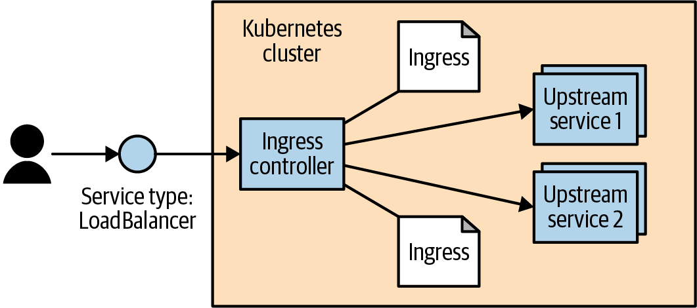

# Chương 8. Cân bằng tải HTTP với Ingress

Một phần quan trọng của bất kỳ ứng dụng nào là đưa lưu lượng mạng đến và đi từ ứng dụng đó. Như đã mô tả trong Chương 7, Kubernetes có một tập khả năng cho phép các service được phơi bày ra ngoài cluster. Với nhiều người dùng và các trường hợp sử dụng đơn giản, những khả năng này là đủ.

Nhưng đối tượng Service hoạt động ở Layer 4 (theo mô hình OSI).[^1] Điều này có nghĩa là nó chỉ chuyển tiếp các kết nối TCP và UDP và không nhìn vào bên trong các kết nối đó. Vì điều này, việc lưu trữ nhiều ứng dụng trên một cluster sử dụng nhiều service được phơi bày khác nhau. Trong trường hợp các service này có `type: NodePort`, bạn sẽ phải để các client kết nối đến một cổng duy nhất cho mỗi service. Trong trường hợp các service này có `type: LoadBalancer`, bạn sẽ phân bổ tài nguyên cloud (thường đắt hoặc khan hiếm) cho mỗi service. Nhưng với các service dựa trên HTTP (Layer 7), chúng ta có thể làm tốt hơn.

Khi giải quyết vấn đề tương tự trong các tình huống không dùng Kubernetes, người dùng thường chuyển sang ý tưởng "virtual hosting". Đây là một cơ chế để lưu trữ nhiều trang HTTP trên một địa chỉ IP duy nhất. Thông thường, người dùng dùng một load balancer hoặc reverse proxy để nhận các kết nối đến trên cổng HTTP (80) và HTTPS (443). Chương trình đó sau đó phân tích kết nối HTTP và, dựa trên header `Host` và đường dẫn URL được yêu cầu, chuyển tiếp lời gọi HTTP đến một chương trình khác. Theo cách này, load balancer hoặc reverse proxy đó điều hướng lưu lượng bằng cách giải mã và chuyển các kết nối đến đến server "upstream" đúng.

Kubernetes gọi hệ thống cân bằng tải dựa trên HTTP của mình là Ingress. Ingress là cách gốc Kubernetes để hiện thực mẫu "virtual hosting" mà chúng ta vừa thảo luận. Một trong những khía cạnh phức tạp hơn của mẫu này là người dùng phải quản lý file cấu hình của load balancer. Trong một môi trường động và khi tập virtual host mở rộng, điều này có thể rất phức tạp. Hệ thống Kubernetes Ingress hoạt động để đơn giản hóa điều này bằng cách (a) chuẩn hóa cấu hình đó, (b) chuyển nó thành một đối tượng Kubernetes tiêu chuẩn, và (c) hợp nhất nhiều đối tượng Ingress thành một cấu hình duy nhất cho load balancer.

Hiện thực phần mềm cơ bản điển hình trông giống như những gì được mô tả trong Hình 8-1. Ingress controller là một hệ thống phần mềm gồm hai phần. Phần thứ nhất là Ingress proxy, được phơi bày ra ngoài cluster bằng một service `type: LoadBalancer`. Proxy này gửi các yêu cầu đến các server "upstream". Thành phần khác là Ingress reconciler, hay operator. Ingress operator chịu trách nhiệm đọc và giám sát các đối tượng Ingress trong Kubernetes API và cấu hình lại Ingress proxy để định tuyến lưu lượng như được chỉ định trong tài nguyên Ingress. Có nhiều hiện thực Ingress khác nhau. Ở một số, hai thành phần này được kết hợp trong một container duy nhất; ở những hiện thực khác, chúng là các thành phần riêng biệt được triển khai riêng trong Kubernetes cluster. Trong Hình 8-1, chúng tôi giới thiệu một ví dụ về Ingress controller.



*Hình 8-1. Cấu hình Ingress controller phần mềm điển hình*

## Đặc tả Ingress so với Ingress Controller

Mặc dù đơn giản về khái niệm, ở mức hiện thực, Ingress rất khác với hầu hết mọi đối tượng tài nguyên thông thường khác trong Kubernetes. Cụ thể, nó được tách thành một đặc tả tài nguyên chung và một hiện thực controller. Không có Ingress controller "tiêu chuẩn" nào được tích hợp sẵn trong Kubernetes, nên người dùng phải cài đặt một trong nhiều hiện thực tùy chọn.

Người dùng có thể tạo và sửa đổi các đối tượng Ingress giống như mọi đối tượng khác. Nhưng, theo mặc định, không có code nào đang chạy để thực sự hành động trên các đối tượng đó. Việc cài đặt và quản lý một controller bên ngoài là tùy thuộc vào người dùng (hoặc bản phân phối họ đang dùng). Theo cách này, controller có thể cắm-rút (pluggable).

Có vài lý do khiến Ingress trở nên như vậy. Trước hết, không có một HTTP load balancer duy nhất nào có thể được dùng phổ quát. Ngoài nhiều load balancer phần mềm (cả mã nguồn mở và độc quyền), còn có các khả năng cân bằng tải do nhà cung cấp cloud cung cấp (ví dụ, ELB trên AWS), và các load balancer dựa trên phần cứng. Lý do thứ hai là đối tượng Ingress được thêm vào Kubernetes trước khi bất kỳ khả năng mở rộng phổ biến nào được thêm vào (xem Chương 17). Khi Ingress tiến triển, có khả năng nó sẽ tiến hóa để dùng các cơ chế này.

## Cài đặt Contour

Mặc dù có nhiều Ingress controller sẵn có, cho các ví dụ ở đây, chúng ta dùng một Ingress controller gọi là Contour. Đây là một controller được xây dựng để cấu hình load balancer mã nguồn mở (và là dự án CNCF) gọi là Envoy. Envoy được xây dựng để được cấu hình động thông qua API. Contour Ingress controller lo việc dịch các đối tượng Ingress thành thứ mà Envoy có thể hiểu.

> **LƯU Ý**
>
> Dự án Contour được Heptio tạo ra trong sự hợp tác với các khách hàng thực tế và được dùng trong môi trường production, nhưng giờ là một dự án mã nguồn mở độc lập.

Bạn có thể cài đặt Contour bằng một lời gọi một dòng đơn giản:

```
$ kubectl apply -f https://projectcontour.io/quickstart/contour.yaml
```

Lưu ý rằng điều này yêu cầu được thực thi bởi một người dùng có quyền `cluster-admin`.

Một dòng này hoạt động với hầu hết các cấu hình. Nó tạo một namespace gọi là `projectcontour`. Bên trong namespace đó nó tạo một deployment (với hai replica) và một service hướng ra bên ngoài `type: LoadBalancer`. Ngoài ra, nó thiết lập các quyền đúng thông qua một service account và cài đặt một CustomResourceDefinition (xem Chương 17) cho một số khả năng mở rộng được thảo luận trong "Tương lai của Ingress".

Vì đây là cài đặt toàn cục, bạn cần đảm bảo mình có quyền quản trị rộng trên cluster mà bạn đang cài đặt vào. Sau khi cài đặt, bạn có thể lấy địa chỉ bên ngoài của Contour qua:

```
$ kubectl get -n projectcontour service envoy -o wide
NAME      CLUSTER-IP     EXTERNAL-IP            PORT(S)        ...
contour   10.106.53.14   a477...amazonaws.com   80:30274/TCP   ...
```

Nhìn vào cột `EXTERNAL-IP`. Đây có thể là một địa chỉ IP (với GCP và Azure) hoặc một hostname (với AWS). Các cloud và môi trường khác có thể khác. Nếu Kubernetes cluster của bạn không hỗ trợ service `type: LoadBalancer`, bạn sẽ phải thay đổi YAML cài đặt Contour để dùng `type: NodePort` và định tuyến lưu lượng đến các máy trên cluster thông qua một cơ chế hoạt động trong cấu hình của bạn.

Nếu bạn đang dùng `minikube`, có lẽ bạn sẽ không thấy gì trong `EXTERNAL-IP`. Để khắc phục, bạn cần mở một cửa sổ terminal riêng và chạy `minikube tunnel`. Lệnh này cấu hình các tuyến mạng sao cho bạn có các địa chỉ IP duy nhất được gán cho mọi service `type: LoadBalancer`.

### Cấu hình DNS

Để Ingress hoạt động tốt, bạn cần cấu hình các bản ghi DNS trỏ đến địa chỉ bên ngoài của load balancer. Bạn có thể ánh xạ nhiều hostname đến một endpoint bên ngoài duy nhất và Ingress controller sẽ chuyển các yêu cầu đến service upstream thích hợp dựa trên hostname đó.

Cho chương này, chúng tôi giả định bạn có một tên miền gọi là `example.com`. Bạn cần cấu hình hai bản ghi DNS: `alpaca.example.com` và `bandicoot.example.com`. Nếu bạn có địa chỉ IP cho load balancer bên ngoài, bạn sẽ muốn tạo các bản ghi A. Nếu bạn có hostname, bạn sẽ muốn cấu hình các bản ghi CNAME.

Dự án ExternalDNS là một cluster add-on mà bạn có thể dùng để quản lý các bản ghi DNS cho mình. ExternalDNS giám sát Kubernetes cluster của bạn và đồng bộ hóa các địa chỉ IP của các tài nguyên Kubernetes Service với một nhà cung cấp DNS bên ngoài. ExternalDNS hỗ trợ nhiều nhà cung cấp DNS khác nhau bao gồm các nhà đăng ký tên miền truyền thống cũng như các nhà cung cấp public cloud.

### Cấu hình file hosts cục bộ

Nếu bạn không có tên miền hoặc đang dùng một giải pháp cục bộ như `minikube`, bạn có thể thiết lập cấu hình cục bộ bằng cách chỉnh sửa file */etc/hosts* để thêm một địa chỉ IP. Bạn cần quyền admin/root trên máy trạm của mình. Vị trí của file có thể khác trên nền tảng của bạn, và việc làm nó có hiệu lực có thể yêu cầu các bước bổ sung. Ví dụ, trên Windows file này thường ở *C:\Windows\System32\drivers\etc\hosts*, và với các phiên bản macOS gần đây, bạn cần chạy `sudo killall -HUP mDNSResponder` sau khi thay đổi file.

Chỉnh sửa file để thêm một dòng như sau:

```
<ip-address> alpaca.example.com bandicoot.example.com
```

Với `<ip-address>`, hãy điền địa chỉ IP bên ngoài của Contour. Nếu tất cả những gì bạn có là một hostname (như từ AWS), bạn có thể lấy địa chỉ IP (có thể thay đổi trong tương lai) bằng cách thực thi `host -t a <address>`.

Đừng quên hoàn tác các thay đổi này khi bạn xong việc!

## Sử dụng Ingress

Giờ chúng ta đã có Ingress controller được cấu hình, hãy đưa nó vào thử thách. Đầu tiên, chúng ta sẽ tạo một vài service upstream (đôi khi cũng được gọi là "backend") để thử nghiệm bằng cách thực thi các lệnh sau:

```
$ kubectl create deployment be-default \
  --image=gcr.io/kuar-demo/kuard-amd64:blue \
  --replicas=3 \
  --port=8080
$ kubectl expose deployment be-default
$ kubectl create deployment alpaca \
  --image=gcr.io/kuar-demo/kuard-amd64:green \
  --replicas=3 \
  --port=8080
$ kubectl expose deployment alpaca
$ kubectl create deployment bandicoot \
  --image=gcr.io/kuar-demo/kuard-amd64:purple \
  --replicas=3 \
  --port=8080
$ kubectl expose deployment bandicoot
$ kubectl get services -o wide

NAME         CLUSTER-IP      ... PORT(S)  ... SELECTOR
alpaca       10.115.245.13   ... 8080/TCP ... run=alpaca
bandicoot    10.115.242.3    ... 8080/TCP ... run=bandicoot
be-default   10.115.246.6    ... 8080/TCP ... run=be-default
kubernetes   10.115.240.1    ... 443/TCP  ... <none>
```

### Cách dùng đơn giản nhất

Cách đơn giản nhất để dùng Ingress là để nó chuyển mù quáng mọi thứ nó thấy đến một service upstream. Hỗ trợ cho các lệnh mệnh lệnh để làm việc với Ingress trong `kubectl` là hạn chế, nên chúng ta sẽ bắt đầu với một file YAML (xem Ví dụ 8-1).

*Ví dụ 8-1. simple-ingress.yaml*

```yaml
apiVersion: networking.k8s.io/v1
kind: Ingress
metadata:
  name: simple-ingress
spec:
  defaultBackend:
    service:
      name: alpaca
      port:
        number: 8080
```

Tạo Ingress này bằng `kubectl apply`:

```
$ kubectl apply -f simple-ingress.yaml
ingress.extensions/simple-ingress created
```

Bạn có thể xác minh nó được thiết lập đúng bằng `kubectl get` và `kubectl describe`:

```
$ kubectl get ingress
NAME             HOSTS   ADDRESS   PORTS   AGE
simple-ingress   *                 80      13m

$ kubectl describe ingress simple-ingress
Name:             simple-ingress
Namespace:        default
Address:
Default backend:  alpaca:8080
(172.17.0.6:8080,172.17.0.7:8080,172.17.0.8:8080)
Rules:
  Host  Path  Backends
  ----  ----  --------
  *     *     alpaca:8080 (172.17.0.6:8080,172.17.0.7:8080,172.17.0.8:8080)
Annotations:
  ...
Events:  <none>
```

Điều này thiết lập để bất kỳ yêu cầu HTTP nào đến Ingress controller đều được chuyển tiếp đến service `alpaca`. Giờ bạn có thể truy cập instance `alpaca` của `kuard` trên bất kỳ IP/CNAME thô nào của service; trong trường hợp này, là `alpaca.example.com` hoặc `bandicoot.example.com`. Tại thời điểm này, điều này không thêm nhiều giá trị so với một service `type: LoadBalancer` đơn giản. Các phần sau thử nghiệm với các cấu hình phức tạp hơn.

### Sử dụng Hostname

Mọi thứ bắt đầu thú vị khi chúng ta điều hướng lưu lượng dựa trên các thuộc tính của yêu cầu. Ví dụ phổ biến nhất của điều này là để hệ thống Ingress nhìn vào header HTTP host (được đặt là tên miền DNS trong URL gốc) và điều hướng lưu lượng dựa trên header đó. Hãy thêm một đối tượng Ingress khác để điều hướng lưu lượng đến service `alpaca` cho bất kỳ lưu lượng nào hướng đến `alpaca.example.com` (xem Ví dụ 8-2).

*Ví dụ 8-2. host-ingress.yaml*

```yaml
apiVersion: networking.k8s.io/v1
kind: Ingress
metadata:
  name: host-ingress
spec:
  defaultBackend:
    service:
      name: be-default
      port:
        number: 8080
  rules:
  - host: alpaca.example.com
    http:
      paths:
      - pathType: Prefix
        path: /
        backend:
          service:
            name: alpaca
            port:
              number: 8080
```

Tạo Ingress này bằng `kubectl apply`:

```
$ kubectl apply -f host-ingress.yaml
ingress.extensions/host-ingress created
```

Chúng ta có thể xác minh mọi thứ được thiết lập đúng như sau:

```
$ kubectl get ingress
NAME             HOSTS                ADDRESS   PORTS   AGE
host-ingress     alpaca.example.com             80      54s
simple-ingress   *                              80      13m

$ kubectl describe ingress host-ingress
Name:             host-ingress
Namespace:        default
Address:
Default backend:  be-default:8080 (<none>)
Rules:
  Host                Path  Backends
  ----                ----  --------
  alpaca.example.com
                      /     alpaca:8080 (<none>)
Annotations:
  ...

Events:  <none>
```

Có vài điều gây bối rối ở đây. Thứ nhất, có một tham chiếu đến `default-http-backend`. Đây là một quy ước mà chỉ một số Ingress controller dùng để xử lý các yêu cầu không được xử lý theo bất kỳ cách nào khác. Các controller này gửi những yêu cầu đó đến một service gọi là `default-http-backend` trong namespace `kube-system`. Quy ước này được hiển thị phía client trong `kubectl`. Tiếp theo, không có endpoint nào được liệt kê cho service backend `alpaca`. Đây là một lỗi trong `kubectl` đã được sửa trong Kubernetes v1.14.

Bất kể thế nào, giờ bạn nên có thể truy cập service `alpaca` qua http://alpaca.example.com. Nếu thay vào đó bạn tiếp cận endpoint của service qua các phương thức khác, bạn sẽ nhận được service mặc định.

### Sử dụng Path

Kịch bản thú vị tiếp theo là điều hướng lưu lượng dựa trên không chỉ hostname mà còn cả đường dẫn trong yêu cầu HTTP. Chúng ta có thể làm điều này dễ dàng bằng cách chỉ định một đường dẫn trong mục `paths` (xem Ví dụ 8-3). Trong ví dụ này, chúng ta điều hướng mọi thứ đến http://bandicoot.example.com tới service `bandicoot`, nhưng chúng ta cũng gửi http://bandicoot.example.com/a tới service `alpaca`. Loại kịch bản này có thể được dùng để lưu trữ nhiều service trên các đường dẫn khác nhau của một tên miền duy nhất.

*Ví dụ 8-3. path-ingress.yaml*

```yaml
apiVersion: networking.k8s.io/v1
kind: Ingress
metadata:
  name: path-ingress
spec:
  rules:
  - host: bandicoot.example.com
    http:
      paths:
      - pathType: Prefix
        path: "/"
        backend:
          service:
            name: bandicoot
            port:
              number: 8080
      - pathType: Prefix
        path: "/a/"
        backend:
          service:
            name: alpaca
            port:
              number: 8080
```

Khi có nhiều đường dẫn trên cùng một host được liệt kê trong hệ thống Ingress, tiền tố dài nhất sẽ khớp. Vì vậy, trong ví dụ này, lưu lượng bắt đầu bằng `/a/` được chuyển tiếp đến service `alpaca`, trong khi tất cả lưu lượng khác (bắt đầu bằng `/`) được chuyển đến service `bandicoot`.

Khi các yêu cầu được chuyển tiếp đến service upstream, đường dẫn vẫn không thay đổi. Điều đó có nghĩa là một yêu cầu đến `bandicoot.example.com/a/` xuất hiện tại server upstream được cấu hình cho hostname và đường dẫn yêu cầu đó. Service upstream cần sẵn sàng phục vụ lưu lượng trên đường dẫn con đó. Trong trường hợp này, `kuard` có code đặc biệt để kiểm thử, trong đó nó phản hồi trên đường dẫn gốc (`/`) cùng với một tập đường dẫn con được định nghĩa trước (`/a/`, `/b/` và `/c/`).

## Dọn dẹp

Để dọn dẹp, thực thi các lệnh sau:

```
$ kubectl delete ingress host-ingress path-ingress simple-ingress
$ kubectl delete service alpaca bandicoot be-default
$ kubectl delete deployment alpaca bandicoot be-default
```

## Các chủ đề nâng cao về Ingress và những điều cần lưu ý

Ingress hỗ trợ một số tính năng hoa mỹ khác. Mức độ hỗ trợ cho các tính năng này khác nhau tùy theo hiện thực Ingress controller, và hai controller có thể hiện thực một tính năng theo những cách hơi khác nhau.

Nhiều tính năng mở rộng được phơi bày thông qua annotation trên đối tượng Ingress. Hãy cẩn thận; những annotation này có thể khó xác thực và dễ sai. Nhiều annotation trong số này áp dụng cho toàn bộ đối tượng Ingress và do đó có thể tổng quát hơn bạn mong muốn. Để thu hẹp phạm vi các annotation, bạn luôn có thể tách một đối tượng Ingress thành nhiều đối tượng Ingress. Ingress controller sẽ đọc chúng và hợp nhất lại với nhau.

### Chạy nhiều Ingress Controller

Có nhiều hiện thực Ingress controller, và bạn có thể muốn chạy nhiều Ingress controller trên một cluster duy nhất. Để giải quyết trường hợp này, tài nguyên IngressClass tồn tại để một tài nguyên Ingress có thể yêu cầu một hiện thực cụ thể. Khi bạn tạo một tài nguyên Ingress, bạn dùng trường `spec.ingressClassName` để chỉ định tài nguyên Ingress cụ thể.

> **LƯU Ý**
>
> Trong Kubernetes trước phiên bản 1.18, trường `IngressClassName` chưa tồn tại và annotation `kubernetes.io/ingress.class` được dùng thay thế. Mặc dù điều này vẫn được nhiều controller hỗ trợ, khuyến nghị mọi người chuyển khỏi annotation này vì nó có khả năng bị các controller loại bỏ trong tương lai.

Nếu annotation `spec.ingressClassName` bị thiếu, một Ingress controller mặc định được dùng. Nó được chỉ định bằng cách thêm annotation `ingressclass.kubernetes.io/is-default-class` vào tài nguyên IngressClass đúng.

### Nhiều đối tượng Ingress

Nếu bạn chỉ định nhiều đối tượng Ingress, các Ingress controller nên đọc tất cả và cố hợp nhất chúng thành một cấu hình nhất quán. Tuy nhiên, nếu bạn chỉ định các cấu hình trùng lặp và xung đột, hành vi là không xác định. Có khả năng các Ingress controller khác nhau sẽ hành xử khác nhau. Ngay cả một hiện thực duy nhất cũng có thể làm những việc khác nhau tùy vào các yếu tố không rõ ràng.

### Ingress và Namespace

Ingress tương tác với namespace theo một số cách không rõ ràng. Thứ nhất, do sự thận trọng về bảo mật, một đối tượng Ingress chỉ có thể tham chiếu đến một service upstream trong cùng namespace. Điều này có nghĩa là bạn không thể dùng một đối tượng Ingress để trỏ một đường dẫn con đến một service trong namespace khác.

Tuy nhiên, nhiều đối tượng Ingress trong các namespace khác nhau có thể chỉ định các đường dẫn con cho cùng một host. Các đối tượng Ingress này sau đó được hợp nhất để đưa ra cấu hình cuối cùng cho Ingress controller.

Hành vi xuyên namespace này có nghĩa là việc phối hợp Ingress toàn cục trên cluster là cần thiết. Nếu không được phối hợp cẩn thận, một đối tượng Ingress trong một namespace có thể gây ra vấn đề (và hành vi không xác định) trong các namespace khác.

Thường không có hạn chế nào được tích hợp trong Ingress controller về việc namespace nào được phép chỉ định hostname và đường dẫn nào. Người dùng nâng cao có thể thử thực thi một chính sách cho điều này bằng một admission controller tùy chỉnh. Cũng có những tiến hóa của Ingress được mô tả trong "Tương lai của Ingress" giải quyết vấn đề này.

### Ghi lại đường dẫn (Path Rewriting)

Một số hiện thực Ingress controller hỗ trợ, tùy chọn, việc ghi lại đường dẫn. Điều này có thể được dùng để sửa đổi đường dẫn trong yêu cầu HTTP khi nó được chuyển tiếp. Điều này thường được chỉ định bằng một annotation trên đối tượng Ingress và áp dụng cho tất cả các yêu cầu được chỉ định bởi đối tượng đó. Ví dụ, nếu chúng ta dùng NGINX Ingress controller, chúng ta có thể chỉ định một annotation `nginx.ingress.kubernetes.io/rewrite-target: /`. Điều này đôi khi có thể làm các service upstream hoạt động trên một đường dẫn con ngay cả khi chúng không được xây dựng để làm vậy.

Có nhiều hiện thực không chỉ hiện thực việc ghi lại đường dẫn mà còn hỗ trợ biểu thức chính quy (regular expression) khi chỉ định đường dẫn. Ví dụ, NGINX controller cho phép biểu thức chính quy bắt các phần của đường dẫn rồi dùng nội dung đã bắt được khi ghi lại. Cách thực hiện điều này (và biến thể biểu thức chính quy nào được dùng) là đặc thù cho từng hiện thực.

Tuy nhiên, ghi lại đường dẫn không phải là viên đạn bạc, và thường có thể dẫn đến lỗi. Nhiều ứng dụng web giả định rằng chúng có thể liên kết nội bộ bằng đường dẫn tuyệt đối. Trong trường hợp đó, ứng dụng đang nói đến có thể được lưu trữ trên `/subpath` nhưng các yêu cầu đến nó lại xuất hiện trên `/`. Nó sau đó có thể gửi người dùng đến `/app-path`. Khi đó có câu hỏi liệu đó là một liên kết "nội bộ" của ứng dụng (trong trường hợp đó nó nên là `/subpath/app-path`) hay là một liên kết đến ứng dụng khác. Vì lý do này, có lẽ tốt nhất là tránh dùng đường dẫn con cho bất kỳ ứng dụng phức tạp nào nếu bạn có thể.

### Phục vụ TLS

Khi phục vụ website, việc làm điều đó một cách an toàn bằng TLS và HTTPS ngày càng trở nên cần thiết. Ingress hỗ trợ điều này (cũng như hầu hết các Ingress controller).

Đầu tiên, người dùng cần chỉ định một Secret với chứng chỉ và khóa TLS của họ, giống như những gì được phác thảo trong Ví dụ 8-4. Bạn cũng có thể tạo một Secret theo kiểu mệnh lệnh với `kubectl create secret tls <secret-name> --cert <certificate-pem-file> --key <private-key-pem-file>`.

*Ví dụ 8-4. tls-secret.yaml*

```yaml
apiVersion: v1
kind: Secret
metadata:
  creationTimestamp: null
  name: tls-secret-name
type: kubernetes.io/tls
data:
  tls.crt: <base64 encoded certificate>
  tls.key: <base64 encoded private key>
```

Một khi bạn đã tải chứng chỉ lên, bạn có thể tham chiếu nó trong một đối tượng Ingress. Điều này chỉ định một danh sách các chứng chỉ cùng với các hostname mà các chứng chỉ đó nên được dùng cho (xem Ví dụ 8-5). Một lần nữa, nếu nhiều đối tượng Ingress chỉ định chứng chỉ cho cùng một hostname, hành vi là không xác định.

*Ví dụ 8-5. tls-ingress.yaml*

```yaml
apiVersion: networking.k8s.io/v1
kind: Ingress
metadata:
  name: tls-ingress
spec:
  tls:
  - hosts:
    - alpaca.example.com
    secretName: tls-secret-name
  rules:
  - host: alpaca.example.com
    http:
      paths:
      - backend:
          serviceName: alpaca
          servicePort: 8080
```

Tải lên và quản lý các TLS secret có thể khó. Ngoài ra, chứng chỉ thường có thể có chi phí đáng kể. Để giúp giải quyết vấn đề này, có một tổ chức phi lợi nhuận gọi là "Let's Encrypt" vận hành một Certificate Authority miễn phí được điều khiển bằng API. Vì nó được điều khiển bằng API, có thể thiết lập một Kubernetes cluster tự động lấy và cài đặt chứng chỉ TLS cho bạn. Việc thiết lập có thể khó, nhưng khi hoạt động, nó rất đơn giản để sử dụng. Mảnh ghép còn thiếu là một dự án mã nguồn mở gọi là cert-manager do Jetstack, một startup ở Anh, tạo ra và đã được đưa vào CNCF. Website cert-manager.io hoặc GitHub repository có chi tiết về cách cài đặt cert-manager và bắt đầu.

## Các hiện thực Ingress thay thế

Có nhiều hiện thực Ingress controller khác nhau, mỗi cái xây dựng trên đối tượng Ingress cơ sở với các tính năng độc đáo. Đây là một hệ sinh thái sôi động.

Thứ nhất, mỗi nhà cung cấp cloud có một hiện thực Ingress phơi bày L7 load balancer đặc thù trên cloud của họ. Thay vì cấu hình một load balancer phần mềm chạy trong Pod, các controller này lấy các đối tượng Ingress và dùng chúng để cấu hình, thông qua API, các load balancer trên cloud. Điều này giảm tải cho cluster và gánh nặng quản lý cho người vận hành, nhưng thường có thể đi kèm chi phí.

Ingress controller tổng quát phổ biến nhất có lẽ là NGINX Ingress controller mã nguồn mở. Hãy lưu ý rằng cũng có một controller thương mại dựa trên NGINX Plus độc quyền. Controller mã nguồn mở về cơ bản đọc các đối tượng Ingress và hợp nhất chúng thành một file cấu hình NGINX. Sau đó nó báo hiệu cho tiến trình NGINX khởi động lại với cấu hình mới (trong khi phục vụ có trách nhiệm các kết nối đang diễn ra). NGINX controller mã nguồn mở có một lượng khổng lồ các tính năng và tùy chọn được phơi bày thông qua annotation.

Emissary và Gloo là hai Ingress controller khác dựa trên Envoy tập trung vào việc trở thành API gateway.

Traefik là một reverse proxy được hiện thực bằng Go cũng có thể hoạt động như một Ingress controller. Nó có một tập tính năng và dashboard rất thân thiện với nhà phát triển.

Đây chỉ là bề nổi. Hệ sinh thái Ingress rất năng động, và có nhiều dự án mới và sản phẩm thương mại xây dựng trên đối tượng Ingress khiêm tốn theo những cách độc đáo.

## Tương lai của Ingress

Như bạn đã thấy, đối tượng Ingress cung cấp một trừu tượng hóa rất hữu ích để cấu hình các L7 load balancer, nhưng nó chưa mở rộng đến tất cả các tính năng mà người dùng muốn và các hiện thực khác nhau đang tìm cách cung cấp. Nhiều tính năng trong Ingress được định nghĩa chưa đầy đủ. Các hiện thực có thể hiển thị các tính năng này theo những cách khác nhau, làm giảm tính di động của cấu hình giữa các hiện thực.

Một vấn đề khác là dễ cấu hình sai Ingress. Cách nhiều đối tượng kết hợp mở ra cánh cửa cho các xung đột được giải quyết khác nhau bởi các hiện thực khác nhau. Ngoài ra, cách chúng được hợp nhất xuyên namespace phá vỡ ý tưởng cô lập namespace.

Ingress cũng được tạo ra trước khi ý tưởng về service mesh (được minh họa bởi các dự án như Istio và Linkerd) được biết đến rộng rãi. Giao điểm giữa Ingress và service mesh vẫn đang được định nghĩa. Service mesh được đề cập chi tiết hơn trong Chương 15.

Tương lai của cân bằng tải HTTP cho Kubernetes có vẻ là Gateway API, đang trong quá trình phát triển bởi nhóm lợi ích đặc biệt (SIG) của Kubernetes dành cho mạng. Dự án Gateway API nhằm phát triển một API hiện đại hơn cho định tuyến trong Kubernetes. Mặc dù tập trung hơn vào cân bằng HTTP, Gateway cũng bao gồm các tài nguyên để kiểm soát cân bằng Layer 4 (TCP). Gateway API vẫn đang trong quá trình phát triển mạnh, nên rất khuyến nghị mọi người gắn bó với các tài nguyên Ingress và Service hiện có trong Kubernetes. Trạng thái hiện tại của Gateway API có thể tìm thấy trên mạng.

## Tóm tắt

Ingress là một hệ thống độc đáo trong Kubernetes. Nó đơn giản chỉ là một schema, và các hiện thực của controller cho schema đó phải được cài đặt và quản lý riêng. Nhưng nó cũng là một hệ thống quan trọng để phơi bày các service cho người dùng một cách thực tế và tiết kiệm chi phí. Khi Kubernetes tiếp tục trưởng thành, hãy kỳ vọng thấy Ingress ngày càng trở nên quan trọng hơn.

---

[^1]: Mô hình Open Systems Interconnection (OSI) là một cách tiêu chuẩn để mô tả cách các tầng mạng khác nhau xây dựng trên nhau. TCP và UDP được coi là Layer 4, trong khi HTTP là Layer 7.
