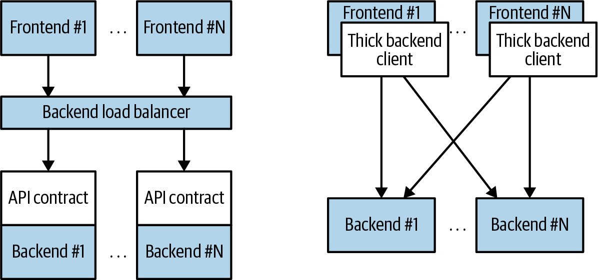
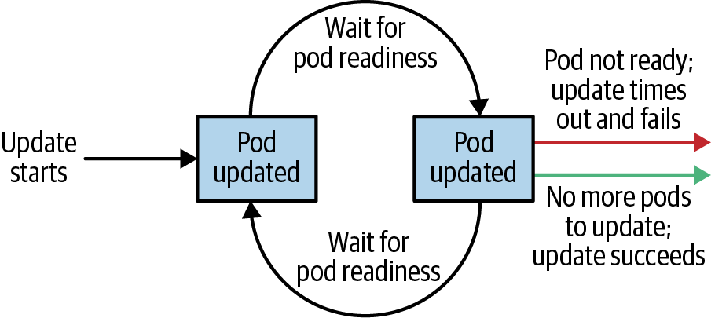

# Chương 10. Deployment

Cho đến giờ, bạn đã thấy cách đóng gói ứng dụng dưới dạng container, tạo các tập container được nhân bản, và dùng Ingress controller để cân bằng tải lưu lượng đến các service của mình. Bạn có thể dùng tất cả các đối tượng này (Pod, ReplicaSet và Service) để xây dựng một instance duy nhất của ứng dụng. Tuy nhiên, chúng giúp rất ít trong việc quản lý nhịp độ phát hành phiên bản mới của ứng dụng hằng ngày hoặc hằng tuần. Thực tế, cả Pod và ReplicaSet đều được kỳ vọng gắn với các container image cụ thể không thay đổi.

Đối tượng Deployment tồn tại để quản lý việc phát hành các phiên bản mới. Deployment đại diện cho các ứng dụng đã triển khai theo cách vượt lên trên bất kỳ phiên bản cụ thể nào. Ngoài ra, Deployment cho phép bạn dễ dàng chuyển từ một phiên bản code sang phiên bản tiếp theo. Quy trình "rollout" này có thể được chỉ định và cẩn trọng. Nó chờ một khoảng thời gian do người dùng cấu hình giữa việc nâng cấp từng Pod riêng lẻ. Nó cũng dùng kiểm tra sức khỏe để đảm bảo phiên bản mới của ứng dụng đang hoạt động đúng và dừng việc triển khai nếu xảy ra quá nhiều lỗi.

Sử dụng Deployment, bạn có thể phát hành các phiên bản phần mềm mới một cách đơn giản và đáng tin cậy mà không có thời gian ngừng hoạt động hay lỗi. Cơ chế thực sự của việc phát hành phần mềm do Deployment thực hiện được kiểm soát bởi một Deployment controller chạy trong chính Kubernetes cluster. Điều này có nghĩa là bạn có thể để một Deployment tiến hành mà không cần giám sát và nó vẫn sẽ hoạt động đúng và an toàn. Điều này làm cho việc tích hợp Deployment với nhiều công cụ và dịch vụ continuous delivery trở nên dễ dàng. Hơn nữa, chạy phía server làm cho việc thực hiện rollout từ những nơi có kết nối internet kém hoặc không ổn định trở nên an toàn. Hãy tưởng tượng phát hành một phiên bản mới của phần mềm từ điện thoại của bạn trong khi đi tàu điện ngầm. Deployment làm điều này trở nên khả thi và an toàn!

> **LƯU Ý**
>
> Khi Kubernetes lần đầu được phát hành, một trong những màn trình diễn sức mạnh phổ biến nhất của nó là "rolling update", cho thấy cách bạn có thể dùng một lệnh duy nhất để cập nhật liền mạch một ứng dụng đang chạy mà không có thời gian ngừng hoạt động và không mất yêu cầu nào. Bản demo gốc này dựa trên lệnh `kubectl rolling-update`, vẫn có sẵn trong công cụ dòng lệnh, mặc dù chức năng của nó phần lớn đã được thay thế bởi đối tượng Deployment.

## Deployment đầu tiên của bạn

Giống như tất cả các đối tượng trong Kubernetes, một Deployment có thể được biểu diễn dưới dạng một đối tượng YAML khai báo cung cấp chi tiết về những gì bạn muốn chạy. Trong trường hợp sau, Deployment đang yêu cầu một instance duy nhất của ứng dụng `kuard`:

```yaml
apiVersion: apps/v1
kind: Deployment
metadata:
  name: kuard
  labels:
    run: kuard
spec:
  selector:
    matchLabels:
      run: kuard
  replicas: 1
  template:
    metadata:
      labels:
        run: kuard
    spec:
      containers:
      - name: kuard
        image: gcr.io/kuar-demo/kuard-amd64:blue
```

Lưu file YAML này thành *kuard-deployment.yaml*, sau đó bạn có thể tạo nó bằng:

```
$ kubectl create -f kuard-deployment.yaml
```

Hãy khám phá cách Deployment thực sự hoạt động. Giống như chúng ta đã học rằng ReplicaSet quản lý Pod, Deployment quản lý ReplicaSet. Như với tất cả các mối quan hệ trong Kubernetes, mối quan hệ này được định nghĩa bởi label và label selector. Bạn có thể thấy label selector bằng cách xem đối tượng Deployment:

```
$ kubectl get deployments kuard \
  -o jsonpath --template {.spec.selector.matchLabels}

{"run":"kuard"}
```

Từ đây bạn có thể thấy Deployment đang quản lý một ReplicaSet với label `run=kuard`. Bạn có thể dùng điều này trong một truy vấn label selector trên các ReplicaSet để tìm ReplicaSet cụ thể đó:

```
$ kubectl get replicasets --selector=run=kuard

NAME               DESIRED   CURRENT   READY   AGE
kuard-1128242161   1         1         1       13m
```

Giờ hãy xem mối quan hệ giữa Deployment và ReplicaSet trong thực tế. Chúng ta có thể thay đổi kích cỡ Deployment bằng lệnh `scale` mệnh lệnh:

```
$ kubectl scale deployments kuard --replicas=2

deployment.apps/kuard scaled
```

Giờ nếu chúng ta liệt kê ReplicaSet đó lần nữa, chúng ta sẽ thấy:

```
$ kubectl get replicasets --selector=run=kuard

NAME               DESIRED   CURRENT   READY   AGE
kuard-1128242161   2         2         2       13m
```

Mở rộng Deployment cũng đã mở rộng ReplicaSet mà nó kiểm soát.

Giờ hãy thử điều ngược lại, mở rộng ReplicaSet:

```
$ kubectl scale replicasets kuard-1128242161 --replicas=1

replicaset.apps/kuard-1128242161 scaled
```

Giờ lấy ReplicaSet đó lần nữa:

```
$ kubectl get replicasets --selector=run=kuard

NAME               DESIRED   CURRENT   READY   AGE
kuard-1128242161   2         2         2       13m
```

Thật kỳ lạ. Mặc dù đã thu nhỏ ReplicaSet về một replica, nó vẫn có hai replica làm trạng thái mong muốn. Điều gì đang xảy ra?

Hãy nhớ rằng Kubernetes là một hệ thống trực tuyến, tự phục hồi. Đối tượng Deployment cấp cao nhất đang quản lý ReplicaSet này. Khi bạn điều chỉnh số replica về một, nó không còn khớp với trạng thái mong muốn của Deployment, vốn có `replicas` được đặt là `2`. Deployment controller nhận thấy điều này và hành động để đảm bảo trạng thái quan sát khớp với trạng thái mong muốn, trong trường hợp này là điều chỉnh lại số replica về hai.

Nếu bạn muốn quản lý ReplicaSet đó trực tiếp, bạn cần xóa Deployment. (Hãy nhớ đặt `--cascade` thành `false`, nếu không nó sẽ xóa cả ReplicaSet và Pod!)

## Tạo Deployment

Dĩ nhiên, như đã nêu trong phần giới thiệu, bạn nên ưu tiên quản lý các cấu hình Kubernetes theo kiểu khai báo. Điều này có nghĩa là duy trì trạng thái của các Deployment trong các file YAML hoặc JSON trên đĩa.

Để bắt đầu, tải Deployment này về một file YAML:

```
$ kubectl get deployments kuard -o yaml > kuard-deployment.yaml
$ kubectl replace -f kuard-deployment.yaml --save-config
```

Nếu bạn nhìn vào file, bạn sẽ thấy thứ gì đó như thế này (lưu ý rằng chúng tôi đã loại bỏ nhiều trường chỉ đọc và mặc định để dễ đọc). Hãy chú ý đến các trường annotations, selector và strategy vì chúng cung cấp hiểu biết về chức năng đặc thù của Deployment:

```yaml
apiVersion: apps/v1
kind: Deployment
metadata:
  annotations:
    deployment.kubernetes.io/revision: "1"
  creationTimestamp: null
  generation: 1
  labels:
    run: kuard
  name: kuard
spec:
  progressDeadlineSeconds: 600
  replicas: 1
  revisionHistoryLimit: 10
  selector:
    matchLabels:
      run: kuard
  strategy:
    rollingUpdate:
      maxSurge: 25%
      maxUnavailable: 25%
    type: RollingUpdate
  template:
    metadata:
      creationTimestamp: null
      labels:
        run: kuard
    spec:
      containers:
      - image: gcr.io/kuar-demo/kuard-amd64:blue
        imagePullPolicy: IfNotPresent
        name: kuard
        resources: {}
        terminationMessagePath: /dev/termination-log
        terminationMessagePolicy: File
      dnsPolicy: ClusterFirst
      restartPolicy: Always
      schedulerName: default-scheduler
      securityContext: {}
      terminationGracePeriodSeconds: 30
status: {}
```

> **LƯU Ý**
>
> Bạn cũng cần chạy `kubectl replace --save-config`. Lệnh này thêm một annotation để khi áp dụng các thay đổi trong tương lai, `kubectl` sẽ biết cấu hình được áp dụng lần cuối là gì để hợp nhất cấu hình thông minh hơn. Nếu bạn luôn dùng `kubectl apply`, bước này chỉ cần thiết sau lần đầu bạn tạo Deployment bằng `kubectl create -f`.

Đặc tả Deployment có cấu trúc rất giống với đặc tả ReplicaSet. Có một Pod template, chứa một số container được tạo cho mỗi replica do Deployment quản lý. Ngoài đặc tả Pod, còn có một đối tượng `strategy`:

```yaml
...
  strategy:
    rollingUpdate:
      maxSurge: 25%
      maxUnavailable: 25%
    type: RollingUpdate
...
```

Đối tượng `strategy` quy định các cách khác nhau mà một đợt phát hành phần mềm mới có thể tiến hành. Có hai chiến lược được Deployment hỗ trợ: `Recreate` và `RollingUpdate`. Chúng được thảo luận chi tiết sau trong chương này.

## Quản lý Deployment

Như với tất cả các đối tượng Kubernetes, bạn có thể lấy thông tin chi tiết về Deployment của mình qua lệnh `kubectl describe`. Lệnh này cung cấp một tổng quan về cấu hình Deployment, bao gồm các trường thú vị như Selector, Replicas và Events:

```
$ kubectl describe deployments kuard

Name:                   kuard
Namespace:              default
CreationTimestamp:      Tue, 01 Jun 2021 21:19:46 -0700
Labels:                 run=kuard
Annotations:            deployment.kubernetes.io/revision: 1
Selector:               run=kuard
Replicas:               1 desired | 1 updated | 1 total | 1 available | 0 unavailable
StrategyType:           RollingUpdate
MinReadySeconds:        0
RollingUpdateStrategy:  25% max unavailable, 25% max surge
Pod Template:
  Labels:  run=kuard
  Containers:
   kuard:
    Image:        gcr.io/kuar-demo/kuard-amd64:blue
    Port:         <none>
    Host Port:    <none>
    Environment:  <none>
    Mounts:       <none>
  Volumes:        <none>
Conditions:
  Type           Status  Reason
  ----           ------  ------
  Available      True    MinimumReplicasAvailable
OldReplicaSets:  <none>
NewReplicaSet:   kuard-6d69d9fc5c (2/2 replicas created)
Events:
  Type    Reason             Age                   From                Message
  ----    ------             ----                  ----                -------
  Normal  ScalingReplicaSet  4m6s                  deployment-con...   ...
  Normal  ScalingReplicaSet  113s (x2 over 3m20s)  deployment-con...   ...
```

Trong kết quả của `describe`, có rất nhiều thông tin quan trọng. Hai trong những mẩu thông tin quan trọng nhất trong kết quả là `OldReplicaSets` và `NewReplicaSet`. Các trường này trỏ đến các đối tượng ReplicaSet mà Deployment này hiện đang quản lý. Nếu một Deployment đang ở giữa một đợt rollout, cả hai trường sẽ được đặt giá trị. Nếu một rollout đã hoàn thành, `OldReplicaSets` sẽ được đặt là `<none>`.

Ngoài lệnh `describe`, còn có lệnh `kubectl rollout` cho Deployment. Chúng ta sẽ đi vào chi tiết hơn về lệnh này sau, nhưng hiện tại, hãy biết rằng bạn có thể dùng `kubectl rollout history` để lấy lịch sử các đợt rollout liên quan đến một Deployment cụ thể. Nếu bạn có một Deployment hiện đang tiến hành, bạn có thể dùng `kubectl rollout status` để lấy trạng thái hiện tại của rollout đó.

## Cập nhật Deployment

Deployment là các đối tượng khai báo mô tả một ứng dụng đã triển khai. Hai thao tác phổ biến nhất trên một Deployment là mở rộng và cập nhật ứng dụng.

### Mở rộng Deployment

Mặc dù trước đó chúng tôi đã cho thấy cách mở rộng Deployment theo kiểu mệnh lệnh bằng lệnh `kubectl scale`, thực hành tốt nhất là quản lý các Deployment của bạn theo kiểu khai báo thông qua các file YAML, rồi dùng các file đó để cập nhật Deployment. Để mở rộng một Deployment, bạn sẽ chỉnh sửa file YAML để tăng số replica:

```yaml
...
spec:
  replicas: 3
...
```

Một khi bạn đã lưu và commit thay đổi này, bạn có thể cập nhật Deployment bằng lệnh `kubectl apply`:

```
$ kubectl apply -f kuard-deployment.yaml
```

Lệnh này sẽ cập nhật trạng thái mong muốn của Deployment, khiến nó tăng kích cỡ của ReplicaSet mà nó quản lý và cuối cùng tạo một Pod mới do Deployment quản lý:

```
$ kubectl get deployments kuard

NAME    READY   UP-TO-DATE   AVAILABLE   AGE
kuard   3/3     3            3           10m
```

### Cập nhật Container Image

Trường hợp sử dụng phổ biến khác cho việc cập nhật Deployment là phát hành một phiên bản mới của phần mềm chạy trong một hoặc nhiều container. Để làm điều này, bạn cũng nên chỉnh sửa file YAML của Deployment, mặc dù trong trường hợp này bạn đang cập nhật container image, thay vì số replica:

```yaml
...
      containers:
      - image: gcr.io/kuar-demo/kuard-amd64:green
        imagePullPolicy: Always
...
```

Gắn annotation cho template của Deployment để ghi lại một số thông tin về bản cập nhật:

```yaml
...
spec:
  ...
  template:
    metadata:
      annotations:
        kubernetes.io/change-cause: "Update to green kuard"
...
```

> **THẬN TRỌNG**
>
> Hãy đảm bảo bạn thêm annotation này vào template chứ không phải chính Deployment, vì lệnh `kubectl apply` dùng trường này trong đối tượng Deployment. Ngoài ra, đừng cập nhật annotation `change-cause` khi thực hiện các thao tác mở rộng đơn giản. Một sửa đổi `change-cause` là một thay đổi đáng kể đối với template và sẽ kích hoạt một đợt rollout mới.

Một lần nữa, bạn có thể dùng `kubectl apply` để cập nhật Deployment:

```
$ kubectl apply -f kuard-deployment.yaml
```

Sau khi bạn cập nhật Deployment, nó sẽ kích hoạt một đợt rollout, mà sau đó bạn có thể theo dõi qua lệnh `kubectl rollout`:

```
$ kubectl rollout status deployments kuard
deployment "kuard" successfully rolled out
```

Bạn có thể thấy các ReplicaSet cũ và mới do Deployment quản lý cùng với các image đang được dùng. Cả ReplicaSet cũ và mới đều được giữ lại trong trường hợp bạn muốn rollback:

```
$ kubectl get replicasets -o wide

NAME               DESIRED   CURRENT   READY   ...   IMAGE(S)
kuard-1128242161   0         0         0       ...   gcr.io/kuar-demo/
kuard-1128635377   3         3         3       ...   gcr.io/kuar-demo/
```

Nếu bạn đang ở giữa một đợt rollout và muốn tạm dừng nó (ví dụ, nếu bạn bắt đầu thấy hành vi kỳ lạ trong hệ thống mà bạn muốn điều tra), bạn có thể dùng lệnh `pause`:

```
$ kubectl rollout pause deployments kuard
deployment.apps/kuard paused
```

Nếu, sau khi điều tra, bạn tin rằng rollout có thể tiếp tục an toàn, bạn có thể dùng lệnh `resume` để bắt đầu lại từ nơi bạn đã dừng:

```
$ kubectl rollout resume deployments kuard
deployment.apps/kuard resumed
```

### Lịch sử Rollout

Kubernetes Deployment duy trì một lịch sử các đợt rollout, có thể hữu ích cả để hiểu trạng thái trước đó của Deployment và để rollback về một phiên bản cụ thể.

Bạn có thể xem lịch sử Deployment bằng cách chạy:

```
$ kubectl rollout history deployment kuard

deployment.apps/kuard
REVISION  CHANGE-CAUSE
1         <none>
2         Update to green kuard
```

Lịch sử revision được đưa ra theo thứ tự từ cũ nhất đến mới nhất. Một số revision duy nhất được tăng lên cho mỗi đợt rollout mới. Cho đến giờ chúng ta có hai: Deployment ban đầu và bản cập nhật image lên `kuard:green`.

Nếu bạn quan tâm đến chi tiết hơn về một revision cụ thể, bạn có thể thêm cờ `--revision` để xem chi tiết về revision cụ thể đó:

```
$ kubectl rollout history deployment kuard --revision=2

deployment.apps/kuard with revision #2
Pod Template:
  Labels:       pod-template-hash=54b74ddcd4
        run=kuard
  Annotations:  kubernetes.io/change-cause: Update to green kuard
  Containers:
    kuard:
     Image:       gcr.io/kuar-demo/kuard-amd64:green
     Port:        <none>
     Host Port:   <none>
     Environment: <none>
     Mounts:      <none>
   Volumes:       <none>
```

Hãy thực hiện thêm một bản cập nhật cho ví dụ này. Cập nhật phiên bản `kuard` trở lại `blue` bằng cách sửa đổi số phiên bản container và cập nhật annotation `change-cause`. Áp dụng nó với `kubectl apply`. Lịch sử giờ nên có ba mục:

```
$ kubectl rollout history deployment kuard

deployment.apps/kuard
REVISION  CHANGE-CAUSE
1         <none>
2         Update to green kuard
3         Update to blue kuard
```

Giả sử có vấn đề với bản phát hành mới nhất và bạn muốn rollback trong khi điều tra. Bạn có thể đơn giản hoàn tác rollout cuối cùng:

```
$ kubectl rollout undo deployments kuard
deployment.apps/kuard rolled back
```

Lệnh `undo` hoạt động bất kể giai đoạn của rollout. Bạn có thể hoàn tác cả các rollout đã hoàn thành một phần và hoàn thành đầy đủ. Hoàn tác một rollout thực ra chỉ đơn giản là một rollout theo hướng ngược lại (ví dụ từ v2 về v1, thay vì từ v1 lên v2), và tất cả các chính sách kiểm soát chiến lược rollout cũng áp dụng cho chiến lược hoàn tác. Bạn có thể thấy đối tượng Deployment đơn giản điều chỉnh số replica mong muốn trong các ReplicaSet được quản lý:

```
$ kubectl get replicasets -o wide

NAME               DESIRED   CURRENT   READY   ...   IMAGE(S)
kuard-1128242161   0         0         0       ...   gcr.io/kuar-demo/
kuard-1570155864   0         0         0       ...   gcr.io/kuar-demo/
kuard-2738859366   3         3         3       ...   gcr.io/kuar-demo/
```

> **THẬN TRỌNG**
>
> Khi dùng các file khai báo để kiểm soát hệ thống production của bạn, bạn nên, càng nhiều càng tốt, đảm bảo các manifest đã được đưa vào hệ thống quản lý mã nguồn khớp với những gì thực sự đang chạy trong cluster. Khi bạn thực hiện `kubectl rollout undo`, bạn đang cập nhật trạng thái production theo cách không được phản ánh trong hệ thống quản lý mã nguồn.
>
> Một cách thay thế (và có lẽ tốt hơn) để hoàn tác một rollout là revert file YAML của bạn và `kubectl apply` phiên bản trước đó. Theo cách này, "cấu hình được theo dõi thay đổi" của bạn theo sát hơn những gì thực sự đang chạy trong cluster.

Hãy xem lại lịch sử Deployment:

```
$ kubectl rollout history deployment kuard

deployment.apps/kuard
REVISION  CHANGE-CAUSE
1         <none>
3         Update to blue kuard
4         Update to green kuard
```

Revision 2 bị thiếu! Hóa ra khi bạn rollback về một revision trước đó, Deployment đơn giản tái sử dụng template và đánh số lại để nó là revision mới nhất. Cái trước đây là revision 2 giờ là revision 4.

Trước đó chúng ta đã thấy bạn có thể dùng lệnh `kubectl rollout undo` để rollback về phiên bản trước đó của Deployment. Ngoài ra, bạn có thể rollback về một revision cụ thể trong lịch sử bằng cờ `--to-revision`:

```
$ kubectl rollout undo deployments kuard --to-revision=3
deployment.apps/kuard rolled back
$ kubectl rollout history deployment kuard
deployment.apps/kuard
REVISION  CHANGE-CAUSE
1         <none>
4         Update to green kuard
5         Update to blue kuard
```

Một lần nữa, lệnh `undo` đã lấy revision 3, áp dụng nó và đánh số lại thành revision 5.

Chỉ định revision là `0` là cách viết tắt để chỉ định revision trước đó. Theo cách này, `kubectl rollout undo` tương đương với `kubectl rollout undo --to-revision=0`.

Theo mặc định, 10 revision cuối cùng của một Deployment được giữ gắn với chính đối tượng Deployment. Khuyến nghị rằng nếu bạn có các Deployment mà bạn dự định giữ trong thời gian dài, hãy đặt kích cỡ lịch sử tối đa cho lịch sử revision của Deployment. Ví dụ, nếu bạn cập nhật hằng ngày, bạn có thể giới hạn lịch sử revision ở 14, để giữ tối đa hai tuần revision (nếu bạn không dự kiến cần rollback xa hơn hai tuần).

Để thực hiện điều này, dùng thuộc tính `revisionHistoryLimit` trong đặc tả Deployment:

```yaml
...
spec:
  # We do daily rollouts, limit the revision history to two weeks of
  # releases as we don't expect to roll back beyond that.
  revisionHistoryLimit: 14
...
```

## Chiến lược Deployment

Khi đến lúc thay đổi phiên bản phần mềm hiện thực service của bạn, Kubernetes deployment hỗ trợ hai chiến lược rollout khác nhau, `Recreate` và `RollingUpdate`. Hãy xem từng cái một.

### Chiến lược Recreate

Chiến lược `Recreate` là chiến lược đơn giản hơn trong hai chiến lược. Nó đơn giản cập nhật ReplicaSet mà nó quản lý để dùng image mới và chấm dứt tất cả các Pod liên quan đến Deployment. ReplicaSet nhận thấy nó không còn replica nào và tạo lại tất cả các Pod bằng image mới. Một khi các Pod được tạo lại, chúng đang chạy phiên bản mới.

Mặc dù chiến lược này nhanh và đơn giản, nó sẽ dẫn đến thời gian ngừng hoạt động của workload. Vì điều này, chiến lược `Recreate` chỉ nên được dùng cho các Deployment kiểm thử nơi thời gian ngừng dịch vụ là chấp nhận được.

### Chiến lược RollingUpdate

Chiến lược `RollingUpdate` là chiến lược nói chung được ưa chuộng hơn cho bất kỳ service hướng người dùng nào. Mặc dù chậm hơn `Recreate`, nó cũng tinh vi và mạnh mẽ hơn đáng kể. Sử dụng `RollingUpdate`, bạn có thể phát hành một phiên bản mới của service trong khi nó vẫn đang nhận lưu lượng người dùng, mà không có bất kỳ thời gian ngừng hoạt động nào.

Như bạn có thể suy ra từ tên gọi, chiến lược `RollingUpdate` hoạt động bằng cách cập nhật một vài Pod tại một thời điểm, di chuyển tăng dần cho đến khi tất cả các Pod đang chạy phiên bản mới của phần mềm.

#### Quản lý nhiều phiên bản của service

Điều quan trọng là điều này có nghĩa trong một khoảng thời gian, cả phiên bản mới và cũ của service sẽ đều nhận yêu cầu và phục vụ lưu lượng. Điều này có những hàm ý quan trọng đối với cách bạn xây dựng phần mềm. Cụ thể, điều cực kỳ quan trọng là mỗi phiên bản của phần mềm, và mỗi client của nó, có khả năng nói chuyện hoán đổi với cả phiên bản cũ hơn một chút và phiên bản mới hơn một chút của phần mềm.

Hãy xem xét kịch bản sau: bạn đang ở giữa việc phát hành phần mềm frontend; nửa số server của bạn đang chạy phiên bản 1, và nửa còn lại đang chạy phiên bản 2. Một người dùng gửi yêu cầu ban đầu đến service của bạn và tải một thư viện JavaScript phía client hiện thực UI của bạn. Yêu cầu này được phục vụ bởi một server phiên bản 1, và do đó người dùng nhận được thư viện client phiên bản 1. Thư viện client này chạy trong trình duyệt của người dùng và tạo các yêu cầu API tiếp theo đến service của bạn. Các yêu cầu API này tình cờ được định tuyến đến một server phiên bản 2; do đó, phiên bản 1 của thư viện client JavaScript đang nói chuyện với phiên bản 2 của API server. Nếu bạn chưa đảm bảo tính tương thích giữa các phiên bản này, ứng dụng của bạn sẽ không hoạt động đúng.

Thoạt đầu, điều này có vẻ như một gánh nặng thêm. Nhưng thực ra, bạn luôn có vấn đề này; có thể bạn chỉ không nhận ra. Cụ thể, một người dùng có thể gửi yêu cầu tại thời điểm `t` ngay trước khi bạn khởi động một bản cập nhật. Yêu cầu này được phục vụ bởi một server phiên bản 1. Tại `t_1`, bạn cập nhật service lên phiên bản 2. Tại `t_2`, code client phiên bản 1 chạy trên trình duyệt của người dùng chạy và gọi vào một API endpoint đang được vận hành bởi server phiên bản 2. Bất kể bạn cập nhật phần mềm như thế nào, bạn phải duy trì tính tương thích ngược và tiến để có các bản cập nhật đáng tin cậy. Bản chất của chiến lược `RollingUpdate` chỉ đơn giản làm điều đó rõ ràng và tường minh hơn.

Điều này không chỉ áp dụng cho các client JavaScript, nó cũng đúng với các thư viện client được biên dịch vào các service khác gọi đến service của bạn. Chỉ vì bạn đã cập nhật không có nghĩa là họ đã cập nhật thư viện client của họ. Kiểu tương thích ngược này rất quan trọng để tách rời service của bạn khỏi các hệ thống phụ thuộc vào service đó. Nếu bạn không chính thức hóa các API của mình và tách rời bản thân, bạn buộc phải quản lý cẩn thận các đợt rollout của mình cùng với tất cả các hệ thống khác gọi vào service của bạn. Kiểu ràng buộc chặt này làm cho việc tạo ra sự linh hoạt cần thiết để có thể đẩy phần mềm mới mỗi tuần, chưa nói đến mỗi giờ hay mỗi ngày, trở nên cực kỳ khó. Trong kiến trúc tách rời được thể hiện ở Hình 10-1, frontend được cô lập khỏi backend thông qua một hợp đồng API và một load balancer, trong khi ở kiến trúc ràng buộc, một client dày được biên dịch vào frontend được dùng để kết nối trực tiếp đến các backend.



*Hình 10-1. Sơ đồ kiến trúc ứng dụng tách rời (trái) và ràng buộc (phải)*

#### Cấu hình rolling update

`RollingUpdate` là một chiến lược khá tổng quát; nó có thể được dùng để cập nhật nhiều loại ứng dụng trong nhiều môi trường. Do đó, bản thân rolling update khá dễ cấu hình; bạn có thể tinh chỉnh hành vi của nó cho phù hợp với nhu cầu cụ thể của mình. Có hai tham số bạn có thể dùng để tinh chỉnh hành vi rolling update: `maxUnavailable` và `maxSurge`.

Tham số `maxUnavailable` đặt số Pod tối đa có thể không khả dụng trong một rolling update. Nó có thể được đặt là một số tuyệt đối (ví dụ, `3`, nghĩa là tối đa ba Pod có thể không khả dụng) hoặc một phần trăm (ví dụ, `20%`, nghĩa là tối đa 20% số replica mong muốn có thể không khả dụng). Nói chung, dùng phần trăm là cách tiếp cận tốt cho hầu hết các service, vì giá trị được áp dụng đúng bất kể số replica mong muốn trong Deployment. Tuy nhiên, có những lúc bạn có thể muốn dùng số tuyệt đối (ví dụ, giới hạn số Pod không khả dụng tối đa là một).

Về cốt lõi, tham số `maxUnavailable` giúp tinh chỉnh tốc độ tiến hành của rolling update. Ví dụ, nếu bạn đặt `maxUnavailable` là `50%`, thì rolling update sẽ ngay lập tức thu nhỏ ReplicaSet cũ xuống 50% kích cỡ ban đầu. Nếu bạn có bốn replica, nó sẽ thu nhỏ xuống hai replica. Rolling update sau đó sẽ thay thế các Pod đã bị loại bỏ bằng cách mở rộng ReplicaSet mới lên hai replica, tổng cộng bốn replica (hai cũ, hai mới). Sau đó nó sẽ thu nhỏ ReplicaSet cũ xuống không replica, tổng kích cỡ là hai replica mới. Cuối cùng, nó sẽ mở rộng ReplicaSet mới lên bốn replica, hoàn thành rollout. Như vậy, với `maxUnavailable` được đặt là `50%`, rollout hoàn thành trong bốn bước, nhưng có lúc chỉ với 50% năng lực dịch vụ.

Hãy xem xét điều gì xảy ra nếu thay vào đó chúng ta đặt `maxUnavailable` là `25%`. Trong tình huống này, mỗi bước chỉ được thực hiện với một replica tại một thời điểm và do đó cần gấp đôi số bước để rollout hoàn thành, nhưng tính sẵn sàng chỉ giảm xuống tối thiểu 75% trong quá trình rollout. Điều này minh họa cách `maxUnavailable` cho phép chúng ta đánh đổi tốc độ rollout với tính sẵn sàng.

> **LƯU Ý**
>
> Những người tinh ý trong số các bạn sẽ nhận thấy chiến lược `Recreate` giống hệt chiến lược `RollingUpdate` với `maxUnavailable` được đặt là `100%`.

Sử dụng năng lực giảm để đạt được một rollout thành công là hữu ích khi service của bạn có mẫu lưu lượng theo chu kỳ (ví dụ, nếu lưu lượng ít hơn nhiều vào ban đêm) hoặc khi bạn có tài nguyên hạn chế, nên việc mở rộng lớn hơn số replica tối đa hiện tại là không thể.

Tuy nhiên, có những tình huống bạn không muốn giảm xuống dưới 100% năng lực, nhưng bạn sẵn sàng tạm thời dùng thêm tài nguyên để thực hiện rollout. Trong những tình huống này, bạn có thể đặt tham số `maxUnavailable` là `0`, và thay vào đó kiểm soát rollout bằng tham số `maxSurge`. Giống như `maxUnavailable`, `maxSurge` có thể được chỉ định bằng một số cụ thể hoặc một phần trăm.

Tham số `maxSurge` kiểm soát bao nhiêu tài nguyên bổ sung có thể được tạo để đạt được một rollout. Để minh họa cách hoạt động, hãy tưởng tượng một service với 10 replica. Chúng ta đặt `maxUnavailable` là `0` và `maxSurge` là `20%`. Điều đầu tiên rollout sẽ làm là mở rộng ReplicaSet mới thêm 2 replica, tổng cộng 12 (120%) trong service. Sau đó nó sẽ thu nhỏ ReplicaSet cũ xuống 8 replica, tổng cộng 10 (8 cũ, 2 mới) trong service. Quá trình này tiếp tục cho đến khi rollout hoàn thành. Tại bất kỳ thời điểm nào, năng lực của service được đảm bảo ít nhất 100% và tài nguyên bổ sung tối đa được dùng cho rollout bị giới hạn ở thêm 20% tổng tài nguyên.

> **LƯU Ý**
>
> Đặt `maxSurge` là `100%` tương đương với một Deployment blue/green. Deployment controller đầu tiên mở rộng phiên bản mới lên 100% của phiên bản cũ. Một khi phiên bản mới khỏe mạnh, nó ngay lập tức thu nhỏ phiên bản cũ xuống 0%.

### Làm chậm Rollout để đảm bảo sức khỏe Service

Các đợt rollout theo giai đoạn nhằm đảm bảo rollout dẫn đến một service khỏe mạnh, ổn định đang chạy phiên bản phần mềm mới. Để làm điều này, Deployment controller luôn chờ đến khi một Pod báo cáo rằng nó đã sẵn sàng trước khi chuyển sang cập nhật Pod tiếp theo.

> **CẢNH BÁO**
>
> Deployment controller kiểm tra trạng thái của Pod như được xác định bởi các kiểm tra readiness của nó. Kiểm tra readiness là một phần của kiểm tra sức khỏe của Pod, được mô tả chi tiết trong Chương 5. Nếu bạn muốn dùng Deployment để phát hành phần mềm một cách đáng tin cậy, bạn phải chỉ định các kiểm tra sức khỏe readiness cho các container trong Pod của mình. Không có các kiểm tra này, Deployment controller đang chạy mà không biết trạng thái của Pod.

Tuy nhiên, đôi khi việc chỉ nhận thấy một Pod đã trở nên sẵn sàng không cho bạn đủ tự tin rằng Pod thực sự đang hành xử đúng. Một số điều kiện lỗi không xảy ra ngay lập tức. Ví dụ, bạn có thể có một rò rỉ bộ nhớ nghiêm trọng mất vài phút để xuất hiện, hoặc bạn có thể có một lỗi chỉ được kích hoạt bởi 1% tổng số yêu cầu. Trong hầu hết các kịch bản thực tế, bạn muốn chờ một khoảng thời gian để có độ tự tin cao rằng phiên bản mới đang hoạt động đúng trước khi chuyển sang cập nhật Pod tiếp theo.

Với Deployment, thời gian chờ này được định nghĩa bởi tham số `minReadySeconds`:

```yaml
...
spec:
  minReadySeconds: 60
...
```

Đặt `minReadySeconds` là `60` cho biết Deployment phải chờ 60 giây sau khi thấy một Pod trở nên khỏe mạnh trước khi chuyển sang cập nhật Pod tiếp theo.

Ngoài việc chờ một Pod trở nên khỏe mạnh, bạn cũng muốn đặt một timeout giới hạn thời gian hệ thống sẽ chờ. Giả sử, ví dụ, phiên bản mới của service có một lỗi và ngay lập tức bị deadlock. Nó sẽ không bao giờ trở nên sẵn sàng, và khi không có timeout, Deployment controller sẽ làm rollout của bạn bị đình trệ mãi mãi.

Hành vi đúng trong tình huống như vậy là hết thời gian rollout. Điều này đến lượt nó đánh dấu rollout là thất bại. Trạng thái thất bại này có thể được dùng để kích hoạt cảnh báo có thể cho người vận hành biết rằng có vấn đề với rollout.

> **LƯU Ý**
>
> Thoạt nhìn, việc hết thời gian rollout có thể trông như một phức tạp không cần thiết. Tuy nhiên, ngày càng nhiều, những thứ như rollout đang được kích hoạt bởi các hệ thống hoàn toàn tự động với rất ít hoặc không có sự tham gia của con người. Trong tình huống như vậy, hết thời gian trở thành một ngoại lệ quan trọng, có thể kích hoạt rollback tự động của bản phát hành hoặc tạo một ticket/sự kiện kích hoạt sự can thiệp của con người.

Để đặt khoảng thời gian timeout, bạn sẽ dùng tham số Deployment `progressDeadlineSeconds`:

```yaml
...
spec:
  progressDeadlineSeconds: 600
...
```

Ví dụ này đặt thời hạn tiến triển là 10 phút. Nếu bất kỳ giai đoạn cụ thể nào trong rollout không tiến triển trong 10 phút, thì Deployment được đánh dấu là thất bại, và tất cả các nỗ lực đưa Deployment tiến lên bị dừng.

Cần lưu ý rằng timeout này được tính theo tiến triển của Deployment, không phải tổng độ dài của một Deployment. Trong bối cảnh này, tiến triển được định nghĩa là bất kỳ lúc nào Deployment tạo hoặc xóa một Pod. Khi điều đó xảy ra, đồng hồ timeout được đặt lại về không. Hình 10-2 cho thấy vòng đời của Deployment.



*Hình 10-2. Vòng đời của Kubernetes Deployment*

## Xóa Deployment

Nếu bạn muốn xóa một Deployment, bạn có thể làm điều đó bằng lệnh mệnh lệnh:

```
$ kubectl delete deployments kuard
```

Bạn cũng có thể làm điều đó bằng file YAML khai báo bạn đã tạo trước đó:

```
$ kubectl delete -f kuard-deployment.yaml
```

Trong cả hai trường hợp, theo mặc định, xóa một Deployment sẽ xóa toàn bộ service. Điều này có nghĩa là nó sẽ xóa không chỉ Deployment mà còn bất kỳ ReplicaSet nào nó quản lý, cũng như bất kỳ Pod nào các ReplicaSet quản lý. Như với ReplicaSet, nếu đây không phải là hành vi mong muốn, bạn có thể dùng cờ `--cascade=false` để chỉ xóa đối tượng Deployment.

## Giám sát Deployment

Nếu một Deployment không tiến triển sau một khoảng thời gian đã chỉ định, nó sẽ hết thời gian. Khi điều này xảy ra, trạng thái của Deployment sẽ chuyển sang trạng thái thất bại. Trạng thái này có thể được lấy từ mảng `status.conditions`, nơi sẽ có một `Condition` có `Type` là `Progressing` và `Status` là `False`. Một Deployment ở trạng thái như vậy đã thất bại và sẽ không tiến triển thêm. Để đặt thời gian Deployment controller nên chờ trước khi chuyển sang trạng thái này, dùng trường `spec.progressDeadlineSeconds`.

## Tóm tắt

Cuối cùng, mục tiêu chính của Kubernetes là làm cho việc xây dựng và triển khai các hệ thống phân tán đáng tin cậy trở nên dễ dàng với bạn. Điều này có nghĩa là không chỉ khởi tạo ứng dụng một lần, mà còn quản lý việc phát hành theo lịch định kỳ các phiên bản mới của dịch vụ phần mềm đó. Deployment là một mảnh ghép quan trọng của các đợt rollout đáng tin cậy và quản lý rollout cho các service của bạn. Trong chương tiếp theo chúng ta sẽ đề cập đến DaemonSet, đảm bảo chỉ một bản sao duy nhất của một Pod đang chạy trên một tập node trong Kubernetes cluster.
