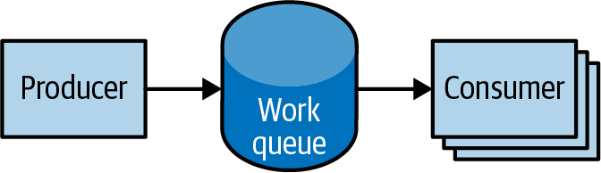

# Chương 12. Job

Cho đến giờ chúng ta đã tập trung vào các tiến trình chạy lâu dài, như cơ sở dữ liệu và ứng dụng web. Những loại workload này chạy cho đến khi chúng được nâng cấp hoặc service không còn cần thiết. Mặc dù các tiến trình chạy lâu dài chiếm phần lớn workload chạy trên Kubernetes cluster, thường có nhu cầu chạy các tác vụ ngắn hạn, một lần. Đối tượng Job được tạo ra để xử lý những loại tác vụ này.

Một Job tạo các Pod chạy cho đến khi kết thúc thành công (ví dụ, thoát với mã 0). Ngược lại, một Pod thông thường sẽ liên tục khởi động lại bất kể mã thoát của nó. Job hữu ích cho những việc bạn chỉ muốn làm một lần, như migration cơ sở dữ liệu hoặc batch job. Nếu chạy như một Pod thông thường, tác vụ migration cơ sở dữ liệu của bạn sẽ chạy trong vòng lặp, liên tục nạp lại cơ sở dữ liệu sau mỗi lần thoát.

Trong chương này, chúng ta sẽ khám phá các mẫu job phổ biến nhất mà Kubernetes cung cấp. Chúng tôi cũng sẽ chỉ cho bạn cách tận dụng các mẫu này trong các kịch bản thực tế.

## Đối tượng Job

Đối tượng Job chịu trách nhiệm tạo và quản lý các Pod được định nghĩa trong một template trong đặc tả job. Những Pod này nói chung chạy cho đến khi hoàn thành thành công. Đối tượng Job phối hợp việc chạy một số Pod song song.

Nếu Pod thất bại trước khi kết thúc thành công, job controller sẽ tạo một Pod mới dựa trên Pod template trong đặc tả job. Vì các Pod phải được lên lịch, có khả năng job của bạn sẽ không thực thi nếu scheduler không tìm được tài nguyên cần thiết. Ngoài ra, do bản chất của hệ thống phân tán, có một khả năng nhỏ là các Pod trùng lặp sẽ được tạo cho một tác vụ cụ thể trong một số kịch bản lỗi nhất định.

## Các mẫu Job

Job được thiết kế để quản lý các workload kiểu batch, trong đó các mục công việc được xử lý bởi một hoặc nhiều Pod. Theo mặc định, mỗi job chạy một Pod duy nhất một lần cho đến khi kết thúc thành công. Mẫu job này được định nghĩa bởi hai thuộc tính chính của một job: số lần hoàn thành job và số Pod chạy song song. Trong trường hợp mẫu "chạy một lần cho đến khi hoàn thành", các tham số `completions` và `parallelism` được đặt là `1`.

Bảng 12-1 nêu bật các mẫu job dựa trên sự kết hợp của `completions` và `parallelism` cho một cấu hình job.

*Bảng 12-1. Các mẫu Job*

| Loại | Trường hợp sử dụng | Hành vi | `completions` | `parallelism` |
|---|---|---|---|---|
| One shot | Migration cơ sở dữ liệu | Một Pod duy nhất chạy một lần cho đến khi kết thúc thành công | 1 | 1 |
| Parallel fixed completions | Nhiều Pod xử lý một tập công việc song song | Một hoặc nhiều Pod chạy một hoặc nhiều lần cho đến khi đạt số lần hoàn thành cố định | 1+ | 1+ |
| Work queue: parallel jobs | Nhiều Pod xử lý từ một hàng đợi công việc tập trung | Một hoặc nhiều Pod chạy một lần cho đến khi kết thúc thành công | 1 | 2+ |

### One Shot

One-shot job cung cấp một cách để chạy một Pod duy nhất một lần cho đến khi kết thúc thành công. Mặc dù điều này có vẻ như một nhiệm vụ dễ dàng, có một số công việc liên quan để thực hiện được. Đầu tiên, một Pod phải được tạo và gửi đến Kubernetes API. Điều này được thực hiện bằng một Pod template được định nghĩa trong cấu hình job. Một khi job đã chạy, Pod đứng sau job phải được giám sát để kết thúc thành công. Một job có thể thất bại vì bất kỳ lý do nào, bao gồm lỗi ứng dụng, một ngoại lệ chưa được bắt trong thời gian chạy, hoặc lỗi node trước khi job có cơ hội hoàn thành. Trong mọi trường hợp, job controller chịu trách nhiệm tạo lại Pod cho đến khi kết thúc thành công xảy ra.

Có nhiều cách để tạo một one-shot job trong Kubernetes. Cách dễ nhất là dùng công cụ dòng lệnh `kubectl`:

```
$ kubectl run -i oneshot \
  --image=gcr.io/kuar-demo/kuard-amd64:blue \
  --restart=OnFailure \
  --command /kuard \
  -- --keygen-enable \
     --keygen-exit-on-complete \
     --keygen-num-to-gen 10

...
(ID 0) Workload starting
(ID 0 1/10) Item done: SHA256:nAsUsG54XoKRkJwyN+OShkUPKew3mwq7OCc
(ID 0 2/10) Item done: SHA256:HVKX1ANns6SgF/er1lyo+ZCdnB8geFGt0/8
(ID 0 3/10) Item done: SHA256:irjCLRov3mTT0P0JfsvUyhKRQ1TdGR8H1jg
(ID 0 4/10) Item done: SHA256:nbQAIVY/yrhmEGk3Ui2sAHuxb/o6mYO0qRk
(ID 0 5/10) Item done: SHA256:CCpBoXNlXOMQvR2v38yqimXGAa/w2Tym+aI
(ID 0 6/10) Item done: SHA256:wEY2TTIDz4ATjcr1iimxavCzZzNjRmbOQp8
(ID 0 7/10) Item done: SHA256:t3JSrCt7sQweBgqG5CrbMoBulwk4lfDWiTI
(ID 0 8/10) Item done: SHA256:E84/Vze7KKyjCh9OZh02MkXJGoty9PhaCec
(ID 0 9/10) Item done: SHA256:UOmYex79qqbI1MhcIfG4hDnGKonlsij2k3s
(ID 0 10/10) Item done: SHA256:WCR8wIGOFag84Bsa8f/9QHuKqF+0mEnCADY
(ID 0) Workload exiting
```

Có một số điều cần lưu ý ở đây:

- Tùy chọn `-i` cho `kubectl` cho biết đây là một lệnh tương tác. `kubectl` sẽ chờ đến khi job đang chạy rồi hiển thị kết quả log từ Pod đầu tiên (và trong trường hợp này là duy nhất) trong job.
- `--restart=OnFailure` là tùy chọn báo cho `kubectl` tạo một đối tượng Job.
- Tất cả các tùy chọn sau `--` là các đối số dòng lệnh cho container image. Chúng chỉ thị test server của chúng ta (`kuard`) tạo mười khóa SSH 4.096-bit rồi thoát.
- Kết quả của bạn có thể không khớp chính xác với điều này. `kubectl` thường bỏ lỡ vài dòng đầu của kết quả với tùy chọn `-i`.

Sau khi job hoàn thành, đối tượng Job và Pod liên quan được giữ lại để bạn có thể kiểm tra kết quả log. Lưu ý rằng job này sẽ không hiển thị trong `kubectl get jobs` trừ khi bạn truyền cờ `-a`. Không có cờ này, `kubectl` ẩn các job đã hoàn thành. Xóa job trước khi tiếp tục:

```
$ kubectl delete pods oneshot
```

Lựa chọn khác để tạo một one-shot job là dùng file cấu hình, như trong Ví dụ 12-1.

*Ví dụ 12-1. job-oneshot.yaml*

```yaml
apiVersion: batch/v1
kind: Job
metadata:
  name: oneshot
spec:
  template:
    spec:
      containers:
      - name: kuard
        image: gcr.io/kuar-demo/kuard-amd64:blue
        imagePullPolicy: Always
        command:
        - "/kuard"
        args:
        - "--keygen-enable"
        - "--keygen-exit-on-complete"
        - "--keygen-num-to-gen=10"
      restartPolicy: OnFailure
```

Gửi job bằng lệnh `kubectl apply`:

```
$ kubectl apply -f job-oneshot.yaml
job.batch/oneshot created
```

Sau đó describe job `oneshot`:

```
$ kubectl describe jobs oneshot

Name:           oneshot
Namespace:      default
Selector:       controller-uid=a2ed65c4-cfda-43c8-bb4a-707c4ed29143
Labels:         controller-uid=a2ed65c4-cfda-43c8-bb4a-707c4ed29143
                job-name=oneshot
Annotations:    <none>
Parallelism:    1
Completions:    1
Start Time:     Wed, 02 Jun 2021 21:23:23 -0700
Completed At:   Wed, 02 Jun 2021 21:23:51 -0700
Duration:       28s
Pods Statuses:  0 Running / 1 Succeeded / 0 Failed
Pod Template:
  Labels:  controller-uid=a2ed65c4-cfda-43c8-bb4a-707c4ed29143
           job-name=oneshot
Events:
  ... Reason            Message
  ... ------            -------
  ... SuccessfulCreate  Created pod: oneshot-4kfdt
```

Bạn có thể xem kết quả của job bằng cách xem log của Pod đã được tạo:

```
$ kubectl logs oneshot-4kfdt

...
Serving on :8080
(ID 0) Workload starting
(ID 0 1/10) Item done: SHA256:+r6b4W81DbEjxMcD3LHjU+EIGnLEzbpxITKn8Iqhk
(ID 0 2/10) Item done: SHA256:mzHewajaY1KA8VluSLOnNMk9fDE5zdn7vvBS5Ne8A
(ID 0 3/10) Item done: SHA256:TRtEQHfflJmwkqnNyGgQm/IvXNykSBIg8c03h0g3o
(ID 0 4/10) Item done: SHA256:tSwPYH/J347il/mgqTxRRdeZcOazEtgZlA8A3/HWb
(ID 0 5/10) Item done: SHA256:IP8XtguJ6GbWwLHqjKecVfdS96B17nnO21I/TNc1j
(ID 0 6/10) Item done: SHA256:ZfNxdQvuST/6ZzEVkyxdRG98p73c/5TM99SEbPeRW
(ID 0 7/10) Item done: SHA256:tH+CNl/IUl/HUuKdMsq2XEmDQ8oAvmhMO6Iwj8ZEO
(ID 0 8/10) Item done: SHA256:3GfsUaALVEHQcGNLBOu4Qd1zqqqJ8j738i5r+I5Xw
(ID 0 9/10) Item done: SHA256:5wV4L/xEiHSJXwLUT2fHf0SCKM2g3XH3sVtNbgskC
(ID 0 10/10) Item done: SHA256:bPqqOonwSbjzLqe9ZuVRmZkz+DBjaNTZ9HwmQhbd
(ID 0) Workload exiting
```

Xin chúc mừng, job của bạn đã chạy thành công!

> **LƯU Ý**
>
> Lưu ý rằng chúng ta đã không chỉ định bất kỳ label nào khi tạo đối tượng Job. Giống như với các controller khác (như DaemonSet, ReplicaSet và Deployment) dùng label để xác định một tập Pod, các hành vi không mong đợi có thể xảy ra nếu một Pod được tái sử dụng giữa các đối tượng.
>
> Vì job có điểm bắt đầu và kết thúc hữu hạn, người dùng thường tạo nhiều job. Điều này làm việc chọn label duy nhất khó hơn và quan trọng hơn. Vì lý do này, đối tượng Job sẽ tự động chọn một label duy nhất và dùng nó để xác định các Pod nó tạo ra. Trong các kịch bản nâng cao (như thay đổi một job đang chạy mà không giết các Pod nó đang quản lý), người dùng có thể chọn tắt hành vi tự động này và chỉ định label và selector thủ công.

Chúng ta vừa thấy cách một job có thể hoàn thành thành công. Nhưng điều gì xảy ra nếu có thứ gì đó thất bại? Hãy thử điều đó và xem điều gì xảy ra. Sửa đổi các đối số cho `kuard` trong file cấu hình để làm nó thất bại với mã thoát khác không sau khi tạo ba khóa, như trong Ví dụ 12-2.

*Ví dụ 12-2. job-oneshot-failure1.yaml*

```yaml
...
spec:
  template:
    spec:
      containers:
        ...
        args:
        - "--keygen-enable"
        - "--keygen-exit-on-complete"
        - "--keygen-exit-code=1"
        - "--keygen-num-to-gen=3"
...
```

Giờ khởi chạy nó với `kubectl apply -f job-oneshot-failure1.yaml`. Để nó chạy một lúc rồi xem trạng thái Pod:

```
$ kubectl get pod -l job-name=oneshot

NAME            READY   STATUS             RESTARTS   AGE
oneshot-3ddk0   0/1     CrashLoopBackOff   4          3m
```

Ở đây chúng ta thấy cùng một Pod đã khởi động lại bốn lần. Kubernetes đang ở trạng thái `CrashLoopBackOff` cho Pod này. Không hiếm khi có một lỗi ở đâu đó làm chương trình sập ngay khi khởi động. Trong trường hợp đó, Kubernetes sẽ chờ một chút trước khi khởi động lại Pod để tránh vòng lặp sập sẽ ăn tài nguyên trên node. Tất cả điều này được xử lý cục bộ trên node bởi `kubelet` mà không có sự tham gia của job.

Giết job (`kubectl delete jobs oneshot`), và hãy thử thứ khác. Sửa đổi file cấu hình lần nữa và thay đổi `restartPolicy` từ `OnFailure` thành `Never`. Khởi chạy nó với `kubectl apply -f jobs-oneshot-failure2.yaml`.

Nếu chúng ta để nó chạy một lúc rồi xem các Pod liên quan, chúng ta sẽ thấy điều thú vị:

```
$ kubectl get pod -l job-name=oneshot -a

NAME            READY   STATUS    RESTARTS   AGE
oneshot-0wm49   0/1     Error     0          1m
oneshot-6h9s2   0/1     Error     0          39s
oneshot-hkzw0   1/1     Running   0          6s
oneshot-k5swz   0/1     Error     0          28s
oneshot-m1rdw   0/1     Error     0          19s
oneshot-x157b   0/1     Error     0          57s
```

Điều chúng ta thấy là có nhiều Pod ở đây đã gặp lỗi. Bằng cách đặt `restartPolicy: Never`, chúng ta đang báo cho `kubelet` không khởi động lại Pod khi thất bại, mà thay vào đó chỉ tuyên bố Pod là thất bại. Đối tượng Job sau đó nhận thấy và tạo một Pod thay thế. Nếu bạn không cẩn thận, điều này sẽ tạo ra nhiều "rác" trong cluster của bạn. Vì lý do này, chúng tôi khuyên bạn dùng `restartPolicy: OnFailure` để các Pod thất bại được chạy lại tại chỗ.

Dọn dẹp bằng `kubectl delete jobs oneshot`.

Cho đến giờ chúng ta đã thấy một chương trình thất bại bằng cách thoát với mã thoát khác không. Nhưng các worker có thể thất bại theo những cách khác. Cụ thể, chúng có thể bị kẹt và không có tiến triển nào. Để giúp xử lý trường hợp này, bạn có thể dùng liveness probe với job. Nếu chính sách liveness probe xác định một Pod đã chết, nó sẽ được khởi động lại hoặc thay thế cho bạn.

### Song song (Parallelism)

Tạo khóa có thể chậm. Hãy khởi động một loạt worker cùng nhau để làm việc tạo khóa nhanh hơn. Chúng ta sẽ dùng kết hợp các tham số `completions` và `parallelism`. Mục tiêu của chúng ta là tạo 100 khóa bằng cách có 10 lần chạy `kuard`, mỗi lần chạy tạo 10 khóa. Nhưng chúng ta không muốn làm ngập cluster, nên chúng ta sẽ giới hạn ở chỉ năm Pod tại một thời điểm.

Điều này tương đương với việc đặt `completions` là `10` và `parallelism` là `5`. Cấu hình được thể hiện trong Ví dụ 12-3.

*Ví dụ 12-3. job-parallel.yaml*

```yaml
apiVersion: batch/v1
kind: Job
metadata:
  name: parallel
  labels:
    chapter: jobs
spec:
  parallelism: 5
  completions: 10
  template:
    metadata:
      labels:
        chapter: jobs
    spec:
      containers:
      - name: kuard
        image: gcr.io/kuar-demo/kuard-amd64:blue
        imagePullPolicy: Always
        command:
        - "/kuard"
        args:
        - "--keygen-enable"
        - "--keygen-exit-on-complete"
        - "--keygen-num-to-gen=10"
      restartPolicy: OnFailure
```

Khởi động nó:

```
$ kubectl apply -f job-parallel.yaml
job.batch/parallel created
```

Giờ hãy xem các Pod khởi động, làm việc của chúng và thoát. Các Pod mới được tạo cho đến khi tổng cộng 10 Pod đã hoàn thành. Ở đây chúng ta dùng cờ `--watch` để `kubectl` giữ kết nối và liệt kê các thay đổi khi chúng xảy ra:

```
$ kubectl get pods -w
NAME             READY   STATUS    RESTARTS   AGE
parallel-55tlv   1/1     Running   0          5s
parallel-5s7s9   1/1     Running   0          5s
parallel-jp7bj   1/1     Running   0          5s
parallel-lssmn   1/1     Running   0          5s
parallel-qxcxp   1/1     Running   0          5s
NAME             READY   STATUS              RESTARTS   AGE
parallel-jp7bj   0/1     Completed           0          26s
parallel-tzp9n   0/1     Pending             0          0s
parallel-tzp9n   0/1     Pending             0          0s
parallel-tzp9n   0/1     ContainerCreating   0          1s
parallel-tzp9n   1/1     Running             0          1s
parallel-tzp9n   0/1     Completed           0          48s
parallel-x1kmr   0/1     Pending             0          0s
...
```

Hãy thoải mái nghiên cứu các job đã hoàn thành và xem log của chúng để thấy dấu vân tay của các khóa chúng đã tạo. Dọn dẹp bằng cách xóa đối tượng Job đã hoàn thành với `kubectl delete job parallel`.

### Hàng đợi công việc (Work Queue)

Một trường hợp sử dụng phổ biến cho job là xử lý công việc từ một hàng đợi công việc. Trong kịch bản này, một tác vụ nào đó tạo ra một số mục công việc và đăng chúng lên một hàng đợi công việc. Một worker job có thể được chạy để xử lý từng mục công việc cho đến khi hàng đợi công việc trống (Hình 12-1).



*Hình 12-1. Các job song song*

#### Khởi động hàng đợi công việc

Chúng ta bắt đầu bằng cách khởi chạy một dịch vụ hàng đợi công việc tập trung. `kuard` có tích hợp sẵn một hệ thống hàng đợi công việc đơn giản dựa trên bộ nhớ. Chúng ta sẽ khởi động một instance của `kuard` để hoạt động như bộ điều phối cho tất cả công việc.

Tiếp theo, chúng ta tạo một ReplicaSet đơn giản để quản lý một daemon hàng đợi công việc singleton. Chúng ta dùng ReplicaSet để đảm bảo một Pod mới sẽ được tạo khi máy gặp lỗi, như trong Ví dụ 12-4.

*Ví dụ 12-4. rs-queue.yaml*

```yaml
apiVersion: apps/v1
kind: ReplicaSet
metadata:
  labels:
    app: work-queue
    component: queue
    chapter: jobs
  name: queue
spec:
  replicas: 1
  selector:
    matchLabels:
      app: work-queue
      component: queue
      chapter: jobs
  template:
    metadata:
      labels:
        app: work-queue
        component: queue
        chapter: jobs
    spec:
      containers:
      - name: queue
        image: "gcr.io/kuar-demo/kuard-amd64:blue"
        imagePullPolicy: Always
```

Chạy hàng đợi công việc bằng lệnh sau:

```
$ kubectl apply -f rs-queue.yaml
replicaset.apps/queue created
```

Tại thời điểm này, daemon hàng đợi công việc nên đang chạy. Hãy dùng port-forwarding để kết nối đến nó. Để lệnh này chạy trong một cửa sổ terminal:

```
$ kubectl port-forward rs/queue 8080:8080
Forwarding from 127.0.0.1:8080 -> 8080
Forwarding from [::1]:8080 -> 8080
```

Bạn có thể mở trình duyệt tới http://localhost:8080 và thấy giao diện `kuard`. Chuyển sang tab "MemQ Server" để theo dõi điều gì đang xảy ra.

Với server hàng đợi công việc đã có, bước tiếp theo là phơi bày nó bằng một service. Điều này sẽ giúp các producer và consumer dễ dàng định vị hàng đợi công việc thông qua DNS, như Ví dụ 12-5 cho thấy.

*Ví dụ 12-5. service-queue.yaml*

```yaml
apiVersion: v1
kind: Service
metadata:
  labels:
    app: work-queue
    component: queue
    chapter: jobs
  name: queue
spec:
  ports:
  - port: 8080
    protocol: TCP
    targetPort: 8080
  selector:
    app: work-queue
    component: queue
```

Tạo service queue bằng `kubectl`:

```
$ kubectl apply -f service-queue.yaml
service/queue created
```

#### Nạp hàng đợi

Giờ chúng ta đã sẵn sàng đưa một loạt mục công việc vào hàng đợi. Để đơn giản, chúng ta sẽ chỉ dùng `curl` để điều khiển API cho server hàng đợi công việc và chèn một loạt mục công việc. `curl` sẽ giao tiếp với hàng đợi công việc thông qua `kubectl port-forward` mà chúng ta đã thiết lập trước đó, như trong Ví dụ 12-6.

*Ví dụ 12-6. load-queue.sh*

```bash
# Create a work queue called 'keygen'
curl -X PUT localhost:8080/memq/server/queues/keygen

# Create 100 work items and load up the queue.
for i in work-item-{0..99}; do
  curl -X POST localhost:8080/memq/server/queues/keygen/enqueue \
    -d "$i"
done
```

Chạy các lệnh này, và bạn sẽ thấy 100 đối tượng JSON được xuất ra terminal với một định danh thông điệp duy nhất cho mỗi mục công việc. Bạn có thể xác nhận trạng thái của hàng đợi bằng cách xem tab "MemQ Server" trong UI, hoặc bạn có thể hỏi trực tiếp API hàng đợi công việc:

```
$ curl 127.0.0.1:8080/memq/server/stats
{
    "kind": "stats",
    "queues": [
        {
            "depth": 100,
            "dequeued": 0,
            "drained": 0,
            "enqueued": 100,
            "name": "keygen"
        }
    ]
}
```

Giờ chúng ta đã sẵn sàng khởi động một job để tiêu thụ hàng đợi công việc cho đến khi nó trống.

#### Tạo consumer job

Đây là nơi mọi thứ trở nên thú vị! `kuard` cũng có thể hoạt động ở chế độ consumer. Chúng ta có thể thiết lập nó để lấy các mục công việc từ hàng đợi công việc, tạo một khóa, rồi thoát khi hàng đợi trống, như trong Ví dụ 12-7.

*Ví dụ 12-7. job-consumers.yaml*

```yaml
apiVersion: batch/v1
kind: Job
metadata:
  labels:
    app: message-queue
    component: consumer
    chapter: jobs
  name: consumers
spec:
  parallelism: 5
  template:
    metadata:
      labels:
        app: message-queue
        component: consumer
        chapter: jobs
    spec:
      containers:
      - name: worker
        image: "gcr.io/kuar-demo/kuard-amd64:blue"
        imagePullPolicy: Always
        command:
        - "/kuard"
        args:
        - "--keygen-enable"
        - "--keygen-exit-on-complete"
        - "--keygen-memq-server=http://queue:8080/memq/server"
        - "--keygen-memq-queue=keygen"
      restartPolicy: OnFailure
```

Ở đây, chúng ta đang báo cho job khởi động năm Pod song song. Vì tham số `completions` không được đặt, chúng ta đưa job vào chế độ worker-pool. Một khi Pod đầu tiên thoát với mã thoát bằng không, job sẽ bắt đầu kết thúc dần và sẽ không khởi động Pod mới nào. Điều này có nghĩa là không worker nào nên thoát cho đến khi công việc hoàn tất và tất cả chúng đều đang trong quá trình kết thúc.

Giờ, tạo job `consumers`:

```
$ kubectl apply -f job-consumers.yaml
job.batch/consumers created
```

Sau đó bạn có thể xem các Pod đứng sau job:

```
$ kubectl get pods
NAME              READY   STATUS    RESTARTS   AGE
queue-43s87       1/1     Running   0          5m
consumers-6wjxc   1/1     Running   0          2m
consumers-7l5mh   1/1     Running   0          2m
consumers-hvz42   1/1     Running   0          2m
consumers-pc8hr   1/1     Running   0          2m
consumers-w20cc   1/1     Running   0          2m
```

Lưu ý có năm Pod đang chạy song song. Những Pod này sẽ tiếp tục chạy cho đến khi hàng đợi công việc trống. Bạn có thể xem điều đó xảy ra trong UI trên server hàng đợi công việc. Khi hàng đợi trống, các consumer Pod sẽ thoát sạch sẽ và job `consumers` sẽ được coi là hoàn thành.

#### Dọn dẹp

Sử dụng label, chúng ta có thể dọn dẹp tất cả những thứ đã tạo trong phần này:

```
$ kubectl delete rs,svc,job -l chapter=jobs
```

## CronJob

Đôi khi bạn muốn lên lịch một job để chạy theo một khoảng thời gian nhất định. Để đạt được điều này, bạn có thể khai báo một CronJob trong Kubernetes, chịu trách nhiệm tạo một đối tượng Job mới theo một khoảng thời gian cụ thể. Ví dụ 12-8 là một ví dụ khai báo CronJob:

*Ví dụ 12-8. job-cronjob.yaml*

```yaml
apiVersion: batch/v1
kind: CronJob
metadata:
  name: example-cron
spec:
  # Run every fifth hour
  schedule: "0 */5 * * *"
  jobTemplate:
    spec:
      template:
        spec:
          containers:
          - name: batch-job
            image: my-batch-image
          restartPolicy: OnFailure
```

Lưu ý trường `spec.schedule`, chứa khoảng thời gian cho CronJob ở định dạng cron tiêu chuẩn.

Bạn có thể lưu file này thành *job-cronjob.yaml*, và tạo CronJob bằng `kubectl create -f cron-job.yaml`. Nếu bạn quan tâm đến trạng thái hiện tại của một CronJob, bạn có thể dùng `kubectl describe <cron-job>` để lấy chi tiết.

## Tóm tắt

Trên một cluster duy nhất, Kubernetes có thể xử lý cả các workload chạy lâu dài như ứng dụng web và các workload ngắn hạn như batch job. Trừu tượng hóa job cho phép bạn mô hình hóa các mẫu batch job từ các tác vụ đơn giản, một lần đến các job song song xử lý nhiều mục cho đến khi công việc đã hết.

Job là một primitive cấp thấp và có thể được dùng trực tiếp cho các workload đơn giản. Tuy nhiên, Kubernetes được xây dựng từ đầu để có thể mở rộng bởi các đối tượng cấp cao hơn. Job không phải là ngoại lệ; các hệ thống điều phối cấp cao hơn có thể dễ dàng dùng chúng để đảm nhận các tác vụ phức tạp hơn.
