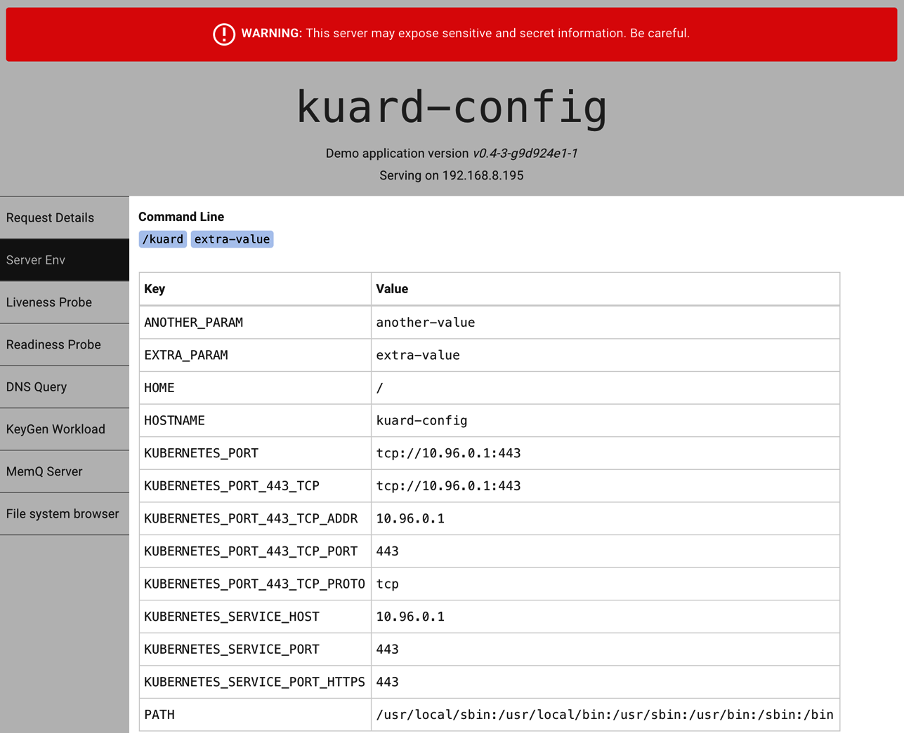
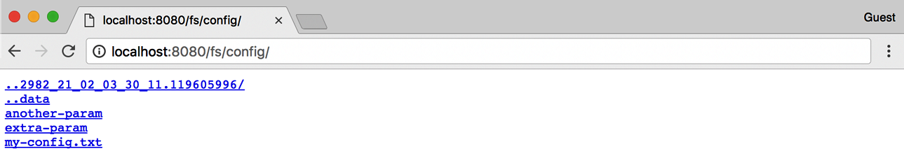

# Chương 13. ConfigMap và Secret

Một thực hành tốt là làm cho các container image có thể tái sử dụng nhiều nhất có thể. Cùng một image nên có thể được dùng cho development, staging và production. Sẽ còn tốt hơn nếu cùng một image đủ tổng quát để được dùng trên nhiều ứng dụng và service. Việc kiểm thử và quản lý phiên bản sẽ rủi ro và phức tạp hơn nếu image cần được tạo lại cho mỗi môi trường mới. Vậy làm sao chúng ta chuyên biệt hóa việc sử dụng image đó tại thời gian chạy?

Đây là lúc ConfigMap và Secret phát huy tác dụng. ConfigMap được dùng để cung cấp thông tin cấu hình cho các workload. Đây có thể là thông tin chi tiết như một chuỗi hoặc một giá trị tổng hợp dưới dạng file. Secret tương tự ConfigMap nhưng tập trung vào việc cung cấp thông tin nhạy cảm cho workload. Chúng có thể được dùng cho những thứ như thông tin xác thực hoặc chứng chỉ TLS.

## ConfigMap

Một cách để nghĩ về ConfigMap là một đối tượng Kubernetes định nghĩa một filesystem nhỏ. Một cách khác là một tập biến có thể được dùng khi định nghĩa môi trường hoặc dòng lệnh cho các container của bạn. Điều then chốt cần lưu ý là ConfigMap được kết hợp với Pod ngay trước khi nó được chạy. Điều này có nghĩa là container image và định nghĩa Pod có thể được tái sử dụng bởi nhiều workload chỉ bằng cách thay đổi ConfigMap được dùng.

### Tạo ConfigMap

Hãy bắt đầu ngay và tạo một ConfigMap. Giống như nhiều đối tượng trong Kubernetes, bạn có thể tạo chúng theo cách trực tiếp, mệnh lệnh, hoặc bạn có thể tạo chúng từ một manifest trên đĩa. Chúng ta sẽ bắt đầu với phương pháp mệnh lệnh.

Đầu tiên, giả sử chúng ta có một file trên đĩa (gọi là *my-config.txt*) mà chúng ta muốn cung cấp cho Pod đang nói đến, như trong Ví dụ 13-1.

*Ví dụ 13-1. my-config.txt*

```
# This is a sample config file that I might use to configure an application
parameter1 = value1
parameter2 = value2
```

Tiếp theo, hãy tạo một ConfigMap với file đó. Chúng ta cũng sẽ thêm vài cặp khóa/giá trị đơn giản ở đây. Chúng được gọi là các giá trị literal trên dòng lệnh:

```
$ kubectl create configmap my-config \
  --from-file=my-config.txt \
  --from-literal=extra-param=extra-value \
  --from-literal=another-param=another-value
```

YAML tương đương cho đối tượng ConfigMap chúng ta vừa tạo như sau:

```
$ kubectl get configmaps my-config -o yaml

apiVersion: v1
data:
  another-param: another-value
  extra-param: extra-value
  my-config.txt: |
    # This is a sample config file that I might use to configure an application
    parameter1 = value1
    parameter2 = value2
kind: ConfigMap
metadata:
  creationTimestamp: ...
  name: my-config
  namespace: default
  resourceVersion: "13556"
  selfLink: /api/v1/namespaces/default/configmaps/my-config
  uid: 3641c553-f7de-11e6-98c9-06135271a273
```

Như bạn có thể thấy, ConfigMap chỉ là một số cặp khóa/giá trị được lưu trong một đối tượng. Phần thú vị là khi bạn thử sử dụng một ConfigMap.

### Sử dụng ConfigMap

Có ba cách chính để sử dụng ConfigMap:

**Filesystem**

Bạn có thể mount một ConfigMap vào Pod. Một file được tạo cho mỗi mục dựa trên tên khóa. Nội dung của file đó được đặt thành giá trị.

**Biến môi trường**

Một ConfigMap có thể được dùng để đặt động giá trị của một biến môi trường.

**Đối số dòng lệnh**

Kubernetes hỗ trợ tạo động dòng lệnh cho container dựa trên các giá trị ConfigMap.

Hãy tạo một manifest cho `kuard` kết hợp tất cả những điều này, như trong Ví dụ 13-2.

*Ví dụ 13-2. kuard-config.yaml*

```yaml
apiVersion: v1
kind: Pod
metadata:
  name: kuard-config
spec:
  containers:
    - name: test-container
      image: gcr.io/kuar-demo/kuard-amd64:blue
      imagePullPolicy: Always
      command:
        - "/kuard"
        - "$(EXTRA_PARAM)"
      env:
        # An example of an environment variable used inside the container
        - name: ANOTHER_PARAM
          valueFrom:
            configMapKeyRef:
              name: my-config
              key: another-param
        # An example of an environment variable passed to the command to start
        # the container (above).
        - name: EXTRA_PARAM
          valueFrom:
            configMapKeyRef:
              name: my-config
              key: extra-param
      volumeMounts:
        # Mounting the ConfigMap as a set of files
        - name: config-volume
          mountPath: /config
  volumes:
    - name: config-volume
      configMap:
        name: my-config
  restartPolicy: Never
```

Với phương pháp filesystem, chúng ta tạo một volume mới bên trong Pod và đặt tên cho nó là `config-volume`. Sau đó chúng ta định nghĩa volume này là một volume ConfigMap và trỏ đến ConfigMap cần mount. Chúng ta phải chỉ định nơi nó được mount vào container `kuard` bằng một `volumeMount`. Trong trường hợp này, chúng ta mount nó tại `/config`.

Biến môi trường được chỉ định bằng một thành phần `valueFrom` đặc biệt. Nó tham chiếu đến ConfigMap và khóa dữ liệu cần dùng trong ConfigMap đó. Đối số dòng lệnh xây dựng trên biến môi trường. Kubernetes sẽ thực hiện thay thế đúng bằng cú pháp đặc biệt `$(<env-var-name>)`.

Chạy Pod này, và hãy port-forward để xem ứng dụng nhìn thế giới như thế nào:

```
$ kubectl apply -f kuard-config.yaml
$ kubectl port-forward kuard-config 8080
```

Giờ trỏ trình duyệt tới http://localhost:8080. Chúng ta có thể xem cách chúng ta đã tiêm các giá trị cấu hình vào chương trình theo cả ba cách. Nhấp vào tab "Server Env" bên trái. Tab này sẽ hiển thị dòng lệnh mà ứng dụng được khởi chạy cùng với môi trường của nó, như trong Hình 13-1.



*Hình 13-1. `kuard` hiển thị môi trường của nó*

Ở đây chúng ta có thể thấy chúng ta đã thêm hai biến môi trường (`ANOTHER_PARAM` và `EXTRA_PARAM`) có giá trị được đặt qua ConfigMap. Chúng ta cũng đã thêm một đối số vào dòng lệnh của `kuard` dựa trên giá trị `EXTRA_PARAM`.

Tiếp theo, nhấp vào tab "File system browser" (Hình 13-2). Tab này cho phép bạn khám phá filesystem như ứng dụng nhìn thấy. Bạn sẽ thấy một mục gọi là `/config`. Đây là một volume được tạo dựa trên ConfigMap của chúng ta. Nếu bạn điều hướng vào đó, bạn sẽ thấy một file đã được tạo cho mỗi mục của ConfigMap. Bạn cũng sẽ thấy một số file ẩn (bắt đầu bằng `..`) được dùng để thực hiện việc hoán đổi sạch các giá trị mới khi ConfigMap được cập nhật.



*Hình 13-2. Thư mục /config nhìn qua `kuard`*

## Secret

Mặc dù ConfigMap rất tốt cho hầu hết dữ liệu cấu hình, có một số dữ liệu đặc biệt nhạy cảm. Chúng bao gồm mật khẩu, token bảo mật, hoặc các loại khóa riêng khác. Gọi chung, chúng tôi gọi loại dữ liệu này là "Secret". Kubernetes có hỗ trợ gốc cho việc lưu trữ và xử lý dữ liệu này một cách cẩn trọng.

Secret cho phép các container image được tạo mà không cần đóng gói dữ liệu nhạy cảm. Điều này cho phép các container vẫn có tính di động giữa các môi trường. Secret được phơi bày cho Pod thông qua khai báo tường minh trong Pod manifest và Kubernetes API. Theo cách này, Kubernetes Secrets API cung cấp một cơ chế lấy ứng dụng làm trung tâm để phơi bày thông tin cấu hình nhạy cảm cho các ứng dụng theo cách dễ kiểm toán và tận dụng các primitive cô lập gốc của OS.

Phần còn lại của mục này sẽ khám phá cách tạo và quản lý Kubernetes Secret, và cũng trình bày các thực hành tốt nhất để phơi bày Secret cho các Pod cần chúng.

> **CẢNH BÁO**
>
> Theo mặc định, Kubernetes Secret được lưu ở dạng văn bản thuần (plain text) trong bộ lưu trữ `etcd` của cluster. Tùy vào yêu cầu của bạn, điều này có thể không đủ bảo mật. Cụ thể, bất kỳ ai có quyền quản trị cluster trong cluster của bạn sẽ có thể đọc tất cả các Secret trong cluster.
>
> Trong các phiên bản Kubernetes gần đây, hỗ trợ đã được thêm vào cho việc mã hóa Secret bằng một khóa do người dùng cung cấp, thường được tích hợp vào một kho khóa trên cloud. Ngoài ra, hầu hết các kho khóa trên cloud có tích hợp với volume Kubernetes Secrets Store CSI Driver, cho phép bạn bỏ qua hoàn toàn Kubernetes Secret và dựa hoàn toàn vào kho khóa của nhà cung cấp cloud. Tất cả các lựa chọn này nên cung cấp cho bạn đủ công cụ để xây dựng một hồ sơ bảo mật phù hợp với nhu cầu của mình.

### Tạo Secret

Secret được tạo bằng Kubernetes API hoặc công cụ dòng lệnh `kubectl`. Secret giữ một hoặc nhiều phần tử dữ liệu dưới dạng một tập các cặp khóa/giá trị.

Trong phần này, chúng ta sẽ tạo một Secret để lưu khóa và chứng chỉ TLS cho ứng dụng `kuard` đáp ứng các yêu cầu lưu trữ đã liệt kê trước đó.

> **LƯU Ý**
>
> Container image `kuard` không đóng gói chứng chỉ hoặc khóa TLS. Điều này cho phép container `kuard` vẫn có tính di động giữa các môi trường và có thể phân phối qua các Docker repository công khai.

Bước đầu tiên trong việc tạo Secret là lấy dữ liệu thô chúng ta muốn lưu. Khóa và chứng chỉ TLS cho ứng dụng `kuard` có thể được tải xuống bằng cách chạy các lệnh sau:

```
$ curl -o kuard.crt https://storage.googleapis.com/kuar-demo/kuard.crt
$ curl -o kuard.key https://storage.googleapis.com/kuar-demo/kuard.key
```

> **CẢNH BÁO**
>
> Các chứng chỉ này được chia sẻ với cả thế giới và chúng không cung cấp bảo mật thực sự. Vui lòng không dùng chúng ngoại trừ như một công cụ học tập trong các ví dụ này.

Với các file *kuard.crt* và *kuard.key* được lưu cục bộ, chúng ta đã sẵn sàng tạo Secret. Tạo một Secret tên `kuard-tls` bằng lệnh `create secret`:

```
$ kubectl create secret generic kuard-tls \
  --from-file=kuard.crt \
  --from-file=kuard.key
```

Secret `kuard-tls` đã được tạo với hai phần tử dữ liệu. Chạy lệnh sau để lấy chi tiết:

```
$ kubectl describe secrets kuard-tls

Name:         kuard-tls
Namespace:    default
Labels:       <none>
Annotations:  <none>

Type:         Opaque

Data
====
kuard.crt:    1050 bytes
kuard.key:    1679 bytes
```

Với Secret `kuard-tls` đã có, chúng ta có thể tiêu thụ nó từ một Pod bằng cách dùng Secrets volume.

### Tiêu thụ Secret

Secret có thể được tiêu thụ bằng Kubernetes REST API bởi các ứng dụng biết cách gọi API đó trực tiếp. Tuy nhiên, mục tiêu của chúng ta là giữ các ứng dụng có tính di động. Chúng không chỉ nên chạy tốt trong Kubernetes, mà còn nên chạy, không cần sửa đổi, trên các nền tảng khác.

Thay vì truy cập Secret thông qua API server, chúng ta có thể dùng Secrets volume. Dữ liệu Secret có thể được phơi bày cho Pod bằng loại volume Secrets. Secrets volume được `kubelet` quản lý và được tạo tại thời điểm tạo Pod. Secret được lưu trên các volume tmpfs (còn gọi là RAM disk), và do đó không được ghi ra đĩa trên các node.

Mỗi phần tử dữ liệu của Secret được lưu trong một file riêng dưới điểm mount đích được chỉ định trong volume mount. Secret `kuard-tls` chứa hai phần tử dữ liệu: *kuard.crt* và *kuard.key*. Mount Secrets volume `kuard-tls` vào `/tls` tạo ra các file sau:

```
/tls/kuard.crt
/tls/kuard.key
```

Pod manifest trong Ví dụ 13-3 minh họa cách khai báo một Secrets volume, phơi bày Secret `kuard-tls` cho container `kuard` dưới `/tls`.

*Ví dụ 13-3. kuard-secret.yaml*

```yaml
apiVersion: v1
kind: Pod
metadata:
  name: kuard-tls
spec:
  containers:
    - name: kuard-tls
      image: gcr.io/kuar-demo/kuard-amd64:blue
      imagePullPolicy: Always
      volumeMounts:
      - name: tls-certs
        mountPath: "/tls"
        readOnly: true
  volumes:
    - name: tls-certs
      secret:
        secretName: kuard-tls
```

Tạo Pod `kuard-tls` bằng `kubectl` và quan sát kết quả log từ Pod đang chạy:

```
$ kubectl apply -f kuard-secret.yaml
```

Kết nối đến Pod bằng cách chạy:

```
$ kubectl port-forward kuard-tls 8443:8443
```

Giờ điều hướng trình duyệt tới https://localhost:8443. Bạn sẽ thấy một số cảnh báo chứng chỉ không hợp lệ vì đây là chứng chỉ tự ký cho *kuard.example.com*. Nếu bạn vượt qua cảnh báo này, bạn sẽ thấy server `kuard` được phục vụ qua HTTPS. Dùng tab "File system browser" để tìm các chứng chỉ trên đĩa trong thư mục */tls*.

### Private Container Registry

Một trường hợp sử dụng đặc biệt cho Secret là lưu thông tin xác thực truy cập cho các private container registry. Kubernetes hỗ trợ dùng các image được lưu trên các private registry, nhưng truy cập vào những image đó yêu cầu thông tin xác thực. Các image riêng tư có thể được lưu trên một hoặc nhiều private registry. Điều này đặt ra thách thức trong việc quản lý thông tin xác thực cho từng private registry trên mọi node khả dĩ trong cluster.

Image pull Secret tận dụng Secrets API để tự động hóa việc phân phối thông tin xác thực private registry. Image pull Secret được lưu giống như các Secret thông thường nhưng được tiêu thụ thông qua trường đặc tả Pod `spec.imagePullSecrets`.

Dùng `kubectl create secret docker-registry` để tạo loại Secret đặc biệt này:

```
$ kubectl create secret docker-registry my-image-pull-secret \
  --docker-username=<username> \
  --docker-password=<password> \
  --docker-email=<email-address>
```

Cho phép truy cập vào private repository bằng cách tham chiếu image pull secret trong file Pod manifest, như trong Ví dụ 13-4.

*Ví dụ 13-4. kuard-secret-ips.yaml*

```yaml
apiVersion: v1
kind: Pod
metadata:
  name: kuard-tls
spec:
  containers:
    - name: kuard-tls
      image: gcr.io/kuar-demo/kuard-amd64:blue
      imagePullPolicy: Always
      volumeMounts:
      - name: tls-certs
        mountPath: "/tls"
        readOnly: true
  imagePullSecrets:
  - name: my-image-pull-secret
  volumes:
    - name: tls-certs
      secret:
        secretName: kuard-tls
```

Nếu bạn liên tục pull từ cùng một registry, bạn có thể thêm các Secret vào service account mặc định liên kết với mỗi Pod để tránh phải chỉ định Secret trong mọi Pod bạn tạo.

## Ràng buộc đặt tên

Tên khóa cho các mục dữ liệu bên trong Secret hoặc ConfigMap được định nghĩa để ánh xạ đến các tên biến môi trường hợp lệ. Chúng có thể bắt đầu bằng một dấu chấm, sau đó theo sau là một chữ cái hoặc số, rồi các ký tự bao gồm dấu chấm, gạch ngang và gạch dưới. Dấu chấm không thể lặp lại, và dấu chấm với gạch dưới hoặc gạch ngang không thể đứng liền nhau. Chính thức hơn, điều này có nghĩa là chúng phải tuân theo biểu thức chính quy `^[.]?[a-zA-Z0-9]([.]?[a-zA-Z0-9]+[-_a-zA-Z0-9]?)*$`. Một số ví dụ về tên hợp lệ và không hợp lệ cho ConfigMap và Secret được đưa ra trong Bảng 13-1.

*Bảng 13-1. Ví dụ khóa ConfigMap và Secret*

| Tên khóa hợp lệ | Tên khóa không hợp lệ |
|---|---|
| `.auth_token` | `Token..properties` |
| `Key.pem` | `auth file.json` |
| `config_file` | `_password.txt` |

> **LƯU Ý**
>
> Khi chọn tên khóa, hãy nhớ rằng các khóa này có thể được phơi bày cho Pod thông qua volume mount. Hãy chọn một tên có ý nghĩa khi được chỉ định trên dòng lệnh hoặc trong file cấu hình. Lưu khóa TLS dưới tên `key.pem` rõ ràng hơn `tls-key` khi cấu hình các ứng dụng truy cập Secret.

Giá trị dữ liệu của ConfigMap là văn bản UTF-8 đơn giản được chỉ định trực tiếp trong manifest. Giá trị dữ liệu của Secret giữ dữ liệu tùy ý được mã hóa bằng base64. Việc dùng mã hóa base64 giúp có thể lưu dữ liệu nhị phân. Tuy nhiên, điều này làm việc quản lý các Secret được lưu trong file YAML khó hơn vì giá trị mã hóa base64 phải được đặt trong YAML. Lưu ý rằng kích cỡ tối đa cho một ConfigMap hoặc Secret là 1 MB.

## Quản lý ConfigMap và Secret

ConfigMap và Secret được quản lý thông qua Kubernetes API. Các lệnh `create`, `delete`, `get` và `describe` thông thường hoạt động để thao tác với các đối tượng này.

### Liệt kê

Bạn có thể dùng lệnh `kubectl get secrets` để liệt kê tất cả các Secret trong namespace hiện tại:

```
$ kubectl get secrets

NAME                  TYPE                                  DATA   AGE
default-token-f5jq2   kubernetes.io/service-account-token   3      1h
kuard-tls             Opaque                                2      20m
```

Tương tự, bạn có thể liệt kê tất cả các ConfigMap trong một namespace:

```
$ kubectl get configmaps

NAME        DATA   AGE
my-config   3      1m
```

`kubectl describe` có thể được dùng để lấy thêm chi tiết về một đối tượng:

```
$ kubectl describe configmap my-config

Name:           my-config
Namespace:      default
Labels:         <none>
Annotations:    <none>

Data
====
another-param:  13 bytes
extra-param:    11 bytes
my-config.txt:  116 bytes
```

Cuối cùng, bạn có thể xem dữ liệu thô (bao gồm cả các giá trị trong Secret!) bằng một lệnh tương tự như sau: `kubectl get configmap my-config -o yaml` hoặc `kubectl get secret kuard-tls -o yaml`.

### Tạo

Cách dễ nhất để tạo Secret hoặc ConfigMap là qua `kubectl create secret generic` hoặc `kubectl create configmap`. Có nhiều cách để chỉ định các mục dữ liệu đưa vào Secret hoặc ConfigMap. Chúng có thể được kết hợp trong một lệnh duy nhất:

**`--from-file=<filename>`**

Tải từ file với khóa dữ liệu Secret giống với tên file.

**`--from-file=<key>=<filename>`**

Tải từ file với khóa dữ liệu Secret được chỉ định tường minh.

**`--from-file=<directory>`**

Tải tất cả các file trong thư mục được chỉ định, trong đó tên file là một tên khóa chấp nhận được.

**`--from-literal=<key>=<value>`**

Dùng trực tiếp cặp khóa/giá trị được chỉ định.

### Cập nhật

Bạn có thể cập nhật một ConfigMap hoặc Secret và để nó được phản ánh trong các ứng dụng đang chạy. Không cần khởi động lại nếu ứng dụng được cấu hình để đọc lại các giá trị cấu hình. Tiếp theo, chúng tôi sẽ mô tả ba cách để cập nhật ConfigMap hoặc Secret.

#### Cập nhật từ file

Nếu bạn có một manifest cho ConfigMap hoặc Secret của mình, bạn có thể chỉnh sửa trực tiếp và thay thế nó bằng phiên bản mới bằng `kubectl replace -f <filename>`. Bạn cũng có thể dùng `kubectl apply -f <filename>` nếu trước đó bạn đã tạo tài nguyên bằng `kubectl apply`.

Do cách các file dữ liệu được mã hóa vào các đối tượng này, việc cập nhật cấu hình có thể hơi cồng kềnh; không có lệnh `kubectl` nào hỗ trợ tải dữ liệu từ file bên ngoài. Dữ liệu phải được lưu trực tiếp trong YAML manifest.

Trường hợp sử dụng phổ biến nhất là khi ConfigMap được định nghĩa như một phần của một thư mục hoặc danh sách tài nguyên và mọi thứ được tạo và cập nhật cùng nhau. Thường thì những manifest này sẽ được đưa vào hệ thống quản lý mã nguồn.

> **CẢNH BÁO**
>
> Nói chung, đưa các file YAML của Secret vào hệ thống quản lý mã nguồn là một ý tưởng tồi vì quá dễ vô tình đẩy những file này lên đâu đó công khai và làm lộ Secret của bạn.

#### Tạo lại và cập nhật

Nếu bạn lưu đầu vào cho ConfigMap hoặc Secret của mình dưới dạng các file riêng trên đĩa (thay vì nhúng trực tiếp vào YAML), bạn có thể dùng `kubectl` để tạo lại manifest rồi dùng nó để cập nhật đối tượng, sẽ trông giống như thế này:

```
$ kubectl create secret generic kuard-tls \
  --from-file=kuard.crt --from-file=kuard.key \
  --dry-run -o yaml | kubectl replace -f -
```

Dòng lệnh này đầu tiên tạo một Secret mới có cùng tên với Secret hiện có của chúng ta. Nếu chúng ta chỉ dừng ở đó, Kubernetes API server sẽ trả về lỗi phàn nàn rằng chúng ta đang cố tạo một Secret đã tồn tại. Thay vào đó, chúng ta báo cho `kubectl` không thực sự gửi dữ liệu đến server mà thay vào đó xuất YAML mà nó sẽ gửi đến API server ra `stdout`. Sau đó chúng ta pipe nó vào `kubectl replace` và dùng `-f -` để báo nó đọc từ `stdin`. Theo cách này, chúng ta có thể cập nhật một Secret từ các file trên đĩa mà không phải mã hóa base64 dữ liệu thủ công.

#### Chỉnh sửa phiên bản hiện tại

Cách cuối cùng để cập nhật một ConfigMap là dùng `kubectl edit` để mở một phiên bản của ConfigMap trong trình soạn thảo của bạn để bạn có thể tinh chỉnh nó (bạn cũng có thể làm điều này với Secret, nhưng bạn sẽ phải tự quản lý việc mã hóa base64 các giá trị):

```
$ kubectl edit configmap my-config
```

Bạn sẽ thấy định nghĩa ConfigMap trong trình soạn thảo. Thực hiện các thay đổi mong muốn rồi lưu và đóng trình soạn thảo. Phiên bản mới của đối tượng sẽ được đẩy lên Kubernetes API server.

#### Cập nhật trực tiếp (Live update)

Một khi ConfigMap hoặc Secret được cập nhật bằng API, nó sẽ được tự động đẩy đến tất cả các volume dùng ConfigMap hoặc Secret đó. Có thể mất vài giây, nhưng danh sách file và nội dung của các file, như `kuard` nhìn thấy, sẽ được cập nhật với các giá trị mới này. Sử dụng tính năng cập nhật trực tiếp này, bạn có thể cập nhật cấu hình của các ứng dụng mà không cần khởi động lại chúng.

Hiện tại không có cách tích hợp sẵn để báo hiệu cho một ứng dụng khi một phiên bản mới của ConfigMap được triển khai. Việc theo dõi các file cấu hình thay đổi và tải lại chúng là tùy thuộc vào ứng dụng (hoặc một script trợ giúp nào đó).

Sử dụng trình duyệt file trong `kuard` (truy cập qua `kubectl port-forward`) là một cách tuyệt vời để tương tác thử nghiệm với việc cập nhật động Secret và ConfigMap.

## Tóm tắt

ConfigMap và Secret là một cách tuyệt vời để cung cấp cấu hình động trong ứng dụng của bạn. Chúng cho phép bạn tạo một container image (và định nghĩa Pod) một lần và tái sử dụng nó trong các bối cảnh khác nhau. Điều này có thể bao gồm việc dùng chính xác cùng một image khi bạn chuyển từ development sang staging rồi production. Nó cũng có thể bao gồm việc dùng một image duy nhất trên nhiều đội và service. Tách cấu hình khỏi code ứng dụng sẽ làm các ứng dụng của bạn đáng tin cậy hơn và có thể tái sử dụng hơn.
