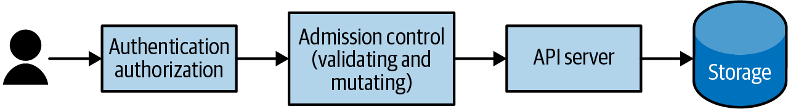
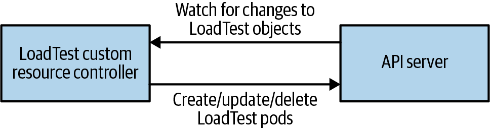

# Chương 17. Mở rộng Kubernetes

Ngay từ đầu, rõ ràng Kubernetes sẽ không chỉ là tập API cốt lõi của nó; một khi một ứng dụng được điều phối trong cluster, có vô số công cụ và tiện ích hữu ích khác có thể được biểu diễn và triển khai dưới dạng các đối tượng API trong Kubernetes cluster. Thách thức là làm sao đón nhận sự bùng nổ của các đối tượng và trường hợp sử dụng này mà không có một API phình to không giới hạn.

Để giải quyết sự căng thẳng giữa các trường hợp sử dụng mở rộng và sự phình to của API, nhiều nỗ lực đáng kể đã được bỏ ra để làm Kubernetes API có thể mở rộng. Khả năng mở rộng này có nghĩa là người vận hành cluster có thể tùy chỉnh cluster của họ với các thành phần bổ sung phù hợp với nhu cầu. Khả năng mở rộng này cho phép mọi người tự tăng cường cluster của mình, tiêu thụ các cluster add-on do cộng đồng phát triển, và thậm chí phát triển các extension được đóng gói và bán trong một hệ sinh thái các plug-in cluster. Khả năng mở rộng cũng đã làm nảy sinh những mẫu hoàn toàn mới để quản lý hệ thống, như mẫu operator.

Bất kể bạn đang xây dựng extension của riêng mình hay tiêu thụ các operator từ hệ sinh thái, hiểu cách Kubernetes API server được mở rộng và cách các extension có thể được xây dựng và phân phối là một thành phần then chốt để mở khóa toàn bộ sức mạnh của Kubernetes và hệ sinh thái của nó. Khi ngày càng nhiều công cụ và nền tảng nâng cao được xây dựng trên Kubernetes bằng các cơ chế mở rộng này, kiến thức thực hành về cách chúng hoạt động là quan trọng để hiểu cách xây dựng ứng dụng trong một Kubernetes cluster hiện đại.

## Mở rộng Kubernetes có nghĩa là gì

Nói chung, các extension cho Kubernetes API server hoặc thêm chức năng mới vào cluster hoặc giới hạn và tinh chỉnh cách người dùng có thể tương tác với cluster của họ. Có một hệ sinh thái plug-in phong phú mà quản trị viên cluster có thể dùng để thêm các service và khả năng vào cluster của họ. Đáng lưu ý là mở rộng cluster là một việc có đặc quyền rất cao. Đó không phải là khả năng nên được mở rộng cho người dùng tùy ý hoặc code tùy ý vì quyền quản trị viên cluster là cần thiết để mở rộng cluster. Ngay cả quản trị viên cluster cũng nên cẩn thận và siêng năng khi cài đặt các công cụ bên thứ ba. Một số extension, như admission controller, có thể được dùng để xem tất cả các đối tượng đang được tạo trong cluster, và có thể dễ dàng bị dùng làm vector để đánh cắp Secret hoặc chạy code độc hại. Ngoài ra, mở rộng một cluster làm nó khác với Kubernetes nguyên bản. Khi chạy trên nhiều cluster, việc xây dựng công cụ để duy trì tính nhất quán về trải nghiệm trên các cluster là rất có giá trị, và điều này bao gồm cả các extension được cài đặt.

## Các điểm mở rộng

Có nhiều cách để mở rộng Kubernetes, từ CustomResourceDefinition đến các plug-in Container Network Interface. Chương này sẽ tập trung vào việc mở rộng API server bằng cách thêm các loại tài nguyên mới hoặc admission controller cho các yêu cầu API. Chúng tôi sẽ không đề cập đến các extension CNI/CSI/CRI (Container Network Interface/Container Storage Interface/Container Runtime Interface), vì chúng thường được dùng bởi các nhà cung cấp Kubernetes cluster hơn là người dùng cuối Kubernetes, đối tượng mà cuốn sách này được viết cho.

Ngoài admission controller và API extension, thực ra có một số cách để "mở rộng" cluster của bạn mà không bao giờ sửa đổi API server. Chúng bao gồm DaemonSet cài đặt logging và giám sát tự động, các công cụ quét các service của bạn để tìm lỗ hổng cross-site scripting (XSS), và nhiều hơn nữa. Tuy nhiên, trước khi bắt tay vào tự mở rộng cluster, đáng để xem xét bức tranh những thứ có thể làm được trong giới hạn của các Kubernetes API hiện có.

Để hiểu vai trò của admission controller và CustomResourceDefinition, việc xem lại luồng yêu cầu qua Kubernetes API server, được thể hiện trong Hình 17-1, là hữu ích.



*Hình 17-1. Luồng yêu cầu của API server*

Admission controller được gọi trước khi đối tượng API được ghi vào bộ lưu trữ nền. Admission controller có thể từ chối hoặc sửa đổi các yêu cầu API. Một số admission controller được tích hợp sẵn trong Kubernetes API server; ví dụ, admission controller limit range đặt các limit mặc định cho các Pod không có chúng. Nhiều hệ thống khác dùng admission controller tùy chỉnh để tự động tiêm các container sidecar vào tất cả các Pod được tạo trên hệ thống để cho phép trải nghiệm "tự động thần kỳ".

Dạng extension khác, cũng có thể được dùng kết hợp với admission controller, là custom resource. Với custom resource, các đối tượng API hoàn toàn mới được thêm vào bề mặt Kubernetes API. Các đối tượng API mới này có thể được thêm vào namespace, chịu RBAC, và có thể được truy cập bằng các công cụ hiện có như `kubectl` cũng như qua Kubernetes API.

Các phần sau mô tả chi tiết hơn các điểm mở rộng Kubernetes này và đưa ra cả trường hợp sử dụng và ví dụ thực hành về cách mở rộng cluster của bạn.

Điều đầu tiên cần làm để tạo một custom resource là tạo một CustomResourceDefinition. Đối tượng này thực ra là một meta-resource; tức là, một tài nguyên là định nghĩa của một tài nguyên khác.

Một ví dụ cụ thể, hãy xem xét định nghĩa một tài nguyên mới để đại diện cho các bài kiểm tra tải (load test) trong cluster của bạn. Khi một tài nguyên LoadTest mới được tạo, một load test được khởi động trong Kubernetes cluster của bạn và đẩy lưu lượng đến một service.

Bước đầu tiên trong việc tạo tài nguyên mới này là định nghĩa nó thông qua một CustomResourceDefinition. Một định nghĩa ví dụ trông như sau:

```yaml
apiVersion: apiextensions.k8s.io/v1beta1
kind: CustomResourceDefinition
metadata:
  name: loadtests.beta.kuar.com
spec:
  group: beta.kuar.com
  versions:
    - name: v1
      served: true
      storage: true
  scope: Namespaced
  names:
    plural: loadtests
    singular: loadtest
    kind: LoadTest
    shortNames:
    - lt
```

Bạn có thể thấy đây là một đối tượng Kubernetes như mọi đối tượng khác. Nó có một đối tượng con `metadata`, và trong đối tượng con đó, tài nguyên được đặt tên. Tuy nhiên, trong trường hợp custom resource, tên này là đặc biệt. Nó phải có định dạng `<resource-plural>.<api-group>` để đảm bảo mỗi định nghĩa tài nguyên là duy nhất trong cluster, vì tên của mỗi CustomResourceDefinition phải khớp với mẫu này, và không hai đối tượng nào trong cluster có thể có cùng tên. Do đó chúng ta được đảm bảo rằng không hai CustomResourceDefinition nào định nghĩa cùng một tài nguyên.

Ngoài `metadata`, CustomResourceDefinition có một đối tượng con `spec`. Đây là nơi bản thân tài nguyên được định nghĩa. Trong đối tượng `spec` đó, có một trường `apigroup` cung cấp API group cho tài nguyên. Như đã đề cập trước đó, nó phải khớp với hậu tố của tên CustomResourceDefinition. Ngoài ra, có một danh sách các phiên bản cho tài nguyên, bao gồm tên của phiên bản (ví dụ, `v1`, `v2`, v.v.), cũng như các trường cho biết liệu phiên bản đó được API server phục vụ và phiên bản nào được dùng để lưu dữ liệu trong bộ lưu trữ nền của API server. Trường `storage` phải là `true` cho chỉ một phiên bản duy nhất của tài nguyên. Cũng có một trường `scope` để cho biết liệu tài nguyên có phạm vi namespace (mặc định là namespaced), và một trường `names` cho phép định nghĩa các giá trị số ít, số nhiều và kind cho tài nguyên. Nó cũng cho phép định nghĩa các "tên ngắn" tiện lợi cho tài nguyên để dùng trong `kubectl` và nơi khác.

Với định nghĩa này, bạn có thể tạo tài nguyên trong Kubernetes API server. Nhưng trước tiên, để thể hiện bản chất thực sự của các loại tài nguyên động, hãy thử liệt kê tài nguyên `loadtests` của chúng ta bằng `kubectl`:

```
$ kubectl get loadtests
```

Bạn sẽ thấy hiện không có tài nguyên nào như vậy được định nghĩa. Giờ dùng *loadtest-resource.yaml* để tạo tài nguyên này:

```
$ kubectl create -f loadtest-resource.yaml
```

Sau đó lấy tài nguyên `loadtests` lần nữa:

```
$ kubectl get loadtests
```

Lần này bạn sẽ thấy có một loại tài nguyên LoadTest được định nghĩa, mặc dù vẫn chưa có instance nào của loại tài nguyên này. Hãy thay đổi điều đó bằng cách tạo một tài nguyên LoadTest mới.

Như với tất cả các đối tượng Kubernetes API tích hợp sẵn, bạn có thể dùng YAML hoặc JSON để định nghĩa một custom resource (trong trường hợp này là LoadTest của chúng ta). Xem định nghĩa sau:

```yaml
apiVersion: beta.kuar.com/v1
kind: LoadTest
metadata:
  name: my-loadtest
spec:
  service: my-service
  scheme: https
  requestsPerSecond: 1000
  paths:
  - /index.html
  - /login.html
  - /shares/my-shares/
```

Một điều bạn sẽ lưu ý là chúng ta chưa bao giờ định nghĩa schema cho custom resource trong CustomResourceDefinition. Thực ra có thể cung cấp một đặc tả OpenAPI (trước đây gọi là Swagger) cho một custom resource, nhưng sự phức tạp này thường không đáng cho các loại tài nguyên đơn giản. Nếu bạn muốn thực hiện xác thực, bạn có thể đăng ký một validating admission controller, như mô tả trong các phần sau.

Giờ bạn có thể dùng file *loadtest.yaml* này để tạo một tài nguyên giống như bạn làm với bất kỳ loại tích hợp sẵn nào:

```
$ kubectl create -f loadtest.yaml
```

Giờ khi bạn liệt kê tài nguyên `loadtests`, bạn sẽ thấy tài nguyên mới tạo của mình:

```
$ kubectl get loadtests
```

Điều này có thể thú vị, nhưng nó chưa thực sự làm gì cả. Chắc chắn, bạn có thể dùng API CRUD (Create/Read/Update/Delete) đơn giản này để thao tác dữ liệu cho các đối tượng LoadTest, nhưng không có load test thực sự nào được tạo để phản hồi API mới mà chúng ta đã định nghĩa vì không có controller nào hiện diện trong cluster để phản ứng và hành động khi một đối tượng LoadTest được định nghĩa. Custom resource LoadTest chỉ là một nửa hạ tầng cần thiết để thêm LoadTest vào cluster của chúng ta. Nửa còn lại là một đoạn code sẽ liên tục giám sát các custom resource và tạo, sửa đổi hoặc xóa các LoadTest khi cần để hiện thực API.

Giống như người dùng API, controller tương tác với API server để liệt kê các LoadTest và theo dõi bất kỳ thay đổi nào có thể xảy ra. Tương tác này giữa controller và API server được thể hiện trong Hình 17-2.



*Hình 17-2. Các tương tác của CustomResourceDefinition*

Code cho một controller như vậy có thể từ đơn giản đến phức tạp. Các controller đơn giản nhất chạy một vòng lặp `for` và liên tục thăm dò các đối tượng tùy chỉnh mới, rồi thực hiện các hành động để tạo hoặc xóa các tài nguyên hiện thực các đối tượng tùy chỉnh đó (ví dụ, các Pod worker LoadTest).

Tuy nhiên, cách tiếp cận dựa trên thăm dò này không hiệu quả: chu kỳ của vòng lặp thăm dò thêm độ trễ không cần thiết, và chi phí thăm dò có thể thêm tải không cần thiết lên API server. Một cách tiếp cận hiệu quả hơn là dùng watch API trên API server, cung cấp một luồng cập nhật khi chúng xảy ra, loại bỏ cả độ trễ và chi phí của việc thăm dò. Tuy nhiên, việc dùng API này đúng cách mà không có lỗi là phức tạp. Kết quả là, nếu bạn muốn dùng watch, rất khuyến nghị bạn dùng một cơ chế được hỗ trợ tốt như mẫu `Informer` được cung cấp trong thư viện `client-go`.

Giờ chúng ta đã tạo một custom resource và hiện thực nó thông qua một controller, chúng ta có chức năng cơ bản của một tài nguyên mới trong cluster. Tuy nhiên, nhiều phần của việc trở thành một tài nguyên hoạt động tốt vẫn còn thiếu. Hai phần quan trọng nhất là xác thực (validation) và gán mặc định (defaulting). Xác thực là quá trình đảm bảo các đối tượng LoadTest được gửi đến API server có định dạng đúng và có thể được dùng để tạo load test, trong khi gán mặc định giúp mọi người dùng tài nguyên của chúng ta dễ hơn bằng cách cung cấp các giá trị tự động, thường dùng theo mặc định. Giờ chúng ta sẽ đề cập đến việc thêm các khả năng này vào custom resource của mình.

Như đã đề cập trước đó, một lựa chọn để thêm xác thực là qua đặc tả OpenAPI cho các đối tượng của chúng ta. Điều này có thể hữu ích cho xác thực cơ bản về sự hiện diện của các trường bắt buộc hoặc sự vắng mặt của các trường không xác định. Một hướng dẫn OpenAPI đầy đủ nằm ngoài phạm vi cuốn sách này, nhưng có nhiều tài nguyên trên mạng, bao gồm đặc tả Kubernetes API hoàn chỉnh.

Nói chung, một API schema thực ra không đủ để xác thực các đối tượng API. Ví dụ, trong ví dụ `loadtests` của chúng ta, chúng ta có thể muốn xác thực rằng đối tượng LoadTest có scheme hợp lệ (ví dụ, http hoặc https) hoặc `requestsPerSecond` là một số dương khác không.

Để thực hiện điều này, chúng ta sẽ dùng một validating admission controller. Như đã thảo luận trước đó, admission controller chặn các yêu cầu đến API server trước khi chúng được xử lý và có thể từ chối hoặc sửa đổi các yêu cầu đang bay. Admission controller có thể được thêm vào cluster qua hệ thống dynamic admission control. Một dynamic admission controller là một ứng dụng HTTP đơn giản. API server kết nối đến admission controller qua một đối tượng Kubernetes Service hoặc một URL tùy ý. Điều này có nghĩa là admission controller có thể tùy chọn chạy bên ngoài cluster, ví dụ, trong dịch vụ Function-as-a-Service của một nhà cung cấp cloud, như Azure Functions hoặc AWS Lambda.

Để cài đặt validating admission controller của chúng ta, chúng ta cần chỉ định nó như một Kubernetes ValidatingWebhookConfiguration. Đối tượng này chỉ định endpoint nơi admission controller chạy, cũng như tài nguyên (trong trường hợp này là LoadTest) và hành động (trong trường hợp này là `CREATE`) mà admission controller nên được chạy. Bạn có thể thấy định nghĩa đầy đủ cho validating admission controller trong code sau:

```yaml
apiVersion: admissionregistration.k8s.io/v1beta1
kind: ValidatingWebhookConfiguration
metadata:
  name: kuar-validator
webhooks:
- name: validator.kuar.com
  rules:
  - apiGroups:
    - "beta.kuar.com"
    apiVersions:
    - v1
    operations:
    - CREATE
    resources:
      - loadtests
  clientConfig:
    # Substitute the appropriate IP address for your webhook
    url: https://192.168.1.233:8080
    # This should be the base64-encoded CA certificate for your cluster,
    # you can find it in your ${KUBECONFIG} file
    caBundle: REPLACEME
```

May mắn cho bảo mật, nhưng không may cho độ phức tạp, các webhook được Kubernetes API server truy cập chỉ có thể được truy cập qua HTTPS. Vì vậy chúng ta cần tạo một chứng chỉ để phục vụ webhook. Cách dễ nhất để làm điều này là dùng khả năng của cluster để tạo các chứng chỉ mới bằng certificate authority (CA) của chính nó.

Đầu tiên, chúng ta cần một khóa riêng và một yêu cầu ký chứng chỉ (certificate signing request, CSR). Đây là một chương trình Go đơn giản tạo ra chúng:

```go
package main

import (
        "crypto/rand"
        "crypto/rsa"
        "crypto/x509"
        "crypto/x509/pkix"
        "encoding/asn1"
        "encoding/pem"
        "net/url"
        "os"
)

func main() {
        host := os.Args[1]
        name := "server"

        key, err := rsa.GenerateKey(rand.Reader, 1024)
        if err != nil {
                panic(err)
        }
        keyDer := x509.MarshalPKCS1PrivateKey(key)
        keyBlock := pem.Block{
                Type:  "RSA PRIVATE KEY",
                Bytes: keyDer,
        }
        keyFile, err := os.Create(name + ".key")
        if err != nil {
                panic(err)
        }
        pem.Encode(keyFile, &keyBlock)
        keyFile.Close()

        commonName := "myuser"
        emailAddress := "someone@myco.com"

        org := "My Co, Inc."
        orgUnit := "Widget Farmers"
        city := "Seattle"
        state := "WA"
        country := "US"

        subject := pkix.Name{
                CommonName:         commonName,
                Country:            []string{country},
                Locality:           []string{city},
                Organization:       []string{org},
                OrganizationalUnit: []string{orgUnit},
                Province:           []string{state},
        }

        uri, err := url.ParseRequestURI(host)
        if err != nil {
                panic(err)
        }

        asn1, err := asn1.Marshal(subject.ToRDNSequence())
        if err != nil {
                panic(err)
        }
        csr := x509.CertificateRequest{
                RawSubject:         asn1,
                EmailAddresses:     []string{emailAddress},
                SignatureAlgorithm: x509.SHA256WithRSA,
                URIs:               []*url.URL{uri},
        }

        bytes, err := x509.CreateCertificateRequest(rand.Reader, &csr, key)
        if err != nil {
                panic(err)
        }
        csrFile, err := os.Create(name + ".csr")
        if err != nil {
                panic(err)
        }

        pem.Encode(csrFile, &pem.Block{Type: "CERTIFICATE REQUEST", Bytes: bytes})
        csrFile.Close()
}
```

Bạn có thể chạy chương trình này bằng:

```
$ go run csr-gen.go <URL-for-webhook>
```

và nó sẽ tạo hai file, *server.csr* và *server-key.pem*.

Sau đó bạn có thể tạo một yêu cầu ký chứng chỉ cho Kubernetes API server bằng YAML sau:

```yaml
apiVersion: certificates.k8s.io/v1beta1
kind: CertificateSigningRequest
metadata:
  name: validating-controller.default
spec:
  groups:
  - system:authenticated
  request: REPLACEME
  usages:
  - digital signature
  - key encipherment
  - key agreement
  - server auth
```

Bạn sẽ nhận thấy trường `request` có giá trị `REPLACEME`; giá trị này cần được thay bằng yêu cầu ký chứng chỉ được mã hóa base64 mà chúng ta đã tạo trong code trên:

```
$ perl -pi -e s/REPLACEME/$(base64 server.csr | tr -d '\n')/ \
admission-controller-csr.yaml
```

Giờ yêu cầu ký chứng chỉ của bạn đã sẵn sàng, bạn có thể gửi nó đến API server để lấy chứng chỉ:

```
$ kubectl create -f admission-controller-csr.yaml
```

Tiếp theo, bạn cần phê duyệt yêu cầu đó:

```
$ kubectl certificate approve validating-controller.default
```

Một khi được phê duyệt, bạn có thể tải xuống chứng chỉ mới:

```
$ kubectl get csr validating-controller.default -o json | \
  jq -r .status.certificate | base64 -d > server.crt
```

Với chứng chỉ, bạn cuối cùng đã sẵn sàng tạo một admission controller dựa trên SSL (phù!). Khi code của admission controller nhận một yêu cầu, nó chứa một đối tượng loại `AdmissionReview`, chứa siêu dữ liệu về yêu cầu cũng như phần thân của chính yêu cầu. Trong validating admission controller của chúng ta, chúng ta chỉ đăng ký cho một loại tài nguyên duy nhất và một hành động duy nhất (`CREATE`), nên chúng ta không cần kiểm tra siêu dữ liệu yêu cầu. Thay vào đó, chúng ta đi thẳng vào chính tài nguyên và xác thực rằng `requestsPerSecond` là dương và scheme URL là hợp lệ. Nếu không, chúng ta trả về một phần thân JSON không cho phép yêu cầu.

Hiện thực một admission controller để cung cấp gán mặc định tương tự các bước vừa mô tả, nhưng thay vì dùng ValidatingWebhookConfiguration, bạn dùng MutatingWebhookConfiguration, và bạn cần cung cấp một đối tượng JSON Patch để sửa đổi đối tượng yêu cầu trước khi nó được lưu.

Đây là một đoạn TypeScript bạn có thể thêm vào validating admission controller của mình để thêm gán mặc định. Nếu trường `paths` trong loadtest có độ dài bằng không, thêm một path duy nhất cho `/index.html`:

```typescript
if (needsPatch(loadtest)) {
    const patch = [
        { 'op': 'add', 'path': '/spec/paths', 'value': ['/index.html'] }
    ]
    response['patch'] = Buffer.from(JSON.stringify(patch))
        .toString('base64');
    response['patchType'] = 'JSONPatch';
}
```

Sau đó bạn có thể đăng ký webhook này như một MutatingWebhookConfiguration bằng cách đơn giản thay đổi trường `kind` trong đối tượng YAML và lưu file thành *mutating-controller.yaml*. Rồi tạo controller bằng cách chạy:

```
$ kubectl create -f mutating-controller.yaml
```

Tại thời điểm này, bạn đã thấy một ví dụ hoàn chỉnh về cách mở rộng Kubernetes API server bằng custom resource và admission controller. Phần sau mô tả một số mẫu chung cho các extension khác nhau.

## Các mẫu cho Custom Resource

Không phải tất cả các custom resource đều giống nhau. Có nhiều lý do để mở rộng bề mặt Kubernetes API, và các phần sau thảo luận một số mẫu chung bạn có thể muốn xem xét.

### Chỉ là dữ liệu (Just Data)

Mẫu dễ nhất cho API extension là ý niệm "chỉ là dữ liệu". Trong mẫu này, bạn đơn giản dùng API server để lưu trữ và truy xuất thông tin cho ứng dụng của mình. Điều quan trọng cần lưu ý là bạn không nên dùng Kubernetes API server để lưu dữ liệu ứng dụng. Kubernetes API server không được thiết kế để là kho khóa/giá trị cho ứng dụng của bạn; thay vào đó, các API extension nên là các đối tượng điều khiển hoặc cấu hình giúp bạn quản lý việc triển khai hoặc thời gian chạy của ứng dụng. Một trường hợp sử dụng ví dụ cho mẫu "chỉ là dữ liệu" có thể là cấu hình cho canary deployment của ứng dụng của bạn, ví dụ, điều hướng 10% tổng lưu lượng đến một backend thử nghiệm. Mặc dù về lý thuyết thông tin cấu hình như vậy cũng có thể được lưu trong ConfigMap, ConfigMap về bản chất không có kiểu, và đôi khi việc dùng một đối tượng API extension có kiểu mạnh hơn mang lại sự rõ ràng và dễ sử dụng.

Các extension chỉ là dữ liệu không cần một controller tương ứng để kích hoạt chúng, nhưng chúng có thể có các validating hoặc mutating admission controller để đảm bảo chúng có định dạng đúng. Ví dụ, trong trường hợp sử dụng canary, một validating controller có thể đảm bảo tất cả các phần trăm trong đối tượng canary có tổng bằng 100%.

### Trình biên dịch (Compiler)

Một mẫu phức tạp hơn một chút là mẫu "trình biên dịch" hay "trừu tượng hóa". Trong mẫu này, đối tượng API extension đại diện cho một trừu tượng hóa cấp cao hơn được "biên dịch" thành một sự kết hợp của các đối tượng Kubernetes cấp thấp hơn. Extension LoadTest trong ví dụ trước là một ví dụ về mẫu trừu tượng hóa trình biên dịch này. Một người dùng tiêu thụ extension như một khái niệm cấp cao, trong trường hợp này là một `loadtest`, nhưng nó hiện hữu bằng cách được triển khai như một tập các Kubernetes Pod và service. Để đạt được điều này, một trừu tượng hóa được biên dịch yêu cầu một API controller chạy đâu đó trong cluster để theo dõi các LoadTest hiện tại và tạo biểu diễn "được biên dịch" (và tương tự xóa các biểu diễn không còn tồn tại). Tuy nhiên, khác với mẫu operator được mô tả tiếp theo, không có bảo trì sức khỏe trực tuyến cho các trừu tượng hóa được biên dịch; nó được ủy quyền xuống các đối tượng cấp thấp hơn (ví dụ, Pod).

### Operator

Trong khi các extension trình biên dịch cung cấp các trừu tượng hóa dễ sử dụng, các extension dùng mẫu "operator" cung cấp quản lý trực tuyến, chủ động các tài nguyên được extension tạo ra. Các extension này có thể cung cấp một trừu tượng hóa cấp cao hơn (ví dụ, một cơ sở dữ liệu) được biên dịch xuống một biểu diễn cấp thấp hơn, nhưng chúng cũng cung cấp chức năng trực tuyến, như snapshot backup của cơ sở dữ liệu hoặc thông báo nâng cấp khi có phiên bản mới của phần mềm. Để đạt được điều này, controller không chỉ giám sát API extension để thêm hoặc xóa các thứ khi cần, mà còn giám sát trạng thái chạy của ứng dụng do extension cung cấp (ví dụ, một cơ sở dữ liệu) và thực hiện các hành động để khắc phục các cơ sở dữ liệu không khỏe mạnh, tạo snapshot, hoặc khôi phục từ snapshot nếu xảy ra lỗi.

Operator là mẫu phức tạp nhất cho API extension của Kubernetes, nhưng chúng cũng mạnh mẽ nhất, cho phép người dùng dễ dàng truy cập các trừu tượng hóa "tự lái" chịu trách nhiệm không chỉ cho việc triển khai mà còn cho kiểm tra sức khỏe và sửa chữa.

## Bắt đầu

Bắt đầu mở rộng Kubernetes API có thể là một trải nghiệm đáng sợ và mệt mỏi. May mắn thay, có rất nhiều code để giúp bạn. Dự án Kubebuilder chứa một thư viện code nhằm giúp bạn dễ dàng xây dựng các Kubernetes API extension đáng tin cậy. Đó là một tài nguyên tuyệt vời để giúp bạn khởi động extension của mình.

## Tóm tắt

Một trong những "siêu năng lực" tuyệt vời của Kubernetes là hệ sinh thái của nó, và một trong những điều quan trọng nhất thúc đẩy hệ sinh thái này là khả năng mở rộng của Kubernetes API. Bất kể bạn đang thiết kế extension của riêng mình để tùy chỉnh cluster hay tiêu thụ các extension có sẵn như các tiện ích, cluster service hoặc operator, API extension là chìa khóa để làm cluster trở thành của riêng bạn và xây dựng môi trường đúng cho việc phát triển nhanh các ứng dụng đáng tin cậy.
