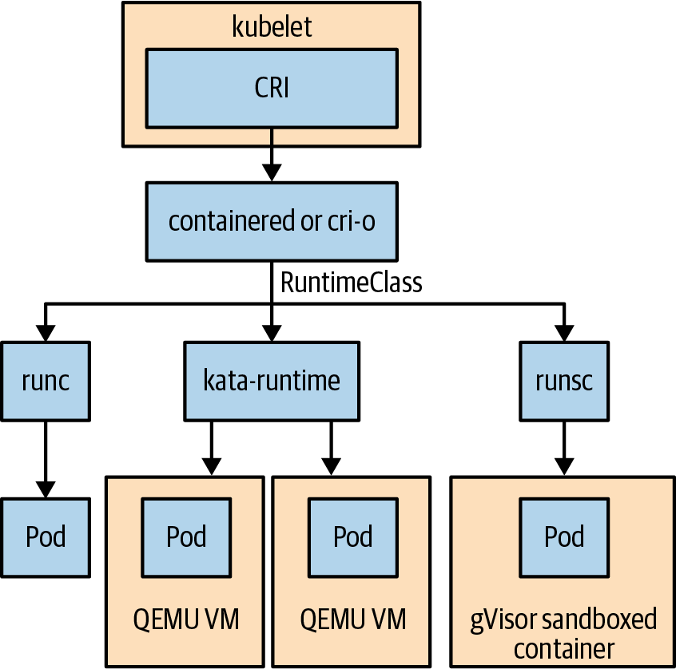

# Chương 19. Bảo mật ứng dụng trong Kubernetes

Cung cấp một nền tảng an toàn để chạy các workload của bạn là điều quan trọng để Kubernetes được sử dụng rộng rãi trong production. May mắn thay, Kubernetes đi kèm với nhiều API tập trung vào bảo mật khác nhau cho phép bạn xây dựng một môi trường vận hành an toàn. Thách thức là có nhiều API bảo mật khác nhau, và bạn phải chủ động chọn dùng chúng theo kiểu khai báo. Sử dụng các API tập trung vào bảo mật này có thể cồng kềnh và rắc rối, khiến việc đạt được các mục tiêu bảo mật mong muốn trở nên khó khăn.

Điều quan trọng là hiểu hai khái niệm sau khi bảo mật Pod trong Kubernetes: phòng thủ theo chiều sâu (defense in depth) và nguyên tắc đặc quyền tối thiểu (principle of least privilege). Phòng thủ theo chiều sâu là một khái niệm trong đó bạn dùng nhiều lớp kiểm soát bảo mật trên các hệ thống tính toán của mình bao gồm Kubernetes. Nguyên tắc đặc quyền tối thiểu có nghĩa là chỉ cấp cho các workload quyền truy cập vào các tài nguyên cần thiết để chúng hoạt động. Cả hai khái niệm này không phải là đích đến, mà được áp dụng liên tục vào bức tranh hệ thống tính toán luôn thay đổi.

Trong chương này, chúng ta sẽ xem xét các Kubernetes API tập trung vào bảo mật có thể được áp dụng tăng dần để giúp bảo mật các workload của bạn ở cấp Pod.

## Hiểu về SecurityContext

Cốt lõi của việc bảo mật Pod là SecurityContext, là một tập hợp tất cả các trường tập trung vào bảo mật có thể được áp dụng ở cả cấp đặc tả Pod và container. Đây là một số ví dụ về kiểm soát bảo mật được SecurityContext bao phủ:

- Quyền người dùng và kiểm soát truy cập (ví dụ, đặt User ID và Group ID)
- Root filesystem chỉ đọc
- Cho phép nâng quyền (privilege escalation)
- Gán profile và label Seccomp, AppArmor và SELinux
- Chạy với đặc quyền (privileged) hoặc không đặc quyền

Hãy xem một Pod ví dụ với SecurityContext được định nghĩa trong Ví dụ 19-1.

*Ví dụ 19-1. kuard-pod-securitycontext.yaml*

```yaml
apiVersion: v1
kind: Pod
metadata:
  name: kuard
spec:
  securityContext:
    runAsNonRoot: true
    runAsUser: 1000
    runAsGroup: 3000
    fsGroup: 2000
  containers:
    - image: gcr.io/kuar-demo/kuard-amd64:blue
      name: kuard
      securityContext:
        allowPrivilegeEscalation: false
        readOnlyRootFilesystem: true
        privileged: false
      ports:
        - containerPort: 8080
          name: http
          protocol: TCP
```

Bạn có thể thấy trong ví dụ này có SecurityContext ở cả cấp Pod và cấp container. Nhiều kiểm soát bảo mật có thể được áp dụng ở cả hai cấp này. Trong trường hợp chúng được áp dụng ở cả hai, cấu hình cấp container có ưu tiên. Hãy xem các trường chúng ta đã định nghĩa trong đặc tả Pod trong ví dụ này và tác động của chúng đến việc bảo mật workload của bạn:

**`runAsNonRoot`**

Pod hoặc container phải chạy dưới quyền người dùng không phải root. Container sẽ không khởi động được nếu nó đang chạy dưới quyền người dùng root. Chạy dưới quyền người dùng không phải root được coi là thực hành tốt nhất vì nhiều cấu hình sai và khai thác xảy ra qua việc container runtime nhầm lẫn tiến trình container chạy dưới quyền root với người dùng root của host. Điều này có thể được đặt ở cả PodSecurityContext và SecurityContext. Container image `kuard` được cấu hình để chạy dưới quyền người dùng "nobody" như được định nghĩa trong Dockerfile. Luôn là thực hành tốt nhất để chạy container của bạn dưới quyền người dùng không phải root; tuy nhiên, nếu bạn đang chạy một container được tải từ nguồn khác không đặt tường minh người dùng container, bạn có thể phải mở rộng Dockerfile gốc để làm điều đó. Phương pháp này không luôn hiệu quả, vì ứng dụng có thể có các yêu cầu khác cần được xem xét.

**`runAsUser`/`runAsGroup`**

Thiết lập này ghi đè người dùng và nhóm mà tiến trình container chạy dưới quyền. Container image có thể có cấu hình này như một phần của Dockerfile.

**`fsgroup`**

Cấu hình Kubernetes để thay đổi nhóm của tất cả các file trong một volume khi chúng được mount vào Pod. Một trường bổ sung, `fsGroupChangePolicy`, có thể được dùng để cấu hình hành vi chính xác.

**`allowPrivilegeEscalation`**

Cấu hình liệu một tiến trình trong container có thể giành được nhiều đặc quyền hơn tiến trình cha của nó không. Đây là một vector tấn công phổ biến, và điều quan trọng là đặt tường minh giá trị này thành false. Cũng cần hiểu rằng giá trị này sẽ được đặt thành true nếu `privileged: true` được đặt.

**`privileged`**

Chạy container với đặc quyền, nâng container lên cùng quyền với host.

**`readOnlyRootFilesystem`**

Mount root filesystem của container ở chế độ chỉ đọc. Đây là một vector tấn công phổ biến và là thực hành tốt nhất để bật. Bất kỳ dữ liệu hoặc log nào mà workload cần quyền ghi có thể được mount qua một volume.

Các trường trong ví dụ này không phải là danh sách đầy đủ tất cả các kiểm soát bảo mật có sẵn; tuy nhiên, chúng đại diện cho một điểm khởi đầu tốt khi làm việc với SecurityContext. Chúng ta sẽ đề cập thêm một số trong ngữ cảnh sau trong chương này.

Giờ hãy tạo Pod bằng cách lưu ví dụ này vào một file gọi là *kuard-pod-securitycontext.yaml*. Chúng ta sẽ minh họa cách cấu hình SecurityContext được áp dụng lên một Pod đang chạy. Tạo Pod bằng lệnh sau:

```
$ kubectl create -f kuard-pod-securitycontext.yaml
pod/kuard created
```

Giờ chúng ta sẽ khởi động một shell bên trong container `kuard` và kiểm tra các tiến trình đang chạy dưới user ID và group ID nào:

```
$ kubectl exec -it kuard -- ash
/ $ id
uid=1000 gid=3000 groups=2000
/ $ ps
PID   USER     TIME  COMMAND
    1 1000      0:00 /kuard
   30 1000      0:00 ash
   37 1000      0:00 ps
/ $ touch file
touch: file: Read-only file system
```

Chúng ta có thể thấy shell mà chúng ta khởi động, `ash`, đang chạy dưới user ID (uid) 1000, group ID (gid) 3000, và thuộc nhóm 2000. Chúng ta cũng có thể thấy tiến trình `kuard` đang chạy dưới user 1000 như được định nghĩa bởi SecurityContext trong đặc tả Pod. Chúng ta cũng đã xác nhận rằng chúng ta không thể tạo file mới nào vì container là chỉ đọc. Nếu bạn chỉ áp dụng những thay đổi sau đây cho các workload của mình, bạn đã có một khởi đầu tuyệt vời.

Giờ chúng ta sẽ giới thiệu một số kiểm soát bảo mật khác được SecurityContext bao phủ, cho phép kiểm soát chi tiết hơn nữa về quyền truy cập và đặc quyền mà các workload của bạn có. Đầu tiên, chúng ta sẽ giới thiệu các kiểm soát bảo mật cấp hệ điều hành rồi cách cấu hình chúng qua SecurityContext. Cần lưu ý rằng nhiều kiểm soát này phụ thuộc vào hệ điều hành host. Điều này có nghĩa là chúng có thể chỉ áp dụng cho các container chạy trên hệ điều hành Linux thay vì các hệ điều hành Kubernetes được hỗ trợ khác như Windows. Đây là danh sách tập kiểm soát hệ điều hành cốt lõi được SecurityContext bao phủ:

**Capabilities**

Cho phép thêm hoặc xóa các nhóm đặc quyền có thể cần thiết để một workload hoạt động. Ví dụ, workload của bạn có thể cấu hình cấu hình mạng của host. Thay vì cấu hình Pod thành privileged, về hiệu quả là quyền root của host, bạn có thể thêm capability cụ thể để cấu hình cấu hình mạng host (`NET_ADMIN` là tên capability cụ thể). Điều này tuân theo nguyên tắc đặc quyền tối thiểu.

**AppArmor**

Kiểm soát file nào các tiến trình có thể truy cập. AppArmor profile có thể được áp dụng cho container qua việc thêm một annotation `container.apparmor.security.beta.kubernetes.io/<container_name>: <profile_ref>` vào đặc tả Pod. Các giá trị chấp nhận được cho `<profile ref>` bao gồm `runtime/default`, `localhost/<path to profile>` và `unconfined`. Mặc định là `unconfined`, đặt tường minh không có profile nào được áp dụng.

**Seccomp**

Seccomp (secure computing) profile cho phép tạo các bộ lọc syscall. Các bộ lọc này cho phép các syscall cụ thể được cho phép hoặc bị chặn, điều này giới hạn bề mặt của Linux kernel được phơi bày cho các tiến trình trong Pod.

**SELinux**

Định nghĩa các kiểm soát truy cập cho file và tiến trình. Người vận hành SELinux dùng các label được nhóm lại với nhau để tạo một security context (không nhầm với Kubernetes SecurityContext), được dùng để giới hạn truy cập cho một tiến trình. Theo mặc định, Kubernetes cấp phát một SELinux context ngẫu nhiên cho mỗi container; tuy nhiên, bạn có thể chọn đặt một cái qua SecurityContext.

> **LƯU Ý**
>
> Cả AppArmor và seccomp đều có khả năng đặt profile mặc định của runtime để sử dụng. Mỗi container runtime đi kèm với các profile AppArmor và seccomp mặc định đã được chọn lọc cẩn thận để giảm bề mặt tấn công bằng cách loại bỏ các syscall và truy cập file được biết là vector tấn công hoặc không được các ứng dụng thường dùng. Các mặc định này hiếm khi ảnh hưởng đến workload và mang lại một điểm khởi đầu tuyệt vời.

Để minh họa cách các kiểm soát bảo mật này được áp dụng cho một Pod, chúng ta sẽ dùng một công cụ gọi là `amicontained` ("Am I contained") do Jess Frazelle viết. Lưu đặc tả Pod trong Ví dụ 19-2 vào một file gọi là *amicontained-pod.yaml*. Pod đầu tiên không có SecurityContext nào được áp dụng và sẽ được dùng để cho thấy các kiểm soát bảo mật nào được áp dụng cho Pod theo mặc định. Lưu ý rằng kết quả của bạn có thể khác vì các bản phân phối Kubernetes và dịch vụ được quản lý khác nhau cung cấp các mặc định khác nhau.

*Ví dụ 19-2. amicontained-pod.yaml*

```yaml
apiVersion: v1
kind: Pod
metadata:
  name: amicontained
spec:
  containers:
    - image: r.j3ss.co/amicontained:v0.4.9
      name: amicontained
      command: [ "/bin/sh", "-c", "--" ]
      args: [ "amicontained" ]
```

Tạo Pod `amicontainer`:

```
$ kubectl apply -f amicontained-pod.yaml
pod/amicontained created
```

Hãy xem lại log của Pod để kiểm tra kết quả của công cụ `amicontained`:

```
$ kubectl logs amicontained
Container Runtime: kube
Has Namespaces:
        pid: true
        user: false
AppArmor Profile: docker-default (enforce)
Capabilities:
        BOUNDING -> chown dac_override fowner fsetid kill setgid setuid
        setpcap net_bind_service net_raw sys_chroot mknod audit_write
        setfcap
Seccomp: disabled
Blocked Syscalls (21):
        SYSLOG SETPGID SETSID VHANGUP PIVOT_ROOT ACCT SETTIMEOFDAY UMOUNT2
        SWAPON SWAPOFF REBOOT SETHOSTNAME SETDOMAINNAME INIT_MODULE
        DELETE_MODULE LOOKUP_DCOOKIE KEXEC_LOAD FANOTIFY_INIT
        OPEN_BY_HANDLE_AT FINIT_MODULE KEXEC_FILE_LOAD
Looking for Docker.sock
```

Từ kết quả trên chúng ta thấy AppArmor runtime default đang được áp dụng. Chúng ta cũng thấy các capability được cho phép theo mặc định cùng với seccomp bị vô hiệu hóa. Cuối cùng, chúng ta thấy tổng cộng 21 syscall đang bị chặn theo mặc định. Giờ chúng ta đã có một đường cơ sở, hãy áp dụng các kiểm soát bảo mật seccomp, AppArmor và Capabilities vào đặc tả Pod. Tạo một file gọi là *amicontained-pod-securitycontext.yaml* với nội dung của Ví dụ 19-3.

*Ví dụ 19-3. amicontained-pod-securitycontext.yaml*

```yaml
apiVersion: v1
kind: Pod
metadata:
  name: amicontained
  annotations:
    container.apparmor.security.beta.kubernetes.io/amicontained: "runtime/default"
spec:
  securityContext:
    runAsNonRoot: true
    runAsUser: 1000
    runAsGroup: 3000
    fsGroup: 2000
    seccompProfile:
      type: RuntimeDefault
  containers:
    - image: r.j3ss.co/amicontained:v0.4.9
      name: amicontained
      command: [ "/bin/sh", "-c", "--" ]
      args: [ "amicontained" ]
      securityContext:
        capabilities:
          add: ["SYS_TIME"]
          drop: ["NET_BIND_SERVICE"]
        allowPrivilegeEscalation: false
        readOnlyRootFilesystem: true
        privileged: false
```

Đầu tiên, chúng ta cần xóa Pod `amicontained` hiện có:

```
$ kubectl delete pod amicontained
pod "amicontained" deleted
```

Giờ chúng ta có thể tạo Pod mới với SecurityContext được áp dụng. Chúng ta đang khai báo cụ thể rằng các profile AppArmor và seccomp mặc định của runtime được áp dụng. Ngoài ra, chúng ta đã thêm và bỏ một Capability:

```
$ kubectl apply -f amicontained-pod-securitycontext.yaml
pod/amicontained created
```

Hãy xem lại log của Pod lần nữa để kiểm tra kết quả của công cụ `amicontained`:

```
$ kubectl logs amicontained
Container Runtime: kube
Has Namespaces:
        pid: true
        user: false
AppArmor Profile: docker-default (enforce)
Capabilities:
        BOUNDING -> chown dac_override fowner fsetid kill setgid setuid setpcap
        net_raw sys_chroot sys_time mknod audit_write setfcap
Seccomp: filtering
Blocked Syscalls (67):
        SYSLOG SETUID SETGID SETPGID SETSID SETREUID SETREGID SETGROUPS
        SETRESUID SETRESGID USELIB USTAT SYSFS VHANGUP PIVOT_ROOT _SYSCTL ACCT
        SETTIMEOFDAY MOUNT UMOUNT2 SWAPON SWAPOFF REBOOT SETHOSTNAME
        SETDOMAINNAME IOPL IOPERM CREATE_MODULE INIT_MODULE DELETE_MODULE
        GET_KERNEL_SYMS QUERY_MODULE QUOTACTL NFSSERVCTL GETPMSG PUTPMSG
        AFS_SYSCALL TUXCALL SECURITY LOOKUP_DCOOKIE VSERVER MBIND SET_MEMPOLICY
        GET_MEMPOLICY KEXEC_LOAD ADD_KEY REQUEST_KEY KEYCTL MIGRATE_PAGES
        FUTIMESAT UNSHARE MOVE_PAGES PERF_EVENT_OPEN FANOTIFY_INIT
        NAME_TO_HANDLE_AT OPEN_BY_HANDLE_AT SETNS PROCESS_VM_READV
        PROCESS_VM_WRITEV KCMP FINIT_MODULE KEXEC_FILE_LOAD BPF USERFAULTFD
        PKEY_MPROTECT PKEY_ALLOC PKEY_FREE
Looking for Docker.sock
```

### Các thách thức của SecurityContext

Như bạn có thể thấy, có rất nhiều điều cần hiểu để dùng SecurityContext, và không dễ để áp dụng một tập kiểm soát bảo mật cơ sở bằng cách cấu hình trực tiếp tất cả các trường của mọi Pod. Việc tạo và quản lý các profile và context AppArmor, seccomp và SELinux không dễ và dễ lỗi. Cái giá của một lỗi là phá vỡ khả năng thực hiện chức năng của một ứng dụng. Có một số công cụ tạo ra cách sinh seccomp profile từ một Pod đang chạy, sau đó có thể được áp dụng bằng SecurityContext. Một dự án như vậy là Security Profiles Operator, giúp dễ dàng sinh và quản lý các Seccomp profile. Giờ chúng ta sẽ xem xét các API bảo mật khác giúp việc quản lý cách SecurityContext được áp dụng nhất quán trên toàn cluster.

## Pod Security

Giờ chúng ta đã xem xét SecurityContext như một cách để quản lý các kiểm soát bảo mật được áp dụng cho Pod và container, chúng ta sẽ đề cập đến cách đảm bảo một tập giá trị SecurityContext được áp dụng ở quy mô lớn. Kubernetes có API PodSecurityPolicy (PSP) hiện đã bị loại bỏ, cho phép cả xác thực và biến đổi (mutation). Xác thực sẽ không cho phép tạo các tài nguyên Kubernetes trừ khi chúng có một SecurityContext cụ thể được áp dụng. Biến đổi, mặt khác, sẽ thay đổi các tài nguyên Kubernetes và áp dụng một SecurityContext cụ thể dựa trên tiêu chí được áp dụng qua PSP. Vì PSP đã bị loại bỏ và sẽ bị xóa trong Kubernetes v1.25, chúng tôi sẽ không đề cập sâu về nó mà thay vào đó sẽ đề cập đến kế nhiệm của nó, Pod Security. Một trong những khác biệt chính giữa Pod Security và tiền nhiệm của nó là Pod Security chỉ thực hiện xác thực mà không biến đổi. Nếu bạn muốn tìm hiểu thêm về biến đổi, chúng tôi khuyến khích bạn xem Chương 20.

### Pod Security là gì?

Pod Security cho phép bạn khai báo các hồ sơ bảo mật khác nhau cho Pod. Các hồ sơ bảo mật này được gọi là Pod Security Standard và được áp dụng ở cấp namespace. Pod Security Standard là một tập hợp các trường nhạy cảm về bảo mật trong đặc tả Pod (bao gồm, nhưng không giới hạn ở, SecurityContext) và các giá trị liên quan của chúng. Có ba tiêu chuẩn khác nhau từ hạn chế đến cho phép. Ý tưởng là bạn có thể áp dụng một tư thế bảo mật chung cho tất cả các Pod trong một namespace nhất định. Ba Pod Security Standard như sau:

**Baseline**

Ngăn các nâng quyền phổ biến nhất trong khi cho phép onboarding dễ dàng hơn.

**Restricted**

Hạn chế cao, bao phủ các thực hành bảo mật tốt nhất. Có thể làm các workload bị hỏng.

**Privileged**

Mở và không hạn chế.

> **CẢNH BÁO**
>
> Pod Security hiện là tính năng beta tính đến Kubernetes v1.23 và có thể thay đổi.

Mỗi Pod Security Standard định nghĩa một danh sách các trường trong đặc tả Pod và các giá trị được phép của chúng. Đây là một số trường được các tiêu chuẩn này bao phủ:

- `spec.securityContext`
- `spec.containers[*].securityContext`
- `spec.containers[*].ports`
- `spec.volumes[*].hostPath`

Bạn có thể xem danh sách đầy đủ các trường được mỗi Pod Security Standard bao phủ trong tài liệu chính thức.

Mỗi tiêu chuẩn được áp dụng cho một namespace bằng một chế độ (mode) nhất định. Có ba chế độ mà một chính sách có thể được áp dụng. Chúng như sau:

**Enforce**

Bất kỳ Pod nào vi phạm chính sách sẽ bị từ chối.

**Warn**

Bất kỳ Pod nào vi phạm chính sách sẽ được cho phép, và một thông điệp cảnh báo sẽ được hiển thị cho người dùng.

**Audit**

Bất kỳ Pod nào vi phạm chính sách sẽ tạo một thông điệp kiểm toán trong audit log.

### Áp dụng Pod Security Standard

Pod Security Standard được áp dụng cho một namespace bằng label như sau:

- Bắt buộc: `pod-security.kubernetes.io/<MODE>: <LEVEL>`
- Tùy chọn: `pod-security.kubernetes.io/<MODE>-version: <VERSION>` (mặc định là latest)

Namespace trong Ví dụ 19-4 minh họa cách bạn có thể dùng nhiều chế độ để enforce ở một tiêu chuẩn (baseline trong ví dụ này) và audit cùng warn ở một tiêu chuẩn khác (restricted). Sử dụng nhiều chế độ cho phép bạn triển khai một chính sách với tư thế bảo mật thấp hơn và kiểm toán workload nào vi phạm một tiêu chuẩn với chính sách hạn chế hơn. Sau đó bạn có thể khắc phục các vi phạm chính sách trước khi enforce tiêu chuẩn hạn chế hơn. Bạn cũng có thể ghim một chế độ vào một phiên bản cụ thể, ví dụ, v1.22. Điều này cho phép các tiêu chuẩn chính sách thay đổi với mỗi bản phát hành Kubernetes và cho phép bạn ghim một phiên bản cụ thể. Trong Ví dụ 19-4, chúng ta đang enforce tiêu chuẩn baseline và cả warn và audit tiêu chuẩn restricted. Tất cả các chế độ được ghim vào v1.22 của tiêu chuẩn.

*Ví dụ 19-4. baseline-ns.yaml*

```yaml
apiVersion: v1
kind: Namespace
metadata:
  name: baseline-ns
  labels:
    pod-security.kubernetes.io/enforce: baseline
    pod-security.kubernetes.io/enforce-version: v1.22
    pod-security.kubernetes.io/audit: restricted
    pod-security.kubernetes.io/audit-version: v1.22
    pod-security.kubernetes.io/warn: restricted
    pod-security.kubernetes.io/warn-version: v1.22
```

Triển khai một chính sách lần đầu có thể là một nhiệm vụ đáng sợ. May mắn thay, Pod Security đã giúp dễ dàng xem workload hiện có nào vi phạm một Pod Security Standard bằng một lệnh dry-run duy nhất:

```
$ kubectl label --dry-run=server --overwrite ns \
  --all pod-security.kubernetes.io/enforce=baseline
Warning: kuard: privileged
namespace/default labeled
namespace/kube-node-lease labeled
namespace/kube-public labeled
Warning: kube-proxy-vxjwb: host namespaces, hostPath volumes, privileged
Warning: kube-proxy-zxqzz: host namespaces, hostPath volumes, privileged
Warning: kube-apiserver-kind-control-plane: host namespaces, hostPath volumes
Warning: etcd-kind-control-plane: host namespaces, hostPath volumes
Warning: kube-controller-manager-kind-control-plane: host namespaces, ...
Warning: kube-scheduler-kind-control-plane: host namespaces, hostPath volumes
namespace/kube-system labeled
namespace/local-path-storage labeled
```

Lệnh này đánh giá tất cả các Pod trên Kubernetes cluster so với Pod Security Standard baseline và báo cáo các vi phạm dưới dạng thông điệp cảnh báo trong kết quả.

Hãy xem Pod Security trong thực tế. Tạo một file gọi là *baseline-ns.yaml* với nội dung trong Ví dụ 19-5.

*Ví dụ 19-5. baseline-ns.yaml*

```yaml
apiVersion: v1
kind: Namespace
metadata:
  name: baseline-ns
  labels:
    pod-security.kubernetes.io/enforce: baseline
    pod-security.kubernetes.io/enforce-version: v1.22
    pod-security.kubernetes.io/audit: restricted
    pod-security.kubernetes.io/audit-version: v1.22
    pod-security.kubernetes.io/warn: restricted
    pod-security.kubernetes.io/warn-version: v1.22
```

```
$ kubectl apply -f baseline-ns.yaml
namespace/baseline-ns created
```

Tạo một file gọi là *kuard-pod.yaml* với nội dung trong Ví dụ 19-6.

*Ví dụ 19-6. kuard-pod.yaml*

```yaml
apiVersion: v1
kind: Pod
metadata:
  name: kuard
  labels:
    app: kuard
spec:
  containers:
    - image: gcr.io/kuar-demo/kuard-amd64:blue
      name: kuard
      ports:
        - containerPort: 8080
          name: http
          protocol: TCP
```

Tạo Pod và xem lại kết quả bằng lệnh sau:

```
$ kubectl apply -f kuard-pod.yaml --namespace baseline-ns
Warning: would violate "v1.22" version of "restricted" PodSecurity profile:
allowPrivilegeEscalation != false (container "kuard" must set
securityContext.allowPrivilegeEscalation=false), unrestricted capabilities
(container "kuard" must set securityContext.capabilities.drop=["ALL"]),
runAsNonRoot != true (pod or container "kuard" must set securityContext.
runAsNonRoot=true), seccompProfile (pod or container "kuard" must set
securityContext.seccompProfile.type to "RuntimeDefault" or "Localhost")
pod/kuard created
```

Trong kết quả này, bạn có thể thấy Pod đã được tạo thành công; tuy nhiên, nó đã vi phạm Pod Security Standard restricted, và chi tiết các vi phạm được cung cấp trong kết quả để bạn có thể khắc phục. Chúng ta cũng có thể thấy thông điệp trong audit log của API server vì chúng ta đã cấu hình chế độ audit:

```
{"kind":"Event","apiVersion":"audit.k8s.io/v1","level":"Metadata","auditID":...
```

Pod Security là một cách tuyệt vời để quản lý tư thế bảo mật của các workload bằng cách áp dụng chính sách ở cấp namespace và chỉ cho phép tạo Pod nếu chúng không vi phạm chính sách. Nó linh hoạt và cung cấp các chính sách được xây dựng sẵn khác nhau từ cho phép đến hạn chế cùng với công cụ để dễ dàng triển khai các thay đổi chính sách mà không có rủi ro làm hỏng workload.

## Quản lý Service Account

Service account là các tài nguyên Kubernetes cung cấp danh tính cho các workload chạy bên trong Pod. RBAC có thể được áp dụng cho service account để kiểm soát tài nguyên nào, thông qua Kubernetes API, danh tính đó có quyền truy cập. Vui lòng xem Chương 14 để tìm hiểu thêm. Nếu ứng dụng của bạn không yêu cầu truy cập vào Kubernetes API, bạn nên vô hiệu hóa quyền truy cập theo nguyên tắc đặc quyền tối thiểu. Theo mặc định, Kubernetes tạo một service account mặc định trong mỗi namespace, được tự động đặt làm service account cho tất cả các Pod. Service account này chứa một token được tự động mount vào mỗi Pod và được dùng để truy cập Kubernetes API. Để vô hiệu hóa hành vi này, bạn phải thêm `automountServiceAccountToken: false` vào cấu hình service account. Ví dụ 19-7 minh họa cách làm điều này cho service account mặc định. Điều này phải được thực hiện trong mỗi namespace.

*Ví dụ 19-7. service-account.yaml*

```yaml
apiVersion: v1
kind: ServiceAccount
metadata:
  name: default
automountServiceAccountToken: false
```

Service account thường bị bỏ qua khi xem xét bảo mật Pod; tuy nhiên, chúng cho phép truy cập trực tiếp vào Kubernetes API và, không có RBAC đầy đủ, có thể cho phép kẻ tấn công truy cập vào Kubernetes. Điều quan trọng là hiểu cách giới hạn truy cập bằng cách thực hiện một thay đổi đơn giản trong cách token service account được xử lý.

## Kiểm soát truy cập dựa trên vai trò

Sẽ là thiếu sót nếu không đề cập đến kiểm soát truy cập dựa trên vai trò (RBAC) của Kubernetes trong một chương về bảo mật Pod. Mọi thứ bạn cần biết về RBAC có thể tìm thấy trong Chương 14 và có thể được áp dụng để bổ sung cho tư thế bảo mật của workload của bạn.

## RuntimeClass

Kubernetes tương tác với container runtime trên hệ điều hành của node qua Container Runtime Interface (CRI). Việc tạo ra và chuẩn hóa giao diện này đã cho phép một hệ sinh thái các container runtime tồn tại. Các container runtime này có thể cung cấp các mức cô lập khác nhau, bao gồm các đảm bảo bảo mật mạnh hơn dựa trên cách chúng được hiện thực. Các dự án như Kata Containers, Firecracker và gVisor dựa trên các cơ chế cô lập khác nhau từ ảo hóa lồng nhau đến lọc syscall tinh vi hơn. Các đảm bảo bảo mật và cô lập này cung cấp cho quản trị viên Kubernetes sự linh hoạt để cho phép người dùng chọn container runtime dựa trên loại workload của họ. Ví dụ, nếu workload của bạn cần đảm bảo bảo mật mạnh hơn, thì bạn có thể chọn chạy trong một Pod dùng container runtime khác.

API RuntimeClass được giới thiệu để cho phép chọn container runtime. Nó cho phép người dùng chọn một trong danh sách các container runtime được hỗ trợ trong cluster. Hình 19-1 mô tả cách RuntimeClass hoạt động.

> **LƯU Ý**
>
> Các RuntimeClass khác nhau phải được quản trị viên cluster cấu hình và có thể yêu cầu `nodeSelectors` hoặc `tolerations` cụ thể trên workload của bạn để được lên lịch lên node đúng.



*Hình 19-1. Sơ đồ luồng RuntimeClass*

Bạn có thể dùng RuntimeClass bằng cách chỉ định `runtimeClassName` trong đặc tả Pod. Ví dụ 19-8 là một Pod ví dụ chỉ định RuntimeClass.

*Ví dụ 19-8. kuard-pod-runtimeclass.yaml*

```yaml
apiVersion: v1
kind: Pod
metadata:
  name: kuard
  labels:
    app: kuard
spec:
  runtimeClassName: firecracker
  containers:
    - image: gcr.io/kuar-demo/kuard-amd64:blue
      name: kuard
      ports:
        - containerPort: 8080
          name: http
          protocol: TCP
```

RuntimeClass cho phép người dùng chọn các container runtime khác nhau có thể có sự cô lập bảo mật khác nhau. Sử dụng RuntimeClass có thể giúp bổ sung cho bảo mật tổng thể của workload, đặc biệt nếu workload đang xử lý thông tin nhạy cảm hoặc chạy code không tin cậy.

## Network Policy

Kubernetes cũng có Network Policy API cho phép bạn tạo cả chính sách mạng ingress và egress cho workload của mình. Network policy được cấu hình bằng label cho phép bạn chọn các Pod cụ thể và định nghĩa cách chúng có thể giao tiếp với các Pod và endpoint khác. Network Policy giống như Ingress không thực sự đi kèm với một Kubernetes controller liên quan. Điều này có nghĩa là bạn có thể tạo các tài nguyên Network Policy nhưng nếu bạn chưa cài đặt một controller hành động khi các tài nguyên Network Policy được tạo, thì chúng sẽ không được thực thi. Tài nguyên Network Policy được hiện thực bởi các plug-in mạng, như Calico, Cilium và Weave Net.

Tài nguyên Network Policy có phạm vi namespace và được cấu trúc với các phần `podSelector`, `policyTypes`, `ingress` và `egress`, với trường bắt buộc duy nhất là `podSelector`. Nếu trường `podSelector` trống, chính sách khớp với tất cả các Pod trong namespace. Trường này cũng có thể chứa một phần `matchLabels`, hoạt động giống như tài nguyên Service, cho phép bạn thêm một tập label để khớp với một tập Pod cụ thể.

Có một số đặc điểm riêng khi dùng Network Policy mà bạn cần biết. Nếu một Pod được khớp bởi bất kỳ tài nguyên Network Policy nào, thì bất kỳ giao tiếp ingress hoặc egress nào phải được định nghĩa tường minh, nếu không nó sẽ bị chặn. Nếu một Pod khớp nhiều tài nguyên Network Policy, thì các chính sách được cộng dồn. Nếu một Pod không được khớp bởi bất kỳ Network Policy nào, thì lưu lượng được cho phép. Quyết định này được đưa ra có chủ đích để dễ dàng onboarding các workload mới. Tuy nhiên, nếu bạn muốn tất cả lưu lượng bị chặn theo mặc định, bạn có thể tạo một quy tắc từ chối mặc định cho mỗi namespace. Ví dụ 19-9 cho thấy một quy tắc từ chối mặc định có thể được áp dụng cho mỗi namespace.

*Ví dụ 19-9. networkpolicy-default-deny.yaml*

```yaml
apiVersion: networking.k8s.io/v1
kind: NetworkPolicy
metadata:
  name: default-deny-ingress
spec:
  podSelector: {}
  policyTypes:
  - Ingress
```

Hãy đi qua một tập ví dụ về network policy để minh họa cách bạn có thể dùng chúng để bảo mật workload. Đầu tiên, tạo một namespace để kiểm thử bằng lệnh sau:

```
$ kubectl create ns kuard-networkpolicy
namespace/kuard-networkpolicy created
```

Tạo một file tên *kuard-pod.yaml* với nội dung của Ví dụ 19-10.

*Ví dụ 19-10. kuard-pod.yaml*

```yaml
apiVersion: v1
kind: Pod
metadata:
  name: kuard
  labels:
    app: kuard
spec:
  containers:
    - image: gcr.io/kuar-demo/kuard-amd64:blue
      name: kuard
      ports:
        - containerPort: 8080
          name: http
          protocol: TCP
```

Tạo Pod `kuard` trong namespace `kuard-networkpolicy`:

```
$ kubectl apply -f kuard-pod.yaml \
  --namespace kuard-networkpolicy
pod/kuard created
```

Phơi bày Pod `kuard` như một service:

```
$ kubectl expose pod kuard --port=80 --target-port=8080 \
  --namespace kuard-networkpolicy
pod/kuard created
```

Giờ chúng ta có thể dùng `kubectl run` để khởi động một Pod để kiểm thử làm nguồn và kiểm tra truy cập đến Pod `kuard` mà không áp dụng Network Policy nào:

```
$ kubectl run test-source --rm -ti --image busybox /bin/sh \
  --namespace kuard-networkpolicy
If you don't see a command prompt, try pressing enter.
/ # wget -q kuard -O -
<!doctype html>

<html lang="en">
<head>
  <meta charset="utf-8">
  <title><KUAR Demo></title>
  ...
```

Chúng ta có thể kết nối thành công đến Pod `kuard` từ Pod `test-source`. Giờ hãy áp dụng chính sách từ chối mặc định và kiểm tra lại. Tạo một file gọi là *networkpolicy-default-deny.yaml* với nội dung của Ví dụ 19-11.

*Ví dụ 19-11. networkpolicy-default-deny.yaml*

```yaml
apiVersion: networking.k8s.io/v1
kind: NetworkPolicy
metadata:
  name: default-deny-ingress
spec:
  podSelector: {}
  policyTypes:
  - Ingress
```

Giờ áp dụng network policy từ chối mặc định:

```
$ kubectl apply -f networkpolicy-default-deny.yaml \
  --namespace kuard-networkpolicy
networkpolicy.networking.k8s.io/default-deny-ingress created
```

Giờ hãy kiểm tra truy cập đến Pod `kuard` từ Pod `test-source`:

```
$ kubectl run test-source --rm -ti --image busybox /bin/sh \
  --namespace kuard-networkpolicy
If you don't see a command prompt, try pressing enter.
/ # wget -q --timeout=5 kuard -O -
wget: download timed out
```

Chúng ta không còn có thể truy cập Pod `kuard` từ Pod `test-source` do Network Policy từ chối mặc định. Tạo một Network Policy cho phép truy cập từ `test-source` đến Pod `kuard`. Tạo một file gọi là *networkpolicy-kuard-allow-test-source.yaml* với nội dung của Ví dụ 19-12.

*Ví dụ 19-12. networkpolicy-kuard-allow-test-source.yaml*

```yaml
kind: NetworkPolicy
apiVersion: networking.k8s.io/v1
metadata:
  name: access-kuard
spec:
  podSelector:
    matchLabels:
      app: kuard
  ingress:
    - from:
      - podSelector:
          matchLabels:
            run: test-source
```

Áp dụng Network Policy:

```
$ kubectl apply \
  -f code/chapter-security/networkpolicy-kuard-allow-test-source.yaml \
  --namespace kuard-networkpolicy
networkpolicy.networking.k8s.io/access-kuard created
```

Một lần nữa, xác minh rằng Pod `test-source` thực sự có thể truy cập Pod `kuard`:

```
$ kubectl run test-source --rm -ti --image busybox /bin/sh \
  --namespace kuard-networkpolicy
If you don't see a command prompt, try pressing enter.
/ # wget -q kuard -O -
<!doctype html>

<html lang="en">
<head>
  <meta charset="utf-8">

  <title><KUAR Demo></title>
...
```

Dọn dẹp namespace bằng cách chạy lệnh sau:

```
$ kubectl delete namespace kuard-networkpolicy
namespace "kuard-networkpolicy" deleted
```

Áp dụng Network Policy cung cấp thêm một lớp bảo mật cho các workload của bạn và tiếp tục xây dựng trên các khái niệm phòng thủ theo chiều sâu và nguyên tắc đặc quyền tối thiểu.

## Service Mesh

Service mesh cũng có thể được dùng để tăng tư thế bảo mật của workload. Service mesh cung cấp các chính sách truy cập, cho phép cấu hình các chính sách nhận biết giao thức dựa trên service. Ví dụ, chính sách truy cập của bạn có thể khai báo rằng ServiceA kết nối đến ServiceB qua HTTPS trên cổng 443. Ngoài ra, service mesh thường hiện thực mutual TLS trên tất cả giao tiếp service-với-service, có nghĩa là không chỉ giao tiếp được mã hóa mà danh tính service cũng được xác minh. Nếu bạn muốn tìm hiểu thêm về service mesh và cách chúng có thể được dùng để bảo mật workload, hãy xem Chương 15.

## Công cụ Security Benchmark

Có một số công cụ mã nguồn mở cho phép bạn chạy một bộ benchmark bảo mật đối với Kubernetes cluster để xác định liệu cấu hình của bạn có đáp ứng một tập đường cơ sở bảo mật được định nghĩa trước không. Một công cụ như vậy gọi là `kube-bench`. `kube-bench` có thể được dùng để chạy CIS Benchmark cho Kubernetes. Các công cụ như `kube-bench` chạy CIS Benchmark không tập trung cụ thể vào bảo mật Pod; tuy nhiên, chúng chắc chắn có thể phơi bày bất kỳ cấu hình sai nào của cluster và giúp xác định các biện pháp khắc phục. `kube-bench` có thể được chạy bằng lệnh sau:

```
$ kubectl apply -f https://raw.githubusercontent.com/aquasecurity/kube-bench/main/job.yaml
job.batch/kube-bench created
```

Sau đó bạn có thể xem lại kết quả benchmark và các biện pháp khắc phục qua log của Pod:

```
$ kubectl logs job/kube-bench
[INFO] 4 Worker Node Security Configuration
[INFO] 4.1 Worker Node Configuration Files
[PASS] 4.1.1 Ensure that the kubelet service file permissions are set to 644...
[PASS] 4.1.2 Ensure that the kubelet service file ownership is set to root...
[PASS] 4.1.3 If proxy kubeconfig file exists ensure permissions are set to...
[PASS] 4.1.4 Ensure that the proxy kubeconfig file ownership is set to root...
[PASS] 4.1.5 Ensure that the --kubeconfig kubelet.conf file permissions are...
[PASS] 4.1.6 Ensure that the --kubeconfig kubelet.conf file ownership is se...
[PASS] 4.1.7 Ensure that the certificate authorities file permissions are...
[PASS] 4.1.8 Ensure that the client certificate authorities file ownership...
[PASS] 4.1.9 Ensure that the kubelet --config configuration file has permis...
[PASS] 4.1.10 Ensure that the kubelet --config configuration file ownership...
[INFO] 4.2 Kubelet
[PASS] 4.2.1 Ensure that the anonymous-auth argument is set to false (Autom...
[PASS] 4.2.2 Ensure that the --authorization-mode argument is not set to...
[PASS] 4.2.3 Ensure that the --client-ca-file argument is set as appropriat...
[PASS] 4.2.4 Ensure that the --read-only-port argument is set to 0 (Manual)
[PASS] 4.2.5 Ensure that the --streaming-connection-idle-timeout argument i...
[FAIL] 4.2.6 Ensure that the --protect-kernel-defaults argument is set to...
[PASS] 4.2.7 Ensure that the --make-iptables-util-chains argument is set to...
[PASS] 4.2.8 Ensure that the --hostname-override argument is not set (Manua...
[WARN] 4.2.9 Ensure that the --event-qps argument is set to 0 or a level...
[WARN] 4.2.10 Ensure that the --tls-cert-file and --tls-private-key-file ar...
[PASS] 4.2.11 Ensure that the --rotate-certificates argument is not set to...
[PASS] 4.2.12 Verify that the RotateKubeletServerCertificate argument is se...
[WARN] 4.2.13 Ensure that the Kubelet only makes use of Strong Cryptographi...
== Remediations node ==
4.2.6 If using a Kubelet config file, edit the file to set protectKernel...
If using command line arguments, edit the kubelet service file
/etc/systemd/system/kubelet.service.d/10-kubeadm.conf on each worker node and
set the below parameter in KUBELET_SYSTEM_PODS_ARGS variable.
--protect-kernel-defaults=true
Based on your system, restart the kubelet service. For example:
systemctl daemon-reload
systemctl restart kubelet.service

4.2.9 If using a Kubelet config file, edit the file to set eventRecordQPS..
If using command line arguments, edit the kubelet service file
/etc/systemd/system/kubelet.service.d/10-kubeadm.conf on each worker node and
set the below parameter in KUBELET_SYSTEM_PODS_ARGS variable.
Based on your system, restart the kubelet service. For example:
systemctl daemon-reload
systemctl restart kubelet.service
...
```

Sử dụng các công cụ như `kube-bench` với CIS benchmark có thể giúp xác định liệu Kubernetes cluster của bạn có đáp ứng đường cơ sở bảo mật và cung cấp các biện pháp khắc phục nếu cần.

## Bảo mật Image

Một phần quan trọng khác của bảo mật Pod là giữ code và ứng dụng bên trong Pod an toàn. Bảo mật code của ứng dụng là một chủ đề phức tạp nằm ngoài phạm vi của chương này; tuy nhiên, những điều cơ bản cho bảo mật container image bao gồm đảm bảo container image registry của bạn đang thực hiện quét tĩnh để tìm các lỗ hổng code đã biết. Ngoài ra, bạn nên có một công cụ để quét thời gian chạy xác định các lỗ hổng được phát hiện sau khi image bắt đầu chạy và cũng tìm kiếm hoạt động có thể độc hại như xâm nhập. Có nhiều công cụ quét được cung cấp bởi cả các công ty mã nguồn mở và độc quyền. Ngoài quét bảo mật, tập trung vào việc tối thiểu hóa nội dung container image để loại bỏ các phụ thuộc không cần thiết giúp giảm nhiễu từ việc quét này. Cuối cùng, bảo mật image là một lý do tuyệt vời khác để đầu tư vào continuous delivery để bạn có thể nhanh chóng vá và triển khai lại image khi tìm thấy lỗ hổng.

## Tóm tắt

Trong chương này, chúng ta đã đề cập đến nhiều API và tài nguyên tập trung vào bảo mật khác nhau có thể được dùng để cải thiện tư thế bảo mật của workload của bạn. Bằng cách thực hành phòng thủ theo chiều sâu và nguyên tắc đặc quyền tối thiểu, bạn có thể cải thiện tăng dần bảo mật cơ sở của Kubernetes cluster. Không bao giờ là quá muộn để bắt đầu thực hành bảo mật tốt hơn, và chương này cung cấp mọi thứ bạn cần để tự tin rằng bạn hiểu các kiểm soát bảo mật mà Kubernetes cung cấp.
