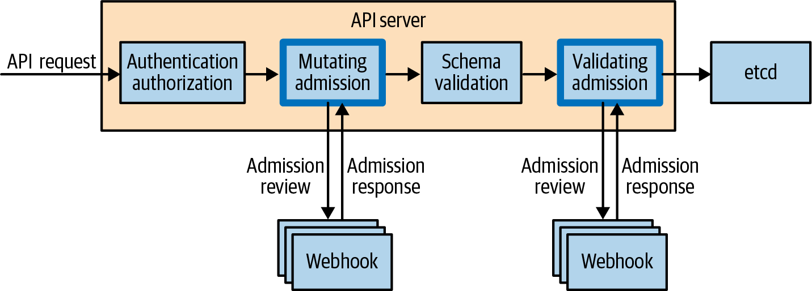

# Chương 20. Chính sách và quản trị cho Kubernetes Cluster

Xuyên suốt cuốn sách này chúng tôi đã giới thiệu nhiều loại tài nguyên Kubernetes khác nhau, mỗi loại có một mục đích cụ thể. Không lâu sau, số tài nguyên trên Kubernetes cluster sẽ đi từ vài cái, cho một ứng dụng microservice đơn lẻ, đến hàng trăm và hàng nghìn, cho một ứng dụng phân tán hoàn chỉnh. Trong bối cảnh một cluster production, không khó để tưởng tượng những thách thức liên quan đến việc quản lý hàng nghìn tài nguyên.

Trong chương này, chúng tôi giới thiệu các khái niệm chính sách (policy) và quản trị (governance). Chính sách là một tập các ràng buộc và điều kiện về cách các tài nguyên Kubernetes có thể được cấu hình. Quản trị cung cấp khả năng xác minh và thực thi các chính sách của tổ chức cho tất cả các tài nguyên được triển khai lên Kubernetes cluster, như đảm bảo tất cả các tài nguyên dùng các thực hành tốt nhất hiện tại, tuân thủ chính sách bảo mật, hoặc tuân theo các quy ước của công ty. Bất kể trường hợp của bạn là gì, công cụ của bạn cần linh hoạt và có khả năng mở rộng để tất cả các tài nguyên được định nghĩa trên cluster tuân thủ các chính sách đã định nghĩa của tổ chức.

## Tại sao chính sách và quản trị quan trọng

Có nhiều loại chính sách khác nhau trong Kubernetes. Ví dụ, NetworkPolicy cho phép bạn chỉ định các dịch vụ mạng và endpoint nào một Pod có thể kết nối đến. PodSecurityPolicy cho phép kiểm soát chi tiết các yếu tố bảo mật của Pod. Cả hai đều có thể được dùng để cấu hình mạng hoặc container runtime.

Tuy nhiên, bạn có thể muốn thực thi một chính sách trước cả khi các tài nguyên Kubernetes được tạo. Đây là vấn đề mà chính sách và quản trị giải quyết. Tại thời điểm này, bạn có thể nghĩ, "Chẳng phải đây là điều kiểm soát truy cập dựa trên vai trò làm sao?" Tuy nhiên, như bạn sẽ thấy trong chương này, RBAC không đủ chi tiết để hạn chế các trường cụ thể trong tài nguyên khỏi việc được đặt.

Đây là một số ví dụ phổ biến về các chính sách mà quản trị viên cluster thường cấu hình:

- Tất cả các container chỉ được đến từ một container registry cụ thể.
- Tất cả các Pod phải được gắn label với tên bộ phận và thông tin liên hệ.
- Tất cả các Pod phải có cả CPU và memory resource limit được đặt.
- Tất cả các hostname Ingress phải duy nhất trên toàn cluster.
- Một service nhất định không được đưa ra internet.
- Container không được lắng nghe trên các cổng đặc quyền.

Quản trị viên cluster cũng có thể muốn kiểm toán các tài nguyên hiện có trên cluster, thực hiện đánh giá chính sách dry-run, hoặc thậm chí biến đổi một tài nguyên dựa trên một tập điều kiện, ví dụ, áp dụng label cho Pod nếu chúng không hiện diện.

Điều rất quan trọng đối với quản trị viên cluster là có thể định nghĩa chính sách và thực hiện kiểm toán tuân thủ mà không can thiệp vào khả năng triển khai ứng dụng lên Kubernetes của các nhà phát triển. Nếu các nhà phát triển đang tạo các tài nguyên không tuân thủ, bạn cần một hệ thống để đảm bảo họ nhận được phản hồi và biện pháp khắc phục cần thiết để đưa công việc của họ vào tuân thủ.

Hãy xem cách đạt được chính sách và quản trị bằng cách tận dụng các thành phần mở rộng cốt lõi của Kubernetes.

## Luồng Admission

Để hiểu cách chính sách và quản trị đảm bảo tài nguyên tuân thủ trước khi chúng được tạo trong Kubernetes cluster, bạn phải hiểu luồng yêu cầu qua Kubernetes API server trước. Hình 20-1 mô tả luồng của một yêu cầu API qua API server. Ở đây, chúng ta sẽ tập trung vào mutating admission, validating admission và webhook.



*Hình 20-1. Luồng yêu cầu API qua Kubernetes API server*

Admission controller hoạt động nội tuyến khi một yêu cầu API chảy qua Kubernetes API server và được dùng để biến đổi hoặc xác thực tài nguyên của yêu cầu API trước khi nó được lưu vào bộ lưu trữ. Mutating admission controller cho phép tài nguyên được sửa đổi; validating admission controller thì không. Có nhiều loại admission controller khác nhau; chương này tập trung vào admission webhook, có thể cấu hình động. Chúng cho phép quản trị viên cluster cấu hình một endpoint mà API server có thể gửi yêu cầu để đánh giá bằng cách tạo một tài nguyên MutatingWebhookConfiguration hoặc ValidatingWebhookConfiguration. Admission webhook sẽ phản hồi với chỉ thị "admit" hoặc "deny" để cho API server biết liệu có nên lưu tài nguyên vào bộ lưu trữ không.

## Chính sách và quản trị với Gatekeeper

Hãy đi sâu vào cách cấu hình chính sách và đảm bảo các tài nguyên Kubernetes tuân thủ. Dự án Kubernetes không cung cấp controller nào cho phép chính sách và quản trị, nhưng có các giải pháp mã nguồn mở. Ở đây, chúng ta sẽ tập trung vào một dự án hệ sinh thái mã nguồn mở gọi là Gatekeeper.

Gatekeeper là một policy controller gốc Kubernetes đánh giá các tài nguyên dựa trên chính sách đã định nghĩa và xác định liệu có cho phép tạo hoặc sửa đổi một tài nguyên Kubernetes không. Các đánh giá này diễn ra phía server khi yêu cầu API chảy qua Kubernetes API server, có nghĩa là mỗi cluster có một điểm xử lý duy nhất. Xử lý các đánh giá chính sách phía server có nghĩa là bạn có thể cài đặt Gatekeeper trên các Kubernetes cluster hiện có mà không thay đổi công cụ của nhà phát triển, quy trình làm việc hoặc pipeline continuous delivery.

Gatekeeper dùng custom resource definition (CRD) để định nghĩa một tập tài nguyên Kubernetes mới đặc thù cho việc cấu hình nó, cho phép quản trị viên cluster dùng các công cụ quen thuộc như `kubectl` để vận hành Gatekeeper. Ngoài ra, nó cung cấp phản hồi thời gian thực, có ý nghĩa cho người dùng về lý do tài nguyên bị từ chối và cách khắc phục vấn đề. Các custom resource đặc thù cho Gatekeeper này có thể được lưu trong hệ thống quản lý mã nguồn và quản lý bằng quy trình GitOps.

Gatekeeper cũng thực hiện biến đổi tài nguyên (sửa đổi tài nguyên dựa trên các điều kiện đã định nghĩa) và kiểm toán. Nó có khả năng cấu hình cao và cung cấp kiểm soát chi tiết về tài nguyên nào cần đánh giá và trong namespace nào.

### Open Policy Agent là gì?

Cốt lõi của Gatekeeper là Open Policy Agent, một policy engine mã nguồn mở cloud native có thể mở rộng và cho phép chính sách có tính di động giữa các ứng dụng khác nhau. Open Policy Agent (OPA) chịu trách nhiệm thực hiện tất cả các đánh giá chính sách và trả về admit hoặc deny. Điều này cho Gatekeeper quyền truy cập vào một hệ sinh thái công cụ chính sách, như Conftest, cho phép bạn viết các bài kiểm tra chính sách và hiện thực chúng trong các pipeline continuous integration trước khi triển khai.

Open Policy Agent chỉ dùng một ngôn ngữ truy vấn gốc gọi là Rego cho tất cả các chính sách. Một trong những nguyên lý cốt lõi của Gatekeeper là trừu tượng hóa hoạt động bên trong của Rego khỏi quản trị viên cluster và trình bày một API có cấu trúc dưới dạng Kubernetes CRD để tạo và áp dụng chính sách. Điều này cho phép bạn chia sẻ các chính sách được tham số hóa giữa các tổ chức và cộng đồng. Dự án Gatekeeper duy trì một thư viện chính sách chỉ cho mục đích này (được thảo luận sau trong chương này).

### Cài đặt Gatekeeper

Trước khi bắt đầu cấu hình chính sách, bạn sẽ cần cài đặt Gatekeeper. Các thành phần Gatekeeper chạy dưới dạng Pod trong namespace `gatekeeper-system` và cấu hình một webhook admission controller.

> **CẢNH BÁO**
>
> Đừng cài đặt Gatekeeper trên Kubernetes cluster mà không hiểu trước cách tạo và vô hiệu hóa chính sách một cách an toàn. Bạn cũng nên xem lại YAML cài đặt trước khi cài đặt Gatekeeper để đảm bảo bạn thoải mái với các tài nguyên nó tạo ra.

Bạn có thể cài đặt Gatekeeper bằng trình quản lý gói Helm:

```
$ helm repo add gatekeeper https://open-policy-agent.github.io/gatekeeper/charts
$ helm install gatekeeper/gatekeeper --name-template=gatekeeper \
    --namespace gatekeeper-system --create-namespace
```

> **LƯU Ý**
>
> Cài đặt Gatekeeper yêu cầu quyền cluster-admin và đặc thù theo phiên bản. Vui lòng tham khảo tài liệu chính thức cho bản phát hành mới nhất của Gatekeeper.

Một khi cài đặt hoàn tất, xác nhận Gatekeeper đang chạy:

```
$ kubectl get pods -n gatekeeper-system
NAME                                             READY   STATUS    RESTARTS
gatekeeper-audit-54c9759898-ljwp8                1/1     Running   0
gatekeeper-controller-manager-6bcc7f8fb5-4nbkt   1/1     Running   0
gatekeeper-controller-manager-6bcc7f8fb5-d85rn   1/1     Running   0
gatekeeper-controller-manager-6bcc7f8fb5-f8m8j   1/1     Running   0
```

Bạn cũng có thể xem lại cách webhook được cấu hình bằng lệnh này:

```
$ kubectl get validatingwebhookconfiguration -o yaml
apiVersion: admissionregistration.k8s.io/v1
kind: ValidatingWebhookConfiguration
metadata:
  labels:
    gatekeeper.sh/system: "yes"
  name: gatekeeper-validating-webhook-configuration
webhooks:
- admissionReviewVersions:
  - v1
  - v1beta1
  clientConfig:
    service:
      name: gatekeeper-webhook-service
      namespace: gatekeeper-system
      path: /v1/admit
  failurePolicy: Ignore
  matchPolicy: Exact
  name: validation.gatekeeper.sh
  namespaceSelector:
    matchExpressions:
    - key: admission.gatekeeper.sh/ignore
      operator: DoesNotExist
  rules:
  - apiGroups:
    - '*'
    apiVersions:
    - '*'
    operations:
    - CREATE
    - UPDATE
    resources:
    - '*'
  sideEffects: None
  timeoutSeconds: 3
  ...
```

Dưới phần `rules` của kết quả trên, chúng ta thấy tất cả các tài nguyên đang được gửi đến webhook admission controller, chạy như một service tên `gatekeeper-webhook-service` trong namespace `gatekeeper-system`. Chỉ các tài nguyên từ các namespace không được gắn label `admission.gatekeeper.sh/ignore` mới được xem xét đánh giá chính sách. Cuối cùng, `failurePolicy` được đặt là `Ignore`, có nghĩa đây là cấu hình fail open: nếu dịch vụ Gatekeeper không phản hồi trong timeout được cấu hình là ba giây, yêu cầu sẽ được chấp nhận.

### Cấu hình chính sách

Giờ bạn đã cài đặt Gatekeeper, bạn có thể bắt đầu cấu hình chính sách. Chúng ta sẽ đi qua một ví dụ điển hình trước và minh họa cách quản trị viên cluster tạo chính sách. Sau đó chúng ta sẽ xem trải nghiệm của nhà phát triển khi tạo các tài nguyên tuân thủ và không tuân thủ. Rồi chúng ta sẽ mở rộng từng bước để hiểu sâu hơn, và hướng dẫn bạn quy trình tạo một chính sách mẫu quy định rằng container image chỉ có thể đến từ một registry cụ thể. Ví dụ này dựa trên thư viện chính sách Gatekeeper.

Đầu tiên, để cấu hình chính sách, chúng ta cần tạo một custom resource gọi là constraint template. Điều này thường được quản trị viên cluster thực hiện. Constraint template trong Ví dụ 20-1 yêu cầu bạn cung cấp một danh sách các container repository làm tham số mà các tài nguyên Kubernetes được phép sử dụng.

*Ví dụ 20-1. allowedrepos-constraint-template.yaml*

```yaml
apiVersion: templates.gatekeeper.sh/v1beta1
kind: ConstraintTemplate
metadata:
  name: k8sallowedrepos
  annotations:
    description: Requires container images to begin with a repo string from
      specified list.
spec:
  crd:
    spec:
      names:
        kind: K8sAllowedRepos
      validation:
        # Schema for the `parameters` field
        openAPIV3Schema:
          properties:
            repos:
              type: array
              items:
                type: string
  targets:
    - target: admission.k8s.gatekeeper.sh
      rego: |
        package k8sallowedrepos

        violation[{"msg": msg}] {
          container := input.review.object.spec.containers[_]
          satisfied := [good | repo = input.parameters.repos[_] ; good = startswith(container.image, repo)]
          not any(satisfied)
          msg := sprintf("container <%v> has an invalid image repo <%v>, allowed repos are %v", [container.name, container.image, input.parameters.repos])
        }

        violation[{"msg": msg}] {
          container := input.review.object.spec.initContainers[_]
          satisfied := [good | repo = input.parameters.repos[_] ; good = startswith(container.image, repo)]
          not any(satisfied)
          msg := sprintf("container <%v> has an invalid image repo <%v>, allowed repos are %v", [container.name, container.image, input.parameters.repos])
        }
```

Tạo constraint template bằng lệnh sau:

```
$ kubectl apply -f allowedrepos-constraint-template.yaml
constrainttemplate.templates.gatekeeper.sh/k8sallowedrepos created
```

Giờ bạn có thể tạo một tài nguyên constraint để đưa chính sách vào hiệu lực (một lần nữa, đóng vai quản trị viên cluster). Constraint trong Ví dụ 20-2 cho phép tất cả các container có tiền tố `gcr.io/kuar-demo/` trong namespace `default`. `enforcementAction` được đặt là "deny": bất kỳ tài nguyên không tuân thủ nào sẽ bị từ chối.

*Ví dụ 20-2. allowedrepos-constraint.yaml*

```yaml
apiVersion: constraints.gatekeeper.sh/v1beta1
kind: K8sAllowedRepos
metadata:
  name: repo-is-kuar-demo
spec:
  enforcementAction: deny
  match:
    kinds:
      - apiGroups: [""]
        kinds: ["Pod"]
    namespaces:
      - "default"
  parameters:
    repos:
      - "gcr.io/kuar-demo/"
```

```
$ kubectl create -f allowedrepos-constraint.yaml
k8sallowedrepos.constraints.gatekeeper.sh/repo-is-kuar-demo created
```

Bước tiếp theo là tạo một số Pod để kiểm tra chính sách thực sự hoạt động. Ví dụ 20-3 tạo một Pod dùng container image `gcr.io/kuar-demo/kuard-amd64:blue`, tuân thủ constraint chúng ta đã định nghĩa ở bước trước. Việc tạo tài nguyên workload thường được thực hiện bởi nhà phát triển chịu trách nhiệm vận hành service hoặc một pipeline continuous delivery.

*Ví dụ 20-3. compliant-pod.yaml*

```yaml
apiVersion: v1
kind: Pod
metadata:
  name: kuard
spec:
  containers:
    - image: gcr.io/kuar-demo/kuard-amd64:blue
      name: kuard
      ports:
        - containerPort: 8080
          name: http
          protocol: TCP
```

```
$ kubectl apply -f compliant-pod.yaml
pod/kuard created
```

Điều gì xảy ra nếu chúng ta tạo một Pod không tuân thủ? Ví dụ 20-4 tạo một Pod dùng container image `nginx`, không tuân thủ constraint chúng ta đã định nghĩa ở bước trước. Việc tạo tài nguyên workload thường được thực hiện bởi nhà phát triển hoặc pipeline continuous delivery chịu trách nhiệm vận hành service. Lưu ý kết quả trong Ví dụ 20-4.

*Ví dụ 20-4. noncompliant-pod.yaml*

```yaml
apiVersion: v1
kind: Pod
metadata:
  name: nginx-noncompliant
spec:
  containers:
    - name: nginx
      image: nginx
```

```
$ kubectl apply -f noncompliant-pod.yaml
Error from server ([repo-is-kuar-demo] container <nginx> has an invalid image
repo <nginx>, allowed repos are ["gcr.io/kuar-demo/"]): error when creating
"noncompliant-pod.yaml": admission webhook "validation.gatekeeper.sh" denied
the request: [repo-is-kuar-demo] container <nginx> has an invalid image
repo <nginx>, allowed repos are ["gcr.io/kuar-demo/"]
```

Ví dụ 20-4 cho thấy một lỗi được trả về cho người dùng với chi tiết về lý do tài nguyên không được tạo và cách khắc phục vấn đề. Quản trị viên cluster có thể cấu hình thông điệp lỗi trong constraint template.

> **LƯU Ý**
>
> Nếu phạm vi constraint của bạn là Pod và bạn tạo một tài nguyên sinh ra Pod, như ReplicaSet, Gatekeeper sẽ trả về lỗi. Tuy nhiên, lỗi sẽ không được trả về cho bạn, người dùng, mà cho controller đang cố tạo Pod. Để xem các thông điệp lỗi này, hãy xem trong event log của tài nguyên liên quan.

### Hiểu về Constraint Template

Giờ chúng ta đã đi qua một ví dụ điển hình, hãy xem kỹ hơn constraint template trong Ví dụ 20-1, nhận một danh sách các container repository được cho phép trong các tài nguyên Kubernetes.

Constraint template này có `apiVersion` và `kind` là một phần của các custom resource chỉ được Gatekeeper dùng. Dưới phần `spec`, bạn sẽ thấy tên `K8sAllowedRepos`: hãy nhớ tên đó, vì bạn sẽ dùng nó làm kind của constraint khi tạo constraint. Bạn cũng sẽ thấy một schema định nghĩa một mảng chuỗi để quản trị viên cluster cấu hình. Điều này được thực hiện bằng cách cung cấp một danh sách các container registry được cho phép. Nó cũng chứa định nghĩa chính sách Rego thô (dưới phần target). Chính sách này đánh giá containers và initContainers để đảm bảo tên container repository bắt đầu bằng các giá trị được constraint cung cấp. Phần `msg` định nghĩa thông điệp được gửi trở lại người dùng nếu chính sách bị vi phạm.

### Tạo Constraint

Để khởi tạo một chính sách, bạn phải tạo một constraint cung cấp các tham số bắt buộc của template. Có thể có nhiều constraint khớp với kind của một constraint template cụ thể. Hãy xem kỹ hơn constraint chúng ta đã dùng trong Ví dụ 20-2, chỉ cho phép các container image có nguồn gốc từ gcr.io/kuar-demo/.

Bạn có thể nhận thấy constraint có kind "K8sAllowedRepos", được định nghĩa như một phần của constraint template. Nó cũng định nghĩa `enforcementAction` là "deny", nghĩa là các tài nguyên không tuân thủ sẽ bị từ chối. `enforcementAction` cũng chấp nhận "dryrun" và "warn": "dryrun" dùng tính năng audit để kiểm tra chính sách và xác minh tác động của chúng; "warn" gửi cảnh báo trở lại người dùng với thông điệp liên quan, nhưng cho phép họ tạo hoặc cập nhật. Phần `match` định nghĩa phạm vi của constraint này, tất cả các Pod trong namespace `default`. Cuối cùng, phần `parameters` là bắt buộc để thỏa mãn constraint template (một mảng chuỗi). Sau đây minh họa trải nghiệm người dùng khi `enforcementAction` được đặt là "warn":

```
$ kubectl apply -f noncompliant-pod.yaml
Warning: [repo-is-kuar-demo] container <nginx> has an invalid image repo...
pod/nginx-noncompliant created
```

> **CẢNH BÁO**
>
> Constraint chỉ được thực thi trên các sự kiện CREATE và UPDATE của tài nguyên. Nếu bạn đã có các workload đang chạy trên cluster, Gatekeeper sẽ không đánh giá lại chúng cho đến khi một sự kiện CREATE hoặc UPDATE diễn ra.
>
> Đây là một ví dụ thực tế để minh họa: giả sử bạn tạo một chính sách chỉ cho phép container từ một registry cụ thể. Tất cả các workload đã chạy trên cluster sẽ tiếp tục chạy. Nếu bạn mở rộng Deployment của workload từ 1 lên 2, ReplicaSet sẽ cố tạo một Pod khác. Nếu Pod đó không có container từ repository được cho phép, thì nó sẽ bị từ chối. Điều quan trọng là đặt `enforcementAction` là "dryrun" và kiểm toán để xác nhận mọi vi phạm chính sách đều đã được biết trước khi đặt `enforcementAction` là "deny".

### Kiểm toán (Audit)

Có thể thực thi chính sách trên các tài nguyên mới chỉ là một phần của câu chuyện chính sách và quản trị. Chính sách thường thay đổi theo thời gian, và bạn cũng có thể dùng Gatekeeper để xác nhận mọi thứ hiện đang triển khai vẫn tuân thủ. Ngoài ra, bạn có thể đã có một cluster đầy các service và muốn cài đặt Gatekeeper để đưa các tài nguyên này vào tuân thủ. Khả năng kiểm toán của Gatekeeper cho phép quản trị viên cluster lấy danh sách các tài nguyên hiện không tuân thủ trên cluster.

Để minh họa cách kiểm toán hoạt động, hãy xem một ví dụ. Chúng ta sẽ cập nhật constraint `repo-is-kuar-demo` để có `enforcementAction` là "dryrun" (như trong Ví dụ 20-5). Điều này sẽ cho phép người dùng tạo các tài nguyên không tuân thủ. Sau đó chúng ta sẽ xác định tài nguyên nào không tuân thủ bằng kiểm toán.

*Ví dụ 20-5. allowedrepos-constraint-dryrun.yaml*

```yaml
apiVersion: constraints.gatekeeper.sh/v1beta1
kind: K8sAllowedRepos
metadata:
  name: repo-is-kuar-demo
spec:
  enforcementAction: dryrun
  match:
    kinds:
      - apiGroups: [""]
        kinds: ["Pod"]
    namespaces:
      - "default"
  parameters:
    repos:
      - "gcr.io/kuar-demo/"
```

Cập nhật constraint bằng cách chạy lệnh sau:

```
$ kubectl apply -f allowedrepos-constraint-dryrun.yaml
k8sallowedrepos.constraints.gatekeeper.sh/repo-is-kuar-demo configured
```

Tạo một Pod không tuân thủ bằng lệnh sau:

```
$ kubectl apply -f noncompliant-pod.yaml
pod/nginx-noncompliant created
```

Để kiểm toán danh sách các tài nguyên không tuân thủ cho một constraint nhất định, chạy `kubectl get constraint` trên constraint đó và chỉ định bạn muốn kết quả ở định dạng YAML như sau:

```
$ kubectl get constraint repo-is-kuar-demo -o yaml
apiVersion: constraints.gatekeeper.sh/v1beta1
kind: K8sAllowedRepos
...
spec:
  enforcementAction: dryrun
  match:
    kinds:
    - apiGroups:
      - ""
      kinds:
      - Pod
    namespaces:
    - default
  parameters:
    repos:
    - gcr.io/kuar-demo/
status:
  auditTimestamp: "2021-07-14T20:05:38Z"
  ...
  totalViolations: 1
  violations:
  - enforcementAction: dryrun
    kind: Pod
    message: container <nginx> has an invalid image repo <nginx>, allowed repos
      are ["gcr.io/kuar-demo/"]
    name: nginx-noncompliant
    namespace: default
```

Dưới phần `status`, bạn có thể thấy `auditTimestamp`, là lần cuối kiểm toán được chạy. `totalViolations` liệt kê số tài nguyên vi phạm constraint này. Phần `violations` liệt kê các vi phạm. Chúng ta có thể thấy Pod `nginx-noncompliant` đang vi phạm và thông điệp với chi tiết lý do.

> **LƯU Ý**
>
> Sử dụng constraint `enforcementAction` là "dryrun" cùng với kiểm toán là một cách mạnh mẽ để xác nhận chính sách của bạn đang có tác động mong muốn. Nó cũng tạo ra một quy trình để đưa các tài nguyên vào tuân thủ.

### Biến đổi (Mutation)

Cho đến giờ chúng ta đã đề cập đến cách bạn có thể dùng constraint để xác thực liệu một tài nguyên có tuân thủ không. Còn việc sửa đổi tài nguyên để làm chúng tuân thủ thì sao? Điều này được xử lý qua tính năng mutation trong Gatekeeper. Trước đó trong chương này, chúng ta đã thảo luận hai loại admission webhook khác nhau, mutating và validating. Theo mặc định, Gatekeeper chỉ được triển khai như một validating admission webhook, nhưng nó có thể được cấu hình để hoạt động như một mutating admission webhook.

> **LƯU Ý**
>
> Các tính năng mutation trong Gatekeeper đang ở trạng thái beta và có thể thay đổi. Chúng tôi chia sẻ chúng để minh họa các khả năng sắp tới của Gatekeeper. Các bước cài đặt trong chương này không bao gồm việc bật mutation. Vui lòng tham khảo dự án Gatekeeper để biết thêm thông tin về việc bật mutation.

Hãy đi qua một ví dụ để minh họa sức mạnh của mutation. Trong ví dụ này, chúng ta sẽ đặt `imagePullPolicy` là "Always" trên tất cả các Pod. Chúng ta sẽ giả định Gatekeeper được cấu hình đúng để hỗ trợ mutation. Ví dụ 20-6 định nghĩa một mutation assignment khớp với tất cả các Pod ngoại trừ những Pod trong namespace "system", và gán giá trị "Always" cho `imagePullPolicy`.

*Ví dụ 20-6. imagepullpolicyalways-mutation.yaml*

```yaml
apiVersion: mutations.gatekeeper.sh/v1alpha1
kind: Assign
metadata:
  name: demo-image-pull-policy
spec:
  applyTo:
  - groups: [""]
    kinds: ["Pod"]
    versions: ["v1"]
  match:
    scope: Namespaced
    kinds:
    - apiGroups: ["*"]
      kinds: ["Pod"]
    excludedNamespaces: ["system"]
  location: "spec.containers[name:*].imagePullPolicy"
  parameters:
    assign:
      value: Always
```

Tạo mutation assignment:

```
$ kubectl apply -f imagepullpolicyalways-mutation.yaml
assign.mutations.gatekeeper.sh/demo-image-pull-policy created
```

Giờ tạo một Pod. Pod này không có `imagePullPolicy` được đặt tường minh, nên theo mặc định trường này được đặt là "IfNotPresent". Tuy nhiên, chúng ta kỳ vọng Gatekeeper biến đổi trường này thành "Always":

```
$ kubectl apply -f compliant-pod.yaml
pod/kuard created
```

Xác nhận `imagePullPolicy` đã được biến đổi thành công thành "Always" bằng cách chạy lệnh sau:

```
$ kubectl get pods kuard -o=jsonpath="{.spec.containers[0].imagePullPolicy}"

Always
```

> **LƯU Ý**
>
> Mutating admission diễn ra trước validating admission, nên hãy tạo các constraint xác thực các mutation mà bạn kỳ vọng áp dụng cho tài nguyên cụ thể.

Xóa Pod bằng lệnh sau:

```
$ kubectl delete -f compliant-pod.yaml
pod/kuard deleted
```

Xóa mutation assignment bằng lệnh sau:

```
$ kubectl delete -f imagepullpolicyalways-mutation.yaml
assign.mutations.gatekeeper.sh/demo-image-pull-policy deleted
```

Khác với xác thực, mutation cung cấp một cách để khắc phục tự động các tài nguyên không tuân thủ thay cho quản trị viên cluster.

### Nhân bản dữ liệu (Data Replication)

Khi viết constraint bạn có thể muốn so sánh giá trị của một trường với giá trị của một trường trong tài nguyên khác. Một ví dụ cụ thể về khi bạn có thể cần làm điều này là đảm bảo các hostname ingress là duy nhất trên toàn cluster. Theo mặc định, Gatekeeper chỉ có thể đánh giá các trường trong tài nguyên hiện tại: nếu cần so sánh giữa các tài nguyên để thực hiện một chính sách, điều đó phải được cấu hình. Gatekeeper có thể được cấu hình để cache các tài nguyên cụ thể vào Open Policy Agent để cho phép so sánh giữa các tài nguyên. Tài nguyên trong Ví dụ 20-7 cấu hình Gatekeeper để cache các tài nguyên Namespace và Pod.

*Ví dụ 20-7. config-sync.yaml*

```yaml
apiVersion: config.gatekeeper.sh/v1alpha1
kind: Config
metadata:
  name: config
  namespace: "gatekeeper-system"
spec:
  sync:
    syncOnly:
      - group: ""
        version: "v1"
        kind: "Namespace"
      - group: ""
        version: "v1"
        kind: "Pod"
```

> **LƯU Ý**
>
> Bạn chỉ nên cache các tài nguyên cụ thể cần thiết để thực hiện đánh giá chính sách. Việc có hàng trăm hoặc hàng nghìn tài nguyên được cache trong OPA sẽ yêu cầu nhiều bộ nhớ hơn và cũng có thể có hàm ý bảo mật.

Constraint template trong Ví dụ 20-8 minh họa cách so sánh thứ gì đó trong phần Rego (trong trường hợp này, các hostname ingress duy nhất). Cụ thể, "data.inventory" tham chiếu đến các tài nguyên được cache, khác với "input", là tài nguyên được gửi để đánh giá từ Kubernetes API server như một phần của luồng admission. Ví dụ này dựa trên thư viện chính sách Gatekeeper.

*Ví dụ 20-8. uniqueingresshost-constraint-template.yaml*

```yaml
apiVersion: templates.gatekeeper.sh/v1beta1
kind: ConstraintTemplate
metadata:
  name: k8suniqueingresshost
  annotations:
    description: Requires all Ingress hosts to be unique.
spec:
  crd:
    spec:
      names:
        kind: K8sUniqueIngressHost
  targets:
    - target: admission.k8s.gatekeeper.sh
      rego: |
        package k8suniqueingresshost

        identical(obj, review) {
          obj.metadata.namespace == review.object.metadata.namespace
          obj.metadata.name == review.object.metadata.name
        }

        violation[{"msg": msg}] {
          input.review.kind.kind == "Ingress"
          re_match("^(extensions|networking.k8s.io)$", input.review.kind.group)
          host := input.review.object.spec.rules[_].host
          other := data.inventory.namespace[ns][otherapiversion]["Ingress"][name]
          re_match("^(extensions|networking.k8s.io)/.+$", otherapiversion)
          other.spec.rules[_].host == host
          not identical(other, input.review)
          msg := sprintf("ingress host conflicts with an existing ingress <%v>", [host])
        }
```

Nhân bản dữ liệu là một công cụ mạnh mẽ cho phép bạn thực hiện so sánh giữa các tài nguyên Kubernetes. Chúng tôi khuyến nghị chỉ cấu hình nó nếu bạn có các chính sách yêu cầu nó để hoạt động. Nếu bạn dùng nó, hãy giới hạn phạm vi chỉ ở các tài nguyên liên quan.

### Metrics

Gatekeeper phát ra metrics ở định dạng Prometheus để cho phép giám sát tuân thủ tài nguyên liên tục. Bạn có thể xem các metrics đơn giản về sức khỏe tổng thể của Gatekeeper, như số constraint, constraint template và số yêu cầu được gửi đến Gatekeeper.

Ngoài ra, chi tiết về tuân thủ chính sách và quản trị cũng có sẵn:

- Tổng số vi phạm kiểm toán
- Số constraint theo `enforcementAction`
- Thời gian kiểm toán

> **LƯU Ý**
>
> Tự động hóa hoàn toàn quy trình chính sách và quản trị là mục tiêu lý tưởng, nên chúng tôi rất khuyến nghị bạn giám sát Gatekeeper từ một hệ thống giám sát bên ngoài và đặt cảnh báo dựa trên tuân thủ tài nguyên.

### Thư viện chính sách

Một trong những nguyên lý cốt lõi của dự án Gatekeeper là tạo các thư viện chính sách có thể tái sử dụng để chia sẻ giữa các tổ chức. Có thể chia sẻ chính sách giảm công việc chính sách lặp lại và cho phép quản trị viên cluster tập trung vào việc áp dụng chính sách thay vì viết nó. Dự án Gatekeeper có một thư viện chính sách tuyệt vời. Nó chứa một thư viện chung với các chính sách phổ biến nhất cũng như một thư viện pod-security-policy mô hình hóa các khả năng của PodSecurityPolicy API dưới dạng chính sách Gatekeeper. Điều tuyệt vời về thư viện này là nó luôn mở rộng và là mã nguồn mở, nên hãy thoải mái đóng góp bất kỳ chính sách nào bạn viết.

## Tóm tắt

Trong chương này, bạn đã học về chính sách và quản trị và tại sao chúng quan trọng khi ngày càng nhiều tài nguyên được triển khai lên Kubernetes. Chúng tôi đã đề cập đến dự án Gatekeeper, một policy controller gốc Kubernetes được xây dựng trên Open Policy Agent, và cho bạn thấy cách dùng nó để đáp ứng các yêu cầu chính sách và quản trị của mình. Từ viết chính sách đến kiểm toán, giờ bạn đã được trang bị kiến thức để đáp ứng nhu cầu tuân thủ của mình.
