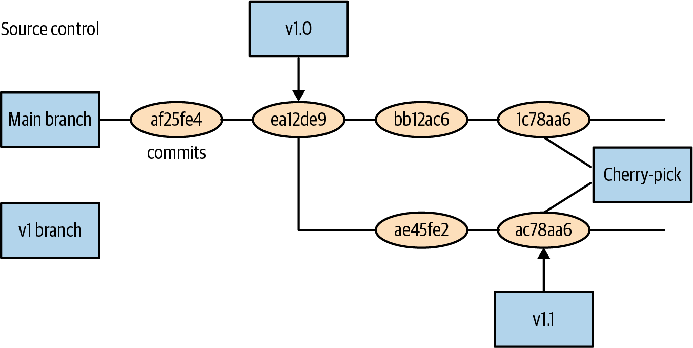
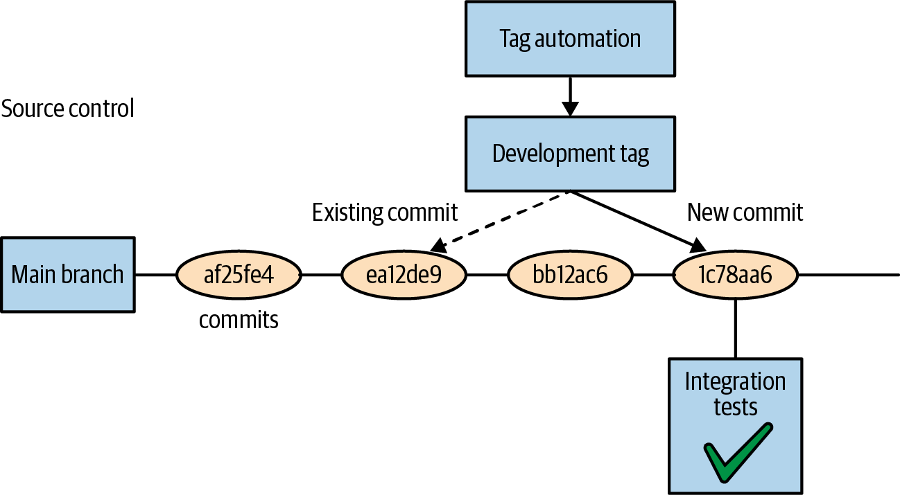

# Chương 22. Tổ chức ứng dụng của bạn

Xuyên suốt cuốn sách này chúng tôi đã mô tả các thành phần khác nhau của một ứng dụng được xây dựng trên Kubernetes. Chúng tôi đã mô tả cách gói các chương trình thành container, đặt các container đó vào Pod, nhân bản các Pod đó với ReplicaSet, và phát hành chúng với Deployment. Chúng tôi thậm chí đã mô tả cách triển khai các ứng dụng stateful và thực tế gom các đối tượng này thành một hệ thống phân tán duy nhất. Nhưng chúng tôi chưa đề cập đến cách thực sự làm việc với một ứng dụng như vậy theo cách thực tế. Làm sao bạn có thể bố trí, chia sẻ, quản lý và cập nhật các cấu hình khác nhau tạo nên ứng dụng của bạn? Đó là chủ đề của chương này.

## Các nguyên tắc dẫn đường

Trước khi đào sâu vào chi tiết cụ thể về cách cấu trúc ứng dụng, đáng để xem xét các mục tiêu thúc đẩy cấu trúc này. Rõ ràng, độ tin cậy và sự linh hoạt là các mục tiêu chung của việc phát triển một ứng dụng cloud native trong Kubernetes, nhưng điều này liên hệ thế nào với cách bạn thiết kế việc bảo trì và triển khai ứng dụng? Các phần sau mô tả ba nguyên tắc có thể hướng dẫn bạn thiết kế một cấu trúc phù hợp nhất với các mục tiêu này. Các nguyên tắc là:

- Xem filesystem là nguồn chân lý (source of truth)
- Thực hiện review code để đảm bảo chất lượng của các thay đổi
- Dùng feature flag để phân giai đoạn rollout và rollback

### Filesystem là nguồn chân lý

Khi bạn lần đầu khám phá Kubernetes, như chúng tôi đã làm ở đầu cuốn sách này, bạn thường tương tác với nó theo kiểu mệnh lệnh. Bạn chạy các lệnh như `kubectl run` hoặc `kubectl edit` để tạo và sửa đổi Pod hoặc các đối tượng khác chạy trong cluster. Ngay cả khi chúng ta bắt đầu khám phá cách viết và dùng file YAML, điều này được trình bày theo cách tùy hứng, như thể chính file chỉ là một trạm dừng trên đường sửa đổi trạng thái của cluster. Trong thực tế, trong một ứng dụng production thực sự, điều ngược lại mới đúng.

Thay vì xem trạng thái của cluster, dữ liệu trong `etcd`, là nguồn chân lý, tối ưu là xem filesystem của các đối tượng YAML là nguồn chân lý cho ứng dụng của bạn. Các đối tượng API được triển khai vào (các) Kubernetes cluster khi đó là sự phản chiếu của chân lý được lưu trong filesystem.

Có nhiều lý do tại sao đây là quan điểm đúng. Trước hết và quan trọng nhất là nó chủ yếu cho phép bạn xem cluster như hạ tầng bất biến. Khi chúng ta chuyển sang kiến trúc cloud native, chúng ta ngày càng thoải mái với ý niệm rằng các ứng dụng và container của chúng là hạ tầng bất biến, nhưng xem cluster như vậy thì ít phổ biến hơn. Tuy vậy, chính các lý do chuyển ứng dụng sang hạ tầng bất biến cũng áp dụng cho các cluster. Nếu cluster của bạn là một "bông tuyết" (snowflake) bạn tạo ra bằng cách áp dụng tùy hứng các file YAML ngẫu nhiên tải từ internet, nó nguy hiểm như một máy ảo được xây dựng từ các script bash mệnh lệnh.

Ngoài ra, quản lý trạng thái cluster qua filesystem giúp rất dễ cộng tác với nhiều thành viên trong đội. Các hệ thống quản lý mã nguồn đã được hiểu rõ và có thể dễ dàng cho phép nhiều người chỉnh sửa trạng thái cluster đồng thời, trong khi làm rõ các xung đột (và cách giải quyết những xung đột đó) cho mọi người.

> **LƯU Ý**
>
> Đây hoàn toàn là nguyên tắc đầu tiên rằng tất cả các ứng dụng được triển khai lên Kubernetes trước hết nên được mô tả trong các file được lưu trong filesystem. Các đối tượng API thực tế khi đó chỉ là sự chiếu của filesystem này vào một cluster cụ thể.

### Vai trò của review code

Không lâu trước đây review code cho mã nguồn ứng dụng còn là một ý tưởng mới lạ. Nhưng giờ đã rõ rằng nhiều người xem một đoạn code trước khi nó được commit vào ứng dụng là thực hành tốt nhất để tạo ra code chất lượng cao, đáng tin cậy.

Do đó thật ngạc nhiên rằng điều tương tự có phần ít đúng hơn đối với các cấu hình được dùng để triển khai những ứng dụng đó. Tất cả các lý do review code đều áp dụng trực tiếp cho cấu hình ứng dụng. Nhưng khi nghĩ về điều đó, cũng rõ ràng rằng review code của các cấu hình này là quan trọng cho việc triển khai đáng tin cậy các service. Theo kinh nghiệm của chúng tôi, hầu hết các sự cố ngừng dịch vụ là tự gây ra qua các hậu quả không mong đợi, lỗi gõ, hoặc các sai lầm đơn giản khác. Đảm bảo ít nhất hai người xem bất kỳ thay đổi cấu hình nào giảm đáng kể khả năng xảy ra những lỗi như vậy.

> **LƯU Ý**
>
> Nguyên tắc thứ hai của bố trí ứng dụng của chúng ta là nó phải tạo điều kiện cho việc review mọi thay đổi được merge vào tập file đại diện cho nguồn chân lý của cluster.

### Feature Gate

Một khi mã nguồn ứng dụng và các file cấu hình triển khai của bạn nằm trong hệ thống quản lý mã nguồn, một trong những câu hỏi phổ biến nhất là các repository này liên hệ với nhau thế nào. Bạn nên dùng cùng một repository cho mã nguồn ứng dụng và cấu hình? Điều này có thể hoạt động với các dự án nhỏ, nhưng trong các dự án lớn hơn thường hợp lý để tách hai thứ này. Ngay cả khi cùng những người chịu trách nhiệm cả xây dựng và triển khai ứng dụng, góc nhìn của người xây dựng so với người triển khai đủ khác biệt để sự phân tách trách nhiệm này có ý nghĩa.

Nếu vậy, làm sao bạn kết nối việc phát triển các tính năng mới trong hệ thống quản lý mã nguồn với việc triển khai các tính năng đó vào môi trường production? Đây là nơi feature gate đóng vai trò quan trọng.

Ý tưởng là khi một tính năng mới được phát triển, việc phát triển đó diễn ra hoàn toàn đằng sau một feature flag hoặc gate. Gate này trông giống như:

```
if (featureFlags.myFlag) {
    // Feature implementation goes here
}
```

Có nhiều lợi ích của cách tiếp cận này. Thứ nhất, nó cho phép đội commit vào nhánh production từ lâu trước khi tính năng sẵn sàng phát hành. Điều này cho phép việc phát triển tính năng bám sát hơn nhiều với HEAD của repository, và do đó bạn tránh được các xung đột merge khủng khiếp của một nhánh tồn tại lâu.

Làm việc đằng sau feature flag cũng có nghĩa là bật một tính năng chỉ đơn giản là thực hiện một thay đổi cấu hình để kích hoạt flag. Điều này làm rất rõ điều gì đã thay đổi trong môi trường production, và rất đơn giản để rollback việc kích hoạt tính năng nếu nó gây ra vấn đề.

Do đó dùng feature flag vừa đơn giản hóa việc gỡ lỗi vừa đảm bảo việc vô hiệu hóa một tính năng không yêu cầu rollback binary về phiên bản code cũ hơn, điều sẽ loại bỏ tất cả các bản sửa lỗi và cải tiến khác của phiên bản mới hơn.

> **LƯU Ý**
>
> Nguyên tắc thứ ba của bố trí ứng dụng là code được đưa vào hệ thống quản lý mã nguồn, mặc định tắt, đằng sau một feature flag, và chỉ được kích hoạt thông qua một thay đổi đã được review code lên các file cấu hình.

## Quản lý ứng dụng trong hệ thống quản lý mã nguồn

Giờ chúng ta đã xác định filesystem nên đại diện cho nguồn chân lý của cluster, câu hỏi quan trọng tiếp theo là cách thực sự bố trí các file trong filesystem. Rõ ràng, filesystem chứa các thư mục phân cấp, và hệ thống quản lý mã nguồn thêm các khái niệm như tag và branch, nên phần này mô tả cách kết hợp chúng để đại diện và quản lý ứng dụng của bạn.

### Bố trí Filesystem

Phần này mô tả cách bố trí một instance của ứng dụng cho một cluster duy nhất. Trong các phần sau, chúng tôi sẽ mô tả cách tham số hóa bố trí này cho nhiều instance. Đáng để làm đúng việc tổ chức này khi bạn bắt đầu. Giống như việc sửa đổi bố trí các package trong hệ thống quản lý mã nguồn, sửa đổi cấu hình triển khai của bạn sau đó là một cuộc tái cấu trúc phức tạp và tốn kém mà có lẽ bạn sẽ không bao giờ có thời gian làm.

Chiều đầu tiên bạn muốn tổ chức ứng dụng là thành phần hoặc tầng ngữ nghĩa (ví dụ, frontend hoặc hàng đợi công việc batch). Mặc dù ban đầu điều này có vẻ quá mức, vì một đội duy nhất quản lý tất cả các thành phần này, nó tạo tiền đề cho việc mở rộng đội; cuối cùng, các đội khác nhau (hoặc đội con) có thể chịu trách nhiệm cho từng thành phần này.

Như vậy, với một ứng dụng có frontend dùng hai service, filesystem có thể trông như thế này:

```
frontend/
service-1/
service-2/
```

Trong mỗi thư mục này, các cấu hình cho từng ứng dụng được lưu. Đây là các file YAML trực tiếp đại diện cho trạng thái hiện tại của cluster. Nói chung hữu ích khi bao gồm cả tên service và loại đối tượng trong cùng một file.

> **LƯU Ý**
>
> Mặc dù Kubernetes cho phép bạn tạo file YAML với nhiều đối tượng trong cùng một file, đây nói chung là một antipattern. Lý do tốt duy nhất để nhóm nhiều đối tượng trong cùng một file là nếu chúng giống hệt về khái niệm. Khi quyết định đưa gì vào một file YAML duy nhất, hãy cân nhắc các nguyên tắc thiết kế tương tự như khi định nghĩa một class hoặc struct. Nếu nhóm các đối tượng lại với nhau không tạo thành một khái niệm duy nhất, có lẽ chúng không nên nằm trong một file.

Như vậy, mở rộng ví dụ trước, filesystem có thể trông như:

```
frontend/
   frontend-deployment.yaml
   frontend-service.yaml
   frontend-ingress.yaml
service-1/
   service-1-deployment.yaml
   service-1-service.yaml
   service-1-configmap.yaml
...
```

### Quản lý các phiên bản định kỳ

Còn về quản lý release? Rất hữu ích khi có thể nhìn lại và thấy triển khai ứng dụng của bạn trước đây trông như thế nào. Tương tự, rất hữu ích khi có thể lặp một cấu hình tiến lên trong khi vẫn triển khai một cấu hình release ổn định.

Do đó, tiện lợi khi có thể đồng thời lưu và duy trì nhiều revision của cấu hình. Có hai cách tiếp cận khác nhau bạn có thể dùng với hệ thống file và quản lý phiên bản mà chúng tôi đã phác thảo ở đây. Thứ nhất là dùng tag, branch và các tính năng của hệ thống quản lý mã nguồn. Điều này tiện lợi vì nó ánh xạ với cách mọi người quản lý revision trong hệ thống quản lý mã nguồn, và dẫn đến cấu trúc thư mục đơn giản hơn. Lựa chọn khác là sao chép cấu hình trong filesystem và dùng các thư mục cho các revision khác nhau. Điều này làm việc xem các cấu hình đồng thời rất đơn giản.

Các cách tiếp cận này có cùng khả năng về quản lý các phiên bản release khác nhau, nên cuối cùng đó là lựa chọn thẩm mỹ giữa hai cách. Chúng tôi sẽ thảo luận cả hai cách tiếp cận và để bạn hoặc đội của bạn quyết định cách nào bạn thích.

#### Quản lý phiên bản với branch và tag

Khi bạn dùng branch và tag để quản lý các revision cấu hình, cấu trúc thư mục không thay đổi so với ví dụ ở phần trước. Khi bạn sẵn sàng cho một release, bạn đặt một tag trong hệ thống quản lý mã nguồn (như `git tag v1.0`) trong hệ thống quản lý mã nguồn cấu hình. Tag đại diện cho cấu hình được dùng cho phiên bản đó, và HEAD của hệ thống quản lý mã nguồn tiếp tục lặp tiến lên.

Cập nhật cấu hình release phức tạp hơn một chút, nhưng cách tiếp cận mô hình hóa những gì bạn sẽ làm trong hệ thống quản lý mã nguồn. Đầu tiên, bạn commit thay đổi vào HEAD của repository. Sau đó bạn tạo một branch mới tên `v1` tại tag `v1.0`. Bạn cherry-pick thay đổi mong muốn lên branch release (`git cherry-pick <edit>`), và cuối cùng, bạn gắn tag `v1.1` cho branch này để chỉ ra một point release mới. Cách tiếp cận này được minh họa trong Hình 22-1.



*Hình 22-1. Quy trình cherry-pick*

> **LƯU Ý**
>
> Một lỗi phổ biến khi cherry-pick các bản sửa vào branch release là chỉ pick thay đổi vào release mới nhất. Nên cherry-pick nó vào tất cả các release đang hoạt động, trong trường hợp bạn cần rollback phiên bản nhưng bản sửa vẫn cần thiết.

#### Quản lý phiên bản với thư mục

Một lựa chọn thay thế cho việc dùng các tính năng của hệ thống quản lý mã nguồn là dùng các tính năng của filesystem. Trong cách tiếp cận này, mỗi triển khai có phiên bản tồn tại trong thư mục riêng của nó. Ví dụ, filesystem cho ứng dụng của bạn có thể trông như thế này:

```
frontend/
  v1/
    frontend-deployment.yaml
    frontend-service.yaml
  current/
    frontend-deployment.yaml
    frontend-service.yaml
service-1/
  v1/
    service-1-deployment.yaml
    service-1-service.yaml
  v2/
    service-1-deployment.yaml
    service-1-service.yaml
  current/
    service-1-deployment.yaml
    service-1-service.yaml
...
```

Như vậy, mỗi revision tồn tại trong một cấu trúc thư mục song song trong một thư mục liên kết với release. Tất cả các triển khai diễn ra từ HEAD thay vì từ các revision hoặc tag cụ thể. Bạn sẽ thêm cấu hình mới vào các file trong thư mục `current`.

Khi tạo một release mới, bạn sao chép thư mục `current` để tạo một thư mục mới liên kết với release mới.

Khi bạn thực hiện một thay đổi sửa lỗi cho một release, pull request của bạn phải sửa đổi file YAML trong tất cả các thư mục release liên quan. Đây là trải nghiệm tốt hơn một chút so với cách tiếp cận cherry-pick được mô tả trước đó, vì rõ ràng trong một yêu cầu thay đổi duy nhất rằng tất cả các phiên bản liên quan đang được cập nhật với cùng thay đổi, thay vì yêu cầu một cherry-pick cho mỗi phiên bản.

## Cấu trúc ứng dụng cho phát triển, kiểm thử và triển khai

Ngoài việc cấu trúc ứng dụng cho nhịp release định kỳ, bạn cũng muốn cấu trúc ứng dụng để cho phép phát triển Agile, kiểm thử chất lượng và triển khai an toàn. Điều này cho phép các nhà phát triển thực hiện và kiểm thử các thay đổi lên ứng dụng phân tán nhanh chóng và phát hành các thay đổi đó cho khách hàng một cách an toàn.

### Mục tiêu

Có hai mục tiêu cho ứng dụng của bạn về phát triển và kiểm thử. Thứ nhất là mỗi nhà phát triển nên có thể dễ dàng phát triển các tính năng mới cho ứng dụng. Trong hầu hết các trường hợp, nhà phát triển chỉ làm việc trên một thành phần duy nhất, nhưng thành phần đó được kết nối với tất cả các microservice khác trong cluster. Do đó, để tạo điều kiện phát triển, điều thiết yếu là các nhà phát triển có thể làm việc trong môi trường riêng của họ với tất cả các service có sẵn.

Mục tiêu khác là cấu trúc ứng dụng để kiểm thử dễ dàng và chính xác trước khi triển khai. Điều này thiết yếu để phát hành các tính năng nhanh chóng trong khi duy trì độ tin cậy cao.

### Tiến trình của một Release

Để đạt được cả hai mục tiêu này, điều quan trọng là liên hệ các giai đoạn phát triển với các phiên bản release được mô tả trước đó. Các giai đoạn của một release là:

**HEAD**

Đỉnh mới nhất của cấu hình; các thay đổi mới nhất.

**Development**

Phần lớn ổn định, nhưng chưa sẵn sàng để triển khai. Phù hợp cho các nhà phát triển dùng để xây dựng tính năng.

**Staging**

Khởi đầu của kiểm thử, không có khả năng thay đổi trừ khi tìm thấy vấn đề.

**Canary**

Release thực sự đầu tiên cho người dùng, được dùng để kiểm tra các vấn đề với lưu lượng thực tế và cũng cho người dùng cơ hội thử những gì sắp tới.

**Release**

Release production hiện tại.

#### Giới thiệu tag development

Bất kể bạn cấu trúc release bằng filesystem hay hệ thống quản lý phiên bản, cách đúng để mô hình hóa giai đoạn development là qua một tag trong hệ thống quản lý mã nguồn. Điều này là vì development tất yếu di chuyển nhanh khi nó theo dõi sự ổn định chỉ hơi phía sau `HEAD`.

Để giới thiệu giai đoạn development, bạn thêm một tag `development` mới vào hệ thống quản lý mã nguồn và dùng một quy trình tự động để di chuyển tag này tiến lên. Theo nhịp định kỳ, bạn sẽ kiểm thử `HEAD` qua kiểm thử tích hợp tự động. Nếu các kiểm thử này vượt qua, bạn di chuyển tag `development` tiến lên `HEAD`. Như vậy, các nhà phát triển có thể theo dõi khá gần với các thay đổi mới nhất khi triển khai môi trường riêng của họ, nhưng cũng được đảm bảo rằng các cấu hình được triển khai ít nhất đã vượt qua một smoke test giới hạn. Cách tiếp cận này được minh họa trong Hình 22-2.



*Hình 22-2. Quy trình tag development*

#### Ánh xạ các giai đoạn với revision

Có thể hấp dẫn để giới thiệu một tập cấu hình mới cho từng giai đoạn này, nhưng trong thực tế, mọi kết hợp của phiên bản và giai đoạn sẽ tạo ra một mớ hỗn độn rất khó suy luận. Thay vào đó, thực hành đúng là giới thiệu một ánh xạ giữa revision và giai đoạn.

Bất kể bạn đang dùng filesystem hay revision của hệ thống quản lý mã nguồn để đại diện các phiên bản cấu hình khác nhau, dễ dàng hiện thực một ánh xạ từ giai đoạn đến revision. Trong trường hợp filesystem, bạn có thể dùng symbolic link để ánh xạ tên giai đoạn đến một revision:

```
frontend/
   canary/ -> v2/
   release/ -> v1/
   v1/
       frontend-deployment.yaml
...
```

Với hệ thống quản lý phiên bản, đó đơn giản là một tag bổ sung tại cùng revision với phiên bản thích hợp.

Trong cả hai trường hợp, việc quản lý phiên bản tiến hành bằng các quy trình được mô tả trước đó, và các giai đoạn được di chuyển tiến lên các phiên bản mới một cách riêng biệt khi thích hợp. Về hiệu quả, điều này có nghĩa là có hai quy trình đồng thời: thứ nhất để cắt các phiên bản release mới và thứ hai để xác nhận một phiên bản release cho một giai đoạn cụ thể trong vòng đời ứng dụng.

## Tham số hóa ứng dụng với Template

Một khi bạn có tích Descartes của các môi trường và giai đoạn, việc giữ tất cả chúng hoàn toàn giống nhau trở nên không thực tế hoặc bất khả thi. Tuy vậy, điều quan trọng là cố gắng để các môi trường càng giống nhau càng tốt. Sự khác biệt và trôi dạt giữa các môi trường khác nhau tạo ra các "bông tuyết" và các hệ thống khó suy luận. Nếu môi trường staging của bạn khác với môi trường release, bạn có thể thực sự tin tưởng các bài kiểm tra tải bạn đã chạy trong môi trường staging để xác nhận một release không? Để đảm bảo các môi trường của bạn giữ càng tương tự càng tốt, hữu ích khi dùng các môi trường được tham số hóa. Các môi trường được tham số hóa dùng template cho phần lớn cấu hình của chúng, nhưng chúng trộn vào một tập giới hạn các tham số để tạo ra cấu hình cuối cùng. Theo cách này, phần lớn cấu hình được chứa trong một template dùng chung, trong khi việc tham số hóa bị giới hạn về phạm vi và được duy trì trong một file tham số nhỏ để dễ trực quan hóa sự khác biệt giữa các môi trường.

### Tham số hóa với Helm và Template

Có nhiều ngôn ngữ khác nhau để tạo các cấu hình được tham số hóa. Nói chung tất cả đều chia các file thành một file template, chứa phần lớn cấu hình, và một file tham số, có thể được kết hợp với template để tạo ra cấu hình hoàn chỉnh. Ngoài các tham số, hầu hết các ngôn ngữ template cho phép các tham số có giá trị mặc định nếu không có giá trị nào được chỉ định.

Sau đây đưa ra các ví dụ về cách tham số hóa cấu hình bằng Helm, một trình quản lý gói cho Kubernetes. Bất kể những người sùng bái các ngôn ngữ khác nhau có thể nói gì, tất cả các ngôn ngữ tham số hóa phần lớn là tương đương, và như với ngôn ngữ lập trình, ngôn ngữ nào bạn thích phần lớn là vấn đề phong cách cá nhân hoặc đội. Do đó, các mẫu được mô tả ở đây cho Helm áp dụng bất kể ngôn ngữ template bạn chọn.

Ngôn ngữ template của Helm dùng cú pháp "mustache":

```yaml
metadata:
  name: {{ .Release.Name }}-deployment
```

Điều này cho biết `Release.Name` nên được thay thế bằng tên của một deployment.

Để truyền tham số cho giá trị này, bạn dùng một file *values.yaml* với nội dung như:

```yaml
Release:
  Name: my-release
```

Sau khi thay thế tham số, kết quả là:

```yaml
metadata:
  name: my-release-deployment
```

### Bố trí Filesystem cho tham số hóa

Giờ bạn đã hiểu cách tham số hóa cấu hình, bạn áp dụng điều đó vào bố trí filesystem thế nào? Thay vì xem mỗi giai đoạn vòng đời triển khai như một con trỏ đến một phiên bản, hãy nghĩ về mỗi vòng đời triển khai như sự kết hợp của một file tham số và một con trỏ đến một phiên bản cụ thể. Ví dụ, trong bố trí dựa trên thư mục, nó có thể trông như thế này:

```
frontend/
  staging/
    templates -> ../v2
    staging-parameters.yaml
  production/
    templates -> ../v1
    production-parameters.yaml
  v1/
    frontend-deployment.yaml
    frontend-service.yaml
  v2/
    frontend-deployment.yaml
    frontend-service.yaml
...
```

Làm điều này với hệ thống quản lý phiên bản trông tương tự, ngoại trừ các tham số cho mỗi giai đoạn vòng đời được giữ ở gốc của cây thư mục cấu hình:

```
frontend/
  staging-parameters.yaml
  templates/
    frontend-deployment.YAML
...
```

## Triển khai ứng dụng của bạn khắp thế giới

Giờ bạn đã có nhiều phiên bản của ứng dụng di chuyển qua nhiều giai đoạn triển khai, bước cuối cùng trong việc cấu trúc cấu hình là triển khai ứng dụng khắp thế giới. Nhưng đừng nghĩ những cách tiếp cận này chỉ dành cho các ứng dụng quy mô lớn. Bạn có thể dùng chúng để mở rộng từ hai vùng khác nhau đến hàng chục hoặc hàng trăm khắp thế giới. Trên cloud, nơi toàn bộ một vùng có thể thất bại, triển khai đến nhiều vùng (và quản lý triển khai đó) là cách duy nhất để đạt được thời gian hoạt động đủ cho những người dùng khắt khe.

### Kiến trúc cho triển khai toàn cầu

Nói chung, mỗi Kubernetes cluster được dự định sống trong một vùng duy nhất và chứa một triển khai hoàn chỉnh, duy nhất của ứng dụng. Do đó, triển khai toàn cầu của một ứng dụng bao gồm nhiều Kubernetes cluster khác nhau, mỗi cái có cấu hình ứng dụng riêng. Mô tả cách thực sự xây dựng một ứng dụng toàn cầu, đặc biệt với các chủ đề phức tạp như nhân bản dữ liệu, nằm ngoài phạm vi chương này, nhưng chúng tôi sẽ mô tả cách sắp xếp các cấu hình ứng dụng trong filesystem.

Cấu hình của một vùng cụ thể về khái niệm giống với một giai đoạn trong vòng đời triển khai. Như vậy, thêm nhiều vùng vào cấu hình của bạn giống hệt với việc thêm các giai đoạn vòng đời mới. Ví dụ, thay vì:

- Development
- Staging
- Canary
- Production

Bạn có thể có:

- Development
- Staging
- Canary
- EastUS
- WestUS
- Europe
- Asia

Mô hình hóa điều này trong filesystem cho cấu hình trông như:

```
frontend/
  staging/
    templates -> ../v3/
    parameters.yaml
  eastus/
    templates -> ../v1/
    parameters.yaml
  westus/
    templates -> ../v2/
    parameters.yaml
  ...
```

Nếu thay vào đó bạn dùng hệ thống quản lý phiên bản và tag, filesystem sẽ trông như:

```
frontend/
  staging-parameters.yaml
  eastus-parameters.yaml
  westus-parameters.yaml
  templates/
    frontend-deployment.yaml
...
```

Sử dụng cấu trúc này, bạn sẽ giới thiệu một tag mới cho mỗi vùng và dùng nội dung file tại tag đó để triển khai đến vùng đó.

### Hiện thực triển khai toàn cầu

Giờ bạn đã có cấu hình cho mỗi vùng khắp thế giới, câu hỏi trở thành làm sao cập nhật các vùng khác nhau đó. Một trong những mục tiêu chính của việc dùng nhiều vùng là đảm bảo độ tin cậy và thời gian hoạt động rất cao. Mặc dù có thể hấp dẫn để giả định rằng các sự cố cloud và trung tâm dữ liệu là nguyên nhân chính của thời gian ngừng hoạt động, sự thật là các sự cố nói chung do các phiên bản phần mềm mới được phát hành gây ra. Vì điều này, chìa khóa cho một hệ thống có tính sẵn sàng cao là giới hạn tác động, hay "bán kính vụ nổ", của bất kỳ thay đổi nào bạn có thể thực hiện. Do đó, khi bạn phát hành một phiên bản qua nhiều vùng, hợp lý để di chuyển cẩn thận từ vùng này sang vùng khác, và xác thực cũng như có được sự tự tin ở một vùng trước khi chuyển sang vùng tiếp theo.

Phát hành phần mềm khắp thế giới nói chung trông giống một quy trình làm việc hơn là một cập nhật khai báo duy nhất: bạn bắt đầu bằng cách cập nhật phiên bản trong staging lên phiên bản mới nhất rồi tiến hành qua tất cả các vùng cho đến khi nó được phát hành ở mọi nơi. Nhưng bạn nên cấu trúc các vùng khác nhau như thế nào, và bạn nên chờ bao lâu để xác thực giữa các vùng?

> **LƯU Ý**
>
> Bạn có thể dùng các công cụ như GitHub Actions để tự động hóa quy trình triển khai. Chúng cung cấp cú pháp khai báo để định nghĩa quy trình của bạn và cũng được lưu trong hệ thống quản lý mã nguồn.

Để xác định khoảng thời gian giữa các đợt rollout đến các vùng, hãy xem xét "thời gian trung bình để bốc khói" (mean time to smoke) cho phần mềm của bạn. Đây là thời gian trung bình sau khi một release mới được phát hành đến một vùng để một vấn đề (nếu tồn tại) được phát hiện. Rõ ràng, mỗi vấn đề là duy nhất và có thể mất khoảng thời gian khác nhau để tự bộc lộ, và đó là lý do bạn muốn hiểu thời gian trung bình. Quản lý phần mềm ở quy mô lớn là việc của xác suất, không phải sự chắc chắn, nên bạn muốn chờ một khoảng thời gian làm cho xác suất lỗi đủ thấp để bạn thoải mái chuyển sang vùng tiếp theo. Khoảng hai đến ba lần thời gian trung bình để bốc khói có lẽ là một nơi hợp lý để bắt đầu, nhưng nó rất biến động tùy vào ứng dụng của bạn.

Để xác định thứ tự các vùng, điều quan trọng là xem xét các đặc tính của các vùng khác nhau. Ví dụ, bạn có khả năng có các vùng lưu lượng cao và các vùng lưu lượng thấp. Tùy vào ứng dụng, bạn có thể có các tính năng phổ biến hơn ở một khu vực địa lý so với khu vực khác. Tất cả các đặc tính này nên được xem xét khi lập lịch release. Bạn có lẽ muốn bắt đầu bằng cách phát hành đến một vùng lưu lượng thấp. Điều này đảm bảo bất kỳ vấn đề sớm nào bạn bắt được đều bị giới hạn ở một khu vực ít tác động. Mặc dù không phải quy tắc cứng nhắc, các vấn đề sớm thường là nghiêm trọng nhất, vì chúng biểu hiện đủ nhanh để bị bắt ở vùng đầu tiên bạn phát hành đến. Do đó, tối thiểu hóa tác động của những vấn đề như vậy lên khách hàng là hợp lý. Tiếp theo, phát hành đến một vùng lưu lượng cao. Một khi bạn đã xác thực thành công release hoạt động đúng qua vùng lưu lượng thấp, hãy xác thực nó hoạt động đúng ở quy mô lớn. Cách duy nhất để làm điều này là phát hành đến một vùng lưu lượng cao duy nhất. Khi bạn đã phát hành thành công đến cả vùng lưu lượng thấp và cao, bạn có thể tự tin rằng ứng dụng có thể phát hành an toàn ở mọi nơi. Tuy nhiên, nếu có các biến thể theo vùng, bạn có thể cũng muốn kiểm thử chậm qua nhiều địa lý khác nhau trước khi đẩy release rộng hơn.

Khi bạn lập lịch release, điều quan trọng là tuân theo nó hoàn toàn cho mọi release, bất kể lớn hay nhỏ. Nhiều sự cố đã được gây ra bởi những người tăng tốc release, hoặc để sửa vấn đề khác hoặc vì họ tin rằng nó "an toàn".

### Dashboard và giám sát cho triển khai toàn cầu

Có thể trông như một khái niệm kỳ lạ khi bạn đang phát triển ở quy mô nhỏ, nhưng một vấn đề đáng kể bạn có thể gặp ở quy mô trung bình hoặc lớn là có các phiên bản khác nhau của ứng dụng được triển khai đến các vùng khác nhau. Điều này có thể xảy ra vì nhiều lý do (như, vì một release đã thất bại, bị hủy bỏ, hoặc gặp vấn đề ở một vùng cụ thể), và nếu bạn không theo dõi cẩn thận bạn có thể nhanh chóng kết thúc với một "bông tuyết" không thể quản lý gồm các phiên bản khác nhau được triển khai khắp thế giới. Hơn nữa, khi khách hàng hỏi về các bản sửa lỗi họ đang gặp, một câu hỏi phổ biến sẽ trở thành: "Nó đã được triển khai chưa?"

Do đó, điều thiết yếu là phát triển các dashboard, có thể cho bạn biết ngay phiên bản nào đang chạy ở vùng nào, cũng như cảnh báo, sẽ kích hoạt khi quá nhiều phiên bản của ứng dụng được triển khai. Một thực hành tốt nhất là giới hạn số phiên bản đang hoạt động không quá ba: một đang kiểm thử, một đang phát hành, và một đang được thay thế bởi đợt phát hành. Nhiều phiên bản hoạt động hơn thế này là chuốc lấy rắc rối.

## Tóm tắt

Chương này cung cấp hướng dẫn về cách quản lý một ứng dụng Kubernetes qua các phiên bản phần mềm, các giai đoạn triển khai và các vùng khắp thế giới. Nó nêu bật các nguyên tắc nền tảng của việc tổ chức ứng dụng: dựa vào filesystem để tổ chức, dùng review code để đảm bảo các thay đổi chất lượng, và dựa vào feature flag, hay gate, để dễ dàng thêm và xóa chức năng tăng dần.

Như với mọi thứ, các công thức trong chương này nên được xem là nguồn cảm hứng, thay vì chân lý tuyệt đối. Hãy đọc hướng dẫn, và tìm sự kết hợp các cách tiếp cận hoạt động tốt nhất cho hoàn cảnh cụ thể của ứng dụng bạn. Nhưng hãy nhớ rằng khi bố trí ứng dụng để triển khai, bạn đang thiết lập một quy trình mà bạn có thể sẽ phải sống cùng trong nhiều năm.
