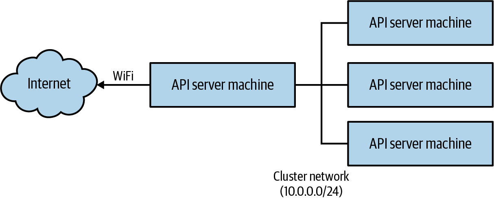

# Phụ lục. Tự xây dựng Kubernetes Cluster của bạn

Mặc dù Kubernetes thường được trải nghiệm qua thế giới ảo của điện toán public cloud, nơi thứ gần nhất bạn tiếp cận cluster của mình là một trình duyệt web hoặc một terminal, việc xây dựng vật lý một Kubernetes cluster trên bare metal có thể là một trải nghiệm rất bổ ích. Tương tự, không gì so được với việc rút nguồn điện hoặc mạng của một node và xem Kubernetes phản ứng để phục hồi ứng dụng của bạn, để thuyết phục bạn về tính hữu ích của nó.

Tự xây dựng cluster có vẻ vừa là một nỗ lực thách thức vừa tốn kém, nhưng may mắn thay nó không phải cả hai. Khả năng mua các bo mạch máy tính system-on-chip giá rẻ, cũng như rất nhiều công việc của cộng đồng để làm Kubernetes dễ cài đặt hơn, có nghĩa là có thể xây dựng một Kubernetes cluster nhỏ trong vài giờ.

Trong các hướng dẫn sau, chúng tôi tập trung vào việc xây dựng một cluster gồm các máy Raspberry Pi, nhưng với những điều chỉnh nhỏ, các hướng dẫn tương tự có thể được áp dụng cho nhiều máy bo mạch đơn khác nhau hoặc bất kỳ máy tính nào khác bạn có sẵn.

## Danh sách linh kiện

Điều đầu tiên bạn cần làm là tập hợp các linh kiện cho cluster. Trong tất cả các ví dụ ở đây, chúng tôi giả định một cluster bốn node. Bạn có thể xây dựng cluster ba node, hoặc thậm chí cluster một trăm node nếu muốn, nhưng bốn là một con số khá tốt. Để bắt đầu, bạn cần mua (hoặc lục lọi) các linh kiện khác nhau cần thiết để xây dựng cluster.

Đây là danh sách mua sắm, với một số giá xấp xỉ tại thời điểm viết:

1. Bốn máy Raspberry Pi 4 với ít nhất 2 GB bộ nhớ: $180
2. Bốn thẻ nhớ SDHC, ít nhất 8 GB (hãy mua loại chất lượng cao!): $30–50
3. Bốn cáp Ethernet Cat. 6 dài 12 inch: $10
4. Bốn cáp USB-A sang USB-C dài 12 inch: $10
5. Một switch fast Ethernet 10/100 5 cổng: $10
6. Một bộ sạc USB 5 cổng: $25
7. Một vỏ Raspberry Pi xếp chồng có thể chứa bốn Pi: $40 (hoặc tự làm)
8. Một đầu USB-to-barrel để cấp nguồn cho switch Ethernet (tùy chọn): $5

Tổng cho cluster khoảng $300, có thể giảm xuống $200 bằng cách xây dựng cluster ba node và bỏ vỏ cùng cáp nguồn USB cho switch (mặc dù vỏ và cáp thực sự làm toàn bộ cluster gọn gàng hơn).

Một lưu ý khác về thẻ nhớ: đừng tiết kiệm ở đây. Thẻ nhớ giá rẻ hành xử không thể đoán trước và làm cluster của bạn thực sự không ổn định. Nếu bạn muốn tiết kiệm tiền, hãy mua thẻ nhỏ hơn, chất lượng cao. Thẻ 8 GB chất lượng cao có thể mua với giá khoảng $7 mỗi thẻ trên mạng.

Một khi bạn đã có linh kiện, bạn sẵn sàng chuyển sang xây dựng cluster.

> **LƯU Ý**
>
> Các hướng dẫn này cũng giả định bạn có một thiết bị có khả năng ghi (flash) thẻ SDHC. Nếu không, bạn sẽ cần mua một đầu đọc/ghi thẻ nhớ USB.

## Ghi Image

Image Ubuntu 20.04 mặc định hỗ trợ Raspberry Pi 4 và cũng là hệ điều hành phổ biến được nhiều Kubernetes cluster sử dụng. Cách dễ nhất để cài đặt là dùng Raspberry Pi Imager do dự án Raspberry Pi cung cấp:

- macOS
- Windows
- Linux

Dùng imager để ghi image Ubuntu 20.04 lên từng thẻ nhớ của bạn. Ubuntu có thể không phải là lựa chọn image mặc định trong imager, nhưng bạn có thể chọn nó như một tùy chọn.

## Khởi động lần đầu

Điều đầu tiên cần làm là chỉ khởi động node API server. Lắp ráp cluster, và quyết định node nào sẽ là node API server. Cắm thẻ nhớ, cắm bo mạch vào đầu ra HDMI, và cắm bàn phím vào cổng USB.

Tiếp theo, cắm nguồn để khởi động bo mạch.

Đăng nhập tại dấu nhắc bằng tên người dùng `ubuntu` và mật khẩu `ubuntu`.

> **CẢNH BÁO**
>
> Điều đầu tiên bạn nên làm với Raspberry Pi (hoặc bất kỳ thiết bị mới nào) là thay đổi mật khẩu mặc định. Mật khẩu mặc định cho mọi loại cài đặt ở mọi nơi đều được biết rõ bởi những người sẽ làm điều xấu khi có đăng nhập mặc định vào một hệ thống. Điều này làm internet kém an toàn hơn cho mọi người. Vui lòng thay đổi mật khẩu mặc định của bạn!

Lặp lại các bước này cho từng node trong cluster.

## Thiết lập mạng

Bước tiếp theo là thiết lập mạng trên API server. Thiết lập mạng cho Kubernetes cluster có thể phức tạp. Trong ví dụ sau, chúng ta thiết lập một mạng trong đó một máy duy nhất được gắn vào internet bằng mạng không dây; máy này cũng được kết nối với mạng cluster qua Ethernet có dây và cung cấp một DHCP (Dynamic Host Configuration Protocol) server để cấp địa chỉ mạng cho các node còn lại trong cluster. Minh họa của mạng này được thể hiện ở đây:



Quyết định bo mạch nào sẽ chứa API server và `etcd`. Thường dễ nhớ nhất bằng cách đặt nó làm node trên cùng hoặc dưới cùng trong chồng của bạn, nhưng một loại nhãn nào đó cũng được.

Để làm điều này, chỉnh sửa file */etc/netplan/50-cloud-init.yaml*. Nếu file này không tồn tại, bạn có thể tạo nó. Nội dung của file nên trông như:

```yaml
network:
    version: 2
    ethernets:
        eth0:
            dhcp4: false
            dhcp6: false
            addresses:
            - '10.0.0.1/24'
            optional: true
    wifis:
        wlan0:
            access-points:
                <your-ssid-here>:
                    password: '<your-password-here>'
            dhcp4: true
            optional: true
```

Điều này đặt giao diện Ethernet chính có địa chỉ được cấp tĩnh 10.0.0.1 và thiết lập giao diện WiFi để kết nối với WiFi cục bộ của bạn. Sau đó bạn nên chạy `sudo netplan apply` để áp dụng các thay đổi mới này.

Khởi động lại máy để nhận địa chỉ 10.0.0.1. Bạn có thể xác nhận điều này được đặt đúng bằng cách chạy `ip addr` và xem địa chỉ cho giao diện `eth0`. Cũng xác nhận kết nối internet hoạt động đúng.

Tiếp theo, chúng ta sẽ cài đặt DHCP trên API server này để nó cấp địa chỉ cho các worker node. Chạy:

```
$ apt-get install isc-dhcp-server
```

Sau đó cấu hình DHCP server như sau (*/etc/dhcp/dhcpd.conf*):

```
# Set a domain name, can basically be anything
option domain-name "cluster.home";

# Use Google DNS by default, you can substitute ISP-supplied values here
option domain-name-servers 8.8.8.8, 8.8.4.4;
# We'll use 10.0.0.X for our subnet
subnet 10.0.0.0 netmask 255.255.255.0 {
    range 10.0.0.1 10.0.0.10;
    option subnet-mask 255.255.255.0;
    option broadcast-address 10.0.0.255;
    option routers 10.0.0.1;
}
default-lease-time 600;
max-lease-time 7200;
authoritative;
```

Bạn cũng có thể cần chỉnh sửa */etc/default/isc-dhcp-server* để đặt biến môi trường `INTERFACES` thành `eth0`. Khởi động lại DHCP server bằng `sudo systemctl restart isc-dhcp-server`. Giờ máy của bạn nên đang phát địa chỉ IP. Bạn có thể kiểm tra điều này bằng cách nối một máy thứ hai vào switch qua Ethernet. Máy thứ hai này nên nhận địa chỉ 10.0.0.2 từ DHCP server.

Hãy nhớ chỉnh sửa file */etc/hostname* để đổi tên máy này thành `node-1`. Để giúp Kubernetes thực hiện mạng, bạn cũng cần thiết lập `iptables` để nó có thể thấy lưu lượng mạng được bridge. Tạo một file tại */etc/modules-load.d/k8s.conf* chỉ chứa `br_netfilter`. Điều này sẽ tải module `br_netfilter` vào kernel của bạn.

Tiếp theo bạn cần bật một số thiết lập `systemctl` cho network bridging và dịch địa chỉ (NAT) để mạng Kubernetes hoạt động, và các node của bạn có thể tiếp cận internet công cộng. Tạo một file tên */etc/sysctl.d/k8s.conf* và thêm:

```
net.ipv4.ip_forward=1
net.bridge.bridge-nf-call-ip6tables=1
net.bridge.bridge-nf-call-iptables=1
```

Sau đó chỉnh sửa */etc/rc.local* (hoặc tương đương) và thêm các quy tắc `iptables` để chuyển tiếp từ `eth0` sang `wlan0` (và ngược lại):

```
iptables -t nat -A POSTROUTING -o wlan0 -j MASQUERADE
iptables -A FORWARD -i wlan0 -o eth0 -m state \
    --state RELATED,ESTABLISHED -j ACCEPT
iptables -A FORWARD -i eth0 -o wlan0 -j ACCEPT
```

Tại thời điểm này, thiết lập mạng cơ bản nên đã hoàn tất. Cắm và bật nguồn hai bo mạch còn lại (bạn nên thấy chúng được gán địa chỉ 10.0.0.3 và 10.0.0.4). Chỉnh sửa file */etc/hostname* trên mỗi máy để đặt tên chúng lần lượt là `node-2` và `node-3`.

Xác nhận điều này bằng cách xem */var/lib/dhcp/dhcpd.leases* trước, rồi SSH vào các node (hãy nhớ lại là đổi mật khẩu mặc định trước tiên). Xác nhận các node có thể kết nối với internet bên ngoài.

> **PHẦN THÊM**
>
> Có vài bước bổ sung bạn có thể thực hiện để quản lý cluster dễ hơn. Thứ nhất là chỉnh sửa */etc/hosts* trên mỗi máy để ánh xạ tên đến địa chỉ đúng. Trên mỗi máy, thêm:
>
> ```
> ...
> 10.0.0.1 kubernetes
> 10.0.0.2 node-1
> 10.0.0.3 node-2
> 10.0.0.4 node-3
> ...
> ```
>
> Giờ bạn có thể dùng những tên đó khi kết nối đến các máy đó.
>
> Thứ hai là thiết lập truy cập SSH không cần mật khẩu. Để làm điều này, chạy `ssh-keygen` rồi sao chép file *$HOME/.ssh/id_rsa.pub* vào */home/ubuntu/.ssh/authorized_keys* trên `node-1`, `node-2` và `node-3`.

## Cài đặt Container Runtime

Trước khi có thể cài đặt Kubernetes, bạn cần cài đặt một container runtime. Có một số runtime khả dĩ bạn có thể dùng, nhưng được áp dụng rộng rãi nhất là `containerd` từ Docker. `containerd` được cung cấp bởi trình quản lý gói Ubuntu tiêu chuẩn, nhưng phiên bản của nó thường hơi lạc hậu. Tốn công hơn một chút, nhưng chúng tôi khuyến nghị cài đặt nó từ chính dự án Docker.

Bước đầu tiên là thiết lập Docker làm repository để cài đặt các gói trên hệ thống của bạn:

```
# Add some prerequisites
sudo apt-get install ca-certificates curl gnupg lsb-release

# Install Docker's signing key
curl -fsSL https://download.docker.com/linux/ubuntu/gpg | sudo gpg --dearmor \
-o /usr/share/keyrings/docker-archive-keyring.gpg
```

Bước cuối, tạo file */etc/apt/sources.list.d/docker.list* với nội dung sau:

```
deb [arch=arm64 signed-by=/usr/share/keyrings/docker-archive-keyring.gpg]
https://download.docker.com/linux/ubuntu focal stable
```

Giờ bạn đã cài đặt Docker package repository, bạn có thể cài đặt `containerd.io` bằng cách chạy lệnh sau. Điều quan trọng là cài đặt `containerd.io`, không phải `containerd`, để lấy gói Docker thay vì gói Ubuntu mặc định:

```
sudo apt-get update; sudo apt-get install containerd.io
```

Tại thời điểm này, `containerd` đã được cài đặt, nhưng bạn cần cấu hình nó vì cấu hình do gói cung cấp sẽ không hoạt động với Kubernetes:

```
containerd config default > config.toml
sudo mv config.toml /etc/containerd/config.toml

# Restart to pick up the config
sudo systemctl restart containerd
```

Giờ bạn đã cài đặt một container runtime, bạn có thể chuyển sang cài đặt chính Kubernetes.

## Cài đặt Kubernetes

Tại thời điểm này bạn nên có tất cả các node đang chạy với địa chỉ IP và có khả năng truy cập internet. Giờ là lúc cài đặt Kubernetes trên tất cả các node. Dùng SSH, chạy các lệnh sau trên tất cả các node để cài đặt các công cụ `kubelet` và `kubeadm`.

Đầu tiên, thêm khóa mã hóa cho các gói:

```
# curl -s https://packages.cloud.google.com/apt/doc/apt-key.gpg \
| sudo apt-key add -
```

Sau đó thêm repository vào danh sách repository của bạn:

```
# echo "deb http://apt.kubernetes.io/ kubernetes-xenial main" \
  | sudo tee /etc/apt/sources.list.d/kubernetes.list
```

Cuối cùng, cập nhật và cài đặt các công cụ Kubernetes. Điều này cũng sẽ cập nhật tất cả các gói trên hệ thống của bạn cho chắc:

```
# sudo apt-get update
$ sudo apt-get upgrade
$ sudo apt-get install -y kubelet kubeadm kubectl kubernetes-cni
```

## Thiết lập Cluster

Trên node API server (node đang chạy DHCP và kết nối với internet), chạy:

```
$ sudo kubeadm init --pod-network-cidr 10.244.0.0/16 \
    --apiserver-advertise-address 10.0.0.1 \
    --apiserver-cert-extra-sans kubernetes.cluster.home
```

Lưu ý rằng bạn đang quảng bá địa chỉ IP hướng nội bộ của mình, không phải địa chỉ bên ngoài.

Cuối cùng, lệnh này sẽ in ra một lệnh để gia nhập các node vào cluster của bạn. Nó sẽ trông giống như:

```
$ kubeadm join --token=<token> 10.0.0.1
```

SSH vào từng worker node trong cluster và chạy lệnh đó.

Khi tất cả những điều đó hoàn tất, bạn nên có thể chạy lệnh này và thấy cluster đang hoạt động của mình:

```
$ kubectl get nodes
```

## Thiết lập mạng Cluster

Bạn đã thiết lập mạng cấp node, nhưng bạn vẫn cần thiết lập mạng Pod-đến-Pod. Vì tất cả các node trong cluster của bạn đang chạy trên cùng một mạng Ethernet vật lý, bạn có thể đơn giản thiết lập các quy tắc định tuyến đúng trong kernel của host.

Cách dễ nhất để quản lý điều này là dùng công cụ Flannel do CoreOS tạo ra và hiện được dự án Flannel hỗ trợ. Flannel hỗ trợ một số chế độ định tuyến khác nhau; chúng ta sẽ dùng chế độ `host-gw`. Bạn có thể tải một cấu hình ví dụ từ trang dự án Flannel:

```
$ curl https://oreil.ly/kube-flannelyml \
  > kube-flannel.yaml
```

Cấu hình mặc định mà Flannel cung cấp dùng chế độ `vxlan` thay thế. Để sửa điều này, mở file cấu hình đó trong trình soạn thảo yêu thích của bạn; thay `vxlan` bằng `host-gw`.

Bạn cũng có thể làm điều này với công cụ `sed` tại chỗ:

```
$ curl https://oreil.ly/kube-flannelyml \
    | sed "s/vxlan/host-gw/g" \
    > kube-flannel.yaml
```

Một khi bạn có file *kube-flannel.yaml* đã cập nhật, bạn có thể tạo thiết lập mạng Flannel bằng:

```
$ kubectl apply -f kube-flannel.yaml
```

Lệnh này sẽ tạo hai đối tượng, một ConfigMap dùng để cấu hình Flannel và một DaemonSet chạy daemon Flannel thực sự. Bạn có thể kiểm tra chúng bằng:

```
$ kubectl describe --namespace=kube-system configmaps/kube-flannel-cfg
$ kubectl describe --namespace=kube-system daemonsets/kube-flannel-ds
```

## Tóm tắt

Tại thời điểm này, bạn nên có một Kubernetes cluster đang hoạt động trên các Raspberry Pi của mình. Điều này có thể rất tuyệt để khám phá Kubernetes. Hãy lên lịch một số job, mở UI, và thử phá cluster của bạn bằng cách khởi động lại máy hoặc ngắt mạng.
