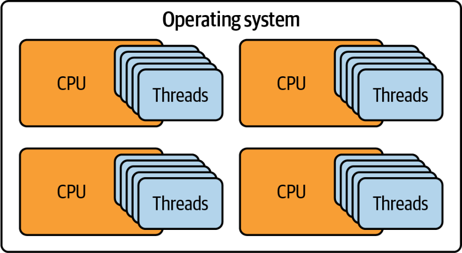
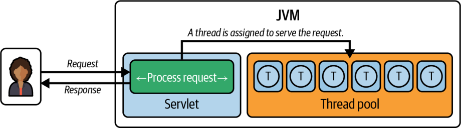
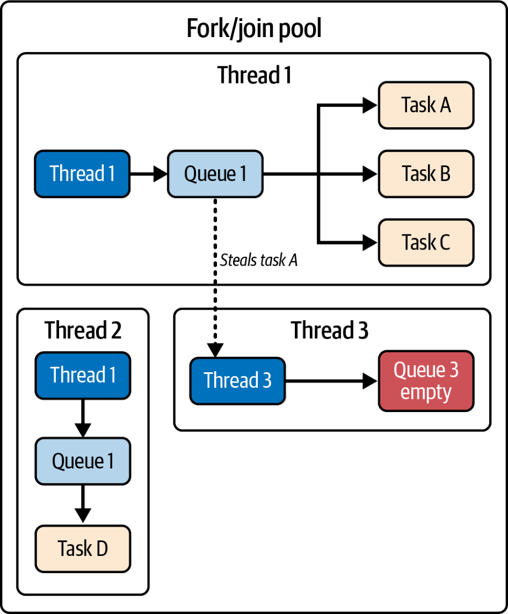

# Chương 1. Giới thiệu

*Concurrency là về việc xử lý nhiều thứ cùng một lúc. Parallelism là về việc làm nhiều thứ cùng một lúc.*

—Rob Pike

Để thực sự trân trọng một điều gì đó, điều quan trọng là phải biết nó đã hình thành như thế nào, đặc biệt nếu chúng ta có thể nhận ra những bước đi đã thực hiện và những thách thức đã vượt qua trên chặng đường đó. Sự hiểu biết này không chỉ làm nổi bật tiến trình đang diễn ra mà còn giúp chúng ta hiểu được ý nghĩa của nó. Tương tự, concurrency trong Java đã đi một chặng đường dài kể từ khi ra đời. Nó đã mất một thời gian dài để tiến hóa đến trạng thái hiện tại. Nhưng nếu muốn hiểu những tiến bộ gần đây, chẳng hạn như virtual thread và structured concurrency trong Java hiện đại, trước hết chúng ta phải đào sâu vào quá trình tiến hóa của nó. Trong chương này, chúng ta sẽ cung cấp cho bạn một cái nhìn ban đầu về concurrency trong Java, rồi thảo luận ngắn gọn về cách nó đã phát triển theo thời gian.

## Lược sử về thread trong Java

Java được thiết kế với concurrency trong tâm trí; nó là một trong những ngôn ngữ đầu tiên cung cấp hỗ trợ tích hợp sẵn cho multithreading. Qua nhiều năm, các khả năng concurrency của Java đã được cải thiện và tinh chỉnh, để lại một số "ổ gà" và bài học trên đường đi.

Concurrency trong Java bắt đầu với synchronization và quản lý thread cơ bản. Sau đó là sự ra đời của package [java.util.concurrent](https://oreil.ly/5e8s1) trong Java 5, mang đến những khả năng mới quan trọng như [Executor framework](https://oreil.ly/lDFVL), lock, và các concurrent collection. Tiếp theo, với sự ra đời của Fork/Join framework trong Java 7, Java đã khai thác hiệu năng concurrency của các bộ xử lý đa nhân. Và gần đây nhất, với [Project Loom](https://oreil.ly/gcaYC), Java đã giải quyết sự phức tạp và những hạn chế của concurrency dựa trên thread truyền thống, bằng các thread nhẹ ở user-mode và structured concurrency, với mục tiêu cuối cùng là làm cho việc phát triển concurrent trở nên đơn giản và hiệu quả hơn.

Tại sao quá trình tiến hóa này lại quan trọng đến vậy? Khi khám phá câu chuyện concurrency của Java diễn ra như thế nào, chúng ta nhận thấy một cuộc theo đuổi không ngừng nghỉ nhằm đạt hiệu quả cao hơn và lập trình đơn giản hơn trước sự phức tạp ngày càng tăng. Câu chuyện này vượt ra ngoài phạm vi Java; nó phản ánh quỹ đạo của ngành phát triển phần mềm và những khát vọng tiếp nối của Java.

Hãy cùng đi sâu hơn để hiểu quá trình tiến hóa này và trân trọng những bước tiến đã đạt được trong concurrency của Java.

### Java được tạo nên từ thread

Concurrency là một mục tiêu thiết kế rõ ràng của Java, một ngôn ngữ được phát hành với khả năng thread tích hợp sẵn, và tính năng threading là một điểm khác biệt then chốt của ngôn ngữ này. Nó loại bỏ sự phụ thuộc của lập trình viên vào các tính năng đặc thù của hệ điều hành để đạt được concurrency.

Trong Java, thread (luồng) là đơn vị thực thi nhỏ nhất. Đó là một đường thực thi độc lập chạy bên trong một chương trình. Các thread chia sẻ cùng một không gian địa chỉ, nghĩa là chúng có quyền truy cập vào cùng các biến và cấu trúc dữ liệu của chương trình. Tuy nhiên, mỗi thread duy trì program counter, stack, và các biến cục bộ của riêng nó, cho phép nó hoạt động độc lập. Thiết kế này cũng tạo điều kiện cho sự tương tác giữa các thread khi cần thiết.

Tuy nhiên, mô hình threading của Java dựa vào hệ điều hành bên dưới để lập lịch và thực thi các thread. Hệ điều hành phân bổ thời gian CPU cho mỗi thread, quản lý việc chuyển đổi giữa các thread để đảm bảo thực thi hiệu quả. Bằng cách phân phối các thread trên nhiều CPU, hệ thống có thể đạt được parallelism thực sự, nâng cao hiệu năng của các ứng dụng concurrent (Hình 1-1).



*Hình 1-1. Việc thực thi các thread bởi những CPU khác nhau*

Càng có nhiều thread trong một chương trình Java, chúng ta càng tạo ra nhiều môi trường thực thi một cách hiệu quả. Điều này cho chúng ta khả năng thực thi nhiều thao tác đồng thời. Điều này đặc biệt có lợi cho các ứng dụng đòi hỏi mức độ parallelism hoặc concurrency cao, chẳng hạn như web server, pipeline xử lý dữ liệu, và các hệ thống thời gian thực. Bằng cách tận dụng nhiều thread, những ứng dụng này có thể thực hiện nhiều tác vụ cùng lúc, qua đó cải thiện throughput và khả năng phản hồi.

> **PARALLELISM SO VỚI CONCURRENCY**
>
> Các thuật ngữ *parallelism* và *concurrency* thường được dùng thay thế cho nhau. Tuy nhiên, chúng mang hai ý nghĩa khác nhau. Parallelism đòi hỏi làm nhiều việc cùng một lúc, nên cần đến nhiều đơn vị xử lý, chẳng hạn hai hay nhiều nhân CPU. Concurrency là về việc thiết kế các chương trình sao cho các phần trong hoạt động của chúng có thể chồng lấn lên nhau—dù không phải lúc nào cũng đồng thời. Hãy hình dung parallelism như nhiều người thợ cùng xây một ngôi nhà bên cạnh nhau, còn concurrency giống như một đầu bếp duy nhất xoay xở nhiều món ăn trong bếp. Giờ đây, nếu ta thêm đầu bếp vào bếp, sản lượng tổng thể tăng lên, nhưng không nhất thiết là parallel; một đầu bếp có thể đang thái hành trong khi người khác đang cho món ăn vào lò. Mục tiêu cuối cùng vẫn là chuẩn bị bữa ăn—thậm chí có thể là nhiều bữa ăn.
>
Khái niệm thread hình thành nên chính cái nền tảng cho cách toàn bộ hệ sinh thái Java được triển khai và cách nó vận hành. Đó là nền móng mà rất nhiều tính năng và công cụ mạnh mẽ dựa vào, và những chức năng mà nhiều lập trình viên coi là hiển nhiên đơn giản sẽ không thể tồn tại nếu thiếu nó. Dù là hệ thống garbage collection, thứ giải quyết bài toán quản lý bộ nhớ trong Java, hay quá trình thực thi đầu ra đơn giản của một chương trình "Hello, World!" trong Java, các thread luôn miệt mài làm việc ở phía sau.

Đây là một ví dụ. Bất kỳ ai từng viết một chương trình Java, dù là lần đầu tiên, đều sẽ quen thuộc với dòng lệnh mà hầu hết các sách lập trình đều bắt đầu. Nó có vẻ như là một thao tác đơn luồng; tuy nhiên, Java Virtual Machine (JVM) thực ra thực thi đoạn code này trong một thread, thường được gọi là *main thread*:

```java
public class HelloWorld {
  public static void main(String[] args) {
    System.out.println("Hello, World!");
        // Displaying the thread that’s executing the main method
    System.out.println("Executed by thread: "
        + Thread.currentThread().getName());
  }
}
```

Khi chạy chương trình này, đầu ra sẽ bao gồm tên của thread đang thực thi phương thức main, thường là `main`:

```text
Hello, World!
Executed by thread: main
```

Ví dụ này cho thấy ngay cả những chương trình Java cơ bản nhất về bản chất cũng đã được threaded. Hàm ý là sâu sắc: chúng ta, với tư cách là lập trình viên Java, đang khai thác sức mạnh của thread, dù có nhận ra hay không, trong hầu như mọi phần công việc của mình, từ việc chạy những chương trình đơn giản nhất cho đến việc sử dụng cả những kỹ thuật tiên tiến nhất, chẳng hạn như garbage collection.

Và vì vậy, thread là một thành phần bắt buộc của Java—chúng là một phần của điều làm cho Java trở thành ngôn ngữ có thể mở rộng để xử lý các cơ sở dữ liệu lớn và các hệ thống phân tán khổng lồ.

### Thread: xương sống của nền tảng Java

Các thread trong Java là phần không thể thiếu ở mọi tầng của nền tảng Java, đóng vai trò then chốt trong nhiều khía cạnh vượt ra ngoài việc chỉ thực thi code. Chẳng hạn, chúng là cơ sở của việc xử lý ngoại lệ, gỡ lỗi (debugging), và profiling các ứng dụng Java.

#### Ngoại lệ và thread

Trong Java, mỗi thread có call stack riêng biệt của nó, ghi lại tất cả các lời gọi phương thức được thực hiện trong suốt vòng đời của thread. Khi một ngoại lệ được ném ra, call stack của thread đó trở thành một phần thiết yếu của lịch sử chẩn đoán; nó cho thấy chuỗi các lời gọi phương thức dẫn đến ngoại lệ, giúp lập trình viên truy tìm nguyên nhân gốc rễ của vấn đề. Đây là ví dụ đó một lần nữa:

```java
import java.sql.SQLException;

public class CallStackDemo {
  public static void main(String[] args) throws InterruptedException {
    Thread thread = new Thread(CallStackDemo::processOrder);
    thread.setName("mcj-thread");
    thread.start();
    thread.join();
  }

  static void processOrder() {
    validateOrderDetails();
  }

  static void validateOrderDetails() {
    checkInventory();
  }

  static void checkInventory() {
    updateDatabase();
  }

  static void updateDatabase() {
    try {
      throw new SQLException("Database connection error");
    } catch (SQLException e) {
      throw new InventoryUpdateException("Database Error: " +
          "Unable to update inventory", e);
    }
  }
}

class InventoryUpdateException extends RuntimeException {
  public InventoryUpdateException(String message, Throwable cause) {
    super(message, cause);
  }
}
```

Trong kịch bản này, thao tác cập nhật cơ sở dữ liệu thất bại, và nó lan truyền ngược lên call stack. Main thread bắt đầu gọi `processOrder`, phương thức này gọi `validateOrderDetails`, rồi gọi `checkInventory`, rồi gọi `updateDatabase`, và phương thức này ném ra ngoại lệ. Bây giờ chúng ta sẽ nhận được đầu ra sau trên console:

```text
Exception in thread "mcj-thread" ca.bazlur.mcj.chap1.InventoryUpdateExcept
Database Error: Unable to update inventory
    at ca.bazlur.mcj.chap1.CallStackDemo.updateDatabase(CallStackDemo.java
    at ca.bazlur.mcj.chap1.CallStackDemo.checkInventory(CallStackDemo.java
    at ca.bazlur.mcj.chap1.CallStackDemo.
    validateOrderDetails(CallStackDemo.java:22)
    at ca.bazlur.mcj.chap1.CallStackDemo.processOrder(CallStackDemo.java:1
    at java.base/java.lang.Thread.run(Thread.java:1583)
Caused by: java.sql.SQLException: Database connection error
    at ca.bazlur.mcj.chap1.CallStackDemo.updateDatabase(CallStackDemo.java
    ... 4 more
```

Trace này cho phép lập trình viên kiểm tra call stack trong một ngữ cảnh thread cụ thể (tức là ngữ cảnh của thread `mcj-thread`, nơi ngoại lệ xảy ra). Mức độ chi tiết này rất có lợi trong JVM, đặc biệt là khi gỡ lỗi các ứng dụng đa luồng, nơi nhiều thread có thể chạy đồng thời trên cùng một tác vụ hoặc các tác vụ khác nhau. Chi tiết này giúp chúng ta xác định vấn đề nhanh hơn, làm cho việc gỡ lỗi tập trung và hiệu quả hơn, và dẫn đến giải quyết nhanh hơn.

#### Debugger và thread

Làm thế nào debugger của Java xác định được chính xác vị trí để tạm dừng việc thực thi của một ứng dụng đang chạy? Câu trả lời một lần nữa là threading. Bằng cách gắn chính nó vào các thread khác nhau trong ứng dụng, debugger có thể chọn thread riêng lẻ nào trong số đó để xem xét, hoặc thậm chí thay đổi trạng thái của chúng trong khi gỡ lỗi một ứng dụng đang hoạt động. Điều này là nền tảng cho khả năng của bạn trong việc tìm và sửa lỗi ở những ứng dụng mà nhiều thread có thể đang thực thi đồng thời ở các giai đoạn khác nhau, và nơi các thread khác nhau có thể đang tương tác theo những cách cần được hiểu rõ.

Mỗi hành động có thể được "step into", "step over", hoặc "step out of" đối với một thread. Một hoặc nhiều call stack độc lập của các thread đang hoạt động có thể được kiểm tra trong một phiên gỡ lỗi. Call stack cho bạn biết điều gì đã xảy ra trước đó, chẳng hạn như điều gì khiến một thread ở tại một điểm nhất định trong chương trình. Hiểu được làm thế nào một thread đi đến một trạng thái nhất định là vô cùng quý giá khi bạn đang cố tìm ra nguyên nhân của một ngoại lệ bất ngờ hay một thao tác dữ liệu sai lệch.

#### Profiler và thread

Thread cũng quan trọng không kém trong việc hiểu các động lực vận hành của Java, và chúng đóng vai trò then chốt trong profiling. Cũng như threading tạo điều kiện cho độ chính xác tuyệt đối trong gỡ lỗi, tiện ích của nó còn mở rộng đến việc cung cấp một góc nhìn chi tiết trong thực hành profiling. Trên thực tế, thread là xương sống của việc phân tích hiệu năng trong Java. Các công cụ profiling dựa vào thread để cho bạn cái nhìn chi tiết về cách ứng dụng của bạn đang chạy. Chúng dùng thông tin thread để xác định các điểm chậm, khắc phục những vấn đề thời gian hóc búa trong code đa luồng, và giúp bạn tìm cách làm cho ứng dụng chạy nhanh hơn. Nói ngắn gọn, thread là chìa khóa để hiểu và cải thiện hiệu năng của các ứng dụng Java đa luồng của bạn.

Các thread trong Java đóng vai trò đáng kể trong nhiều thao tác, như chẩn đoán, gỡ lỗi, và profiling, bằng cách cung cấp cái nhìn chi tiết về việc thực thi của các chương trình ở cấp độ từng thread riêng lẻ. Dù không được lập trình viên sử dụng trực tiếp, chúng vẫn tiếp tục hoạt động bên dưới và cũng gia tăng lợi ích cho các ứng dụng Java. Ví dụ về điều này là các garbage collection thread dùng để quản lý bộ nhớ; các compiler thread trong hệ thống just-in-time (JIT) để nâng cao hiệu năng; các thread signal dispatcher, finalizer, và reference handler để JVM thực thi trơn tru; và các thread virtual machine (VM) và service cho các tác vụ cốt lõi và chẩn đoán của JVM. Do đó, có thể dễ dàng nói rằng thread trong Java là một trong những tầng thiết yếu nhất của nền tảng Java, và một lập trình viên Java cần hiểu về chúng.

## Sự khởi nguồn của thread trong Java 1.0

Java 1.0 được phát hành năm 1996 và đi kèm hỗ trợ tích hợp sẵn cho thread. Tính năng mang tính định hình này khiến nó khác biệt so với nhiều ngôn ngữ vào thời điểm đó. Trong những ngày đầu, bạn có thể tạo thread bằng cách kế thừa lớp `Thread` hoặc hiện thực interface `Runnable`. Ví dụ:

```java
public class ThreadCreationDemo {
  public static void main(String[] args) {
    // Extending Thread class
    Thread t1 = new ThreadByExtension("Worker-1");  ①
    t1.start();
    // Implementing Runnable (classic)
    Thread t2 = new Thread(
        new RunnableImplementation(), "Worker-2");  ②
    t2.start();
    // Anonymous inner class (Java 1.1)
    Thread t3 = new Thread(new Runnable() {  ③
      @Override
      public void run() {
        System.out.println("Anonymous: " +
            Thread.currentThread().getName());
      }
    }, "Worker-3");
    t3.start();
    // Lambda expression (Java 8)
    Thread t4 = new Thread(() ->  ④
        System.out.println("Lambda: " +
            Thread.currentThread().getName()),
        "Worker-4");
    t4.start();
  }
}

class ThreadByExtension extends Thread {
  public ThreadByExtension(String name) {
    super(name);
  }
  @Override
  public void run() {
    System.out.println("Extended Thread: " + getName());
  }
}

class RunnableImplementation implements Runnable {
  @Override
  public void run() {
    System.out.println("Runnable: " +
        Thread.currentThread().getName());
  }
}
```

Những cân nhắc thiết kế then chốt ngay từ đầu:

① Kế thừa Thread cho phép truy cập trực tiếp vào các phương thức của thread nhưng lại chiếm mất suất kế thừa đơn duy nhất của bạn.

② Việc hiện thực `Runnable` đã trở thành cách tiếp cận được ưa chuộng, tách biệt định nghĩa tác vụ khỏi việc quản lý thread và giữ được sự linh hoạt trong kế thừa.

③ Các anonymous inner class (Java 1.1) giảm bớt code rườm rà (boilerplate) cho các tác vụ dùng một lần trước khi lambda tồn tại.

④ Biểu thức lambda (Java 8) làm cho việc hiện thực `Runnable` còn ngắn gọn hơn nữa, vì nó là một functional interface.

API nền tảng này đã không thay đổi trong gần ba thập kỷ, minh chứng cho thiết kế vững chắc của nó. Dù Java đã thêm vô số cải tiến về concurrency, từ `java.util.concurrent` cho đến virtual thread, những khối xây dựng nguyên bản này vẫn là nền tảng của mô hình threading trong Java.

### Khởi động thread

Dù chọn phương pháp nào để tạo thread, mọi thứ đều bắt đầu bằng việc gọi phương thức `start` trên đối tượng `Thread`. Đây là bước thiết yếu vì việc gọi `start` không chỉ đơn thuần thực thi phương thức `run`; nó còn thực hiện các tác vụ thiết lập như cấp phát tài nguyên hệ thống. Phương thức `start` sau đó gọi phương thức `run` trong một thread thực thi mới.

> **LƯU Ý**
>
> Điều quan trọng là không gọi trực tiếp phương thức `run`. Làm vậy sẽ thực thi phương thức `run` trong thread đang gọi, chứ không phải trong một thread mới.
>
Tuy nhiên, trong các ứng dụng Java hiện đại, sử dụng Executor framework hiệu quả hơn so với việc tạo thread thủ công thông qua các constructor. Các executor trừu tượng hóa quá trình quản lý thread bằng cách duy trì một thread pool—một nhóm các thread được tạo sẵn, sẵn sàng thực thi các tác vụ. Phương pháp này giảm đáng kể chi phí phụ trội liên quan đến việc tạo thread mới.

Khi một tác vụ được gửi đến một executor, nó được đặt vào một queue. Sau đó một thread từ pool lấy tác vụ ra khỏi queue và thực thi nó. Cách bố trí này đơn giản hóa lập trình concurrent và tối ưu hóa việc sử dụng tài nguyên bằng cách tái sử dụng thread.

Đây là một ví dụ đơn giản minh họa cách dùng một executor để quản lý một thread pool:

```java
import java.util.concurrent.ExecutorService;
import java.util.concurrent.Executors;

public class ExecutorExample {
    public static void main(String[] args) {
        try (ExecutorService executor = Executors.newFixedThreadPool(5)) {
            for (int i = 0; i < 10; i++) {
                final int taskId = i;
                executor.submit(() -> {
                    System.out.println("Executing task " + taskId
                            + " in thread " + Thread.currentThread().getNa
                });
            }
        }
    }
}
```

## Hiểu về những chi phí ẩn của thread

Nhiều ứng dụng web ngày nay chạy theo mô hình thread-per-request, trong đó một thread được gán cho mỗi request—thread đó quản lý toàn bộ vòng đời request/response. Chẳng hạn, hãy xem xét vòng đời của một request trên một ứng dụng web điển hình chạy dưới một servlet container (Apache Tomcat, Jetty, hay bất kỳ web server Java EE nào). *Servlet container* là phần mềm chịu trách nhiệm xử lý các request đến ứng dụng web. Khi một request đến servlet container, container gán request đó cho một trong các thread trong thread pool của nó để xử lý. Thread đó khởi động, trên thực tế như đang nói: "Này, tôi nhận được request này từ người dùng. Giờ nó là của tôi; tôi sẽ lo liệu." Thread về cơ bản chịu trách nhiệm xử lý toàn bộ vòng đời request/response (Hình 1-2).



*Hình 1-2. Thread pool xử lý các servlet request*

Điều này đặc biệt hữu ích khi chúng ta có số lượng lớn kết nối đồng thời, bởi vì tăng concurrency, đến lượt nó, làm tăng throughput của ứng dụng web. Trên thực tế, đây là một đặc điểm then chốt của mô hình thread-per-request, cho phép các ứng dụng web hiện đại mở rộng để phục vụ hiệu quả một lượng request ngày càng tăng.

Đáng kinh ngạc là hầu hết các hệ điều hành hiện đại có thể xử lý hàng triệu kết nối đồng thời, nên có vẻ hợp lý khi tạo thêm nhiều thread hơn nữa để cải thiện throughput. Nhiều thread hơn trong thread pool quả thực sẽ tương đương với throughput cao hơn, theo Little’s Law.[^1] Tuy nhiên, dù giả định đó có vẻ chính xác, hóa ra lối suy luận này hơi trơn trượt—và không phải lúc nào cũng cho ra kết quả như mong đợi.

> **LƯU Ý**
>
> *Throughput* trong các ứng dụng web là tốc độ mà các request được xử lý và máy chủ trả về response, thường được đo bằng số request mỗi giây (RPS) hoặc số giao dịch mỗi giây (TPS). Nó cho biết năng lực xử lý tải của ứng dụng, đóng vai trò là một chỉ số quan trọng cho hiệu năng, scalability, và việc sử dụng tài nguyên. Throughput có thể được tính bằng
>
> Đây là kim chỉ nam cho việc benchmark hiệu năng, scalability, và hoạch định nhu cầu, và nó mở đường cho việc sử dụng tối ưu các tài nguyên nhằm đảm bảo trải nghiệm người dùng chất lượng.
>
Một chi tiết quan trọng cần ghi nhớ là dấu chân bộ nhớ (memory footprint) của mỗi thread: khoảng 2 MiB[^2] bộ nhớ (nằm ngoài heap, cho mỗi thread). Con số này có thể nhanh chóng trở nên rất lớn, đặc biệt trong các ứng dụng quy mô lớn chạy hàng nghìn kết nối đồng thời—tổng dấu chân bộ nhớ của các thread có thể tạo ra khác biệt một trời một vực về số lượng kết nối thực tế mà bạn có thể chạy. Thêm vào đó, giả sử ứng dụng của bạn dùng hết toàn bộ bộ nhớ vật lý. Trong trường hợp đó, bạn sẽ thấy mình phải paging ra đĩa, một thao tác chậm hơn đáng kể so với cả việc truy cập RAM: chênh lệch thời gian đọc khi đọc từ đĩa so với từ RAM là gấp 1.000 lần. Riêng điều này thôi cũng có thể ảnh hưởng nặng nề đến hiệu năng.

Ngoài ra, điều thiết yếu là phải hiểu rằng thread trong Java thực chất là một lớp bao mỏng quanh các native thread do hệ điều hành chủ cung cấp. Điều này có nghĩa là số lượng thread tối đa bạn có thể tạo cho bất kỳ ứng dụng nào trên thực tế bị giới hạn bởi giới hạn tạo native thread của hệ điều hành chủ. Hầu như tất cả các hệ điều hành đều có giới hạn trên về số lượng thread có thể được sinh ra. Vì vậy, tiềm năng scalability của một ứng dụng bị giới hạn bởi nút thắt cổ chai này.

Bên cạnh đó, còn có chi phí của context switching. Việc tạo thread không chỉ là chi phí phụ trội về bộ nhớ. Nó còn là chi phí phụ trội về CPU. Khi bạn chuyển đổi giữa các thread, đó là một context switch. Ngữ cảnh của thread hiện tại cần được lưu lại, và ngữ cảnh của thread mới cần được khôi phục. Tất cả những lần context switching đó tiêu tốn các chu kỳ CPU, và, trên các hệ thống chịu tải cao, chi phí phụ trội này có thể tạo ra khác biệt rất lớn về hiệu năng. Đây là một nguồn gánh nặng khác thường bị đánh giá thấp trong ứng dụng của bạn.

### Bạn có thể tạo bao nhiêu thread?

Giờ đây khi đã thảo luận về những chi phí liên quan đến thread, hãy cùng xem xét cách đo lường giới hạn tạo thread trong môi trường của bạn. Bằng cách chạy một chương trình kiểm tra đơn giản, bạn có thể xác định số lượng thread tối đa mà hệ thống của bạn có thể xử lý trước khi gặp sự cố. Đây là một đoạn code khung để bắt đầu:

```java
import java.util.concurrent.atomic.AtomicInteger;
import java.util.concurrent.locks.LockSupport;

public class ThreadLimitTest {
    public static void main(String[] args) {
        var threadCount = new AtomicInteger(0);
        try {
            while (true) {
                var thread = new Thread(() -> {
                    threadCount.incrementAndGet();
                    LockSupport.park();
                });
                thread.start();
            }
        } catch (OutOfMemoryError error) {
            System.out.println("Reached thread limit: " + threadCount);
            error.printStackTrace();
        }
    }
}
```

Hãy thực thi chương trình này để xem có thể tạo được bao nhiêu thread trước khi hết bộ nhớ hoặc chạm phải các giới hạn hệ thống khác:

```text
Reached thread limit: 16363
java.lang.OutOfMemoryError: unable to create native thread: possibly out o
memory or process/resource limits reached
    at java.base/java.lang.Thread.start0(Native Method)
    at java.base/java.lang.Thread.start(Thread.java:1526)
    at ca.bazlur.chapter0.ThreadLimitTest.main(ThreadLimitTest.java:15)
```

Trên máy của tôi, tôi gặp phải một [`OutOfMemoryError`](https://oreil.ly/vD03r) sau khi tạo thành công 16.363 thread. Thí nghiệm này làm nổi bật luận điểm rằng có một giới hạn hữu hạn về số lượng thread mà ta có thể tạo, một ràng buộc phần lớn do hệ điều hành bên dưới và phần cứng quyết định. Do đó, giới hạn này có thể khác trên máy của bạn.

Như bạn có thể thấy, dù thread mang lại những lợi ích đáng kể cho scalability của ứng dụng web, chúng cũng đi kèm với những chi phí nhất định. Những chi phí này, dù đôi khi ít rõ ràng hơn, cần được cân nhắc cẩn thận để đảm bảo hiệu năng tối ưu.

## Hiệu quả tài nguyên trong các ứng dụng quy mô lớn

Các ứng dụng phần mềm ngày nay thường được kỳ vọng xử lý lượng dữ liệu lớn và đồng thời gánh chịu lưu lượng truy cập đến ở mức cao. Những động lực này tạo ra thách thức đáng kể trong việc giữ vững sự lành mạnh về tài chính, đặc biệt khi đám mây đã trở thành môi trường mặc định mà nhiều doanh nghiệp vận hành. Ngay cả mức độ kém hiệu quả tài nguyên nhỏ nhất cũng có thể nhanh chóng biến thành chi phí leo thang. Vì chúng ta chỉ có một số lượng thread hữu hạn, điều thiết yếu là phải sử dụng chúng cẩn thận. Nhưng trên thực tế thread bị block, nên chúng thường không được sử dụng hiệu quả.

Hãy xem xét ví dụ sau, trong đó một phương thức tính điểm tín dụng của một người dựa trên nhiều yếu tố khác nhau:

```java
public Credit calculateCredit(Long personId) {
    var person = getPerson(personId);          // Database call - blocks t
    var assets = getAssets(person);            // API call - blocks thread
    var liabilities = getLiabilities(person);  // Database call - blocks t
    importantWork();                           // CPU-intensive work
    return calculateCredits(assets, liabilities);
}
```

Đoạn code trên cho thấy một chuỗi năm lời gọi phương thức, mỗi lời gọi diễn ra lần lượt sau lời gọi trước. Giả sử mỗi lời gọi thường mất 200 mili giây để hoàn thành. Khi đó, thời gian để phương thức `calculateCredit()` thực thi sẽ vào khoảng 1 giây— dài gấp khoảng năm lần (1.000 mili giây = 200 mili giây × 5).

Sự kém hiệu quả thực sự ở đây không phải là thread nhàn rỗi, mà là nó bị block trong các thao tác input/output (I/O). Khi thread thực thi `getPerson(personId)`, nó thực hiện một lời gọi cơ sở dữ liệu và phải chờ phản hồi từ mạng. Trong thời gian chờ đợi này, thread không thể được gán lại để xử lý các request khác hay thực hiện công việc khác. Việc block tương tự xảy ra trong các lời gọi `getAssets()` và `getLiabilities()`. Dù về mặt kỹ thuật thread đang "bận" thực thi các phương thức này, nó dành phần lớn thời gian bị block trên các thao tác I/O thay vì thực hiện công việc tính toán hữu ích.

Hành vi block này thể hiện một sự kém hiệu quả đáng kể: các tài nguyên thread đắt đỏ bị giữ chân để chờ các hệ thống bên ngoài phản hồi, trong khi chúng có thể đang phục vụ các request khác. Trong các ứng dụng throughput cao, điều này có thể hạn chế nghiêm trọng scalability vì mỗi thread bị block đồng nghĩa với bớt đi một thread sẵn sàng xử lý các request đến.

Việc đối phó với thách thức then chốt là đạt được hiệu quả thread cao, cụ thể là cố gắng giảm thiểu thời gian thread bị block trên các thao tác I/O, đã thúc đẩy nhiều bước tiến hóa của Java theo thời gian. Điều này bao gồm hỗ trợ cho nhiều paradigm khác nhau như lời gọi phương thức bất đồng bộ (cho phép các phương thức chạy độc lập trong khi các thao tác I/O hoàn tất), thread pooling (tái sử dụng một số lượng thread cố định để thực hiện các tác vụ), và, gần đây hơn, các mô hình lập trình reactive hiện đại (nhấn mạnh các tương tác non-blocking, event-driven).

Hãy bắt đầu bằng việc giới thiệu các phương pháp threading cổ điển, chẳng hạn như tạo và quản lý thủ công từng thread riêng lẻ, rồi dần chuyển sang những gì các giải pháp hiện đại mang lại.

### Chiến lược thực thi song song

Nhìn vào đoạn code trên, chúng ta có thể thấy có một số lời gọi phương thức, cụ thể là `getAssets()`, `getLiabilities()`, và `importantWork()`, không phụ thuộc lẫn nhau, nên các phương thức này thực sự có thể được điều phối để chạy song song. Cách tiếp cận thực thi song song này sẽ giảm khoảng thời gian mà main thread của chúng ta bị block, dù chúng ta chưa loại bỏ hoàn toàn việc block.

Chiến lược thực thi song song của chúng ta thực sự cho phép main thread giảm bớt thời gian nhàn rỗi. Điều này về cơ bản có nghĩa là, vì main thread ít nhàn rỗi hơn, một khi phương thức `calculateCredit()` này thực thi xong, nó có thể nhanh chóng rảnh tay để làm việc khác.

Hãy bắt đầu bằng cách tạo các cấu trúc dữ liệu cơ bản mà chúng ta sẽ cần cho hệ thống tính điểm tín dụng của mình:

```java
// Credit calculation models
record Credit(double score) {}
record Person(Long id, String name) {}
record Asset(String type, double value) {}
record Liability(String type, double amount) {}
```

Bây giờ, hãy triển khai cách tiếp cận thực thi song song của chúng ta:

```java
import java.util.List;
import java.util.concurrent.Callable;
import java.util.concurrent.atomic.AtomicReference;

Credit calculateCreditWithUnboundedThreads(Long personId)
                                     throws InterruptedException {

    var person = getPerson(personId);

    var assetsRef = new AtomicReference<List<Asset>>();  ①
    var t1 = new Thread(() -> {
        var assets = getAssets(person);
        assetsRef.set(assets);  ②
    });

    var liabilitiesRef = new AtomicReference<List<Liability>>();
    Thread t2 = new Thread(() -> {
        var liabilities = getLiabilities(person);
        liabilitiesRef.set(liabilities);
    });

    var t3 = new Thread(() -> importantWork());  ③

    t1.start();  ④
    t2.start();
    t3.start();

    t1.join();  ⑤
    t2.join();

    var credit = calculateCredits(assetsRef.get(), liabilitiesRef.get());

    t3.join();  ⑥

    return credit;
}
```

Hãy xem đoạn code trên hoạt động như thế nào:

① Dùng [`AtomicReference`](https://oreil.ly/zmP1k) để chia sẻ dữ liệu an toàn giữa các thread.

② Gán kết quả một cách thread-safe để có thể truy cập từ main thread.

③ Công việc độc lập có thể chạy song song mà không ảnh hưởng đến việc tính điểm tín dụng.

④ Cả ba thread bắt đầu thực thi đồng thời, giảm tổng thời gian thực thi.

⑤ Chờ các thread assets và liabilities hoàn thành trước khi tiếp tục tính điểm tín dụng.

⑥ Tính điểm tín dụng bằng các kết quả từ các thao tác song song.

⑦ Đảm bảo công việc độc lập hoàn thành trước khi phương thức trả về.

Chúng ta đã dùng `AtomicReference` từ package concurrency tiêu chuẩn của Java—một cấu trúc dữ liệu thread-safe chứa tham chiếu đến một đối tượng duy nhất. Vì chúng ta đang làm việc với nhiều thread, việc sử dụng nó là thiết yếu.

> **MẸO**
>
> Hãy dùng `AtomicReference` khi bạn cần chia sẻ tham chiếu đối tượng an toàn giữa các thread. Với các giá trị nguyên thủy, hãy cân nhắc dùng [`AtomicInteger`](https://oreil.ly/0m6-z), [`AtomicLong`](https://oreil.ly/bwxw6), hoặc các atomic primitive khác.
>
Để hoàn thiện dịch vụ tính điểm tín dụng của mình, chúng ta cần triển khai các phương thức hỗ trợ. Mỗi phương thức mô phỏng các thao tác thực tế như truy vấn cơ sở dữ liệu và lời gọi API:

```java
// Simulated methods with 200ms delay each
private Person getPerson(Long personId) {
    simulateDelay(200);
    return new Person(personId, "John Doe");
}

private List<Asset> getAssets(Person person) {
    simulateDelay(200);
    return List.of(
        new Asset("House", 300000),
        new Asset("Car", 25000)
    );
}

private List<Liability> getLiabilities(Person person) {
    simulateDelay(200);
    return List.of(
        new Liability("Mortgage", 200000),
        new Liability("Credit Card", 5000)
    );
}

private void importantWork() {
    simulateDelay(200);
    System.out.println("Important work completed");
}
private Credit calculateCredits(List<Asset> assets,
                                    List<Liability> liabilities) {
        simulateDelay(200);
        double totalAssets = assets.stream().mapToDouble(Asset::value).sum
        double totalLiabilities = liabilities.stream()
            .mapToDouble(Liability::amount)
            .sum();
        double creditScore = (totalAssets - totalLiabilities) / 1000;
        return new Credit(creditScore);
    }

private void simulateDelay(int milliseconds) {
    try {
        Thread.sleep(milliseconds);
    } catch (InterruptedException e) {
        Thread.currentThread().interrupt();
        throw new RuntimeException(e);
    }
}
```

> **XỬ LÝ INTERRUPTEDEXCEPTION ĐÚNG CÁCH**
>
> Khi xử lý `InterruptedException` trong Java, điều quan trọng là phải bảo toàn trạng thái interrupted của thread. Mẫu được trình bày dưới đây cho thấy cách xử lý đúng ngoại lệ này:
>
> ```java
> catch (InterruptedException e) {
>     Thread.currentThread().interrupt();
>     throw new RuntimeException(e);
> }
> ```
>
> Khi một thread bị interrupt thông qua `Thread.interrupt()`, một cờ nội bộ được đặt, khiến các phương thức blocking (như `sleep()`, `wait()`, hay các thao tác I/O blocking) ném ra `InterruptedException`. Tuy nhiên, việc bắt ngoại lệ này sẽ xóa cờ interrupted, điều có thể gây ra vấn đề cho code ở cao hơn trên call stack vốn cần biết về sự interrupt đó.
>
> `Thread.currentThread().interrupt()` đặt lại cờ interrupted trên thread hiện tại. Điều này đảm bảo rằng bất kỳ code gọi nào kiểm tra `Thread.interrupted()` hoặc `Thread.currentThread().isInterrupted()` sẽ thấy đúng rằng một interrupt đã xảy ra.
>
> Chúng ta có thể bọc `InterruptedException` trong một `RuntimeException`, điều này cho phép interrupt lan truyền lên call stack ngay cả qua các phương thức không khai báo `InterruptedException` trong mệnh đề throws của chúng. Điều này đặc biệt hữu ích trong những ngữ cảnh mà bạn không thể thêm checked exception vào chữ ký phương thức (chẳng hạn khi hiện thực các interface không khai báo chúng).
>
Để so sánh, chúng ta cũng sẽ giữ lại phiên bản tuần tự ban đầu trong code:

```java
// Sequential version (original)
public Credit calculateCredit(Long personId) {
// Method body available in the above.
}
```

Để phân tích các cải thiện hiệu năng, việc đo thời gian thực thi của các phương thức rất hữu ích. Đây là một lớp tiện ích cho mục đích này:

```java
import java.util.concurrent.Callable;

public class ExecutionTimer {
    public static <T> T measure(Callable<T> task) throws Exception {
        long startTime = System.nanoTime();
        try {
            return task.call();
        } finally {
            long endTime = System.nanoTime();
            // Convert to milliseconds
            long duration = (endTime - startTime) / 1_000_000;
            System.out.println("Execution time: " + duration + " milliseco
        }
   }
}
```

> **MẸO**
>
> Đây là cách tiếp cận đơn giản hóa để hiểu việc thực thi code. Để benchmark một cách chặt chẽ, hãy cân nhắc dùng một microbenchmark harness (như [JMH](https://oreil.ly/w6Nsy)) để tính đến các yếu tố như JVM warmup, loại bỏ dead-code, và các tối ưu hóa khác.
>
Giả sử mỗi phương thức có thời gian thực thi 200 mili giây, chúng ta có thể xác định đoạn code trên sẽ cần bao nhiêu thời gian để hoàn thành.

Phương thức `Thread.sleep(200)` có thể được dùng để mô phỏng thời gian thực thi này. Bây giờ, hãy tạo một bản demo so sánh cả hai cách tiếp cận:

```java
public class ParallelExecutionDemo {

    public static void main(String[] args) throws Exception {
        CreditCalculatorService service = new CreditCalculatorService();

        System.out.println("=== Sequential Execution ===");
        ExecutionTimer.measure(() -> service.calculateCredit(1L));
        System.out.println("\n=== Parallel Execution ===");
        ExecutionTimer.measure(() -> {
            try {
                return service.calculateCreditWithUnboundedThreads(1L);
            } catch (InterruptedException e) {
                Thread.currentThread().interrupt();
                throw new RuntimeException(e);
            }
        });
    }
}
```

Nếu thực thi đoạn code trên, nó sẽ in ra đại loại như sau:

```text
=== Sequential Execution ===
Important work completed
Execution time: 1026 milliseconds
=== Parallel Execution ===
Important work completed
Execution time: 616 milliseconds
```

Chúng ta đã cải thiện đáng kể hiệu năng bằng cách tái cấu trúc việc tính điểm tín dụng và sử dụng nhiều thread. Phiên bản mới chạy nhanh hơn 1,66 lần so với phiên bản cũ (616 mili giây so với 1.026 mili giây của phiên bản trước), một mức nhanh hơn thấy rõ đối với người dùng.

Dù việc song song hóa nâng cao hiệu năng bằng cách giảm nhẹ hoặc rút ngắn thời gian block của thread khởi tạo, nó cũng đi kèm những thách thức riêng, đặc biệt liên quan đến quản lý thread và sử dụng tài nguyên hệ thống. Việc tạo thread một cách tùy tiện (ad hoc), như đã minh họa, thiếu một cơ chế có kiểm soát để quản lý vòng đời thread và phân bổ tài nguyên. Điều này có thể dẫn đến sự sinh sôi quá mức của thread, có khả năng làm cạn kiệt tài nguyên hệ thống. Mỗi thread, vốn là một tài nguyên nặng nề, tiêu tốn bộ nhớ và sức mạnh xử lý. Kết quả là, vì các thread được tạo theo kiểu tùy tiện và không có đủ sự kiểm soát, thread sẽ được tạo ra hàng loạt, dẫn đến các ngoại lệ [`java.lang.OutOfMemoryError`](https://oreil.ly/vD03r), sự cố crash, và các nút thắt cổ chai khác lúc runtime.

### Giới thiệu Executor framework

Để tránh những nguy hiểm của việc tạo thread tùy tiện, tốt hơn là dùng một trong các concurrency framework của Java, chẳng hạn như `ExecutorService`, vốn cung cấp một cách làm việc có cấu trúc hơn với thread.

Hơn nữa, việc dùng `ExecutorService` không chỉ kiểm soát số lượng thread chạy đồng thời mà còn cho phép tái sử dụng thread một cách hiệu quả bằng cách quản lý vòng đời của chúng thay cho chúng ta, qua đó khắc phục chi phí phụ trội do vòng đời thread mang lại.

Hãy tái cấu trúc đoạn code trước và dùng `ExecutorService:`

```java
public Credit calculateCreditWithExecutor(Long personId)
    throws ExecutionException, InterruptedException {

    try (ExecutorService executor = Executors.newFixedThreadPool(5)) {  ①
      var person = getPerson(personId);

      var assetsFuture = executor.submit(() -> getAssets(person));  ②
      var liabilitiesFuture = executor.submit(() -> getLiabilities(person)
      executor.submit(() -> importantWork());  ③

      return calculateCredits(assetsFuture.get(), liabilitiesFuture.get())
    }
}
```

Hãy cùng điểm qua những gì chúng ta đã làm ở đây:

① Tạo một thread pool sẽ được tự động shut down khi khối `try` kết thúc

② Gửi cả hai tác vụ quan trọng mà chúng ta cần kết quả

③ Gửi công việc bổ sung không cần block luồng xử lý chính

④ Chờ các tác vụ quan trọng và xử lý kết quả của chúng

Bây giờ, hãy đo thời gian thực thi của đoạn code bằng `ExecutionTimer.measure()` và so sánh kết quả với triển khai trước đó:

```java
public static void main(String[] args) throws Exception {
  System.out.println("\n=== Parallel Execution With Executors ===");
  ExecutionTimer.measure(() -> {
    try {
      return service.calculateCreditWithExecutor(1L);
    } catch (InterruptedException e) {
      Thread.currentThread().interrupt();
      throw new RuntimeException(e);
    }
  });
}
```

Nếu chạy đoạn code, chúng ta sẽ nhận được đầu ra như sau:

```text
=== Parallel Execution With Executors ===
Important work completed
Execution time: 630 milliseconds
```

Thú vị là, thời gian thực thi vẫn rất giống với phiên bản trước. Các executor cung cấp những tiện ích hữu ích để quản lý công việc concurrent trong các ứng dụng Java—chúng giúp việc tạo và quản lý thread dễ dàng hơn, chúng mang lại khả năng tăng tốc cho các khối lượng công việc phù hợp, và chúng giúp code dễ tổ chức và giữ gọn gàng hơn. Bây giờ, hãy giải quyết những trở ngại còn tồn đọng của package Executors.

### Những thách thức còn lại

Executor framework mang đến những cải thiện đáng kể về quản lý tài nguyên và thực thi bất đồng bộ cho các ứng dụng Java. Tuy nhiên, để tối đa hóa lợi ích của nó, điều quan trọng là phải nhận thức được những hạn chế của nó.

*Block trên* `Future.get()`

Dù đã đưa vào tính bất đồng bộ thông qua các đối tượng `Future`, lời gọi phương thức `get()` vẫn block việc thực thi. Điều này có nghĩa là dù chúng ta đã chuyển việc block từ chỗ này sang chỗ khác, chúng ta vẫn chưa loại bỏ nó hoàn toàn. *Khả năng phát sinh chi phí phụ trội do cache coherence và false sharing*

Khi các tác vụ được gửi đến một thread pool, chúng được thực thi bởi các thread có thể chạy trên các nhân CPU khác với main thread. Điều này có thể dẫn đến những kịch bản mà trạng thái cache của hai nhân trở nên không nhất quán, tạo ra khả năng suy giảm hiệu năng do các giao thức cache coherence liên tục vô hiệu hóa và đồng bộ hóa các cache line giữa các nhân.

Ý tưởng là cải thiện tốc độ truy cập dữ liệu, nên tất cả các CPU hiện đại đều có L-cache.[^3] Các cache này lưu trữ những khối dữ liệu nhỏ (kích thước thay đổi theo kiến trúc phần cứng) để lần tiếp theo CPU cần dữ liệu đó, nó có thể được lấy từ cache thay vì từ bộ nhớ chính chậm hơn. Khối dữ liệu này được gọi là *cache line*, và việc sử dụng nó cải thiện đáng kể hiệu năng tổng thể.

Tuy nhiên, khi nhiều tác vụ chạy đồng thời, có khả năng dữ liệu từ hai tác vụ kế tiếp nhau nằm trên cùng một cache line. Nếu cả hai tác vụ chạy trên cùng một CPU, không cần phải tra cứu bộ nhớ chính lần nữa, vì dữ liệu đã được cache. Điều đó có nghĩa là thao tác thứ hai sẽ nhanh hơn thao tác thứ nhất, một cải thiện nhỏ. Tuy nhiên, nếu hai tác vụ chạy trên các CPU khác nhau, CPU thứ hai phải vô hiệu hóa cache line của nó nếu CPU thứ nhất đã sửa đổi bất kỳ phần nào của nó, rồi tải lại toàn bộ cache line từ bộ nhớ chính hoặc từ cache của nhân khác.

Hiện tượng này, được gọi là false sharing, xảy ra khi các thread khác nhau sửa đổi các biến khác nhau nhưng tình cờ chia sẻ cùng một cache line. Việc vô hiệu hóa và tải lại cache line thường xuyên có thể ảnh hưởng tiêu cực đến hiệu năng tổng thể trong các framework như Executor framework, nơi các tác vụ được phân phối trên nhiều CPU.

*Thiếu tính composability*

Executor framework vẫn khá mang tính mệnh lệnh (imperative) về bản chất. Không có gì sai với code theo phong cách mệnh lệnh, nhưng nhiều lập trình viên thấy phong cách hàm (functional) và khai báo (declarative) dễ đọc và dễ bảo trì hơn.

> **CÁC GIAO THỨC CACHE COHERENCE**
>
> Các CPU hiện đại dùng các giao thức cache coherence (ví dụ: MESI, MOESI) để đảm bảo mọi nhân đều thấy một góc nhìn nhất quán về bộ nhớ. Khi một nhân ghi vào một cache line, giao thức sẽ vô hiệu hóa hoặc cập nhật line đó trong cache của các nhân khác. Điều này đảm bảo tính đúng đắn nhưng có thể gây ra chi phí phụ trội về hiệu năng do việc vô hiệu hóa và truyền dữ liệu thường xuyên giữa các nhân.
>
Điều này đưa chúng ta trở lại điểm xuất phát: câu hỏi tự nhiên là "Giờ thì sao?" Làm thế nào để giải quyết những vấn đề này, và làm thế nào chúng ta có thể dùng các executor để viết code hiệu quả và dễ bảo trì hơn nữa trong tương lai?

## Vượt ra ngoài thread pool cơ bản

Executor framework rất hữu ích; tuy nhiên, những kịch bản như tranh chấp cache nặng nề hoặc nhu cầu về các phụ thuộc tác vụ phức tạp có thể gây ra vấn đề, như tôi đã nêu trước đó. Fork/Join Pool của Java giải quyết những thách thức này bằng một thiết kế tập trung vào hiệu năng và các thuật toán chuyên biệt. Hiện thực chuyên dụng này của `ExecutorService` mang đến một cơ chế thread-pooling tinh vi hơn, nâng cao hiệu năng và hiệu quả tài nguyên thông qua lập lịch tác vụ thông minh. Hãy cùng khám phá thêm.

### Cache affinity và phân phối tác vụ

Cache affinity đề cập đến khái niệm hoàn thành các tác vụ theo cách tận dụng tính cục bộ của cache CPU. Nếu một tác vụ được thực thi trên một CPU cụ thể, dữ liệu của nó được tải vào cache của nhân đó. Nếu các tác vụ liên quan khác được thực thi trên cùng nhân đó, chúng có thể hưởng lợi từ dữ liệu đã được cache ở đó, giảm thời gian truy cập bộ nhớ và, nhờ vậy, cải thiện hiệu năng.

Fork/Join pool khuyến khích cache affinity vì các worker thread thường thực thi các tác vụ từ queue cục bộ của riêng chúng. Điều này đặc biệt hữu ích nếu các tác vụ thường xuyên truy cập cùng một dữ liệu chia sẻ. Bằng cách duy trì cache affinity, Fork/Join Pool giảm thiểu cache miss, vốn xảy ra khi dữ liệu mà một tác vụ cần không có trong cache và phải được lấy từ bộ nhớ chính—một quá trình chậm hơn đáng kể.

Hãy xem xét, chẳng hạn, một tập các tác vụ song song làm việc trên một mảng lớn. Nếu tất cả các tác vụ này đang xử lý những lát khác nhau của mảng đó, sẽ có lợi khi cho chúng chạy trên cùng một nhân; khi đó, dữ liệu trong những lát mảng đó có thể nằm lại trong cache và được tác vụ tiếp theo truy cập nhanh chóng. Nếu không, chúng ta sẽ phải liên tục tải lại dữ liệu này vào cache. Cache affinity giảm chi phí phụ trội liên quan đến việc tải dữ liệu vào cache lặp đi lặp lại.

### Thuật toán work-stealing

Fork/Join Pool cũng sử dụng một thuật toán work-stealing động để cân bằng tải hiệu quả giữa các thread. Thay vì một queue tác vụ chia sẻ duy nhất, mỗi thread trong Fork/Join Pool có queue riêng của nó. Khi một thread hết việc, nó "đánh cắp" các tác vụ từ đuôi queue của một thread khác. Thuật toán work-stealing động này tối đa hóa việc sử dụng CPU, đảm bảo rằng không thread nào ngồi không trong khi vẫn còn tác vụ cần làm. Hình 1-3 minh họa thuật toán work-stealing được dùng trong Fork/Join Pool. Phương pháp phân phối lại tác vụ một cách động này đảm bảo rằng tất cả các thread đều luôn làm việc hiệu quả, nâng cao mức sử dụng CPU tổng thể và giảm thiểu thời gian nhàn rỗi.



*Hình 1-3. Thuật toán work-stealing trong Fork/Join Pool*

#### Ví dụ sử dụng Fork/Join Pool

Fork/Join Pool đơn giản hóa quá trình gửi tác vụ, và nó tự động phân phối các tác vụ một cách hiệu quả mà không đòi hỏi quản lý thêm. Đây là một ví dụ cơ bản về cách dùng Fork/Join Pool:

```java
ForkJoinPool forkJoinPool = new ForkJoinPool();
forkJoinPool.submit(() -> {
    // your parallelized tasks here
}).join();
```

Hãy để ý việc gửi tác vụ đến Fork/Join Pool dễ dàng đến mức nào. Framework tự động xử lý việc phân phối công việc hiệu quả, gỡ bỏ gánh nặng quản lý thread phức tạp khỏi lập trình viên.

Thông thường, Fork/Join Pool gắn liền với thuật toán chia để trị (divide-and-conquer), sử dụng các lớp [`RecursiveAction`](https://oreil.ly/JNpA4) và [`RecursiveTask`](https://oreil.ly/4kYNM) để chia nhỏ tác vụ thành các phần nhỏ hơn cho Fork/Join Pool. Tuy nhiên, trong ngữ cảnh này, chúng ta đang tập trung vào bản thân Fork/Join Pool, chứ không phải các chiến lược chia để trị được dùng để tạo ra những tác vụ này.

Tôi sẽ thảo luận chi tiết hơn về Fork/Join Pool trong chương tiếp theo.

### Đưa composability vào cuộc chơi với CompletableFuture

Executor framework và Fork/Join Pool mang lại những cải thiện về hiệu năng, nhưng việc kết hợp (compose) các luồng công việc bất đồng bộ phức tạp vẫn có thể rườm rà. Để giải quyết thách thức này, Java 8 đã giới thiệu [`CompletableFuture`](https://oreil.ly/5VTeu), một lớp được thiết kế để tinh giản lập trình bất đồng bộ bằng cách tập trung vào composability và tính dễ sử dụng.

Hãy xem một API composable và fluent với `CompletableFuture` khớp với ví dụ trước đó như thế nào.

#### API composable và fluent

`CompletableFuture` thay đổi cách chúng ta viết code bất đồng bộ, rời xa những phong cách nặng về callback để hướng tới cách tiếp cận khai báo và hàm. API phong phú của nó cho phép chúng ta xâu chuỗi nhiều thao tác bất đồng bộ một cách dễ dàng, cải thiện tính dễ đọc và dễ bảo trì của code. Hãy xem lại ví dụ trước:

```java
import java.util.concurrent.CompletableFuture;
import java.util.concurrent.ExecutionException;
import static java.util.concurrent.CompletableFuture.*;

public Credit calculateCreditWithCompletableFuture(Long personId)
        throws InterruptedException, ExecutionException {
    return runAsync(() -> importantWork())  ①
        .thenCompose(aVoid -> supplyAsync(() -> getPerson(personId)))  ②
        .thenCombineAsync(supplyAsync(() -> getAssets(getPerson(personId))
                (person, assets)
                    -> calculateCredits(assets, getLiabilities(person)))
        .get();  ③
}
```

Hãy xem xét cách tiếp cận `CompletableFuture` này hoạt động như thế nào:

① Khởi động công việc độc lập một cách bất đồng bộ

② Sau khi công việc quan trọng hoàn thành, bắt đầu lấy dữ liệu `person` một cách bất đồng bộ

③ Kết hợp dữ liệu `person` với `assets` được lấy song song

④ Tính điểm tín dụng cuối cùng bằng các kết quả đã kết hợp

⑤ Block và chờ kết quả cuối cùng hoàn thành

Ví dụ này cho thấy `CompletableFuture` cho phép chúng ta cấu trúc các luồng công việc bất đồng bộ một cách rõ ràng và ngắn gọn như thế nào. Tuy nhiên, nó không phải không có nhược điểm.

Hãy khám phá những ưu điểm và nhược điểm của API này.

#### Ưu điểm của việc dùng CompletableFuture

`CompletableFuture` thay đổi cách bạn cấu trúc code bất đồng bộ với fluent API của nó. Thay vì các callback lồng nhau rối rắm hay các hệ thống phân cấp lớp cồng kềnh của các đối tượng tác vụ, bạn định nghĩa các luồng công việc như một chuỗi các phép biến đổi và tính toán trung gian. Điều này cải thiện tính dễ đọc và dễ bảo trì, giảm khả năng xảy ra lỗi trong các ứng dụng mà tính bất đồng bộ là trung tâm.

Bên dưới, `CompletableFuture` được xây dựng trên Fork/Join framework, tận dụng work-stealing đã được tối ưu để phân phối tác vụ hiệu quả và scalability tốt hơn dưới tải. Các phương thức tích hợp sẵn như exceptionally, handle, và `whenComplete` cho bạn quyền kiểm soát tường minh đối với việc xử lý lỗi. Bạn cũng có thể cung cấp các executor tùy chỉnh để tinh chỉnh việc quản lý thread cho những khối lượng công việc cụ thể. Cuối cùng, dù đôi khi cần một lời gọi `get()` blocking ở các ranh giới, phần lớn pipeline của bạn có thể vẫn non-blocking, cho phép code phản hồi nhanh và tiết kiệm tài nguyên.

#### Nhược điểm và hạn chế

Dù `CompletableFuture` là một tính năng mạnh mẽ trong Java, nó đòi hỏi bạn phải thay đổi tư duy nếu bạn đã quen với phong cách lập trình mệnh lệnh. Tôi sẽ nói rằng bạn có thể phải đầu tư khá nhiều để học API phong phú này nhằm sử dụng nó một cách có ý nghĩa. Bạn phải tìm ra những vị trí tốt nhất hoặc các kỹ thuật lan truyền giá trị cho những phương thức khác nhau mà nó cung cấp. Đây sẽ là một khoản đầu tư đáng kể về thời gian và luyện tập, và đi kèm với đó là khả năng không dùng nó đúng cách.

Chẳng hạn, phương thức `get()` vẫn là một phương thức blocking, điều này là cần thiết nhưng có thể gây ra block trong một luồng xử lý, và nếu không dùng tiết kiệm sẽ làm mất hoàn toàn ý nghĩa của lập trình bất đồng bộ. Bạn cũng có thể gặp vấn đề trong các trường hợp `CompletableFuture` đa chuỗi (multichain), nơi bạn có nhiều hơn một phụ thuộc và phải lan truyền cũng như kiểm tra lỗi để khôi phục. Điều này, nếu không được thiết kế đúng, có thể tạo ra một cơn ác mộng rất lớn khi gỡ lỗi. Cuối cùng, gỡ lỗi code viết theo phong cách xâu chuỗi của `CompletableFuture` đặt ra một thách thức khác về điều khiển luồng. Nếu bạn quen với các công cụ gỡ lỗi mặc định có sẵn trong các IDE khác nhau, thì việc bước qua từng dòng code, đặt breakpoint tại một điểm cụ thể, và xem ngữ cảnh của một câu lệnh bằng cách lùi lại một bước trong code sẽ cực kỳ thách thức đối với bạn. Đó là vì luồng thực thi đảo ngược và mơ hồ của code bất đồng bộ—nó không đơn thuần được thực thi từng dòng một.

> **LƯU Ý**
>
> Dù lợi ích của lập trình bất đồng bộ là rõ ràng, và `CompletableFuture` cung cấp những tính năng mạnh mẽ cùng với các lựa chọn thay thế khác như các reactive framework, chúng ta phải đặt ra một câu hỏi then chốt: Về mặt tổ chức, chúng ta đã sẵn sàng cho sự phức tạp này chưa?
>
> Lập trình bất đồng bộ thay đổi căn bản cách chúng ta thiết kế, gỡ lỗi, và bảo trì ứng dụng. Những lợi ích về hiệu năng đi kèm với chi phí đáng kể về gánh nặng nhận thức, khó khăn khi gỡ lỗi, và sự phức tạp về kiến trúc. Trước khi áp dụng những mẫu này, hãy cân nhắc liệu đội ngũ của bạn có đủ kinh nghiệm để duy trì các nguyên tắc clean code, xử lý các kịch bản lỗi phức tạp, và gỡ lỗi các chuỗi lời gọi bất đồng bộ một cách hiệu quả hay không.
>
> Đây không đơn thuần là một quyết định kỹ thuật. Đó là một cam kết về kiến trúc ảnh hưởng đến mọi khía cạnh trong vòng đời ứng dụng của bạn. Hãy lựa chọn khôn ngoan dựa trên năng lực của đội ngũ và các yêu cầu hiệu năng thực tế của ứng dụng.
>
## Một paradigm khác cho lập trình bất đồng bộ

Dù `CompletableFuture` cung cấp những công cụ mạnh mẽ, chỉ thay đổi tư duy thôi là chưa đủ để giải quyết những hạn chế còn lại (hoặc để đạt tới các mức hiệu năng cao hơn có thể đạt được trong một số trường hợp). Lập trình reactive giới thiệu một paradigm tập trung vào các luồng dữ liệu (data stream), xử lý sự kiện bất đồng bộ, và các thao tác non-blocking. Các framework như RxJava, Akka, Eclipse Vert.x, Spring WebFlux, và những framework khác hiện thực paradigm này trong Java với các bộ công cụ phong phú.

Chẳng hạn, hãy hình dung lại ví dụ `calculateCredit()` trước đó của chúng ta bằng Spring WebFlux. Trước tiên, chúng ta cần thêm dependency và các import cần thiết:

```text
<dependency>
    <groupId>org.springframework</groupId>
    <artifactId>spring-webflux</artifactId>
    <version>6.0.0</version>
</dependency>
```

> **MẸO**
>
> Để thử nghiệm ví dụ reactive, hãy tạo một dự án Maven và thêm dependency `reactor-core`, như được trình bày trong *pom.xml* ở trên.
>
Bây giờ chúng ta sẽ thêm phương thức sau vào lớp `CreditCalculatorService.java` của mình:

```java
public Mono<Credit> calculateCreditReactive(Long personId) {
    Mono<Void> importantWorkMono = Mono.fromRunnable(() -> importantWork()
    Mono<Person> personMono = Mono.fromSupplier(() -> getPerson(personId))
    Mono<List<Asset>> assetsMono = personMono
        .map(person -> getAssets(person));  ①
    Mono<List<Liability>> liabilitiesMono = personMono
        .map(person -> getLiabilities(person));  ②

    return importantWorkMono.then(  ③
        Mono.zip(assetsMono, liabilitiesMono)  ④
            .map(tuple -> {
              List<Asset> assets = tuple.getT1();
              List<Liability> liabilities = tuple.getT2();
              return calculateCredits(assets, liabilities);  ⑤
            })
    );
  }
```

Hãy xem xét luồng reactive:

① Tạo một `Mono` thực thi công việc quan trọng một cách bất đồng bộ khi được subscribe

② Bọc việc tra cứu `person` trong một reactive stream

③ Biến đổi stream `person` để lấy assets một cách bất đồng bộ

④ Biến đổi stream `person` để lấy liabilities một cách bất đồng bộ

⑤ Chờ công việc quan trọng hoàn thành, rồi tiếp tục tính điểm tín dụng

⑥ Kết hợp các stream `assets` và `liabilities` thành một stream duy nhất chứa cả hai kết quả

⑦ Tính điểm tín dụng cuối cùng từ dữ liệu đã kết hợp

Nhìn vào đoạn code này, bạn sẽ nhận thấy nó tương tự về mặt khái niệm với cách tiếp cận `CompletableFuture` nhưng dùng thuật ngữ và các toán tử (operator) của reactive streams. Tuy nhiên, nếu bạn chưa quen với lập trình reactive, cách tiếp cận này có thể gây bối rối và đòi hỏi đầu tư học tập đáng kể để hiểu các khái niệm như Publisher, Subscriber, backpressure, và các reactive operator.

Tôi sẽ không giải thích lập trình reactive trong cuốn sách này, vì đó không phải là mục tiêu của cuốn sách, nhưng bạn có thể khám phá các sách khác viết về reactive stack.

Hãy thảo luận một số hạn chế mà chúng ta gặp phải trong cách tiếp cận lập trình reactive, chỉ để hiểu tại sao chúng ta cần một thứ gì đó khác biệt, hay tại sao chúng ta cần virtual thread, thứ *chính là* mục tiêu của cuốn sách này.

### Nhược điểm của việc dùng các reactive framework

Như câu nói, "Không có bữa trưa nào miễn phí," và điều tương tự cũng đúng với lập trình reactive. Hãy phác thảo một số thách thức chính mà nó đặt ra:

*Đường cong học tập dốc*

Nắm bắt các nguyên tắc cơ bản của paradigm lập trình reactive đòi hỏi một sự thay đổi tư duy đáng kể đối với các lập trình viên đã quen với paradigm lập trình mệnh lệnh. Các khái niệm như [Observable](https://oreil.ly/vboPE), [các toán tử Observable](https://oreil.ly/PEMon), [scheduler](https://oreil.ly/5vIfH), và [backpressure](https://oreil.ly/4koKP), vốn là nền tảng của các reactive framework, đòi hỏi đầu tư thời gian và một đường cong học tập có thể khá dốc so với các mô hình concurrency khác.

*Gánh nặng nhận thức gia tăng*

Phong cách lập trình hàm được dùng trong các reactive framework có thể là quá sức đối với những lập trình viên toàn thời gian đã có thâm niên dài với lập trình mệnh lệnh hoặc lập trình hướng đối tượng. Cùng với việc sử dụng nhiều lambda, hàm bậc cao, và kết hợp hàm, các chuỗi toán tử và phép biến đổi có thể khiến bản thân code khó nắm bắt hơn lúc ban đầu và, do đó, khó bảo trì hơn (ít nhất là trong ngắn hạn) trong các dự án hoặc đội ngũ lớn, nơi không phải mọi thành viên đều có lượng kinh nghiệm lập trình reactive tương đương.

*Khó khăn khi gỡ lỗi*

Các công cụ và kỹ thuật gỡ lỗi truyền thống không phải lúc nào cũng hoạt động tốt với các hệ thống reactive đang chạy. Chẳng hạn, các toán tử xâu chuỗi dẫn đến thực thi bất đồng bộ, nơi mà nếu có lỗi phát sinh, stack trace có thể cung cấp không đủ ngữ cảnh để tìm ra gốc rễ vấn đề. Bạn có thể bỏ lỡ sự kiện xảy ra sau cùng do việc nhảy sự kiện giữa các thread và toán tử. Có thể cần đến các công cụ gỡ lỗi chuyên biệt, có lẽ được cung cấp như một phần của reactive framework mà bạn dùng. Điều này làm tăng thêm đường cong học tập. Ví dụ, giả sử một reactive pipeline lấy dữ liệu từ bốn nguồn khác nhau, biến đổi bốn stream, rồi kết hợp các kết quả. Một lỗi phát sinh từ giai đoạn kết hợp có thể dẫn đến một stack trace trỏ đến toán tử kết hợp và khiến khó biết được liệu một nguồn upstream hay phép biến đổi cụ thể nào là nguyên nhân gốc rễ của vấn đề. Việc theo dõi luồng dữ liệu xuyên suốt reactive pipeline trở nên rắc rối trong các pipeline phức tạp với hàng chục toán tử, hàng chục thao tác bất đồng bộ, v.v. Trong mô hình threading truyền thống, việc gỡ lỗi tương đối đơn giản và tốn ít chi phí.

*Rủi ro phức tạp hóa quá mức*

Khả năng composability có được thông qua các mô hình dựa trên toán tử của các reactive framework, dù rất mạnh mẽ, đi kèm với khả năng tạo ra những sản phẩm phức tạp hơn mức thực sự cần thiết cho một yêu cầu nghiệp vụ hay một thành phần giao diện người dùng nhất định. Cũng như người ta có thể nấu một món cà ri gà bằng cách dùng mọi món đồ trong bộ đồ bạc của gia đình, hoàn toàn có thể (và đầy cám dỗ) giải quyết mọi vấn đề bằng một thứ gì đó phức tạp hơn một chút so với mức thực sự cần thiết. Vì vậy, các reactive framework đối mặt với rủi ro "sáng tạo" khi cho phép các lập trình viên thiếu kinh nghiệm overengineer miền nghiệp vụ của họ—một rủi ro không chỉ riêng của các reactive framework mà xảy ra ở bất kỳ abstraction hay thư viện mạnh mẽ nào khi được dùng bởi những người không biết khi nào nên dừng lại.

*Khả năng không phù hợp*

Các framework lập trình reactive phù hợp nhất với những kịch bản liên quan đến nhiều thao tác bất đồng bộ, các luồng dữ liệu event-driven, hoặc các luồng dữ liệu throughput cao. Trong các tình huống khác, một số khả năng nào đó của các hệ thống hay framework reactive có thể không cần thiết vì không có nhiều tính bất đồng bộ, hoặc luồng dữ liệu vốn không hướng sự kiện, hoặc công sức để học, trừu tượng hóa, và áp dụng vào framework lại biện minh cho sự đơn giản hơn của một cách tiếp cận đồng bộ hoặc request-response cơ bản hơn.

*Vendor lock-in*

Những ý tưởng cốt lõi của lập trình reactive chắc chắn có thể chuyển giao được; tuy nhiên, mỗi reactive framework lớn đều có bộ API tinh tế riêng của nó. Chọn một trong số chúng thay vì cái khác có nghĩa là bạn sẽ bị khóa chặt vào một framework cụ thể, điều này tự nhiên khiến việc thay đổi thư viện sau này khó khăn hơn, và có khả năng hạn chế tính linh hoạt ở đâu đó trên chặng đường vòng đời của dự án. Sự lock-in này cũng có thể kéo theo những hệ lụy, như khó tìm được lập trình viên quen thuộc với framework đã chọn, khả năng framework trì trệ hoặc không được tiếp tục hỗ trợ, và những thách thức khi cần chuyển sang một framework khác.

Sau khi đã đề cập đến tất cả những thách thức này, hoàn toàn không thể phủ nhận rằng các framework lập trình reactive có tiềm năng đơn giản hóa vô cùng lớn việc quản lý các kịch bản bất đồng bộ tinh vi. Tuy nhiên, chúng ta phải xem xét kỹ lưỡng những đánh đổi của chúng để hiểu liệu lợi ích có vượt trội hơn chi phí cho dự án mà chúng ta đang thực hiện hay không.

## Cách mạng hóa concurrency trong Java

Các cơ chế concurrency truyền thống của Java đã phục vụ chúng ta tốt, nhưng khi việc áp dụng concurrency mở rộng sang các trường hợp sử dụng phức tạp hơn và nhiều hơn, nhiều thách thức khác nhau đã xuất hiện trên đường đi. Đó là lý do việc khám phá các giải pháp mới là thiết yếu.

### Lời hứa của virtual thread

Giờ đây khi đã hiểu những thiếu sót của các cách tiếp cận truyền thống, chúng ta cần tìm một cách tốt hơn để khắc phục những vấn đề đó. Đây chính xác là nơi Project Loom, một bước then chốt hướng tới concurrency hiện đại hạng nhất trong Java, bước vào cuộc chơi. Nó giới thiệu một loại thread mới gọi là *virtual thread* (luồng ảo), mở ra một kỷ nguyên mới của concurrency trong Java. Đây là những thread rất nhẹ và có thể được tạo theo nhu cầu với chi phí phụ trội gần như bằng không so với những gì thường gắn liền với việc tạo thread truyền thống. Virtual thread có thể được khởi tạo với số lượng hàng triệu, mở khóa những khả năng mới cho các ứng dụng có tính concurrent cao và có khả năng mở rộng.

Hãy thảo luận một số đặc điểm của virtual thread.

### Tích hợp liền mạch với các codebase hiện có

Một trong những thế mạnh then chốt của Project Loom nằm ở khả năng tương thích liền mạch với các codebase Java hiện có. Chẳng hạn, nếu ứng dụng của bạn đã dùng Executor framework, tất cả những gì bạn phải làm để tận dụng virtual thread là truyền một [`Executors.newVirtualThreadPerTaskExecutor()`](https://oreil.ly/K6hJ6) vào `ExecutorService` hiện có của bạn:

```java
Credit calculateCreditWithVirtualThread
    (Long personId) throws ExecutionException, InterruptedException {
  try (var executor = Executors.newVirtualThreadPerTaskExecutor()) {  ①
    var person = getPerson(personId);
    var assetsFuture = executor.submit(() -> getAssets(person));
    var liabilitiesFuture = executor.submit(() -> getLiabilities(person)
    executor.submit(this::importantWork);
    return calculateCredits(assetsFuture.get(), liabilitiesFuture.get())
  }
}
```

① Thay thế bất kỳ executor truyền thống nào bằng `Executors.newVirtualThreadPerTaskExecutor()` để ngay lập tức nhận được lợi ích của virtual thread.

Sự dễ dàng trong tích hợp này đảm bảo một quá trình chuyển đổi suôn sẻ sang mô hình concurrency mới.

### Virtual thread và platform thread

Virtual thread chạy trên nền các *platform thread*, còn được gọi là *thread cổ điển*, vốn cũng được hậu thuẫn bởi Fork/Join Pool, nên chúng thừa hưởng những lợi ích của thread pool tinh vi hơn đó. Vì vậy, virtual thread và platform thread kết hợp hoàn hảo để mang lại kết quả tốt nhất về sử dụng tài nguyên và scalability.

### Xử lý thông minh các thao tác blocking

Một trong những khía cạnh thú vị nhất của virtual thread là cách xử lý thông minh các thao tác blocking. Khi một virtual thread gặp một thao tác blocking—chẳng hạn như sleep hay I/O mạng—nó tự động nhường (yield) quyền điều khiển lại cho platform thread bên dưới. Điều này cho phép platform thread tiếp tục thực thi các virtual thread khác, đảm bảo sử dụng tối ưu các tài nguyên sẵn có. Khi thao tác blocking hoàn tất, virtual thread có thể đơn giản tiếp tục thực thi từ chỗ nó đã dừng lại, tránh những nút thắt cổ chai có thể cảm nhận được.

### Lợi ích của việc đón nhận virtual thread

Trước khi đi sâu vào các chi tiết cụ thể của virtual thread trong chương tiếp theo, hãy xem nhanh cách virtual thread cách mạng hóa cách chúng ta xử lý concurrency trong Java. Đây là một số ưu điểm chính:

*Hiệu quả tài nguyên*

Virtual thread rất nhẹ, và chúng ta có thể sinh ra hàng triệu thread mà không làm cạn kiệt tài nguyên, điều cho phép các ứng dụng có tính concurrent cao và có khả năng mở rộng.

*Sự đơn giản của code*

Với khả năng viết code blocking mà không bị phạt về hiệu năng, giờ đây lập trình viên có thể viết và bảo trì code theo phong cách mệnh lệnh truyền thống, đơn giản hơn. Điều đó có nghĩa là không có đường cong học tập bổ sung và code dễ bảo trì hơn.

*Sử dụng tối ưu*

Trong các thao tác blocking, virtual thread nhường quyền điều khiển, điều này đảm bảo các platform thread vẫn được sử dụng, tăng hiệu năng CPU và ứng dụng.

Một trong những mối bận tâm lớn nhất của các lập trình viên dùng concurrency trong Java là lượng kiến thức cụ thể họ phải học để dùng nó đúng cách. Project Loom đại diện cho một bước tiến lớn cho phong cách concurrent mà các lập trình viên Java tạo ra và sử dụng; nó sẽ cho phép họ viết các ứng dụng có tính concurrent cao và hiệu quả ở quy mô lớn trong khi vẫn dùng những mẫu mà họ đã quen thuộc.

## Lời kết

Trong cuốn sách này, chúng ta sẽ tiếp tục thảo luận về virtual thread và khám phá thêm về công nghệ mang tính cách mạng này trong chương tiếp theo.

Khi đi sâu hơn vào các khái niệm virtual thread, hãy cân nhắc cách chúng có thể thay đổi cách tiếp cận của bạn trong việc thiết kế các ứng dụng concurrent. Virtual thread không chỉ mang đến một cách mới để xử lý concurrency mà còn là một phương pháp hiệu quả hơn, có khả năng mở rộng hơn, và trực quan hơn, phù hợp với những đòi hỏi của điện toán hiện đại.

[^1]: Little’s Law là một nguyên lý then chốt trong các hệ thống hàng đợi, bao gồm cả các ứng dụng đa luồng. Nó liên hệ latency, concurrency, và throughput, những yếu tố quan trọng đối với hiệu năng tính toán. Trong chương tiếp theo, chúng ta sẽ thảo luận chi tiết về điều này và chứng minh cách concurrency cao hơn dẫn đến throughput cao hơn.

[^2]: Đây là kích thước mặc định trong hầu hết các môi trường Linux, nhưng nó phụ thuộc vào hệ điều hành và có thể được điều chỉnh.

[^3]: L-cache là các tầng bộ nhớ siêu nhanh (L1, L2, L3) bên trong CPU, lưu trữ dữ liệu được sử dụng thường xuyên để truy cập nhanh.
