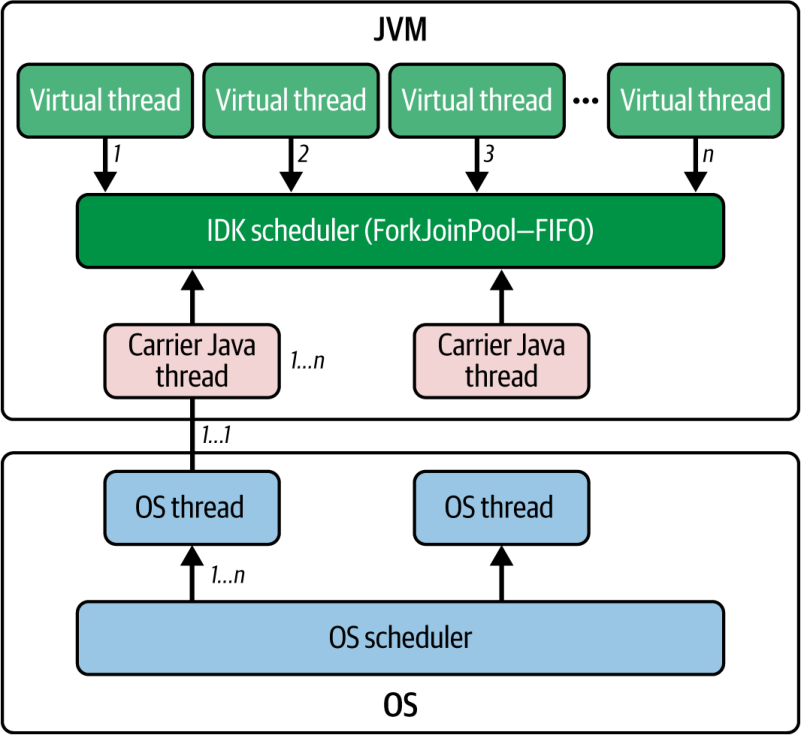
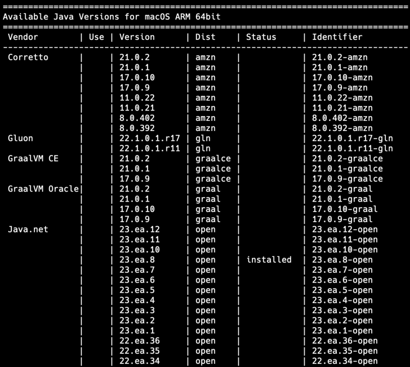
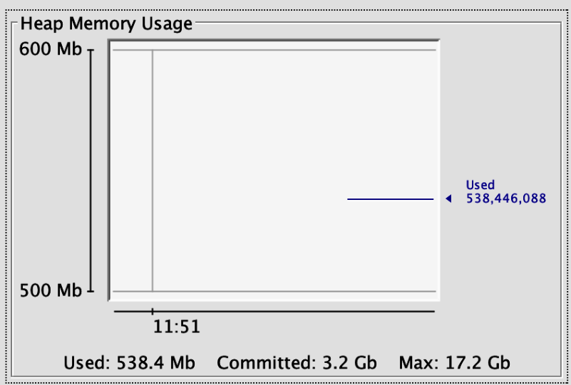
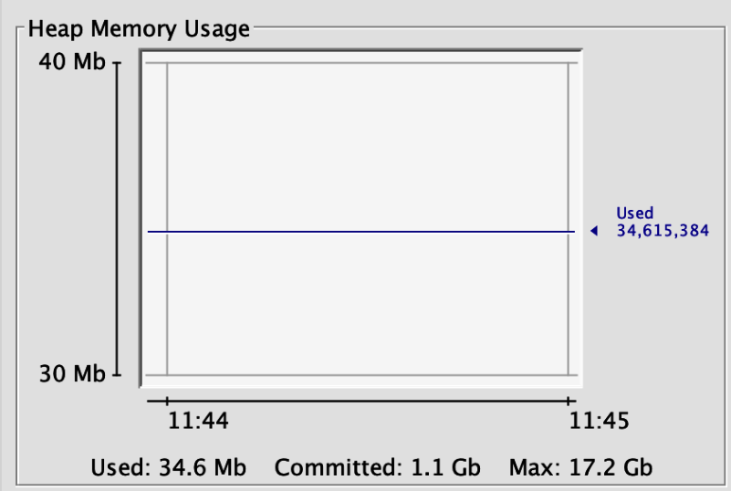
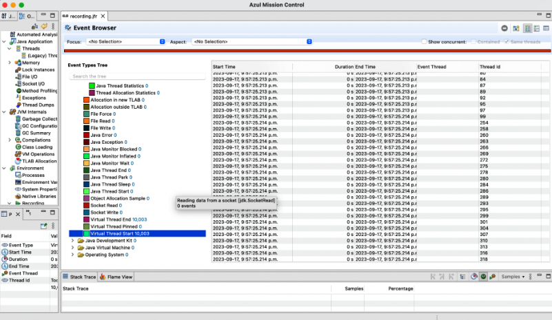

# Chương 2. Tìm hiểu về Virtual Thread

*Cái giá của sự tin cậy là việc theo đuổi sự đơn giản tột cùng. Đó là cái giá mà những người rất giàu thấy khó trả nhất.*

—Tony Hoare

Virtual thread (luồng ảo) là một bổ sung mang tính đột phá cho bộ công cụ concurrency của Java, đang thay đổi tận gốc cách lập trình viên viết các chương trình đồng thời, khiến việc dùng thread làm đơn vị concurrency chính ở quy mô cực lớn trở nên khả thi. Như chúng ta sẽ bàn kỹ trong chương này, virtual thread khác biệt đáng kể so với platform thread (luồng nền tảng), hay còn gọi là thread cổ điển, vốn đã phục vụ chúng ta suốt nhiều năm qua. Cụ thể, trong khi platform thread được quản lý bởi hệ điều hành bên dưới hoặc bởi các thư viện thread như của POSIX, thì virtual thread là những thread nhẹ được quản lý bởi chính Java Virtual Machine (JVM). Sự chuyển dịch từ thread do OS quản lý sang thread do JVM quản lý không chỉ đơn thuần là một chi tiết triển khai—nó cho phép ứng dụng tạo ra hàng triệu thread mà không phải chịu những tổn thất về bộ nhớ và hiệu năng vốn khiến các thiết kế như vậy trở nên bất khả thi với thread truyền thống. Trong chương này, chúng ta sẽ đi sâu vào virtual thread bằng cách xem xét kiến trúc của chúng, thảo luận xem chúng khác platform thread ở điểm nào, tìm hiểu động lực đằng sau sự ra đời của chúng cho các ứng dụng Java hiện đại, và khám phá cách chúng đơn giản hóa lập trình đồng thời trong khi mang lại scalability (khả năng mở rộng) chưa từng có.

## Virtual thread là gì?

Virtual thread được quản lý bởi JVM, điều này cho phép chúng hoạt động hiệu quả hơn so với thread truyền thống vốn dựa vào hệ điều hành để lập lịch và quản lý. Virtual thread được thực thi bên trên các carrier thread (luồng mang), về bản chất là các thread lấy từ Fork/Join Pool. Thiết kế này cho phép virtual thread thừa hưởng lợi ích của các cơ chế thread pool tiên tiến và các thuật toán work-stealing hiệu quả.

Điều quan trọng cần lưu ý là scheduler của virtual thread được triển khai bên trong JVM dựa trên một `ForkJoinPool` kiểu work-stealing, hoạt động ở chế độ vào trước, ra trước (First-In, First-Out — FIFO). `ForkJoinPool` này đóng vai trò nền tảng cho việc lập lịch virtual thread và tách biệt với common pool được dùng cho các mục đích khác, chẳng hạn như triển khai parallel stream, vốn hoạt động ở chế độ vào sau, ra trước (Last-In, First-Out — LIFO).

Mức parallelism của scheduler virtual thread, tức số lượng platform thread sẵn có để lập lịch cho virtual thread, là một tham số có thể cấu hình. Theo mặc định, nó được đặt bằng số bộ xử lý khả dụng trên hệ thống, đảm bảo tận dụng tối ưu tài nguyên phần cứng. Tuy nhiên, lập trình viên có thể tinh chỉnh tham số này bằng system property (thuộc tính hệ thống) `jdk.virtualThreadScheduler.parallelism`, cho phép họ điều chỉnh mức parallelism dựa trên yêu cầu cụ thể của ứng dụng và đặc điểm của workload.

Bạn có thể đặt system property trong Java bằng tùy chọn dòng lệnh `-D` khi khởi động ứng dụng Java của mình, như sau:

```bash
java -Djdk.virtualThreadScheduler.parallelism=4 -jar yourApp.jar
```

Trong ví dụ này, system property `jdk.virtualThreadScheduler.parallelism` được đặt là 4. Hãy thay `yourApp.jar` bằng tên thực tế của ứng dụng Java của bạn.

Trong mã nguồn, bạn có thể dùng phương thức [`System.setProperty(key, value)`](https://oreil.ly/-goJu):

```java
System.setProperty("jdk.virtualThreadScheduler.parallelism", "4");
```

Xin lưu ý rằng các thiết lập này cần được điều chỉnh trước khi chúng được sử dụng lần đầu tiên; việc này thường được thực hiện ở đầu phương thức main hoặc thậm chí trước khi application context của Spring/Jakarta EE/Quarkus khởi động.

### Hai loại thread trong Java

Với sự ra đời của virtual thread, Java giờ đây có hai loại thread riêng biệt: platform thread và virtual thread (Hình 2-1).

*Platform thread* Đây là loại thread vốn có của Java kể từ khi ra đời, điều này giải thích vì sao đôi khi chúng được gọi là thread *truyền thống* hoặc *thread cổ điển*. Bạn cũng có thể bắt gặp các thuật ngữ như *native thread* hay *OS thread* trong những ngữ cảnh khác nhau. Trong Java Development Kit (JDK), chúng được gọi chính thức là *platform thread*. Platform thread là một thread nặng được thực thi thông qua hệ điều hành bên dưới, dựa vào OS để lập lịch và quản lý thread. Platform thread duy trì ánh xạ một-một giữa thread Java và kernel thread, vốn được hệ điều hành quản lý. Các thread này tận dụng cơ chế lập lịch và context switch sẵn có của hệ điều hành. Platform thread đã là nền tảng của mô hình lập trình đồng thời trong Java kể từ khi ngôn ngữ này ra đời.

*Virtual thread*

Virtual thread, đôi khi được gọi là *user-mode thread* hoặc *lightweight thread* (thread nhẹ), là một bổ sung mới cho mô hình concurrency của Java kể từ JDK 21. Khác với platform thread, virtual thread được quản lý hoàn toàn bởi JVM. Có thể tạo hàng triệu virtual thread mà không làm cạn kiệt tài nguyên hệ thống. Virtual thread không được ánh xạ trực tiếp tới kernel thread. Thay vào đó, nhiều virtual thread chia sẻ một pool nhỏ hơn gồm các carrier thread (vốn là platform thread), cho phép JVM ghép kênh (multiplex) hiệu quả nhiều virtual thread lên một số lượng tương đối ít tài nguyên OS.



*Hình 2-1. Bên trong cơ chế lập lịch thread: virtual thread, carrier thread*

### Những khác biệt chính so với platform thread

Giờ đây khi đã biết có hai loại thread—platform thread và virtual thread—hãy cùng khám phá một số khác biệt chính giữa chúng:

*Nhẹ* Virtual thread dùng ít bộ nhớ và tài nguyên hơn nhiều so với platform thread, nên bạn có thể tạo hàng triệu virtual thread mà không làm cạn kiệt tài nguyên máy.

*Lập lịch*

Virtual thread được lập lịch bởi JVM chứ không phải hệ điều hành, nhờ đó tận dụng chu kỳ CPU tốt hơn và bỏ qua mọi chi phí phát sinh từ scheduler thread của hệ điều hành.

*Chịu được blocking*

Virtual thread không phải chịu tổn thất hiệu năng khi cần thực hiện các thao tác blocking, chẳng hạn đọc từ console, đọc từ file hoặc kết nối mạng, ghi ra file hoặc mạng, hay sleep. Đó là vì khi một virtual thread gặp thao tác blocking, nó nhường (yield) quyền điều khiển lại cho carrier thread, cho phép các virtual thread khác tiếp tục thực thi một cách hiệu quả.

*Tích hợp liền mạch*

Virtual thread được thiết kế để tích hợp liền mạch với các codebase hiện có. Lập trình viên có thể tiếp tục dùng những mẫu mã nguồn và trừu tượng hóa quen thuộc mà không phải điều chỉnh quy trình làm việc của mình.

Vì chúng ta không thể khắc phục các hạn chế của platform thread và chỉ có thể mở rộng chúng đến một mức nào đó, virtual thread mang đến một mô hình concurrency có khả năng mở rộng và hiệu năng cao hơn—một mô hình mà chúng tôi tin rằng có thể và sẽ làm thay đổi cách lập trình viên Java suy nghĩ về lập trình đồng thời. Xuyên suốt cuốn sách này, trong chương này và các chương tiếp theo, chúng ta sẽ đi sâu hơn vào chi tiết cách virtual thread hoạt động, xem cách sử dụng chúng trong các dự án thực tế, và đưa ra các dự án ví dụ để giúp bạn bắt đầu phát triển trong thế giới mới đầy thú vị này.

## Thiết lập môi trường cho virtual thread

Virtual thread của Project Loom hiện đã là một tính năng ổn định kể từ JDK 21. Để bắt đầu sử dụng chúng, hãy đảm bảo bạn đã cài đặt JDK 21. Để quản lý nhiều phiên bản JDK, chúng tôi khuyên dùng [SDKMAN](https://sdkman.io/). Công cụ đa năng này giúp đơn giản hóa việc cài đặt và cho phép chuyển đổi dễ dàng giữa các phiên bản. Hãy tham khảo trang web chính thức của SDKMAN để biết hướng dẫn cài đặt. Cài đặt JDK bằng SDKMAN giúp lập trình viên dễ dàng quản lý các phiên bản Java và các dependency trên hệ thống của họ, tạo thuận lợi cho các công việc phát triển Java.

Sau khi cài đặt SDKMAN, hãy dùng lệnh sau để liệt kê các phiên bản JDK sẵn có (xem Hình 2-2 để biết kết quả):

```bash
sdk list java
```



*Hình 2-2. Kết quả lệnh list của SDKMAN cho các phiên bản Java sẵn có*

Để cài đặt JDK 21 (nếu bạn chưa có), hãy dùng:

```bash
sdk install java <YOUR_FAVORITE_JDK_DISTRIBUTION>
```

Ví dụ, nếu bạn dùng OpenJDK, thì bạn sẽ dùng:

```bash
sdk install java 21.0.2-open
```

> **LƯU Ý**
>
> Chương này sử dụng JDK 21, hiện vẫn là phiên bản được sử dụng rộng rãi nhất cho virtual thread trong môi trường production. Trong các chương tiếp theo, chúng ta sẽ chuyển sang các phiên bản JDK mới nhất để khám phá những tính năng mới hơn như:
>
> - Scoped value
>
> - Structured concurrency
>
### Tạo virtual thread trong Java

Giờ đây khi đã cài đặt JDK 21, hãy cùng khám phá các cách tạo virtual thread trong Java.

Với những trường hợp sử dụng đơn giản, phương thức [`Thread.startVirtualThread()`](https://oreil.ly/FIiZ3) mang lại một cách tiếp cận trực tiếp. Nó nhận vào một `Runnable`, nên chúng ta có thể truyền một biểu thức lambda, và bất cứ thứ gì chúng ta truyền qua nó sẽ được thực thi. Ví dụ:

```java
Thread.startVirtualThread(() -> {
         System.out.println("Unleash massive parallelism with virtual
         threads! Here’s a taste.");
  });
```

Nếu bạn chạy đoạn mã trên, bạn có thể mong đợi thấy một thông điệp trên console. Tuy nhiên, sẽ chẳng có gì được in ra cả! Tại sao vậy? Virtual thread trong Java mặc định là daemon thread. Điều này có nghĩa là khi main thread (thread đã tạo ra virtual thread) kết thúc, JVM sẽ chấm dứt mọi daemon thread còn lại.

Để đảm bảo tác vụ của virtual thread hoàn thành, bạn cần chờ nó kết thúc:

```java
public static void main(String[] args) throws InterruptedException {
    Thread vThread = Thread.startVirtualThread(() -> {
        System.out.println("Virtual threads make concurrency effortless!" +
            "See for yourself.");
    });
    vThread.join();
}
```

Để kiểm soát nhiều hơn việc tạo thread, bạn có thể dùng Thread Builder API:

```java
var startedThread = Thread.ofVirtual()
    .start(() -> System.out.println("Hello world!"));
startedThread.join();
```

Để tạo một thread mà không khởi động nó ngay lập tức, hãy dùng đoạn mã sau:

```java
var unstartedThread = Thread.ofVirtual()
    .unstarted(() -> System.out.println("Hello world!"));
// Start the thread later when needed
unstartedThread.start();
```

Nếu ứng dụng của bạn đã sử dụng executor, bạn có thể chuyển sang virtual thread một cách êm thấm:

```java
try (var virtualExecutor = Executors.newVirtualThreadPerTaskExecutor()) {
    Future<String> future = virtualExecutor.submit(this::callService);
    // Process the future result
}
```

Điều này đặc biệt hữu ích trong các dự án lớn, nơi việc refactor ngay lập tức cho virtual thread có thể không thực tế.

Có nhiều cách tiếp cận khác nhau như vậy cho phép chúng ta tích hợp virtual thread một cách liền mạch vào codebase hiện có, tận dụng hiệu năng, scalability và hiệu quả tài nguyên được cải thiện mà mô hình concurrency mới này mang lại, trong khi vẫn giữ được các mẫu mã nguồn và trừu tượng hóa quen thuộc.

## Thích nghi với virtual thread

Sự ra đời của virtual thread đã mang đến những thay đổi cần thiết cho Thread API của Java, nhưng theo cách tối ưu cho sự quen thuộc của lập trình viên. Một virtual thread trong Java về bản chất là một thể hiện (instance) của lớp [`Thread`](https://oreil.ly/miPlt), và việc cancellation hoạt động giống hệt như với platform thread: bằng cách gọi phương thức [`interrupt()`](https://oreil.ly/hcXDN). Mã chạy bên trong thread phải hoặc kiểm tra cờ `interrupted`, hoặc gọi các phương thức tự động xử lý interrupt (điều mà hầu hết các phương thức blocking đều làm).

Hãy cùng xem một ví dụ về interrupt thread ở platform thread và virtual thread.

Interrupt platform thread:

```java
public class PlatformThreadInterruption {
    public static void main(String[] args) {
        Thread platformThread = Thread.ofPlatform().start(() -> {  ①
            try {
                System.out.println("Platform thread started...");
                for (int i = 0; i < 5; i++) {
                    System.out.println("Platform thread working: " + i);
                    Thread.sleep(1000); // Simulate work
                }
                System.out.println("Platform thread finished.");
            } catch (InterruptedException e) {  ②
                System.out.println("Platform thread interrupted!");
                // Handle cleanup if needed
            }
        });
        try {
            Thread.sleep(2500);  // Let the thread run for a bit  ③
        } catch (InterruptedException e) {}
        platformThread.interrupt();  ④
    }
}
```

Interrupt virtual thread:

```java
public class VirtualThreadInterruption {
    public static void main(String[] args) {
        Thread virtualThread = Thread.ofVirtual().start(() -> {  ①
            try {
                System.out.println("Virtual thread started...");
                for (int i = 0; i < 5; i++) {
                    System.out.println("Virtual thread working: " + i);
                    Thread.sleep(1000); // Automatically yields
                                           to other virtual threads
                }
                System.out.println("Virtual thread finished.");
            } catch (InterruptedException e) {  ②
                System.out.println("Virtual thread interrupted!");
                // Handle cleanup if needed
            }
        });
        try {
            Thread.sleep(2500);  // Let the thread run for a bit  ③
        } catch (InterruptedException e) {}
        virtualThread.interrupt();  ④
    }
}
```

Hãy cùng tìm hiểu luồng xử lý interrupt trong cả hai ví dụ:

① Tạo một platform thread hoặc virtual thread bằng mẫu builder.

② Bắt `InterruptedException` khi thread bị interrupt trong lúc đang thực hiện một thao tác blocking.

③ Main thread chờ 2.5 giây, cho phép worker thread hoàn thành hai đến ba vòng lặp.

④ Interrupt worker thread, kích hoạt ngoại lệ và việc dọn dẹp.

Nếu chạy đoạn mã trên, chúng ta sẽ nhận được các kết quả sau:

```bash
java PlatformThreadInterruption.java
Platform thread started...
Platform thread working: 0
Platform thread working: 1
Platform thread working: 2
Platform thread interrupted!
```

và

```bash
java VirtualThreadInterruption.java

Virtual thread started...
Virtual thread working: 0
Virtual thread working: 1
Virtual thread working: 2
Virtual thread interrupted!
```

Cả hai ví dụ đều cho ra kết quả giống hệt nhau, chứng tỏ virtual thread duy trì cùng ngữ nghĩa interrupt như platform thread. Khác biệt then chốt là các thao tác blocking của virtual thread (như `Thread.sleep()`) sẽ tự động nhường carrier thread bên dưới cho các virtual thread khác.

Dù virtual thread vẫn giữ các API quen thuộc, chúng có một số đặc điểm riêng phản ánh bản chất nhẹ và được quản lý của mình, ví dụ như thread group.

Tất cả virtual thread đều thuộc về một thread group duy nhất; không có API nào để tạo virtual thread với một thread group khác. Nếu chúng ta tạo một virtual thread và gọi phương thức `getThreadGroup()`, chúng ta sẽ luôn nhận được các thể hiện của cùng một `ThreadGroup`. Ví dụ:

```java
public class VirtualThreadGroupExample {
    public static void main(String[] args) throws InterruptedException {
        Set<ThreadGroup> threadGroups = new HashSet<>();

        for (int i = 0; i < 100; i++) {  ①
            Thread vThread = Thread.ofVirtual().start(() -> {
                try {
                    Thread.sleep(10);
                } catch (InterruptedException e) {
                    Thread.currentThread().interrupt();
                }
            });
            threadGroups.add(vThread.getThreadGroup());  ②
        }
        Thread.sleep(1000); // Wait for threads to complete
        System.out.println("Unique thread groups: " + threadGroups.size());
        System.out.println("Thread group: " + threadGroups.iterator().next());
    }
}
```

Trong đoạn mã trên, những gì chúng ta đã làm là:

① Tạo 100 virtual thread để kiểm tra việc gán thread group

② Thu thập thread group của tất cả virtual thread vào một set

Khi chạy đoạn mã trên, chúng ta sẽ nhận được kết quả sau:

```text
Unique thread groups: 1
Thread group: java.lang.ThreadGroup[name=VirtualThreads,maxpri=10]
```

Từ kết quả trên, chúng ta thấy virtual thread có một số đặc tính bất biến (immutable) giúp đơn giản hóa việc quản lý chúng:

*Độ ưu tiên* Virtual thread có mức ưu tiên được đặt là [`NORM_PRIORITY`](https://oreil.ly/g1mpf).

*Trạng thái daemon*

Tất cả virtual thread mặc định đều là daemon thread. Mọi nỗ lực thay đổi trạng thái này bằng [`setDaemon`](https://oreil.ly/9VuRC) đều không có tác dụng.

*Độ ưu tiên thread*

Gọi [`setPriority`](https://oreil.ly/IRu_B) trên một virtual thread không làm thay đổi độ ưu tiên của nó.

Thread API cũng đã được cập nhật để bổ sung một số phương thức mới và đánh dấu deprecated một số phương thức khác:

*Is Virtual* Phương thức thể hiện [`Thread::isVirtual`](https://oreil.ly/OeLMn) giúp bạn xác định một thread có phải là virtual hay không.

*Các phương thức dựa trên Duration*

Java 19 giới thiệu các phương thức thể hiện [`join(Duration)`](https://oreil.ly/TgkJ9) và [`sleep(Duration)`](https://oreil.ly/sIYV6), vốn không liên quan đến virtual thread nhưng mang lại sự tiện lợi.

*Thread ID*

Phương thức không-final [`getId()`](https://oreil.ly/klDiG) đã bị deprecated, và khuyến nghị dùng phương thức final [`threadId()`](https://oreil.ly/vq0IK) thay thế.

Về các phương thức deprecated, kể từ Java 20, các phương thức [`stop()`](https://oreil.ly/-V_Ao), [`suspend()`](https://oreil.ly/hflbW), [`resume()`](https://oreil.ly/SsQv5), và [`countStackFrames()`](https://oreil.ly/fFdg8) sẽ ném ra [`UnsupportedOperationException`](https://oreil.ly/UZ7zY) đối với cả platform thread lẫn virtual thread, vì bản chất chúng không an toàn, như đã đề cập trong [tài liệu Java](https://oreil.ly/lSBHU). Các phương thức này đã bị deprecated từ Java 1.2 và được lên lịch loại bỏ.

Tuy nhiên, virtual thread cũng có một vài hạn chế nhỏ. Đáng lưu ý là phương thức tĩnh [`Thread::getAllStackTraces`](https://oreil.ly/ZCVGV) chỉ trả về stack trace của các platform thread, không bao gồm virtual thread. Ngoài ra, hiện chưa có cách nào để biết platform thread nào đang thực thi một virtual thread cho trước.

Dù virtual thread mang đến một số thay đổi và hạn chế cho Thread API, sự tương đồng rộng rãi với API và các khái niệm threading hiện có khiến việc chuyển sang virtual thread gần như vô hình đối với lập trình viên. Bằng cách sử dụng các khả năng mới theo những hướng dẫn đã được cập nhật, lập trình viên có thể tiếp tục với codebase hiện có của mình nhưng giờ đây sẽ gặt hái được phần thưởng là hiệu năng và scalability của virtual thread.

## Minh họa việc tạo virtual thread trong Java

Virtual thread giải phóng tiềm năng scalability thực sự của các ứng dụng Java. Bằng cách sử dụng virtual thread, bạn có thể làm cho một ứng dụng Java có khả năng mở rộng vượt trội vì bạn có thể có nhiều tác vụ chạy song song hơn hẳn. Việc xử lý hàng nghìn request đồng thời là điều tối quan trọng đối với các ứng dụng máy chủ hiện đại. Giờ chúng ta sẽ xem virtual thread hoạt động thực tế. Hãy xét ví dụ sau, trong đó chúng ta submit 10,000 tác vụ bằng một executor tạo ra một virtual thread mới cho mỗi tác vụ:

```java
try (var executor = Executors.newVirtualThreadPerTaskExecutor()) {
    IntStream.range(0, 10_000).forEach(i -> {
        executor.submit(() -> {
            Thread.sleep(Duration.ofSeconds(1));
            return i;
        });
    });
}
```

Các tác vụ rất đơn giản: mỗi tác vụ chỉ sleep trong một giây. Điều này dễ dàng đạt được trên phần cứng hiện đại với 10,000 virtual thread chạy đồng thời. Điều ấn tượng là JDK quản lý việc này với một số lượng OS thread tối thiểu, thậm chí có thể chỉ là một.

Ngược lại, nếu chúng ta dùng [`Executors.newCachedThreadPool()`](https://oreil.ly/mzIbV), vốn tạo một platform thread mới cho mỗi tác vụ, chương trình có thể bị crash do chi phí tạo 10,000 OS thread. Tương tự, dùng một thread pool cố định như [`Executors.newFixedThreadPool(200)`](https://oreil.ly/dttrO) sẽ giới hạn concurrency một cách nghiêm trọng. Với chỉ 200 platform thread, nhiều tác vụ sẽ phải chạy tuần tự, khiến chương trình mất nhiều thời gian hơn đáng kể để hoàn thành.

### Throughput và scalability

Virtual thread có thể đạt throughput khoảng 10,000 tác vụ mỗi giây sau khi đã warm-up (khởi động) đủ. Nếu bạn tăng số tác vụ lên 1,000,000, chương trình vẫn chạy trơn tru, đạt throughput gần 1,000,000 tác vụ mỗi giây.

Điều quan trọng cần làm rõ là virtual thread không được thiết kế để chạy nhanh hơn mà để mang lại scalability cao hơn. Chúng tuân theo Little’s Law (Định luật Little), mang lại throughput cao hơn bằng cách cho phép concurrency lớn hơn, chứ không phải bằng cách thực thi tác vụ nhanh hơn.

Trong điều kiện lý tưởng, virtual thread có thể nâng cao đáng kể throughput trong các ứng dụng có những đặc điểm sau:

*Số lượng lớn tác vụ đồng thời* Virtual thread có thể là một bước ngoặt nếu ứng dụng của bạn có hơn vài nghìn tác vụ đồng thời. Điều này lý tưởng cho các máy chủ web lưu lượng cao cần xử lý hàng nghìn request cùng lúc hoặc cho các ứng dụng thực hiện nhiều thao tác I/O-bound song song.

*Workload không phải CPU-bound*

Virtual thread đặc biệt có lợi khi các tác vụ dành nhiều thời gian chờ đợi (ví dụ, chờ các thao tác I/O) hơn là thực hiện các thao tác CPU-bound.

*Đây là một lưu ý quan trọng:*

Dù virtual thread mang đến một cấp độ scalability mới cho các ứng dụng Java, chúng không phải là thuốc chữa bách bệnh cho concurrency. Chúng có khả năng phát huy hiệu quả nhất khi chúng ta có rất nhiều tác vụ đồng thời đi kèm với các workload nhẹ, không phải CPU-bound. So với multithreading truyền thống, virtual thread có thể mang lại một chiều kích scalability mới cho các ứng dụng Java. Điều này cho phép lập trình viên xây dựng những ứng dụng có tính đồng thời cao và có khả năng mở rộng, có thể xử lý một số lượng request khổng lồ mà không làm hao tổn chu kỳ CPU hay bộ nhớ của chúng ta.

### Nguyên lý nền tảng đằng sau scalability của virtual thread

Little’s Law là một nguyên lý nền tảng cung cấp những hiểu biết quý giá về hiệu năng của các hệ thống hàng đợi, bao gồm cả các ứng dụng đa luồng. Nó thiết lập một mối quan hệ toán học giữa latency, concurrency và throughput, ba yếu tố then chốt gắn liền một cách bản chất với hiệu năng của bất kỳ hệ thống tính toán nào.

Định luật này đơn giản một cách tao nhã, phát biểu rằng với một hệ thống ổn định, throughput ( λ) được cho bởi:

Hãy cùng đi sâu vào các thành phần của Little’s Law và tìm hiểu ý nghĩa của chúng:

*Throughput (λ)*

Số lượng phần tử (ví dụ: tác vụ, request) trung bình được hoàn thành trong một đơn vị thời gian *Concurrency (N)* Số lượng phần tử trung bình đang được xử lý cùng lúc *Thời gian phản hồi (d)* Thời gian trung bình để một phần tử được xử lý từ đầu đến cuối

Điều đáng chú ý về Little’s Law là tính bất khả tri của nó đối với bản chất của hệ thống mà nó mô tả. Nó không phân biệt giữa thời gian “làm việc” và thời gian “chờ đợi”, cũng không quan tâm đơn vị concurrency là gì—dù đó là một thread, một lõi CPU, một máy ATM, hay thậm chí một giao dịch viên ngân hàng bằng xương bằng thịt. Nó đơn giản chỉ đưa ra một công thức để tăng throughput.

#### Virtual thread và Little’s Law

Các mô hình threading truyền thống thường đụng phải bức tường do những giới hạn ở cấp OS về số lượng thread có thể được sinh ra. Khi điều này xảy ra, throughput của hệ thống bị ràng buộc bởi Little’s Law. Định luật này cho chúng ta thấy rằng nếu không thể tăng *N* (concurrency), chúng ta chỉ còn lại một biến khác để tác động: *d* (latency). Tuy nhiên, việc giảm latency không phải lúc nào cũng nằm trong tầm kiểm soát của lập trình viên, đặc biệt là với các tác vụ I/O-bound.

Đây chính là lúc virtual thread xuất hiện. Chúng đưa ra một lối thoát khỏi giới hạn này bằng cách cho phép *N* cao hơn nhiều—tức là, chúng cho phép concurrency cao hơn mà không đòi hỏi thay đổi mô hình lập trình. Đây là một lợi thế đáng kể vì nó trực tiếp dẫn đến throughput cao hơn, như Little’s Law đã chỉ ra. Virtual thread mang đến một cách để tăng *N* mà không phải giảm *d* một cách tương ứng.

Để minh họa khái niệm này, hãy cùng xây dựng một ví dụ mã nguồn cho phép chúng ta đo lường và chứng minh nguyên lý throughput của Little’s Law liên hệ thế nào với virtual thread và lợi ích scalability của chúng:

```java
import java.time.Duration;
import java.time.Instant;
import java.util.concurrent.ExecutorService;
import java.util.concurrent.Executors;
import java.util.concurrent.atomic.AtomicLong;
import java.util.stream.IntStream;

public class LittleLawExample {
  public static void main(String[] args) {
    int numTasks = 10000;  ①
    int avgResponseTimeMillis = 500; // Average task response time  ②
    // Simulate adjustable I/O-bound work
    Runnable ioBoundTask = () -> {
      try {
        Thread.sleep(Duration.ofMillis(avgResponseTimeMillis));  ③
      } catch (InterruptedException e) {
        Thread.currentThread().interrupt();
      }
    };

    System.out.println("=== Little's Law Throughput Comparison ===");
    System.out.println("Testing " + numTasks + " tasks with "
                        + avgResponseTimeMillis + "ms latency each\n");
    benchmark("Virtual Threads",
        Executors.newVirtualThreadPerTaskExecutor(), ioBoundTask, numTasks);
    benchmark("Fixed ThreadPool (100)",
        Executors.newFixedThreadPool(100), ioBoundTask, numTasks);
    benchmark("Fixed ThreadPool (500)",
        Executors.newFixedThreadPool(500), ioBoundTask, numTasks);
    benchmark("Fixed ThreadPool (1000)",
        Executors.newFixedThreadPool(1000), ioBoundTask, numTasks);
  }

  static void benchmark(String type, ExecutorService executor, Runnable task,
                      int numTasks) {
    Instant start = Instant.now();  ④
    AtomicLong completedTasks = new AtomicLong();
    try (executor) {  ⑤
      IntStream.range(0, numTasks)
          .forEach(i -> executor.submit(() -> {
            task.run();
            completedTasks.incrementAndGet();  ⑥
          }));
    }  ⑦
    Instant end = Instant.now();
    long duration = Duration.between(start, end).toMillis();
    // Tasks per second
    double throughput = (double) completedTasks.get() / duration * 1000;  ⑧
    System.out.printf("%-25s - Time: %5dms, Throughput: %8.2f tasks/s%n",
        type, duration, throughput);
  }
}
```

Hãy cùng khám phá những gì chúng ta đã thực hiện trong chương trình này:

① Mười nghìn tác vụ cung cấp đủ tải để thể hiện sự khác biệt về throughput trong khi vẫn giữ thời gian thực thi ở mức chấp nhận được.

② Thời gian phản hồi 500ms mô phỏng các thao tác I/O thực tế như truy vấn cơ sở dữ liệu hoặc gọi API, đại diện cho thành phần *d* (latency) trong Little’s Law.

③ `Thread.sleep()` mô phỏng các thao tác I/O blocking. Với virtual thread, điều này tự động nhường carrier thread cho các virtual thread khác.

④ Đo tổng thời gian thực thi từ lúc bắt đầu submit tác vụ đến khi hoàn thành tất cả các tác vụ.

⑤ `Try` -with-resources đảm bảo executor được shutdown đúng cách và chờ tất cả các tác vụ đã submit hoàn thành.

⑥ `AtomicLong` theo dõi an toàn số tác vụ đã hoàn thành trên tất cả các thread đồng thời.

⑦ Khi khối `try` kết thúc, tất cả các tác vụ đã submit đều đã thực thi xong.

⑧ Chuyển đổi số tác vụ hoàn thành trên tổng thời gian thành số tác vụ mỗi giây để dễ so sánh.

Trong ví dụ này, chúng ta mô phỏng một tác vụ I/O-bound với thời gian phản hồi trung bình là 500 mili giây. Sau đó chúng ta benchmark throughput đạt được bởi virtual thread và so sánh với các thread pool cố định có kích thước khác nhau, vốn đại diện cho mô hình threading truyền thống.

Khi thực thi đoạn mã trên, chúng ta nhận được kết quả cho thấy lợi thế vượt trội của virtual thread:

```text
=== Little's Law Throughput Comparison ===
Testing 10000 tasks with 500ms latency each
Virtual Threads           - Time:   552ms, Throughput: 18115.94 tasks/s
Fixed ThreadPool (100)    - Time: 50381ms, Throughput:   198.49 tasks/s
Fixed ThreadPool (500)    - Time: 10106ms, Throughput:   989.51 tasks/s
Fixed ThreadPool (1000)   - Time:  5080ms, Throughput:  1968.50 tasks/s
```

Như bạn thấy từ kết quả, virtual thread vượt trội hơn các thread pool truyền thống về throughput trong kịch bản I/O-bound này. Virtual thread có thể đạt throughput khoảng 18115.94 tác vụ mỗi giây, trong khi ngay cả một thread pool cố định lớn với 1,000 thread cũng chỉ đạt được throughput khoảng 1,968.50 tác vụ mỗi giây.

> **MẸO**
>
> Ví dụ trên chỉ là một minh họa cơ bản về Little’s Law với virtual thread. Để phân tích hiệu năng nghiêm ngặt hơn trong môi trường production, hãy cân nhắc những cải tiến sau:
>
> - Các lượt chạy warm-up cho JVM để tính đến ảnh hưởng của biên dịch just-in-time
>
> - Nhiều lần lặp benchmark kèm phân tích thống kê (trung bình, độ lệch chuẩn)
>
> - Giám sát mức sử dụng bộ nhớ để hiểu các đánh đổi về tài nguyên
>
> - Mô phỏng I/O thực tế với độ biến thiên latency (±10–20%) để mô hình hóa điều kiện thực tế
>
> - Kiểm thử scalability với các khối lượng tác vụ khác nhau để xác định điểm gãy
>
> - Bảo vệ bằng timeout và xử lý lỗi đúng cách để có các phép đo bền vững
>
> Những cải tiến này giúp phân biệt giữa khác biệt hiệu năng thực sự và những sai lệch do phép đo, mang lại hiểu biết đáng tin cậy hơn cho việc ra quyết định trong production. Với các đánh giá hiệu năng quan trọng, hãy cân nhắc sử dụng các framework microbenchmark đã được kiểm chứng như Java Microbenchmark Harness (JMH).
>
Với platform thread, throughput có thể cải thiện khi thread pool lớn hơn, nhưng có một giới hạn. Cuối cùng, tài nguyên OS sẽ bị hạn chế, và chi phí quản lý thread trở thành nút thắt cổ chai.

Ví dụ này cho thấy rõ cách virtual thread có thể tận dụng Little’s Law bằng cách cho phép giá trị *N* (concurrency) cao hơn mà không cần giảm *d* (latency) một cách tương ứng. Virtual thread có thể đạt throughput vượt trội bằng cách cho phép số lượng tác vụ đồng thời cao hơn đáng kể, đặc biệt trong các kịch bản I/O-bound nơi việc giảm latency không phải là một lựa chọn khả thi.

### Ý nghĩa thực tiễn

Virtual thread giải phóng lập trình viên khỏi việc phải tinh chỉnh hay thậm chí suy nghĩ lại từ gốc mô hình lập trình của họ để đạt được throughput cao hơn. Nếu một ứng dụng có nhiều tác vụ chủ yếu là I/O-bound dành phần lớn thời gian để chờ đợi, thì chúng ta có thể tăng đáng kể throughput mà không phải thay đổi cách những tác vụ đó được viết.

Bằng cách khai thác virtual thread, trên thực tế chúng ta có thể tăng *N* trong Little’s Law, điều này đến lượt nó làm tăng concurrency và do đó tăng throughput. Điều này đặc biệt hữu ích khi latency *d* khó giảm do bản chất của công việc (ví dụ: I/O mạng hoặc I/O đĩa).

Tuy nhiên, điều quan trọng cần lưu ý là virtual thread không phải là viên đạn bạc cho mọi vấn đề hiệu năng. Trong những tình huống mà I/O là nút thắt cổ chai, virtual thread có thể mang lại cải thiện vượt bậc về throughput; tuy nhiên, virtual thread sẽ không giúp ích trong những tình huống mà nút thắt không nằm ở số lượng tác vụ đồng thời đang hoạt động mà ở lượng năng lực tính toán sẵn có.

Khi lập trình viên nắm được Little’s Law và những hàm ý của nó đối với virtual thread, họ sẽ có cảm nhận tốt hơn về việc khi nào và làm thế nào virtual thread có thể được dùng để làm cho ứng dụng của họ có khả năng mở rộng hơn và nhanh hơn.

## Virtual thread hoạt động thế nào bên dưới lớp vỏ

Virtual thread mang đến một bước nhảy vọt đáng kể trong mô hình concurrency của Java. Để hiểu sức mạnh của chúng, hãy cùng khám phá các cơ chế cốt lõi.

### Stack frame và quản lý bộ nhớ

Cốt lõi của virtual thread là một triển khai thay thế của `java.lang.Thread`, lưu trữ các stack frame của nó trong heap được garbage collection của Java. Ngược lại, thread truyền thống lưu stack frame trong các khối bộ nhớ nguyên khối do hệ điều hành cấp phát. Cách tiếp cận mới mẻ này loại bỏ nhu cầu ước lượng kích thước stack cần thiết của một thread. Dấu chân bộ nhớ của một virtual thread khởi đầu chỉ từ vài trăm byte, và nó tự động điều chỉnh khi call stack lớn lên và thu nhỏ lại. Cơ chế quản lý bộ nhớ động này cải thiện đáng kể hiệu quả sử dụng tài nguyên.

### Carrier thread và sự tham gia của OS

Hệ điều hành không hề biết đến virtual thread; nó chỉ nhận biết platform thread, vốn vẫn là đơn vị lập lịch ở cấp OS. Để thực thi mã trong một virtual thread, Java runtime mount (gắn) nó lên một platform thread, được gọi là *carrier thread*. Các carrier thread này là một phần của một `ForkJoinPool` chuyên biệt. Quá trình này bao gồm việc tạm thời sao chép các stack frame cần thiết từ heap sang stack của carrier thread. Về bản chất, carrier thread được “mượn” để chạy mã của virtual thread.

### Xử lý các thao tác blocking

Một trong những cải tiến có ảnh hưởng nhất là cách virtual thread xử lý các thao tác blocking. Khi một virtual thread đi đến một thao tác thường sẽ block—có lẽ nó đang chờ I/O—nó có thể được unmount (tháo) khỏi carrier thread của mình. Các stack frame đã thay đổi của nó được sao chép ngược trở lại heap, và carrier thread được giải phóng để đi làm việc khác. Chức năng này đã được trang bị lại cho hầu như tất cả các điểm blocking trong JDK. Đó chính là điều khiến virtual thread cực kỳ hiệu quả trong việc sử dụng tài nguyên.

### Tính trong suốt và vô hình

Quá trình mount và unmount một virtual thread là trong suốt đối với mã Java. Không có cách nào để mã Java nhận biết được danh tính của carrier thread hiện tại. Ngay cả các giá trị [`ThreadLocal`](https://oreil.ly/0TLqb) của carrier thread cũng vô hình đối với một virtual thread. Mức độ trừu tượng hóa này đảm bảo virtual thread có thể được sử dụng một cách liền mạch mà không đòi hỏi thay đổi các codebase Java hiện có.

Khái niệm virtual thread gợi nhớ đến các hệ thống bộ nhớ ảo (virtual memory). Trong một hệ thống bộ nhớ ảo, các ứng dụng chạy dưới ảo giác rằng chúng có quyền truy cập vào một không gian địa chỉ gần như không giới hạn. Điều này được thực hiện nhờ một ánh xạ ở cấp phần cứng giữa phần nào của bộ nhớ ảo thực sự là bộ nhớ và phần nào là đĩa. Tương tự, virtual thread tạo ra ảo giác về multithreading gần như không giới hạn, bằng cách chia sẻ các platform thread khan hiếm và tốn kém. Stack của các virtual thread không hoạt động được “phân trang ra” (paged out) heap, giống như các trang bộ nhớ không dùng đến trong hệ thống bộ nhớ ảo được “phân trang ra” đĩa.

Chi tiết hơn về cách virtual thread hoạt động và các cơ chế bên trong của chúng sẽ được thảo luận trong các chương sau.

### Đơn giản hóa các thao tác bất đồng bộ

Với virtual thread, các thao tác bất đồng bộ và việc tổng hợp tác vụ trở nên dễ như trở bàn tay. Trong Java, gánh nặng của việc block trong khi chờ tác vụ bất đồng bộ hoàn thành đã thực sự được gỡ bỏ. Giờ đây lập trình viên có thể thoải mái gọi phương thức blocking [`get`](https://oreil.ly/2JFZL) trên một [`Future`](https://oreil.ly/CWUYq) mà không phải chịu tổn thất hiệu năng. Nhưng nơi virtual thread thực sự tỏa sáng là khi cần tổng hợp kết quả của nhiều tác vụ bất đồng bộ.

Hãy xét một kịch bản mà bạn cần lấy các thành phần khác nhau của một câu từ các API khác nhau và ghép chúng lại thành một cụm từ mạch lạc. Chẳng hạn, bạn có thể muốn lấy một tính từ và một danh từ để tạo ra một cụm từ đơn giản nhưng được sinh ngẫu nhiên. Với virtual thread, tác vụ này trở nên đơn giản đến bất ngờ:

```java
public String generatePhrase() throws ExecutionException, InterruptedException {
  try (var executor = Executors.newVirtualThreadPerTaskExecutor()) {
    Future<String> adjectiveFuture = executor.submit(this::fetchAdjective);
    Future<String> nounFuture = executor.submit(this::fetchNoun);
    String adjective = adjectiveFuture.get();
    String noun = nounFuture.get();
    return adjective + " " + noun;
    }
}
private String fetchAdjective() {
   // Fetch adjective from an API
   return "beautiful";
}
private String fetchNoun() {
   // Fetch noun from an API
   return "sunset";
}
```

Trong ví dụ này, chúng ta tận dụng [`VirtualThreadPerTaskExecutor`](https://oreil.ly/K6hJ6), một tiện ích thuận tiện để tạo virtual thread cho từng tác vụ riêng lẻ. Chúng ta submit hai tác vụ, một để lấy tính từ và một để lấy danh từ, bằng phương thức `submit` của `ExecutorService`.

Vẻ đẹp thực sự của virtual thread được bộc lộ khi chúng ta gọi `get` trên các đối tượng `Future` được trả về từ các tác vụ đã submit. Vì virtual thread nhẹ và hiệu quả, chúng ta có thể thoải mái block và chờ kết quả mà không tiêu tốn quá nhiều tài nguyên hay gây suy giảm hiệu năng. Cách tiếp cận này đơn giản hóa việc xử lý các thao tác bất đồng bộ, loại bỏ nhu cầu về các cấu trúc callback phức tạp hay các cơ chế đồng bộ hóa rắc rối.

Khi đã có tính từ và danh từ, chúng ta có thể nối chúng lại một cách liền mạch để tạo thành một cụm từ, chẳng hạn “beautiful sunset” trong trường hợp này.

Phương thức `invokeAll` vẫn có thể được sử dụng khi có các tác vụ tương tự nhau với cùng kiểu kết quả. Nó đặc biệt hữu ích khi mục tiêu là gom các kết quả vào một list. Chẳng hạn, bạn có thể muốn lọc các hình ảnh khác nhau theo cách tương tự:

```java
package ca.bazlur.modern.concurrency.c02;

import javax.imageio.ImageIO;
import java.awt.image.BufferedImage;
import java.io.File;
import java.io.IOException;
import java.util.List;
import java.util.concurrent.*;

public class ImageProcessingExample {

  public static void main(String[] args)
      throws InterruptedException, ExecutionException {
    try (var service = Executors.newVirtualThreadPerTaskExecutor()) {  ①

      List<Callable<BufferedImage>> tasks = List.of(
          () -> resize("https://example.com/img1.jpg", 200, 200),
          () -> grayscale("https://example.com/img2.jpg"),
          () -> rotate("https://example.com/img3.jpg", 90)
      );  ②

      List<Future<BufferedImage>> results = service.invokeAll(tasks);  ③

      // Process and save transformed images
      int i = 1;
      for (Future<BufferedImage> future : results) {  ④
        BufferedImage image = future.get();  ⑤
        ImageIO.write(image, "jpg",
            new File("output_image" + i + ".jpg"));
        i++;
      }
    } catch (IOException e) {
      throw new RuntimeException(e);
    }
  }

  static BufferedImage resize(String url, int width, int height) {
    //Logic to download and resize the image goes here
    return null;
  }

  static BufferedImage grayscale(String url) {
    // Logic to download and convert the image to
    // grayscale goes here
    return null;
  }

  static BufferedImage rotate(String url, double angle) {
    //Logic to download and rotate the image goes here
    return null;
  }
}
```

Hãy xem chúng ta có gì ở đây:

① Sử dụng executor virtual thread, nhưng lần này cho nhiều tác vụ xử lý ảnh đồng thời.

② Tạo một list các tác vụ `Callable`, mỗi tác vụ đại diện cho một phép biến đổi ảnh khác nhau.

③ Submit tất cả các tác vụ cùng lúc bằng `invokeAll()`; chúng thực thi đồng thời trên các virtual thread riêng biệt.

④ Duyệt qua các kết quả theo đúng thứ tự của danh sách tác vụ ban đầu.

⑤ Lấy từng kết quả bằng các lời gọi `get()` blocking, vốn nhường virtual thread một cách hiệu quả trong lúc chờ.

Các ứng dụng hiện đại thường xuyên đòi hỏi khả năng xử lý nhiều tác vụ cùng lúc đồng thời tổng hợp kết quả của chúng một cách hiệu quả. Virtual thread cung cấp một giải pháp tao nhã bằng cách cho phép thực thi song song với việc thu thập kết quả liền mạch, mang lại lợi thế đáng kể trong các môi trường tính toán hiện đại, nơi các thao tác I/O-bound chi phối hiệu năng ứng dụng.

### Lời hứa của structured concurrency

Dù tất cả các ví dụ trên đều hợp lệ và liên quan đến những cách xử lý tác vụ đồng thời khá đơn giản, chúng có phần sơ sài—chẳng hạn, chúng không xử lý ngoại lệ hay timeout tốt cho lắm. Phương thức `Future::get` có thể ném ra ngoại lệ, và nếu không có cơ chế timeout, nó có thể block vô thời hạn.

JEP 505 của Java giới thiệu structured concurrency, nhằm đơn giản hóa cách chúng ta viết mã đồng thời bền vững. API này cung cấp một scope có cấu trúc, trong đó các tác vụ chạy, và nếu bất kỳ tác vụ nào thất bại hoặc timeout, tất cả các tác vụ trong scope sẽ tự động bị hủy. Đây là một ví dụ ngắn gọn:

```java
public static void main(String[] args) {
  try (StructuredTaskScope scope = StructuredTaskScope.open()) {
    StructuredTaskScope.Subtask<String> subtask1
        = scope.fork(() -> fetchData("https://api1.example.com"));
    StructuredTaskScope.Subtask<String> subtask2 =
        scope.fork(() -> fetchData("https://api2.example.com"));
    scope.join();
    var result = subtask2.get() + subtask1.get();
    System.out.println(result);
  } catch (InterruptedException e) {
    throw new RuntimeException(e);
  }
}
```

> **LƯU Ý**
>
> Đoạn mã trên yêu cầu JDK 25 với preview feature được bật (- `-enable- preview`).
>
Các scope fail-fast này cũng cho phép bạn cung cấp timeout và giúp việc đóng gói ngoại lệ trở nên rất dễ dàng. Với scope fail-fast, `subtask1` và `subtask2` là các tác vụ được fork chạy bên trong scope. Nếu một trong hai thất bại (bằng cách ném ngoại lệ) hoặc nếu hết thời gian timeout, tất cả các tác vụ đang chạy trong scope sẽ bị hủy, và ngoại lệ được lan truyền ngược trở lại. Điều này dẫn đến mã sạch hơn và bền vững hơn, đóng gói một cách xuất sắc việc lan truyền ngoại lệ và timeout trong một cấu trúc có sẵn.

Sự ra đời của structured concurrency trong Java đại diện cho một bước tiến đáng kể trong việc đơn giản hóa phát triển ứng dụng đồng thời. Bằng cách cung cấp một scope có cấu trúc để chạy tác vụ, API này cho phép tự động hủy và xử lý ngoại lệ, giảm bớt gánh nặng quản lý thủ công những khía cạnh này cho lập trình viên.

Hơn nữa, structured concurrency thúc đẩy một phong cách lập trình khai báo hơn, nơi lập trình viên có thể diễn đạt ý định của mình một cách rõ ràng và súc tích. Thay vì phải xử lý các chi tiết cấp thấp, như tạo và quản lý thread hay triển khai logic hủy phức tạp, lập trình viên có thể tập trung vào các tác vụ ở cấp cao hơn và để Structured Concurrency API xử lý những phức tạp bên dưới.

Đây mới chỉ là cái nhìn thoáng qua về tiềm năng của structured concurrency. Chúng ta sẽ khám phá chủ đề hấp dẫn này sâu hơn trong các chương tiếp theo, xem xét các mẫu nâng cao, các loại scope khác nhau, và cách structured concurrency bổ trợ cho virtual thread để tạo ra những ứng dụng đồng thời thực sự bền vững.

## Quản lý ràng buộc tài nguyên bằng rate limiting

Virtual thread về cơ bản là cánh cửa mở ra concurrency không giới hạn, mang lại tiềm năng xử lý một số lượng tác vụ cùng lúc chưa từng có. Dù cho đến giờ chúng ta đã bàn về điều này như một điểm tích cực, nó có thể gây khó khăn ở một số khía cạnh. Đó là vì không phải mọi phần của phần mềm đều chịu được cùng một mức tải. Ví dụ, ứng dụng web mà chúng ta đang xây dựng chắc chắn có thể chấp nhận một triệu request, qua đó tạo ra một triệu virtual thread, nhưng cơ sở dữ liệu bên dưới có thể không xử lý nổi ngần ấy request.

Trước khi có virtual thread, thread pool đã giúp chúng ta giới hạn request mà không cần triển khai thêm cơ chế nào khác. Vậy nên nếu thread pool có 1,000 thread, tài nguyên bên dưới nhiều nhất chỉ phải chịu 1,000 tải đồng thời, không hơn. Tuy nhiên, điều này đặt ra một bài toán khó vì virtual thread có thể gần như không giới hạn. Vậy nên câu hỏi giờ đây trở thành: Làm thế nào để ngăn quá tải các dịch vụ khi dùng virtual thread?

Câu trả lời nằm ở việc triển khai các cơ chế rate limiting (giới hạn tốc độ) đặc thù cho tài nguyên mà bạn đang truy cập. Các cơ chế này có thể từ đơn giản đến phức tạp, tùy thuộc vào bản chất của tài nguyên và các thỏa thuận mức dịch vụ (SLA) mà bạn phải tuân thủ.

Hãy cùng khám phá một ví dụ dùng semaphore để kiểm soát số lượng request đồng thời tới một dịch vụ web. Điều then chốt là trọng tâm ở đây nằm ở nguyên lý của rate limiting:

```java
import java.net.URI;
import java.net.http.*;
import java.time.Duration;
import java.time.Instant;
import java.util.List;
import java.util.concurrent.*;
import java.util.stream.IntStream;
public class ResourceAwareRateLimitExample {
  private static final HttpClient CLIENT = HttpClient.newBuilder()
      .connectTimeout(Duration.ofSeconds(10))  ①
      .build();
  private static final int MAX_PARALLEL = 10;  ②
  private static final Semaphore gate = new Semaphore(MAX_PARALLEL);  ③
private static final String API_URL =
    "https://api.chucknorris.io/jokes/random";

  public static void main(String[] args) throws Exception {
    Instant start = Instant.now();
    List<String> jokes = fetchJokes(50);  ④
    long ms = Duration.between(start, Instant.now()).toMillis();
    System.out.printf("Fetched %d jokes in %d ms (avg %d ms)%n",
        jokes.size(), ms, ms / jokes.size());
    jokes.stream().limit(3).forEach(j -> System.out.println("• " + j));
  }

  private static List<String> fetchJokes(int n) throws Exception {
    try (ExecutorService pool = Executors.newVirtualThreadPerTaskExecutor()) {  ⑤
      List<Future<String>> futures = IntStream.range(0, n)
          .mapToObj(i -> pool.submit(ResourceAwareRateLimitExample::fetchJoke))
          .toList();
      return futures.stream()
          .map(ResourceAwareRateLimitExample::join)  ⑥
          .toList();
    }
  }

  private static String fetchJoke() throws Exception {
    HttpRequest req = HttpRequest.newBuilder(URI.create(API_URL))
        .GET()
        .timeout(Duration.ofSeconds(30))  ⑦
        .build();
    try {
      gate.acquire();  ⑧
      HttpResponse<String> res
        = CLIENT.send(req, HttpResponse.BodyHandlers.ofString());
      if (res.statusCode() != 200)
        throw new RuntimeException("API error " + res.statusCode());
      return parseJoke(res.body());
    } finally {
      gate.release();  ⑨
    }
  }

  private static String parseJoke(String json) {  ⑩
    int s = json.indexOf("\"value\":\"") + 9;
    int e = json.indexOf(’"’, s);
    return json.substring(s, e).replace("\\\"", "\"");
  }

  private static <T> T join(Future<T> f) {
    try {
      return f.get();
    } catch (InterruptedException e) {  ⑪
      Thread.currentThread().interrupt();
      throw new CompletionException(e);
    } catch (ExecutionException e) {
      throw new CompletionException(e.getCause());
    }
  }
}
```

Hãy cùng điểm qua những gì chúng ta đã làm ở đây:

① Cấu hình một `HttpClient` dùng chung với timeout kết nối 10 giây để tránh treo khi có sự cố mạng.

② Định nghĩa số lượng request API đồng thời tối đa được phép tại bất kỳ thời điểm nào.

③ Tạo một counting semaphore đóng vai trò cổng rate limiting của chúng ta, được khởi tạo với số request song song tối đa.

④ Thử lấy 50 câu chuyện cười, vượt quá giới hạn rate limit của chúng ta, cho thấy cách semaphore kiểm soát concurrency.

⑤ Tạo một executor sinh ra một virtual thread mới cho mỗi tác vụ được submit—hoàn hảo cho các thao tác I/O-bound.

⑥ Block cho đến khi tất cả các future hoàn thành, thu thập kết quả theo thứ tự hoàn thành.

⑦ Đặt timeout 30 giây cho mỗi request, ngăn từng request riêng lẻ block vô thời hạn.

⑧ Lấy một permit (giấy phép) từ semaphore, block nếu tất cả permit đang được sử dụng—đây chính là nơi rate limiting diễn ra.

⑨ Trả lại permit trong khối `finally`, đảm bảo nó được hoàn trả ngay cả khi xảy ra ngoại lệ.

⑩ Phân tích JSON đơn giản cho mục đích minh họa—trong production, hãy dùng một thư viện JSON đúng nghĩa như Jackson hoặc Gson.

⑪ Xử lý lỗi được cải thiện, giữ nguyên trạng thái interrupt và bóc tách `ExecutionException` để lấy nguyên nhân thực sự.

Trong ví dụ này, chúng ta đã giới hạn số tác vụ đồng thời ở mức 10 bằng cách đặt semaphore đếm đến 10. Tác vụ sẽ bị block bất cứ khi nào một tác vụ mới cố lấy semaphore mà giới hạn đã đạt tới. Nhưng hãy nhớ, với virtual thread, blocking rất rẻ. Điều này làm nổi bật ý nghĩa thực tiễn của virtual thread—dù chúng ta có thể chủ ý đưa vào những nút thắt cổ chai để rate limiting, hiệu quả của virtual thread giúp giảm thiểu tác động tiêu cực lên hiệu năng tổng thể của ứng dụng.

### Tìm hiểu semaphore trong Java

*Semaphore* là một cơ chế đồng bộ hóa hoạt động như một người gác cổng, kiểm soát quyền truy cập vào một tài nguyên dùng chung. Trong Java, lớp [`Semaphore`](https://oreil.ly/8ACAn) (thuộc package java.util.concurrent) cung cấp một cách tiện lợi để quản lý việc kiểm soát truy cập này.

Ý tưởng đằng sau semaphore rất đơn giản: nó theo dõi một số lượng permit cố định. Trước khi một thread có thể truy cập một đoạn mã cụ thể, nó cần lấy được một permit. Khi thread hoàn thành, nó trả lại permit. Nếu không còn permit nào, thread sẽ chờ cho đến khi có một permit được giải phóng.

Các phương thức chính của semaphore là:

```text
acquire()
```

Phương thức này yêu cầu một permit. Thread sẽ chờ nếu hiện không còn permit nào.

```text
release()
```

Phương thức này trả một permit về cho semaphore, có thể cho phép một thread khác đang chờ được tiếp tục.

```text
availablePermits()
```

Phương thức này cho phép bạn kiểm tra hiện có bao nhiêu permit đang rảnh.

Hãy tưởng tượng bạn có một pool chỉ gồm năm kết nối cơ sở dữ liệu. Bạn có thể dùng semaphore để đảm bảo chỉ có năm thread được dùng các kết nối đó cùng một lúc. Chẳng hạn:

```java
import java.util.Optional;
import java.util.concurrent.Semaphore;

public class ResourcePool {
    private final Semaphore semaphore;  ①
    public ResourcePool(int resourceCount) {
        this.semaphore = new Semaphore(resourceCount);  ②
    }

    public Optional<String> useResource(String query) {
        try {
            semaphore.acquire();  ③
            try {
                // Simulate obtaining and using a database connection
                return queryDatabase(query);  ④
            } finally {
                semaphore.release();  ⑤
            }
        } catch (InterruptedException e) {
            Thread.currentThread().interrupt();  ⑥
            return Optional.empty();
        }
    }

    private Optional<String> queryDatabase(String query) {
        // Simulate database query with some delay
        try {
            Thread.sleep(100);
        } catch (InterruptedException e) {
            Thread.currentThread().interrupt();
            return Optional.empty();
        }
        return Optional.of("Result for: " + query);
    }
}
```

Hãy xem xét cách triển khai này kiểm soát quyền truy cập vào các tài nguyên có hạn của chúng ta:

① Trường semaphore lưu trữ synchronization primitive của chúng ta. Semaphore này hoạt động như một bộ đếm thread-safe cho các permit khả dụng, quản lý việc truy cập đồng thời vào các kết nối cơ sở dữ liệu.

② Trong quá trình khởi tạo, chúng ta đặt giới hạn tài nguyên. Chúng ta khởi tạo semaphore với số lượng truy cập đồng thời tối đa được phép, qua đó thực chất tạo ra kích thước connection pool.

③ Đây là nơi rate limiting thực sự diễn ra. Phương thức `acquire()` block thread hiện tại cho đến khi có permit khả dụng, hiện thực hóa ràng buộc tài nguyên của chúng ta.

④ Khi đã lấy được permit, chúng ta bước vào critical section (vùng găng). Đây là đoạn mã nơi tài nguyên có hạn (kết nối cơ sở dữ liệu) thực sự được sử dụng.

⑤ Dọn dẹp tài nguyên là điều tối quan trọng trong lập trình đồng thời. Chúng ta luôn giải phóng permit trong khối `finally` để tránh rò rỉ tài nguyên, ngay cả khi xảy ra ngoại lệ.

⑥ Xử lý interrupt thread đúng cách là điều thiết yếu. Chúng ta giữ nguyên trạng thái interrupted để việc xử lý interrupt thread được đúng đắn, cho phép bên gọi phản ứng phù hợp.

Trong lớp trên, phương thức `useResource()` bị giới hạn chỉ cho phép `resourceCount` thread truy cập. Nếu có nhiều thread hơn cần truy cập, chúng sẽ phải chờ cho đến khi các thread đang có quyền truy cập giải phóng nó.

Trong các hệ thống production, việc giám sát mức sử dụng tài nguyên và triển khai timeout để ngăn blocking vô thời hạn thường rất có giá trị. Ngoài ra, để có thêm một mức độ tin cậy về chức năng của semaphore, hãy cùng cập nhật lớp `ResourcePool` của chúng ta.

Đây là mã đã được sửa đổi:

```java
import java.util.Optional;
import java.util.Random;
import java.util.concurrent.Semaphore;
import java.util.concurrent.TimeUnit;
import java.util.concurrent.atomic.AtomicInteger;

public class MonitoredResourcePool {
  private final Semaphore semaphore;
  private final AtomicInteger activeConnections;  ①
  private final AtomicInteger peakConnections;  ②

  public MonitoredResourcePool(int resourceCount) {
    this.semaphore = new Semaphore(resourceCount, true);  ③
    this.activeConnections = new AtomicInteger(0);
    this.peakConnections = new AtomicInteger(0);
  }

  public Optional<String> useResource(String query) {
    boolean acquired = false;
    try {
      acquired = semaphore.tryAcquire(5, TimeUnit.SECONDS);  ④
      if (!acquired) {
        return Optional.empty();  ⑤
      }
      int current = activeConnections.incrementAndGet();
      peakConnections.updateAndGet(peak -> Math.max(peak, current));  ⑥
      return queryDatabase(query);
    } catch (InterruptedException e) {
      Thread.currentThread().interrupt();
      return Optional.empty();
    } finally {
      if (acquired) {
        activeConnections.decrementAndGet();
        semaphore.release();
      }
    }
  }

  public int getCurrentActiveConnections() {
    return activeConnections.get();
  }

  public int getPeakConnections() {
    return peakConnections.get();  ⑦
  }

  private Optional<String> queryDatabase(String query) {
    try {
      Thread.sleep(new Random().nextInt(500) + 500);
    } catch (InterruptedException e) {
      Thread.currentThread().interrupt();
      return Optional.empty();
    }
    return Optional.of("Result for: " + query);
  }
}
```

Triển khai nâng cao này bổ sung một số tính năng sẵn sàng cho production:

① Giám sát các kết nối đang hoạt động giúp ích cho việc gỡ lỗi và hoạch định năng lực. Bộ đếm `activeConnections` theo dõi số kết nối đang hoạt động hiện tại chỉ cho mục đích giám sát, chứ không phải để cưỡng chế giới hạn.

② Hiểu các mẫu sử dụng đỉnh là điều tối quan trọng cho việc hoạch định năng lực. Bộ đếm này ghi lại số kết nối đồng thời cao nhất quan sát được trong suốt vòng đời của ứng dụng.

③ Tính công bằng (fairness) ngăn ngừa thread starvation (đói luồng) trong các kịch bản tranh chấp cao. Bằng cách truyền `true` làm tham số thứ hai, chúng ta tạo ra một semaphore công bằng, đảm bảo các thread lấy permit theo thứ tự FIFO. Timeout ngăn blocking vô thời hạn và cải thiện khả năng chống chịu của hệ thống. Phương thức `tryAcquire` với timeout tránh được việc block vô thời hạn, trả quyền điều khiển về cho bên gọi sau khoảng thời gian đã chỉ định.

④ Suy giảm có kiểm soát (graceful degradation) tốt hơn là treo vô thời hạn. Khi không thể lấy được tài nguyên trong khoảng thời gian timeout, chúng ta trả về một `Optional` rỗng để báo hiệu thất bại.

⑤ Các thao tác atomic đảm bảo việc thu thập thống kê được thread-safe. Việc cập nhật thread-safe số kết nối đỉnh này bằng các thao tác atomic ngăn ngừa race condition trong mã giám sát của chúng ta.

⑥ Công khai các metric giúp có được khả năng quan sát vận hành. Phương thức này cung cấp observability (khả năng quan sát) về các mẫu sử dụng resource pool, điều thiết yếu cho việc giám sát và cảnh báo.

Để xác minh rằng semaphore của chúng ta giới hạn truy cập đồng thời một cách chính xác, hãy cùng tạo một bài kiểm thử cố gắng làm quá tải resource pool:

```java
package ca.bazlur.modern.concurrency.c02;

import java.util.ArrayList;
import java.util.List;
import java.util.Optional;
import java.util.concurrent.*;

public class ResourcePoolTest {

  public static void main(String[] args) throws Exception {
    int maxConcurrentThreads = 5;
    int totalRequests = 50;
    var pool = new MonitoredResourcePool(maxConcurrentThreads);

    var futures = new ArrayList<Future<Optional<String>>>();

    try (var executor = Executors.newVirtualThreadPerTaskExecutor()) {
      for (int i = 0; i < totalRequests; i++) {
        final int taskId = i;
        futures.add(executor.submit(() -> pool.useResource("Query " + taskId)));
      }

      int successCount = 0;
      int timeoutCount = 0;

      for (Future<Optional<String>> future : futures) {
        Optional<String> result = future.get();
        if (result.isPresent()) {
          successCount++;
        } else {
          timeoutCount++;  ①
        }
      }

      System.out.printf("""
              requests  : %d
              successful: %d
              timed-out : %d
              peak usage: %d%n""",
          totalRequests, successCount, timeoutCount, pool.getPeakConnections());
      assert pool.getPeakConnections() <= maxConcurrentThreads
          : "Peak connections exceeded limit!";
    }
  }
}
```

Bài kiểm thử của chúng ta cho thấy hiệu quả của rate limiting dựa trên semaphore:

① Theo dõi các timeout giúp chúng ta hiểu hành vi của hệ thống dưới tải. Bộ đếm này theo dõi các request không thể lấy được permit trong khoảng thời gian timeout, cho thấy có tranh chấp tài nguyên.

② Số kết nối đỉnh chứng minh rate limiting của chúng ta hoạt động chính xác. Bước xác minh này đảm bảo semaphore đã giới hạn thành công việc truy cập đồng thời trong suốt quá trình thực thi bài kiểm thử.

Khi chạy bài kiểm thử này, bạn sẽ thấy rằng dù đã submit 50 request đồng thời, số kết nối đỉnh không bao giờ vượt quá giới hạn 5 của chúng ta. Một số request có thể timeout nếu chúng không lấy được permit trong vòng năm giây, cho thấy bản chất bảo vệ của cơ chế rate limiting dựa trên semaphore của chúng ta.

Kết quả đầu ra đối với tôi trông như sau:

```text
Total requests: 50
Successful: 32
Timed out: 18
Peak concurrent connections: 5
```

### Tại sao nên dùng Semaphore?

Sau khi đã thấy semaphore điều tiết concurrency hiệu quả như thế nào, chúng ta hãy cùng khám phá một số tình huống phổ biến mà cơ chế đồng bộ hóa này tỏ ra vô cùng hữu ích:

*Quản lý tài nguyên* Semaphore rất lý tưởng để giới hạn quyền truy cập vào các tài nguyên dùng chung như network socket, kết nối cơ sở dữ liệu, hoặc bất kỳ tài nguyên nào có dung lượng hữu hạn. Hãy xem xét tình huống ứng dụng của bạn chỉ có license cho 10 kết nối cơ sở dữ liệu đồng thời. Một semaphore được khởi tạo với 10 permit (giấy phép) đảm bảo bạn không bao giờ vượt quá giới hạn này, tránh vi phạm license và lỗi kết nối.

*Giới hạn tốc độ (rate limiting)*

Hãy dùng semaphore để kiểm soát tốc độ gửi request tới một web service hoặc API, tránh quá tải và đảm bảo trải nghiệm người dùng mượt mà. Ví dụ, nếu một API bên ngoài chỉ cho phép 100 request mỗi phút, chúng ta có thể dùng semaphore kết hợp với một tác vụ định kỳ (scheduled task) bổ sung permit để duy trì giới hạn tốc độ này.

*Kiểm soát concurrency nói chung*

Semaphore cung cấp một cách để quản lý chính xác số lượng thread đồng thời thực thi một đoạn code cụ thể. Điều này rất quan trọng để duy trì sự ổn định trong các ứng dụng có mức concurrency cao, đặc biệt khi làm việc với những tài nguyên chỉ chịu được một mức parallelism nhất định.

Khi sử dụng semaphore, hãy ghi nhớ những lưu ý quan trọng sau:

*Tính công bằng (fairness)* Lớp `Semaphore` của Java cho phép bạn cấu hình tính công bằng. Trong một semaphore công bằng (fair), permit được cấp theo thứ tự chúng được yêu cầu. Tuy nhiên, semaphore công bằng có thể có hiệu năng thấp hơn đôi chút so với semaphore không công bằng (nonfair) do chi phí duy trì thứ tự yêu cầu. Hãy chọn tính công bằng khi việc ngăn chặn tình trạng thread bị bỏ đói (starvation) quan trọng hơn hiệu năng thuần túy. *Blocking* Phương thức `acquire()` có thể block một thread nếu không còn permit nào khả dụng. May mắn thay, sự ra đời của virtual thread trong Java giảm đáng kể chi phí gắn với việc blocking này. Không giống platform thread, virtual thread bị block không tiêu tốn tài nguyên OS, khiến việc đồng bộ hóa dựa trên semaphore có khả năng mở rộng tốt hơn nhiều. *Xử lý lỗi* Hãy giải phóng permit một cách cẩn thận trong khối `finally`. Điều này rất cần thiết để tránh rò rỉ tài nguyên và đảm bảo quản lý tài nguyên đúng đắn, ngay cả khi có ngoại lệ xảy ra.

*Hạch toán permit*

Hãy nhớ rằng semaphore không gắn permit với một thread cụ thể nào. Bất kỳ thread nào cũng có thể giải phóng một permit, kể cả permit mà nó không hề acquire. Sự linh hoạt này có thể hữu ích nhưng đòi hỏi thiết kế cẩn thận để tránh vô tình làm tăng số permit hiệu dụng.

> **NHỮNG HẠN CHẾ CỦA SEMAPHORE**
>
> Semaphore rất cần thiết để bảo vệ các tài nguyên có hạn, nhưng chúng có một điểm kỳ quặc nguy hiểm: chúng không theo dõi thread nào đã acquire permit nào. Bất kỳ thread nào cũng có thể giải phóng một permit, kể cả permit mà nó chưa từng acquire.
>
> Đây là ví dụ cho thấy mọi thứ có thể đi chệch hướng dễ dàng đến mức nào:
>
> ```java
> // Start with 2 permits
> Semaphore semaphore = new Semaphore(2);
> // Thread 1: Forgets to release
> Thread.ofVirtual().start(() -> {
>     semaphore.acquire();
>     // Oops! No release
> });
> // Thread 2: Releases without acquiring
> Thread.ofVirtual().start(() -> {
>     semaphore.release(); // BUG!
>     semaphore.release(); // Double BUG!
> });
> // Result: We now have 3+ permits instead of 2!
> ```
>
> Trong môi trường production, điều này có thể đồng nghĩa với việc vượt quá số kết nối cơ sở dữ liệu, làm quá tải các API, hoặc gây cạn kiệt bộ nhớ.
>
> Đây là mẫu (pattern) an toàn tuyệt đối:
>
> ```java
> public <T> T useResource(Callable<T> task)
>   throws Exception {
>     semaphore.acquire();  // Acquire before try
>     try {
>         return task.call();
>     } finally {
>         semaphore.release();  // ALWAYS releases
>     }
> }
> ```
>
Tóm lại, hiểu về semaphore mang lại cho bạn một công cụ mạnh mẽ để quản lý tài nguyên dùng chung trong các ứng dụng Java của mình. Điều này đặc biệt có giá trị khi làm việc với virtual thread, vì nó giúp đảm bảo sự ổn định và hiệu năng tối ưu.

## Những hạn chế của Virtual Thread

Cho đến giờ, chúng ta đã tìm hiểu những lợi ích của virtual thread. Chúng được thiết kế để nhẹ và dễ dàng được Java runtime lập lịch, mang lại một cách xử lý concurrency hiệu quả hơn. Tuy nhiên, chúng đi kèm một hạn chế được gọi là *pinning* (ghim), điều có thể ảnh hưởng đến scalability và hiệu năng của ứng dụng của bạn.

Trong ngữ cảnh virtual thread, pinning chỉ tình huống một virtual thread bị gắn chặt vào carrier thread của nó (platform thread bên dưới mà nó đang chạy trên đó). Khi bị pin, virtual thread không thể tự unmount khỏi carrier thread ngay cả khi gặp các thao tác blocking, và trên thực tế nó độc chiếm carrier thread đó trong suốt thời gian bị pin.

Pinning xảy ra trong hai tình huống chính:

*Khối hoặc phương thức synchronized* Khi một virtual thread đi vào một khối hoặc phương thức `synchronized`, nó bị pin vào carrier thread của mình. Điều này có nghĩa là trong khi khối hoặc phương thức đó thực thi, carrier thread không thể được tái sử dụng cho các tác vụ khác.

*Phương thức native hoặc foreign function*

Khi một virtual thread thực thi một phương thức native hoặc một foreign function (hàm ngoại), nó cũng bị pin.

Bản chất của virtual thread nằm ở khả năng được unmount khỏi carrier thread khi chúng thực hiện các thao tác blocking, về cơ bản là giải phóng carrier thread cho các tác vụ khác. Khi pinning xảy ra, virtual thread không thể tự unmount. Điều này đặt ra một thách thức vì số lượng carrier thread của chúng ta là có hạn. Nếu nhiều virtual thread bị pin trong thời gian dài, chúng có thể chiếm giữ các carrier thread này. Điều đó ngăn các virtual thread khác thực thi, và trên thực tế làm hạn chế những lợi ích về concurrency mà virtual thread mang lại.

Pinning làm mất đi lợi thế này theo những cách sau:

*Giảm throughput* Vì một virtual thread bị pin chiếm giữ carrier thread của nó, các virtual thread khác phải chờ carrier thread rảnh, làm giảm throughput tổng thể của hệ thống.

*Sử dụng tài nguyên kém hiệu quả*

Carrier thread là một tài nguyên hữu hạn, gắn liền với năng lực của hệ thống. Để chúng bị block do các virtual thread bị pin là một cách sử dụng tài nguyên kém hiệu quả.

*Lo ngại về scalability*

Nếu một phần đáng kể virtual thread của bạn bị pin do sử dụng thường xuyên các khối `synchronized` hoặc phương thức native, bạn có thể gặp phải các vấn đề về scalability.

Để giảm nhẹ tác động của pinning, hãy cân nhắc các chiến lược sau:

- Thay vì dùng khối hoặc phương thức `synchronized`, hãy dùng [`ReentrantLock`](https://oreil.ly/DkvNO) từ [java.util.concurrent.locks](https://oreil.ly/dg6lJ), vì nó cho phép virtual thread được unmount khi bị block.

- Thường xuyên rà soát code của bạn để xác định và giảm thiểu việc sử dụng các phương thức hoặc khối synchronized cũng như các phương thức native trong ngữ cảnh virtual thread.

Bằng cách hiểu rõ những hạn chế mà pinning gây ra đối với virtual thread, bạn có thể đưa ra các quyết định kiến trúc tốt hơn cho ứng dụng Java của mình.

### Pinning

Hãy cùng xem một ví dụ Java cụ thể minh họa khái niệm pinning trong virtual thread:

```java
import java.util.List;
import java.util.stream.IntStream;

public class ThreadPinnedExample {
  private static final Object lock = new Object();

  public static void main(String[] args) {
    List<Thread> threadList = IntStream.range(0, 10)
        .mapToObj(i -> Thread.ofVirtual().unstarted(() -> {
          if (i == 0) {
            System.out.println(Thread.currentThread());  ①
          }
          synchronized (lock) {  ②
            try {
              Thread.sleep(25);  ③
            } catch (InterruptedException e) {
              Thread.currentThread().interrupt();
            }
          }
          if (i == 0) {
            System.out.println(Thread.currentThread());  ④
          }
        })).toList();

    threadList.forEach(Thread::start);
    threadList.forEach(t -> {
      try {
        t.join();
      } catch (InterruptedException e) {
        Thread.currentThread().interrupt();
      }
    });
  }
}
```

Hãy lần theo những gì xảy ra khi đoạn code này thực thi:

① Với virtual thread đầu tiên (khi `i == 0`), chúng ta in thông tin thread hiện tại trước khi đi vào khối `synchronized`. Điều này ghi lại virtual thread đang chạy trên carrier thread nào.

② Khi một virtual thread đi vào khối `synchronized` này, nó bị pin vào carrier thread của mình. Pinning xảy ra vì các khối `synchronized` hiện tại ngăn virtual thread unmount khỏi carrier thread của chúng.

③ Thao tác sleep mô phỏng một thao tác I/O blocking. Thông thường, một virtual thread đang sleep sẽ unmount khỏi carrier thread của nó, cho phép carrier đó chạy các virtual thread khác. Tuy nhiên, bên trong khối `synchronized`, virtual thread vẫn bị pin, độc chiếm carrier thread trong trọn vẹn 25 mili giây.

④ Sau khi thoát khỏi khối `synchronized`, chúng ta in lại thông tin thread một lần nữa. Điều này cho phép chúng ta kiểm chứng xem virtual thread có còn ở trên cùng carrier thread hay không.

Khi thực thi đoạn code này, kết quả đầu ra cho thread `0` cho thấy hiệu ứng pinning:

```text
VirtualThread[#21]/runnable@ForkJoinPool-1-worker-1
VirtualThread[#21]/runnable@ForkJoinPool-1-worker-1
```

Hãy để ý rằng định danh của carrier thread ( `ForkJoinPool-1-worker-1`) vẫn giữ nguyên trước và sau khối synchronized. Điều này xác nhận rằng virtual thread đã không chuyển sang carrier thread khác, cho thấy nó đã bị pin trong suốt thao tác blocking.

> **LƯU Ý**
>
> Bắt đầu từ JDK 24, virtual thread sẽ không còn bị pin bởi các khối `synchronized` nữa. JVM giờ đây hỗ trợ unmount bên trong các đoạn synchronized, loại bỏ hoàn toàn hạn chế này. Tuy nhiên, nếu bạn đang dùng JDK 23 trở về trước, bạn vẫn phải cân nhắc hành vi pinning khi thiết kế các ứng dụng đồng thời.
>
Hãy hình dung điều gì xảy ra nếu chúng ta mở rộng lên 1.000 hoặc 10.000 virtual thread, tất cả đều cố gắng đi vào các khối synchronized có thao tác blocking. Với chỉ một nhúm carrier thread khả dụng, hầu hết các virtual thread sẽ phải xếp hàng chờ một carrier thread rảnh, làm mất đi mục đích của việc sử dụng virtual thread cho concurrency cao.

### Giải quyết vấn đề Pinning với ReentrantLock

`ReentrantLock` là một cơ chế đồng bộ hóa trong Java, linh hoạt hơn khối `synchronized` truyền thống. Nó cho phép các tương tác thread phức tạp hơn và cung cấp các tính năng bổ sung như fairness, `try` -lock, và khả năng bị interrupt. Một trong những lợi thế chính của việc dùng `ReentrantLock` là khả năng tránh được vấn đề pinning trong virtual thread.

Đoạn code ví dụ sau cho thấy cách dùng `ReentrantLock` để tránh vấn đề pinning gắn với virtual thread trong Java. Thay vì dùng khối `synchronized`, vốn sẽ pin virtual thread vào carrier của nó, đoạn code sử dụng `ReentrantLock` để đồng bộ hóa. Điều này cho phép virtual thread được unmount khỏi carrier thread khi nó bị block, nhờ đó carrier thread trở nên khả dụng cho các tác vụ khác. Ví dụ:

```java
import java.util.concurrent.locks.ReentrantLock;
import java.util.stream.IntStream;

public class PreventPinningExample {
  private static final ReentrantLock lock = new ReentrantLock();  ①

  public static void main(String[] args) {
    var threadList = IntStream.range(0, 10)
        .mapToObj(i -> Thread.ofVirtual().unstarted(() -> {
          if (i == 0) {
            System.out.println(Thread.currentThread());  ②
          }
          lock.lock();  ③
          try {
            Thread.sleep(25);  ④
          } catch (InterruptedException e) {
            Thread.currentThread().interrupt();
          } finally {
            lock.unlock();  ⑤
          }
          if (i == 0) {
            System.out.println(Thread.currentThread());  ⑥
          }
        })).toList();

    threadList.forEach(Thread::start);
    threadList.forEach(thread -> {
      try {
        thread.join();
      } catch (InterruptedException e) {
        Thread.currentThread().interrupt();
      }
    });
  }
}
```

Hãy xem xét những khác biệt chính so với ví dụ synchronized của chúng ta:

① Chúng ta tạo một instance `ReentrantLock` thay vì dùng object monitor. Lock này cung cấp cùng những đảm bảo loại trừ lẫn nhau (mutual exclusion) như lock `synchronized`, nhưng với hành vi thân thiện với virtual thread.

② Chúng ta ghi lại thông tin carrier thread ban đầu của virtual thread đầu tiên.

③ Phương thức `lock()` acquire lock, tương tự như đi vào một khối `synchronized`. Tuy nhiên, khác với `synchronized`, thao tác này không pin virtual thread.

④ Trong thao tác sleep bên trong lock, virtual thread có thể unmount khỏi carrier thread của nó. Carrier trở nên khả dụng để chạy các virtual thread khác trong khi virtual thread này bị block.

⑤ Thao tác unlock phải luôn được thực hiện trong khối `finally`. Điều này đảm bảo lock được giải phóng ngay cả khi có ngoại lệ xảy ra, tránh deadlock.

⑥ Sau khi giải phóng lock, chúng ta in lại thông tin thread để quan sát xem carrier thread có thay đổi gì không.

Khi bạn chạy ví dụ này, kết quả đầu ra cho thấy sự khác biệt then chốt:

```text
VirtualThread[#20]/runnable@ForkJoinPool-1-worker-1
VirtualThread[#20]/runnable@ForkJoinPool-1-worker-3
```

Kết quả đầu ra có thể được diễn giải như sau:

```text
VirtualThread[#20]/runnable@ForkJoinPool-1-worker-1
```

Cho biết virtual thread với ID # `20` đang ở trạng thái `runnable` và hiện đang được mount trên một carrier thread có tên `ForkJoinPool-1-worker-1`.

```text
VirtualThread[#20]/runnable@ForkJoinPool-1-worker-3
```

Cho thấy cùng virtual thread đó với ID # `20` vẫn ở trạng thái `runnable` nhưng giờ đã được mount lại lên một carrier thread khác, có tên `ForkJoinPool-1-worker-3`.

Ví dụ này cho thấy virtual thread ban đầu chạy trên một carrier thread và sau đó được chuyển sang một carrier thread khác. Điều này khả thi là nhờ chúng ta đã dùng `ReentrantLock` thay vì khối `synchronized`. Về cơ bản, điều này tránh được vấn đề pinning và cho phép Java runtime lập lịch virtual thread một cách tối ưu trên các carrier thread khả dụng.

Khác biệt then chốt nằm ở cách triển khai. Trong khi các khối `synchronized` dùng object monitor vốn hiện tại đòi hỏi pinning, `ReentrantLock` dùng cơ chế park/unpark có nhận biết virtual thread.

> **CƠ CHẾ PARK/UNPARK**
>
> Cơ chế park/unpark là một primitive (nguyên thủy) phối hợp thread cấp thấp trong Java, tạo thành nền tảng cho nhiều tiện ích concurrency cấp cao hơn.
>
> Khi một thread gọi [`LockSupport.park()`](https://oreil.ly/rvEjY), nó trở thành “parked” (bị block) cho đến khi:
>
> - Một thread khác gọi `unpark()` với thread này làm đích.
>
> - Thread bị interrupt.
>
> - Lời gọi trả về một cách giả tạo (spurious) (hiếm nhưng có thể xảy ra).
>
> Việc gọi [`LockSupport.unpark(thread)`](https://oreil.ly/Hl-pC) làm cho thread đích đủ điều kiện tiếp tục chạy:
>
> ```java
> // Thread A
> LockSupport.park(); // Blocks until unparked
> // Thread B
> LockSupport.unpark(threadA); // Wakes up Thread A
> ```
>
> Điều làm cho park/unpark thân thiện với virtual thread là JVM có thể phát hiện khi một virtual thread park và unmount nó khỏi carrier thread. Điều này khác với object monitor (được `synchronized` sử dụng), vốn đòi hỏi virtual thread phải tiếp tục được mount.
>
Khi một virtual thread bị block trên một `ReentrantLock`, runtime có thể:

1. Lưu trạng thái của virtual thread

2. Unmount nó khỏi carrier thread

3. Dùng carrier đó cho các virtual thread khác

4. Sau đó mount virtual thread lên bất kỳ carrier nào khả dụng khi lock trở nên khả dụng

> **KHỐI SYNCHRONIZED VÀ PINNING CỦA VIRTUAL THREAD**
>
> Mặc dù từ khóa `synchronized` có thể dẫn đến pinning, tác động của nó thay đổi tùy thuộc vào đoạn code cụ thể bên trong khối `synchronized`. Hãy xem xét một vài ví dụ:
>
> **VÍ DỤ 1: RỦI RO PINNING TỐI THIỂU**
>
> ```java
> synchronized (this) {
>   return this.a + this.b;
> }
> ```
>
> Trong trường hợp này, thao tác bên trong khối `synchronized` cực kỳ ngắn. Ngay cả khi virtual thread cần chờ lock, nhiều khả năng nó sẽ được unpin rất nhanh, giảm thiểu tác động.
>
> **VÍ DỤ 2: VẤN ĐỀ PINNING TIỀM ẨN**
>
> ```java
> synchronized (this) {
>   var response = httpClient.sendBlockingRequest(request);
>   return response;
> }
> ```
>
> Ở đây, lời gọi mạng blocking ( `httpClient.sendBlockingRequest`) bên trong khối `synchronized` gây ra rủi ro pinning. Virtual thread có thể bị pin trong suốt toàn bộ thời gian của request mạng, cản trở những lợi ích về concurrency.
>
> **VÍ DỤ 3: VẤN ĐỀ PINNING TƯƠNG TỰ**
>
> ```java
> synchronized (this) {
>   this.wait();
> }
> ```
>
> Các lời gọi `Object.wait()` cũng dẫn đến pinning bên trong các khối `synchronized`, vì virtual thread sẽ bị pin cho đến khi được notify.
>
> **ĐIỂM RÚT RA CHÍNH**
>
> Mức độ nghiêm trọng của pinning do `synchronized` gây ra phụ thuộc vào bản chất các thao tác bên trong khối. Các thao tác ngắn, non-blocking nhìn chung là ổn. Tuy nhiên, các lời gọi blocking đòi hỏi phải cân nhắc cẩn thận.
>
> **BỨC TRANH ĐANG THAY ĐỔI**
>
> Các [bản cập nhật JDK](https://oreil.ly/QaB-6) trong tương lai có thể giới thiệu các thao tác I/O “nhận biết unpinning”, có khả năng giảm nhẹ pinning trong một số tình huống. Hiện tại, khi muốn tối đa hóa scalability với virtual thread, việc ưu tiên `ReentrantLock` để đồng bộ hóa linh hoạt hơn thường là lựa chọn khôn ngoan.
>
> Đặc biệt cảm ơn [Simone Bordet](https://oreil.ly/7vHP-) đã giải thích điều này cho tôi một cách dễ hiểu.
>
### Gọi phương thức Native và Pinning

Tương tự các thí nghiệm trước đây của chúng ta với khối `synchronized`, hãy cùng khám phá cách các lời gọi phương thức native có thể dẫn đến pinning của virtual thread. Chúng ta sẽ minh họa điều này bằng một hàm C đơn giản và Foreign Function & Memory API của Java, vốn khả dụng từ JDK 22.

Trước tiên, hãy tạo một hàm native đơn giản mô phỏng một chút công việc:

```java
#include <unistd.h>
// Function definition
int addNumbers(int number1, int number2) {
   // Pause execution for 200,000 microseconds (200 milliseconds)
   usleep(200000);

   return number1 + number2;
}
```

Hãy biên dịch hàm này tùy theo hệ điều hành của chúng ta:

- Linux: `gcc -shared -fPIC -o libaddNumbers.so`

```text
addNumbers.c
```

- macOS: `gcc -shared -fPIC -o libaddNumbers.dylib`

```text
addNumbers.c
```

- Windows: Dùng một môi trường GCC (như MinGW) và `gcc -shared -`

```text
o addNumbers.dll addNumbers.c
```

Sau khi biên dịch trên macOS, tôi nhận được `libaddNumbers.dylib`. Hãy gọi phương thức native này bằng virtual thread:

```java
import java.lang.foreign.*;
import java.lang.invoke.MethodHandle;
import java.nio.file.Path;
import java.util.List;
import java.util.stream.IntStream;

public class ThreadPinnedNativeMethodExample {
    public static void main(String[] args) {
        List<Thread> threadList = IntStream.range(0, 10)
            .mapToObj(i -> Thread.ofVirtual().unstarted(() -> {
                if (i == 0) {
                    System.out.println(Thread.currentThread());  ①
                }
                int sum = invokeNativeAddNumbers(56, 11);  ②
                if (i == 0) {
                    System.out.println(Thread.currentThread());  ③
                }
            })).toList();
        threadList.forEach(Thread::start);
        threadList.forEach(t -> {
            try {
                t.join();
            } catch (InterruptedException e) {
                Thread.currentThread().interrupt();
            }
        });
    }

    public static int invokeNativeAddNumbers(int a, int b) {
        try (Arena arena = Arena.ofConfined()) {  ④
            SymbolLookup lookup = SymbolLookup.libraryLookup(
                Path.of("libaddNumbers.dylib"), arena);  ⑤
            MemorySegment memorySegment = lookup.find("addNumbers")
                .orElseThrow(() ->
                    new RuntimeException("addNumbers function not found"));
            Linker linker = Linker.nativeLinker();
            FunctionDescriptor addNumbersDescriptor = FunctionDescriptor.of(
                ValueLayout.JAVA_INT,     // return type
                ValueLayout.JAVA_INT,     // parameter 1
                ValueLayout.JAVA_INT);    // parameter 2
            MethodHandle addNumbersHandle = linker.downcallHandle(
                memorySegment, addNumbersDescriptor);  ⑥
            try {
                return (int) addNumbersHandle.invokeExact(a, b);  ⑦
            } catch (Throwable e) {
                throw new RuntimeException(e.getMessage());
            }
        }
    }
}
```

Hãy tìm hiểu điều gì xảy ra trong quá trình thực thi:

① Chúng ta ghi lại thông tin carrier thread trước lời gọi native để thiết lập một mốc so sánh.

② Đây là nơi lời gọi phương thức native diễn ra. Trong lời gọi này, virtual thread bị pin vào carrier thread của nó.

③ Sau khi lời gọi native hoàn tất, chúng ta kiểm tra lại carrier thread để xem nó có thay đổi không.

④ [Foreign Function & Memory (FFM)](https://oreil.ly/TF4DO) API là cách tiếp cận hiện đại của Java đối với khả năng tương tác native, thay thế Java Native Interface (JNI) cũ hơn. Được giới thiệu như một preview feature trong JDK 19 và hoàn thiện trong JDK 22, nó cung cấp một cách an toàn hơn, hiệu năng cao hơn để gọi code native và quản lý bộ nhớ off-heap. [`Arena`](https://oreil.ly/vcHHG) quản lý vòng đời của các memory segment native, đảm bảo dọn dẹp đúng cách khi khối `try` -with-resources kết thúc. Để chạy ví dụ này với native access được bật, hãy dùng: `java --enable-preview --`

```text
source 21 --enable-native-access=ALL-UNNAMED
ThreadPinnedNativeMethodExample.java
```

⑤ Điều chỉnh đường dẫn thư viện theo hệ điều hành của bạn: dùng `.so` cho Linux, `.dylib` cho macOS, hoặc `.dll` cho Windows.

⑥ Downcall handle tạo một cầu nối giữa Java và hàm native, cho phép chúng ta gọi code C từ Java.

⑦ Trong lời gọi native này, virtual thread không thể unmount khỏi carrier thread của nó, gây ra pinning trong suốt 200ms.

Kết quả đầu ra sẽ trông như thế này:

```text
VirtualThread[#20]/runnable@ForkJoinPool-1-worker-1
VirtualThread[#20]/runnable@ForkJoinPool-1-worker-1
```

Định danh thread giống hệt nhau trước và sau khi gọi `invokeNativeAddNumbers` xác nhận rằng virtual thread đã bị pin trong khi phương thức native thực thi.

Giờ chúng ta có thể đặt câu hỏi: Tại sao điều đó thực sự xảy ra trong phương thức native?

Các phương thức native gây ra pinning vì JVM không thể kiểm tra hay kiểm soát việc thực thi code native. Khi một virtual thread đi vào code native, một số ràng buộc phát huy tác dụng: code native có thể giữ trạng thái thread-local không thể di chuyển giữa các thread, call stack native không thể được lưu và khôi phục như các Java stack frame, và code native có thể tương tác trực tiếp với các primitive thread ở cấp OS. Những hạn chế này buộc virtual thread phải tiếp tục được mount trên carrier thread của nó trong suốt toàn bộ thời gian của lời gọi native.

Hành vi pinning này có nghĩa là các ứng dụng có nhiều lời gọi native thường xuyên có thể không tận dụng được đầy đủ scalability của virtual thread. Để giảm nhẹ điều này, hãy cân nhắc gom các thao tác thành batch để giảm tần suất gọi native, dùng các API native bất đồng bộ khi có sẵn, hoặc triển khai lại các chức năng native quan trọng bằng Java thuần. Hãy luôn đo lường tác động thực tế của các lời gọi native lên concurrency của ứng dụng để xác định liệu chúng có đang trở thành nút thắt cổ chai hay không.

> **JEP 491: ĐỒNG BỘ HÓA VIRTUAL THREAD MÀ KHÔNG PINNING**
>
> [JEP 491: “Synchronize Virtual Threads Without Pinning”](https://oreil.ly/zGYVq), được phát hành trong JDK 24, là một bước tiến đáng kể khi làm lại từ khóa synchronized để thân thiện hơn với virtual thread. Ở trạng thái hiện tại, khi một virtual thread đi vào khối synchronized, nó bị pin vào một platform thread. Với bản cập nhật này, virtual thread sẽ có thể acquire, giữ và giải phóng monitor độc lập với carrier thread của chúng. Scheduler của JVM giờ đây sẽ cho phép các virtual thread bị block unmount khỏi platform thread, giải phóng tài nguyên để các tác vụ khác có thể tiếp tục chạy hiệu quả.
>
> Dù vậy, pinning không bị loại bỏ hoàn toàn. Một số trường hợp biên như blocking bên trong class initializer, chờ một thread khác khởi tạo lớp, hoặc phân giải các tham chiếu biểu tượng (symbolic reference) trong quá trình nạp lớp hay gọi code native, vẫn sẽ dẫn đến pinning. Mặc dù những tình huống này tương đối hiếm, chúng có thể gây ra vấn đề trong các ứng dụng có mức concurrency cao. JEP 491 đề xuất theo dõi các trường hợp này và tinh chỉnh cách tiếp cận trong các bản cập nhật tương lai nếu cần.
>
> Tuy nhiên, có một điểm cần lưu ý: để tận dụng những cải tiến này, bạn sẽ cần chuyển sang JDK 24+. Vì JDK 21 vẫn là phiên bản hỗ trợ dài hạn (LTS) mà hầu hết các ứng dụng đang dựa vào, việc tiếp tục nhận thức về các vấn đề pinning và thiết kế ứng dụng cho phù hợp là điều hợp lý.
>
> Ví dụ, nếu chúng ta chạy đoạn code sau bằng JDK 25, chúng ta sẽ không còn thấy vấn đề pinning nữa:
>
> ```bash
> java --enable-native-access=ALL-UNNAMED ThreadPinnedNativeMethodExample.java
> ```
>
> Kết quả đầu ra trông như thế này:
>
> ```text
> VirtualThread[#26]/runnable@ForkJoinPool-1-worker-1
> VirtualThread[#26]/runnable@ForkJoinPool-1-worker-6
> ```
>
## Bài toán nan giải của biến ThreadLocal trong Virtual Thread

Các biến [`ThreadLocal`](https://oreil.ly/0TLqb) trong Java cung cấp một cách để giới hạn dữ liệu trong phạm vi một thread cụ thể. Lớp `ThreadLocal` cho phép bạn tạo các biến mà chỉ thread đã tạo ra chúng mới có thể đọc và ghi. Điều này loại bỏ nhu cầu đồng bộ hóa trong những tình huống nhiều thread có thể cố truy cập cùng một dữ liệu đồng thời.

Một số trường hợp sử dụng kinh điển là:

*Cô lập tài nguyên* Các biến `ThreadLocal` rất phù hợp để lưu trữ những tài nguyên không thread-safe. Một ví dụ kinh điển là `SimpleDateFormat`,[^1] trong đó mỗi thread có thể có instance riêng của mình để tránh xung đột.

*Ngữ cảnh ngầm định*

Chúng cũng thường được dùng để lưu thông tin ngữ cảnh gắn với tác vụ của một thread, chẳng hạn như kết nối cơ sở dữ liệu, dữ liệu phiên người dùng, hoặc ID giao dịch.

### Những thách thức với Virtual Thread

Virtual thread trong Java được thiết kế để nhẹ, cho phép bạn có thể chạy hàng triệu thread trong một ứng dụng duy nhất. Quy mô khổng lồ này tạo ra thách thức khi lạm dụng các biến `ThreadLocal`:

*Tiêu thụ bộ nhớ* Việc mỗi virtual thread có bản sao riêng của một biến `ThreadLocal` có thể làm tăng nhanh mức sử dụng bộ nhớ, đặc biệt nếu dữ liệu được lưu có kích thước lớn.

*Chi phí phụ trội (overhead)*

Việc khởi tạo và dọn dẹp các biến `ThreadLocal` đi kèm với overhead. Với số lượng virtual thread khổng lồ, những hành động này có thể tạo thêm gánh nặng về hiệu năng.

*Kế thừa:*

Virtual thread kế thừa các giá trị `ThreadLocal` từ thread cha giống như thread truyền thống. Sự kế thừa này có thể gây ra những lỗi tinh vi, khó lần theo và khó debug.

Hãy xem xét một ví dụ code minh họa những nhược điểm tiềm ẩn của việc phụ thuộc nặng nề vào các biến `ThreadLocal` với virtual thread:

```java
import java.time.Duration;
import java.util.stream.IntStream;

public class ThreadLocalExample {

    public static void main(String[] args) {
        ThreadLocal<LargeObject> threadLocal
                = ThreadLocal.withInitial(LargeObject::new);

        var threadList = IntStream.range(0, 1000)
                .mapToObj(i -> Thread.ofVirtual().unstarted(() -> {
                    LargeObject largeObject = threadLocal.get();
                    useIt(largeObject);
                    sleep();
                })).toList();

        threadList.forEach(Thread::start);
        threadList.forEach(thread -> {
            try {
                thread.join();
            } catch (InterruptedException e) {
                Thread.currentThread().interrupt();
            }
        });
    }

    private static void useIt(LargeObject largeObject) {
        System.out.println(largeObject.data.length);
    }

    private static void sleep() {
        try {
            Thread.sleep(Duration.ofMinutes(5));
        } catch (InterruptedException e) {
            throw new RuntimeException(e);
        }
    }

    static class LargeObject {
        private byte[] data = new byte[1024 * 500]; // 500 KB
    }
}
```

Ví dụ này minh họa việc tạo một `LargeObject` 500 KB. Mỗi virtual thread trong số 1.000 virtual thread lưu bản sao `LargeObject` riêng của mình trong một `ThreadLocal`. Bằng cách mở JConsole[^2] sau khi thực thi chương trình, chúng ta có thể quan sát mức sử dụng bộ nhớ (Hình 2-3).



*Hình 2-3. Mức sử dụng bộ nhớ heap trên JConsole khi dùng ThreadLocal*

Từ quan sát này, rõ ràng mức sử dụng bộ nhớ đã tích lũy lên. Tuy nhiên, nếu chúng ta thực thi cùng chương trình đó mà không dùng `ThreadLocal`, mức sử dụng bộ nhớ giảm ngay lập tức, dù vẫn có sự tham gia của 1.000 virtual thread (Hình 2-4).



*Hình 2-4. Mức sử dụng bộ nhớ heap trên JConsole khi không dùng ThreadLocal*

Những thách thức về bộ nhớ và overhead gắn với `ThreadLocal` trong môi trường virtual thread thúc đẩy việc tìm kiếm các giải pháp thay thế. Dưới đây là hai chiến lược chính:

*Scoped value* Scoped value được thiết kế với virtual thread trong tâm trí. Tính immutable và vòng đời có giới hạn của chúng khiến chúng rất phù hợp để truyền dữ liệu giữa các thread một cách an toàn và hiệu quả. Chúng ta sẽ tìm hiểu sâu về scoped value trong [Chương 5](https://learning.oreilly.com/library/view/modern-concurrency-in/9781098165406/ch05.html#scoped_values).

*Suy nghĩ lại về việc chia sẻ*

Sự xuất hiện của virtual thread thúc đẩy chúng ta đánh giá lại cách tiếp cận tổng thể đối với việc chia sẻ dữ liệu. Hãy xem liệu có thể tái cấu trúc ứng dụng của bạn để giảm thiểu hoàn toàn nhu cầu dùng `ThreadLocal` hay không, điều này có thể dẫn đến những thiết kế có khả năng mở rộng tốt hơn.

## Giám sát (Monitoring)

Giờ đây khi đã hiểu những hạn chế của virtual thread, rõ ràng chúng chủ yếu bắt nguồn từ hai nguồn: pinning và việc sử dụng `ThreadLocal`. Xây dựng ứng dụng mới với những hạn chế này trong đầu là một chuyện, nhưng không phải lúc nào chúng ta cũng có được sự xa xỉ đó. Thường thì chúng ta làm việc với các ứng dụng legacy, một số có tới hàng triệu dòng code. Việc chuyển sang virtual thread trong những trường hợp như vậy đòi hỏi con mắt tinh tường đối với các vấn đề tương thích. May mắn thay, chúng ta không bị bỏ mặc tự xoay xở; có những công cụ được thiết kế riêng để cảnh báo các vấn đề tiềm ẩn.

### Giám sát ThreadLocal

Để theo dõi việc sử dụng `ThreadLocal`, bạn có thể khởi động JVM với flag `-Djdk.traceVirtualThreadLocals`. Flag này sẽ in ra stack trace bất cứ khi nào một biến `ThreadLocal` được truy cập bên trong một virtual thread, làm nổi bật khả năng quản lý sai hoặc lạm dụng.

Chúng ta có thể dùng lệnh sau để giám sát hoạt động `ThreadLocal` trong `ThreadLocalExample` của mình:

```bash
java -Djdk.traceVirtualThreadLocals ThreadLocalExample.java
```

Thực thi lệnh này sẽ cho ra kết quả đầu ra như sau:

```text
VirtualThread[#23]/runnable@ForkJoinPool-1-worker-4
...
VirtualThread[#25]/runnable@ForkJoinPool-1-worker-6
    java.base/java.lang.ThreadLocal.setInitialValue(ThreadLocal.java:236)
    java.base/java.lang.ThreadLocal.get(ThreadLocal.java:194)
    java.base/java.lang.ThreadLocal.get(ThreadLocal.java:172)
    com.example.myapp.ThreadLocalExample.
                        lambda$main$0(ThreadLocalExample.java:13)
    java.base/java.lang.VirtualThread.run(VirtualThread.java:329)
```

Mỗi mục cung cấp cái nhìn giá trị về nơi và cách `ThreadLocal` được sử dụng, cho phép chúng ta tinh chỉnh cách tiếp cận để đảm bảo tương thích với virtual thread.

Khi xem xét kết quả đầu ra, một số mẫu hình xuất hiện. Ban đầu, chúng ta thấy `ThreadLocal.setInitialValue()` được gọi, một hành động đã được dự đoán trước vì mỗi virtual thread phải khởi tạo biến thread-local của nó. Các stack trace với

```text
java.base/java.lang.ThreadLocal.setInitialValue(ThreadLoca
```

`l.java:236)` xác nhận điều này.

Hơn nữa, khi một thread cần lấy biến thread-local của nó, nó gọi `ThreadLocal.get()`. Kết quả đầu ra, được đánh dấu bởi các dòng `java.base/java.lang.ThreadLocal.get(ThreadLocal.java:194)`, nhấn mạnh những thời điểm truy cập này.

Quan trọng nhất, stack trace làm sáng tỏ những vị trí cụ thể trong code của bạn nơi `ThreadLocal` được truy cập. Các dòng có

```text
com.example.myapp.ThreadLocal
```

`Example.lambda$main$0(ThreadLocalExample.java:13)` chỉ thẳng đến những điểm then chốt này trong ứng dụng của bạn, cung cấp cho bạn các tham chiếu chính xác cần thiết để điều tra thêm hoặc refactor.

Khi đã rõ rằng mọi virtual thread đều khởi tạo instance `ThreadLocal` riêng của mình, điều đó tái khẳng định mối lo ngại của chúng ta: khả năng mức sử dụng bộ nhớ leo thang, đặc biệt khi số lượng virtual thread rất lớn. Khía cạnh này đòi hỏi phải cân nhắc cẩn thận khi chuyển sang virtual thread.

Đồng thời, stack trace mang lại cho chúng ta thông tin vô giá để debug. Nó mở ra một cửa sổ cho thấy chính xác nơi `ThreadLocal` đang được sử dụng. Với điều này, chúng ta có thể nâng cao hiệu năng của ứng dụng, đảm bảo rằng `ThreadLocal` không chỉ được sử dụng một cách thận trọng mà còn được thay thế hoặc tái cấu trúc nếu nó trở thành nút thắt cổ chai.

### Giám sát Pinning

Tương tự cách tiếp cận với `ThreadLocal`, chúng ta có thể giám sát mã nguồn hiện có để tìm các vấn đề pinning. Chúng ta có nhiều công cụ trong tay. Các công cụ này trải dài từ các JVM flag cho tới Java Flight Recorder (JFR) và [`jcmd`](https://oreil.ly/nnqx2) để lấy thread dump. Hãy bắt đầu bằng cách xem xét tính hữu ích của JVM flag.

#### Sử dụng JVM flag

System property `jdk.tracePinnedThreads` được thiết kế để kích hoạt một stack trace bất cứ khi nào một thread gặp thao tác blocking trong lúc bị pin. Khi JVM được chạy với `-Djdk.tracePinnedThreads=full`, nó in ra một stack trace đầy đủ bao gồm không chỉ các Java frame mà cả các native frame và những frame đang giữ monitor, vốn được làm nổi bật. Để có kết quả đầu ra ngắn gọn hơn, tập trung vào vấn đề cốt lõi, `- Djdk.tracePinnedThreads=short` sẽ giới hạn trace chỉ còn những frame có vấn đề.

Để minh họa điều này, hãy thực thi `ThreadPinnedExample.java` với JVM flag:

```bash
java -Djdk.tracePinnedThreads=full ThreadPinnedExample.java
```

Đây là một đoạn trích cho thấy kết quả đầu ra có thể trông như thế nào:

```text
VirtualThread[#20]/runnable@ForkJoinPool-1-worker-1
VirtualThread[#21]/runnable@ForkJoinPool-1-worker-2 reason:MONITOR
    java.base/java.lang.VirtualThread$VThreadContinuation.onPinned(VirtualThread
    .java:199)
    java.base/jdk.internal.vm.Continuation.onPinned0(Continuation.java:393)
    java.base/java.lang.VirtualThread.parkNanos(VirtualThread.java:635)
    java.base/java.lang.VirtualThread.sleepNanos(VirtualThread.java:812)
    java.base/java.lang.Thread.sleepNanos(Thread.java:489)
    java.base/java.lang.Thread.sleep(Thread.java:522)
    ca.example.myapp.
.ThreadPinnedExample.lambda$main$0(ThreadPinnedExample.java:20) <== monitors:1
    java.base/java.lang.VirtualThread.run(VirtualThread.java:329)
VirtualThread[#20]/runnable@ForkJoinPool-1-worker-1
```

Kết quả đầu ra này ghi lại từng trường hợp một thread bị pin. Đặc biệt, thẻ `reason:MONITOR` cho biết một thread đang chờ acquire một monitor, đây có thể là manh mối vô giá để phát hiện các nút thắt cổ chai tiềm ẩn. Stack trace không chỉ cho biết *ở đâu* mà còn cả *tại sao* — trong trường hợp này, được làm nổi bật bởi dòng kết thúc bằng `<== monitors:1`, biểu thị một thread đang giữ monitor.

Bằng cách mổ xẻ kết quả đầu ra này, chúng ta có thể đưa ra các quyết định sáng suốt về việc tối ưu hóa cách sử dụng thread và giảm thiểu pinning, thông qua việc xác định vùng code bị ảnh hưởng và có thể thay thế nó.

#### Sử dụng Java Flight Recorder

Java Flight Recorder (JFR) là một công cụ vô giá vượt ra ngoài phạm vi giám sát truyền thống, cung cấp các khả năng chuyên biệt để quan sát và debug những khía cạnh tinh tế của virtual thread. Bộ tính năng mạnh mẽ này tạo điều kiện cho một quy trình debug kỹ lưỡng và hiệu quả, điều rất quan trọng khi chúng ta đối mặt với sự phức tạp của lập trình đồng thời.

JFR cung cấp những công cụ mạnh mẽ để giám sát hành vi của virtual thread. Dưới đây là những sự kiện (event) quan trọng nhất:

- `jdk.VirtualThreadStart` và `jdk.VirtualThreadEnd` đánh dấu sự ra đời và kết thúc của một virtual thread. Mặc dù không được bật mặc định, việc bật chúng cho bạn khả năng theo dõi chi tiết vòng đời của thread, điều có thể hữu ích cho việc debug hoặc phân tích chi tiết.

- `jdk.VirtualThreadPinned` là một sự kiện then chốt, được bật mặc định, báo hiệu khi một virtual thread bị pin vào carrier thread trong một khoảng thời gian dài (ngưỡng có thể cấu hình, mặc định là 20ms). Các sự kiện pinning cho thấy những nút thắt cổ chai hiệu năng tiềm ẩn, nơi lợi ích về hiệu quả của virtual thread bị mất đi.

- `jdk.VirtualThreadSubmitFailed` là một sự kiện khác được bật mặc định, báo hiệu các thất bại khi khởi động hoặc unpark virtual thread. Nó có thể chỉ ra tình trạng cạn kiệt tài nguyên hoặc những nút thắt cổ chai bất ngờ trong cơ chế quản lý thread của JVM.

Để giám sát các sự kiện cụ thể như `jdk.VirtualThreadStart` và `jdk.VirtualThreadEnd`, chúng ta có hai cách tiếp cận chính: sử dụng [JDK Mission Control](https://oreil.ly/4p_Ek) để có trải nghiệm qua giao diện đồ họa, hoặc tạo một file cấu hình JFR tùy chỉnh để kiểm soát trực tiếp hơn.

Tạo một file cấu hình JFR tùy chỉnh (*.jfc*) là cách đơn giản để theo dõi những sự kiện chúng ta quan tâm nhất. File được may đo này cho phép giám sát có chọn lọc, tập trung tài nguyên của bạn và phân tích những điểm dữ liệu liên quan.

Đây là một mẫu cơ bản cho file *.jfc* được thiết kế để ghi lại các sự kiện then chốt của virtual thread:

```java
<?xml version="1.0" encoding="UTF-8"?>
<configuration version="2.0" label="Virtual Thread Events"
      description="JFR configuration to record virtual thread events">
  <event name="jdk.VirtualThreadStart">
  <setting name="enabled">true</setting>
  </event>
  <event name="jdk.VirtualThreadEnd">
  <setting name="enabled">true</setting>
  </event>
  <event name="jdk.VirtualThreadPinned">
  <setting name="enabled">true</setting>
  </event>
  <event name="jdk.VirtualThreadSubmitFailed">
  <setting name="enabled">true</setting>
  </event>
</configuration>
```

Để đưa vào thực hành, hãy đặt nội dung XML này vào một file có tên *VThreadEvents.jfc*.

Để hiểu cách giám sát virtual thread một cách hiệu quả, hãy đi sâu vào một ví dụ code được thiết kế để trình diễn JFR trong thực tế. Đây là chương trình Java, và chúng ta sẽ phân tích nó sau:

```java
import java.time.Duration;
import java.util.concurrent.locks.Lock;
import java.util.concurrent.locks.ReentrantLock;

public class JFRVirtualThreadDemo {
  private static final Object syncLock = new Object();
  private static final Lock reentrantLock = new ReentrantLock();
  public static void main(String[] args) {
    // Triggering lifecycle events for virtual threads
    Thread vThreadStartEnd = Thread.ofVirtual().unstarted(() -> {
      System.out.println("Virtual thread started and will end soon.");
    });  ①
    vThreadStartEnd.start();
    joinThread(vThreadStartEnd);
    // Pinning with a synchronized block
    Thread vThreadPinnedSync = Thread.ofVirtual().unstarted(() -> {
      synchronized (syncLock) {  ②
        sleepUninterruptibly(Duration.ofMillis(500));
      }
    });
    vThreadPinnedSync.start();
    joinThread(vThreadPinnedSync);
    // No pinning with ReentrantLock
    Thread vThreadWithLock = Thread.ofVirtual().unstarted(() -> {
      reentrantLock.lock();
      try {
        sleepUninterruptibly(Duration.ofMillis(500));  ③
      } finally {
        reentrantLock.unlock();
      }
    });
    vThreadWithLock.start();
    joinThread(vThreadWithLock);
  }

  private static void joinThread(Thread thread) {
    try {
      thread.join();
    } catch (InterruptedException e) {
      Thread.currentThread().interrupt();
    }
  }

  private static void sleepUninterruptibly(Duration duration) {  ④
    boolean interrupted = false;
    try {
      long remainingNanos = duration.toNanos();
      long end = System.nanoTime() + remainingNanos;
      while (true) {
        try {
          Thread.sleep(remainingNanos / 1_000_000,
              (int) (remainingNanos % 1_000_000));
          return;
        } catch (InterruptedException e) {
          interrupted = true;
          remainingNanos = end - System.nanoTime();
        }
      }
    } finally {
      if (interrupted) {
        Thread.currentThread().interrupt();
      }
    }
  }
}
```

Hãy xem xét mỗi phần minh họa điều gì:

① Virtual thread đơn giản này trình diễn các sự kiện vòng đời cơ bản. JFR sẽ ghi lại cả hai sự kiện `VirtualThreadStart` và `VirtualThreadEnd`, cho thấy virtual thread hoàn thành các tác vụ ngắn nhanh đến mức nào.

② Khối `synchronized` gây ra pinning thread. Khi virtual thread sleep bên trong khối này, nó vẫn bị pin vào carrier thread trong suốt 500ms, điều mà JFR sẽ ghi lại dưới dạng một sự kiện `VirtualThreadPinned`.

③ Dù có dùng lock, `ReentrantLock` không gây ra pinning. Virtual thread có thể unmount khỏi carrier của nó trong lúc sleep, cho thấy tại sao `ReentrantLock` được ưu tiên cho virtual thread.

④ Phương thức trợ giúp này đảm bảo thread sleep trọn vẹn khoảng thời gian, ngay cả khi bị interrupt, giúp các phép đo thời gian của chúng ta dễ dự đoán hơn cho mục đích minh họa.

Giờ đây khi đã chuẩn bị xong mọi thứ, đã đến lúc bắt đầu ghi và thực thi code ví dụ của chúng ta. Đây là lệnh để khởi động việc ghi JFR:

```bash
java -XX:StartFlightRecording=filename=recording.jfr,settings=VThreadEvents.jfc \
JFRVirtualThreadDemo.java
```

Lệnh này sẽ chỉ ghi lại những sự kiện chúng ta đã chỉ định trong file *.jfc* tùy chỉnh của mình.

Sau khi chạy ứng dụng, chúng ta có thể phân tích file *recording.jfr* bằng các công cụ như JDK Mission Control, hoặc có thể in các sự kiện ra console bằng lệnh:

```bash
jfr print --events jdk.VirtualThreadStart,jdk.VirtualThreadEnd,\
jdk.VirtualThreadPinned,jdk.VirtualThreadSubmitFailed recording.jfr
```

Bằng cách này, chúng ta sẽ có được cái nhìn cụ thể về hành vi virtual thread của ứng dụng Java của mình:

```java
jdk.VirtualThreadStart {
  startTime = 10:23:14.936 (2024-03-23)
  javaThreadId = 23
  eventThread = "" (javaThreadId = 23, virtual)
}
jdk.VirtualThreadEnd {
  startTime = 10:23:14.939 (2024-03-23)
  javaThreadId = 23
  eventThread = "" (javaThreadId = 23, virtual)
}
jdk.VirtualThreadStart {
  startTime = 10:23:14.940 (2024-03-23)
  javaThreadId = 35
  eventThread = "" (javaThreadId = 35, virtual)
}
jdk.VirtualThreadPinned {
  startTime = 10:23:14.941 (2024-03-23)
  duration = 504 ms
  eventThread = "" (javaThreadId = 35, virtual)
}
jdk.VirtualThreadEnd {
  startTime = 10:23:15.445 (2024-03-23)
  javaThreadId = 35
  eventThread = "" (javaThreadId = 35, virtual)
}
jdk.VirtualThreadStart {
  startTime = 10:23:15.446 (2024-03-23)
  javaThreadId = 37
  eventThread = "" (javaThreadId = 37, virtual)
}
jdk.VirtualThreadEnd {
  startTime = 10:23:15.948 (2024-03-23)
  javaThreadId = 37
  eventThread = "" (javaThreadId = 37, virtual)
}
```

Những log này cho thấy virtual thread được tạo ra và kết thúc nhanh đến mức nào, làm nổi bật việc chúng được dành cho các tác vụ ngắn. Ngoài ra, log còn tiết lộ khi nào virtual thread bị pin. Thời gian pinning cho chúng ta biết một virtual thread bị gắn vào carrier thread trong bao lâu, điều này có thể giúp xác định các điểm chậm tiềm ẩn.

Ngoài ra, chúng ta có thể nạp file *recording.jfr* vào JDK Mission Control hoặc [Azul Mission Control](https://oreil.ly/qKQZ9) và phân tích nó (Hình 2-5).



*Hình 2-5. Phân tích Java Flight Recorder bằng Azul Mission Control*

### Xem Virtual Thread trong Thread Dump của jcmd

Trong khi các công cụ như JDK Mission Control cung cấp khả năng phân tích tinh vi, đôi khi một thread dump nhanh lại là công cụ chẩn đoán hữu ích. Tiện ích [`jcmd`](https://oreil.ly/nnqx2) cung cấp chức năng này, và quan trọng là nó cho phép chúng ta thu thập thông tin về virtual thread.

Để tạo thread dump, trước tiên hãy lấy process ID (PID) của ứng dụng Java đang chạy bằng các công cụ như `ps` hoặc `jps`.[^3] Sau đó, chọn định dạng mong muốn cho thread dump.

*Văn bản thuần*

```bash
jcmd <PID> Thread.dump_to_file -format=text <file>
```

*JSON*

```bash
jcmd <PID> Thread.dump_to_file -format=json <file>
```

Thay `<PID>` bằng process ID thực tế và `<file>` bằng tên file đầu ra mong muốn.

Ví dụ, bạn có thể thực thi lệnh sau để tạo một thread dump dạng JSON:

```bash
jcmd 12345 Thread.dump_to_file -format=json threaddump.json
```

Định dạng JSON đặc biệt hữu ích cho các công cụ debug và phân tích tự động có thể tiêu thụ dữ liệu JSON. Đây là định dạng máy đọc được, cho phép bạn phân tích trạng thái thread theo cách lập trình, điều có thể có lợi trong các hệ thống phức tạp với nhiều thread.

Thread dump của `jcmd` sẽ liệt kê các virtual thread đang bị block trong các thao tác I/O mạng và các virtual thread được tạo bởi interface `ExecutorService`. Tuy nhiên, nó có những hạn chế vì sẽ không bao gồm:

- Địa chỉ đối tượng

- Lock

- Thống kê Java Native Interface (JNI)

- Thống kê heap

- Các thông tin khác thường thấy trong thread dump truyền thống

Việc tập trung vào thông tin thiết yếu này giúp dễ dàng xác định chính xác các vấn đề liên quan cụ thể đến việc thực thi và blocking của thread, mà không bị nhiễu bởi những chi tiết bổ sung thường không liên quan.

Bằng cách dùng `jcmd` cùng với JFR, chúng ta có thể có được cái nhìn toàn diện về cách virtual thread đang hoạt động trong ứng dụng của mình, giúp chúng ta debug và tối ưu hóa hiệu quả hơn.

#### Thread dump theo cách lập trình trong Java

Ngoài việc dùng tiện ích dòng lệnh, bạn cũng có thể tạo thread dump theo cách lập trình ngay trong ứng dụng Java của mình. Đoạn code Java sau minh họa kỹ thuật này:

```java
import java.io.IOException;
import java.lang.ProcessHandle;
import java.time.Duration;
import java.util.List;
import java.util.concurrent.Executors;
import java.util.concurrent.TimeUnit;
import java.util.stream.IntStream;

public class ThreadDumpDemo {
  private static final int THREAD_COUNT = 1_000;
  private static final Duration WORK_DURATION = Duration.ofSeconds(5);
  private static final Duration DELAY_BEFORE_DUMP = Duration.ofSeconds(2);

  public static void main(String[] args) {
    long pid = ProcessHandle.current().pid();  ①
    String outputFile = "dump.json";
    try (var executor = Executors.newVirtualThreadPerTaskExecutor()) {
      IntStream.range(0, THREAD_COUNT).forEach(i ->
          executor.submit(() -> sleep(WORK_DURATION)));  ②
      executor.submit(() -> {
        sleep(DELAY_BEFORE_DUMP);  ③
        runJcmdDump(pid, outputFile);
      });
    }
  }

  private static void sleep(Duration d) {
    try {
      TimeUnit.NANOSECONDS.sleep(d.toNanos());
    } catch (InterruptedException e) {
      Thread.currentThread().interrupt();
    }
  }

  private static void runJcmdDump(long pid, String file) {
   ProcessBuilder pb = new ProcessBuilder(List.of(
    "/bin/sh", "-c",
    String.format("jcmd %d Thread.dump_to_file -format=json %s",
        pid, file)));  ④
    try {
      Process p = pb.start();
      int exit = p.waitFor();
      if (exit != 0) {
        System.err.printf("jcmd exited %d%n", exit);
        p.getInputStream().transferTo(System.err);
        p.getErrorStream().transferTo(System.err);
      }
    } catch (IOException | InterruptedException e) {
      Thread.currentThread().interrupt();
      System.err.println("Failed to run jcmd: " + e.getMessage());
    }
  }
}
```

Hãy tìm hiểu cách chương trình này thu thập trạng thái thread:

Chúng ta lấy PID hiện tại bằng API [`ProcessHandle`](https://oreil.ly/DmzRe). PID này là cần thiết để công cụ `jcmd` xác định tiến trình JVM nào cần dump.

① Chúng ta tạo 1.000 virtual thread, mỗi thread sleep trong 5 giây. Điều này mô phỏng một khối lượng công việc có mức concurrency cao, đảm bảo có nhiều thread đang hoạt động khi dump được lấy.

② Thread dump được kích hoạt sau độ trễ hai giây. Thời điểm này đảm bảo hầu hết virtual thread vẫn đang hoạt động (hoặc đang sleep) khi chúng ta thu thập trạng thái hệ thống.

③ Chúng ta dùng [`ProcessBuilder`](https://oreil.ly/gHhAl) để thực thi lệnh `jcmd` với định dạng đầu ra JSON. Định dạng JSON cung cấp dữ liệu có cấu trúc, dễ phân tích theo cách lập trình hơn so với dump văn bản truyền thống.

Chương trình này minh họa cách kích hoạt và thu thập thread dump theo cách lập trình bằng `ProcessBuilder` của Java. Nó lập lịch một số lượng lớn virtual thread rồi tạo một thread dump khi thread cuối cùng sắp được lập lịch. Dump được lưu vào một file, và PID được in ra console để tham khảo.

File *dump.json* được tạo ra cung cấp thông tin phong phú về trạng thái hệ thống:

```java
{
  "threadDump": {
    "processId": "76586",
    "time": "2024-03-23T15:01:41.901030Z",
    "runtimeVersion": "21+35-2513",
    "threadContainers": [
      {
        "container": "<root>",
        "parent": null,
        "owner": null,
        "threads": [
         {
           "tid": "1",
           "name": "main",
           "stack": [
              "java.base\/java.io.FileInputStream.readBytes(Native Method)",
              "java.base\/java.io.FileInputStream.read(FileInputStream.java:287)"
              "java.base\/java.io.BufferedInputStream.read1(BufferedInputStream.j
              "java.base\/java.io.BufferedInputStream.implRead(BufferedInputStrea
               ... (additional stack trace elements)"
           ]
         },
         ....
         "... (additional threads)"
        ],
        "threadCount": "7"
      },
      {
        "container": "java.util.concurrent.ThreadPerTaskExecutor@768b771c",
        "parent": "<root>",
        "owner": null,
        "threads": [
         {
           "tid": "20",
           "name": "",
           "stack": [
              "java.base\/java.lang.VirtualThread.parkNanos(VirtualThread.java:63
              "java.base\/java.lang.VirtualThread.sleepNanos(VirtualThread.java:8
              "java.base\/java.lang.Thread.sleep(Thread.java:507)",
              "ThreadDumpDemo.sleepOfSeconds(ThreadDumpDemo.java:38)",
              "ThreadDumpDemo.lambda$main$0(ThreadDumpDemo.java:29)",
              "java.base\/java.util.concurrent.ThreadPerTaskExecutor$TaskRunner
                  .run(ThreadPerTaskExecutor.java:314)",
              "java.base\/java.lang.VirtualThread.run(VirtualThread.java:311)"
           ]
         }
         "... (additional threads)"
      "... (additional thread containers)"
    ]
  }
}
```

Giờ hãy xem nó tiết lộ điều gì:

*Main thread* Thread có `tid: "1"` tên `main` chính là main thread. Đây là nơi ứng dụng của chúng ta bắt đầu. Nó hiện đang thực hiện một thao tác đọc file.

*Thread hệ thống*

Các thread như `Reference Handler`, `Finalizer`, `Signal Dispatcher`, và `Notification Thread` là những thread do JVM quản lý, xử lý garbage collection, các đối tượng tham chiếu (reference object), và các tác vụ cấp JVM khác.

*Thread Common-cleaner*

Thread này chịu trách nhiệm dọn dẹp các đối tượng tham chiếu sau khi chúng được garbage collector xử lý.

*Nhiều virtual thread*

Chúng ta thấy rất nhiều thread nhiều khả năng là virtual thread. Đó là vô số thread không tên với các `tid` như `20`, `22`, `23`, v.v. Chúng là virtual thread, vì stack trace của chúng bao gồm `java.lang.VirtualThread.parkNanos` và `java.lang.VirtualThread.sleepNanos`, nhiều khả năng là do các lời gọi `sleepOfSeconds` của chúng ta.

Trong một tình huống xử lý sự cố thực tế, bạn sẽ tìm những manh mối sau trong thread dump:

*Thread bị block* Các thread kẹt ở trạng thái `BLOCKED` hoặc `WAITING` thường cho thấy các vấn đề như deadlock hoặc tranh chấp tài nguyên.

*Mức sử dụng tài nguyên*

Hãy kết hợp thread dump với dữ liệu sử dụng CPU và bộ nhớ để xem hệ thống có bị quá tải hay không, điều này cũng có thể tạo ra các nút thắt cổ chai.

## Tạo Thread Dump với HotSpotDiagnosticsMXBean

Java Management Extensions (JMX) cung cấp những công cụ mạnh mẽ để giám sát ứng dụng. [`HotSpotDiagnosticMXBean`](https://oreil.ly/H4dl2) trong [package com.sun.management](https://oreil.ly/bVf_E) đã được cải tiến với một phương thức mới cho phép bạn chỉ định định dạng mong muốn cho thread dump. Điều này bao gồm JSON để phân tích có cấu trúc, hoặc định dạng văn bản thuần truyền thống.

Đây là cách tạo một thread dump dạng JSON theo cách lập trình:

```java
public static void takeThreadDump(String outputFile) {
  var hotSpotDiagnosticMXBean
      = ManagementFactory.getPlatformMXBean(HotSpotDiagnosticMXBean.class);
  try {
    // Ensure that the output file path is absolute
    if (!new File(outputFile).isAbsolute()) {
      throw new IllegalArgumentException("Output path must be absolute.");
    }
    hotSpotDiagnosticMXBean.dumpThreads(outputFile,
        HotSpotDiagnosticMXBean.ThreadDumpFormat.JSON);
  } catch (IOException e) {
    throw new RuntimeException("An error occurred while taking thread dump", e);
  }
}
```

[`dumpThreads`](https://oreil.ly/uekb2) là một phương thức mới được thêm vào, nhận một đối số từ enum [`ThreadDumpFormat`](https://oreil.ly/Npslp), cho phép bạn chọn giữa [`TEXT_PLAIN`](https://oreil.ly/_dQ4n) hoặc [`JSON`](https://oreil.ly/s5RUt). Ngoài ra, bạn cần đảm bảo luôn cung cấp đường dẫn tuyệt đối cho `outputFile` để tránh lỗi. Phương thức này có thể được dùng với các công cụ JMX cho cả chẩn đoán cục bộ lẫn từ xa.

## Mẹo thực tiễn khi chuyển sang Virtual Thread

Giờ đây khi đã thảo luận về lợi ích và hạn chế của virtual thread cũng như cách debug chúng, dưới đây là một số mẹo khi chuyển đổi:

*Cập nhật thư viện là then chốt* Cách tốt nhất để tránh các vấn đề pinning là dùng những thư viện đã được cập nhật riêng cho virtual thread. Các thư viện này sẽ dùng những công cụ đồng bộ hóa hiện đại, tránh chiếm giữ carrier thread.

*Khi không có bản cập nhật*

Nếu không thể cập nhật thư viện, chúng ta có thể chuyển các thao tác I/O legacy và các thao tác blocking khác sang các thread pool truyền thống ( `Executors.newFixedThreadPool()`). Điều này giữ cho code blocking được khoanh vùng.

*Thế lưỡng nan của semaphore*

Semaphore có thể giới hạn số lượng virtual thread đi vào một đoạn code dễ bị pinning. Tuy nhiên, hãy dùng chúng thật cẩn thận. Đặt giới hạn quá thấp sẽ bóp nghẹt concurrency của ứng dụng và làm mất đi lợi ích của virtual thread.

Mặc dù sự xuất hiện của virtual thread mang lại những lợi ích đáng kể, điều quan trọng là phải cân nhắc một số yếu tố để tận dụng tiềm năng của chúng và tránh hoàn toàn những cạm bẫy thường gặp:

*Sự tiến hóa của hệ sinh thái* Nhiều thư viện vẫn đang thích nghi với virtual thread. Chúng ta cần kiên nhẫn và thường xuyên kiểm tra các bản cập nhật.

*Đánh đổi về tài nguyên*

Virtual thread cho phép chúng ta chạy nhiều tác vụ đồng thời hơn, nhưng điều này có thể dẫn đến những nút thắt cổ chai tài nguyên khác. Chúng ta có thể vẫn cần các cách để giới hạn mức sử dụng.

*Hiểu rõ framework của bạn*

Chúng ta cần nghiên cứu xem các framework và ngôn ngữ ưa thích của mình hoạt động với virtual thread như thế nào. Có thể có những pattern cụ thể cần tránh.

Khi áp dụng virtual thread, chúng ta cần nâng tầm việc giám sát. Hãy tập trung vào những chỉ số chính sau:

*CPU* Chúng ta muốn thấy những lợi ích về scalability đó! Hãy theo dõi các mẫu hình sử dụng CPU để đảm bảo bạn đang dùng virtual thread hiệu quả và giảm thiểu các sự kiện pinning bất ngờ.

*Bộ nhớ và garbage collection*

Virtual thread làm thay đổi các mẫu hình sử dụng bộ nhớ. Chúng ta có thể cần điều chỉnh kích thước heap hoặc tinh chỉnh garbage collection nếu có thay đổi trong hành vi.

*Latency và throughput*

Đây là bài kiểm tra tối thượng. Người dùng của chúng ta có đang trải nghiệm thời gian phản hồi nhanh hơn không? Hệ thống của chúng ta có đang xử lý được lượng request lớn hơn dưới tải không? Những chỉ số này sẽ định lượng tác động thực tế của việc chuyển đổi của chúng ta.

### Tái khẳng định những lợi ích của Virtual Thread

Chúng ta đã khám phá cơ chế hoạt động của virtual thread, các kỹ thuật giám sát, và những điểm cần thận trọng; hãy cùng nhìn lại những lợi thế cốt lõi khiến chúng trở thành một bổ sung hấp dẫn cho bộ công cụ concurrency của Java:

*Concurrency đơn giản hóa* Virtual thread về cơ bản tinh gọn cách chúng ta viết code đồng thời. Bản chất nhẹ của chúng cho phép chúng ta diễn đạt các tác vụ và luồng công việc một cách tự nhiên hơn, giảm gánh nặng nhận thức và khả năng mắc lỗi so với cách quản lý thread truyền thống.

*Scalability được nâng cao*

Các ứng dụng dùng virtual thread thường có thể xử lý mức concurrency lớn hơn nhiều mà không chạm đến các giới hạn tài nguyên do OS thread áp đặt. Scalability này đặc biệt có giá trị đối với các ứng dụng hiện đại xử lý nhiều kết nối hoặc request đồng thời.

*Hiệu quả tài nguyên*

Virtual thread tiêu tốn rất ít bộ nhớ và được JVM lập lịch một cách thông minh. Điều này chuyển hóa trực tiếp thành việc tận dụng phần cứng tốt hơn, có khả năng giảm chi phí vận hành hoặc cho phép bạn làm được nhiều hơn với cùng tài nguyên phần cứng.

*Tính tương thích*

Một lợi thế đáng kể của virtual thread là sự tích hợp của chúng với các mô hình Java hiện có. Bạn thường có thể đưa chúng vào ứng dụng của mình để gặt hái lợi ích hiệu năng mà không cần refactor code lớn.

*Giảm overhead CPU*

Vì virtual thread không trực tiếp tiêu tốn thời gian CPU khi nhàn rỗi (ví dụ, chờ I/O), chúng cho phép ứng dụng của bạn dành nhiều sức mạnh xử lý hơn cho các tác vụ đang hoạt động, cải thiện khả năng phản hồi tổng thể.

*Lập trình phía server tinh gọn*

Virtual thread hứa hẹn hồi sinh mô hình “request-per-thread” kinh điển cho các ứng dụng phía server, giúp nó có khả năng mở rộng tốt hơn nhiều so với khi dùng thread truyền thống.

### Tất cả là về Scalability

Khái niệm scalability trong Java hoàn toàn xoay quanh cách một ứng dụng xử lý khi khối lượng công việc tăng lên. Theo truyền thống, cách các thread tương tác với các thao tác I/O là nút thắt cổ chai lớn đối với scalability. Chúng ta có thể hình dung platform thread giống như những giao dịch viên ngân hàng có khách hàng đang xếp hàng chờ, nhưng họ chẳng làm gì trong khi chờ thông tin được xử lý hoặc chờ phản hồi từ mạng.

Đây là lúc virtual thread thay đổi hoàn toàn cuộc chơi. Chúng nhẹ đến mức bạn có thể có hàng nghìn, thậm chí hàng triệu virtual thread chạy song song mà không gây áp lực lên hệ thống. Hơn nữa, trong lúc chờ I/O, virtual thread có thể nhẹ nhàng “unmount” khỏi các carrier thread bên dưới, đồng thời giải phóng bộ nhớ quý giá. Điều này có nghĩa là hệ thống của bạn có thể xoay xở với nhiều tác vụ hơn hẳn cùng một lúc.

Với virtual thread, cuối cùng chúng ta cũng có thể giải phóng toàn bộ sức mạnh của các CPU hiện đại. Khả năng hỗ trợ một số lượng khổng lồ virtual thread giúp chúng ta vắt kiệt từng chút hiệu năng từ phần cứng. Nhiều thread hơn đồng nghĩa với throughput cao hơn và ứng dụng phản hồi tốt hơn, ngay cả khi nó đang bị dội bom bởi các request.

Những lợi ích cho ngân hàng (ứng dụng) có khả năng mở rộng của bạn là:

*Phục vụ nhiều khách hàng hơn (request đồng thời)* Giờ đây ngân hàng của bạn—hay đúng hơn là ứng dụng của bạn—có thể xử lý lượng yêu cầu của khách hàng lớn hơn nhiều mà không bị sa lầy.

*Giảm thời gian chờ (throughput được cải thiện)*

Việc sử dụng tài nguyên hiệu quả này đồng nghĩa với dịch vụ nhanh hơn về tổng thể, với nhiều khách hàng được phục vụ hơn trong cùng một khoảng thời gian.

*Tối ưu hóa việc sử dụng tài nguyên (dấu chân bộ nhớ nhỏ hơn)*

Virtual thread rất gọn nhẹ, nên bạn có thể phục vụ nhiều khách hàng hơn với cùng số lượng giao dịch viên (tài nguyên bên dưới).

Virtual thread là một bước nhảy vọt lớn cho các ứng dụng Java có khả năng mở rộng. Bằng cách thoát khỏi những ràng buộc của thread truyền thống, chúng mở đường cho những hệ thống hiệu quả hơn, phản hồi tốt hơn và có khả năng đáp ứng những nhu cầu ngày càng tăng.

## Lời kết

Sự ra đời của virtual thread trong Java đánh dấu một bước chuyển đáng kể trong lịch sử mô hình concurrency của Java, tăng đáng kể scalability và hiệu năng cho các ứng dụng chạy trên các dịch vụ. Khi bắt đầu sử dụng virtual thread trong ứng dụng của mình, hãy khai thác khả năng xử lý một số lượng lớn tác vụ đồng thời với overhead tài nguyên tối thiểu của chúng. Điều này có thể dẫn đến những ứng dụng có hiệu năng cao hơn, phản hồi tốt hơn và có khả năng mở rộng tốt hơn.

Hãy bắt đầu bằng cách đưa virtual thread vào những phần trong các trường hợp sử dụng của ứng dụng có khả năng hưởng lợi nhiều nhất, chẳng hạn như các thao tác I/O-bound. Tăng dần mức sử dụng chúng trong khi theo dõi sát sao tác động lên hiệu năng và mức sử dụng tài nguyên.

Hãy luôn cảnh giác theo dõi hoạt động của thread, xác định các nút thắt cổ chai tiềm ẩn, và đảm bảo bạn đang tận dụng đầy đủ những lợi thế của virtual thread. Hãy nhớ những hạn chế của pinning và `ThreadLocal`. Cân nhắc sử dụng các công cụ đồng bộ hóa hiện đại như `ReentrantLock` để tránh pinning không cần thiết. Luôn cập nhật về sự hỗ trợ mới nhất của thư viện và framework để tận dụng các tối ưu hóa và tính năng mới.

Hãy đánh giá lại các pattern concurrency của bạn và đón nhận trọn vẹn những mô hình concurrency đơn giản và tự nhiên hơn của virtual thread. Bằng cách đón nhận virtual thread, bạn có thể đơn giản hóa và làm cho concurrency của mình mạch lạc hơn, cải thiện đáng kể hiệu năng và scalability của ứng dụng, mang lại code sạch hơn và dễ bảo trì hơn.

Khi Java tiếp tục phát triển, việc luôn cập nhật thông tin và thích ứng sẽ đảm bảo bạn có thể tận dụng đầy đủ những khả năng mới mạnh mẽ này, mở khóa toàn bộ tiềm năng của ứng dụng.

[^1]: Java hiện cung cấp lớp [`DateTimeFormatter`](https://oreil.ly/2WT6n), vốn thread-safe và loại bỏ nhu cầu dùng `ThreadLocal` trong trường hợp cụ thể này.

[^2]: JConsole là một công cụ giám sát đồ họa đi kèm với Java Development Kit (JDK).

[^3]: Chúng ta có thể xác định PID của một tiến trình bằng lệnh `ps` cho các tiến trình nói chung hoặc `jps` dành riêng cho các ứng dụng Java. Dùng `ps -ef | grep <process_name>` để liệt kê tất cả tiến trình và lọc theo tên (thay `<process_name>` bằng tên thực tế). Cột đầu tiên hiển thị PID. Với các tiến trình Java, dùng `jps` hoặc `jps -l` để có danh sách chi tiết.
