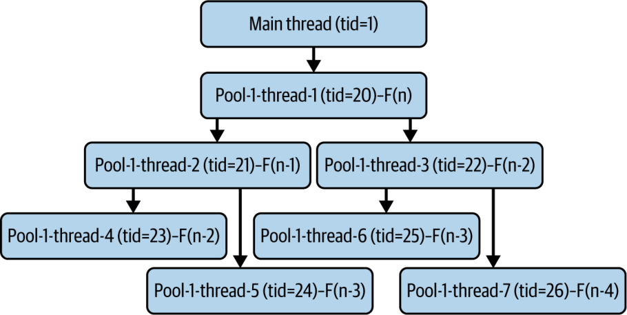
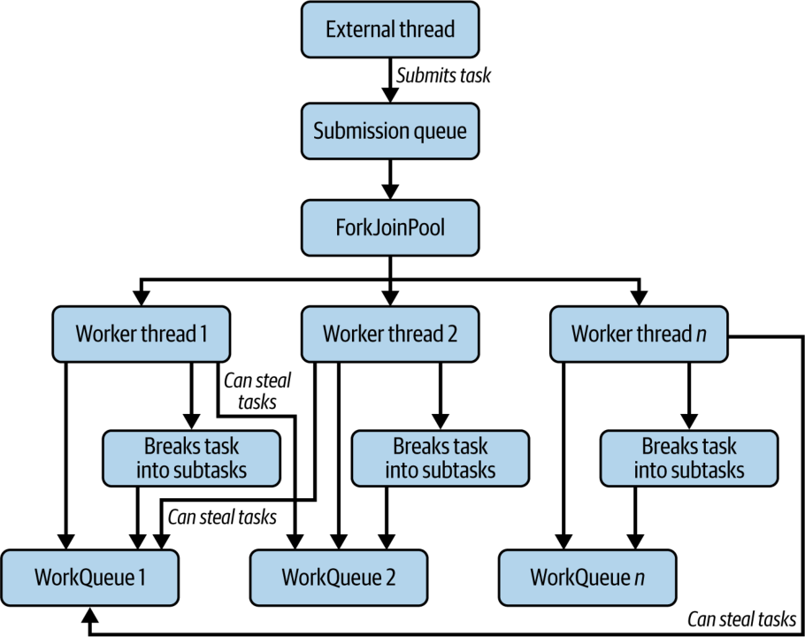
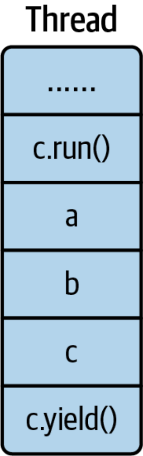
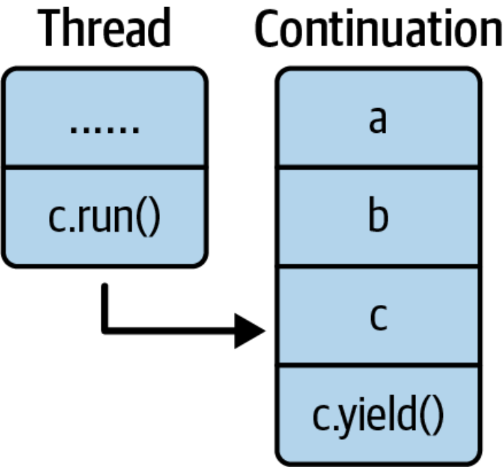
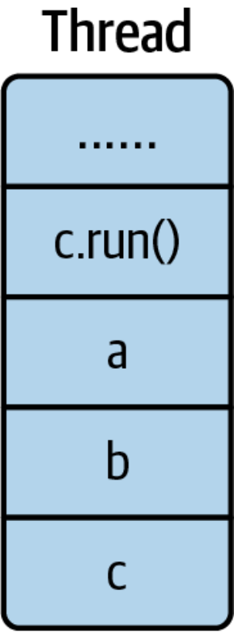
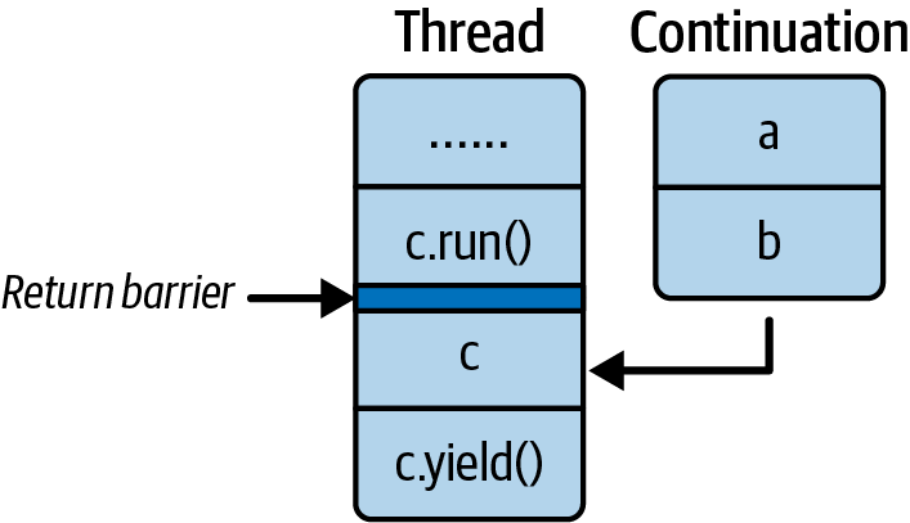
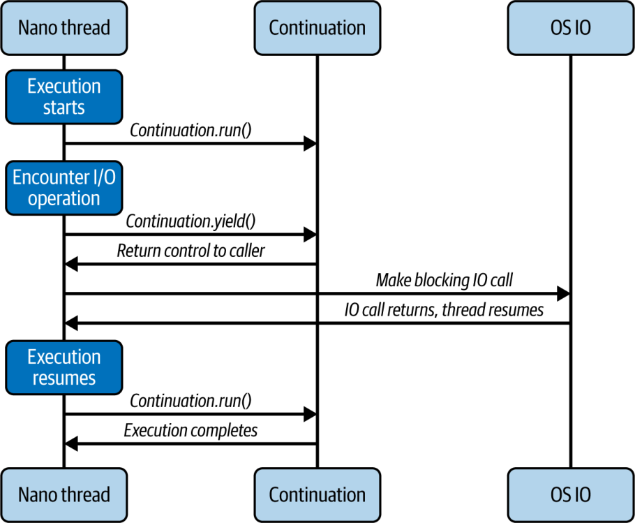

# Chương 3. Cơ chế hoạt động của Concurrency hiện đại trong Java

*Tri thức về bất kỳ điều gì, bởi vạn vật đều có nguyên nhân, sẽ không thể có được hay trọn vẹn nếu ta không hiểu nó thông qua các nguyên nhân của nó.*

—Ibn Sina (Avicenna), khoảng năm 1025 sau Công nguyên

Biết cách sử dụng một thứ gì đó là quan trọng, nhưng hiểu được cách nó hoạt động mới là điều thiết yếu. Khi hiểu được cơ chế bên trong, chúng ta không những trân trọng nó hơn mà còn có thể nhanh chóng khắc phục mọi vấn đề phát sinh. Đó là lý do việc biết virtual thread (luồng ảo) được triển khai như thế nào và cấu trúc bên trong của chúng ra sao là điều then chốt đối với một lập trình viên Java có nền tảng vững vàng. Trong chương này, chúng ta sẽ khám phá cách virtual thread hoạt động bên trong và được triển khai ra sao.

Chúng ta cần nắm hai khái niệm để hiểu cách virtual thread được triển khai. Một là `ForkJoinPool`, và hai là *continuation*. `ForkJoinPool` là scheduler (bộ lập lịch) đảm nhận việc lập lịch cho các virtual thread. Continuation là khía cạnh cho phép virtual thread tạm dừng việc thực thi rồi sau đó tiếp tục lại đúng chỗ đã dừng. Chúng ta sẽ bắt đầu bằng việc giới thiệu thread pool, rồi dần dần đi sâu vào `ForkJoinPool` và cách nó được triển khai hơi khác đi một chút để phục vụ cho virtual thread.

## Thread Pool

Ở chương đầu tiên, chúng ta đã bàn về Java Executor framework, về bản chất chính là một triển khai của thread pool. Nhưng chúng ta chưa thực sự giải thích thread pool hoạt động như thế nào và quan trọng nhất là vì sao chúng ta cần đến nó.

Đúng như tên gọi, thread pool là một nhóm các thread được tạo ra khi ứng dụng khởi động và tiếp tục chạy trong suốt vòng đời của ứng dụng. Chiến lược tạo thread pool có thể khác nhau tùy từng loại pool, nhưng ý tưởng cốt lõi là pool sẽ có sẵn một số thread và giữ cho chúng luôn chạy. Thread pool sẽ có một queue (hàng đợi) để chứa các tác vụ. Nó sẽ lấy tác vụ từ queue và thực thi ngay khi có thread rảnh. Sau khi thực thi xong, nó sẽ lấy tác vụ tiếp theo và cứ thế tiếp tục thực thi chừng nào trong queue vẫn còn tác vụ. Nếu không còn tác vụ nào, nó sẽ chờ cho đến khi có tác vụ mới. Nếu tất cả các thread đều đang bận thực thi những tác vụ khác nhau, bất kỳ tác vụ bổ sung nào cũng sẽ được đưa vào queue và chờ ở đó cho đến khi có thread rảnh.

### Vì sao chúng ta cần Thread Pool?

Dù việc tạo một thread rất dễ dàng (như chúng ta đã thấy ở [Chương 1](https://learning.oreilly.com/library/view/modern-concurrency-in/9781098165406/ch01.html#introduction)), việc tạo nhiều thread một cách tùy tiện (ad hoc) có thể gây ra vấn đề. Nếu chúng ta cứ tiếp tục tạo thread theo kiểu tùy tiện khi nhu cầu tăng lên, đến một lúc nào đó chúng ta có thể chạm tới số lượng thread tối đa mà hệ điều hành cho phép, khiến ứng dụng bị crash — một kết cục không ai mong muốn. Chúng ta muốn kiểm soát số lượng thread có thể được tạo trong một ứng dụng đang chạy, và thread pool cho chúng ta khả năng kiểm soát đó. Nó cũng mang lại một cách tự nhiên để giới hạn tốc độ (rate limiting) đối với một tài nguyên vốn có thể bị quá tải bởi quá nhiều tác vụ chạy đồng thời. Bằng cách xác định số thread tối ưu cho ứng dụng và thiết lập giới hạn này ngay từ đầu, chúng ta có thể ngăn ngừa tình trạng cạn kiệt tài nguyên, đặc biệt là khi có thể có một lượng lớn tác vụ đồng thời được gửi vào. Ví dụ, hãy xét một ứng dụng web — nếu mỗi request đến đều tạo ra một thread mới, thì một đợt bùng nổ request bất ngờ có thể làm ứng dụng crash.

Ngoài việc mang lại khả năng kiểm soát, thread pool còn cho phép các tác vụ được thực thi ngay lập tức mà không phải chờ tạo thread mới, dẫn đến thời gian phản hồi nhanh hơn. Thread pool quản lý vòng đời của các thread. Điều này giảm thiểu sự phức tạp của việc xử lý thread thủ công và giảm nguy cơ xảy ra các lỗi như thread leak (rò rỉ thread). Hơn nữa, nó mang lại cho chúng ta cách nhìn nhận tác vụ như những đơn vị công việc và chuyển trọng tâm của chúng ta sang logic nghiệp vụ mà chúng ta muốn thực thi đồng thời, thay vì phải loay hoay với những chi tiết vụn vặt của thread.

Giờ đây, khi đã biết thread pool là gì và vì sao nó thiết yếu, hãy cùng tự triển khai một thread pool đơn giản từ đầu để hiểu nó hoạt động bên trong như thế nào.

### Xây dựng một Thread Pool đơn giản trong Java

Lớp `SimpleThreadPool` của chúng ta sẽ minh họa những khái niệm cốt lõi của một thread pool. Hãy cùng phân tích phần triển khai của nó:

```java
class Worker extends Thread {
   public Worker(ThreadGroup threadGroup, String name) {
       super(threadGroup, name);
   }
   @Override
   public void run() {
       while (running) {
           try {
               Runnable task = queue.take();
               task.run();
           } catch (InterruptedException e) {
               Thread.currentThread().interrupt();
           }
       }
   }
}
```

Lớp `Worker` này là một inner class (lớp bên trong) của lớp `SimpleThreadPool`, nên nó có quyền truy cập trực tiếp vào `Queue` mà chúng ta sẽ dùng để chứa các tác vụ dưới dạng `Runnable`. Mỗi lớp `Worker` là một thread độc lập, liên tục lấy tác vụ từ queue dùng chung và thực thi chúng. Cờ `running` điều khiển vòng đời của worker. Cờ này là một trường (field) của pool, nhờ đó chúng ta có thể tắt pool một cách êm thấm (gracefully) khi muốn. Ý tưởng là chừng nào trong queue còn tác vụ và pool vẫn đang chạy, thread này sẽ tiếp tục cố gắng lấy tác vụ từ queue. Chúng ta sẽ dùng một blocking queue, nên nếu không có tác vụ nào, thread sẽ chờ cho đến khi nhận được một tác vụ.

Tất cả các thread `Worker` được gom lại dưới một [`ThreadGroup`](https://oreil.ly/jHIrv), giúp chúng ta quản lý dễ dàng hơn. Nếu muốn tắt tất cả các thread bằng cách phát tín hiệu interrupt, chúng ta chỉ cần interrupt cả nhóm; không cần phải interrupt từng thread một, dù rằng ở bên dưới, điều đó thực sự vẫn diễn ra.

Bây giờ, hãy xem phần triển khai của `SimpleThreadPool`:

```java
import java.util.concurrent.BlockingQueue;
import java.util.concurrent.LinkedBlockingDeque;

public class SimpleThreadPool implements AutoCloseable {

    private final BlockingQueue<Runnable> queue;
    private final ThreadGroup threadGroup;
    private volatile boolean running = true;  ①

    public SimpleThreadPool(int poolSize, int queueSize) {
        Worker[] threads = new Worker[poolSize];
        this.queue = new LinkedBlockingDeque<>(queueSize);  ②
        this.threadGroup = new ThreadGroup("SimpleThreadPool");

        for (int i = 0; i < poolSize; i++) {
            threads[i] = new Worker(threadGroup, "Worker-" + i);
            threads[i].start();  ③
        }
    }

    public void submit(Runnable task) {
        try {
            queue.put(task);  ④
        } catch (InterruptedException e) {
            Thread.currentThread().interrupt();
        }
    }

    public void shutdown() {
        this.running = false;
        threadGroup.interrupt();  ⑤
    }

    @Override
    public void close() {
        while (!queue.isEmpty()) {  ⑥
            try {
                Thread.sleep(100);
            } catch (InterruptedException e) {
                Thread.currentThread().interrupt();
                return; // exit gracefully
            }
        }
        shutdown();
    }

    class Worker extends Thread {
        public Worker(ThreadGroup threadGroup, String name) {
            super(threadGroup, name);
        }

        @Override
        public void run() {
            while (running) {
                try {
                    Runnable task = queue.take();
                    task.run();
                } catch (InterruptedException e) {
                    // pool doesn’t use interrupts for shutdown;
                    // if ever interrupted, just exit
                    Thread.currentThread().interrupt();
                }
            }
        }
    }
}
```

Phần triển khai này cho thấy một số quyết định thiết kế quan trọng:

① Từ khóa `volatile` đảm bảo mọi thread đều thấy được thay đổi của cờ `running` ngay lập tức, tránh việc các worker bỏ lỡ tín hiệu shutdown.

② `LinkedBlockingDeque` cung cấp các thao tác thread-safe cho việc gửi và lấy tác vụ. Dung lượng có giới hạn của nó ngăn ngừa tình trạng cạn kiệt bộ nhớ do tác vụ tích tụ không giới hạn.

③ Các worker khởi động ngay khi được tạo, sẵn sàng xử lý tác vụ ngay khi chúng được gửi vào.

④ Phương thức `put()` sẽ block nếu queue đầy, tạo ra backpressure một cách tự nhiên khi pool bị quá tải.

⑤ Việc interrupt thread group phát tín hiệu tới tất cả các worker cùng lúc, kích hoạt quá trình shutdown có phối hợp.

⑥ Quá trình shutdown êm thấm chờ cho các tác vụ đang chờ hoàn tất, đảm bảo không có công việc nào bị mất khi đóng pool.

Lớp này có hai phương thức chính: `submit()` và `shutdown()`. Nó cũng hiện thực interface `AutoCloseable` để chúng ta có thể dùng mẫu `try`-with-resources, và đó là lý do chúng ta có thêm một phương thức close. Constructor của nó khởi tạo thread pool với một số lượng worker thread xác định ( `poolSize`) và một queue có kích thước cho trước ( `queueSize`). Nó tạo và khởi động các worker thread. Chúng ta đã dùng [`LinkedBlockingDeque`](https://oreil.ly/Xcv3-) để lưu các tác vụ. Nó cung cấp các thao tác thread-safe cho việc thêm và lấy tác vụ, đảm bảo các worker có thể truy cập queue đồng thời mà không gặp vấn đề gì.

Thông qua phương thức `submit()`, một tác vụ được thêm vào queue để một thread trong pool thực thi. Phương thức `shutdown()` đặt cờ running thành false và interrupt tất cả các thread trong pool, ra hiệu cho chúng dừng lại. Trong phương thức `close()`, chúng ta tắt thread pool một cách êm thấm. Nó chờ một lát cho queue trống trước khi bắt đầu shutdown. Nhờ vậy, chúng ta có thể đảm bảo tất cả các tác vụ đang chờ đều được xử lý.

Giờ đây, khi đã xây dựng xong `SimpleThreadPool`, hãy xem nó hoạt động thực tế. Dưới đây là một ví dụ về cách bạn có thể sử dụng nó:

```java
package ca.bazlur.modern.concurrency.c03;

public class SimpleThreadPoolDemo {

  public static void main(String[] args) throws InterruptedException {
    try (var threadPool = new SimpleThreadPool(4, 100)) {
      for (int i = 0; i < 100; i++) {
        int finalI = i;
        threadPool.submit(() -> runTask(finalI));
      }
    }

    Thread.sleep(10_000);
    System.out.println("Main thread finished");
  }

  private static void runTask(int id) {
    System.out.printf("Task %d on %s%n", id,
        Thread.currentThread().getName());
    try {
      Thread.sleep(100);// simulate work being done
    } catch (InterruptedException e) {
      Thread.currentThread().interrupt();
    }
  }
}
```

Trong ví dụ này, chúng ta tạo một `SimpleThreadPool` với bốn worker thread và một queue có dung lượng một trăm. Chúng ta gửi một trăm tác vụ vào pool, và mỗi tác vụ chỉ đơn giản in ra ID của nó cùng tên của thread đang thực thi nó. Khối `try`-with-resources đảm bảo phương thức `close()` của `SimpleThreadPool` được gọi khi luồng thực thi thoát khỏi khối, cho phép shutdown một cách êm thấm.

Khi chạy đoạn mã này, bạn sẽ thấy kết quả đại loại như sau:

```text
Task 1 is being executed by Worker-2
Task 0 is being executed by Worker-0
Task 2 is being executed by Worker-3
Task 3 is being executed by Worker-1
```

Điều này cho thấy `SimpleThreadPool` quản lý hiệu quả việc thực thi nhiều tác vụ bằng một số lượng thread hạn chế. Chúng ta có thể thử nghiệm với các kích thước pool và dung lượng queue khác nhau để quan sát tác động của chúng lên hiệu năng và mức sử dụng tài nguyên.

Tuy nhiên, ví dụ này đã được đơn giản hóa rất nhiều để chúng ta nắm được khái niệm cơ bản. Trong ứng dụng thực tế, chúng ta thường dùng `ExecutorService`, vì nó cung cấp một triển khai thread pool mạnh mẽ và giàu tính năng hơn. Ví dụ, một số thread pool có số lượng thread tối thiểu và tối đa, nghĩa là tại bất kỳ thời điểm nào, chỉ có một số lượng thread tối thiểu tồn tại, nhưng khi cần, thread pool có thể tăng lên tới số lượng tối đa.

### Executor Framework

Executor framework được thiết kế để tối đa hóa hiệu năng trong khi vẫn dễ sử dụng. Nó cung cấp nhiều triển khai khác nhau cùng tuân theo một interface chung, [`ExecutorService`](https://oreil.ly/JQWme). Để lấy các instance của những triển khai thread pool khác nhau, chúng ta dùng một lớp factory tên là [`Executors`,](https://oreil.ly/lDFVL) lớp này cung cấp nhiều phương thức factory được thiết kế riêng cho các loại thread pool khác nhau.

Ví dụ, nếu muốn một thread pool kích thước cố định với 10 thread, chúng ta có thể dùng đoạn mã sau:

```java
ExecutorService service = Executors.newFixedThreadPool(10);
```

Ở bên dưới, phương thức [`newFixedThreadPool`](https://oreil.ly/dttrO) tạo ra một instance của [`ThreadPoolExecutor`](https://oreil.ly/tRWwo), sử dụng số lượng thread mà chúng ta cung cấp cùng với một vài đối số bổ sung. Thực tế, hầu hết các phương thức khác trong lớp `Executors` cũng dùng `ThreadPoolExecutor`, cấu hình nó theo những cách khác nhau dựa trên các đối số để đạt được các hành vi khác nhau.

Để đi sâu hơn một chút, hãy xem xét constructor của `ThreadPoolExecutor`:

```java
public ThreadPoolExecutor(int corePoolSize,
                         int maximumPoolSize,
                         long keepAliveTime,
                         TimeUnit unit,
                         BlockingQueue<Runnable> workQueue,
                         ThreadFactory threadFactory,
                         RejectedExecutionHandler handler) {}
```

Tiếp theo, hãy xem các tham số mà nó nhận:

```text
corePoolSize
```

Số lượng thread được giữ lại trong pool, ngay cả khi chúng đang rảnh, trừ khi [`allowCoreThreadTimeOut`](https://oreil.ly/cnxif) được thiết lập.

```text
maximumPoolSize
```

Số lượng thread tối đa được phép có trong pool.

```text
keepAliveTime
```

Khi số lượng thread lớn hơn số core, đây là khoảng thời gian tối đa mà các thread dư thừa đang rảnh sẽ chờ tác vụ mới trước khi kết thúc.

```text
unit
```

Đơn vị thời gian cho đối số `keepAliveTime`, ví dụ: nano giây, mili giây, giây, v.v.

```text
workQueue
```

Queue dùng để chứa các tác vụ trước khi chúng được thực thi. Queue này sẽ chỉ chứa các tác vụ `Runnable` được gửi vào bằng phương thức `execute`.

```text
threadFactory
```

Factory được dùng khi executor tạo một thread mới.

```text
handler
```

Handler được dùng khi việc thực thi bị chặn do đã chạm tới giới hạn số thread và dung lượng queue.

Hiểu các tham số này giúp chúng ta thấy được cách các cấu hình thread pool khác nhau được tạo ra thông qua các phương thức factory trong lớp `Executors`. Chẳng hạn, `newFixedThreadPool()` đặt cả `corePoolSize` và `maximumPoolSize` về cùng một giá trị, tạo ra một pool với số lượng thread cố định luôn tồn tại trừ khi bị shutdown một cách tường minh.

Các framework thường dùng lớp này để quản lý việc thực thi tác vụ một cách hiệu quả. Chẳng hạn, Spring Framework bọc `ThreadPool` trong một [`ThreadPoolTaskExecutor`](https://oreil.ly/Btpa_) để xử lý các thao tác bất đồng bộ một cách liền mạch. Thiết lập kích thước pool phù hợp là điều then chốt để đạt được hiệu năng tối ưu.

Khi cấu hình một thread pool, có hai kích thước quan trọng cần cân nhắc: core pool size và maximum pool size. *Core pool size* là số lượng thread tối thiểu luôn được giữ sống trong pool, ngay cả khi rảnh. Duy trì một tập thread cốt lõi là điều thiết yếu; như chúng ta đã biết, việc tạo thread mới rất tốn kém. Bằng cách giữ những thread này luôn sẵn sàng, hệ thống có thể nhanh chóng giao tác vụ mà không phải gánh chi phí tạo thread. Những thread này ở trạng thái chờ khi không có tác vụ nào để thực thi, và sẵn sàng xử lý các tác vụ mới ngay khi chúng đến.

Tuy nhiên, có quá nhiều thread rảnh có thể lãng phí tài nguyên một cách không cần thiết, chẳng hạn như chu kỳ CPU và bộ nhớ. Đó là lý do việc thiết lập số lượng thread tối thiểu phù hợp là rất quan trọng. *Maximum pool size* xác định giới hạn trên cho số lượng thread có thể hoạt động trong pool tại bất kỳ thời điểm nào. Điều này cho phép thread pool thích ứng với nhu cầu tăng cao bằng cách mở rộng khi có nhiều tác vụ hơn được gửi vào.

Xác định core pool size và maximum pool size tối ưu là điều sống còn đối với việc tinh chỉnh hiệu năng. Các giá trị này có thể khác nhau đáng kể tùy thuộc vào khối lượng công việc và phần cứng mà ứng dụng đang chạy trên đó. Đáng tiếc là không có câu trả lời chung cho mọi trường hợp. Các lập trình viên thường phải thử nghiệm và theo dõi các chỉ số hiệu năng để tìm ra sự cân bằng phù hợp, điều chỉnh kích thước thread pool dựa trên kết quả thực nghiệm. Ý tưởng chung là nếu khối lượng công việc thuộc dạng CPU-bound (ví dụ, tính toán số học nặng), số lượng thread nên khớp với số core CPU khả dụng. Thêm nhiều thread hơn có thể làm giảm hiệu năng vì nó làm tăng chi phí context switch và đồng bộ hóa. Tuy nhiên, nếu khối lượng công việc thuộc dạng I/O-bound (ví dụ, các lời gọi cơ sở dữ liệu), có nhiều thread hơn số CPU có thể mang lại lợi ích, vì các thread rảnh đang chờ I/O có thể nhường chỗ cho các tác vụ khác được thực thi.

Các virtual thread mà chúng ta đã bàn ở chương trước mang đến một cách để loại bỏ những phức tạp liên quan đến việc quản lý thread pool cho khối lượng công việc I/O-bound. Tuy nhiên, dù virtual thread đem lại lợi thế đáng kể, các trường hợp sử dụng của thread pool hiện có sẽ không biến mất hoàn toàn. Các hệ thống cũ (legacy), những cân nhắc về tính tương thích, và các yêu cầu hiệu năng đặc thù vẫn có thể đòi hỏi thread pool truyền thống. Ví dụ, một nghiên cứu gần đây thực hiện với OpenLiberty[^1] cho thấy triển khai `ThreadPool` của riêng họ hoạt động tốt hơn virtual thread. Đó là lý do việc hiểu cách cấu hình và sử dụng hiệu quả các thread pool hiện có là vô cùng quan trọng.

Hãy cùng điểm qua các loại thread pool có sẵn trong JDK thuộc Executor framework.

#### FixedThreadPool

[`FixedThreadPool`](https://oreil.ly/4NKEP) tạo ra một pool với số lượng thread cố định. Nếu tất cả các thread đều bận, các tác vụ mới sẽ chờ trong queue cho đến khi có thread rảnh. Cách tiếp cận này giúp duy trì một số lượng thread hoạt động ổn định, rất hữu ích khi bạn có khối lượng công việc có thể dự đoán được.

Hãy xem một ví dụ:

```java
try (ExecutorService fixedPool = Executors.newFixedThreadPool(4)) {
  for (int i = 0; i < 10; i++) {
    fixedPool.submit(() -> {
      System.out.println(Thread.currentThread().getName()
          + " is executing a task");
    });
  }
}
```

*Khi nào nên dùng:*

Loại này phù hợp nhất với các ứng dụng cần một số lượng thread không đổi làm việc đồng thời, chẳng hạn như các ứng dụng máy chủ nơi bạn cần duy trì một mức concurrency có thể dự đoán được. Chẳng hạn, nếu bạn có số lượng tài nguyên hoặc kết nối cơ sở dữ liệu hạn chế, một fixed pool có thể giúp đảm bảo bạn không làm hệ thống của mình quá tải.

#### CachedThreadPool

[`CachedThreadPool`](https://oreil.ly/MUcqT) tự động tạo thread mới khi cần và tái sử dụng các thread đã tạo trước đó nếu chúng đang rảnh. Điều này rất có lợi khi khối lượng công việc biến động về quy mô, vì nó cho phép thread pool tự điều chỉnh linh hoạt theo nhu cầu:

```java
try (ExecutorService cachedPool = Executors.newCachedThreadPool()) {
   for (int i = 0; i < 10; i++) {
       cachedPool.submit(() -> {
           System.out.println(Thread.currentThread().getName()
               + " is executing a task");
       });
   }
}
```

*Khi nào nên dùng:*

Loại này lý tưởng khi bạn có một số lượng lớn các tác vụ ngắn hạn, hoặc khi các tác vụ đến theo từng đợt không thể dự đoán. Nó không phù hợp với những tình huống mà tác vụ chạy trong thời gian dài, vì có thể dẫn đến việc tạo ra quá nhiều thread hoạt động cùng lúc.

#### SingleThreadExecutor

[`SingleThreadExecutor`](https://oreil.ly/xdp-9) đảm bảo các tác vụ được thực thi tuần tự bằng một thread duy nhất. Nó giống như có một worker duy nhất xử lý các tác vụ theo đúng thứ tự nhận được:

```java
try (var singleThreadPool = Executors.newSingleThreadExecutor()) {
  for (int i = 0; i < 5; i++) {
    singleThreadPool.submit(() -> {
      System.out.println(Thread.currentThread().getName()
          + " is executing a task");
    });
  }
}
```

*Khi nào nên dùng:*

Hãy dùng executor này khi bạn cần các tác vụ chạy theo trình tự nghiêm ngặt hoặc khi chúng không được phép chạy đồng thời. Nó thường được dùng khi bạn làm việc với một tài nguyên dùng chung mà tại mỗi thời điểm chỉ một tác vụ được phép truy cập, đảm bảo không xảy ra race condition.

#### ScheduledThreadPoolExecutor

[`ScheduledThreadPoolExecutor`](https://oreil.ly/Utb7K) lập lịch cho các tác vụ chạy sau một khoảng trễ hoặc theo những khoảng thời gian cố định:

```java
try (ScheduledExecutorService scheduledPool
                 = Executors.newScheduledThreadPool(2)) {
            scheduledPool.scheduleAtFixedRate(() -> {
                System.out.println(Thread.currentThread().getName()
                    + " is running a scheduled task");
            }, 0, 5, TimeUnit.SECONDS);
        }
```

*Khi nào nên dùng:*

Nó lý tưởng cho các tác vụ định kỳ như gửi thông báo, kiểm tra tình trạng hệ thống, hoặc chạy các tác vụ bảo trì theo những khoảng thời gian đều đặn. Nó đảm bảo các tác vụ được thực thi với tần suất mong muốn mà không cần can thiệp thủ công.

#### WorkStealingPool

`WorkStealingPool` tạo ra một pool các thread tự động cân bằng khối lượng công việc giữa các thread bằng thuật toán work-stealing. Loại pool này tối ưu hóa việc sử dụng các bộ xử lý khả dụng:

```java
try (ExecutorService workStealingPool = Executors.newWorkStealingPool()) {
   for (int i = 0; i < 10; i++) {
       workStealingPool.submit(() -> {
           System.out.println(Thread.currentThread().getName()
               + " is executing a task");
       });
   }
}
```

*Khi nào nên dùng:*

Khi bạn có số lượng lớn các tác vụ nhỏ, độc lập và muốn tối đa hóa mức sử dụng các core CPU.

Trong Java có một loại thread pool đặc biệt gọi là [`ForkJoinPool`](https://oreil.ly/rsb95). Nó được thiết kế cho các tác vụ kiểu chia để trị (divide-and-conquer), nơi các bài toán lớn có thể được chia thành những tác vụ nhỏ hơn, độc lập và có thể xử lý song song. Thực tế, `ForkJoinPool` này sử dụng thuật toán work-stealing ở bên dưới. Chúng ta sẽ tìm hiểu chi tiết về `ForkJoinPool` ở phần sau của chương này.

### Callable và Future: Xử lý kết quả của tác vụ

Cho đến giờ, chúng ta vẫn gửi tác vụ bằng [`Runnable`](https://oreil.ly/XI_fh), nhưng không có kết quả nào được trả về. Song đôi khi, chúng ta cần lấy kết quả sau khi một tác vụ hoàn thành. Đây chính là lúc [`Callable`](https://oreil.ly/TvnqA) và [`Future`](https://oreil.ly/y6fnZ) phát huy tác dụng.

#### Callable

Interface này trông như sau:

```java
public interface Callable {
   V call() throws Exception;
}
```

Nó cũng là một functional interface giống như `Runnable`; điểm khác biệt duy nhất là nó có thể trả về kết quả và ném ra ngoại lệ.

Hãy xem một ví dụ:

```java
import java.util.Map;
import java.util.concurrent.*;

public class CallableExample {
  static final Map<Integer, Long> cache = new ConcurrentHashMap<>(
      Map.of(0, 0L, 1, 1L)  ①
  );
  public static void main(String[] args) throws Exception {
    try (ExecutorService threadPool = Executors.newCachedThreadPool()) {
      Future<Long> fibonacciNumber = threadPool.submit(new Callable<Long>(
        @Override
        public Long call() throws Exception {
          return fibonacci(50);  ②
        }
      });
    }
  }

  private static Long fibonacci(int n) {
    if (cache.containsKey(n)) {
      return cache.get(n);
    } else {
      long result = fibonacci(n - 1) + fibonacci(n - 2);
      cache.put(n, result);  ③
      return result;
    }
  }
}
```

Hãy xem xét các thành phần chính:

① Chúng ta dùng một `ConcurrentHashMap` để cache các kết quả Fibonacci, giúp triển khai đệ quy của chúng ta hiệu quả và thread-safe khi được truy cập đồng thời.

② Phương thức `submit` nhận một `Callable<Long>` và trả về một `Future<Long>`. `Future` này đại diện cho kết quả cuối cùng của phép tính bất đồng bộ.

③ Không giống `Runnable.run()`, phương thức `call()` trả về một giá trị, trong trường hợp này là số Fibonacci thứ 50.

④ `cache` đảm bảo chúng ta không tính lại các giá trị, điều rất quan trọng đối với các thuật toán đệ quy nơi cùng một giá trị được tính nhiều lần.

Trong đoạn mã trên, chúng ta đã gửi một công việc để tính số Fibonacci thứ 50. Chúng ta đã dùng interface `Callable` để gửi công việc. Vì đây là một functional interface, chúng ta cũng có thể dùng một biểu thức lambda:

```java
Future fibonacciNumber = threadPool.submit(() -> fibonacci(50));
```

Nhưng hãy để ý, nó trả về kết quả được bọc trong một interface khác, `Future`. Hãy cùng tìm hiểu tại sao.

#### Future

`Future` có một số phương thức:

```java
public interface Future<V> {
   boolean cancel(boolean mayInterruptIfRunning);
   boolean isCancelled();
   boolean isDone();
   V get() throws InterruptedException, ExecutionException;
   V get(long timeout, TimeUnit unit)
       throws InterruptedException, ExecutionException, TimeoutException;
}
```

Tuy nhiên, trong hầu hết các trường hợp sử dụng, chúng ta thường chỉ dùng các phương thức `get()` và `isDone()`.

Khi bạn gửi một tác vụ bằng `Callable`, một `Future` được trả về ngay lập tức, ngay cả khi tác vụ chưa hoàn thành. Phương thức `isDone()` kiểm tra xem tác vụ đã hoàn tất chưa, còn phương thức `get()` lấy về kết quả.

> **LƯU Ý**
>
> Phương thức `get()` là một thao tác blocking. Nó sẽ block thread gọi nó cho đến khi kết quả sẵn sàng.
>
Hãy xét một ví dụ trong đó chúng ta muốn tính nhiều số Fibonacci:

```java
public static void main(String[] args) {
   List<Future<Long>> futures = new ArrayList<>();
   List<Integer> fibonacciIndices = List.of(10, 20, 30, 40, 50);

   try (ExecutorService threadPool = Executors.newCachedThreadPool()) {
       for (int index : fibonacciIndices) {
           futures.add(threadPool.submit(() -> fibonacci(index)));
       }
       for (Future<Long> future : futures) {
           System.out.println("Fibonacci number: " + future.get());
       }
   } catch (ExecutionException | InterruptedException e) {
       throw new RuntimeException(e);
   }
}
```

Trong ví dụ này, nhiều tác vụ `Callable` được gửi vào và thực thi song song. Tuy nhiên, khi chúng ta gọi `future.get()` bên trong vòng lặp, main thread sẽ block cho đến khi tác vụ cụ thể đó hoàn thành. Lợi thế ở đây là các thread khác vẫn tiếp tục công việc của mình trong khi main thread bị block.

## ForkJoinPool

Kể từ Java 7, chúng ta đã có một thread pool đặc biệt, `ForkJoinPool`, bên cạnh `ThreadPoolExecutor` thông thường. Dù trông giống như bất kỳ pool nào khác, nó có một mục đích đặc biệt. Mặc dù `ForkJoinPool` hiện thực interface `ExecutorService`, nó khác biệt đáng kể so với `ThreadPoolExecutor` truyền thống về thiết kế cốt lõi và nguyên tắc vận hành. Nó sử dụng cơ chế work-stealing, trong đó mỗi thread có queue tác vụ riêng của mình. Các thread rảnh có thể "đánh cắp" (steal) tác vụ từ phần đuôi deque của các thread khác. Chúng ta sẽ bàn về thuật toán work-stealing ngay sau đây. Trong khi đó, pool truyền thống làm việc với một queue dùng chung nơi các tác vụ được giao cho các thread rảnh, điều này có thể dẫn đến tranh chấp (contention) và chi phí phụ trội khi các thread cạnh tranh nhau để giành tác vụ.

Thread pool truyền thống thường duy trì một số lượng thread cố định hoặc có giới hạn, và việc tạo cũng như kết thúc thread ít linh hoạt hơn. Ngược lại, `ForkJoinPool` có thể điều chỉnh thích ứng số lượng thread hoạt động dựa trên khối lượng công việc và mức sẵn có của bộ xử lý. Nó cũng có thể tự động thêm, tạm dừng hoặc tiếp tục các thread để duy trì hiệu quả.

Thread pool truyền thống thường dựa vào các cơ chế đồng bộ hóa tường minh như lock và condition variable để quản lý việc truy cập tác vụ và đồng bộ hóa thread. Ngược lại, `ForkJoinPool` giảm thiểu nhu cầu đồng bộ hóa tường minh nhờ thuật toán work-stealing. Điều này cho phép các thread hoạt động tự chủ hơn, giúp giảm tranh chấp và chi phí phụ trội, từ đó mang lại cho chúng ta hiệu năng tuyệt vời.

Thread pool truyền thống không nhận biết được rằng một số tác vụ có thể phụ thuộc vào các tác vụ khác. Vì vậy, nếu một subtask bắt đầu thực thi trên một thread rồi phải chờ một tác vụ khác, thread đang chạy sẽ không thể tiến triển cho đến khi tác vụ con được một thread khác hoàn thành. Đây là một vấn đề. Ngược lại, `ForkJoinPool` được thiết kế sao cho các tác vụ có thể được phân rã đệ quy thành các subtask nhỏ hơn, tạo thành một cấu trúc dạng cây. Nếu một tác vụ phụ thuộc vào các tác vụ con của nó, nó có thể tạm dừng việc thực thi của chính mình và thực thi các tác vụ đang chờ khác trong lúc đợi. Hãy xem một ví dụ.

Hãy tưởng tượng chúng ta cần viết một chương trình tính số Fibonacci thứ 20. Để phục vụ cho phần minh họa, chúng ta sẽ cần làm nó đa luồng, với giả định là chúng ta sẽ có kết quả nhanh hơn. Chúng ta sẽ bắt đầu với một số lượng thread cố định, chẳng hạn 100:

```java
import java.util.Map;
import java.util.concurrent.*;

public class FibonacciNumberWithTraditionalThreadPool {
  private static final Map<Integer, Long> cache = new ConcurrentHashMap<>(
      Map.of(0, 0L, 1, 1L)
  );
  private static long getFibonacci(int i, ExecutorService pool) {
    if (cache.containsKey(i)) {
      return cache.get(i);
    }
    Future<Long> future1 = pool.submit(() -> getFibonacci(i - 1, pool));
    Future<Long> future2 = pool.submit(() -> getFibonacci(i - 2, pool));
    try {
      long l1 = future1.get();  ①
      long l2 = future2.get();
      long result = l1 + l2;
      cache.put(i, result);
      return result;
    } catch (InterruptedException | ExecutionException e) {
      throw new RuntimeException(e);
    }
  }

  public static void main(String[] args) {
    try (var pool = Executors.newFixedThreadPool(100)) {  ②
      Future<Long> future = pool.submit(() -> getFibonacci(20, pool));
      Long l = future.get();
      System.out.println("Fibonacci number is: " + l);
    } catch (ExecutionException | InterruptedException e) {
      throw new RuntimeException(e);
    }
  }
}
```

Hãy xem xét những gì chúng ta đã làm ở đây:

① Mỗi tác vụ gửi vào hai subtask để tính Fibonacci (*n* – 1).

② Và Fibonacci (*n* – 2), tạo thành một cây nhị phân các tác vụ.

③ Tác vụ cha block để chờ các tác vụ con của nó hoàn thành, giữ một thread làm "con tin".

④ Dù có 100 thread, pool nhanh chóng cạn kiệt vì mỗi thread đều phải chờ các subtask của nó.

Đoạn mã Java trên tính số Fibonacci thứ 20 bằng một thread pool và dùng cache để tăng hiệu quả. Nó sử dụng một hàm đệ quy `getFibonacci()` chia nhỏ bài toán thành các bài toán con, gửi từng bài toán con vào thread pool. [`ConcurrentHashMap`](https://oreil.ly/v5zUs) đóng vai trò cache để lưu các kết quả đã tính trước đó, tránh tính toán dư thừa.

Tuy nhiên, nếu chạy đoạn mã này, chúng ta sẽ sớm nhận ra rằng nó không cho ra kết quả nào; thay vào đó, nó tạo ra deadlock. Ở đây chúng ta bị giới hạn ở 100 thread. Khi chúng ta gọi phương thức `getFibonacci()`, nó tạo ra hai tác vụ con và gửi chúng vào pool; về cơ bản, thread đang chạy tác vụ cha cứ chờ cho đến khi các tác vụ con hoàn thành công việc. Mỗi tác vụ con lại tiếp tục làm điều tương tự, tạo ra thêm nhiều tác vụ nữa. Trong quá trình đó, pool cạn thread, và tất cả cứ chờ mãi. Vì các tác vụ con nằm trong queue và không được thực thi, các thread còn lại bị kẹt, về bản chất là tạo ra deadlock. Chúng ta có thể giải quyết deadlock bằng cách cung cấp thêm thread, nhưng chúng ta biết rằng thread là có hạn.

Nếu chúng ta tạo một thread dump bằng lệnh sau:

```bash
jcmd 36427 Thread.dump_to_file -format=json threaddump.json
```

Chúng ta sẽ thấy kết quả đại loại như Hình 3-1.



*Hình 3-1. Phép tính Fibonacci trong ForkJoinPool*

Ngược lại, nếu làm điều tương tự với `ForkJoinPool`, chúng ta sẽ không gặp vấn đề tương tự. Vì `ForkJoinPool` được thiết kế đặc biệt cho việc phân rã công việc thành nhiều bài toán con trong khi chờ các tác vụ phụ thuộc, nó có thể tạm dừng các tác vụ của mình và tiếp tục xử lý các tác vụ đang chờ, và cứ thế làm việc mà không gặp trục trặc gì.

Chẳng hạn:

```java
import java.util.Map;
import java.util.concurrent.*;
import java.util.Map;
import java.util.concurrent.*;
public class FibonacciNumberWithForkJoinPool {
  private static final Map<Integer, Long> cache = new ConcurrentHashMap<>(
      Map.of(0, 0L, 1, 1L)
  );

  static class FibonacciTask extends RecursiveTask<Long> {  ①
    private final int n;
    public FibonacciTask(int n) {
      this.n = n;
    }
    @Override
    protected Long compute() {
      if (cache.containsKey(n)) {
        return cache.get(n);
      }
      FibonacciTask f1 = new FibonacciTask(n - 1);
      f1.fork();  ②
      FibonacciTask f2 = new FibonacciTask(n - 2);
      long result = f2.compute() + f1.join();  ③
      cache.put(n, result);
      return result;
    }
  }

  public static void main(String[] args) {
    try (var pool = new ForkJoinPool()) {  ④
      Long result = pool.invoke(new FibonacciTask(20));
      System.out.println("Fibonacci number is: " + result);
    }
  }
}
```

Hãy xem xét cách `ForkJoinPool` tránh được deadlock:

① [`RecursiveTask`](https://oreil.ly/4kYNM) được thiết kế riêng cho việc phân rã theo kiểu Fork/Join, cung cấp khung để chia nhỏ công việc.

② Phương thức [`fork()`](https://oreil.ly/Pcvmt) gửi subtask vào pool một cách bất đồng bộ, đặt nó vào deque của thread hiện tại.

③ Đây là điểm khác biệt then chốt: [`compute()`](https://oreil.ly/8TBFk) thực thi `f2` trực tiếp trên thread hiện tại (tránh tiêu tốn thêm thread), trong khi [`join()`](https://oreil.ly/JkAAe) chờ `f1`. Nếu `f1` chưa hoàn thành, thread có thể đánh cắp công việc khác thay vì block.

④ `ForkJoinPool` sử dụng cấu hình mặc định được tối ưu cho số lượng bộ xử lý khả dụng.

Đoạn mã Java này tính số Fibonacci thứ 20 bằng `ForkJoinPool`, vốn được thiết kế để thực thi song song hiệu quả các tác vụ đệ quy. Chúng ta cũng dùng một `ConcurrentHashMap` để lưu các số Fibonacci đã tính trước đó nhằm tránh tính toán dư thừa. Nó sử dụng lớp `FibonacciTask` kế thừa `RecursiveTask`, cho phép các tác vụ được chia nhỏ và thực thi song song.

Nếu chạy đoạn mã này, chúng ta sẽ nhận được kết quả ngay lập tức.

Giờ đây, khi đã hiểu vì sao `ForkJoinPool` đặc biệt, hãy cùng bàn về lý do nó được dùng để triển khai virtual thread.

> **LƯU Ý**
>
> Trong Java, tranh chấp (contention) nảy sinh khi các thread cần quyền truy cập độc quyền vào các tài nguyên dùng chung như đối tượng, biến, hay I/O stream. Thông thường, những tài nguyên đó được bảo vệ bằng synchronization, lock, v.v. Các cơ chế đồng bộ hóa này đảm bảo tính đúng đắn của chương trình, nhưng hiệu năng của ứng dụng có thể suy giảm nếu có quá nhiều tranh chấp. Ví dụ, nếu các thread dành nhiều thời gian hơn để chờ giành lock, điều đó dẫn đến thời gian thực thi dài hơn. Vì vậy, nếu chúng ta có thể thiết kế chương trình với ít tranh chấp hơn, hiệu năng nhiều khả năng sẽ tăng lên. Thực tế, `ForkJoinPool` được thiết kế để có mức tranh chấp thấp, đó là lý do nó mang lại hiệu năng tuyệt vời.
>

### Tại sao lại dùng ForkJoinPool cho Virtual Thread?

Giống như thread pool thông thường, `ForkJoinPool` cũng bao gồm một số lượng worker thread được định trước. Nếu chúng ta không chỉ định mức parallelism (về cơ bản là số lượng thread) trong tham số của constructor, nó sẽ khởi động với số lượng bộ xử lý khả dụng trên hệ thống mà nó chạy.

`ForkJoinPool` có thể được dùng cho cả khối lượng công việc CPU-bound lẫn I/O-bound; tuy nhiên, điều thiết yếu cần hiểu là việc có nhiều thread hơn số bộ xử lý khả dụng không đem lại lợi ích gì cho công việc nặng về CPU. Trong công việc nặng về CPU, mỗi thread đều cạnh tranh giành thời gian CPU, và vì chúng ta chỉ có một số lượng lõi cố định, việc có nhiều thread hơn số lõi khả dụng đồng nghĩa với chi phí context switch nhiều hơn. Chỉ một số lượng thread bằng với số lõi CPU khả dụng mới có thể chạy đồng thời, nên các thread dư thừa chỉ chờ đợi mà chẳng mang lại lợi ích nào. Ngược lại, công việc nặng về I/O lại hưởng lợi từ việc có nhiều thread hơn, vì một số thread sẽ bị block trong khi những thread khác vẫn có thể tiếp tục làm việc. Ở chương trước, chúng ta đã thảo luận về cách virtual thread mang lại lợi ích cho khối lượng công việc nặng về I/O. Chúng ta sẽ đi vào mối liên hệ giữa `ForkJoinPool` và virtual thread, nhưng trước hết, hãy khám phá xem điều gì đang diễn ra bên dưới bề mặt của pool này.

Mỗi worker thread duy trì một deque (double-ended queue, hàng đợi hai đầu) chứa tác vụ của riêng nó, gọi là `WorkQueue`. Các tác vụ thường được worker thread đẩy vào (push) và lấy ra (pop) từ cùng một đầu (theo thứ tự LIFO [last-in, first-out: vào sau, ra trước]). Một thread khác có thể đánh cắp một tác vụ từ đầu còn lại (theo thứ tự FIFO [first-in, first-out: vào trước, ra trước]). Khi một worker thread chia nhỏ tác vụ như một phần của thuật toán chia để trị (divide-and-conquer), nó đặt các subtask vừa được tạo ra trực tiếp vào work queue của chính nó (Hình 3-2).



*Hình 3-2. Luồng tác vụ của ForkJoinPool—các thread bên ngoài gửi tác vụ vào, chúng được phân phối tới các worker thread; mỗi worker thread quản lý hàng đợi riêng của mình và có thể đánh cắp tác vụ của nhau*

Các thread bên ngoài (không thuộc nhóm worker thread) gửi tác vụ vào, và các tác vụ này đi vào hệ thống thông qua các hàng đợi gửi (submission queue). Những hàng đợi này tương tự như `WorkQueues` nhưng được chính `ForkJoinPool` quản lý. Các cơ chế đồng bộ hóa như lock không được sử dụng một cách tường minh; thay vào đó, các thao tác atomic như compare-and-swap (CAS) được dùng để quản lý truy cập đồng thời một cách hiệu quả.

Chúng ta có thể dùng phép ẩn dụ “những chú ong chăm chỉ” để mô tả các worker thread. Chúng liên tục quét tìm việc để giữ cho mình luôn bận rộn. Vì chúng ta chỉ có một số lượng hạn chế các worker thread này, chúng ta muốn đảm bảo rằng chúng luôn làm điều gì đó đáng giá. Khi một worker hết tác vụ trong hàng đợi của chính nó, nó trở thành một “kẻ đánh cắp” (stealer) và cố gắng đánh cắp một tác vụ từ hàng đợi của worker khác. Đó chính là nơi phép màu “work-stealing” diễn ra!

Thoạt nhìn, người ta có thể cho rằng việc đánh cắp tác vụ này sẽ dẫn đến tranh chấp (contention) khi cả worker lẫn stealer cùng cố truy cập vào một hàng đợi. Chà, đó chính là lý do vì sao, để giảm thiểu tranh chấp, hai thread lấy tác vụ từ hai đầu khác nhau của hàng đợi. Thông thường, chủ sở hữu hàng đợi dùng phương thức pop, lấy từ đỉnh (LIFO), còn các stealer lấy từ đáy (FIFO).

Phương thức “push” thêm tác vụ mới vào đầu (head) của hàng đợi. Khi một worker “pop” một tác vụ, nó lấy tác vụ được thêm vào gần đây nhất. Điều này khiến hàng đợi hoạt động như một stack (LIFO). Đây có thể là một chỗ nữa để đặt câu hỏi, vì bạn có thể thắc mắc liệu điều này có bất công với những tác vụ cũ hơn đang chờ trong hàng đợi hay không.

Câu trả lời cho câu hỏi đó như sau—CPU có các cache lưu trữ dữ liệu được truy cập gần đây. Bằng cách ưu tiên những tác vụ mới nhất, chúng ta tăng khả năng dữ liệu cần cho các tác vụ đó đã có sẵn trong cache. Điều này dẫn đến ít “cache miss” hơn (khi CPU phải lấy dữ liệu từ bộ nhớ chính), nhờ đó cải thiện hiệu năng. Nhưng còn những tác vụ cũ hơn thì sao? Chà, đó là lúc stealer thread xuất hiện. Nó lấy (poll) chúng từ đuôi (tail) của hàng đợi.

Ngoài những chiến lược này, `ForkJoinPool` còn dùng các thao tác CAS khéo léo để quản lý hàng đợi. Những thao tác này được thiết kế để cực kỳ hiệu quả, ngay cả khi có nhiều thread tham gia.

> **TRIỂN KHAI MỘT BỘ ĐẾM LOCK-FREE BẰNG COMPARE-AND-SET (CAS)**
>
> Kỹ thuật CAS được dùng khi thiết kế các thuật toán concurrency. Nó cho phép sửa đổi một giá trị dùng chung một cách an toàn và đồng thời mà không cần viện đến cơ chế lock truyền thống. Thay vì giành lấy một lock, thread dùng CAS sẽ so sánh giá trị hiện tại của một biến với một giá trị kỳ vọng và chỉ hoán đổi nó bằng giá trị mới nếu giá trị hiện tại khớp với giá trị kỳ vọng.
>
> Hãy xem ví dụ sau về một bộ đếm atomic dựa trên CAS sử dụng [`VarHandle`](https://oreil.ly/3lC84) của Java. Bộ đếm được cập nhật một cách atomic bằng một thao tác CAS, đảm bảo thread safety mà không cần lock tường minh:
>
> ```java
> import java.lang.invoke.MethodHandles;
> import java.lang.invoke.VarHandle;
>
> public class AtomicCounter {
>   private volatile int counter = 0;
>   private static final VarHandle COUNTER_HANDLE;
>   static {
>     try {
>       COUNTER_HANDLE = MethodHandles.lookup().findVarHandle(
>           AtomicCounter.class, "counter", int.class);  ①
>     } catch (ReflectiveOperationException e) {
>       throw new Error(e);
>     }
>   }
>
>   public void increment() {
>     int current;
>     int next;
>     do {
>       current = counter;  ②
>       next = current + 1;
>     } while (!COUNTER_HANDLE.compareAndSet(this, current, next));  ③
>   }
>
>   public int get() {
>     return counter;
>   }
>
>   public static void main(String[] args) throws InterruptedException {
>     AtomicCounter atomicCounter = new AtomicCounter();
>     Thread.ofPlatform().start(() -> {
>       for (int i = 0; i < 100; i++) {
>         atomicCounter.increment();
>       }
>     });
>     Thread.ofPlatform().start(() -> {
>       for (int i = 0; i < 100; i++) {
>         atomicCounter.increment();
>       }
>     });
>     Thread.sleep(100);
>     System.out.println("Final Counter Value: " + atomicCounter.get());  ④
>   }
> }
> ```
>
> Hãy cùng xem xét cách CAS đảm bảo thread safety:
>
> ① `VarHandle` cung cấp quyền truy cập cấp thấp vào các biến bằng các thao tác atomic. Nó có hiệu năng cao hơn các cách tiếp cận dựa trên reflection và đưa ra những đảm bảo mạnh hơn so với chỉ dùng `volatile`.
>
> ② Chúng ta đọc giá trị hiện tại và tính giá trị tiếp theo. Đây là trạng thái “kỳ vọng” của chúng ta.
>
> ③ Thao tác CAS kiểm tra một cách atomic xem bộ đếm có còn bằng giá trị hiện tại hay không. Nếu có, nó cập nhật sang giá trị tiếp theo và trả về true. Nếu một thread khác đã sửa đổi nó, thao tác trả về false, và chúng ta thử lại.
>
> ④ Giá trị cuối cùng phải đúng bằng 200, chứng tỏ rằng không có lần tăng nào bị mất dù có truy cập đồng thời.
>
> Trong đoạn mã này, chúng ta đã tạo hai platform thread, mỗi thread tăng bộ đếm 100 lần. Với thao tác CAS, giá trị sẽ được cập nhật an toàn mà không gặp vấn đề gì. Với CAS, các thread không block lẫn nhau. Thay vào đó, mỗi thread cố gắng cập nhật một biến dùng chung một cách atomic. Nếu thao tác thất bại (vì một thread khác đã cập nhật giá trị trước), thread sẽ thử lại thao tác cho đến khi thành công. Cách tiếp cận này là non-blocking và nhìn chung hiệu quả hơn, đặc biệt là khi tranh chấp nhẹ, vì nó giảm chi phí của việc giành và giải phóng lock. Đây chính xác là lý do `ForkJoinPool` dùng các thao tác CAS cho các hàng đợi work-stealing của nó; chúng giữ cho các thread luôn làm việc hiệu quả thay vì phải chờ đợi.
>
`ForkJoinPool` ban đầu được thiết kế để giúp tăng tốc xử lý song song bằng cách tận dụng mọi lõi bộ xử lý khả dụng. Điều này được thực hiện bằng cách áp dụng thuật toán chia để trị. Ý tưởng cơ bản là chúng ta có thể chia một tác vụ lớn thành các tác vụ nhỏ hơn cho đến khi chúng đủ đơn giản để tính toán một cách độc lập. Tuy nhiên, có một điều chúng ta phải ghi nhớ là `ForkJoinPool` là người quản lý pool các thread, nhưng bản thân nó không tự chia nhỏ các tác vụ; thay vào đó, *việc xác định cách chia nhỏ tác vụ là trách nhiệm của lập trình viên*. Đó là lúc [`RecursiveTask`,](https://oreil.ly/4kYNM) [`RecursiveAction`](https://oreil.ly/JNpA4), v.v. xuất hiện. Lập trình viên thường kế thừa (extends) các lớp này để tạo lớp tác vụ của riêng mình và thêm logic vào đó. Khi một tác vụ được tách thành nhiều tác vụ con, tác vụ cha chờ cho đến khi các subtask của nó được thực thi; một khi các subtask đã thực thi xong, tác vụ đó join (gộp) tất cả kết quả thành một kết quả duy nhất. Trong khi tác vụ cha chờ các tác vụ con hoàn thành, worker thread có thể tiếp tục làm việc với các tác vụ khác trong hàng đợi của nó hoặc đánh cắp tác vụ từ các worker khác nếu nó hết tác vụ. Đây là điểm khác biệt độc đáo so với các thread pool khác.

Tuy nhiên, việc sử dụng `ForkJoinPool` này dần dần mở rộng sang nhiều trường hợp sử dụng khác, đặc biệt là với các tác vụ kiểu sự kiện (event-style), vốn thường được thiết kế để thực thi độc lập và không cần join (tức là chờ kết quả của một tác vụ). Trong trường hợp như vậy, một `ForkJoinPool` có thể được tạo ở chế độ async bằng tham số constructor thích hợp. Ở chế độ async, `ForkJoinPool` chuyển sang FIFO, phù hợp hơn với các tác vụ không dựa trên mô hình chia để trị đệ quy. Nó đảm bảo các tác vụ được xử lý theo thứ tự chúng được gửi vào, điều rất quan trọng đối với các tác vụ đại diện cho sự kiện hoặc các kích hoạt từ bên ngoài.

Hãy xem ví dụ sau:

```java
import java.util.concurrent.ForkJoinPool;

public class AsyncModeExample {

  public static void main(String[] args) {
    try (ForkJoinPool forkJoinPool = new ForkJoinPool(4,
        ForkJoinPool.defaultForkJoinWorkerThreadFactory, null, true)) {
      for (int i = 0; i < 10; i++) {
        forkJoinPool.submit(new EventTask("Event " + i));
      }
    }
  }

  record EventTask(String eventName) implements Runnable {
    public void run() {
      System.out.println("Processing " + eventName
          + " in thread: " + Thread.currentThread().getName());
      try {
        Thread.sleep(1000);
      } catch (InterruptedException e) {
        Thread.currentThread().interrupt();
      }
      System.out.println("Completed " + eventName
          + " in thread: " + Thread.currentThread().getName());
    }
  }
}
```

Trong đoạn mã ví dụ này, trước hết chúng ta đã tạo instance của `ForkJoinPool` bằng cách truyền chế độ async `true` vào constructor. Điều tương tự có thể đạt được bằng cách dùng `Executors.newWorkStealingPool()`. Điểm mấu chốt là `ForkJoinPool` hiệu quả và có hiệu năng cao hơn nhiều, đó là lý do nó được chọn để lập lịch cho virtual thread. Khi dùng virtual thread, chế độ async được sử dụng. Các thread trong `ForkJoinPool` thực thi tất cả các virtual thread và đóng vai trò như một scheduler.

## Continuation

*Continuation* là một khái niệm trừu tượng mang những ý nghĩa khác nhau trong các lĩnh vực như toán học, khoa học máy tính và ngôn ngữ đời thường. Trong lập trình, continuation đề cập đến khả năng của một chương trình lưu lại trạng thái thực thi hiện tại của nó và tiếp tục sau đó từ nơi nó đã dừng lại.

Nó tương tự như cách một thread thực thi và, trong quá trình context switch, chụp lại một ảnh chụp (snapshot) trạng thái của nó để có thể tiếp tục sau đó. Tuy nhiên, trong trường hợp của continuation, khái niệm này áp dụng ở mức chi tiết hơn, thậm chí ở cấp độ phương thức.

Chẳng hạn, hãy hình dung một phương thức với vài dòng mã. Thông thường, khi phương thức được gọi, nó thực thi tất cả các dòng theo tuần tự. Nếu phương thức thoát sớm và được gọi lại, nó bắt đầu lại từ đầu. Nhưng với continuation, phương thức có thể “tạm dừng” tại một điểm cụ thể và, khi được gọi lại, tiếp tục chính xác từ nơi nó đã dừng, bảo toàn trạng thái thực thi.

Continuation có nhiều ứng dụng thực tiễn trong lập trình, bao gồm xử lý ngoại lệ, các thao tác I/O non-blocking, kiểm soát concurrency, generator, v.v.[^2]

Hãy cùng khám phá cách continuation hoạt động.

Tính đến Java 21, continuation được cung cấp thông qua một package nội bộ. Mặc dù việc dùng trực tiếp các API nội bộ này trong mã production không được khuyến khích, việc hiểu cách chúng hoạt động vẫn có thể có giá trị. Chúng ta có thể khám phá một triển khai mẫu để thử nghiệm và tìm hiểu thêm về continuation. Hãy xem đoạn mã sau:

```java
import jdk.internal.vm.Continuation;
import jdk.internal.vm.ContinuationScope;
// --add-exports java.base/jdk.internal.vm=ALL-UNNAMED

public class ContinuationExample {
   public static void main(String[] args) {
       ContinuationScope scope = new ContinuationScope("main");
       Continuation continuation = new Continuation(scope, () -> {
           System.out.println("Hello from continuation");
           Continuation.yield(scope);
           System.out.println("Hello again from continuation");
           Continuation.yield(scope);
           System.out.println("Done from continuation");
       });
       System.out.println("Before starting continuation");
       continuation.run();
       System.out.println("After starting continuation");
       continuation.run();
       System.out.println("After starting continuation again");
       continuation.run();
   }
}
```

Trong ví dụ này, chúng ta dùng các lớp [`Continuation`](https://oreil.ly/vfTNY) và [`ContinuationScope`](https://oreil.ly/CRbK7) từ package jdk.internal.vm. Các lớp này không thuộc API công khai của Java và yêu cầu thêm các tham số JVM đặc biệt ( `--add- exports java.base/jdk.internal.vm=ALL-UNNAMED`) để có thể truy cập được.

> **CẢNH BÁO**
>
> Continuation là một phần của API nội bộ; đừng dùng nó trong mã production của bạn; đoạn mã trên chỉ nhằm mục đích minh họa. Các API nội bộ có thể thay đổi hoặc bị gỡ bỏ mà không báo trước, điều này có thể dẫn đến những tình huống không mong muốn.
>
`ContinuationScope` được dùng để tạo một scope duy nhất cho continuation, còn `Continuation` về cơ bản là một đoạn mã có thể được tạm dừng và tiếp tục.

Nếu chạy đoạn mã trên, chúng ta sẽ có kết quả sau:

```text
Before starting continuation
Hello from continuation
After starting continuation
Hello again from continuation
After starting continuation again
Done from continuation
```

Dòng đầu tiên trong `main` in ra `Before starting continuation`. Khi `continuation.run()` được gọi, continuation bắt đầu thực thi. Nó in ra `Hello from continuation` rồi yield vì chúng ta đã gọi `Continuation.yield(scope)`. Tại thời điểm này, continuation tạm dừng, và quyền điều khiển quay về `main`, rồi in ra `After starting continuation`. Khi `continuation.run()` được gọi lần nữa, nó tiếp tục từ nơi đã dừng lại. Nó in ra `Hello again from continuation` và yield thêm một lần nữa. Quyền điều khiển quay về `main`, in ra `After starting continuation again`. Cuối cùng, `continuation.run()` tiếp tục continuation, và nó in ra `Done from continuation`. Vì không còn lần yield nào nữa, continuation hoàn tất.

Về cơ bản, đây là cách continuation hoạt động bên trong virtual thread. Khi chúng ta bắt đầu thực thi một thứ gì đó, nếu phương thức đang được thực thi trên virtual thread và nó khởi động một thao tác I/O, continuation sẽ gọi phương thức `Continuation.yield(scope)` để tạm dừng virtual thread và gỡ nó khỏi việc được thực thi bởi carrier thread. Sau đó, khi thao tác I/O hoàn tất, virtual thread được lập lịch lại để hoàn thành việc thực thi của nó.

Giờ đây, một câu hỏi hợp lý sẽ là: `Continuation` làm điều đó bằng cách nào?

Chúng ta biết rằng bất cứ thứ gì chúng ta thực thi đều được thực thi bởi một thread, cụ thể là một platform thread. Mỗi thread có một stack và các stack frame. Khi chúng ta thực thi mã, stack lớn dần và đi xuống theo mỗi lần gọi phương thức. Hãy xem Hình 3-3.



*Hình 3-3. Stack và stack frame của một lời gọi Continuation.run()*

Chúng ta có một platform thread đang chạy, và tại một thời điểm nào đó, nó bắt đầu chạy `Continuation c` bằng cách gọi `c.run()`. Phương thức `run()` có một phương thức `a` gọi `b`, và `b` gọi `c`, và tại `c`, chúng ta gặp `c.yield()`. Điều đó có nghĩa là, tại thời điểm này, `Continuation` sẽ tạm dừng việc thực thi của nó và trả về. `Continuation c` này sẽ được một platform thread khác thực thi sau đó, nhưng đối với thread hiện tại, nó cần phải trả về. Thread sẽ hoàn thành công việc hiện tại của nó khi `c.run()` trả về. Nhưng `c.run()` chưa thực sự hoàn thành công việc của nó; nó chỉ tạm dừng. Vậy nên điều nó thực sự làm là lấy tất cả các frame từ `a` đến `c.yield()` và cất chúng sang một chỗ nào đó trong đối tượng `Continuation` (Hình 3-4).



*Hình 3-4. Stack được chuyển ra khỏi thread đang chạy sau c.yield*

Lần tiếp theo khi `Continuation c` này được mount trở lại, điều ngược lại xảy ra. Tất cả các frame của thread được sao chép trở lại vào stack của thread, `c.yield()` trả về, và việc thực thi tiếp tục từ nơi đã dừng. Khi đó stack trông giống như Hình 3-5.



*Hình 3-5. Các stack frame được sao chép trở lại khi continuation tiếp tục*

Ở mức tổng quan, đó là những gì xảy ra; stack frame được sao chép đi khi một virtual thread (hay còn gọi là continuation) bị unmount và sau đó được sao chép trở lại thread được mount. Tuy nhiên, đây có thể là một thao tác tốn kém, đặc biệt là với các call stack sâu. Mỗi lần một continuation bị tạm ngưng (suspend), toàn bộ stack sẽ được sao chép đi. Đó là lý do một cơ chế lazy copy (sao chép lười) thông minh được triển khai trong JVM.

Lazy copy là một kỹ thuật tối ưu hóa nhằm tránh việc sao chép stack frame không cần thiết. Cách nó hoạt động là, khi continuation bị tạm ngưng lần đầu tiên, nó sao chép toàn bộ stack frame sang đối tượng `Continuation`. Giờ đây, khi đối tượng `Continuation` này được tiếp tục, nó không sao chép toàn bộ stack frame trở lại thread, mà thay vào đó, nó chỉ sao chép một hoặc hai frame (Hình 3-6).



*Hình 3-6. Stack được sao chép trở lại thông qua cơ chế lazy-copy, cơ chế này không sao chép tất cả các frame*

Ở đây, `c.yield()` trả về `c`, và `c` lẽ ra phải trả về `b`; tuy nhiên, `b` không có trong stack. Thay vào đó, nó sử dụng một cơ chế gọi là *return barrier*. Đây là những đoạn mã nhỏ được chèn vào tại các điểm trả về của hàm. Khi một hàm trả về, return barrier kiểm tra xem frame hiện tại có cần được sao chép sang stack của continuation nào không. Vì vậy, `c` không trả về `b` mà trả về một đoạn mã VM sẽ lưu trữ tất cả các frame. Giờ nó sao chép `b` sang và có thể tiếp tục gọi một phương thức khác, chẳng hạn `d`. Và rồi, nếu lúc này `c.yield()` xảy ra, chỉ `b`, `d` sẽ được sao chép sang đối tượng `Continuation`.

> **LƯU Ý**
>
> Tôi tin rằng điều này đã cung cấp một lời giải thích đầy đủ về cách continuation trong Java hoạt động trong công việc lập trình hằng ngày của chúng ta. Tuy nhiên, nếu bạn muốn biết thêm một chút, tôi gợi ý bạn đọc mã nguồn của [Project Loom](https://oreil.ly/556J8). Ngoài ra còn có một [bài nói chuyện xuất sắc](https://oreil.ly/Dly1t) của Ron Pressler về continuation, bao quát gần như mọi thứ.
>
### Tự xây dựng Virtual Thread của riêng chúng ta từ đầu

Để minh họa khái niệm cốt lõi về cách virtual thread sử dụng continuation, chúng ta sẽ tạo một phiên bản đơn giản hóa của một abstraction tựa thread tùy chỉnh của riêng mình, mà chúng ta sẽ gọi là `NanoThread`. Sử dụng API `Continuation` của Java, chúng ta có thể mô phỏng hành vi của virtual thread. Trong phần này, chúng ta sẽ phân tích mã từng bước, bắt đầu với `NanoThreadScheduler`, tiếp theo là lớp `NanoThread`, và cuối cùng là một mô phỏng các thao tác truyền tệp.

#### Lớp NanoThread

Lớp `NanoThread` đại diện cho virtual thread tùy chỉnh của chúng ta, được xây dựng xoay quanh API `Continuation`. Một `NanoThread` được tạo bằng cách truyền vào một `Runnable`, rồi nó được đóng gói bên trong một `Continuation`. Hãy xem đoạn mã sau:

```java
import jdk.internal.vm.Continuation;
import jdk.internal.vm.ContinuationScope;
import java.util.concurrent.atomic.AtomicInteger;

public class NanoThread {
    public static final NanoThreadScheduler NANO_THREAD_SCHEDULER
                        = new NanoThreadScheduler();
    private static final AtomicInteger COUNTER
                        = new AtomicInteger(1);
    public static final ContinuationScope SCOPE
                        = new ContinuationScope("nanoThreadScope");
    private final Continuation continuation;
    private final int nid;

    private NanoThread(Runnable runnable) {
        this.nid = COUNTER.getAndIncrement();
        this.continuation = new Continuation(SCOPE, runnable);
    }

    public static void start(Runnable runnable) {
        var nanoThread = new NanoThread(runnable);
        NANO_THREAD_SCHEDULER.schedule(nanoThread);
    }

    public void run() {
        continuation.run();
    }

    public static NanoThread currentVThread() {
        return NanoThreadScheduler.CURRENT_NANO_THREAD.get();
    }

    @Override
    public String toString() {
        return "NanoThread-" + nid + "-" + Thread.currentThread().getName(
    }
}
```

Trong lớp này, chúng ta giới thiệu một `NanoThread` được gán một ID duy nhất bằng `COUNTER` và quản lý một `Continuation`. Mỗi `NanoThread` được khởi tạo với một `Runnable` đóng gói logic cần thực thi.

Phương thức `run()` là nơi phép màu diễn ra—nó đơn giản chỉ gọi `Continuation.run()`, cho phép thread thực thi mã bên trong `Runnable`. Nếu, tại bất kỳ thời điểm nào, `NanoThread` yield việc thực thi của nó (bằng `Continuation.yield()`), nó sẽ tạm dừng và sau đó tiếp tục từ nơi đã dừng lại, mô phỏng hành vi của một virtual thread.

Phương thức `start()` khởi tạo `NanoThread` và chuyển giao nó cho scheduler để thực thi.

#### Scheduler của NanoThread

Lớp `NanoThreadScheduler` đóng vai trò then chốt trong việc quản lý và thực thi các instance `NanoThread`. Nó dùng một Fork/Join Pool để xử lý việc lập lịch tác vụ và một [`ScheduledExecutorService`](https://oreil.ly/ERUCr) để mô phỏng các thao tác I/O-bound, vốn là lý do phổ biến khiến các thread tạm dừng và yield việc thực thi của chúng.

Hãy xem qua scheduler:

```java
import java.util.concurrent.ExecutorService;
import java.util.concurrent.Executors;
import java.util.concurrent.ScheduledExecutorService;
public class NanoThreadScheduler {
    public static final ThreadLocal<NanoThread> CURRENT_NANO_THREAD
                                              = new ThreadLocal<>();

    public static final ScheduledExecutorService IO_EVENT_SCHEDULER =
        Executors.newSingleThreadScheduledExecutor();
    private final ExecutorService workStealingPool =
        Executors.newWorkStealingPool(2);

    public void schedule(NanoThread nanoThread) {
        workStealingPool.submit(() -> {
            CURRENT_NANO_THREAD.set(nanoThread);
            nanoThread.run();
            CURRENT_NANO_THREAD.remove();
        });
    }
}
```

`NanoThreadScheduler` duy trì một biến thread-local `CURRENT_NANO_THREAD` để theo dõi `NanoThread` nào hiện đang thực thi trên một worker thread. Chúng ta cũng định nghĩa một `IO_EVENT_SCHEDULER` để mô phỏng các thao tác I/O gây ra độ trễ, một đặc điểm then chốt để hiểu hành vi của virtual thread.

Phương thức `schedule()` gửi các instance `NanoThread` vào Fork/Join Pool, nơi việc thực thi thực sự diễn ra. Pool này hoạt động với hai worker thread, liên tục kiểm tra các tác vụ trong hàng đợi. Chúng ta hoàn toàn có thể thêm nhiều thread hơn vào đó, nhưng để minh họa, hai thread là đủ.

#### Mô phỏng các thao tác I/O bằng việc truyền tệp

Trong ví dụ của mình, chúng ta mô phỏng một tác vụ I/O-bound—truyền một tệp. Đây là lúc `IO_EVENT_SCHEDULER` trở nên quan trọng, vì nó lập lịch các tác vụ với độ trễ ngẫu nhiên để bắt chước hành vi I/O trong thực tế:

```java
import jdk.internal.vm.Continuation;
import java.util.Random;
import java.util.concurrent.TimeUnit;
import static ca.bazlur.mcj.chap3.custom.NanoThread.NANO_THREAD_SCHEDULER;
import static ca.bazlur.mcj.chap3.custom.NanoThread.SCOPE;
import static ca.bazlur.mcj.chap3.custom.NanoThreadScheduler.CURRENT_NANO_T
import static ca.bazlur.mcj.chap3.custom.NanoThreadScheduler.IO_EVENT_SCHED

public class FileOperation {
    private final Random random = new Random();

    public void transfer(String filePath) {
        System.out.println("Start transferring file: " + filePath);
        NanoThread nanoThread = NanoThread.currentVThread();
        IO_EVENT_SCHEDULER.schedule(() ->
                NANO_THREAD_SCHEDULER.schedule(nanoThread),
                random.nextInt(1000), TimeUnit.MILLISECONDS);
        CURRENT_NANO_THREAD.remove();
        Continuation.yield(SCOPE);
        System.out.println("Transfer completed for file: " + filePath);
    }
}
```

Lớp `FileOperation` định nghĩa một phương thức `transfer()` mô phỏng việc truyền tệp. Nó lập lịch cho `NanoThread` tiếp tục thực thi sau một độ trễ ngẫu nhiên (mô phỏng thời gian chờ I/O) bằng `IO_EVENT_SCHEDULER`.

Trong quá trình này, `NanoThread` hiện tại yield, từ bỏ việc thực thi của nó và cho phép các thread khác chạy. Khi `Continuation.yield(SCOPE)` được thực thi trong phương thức transfer, worker thread trong Fork/Join Pool coi như công việc đã xong nếu phương thức run trả về, nên nó tiếp tục thực thi các `NanoThread` khác. Một khi độ trễ đã trôi qua, `IO_EVENT_SCHEDULER` lập lịch lại cho `NanoThread`, cho phép nó tiếp tục từ nơi đã dừng lại.

#### Ghép tất cả lại với nhau

Cuối cùng, chúng ta tạo một bản demo để mô phỏng việc truyền đồng thời nhiều tệp bằng hệ thống `NanoThread` của mình:

```java
import java.time.Duration;

public class NanoThreadDemo {

  public static void main(String[] args) throws Exception {
    FileOperation fileOperation = new FileOperation();
    for (int i = 0; i < 4; i++) {
      int finalI = i;
      NanoThread.start(() -> {
        System.out.println("Transfer: "
            + "File_" + finalI + " Running in VThread: "
            + NanoThread.currentVThread());

        fileOperation.transfer("File_" + finalI);

        System.out.println("Transfer: " + "File_" + finalI
          + " Completed in VThread: " + NanoThread.currentVThread());
      });
    }

    // Let's wait for a minute to allow the
    // schedulers to run all our nano threads
    Thread.sleep(Duration.ofMinutes(1));
  }
}
```

Trong lớp `Demo` này, chúng ta tạo bốn `NanoThread`, mỗi cái mô phỏng một lần truyền tệp. Chúng ta khởi động các lần truyền một cách đồng thời, cho phép chúng yield và tiếp tục dựa trên các độ trễ ngẫu nhiên.

Hãy chạy đoạn mã này bằng lệnh sau:

```bash
java --add-exports java.base/jdk.internal.vm=ALL-UNNAMED NanoThreadDemo.jav
```

Chúng ta sẽ nhận được kết quả như thế này:

```text
Transfer: File_1 Running in VThread: NanoThread-2-ForkJoinPool-1-worker-2
Transfer: File_0 Running in VThread: NanoThread-1-ForkJoinPool-1-worker-1
Start transferring file: File_1
Start transferring file: File_0
Transfer: File_2 Running in VThread: NanoThread-3-ForkJoinPool-1-worker-2
Start transferring file: File_2
Transfer: File_3 Running in VThread: NanoThread-4-ForkJoinPool-1-worker-2
Start transferring file: File_3
Transfer completed for file: File_3
Transfer: File_3 Completed in VThread: NanoThread-4-ForkJoinPool-1-worker-1
Transfer completed for file: File_0
Transfer: File_0 Completed in VThread: NanoThread-1-ForkJoinPool-1-worker-1
Transfer completed for file: File_1
Transfer: File_1 Completed in VThread: NanoThread-2-ForkJoinPool-1-worker-1
Transfer completed for file: File_2
Transfer: File_2 Completed in VThread: NanoThread-3-ForkJoinPool-1-worker-1
```

Nếu nhìn kỹ vào kết quả trên, bạn sẽ nhanh chóng phát hiện ra rằng `File_1` bắt đầu được thực thi bởi `NanoThread-2-ForkJoinPool-1- worker-2`, nhưng khi hoàn thành, nó lại được thực thi bởi `NanoThread-2- ForkJoinPool-1-worker-1`. `NanoThread` vẫn giữ nguyên; tuy nhiên, worker thread bên dưới đã chuyển đổi. Đây chính xác là điều cũng xảy ra với virtual thread. Ngay cả khi một virtual thread bắt đầu trên một worker thread, nếu nó yield vì I/O, nó có thể kết thúc trên một worker hoàn toàn khác khi được lập lịch lại (Hình 3-7).

Lưu ý rằng triển khai này chỉ nhằm mục đích minh họa.



*Hình 3-7. Thiết kế tổng quan của NanoThread mới lạ này để minh họa khái niệm*

### Virtual Thread và I/O Polling

Trong thực tế, khi virtual thread bắt đầu một thao tác I/O, `Continuation` bị tạm dừng. Điều thực sự xảy ra là thread gọi [phương thức `LockSupport.park()`](https://oreil.ly/rvEjY). Nó trông như thế này:

```java
public static void park() {
   if (Thread.currentThread().isVirtual()) {
       VirtualThreads.park();
   } else {
       U.park(false, 0L);
   }
}
```

Trong `VirtualThreads.park()`, sau vài bước, nó gọi phương thức `yieldContinuation()`. Điều này thực chất gỡ virtual thread ra khỏi các carrier thread (những platform thread thật đang thực thi các virtual thread).

Giờ đây, câu hỏi then chốt là: điều gì unpark virtual thread khi dữ liệu đến trên socket?

JVM sử dụng một read poller ở phạm vi toàn JVM. Về bản chất, poller này là một event loop cơ bản theo dõi các thao tác mạng đồng bộ như `read()`, `connect()` và `accept()` khi chúng được gọi trong một virtual thread và chưa sẵn sàng ngay lập tức. Khi một thao tác I/O trở nên sẵn sàng (ví dụ, khi dữ liệu đến trên socket), poller được thông báo và unpark virtual thread đang bị park tương ứng. Cơ chế này cũng được áp dụng tương tự cho các thao tác ghi, với một write poller tương tự.

Trên macOS, poller dùng [`kqueue`](https://oreil.ly/cB2Fe); trên Linux, nó dùng [`epoll`](https://oreil.ly/ksG8z); và trên Windows, nó dùng [`wepoll`](https://oreil.ly/JYXmb), thứ cung cấp một API giống epoll bên trên Ancillary Function Driver dành cho Winsock.

Poller duy trì một map ánh xạ từ các file descriptor sang các virtual thread. Khi một file descriptor được đăng ký với poller (ví dụ, một socket), một mục được thêm vào map này để liên kết file descriptor với virtual thread đang chờ thao tác I/O hoàn tất. Event loop của poller, khi thức dậy với một sự kiện (chẳng hạn như dữ liệu có sẵn trên một socket), dùng file descriptor của sự kiện để tra cứu virtual thread tương ứng trong map rồi unpark nó, cho phép nó tiếp tục thực thi.

Nếu bạn muốn tìm hiểu thêm, tôi khuyên bạn nên đọc [mã nguồn](https://oreil.ly/MEBWI) của poller trong kho mã nguồn OpenJDK. Bạn sẽ thấy cách JVM xử lý I/O cho virtual thread một cách hiệu quả bằng cách tận dụng các cơ chế đặc thù của nền tảng như `epoll` và `kqueue` để đảm bảo rằng các virtual thread không lãng phí tài nguyên trong khi chờ I/O.

## Lời kết

Gần như tất cả các điểm blocking trong các thư viện JDK đã được viết lại để phù hợp với virtual thread. Hầu hết các thao tác blocking giờ đây hoạt động theo cách mà, khi một virtual thread gặp một lời gọi blocking, nó unmount, giải phóng carrier thread của nó, tức OS thread bên dưới, để nhận công việc mới. Cách tiếp cận này đảm bảo hệ thống có thể xử lý một số lượng lớn virtual thread mà không làm cạn kiệt tài nguyên hệ thống.

Bằng cách nắm vững những khái niệm này, chúng ta sẽ có thêm sự tự tin khi làm việc với virtual thread và trở thành những lập trình viên toàn diện hơn.

[^1]: OpenLiberty là một Java runtime nhẹ, cloud-native, được tối ưu hóa cho việc xây dựng microservice và các ứng dụng dựa trên đám mây, hỗ trợ Jakarta EE, MicroProfile và các tiêu chuẩn mở khác.

[^2]: *Generator* là một hàm có thể yield nhiều giá trị theo thời gian, tạm dừng việc thực thi của nó giữa các lần yield. Khi generator được gọi lại, nó tiếp tục thực thi từ điểm nó đã dừng lại, tương tự như cách continuation hoạt động.
