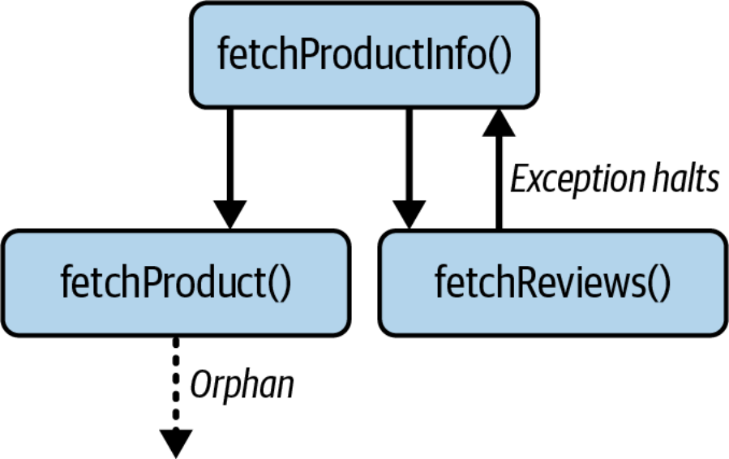
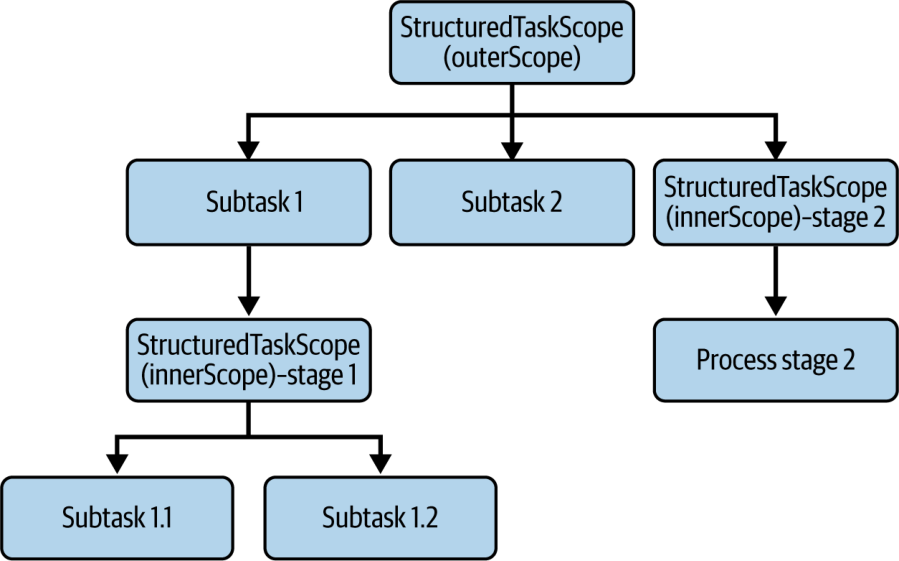

# Chương 4. Structured Concurrency

*Sự đơn giản là điều kiện tiên quyết của độ tin cậy.*

—Edsger W. Dijkstra

Trong các chương trước, chúng ta đã thấy virtual thread mở ra một thế giới đầy khả năng bằng cách cho phép chúng ta xử lý các tác vụ blocking trong lập trình concurrency với Java. Với hàng nghìn virtual thread nhẹ có thể được sinh ra mà không tốn chi phí đáng kể, các lời gọi blocking không còn là mối bận tâm nữa. Tuy nhiên, vẫn còn một vấn đề quan trọng cần được giải quyết: quản lý các mối quan hệ và sự phụ thuộc giữa các tác vụ khi chúng được chia nhỏ và phân phối trên nhiều thread.

Hãy hình dung một kịch bản trong đó một tác vụ cha có nhiều subtask (tác vụ con) phụ thuộc, mỗi subtask chạy trên một thread khác nhau. Nếu tác vụ cha kết thúc một cách bất ngờ, các subtask của nó vẫn tiếp tục thực thi một cách độc lập. Kết quả của những subtask này trở nên vô nghĩa, thế nhưng chúng vẫn tiêu tốn tài nguyên.

Hơn nữa, nếu tác vụ cha chỉ được phép hoàn thành khi tất cả các subtask của nó đã hoàn thành, thì lý tưởng nhất là bất kỳ thất bại nào trong số các subtask cũng nên dẫn đến việc hủy toàn bộ thao tác. Sự thiếu phối hợp này có thể dẫn đến vô số thread mồ côi (orphaned thread). Những thread mồ côi này sẽ làm cạn kiệt bộ nhớ và thời gian xử lý quý giá bằng cách làm những công việc không cần thiết. Thông thường, những sự kém hiệu quả như vậy kéo theo chi phí đáng kể.

Trong các mô hình concurrency truyền thống, chẳng hạn như `ExecutorService` và `Future` của Java, hệ thống phân cấp tác vụ không được hỗ trợ một cách tự nhiên, điều này khiến việc lan truyền cancellation (việc hủy) hoặc xử lý lỗi theo cách có cấu trúc trở nên khó khăn. Kết quả là một cách tiếp cận lập trình concurrent rời rạc và thường dễ mắc lỗi.

*Structured concurrency* (đồng thời có cấu trúc) là một mô hình (paradigm) giải quyết những thách thức này bằng cách coi các nhóm tác vụ có liên quan như một đơn vị công việc duy nhất. Nó đảm bảo rằng vòng đời của các subtask được ràng buộc với tác vụ cha, mang lại một cấu trúc minh bạch và dễ quản lý cho việc thực thi đồng thời. Điều này không chỉ đơn giản hóa việc xử lý lỗi và cancellation mà còn nâng cao độ tin cậy và khả năng quan sát (observability) của mã concurrent.

Trong chương này, chúng ta sẽ khám phá structured concurrency trong Java, xem xét những lợi ích của nó và cách nó giải quyết những hạn chế của các mô hình concurrency truyền thống. Chúng ta sẽ giới thiệu API [`StructuredTaskScope`](https://oreil.ly/eOySX), thảo luận cách nó giúp quản lý hệ thống phân cấp tác vụ, và đưa ra các ví dụ thực tế để minh họa cách sử dụng nó. Đến cuối chương này, bạn sẽ nắm vững cách triển khai structured concurrency trong các ứng dụng Java của mình và cách viết mã concurrent mạnh mẽ hơn và dễ bảo trì hơn.

## Thách thức của unstructured concurrency

Trong Java, concurrency theo truyền thống được quản lý bằng các abstraction như `ExecutorService` và `Future`. Mặc dù các lớp này cung cấp một phương tiện để thực thi các tác vụ một cách đồng thời, chúng cũng đặt ra một số thách thức, đặc biệt là khi các tác vụ cần được phối hợp với nhau.

Hãy xem xét một kịch bản phổ biến: một ứng dụng web cần lấy thông tin chi tiết của sản phẩm cùng các đánh giá (review) liên quan để hiển thị. Một cách tiếp cận sử dụng `ExecutorService` có thể được triển khai để thực hiện các thao tác này song song, qua đó cải thiện thời gian phản hồi.

Để minh họa điều này, hãy cùng xây dựng mã Java cho kịch bản của chúng ta từng phần một. Chúng ta sẽ bắt đầu bằng việc định nghĩa các cấu trúc dữ liệu sẽ chứa thông tin sản phẩm và các đánh giá. Các record của Java rất phù hợp cho những đối tượng mang dữ liệu đơn giản này nhờ sự ngắn gọn và đơn giản của chúng. Chúng ta cũng sẽ định nghĩa một `ProductServiceException` tùy chỉnh để xử lý hiệu quả hơn các lỗi đặc thù cho logic product service của chúng ta:

```java
record Product(Long id, String name, String description) {}
record Review(Long id, String comment, int rating, Long productId) {}
record ProductInfo(Product product, List<Review> reviews) {}

class ProductServiceException extends RuntimeException {
 public ProductServiceException(String message, Throwable cause) {
   super(message, cause);
 }
 public ProductServiceException(String message) {
   super(message);
 }
}
```

Với các mô hình dữ liệu và ngoại lệ tùy chỉnh đã sẵn sàng, chúng ta cần mô phỏng công việc thực sự của việc lấy dữ liệu. Việc truy xuất dữ liệu trong thực tế thường đi kèm với độ trễ mạng (network latency), điều này có thể được bắt chước bằng các phương thức trợ giúp (helper). Lớp `ProductService`, mà chúng ta sẽ định nghĩa ngay sau đây, sẽ bao gồm các phương thức trợ giúp private sau: `sleepForAWhile()` để tạo ra độ trễ, `log()` để ghi log các thông điệp kèm một định danh thread ngắn gọn cho dễ đọc, cùng `fetchProduct()` và `fetchReviews()` để mô phỏng các thao tác lấy dữ liệu. Các phương thức này sẽ in ra các thông điệp cho biết tiến trình của chúng, bao gồm cả tên của thread đang thực thi, để giúp hình dung sự đồng thời.

Bây giờ, chúng ta có thể triển khai lớp trung tâm `ProductService`. Phương thức then chốt ở đây là `fetchProductInfo()`. Phương thức này sử dụng một `ExecutorService` (cụ thể là `Executors.newVirtualThreadPerTaskExecutor()`, vốn phù hợp với các thao tác I/O-bound vì nó tạo ra các virtual thread nhẹ cho mỗi tác vụ) để chạy đồng thời các tác vụ lấy sản phẩm và lấy đánh giá. Sau đó nó dùng `Future.get()` để chờ chúng hoàn thành và lấy kết quả. Các phương thức trợ giúp dùng để mô phỏng công việc được đưa vào dưới dạng các phương thức instance private bên trong lớp này để đảm bảo tính đóng gói đúng đắn:

```java
public class ProductService {
  public ProductInfo fetchProductInfo(Long productId) {
      log("Fetching product & reviews for id: " + productId);

      try (var ExecutorService
                = Executors.newVirtualThreadPerTaskExecutor()) {  ①

          Future<Product> productTask =
              ExecutorService.submit(() -> fetchProduct(productId));  ②
          Future<List<Review>> reviewsTask =
              ExecutorService.submit(() -> fetchReviews(productId));  ③
          Product product = productTask.get();  ④
          log("Product retrieved for id: " + productId);
          List<Review> reviews = reviewsTask.get();  ⑤
          log("Reviews retrieved for id: " + productId);
          log("All info fetched for id: " + productId);
          return new ProductInfo(product, reviews);  ⑥

      } catch (ExecutionException | InterruptedException e) {  ⑦
          Throwable cause = e.getCause() != null ? e.getCause() : e;
          log("Error processing product info for id: " +
              productId + ": " + cause.getMessage());

          if (e instanceof InterruptedException) {
              Thread.currentThread().interrupt();
          }

          throw new ProductServiceException(
              "Fetch failed for id: " + productId, cause);
      }
  }
}
```

Bây giờ hãy cùng điểm qua những gì chúng ta đã làm ở đây:

Chúng ta đã tạo một virtual thread executor, executor này sinh ra một virtual thread mới cho mỗi tác vụ được submit.

① Submit thao tác lấy sản phẩm để chạy đồng thời.

② Submit thao tác lấy đánh giá để chạy đồng thời.

③ Block cho đến khi tác vụ lấy sản phẩm hoàn thành và lấy kết quả.

④ Block cho đến khi tác vụ lấy đánh giá hoàn thành và lấy kết quả.

⑤ Kết hợp cả hai kết quả thành đối tượng `ProductInfo` cuối cùng.

⑥ Bắt cả ngoại lệ thực thi (execution) lẫn ngoại lệ ngắt (interruption) với cách xử lý phù hợp.

Để hoàn thiện ví dụ product service đồng thời của chúng ta, chúng ta cần một số phương thức hỗ trợ mô phỏng các thao tác trong thực tế:

```java
private Product fetchProduct(Long productId) {
    log("Fetching product id: " + productId);
    sleepForAWhile(Duration.ofSeconds(1)); // Simulate network call
    return new Product(productId, "Sample Product",
        "A great product description.");
}
private List<Review> fetchReviews(Long productId) {
    log("Fetching reviews for id: " + productId);
    sleepForAWhile(Duration.ofSeconds(2)); // Simulate network call
    return List.of(
        new Review(1L, "Excellent!", 5, productId),
        new Review(2L, "Good value.", 4, productId)
    );
}

private void sleepForAWhile(Duration duration) {
    try {
        Thread.sleep(duration);
    } catch (InterruptedException e) {
        Thread.currentThread().interrupt();
        throw new RuntimeException("Thread interrupted during sleep", e);
    }
}

private static void log(String message) {
    Thread currentThread = Thread.currentThread();
    String threadName = currentThread.isVirtual()
        ? "VThread[#" + currentThread.threadId() + "]"
        : currentThread.getName();  ①
    String currentTime = LocalTime.now()
        .format(DateTimeFormatter.ofPattern("HH:mm:ss.SSS"));
    System.out.printf("%s %-15s: %s%n", currentTime, threadName, message);
}

void main() {  ②
    ProductService productService = new ProductService();
    long testProductId = 1L;
    log("Attempting to fetch product info for ID: " + testProductId);
    try {
        ProductInfo productInfo = productService.fetchProductInfo(testProdu
        log("Successfully retrieved: " + productInfo);
    } catch (ProductServiceException e) {
        log("Service Error: " + e.getMessage() +
            (e.getCause() != null ? " | Caused by: " +
             e.getCause().getMessage() : ""));
    }
}
```

Hãy cùng xem xét các chi tiết triển khai then chốt trong đoạn mã này:

① Định dạng log tùy chỉnh này giúp chúng ta theo dõi thread nào đang thực thi các thao tác đồng thời của chúng ta. Virtual thread thường không có tên, nhưng phương thức `toString()` của chúng cho ta những cái tên dài dòng như `VirtualThread[#34]/runnable@ForkJoinPool-1- worker-1`, và chúng ta rút gọn thành `VThread[#34]` cho rõ ràng mà vẫn phân biệt được virtual thread với platform thread.

② Chạy ví dụ hoàn chỉnh, thể hiện cả dòng thực thi đồng thời lẫn việc xử lý lỗi, tạo ra kết quả đầu ra mà chúng ta sẽ phân tích tiếp theo.

Với tất cả các thành phần đã sẵn sàng, hãy thực thi ví dụ hoàn chỉnh để quan sát hành vi đồng thời. Chạy lệnh sau trong terminal của bạn để xem virtual thread xử lý các thao tác song song của chúng ta như thế nào:

```bash
java ProductService.java
```

Và kết quả đầu ra sẽ trông như sau:

```text
00:50:27.625 main        : Attempting to fetch product info for ID: 1
00:50:27.627 main        : Fetching product & reviews for id: 1
00:50:27.631 VThread[#34]: Fetching product id: 1
00:50:27.631 VThread[#36]: Fetching reviews for id: 1
00:50:28.638 main        : Product retrieved for id: 1
00:50:29.652 VThread[#36]: Fetched reviews for id: 1
00:50:29.653 main        : Reviews retrieved for id: 1
00:50:29.653 main        : All info fetched for id: 1
00:50:29.660 main        : Successfully retrieved Product Info:
ProductInfo[product=Product[id=1, name=Sample Product, description=A great
product description.], reviews=[Review[id=1, comment=Excellent!, rating=5,
productId=1], Review[id=2, comment=Good value., rating=4, productId=1]]]
```

Thoạt nhìn, cách tiếp cận này có vẻ hoàn toàn hợp lý. Chúng ta đã chia công việc thành hai tác vụ đồng thời: lấy thông tin chi tiết sản phẩm và lấy các đánh giá của nó. Tuy nhiên, nếu xem xét kỹ, chúng ta có một vài vấn đề ở đây. Vì cả hai phương thức thực thi đồng thời, mỗi phương thức có thể thành công hoặc thất bại một cách độc lập.

Hãy hình dung một kịch bản trong đó cơ sở dữ liệu sản phẩm tạm thời không khả dụng. Tác vụ `fetchProduct()` có thể ném ra một ngoại lệ, và rốt cuộc sẽ làm dừng thread xử lý request chính. Tuy nhiên, không hề hay biết về thất bại này, tác vụ `fetchReviews(` **)** vẫn tiếp tục thực thi trên thread của riêng nó. Đây là một sự rò rỉ thread (thread leak) có khả năng chiếm dụng tài nguyên và làm tăng tải không cần thiết lên máy chủ (Hình 4-1).



*Hình 4-1. Tác vụ cha sinh ra hai tác vụ con; tuy nhiên, một ngoại lệ ở một tác vụ con làm dừng tác vụ cha, khiến tác vụ con còn lại bị mồ côi*

Nếu người dùng quyết định từ bỏ request, máy chủ có thể muốn dừng thread xử lý request bằng cách interrupt nó. Tuy nhiên, điều này sẽ không hủy các subtask; các tác vụ `fetchProduct()` và `fetchReviews()` sẽ tiếp tục chạy ngay cả sau khi phương thức `fetchProductInfo()` thất bại. Điều này dẫn đến hai thread bị rò rỉ và lãng phí những chu kỳ CPU quý giá cho một request không còn ý nghĩa nữa.

Phương thức `fetchProductInfo()` trả về kết quả dựa trên kết quả của cả hai phương thức nói trên. Vì vậy, phương thức `fetchProductInfo()` hoặc thành công với cả hai kết quả, hoặc thất bại. Tuy nhiên, điều gì sẽ xảy ra nếu `fetchProduct()` mất nhiều thời gian hơn đáng kể so với `fetchReviews()`, và trong khi nó đang lấy sản phẩm thì `fetchReviews()` thất bại? Trong trường hợp này, phương thức `fetchProductInfo()` chờ `fetchProduct(` **)** một cách không cần thiết, một tác vụ mà rốt cuộc sẽ bị bỏ đi.

Để minh họa những vấn đề này trong thực tế, hãy sửa đổi các phương thức của chúng ta để mô phỏng một kịch bản thất bại sát với thực tế. Chúng ta sẽ tạo ra một tình huống trong đó một tác vụ mất nhiều thời gian hơn đáng kể trong khi tác vụ kia thất bại nhanh chóng:

```java
private Product fetchProduct(Long productId) {
  log("Fetching product id: " + productId);
  if (productId == 1L) {
    log("Product id: " + productId
        + " - simulating long network call (5 seconds).");
    sleepForAWhile(Duration.ofSeconds(5));
    log("Product id: " + productId + " fetch complete.");
    return new Product(productId,
        "Long-Fetched Product", "This product takes time to fetch.");
  }
  log("Product id: " + productId +
      " - simulating standard network call (1 second).");
  sleepForAWhile(Duration.ofSeconds(1));
  log("Product id: " + productId + " fetch complete.");
  return new Product(productId, "Sample Product",
      "A great product description.");
}

private List<Review> fetchReviews(Long productId) {
  log("Fetching reviews for id: " + productId);
  if (productId == 1L) {
    log("Reviews for id: " + productId
        + " - simulating quick failure after 1 second.");
    sleepForAWhile(Duration.ofSeconds(1));
    throw new ProductServiceException("Simulated failure " +
        "fetching reviews for product " + productId);
  }
  log("Reviews for id: " + productId
      + " - simulating network call (2 seconds).");
  sleepForAWhile(Duration.ofSeconds(2));
  List<Review> reviews = List.of(
      new Review(1L, "Excellent!", 5, productId),
      new Review(2L, "Good value.", 4, productId)
  );
  log("Fetched reviews for id: " + productId);
  return reviews;
}
```

Trong phương thức trên, chúng ta đã đưa vào một hành vi có điều kiện dựa trên `productId == 1L` để tạo ra một kịch bản có kiểm soát: việc lấy sản phẩm sẽ mất năm giây (mô phỏng một cơ sở dữ liệu chậm), trong khi việc lấy đánh giá sẽ thất bại chỉ sau một giây. Sự lệch pha về thời gian này minh họa hoàn hảo vấn đề rò rỉ tài nguyên của chúng ta.

Bây giờ, nếu chúng ta chạy lại mã, kết quả đầu ra sẽ như sau:

```text
00:58:02.885 main           : Attempting to fetch product info for ID: 1
00:58:02.887 main         : Fetching product & reviews for id: 1
00:58:02.890 VThread[#36] : Fetching reviews for id: 1
00:58:02.890 VThread[#34] : Fetching product id: 1
00:58:02.890 VThread[#36] : Reviews for id: 1 - simulating quick failure af
1 second.
00:58:02.891 VThread[#34] : Product id: 1 - simulating long network call
(5 seconds).
00:58:07.899 VThread[#34] : Product id: 1 fetch complete.
00:58:07.900 main         : Product retrieved for id: 1
00:58:07.905 main         : Error processing product info for id:
1: Simulated failure fetching reviews for product 1
00:58:07.906 main           : Service Error: Fetch failed for id:
1 | Caused by: Simulated failure fetching reviews for product 1
```

Kết quả log cho thấy chính xác vấn đề mà chúng ta đã mô tả. Mặc dù `fetchReviews()` ném ra một ngoại lệ, phương thức `productFetch()` vẫn tiếp tục thực thi, mất trọn năm giây để lấy sản phẩm. Độ trễ này là không cần thiết vì kết quả không còn dùng được nữa.

Ví dụ này phơi bày vấn đề cốt lõi của unstructured concurrency (đồng thời không có cấu trúc). Nó coi các tác vụ như những thực thể độc lập, bỏ qua các mối quan hệ và sự phụ thuộc giữa chúng. Kết quả là một mảnh đất màu mỡ cho lỗi, rò rỉ tài nguyên và các điểm nghẽn hiệu năng. Xa hơn nữa, nó khiến việc chẩn đoán sự cố trở nên khó khăn. Các công cụ observability như thread dump sẽ hiển thị mỗi lời gọi phương thức dưới dạng các stack của những thread không liên quan đến nhau, không hề có dấu hiệu nào về mối quan hệ tác vụ–subtask.

Nó giống như câu lệnh [`goto`](https://oreil.ly/i40L7) thời xưa. Hệ quả của việc dùng `goto` là việc thực thi nhảy đến những điểm tùy ý trong mã, khiến việc lần theo logic của chương trình trở nên khó khăn. Tương tự, trong unstructured concurrency, các tác vụ hoặc thread có thể được thực thi theo một thứ tự tùy ý, khiến việc dự đoán trạng thái của chương trình tại bất kỳ thời điểm nào trở nên khó khăn.

Structured concurrency đại diện cho một sự thay đổi mô hình tư duy có thể giải quyết những vấn đề này, làm cho việc lập trình khi có sự hiện diện của concurrency trở nên gọn gàng và đơn giản.

## Lời hứa của Structured Concurrency

Structured concurrency xuất hiện như một cách tiếp cận mới mẻ cho concurrency trong Java. Thay vì coi các tác vụ đồng thời như những thực thể độc lập, nó tổ chức chúng theo cách phản ánh cấu trúc logic của chương trình chúng ta.

Nguyên tắc cốt lõi rất đơn giản: khi một tác vụ sinh ra nhiều subtask đồng thời, tất cả chúng phải quay về cùng một điểm trong mã của tác vụ cha. Hãy nghĩ về nó như một người quản lý giao việc cho các thành viên trong nhóm; mọi người đều phải báo cáo lại trước khi dự án có thể được coi là hoàn thành.

Trong mô hình này, tác vụ cha đóng vai trò như một giám sát viên, theo dõi các subtask của nó và chờ chúng hoàn thành hoặc can thiệp khi có vấn đề phát sinh. Ràng buộc này có vẻ đơn giản, nhưng nó có những hàm ý sâu sắc đối với độ tin cậy và khả năng bảo trì của mã concurrent. Mọi subtask, bất kể thành công hay thất bại, đều phải báo cáo lại cho tác vụ cha của nó trước khi thao tác có thể kết thúc.

Bây giờ hãy thảo luận về một số lợi ích mà nó mang lại.

Thứ nhất, structured concurrency cung cấp một cơ chế thống nhất để xử lý lỗi và cancellation trên một nhóm các tác vụ có liên quan (anh em, sibling). Ví dụ, nếu một subtask gặp lỗi hoặc bị hủy, các tác vụ anh em của nó sẽ tự động bị chấm dứt, và lỗi được lan truyền một cách êm thấm lên trên hệ thống phân cấp tác vụ.

Thứ hai, nó ngăn chặn rò rỉ thread bằng cách áp đặt một vòng đời cha-con nghiêm ngặt cho các tác vụ. Các tác vụ không thể sống lâu hơn scope dự định của chúng vì tác vụ cha đảm bảo tất cả các subtask được dọn dẹp đúng cách khi hoàn thành, dẫn đến hành vi hệ thống dễ dự đoán hơn.

Hơn nữa, structured concurrency nâng cao observability bằng cách cung cấp một biểu diễn rõ ràng và trực quan về sự phụ thuộc giữa các tác vụ. Các công cụ như thread dump và các profiler chuyên dụng khi đó có thể dễ dàng lần theo các mối quan hệ tác vụ này. Khả năng truy vết được cải thiện này giúp việc khắc phục sự cố và phân tích nguyên nhân gốc rễ diễn ra nhanh hơn khi có vấn đề phát sinh.

Mô hình này cũng khuyến khích một phong cách lập trình khai báo (declarative) hơn, cho phép lập trình viên tập trung vào logic nghiệp vụ của các tác vụ thay vì những chi tiết rắc rối của việc quản lý thread. Sự chuyển dịch này mang lại mã sạch hơn, dễ bảo trì hơn, dễ hiểu và dễ sửa đổi hơn, qua đó cuối cùng giảm thời gian và chi phí phát triển.

Cuối cùng, vì structured concurrency thường hoạt động trên nền virtual thread, sự kết hợp này cho phép tạo ra một số lượng khổng lồ các tác vụ đồng thời với chi phí tối thiểu. Structured concurrency cung cấp framework thiết yếu để điều phối các virtual thread này, đảm bảo chúng thực thi an toàn và hiệu quả, ngay cả ở quy mô lớn.

Structured concurrency được định vị để trở thành một thành phần nền tảng của lập trình concurrent trong Java. Bằng cách giải quyết những vấn đề cốt lõi của unstructured concurrency, nó mở ra một con đường hướng tới các hệ thống đáng tin cậy hơn và dễ bảo trì hơn.

Hãy cùng xem xét Structured Concurrency API và xem nó giải quyết những thách thức mà chúng ta đã thảo luận như thế nào.

## Tìm hiểu API

Trung tâm của Structured Concurrency API là [`StructuredTaskScope`](https://oreil.ly/k9kPw) trong package [java.util.concurrent](https://oreil.ly/2tqNo). Trong phần này, chúng ta sẽ khám phá các tính năng chính của nó, cách nó hoạt động, và cách nó có thể được dùng để đơn giản hóa và cải thiện lập trình concurrent trong Java.

### StructuredTaskScope

Interface [`StructuredTaskScope`](https://oreil.ly/k9kPw) là trung tâm của mô hình structured concurrency trong Java. Nó cho phép lập trình viên quản lý các nhóm tác vụ có liên quan, đảm bảo vòng đời của chúng được ràng buộc với nhau. Điều này làm cho việc xử lý lỗi, cancellation và tổng hợp kết quả trở nên đơn giản và đáng tin cậy hơn.

`StructuredTaskScope` là một sealed interface, được tham số hóa bởi các kiểu `T` và `R`, đại diện cho kiểu kết quả của các tác vụ được thực thi bên trong scope:

```java
public sealed interface StructuredTaskScope<T,R>
                                                        extends AutoCloseab
```

Hãy cùng khám phá các phương thức chính của nó:

```text
<U extends T> StructuredTaskScope.Subtask<U>
fork(Callable<? extends U> task)
```

Tạo và khởi động một subtask mới bên trong scope. Tác vụ được thực thi đồng thời trên một thread riêng (thường là một virtual thread). Phương thức trả về một đối tượng [`Subtask`](https://oreil.ly/eB1YZ) đại diện cho subtask đang chạy.

```text
<U extends T> StructuredTaskScope.Subtask<U>
fork(Runnable task)
```

Tạo và khởi động một subtask mới bên trong scope để chạy hành động được cung cấp. Hành động này thực thi đồng thời trên một thread riêng (thường là một virtual thread). Vì tác vụ là một `Runnable`, nó không tạo ra kết quả; do đó, `Subtask.get()` trả về `null` khi hoàn thành thành công. Phương thức trả về một đối tượng `Subtask` đại diện cho subtask đang chạy.

```text
join()
```

Trả về kết quả sau khi chờ tất cả các subtask hoàn thành hoặc scope bị hủy. Phương thức này block thread gọi nó (thread này phải là chủ sở hữu của scope) cho đến khi tất cả các subtask kết thúc. Nếu một timeout được cấu hình và hết hạn, scope sẽ bị hủy và `TimeoutException` được ném ra. Sau khi việc chờ hoàn tất, phương thức `result()` của joiner được gọi để lấy kết quả hoặc ném ra một ngoại lệ. Nếu phương thức `result()` ném ra một ngoại lệ, `FailedException` sẽ được ném ra với ngoại lệ đó làm nguyên nhân (cause). Phương thức này chỉ có thể được chủ sở hữu scope gọi một lần duy nhất.

```text
close()
```

Phương thức này đóng scope, đảm bảo rằng tất cả các subtask đã hoàn thành hoặc bị hủy. Nó thường được gọi ngầm khi sử dụng câu lệnh [`try` -with-resources](https://oreil.ly/RkRYx).

`StructuredTaskScope` là một interface; nó không thể được khởi tạo trực tiếp. Tuy nhiên, một tính năng then chốt của API này là phương thức factory tĩnh `open()`. Phương thức này có chữ ký (signature) như sau:

```text
static <T> StructuredTaskScope<T,Void> open()
```

Phương thức này tạo ra một `StructuredTaskScope` mới có thể được dùng để fork các subtask trả về kết quả thuộc bất kỳ kiểu nào. Phương thức `join()` của scope chờ cho đến khi tất cả các subtask hoàn thành thành công hoặc bất kỳ subtask nào thất bại. Mặc dù `open()` còn có các phương thức nạp chồng (overload) khác, chúng ta sẽ thảo luận về chúng trong một phần sau. Vì `StructuredTaskScope` mở rộng `AutoCloseable`, chúng ta sẽ sử dụng nó bên trong một khối `try` -with-resources, đảm bảo việc đóng tự động. Điều quan trọng cần lưu ý là phương thức `close()` không nên được gọi thủ công trong những trường hợp như vậy.

> **MẸO**
>
> `StructuredTaskScope` được thiết kế để sử dụng theo một cách có cấu trúc nghiêm ngặt. Nếu phương thức `close()` của nó được gọi trước khi tất cả các task scope lồng nhau (nếu chúng ta có) đã được đóng, scope sẽ: 1. Cố gắng đóng cấu trúc bên dưới của mỗi scope lồng nhau (theo thứ tự ngược với thứ tự tạo ra chúng). 2. Tự đóng chính nó. 3. Ném ra một `StructureViolationException` để báo hiệu trình tự đóng không đúng. Thay vào đó, chúng ta nên dựa vào câu lệnh `try` -with-resource.
>
Giờ đây khi đã có chút hiểu biết về structured concurrency và API của nó, hãy cùng triển khai phương thức `fetchProductInfo` bằng `StructuredTaskScope`. Phương thức này sẽ thu thập thông tin sản phẩm một cách đồng thời bằng cách lấy chi tiết sản phẩm và các đánh giá:

```java
public ProductInfo fetchProductInfo(Long productId) {
    log("Fetching product & reviews for id: " + productId);
    try (var scope = StructuredTaskScope.open()) {  ①
        StructuredTaskScope.Subtask<Product> productTask =
            scope.fork(() -> fetchProduct(productId));  ②
        StructuredTaskScope.Subtask<List<Review>> reviewsTask =
            scope.fork(() -> fetchReviews(productId));  ③
        scope.join();  ④
        return new ProductInfo(productTask.get(), reviewsTask.get());  ⑤
    } catch (InterruptedException e) {
        Thread.currentThread().interrupt();
        throw new ProductServiceException(
            "Fetch failed for id: " + productId);  ⑥
    }
}
```

Hãy lần theo những gì xảy ra khi cách tiếp cận có cấu trúc này thực thi:

① Phương thức `fetchProductInfo()` khởi tạo một `StructuredTaskScope` bên trong một khối `try` -with-resources để dọn dẹp tự động.

② Tạo subtask đầu tiên để lấy `Product` và khởi động nó chạy đồng thời.

③ Tạo subtask thứ hai để truy xuất `List<Review>` và khởi động nó chạy đồng thời cùng với tác vụ lấy sản phẩm.

④ Gọi `scope.join()`, lời gọi này block cho đến khi cả hai subtask hoàn thành, một trong hai thất bại, hoặc scope bị hủy.

⑤ Nếu cả hai subtask thành công, `join()` trả về bình thường, và phương thức xây dựng một instance `ProductInfo` bằng các kết quả từ `productTask.get()` và `reviewsTask.get()`.

⑥ Nếu một trong hai subtask thất bại, `join()` interrupt subtask còn lại đang chạy, chờ nó kết thúc, và ném ra một `StructuredTaskScope.FailedException` với ngoại lệ gốc làm nguyên nhân.

> **LƯU Ý**
>
> Tính năng structured concurrency được khám phá trong chương này hiện đang có sẵn dưới dạng preview trong JDK 25.
>
> Chúng ta có thể bật nó bằng cờ `--enable-preview` trong quá trình biên dịch và chạy. Để biên dịch và chạy mã của bạn, hãy dùng các lệnh sau:
>
> - *Với* `javac` *:* `javac --release 25 --enable-preview Main.java`
>
> - *Với* `java` *:* `java --enable-preview Main`
>
> - *Với trình khởi chạy mã nguồn (source code launcher):* `java --enable-preview Main.java`
>
> - *Với JShell:* `jshell --enable-preview`
>
> Chúng ta kỳ vọng tính năng này sẽ sớm được tích hợp vào các bản phát hành JDK trong tương lai mà không đòi hỏi bất kỳ sửa đổi nào đối với mã.
>
Để xem structured concurrency xử lý thất bại như thế nào, hãy sửa đổi phương thức `fetchProduct()` để mô phỏng một kịch bản trong đó không tìm thấy sản phẩm:

```java
private Product fetchProduct(Long productId) {
 log("Fetching product id: " + productId);
 if (productId == 1L) {
   throw new ProductServiceException("Product not found");  ①
 }
 sleepForAWhile(Duration.ofSeconds(1)); // Simulate network call
 return new Product(productId, "Sample Product",
     "A great product description.");
}
```

① Ném ngay một ngoại lệ cho product ID 1 để mô phỏng kịch bản “không tìm thấy”

Khi chúng ta chạy chương trình với sửa đổi này, kết quả đầu ra thể hiện hành vi của structured concurrency:

```text
04:46:34.321 main : Attempting to fetch product info for ID: 1
04:46:34.321 main : Fetching product & reviews for id: 1
04:46:34.325 VThread[#34]: Fetching product id: 1
04:46:34.325 VThread[#36]: Fetching reviews for id: 1
Exception in thread "main"
    java.util.concurrent.StructuredTaskScope$FailedException:
    ca.bazlur.mcj.chap4.ProductServiceException:
    at java.base/java.util.concurrent.StructuredTaskScopeImpl
       .join(StructuredTaskScopeImpl.java:257)
    at ca.bazlur.mcj.chap4.FailingProductServiceWithStructuredConcurrency
       .fetchProductInfo(FailingProductServiceWithStructuredConcurrency)
    at ca.bazlur.mcj.chap4.FailingProductServiceWithStructuredConcurrency
       .main(FailingProductServiceWithStructuredConcurrency)
Caused by: ca.bazlur.mcj.chap4.ProductServiceException:
    Product not found
    at ca.bazlur.mcj.chap4.FailingProductServiceWithStructuredConcurrency
       .fetchProduct(FailingProductServiceWithStructuredConcurrency)
    at ca.bazlur.mcj.chap4.FailingProductServiceWithStructuredConcurrency
       .lambda$fetchProductInfo$0(FailingProductServiceWithStructuredConcur
    at java.base/java.util.concurrent.StructuredTaskScopeImpl$SubtaskImpl
       .run(StructuredTaskScopeImpl.java)
    at java.base/java.lang.VirtualThread.run(VirtualThread.java:456)
```

Stack trace cho thấy chính xác những gì chúng ta mong đợi. Vì subtask `fetchProduct()` ném ra một ngoại lệ, `StructuredTaskScope` ngay lập tức hủy subtask `fetchReviews()` đang chạy đồng thời. Phương thức `scope.join()` sau đó ném ra một `StructuredTaskScope.FailedException`, bọc `ProductServiceException` gốc đã xảy ra trong `fetchProduct()` làm nguyên nhân của nó, để thread cha có thể xử lý lỗi một cách êm thấm (Hình 4-2).

Hình 4-2. Một quy trình `StructuredTaskScope` trong đó `fetchProductInfo()` fork

*fetchProduct() và fetchReviews(), join các kết quả của chúng, và đảm bảo hủy khi thất bại*

Phiên bản có cấu trúc này không chỉ giải quyết những hạn chế của cách tiếp cận không có cấu trúc trước đó mà còn mang lại những lợi ích đáng kể. Nếu một trong hai tác vụ thất bại, tác vụ kia sẽ tự động bị hủy, ngăn chặn sự lãng phí tài nguyên mà chúng ta đã thấy trước đó. Nếu tác vụ cha bị hủy, scope đóng lại và tự động chấm dứt cả hai subtask. Phương thức `join()` đảm bảo rằng cả hai tác vụ hoàn thành trước khi kết quả được lấy ra, ngăn chặn các vấn đề dữ liệu không đầy đủ đã gây khó cho triển khai ban đầu của chúng ta.

Ngoài những cải tiến kỹ thuật, mã có cấu trúc cũng ngắn gọn hơn, dễ hiểu hơn và ít dễ mắc lỗi hơn. Nó phản ánh rõ ràng ý định của thao tác: lấy cả sản phẩm lẫn đánh giá song song, nhưng chỉ tiếp tục nếu cả hai đều thành công. Không có sự mơ hồ nào về việc điều gì nên xảy ra khi có sự cố.

Bằng cách đón nhận structured concurrency, chúng ta có thể tạo ra mã concurrent hiệu quả hơn, đáng tin cậy hơn và dễ bảo trì hơn. Độ tin cậy này mang lại cảm giác an tâm, khi biết rằng mã của chúng ta sẽ hoạt động như mong đợi.

### Scope và Subtask: Mối quan hệ và Vòng đời

Giờ đây khi đã hiểu structured concurrency và các API của nó, hãy cùng khám phá mối quan hệ giữa các scope và các subtask của chúng.

Structured concurrency sử dụng `StructuredTaskScope` như một container cha để quản lý các subtask con của nó, xử lý vòng đời và việc thực thi của chúng. Mỗi subtask đại diện cho một đơn vị công việc đồng thời chạy trên các virtual thread bên trong scope. Mối quan hệ cha-con này đảm bảo một dòng thực thi có phối hợp và dễ dự đoán.

`StructuredTaskScope` định nghĩa một ngữ cảnh có giới hạn cho các thao tác đồng thời, quản lý toàn bộ vòng đời của các subtask để đảm bảo chúng thực thi và kết thúc theo một cách có kỷ luật.

#### Fork các subtask

Để khởi động công việc đồng thời, chủ sở hữu của scope sử dụng phương thức `fork()`. API cung cấp hai overload riêng biệt cho mục đích này:

```text
fork(Callable<? extends U> task)
```

Phương thức này được dùng cho các subtask được thiết kế để trả về một giá trị. Nó nhận một `Callable` và, khi được thực thi trên một virtual thread mới, phương thức `call()` của nó sẽ được gọi.

```text
fork(Runnable task)
```

Phương thức này được dùng cho các subtask thực hiện một hành động nhưng không trả về kết quả. Nó hoạt động giống hệt phiên bản `Callable`, nhưng nếu subtask hoàn thành thành công, phương thức `Subtask.get()` tương ứng của nó sẽ đơn giản trả về `null`.

#### Quá trình fork

Bất kể phương thức `fork()` nào được gọi, quá trình đều giống nhau:

- Một đối tượng `Subtask` được tạo ra để đại diện cho tác vụ bất đồng bộ. `Subtask` này đóng vai trò như một handle (điểm tham chiếu).

- Một đối tượng chính sách `Joiner` nội bộ được tham vấn thông qua phương thức `onFork()` của nó. Nếu chính sách này xác định rằng subtask không nên chạy (ví dụ, nếu scope đã bị hủy), `fork()` trả về handle và không có thread mới nào được khởi động.

- Nếu không, một virtual thread mới được khởi động để thực thi tác vụ.

Phương thức `fork()` trả về handle `Subtask` ngay lập tức. Chủ sở hữu của scope chỉ có thể dùng handle này để lấy kết quả bằng `Subtask.get()` hoặc lấy ngoại lệ bằng `Subtask.exception()` sau khi scope đã được join thông qua phương thức `join()`.

#### Hoàn thành subtask

Khi một subtask hoàn thành công việc của nó, thread thực thi nó sẽ thông báo cho joiner bằng cách gọi phương thức `onComplete()` của joiner, truyền vào handle `Subtask`, lúc này đã chứa trạng thái cuối cùng (ví dụ, `SUCCESS`, `UNAVAILABLE`, hoặc `FAILED`). Chúng ta sẽ thảo luận về `Joiner` trong một phần sau.

Chủ sở hữu scope dùng `join()` để chờ cho đến khi chính sách subtask được thỏa mãn. Với scope mặc định được tạo bởi `StructuredTaskScope.open()`, điều này có nghĩa là chờ cho đến khi hoặc tất cả các subtask hoàn thành thành công, hoặc một subtask thất bại. Nếu một subtask thất bại, scope tự động hủy mọi subtask khác đang chạy. Phương thức `join()` sau đó ném ra một `FailedException` bọc ngoại lệ gốc từ subtask đã thất bại.

Cuối cùng, khi scope được đóng (hoặc một cách tường minh, hoặc thông qua một khối `try` -with-resources), nó đảm bảo một sự tắt sạch sẽ bằng cách chờ tất cả các thread subtask kết thúc trước khi cho phép thread cha tiếp tục. Điều này ngăn chặn rò rỉ tài nguyên và đảm bảo bản chất có cấu trúc của các thao tác đồng thời.

### Chính sách join với Joiner

Một tính năng cốt lõi của `StructuredTaskScope` là khả năng định nghĩa các chính sách join (joining policy) linh hoạt thông qua một đối tượng `Joiner`. `Joiner` là một cơ chế mạnh mẽ quản lý vòng đời của các subtask bằng cách quy định các điều kiện để phương thức `join()` hoàn thành và loại kết quả, hay outcome, mà nó tạo ra.

Thay vì một vài chính sách cố định, Java cung cấp interface `Joiner`. Một cái nhìn đơn giản hóa về cấu trúc của nó cho thấy cả các phương thức kết quả (outcome method) lẫn các lifecycle hook (móc nối vòng đời):

```java
public interface Joiner<T, R> {
    R result();  ①
    Throwable exception();  ②
    default boolean onFork(Subtask<? extends T> subtask) { ... }  ③
    default boolean onComplete(Subtask<? extends T> subtask) { ... }  ④
}
```

Hãy xem phương thức này bao gồm những gì:

① Outcome method định nghĩa kết quả thành công sẽ được trả về từ

```text
scope.join()
```

② Outcome method định nghĩa ngoại lệ sẽ được ném ra từ

```text
scope.join()
```

③ Lifecycle hook được gọi mỗi khi `fork()` được gọi để theo dõi các subtask mới

④ Lifecycle hook được gọi khi bất kỳ subtask nào kết thúc, chứa logic chính sách cốt lõi

Hai phương thức đầu tiên, `result()` và `exception()`, là các outcome method định nghĩa hợp đồng (contract) cho kết quả cuối cùng của `scope.join()`. Một hiện thực phải cung cấp logic cho một trong hai phương thức này để trả về hoặc một giá trị thành công, hoặc một ngoại lệ sẽ được ném ra.

Phương thức `onFork()` là một lifecycle hook cho phép `Joiner` nhận biết và theo dõi các subtask mới khi chúng được tạo ra. Phương thức `onComplete()` là nơi logic chính sách cốt lõi thường nằm, kiểm tra xem việc hoàn thành của một subtask cụ thể có thỏa mãn điều kiện join tổng thể hay không (chẳng hạn như “đây có phải là thành công đầu tiên không?” hay “tất cả các tác vụ giờ đã thất bại chưa?”).

### Các chính sách join phổ biến

`Joiner` cung cấp một số phương thức factory tĩnh để tạo ra các chính sách phổ biến:

```text
Joiner.awaitAllSuccessfulOrThrow()
```

Đây là chính sách mặc định. Nó được dùng khi chúng ta gọi `StructuredTaskScope.open()`. Logic `onComplete()` nội bộ của nó theo dõi số lượng hoàn thành. Nếu một subtask thất bại, nó hủy scope. Nó chỉ cho phép `join()` hoàn thành thành công khi tất cả các subtask đã fork đều thành công.

```text
Joiner.anySuccessfulResultOrThrow()
```

Chính sách này hiện thực một chính sách “race to win” (đua để thắng). Logic `onComplete()` của nó kiểm tra xem subtask vừa hoàn thành có thành công hay không. Nếu có, nó ngay lập tức hủy scope, và phương thức `result()` của nó trả về kết quả thành công đó.

```text
Joiner.allSuccessfulOrThrow()
```

Hook `onComplete()` của chính sách này thu thập kết quả của mọi subtask hoàn thành thành công. Nó chờ tất cả các subtask kết thúc rồi sau đó cung cấp các kết quả đã thu thập trong một `Stream`.

```text
Joiner.awaitAll()
```

Chính sách này chờ tất cả các subtask hoàn thành, bất kể chúng thành công hay thất bại. Nó hữu ích khi bạn cần biết kết quả của mọi tác vụ và xử lý từng tác vụ một cách riêng lẻ. Phương thức `scope.join()` trả về một `Stream<Subtask>` mà bạn có thể xử lý để kiểm tra trạng thái, kết quả, hoặc ngoại lệ của từng subtask.

```text
Joiner.allUntil(Predicate<Subtask> isDone)
```

Đây là phương thức factory linh hoạt nhất, cho phép logic cancellation tùy chỉnh. Nó nhận một `Predicate` được kiểm tra với mọi subtask khi subtask đó hoàn thành. Nếu predicate trả về true, scope bị hủy. Điều này cho phép các chính sách phức tạp, chẳng hạn như “hủy sau khi hai subtask thất bại”. Nếu predicate không bao giờ trả về true, nó hành xử giống `awaitAll()`, chờ tất cả các subtask kết thúc. Trong cả hai trường hợp, `scope.join()` trả về một `Stream<Subtask>` gồm tất cả các subtask đã được fork.

Cách tiếp cận dựa trên `Joiner` này cho phép kiểm soát chi tiết các tiêu chí hoàn thành của scope và giá trị trả về của nó, từ chờ tất cả các subtask thành công, đến cho chúng đua nhau để tìm kết quả sẵn có đầu tiên, đến thu thập nhiều kết quả trong một stream.

Hãy cùng khám phá từng chính sách này với các ví dụ thực tế.

#### Chờ tất cả thành công hoặc thất bại đầu tiên

Khi bạn tạo một `StructuredTaskScope` bằng phương thức `open()`, nó mặc định dùng một chính sách trong đó tất cả các subtask phải thành công. Cách tiếp cận “tất cả hoặc không gì cả” (all-or-nothing) này được quản lý bên trong bởi `Joiner.awaitAllSuccessfulOrThrow()`. Điều này có nghĩa là nếu dù chỉ một subtask thất bại, toàn bộ scope sẽ bị tắt. Bất kỳ subtask còn lại nào đang chạy dở sẽ bị hủy ngay lập tức, và lỗi từ subtask thất bại được lan truyền ngược lại tác vụ cha. Thiết kế này đảm bảo rằng bạn chỉ nhận được kết quả nếu mọi phần của thao tác đều hoàn thành thành công, ngăn chặn việc sử dụng các kết quả không đầy đủ hoặc chỉ một phần.

Hãy minh họa điều này bằng một ví dụ thực tế. Trước tiên chúng ta sẽ tạo các record dữ liệu tương tự như những record đã tạo ở phần đầu chương:

```java
record Product(long productId, String name) {}
record Review(String user, int rating) {}
record ProductInfo(Product product, List<Review> reviews) {}
```

Tiếp theo, chúng ta cần các phương thức sẽ chạy như các subtask đồng thời của chúng ta. Để làm cho sự đồng thời trở nên rõ ràng, chúng ta sẽ thêm các câu lệnh `log()` và dùng `Thread.sleep()` để mô phỏng độ trễ mạng. Chúng ta cũng sẽ tạo một phương thức riêng, `fetchProductThatFails()`, để minh họa đường xử lý lỗi:

```java
// A subtask that succeeds after a 1-second delay
private Product fetchProduct(long productId)
    throws InterruptedException {
  log(" -> Fetching product details... (will take 1s)");
  Thread.sleep(Duration.ofSeconds(1));  ①
  log(" <- Product details fetched.");
  return new Product(productId, "Sample Product");
}
// A subtask that will always fail
private Product fetchProductThatFails(long productId) {
  log(" -> Fetching product details... (will fail)");
  throw new ProductServiceException("Product ID " + productId + " not found
}
// A subtask that succeeds after a 2-second delay
private List<Review> fetchReviews(long productId)
    throws InterruptedException {
  log(" -> Fetching product reviews... (will take 2s)");
  Thread.sleep(Duration.ofSeconds(2));  ②
  log(" <- Product reviews fetched.");
  return List.of(new Review("Inaya", 5), new Review("Rushda", 4));
}
```

Mỗi phương thức phục vụ một mục đích cụ thể trong phần minh họa của chúng ta:

① Mô phỏng một lời gọi mạng kéo dài một giây để lấy dữ liệu sản phẩm

② Ném ngay một ngoại lệ để mô phỏng kịch bản “không tìm thấy sản phẩm”

③ Mô phỏng một lời gọi mạng kéo dài hai giây để lấy dữ liệu đánh giá.

Chúng ta đã định nghĩa phương thức `log()` ở phần trước. Hãy chuyển nó thành một phương thức tiện ích để có thể tái sử dụng trong các ngữ cảnh khác:

```java
import java.time.LocalTime;
import java.time.format.DateTimeFormatter;
public class Utils {
  public static void log(String message) {
    Thread currentThread = Thread.currentThread();
    String threadName = currentThread.isVirtual()
        ? "VThread[#" + currentThread.threadId() + "]"
        : currentThread.getName();
    String currentTime = LocalTime.now()
        .format(DateTimeFormatter.ofPattern("HH:mm:ss.SSS"));
    System.out.printf("%s %-12s: %s%n", currentTime, threadName, message);
  }
}
```

Bây giờ hãy định nghĩa logic chính của chúng ta bằng chính sách mặc định:

```java
public ProductInfo fetchProductInfo(long productId, boolean shouldFail)
    throws InterruptedException {
  Instant start = Instant.now();
  // Using open() provides the default "fail-fast" policy
  try (var scope = StructuredTaskScope.open()) {  ①
    StructuredTaskScope.Subtask<Product> productTask = shouldFail
        ? scope.fork(() -> fetchProductThatFails(productId))  ②
        : scope.fork(() -> fetchProduct(productId));  ③
    StructuredTaskScope.Subtask<List<Review>> reviewsTask
        = scope.fork(() -> fetchReviews(productId));  ④
    // Waits for both to succeed, or throws FailedException on first failur
    log("... Scope joining. Waiting for subtasks...");
    scope.join();  ⑤
    log("... Scope joined successfully.");
    // Only reachable if join() succeeds
    return new ProductInfo(productTask.get(), reviewsTask.get());  ⑥
  } catch (StructuredTaskScope.FailedException ex) {
    // This block executes only in the failure scenario
    log("... Scope join failed. A subtask threw an exception.");
    throw new RuntimeException("Failed to fetch product info", ex.getCause(
  } finally {
    Instant end = Instant.now();
    log("Total time taken: " + Duration.between(start, end).toMillis() + "m
  }
}
```

Hãy lần theo dòng thực thi:

① Tạo một scope với chính sách mặc định `awaitAllSuccessfulOrThrow()`

② Fork có điều kiện một tác vụ sẽ thất bại (để minh họa)

③ Fork một tác vụ sẽ thành công sau một giây

④ Fork một tác vụ sẽ thành công sau hai giây

⑤ Chờ tất cả các subtask hoàn thành thành công hoặc thất bại nhanh (fail-fast) ngay ở lỗi đầu tiên

⑥ Chỉ lấy kết quả nếu tất cả các subtask đều thành công

⑦ Xử lý trường hợp thất bại bằng cách bọc ngoại lệ gốc

Đây là phần cốt lõi của ví dụ. Phương thức `fetchProductInfo()` dùng `StructuredTaskScope` để điều phối các subtask. Một cờ boolean, `shouldFail`, sẽ cho phép chúng ta dễ dàng chuyển đổi giữa đường thành công và đường thất bại.

Đây là lớp minh họa hoàn chỉnh của chúng ta:

```java
public class DefaultPolicyDemo {
  // ... (method implementations from above)
  void main() {
    var demo = new DefaultPolicyDemo();
    log("--- Running Success Scenario ---");
    log("... Expecting to take ~2 seconds (the time of the slowest task)...
    try {
      ProductInfo result = demo.fetchProductInfo(123L, false);  ①
      log("\nSuccess! Result: " + result);
    } catch (Exception e) {
      log("\nCaught unexpected exception in success scenario: " +
        "" + e.getMessage());
    }
  }
}
```

Phương thức main minh họa đường thành công:

① Chạy kịch bản thành công bằng cách truyền `false` cho tham số `shouldFail`

Hãy chạy mã:

```bash
java --enable-preview DefaultPolicyDemo.java
```

> **LƯU Ý**
>
> Xin lưu ý rằng chúng ta đang dùng JDK 25, và structured concurrency là một tính năng preview.
>
Kết quả đầu ra sẽ như sau:

```text
20:35:18.357 main           : --- Running Success Scenario ---
20:35:18.358 main           : ... Expecting to take ~2 seconds (the time of
slowest task)...
20:35:18.362 main           : ... Scope joining. Waiting for subtasks...
20:35:18.363 VThread[#36]   :  -> Fetching product reviews... (will take 2s
20:35:18.363 VThread[#34]   :  -> Fetching product details... (will take 1s
20:35:19.367 VThread[#34]   :  <- Product details fetched.
20:35:20.369 VThread[#36]   :  <- Product reviews fetched.
20:35:20.370 main           : ... Scope joined successfully.
20:35:20.371 main           : Total time taken: 2012ms
20:35:20.378 main           :
Success! Result: ProductInfo[product=Product[productId=123, name=Sample Pro
reviews=[Review[user=Inaya, rating=5], Review[user=Rushda, rating=4]]]
```

Main thread tạo scope và ngay lập tức fork hai subtask, `fetchProduct()` và `fetchReviews()`, chúng được các virtual thread ( `VThread[#34]` và `VThread[#36]`) tiếp nhận và bắt đầu thực thi gần như cùng một thời điểm. Trong khi chúng chạy song song, main thread block tại `scope.join()`, chờ kết quả. Sau một giây, tác vụ `fetchProduct()` hoàn thành, nhưng main thread vẫn tiếp tục chờ vì tác vụ `fetchReviews()` chậm hơn vẫn đang chạy. Khi `fetchReviews()` hoàn thành sau hai giây, và giờ đây khi tất cả các subtask đã thành công, phương thức `join()` cuối cùng cũng trả về. Tổng thời gian là ~2,000ms, cho thấy các tác vụ đã chạy song song, vì thời lượng của thao tác bị giới hạn bởi subtask chạy lâu nhất.

Bây giờ, hãy chuyển sự chú ý sang kịch bản thất bại. Để làm điều này, chúng ta sẽ sửa phương thức main để gọi `fetchProductInfo()` với cờ `shouldFail` được đặt là `true`. Điều này sẽ khiến nó dùng phương thức `fetchProductThatFails()`, phương thức mà chúng ta đã thiết kế để ném ngay một ngoại lệ.

Tiếp theo, chúng ta sẽ sửa phương thức main để thực thi đường này:

```java
void main() {
  var demo = new DefaultPolicyDemo();
  log("--- Running Failure Scenario ---");
  log("... Expecting to fail almost instantly...\n");
  try {
    demo.fetchProductInfo(456L, true);  ①
  } catch (Exception e) {
    // We expect the RuntimeException thrown from our catch block
    log("\nCaught expected exception in failure scenario: " + e.getMessage(
    log("Cause: " + e.getCause());  ②
  }
}
```

Kịch bản thất bại minh họa việc xử lý lỗi tức thì:

① Chạy kịch bản thất bại bằng cách truyền `true` cho tham số `shouldFail`

② Hiển thị nguyên nhân gốc của thất bại được bọc trong

```text
RuntimeException
```

Kết quả đầu ra sẽ như sau:

```text
22:20:11.405 main          : --- Running Failure Scenario ---
22:20:11.406 main          : ... Expecting to fail almost instantly...
22:20:11.411 main          : ... Scope joining. Waiting for subtasks...
22:20:11.412 VThread[#34]  :  -> Fetching product details... (will fail)
22:20:11.412 VThread[#36]  :  -> Fetching product reviews... (will take 2s)
22:20:11.413 main          : ... Scope join failed. A subtask threw an exce
22:20:11.414 main          : Total time taken: 7ms
22:20:11.414 main          :
Caught expected exception in failure scenario: Failed to fetch product info
22:20:11.414 main          : Cause: ca.bazlur.mcj.chap4.
ProductServiceException: Product ID 456 not found
```

Kết quả này thể hiện rõ ràng sức mạnh của chính sách fail-fast. Mặc dù cả tác vụ thất bại `fetchProductThatFails()` lẫn tác vụ `fetchReviews()` kéo dài hai giây đều được fork lên các virtual thread, toàn bộ thao tác kết thúc chỉ trong bảy mili giây. Ngay khoảnh khắc subtask đầu tiên thất bại, chính sách `Joiner` hủy subtask còn lại đang chạy và khiến `scope.join()` ngay lập tức ném ra một `FailedException`. Hệ thống không lãng phí thời gian chờ tác vụ `fetchReviews()` hoàn thành, vì kết quả của nó sẽ chẳng còn ý nghĩa. Việc lan truyền lỗi nhanh chóng và ngăn chặn công việc lãng phí này là một lợi thế cốt lõi của việc dùng structured concurrency cho các thao tác “tất cả hoặc không gì cả”.

Để đánh giá đầy đủ lợi ích của chính sách fail-fast mặc định, hãy so sánh nó với cách tiếp cận `ExecutorService` truyền thống cho cùng một tác vụ:

```java
ProductInfo fetchProductInfoWithExecutor(Long productId)
    throws ExecutionException, InterruptedException {
  Instant start = Instant.now();
  try (ExecutorService service
                           = Executors.newVirtualThreadPerTaskExecutor()) {
    Future<Product> productFuture
          = service.submit(() -> fetchProductThatFails(productId));  ①
    Future<List<Review>> reviewFuture
          = service.submit(() -> fetchReviews(productId));  ②
    Product product = productFuture.get();  ③
    List<Review> reviews = reviewFuture.get();  ④
    return new ProductInfo(product, reviews);
  } finally {
    Instant end = Instant.now();
    System.out.printf("Time taken: %dms%n",
          end.toEpochMilli() - start.toEpochMilli());
  }
}
```

Cách tiếp cận truyền thống bộc lộ những hạn chế của nó:

① Tạo một `ExecutorService` với các virtual thread

② Submit tác vụ lấy sản phẩm sẽ thất bại và nhận về một `Future`

③ Submit tác vụ lấy đánh giá và nhận về một tác vụ khác

④ Lời gọi phương thức `get` blocking chờ kết quả sản phẩm (sẽ thất bại)

⑤ Sẽ block để chờ kết quả đánh giá, nhưng không bao giờ được chạm tới do một ngoại lệ

Nếu chúng ta gọi phương thức này từ phương thức main, kết quả đầu ra cho thấy sự kém hiệu quả:

```text
22:46:10.211 main           : --- Running Failure Scenario with Executor --
22:46:10.212 main           : ... Expecting to fail almost instantly...
22:46:10.215 VThread[#36]   :  -> Fetching product reviews... (will take 2s
22:46:10.215 VThread[#34]   :  -> Fetching product details... (will fail)
22:46:12.221 VThread[#36]   :  <- Product reviews fetched.
Time taken: 2010ms
22:46:12.227 main           :
Caught expected exception in failure scenario: ca.bazlur.mcj.chap4.ProductS
Exception: Product ID 456 not found
22:46:12.227 main           : Cause: ca.bazlur.mcj.chap4.ProductServiceExce
Product ID 456 not found
```

Khi mổ xẻ log trên console, sự kém hiệu quả nghiêm trọng của cách tiếp cận không có cấu trúc này trở nên rõ ràng. Chúng ta thấy rằng mặc dù tác vụ `fetchProductThatFails()` trên `VThread[#34]` thất bại gần như ngay lập tức, tác vụ `fetchReviews()` trên `VThread[#36]` vẫn tiếp tục chạy, hoàn toàn không hay biết. Log xác nhận điều này bằng cách in ra thông điệp `Product reviews fetched` sau trọn vẹn hai giây trễ. Điều này xảy ra vì `ExecutorService` không cung cấp khái niệm về một scope chung; từ góc nhìn của nó, hai `Future` là độc lập, và thất bại ở một cái không ảnh hưởng gì đến cái kia. Kết quả là chương trình của chúng ta bị block trong khi tác vụ lấy đánh giá chạy đến khi hoàn thành, lãng phí tài nguyên hệ thống cho một kết quả mà rốt cuộc chúng ta sẽ vứt bỏ.

#### Đua để lấy kết quả thành công đầu tiên

Với chính sách `Joiner.anySuccessfulResultOrThrow()`, chúng ta có thể tổ chức một cuộc đua giữa các subtask đồng thời, tuyên bố người thắng ngay khi một subtask hoàn thành thành công. Chúng ta có thể xem đây như cách tiếp cận “về đích trước là thắng” (first-past-the-post). Khoảnh khắc có người thắng, `Joiner` hủy tất cả các subtask khác đang chạy.

Để minh họa chính sách này, chúng ta sẽ dựng một kịch bản trong đó chúng ta lấy chi tiết sản phẩm từ ba nguồn khác nhau, mỗi nguồn có thời gian phản hồi khác nhau. Chúng ta muốn tiếp tục với bất kỳ kết quả nào nhận được trước.

Trước tiên, chúng ta cần định nghĩa ba phương thức `fetch`. Chúng ta sẽ cho mỗi phương thức một thời lượng `Thread.sleep()` khác nhau và thêm các câu lệnh `log()`. Điều này sẽ cho phép chúng ta quan sát cuộc đua và việc hủy diễn ra sau đó khi chạy mã:

```java
private Product fetchProductFromCache(long productId) throws
    InterruptedException {
  log(" -> Checking cache... (will take 500ms)");
  Thread.sleep(Duration.ofMillis(500));  ①
  log(" <- Cache has the result!");
  return new Product(productId, "Product from Cache");
}
// A slower source (2000ms)
private Product fetchProductFromDatabase(long productId)
    throws InterruptedException {
  try {
    log(" -> Querying database... (will take 2s)");
    Thread.sleep(Duration.ofSeconds(2));  ②
    log(" <- Database has the result!");
    return new Product(productId, "Product from DB");
  } catch (InterruptedException e) {
    // This block will execute when the scope cancels this task
    log(" <- Database query was canceled.");  ③
    Thread.currentThread().interrupt();
    throw e;
  }
}
// The slowest source (3000ms)
private Product fetchProductFromAPI(long productId)
    throws InterruptedException {
  try {
    log(" -> Calling external API... (will take 3s)");
    Thread.sleep(Duration.ofSeconds(3));  ④
    log(" <- API has the result!");
    return new Product(productId, "Product from API");
  } catch (InterruptedException e) {
    // This block will also execute upon cancellation
    log(" <- API call was canceled.");  ⑤
    Thread.currentThread().interrupt();
    throw e;
  }
}
```

Mỗi phương thức mô phỏng một nguồn dữ liệu khác nhau với thời gian phản hồi khác nhau:

① Cache phản hồi nhanh nhất ở mức 500ms, khiến nó có khả năng là người thắng.

② Cơ sở dữ liệu mất hai giây và bao gồm xử lý cancellation.

③ Ghi log khi truy vấn cơ sở dữ liệu bị interrupt do scope bị hủy.

④ API chậm nhất ở mức ba giây và cũng xử lý cancellation.

⑤ Ghi log khi lời gọi API bị interrupt do scope bị hủy.

Bây giờ, chúng ta sẽ viết phương thức điều phối (orchestrator). Lần này, khi mở scope, chúng ta sẽ truyền vào joiner `Joiner.anySuccessfulResultOrThrow()` để thiết lập cuộc đua:

```java
public Product fetchProduct(long productId) {
  Instant start = Instant.now();
  // The Joiner specifies the "race-to-win" policy
  try (var scope
           = StructuredTaskScope.open(
               StructuredTaskScope
                   .Joiner.<Product>anySuccessfulResultOrThrow())) {  ①
    scope.fork(() -> fetchProductFromDatabase(productId));  ②
    scope.fork(() -> fetchProductFromCache(productId));  ③
    scope.fork(() -> fetchProductFromAPI(productId));  ④
    // join() now returns the result of the first successful subtask
    return scope.join();  ⑤
  } catch (InterruptedException | StructuredTaskScope.FailedException e) {
    // FailedException is thrown if ALL subtasks fail
    throw new RuntimeException(e);  ⑥
  } finally {
    Instant end = Instant.now();
    log("Total time taken: %dms%n"
        .formatted(Duration.between(start, end).toMillis()));
  }
}
```

Phương thức điều phối thiết lập các điều kiện của cuộc đua:

① Tạo một scope với chính sách race-to-win trả về kết quả thành công đầu tiên

② Fork tác vụ cơ sở dữ liệu (trễ hai giây)

③ Fork tác vụ cache (trễ 500ms)—nhiều khả năng là người thắng

④ Fork tác vụ API (trễ ba giây)

⑤ Chờ lần hoàn thành thành công đầu tiên và trả về kết quả đó

⑥ Xử lý trường hợp tất cả các subtask đều thất bại (ném ra `FailedException`)

Khi thực thi mã này, chúng ta mong đợi sẽ thấy việc hủy diễn ra trực tiếp. Hãy gọi phương thức này từ phương thức main:

```java
public class RacePolicyDemo {
  // ... (method implementations from above)
  void main() {
    var demo = new RacePolicyDemo();
    log("--- Running Race Scenario ---");
    log("... Three tasks will race. " +
        "Expecting to finish in ~500ms (the fastest task)...\n");
    try {
      Product winningProduct = demo.fetchProduct(123L);  ①
      log("Race finished! Winning result: " + winningProduct);
    } catch (Exception e) {
      log("Caught unexpected exception: " + e.getMessage());
      e.printStackTrace();
    }
  }
}
```

Phương thức main minh họa kịch bản đua:

① Bắt đầu cuộc đua giữa ba nguồn dữ liệu khác nhau và kỳ vọng nguồn nhanh nhất sẽ thắng

Để mã này hoạt động, chúng ta cũng cần record sau:

```java
public record Product(long productId, String source) {
}
```

Hãy thực thi mã:

```bash
java --enable-preview RacePolicyDemo.java
```

Kết quả đầu ra sẽ như sau:

```text
23:03:23.917 main        : --- Running Race Scenario ---
23:03:23.917 main        : ... Three tasks will race. Expecting to finish i
~500ms (the fastest task)...
23:03:23.923 VThread[#36]:  -> Checking cache... (will take 500ms)
23:03:23.923 VThread[#38]:  -> Calling external API... (will take 3s)
23:03:23.923 VThread[#34]:  -> Querying database... (will take 2s)
23:03:24.429 VThread[#36]:  <- Cache has the result!
23:03:24.431 VThread[#34]:  <- Database query was canceled.
23:03:24.431 VThread[#38]:  <- API call was canceled.
23:03:24.439 main        : Total time taken: 513ms
23:03:24.442 main        : Race finished! Winning result: Product[productId
source=Product from Cache]
```

Khi nhìn vào kết quả trên console, chúng ta có thể thấy một minh họa hoàn hảo cho chính sách race-to-win. Chúng ta thấy cả ba phương thức `fetch` đều được fork và bắt đầu chạy song song. Tuy nhiên, sau khoảng 500ms, tác vụ nhanh nhất của chúng ta, `fetchProductFromCache()`, thành công. Đúng khoảnh khắc đó, chính sách `Joiner` coi điều kiện của nó đã được thỏa mãn, và chúng ta thấy nó ngay lập tức hủy hai subtask còn lại đang chạy; bằng chứng là các thông điệp `was canceled` được in ra error stream. Phương thức `join` sau đó trả về kết quả thắng cuộc từ cache, và toàn bộ thao tác kết thúc chỉ trong hơn 500ms một chút, mà chúng ta không phải lãng phí thời gian chờ các tác vụ chậm hơn.

#### Thu thập mọi kết quả hoặc fail fast

Chúng ta đã thấy chính sách (policy) mặc định, vốn sẽ thất bại nếu bất kỳ subtask nào thất bại. Chính sách tiếp theo, `allSuccessfulOrThrow`, hành xử giống hệt trong trường hợp thất bại, nhưng cung cấp một cách tiện lợi hơn để xử lý kết quả khi thành công.

Giống như chính sách mặc định, `allSuccessfulOrThrow()` duy trì một chiến lược “tất cả hoặc không gì cả” nghiêm ngặt. Nếu bất kỳ subtask nào thất bại, nó lập tức hủy tất cả các subtask khác đang chạy, và phương thức `scope.join()` ném ra một `FailedException`.

Điểm khác biệt then chốt nằm ở những gì xảy ra khi thành công. Thay vì `join()` trả về void, nó trả về một `java.util.Stream<Subtask<T>>`. Stream này chứa các handle tới tất cả các subtask đã hoàn thành thành công, theo đúng thứ tự chúng được fork, giúp việc xử lý tất cả kết quả cùng một lúc trở nên dễ dàng. Chúng ta nên dùng `Joiner` này khi tất cả các subtask của mình trả về cùng một kiểu kết quả (ví dụ `String`, `Product`, v.v.) và chúng ta cần tất cả chúng đều thành công.

Chính sách mặc định `awaitAllSuccessfulOrThrow()` phù hợp hơn khi các subtask của chúng ta trả về kết quả với các kiểu khác nhau, vì dù sao chúng ta cũng sẽ xử lý kết quả của từng subtask một cách riêng lẻ.

Hãy hình dung chúng ta cần xác thực một danh sách ID người dùng bằng cách kiểm tra chúng với một dịch vụ bên ngoài. Chúng ta muốn làm việc này một cách đồng thời, nhưng toàn bộ lô (batch) chỉ hợp lệ nếu mọi ID người dùng đều được xác thực thành công.

Trước tiên, chúng ta sẽ định nghĩa một phương thức đơn giản mô phỏng việc xác thực một người dùng. Chúng ta cũng sẽ tạo một phiên bản thất bại với một ID cụ thể:

```java
public record ValidatedUser(long userId, String status) {
}

private ValidatedUser validateUser(long userId)
    throws InterruptedException {
  log(" -> Validating user %d...".formatted(userId));
  Thread.sleep(Duration.ofMillis(100 + new Random().nextInt(500)));  ①
  log(" <- User %d is valid.".formatted(userId));
  return new ValidatedUser(userId, "VALID");
}

private ValidatedUser validateUserWithFailure(long userId)
    throws InterruptedException {
  if (userId == 3L) {
    log(" -> Validating user %d... (will fail)".formatted(userId));
    throw new IllegalArgumentException("Invalid user ID: " + userId);  ②
  }
  return validateUser(userId);
}
```

Các phương thức xác thực mô phỏng hành vi trong thực tế:

① Thêm một độ trễ ngẫu nhiên trong khoảng 100–600ms để mô phỏng sự biến động của mạng

② Cố tình thất bại với ID người dùng 3 để minh họa việc xử lý lỗi

Bây giờ, chúng ta sẽ viết một phương thức nhận vào một danh sách ID người dùng, fork một tác vụ xác thực cho mỗi ID, và dùng `allSuccessfulOrThrow()` để thu thập kết quả:

```java
public List<ValidatedUser> validateAllUsers(List<Long> userIds)
    throws InterruptedException {
  log("Validating a batch of " + userIds.size() + " users...");
  try (var scope
           = open(Joiner.<ValidatedUser>allSuccessfulOrThrow())) {  ①
    var subtasks = userIds.stream()
        .map(id -> scope.fork(() -> validateUserWithFailure(id)))  ②
        .toList();
    // join() returns a Stream<Subtask<ValidatedUser>> on success
    // or throws FailedException on the first failure
    var resultStream = scope.join();  ③
    log("...All users validated successfully. Processing stream...");
    return resultStream
        .map(Subtask::get)  ④
        .toList();
  } catch (FailedException ex) {
    log("All users validated successfully. Processing stream");
    throw new RuntimeException("Batch validation failed",
        ex.getCause());  ⑤
  }
}
```

Phương thức xác thực theo lô minh họa việc thu thập nhiều kết quả:

① Tạo một scope với chính sách `allSuccessfulOrThrow()` để thu thập tất cả kết quả

② Fork một subtask xác thực cho mỗi ID người dùng và thu thập các handle của subtask

③ Chờ tất cả các xác thực hoàn thành và trả về một `Stream` gồm các subtask thành công

④ Trích xuất kết quả `ValidatedUser` thực sự từ mỗi subtask

⑤ Xử lý thất bại của lô bằng cách bọc (wrap) ngoại lệ xác thực gốc

> **LƯU Ý VỀ VAR VÀ SUY LUẬN KIỂU**
>
> Để giữ cho mã nguồn ngắn gọn, chúng ta đã dùng từ khóa `var`. Mặc dù điều này cải thiện khả năng đọc bằng cách giảm bớt mã rườm rà (boilerplate), việc biết rõ các kiểu tường minh đang được sử dụng vẫn hữu ích cho chúng ta.
>
> Trong phương thức `validateAllUsers`:
>
> - `var scope` được suy luận là `StructuredTaskScope<ValidatedUser>`
>
> - `var subtasks` được suy luận là `List<Subtask<ValidatedUser>>`
>
> - `var resultStream` được suy luận là `Stream<Subtask<ValidatedUser>>`
>
Bây giờ, hãy ghép mọi thứ lại vào lớp `BatchValidationDemo.java` hoàn chỉnh của chúng ta. Để duy trì sự ngắn gọn của mã nguồn được trình bày, chúng ta sẽ dùng static import cho các lớp lồng nhau (nested class) của `StructuredTaskScope`, chẳng hạn `Joiner` và `Subtask`, cũng như cho chính phương thức `open()`:

```java
import static java.util.concurrent.StructuredTaskScope.*;
public class BatchValidationDemo {
  // ... (method implementations from above)
  void main() {
    var demo = new BatchValidationDemo();
    List<Long> successfulBatch = List.of(1L, 2L, 4L, 5L);
    // Contains the failing ID '3'
    List<Long> failingBatch = List.of(1L, 2L, 3L, 4L, 5L);  ①
    log("--- Running Success Scenario ---");
    try {
      List<ValidatedUser> results = demo.validateAllUsers(successfulBatch);
      log("\nBatch validation complete. Results:");
      results.forEach(validatedUser -> log(validatedUser.toString()));
    } catch (Exception e) {
      log("Caught unexpected exception: " + e.getMessage());
    }
    log("\n==============================================\n");
    log("--- Running Failure Scenario ---");
    try {
      demo.validateAllUsers(failingBatch);  ②
    } catch (Exception e) {
      log("Caught expected exception: " + e.getMessage());
    }
  }
}
```

Phương thức `main` kiểm thử cả hai kịch bản:

① Tạo một lô chứa ID người dùng 3, vốn sẽ kích hoạt điều kiện thất bại của chúng ta

② Kiểm thử kịch bản thành công với các ID người dùng mà tất cả sẽ được xác thực thành công

③ Kiểm thử kịch bản thất bại, trong đó một xác thực thất bại và hủy các xác thực còn lại

Bây giờ, hãy chạy mã nguồn:

```bash
java --enable-preview BatchValidationDemo.java
```

Đầu ra sẽ như sau:

```text
00:29:49.275 main        : --- Running Success Scenario ---
00:29:49.276 main        : Validating a batch of 4 users...
00:29:49.286 VThread[#39]:  -> Validating user 4...
00:29:49.286 VThread[#36]:  -> Validating user 2...
00:29:49.286 VThread[#34]:  -> Validating user 1...
00:29:49.286 VThread[#42]:  -> Validating user 5...
00:29:49.452 VThread[#39]:  <- User 4 is valid.
00:29:49.480 VThread[#42]:  <- User 5 is valid.
00:29:49.614 VThread[#34]:  <- User 1 is valid.
00:29:49.696 VThread[#36]:  <- User 2 is valid.
00:29:49.697 main        : All users validated successfully. Processing str
00:29:49.698 main        :
Batch validation complete. Results:
00:29:49.701 main        : ValidatedUser[userId=1, status=VALID]
00:29:49.702 main        : ValidatedUser[userId=2, status=VALID]
00:29:49.702 main        : ValidatedUser[userId=4, status=VALID]
00:29:49.702 main        : ValidatedUser[userId=5, status=VALID]
00:29:49.702 main        :
==============================================
00:29:49.702 main        : --- Running Failure Scenario ---
00:29:49.702 main        : Validating a batch of 5 users...
00:29:49.703 VThread[#48]:  -> Validating user 4...
00:29:49.703 VThread[#47]:  -> Validating user 3... (will fail)
00:29:49.703 VThread[#45]:  -> Validating user 1...
00:29:49.703 VThread[#46]:  -> Validating user 2...
00:29:49.703 VThread[#49]:  -> Validating user 5...
00:29:49.704 main        : ...Validation failed for one of the users.
00:29:49.704 main        : Caught expected exception: Batch validation fail
```

Khi đánh giá đầu ra, chúng ta có thể quan sát rõ ràng hai kết cục khác biệt của chính sách “tất cả hoặc không gì cả”.

Trong kịch bản thành công, cả bốn tác vụ xác thực được fork lên các virtual thread và chạy đồng thời. Thread `main` chờ tại `join()` cho đến khi tác vụ cuối cùng hoàn thành, sau đó `join()` trả về `Stream` các kết quả, và chúng ta in chúng ra.

Trong kịch bản thất bại, cả năm tác vụ được fork, nhưng tác vụ cho `userId=3` thất bại ngay lập tức. `Joiner` phát hiện thất bại này và hủy toàn bộ scope. Lời gọi `join()` không bao giờ trả về một `Stream`; thay vào đó, nó lập tức ném ra một `FailedException`. Khối `catch` của chúng ta bắt ngoại lệ này và in ra thông báo lỗi cuối cùng. Quan sát then chốt là không có tác vụ nào khác in ra thông báo `<- User X is valid`, vì tất cả chúng đều đã bị hủy trước khi kịp hoàn thành. Điều này xác nhận hành vi fail-fast và cho thấy chính sách này bảo vệ tính toàn vẹn của thao tác theo lô của chúng ta như thế nào.

#### Chờ tất cả

Chúng ta đã thấy các chính sách hoặc là fail fast hoặc là yêu cầu tất cả các tác vụ phải thành công. Chính sách `awaitAll()` có một cách tiếp cận khác: nó chờ tất cả các subtask hoàn thành, bất kể chúng thành công hay thất bại. Điều này khiến nó trở nên lý tưởng cho các kịch bản mà chúng ta quan tâm đến side effect (tác dụng phụ) hoặc cần xử lý tất cả kết quả, kể cả những kết quả chỉ một phần.

Không giống `allSuccessfulOrThrow()`, chính sách `awaitAll()` không bao giờ hủy các subtask đang chạy khi một subtask thất bại. Tất cả các tác vụ đã fork đều được phép chạy đến khi hoàn thành. Phương thức `scope.join()` luôn trả về `null`, vì joiner này tập trung vào việc hoàn thành tác vụ hơn là thu thập kết quả.

Ưu điểm then chốt là khả năng chịu lỗi (resilience). Khi một số thao tác có thể thất bại nhưng chúng ta vẫn muốn hưởng lợi từ việc xử lý những thao tác thành công, `awaitAll()` đảm bảo không có công việc nào bị lãng phí. Chúng ta nên dùng joiner này khi các subtask của mình thực hiện side effect (như ghi log, thu thập metric, hoặc xử lý tệp) hoặc khi chúng ta cần thu thập càng nhiều dữ liệu càng tốt, ngay cả khi một số nguồn không khả dụng.

Chính sách `awaitAll()` đặc biệt hữu ích cho các hệ thống giám sát, các công việc xử lý theo lô, và các kiến trúc máy chủ fan-in, nơi thành công một phần là chấp nhận được và có giá trị.

Hãy hình dung chúng ta cần gửi thông báo về một sự kiện hệ thống nghiêm trọng đến nhiều kênh (email, SMS, push notification). Chúng ta muốn phạm vi tiếp cận tối đa, nên ngay cả khi một kênh thất bại, các kênh khác vẫn phải chuyển được thông báo.

Trước tiên, chúng ta sẽ định nghĩa một record đơn giản để theo dõi kết quả thông báo, cùng với các phương thức mô phỏng việc gửi thông báo với độ tin cậy khác nhau:

```java
public record NotificationResult(String channel, boolean success,
                                 String message) {
    public static NotificationResult success(String channel, String message
        return new NotificationResult(channel, true, message);
    }

    public static NotificationResult failure(String channel, String error)
        return new NotificationResult(channel, false, error);
    }
}
// Shared state to collect results (side effects)
private final List<NotificationResult> notificationResults =
    new CopyOnWriteArrayList<>();  ①
private final AtomicInteger successCount = new AtomicInteger(0);  ②
private final AtomicInteger failureCount = new AtomicInteger(0);  ③
```

Trạng thái dùng chung theo dõi kết cục của các thông báo:

① Danh sách thread-safe để thu thập kết quả từ các lần thử gửi thông báo đồng thời

② Bộ đếm atomic cho các lần gửi thành công trên tất cả các kênh

③ Bộ đếm atomic cho các lần gửi thất bại để theo dõi độ tin cậy tổng thể

Bây giờ hãy hiện thực các phương thức gửi thông báo với độ tin cậy khác nhau:

```java
private void sendEmailNotification(String message)
    throws InterruptedException {
  log(" -> Sending email notification...");
  Thread.sleep(Duration.ofMillis(200 + new Random().nextInt(300)));
  // Email is generally reliable (90% success rate)
  if (new Random().nextDouble() < 0.9) {  ①
    log(" <- Email sent successfully");
    notificationResults.add(
        NotificationResult.success("EMAIL", "Delivered to inbox"));
    successCount.incrementAndGet();
  } else {
    log(" <- Email failed: SMTP server unavailable");
    notificationResults.add(
        NotificationResult.failure("EMAIL", "SMTP server unavailable"));
    failureCount.incrementAndGet();
    throw new RuntimeException("Email delivery failed");  ②
  }
}

private void sendSmsNotification(String message)
    throws InterruptedException {
  log(" -> Sending SMS notification...");
  Thread.sleep(Duration.ofMillis(150 + new Random().nextInt(400)));
  // SMS is less reliable (70% success rate)
  if (new Random().nextDouble() < 0.7) {  ③
    log(" <- SMS sent successfully");
    notificationResults.add(
        NotificationResult.success("SMS", "Delivered to mobile"));
    successCount.incrementAndGet();
  } else {
    log(" <- SMS failed: Carrier gateway timeout");
    notificationResults.add(
        NotificationResult.failure("SMS", "Carrier gateway timeout"));
    failureCount.incrementAndGet();
    throw new RuntimeException("SMS delivery failed");
  }
}

private void sendPushNotification(String message)
    throws InterruptedException {
  log(" -> Sending push notification...");
  Thread.sleep(Duration.ofMillis(100 + new Random().nextInt(200)));
  // Push notifications are most reliable (95% success rate)
  if (new Random().nextDouble() < 0.95) {  ④
    log(" <- Push notification sent successfully");
    notificationResults.add(
        NotificationResult.success("PUSH", "Delivered to device"));
    successCount.incrementAndGet();
  } else {
    log(" <- Push notification failed: Device token expired");
    notificationResults.add(
        NotificationResult.failure("PUSH", "Device token expired"));
    failureCount.incrementAndGet();
    throw new RuntimeException("Push notification delivery failed");
  }
}
```

Mỗi phương thức gửi thông báo mô phỏng các mẫu độ tin cậy trong thực tế:

① Email có tỷ lệ thành công 90%, mô phỏng độ tin cậy thông thường của SMTP.

② Ngay cả khi thất bại, chúng ta vẫn ghi lại kết quả trước khi ném ra ngoại lệ.

③ SMS có tỷ lệ thành công 70%, phản ánh những khó khăn của gateway nhà mạng.

④ Push notification có tỷ lệ thành công 95% và là kênh đáng tin cậy nhất.

Bây giờ, chúng ta sẽ viết một phương thức gửi thông báo đến tất cả các kênh một cách đồng thời bằng `awaitAll()` để đảm bảo mọi kênh đều được thử, bất kể các thất bại riêng lẻ:

```java
public void sendCriticalAlert(String alertMessage) throws InterruptedExcept
  log("Sending critical alert: " + alertMessage);

  try (var scope = open(Joiner.<Void>awaitAll())) {  ①
    // Fork notification tasks - each performs side effects
    scope.fork(() -> {
      sendEmailNotification(alertMessage);
      return null; // awaitAll() ignores return values  ②
    });
    scope.fork(() -> {
      sendSmsNotification(alertMessage);
      return null;
    });
    scope.fork(() -> {
      sendPushNotification(alertMessage);
      return null;
    });
    log("Waiting for all notification attempts to complete");
    // join() always returns null for awaitAll()
    // All tasks complete regardless of individual failures
    Void result = scope.join();  ③
    log("...All notification attempts completed.");
    // Process the side effects (collected results)
    logNotificationSummary();  ④
  } catch (InterruptedException e) {
    log("...Notification sending was interrupted");
    Thread.currentThread().interrupt();
    throw e;
  }
}
```

Phương thức gửi cảnh báo minh họa mẫu `awaitAll()`:

① Tạo một scope với chính sách `awaitAll()`, chờ tất cả các tác vụ bất kể thất bại.

② Trả về `null` vì `awaitAll()` tập trung vào việc hoàn thành chứ không phải thu thập kết quả.

③ `join()` luôn trả về `null` nhưng đảm bảo tất cả các tác vụ đã hoàn thành.

④ Xử lý các side effect được thu thập trong quá trình thực thi tác vụ.

Hãy thêm phương thức tóm tắt để xử lý các kết quả đã thu thập của chúng ta:

```java
private void logNotificationSummary() {
  log("\n--- Notification Summary ---");
  log("Total channels attempted: " + (successCount.get() + failureCount.get
  log("Successful deliveries: " + successCount.get());
  log("Failed deliveries: " + failureCount.get());
  log("\nDetailed results:");
  notificationResults.forEach(result -> {
    String status = result.success() ? "✅" : "❌";
    log(status + " " + result.channel() + ": " + result.message());
  });
  if (successCount.get() > 0) {
    log("\n🎯  Alert successfully delivered through " +
        successCount.get() + " channel(s)");
  } else {
    log("\n⚠️  Alert failed to deliver through any channel!");
  }
}
```

> **LƯU Ý VỀ VAR VÀ SUY LUẬN KIỂU, PHẦN 2**
>
> Trong phương thức `sendCriticalAlert`:
>
> - `var` scope được suy luận là `StructuredTaskScope<Void>`
>
> - `open()` được static import: `import static java.util`
>
> ```java
> .concurrent.StructuredTaskScope.open;
> ```
>
Bây giờ, hãy ghép mọi thứ lại vào lớp `AwaitedAllDemo.java` hoàn chỉnh của chúng ta. Để giữ cho mã nguồn được trình bày ngắn gọn, chúng ta sẽ dùng static import cho các lớp lồng nhau của `StructuredTaskScope`, như `Joiner`, và chính phương thức `open()`:

```java
import module java.base;
import static ca.bazlur.mcj.chap4.Utils.log;
import static java.util.concurrent.StructuredTaskScope.*;
import static java.util.concurrent.StructuredTaskScope.open;

public class AwaitAllDemo {
    public record NotificationResult(String channel,
                                   boolean success,
                                   String message) {
        // factory methods and implementation shown above
    }

    private final List<NotificationResult> notificationResults =
        new CopyOnWriteArrayList<>();
    private final AtomicInteger successCount = new AtomicInteger(0);
    private final AtomicInteger failureCount = new AtomicInteger(0);
    // ... (all method implementations from above)
    void main() {
        String criticalAlert =
            "URGENT: Database connection pool exhausted - " +
            "immediate attention required";
        log("Running Notification Scenario (awaitAll Policy)");
        log("This demonstrates how awaitAll() processes " +
            "ALL tasks regardless of failures\n");

        try {
            sendCriticalAlert(criticalAlert);  ①
        } catch (Exception e) {
            log("Caught exception: " + e.getMessage());
        }

        log("\n===============================\n");
        log("--- Running Second Notification Batch ---");

        try {
            sendCriticalAlert(
                "RESOLVED: Database issue fixed - " +
                "all systems operational");  ②
        } catch (Exception e) {
            log("Caught exception: " + e.getMessage());
        }
    }
}
```

Phương thức `main` minh họa khả năng chịu lỗi của `awaitAll()`:

① Gửi cảnh báo nghiêm trọng đầu tiên, cho phép chúng ta thấy các kênh khác nhau hoạt động ra sao

② Gửi một cảnh báo tiếp theo, cho thấy mẫu này hoạt động nhất quán qua nhiều lô

> **KHAI BÁO IMPORT MODULE (JDK 25+)**
>
> Câu lệnh `import module java.base;` là một khai báo import module (module import declaration) được giới thiệu trong JDK 25. Nó import, theo yêu cầu (on demand), tất cả các lớp và interface công khai ở cấp cao nhất từ:
>
> - Các package được module chỉ định export cho module hiện tại
>
> - Các package được export bởi các module được đọc một cách bắc cầu (transitively) do việc đọc module chỉ định
>
> Với `import module java.base`, điều này có tác dụng tương đương 54 lệnh import package theo yêu cầu (một cho mỗi package được `java.base` export), tương đương với việc viết `import java.io.*, import java.util.*, import java.time.*, import java.util.concurrent.*`, và cứ thế. Tính năng này loại bỏ nhu cầu viết nhiều lệnh import package riêng lẻ khi làm việc với các API Java nền tảng, giúp mã nguồn của chúng ta ngắn gọn hơn đáng kể.
>
Bây giờ, hãy chạy mã nguồn:

```bash
java --enable-preview AwaitedAllDemo.java
```

Đầu ra sẽ như sau:

```text
04:59:39.852 main        : Running Notification Scenario (awaitAll Policy)
04:59:39.852 main        : This demonstrates how awaitAll() processes ALL t
regardless of failures

04:59:39.852 main        : Sending critical alert to all notification chann
04:59:39.853 main        : Alert message: URGENT: Database connection pool
exhausted - immediate attention required
04:59:39.857 main        : Waiting for all notification attempts to complet
04:59:39.857 VThread[#38]:  -> Sending push notification...
04:59:39.857 VThread[#36]:  -> Sending SMS notification...
04:59:39.857 VThread[#34]:  -> Sending email notification...
04:59:39.970 VThread[#38]:  <- Push notification sent successfully
04:59:40.088 VThread[#36]:  <- SMS failed: Carrier gateway timeout
04:59:40.234 VThread[#34]:  <- Email sent successfully
04:59:40.235 main        : ...All notification attempts completed.
04:59:40.236 main        :
--- Notification Summary ---
04:59:40.237 main        : Total channels attempted: 3
04:59:40.238 main        : Successful deliveries: 2
04:59:40.239 main        : Failed deliveries: 1
04:59:40.239 main        :
Detailed results:
04:59:40.243 main        : ✅ PUSH: Delivered to device
04:59:40.244 main        : ❌ SMS: Carrier gateway timeout
04:59:40.244 main        : ✅ EMAIL: Delivered to inbox
04:59:40.244 main        :
🎯 Alert successfully delivered through 2 channel(s)
```

Khi phân tích đầu ra, chúng ta có thể thấy rõ hành vi chịu lỗi của chính sách `awaitAll()`.

Trong kịch bản này, cả ba tác vụ gửi thông báo được fork lên các virtual thread và chạy đồng thời. Mặc dù thông báo SMS thất bại với lỗi `Carrier gateway timeout`, các thông báo email và push vẫn tiếp tục chạy và hoàn thành thành công. Main thread chờ tại `join()` cho đến khi tất cả các tác vụ kết thúc, bất kể kết cục riêng lẻ của chúng. Các side effect (kết quả thông báo) được thu thập và tóm tắt, cho thấy hai trong ba kênh đã gửi cảnh báo thành công.

Quan sát then chốt là, không giống `allSuccessfulOrThrow()`, các tác vụ thất bại không bao giờ hủy các tác vụ khác đang chạy. Mỗi kênh thông báo đều có cơ hội công bằng để chuyển thông điệp, tối đa hóa phạm vi tiếp cận của chúng ta. Hành vi này rất quan trọng đối với các hệ thống cảnh báo nghiêm trọng, nơi gửi được một phần vẫn tốt hơn vô hạn lần so với không gửi được gì. Chính sách này đảm bảo rằng các sự cố tạm thời ở một kênh không ngăn cản việc gửi thành công qua các kênh khác còn khả dụng.

#### Máy chủ đồng thời có khả năng chịu lỗi

Một trường hợp sử dụng hấp dẫn khác của `awaitAll()` là xây dựng các máy chủ đồng thời có khả năng chịu lỗi. Trong những máy chủ như vậy, bạn muốn đảm bảo mọi kết nối client đều được xử lý và được phép hoàn thành, ngay cả khi một trình xử lý kết nối cụ thể gặp lỗi. Chính sách `awaitAll()` ngăn một client bị lỗi làm sập máy chủ hoặc làm máy chủ mất sớm khả năng xử lý các kết nối đang hoạt động khác. Không giống `allSuccessfulOrThrow()`, vốn sẽ hủy tất cả các kết nối đang hoạt động khi một kết nối thất bại, `awaitAll()` đảm bảo mỗi kết nối client chạy đến khi hoàn thành một cách độc lập.

Ưu điểm then chốt là cô lập lỗi (fault isolation). Khi các trình xử lý kết nối riêng lẻ gặp lỗi (timeout mạng, request sai định dạng, client ngắt kết nối), những thất bại này vẫn được cô lập và không lan sang các kết nối đang hoạt động khác. Điều này khiến `awaitAll()` trở thành lựa chọn lý tưởng cho các ứng dụng máy chủ, nơi uptime và độ tin cậy là tối quan trọng.

Hãy xem xét một echo server có khả năng chịu lỗi minh họa cho mẫu này. Chúng ta sẽ bắt đầu với hạ tầng máy chủ chính và việc theo dõi kết nối:

```java
import module java.base;
import static ca.bazlur.mcj.chap4.rewrite.Utils.log;
import static java.util.concurrent.StructuredTaskScope.open;

public class ResilientServer {
    private final AtomicInteger connectionCount = new AtomicInteger(0);
    private final AtomicInteger activeConnections = new AtomicInteger(0);
}
```

Các bộ đếm atomic này sẽ cho phép chúng ta theo dõi một cách an toàn cả tổng số kết nối đã nhận lẫn số kết nối hiện đang hoạt động trên nhiều thread.

Bây giờ hãy viết phương thức cốt lõi của máy chủ, minh họa cách `awaitAll()` quản lý nhiều kết nối đồng thời:

```java
public void serve(ServerSocket serverSocket)
            throws IOException, InterruptedException {
  log("Server starting on port: " +
      serverSocket.getLocalPort());

  try (var scope = open(StructuredTaskScope.Joiner.
          <Void>awaitAll())) {

      serverSocket.setSoTimeout(1000);

      while (!Thread.currentThread().isInterrupted()) {
          try {
              Socket socket = serverSocket.accept();
              int connId = connectionCount.incrementAndGet();
              activeConnections.incrementAndGet();

              log("Accepted connection #" + connId);

              // Fork a task to handle this connection
              scope.fork(() -> {
                  handleConnection(socket, connId);
                  return null;
              });

          } catch (SocketTimeoutException e) {
              continue; // Check for interruption
          }
      }

      log("Server stopping, waiting for " +
          "connections to finish...");
      scope.join(); // Wait for all connections to complete

  } finally {
      if (!serverSocket.isClosed()) {
          serverSocket.close();
      }
      log("Server shutdown complete. Total connections: " +
          connectionCount.get());
  }
}
```

Trình xử lý kết nối minh họa việc cô lập lỗi:

```java
private void handleConnection(Socket socket, int connectionId) {
  try (socket;
       var reader = new BufferedReader(
           new InputStreamReader(socket.getInputStream()));
       var writer = new PrintWriter(
           socket.getOutputStream(), true)) {

    log("  [Conn-" + connectionId + "] Started");
    writer.println("Welcome to Echo Server! " +
        "Type 'quit' to exit.");

    String line;
    while ((line = reader.readLine()) != null) {
      log("  [Conn-" + connectionId + "] Received: " + line);

      if ("quit".equalsIgnoreCase(line.trim())) {
        writer.println("Goodbye!");
        break;
      }

      // Echo back the message
      writer.println("Echo: " + line);
    }

    log("  [Conn-" + connectionId + "] Completed successfully");

  } catch (IOException e) {
    log("  [Conn-" + connectionId + "] Error: " +
        e.getMessage());
  } finally {
    activeConnections.decrementAndGet();
    log("  [Conn-" + connectionId + "] Finished. Active: " +
        activeConnections.get());
  }
}
```

Mỗi kết nối client được xử lý trong một tác vụ được fork riêng. Khi một kết nối gặp lỗi, nó chỉ ảnh hưởng đến kết nối cụ thể đó—các kết nối đang hoạt động khác tiếp tục xử lý bình thường. `IOException` trong một trình xử lý kết nối không hủy các kết nối khác đang chạy. Mỗi kết nối hoàn thành theo nhịp riêng của nó.

Mỗi trình xử lý kết nối đóng tài nguyên của nó đúng cách trong khối `finally`, ngăn rò rỉ tài nguyên ngay cả khi xảy ra lỗi.

Hãy chạy máy chủ và quan sát hành vi chịu lỗi của nó:

```bash
java --enable-preview ResilientServer.java
```

Bây giờ hãy kết nối đến máy chủ này từ hai terminal khác nhau:

**Terminal # 1**

```bash
telnet  localhost 8080
Trying  ::1...
Connected  to localhost.
Escape  character is '^]'.
Welcome  to Echo Server! Type 'quit' to exit.
hello
Echo:  hello
```

**Terminal # 2**

```bash
telnet  localhost 8080
Trying  ::1...
Connected  to localhost.
Escape  character is '^]'.
Welcome  to Echo Server! Type 'quit' to exit.
hello
Echo:  hello
```

Đầu ra của máy chủ sẽ trông như sau:

```text
06:16:05.611 main        : Server starting on port: 8080
06:16:10.631 main        : Accepted connection #1
06:16:10.641 VThread[#34]:   [Conn-1] Started
06:16:23.630 VThread[#34]:   [Conn-1] Received: hello
06:16:33.990 main        : Accepted connection #2
06:16:33.991 VThread[#40]:   [Conn-2] Started
06:16:35.973 VThread[#40]:   [Conn-2] Received: hello
06:16:37.549 VThread[#40]:   [Conn-2] Received: quit
06:16:37.553 VThread[#40]:   [Conn-2] Completed successfully
06:16:37.556 VThread[#40]:   [Conn-2] Finished. Active: 1
06:16:41.799 VThread[#34]:   [Conn-1] Received: quit
06:16:41.801 VThread[#34]:   [Conn-1] Completed successfully
06:16:41.802 VThread[#34]:   [Conn-1] Finished. Active: 0
```

Khi phân tích đầu ra này, chúng ta có thể thấy `awaitAll()` cho phép mỗi kết nối hoàn thành một cách độc lập theo nhịp riêng của nó như thế nào. Điều này minh họa lợi ích then chốt của `awaitAll()` đối với các ứng dụng máy chủ: các kết nối đồng thời hoạt động mà không can thiệp lẫn nhau, khiến máy chủ vừa có khả năng chịu lỗi vừa hiệu quả.

**Sau thành công đầu tiên**

Phương thức `Joiner.allUntil(Predicate<Subtask> isDone)` cho phép bạn định nghĩa các điều kiện dừng tùy chỉnh. Hãy tạo một dịch vụ sao lưu (backup) dừng lại ngay khi bất kỳ vị trí sao lưu nào thành công.

Trước tiên, chúng ta sẽ định nghĩa record kết quả và trạng thái dùng chung:

```java
public record BackupResult(String location, boolean success) {}
private final AtomicBoolean hasSuccess = new AtomicBoolean(false);
```

Bây giờ hãy hiện thực các phương thức sao lưu của chúng ta:

```java
private BackupResult backupToCloud(String data) throws InterruptedException
  log(" -> Backing up to cloud...");
  Thread.sleep(Duration.ofMillis(500));

  if (new Random().nextBoolean()) {  ①
    log(" <- Cloud backup successful");
    hasSuccess.set(true);
    return new BackupResult("Cloud", true);
  } else {
    log(" <- Cloud backup failed");
    return new BackupResult("Cloud", false);
  }
}

private BackupResult backupToUSB(String data) throws InterruptedException {
  log(" -> Backing up to USB...");
  Thread.sleep(Duration.ofMillis(300));

  if (new Random().nextBoolean()) {  ②
    log(" <- USB backup successful");
    hasSuccess.set(true);
    return new BackupResult("USB", true);
  } else {
    log(" <- USB backup failed");
    return new BackupResult("USB", false);
  }
}

private BackupResult backupToNetwork(String data) throws InterruptedExcepti
  log(" -> Backing up to network drive...");
  Thread.sleep(Duration.ofMillis(400));

  if (new Random().nextBoolean()) {  ③
    log(" <- Network backup successful");
    hasSuccess.set(true);
    return new BackupResult("Network", true);
  } else {
    log(" <- Network backup failed");
    return new BackupResult("Network", false);
  }
}
```

Mỗi phương thức sao lưu mô phỏng các kịch bản khác nhau:

① Sao lưu lên cloud có tỷ lệ thành công 50%.

② Sao lưu vào USB có tỷ lệ thành công 50%.

③ Sao lưu lên ổ mạng có tỷ lệ thành công 50%.

Bây giờ hãy hiện thực việc điều phối sao lưu bằng `allUntil()`:

```java
public void performBackup(String data) throws InterruptedException {
  log("Starting backup to multiple locations...");

  try (var scope = open(Joiner.<BackupResult>allUntil(subtask -> {
    boolean shouldStop = hasSuccess.get();  ①
    if (shouldStop) {
      log("✅ Backup successful! Canceling other attempts...");
    }
    return shouldStop;
  }))) {

    scope.fork(() -> backupToCloud(data));  ②
    scope.fork(() -> backupToUSB(data));  ③
    scope.fork(() -> backupToNetwork(data));  ④

    scope.join();  ⑤

    if (hasSuccess.get()) {
      log("Backup completed successfully!");
    } else {
      log("All backup attempts failed!");
    }
  }
}
```

Việc điều phối sao lưu minh họa cách dừng lại ngay khi có thành công đầu tiên:

① Predicate dừng việc thực thi ngay khi bất kỳ bản sao lưu nào thành công.

② Nó thử sao lưu lên cloud.

③ Nó thử sao lưu vào USB.

④ Nó thử sao lưu lên mạng.

⑤ Nó chờ thành công đầu tiên hoặc chờ tất cả các lần sao lưu đều thất bại.

Lớp minh họa hoàn chỉnh:

```java
import static java.util.concurrent.StructuredTaskScope.*;
public class BackupDemo {
    // ... (methods from above)

    void main() {
        try {
            performBackup("important-data.zip");
        } catch (Exception e) {
            log("Error: " + e.getMessage());
        }
    }
}
```

### Xử lý ngoại lệ trong StructuredTaskScope

Việc xử lý ngoại lệ trong structured concurrency tuân theo các mẫu được định nghĩa rõ ràng, phụ thuộc vào chính sách `Joiner` đang được sử dụng. Một `StructuredTaskScope` được khởi tạo với một `Joiner`, đối tượng quản lý việc hoàn thành các subtask và tạo ra kết cục cho phương thức `join`. Trong một số trường hợp, kết cục sẽ là một kết quả, trong khi ở những trường hợp khác, nó sẽ là một ngoại lệ.

Khi kết cục là một ngoại lệ, phương thức `join` ném ra `StructuredTaskScope.FailedException` với ngoại lệ gốc là nguyên nhân (cause). Đối với nhiều hiện thực `Joiner`, ngoại lệ này sẽ đến từ một subtask đã thất bại. Chẳng hạn, trong trường hợp `allSuccessfulOrThrow()` và `awaitAllSuccessfulOrThrow()`, ngoại lệ đến từ subtask đầu tiên thất bại.

Nhiều chi tiết về cách xử lý ngoại lệ sẽ phụ thuộc vào cách sử dụng. Trong một số trường hợp, việc thêm một khối `catch` vào câu lệnh `try` -with-resources để bắt `FailedException` có thể là có lợi. Trong những trường hợp khác, việc để `FailedException` lan truyền lên các tầng cao hơn nhằm xử lý lỗi tập trung có thể có lợi hơn.

Hãy khám phá các chiến lược xử lý ngoại lệ khác nhau thông qua các ví dụ thực tế, bắt đầu với cách tiếp cận đơn giản nhất và tiến dần đến các mẫu tinh vi hơn.

#### Xử lý ngoại lệ cơ bản

Mẫu phổ biến nhất là bọc mã structured concurrency của bạn trong một khối `try` - `catch` xử lý `FailedException`. Điều này cho phép bạn xem xét nguyên nhân bên dưới và quyết định cách phản ứng.

Hãy xem xét một dịch vụ dữ liệu người dùng cần lấy thông tin từ nhiều nguồn. Nếu bất kỳ nguồn nào thất bại, chúng ta muốn đưa ra một thông báo lỗi có ý nghĩa thay vì phơi bày các chi tiết nội bộ của hệ thống:

```java
import module java.base;
import static ca.bazlur.mcj.Utils.log;
import static java.util.concurrent.StructuredTaskScope.*;

public class BasicExceptionHandling {

    public String fetchUserData(String userId) {
        try (var scope = open(Joiner.<String>allSuccessfulOrThrow())) {  ①
            var profileTask = scope.fork(() -> fetchUserProfile(userId));
            var preferencesTask = scope.fork(() ->
                fetchUserPreferences(userId));

            var results = scope.join();

            // Process successful results
            return results.map(Subtask::get)
                .collect(Collectors.joining(", "));

        } catch (FailedException e) {  ②
            log("Task failed: " + e.getCause().getMessage());
            return "Error: Unable to fetch user data";
        } catch (InterruptedException e) {  ③
            Thread.currentThread().interrupt();
            throw new RuntimeException("Operation interrupted", e);
        }
    }

    private String fetchUserProfile(String userId)
            throws InterruptedException {
        Thread.sleep(Duration.ofMillis(200));
        if ("invalid".equals(userId)) {
            throw new IllegalArgumentException("Invalid user ID");
        }
        return "Profile for " + userId;
    }

    private String fetchUserPreferences(String userId)
            throws InterruptedException {
        Thread.sleep(Duration.ofMillis(150));
        if (userId.startsWith("blocked")) {
            throw new SecurityException("User access blocked");
        }
        return "Preferences for " + userId;
    }

    void main() {
        var demo = new BasicExceptionHandling();
        demo.fetchUserData("invalid");
    }
}
```

Hãy phân tích những gì có trong đoạn mã này:

① Joiner `allSuccessfulOrThrow()` đảm bảo rằng nếu bất kỳ subtask nào thất bại, toàn bộ thao tác thất bại với một `FailedException`.

② Dùng `getCause()` để truy cập ngoại lệ gốc được bọc bên trong `FailedException` cho mục đích ghi log.

③ Luôn khôi phục trạng thái interrupted khi xử lý `InterruptedException`.

Trong ví dụ này, chúng ta dùng `allSuccessfulOrThrow()` vì chúng ta cần cả hồ sơ (profile) lẫn tùy chọn (preferences) của người dùng để cung cấp dữ liệu có ý nghĩa. Nếu một trong hai subtask thất bại, toàn bộ thao tác nên thất bại, nhưng chúng ta muốn hiển thị một thông báo lỗi thân thiện với người dùng thay vì phơi bày các chi tiết kỹ thuật.

#### Pattern matching cho việc xử lý lỗi tinh vi

Khi bạn cần xử lý các loại ngoại lệ khác nhau với các chiến lược khôi phục cụ thể, pattern matching (so khớp mẫu) mang lại một giải pháp thanh lịch. Cách tiếp cận này cho phép bạn tùy chỉnh phản ứng của mình theo loại thất bại.

Hãy xem xét một ví dụ thực tế mà mọi lập trình viên đều có thể liên hệ: một hệ thống xử lý đơn hàng thương mại điện tử. Khi một khách hàng đặt hàng, nhiều thao tác phải thành công: xử lý thanh toán, kiểm tra tồn kho, và tính phí vận chuyển. Mỗi thao tác có thể thất bại theo những cách khác nhau, và chúng ta muốn đưa ra phản hồi cụ thể, có thể hành động được, để giúp khách hàng hiểu điều gì đã xảy ra.

Trong cách xử lý ngoại lệ truyền thống, bạn có thể bắt một ngoại lệ chung chung và trả về một thông báo mơ hồ kiểu “đã có lỗi xảy ra”. Với pattern matching trong structured concurrency, chúng ta có thể đưa ra các phản hồi chính xác, hữu ích, hướng dẫn khách hàng đi đến cách giải quyết.

Hãy xem xét các đoạn mã sau:

```java
import module java.base;
import static java.util.concurrent.StructuredTaskScope.*;
import static java.util.concurrent.StructuredTaskScope.open;

public class OrderProcessingService {
    public record OrderResult(String orderId,
                              String status,
                              String message,
                              boolean successful) {
    }
    public OrderResult processOrder(String customerId,
                                    String productId, double amount) {
        try (var scope = open(Joiner.<String>allSuccessfulOrThrow())) {  ①
            var paymentTask = scope.fork(() ->
                processPayment(customerId, amount));
            var inventoryTask = scope.fork(() ->
                checkAndReserveInventory(productId));
            var shippingTask = scope.fork(() ->
                calculateShipping(customerId, productId));
            var results = scope.join()
                .map(Subtask::get)
                .toList();
            String orderId = generateOrderId();
            return new OrderResult(orderId, "CONFIRMED",
                "Order confirmed successfully", true);
        } catch (FailedException e) {
            Throwable cause = e.getCause();  ②
            return handleOrderProcessingError(cause);
        } catch (InterruptedException e) {
            Thread.currentThread().interrupt();
            throw new RuntimeException("Operation interrupted", e);
        }
    }

    private static OrderResult handleOrderProcessingError(Throwable cause)
        return switch (cause) {  ③
            case PaymentDeclinedException pde -> new OrderResult(null,
                "PAYMENT_FAILED",
                """
                Your payment was declined. Please check your
                card details or try a different payment method.""",
                false);
            case InsufficientInventoryException iie ->
                new OrderResult(null, "OUT_OF_STOCK",
                    """
                    Sorry, this item is currently out of stock.
                    We'll notify you when it becomes available.""",
                    false);
            case ShippingNotAvailableException snae ->
                new OrderResult(null, "SHIPPING_UNAVAILABLE",
                    """
                    We can't ship to your address right now.
                    Please contact customer service for
                    alternatives.""", false);
            case NetworkException ne ->
                new OrderResult(null,
                "TEMPORARY_ERROR",
                """
                    We're experiencing technical difficulties.
                    Please try again in a few minutes.""", false);
            case SecurityException se -> new OrderResult(null,
                "SECURITY_CHECK_FAILED",
                """
                    Additional verification required.
                    Please contact customer service.""", false);
            default ->  ④
                new OrderResult(null, "SYSTEM_ERROR",
                    """
                    Something went wrong on our end. \
                    Please try again or contact support.""", false);
        };
    }
}
```

Hãy xem xét những điểm then chốt khiến mẫu xử lý ngoại lệ này hiệu quả:

① Cả ba thao tác đều phải thành công thì việc xử lý đơn hàng mới hoàn tất; nếu bất kỳ thao tác nào thất bại, toàn bộ thao tác thất bại với một `FailedException`.

② Trích xuất ngoại lệ gốc từ lớp bọc `FailedException` để xác định loại thất bại cụ thể.

③ Pattern matching ánh xạ mỗi loại ngoại lệ nghiệp vụ tới một phản hồi lỗi cụ thể, thân thiện với khách hàng.

④ Nhánh default xử lý các ngoại lệ không lường trước với một thông báo lỗi hệ thống chung chung.

Vẻ đẹp của cách tiếp cận này nằm ở biểu thức `switch` đánh giá nguyên nhân của thất bại. Mỗi nhánh case giải quyết một kịch bản nghiệp vụ cụ thể với cách giao tiếp phù hợp với khách hàng. Hãy để ý cách chúng ta dùng `allSuccessfulOrThrow()` vì xử lý đơn hàng là một thao tác tất cả hoặc không gì cả—nếu bất kỳ bước nào thất bại, toàn bộ đơn hàng nên thất bại, nhưng kèm theo hướng dẫn cụ thể về điều gì đã sai.

Hãy tích hợp các thao tác riêng lẻ tạo nên hệ thống xử lý đơn hàng của chúng ta để có thể thực thi chúng. Mặc dù đây chỉ là các phương thức giữ chỗ (placeholder), chúng ta có thể có chức năng tương tự trong một ứng dụng thực:

```java
private String processPayment(String customerId, double amount)
          throws PaymentDeclinedException, NetworkException,
                          SecurityException, InterruptedException {
  Thread.sleep(Duration.ofMillis(200));
  // Simulate different payment scenarios
  if (amount > 5000.0) {
    throw new SecurityException("High-value transaction requires" +
        "additional verification");
  }
  if (customerId.contains("declined")) {
    throw new PaymentDeclinedException("Insufficient funds");
  }
  if (customerId.contains("network")) {
    throw new NetworkException("Payment gateway timeout");
  }
  return "Payment processed: $" + amount;
}

private String checkAndReserveInventory(String productId)
               throws InsufficientInventoryException, NetworkException,
                                     InterruptedException {
  Thread.sleep(Duration.ofMillis(150));
  if (productId.contains("outofstock")) {
    throw new InsufficientInventoryException(
        "Only 0 items available, requested 1");
  }
  if (productId.contains("network")) {
    throw new NetworkException("Inventory service unavailable");
  }
  return "Reserved inventory for " + productId;
}

private String calculateShipping(String customerId, String productId)
               throws ShippingNotAvailableException, NetworkException,
                                      InterruptedException {
  Thread.sleep(Duration.ofMillis(100));
  if (customerId.contains("remote")) {
    throw new ShippingNotAvailableException(
        "No shipping available to remote location");
  }
  if (productId.contains("hazardous")) {
    throw new ShippingNotAvailableException(
        "Cannot ship hazardous materials to this address");
  }
  if (customerId.contains("network")) {
    throw new NetworkException("Shipping service unavailable");
  }
  return "Shipping calculated: $12.99";
}

private String generateOrderId() {
  return "ORD-" + System.currentTimeMillis();
}
```

Mỗi phương thức mô phỏng các kịch bản thực tế mà các lập trình viên thương mại điện tử đối mặt hằng ngày. Xử lý thanh toán có thể thất bại do không đủ tiền hoặc bị giữ lại vì lý do bảo mật. Kiểm tra tồn kho có thể phát hiện tình trạng hết hàng. Tính phí vận chuyển có thể phát hiện các hạn chế về địa lý hoặc quy định.

Chúng ta định nghĩa các kiểu ngoại lệ tùy chỉnh đại diện cho những kịch bản nghiệp vụ cụ thể này:

```java
public static class PaymentDeclinedException extends Exception {
  public PaymentDeclinedException(String message) {
    super(message);
  }
}
public static class InsufficientInventoryException extends Exception {
  public InsufficientInventoryException(String message) {
    super(message);
  }
}

public static class ShippingNotAvailableException extends Exception {
  public ShippingNotAvailableException(String message) {
    super(message);
  }
}

public static class NetworkException extends Exception {
  public NetworkException(String message) {
    super(message);
  }
}
```

> **MẸO**
>
> Một thực hành tốt là tạo các kiểu ngoại lệ đặc thù cho miền nghiệp vụ (domain-specific), đại diện cho các kịch bản nghiệp vụ thay vì các thất bại kỹ thuật. Điều này khiến việc xử lý lỗi của bạn có ý nghĩa hơn và mã nguồn của bạn dễ bảo trì hơn.
>
Bây giờ hãy để phương thức main kiểm thử nó:

```java
void main() {
  var demo = new OrderProcessingService();
  var result1 = demo.processOrder("user123", "outofstock", 3500);
  System.out.println("Out of stock scenario: " + result1);
  var result2 = demo.processOrder("declined_user", "laptop", 1200);
  System.out.println("Payment declined scenario: " + result2);
  var result3 = demo.processOrder("remote_customer", "book", 25);
  System.out.println("Shipping unavailable scenario: " + result3);
  var result4 = demo.processOrder("user456", "laptop", 1200);
  System.out.println("Successful order: " + result4);
}
```

Khi chạy ví dụ này, chúng ta sẽ thấy các kịch bản thất bại khác nhau tạo ra các thông báo lỗi cụ thể, thân thiện với khách hàng như thế nào. `FailedException` cho chúng ta quyền truy cập vào nguyên nhân bên dưới, và pattern matching cho phép chúng ta ánh xạ mỗi ngoại lệ nghiệp vụ tới cách giao tiếp phù hợp với khách hàng.

#### Lan truyền ngoại lệ có chiến lược

Đôi khi, chiến lược tốt nhất là cho phép các ngoại lệ lan truyền lên các tầng cao hơn, nơi chúng có thể được giải quyết với một ngữ cảnh rộng hơn. Cách tiếp cận này đặc biệt hữu ích khi xây dựng các ứng dụng phân tầng với các trách nhiệm khác nhau ở các tầng khác nhau.

Hãy xem xét một dịch vụ xử lý dữ liệu quan trọng, nơi bất kỳ thất bại nào cũng nên kích hoạt cảnh báo toàn hệ thống và các thủ tục dự phòng (fallback):

```java
import module java.base;
import static java.util.concurrent.StructuredTaskScope.open;

public class ExceptionPropagationExample {

    // Let exceptions propagate for centralized handling
    public List<String> fetchCriticalData(List<String> sources)
            throws StructuredTaskScope.FailedException,
                   InterruptedException {  ①

        try (var scope = open(StructuredTaskScope.Joiner.
                <String>allSuccessfulOrThrow())) {

            var tasks = sources.stream()
                .map(source -> scope.fork(()
                        -> fetchFromSource(source)))
                .toList();

            // If any source fails, let FailedException propagate
            var results = scope.join();

            return results.map(StructuredTaskScope.Subtask::get)
                .toList();
        }
        // No catch block - let FailedException propagate  ②
    }

    // Higher-level method with centralized exception handling
    public void processDataWithCentralizedHandling() {
        try {
            var sources = List.of("source1", "source2");
            var data = fetchCriticalData(sources);
            log("Successfully fetched data: " + data);
        } catch (StructuredTaskScope.FailedException e) {  ③
            // Centralized logging and error handling
            log("Critical data fetch failed: " +
                e.getCause().getMessage());

            // Could trigger alerts, fallback procedures, etc.
            handleCriticalSystemFailure(e);

        } catch (InterruptedException e) {
            Thread.currentThread().interrupt();
            log("Operation was interrupted");
        }
    }
   private String fetchFromSource(String source)
      throws InterruptedException {
       // Stub method
    return "Data from " + source;
  }

  private void handleCriticalSystemFailure(FailedException e) {
    Throwable cause = e.getCause();
    // Stub methods, feel free to add your own implementations
  }
}
```

Đây là cách chiến lược lan truyền ngoại lệ hoạt động trong ví dụ này:

① Chữ ký phương thức khai báo tường minh rằng nó ném ra cả `FailedException` lẫn `InterruptedException`, báo hiệu cho bên gọi rằng họ phải xử lý các ngoại lệ này.

② Việc cố ý bỏ qua khối `catch` cho phép các ngoại lệ lan truyền lên call stack đến nơi chúng có thể được xử lý với nhiều ngữ cảnh hơn.

③ Phương thức ở tầng cao hơn cung cấp việc xử lý ngoại lệ tập trung, có thể hiện thực các phản ứng lỗi toàn diện như ghi log, cảnh báo, và các thủ tục dự phòng.

Bằng cách cho phép `FailedException` lan truyền từ `fetchCriticalData()`, chúng ta cho phép phương thức gọi hiện thực việc xử lý lỗi toàn diện, có thể bao gồm ghi log, cảnh báo, và kích hoạt các hệ thống dự phòng.

*Thực hành tốt nhất:*

Dùng lan truyền ngoại lệ khi các phương thức ở tầng thấp không có đủ ngữ cảnh để xử lý thất bại một cách phù hợp. Hãy để các ngoại lệ nổi lên (bubble up) đến các thành phần có thể đưa ra quyết định sáng suốt về chiến lược khôi phục.

> **LƯU Ý**
>
> Khi lan truyền các checked exception, hãy đảm bảo rằng các tầng trung gian khai báo đúng các ngoại lệ được ném ra trong chữ ký phương thức của chúng để duy trì tính an toàn tại thời điểm biên dịch.
>
#### Xử lý ngoại lệ bên trong subtask

Đối với các trường hợp mà những ngoại lệ cụ thể nên dẫn đến kết quả mặc định thay vì làm thất bại toàn bộ thao tác, thường thì tốt hơn là xử lý ngoại lệ ngay bên trong chính subtask. Mẫu này đặc biệt hữu ích cho các nguồn dữ liệu tùy chọn, nơi thất bại một phần không nên ngăn toàn bộ thao tác thành công.

Hãy hình dung một dịch vụ dashboard thu thập dữ liệu từ nhiều dịch vụ tùy chọn. Nếu một số dịch vụ không khả dụng, chúng ta vẫn muốn hiển thị dashboard với bất kỳ dữ liệu nào thu thập được:

```java
import module java.base;
import static ca.bazlur.mcj.chap4.Utils.log;
import static java.util.concurrent.StructuredTaskScope.*;

public class SubtaskExceptionHandling {
    public record ServiceResponse(String service, String data,
                                  boolean successful) {
    }
    public List<ServiceResponse> gatherOptionalData(List<String> services)
            throws InterruptedException {
        try (var scope
                 = open(Joiner.<ServiceResponse>allSuccessfulOrThrow())) {
            var tasks = services.stream()
                    .map(service -> scope.fork(() ->
                            fetchWithDefaults(service)))  ①
                    .toList();

            var results = scope.join();
            return results.map(Subtask::get)
                    .toList();

        } catch (FailedException e) {  ②
            // This should rarely happen since we handle
            // exceptions in subtasks
            log("Unexpected failure: " + e.getCause().getMessage());
            throw new RuntimeException("System error", e);
        }
    }

    // Handle exceptions within the subtask to provide defaults
    private ServiceResponse fetchWithDefaults(String service) {  ③
        try {
            String data = fetchServiceData(service);
            return new ServiceResponse(service, data, true);
        } catch (IOException e) {
            log("Network error for " + service + ": " + e.getMessage());
            return new ServiceResponse(service, "Default data", false);
        } catch (TimeoutException e) {
            log("Timeout for " + service + ": " + e.getMessage());
            return new ServiceResponse(service, "Cached data", false);
        } catch (Exception e) {
            log("Unexpected error for " + service + ": " +
                e.getMessage());
            return new ServiceResponse(service, "Error", false);
        }
    }

    private String fetchServiceData(String service)
            throws IOException, TimeoutException, InterruptedException {
        Thread.sleep(Duration.ofMillis(100));
        return "Data from " + service;
    }
}
```

Hãy xem xét cách chiến lược xử lý ngoại lệ này cho phép suy giảm có kiểm soát (graceful degradation):

① Dùng `allSuccessfulOrThrow()` với các subtask tự xử lý ngoại lệ của mình có nghĩa là nó sẽ hiếm khi ném ra `FailedException`.

② Mỗi dịch vụ được lấy trong một subtask riêng biệt, subtask này xử lý ngoại lệ bên trong và cung cấp các phản hồi dự phòng.

③ Khối `catch` xử lý những thất bại thực sự không lường trước, vì các thất bại của từng dịch vụ đã được xử lý bên trong các subtask.

④ Việc xử lý ngoại lệ bên trong subtask chuyển đổi các thất bại thành các phản hồi thành công với dữ liệu mặc định, ngăn thất bại của từng dịch vụ lan truyền dây chuyền.

Bằng cách xử lý ngoại lệ bên trong `fetchWithDefaults()`, chúng ta đảm bảo rằng các lỗi mạng hoặc timeout của từng dịch vụ không ngăn toàn bộ dashboard được tải. Mỗi lần thử gọi dịch vụ hoặc là thành công với dữ liệu thật, hoặc là thất bại một cách êm đẹp với dữ liệu mặc định hoặc dữ liệu cache.

*Thực hành tốt nhất:*

Xử lý ngoại lệ bên trong subtask khi bạn muốn hiện thực graceful degradation. Mẫu này hoạt động tốt cho các thao tác tùy chọn, nơi thành công một phần là chấp nhận được.

> **LƯU Ý**
>
> Khi các subtask tự xử lý ngoại lệ của mình, khối `FailedException catch` bên ngoài hiếm khi được thực thi. Hãy cân nhắc ghi log khi nó được thực thi, vì điều này có thể cho thấy một sự cố hệ thống không lường trước.
>
#### Tìm hiểu cách các joiner khác nhau xử lý ngoại lệ

Việc lựa chọn joiner có tác động đáng kể đến cách xử lý ngoại lệ. Hãy so sánh hành vi của `allSuccessfulOrThrow()` và `awaitAll()` khi đối mặt với thất bại.

Joiner `allSuccessfulOrThrow()` hiện thực một chiến lược fail-fast, trong đó bất kỳ một thất bại đơn lẻ nào cũng khiến toàn bộ thao tác thất bại ngay lập tức:

```java
private void demonstrateAllSuccessfulOrThrow() {
    try (var scope = open(StructuredTaskScope.Joiner.
            <String>allSuccessfulOrThrow())) {  ①
        scope.fork(() -> successfulTask("Task1"));
        scope.fork(() -> failingTask("Task2"));  ②
        scope.fork(() -> successfulTask("Task3"));
        var results = scope.join();  ③
        log("All tasks completed successfully");
    } catch (StructuredTaskScope.FailedException e) {  ④
        log("Failed due to: " + e.getCause().getMessage());
        log("Remaining tasks were canceled");
    } catch (InterruptedException e) {
        Thread.currentThread().interrupt();
    }
}
```

Đây là các đặc điểm then chốt của cách tiếp cận `allSuccessfulOrThrow()`:

① Tạo một scope yêu cầu tất cả các tác vụ phải thành công, nếu không toàn bộ thao tác sẽ thất bại.

② Khi tác vụ này ném ra một ngoại lệ, nó kích hoạt hành vi fail-fast.

③ Lời gọi `join()` sẽ ném ra `FailedException` vì `Task2` đã thất bại, và `Task3` có thể bị hủy.

④ Việc xử lý ngoại lệ bắt lấy thất bại và ghi log rằng các tác vụ còn lại đã bị hủy.

Joiner `awaitAll()` có một cách tiếp cận khác, cho phép tất cả các tác vụ hoàn thành bất kể các thất bại riêng lẻ:

```java
private void demonstrateAwaitAll() {
    try (var scope = open(StructuredTaskScope.Joiner.
            <Void>awaitAll())) {  ①
        scope.fork(() -> successfulTask("Task1"));
        scope.fork(() -> failingTask("Task2"));  ②
        scope.fork(() -> successfulTask("Task3"));
        scope.join();  ③
        log("All tasks were allowed to complete");
    } catch (InterruptedException e) {
        Thread.currentThread().interrupt();
    }
}
```

Đây là các đặc điểm then chốt của cách tiếp cận `awaitAll()`:

① Joiner `awaitAll()` chờ tất cả các tác vụ hoàn thành, bất kể các thất bại riêng lẻ.

② `Task2` vẫn sẽ ném ra một ngoại lệ, nhưng nó sẽ không ngăn các tác vụ khác hoàn thành.

Phương thức `join()` không bao giờ ném ra `FailedException` với `awaitAll()` —nó chờ tất cả các tác vụ kết thúc, ngay cả khi một số tác vụ thất bại.

Joiner `allSuccessfulOrThrow()` hiện thực một chiến lược fail-fast: khi `Task2` thất bại, nó lập tức hủy các tác vụ còn lại và ném ra `FailedException`. Ngược lại, `awaitAll()` cho phép tất cả các tác vụ hoàn thành bất kể các thất bại riêng lẻ, đòi hỏi chúng ta phải xử lý ngoại lệ bên trong mỗi subtask nếu muốn thu thập cả các thành công lẫn thất bại.

#### Các ngoại lệ chung

Trừ khi có quy định khác, việc truyền một đối số `null` cho một phương thức trong lớp này sẽ khiến một `NullPointerException` được ném ra. Hành vi nhất quán này giúp phát hiện sớm các lỗi lập trình và khiến API dễ đoán hơn.

Ngoài các kiểm tra `null`, API còn ném ra các ngoại lệ cụ thể cho các điều kiện lỗi khác nhau, giúp việc xử lý sự cố một cách phù hợp trở nên dễ dàng hơn.

Hãy xem xét ví dụ sau:

```java
import java.util.concurrent.Callable;
import java.util.concurrent.StructuredTaskScope;
import static ca.bazlur.mcj.chap4.Utils.log;
import static java.util.concurrent.StructuredTaskScope.open;

public class ExceptionBehaviorDemo {
  public void demonstrateCommonExceptions() {
    try {
      log("Testing null joiner...");
      try (var scope = open(null)) {  ①
        log("This should not be reached");
      }
    } catch (NullPointerException e) {
      log("NullPointerException caught for null joiner");
    }

    try {
      Callable<? extends String> nullCallable = null;  ②
      try (var scope = open(StructuredTaskScope.Joiner.
          <String>allSuccessfulOrThrow())) {
        scope.fork(nullCallable);  ③
      }
    } catch (NullPointerException e) {
      log("NullPointerException caught for null callable");
    }

    try {
      var scope = open(StructuredTaskScope.Joiner.
          <String>allSuccessfulOrThrow());
      scope.close();  ④
      scope.fork(() -> "This should fail");  ⑤
    } catch (IllegalStateException e) {
      log("IllegalStateException caught for closed scope operation");
    }
  }

  void main() {
    var demo = new ExceptionBehaviorDemo();
    demo.demonstrateCommonExceptions();
  }
}
```

Hãy xem xét từng kịch bản ngoại lệ:

① Cố gắng mở một scope với joiner `null` lập tức ném ra `NullPointerException`, ngăn scope được tạo với một cấu hình không hợp lệ.

② Tạo một biến callable `null` để minh họa điều gì xảy ra khi các tác vụ `null` được gửi vào scope.

③ Gọi `fork()` với một callable `null` ném ra `NullPointerException`, đảm bảo chỉ các tác vụ hợp lệ mới có thể được gửi đi để thực thi.

④ Đóng scope một cách thủ công trước khi khối `try` -with-resources hoàn tất, đưa scope vào trạng thái đã đóng.

⑤ Cố gắng fork một tác vụ trên một scope đã đóng ném ra `IllegalStateException`, ngăn các thao tác trên các thể hiện (instance) scope không hợp lệ.

Hãy chạy chương trình trên:

```bash
java --enable-preview ExceptionBehaviorDemo.java
```

Đầu ra sẽ như sau:

```text
23:14:21.314 main       : NullPointerException caught for null joiner
23:14:21.317 main       : NullPointerException caught for null callable
23:14:21.317 main       : IllegalStateException caught for closed scope ope
```

### Cấu hình

Mặc dù cấu hình mặc định của `StructuredTaskScope` hoạt động tốt cho nhiều kịch bản, các ứng dụng thực tế thường đòi hỏi nhiều quyền kiểm soát hơn đối với cách các tác vụ đồng thời được thực thi. Cấu hình cho phép bạn tùy chỉnh việc tạo thread, thêm khả năng giám sát, và hiện thực các chính sách timeout phù hợp với yêu cầu của ứng dụng.

#### Tìm hiểu về Configuration

Khi chúng ta tạo một `StructuredTaskScope` bằng các phương thức `open()` hoặc `open(Joiner)` đơn giản, chúng ta nhận được một cấu hình mặc định hợp lý:

- `ThreadFactory`: Tạo các virtual thread không có tên

- Tên giám sát (monitoring name): Không gán tên (scope ẩn danh)

- Timeout: Không có timeout (các tác vụ chạy cho đến khi hoàn thành hoặc bị hủy)

```java
 // Uses default configuration
try (var scope = open(Joiner.allSuccessfulOrThrow())) {  ①
    // Virtual threads created with the default settings
    scope.fork(() -> doWork());
    scope.join();
}
```

① Cấu hình mặc định này tạo các virtual thread ẩn danh không có timeout.

Đối với các ứng dụng production, chúng ta thường sẽ cần quyền kiểm soát tinh vi hơn. Configuration API cung cấp một phương thức open được nạp chồng (overloaded) nhận vào một hàm cấu hình:

```java
static <T, R> StructuredTaskScope<T, R>
        open(Joiner<? super T, ? extends R> joiner,
             Function<Configuration, Configuration> configFunction) {
    return StructuredTaskScopeImpl.open(joiner, configFunction);
}
```

Interface `Configuration` là một sealed interface cung cấp ba phương thức cấu hình, mỗi phương thức trả về một đối tượng `Configuration` mới với sửa đổi được chỉ định:

```java
sealed interface Configuration {
    Configuration withThreadFactory(ThreadFactory threadFactory);
    Configuration withName(String name);
    Configuration withTimeout(Duration timeout);
}
```

Cấu hình tuân theo mẫu builder bất biến (immutable builder pattern)—mỗi phương thức trả về một đối tượng `Configuration` mới thay vì sửa đổi đối tượng hiện có. Điều này cho phép bạn xâu chuỗi nhiều lời gọi cấu hình lại với nhau theo kiểu fluent.

Điểm mấu chốt là hàm cấu hình biến đổi cấu hình mặc định bằng cách áp dụng một hoặc nhiều sửa đổi.

Đây là mẫu cơ bản:

```java
try (var scope = open(Joiner.allSuccessfulOrThrow(),
      cf -> cf.withTimeout(Duration.ofSeconds(10)))) {
}
ThreadFactory factory = Thread.ofVirtual()
    .name("user-processor-", 0)
    .factory();
try (var scope = open(Joiner.allSuccessfulOrThrow(), cf -> cf
    .withThreadFactory(factory)
    .withTimeout(Duration.ofSeconds(30))
    .withName("my-scope"))) {
  // Continue with your code
}
```

#### Thread có tên

Tùy chỉnh phổ biến nhất là tạo các thread có tên (named thread) để cải thiện việc debug và giám sát. Thread có tên giúp việc xác định thread nào đang làm công việc gì trong thread dump và các công cụ profiling trở nên dễ dàng hơn nhiều.

Hãy xem đoạn mã sau:

```java
import module java.base;
import static java.util.concurrent.StructuredTaskScope.*;

public class NamedThreadExample {
  public void processUserRequests(List<String> userIds) {
    ThreadFactory factory = Thread.ofVirtual()
        .name("user-processor-", 0)
        .factory();

    try (var scope = open(Joiner.<String>allSuccessfulOrThrow(),
        cf -> cf.withThreadFactory(factory))) {
      var tasks = userIds.stream()
          .map(userId -> scope.fork(() -> processUser(userId)))
          .toList();
      var results = scope.join()
          .map(Subtask::get)
          .toList();
      System.out.println("Processed users: " + results);
    } catch (FailedException | InterruptedException e) {
      System.out.println("Processing failed: " + e.getMessage());
    }
  }

  private String processUser(String userId)
      throws InterruptedException {
    System.out.println("Processing user " + userId +
        " on thread: " + Thread.currentThread().getName());
    Thread.sleep(Duration.ofMillis(100));
    return "User " + userId + " processed";
  }

  void main() {
    processUserRequests(List.of("user1", "user2", "user3"));
  }
}
```

Khi chạy đoạn mã này, chúng ta sẽ thấy kết quả đại loại như sau:

```text
Processing user user2 on thread: user-processor-1
Processing user user3 on thread: user-processor-2
Processing user user1 on thread: user-processor-0
```

#### Cấu hình timeout

Timeout đóng vai trò then chốt trong việc xây dựng các ứng dụng có khả năng chống chịu (resilient). Chúng ngăn các thao tác bị treo vô thời hạn và cho phép ứng dụng của bạn fail fast khi các dịch vụ không phản hồi.

Hãy xem đoạn mã sau:

```java
import module java.base;
import static java.util.concurrent.StructuredTaskScope.*;

public class TimeoutExample {
    public List<String> fetchDataWithTimeout(List<String> sources)
            throws TimeoutException,
            FailedException,
            InterruptedException {
        Duration timeout = Duration.ofSeconds(5);  ①
        try (var scope = open(Joiner.<String>allSuccessfulOrThrow(),
            cf -> cf.withTimeout(timeout))) {  ②
            var tasks = sources.stream()
                .map(source -> scope.fork(() -> fetchFromSource(source)))
                .toList();
            // If timeout expires before join() completes,
            // TimeoutException is thrown
           return scope.join()  ③
                    .map(Subtask::get)
                    .toList();
        }
    }

    private String fetchFromSource(String source) throws InterruptedExcepti
        int delay = switch (source) {
            case "fast_source" -> 1000;
            case "slow_source" -> 3000;
            case "very_slow_source" -> 8000;  ④
            default -> 2000;
        };
        Thread.sleep(Duration.ofMillis(delay));
        return "Data from " + source;
    }

    void main() {
        var sources = List.of("fast_source", "slow_source", "very_slow_sour
        try {
            var results = fetchDataWithTimeout(sources);
            System.out.println("Success: " + results);
        } catch (TimeoutException e) {  ⑤
            System.out.println("Operation timed out after 5 seconds");
            System.out.println("Some sources were too slow to respond");
        } catch (FailedException e) {
            System.out.println("Task failed: " + e.getCause().getMessage())
        } catch (InterruptedException e) {
            Thread.currentThread().interrupt();
            System.out.println("Operation interrupted");
        }
    }
}
```

Hãy xem xét cơ chế timeout hoạt động như thế nào trong ví dụ này:

① Đặt khoảng thời gian timeout là năm giây cho toàn bộ thao tác.

② Cấu hình scope với timeout này—việc đếm ngược bắt đầu ngay khi scope được mở.

③ Nếu có bất kỳ subtask nào chưa hoàn thành trong vòng năm giây, `join()` sẽ ném ra `TimeoutException`.

④ Nguồn này mất tám giây, vượt quá timeout năm giây của chúng ta và sẽ kích hoạt timeout.

⑤ Bắt và xử lý ngoại lệ timeout bằng các thông báo lỗi thân thiện với người dùng.

Nếu chạy đoạn mã trên, kết quả sẽ đại loại như thế này:

```text
Operation timed out after 5 seconds
Some sources were too slow to respond
```

> **LƯU Ý**
>
> Timeout bắt đầu được tính từ thời điểm scope được mở, chứ không phải khi `join()` được gọi. Điều này có nghĩa là timeout bao trùm toàn bộ vòng đời của scope.
>
Điều này cho thấy timeout mang lại hành vi fail-fast như thế nào khi một số thao tác mất nhiều thời gian hơn dự kiến, ngăn ứng dụng của bạn bị treo vô thời hạn.

#### Kết hợp các tùy chọn cấu hình

Khía cạnh mạnh mẽ nhất của cấu hình là khả năng kết hợp nhiều tùy chọn khác nhau để xây dựng một cách chính xác môi trường thực thi mà ứng dụng của bạn cần.

Hãy xem đoạn mã sau:

```java
import module java.base;

import static java.util.concurrent.StructuredTaskScope.*;

public class ComprehensiveConfigurationExample {

  public void main() {
    ThreadFactory factory = Thread.ofVirtual()  ①
        .name("api-client-", 0)  ②
        .factory();  ③

    Duration timeout = Duration.ofSeconds(15);  ④

    try (var scope = open(Joiner.<String>allSuccessfulOrThrow(),
        cf -> cf.withThreadFactory(factory)  ⑤
            .withTimeout(timeout)  ⑥
            .withName("api-integration-scope"))) {  ⑦

      System.out.println("Starting comprehensive API integration");
      System.out.println("Timeout: " + timeout.getSeconds() + " seconds");

      // Fork multiple API calls
      var userTask = scope.fork(this::callUserAPI);
      var profileTask = scope.fork(this::callProfileAPI);
      var preferencesTask = scope.fork(this::callPreferencesAPI);

      var results = scope.join()
          .map(Subtask::get)
          .toList();

      System.out.println("All API calls completed: " + results);

    } catch (StructuredTaskScope.TimeoutException e) {
      System.out.println("API integration timed out - some services too slo

    } catch (StructuredTaskScope.FailedException e) {
      System.out.println("API integration failed: " + e.getCause().getMessa

    } catch (InterruptedException e) {
      Thread.currentThread().interrupt();
      System.out.println("API integration interrupted");
    }
  }

  private String callUserAPI() throws InterruptedException {
    Thread.sleep(Duration.ofSeconds(3));
    IO.println(Thread.currentThread().getName()
        + " : " + "User data retrieved");
    return "User data";
  }

  private String callProfileAPI() throws InterruptedException {
    Thread.sleep(Duration.ofSeconds(2));
    IO.println(Thread.currentThread().getName()
        + " : " + "Profile data retrieved");
    return "Profile data";
  }

  private String callPreferencesAPI() throws InterruptedException {
    Thread.sleep(Duration.ofSeconds(4));
    IO.println(Thread.currentThread().getName()
        + " : " + "Preferences data retrieved");
    return "Preferences data";
  }
}
```

Hãy xem xét cấu hình này từng bước một:

① Tạo một builder cho virtual thread, loại thread nhẹ và lý tưởng cho các thao tác I/O-bound như gọi API

② Thiết lập mẫu đặt tên, theo đó các thread sẽ được đặt tên là `api- client-0`, `api-client-1`, `api-client-2`, v.v., giúp dễ dàng nhận diện chúng trong các công cụ debug

③ Chuyển thread builder đã cấu hình thành một `ThreadFactory` mà scope có thể dùng để tạo thread

④ Đặt timeout 15 giây để đảm bảo thao tác fail fast nếu có API nào đó ngừng phản hồi

⑤ Cấu hình scope sử dụng `ThreadFactory` tùy chỉnh của chúng ta để tạo các worker thread

⑥ Áp dụng timeout cho scope, bắt đầu đếm ngược khi scope được mở

⑦ Gán cho scope một cái tên mang tính mô tả phục vụ mục đích giám sát và quản lý, giúp dễ nhận diện hơn trong log production và các công cụ giám sát

### Joiner tùy chỉnh

Mặc dù các joiner có sẵn như `allSuccessfulOrThrow()` và `awaitAll()` đã cung cấp một nền tảng vững chắc cho việc điều phối tác vụ và quản lý kết quả, structured concurrency không dừng lại ở đó. Nó cho phép lập trình viên tạo ra các joiner tùy chỉnh (custom joiner) để đáp ứng những nhu cầu cụ thể của ứng dụng. Sự linh hoạt này mở ra cả một chân trời khả năng mới cho việc điều phối các luồng công việc đồng thời, với quyền kiểm soát chính xác cách các subtask được quản lý và cách kết quả được thu thập.

Có thể tạo joiner tùy chỉnh bằng cách hiện thực interface `StructuredTask Scope.Joiner<T, R>`. Interface này cung cấp các phương thức để xử lý các sự kiện hoàn thành của subtask, đồng thời quyết định khi nào scope nên hoàn thành và nó nên tạo ra kết quả gì.

Mọi joiner đều hiện thực interface `StructuredTaskScope.Joiner<T, R>`, trong đó `T` là kiểu của các giá trị do subtask tạo ra và `R` là kiểu của kết quả cuối cùng. Interface này định nghĩa ba phương thức chính:

```text
onFork(Subtask<? extends T> subtask)
```

Được gọi mỗi khi một subtask được fork, trước khi thread dùng để chạy nó được tạo ra

```text
onComplete(Subtask<? extends T> subtask)
```

Được gọi mỗi khi một subtask hoàn thành, cho phép bạn xử lý kết quả và quyết định tiếp tục hay hoàn thành sớm

```text
result()
```

Được gọi khi scope sẵn sàng tạo ra kết quả cuối cùng

Hãy cùng khám phá một số ví dụ thực tế minh họa sức mạnh và sự linh hoạt của joiner tùy chỉnh.

#### Thu thập mọi kết quả và ngoại lệ

Hãy xét một kịch bản trong đó chúng ta muốn gom kết quả của tất cả các subtask, dù chúng thành công hay thất bại, và thu thập mọi ngoại lệ xảy ra. Mẫu này hữu ích cho xử lý batch, khi chúng ta muốn có tối đa thông tin về những gì đã thành công và những gì đã thất bại:

```java
import module java.base;

public class CollectingJoiner<T>
        implements StructuredTaskScope.Joiner<T, CollectingJoiner.Result<T>
    private final Queue<T> results = new ConcurrentLinkedQueue<>();
    private final Queue<Throwable> exceptions = new ConcurrentLinkedQueue<>

    @Override
    public Result<T> result() {
        return new Result<>(
                results.stream().toList(),
                exceptions.stream().toList()
        );
    }

    @Override
    public boolean onComplete(StructuredTaskScope.Subtask<? extends T> subt
        switch (subtask.state()) {
            case SUCCESS -> results.add(subtask.get());  ①
            case FAILED -> exceptions.add(subtask.exception());  ②
            case UNAVAILABLE -> {  ③
                // Task was canceled, treat as failure
                exceptions.add(new RuntimeException("Task was canceled"));
            }
        }
        return false;  ④
    }

    public record Result<T>(List<T> successes, List<Throwable> failures) {
        public boolean hasFailures() {
            return !failures.isEmpty();
        }
        public int totalTasks() {
            return successes.size() + failures.size();
        }
    }
}
```

Hãy xem xét joiner này xử lý các kết cục khác nhau của subtask như thế nào:

① Khi một subtask hoàn thành thành công, chúng ta thêm kết quả của nó vào queue kết quả để lấy ra sau.

② Khi một subtask thất bại với một ngoại lệ, chúng ta thu thập ngoại lệ đó để phân tích thay vì làm toàn bộ thao tác thất bại ngay lập tức.

③ Các tác vụ ở trạng thái `UNAVAILABLE` đã bị hủy trước khi hoàn thành. Chúng ta coi việc hủy như một thất bại và tạo ra một ngoại lệ mô tả điều đó.

④ Trả về `false` cho phép tất cả các subtask còn lại tiếp tục chạy cho đến khi chúng hoàn thành một cách tự nhiên.

Bây giờ hãy dùng joiner này để xây dựng một dịch vụ lấy tiêu đề tin tức từ nhiều nguồn trực tuyến khác nhau, thu thập càng nhiều càng tốt, ngay cả khi một số nguồn thất bại:

```java
import module java.base;
import static ca.bazlur.mcj.chap4.Utils.log;
import static java.util.concurrent.StructuredTaskScope.open;

public class NewsAggregator {
  public CollectingJoiner.Result<String> fetchAllHeadlines()
      throws InterruptedException {
    var newsSources = List.of(
        "TechCrunch",
        "InfoWorld",
        "InfoQ",
        "FailingSource"
    );

    try (var scope = open(new CollectingJoiner<String>())) {
      for (String source : newsSources) {
        scope.fork(() -> fetchHeadlines(source));  ①
      }
      var result = scope.join();  ②
      log("Successfully fetched from " + result.successes().size() +
          " sources");
      log("Failed to fetch from " + result.failures().size() +
          " sources");
      return result;  ③
    }
  }

  private String fetchHeadlines(String source) throws InterruptedException
    log("Fetching headlines from " + source);
    Thread.sleep(Duration.ofMillis(200 + new Random().nextInt(300)));
    if (source.equals("FailingSource")) {  ④
      throw new RuntimeException("Network timeout for " + source);
    }
    return "Headlines from " + source + ": Breaking news, Tech updates";
  }

  void main() {
    var aggregator = new NewsAggregator();
    try {
      var result = aggregator.fetchAllHeadlines();
      log("\n=== Results ===");
      result.successes()  ⑤
          .forEach(headline -> log(headline));
      if (result.hasFailures()) {  ⑥
        log("\n=== Failures ===");
        result.failures()
            .forEach(error ->
                log(error.getMessage()));
      }
    } catch (InterruptedException e) {
      Thread.currentThread().interrupt();
      log("Operation interrupted");
    }
  }
}
```

Ví dụ này cho thấy sức mạnh của việc thu thập cả thành công lẫn thất bại:

① Khởi chạy một subtask cho mỗi nguồn tin cùng một lúc, cho phép chúng chạy song song.

② `CollectingJoiner` chờ tất cả các subtask hoàn thành, thu thập cả các tiêu đề lấy thành công lẫn mọi thất bại xảy ra.

③ Trả về một kết quả chứa cả dữ liệu thành công lẫn thông tin về những gì đã thất bại.

④ Một nguồn được thiết kế để thất bại, minh họa cách joiner xử lý các kết cục lẫn lộn.

⑤ Hiển thị tất cả các tiêu đề đã lấy thành công, mang lại cho người dùng lượng thông tin tối đa có được.

⑥ Báo cáo về các thất bại mà không để chúng cản trở việc hiển thị các kết quả thành công.

Khi chạy ví dụ này, chúng ta sẽ thấy kết quả như sau:

```text
00:53:44.291 VThread[#34]: Fetching headlines from TechCrunch
00:53:44.291 VThread[#42]: Fetching headlines from FailingSource
00:53:44.291 VThread[#39]: Fetching headlines from InfoQ
00:53:44.291 VThread[#36]: Fetching headlines from InfoWorld
00:53:44.773 main        : Successfully fetched from 3 sources
00:53:44.773 main        : Failed to fetch from 1 sources
00:53:44.773 main        :
=== Results ===
01:43:17.431 main        : Headlines from InfoWorld: Breaking news, Tech up
01:43:17.431 main        : Headlines from TechCrunch: Breaking news, Tech u
01:43:17.431 main        : Headlines from InfoQ: Breaking news, Tech update
01:43:17.431 main        :
=== Failures ===
01:43:17.431 main        : Network timeout for FailingSource
```

#### Hoàn thành dựa trên quorum

Hãy hiện thực một joiner lấy cảm hứng từ các hệ thống phân tán, hoàn thành khi một quorum (số lượng tối thiểu cần thiết) các subtask thành công. Điều này hữu ích cho những kịch bản mà bạn cần một số lượng xác nhận nhất định trước khi tiếp tục:

```java
import java.util.concurrent.StructuredTaskScope;
import java.util.concurrent.atomic.AtomicInteger;

public class QuorumJoiner<T> implements StructuredTaskScope.Joiner<T, Boole
  private final int requiredSuccesses;
  private final AtomicInteger successCount = new AtomicInteger(0);  ①
  private final AtomicInteger totalCount = new AtomicInteger(0);  ②
  private volatile boolean quorumReached = false;  ③

  public QuorumJoiner(int requiredSuccesses) {
    this.requiredSuccesses = requiredSuccesses;
  }
  @Override
  public Boolean result() {
    return quorumReached;  ④
  }

  @Override
  public boolean onFork(StructuredTaskScope.Subtask<? extends T> subtask) {
    totalCount.incrementAndGet();  ⑤
    return false;  // Allow all tasks to proceed  ⑥
  }

  @Override
  public boolean onComplete(StructuredTaskScope.Subtask<? extends T> subtas
    if (subtask.state() == StructuredTaskScope.Subtask.State.SUCCESS) {
      int currentSuccess = successCount.incrementAndGet();  ⑦
      if (currentSuccess >= requiredSuccesses) {  ⑧
        quorumReached = true;
        return true;  ⑨
      }
    }
    return false;  ⑩
  }

  public int getSuccessCount() {
    return successCount.get();
  }

  public int getTotalCount() {
    return totalCount.get();
  }
}
```

Hãy xem xét joiner dựa trên quorum này quản lý sự đồng thuận như thế nào:

① Theo dõi số subtask đã hoàn thành thành công bằng một bộ đếm atomic để đảm bảo thread safety.

② Theo dõi số subtask đã được fork, hữu ích để tính phần trăm hoàn thành hoặc số tác vụ còn lại.

③ Một boolean volatile cho biết quorum yêu cầu đã đạt được hay chưa, đảm bảo tính khả kiến (visibility) giữa các thread.

④ Trả về việc quorum có đạt được thành công vào thời điểm scope hoàn thành hay không.

⑤ Tăng tổng số đếm mỗi khi một subtask được fork, cho chúng ta biết tổng số tác vụ.

⑥ Trả về `false` để cho phép tất cả các subtask được tạo; chúng ta không muốn ngăn việc tạo tác vụ tại thời điểm fork.

⑦ Khi một subtask thành công, tăng bộ đếm thành công một cách atomic và lấy giá trị đếm mới.

⑧ Kiểm tra xem chúng ta đã đạt đến số lần thành công cần thiết cho quorum hay chưa.

⑨ Khi đã có đủ số lần thành công, đặt cờ và trả về `true` để hủy các tác vụ còn lại và hoàn thành scope.

⑩ Nếu chưa có đủ số lần thành công, trả về `false` để các tác vụ khác tiếp tục chạy.

Sau đây là cách dùng quorum joiner cho một thao tác ghi vào cơ sở dữ liệu phân tán:

```java
import java.time.Duration;
import java.util.List;
import java.util.Random;
import static ca.bazlur.mcj.chap4.Utils.log;
import static java.util.concurrent.StructuredTaskScope.open;

public class DistributedDatabase {
  private final List<String> nodes = List.of(
      "node-1", "node-2", "node-3", "node-4", "node-5"  ①
  );
  private final int quorumSize = 3; // Need 3 out of 5 nodes  ②

  public boolean writeData(String key, String value)
      throws InterruptedException {
    log("Writing data to distributed database:\n " + key + "=" + value);
    try (var scope = open(new QuorumJoiner<Boolean>(quorumSize))) {  ③
      for (String node : nodes) {
        scope.fork(() -> writeToNode(node, key, value));  ④
      }
      boolean success = scope.join();  ⑤
      log("Write operation " + (success ? "succeeded" : "failed"));
      log("Required quorum: " + quorumSize + " nodes");
      return success;
    }
  }

  private Boolean writeToNode(String node, String key, String value)
      throws InterruptedException {
    log("Writing to " + node);
    Thread.sleep(Duration.ofMillis(100 + new Random().nextInt(200)));  ⑥
    // Simulate occasional node failures
    if (new Random().nextDouble() < 0.2) {  ⑦
      log(node + " write failed");
      throw new RuntimeException("Write failed on " + node);
    }
    log(node + " write succeeded");
    return true;
  }

  void main() {
    var database = new DistributedDatabase();
    try {
      boolean result = database.writeData("user:123", "John Doe");  ⑧
      log("\nFinal result: " + (result ? "SUCCESS" : "FAILURE"));
    } catch (InterruptedException e) {
      Thread.currentThread().interrupt();
      log("Database operation interrupted");
    }
  }
}
```

Hãy xem xét cách nó hoạt động:

① Định nghĩa một cluster gồm năm node cơ sở dữ liệu. Trong một hệ thống thực, đây sẽ là các máy chủ vật lý hoặc container khác nhau.

② Đặt kích thước quorum là ba trên năm node. Điều này mang lại khả năng chịu lỗi trong khi vẫn duy trì tính sẵn sàng; hệ thống có thể chịu được tối đa hai node gặp sự cố.

③ Tạo một `StructuredTaskScope` với `QuorumJoiner` tùy chỉnh, hoàn thành khi đạt được số thao tác thành công cần thiết thay vì chờ tất cả các tác vụ.

④ Fork một virtual thread riêng cho mỗi thao tác ghi vào node. Tất cả các thao tác ghi thực thi đồng thời, tối đa hóa parallelism và giảm tổng latency.

⑤ Block cho đến khi đạt được quorum hoặc xác định là không thể đạt được. `QuorumJoiner` trả về `true` nếu đủ số thao tác ghi thành công, `false` nếu quá nhiều thao tác thất bại đến mức không đạt được quorum.

⑥ Mô phỏng latency mạng thực tế với độ trễ ngẫu nhiên từ 100 đến 300ms, đại diện cho thời gian ghi cơ sở dữ liệu điển hình qua mạng.

⑦ Đưa vào tỷ lệ thất bại 20% để mô phỏng những thách thức của hệ thống phân tán trong thực tế như phân mảnh mạng (network partition), lỗi ổ đĩa hoặc node bị sập.

⑧ API cấp cao trừu tượng hóa toàn bộ sự phức tạp của việc điều phối phân tán, đưa ra cho bên gọi một giao diện đồng bộ đơn giản.

Nếu bây giờ chạy chương trình trên, chúng ta sẽ nhận được kết quả sau:

```text
21:11:24.267 main        : Writing data to distributed database:
 user:123=John Doe
01:18:38.141 VThread[#34]: Writing to node-1
01:18:38.142 VThread[#36]: Writing to node-2
01:18:38.141 VThread[#44]: Writing to node-5
01:18:38.142 VThread[#42]: Writing to node-4
01:18:38.142 VThread[#39]: Writing to node-3
01:18:38.252 VThread[#42]: node-4 write succeeded
01:18:38.285 VThread[#34]: node-1 write succeeded
01:18:38.364 VThread[#39]: node-3 write failed
01:18:38.376 VThread[#36]: node-2 write succeeded
01:18:38.378 main        : Write operation succeeded
01:18:38.378 main        : Required quorum: 3 nodes
01:18:38.379 main        :
Final result: SUCCESS
```

#### Hoàn thành thích ứng

Đôi khi chúng ta có thể muốn một logic hoàn thành có khả năng thích ứng dựa trên các kết quả đang quan sát được. Hãy tạo một joiner hoàn thành sớm nếu nó thấy quá nhiều thất bại:

```java
import module java.base;

public class AdaptiveJoiner<T>
    implements StructuredTaskScope.Joiner<T, CollectingJoiner.Result<T>> {
  private final int minSampleSize;
  private final double maxFailureRate;
  private final Queue<T> successes = new ConcurrentLinkedQueue<>();
  private final Queue<Throwable> failures = new ConcurrentLinkedQueue<>();

  public AdaptiveJoiner(double maxFailureRate, int minSampleSize) {
    this.maxFailureRate = maxFailureRate;
    this.minSampleSize = minSampleSize;
  }

  @Override
  public CollectingJoiner.Result<T> result() {
    return new CollectingJoiner.Result<>(
        successes.stream().toList(),
        failures.stream().toList()
    );
  }

  @Override
  public boolean onComplete(StructuredTaskScope.Subtask<? extends T> subtas
    switch (subtask.state()) {
      case SUCCESS -> successes.add(subtask.get());  ①
      case FAILED -> failures.add(subtask.exception());  ②
      case UNAVAILABLE -> failures.add(
          new RuntimeException("Task canceled"));
    }
    int total = successes.size() + failures.size();
    // Only check failure rate after minimum sample size
    if (total >= minSampleSize) {  ③
      double failureRate = (double) failures.size() / total;
      return failureRate > maxFailureRate;  ④
    }
    return false;  // Continue processing  ⑤
  }
}
```

Bây giờ hãy giải thích cách nó hoạt động:

① Thu thập cả thành công lẫn thất bại khi chúng xảy ra.

② Chỉ đánh giá tỷ lệ thất bại sau khi chúng ta có đủ điểm dữ liệu để đưa ra một quyết định có ý nghĩa.

③ Nếu tỷ lệ thất bại vượt quá ngưỡng của chúng ta, hoàn thành sớm để tránh lãng phí tài nguyên cho một thao tác nhiều khả năng sẽ thất bại.

④ Nếu tỷ lệ thất bại ở mức chấp nhận được hoặc chúng ta chưa có đủ dữ liệu, tiếp tục xử lý.

Bây giờ hãy dùng nó trong một ví dụ:

```java
import module java.base;
import static ca.bazlur.mcj.chap4.rewrite.Utils.log;
import static java.util.concurrent.StructuredTaskScope.open;

public class WebCrawlerWithCircuitBreaker {
  private final List<String> urls = List.of(
      "https://api.service1.com/data",  ①
      "https://api.service2.com/data",
      "https://api.service3.com/data",
      "https://api.service4.com/data",
      "https://api.service5.com/data"
  );
  private final Random random = new Random();
  private double systemFailureRate = 0.1; // Start with 10% failure rate

  public CollectingJoiner.Result<String> crawlWithCircuitBreaker()
      throws InterruptedException {
    log("Starting web crawl with circuit breaker protection");
    log("Max failure rate: 30%, Min sample size: 5");
    // Create adaptive joiner that stops if >30% fail after 5 samples
    try (var scope = open(new AdaptiveJoiner<String>(0.30, 5))) {  ②
      for (String url : urls) {
        scope.fork(() -> fetchUrl(url));  ③
      }
      var result = scope.join();  ④
      log("\n=== FINAL RESULTS ===");
      log("Successful fetches: " + result.successes().size());
      log("Failed fetches: " + result.failures().size());
      log("Total processed: " + (result.successes().size()
        + result.failures().size()));
      log("Remaining URLs (not processed): " +
          (urls.size() - result.successes().size() - result.failures().size
      return result;
    }
  }

  private String fetchUrl(String url) throws InterruptedException {
    log("Fetching: " + url);
    // Simulate network delay
    Thread.sleep(Duration.ofMillis(200 + random.nextInt(300)));  ⑤
    // Simulate system degradation over time
    if (random.nextDouble() < systemFailureRate) {  ⑥
      systemFailureRate += 0.05; // Failures increase over time
      throw new RuntimeException("Network timeout for " + url);
    }
    log("✓ Successfully fetched: " + url);
    return "Data from " + url;
  }

  public void demonstrateScenarios() throws InterruptedException {
    log("=== SCENARIO 1: Normal Operation ===");
    systemFailureRate = 0.1; // Low failure rate
    crawlWithCircuitBreaker();
    Thread.sleep(1000);
    log("\n=== SCENARIO 2: System Under Stress ===");
    systemFailureRate = 0.4; // High initial failure rate
    crawlWithCircuitBreaker();
    Thread.sleep(1000);
    log("\n=== SCENARIO 3: Cascading Failures ===");
    systemFailureRate = 0.6; // Very high failure rate
    crawlWithCircuitBreaker();
  }

  void main() {
    var crawler = new WebCrawlerWithCircuitBreaker();
    try {
      crawler.demonstrateScenarios();
    } catch (InterruptedException e) {
      Thread.currentThread().interrupt();
      log("Crawling interrupted");
    }
  }
}
```

Bây giờ hãy xem điều gì đang diễn ra trong đoạn mã trên:

① Định nghĩa một danh sách các API endpoint cần crawl. Trong một hệ thống thực, đây có thể là hàng nghìn URL lấy từ queue của một web crawler hoặc từ một dịch vụ khám phá API.

② Cấu hình adaptive joiner với các thiết lập về mức chịu lỗi. Tỷ lệ thất bại tối đa 30% với tối thiểu năm mẫu mang lại sự cân bằng tốt giữa khả năng phản ứng nhanh và tính ổn định.

③ Fork các HTTP request đồng thời cho từng URL. Tất cả các request thực thi song song bằng virtual thread, tối đa hóa throughput khi hệ thống còn khỏe mạnh.

④ Block cho đến khi hoàn thành hoặc circuit breaker được kích hoạt. Adaptive joiner sẽ trả về sớm nếu xảy ra quá nhiều thất bại, tiết kiệm thời gian và tài nguyên.

⑤ Mô phỏng điều kiện mạng thực tế với latency thay đổi. Các HTTP request thực có thời gian phản hồi không thể đoán trước do điều kiện mạng và tải của máy chủ.

⑥ Mô hình hóa sự suy giảm của hệ thống, trong đó các thất bại tích lũy theo thời gian. Điều này mô phỏng các kịch bản thực tế như thất bại dây chuyền (cascading failure), rò rỉ bộ nhớ hoặc các sự cố hạ tầng trở nên tồi tệ hơn khi chịu tải.

Bây giờ, nếu chạy chương trình này và xem kết quả, nó sẽ như sau:

```text
01:55:50.225 main        : === SCENARIO 1: Normal Operation ===
01:55:50.226 main        : Starting web crawl with circuit breaker protecti
01:55:50.226 main        : Max failure rate: 30%, Min sample size: 5
01:55:50.269 VThread[#42]: Fetching: https://api.service4.com/data
01:55:50.270 VThread[#45]: Fetching: https://api.service5.com/data
... [3 more fetch operations] ...
01:55:50.473 VThread[#39]: ✓ Successfully fetched: https://api.service3.com
... [3 more successful fetches] ...
01:55:50.753 main        : === FINAL RESULTS ===
01:55:50.753 main        : Successful fetches: 4, Failed fetches: 1

01:55:51.759 main        : === SCENARIO 2: System Under Stress ===
... [initialization and fetch operations] ...
01:55:52.182 main        : Successful fetches: 3, Failed fetches: 2

01:55:53.188 main        : === SCENARIO 3: Cascading Failures ===
... [initialization and fetch operations] ...
01:55:53.653 main        : Successful fetches: 0, Failed fetches: 5
=== FINAL RESULTS ===
01:55:53.653 main        : Successful fetches: 0
01:55:53.653 main        : Failed fetches: 5
01:55:53.653 main        : Total processed: 5
01:55:53.653 main        : Remaining URLs (not processed): 0
```

#### Joiner giới hạn tốc độ

Đôi khi chúng ta cần kiểm soát tốc độ thực thi của các subtask để tránh làm quá tải các dịch vụ bên ngoài. Hãy tạo một joiner hiện thực việc giới hạn tốc độ (rate limiting) bằng `Semaphore`:

```java
import module java.base;

public class RateLimitedJoiner<T>
    implements StructuredTaskScope.Joiner<T, List<T>> {
  private final Semaphore semaphore;  ①
  private final Queue<T> results = new ConcurrentLinkedQueue<>();
  private final Queue<Throwable> failures = new ConcurrentLinkedQueue<>();

  public RateLimitedJoiner(int maxConcurrentTasks) {
    this.semaphore = new Semaphore(maxConcurrentTasks);  ②
  }
  @Override
  public boolean onFork(StructuredTaskScope.Subtask<? extends T> subtask) {
    try {
      semaphore.acquire();  ③
    } catch (InterruptedException e) {
      Thread.currentThread().interrupt();
    }
    return false;  ④
  }

  @Override
  public boolean onComplete(StructuredTaskScope.Subtask<? extends T> subtas
    switch (subtask.state()) {
      case SUCCESS -> results.add(subtask.get());  ⑤
      case FAILED -> failures.add(subtask.exception());  ⑥
      case UNAVAILABLE -> failures.add(new RuntimeException("Task canceled"
    }
    semaphore.release();  ⑦
    return false;  ⑧
  }

  @Override
  public List<T> result() {
    return results.stream().toList();
  }
}
```

Hãy xem xét cơ chế giới hạn tốc độ dựa trên semaphore này hoạt động như thế nào:

① Dùng một `Semaphore` để kiểm soát số lượng thực thi đồng thời được phép.

② Tạo `Semaphore` với số tác vụ đồng thời tối đa được phép.

③ Lấy một permit trước khi tác vụ bắt đầu thực thi. Nếu không còn permit nào, lời gọi này sẽ block cho đến khi có một permit khả dụng, qua đó kiểm soát hiệu quả tốc độ thực thi tác vụ.

④ Trả về `false` để cho phép subtask được tạo và bắt đầu thực thi (giờ chúng ta đã có permit).

⑤ Thu thập các kết quả thành công khi tác vụ hoàn thành thành công.

⑥ Thu thập các thất bại để duy trì khả năng theo dõi những gì đã xảy ra sai sót.

⑦ Luôn giải phóng permit của semaphore khi một tác vụ hoàn thành, bất kể thành công hay thất bại, để nó sẵn sàng cho các tác vụ khác đang chờ.

⑧ Cho phép tất cả các tác vụ hoàn thành thay vì dừng sớm.

Hãy minh họa rate-limited joiner với một kịch bản gọi API theo batch:

```java
import module java.base;
import static ca.bazlur.mcj.chap4.Utils.log;
import static java.util.concurrent.StructuredTaskScope.open;

public class RateLimitedAPIService {
  public List<String> fetchDataWithRateLimit() throws InterruptedException
    var endpoints = List.of(
        "api/users", "api/orders", "api/products",
        "api/analytics", "api/reports", "api/logs"
    );
    // Allow maximum 3 concurrent API calls
    var rateLimitedJoiner = new RateLimitedJoiner<String>(3);
    try (var scope = open(rateLimitedJoiner)) {
      for (String endpoint : endpoints) {
        scope.fork(() -> callAPI(endpoint));  ①
      }
      var results = scope.join();  ②
      log("Completed " + results.size() +
          " API calls with rate limiting");
      return results;
    }
  }

  private String callAPI(String endpoint) throws InterruptedException {
    log("Starting API call: " + endpoint );
    Thread.sleep(Duration.ofMillis(500 + new Random().nextInt(1000)));
    log("Completed API call: " + endpoint);
    return "Response from " + endpoint;
  }

  void main() {
    var service = new RateLimitedAPIService();
    try {
      var results = service.fetchDataWithRateLimit();
      log("All results: " + results);
    } catch (InterruptedException e) {
      Thread.currentThread().interrupt();
      log("Service interrupted");
    }
  }
}
```

Hãy xem nó hoạt động như thế nào:

① Mỗi lời gọi `fork()` sẽ lấy một permit của semaphore trước khi tác vụ bắt đầu thực thi, đảm bảo chỉ có ba tác vụ chạy đồng thời.

② Chờ tất cả các lời gọi API hoàn thành, với semaphore tự động quản lý mức độ đồng thời.

Khi chạy ví dụ này với sáu endpoint nhưng giới hạn ba tác vụ đồng thời, chúng ta sẽ thấy kết quả như sau:

```text
02:28:43.648 VThread[#38]: Starting API call: api/products
02:28:43.648 VThread[#36]: Starting API call: api/orders
02:28:43.648 VThread[#34]: Starting API call: api/users
02:28:44.266 VThread[#34]: Completed API call: api/users
02:28:44.268 VThread[#44]: Starting API call: api/analytics
02:28:44.499 VThread[#38]: Completed API call: api/products
02:28:44.501 VThread[#46]: Starting API call: api/reports
02:28:45.021 VThread[#36]: Completed API call: api/orders
02:28:45.022 VThread[#47]: Starting API call: api/logs
02:28:45.381 VThread[#44]: Completed API call: api/analytics
02:28:45.849 VThread[#47]: Completed API call: api/logs
02:28:45.974 VThread[#46]: Completed API call: api/reports
02:28:45.975 main        : Completed 6 API calls with rate limiting
02:28:45.975 main        : All results: [Response from api/users, Response
api/products, Response from api/orders, Response from api/analytics, Respon
from api/logs, Response from api/reports]
```

#### Joiner có điều kiện

Phương thức `onFork` cũng có thể được dùng để hiện thực việc thực thi có điều kiện dựa trên trạng thái lúc runtime. Ví dụ, một joiner tổng quát chấp nhận bất kỳ điều kiện nào để quyết định khi nào ngừng các tác vụ mới.

Hãy hiện thực ý tưởng này:

```java
import module java.base;

public class ConditionalJoiner<T>
    implements StructuredTaskScope.Joiner<T, List<T>> {
  private final Supplier<Boolean> shouldContinue;  ①
  private final Queue<T> results = new ConcurrentLinkedQueue<>();
  private final Queue<Throwable> failures = new ConcurrentLinkedQueue<>();

  public ConditionalJoiner(Supplier<Boolean> shouldContinue) {
    this.shouldContinue = shouldContinue;  ②
  }

  @Override
  public boolean onFork(StructuredTaskScope.Subtask<? extends T> subtask) {
    if (!shouldContinue.get()) {  ③
      System.out.println("Condition failed, stopping new tasks");
      return true;  // Cancel scope to prevent new work  ④
    }
    return false;     // Condition satisfied, allow task  ⑤
  }

  @Override
  public boolean onComplete(StructuredTaskScope.Subtask<? extends T> subtas
    switch (subtask.state()) {
      case SUCCESS -> results.add(subtask.get());  ⑥
      case FAILED -> failures.add(subtask.exception());  ⑦
      case UNAVAILABLE -> failures.add(new RuntimeException("Task canceled"
    }
    return false;  // Continue processing existing tasks  ⑧
  }

  @Override
  public List<T> result() {
    return results.stream().toList();
  }

  public List<Throwable> getFailures() {
    return failures.stream().toList();
  }
}
```

Hãy xem xét joiner này xử lý các kết cục khác nhau của subtask như thế nào:

① Chấp nhận bất kỳ điều kiện nào dưới dạng một `Supplier<Boolean>` quyết định có tiếp tục xử lý hay không

② Lưu supplier điều kiện để đánh giá trong quá trình fork tác vụ

③ Kiểm tra điều kiện mỗi khi một tác vụ mới muốn bắt đầu

④ Nếu điều kiện không thỏa, dừng scope để ngăn các tác vụ mới bắt đầu

⑤ Khi điều kiện thỏa, cho phép các tác vụ tiếp tục bình thường

⑥ Thu thập các kết quả thành công như thường lệ

⑦ Theo dõi các thất bại để phân tích

⑧ Cho phép các tác vụ đang chạy được hoàn thành

Bây giờ hãy áp dụng điều này vào một ví dụ đơn giản:

```java
package ca.bazlur.modern.concurrency.c04;

import java.time.Duration;
import java.util.List;
import java.util.Random;
import java.util.concurrent.StructuredTaskScope;
import java.util.concurrent.atomic.AtomicInteger;

import static java.util.concurrent.StructuredTaskScope.open;

public class SystemHealthCheckDemo {

  void main() throws InterruptedException {
    var results = new SystemHealthCheckDemo()
        .processWithSystemHealthCheck();
    results.forEach(System.out::println);
  }

  public List<String> processWithSystemHealthCheck()
      throws InterruptedException {
    var healthChecker = new SystemHealthChecker();
    var joiner = new ConditionalJoiner<String>(healthChecker::isSystemHealt

    try (var scope = open(joiner)) {
      for (int i = 0; i < 10; i++) {
        int id = i;
        scope.fork(() -> processTask("health-task-" + id));
      }
      return scope.join();
    }
  }

  private String processTask(String taskName)
      throws InterruptedException {
    Thread.sleep(Duration.ofMillis(200
        + new Random().nextInt(300)));

    if (taskName.contains("error-task")
        && new Random().nextDouble() < 0.4)
      throw new RuntimeException("Task failed: " + taskName);

    return "Completed: " + taskName;
  }
}
```

Trong đoạn mã trên, chúng ta kiểm tra tình trạng của một hệ thống bên ngoài và dừng lại nếu các thành phần phụ thuộc trở nên không khả dụng.

Lớp `SystemHealthChecker` đơn giản trông như sau:

```java
private static class SystemHealthChecker {
    private final AtomicInteger checkCount
        = new AtomicInteger(0);

    public boolean isSystemHealthy() {
      checkCount.incrementAndGet();
      try {
        Thread.sleep(100);
      } catch (InterruptedException e) {
        throw new RuntimeException(e);
      }
      return checkCount.get() < 7;
    }
  }
```

Joiner tùy chỉnh là một trong những khía cạnh mạnh mẽ nhất của structured concurrency trong Java. Chúng biến `StructuredTaskScope` từ một công cụ thực thi song song đơn giản thành một nền tảng điều phối tinh vi có thể thích ứng với hầu như mọi thách thức trong lập trình đồng thời.

Vẻ đẹp của mẫu joiner nằm ở sự đơn giản và linh hoạt của nó. Chỉ với ba phương thức, `onFork`, `onComplete` và `result`, chúng ta có thể hiện thực logic điều phối phức tạp tùy ý trong khi vẫn duy trì các đảm bảo an toàn và cấu trúc gọn gàng vốn làm nên sức mạnh của structured concurrency.

Những ví dụ chúng ta đã khám phá mới chỉ là khởi đầu. Sức mạnh thực sự xuất hiện khi bạn bắt đầu thiết kế các joiner nắm bắt được những mẫu điều phối đặc thù trong lĩnh vực của riêng mình, tạo ra các thành phần có thể tái sử dụng giúp lập trình đồng thời không chỉ an toàn hơn mà còn thực sự thanh lịch.

### Hiệu ứng nhất quán bộ nhớ

`StructuredTaskScope` cung cấp các đảm bảo nhất quán bộ nhớ (memory consistency) được định nghĩa rõ ràng, giúp việc suy luận về tính khả kiến (visibility) của dữ liệu chia sẻ giữa các thread trở nên dễ dàng hơn.

Các hành động trong owner thread của một `StructuredTaskScope` diễn ra trước khi fork một subtask sẽ happen before mọi hành động do subtask đó thực hiện, và đến lượt chúng lại [happen before](https://oreil.ly/QRQkV) thời điểm kết quả của subtask được lấy ra. Mối quan hệ *happens- before* này đảm bảo rằng mọi thay đổi dữ liệu được thực hiện trong owner thread trước khi gọi `fork()` đều khả kiến đối với subtask, và mọi thay đổi do subtask thực hiện đều khả kiến khi lấy kết quả của nó.

> **CÁC TÍNH CHẤT NHẤT QUÁN BỘ NHỚ**
>
> Các đảm bảo nhất quán bộ nhớ của `StructuredTaskScope` dựa trên các mối quan hệ happens-before nền tảng của Java, như được định nghĩa trong [Java Language Specification (Chương 17)](https://oreil.ly/TUOvw). Những quy tắc này đảm bảo rằng các thao tác bộ nhớ giữa các thread diễn ra theo cách có thể dự đoán và an toàn.
>
> Java cung cấp một số mối quan hệ happens-before có sẵn giúp lập trình đồng thời trở nên an toàn:
>
> - Các hành động trong cùng một thread thực thi theo thứ tự chương trình.
>
> - Các khối synchronized tạo ra thứ tự giữa các thread thông qua các thao tác monitor.
>
> - Các biến volatile cung cấp đảm bảo về tính khả kiến mà không cần lock.
>
> - Việc tạo và join thread thiết lập các ranh giới bộ nhớ rõ ràng.
>
> Package `java.util.concurrent` xây dựng trên những quy tắc nền tảng này để cung cấp các đảm bảo ở mức cao hơn. Các thao tác như gửi tác vụ tới executor, đặt phần tử vào các concurrent collection và lấy kết quả `Future` đều thiết lập các mối quan hệ happens-before đảm bảo thread safety.
>
Hãy xem đảm bảo này hoạt động qua một ví dụ thực tế. Hãy tưởng tượng chúng ta đang xây dựng một dịch vụ cấu hình cần kiểm tra tính hợp lệ của các thiết lập trên nhiều hệ thống cùng một lúc:

```java
import module java.base;
import java.util.concurrent.ConcurrentHashMap;
import java.util.concurrent.atomic.AtomicInteger;
import static ca.bazlur.mcj.chap4.Utils.log;
import static java.util.concurrent.StructuredTaskScope.open;

public class MemoryConsistencyDemo {
  private String configuration = "default";
  private final Map<String, String> cache = new ConcurrentHashMap<>();

  public void demonstrateMemoryConsistency() throws InterruptedException {
    // Owner thread sets up a shared state before forking
    configuration = "production-config";  ①
    cache.put("database-url", "prod.example.com");  ②
    cache.put("api-key", "secret-key-123");  ③
    log("Owner thread prepared: " + configuration);
    try (var scope = open(StructuredTaskScope.Joiner.
        <String>allSuccessfulOrThrow())) {
      // Fork subtasks that read owner thread's data
      var configTask = scope.fork(() -> {  ④
        log("Subtask sees: " + configuration);  ⑤
        return "Config: " + configuration;
      });
      var cacheTask = scope.fork(() -> {  ⑥
        String url = cache.get("database-url");  ⑦
        log("Subtask found URL: " + url);
        return "Connected to: " + url;
      });
      var results = scope.join()  ⑧
          .map(StructuredTaskScope.Subtask::get)
          .toList();
      log("Owner received: " + results);  ⑨
    }
  }
}
```

Hãy lần theo những gì diễn ra:

① Trước khi tạo bất kỳ subtask nào, owner thread chuẩn bị trạng thái chia sẻ. Nó cập nhật chuỗi cấu hình và nạp vào cache các thông tin kết nối thiết yếu.

② Khi chúng ta gọi `fork()`, một điều quan trọng diễn ra bên dưới. Framework structured concurrency thiết lập một mối quan hệ happens-before, đảm bảo rằng mọi sự chuẩn bị chúng ta đã thực hiện ở các bước 1, 2 và 3 đều trở nên khả kiến đối với các subtask.

Đây là nơi điều kỳ diệu xảy ra. Không cần thêm bất kỳ sự đồng bộ hóa nào từ phía chúng ta, cả hai subtask đều có thể nhìn thấy một cách đáng tin cậy cấu hình đã cập nhật và nội dung của cache. Biến cấu hình hiển thị `production-config` (chứ không phải `default`), và cache chứa tất cả các mục chúng ta đã thêm vào.

③ Thao tác `join()` tạo ra một cạnh happens-before khác, lần này là từ các subtask trở về owner thread.

④ Owner thread giờ nhìn thấy mọi kết quả từ các subtask, được đảm bảo là mới nhất và nhất quán.

Đảm bảo happens-before hoạt động theo cả hai chiều. Khi các subtask sửa đổi trạng thái chia sẻ, những thay đổi đó trở nên khả kiến đối với owner thread sau khi thao tác join hoàn thành.

Hãy xem xét một đoạn mã khác:

```java
public void demonstrateSubtaskUpdates() throws InterruptedException {
  var results = new ConcurrentHashMap<String, String>();  ①
  var counter = new AtomicInteger(0);  ②
  log("Initial count: " + counter.get());

  try (var scope = open(StructuredTaskScope.Joiner.
      <String>allSuccessfulOrThrow())) {
    var worker1 = scope.fork(() -> {  ③
      results.put("task1", "completed");  ④
      int count = counter.incrementAndGet();  ⑤
      log("Worker1 incremented to: " + count);
      return "Worker1 done";
    });
    var worker2 = scope.fork(() -> {  ⑥
      results.put("task2", "completed");  ⑦
      int count = counter.incrementAndGet();  ⑧
      log("Worker2 incremented to: " + count);
      return "Worker2 done";
    });
    scope.join();  ⑨
    // Owner thread sees all subtask updates
    log("Final count: " + counter.get());  ⑩
    log("Final results: " + results);  ⑪
  }
}
```

Ví dụ này cho thấy nhiều subtask có thể cập nhật trạng thái chia sẻ một cách an toàn như thế nào:

① Chúng ta bắt đầu bằng cách tạo các container thread-safe, một `ConcurrentHashMap` để thu thập kết quả và một `AtomicInteger` để đếm các thao tác.

Chúng ta khởi chạy hai worker sẽ chạy cùng một lúc. Chúng có thể thực thi theo bất kỳ thứ tự nào, nhưng cả hai đều sẽ cập nhật các container chia sẻ của chúng ta một cách an toàn.

② Mỗi worker thêm một mục vào map kết quả. Vì chúng ta đang dùng `ConcurrentHashMap`, các thao tác này là thread-safe ngay cả khi diễn ra đồng thời.

③ Bộ đếm atomic đảm bảo rằng các lần tăng từ các thread khác nhau không can thiệp lẫn nhau, ngăn chặn vấn đề “lost update” (mất cập nhật) kinh điển.

④ Thao tác `join()` đảm bảo rằng mọi sửa đổi của các worker đều khả kiến đối với owner thread.

⑤ Sau khi join hoàn thành, owner thread nhìn thấy trạng thái cuối cùng của cả bộ đếm lẫn map kết quả, với mọi cập nhật từ cả hai worker đều được phản ánh đúng.

Như chúng ta có thể thấy, `StructuredTaskScope` tận dụng những cơ chế đã được kiểm chứng này để cung cấp các đảm bảo của nó. Khi chúng ta fork một subtask, điều đó tương tự như khởi động một thread, tạo ra một cạnh happens-before khiến mọi hành động trước đó của owner thread trở nên khả kiến đối với subtask. Khi chúng ta join, điều đó giống như gọi `Thread.join()`, thiết lập một mối quan hệ happens-before khiến mọi hành động của subtask trở nên khả kiến đối với owner thread.

Các concurrent collection từ `java.util.concurrent` mở rộng những đảm bảo này hơn nữa, đảm bảo rằng các thao tác như đặt phần tử vào một `ConcurrentHashMap` hoặc tăng một `AtomicInteger` đều khả kiến một cách an toàn giữa các thread.

Sự nhất quán bộ nhớ tự động này là một trong những ưu điểm then chốt của structured concurrency. Chúng ta có thể tập trung vào logic nghiệp vụ của các thao tác đồng thời, yên tâm rằng các chi tiết về nhất quán bộ nhớ đã được xử lý đúng đắn. Các thao tác fork và join cung cấp những điểm đồng bộ hóa rõ ràng, nơi chúng ta biết rằng mọi memory barrier cần thiết đều đã sẵn sàng. Tuy nhiên, điều này không có nghĩa là chúng ta có thể hoàn toàn bỏ qua thread safety. Chúng ta vẫn cần dùng các concurrent collection và thao tác atomic phù hợp khi nhiều subtask sửa đổi trạng thái chia sẻ.

### Scope lồng nhau

Chúng ta đã khám phá cách tạo joiner tùy chỉnh và quản lý các tác vụ đồng thời trong một scope duy nhất, nhưng sức mạnh của structured concurrency còn vươn xa hơn thế. Giống như chúng ta có thể lồng các khối mã bên trong phương thức, chúng ta có thể lồng các instance `StructuredTaskScope` để tạo ra những hệ thống phân cấp đa tầng tinh vi của các tác vụ đồng thời.

Scope lồng nhau (nested scope) là vô giá trong việc quản lý các luồng công việc phức tạp, nơi các tác vụ tự nhiên được chia nhỏ thành nhiều cấp subtask. Mỗi nested scope là khép kín, đóng gói vòng đời và việc xử lý lỗi của các subtask thuộc về nó.

Khi một subtask tạo ra `StructuredTaskScope` lồng của riêng nó, một mối quan hệ cha-con được thiết lập, hình thành nên một cấu trúc cây. Scope cha chịu trách nhiệm về vòng đời của scope con, bao gồm việc shutdown và hoàn thành các subtask của nó.

Cấu trúc phân cấp này (Hình 4-3) lan truyền lỗi và việc hủy lên phía trên. Nếu một subtask trong nested scope thất bại, lỗi trước tiên được xử lý bởi scope cha trực tiếp của nó, sau đó được lan truyền lên theo chuỗi cho đến khi được xử lý hoặc chạm tới scope cấp cao nhất.



*Hình 4-3. Cấu trúc phân cấp của các tác vụ trong structured concurrency*

Hãy xem xét một bộ xử lý tài liệu thu thập nội dung từ nhiều nguồn rồi sau đó thực hiện phân tích:

```java
public class DocumentProcessor {

    public DocumentReport processDocument(String documentId)
                                    throws InterruptedException {

        try (var gatheringScope = open(StructuredTaskScope.Joiner.
                <String>allSuccessfulOrThrow())) {  ①
            var headerTask = gatheringScope.fork(() ->
                              fetchHeader(documentId));  ②
            var bodyTask = gatheringScope.fork(() -> fetchBody(documentId))
            var metadataTask = gatheringScope.fork(() ->
fetchMetadata(documentId));  ③

            gatheringScope.join();  ④

            return analyzeContent(headerTask.get(),
bodyTask.get(),
metadataTask.get());  ⑤
        } catch (StructuredTaskScope.FailedException e) {
            throw new RuntimeException("Failed to gather document content",
        }
    }
}
```

Trong đoạn mã trên, điều thực sự diễn ra là:

① Tạo scope cấp cao nhất để thu thập đồng thời mọi thành phần của tài liệu

② Khởi chạy các tác vụ đồng thời để lấy header, body và metadata từ các nguồn khác nhau

③ Chờ mọi việc thu thập nội dung hoàn thành trước khi chuyển sang phân tích

④ Chuyển sang giai đoạn phân tích khi đã có sẵn mọi nội dung cần thiết

Bây giờ hãy xem xét scope phân tích lồng bên trong:

```java
private DocumentReport analyzeContent(String header,
                                      String body,
                                      String metadata)
    throws InterruptedException {

  try (var analysisScope = open(StructuredTaskScope.Joiner.
      allSuccessfulOrThrow())) {  ①
    var wordCountTask = analysisScope.fork(() ->
        countWords(body));  ②
    var sentimentTask = analysisScope.fork(() ->
        analyzeSentiment(body));  ③
    var summaryTask = analysisScope.fork(() ->
        generateSummary(header, body, metadata));  ④
    analysisScope.join();  ⑤
    return new DocumentReport(
        wordCountTask.get(),
        sentimentTask.get(),
        summaryTask.get()
    );
  } catch (StructuredTaskScope.FailedException e) {
    throw new RuntimeException("Failed to analyze document content", e);
  }
}
```

Trong các đoạn mã trên, chúng ta có:

① Tạo một scope cấp hai dành riêng cho việc thực hiện phân tích trên nội dung đã thu thập

② Khởi chạy các tác vụ phân tích đồng thời để đếm từ, phân tích cảm xúc và tạo bản tóm tắt

③ Chờ mọi phân tích hoàn thành và xây dựng báo cáo cuối cùng

Điều này tạo ra một hệ thống phân cấp hai tầng gọn gàng:

```text
Document Processing (Level 1)
├── Header Fetching (Level 2)
├── Body Fetching (Level 2)
├── Metadata Fetching (Level 2)
└── Content Analysis (Level 2)
    ├── Word Counting (Level 3)
    ├── Sentiment Analysis (Level 3)
    └── Summary Generation (Level 3)
```

Sau đây là các phương thức hỗ trợ hoàn thiện ví dụ của chúng ta:

```java
private String fetchHeader(String documentId)
    throws InterruptedException {
  Thread.sleep(Duration.ofMillis(100));
  return "Header for document " + documentId;
}

private String fetchBody(String documentId)
   throws InterruptedException {
  Thread.sleep(Duration.ofMillis(200));
  return "This is the main content of document " + documentId +
      " with multiple sentences and important information.";
}

private String fetchMetadata(String documentId)
    throws InterruptedException {
  Thread.sleep(Duration.ofMillis(150));
  return "Created: 2024-01-01, Author: John Doe";
}

private Integer countWords(String content)
  throws InterruptedException {
  Thread.sleep(Duration.ofMillis(100));
  return content.split("\\s+").length;
}

private String analyzeSentiment(String content)
  throws InterruptedException {
  Thread.sleep(Duration.ofMillis(200));
  return content.toLowerCase().contains("important") ? "Positive" : "Neutra
}

private String generateSummary(String header, String body, String metadata)
    throws InterruptedException {
  Thread.sleep(Duration.ofMillis(150));
  return header + ": " + body.substring(0, Math.min(50, body.length())) + "
}
public record DocumentReport(int wordCount,
                             String sentiment, String summary) {
  @Override
  public String toString() {
    return String.format("Document Report:\n  Words: %d\n  " +
            "Sentiment: %s\n  Summary: %s",
        wordCount, sentiment, summary);
  }
}
```

Bây giờ hãy dùng phương thức main sau đây và chạy đoạn mã trên:

```java
void main() {
 var processor = new DocumentProcessor();
 try {
   var report = processor.processDocument("DOC-123");
   System.out.println(report);
 } catch (InterruptedException e) {
   Thread.currentThread().interrupt();
   System.out.println("Processing interrupted");
 }
}
```

Khi chạy chương trình, chúng ta sẽ thấy kết quả như sau:

```text
Document Report:
  Words: 14
  Sentiment: Positive
  Summary: Header for document DOC-123: This is the main content of documen
  123 with ...
```

Cách tiếp cận lồng nhau này thể hiện sự thanh lịch của structured concurrency. Mỗi scope quản lý vòng đời và tài nguyên của riêng mình, tạo ra một hệ thống phân cấp gọn gàng, nơi thất bại lan truyền một cách tự nhiên, tài nguyên được dọn dẹp tự động, và việc hủy lan tỏa đúng cách từ scope cha xuống scope con.

### Khả năng quan sát

Như chúng ta đã học, structured concurrency cung cấp một cấu trúc vốn có, áp đặt mối quan hệ phân cấp rõ ràng giữa các tác vụ và các subtask của chúng. Hệ thống phân cấp này phản chiếu cấu trúc lồng nhau của mã nguồn, giúp việc hiểu và suy luận về luồng thực thi đồng thời trở nên dễ dàng hơn nhiều.

Cấu trúc dạng cây này trở nên cực kỳ hữu ích cho việc debug. Các thread dump truyền thống thường trình bày một mớ hỗn độn các thread không có mối quan hệ rõ ràng. Ngược lại, thread dump có cấu trúc cung cấp một góc nhìn phân cấp về hệ thống đồng thời của chúng ta, giúp việc xác định vấn đề dễ dàng hơn.

Chúng ta có thể tạo thread dump có cấu trúc ở định dạng JSON bằng công cụ `jcmd`:

```bash
jcmd <pid> Thread.dump_to_file -format=json <output_file>
```

Những dump này tiết lộ thông tin quý giá, bao gồm hệ thống phân cấp tác vụ và trạng thái của các subtask.

Hãy xem một ví dụ dùng bộ xử lý tài liệu của chúng ta:

```java
import module java.base;
import static java.util.concurrent.StructuredTaskScope.open;

public class DocumentProcessor {
  private final ThreadFactory threadFactory = Thread.ofVirtual()
      .name("doc-proc", 1)
      .factory();

public DocumentReport processDocument(String documentId)
        throws InterruptedException {
        try (var gatheringScope = open(
            StructuredTaskScope.Joiner.<String>allSuccessfulOrThrow(),
                conf -> conf.withThreadFactory(threadFactory)
                               .withName("doc-gathering-scope"))) {  ①

            var headerTask = gatheringScope.fork(() ->
                fetchHeader(documentId));  ②
            var bodyTask = gatheringScope.fork(() ->
                fetchBody(documentId));  ③
            var metadataTask = gatheringScope.fork(() ->
                fetchMetadata(documentId));  ④

            gatheringScope.join();  ⑤

            return analyzeContent(headerTask.get(),
                    bodyTask.get(), metadataTask.get());
        } catch (StructuredTaskScope.FailedException e) {
            throw new RuntimeException("Failed to gather document content",
        }
    }

  private String fetchHeader(String documentId) throws InterruptedException
    Thread.sleep(Duration.ofSeconds(10));  ⑥
    return "Header for document " + documentId;
  }
  private String fetchBody(String documentId) throws InterruptedException {
    Thread.sleep(Duration.ofSeconds(10));
    return "This is the main content of document " + documentId;
  }

  private String fetchMetadata(String documentId) throws InterruptedExcepti
    Thread.sleep(Duration.ofSeconds(10));
    return "Created: 2024-01-01, Author: John Doe";
  }
}
```

Chúng ta đã thay đổi chương trình đôi chút để minh họa thread dump:

① Chúng ta đặt cho scope một cái tên mang tính mô tả và dùng một `ThreadFactory` tùy chỉnh với các thread có tên để việc nhận diện trong thread dump dễ dàng hơn.

② Khởi chạy các tác vụ song song để lấy các phần khác nhau của tài liệu.

③ Chờ mọi thao tác thu thập hoàn thành.

④ Chúng ta mô phỏng các thao tác chậm để chúng hiện rõ trong thread dump.

Nếu chạy đoạn mã này và tạo một thread dump trong khi các thao tác đang diễn ra, chúng ta sẽ có được một góc nhìn có cấu trúc rất đẹp:

```java
{
  "threadDump": {
    "processId": "10259",
    "time": "2025-06-10T00:49:22.146091Z",
    "runtimeVersion": "25-ea+25-3096",
    "threadContainers": [
      {
        "container": "<root>",
        "parent": null,
        "owner": null,
        "threads": [
         {
           "tid": "3",
           "name": "main",
           "stack": [
              "java.base/jdk.internal.misc.Unsafe.park(Native Method)",
              "java.base/java.util.concurrent.locks.LockSupport.park(LockSu
              java:369)",
              "java.base/jdk.internal.misc.ThreadFlock.awaitAll(ThreadFlock
              305)",
              "java.base/java.util.concurrent.StructuredTaskScopeImpl.join(
              uredTaskScopeImpl.java:243)",
              "ca.bazlur.mcj.chap4.DocumentProcessor.processDocument(Docume
              essor.java:23)"
           ]
         }
        ],
        "threadCount": "8"
      },
      {
        "container": "doc-gathering-scope/jdk.internal.misc.ThreadFlock$Thr
        tainerImpl@78fd3572",
        "parent": "<root>",
        "owner": "3",
        "threads": [
         {
           "tid": "36",
           "name": "doc-proc2",
           "stack": [
              "java.base/java.lang.Thread.sleep(Thread.java:574)",
              "ca.bazlur.mcj.chap4.DocumentProcessor.fetchBody(DocumentProc
              java:69)",
              "ca.bazlur.mcj.chap4.DocumentProcessor.lambda$processDocument
              umentProcessor.java:20)"
           ]
         },
         {
           "tid": "38",
           "name": "doc-proc3",
           "stack": [
              "java.base/java.lang.Thread.sleep(Thread.java:574)",
              "ca.bazlur.mcj.chap4.DocumentProcessor.fetchMetadata(Document
              sor.java:76)",
              "ca.bazlur.mcj.chap4.DocumentProcessor.lambda$processDocument
              umentProcessor.java:21)"
           ]
         },
         {
           "tid": "26",
           "name": "doc-proc1",
           "stack": [
              "java.base/java.lang.Thread.sleep(Thread.java:574)",
              "ca.bazlur.mcj.chap4.DocumentProcessor.fetchHeader(DocumentPr
              r.java:63)",
              "ca.bazlur.mcj.chap4.DocumentProcessor.lambda$processDocument
              umentProcessor.java:19)"
           ]
         }
        ],
        "threadCount": "3"
      }
    ]
  }
}
```

Thread dump tiết lộ một số điểm mấu chốt:

- Chúng ta có thể thấy rõ scope có tên `doc-gathering-scope` của mình là một container riêng biệt, với parent là `<root>` và owner là thread `3` (main thread).

- Cả ba subtask ( `doc-proc1`, `doc-proc2`, `doc-proc3`) đều được nhóm rõ ràng dưới scope thu thập tài liệu của chúng ta, giúp dễ hiểu thread nào thuộc về thao tác logic nào.

- Stack trace của mỗi thread cho thấy chính xác thao tác nó đang thực hiện — `fetchHeader`, `fetchBody` và `fetchMetadata` —giúp việc debug trở nên đơn giản.

- Trường `owner: 3` cho thấy main thread ( `tid 3`) sở hữu scope này, thiết lập mối quan hệ cha-con rõ ràng.

Các công cụ giờ đây có thể phân tích những thread dump có cấu trúc này để tiết lộ nhiều điều hơn nữa. Ví dụ, công cụ đơn giản [Threadly](https://oreil.ly/oTZEH) có thể phân tích cú pháp thread dump JSON và trực quan hóa cấu trúc cây của structured concurrency, giúp việc hiểu các mối quan hệ phân cấp và debug các ứng dụng đồng thời phức tạp còn dễ dàng hơn nữa.

Mặc dù công cụ `jcmd` cung cấp một cách thuận tiện để tạo thread dump có cấu trúc, có thể có những tình huống chúng ta cần kiểm soát nhiều hơn hoặc muốn tự động hóa quy trình. `HotSpotDiagnosticMXBean` tỏ ra hữu ích ở đây. Chúng ta có thể dùng nó để kích hoạt thread dump theo cách lập trình bất cứ khi nào một điều kiện cụ thể phát sinh, chẳng hạn như một ngoại lệ bên trong `StructuredTaskScope`.

Sau đây là một ví dụ về cách chúng ta có thể dùng nó:

```java
public void processWithErrorHandling(String documentId) {
  try (var scope = open(StructuredTaskScope.Joiner.
          <String>allSuccessfulOrThrow(),
      cf -> cf.withName("error-prone-scope"))) {
    scope.fork(() -> {
      if (new Random().nextBoolean()) {  ①
        throw new RuntimeException("Simulated failure");
      }
      return fetchHeader(documentId);
    });
    scope.join();
  } catch (StructuredTaskScope.FailedException e) {
    HotSpotDiagnosticMXBean bean = ManagementFactory
        .getPlatformMXBean(HotSpotDiagnosticMXBean.class);  ②
    try {
      Path path = Path.of("./structured-concurrency-error.json");
      bean.dumpThreads(path.toAbsolutePath().toString(),
          HotSpotDiagnosticMXBean.ThreadDumpFormat.JSON);  ③
      System.out.println("Thread dump captured: " + path);
    } catch (IOException ex) {
      throw new RuntimeException("Failed to generate thread dump", ex);
    }
    throw new RuntimeException("Processing failed", e);
  } catch (InterruptedException e) {
    Thread.currentThread().interrupt();
    throw new RuntimeException("Processing interrupted", e);
  }
}
```

Chúng ta đã làm một vài việc trong đoạn mã này:

① Chúng ta đưa vào các thất bại ngẫu nhiên để kích hoạt việc xử lý lỗi và tạo thread dump.

② Chúng ta lấy một tham chiếu tới `HotSpotDiagnosticMXBean` để tạo thread dump theo cách lập trình.

③ Khi có lỗi xảy ra, chúng ta tự động tạo một thread dump JSON để phân tích sau.

Vậy chúng ta có thể kết luận rằng structured concurrency không chỉ đơn giản hóa lập trình đồng thời mà còn nâng cao khả năng debug và bảo trì, mang lại một góc nhìn rõ ràng hơn về việc thực thi tác vụ và các mối quan hệ giữa chúng.

## Lời kết

Structured concurrency là một bước tiến đáng kể trong lập trình đồng thời cho Java. Bằng cách đón nhận nguyên tắc gắn vòng đời của subtask với tác vụ cha của chúng, chúng ta đã mở ra một tầm cao mới về độ tin cậy, khả năng bảo trì và khả năng quan sát trong các ứng dụng đồng thời của mình.

Xuyên suốt chương này, chúng ta đã thấy structured concurrency giải quyết những thách thức căn bản trong lập trình đồng thời như thế nào. Việc quản lý tài nguyên rõ ràng đảm bảo các subtask được dọn dẹp tự động, ngăn chặn tình trạng rò rỉ tài nguyên và thread zombie từng gây khốn khổ cho mã đồng thời truyền thống. Xử lý lỗi theo phân cấp cho phép thất bại lan truyền một cách tự nhiên qua hệ thống phân cấp tác vụ, khiến việc xử lý lỗi trở nên dễ dự đoán và toàn diện. Khả năng debug được nâng cao cung cấp thread dump có cấu trúc với tầm nhìn rõ ràng về các mối quan hệ giữa tác vụ, biến việc debug từ phỏng đoán thành phân tích có hệ thống. Joiner tùy chỉnh cho phép các chiến lược điều phối tinh vi trong khi vẫn duy trì các đảm bảo an toàn của structured concurrency. Có lẽ quan trọng nhất, cấu trúc lồng nhau phản chiếu logic nghiệp vụ, khiến mã đồng thời dễ đọc và dễ bảo trì như mã tuần tự.

Một câu hỏi thường gặp là liệu structured concurrency có thể dùng được với cả virtual thread lẫn platform thread hay không. Câu trả lời là có, structured concurrency tương thích với cả hai, mang lại sự linh hoạt cho lập trình viên. Chúng ta có thể dễ dàng cấu hình `StructuredTaskScope` với platform thread bằng cách cung cấp một `ThreadFactory` tùy chỉnh:

```java
public void demonstratePlatformThreads() throws InterruptedException {
    ThreadFactory platformFactory = Thread.ofPlatform()
        .name("platform-worker-", 0)
        .factory();

    try (var scope = open(Joiner.allSuccessfulOrThrow(),
                         cf -> cf.withThreadFactory(platformFactory))) {

        scope.fork(() -> performTask("Task 1"));
        scope.fork(() -> performTask("Task 2"));

        scope.join();
    }
}
```

Tuy nhiên, điều này đưa chúng ta trở lại vấn đề ban đầu: sự khan hiếm của platform thread. Chúng ta phải lưu tâm đến những hạn chế tiềm ẩn về scalability và tài nguyên gắn với platform thread trong các kịch bản có mức độ đồng thời cao. Virtual thread vẫn là lựa chọn ưu tiên cho hầu hết các ứng dụng structured concurrency, mang lại những lợi ích về scalability làm nên sức mạnh thực sự của mô hình lập trình này.

Dù bạn đang quản lý các request đến máy chủ, điều phối các lời gọi microservice hay xử lý các luồng công việc nhiều giai đoạn phức tạp, structured concurrency đều cung cấp một framework mạnh mẽ và trực quan để vượt qua những phức tạp của lập trình đồng thời. Bằng cách áp dụng mô hình này, bạn có thể viết ra mã không chỉ hiệu quả và bền vững hơn mà còn dễ hiểu hơn và rốt cuộc là thú vị hơn khi làm việc cùng.
