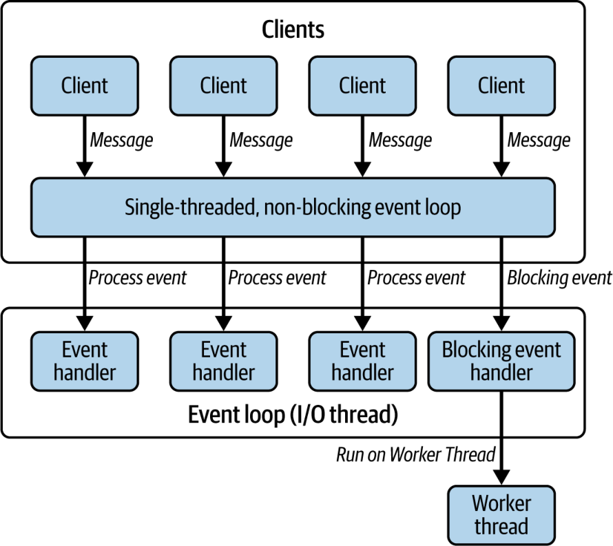
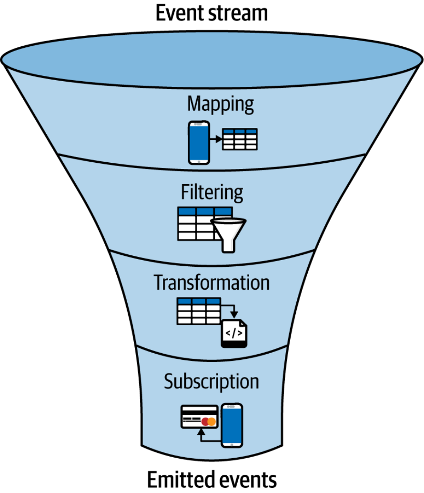

# Chương 6. Sự phù hợp của Reactive Java trong bối cảnh Virtual Thread

*Tôi nghĩ Loom sẽ khai tử lập trình reactive.... Lập trình reactive chỉ là một công nghệ chuyển tiếp.*

—Brian Goetz

Dù tôi sẽ không bình luận về câu trích dẫn trên—ít nhất là chưa phải lúc này—chương này sẽ giới thiệu một giải pháp thay thế đã tồn tại từ lâu và được nhiều lập trình viên ưa chuộng: Reactive Java.

Trong vài chương vừa qua, chúng ta đã khám phá virtual thread (luồng ảo) rất chi tiết, hiểu cách chúng hoạt động, những ưu điểm của chúng, cũng như vai trò của chúng trong việc giúp concurrency trong Java trở nên dễ tiếp cận hơn. Chúng ta đã nhận ra rằng virtual thread là một cải tiến tuyệt vời trong bức tranh concurrency. Chúng cho phép lập trình viên viết các ứng dụng có mức độ concurrency cao bằng mô hình lập trình mệnh lệnh (imperative) quen thuộc, đồng thời xử lý hiệu quả các thao tác blocking.

Tuy nhiên, virtual thread không phải là giải pháp duy nhất để xử lý hiệu quả concurrency và blocking I/O. Trước khi virtual thread bước ra ánh đèn sân khấu, nhiều lập trình viên đã tìm đến lập trình reactive để xây dựng các ứng dụng non-blocking có khả năng mở rộng. Cách tiếp cận này, thường gắn liền với Project Reactor, RxJava, Eclipse Vert.x, v.v., đi theo một mô hình hoàn toàn khác—một mô hình event-driven, thiên về lập trình hàm (functional) và bất đồng bộ về bản chất.

Trong chương này, chúng ta sẽ khám phá Reactive Java, xem xét mô hình thực thi, phong cách lập trình, mức độ dễ sử dụng và đường cong học tập, những thách thức, lợi ích, v.v. của nó.

Hãy bắt đầu nào.

## Tìm hiểu lập trình reactive trong Java

*Lập trình reactive* (reactive programming) là một mô hình khai báo (declarative) xoay quanh các stream dữ liệu bất đồng bộ và sự lan truyền thay đổi một cách tự động.

Thay vì tập trung vào việc thực thi từng bước các chỉ thị, lập trình viên định nghĩa mối quan hệ giữa các stream này và cách chúng biến đổi dữ liệu. Những stream này có thể đại diện cho bất cứ thứ gì thay đổi theo thời gian, chẳng hạn như thao tác nhập của người dùng, số đọc từ cảm biến, hay dữ liệu từ các hệ thống bên ngoài. Khi một giá trị trong stream thay đổi, reactive framework sẽ tự động lan truyền thay đổi đó xuống phía hạ nguồn (downstream), cập nhật mọi thành phần phụ thuộc. Điều này cho phép xử lý hiệu quả các sự kiện bất đồng bộ và đơn giản hóa việc phát triển các ứng dụng event-driven phức tạp. Lập trình viên có thể tạo ra những hệ thống dễ bảo trì và có khả năng mở rộng tốt hơn bằng cách diễn đạt *điều gì* nên xảy ra—những phép biến đổi dữ liệu và phản ứng nào—thay vì *làm thế nào* để thực thi chúng. Các thư viện và framework lập trình reactive phổ biến bao gồm RxJava, Reactor và Akka Streams; chúng cung cấp các công cụ để tạo và thao tác trên những stream dữ liệu này.

Trong hệ sinh thái Java, lập trình reactive thường gắn với *các thao tác non-blocking, bất đồng bộ* và *kiến trúc event-driven*.

> **TỔNG QUAN VỀ CÁC HỆ THỐNG REACTIVE**
>
> Năm 2013, [Reactive Manifesto](https://oreil.ly/Cb14t) (Tuyên ngôn Reactive) ra đời để định nghĩa thế nào là reactive; nó đưa ra một định nghĩa về hệ thống reactive và hướng tới việc chuẩn hóa ý nghĩa của từ *reactive*.
>
> Tuyên ngôn này xác định bốn nguyên tắc then chốt:
>
> *Responsive (Đáp ứng nhanh)*
>
> Hệ thống reactive luôn duy trì thời gian phản hồi nhanh, tăng cường sự tin tưởng của người dùng và đơn giản hóa việc xử lý lỗi.
>
> *Resilient (Kiên cường)*
>
> Chúng duy trì khả năng đáp ứng bất chấp sự cố bằng cách cô lập vấn đề, ủy quyền việc khôi phục và sử dụng nhân bản (replication) để đạt tính sẵn sàng cao.
>
> *Elastic (Co giãn)*
>
> Chúng thích ứng linh hoạt với khối lượng công việc thay đổi, mở rộng hoặc thu hẹp tài nguyên một cách hiệu quả để duy trì hiệu năng.
>
> *Message-Driven (Hướng thông điệp)*
>
> Chúng sử dụng truyền thông điệp bất đồng bộ để đạt được sự liên kết lỏng lẻo (loose coupling), sự cô lập và sử dụng tài nguyên hiệu quả, qua đó tạo nên khả năng kiên cường và co giãn.
>
> Về bản chất, điều này quy về ba khía cạnh then chốt trong triển khai kỹ thuật: non-blocking, event-driven và bất đồng bộ.
>
Hãy lần lượt phân tích từng khái niệm này.

### Blocking so với Non-blocking I/O

Trong các chương trước, chúng ta đã học được rất nhiều về các thao tác blocking. Nói đơn giản, khi một thao tác I/O xảy ra, thread gọi sẽ chờ cho đến khi thao tác đó hoàn tất. Trong thời gian này, thread ở trạng thái rảnh rỗi, về cơ bản là bị "chặn" (blocked), cho đến khi nó nhận được dữ liệu cần thiết. Đây là điều chúng ta gọi là thao tác blocking.

Cách tiếp cận thay thế là non-blocking I/O. Trong mô hình này, các thread không bị giữ lại bởi các thao tác I/O. Thay vì chờ đợi, một thread có thể tiếp tục thực thi các tác vụ khác trong khi I/O diễn ra ở chế độ nền.

Vậy điều này hoạt động như thế nào? Trong một hệ thống non-blocking, hệ điều hành đảm nhận trách nhiệm xử lý I/O. Khi thao tác hoàn tất, OS sẽ thông báo cho ứng dụng, thường là bằng cách gọi một hàm callback. Bằng cách này, thread đã khởi tạo yêu cầu không phải ngồi không; nó chỉ đơn giản được thông báo khi dữ liệu đã sẵn sàng.

Để làm ý tưởng này cụ thể hơn, hãy cùng đi qua một ví dụ. Hãy tưởng tượng việc xây dựng một máy chủ HTTP cần xử lý request pipelining (gửi nối tiếp nhiều request trên cùng một kết nối), một tính năng quan trọng trong HTTP/1.1 cho phép client gửi nhiều request mà không cần chờ response. Máy chủ cần:

- Chấp nhận kết nối từ nhiều client

- Xử lý các HTTP request với độ phức tạp khác nhau (thao tác nhanh so với thao tác chậm)

- Duy trì trạng thái kết nối cho các phiên keep-alive

- Xử lý request pipelining một cách đúng đắn

- Mở rộng để xử lý hàng trăm hoặc hàng nghìn kết nối đồng thời

Chỉ có vậy thôi. Bây giờ, hãy khám phá cách chúng ta có thể triển khai một máy chủ như vậy bằng cả hai cách tiếp cận blocking và non-blocking để thấy sự khác biệt trong thực tế.

Chúng ta bắt đầu với một máy chủ blocking đơn luồng (single-threaded):

```java
public class BlockingHttpServer {
  private static final int PORT = 8080;
  private static final AtomicInteger requestCounter = new AtomicInteger(0);

  public static void main(String[] args) throws IOException {
    System.out.println("Blocking HTTP Server starting on port " + PORT);
    System.out.println("Features: Single-threaded, Request pipelining");
    try (ServerSocket serverSocket = new ServerSocket(PORT)) {
      serverSocket.setReuseAddress(true);  ①
      while (true) {
        Socket clientSocket = serverSocket.accept();  ②
        handleConnection(clientSocket);
      }
    }
  }

  private static void handleConnection(Socket socket) {
    System.out.println("New connection from: " +
                      socket.getRemoteSocketAddress());
    try (socket;
         BufferedReader in = new BufferedReader(
             new InputStreamReader(socket.getInputStream()));
         PrintWriter out = new PrintWriter(
             socket.getOutputStream(), true)) {
      socket.setSoTimeout(5000);  ③
      boolean keepAlive = true;
      while (keepAlive) {
        HttpRequest request = parseRequest(in);  ④
        if (request == null) {
          break; // Connection closed
        }
        int requestId = requestCounter.incrementAndGet();
        System.out.println("Request #" + requestId + ": " +
                          request.method + " " + request.path);
        // Check for keep-alive
        keepAlive = "keep-alive".equalsIgnoreCase(
            request.getHeader("Connection"));
        // Process request - this may take time!  ⑤
        processRequest(request);
        // Send response
        sendResponse(out, request, requestId, keepAlive);
      }
    } catch (SocketTimeoutException e) {
      System.out.println("Connection timeout");
    } catch (IOException e) {
      System.err.println("Connection error: " + e.getMessage());
    }
  }
}
```

Hãy xem xét các điểm then chốt trong đoạn mã này:

① Chúng ta bật tính năng tái sử dụng địa chỉ để tránh lỗi "Address already in use" trong quá trình phát triển.

② Phương thức `accept()` block cho đến khi có một client kết nối. Đây là nơi thread duy nhất của chúng ta bị kẹt lại chờ các kết nối mới.

③ Chúng ta đặt socket timeout là năm giây để phát hiện các kết nối chết và ngăn máy chủ bị treo vô thời hạn.

④ Phương thức `parseRequest()` block cho đến khi một HTTP request hoàn chỉnh đến nơi. Trong khi chờ request của một client, máy chủ không thể chấp nhận kết nối mới.

⑤ Đây là một hạn chế nghiêm trọng: nếu `processRequest()` mất nhiều thời gian (chẳng hạn khi gặp một truy vấn cơ sở dữ liệu chậm), toàn bộ máy chủ sẽ bị block. Không client nào khác có thể kết nối hoặc được phục vụ.

Máy chủ cần một số phương thức hỗ trợ để xử lý giao tiếp HTTP:

```java
private static void sendResponse(PrintWriter out,
                                 HttpRequest request,
                                 int requestId,
                                 boolean keepAlive) {
  // Send HTTP response
  out.println("HTTP/1.1 200 OK");
  out.println("Content-Type: text/plain");
  out.println("Connection: " + (keepAlive ? "keep-alive" : "close"));
  String body = String.format(
      "Request #%d processed\nPath: %s\nTime: %s\n",
      requestId, request.path, Instant.now());
  out.println("Content-Length: " + body.length());
  out.println(); // Empty line between headers and body
  out.print(body);
  out.flush();  ①
}
```

① Đảm bảo HTTP response được gửi đi ngay lập tức bằng cách ép mọi dữ liệu đang nằm trong buffer được gửi tới client, tránh độ trễ trong việc truyền response.

Để minh họa rõ hành vi blocking, chúng ta sẽ mô phỏng các thời gian xử lý khác nhau:

```java
static void processRequest(HttpRequest request)
      throws IOException {
    try {
      if (request.path.startsWith("/slow")) {
        Thread.sleep(Duration.of(30, ChronoUnit.SECONDS));  ①
        System.out.println("  Slow request processed");
      } else if (request.path.startsWith("/medium")) {
        Thread.sleep(Duration.of(500, ChronoUnit.MILLIS));
        System.out.println("  Medium request processed");
      } else {
        Thread.sleep(Duration.of(100, ChronoUnit.MILLIS));
        System.out.println("  Fast request processed");
      }
    } catch (InterruptedException e) {
      Thread.currentThread().interrupt();
    }
  }
```

① Một request chậm sẽ block toàn bộ máy chủ trong 30 giây. Trong thời gian này, không kết nối mới nào được chấp nhận và không request nào khác được xử lý. Đoạn này được thêm vào để mô phỏng sự chậm chạp của lời gọi API.

Lớp `HttpRequest` đơn giản của chúng ta nắm giữ các thành phần thiết yếu cần cho việc xử lý:

```java
static class HttpRequest {
  String method;
  String path;
  String version;
  Map<String, String> headers = new HashMap<>();
  String remainingBuffer; // For non-blocking server
  String getHeader(String name) {
    return headers.get(name.toLowerCase());
  }
}
```

Và đây là phương thức hỗ trợ dùng để phân tích (parse) request.

```java
static HttpRequest parseRequest(BufferedReader in)
      throws IOException {
    // Read request line
    String requestLine = in.readLine(); //
    if (requestLine == null || requestLine.isEmpty()) {
      return null;
    }
    String[] parts = requestLine.split(" ");
    if (parts.length != 3) {
      throw new IOException("Invalid request line");
    }
    HttpRequest request = new HttpRequest();
    request.method = parts[0];
    request.path = parts[1];
    request.version = parts[2];
    // Read headers
    String headerLine;
    while ((headerLine = in.readLine()) != null) { //
      if (headerLine.isEmpty()) {
        break; // End of headers
      }
      int colonPos = headerLine.indexOf(’:’);
      if (colonPos > 0) {
        String name = headerLine.substring(0, colonPos).trim();
        String value = headerLine.substring(colonPos + 1).trim();
        request.headers.put(name.toLowerCase(), value);
      }
    }
    return request;
  }
```

Trong triển khai này, chúng ta đã tạo một [`ServerSocket`](https://oreil.ly/pqjiz) lắng nghe trên cổng `8080`. Một [`Socket`](https://oreil.ly/uEj8h) đại diện cho một đầu mút (endpoint) trong liên kết giao tiếp hai chiều giữa các chương trình chạy trên mạng. Ngược lại, một `ServerSocket` liên tục lắng nghe các kết nối đến và xử lý request của client tương ứng.

Trong trường hợp của chúng ta, nó hoạt động như sau:

- Máy chủ chờ một client kết nối.

- Khi kết nối được thiết lập, máy chủ chuyển giao nó cho phương thức `handleConnection()`, phương thức này đảm nhận việc tương tác.

- Phương thức này xử lý các HTTP request, đảm nhiệm các kết nối keep-alive và request pipelining. Những chi tiết cụ thể của việc xử lý HTTP cho thấy blocking I/O ảnh hưởng đến hiệu năng máy chủ như thế nào.

Tuy nhiên, có một vấn đề. Khi máy chủ xử lý một client, thread gọi bị block cho đến khi client ngắt kết nối. Nếu client ngừng gửi dữ liệu nhưng vẫn duy trì kết nối, máy chủ sẽ bị kẹt lại, chờ dữ liệu đầu vào. Vì đây là máy chủ đơn luồng, không client nào khác có thể kết nối cho đến khi phiên hiện tại kết thúc.

Để kiểm thử máy chủ này và quan sát hành vi blocking của nó, chúng ta có thể dùng curl. Hãy chạy một vài thử nghiệm:

**Terminal 1: Khởi động máy chủ**

```bash
$ java BlockingHttpServer.java
Single-threaded HTTP Server with Pipelining starting on port 8080
Features: Request pipelining, Keep-alive connections
```

Máy chủ hiện đang chạy và chờ kết nối. Hãy gửi một request đơn giản:

**Terminal 2: Gửi một request nhanh đơn lẻ**

```bash
$ curl -v http://localhost:8080/fast
* Host localhost:8080 was resolved.
* IPv6: ::1
* IPv4: 127.0.0.1
*   Trying [::1]:8080...
* Connected to localhost (::1) port 8080
> GET /fast HTTP/1.1
> Host: localhost:8080
> User-Agent: curl/8.7.1
> Accept: */*
>
* Request completely sent off
< HTTP/1.1 200 OK
< Content-Type: text/plain
< Connection: close
< Content-Length: 67
<
Request #1 processed
Path: /fast
Time: 2025-06-14T09:27:02.235713Z
* Closing connection
```

Request nhanh này hoàn tất ngay lập tức. Máy chủ xử lý nó và đóng kết nối. Bây giờ hãy minh họa vấn đề blocking:

**Terminal 3: Kiểm tra hành vi blocking—trước tiên gửi một request chậm**

```bash
$ curl -v http://localhost:8080/slow
* Host localhost:8080 was resolved.
* IPv6: ::1
* IPv4: 127.0.0.1
*   Trying [::1]:8080...
* Connected to localhost (::1) port 8080
> GET /slow HTTP/1.1
> Host: localhost:8080
> User-Agent: curl/8.7.1
> Accept: */*
>
* Request completely sent off
< HTTP/1.1 200 OK
< Content-Type: text/plain
< Connection: close
< Content-Length: 67
<
Request #2 processed
Path: /slow
Time: 2025-06-14T09:28:16.218432Z
* Closing connection
```

Trong khi request chậm này đang được xử lý, hãy thử kết nối bằng một client khác:

**Terminal 4: Trong khi request chậm đang được xử lý, thử một request nhanh**

```bash
$ curl -v --max-time 5 http://localhost:8080/fast
* Host localhost:8080 was resolved.
* IPv6: ::1
* IPv4: 127.0.0.1
*   Trying [::1]:8080...
* Connected to localhost (::1) port 8080
> GET /fast HTTP/1.1
> Host: localhost:8080
> User-Agent: curl/8.7.1
> Accept: */*
>
* Request completely sent off
* Operation timed out after 5006 milliseconds with 0 bytes received
* Closing connection
curl: (28) Operation timed out after 5006 milliseconds with 0 bytes received
```

Hãy chú ý cách client thứ hai thiết lập thành công một kết nối TCP (OS đảm nhận việc này), nhưng máy chủ không chấp nhận nó vì vẫn đang bị block trong lúc xử lý request chậm. Đây là hạn chế cơ bản của thiết kế đơn luồng của chúng ta.

Bài kiểm tra bộc lộ rõ nhất là dùng tính năng đo thời gian của curl để đo lường hiệu ứng blocking:

```bash
# Send three pipelined requests: fast, slow, fast

  $ time curl -s -Z http://localhost:8080/fast \
              http://localhost:8080/slow \
              http://localhost:8080/fast
  Request #11 processed
  Path: /fast
  Time: 2025-06-14T09:34:49.986347Z
  Request #12 processed
  Path: /slow
  Time: 2025-06-14T09:35:19.989656Z
  Request #13 processed
  Path: /fast
  Time: 2025-06-14T09:35:20.094539Z
  curl -s -Z http://localhost:8080/fast http://localhost:8080/slow   0.01s user
  0.01s system 0% cpu 47.811 total
```

Mặc dù hai trong ba request là nhanh, tổng thời gian vẫn vượt quá 30 giây vì tất cả request phải được xử lý tuần tự. Request chậm ở giữa block tất cả.

Nếu bạn cố gắng kết nối tới máy chủ từ một client khác trong khi một phiên client hiện có đang hoạt động, bạn sẽ nhận thấy kết nối bị block. Máy chủ chỉ có thể xử lý một client tại một thời điểm. Đó là vì triển khai của chúng ta là đơn luồng—nó chờ client hiện tại ngắt kết nối rồi mới chấp nhận client mới.

Một giải pháp dễ dàng cho vấn đề này là đa luồng (multithreading). Bằng cách tạo một thread mới cho mỗi client, chúng ta cho phép nhiều kết nối được xử lý đồng thời. Hãy sửa mã của chúng ta để bổ sung hỗ trợ đa luồng:

```java
public class MultithreadedHttpServer {
  private static final int PORT = 8080;
  private static final AtomicInteger requestCounter = new AtomicInteger(0);
  private static final int CONNECTION_THREADS = 10;

  public static void main(String[] args) throws IOException {
    System.out.println("Multi-threaded HTTP Server starting on port " + PORT
    System.out.println("Features: Concurrent connections, Request pipelining
    System.out.println("Connection pool size: " + CONNECTION_THREADS);

    try (ServerSocket serverSocket = new ServerSocket(PORT);
         ExecutorService connectionExecutor =
             Executors.newFixedThreadPool(CONNECTION_THREADS)) {  ①
      serverSocket.setReuseAddress(true);
      while (true) {
        Socket clientSocket = serverSocket.accept();  ②
        System.out.println("New connection from: " +
                          clientSocket.getRemoteSocketAddress());

        // Handle each connection in a separate thread
        connectionExecutor.submit(() -> handleConnection(clientSocket));  ③
      }
    }
  }

  private static void handleConnection(Socket socket) {
    String clientAddr = socket.getRemoteSocketAddress().toString();
    System.out.println("Thread " + Thread.currentThread().getName() +
                      " handling connection from: " + clientAddr);
    // Same request processing logic as BlockingHttpServer
    // but running in a separate thread  ④
    try (socket;
         BufferedReader in = new BufferedReader(
             new InputStreamReader(socket.getInputStream()));
         PrintWriter out = new PrintWriter(
             socket.getOutputStream(), true)) {
      socket.setSoTimeout(5000);
      boolean keepAlive = true;
      while (keepAlive) {
        HttpRequest request = parseRequest(in);
        if (request == null) break;
        int requestId = requestCounter.incrementAndGet();
        System.out.println("Thread " + Thread.currentThread().getName() +
                          " - Request #" + requestId + ": " +
                          request.method + " " + request.path);
        keepAlive = "keep-alive".equalsIgnoreCase(
            request.getHeader("Connection"));
        processRequest(request);
        sendResponse(out, request, requestId, keepAlive);
      }
    } catch (Exception e) {
      System.err.println("Connection error from " + clientAddr +
                        ": " + e.getMessage());
    }
  }
}
```

Những cải tiến chính trong phiên bản đa luồng:

① Chúng ta tạo một thread pool cố định với 10 thread để xử lý kết nối.

② Main thread có thể ngay lập tức quay lại chấp nhận các kết nối mới.

③ Mỗi kết nối chạy trong thread riêng của nó, cho phép xử lý đồng thời.

④ Từng kết nối riêng lẻ vẫn xử lý các request tuần tự (duy trì pipelining đúng đắn), nhưng nhiều kết nối có thể được phục vụ cùng lúc.

Trong triển khai đa luồng của chúng ta, chúng ta đã tạo một thread pool cố định với 10 thread, cho phép tối đa 10 client kết nối cùng lúc. Chúng ta có thể tăng số lượng thread để xử lý nhiều client hơn, nhưng trước khi virtual thread xuất hiện, cách tiếp cận này có những hạn chế cố hữu. Platform thread rất tốn kém, và việc tăng số lượng của chúng vượt quá một ngưỡng nhất định sẽ không mang lại kết quả tốt hơn, như chúng ta đã thảo luận trong [Chương 2](https://learning.oreilly.com/library/view/modern-concurrency-in/9781098165406/ch02.html#understanding_virtual_threads).

Tuy nhiên, với virtual thread, việc mở rộng trở nên đơn giản như thay đổi một dòng mã:

```java
try (ServerSocket serverSocket = new ServerSocket(PORT);
    ExecutorService executor = Executors.newVirtualThreadPerTaskExecutor();
) {}
```

Điều này sẽ cho phép máy chủ xử lý một số lượng khổng lồ kết nối đồng thời với chi phí (overhead) tối thiểu. Nhưng đó không phải là trọng tâm của chúng ta lúc này. Thay vào đó, hãy khám phá xem những giải pháp thay thế nào đã tồn tại trước virtual thread.

Một cách tiếp cận mạnh mẽ là new input/output (NIO), cho phép đạt throughput cao với số lượng thread tối thiểu.

Java NIO là một API non-blocking dựa trên tính sẵn sàng (readiness-based), được giới thiệu trong JDK 1.4, thay thế java.io hướng stream bằng các channel hướng buffer ( `SocketChannel`, `FileChannel`, v.v.) và một event loop `Selector`. Thay vì một thread block cho đến khi thao tác hoàn tất, lời gọi `read()` hoặc `write()` non-blocking trả về ngay lập tức, thường với số byte được truyền bằng không. Đồng thời, channel được đăng ký với selector. Selector ngủ bên trong `select()` cho đến khi hệ điều hành báo rằng một hoặc nhiều channel đã sẵn sàng cho I/O; thread sau đó chỉ xử lý những channel đó, cho phép hàng nghìn kết nối đồng thời được phục vụ bởi chỉ một nhúm thread. Kết hợp với các buffer trực tiếp (direct) hoặc memory-mapped, vốn cho phép truyền dữ liệu zero-copy giữa user space và kernel space, NIO mang lại throughput và scalability cao mà không phải chịu chi phí thread và stack cho mỗi kết nối như trong mô hình thread-per-socket cổ điển.

> **JAVA I/O SO VỚI NIO: SO SÁNH NHANH**
>
> Java cung cấp hai cách tiếp cận riêng biệt để xử lý I/O: package java.io truyền thống và java.nio (new input/output) hiện đại hơn. Điểm khác biệt then chốt nằm ở cách tiếp cận của chúng. Java I/O dựa trên stream và nhìn chung là blocking, nghĩa là một thread phải chờ các thao tác hoàn tất. Ngược lại, Java NIO dựa trên buffer và non-blocking, cho phép scalability cao hơn khi xử lý các lần truyền dữ liệu lớn và các ứng dụng hiệu năng cao.
>
> Chẳng hạn, hãy xem xét việc đọc một tệp bằng Java I/O:
>
> ```java
> try (BufferedReader reader
>            = new BufferedReader(
>                 new FileReader("input.txt"))) {
>     String line;
>     while ((line = reader.readLine()) != null) {
>       System.out.println(line);
>     }
>   } catch (IOException e) {
>     e.printStackTrace();
>   }
> ```
>
> [`BufferedReader`](https://oreil.ly/kMKl7) đọc văn bản từ một input stream, từng dòng một, khiến nó hiệu quả và dễ sử dụng cho việc đọc tệp tuần tự.
>
> Bây giờ, hãy đối chiếu với `FileChannel` của Java NIO:
>
> ```java
> try (FileChannel channel = FileChannel.open(
>         Path.of("input.txt"),
>         StandardOpenOption.READ)) {
>         ByteBuffer buffer = ByteBuffer.allocate(1024);
>         while (channel.read(buffer) > 0) {
>             buffer.flip();
>             while (buffer.hasRemaining()) {
>                 System.out.print((char) buffer.get());
>             }
>             buffer.clear();
>         }
>     } catch (IOException e) {
>         e.printStackTrace();
>     }
> ```
>
> Phiên bản này được điều khiển bởi buffer, nghĩa là dữ liệu trước tiên được nạp vào một `ByteBuffer`, được thao tác trong bộ nhớ, và chỉ sau đó mới được xử lý.
>
Thay vì dùng `ServerSocket`, NIO giới thiệu [`ServerSocketChannel`](https://oreil.ly/-nprM). Tương tự, `Socket` được thay thế bởi [`SocketChannel`](https://oreil.ly/OsyaE). Thay vì dựa vào [`InputStream`](https://oreil.ly/VG-g_) và [`OutputStream`](https://oreil.ly/YfUM5), NIO dùng [buffer](https://oreil.ly/WdXHC). Một buffer đóng vai trò như một vùng lưu trữ tạm thời, giữ một lượng dữ liệu cố định trước khi dữ liệu đó được gửi đến đích. Sự thay đổi trong thiết kế này mang lại sự linh hoạt và hiệu quả cao hơn khi xử lý các thao tác I/O.

> **LƯU Ý**
>
> Buffer trong Java NIO cải thiện hiệu năng bằng cách giảm thiểu các tương tác trực tiếp với hệ điều hành và cho phép truyền dữ liệu hiệu quả. Không giống I/O truyền thống vốn đọc và ghi dữ liệu từng byte một, buffer cho phép xử lý theo batch, giúp giảm số lượng system call (lời gọi hệ thống). Điều này đặc biệt hữu ích trong các ứng dụng hiệu năng cao như máy chủ mạng và xử lý tệp.
>
> Một trong những yếu tố tăng hiệu quả then chốt là cơ chế zero-copy, trong đó [`ByteBuffer`](https://oreil.ly/zr3wz) có thể làm việc với các tệp memory-mapped hoặc direct buffer (bộ nhớ off-heap). Điều này loại bỏ việc sao chép dữ liệu không cần thiết giữa user space và kernel space, tăng tốc đáng kể việc truyền các tệp lớn. Ngoài ra, non-blocking I/O kết hợp với buffer cho phép xây dựng các ứng dụng event-driven có khả năng mở rộng bằng cách để một thread duy nhất quản lý hiệu quả nhiều kết nối.
>
Một thành phần quan trọng khác trong NIO là [`Selector`](https://oreil.ly/QjWUJ), đóng vai trò thiết yếu trong việc quản lý nhiều channel, chẳng hạn `ServerSocketChannel` và `SocketChannel`, chỉ với một thread duy nhất. Hãy hình dung nó như một người điều khiển giao thông thông minh, lắng nghe các sự kiện I/O khác nhau và điều hướng các thao tác tương ứng. Chẳng hạn, khi một kết nối client mới sẵn sàng được chấp nhận, selector phát tín hiệu một [sự kiện `OP_ACCEPT`](https://oreil.ly/zDSSz). Khi có dữ liệu sẵn sàng để đọc từ một `SocketChannel`, nó kích hoạt một [sự kiện `OP_READ`](https://oreil.ly/pyHhL). Tương tự, khi một channel sẵn sàng nhận dữ liệu gửi đi, [sự kiện `OP_WRITE`](https://oreil.ly/L1SPh) được phát ra, và ở chế độ client, một nỗ lực kết nối thành công dẫn đến một [sự kiện `OP_CONNECT`](https://oreil.ly/1NnVA).

Hiện thực bên dưới của selector phụ thuộc vào hệ thống. Ví dụ, trên macOS, [`KQueueSelectorImpl`](https://oreil.ly/XmP4Y) tận dụng system call [`queue`](https://oreil.ly/xI-UN). Một hiện thực đa dụng hơn, [`PollSelectorImpl`](https://oreil.ly/N72Qw), dựa trên system call `poll`. Cơ chế cụ thể thay đổi tùy theo hệ điều hành, nhưng khái niệm vẫn không đổi: quản lý hiệu quả nhiều channel với chi phí thread tối thiểu.

Hãy xem xét một đoạn mã để thấy các thành phần này phối hợp với nhau trong thực tế như thế nào:

```java
public class NonBlockingHttpServer {
    private static final int PORT = 8080;
    private static final AtomicInteger requestCounter = new AtomicInteger(0
    private final ConcurrentLinkedQueue<PendingUpdate> pendingUpdates
                                          = new ConcurrentLinkedQueue<>();
    public static void main(String[] args) {
        System.out.println("Starting non-blocking NIO server...");
        System.out.println("Features: Single-threaded event loop, " +
                          "Non-blocking I/O, High concurrency");
        try {
            new NonBlockingHttpServer().start();
        } catch (IOException e) {
            System.err.println("Server failed to start: " + e.getMessage())
        }
    }

    private void start() throws IOException {
        try (Selector selector = Selector.open();
             ServerSocketChannel serverChannel = ServerSocketChannel.open()
            serverChannel.bind(new InetSocketAddress(PORT));
            serverChannel.configureBlocking(false);  ①
            serverChannel.register(selector, SelectionKey.OP_ACCEPT);
            System.out.println("Non-blocking HTTP server on port " + PORT);
            // Single-threaded event loop  ②
            while (true) {
                // Process pending updates from async threads
                processPendingUpdates();  ③

                selector.select(100);  ④
                Set<SelectionKey> selectedKeys = selector.selectedKeys();
                Iterator<SelectionKey> iterator = selectedKeys.iterator();
                while (iterator.hasNext()) {
                    SelectionKey key = iterator.next();
                    iterator.remove();
                    try {
                        if (key.isAcceptable()) {
                            handleAccept(key, selector);  ⑤
                        } else if (key.isReadable()) {
                            handleRead(key);  ⑥
                        } else if (key.isWritable()) {
                            handleWrite(key);  ⑦
                        }
                    } catch (IOException e) {
                        System.err.println("Error handling key: "
                                                    + e.getMessage());
                        key.cancel();
                        if (key.channel() != null) {
                            key.channel().close();
                        }
                    }
                }
                // Process any pending requests
                processAllPendingRequests(selector);
            }
        }
    }
}
```

Những cải tiến chính trong phiên bản non-blocking:

① Chúng ta cấu hình server channel ở chế độ non-blocking, điều thiết yếu để NIO hoạt động.

② Một thread duy nhất xử lý mọi sự kiện I/O thông qua một event loop.

③ Trước khi xử lý các sự kiện, chúng ta xử lý mọi cập nhật selector đã được các thread bất đồng bộ đưa vào hàng đợi. Bước quan trọng này ngăn ngừa các race condition có thể làm sập máy chủ.

④ `selector` dùng một timeout (100ms) thay vì block vô thời hạn. Điều này đảm bảo các cập nhật đang chờ từ các thread bất đồng bộ được xử lý kịp thời, ngay cả khi không có sự kiện I/O nào xảy ra.

⑤ Các kết nối mới được chấp nhận mà không block thread.

⑥ Việc đọc dữ liệu là non-blocking; các lần đọc một phần (partial read) được xử lý êm thấm.

⑦ Việc ghi dữ liệu là non-blocking; các lần ghi một phần được đưa vào hàng đợi để hoàn tất sau.

Trong đoạn mã trên, chúng ta bắt đầu bằng cách tạo một `Selector` bằng `Selector.open()`. Thay vì dùng constructor truyền thống, nó cung cấp một phương thức factory tĩnh, vốn là cách tiếp cận được ưa chuộng. `Selector` này là cốt lõi của máy chủ, cho phép nó quản lý hiệu quả nhiều kết nối client chỉ với một thread duy nhất.

Tiếp theo, chúng ta tạo một `ServerSocketChannel` và gắn (bind) nó vào một địa chỉ cụ thể. Điều quan trọng là phải cấu hình channel ở chế độ non-blocking bằng `serverSocketChannel.configureBlocking(false)`. Nếu không, máy chủ sẽ block ở mọi thao tác, làm mất đi ý nghĩa của việc dùng NIO.

Khi `ServerSocketChannel` đã được thiết lập, chúng ta đăng ký nó với `Selector`, chỉ định rằng chúng ta quan tâm đến các sự kiện `accept`. Điều này có nghĩa là máy chủ sẽ được thông báo khi một client mới cố gắng kết nối.

Chúng ta cũng đã tạo tất cả các handler ở đây. Những lớp này chịu trách nhiệm cho từng sự kiện, và chúng ta chỉ đơn giản tách chúng ra.

Bên trong vòng lặp chính, trước tiên chúng ta gọi `processPendingUpdates()`, phương thức này xử lý một thách thức đồng bộ hóa quan trọng. Vì các đối tượng `SelectionKey` không thread-safe, chúng ta không thể sửa đổi chúng trực tiếp từ các thread xử lý bất đồng bộ. Thay vào đó, chúng ta dùng một queue thread-safe để giao tiếp giữa các thread:

```java
private void processPendingUpdates() {
    PendingUpdate update;
    while ((update = pendingUpdates.poll()) != null) {
        try {
            if (update.key.isValid()) {
                update.key.interestOps(update.key.interestOps()
                          | SelectionKey.OP_WRITE);
            }
        } catch (Exception e) {
            System.err.println("Error updating key: " + e.getMessage());
        }
    }
}

static class PendingUpdate {
    final SelectionKey key;

    PendingUpdate(SelectionKey key) {
        this.key = key;
    }
}
```

Sau khi xử lý các cập nhật, chúng ta gọi `selector.select(100)`, lời gọi này block tối đa 100 mili giây. Timeout này rất quan trọng: không có nó, selector có thể block vô thời hạn, ngăn cản việc xử lý kịp thời các cập nhật từ các thread bất đồng bộ. Ngay khi một sự kiện được phát hiện hoặc timeout hết hạn, `select()` trả về, cho phép máy chủ xử lý các sự kiện hoặc các cập nhật đang chờ tương ứng.

Khi một sự kiện được phát hiện, chúng ta lấy các selection key từ selector. Mỗi key đại diện cho một sự kiện cụ thể của một channel đã đăng ký. Vì nhiều sự kiện có thể xảy ra, máy chủ xử lý chúng tuần tự trong một vòng lặp. Sau khi xử lý một key, nó được xóa khỏi tập hợp để tránh xử lý lại.

Khi `key.isAcceptable()` trả về `true`, điều đó cho biết một client mới đang cố gắng kết nối. Lúc này, chúng ta gọi phương thức `handleAccept(key, selector)` để xử lý sự kiện accept.

Bây giờ hãy xem mã của accept handler:

```java
private void handleAccept(SelectionKey key, Selector selector)
        throws IOException {
    ServerSocketChannel serverChannel = (ServerSocketChannel) key.channel()
    SocketChannel clientChannel = serverChannel.accept();  ①

    if (clientChannel != null) {
        clientChannel.configureBlocking(false);
        clientChannel.register(selector, SelectionKey.OP_READ,
                              new ClientState());  ②

        System.out.println("Accepted connection from: " +
                          clientChannel.getRemoteAddress());
    }
}

static class ClientState {
    ByteBuffer readBuffer = ByteBuffer.allocate(8192);
    StringBuilder requestBuilder = new StringBuilder();
    ConcurrentLinkedQueue<String> responseQueue =
                                        new ConcurrentLinkedQueue<>();  ③
    Queue<HttpRequest> pendingRequests = new LinkedList<>();
    boolean keepAlive = true;
    boolean isProcessing = false;  ④
}
```

Accept handler quản lý các kết nối client mới:

① Lời gọi `accept()` là non-blocking và có thể trả về `null` nếu không có kết nối nào sẵn sàng.

② Mỗi client nhận một đối tượng `ClientState` để theo dõi trạng thái kết nối và dữ liệu nhận được một phần của nó.

③ Response queue dùng `ConcurrentLinkedQueue` thay vì `LinkedList` thông thường. Điều này rất quan trọng vì các response sẽ được thêm vào từ các thread xử lý bất đồng bộ, và chúng ta cần các thao tác thread-safe mà không phải đồng bộ hóa tường minh.

④ Cờ `isProcessing` ngăn việc xử lý trùng lặp các request từ cùng một client, tránh race condition khi nhiều sự kiện được kích hoạt liên tiếp trong thời gian ngắn.

Trong phương thức xử lý, trước tiên chúng ta nắm lấy `ServerSocketChannel`. Trong trường hợp này, chúng ta có thể chắc chắn rằng `key.channel()` sẽ trả về một `ServerSocketChannel`, đó là lý do chúng ta có thể ép kiểu (cast) nó một cách an toàn mà không lo về `ClassCastException`. Kết nối được chấp nhận bằng `serverChannel.accept()`, và như mọi khi, chúng ta cấu hình nó ở chế độ non-blocking.

Khi kết nối được thiết lập, chúng ta tạo một đối tượng `ClientState` cho client và đăng ký channel của client với `Selector` cho các thao tác đọc bằng `SelectionKey.OP_READ`. Để mọi thứ dễ quản lý hơn, `ClientState` được gắn vào `SelectionKey` dưới dạng attachment, cho phép chúng ta lấy lại nó sau này khi cần.

Lớp `ClientState` đóng vai trò quan trọng trong việc quản lý trạng thái của từng client đã kết nối. Nó giữ `SocketChannel` của client, các buffer để đọc và ghi dữ liệu ( `readBuffer` và `responseQueue`), và duy trì một `StringBuilder` ( `requestBuilder`) để tích lũy dữ liệu HTTP request đến. Việc quản lý trạng thái theo từng client một cách có cấu trúc này là thiết yếu để xử lý nhiều client hiệu quả, đảm bảo mỗi kết nối duy trì ngữ cảnh riêng mà không can thiệp vào các kết nối khác.

Khi `key.isReadable()` là true, điều đó có nghĩa là một client đã gửi dữ liệu. Trong trường hợp này, chúng ta gọi phương thức `handleRead(key)`.

Hãy xem chúng ta có gì trong read handler:

```java
private void handleRead(SelectionKey key) throws IOException {
    SocketChannel channel = (SocketChannel) key.channel();
    ClientState state = (ClientState) key.attachment();

    int bytesRead = channel.read(state.readBuffer);  ①
    if (bytesRead == -1) {
        // Client disconnected
        channel.close();
        return;
    }

    if (bytesRead > 0) {
        state.readBuffer.flip();
        byte[] data = new byte[state.readBuffer.remaining()];
        state.readBuffer.get(data);
        state.requestBuilder.append(new String(data, StandardCharsets.UTF_8
        state.readBuffer.clear();

        // Process complete requests
        processCompleteRequests(state, key);  ②
    }
}

private void processCompleteRequests(ClientState state, SelectionKey key) {
    String buffer = state.requestBuilder.toString();
    while (true) {
        HttpRequest request = parseHttpRequest(buffer);  ③
        if (request == null) {
            break; // No complete request found
        }
        state.pendingRequests.offer(request);
        buffer = request.remainingBuffer;
        // Check keep-alive based on HTTP version and headers
        String connection = request.getHeader("Connection");
        if (request.version.equals("HTTP/1.0")) {
            // HTTP/1.0 defaults to close unless keep-alive is explicit
            state.keepAlive = "keep-alive".equalsIgnoreCase(connection);
        } else {
            // HTTP/1.1 defaults to keep-alive unless close is explicit
            state.keepAlive = !"close".equalsIgnoreCase(connection);
        }
    }
    state.requestBuilder = new StringBuilder(buffer);
    if (!state.responseQueue.isEmpty()) {
        key.interestOps(key.interestOps() | SelectionKey.OP_WRITE);  ④
    }
}
```

Read handler xử lý dữ liệu đến với một số đặc điểm quan trọng:

① Việc đọc là non-blocking và có thể trả về dữ liệu một phần.

② Chúng ta xử lý các HTTP request hoàn chỉnh ngay khi chúng đến, và xử lý êm thấm các request chưa hoàn chỉnh.

③ Logic keep-alive giờ đây xử lý đúng cả hai giao thức HTTP/1.0 và HTTP/1.1. HTTP/1.0 mặc định đóng kết nối trừ khi client yêu cầu keep-alive một cách tường minh, trong khi HTTP/1.1 mặc định giữ kết nối mở trừ khi client yêu cầu đóng. Sự phân biệt này rất quan trọng để tương thích với các công cụ như Apache Bench.

④ Chúng ta chỉ đăng ký quan tâm đến các sự kiện ghi khi có dữ liệu cần gửi.

Handler đọc dữ liệu từ channel của client và đưa vào `readBuffer`. Khi các byte được nhận, chúng được giải mã thành ký tự bằng UTF-8 và nối vào `requestBuilder`. Hệ thống xử lý các HTTP request bằng cách tìm dấu kết thúc request HTTP chuẩn `("\r\n\r\n")`. Khi phát hiện một request hoàn chỉnh, máy chủ phân tích nó và xử lý bất đồng bộ, đảm bảo event loop không bao giờ bị block.

Khi `key.isWritable()` là `true`, điều đó báo hiệu channel của client đã sẵn sàng nhận dữ liệu. Lúc này, phương thức `handleWrite(key)` tiếp quản, đảm bảo mọi response đang chờ trong queue được ghi trả lại cho client một cách hiệu quả.

Hãy xem đoạn mã:

```java
private void handleWrite(SelectionKey key) throws IOException {
    SocketChannel channel = (SocketChannel) key.channel();
    ClientState state = (ClientState) key.attachment();

    while (!state.responseQueue.isEmpty()) {
        String response = state.responseQueue.peek();
        ByteBuffer buffer
        = ByteBuffer.wrap(response.getBytes(StandardCharsets.UTF_8));

        int written = channel.write(buffer);
        if (buffer.hasRemaining()) {
            // Socket buffer is full, try again later
            break;
        }

        // Response fully written, remove from queue
        state.responseQueue.poll();
    }

    if (state.responseQueue.isEmpty()) {
        // No more data to write, stop watching for write events
        key.interestOps(key.interestOps() & ~SelectionKey.OP_WRITE);

        if (!state.keepAlive && state.pendingRequests.isEmpty()) {
            // Close connection if not keep-alive and no pending requests
            System.out.println("Closing connection: "
                         + channel.getRemoteAddress());
            channel.close();
            key.cancel();
        }
    }
}
```

Handler duyệt qua `responseQueue` của client, ghi từng HTTP response đã xếp hàng vào channel của client bằng các thao tác ghi non-blocking. Nếu buffer của socket đầy, quá trình ghi tạm dừng, chờ sự kiện `OP_WRITE` tiếp theo rồi mới tiếp tục. Khi tất cả response đã được ghi thành công và `responseQueue` trống, máy chủ gỡ bỏ mối quan tâm `OP_WRITE` khỏi `Selector` cho client đó, đảm bảo không có sự kiện ghi không cần thiết nào được kích hoạt khi không còn gì để gửi. `ConcurrentLinkedQueue` thread-safe đảm bảo rằng các response được thêm vào bởi các thread bất đồng bộ không gây ra race condition trong quá trình này.

Sau khi xử lý tất cả các key được chọn, chúng ta xử lý mọi request đang chờ đã được phân tích:

```java
private void processAllPendingRequests(Selector selector) {
    for (SelectionKey key : selector.keys()) {
        if (!key.isValid() || key.attachment() == null)
            continue;
        ClientState state = (ClientState) key.attachment();

        if (state.isProcessing || state.pendingRequests.isEmpty())
            continue;

        state.isProcessing = true;  ①
        while (!state.pendingRequests.isEmpty()) {
            HttpRequest request = state.pendingRequests.poll();
            int requestId = requestCounter.incrementAndGet();
            System.out.println("Request #" + requestId + ": "
                    + request.method + " " + request.path);
            // Simulate async processing
            CompletableFuture.runAsync(() -> {  ②
                String response;
                try {
                    // Process request (simulate the work)
                    if (request.path.equals("/slow")) {
                        Thread.sleep(2000); // Simulate slow operation
                        System.out.println("  Slow request processed");
                    } else {
                        System.out.println("  Fast request processed");
                    }
                    response = buildHttpResponse(request, requestId,
                                                 state.keepAlive);
                } catch (Exception e) {
                    System.err.println("Error processing request #" + reques
                    + ": " + e.getMessage());
                    response = buildErrorResponse(request, requestId, e);
                }
                state.responseQueue.offer(response);  ③

                // Queue the update for the selector thread
                pendingUpdates.offer(new PendingUpdate(key));  ④
                selector.wakeup();
            });
        }

        state.isProcessing = false;
    }
}
```

Sức mạnh của xử lý bất đồng bộ trở nên rõ ràng ở đây:

① Cờ xử lý đảm bảo chúng ta không bắt đầu xử lý các request của cùng một client nhiều lần nếu các sự kiện được kích hoạt liên tiếp trong thời gian ngắn.

② Các thao tác chậm được xử lý bất đồng bộ mà không block event loop.

③ Các response được thêm vào concurrent queue một cách an toàn từ thread bất đồng bộ.

④ Thay vì sửa đổi `SelectionKey` trực tiếp từ thread bất đồng bộ (điều sẽ gây ra race condition), chúng ta xếp hàng một cập nhật mà thread selector chính sẽ xử lý. Đây là một pattern quan trọng cho thread safety trong các ứng dụng NIO.

> **LƯU Ý**
>
> Một hiểu lầm phổ biến xuất phát từ tài liệu Java khi nói rằng "Selection keys are safe for use by multiple concurrent threads" (Selection key an toàn khi được dùng bởi nhiều thread đồng thời). Điều này khiến nhiều lập trình viên tin rằng họ có thể sửa đổi `interestOps` từ bất kỳ thread nào. Thực tế, câu này chỉ có nghĩa là việc đọc các thuộc tính của key sẽ không gây hỏng bộ nhớ. Nó không có nghĩa là các thao tác như `interestOps()` là atomic hay an toàn khi sửa đổi đồng thời.
>
> Sửa đổi `interestOps` của một `SelectionKey` trong khi `selector.select()` đang thực thi có thể dẫn đến:
>
> - Race condition khiến các thay đổi `interestOps` bị mất
>
> - Bỏ lỡ các sự kiện I/O
>
> - Lỗi `CancelledKeyException`
>
> - Hành vi không nhất quán, thường chỉ xuất hiện khi tải cao
>
> Luôn sửa đổi `interestOps` của `SelectionKey` từ chính thread chạy vòng lặp selector. Đây là lý do chúng ta dùng pattern queue `pendingUpdates`; nó đảm bảo mọi sửa đổi diễn ra an toàn trong thread selector.
>
Tiếp theo, chúng ta sẽ thảo luận các phương thức hỗ trợ hoàn thiện triển khai máy chủ HTTP non-blocking.

Phương thức `buildHttpResponse` xây dựng một HTTP response được định dạng đúng với các header và body:

```java
private String buildHttpResponse(HttpRequest request,
                                   int requestId, boolean keepAlive) {
    StringBuilder response = new StringBuilder();
    // Match the request’s HTTP version
    response.append(request.version).append(" 200 OK\r\n");
    // Headers
    response.append("Content-Type: text/plain\r\n");
    response.append("Server: NonBlockingHttpServer/1.0\r\n");
    response.append("Date: ").append(Instant.now()).append("\r\n");
    // Handle connection header properly
    if (request.version.equals("HTTP/1.0") && keepAlive) {
      response.append("Connection: keep-alive\r\n");

      return null;
    } else if (request.version.equals("HTTP/1.1") && !keepAlive) {
      response.append("Connection: close\r\n");
    }
    // For HTTP/1.1 with keep-alive, no Connection header needed (it’s defau
    String body = String.format(
        "Request #%d processed\nPath: %s\nMethod: %s\nTime: %s\nThread: %s\n
        requestId,
        request.path,
        request.method,
        Instant.now(),
        Thread.currentThread().getName());
    response.append("Content-Length: ").append(body.length()).append("\r\n"
    response.append("\r\n"); // Empty line between headers and body
    response.append(body);
    return response.toString();
  }
```

Một điều quan trọng cần lưu ý ở đây là response giờ đây phản hồi lại đúng phiên bản HTTP của client thay vì luôn trả về HTTP/1.1. Điều này đảm bảo tương thích với các client HTTP/1.0 như Apache Bench. Header `Connection` cũng được xử lý đúng dựa trên phiên bản giao thức và trạng thái keep-alive.

Trái tim của việc xử lý request là phân tích dữ liệu HTTP thô. Phương thức `parseHttpRequest` trích xuất các HTTP request từ byte stream, xử lý êm thấm dữ liệu chưa hoàn chỉnh:

```java
private HttpRequest parseHttpRequest(String buffer) {
    int requestEndIndex = buffer.indexOf("\r\n\r\n");
    if (requestEndIndex == -1) {
      requestEndIndex = buffer.indexOf("\n\n");
      if (requestEndIndex == -1) {
        return null; // No complete request yet
      }
    }

    String requestText = buffer.substring(0, requestEndIndex);
    String[] lines = requestText.split("\r\n|\n");
    if (lines.length == 0) return null;

    // Parse request line
    String[] requestLineParts = lines[0].split(" ");
    if (requestLineParts.length != 3) return null;
    HttpRequest request = new HttpRequest();
    request.method = requestLineParts[0];
    request.path = requestLineParts[1];
    request.version = requestLineParts[2];

    for (int i = 1; i < lines.length; i++) {
      String line = lines[i];
      int colonPos = line.indexOf(':');
      if (colonPos > 0) {
        String name = line.substring(0, colonPos).trim();
        String value = line.substring(colonPos + 1).trim();
        request.headers.put(name.toLowerCase(), value);
      }
    }

    // Store remaining buffer for next request
    request.remainingBuffer = buffer.substring(
        requestEndIndex
            + (buffer.substring(requestEndIndex)
                     .startsWith("\r\n\r\n") ? 4 : 2));
    return request;
  }
```

Khi việc xử lý request thất bại, chúng ta cần một response lỗi chuyên biệt. Phương thức `buildErrorResponse` tạo một response lỗi HTTP 500 phù hợp:

```java
private String buildErrorResponse(HttpRequest request,
                                    int requestId, Exception error) {
    StringBuilder response = new StringBuilder();
    // Match the request’s HTTP version
    response.append(request.version).append(" 500 Internal Server Error\r\n

    // Headers
    response.append("Content-Type: text/plain\r\n");
    response.append("Server: NonBlockingHttpServer/1.0\r\n");
    response.append("Date: ").append(Instant.now()).append("\r\n");
    // Always close connection on error
    response.append("Connection: close\r\n");

    // Body
    String body = String.format(
        "Request #%d failed\nPath: %s\nError: %s\nTime: %s",
        requestId,
        request.path,
        error.getMessage() != null
            ? error.getMessage()
            : error.getClass().getSimpleName(),
        Instant.now());

    response.append("Content-Length: ")
        .append(body.length()).append("\r\n")
        .append("\r\n") // Empty line between headers and body
        .append(body);

    return response.toString();
  }
```

Lớp `HttpRequest` vẫn giữ nguyên hoàn toàn như trong ví dụ trước, nên chúng ta sẽ không lặp lại ở đây. Nó chứa phương thức HTTP, đường dẫn, phiên bản, map các header, và phần buffer còn lại để xử lý các request chưa hoàn chỉnh trong máy chủ non-blocking của chúng ta.

Nếu chúng ta chạy chương trình Java lúc này, dù nó hoạt động chỉ với một thread, nó vẫn có thể xử lý nhiều kết nối cùng lúc. Đây chính là sức mạnh của NIO: nó có thể quản lý hiệu quả rất nhiều client mà không cần tạo một thread riêng cho mỗi kết nối.

Để kiểm tra scalability của nó, hãy tạo một ứng dụng đa client đơn giản có thể gửi hàng nghìn yêu cầu kết nối tới máy chủ này, đẩy nó phải xử lý một lượng lớn kết nối đồng thời và quan sát nó hoạt động thế nào dưới tải:

```java
import java.io.BufferedReader;
import java.io.IOException;
import java.io.InputStreamReader;
import java.io.PrintWriter;
import java.net.Socket;
import java.util.ArrayList;
import java.util.List;

public class PipeliningLoadTest {
  public static void main(String[] args) throws Exception {
    int numConnections = 10;
    int requestsPerConnection = 100;
    long startTime = System.currentTimeMillis();
    List<Thread> threads = new ArrayList<>();
    for (int i = 0; i < numConnections; i++) {
      Thread t = Thread.ofVirtual().start(() -> {  ①
        try {
          testPipelining(requestsPerConnection);
        } catch (Exception e) {
          e.printStackTrace();
        }
      });
      threads.add(t);
    }
    for (Thread t : threads) {
      t.join();
    }
    long elapsed = System.currentTimeMillis() - startTime;
    System.out.println("Total time: " + elapsed + "ms");
    System.out.println("Requests per second: " +
        (numConnections * requestsPerConnection * 1000.0 / elapsed));
  }

  private static void testPipelining(int numRequests)
      throws Exception {
    Socket socket = new Socket("localhost", 8080);
    PrintWriter out = new PrintWriter(
        socket.getOutputStream(), true);
    BufferedReader in = new BufferedReader(
        new InputStreamReader(socket.getInputStream()));
    for (int i = 0; i < numRequests; i++) {
      String path = (i % 10 == 0) ? "/slow" : "/fast";  ②
      out.println("GET " + path + " HTTP/1.1");
      out.println("Host: localhost");
      out.println("Connection: " +
          (i == numRequests - 1 ? "close" : "keep-alive"));  ③
      out.println();
    }
    for (int i = 0; i < numRequests; i++) {
      readResponse(in);  ④
    }
    socket.close();
  }

  static void readResponse(BufferedReader in)
      throws IOException {
    // Read status line and headers
    String line;
    int contentLength = 0;
    while ((line = in.readLine()) != null) {
      System.out.println(line);
      if (line.startsWith("Content-Length: ")) {
        contentLength = Integer.parseInt(
            line.substring("Content-Length: ".length()));
      }
      if (line.isEmpty()) {
        break; // End of headers
      }
    }
    // Read body
    char[] body = new char[contentLength];
    in.read(body);
    System.out.println(new String(body));
  }
}
```

Bài kiểm tra tải này minh họa một số khía cạnh quan trọng của HTTP pipelining và xử lý kết nối đồng thời:

① Chúng ta dùng virtual thread để tạo 10 kết nối đồng thời một cách hiệu quả. Mỗi virtual thread xử lý một kết nối với 100 request được pipeline.

② Cứ mỗi request thứ mười là một request chậm (trễ hai giây) để mô phỏng một hỗn hợp khối lượng công việc thực tế.

③ Request cuối cùng trên mỗi kết nối dùng `"Connection: close"` để kết thúc phiên keep-alive một cách đúng đắn.

④ Sau khi gửi tất cả request, chúng ta đọc tất cả response theo thứ tự—đây là bản chất của HTTP/1.1 pipelining thực thụ.

Bài kiểm tra tải khởi tạo 10 client chạy trên virtual thread, mỗi client mở một kết nối bền vững (persistent) duy nhất tới máy chủ và pipeline 100 request HTTP/1.1 qua socket đó (tổng cộng 1.000 request). Cứ mỗi request thứ mười nhắm đến đường dẫn `/slow`, tạm dừng hai giây để mô phỏng công việc nặng; chín request còn lại gọi `/fast` và trả về ngay lập tức. Sau khi gửi hết các request, mỗi client đọc các response theo thứ tự, bảo toàn ngữ nghĩa của pipeline. Khi tất cả các thread đã join, chương trình kiểm thử in ra tổng thời gian thực tế (wall-clock) và tính throughput theo số request mỗi giây. Vì chỉ có 10 socket OS đang hoạt động và selector của máy chủ xử lý các sự kiện sẵn sàng trong một thread, bài kiểm tra này gây áp lực lên concurrency của kết nối và hiệu quả pipelining thay vì số lượng socket thuần túy. Điều này khiến nó lý tưởng để làm nổi bật khả năng của NIO trong việc giữ throughput cao ngay cả khi từng request có latency khác biệt rất lớn.

### Kiến trúc hướng sự kiện (Event-Driven Architecture)

Mặc dù trò chơi đoán số đơn giản của chúng ta scale tốt và làm tròn mục đích của nó, các ứng dụng trong thế giới thực phức tạp hơn nhiều. Chúng liên quan đến nhiều thứ hơn là chỉ xử lý vài lượt đoán từ một client. Vậy, làm thế nào để chúng ta cấu trúc mã nguồn theo cách hỗ trợ được những hệ thống lớn hơn và năng động hơn?

May mắn thay, nhiều framework đã được xây dựng trên nền mô hình event-driven (hướng sự kiện), giúp việc xử lý concurrency và scalability một cách hiệu quả trở nên dễ dàng hơn. Những framework như [Netty](https://netty.io/) và [Vert.x](https://vertx.io/) là các ví dụ tiêu biểu cho cách tiếp cận này.

Nếu chúng ta viết lại trò chơi đoán số bằng Vert.x, phần triển khai sẽ trông đại loại như sau:

```java
import io.vertx.core.AbstractVerticle;
import io.vertx.core.Promise;
import io.vertx.core.Vertx;
import io.vertx.core.json.JsonObject;
import io.vertx.ext.web.Router;
import io.vertx.ext.web.RoutingContext;
import java.util.concurrent.atomic.AtomicLong;

public class VertxHttpServer extends AbstractVerticle {
  private static final int PORT = 8080;
  private final AtomicLong requestCounter = new AtomicLong(0);  ①
  private long startTime;

  @Override
  public void start(Promise<Void> startPromise) {
    startTime = System.currentTimeMillis();
    Router router = Router.router(vertx);  ②
    router.get("/fast").handler(this::handleFastRequest);
    router.get("/slow").handler(this::handleSlowRequest);
    router.get("/stats").handler(this::handleStats);
    vertx.createHttpServer()
        .requestHandler(router)
        .listen(PORT, "localhost");  ③
  }

  private void handleFastRequest(RoutingContext ctx) {
    long requestId = requestCounter.incrementAndGet();
    ctx.response()
        .putHeader("content-type", "text/plain")
        .end("Request #" + requestId + ": Fast request processed");  ④
  }

  private void handleSlowRequest(RoutingContext ctx) {
    long requestId = requestCounter.incrementAndGet();
    vertx.setTimer(2000, id -> {  ⑤
      ctx.response()
          .putHeader("content-type", "text/plain")
          .end("Request #" + requestId + ": Slow request processed");
    });
  }

  private void handleStats(RoutingContext ctx) {
    long uptimeMillis = System.currentTimeMillis() - startTime;
    JsonObject stats = new JsonObject()
            .put("totalRequests", requestCounter.get())
            .put("uptimeMillis", uptimeMillis)
            .put("currentThread", Thread.currentThread().getName())
            .put("isEventLoopThread", Vertx.currentContext()
                                .isEventLoopContext());  ⑥
    ctx.response()
        .putHeader("content-type", "application/json")
        .end(stats.encodePrettily());
  }

  public static void main(String[] args) {
    Vertx vertx = Vertx.vertx();
    vertx.deployVerticle(new VertxHttpServer());  ⑦
  }
}
```

Phần triển khai bằng Vert.x này thể hiện một số nguyên tắc then chốt của kiến trúc event-driven:

① Chúng ta dùng `AtomicLong` để đếm request một cách thread-safe, vì nhiều event loop thread có thể tăng bộ đếm này đồng thời.

② `Router` xử lý việc định tuyến HTTP theo kiểu khai báo; mỗi route được ánh xạ tới một phương thức handler.

③ Server khởi động bất đồng bộ trên event loop mà không block main thread.

④ Các request nhanh hoàn tất ngay lập tức trên event loop thread, minh họa cho non-blocking I/O.

⑤ Điểm khác biệt cốt yếu: `vertx.setTimer()` lên lịch gửi phản hồi sau hai giây mà *không* block event loop thread. Đây là chìa khóa để duy trì mức concurrency cao.

⑥ Endpoint `stats` cho biết thread nào đang xử lý request, giúp chúng ta xác minh rằng mọi request đều chạy trên các event loop thread.

⑦ Việc deploy một `verticle` sẽ khởi động server event-driven, với Vert.x tự động quản lý các event loop.

Để chạy server Vert.x này, bạn sẽ cần thêm các dependency sau vào project Maven của mình. Hãy tạo một project Maven, rồi thêm các dependency này vào và chạy nó:

```text
<dependency>
    <groupId>io.vertx</groupId>
    <artifactId>vertx-core</artifactId>
    <version>5.0.0</version>
</dependency>
<dependency>
    <groupId>io.vertx</groupId>
    <artifactId>vertx-web</artifactId>
    <version>5.0.0</version>
</dependency>
```

Điều này cho chúng ta các endpoint HTTP mà ta có thể kiểm thử bằng curl:

```bash
curl -X GET http://localhost:8080/fast
curl -X GET http://localhost:8080/slow
curl -X GET http://localhost:8080/stats
```

Hãy tập trung vào khái niệm ở mức cao thay vì đi sâu vào những chi tiết phức tạp về cách Vert.x được triển khai bên dưới. Về cốt lõi, Vert.x được xây dựng trên mẫu multicore reactor, tận dụng mô hình concurrency dựa trên event loop. Nó sử dụng một tập nhỏ gọn các event loop thread liên tục lắng nghe các sự kiện I/O thông qua những thao tác non-blocking như NIO. Bất cứ khi nào một sự kiện xảy ra, chẳng hạn một request đến, một callback ngắn, non-blocking sẽ được thực thi bên trong event loop, đảm bảo khả năng phản hồi.

Tuy nhiên, không phải tác vụ nào cũng có thể được xử lý trong event loop. Một số thao tác về bản chất là blocking hoặc chạy lâu, chẳng hạn truy vấn cơ sở dữ liệu hoặc truy cập hệ thống tệp. Vert.x khéo léo chuyển chúng sang một worker thread pool riêng để ngăn những tác vụ này làm chậm event loop. Thiết kế này đảm bảo event loop luôn rảnh để xử lý các request mới mà không bị trì hoãn không cần thiết.

Một trong những thế mạnh chính của Vert.x là [event bus](https://oreil.ly/9Fs7I) của nó, cho phép các thành phần khác nhau của ứng dụng giao tiếp bất đồng bộ. Cách tiếp cận này giữ cho hệ thống được liên kết lỏng lẻo (loosely coupled) trong khi vẫn đảm bảo sự phối hợp liền mạch giữa các phần khác nhau của ứng dụng (Hình 6-1).



*Hình 6-1. Tổng quan về event loop trong kiến trúc event-driven của Vert.x*

Trong Hình 6-1, chúng ta có cái nhìn thoáng qua về cách một framework như Vert.x vận hành với event loop ở trung tâm. Framework này chịu trách nhiệm quản lý các kết nối client, xử lý các request đi ra và ghi phản hồi—tất cả đều theo cách non-blocking. Thông thường, một reactive framework nằm phía trên lớp này, cung cấp một API ở mức cao hơn giúp đơn giản hóa các thao tác mạng. Chúng ta sẽ sớm khám phá những điều này chi tiết hơn. Thay vì làm việc trực tiếp với non-blocking I/O thô, lập trình viên làm việc với các trừu tượng trực quan, chẳng hạn HTTP request, response và các message Kafka, khiến trải nghiệm phát triển trở nên tinh gọn hơn nhiều.

Mã ứng dụng của chúng ta nằm ở lớp cao nhất. Mã của chúng ta không tương tác trực tiếp với event loop; thay vào đó, nó hoạt động thông qua các event handler. Ví dụ, trong đoạn mã trước đó, chúng ta đã tạo các handler như `handleFastRequest` và `handleSlowRequest` để xử lý những route HTTP cụ thể.

Cho đến giờ, mọi thứ có vẻ tuyệt vời. Tuy nhiên, đây là điểm mấu chốt: các event handler trong ứng dụng của bạn được thực thi bằng event loop thread—về bản chất là một I/O thread. Nếu mã của chúng ta block thread này, không sự kiện đồng thời nào khác có thể được xử lý. Kết quả là khả năng phản hồi và concurrency sụp đổ hoàn toàn, điều sẽ là thảm họa đối với một hệ thống được thiết kế để có tính reactive cao.

Hãy để ý rằng trong ví dụ Vert.x của chúng ta, handler cho request chậm dùng `vertx.setTimer()` thay vì `Thread.sleep()`. Điều này rất quan trọng—timer lên lịch cho một callback chạy sau hai giây mà không block event loop thread. Thread đó ngay lập tức được rảnh để xử lý các request khác trong lúc chờ đợi.

Giải pháp rất đơn giản: mã của bạn phải là non-blocking. Nó không bao giờ, trong bất kỳ hoàn cảnh nào, được block các I/O thread. Nếu điều đó xảy ra, toàn bộ event loop sẽ đứng khựng lại, kéo theo khả năng phản hồi của ứng dụng cũng đi xuống.

Tất nhiên là có những cách xử lý tình thế. Bạn có thể chuyển các thao tác blocking sang một worker thread pool riêng—điều mà chính Vert.x cũng làm ở mức độ nào đó. Nhưng đây không bao giờ nên là chuyện bình thường. Thực tế, việc dựa quá nhiều vào các worker thread làm mất đi ý nghĩa của một hệ thống reactive. Tại sao? Bởi vì mỗi lần bạn chuyển việc thực thi từ một I/O thread sang một worker thread rồi quay lại, bạn tạo ra các context switch. Chúng làm tăng chi phí, làm chậm thời gian phản hồi và bào mòn dần những lợi ích về hiệu quả mà bạn đặt ra để đạt được ngay từ đầu.

Vậy, làm thế nào để bạn đảm bảo mã ứng dụng của mình luôn non-blocking? Nói "hãy viết mã non-blocking" là một chuyện, nhưng như chúng ta đã thấy, nói thì dễ hơn làm. Thực tế là viết mã non-blocking thực sự không phải lúc nào cũng đơn giản; nó đòi hỏi một sự thay đổi trong tư duy.

Đó là lúc chúng ta có thể thực sự tập trung vào các reactive framework. Chúng cung cấp các API bất đồng bộ được thiết kế riêng để giúp chúng ta tránh các thao tác blocking trong khi vẫn xử lý hiệu quả những luồng công việc phức tạp. Thay vì chờ một tác vụ hoàn thành, chúng ta đăng ký các callback, sử dụng promise, hoặc tận dụng reactive streams để điều phối việc thực thi mà không bao giờ làm event loop bị đình trệ.

Nhưng chính xác thì những API bất đồng bộ này là gì, và chúng hoạt động ra sao? Hãy cùng khám phá.

### Các API bất đồng bộ (Asynchronous APIs)

Hầu hết chúng ta đều quen thuộc với các API đồng bộ (synchronous API), nhưng hãy dành một chút thời gian để xem lại khái niệm này. Xét phương thức Java đơn giản sau:

```java
public class AiService {
   public String chat(String message) {
       return "Echo: " + message.toUpperCase();
   }
}
```

Phương thức này nhận một chuỗi làm đầu vào, xử lý nó và trả về một phản hồi. Chúng ta có thể gọi nó như sau:

```java
String result = aiService.chat("What is the meaning of life?");
```

Trong trường hợp này, thread của bên gọi thực thi phương thức chat và block việc thực thi cho đến khi nhận được phản hồi. Đây là ví dụ kinh điển của một *synchronous API*—bên gọi phải chờ.

Giờ thì, nếu chúng ta muốn biến API này thành bất đồng bộ thì sao? Tức là, thay vì chờ kết quả, chúng ta để phương thức trả về ngay lập tức, và khi phản hồi sẵn sàng, một hàm callback sẽ xử lý nó. Hãy sửa phương thức của chúng ta cho phù hợp:

```java
public void chat(String message, Consumer<String> consumer) {
   Thread.startVirtualThread(() -> {
       try {
           String response = "Echo: " + message.toUpperCase();
           consumer.accept(response);
       } catch (Exception e) {
           consumer.accept("Error during chat: " + e.getMessage());
       }
   });
}
```

Phiên bản này của phương thức giờ nhận hai tham số:

1. Bản thân message

2. Một hàm callback (kiểu `Consumer<String>`) sẽ được gọi khi phản hồi sẵn sàng

Bây giờ, hãy xem chúng ta có thể sử dụng API bất đồng bộ này như thế nào:

```java
aiService.chat("Hello, how are you?", response -> {
   System.out.println("Response 1: " + response);
});
aiService.chat("What is your name?", response -> {
   System.out.println("Response 2: " + response);
});
```

Đây là những gì xảy ra: lệnh gọi `chat` đầu tiên được thực hiện, nhưng không giống trước đây, main thread *không* chờ kết quả. Thay vào đó, nó ngay lập tức chuyển sang thực thi lệnh gọi `chat` thứ hai. Trong khi đó, các phản hồi sẽ được xử lý bất đồng bộ khi chúng sẵn sàng. Đây là bản chất của lập trình bất đồng bộ—giải phóng main thread để thực hiện các tác vụ khác trong lúc chờ kết quả.

Tuy nhiên, callback có một số vấn đề cố hữu. Nó không tích hợp tốt. Nếu chúng ta muốn truyền kết quả từ callback đầu tiên sang một phương thức chat khác thì sao? Hãy thử làm điều đó:

```java
aiService.chat("What is the meaning of life?", response -> {
  aiService.chat(response, response2 -> {
      aiService.chat(response2, response3 -> {
          aiService.chat(response3, response4 -> {
              System.out.println(response4);
          });
      });
  });
});
```

Như chúng ta thấy ở đây, việc dùng callback cho thực thi bất đồng bộ có thể nhanh chóng trở nên khó kiểm soát. Càng đưa vào nhiều callback, mã của chúng ta càng khó đọc và khó bảo trì, dẫn đến thứ thường được gọi là callback hell.

Vậy, giải pháp thay thế là gì?

Java cung cấp một giải pháp gọn gàng hơn nhiều: `CompletableFuture.` Nó cho phép chúng ta viết mã bất đồng bộ mà vẫn dễ đọc, có cấu trúc và có thể kết hợp được (composable). Hãy sửa phương thức `chat` để thay vào đó trả về một `CompletableFuture<String>`:

```java
public CompletableFuture<String> chat(String message) {
   return CompletableFuture.supplyAsync(() -> {
       try {
           return "Echo: " + message.toUpperCase();
       } catch (Exception e) {
           return "Error during chat: " + e.getMessage();
       }
   });
}
```

Giờ đây, thay vì dựa vào callback, chúng ta có thể xâu chuỗi nhiều lệnh gọi bất đồng bộ lại với nhau theo cách có cấu trúc hơn:

```java
aiService.chat("What is the meaning of life?")
       .thenCompose(aiService::chat)
       .thenCompose(aiService::chat)
       .thenCompose(aiService::chat)
       .thenAccept(System.out::println);
```

Điều này giúp việc kết hợp các phương thức bất đồng bộ dễ dàng hơn nhiều so với việc xử lý các callback lồng nhau. Chúng ta chưa đề cập đến xử lý lỗi, nhưng `CompletableFuture` cung cấp một API phong phú để quản lý các thất bại một cách êm đẹp.

Vậy, điều này có nghĩa là chúng ta đã giải quyết được vấn đề block các I/O thread? Chà, mặc dù `CompletableFuture` làm rất tốt việc xử lý một kết quả bất đồng bộ đơn lẻ, vẫn còn một điều chúng ta chưa xem xét: các luồng dữ liệu (stream of data). `CompletableFuture` hoạt động tuyệt vời với các phương thức trả về một giá trị duy nhất, nhưng điều gì xảy ra khi chúng ta cần xử lý các chuỗi kết quả—một dòng chảy dữ liệu liên tục thay vì một phản hồi một lần?

Đó là lúc mọi thứ trở nên thú vị hơn một chút. Thực tế, đó chính là nơi reactive framework tỏa sáng nhất.

## Lập trình Reactive trong Java

Lập trình reactive (reactive programming) trong Java là một mô hình xoay quanh các ứng dụng bất đồng bộ, non-blocking và event-driven. Một khái niệm cốt lõi là *reactive stream*, một chuẩn (được định nghĩa bởi [Reactive Streams Specification](https://oreil.ly/HhQ9M)) để quản lý các luồng dữ liệu bất đồng bộ với *backpressure*.

Hãy lần lượt thảo luận về reactive stream là gì, rồi sau đó nói về backpressure.

### Tìm hiểu về Reactive Streams

Trong lập trình reactive, chúng ta tổ chức mã xoay quanh các stream, tạo ra các chuỗi phép biến đổi được gọi là pipeline. Trong mô hình này, mọi thứ đều có thể được xem như một stream các sự kiện chảy từ producer đến consumer qua một loạt các phép biến đổi.

Sự kiện có thể là bất cứ thứ gì: cú nhấp chuột của người dùng, số đọc từ cảm biến, message đến, v.v. Chúng đi từ một nguồn ở upstream tới một Subscriber ở downstream, đi qua các operator biến đổi hoặc lọc dữ liệu (Hình 6-2).



*Hình 6-2. Dòng chảy dữ liệu trong lập trình reactive*

Mỗi operator quan sát upstream của nó và tạo ra một stream mới. Tuy nhiên, các stream mặc định là lazy—chúng không bắt đầu xử lý cho đến khi có một Subscriber. Chúng ta không biết *khi nào* một sự kiện sẽ đến (bất đồng bộ), nên chúng ta thiết lập các "observer" để phản ứng khi nó đến.

Trong lập trình reactive, chúng ta làm việc với bốn thành phần cơ bản:

*Publisher*

Nguồn phát ra các phần tử dữ liệu một cách bất đồng bộ. Hãy hình dung nó như một producer dữ liệu có thể phát ra từ không đến nhiều phần tử theo thời gian.

*Subscriber*

Consumer nhận và xử lý các phần tử được phát ra. Subscriber bày tỏ mong muốn nhận dữ liệu và định nghĩa cách dữ liệu đó nên được xử lý.

*Subscription*

Mối liên kết giữa một Publisher và một Subscriber, quản lý dòng chảy dữ liệu và cho phép kiểm soát backpressure.

*Processor*

Một thành phần đóng vai trò vừa là Subscriber vừa là Publisher, biến đổi dữ liệu khi nó chảy qua stream.

Một reactive stream có thể phát ra ba loại tín hiệu:

*Data items (phần tử dữ liệu)*

Các giá trị thực sự chảy qua stream *Error signal (tín hiệu lỗi)*

Cho biết một lỗi không thể khôi phục đã xảy ra, chấm dứt stream *Completion signal (tín hiệu hoàn thành)*

Cho biết stream đã hoàn thành thành công và không còn phần tử nào để phát

Có một số thư viện lập trình reactive trong Java. Những thư viện đáng chú ý nhất bao gồm:

[*Project Reactor*](https://oreil.ly/rKyko)

Cung cấp các kiểu cốt lõi:

- [`Flux<T>`](https://oreil.ly/5Xb9z) (0 đến N phần tử)

- [`Mono<T>`](https://oreil.ly/2fKjm) (0 đến 1 phần tử)

[*RxJava*](https://oreil.ly/hrj2a)

Một reactive extension cho Java. Nó cung cấp các kiểu:

- [`Observable<T>`](https://oreil.ly/HY8sm) (0 đến N phần tử)

- [`Single<T>`](https://oreil.ly/UlIwi) (đúng 1 phần tử)

- [`Maybe<T>`](https://oreil.ly/Or-Vx) (0 đến 1 phần tử)

Hãy khám phá lập trình reactive với Project Reactor qua một loạt ví dụ:

```java
public class ReactiveExample {
    public static void main(String[] args) {
        // Create a Flux emitting integers 1 to 5
        Flux<Integer> numbers = Flux.just(1, 2, 3, 4, 5);  ①
        // Process the stream: filter even numbers and convert to strings
        numbers
            .filter(n -> n % 2 == 0)  ②
                                        // Keep even numbers
            .map(n -> "Value: " + n)  ③
                                        // Transform to strings
            .subscribe(
                System.out::println,  ④
                                        // onNext: print each value
                error -> System.err.println("Error: " + error),  ⑤
                                                                   // onErro
                () -> System.out.println("Done!")  ⑥
                                                     // onComplete
            );
    }
}
```

Đoạn mã này minh họa pipeline reactive stream cơ bản:

① Tạo một cold stream với năm giá trị số nguyên. Stream sẽ không phát ra giá trị nào cho đến khi có một Subscriber đăng ký.

② Operator `filter` tạo ra một stream mới chỉ chứa các phần tử thỏa mãn predicate, trong trường hợp này là các số chẵn.

③ Operator `map` biến đổi từng phần tử, chuyển các số nguyên thành các chuỗi đã định dạng.

④ Phương thức `subscribe` kích hoạt việc thực thi pipeline và định nghĩa cách xử lý từng giá trị được phát ra.

⑤ Callback xử lý lỗi được thực thi nếu bất kỳ operator nào trong pipeline ném ra ngoại lệ.

⑥ Callback hoàn thành được thực thi khi stream hoàn tất mọi lần phát.

Kết quả đầu ra sẽ là:

```text
Value: 2
Value: 4
Done!
```

Giờ khi đã có ý niệm cơ bản về hình hài của nó, hãy khám phá lập trình reactive qua một ví dụ thực tế: xây dựng một hệ thống giám sát giá tiền mã hóa (cryptocurrency).

Hãy tưởng tượng chúng ta đang xây dựng một hệ thống giám sát giá tiền mã hóa từ nhiều sàn giao dịch theo thời gian thực. Kịch bản này minh họa hoàn hảo các thế mạnh của lập trình reactive, bao gồm xử lý nhiều nguồn dữ liệu bất đồng bộ, biến đổi các luồng dữ liệu và phản ứng với những điều kiện cụ thể.

Trước tiên, hãy định nghĩa mô hình dữ liệu của chúng ta:

```java
public record PriceData(String exchange, String symbol, double price,
                       Instant timestamp) {}

public record PriceAlert(String symbol, String message, AlertType type) {}

enum AlertType {THRESHOLD_CROSSED, RAPID_CHANGE, ANOMALY}
```

Giờ, hãy tạo một hệ thống giám sát giá reactive đơn giản:

```java
import reactor.core.publisher.Flux;
import java.time.Duration;
import java.time.Instant;

public class SimplePriceMonitor {
    public static void main(String[] args) throws InterruptedException {
        // Create a stream of price updates  ①
        Flux<PriceData> priceStream = Flux.interval(Duration.ofSeconds(1))
            .map(i -> new PriceData(
                "Binance",
                "BTC/USD",
                50000 + (Math.random() - 0.5) * 1000,  ②
                Instant.now()
            ));

        // Process the stream  ③
        priceStream
            .filter(price -> price.price() > 50200)  ④
            .map(price -> String.format("BTC price $%.2f exceeds threshold!
                                      price.price()))  ⑤
            .subscribe(
                alert -> System.out.println(alert),  ⑥
                error -> System.err.println("Error: " + error),
                () -> System.out.println("Monitoring complete")
            );

        // Keep the main thread alive
        Thread.sleep(10000);
    }
}
```

Hãy xem xét điều gì đang diễn ra trong đoạn mã này:

① Tạo một cold stream phát ra một giá trị mỗi giây. Operator `interval` sử dụng một daemon thread, nên chúng ta cần giữ cho main thread sống. Stream không bắt đầu phát cho đến khi có một Subscriber đăng ký nó.

② Sinh dữ liệu giá mô phỏng với các biến động ngẫu nhiên xung quanh mức giá cơ sở $50,000.

③ Bắt đầu pipeline xử lý stream. Mỗi operator tạo ra một stream mới quan sát stream trước đó.

④ Lọc stream để chỉ bao gồm các mức giá trên $50,200, minh họa cho việc xử lý có chọn lọc.

⑤ Biến đổi dữ liệu giá thành các thông điệp cảnh báo, cho thấy dữ liệu có thể được định hình lại như thế nào khi nó chảy qua.

⑥ Đăng ký vào stream, kích hoạt toàn bộ pipeline bắt đầu xử lý.

Các ứng dụng trong thế giới thực đòi hỏi việc xử lý stream tinh vi hơn. Hãy xây dựng một hệ thống giám sát giá toàn diện xử lý nhiều sàn giao dịch và nhiều mã giao dịch (symbol):

```java
public class CryptoPriceMonitor {
    private static final List<String> EXCHANGES =
        List.of("Binance", "Coinbase", "Kraken");
    private static final List<String> SYMBOLS =
        List.of("BTC/USD", "ETH/USD", "SOL/USD");

    // Sinks for broadcasting alerts to multiple Subscribers  ①
    private static final Sinks.Many<PriceAlert> alertSink =
        Sinks.many().multicast().onBackpressureBuffer();

    public static void main(String[] args) throws InterruptedException {
        // Create merged stream from multiple exchanges  ②
        Flux<PriceData> priceStream = Flux.merge(
            EXCHANGES.stream()
                .map(CryptoPriceMonitor::createExchangeFeed)
                .toList()
        );

        // Group prices by symbol for parallel processing  ③
        priceStream
            .groupBy(PriceData::symbol)
            .subscribe(symbolFlux -> {
                String symbol = symbolFlux.key();

                // Calculate 5-second moving average  ④
                symbolFlux
                    .window(Duration.ofSeconds(5))
                    .flatMap(window -> calculateMovingAverage(window, symbol
                    .subscribe(avg -> System.out.printf(
                        " %s Moving Avg: $%.2f%n", symbol, avg));

                // Detect rapid price changes  ⑤
                symbolFlux
                  .buffer(2, 1)
                  .filter(buffer -> buffer.size() == 2)
                  .map(buffer -> detectRapidChange(buffer.get(0), buffer.get
                  .filter(Optional::isPresent)
                  .map(Optional::get)
                  .subscribe(alertSink::tryEmitNext);
                });

        // Subscribe to alerts  ⑥
        alertSink.asFlux()
            .subscribe(alert -> System.out.printf(" [%s] %s: %s%n",
                alert.type(), alert.symbol(), alert.message()));

        Thread.sleep(30000);
    }

    private static Flux<PriceData> createExchangeFeed(String exchange) {
    return Flux.interval(Duration.ofMillis(
            100 + (int) (Math.random() * 400)))  ⑦
            .map(i -> {
                String symbol = SYMBOLS.get(
                    (int) (Math.random() * SYMBOLS.size()));
                double basePrice = getBasePrice(symbol);
                double variation = (Math.random() - 0.5) * 0.01;
                double price = basePrice * (1 + variation);
                return new PriceData(exchange, symbol, price,
                                   Instant.now());
            })
            .doOnNext(price -> System.out.printf(
                "%s [%s]: $%.2f%n",  ⑧
                price.exchange(), price.symbol(), price.price()));
}
```

Ví dụ nâng cao này minh họa một số mẫu reactive then chốt:

① Sink cung cấp cầu nối giữa mã imperative và mã reactive, cho phép phát thủ công các phần tử vào một stream.

② `merge` gộp nhiều stream thành một stream duy nhất, xen kẽ các phần tử khi chúng đến.

③ `groupBy` phân chia một stream thành nhiều substream dựa trên một hàm khóa, cho phép xử lý song song các symbol khác nhau.

④ `window` tạo ra các khối dữ liệu theo thời gian, hoàn hảo để tính toán các số liệu trên các cửa sổ thời gian trượt.

⑤ `buffer` gom các phần tử vào các danh sách, với các cửa sổ trượt được tạo bởi tham số `stride`.

⑥ Hot stream (được tạo bởi sink) cho phép nhiều Subscriber nhận cùng các sự kiện.

⑦ Các khoảng thời gian không đều mô phỏng việc dữ liệu đến không đồng nhất, sát thực tế, từ các sàn giao dịch khác nhau.

⑧ Các side effect với `doOnNext` cho phép ghi log mà không ảnh hưởng đến dòng chảy dữ liệu của stream.

Có các phương thức trợ giúp để hoàn thiện ví dụ này.

Phương thức `calculateMovingAverage` tính giá trung bình trên một cửa sổ trượt, điều thiết yếu để nhận diện xu hướng giá và làm mượt các biến động ngắn hạn:

```java
private static Mono<Double> calculateMovingAverage(Flux<PriceData> window,
                                                            String symbol) {
    return window
        .map(PriceData::price)
        .reduce(new double[]{0, 0}, (acc, price) -> {
          acc[0] += price;  // sum
          acc[1] += 1;      // count
          return acc;
        })
        .map(acc -> acc[1] > 0 ? acc[0] / acc[1] : 0.0)
        .filter(avg -> avg > 0);
  }
```

Trong khi các đường trung bình động giúp nhận diện xu hướng, chúng ta cũng cần phát hiện các biến động giá đột ngột. Phương thức `detectRapidChange` so sánh các điểm giá liên tiếp để cảnh báo về những thay đổi đáng kể:

```java
private static Optional<PriceAlert> detectRapidChange(PriceData prev,
                                                        PriceData current) {
    if (!prev.symbol().equals(current.symbol())) {
      return Optional.empty();
    }

    double changePercent = Math.abs((current.price() - prev.price())
        / prev.price()) * 100;
    if (changePercent > 0.5) { // 0.5% change threshold
      return Optional.of(new PriceAlert(
          current.symbol(),
          String.format("Rapid %.2f%% change: $%.2f → $%.2f",
              changePercent, prev.price(), current.price()),
          AlertType.RAPID_CHANGE
      ));
    }
    return Optional.empty();
  }
```

Phương thức `getBasePrice` cung cấp các giá trị cơ sở này cho các cặp giao dịch mà chúng ta hỗ trợ:

```java
private static double getBasePrice(String symbol) {
  return switch (symbol) {
    case "BTC/USD" -> 50000;
    case "ETH/USD" -> 3000;
    case "SOL/USD" -> 100;
    default -> 1000;
  };
}
```

Đây là phần giới thiệu ở mức cao về reactive streams. Cuốn sách này không nhằm bao quát mọi chi tiết mà chỉ nhằm mang đến cho bạn một chút hương vị về những gì lập trình reactive bao hàm. Nếu bạn muốn tìm hiểu thêm, tôi khuyên bạn nên khám phá các cuốn sách chuyên về chủ đề này.

> **LƯU Ý**
>
> Reactive streams không giống với Java Streams.
>
> - [`java.util.stream.Stream`](https://oreil.ly/7tgYY) (Java Streams API) được dùng để xử lý các collection một cách đồng bộ và trong bộ nhớ.
>
> - Reactive streams xử lý dữ liệu bất đồng bộ, event-driven và non-blocking với sự hỗ trợ của backpressure.
>
### Backpressure

Trong lập trình reactive, backpressure là một cơ chế không thể thiếu, cho phép consumer ở downstream (Subscriber) báo hiệu cho producer ở upstream (Publisher) khi nó không thể xử lý dữ liệu kịp. Về cơ bản, nó cho phép consumer nói rằng: "Chậm lại! Tôi không thể xử lý nhanh như vậy được."

Hãy xem xét các chiến lược backpressure khác nhau bằng một kịch bản giao dịch tần suất cao:

```java
public class BackpressureDemo {
    public static void main(String[] args) throws InterruptedException {
        // Simulate ultra-high-frequency price feed  ①
        Flux<PriceData> extremeFeed = Flux.interval(Duration.ofNanos(100_000
            .map(i -> new PriceData(
                "HFT-Exchange",
                "BTC/USD",
                50000 + ThreadLocalRandom.current().nextDouble(-100, 100),
                Instant.now()
            ))
            .share(); // Hot stream shared among subscribers

        // Strategy 1: Sampling - Take periodic snapshots  ②
        System.out.println("SAMPLING Strategy:");
        extremeFeed
            .sample(Duration.ofMillis(100))
            .take(10)
            .subscribe(price -> System.out.printf(
                "[SAMPLED] Price: $%.2f at %s%n",
                price.price(), price.timestamp()));

        Thread.sleep(1500);

        // Strategy 2: Drop - Discard when overwhelmed  ③
        System.out.println("\nDROP Strategy:");
        AtomicInteger dropped = new AtomicInteger(0);
        extremeFeed
            .onBackpressureDrop(price -> {
                if (dropped.incrementAndGet() % 1000 == 0) {
                    System.out.printf("[DROPPED] %d updates dropped%n",
                                    dropped.get());
                }
            })
            .publishOn(Schedulers.boundedElastic())  ④
            .take(Duration.ofSeconds(1))
            .subscribe(price -> {
                simulateWork(10); // Simulate slow processing
                System.out.printf("[PROCESSED] Price: $%.2f%n", price.price
            });

        Thread.sleep(1500);

        // Strategy 3: Latest - Keep only most recent value  ⑤
        System.out.println("\nLATEST Strategy:");
        extremeFeed
            .onBackpressureLatest()
            .publishOn(Schedulers.boundedElastic())
            .subscribe(price -> {
                simulateWork(100);  // Very slow processing
                System.out.printf("[LATEST] Price: $%.2f%n", price.price())
            });

        Thread.sleep(2000);
    }

  private static void simulateWork(int millis) {
    try {
      Thread.sleep(millis);
    } catch (InterruptedException e) {
      Thread.currentThread().interrupt();
      throw new RuntimeException(e);
    }
  }
}
```

Hãy xem xét từng chiến lược backpressure:

① Tạo một stream phát ra 10,000 phần tử mỗi giây, mô phỏng dữ liệu giao dịch tần suất cao.

② Sampling (lấy mẫu) chụp các ảnh chụp nhanh định kỳ, lý tưởng khi bạn cần các cập nhật đều đặn nhưng không thể xử lý mọi phần tử.

③ `Drop` loại bỏ các phần tử khi consumer không theo kịp; điều này phù hợp khi việc bỏ lỡ một phần dữ liệu là chấp nhận được.

④ `publishOn` chuyển việc xử lý sang một thread pool khác, tách biệt việc sản xuất khỏi việc tiêu thụ.

⑤ `Latest` chỉ giữ lại phần tử chưa xử lý gần nhất, hoàn hảo cho các kịch bản mà chỉ trạng thái hiện tại mới quan trọng.

Reactor cung cấp các chiến lược khác nhau để xử lý backpressure:

```text
onBackpressureBuffer()
```

Đệm tất cả các phần tử cho đến khi consumer bắt kịp. Dùng khi không được phép mất dữ liệu nhưng vẫn còn bộ nhớ.

```text
onBackpressureBuffer(maxSize)
```

Đệm có giới hạn, thất bại nếu vượt quá. Cung cấp sự an toàn trước việc cạn kiệt bộ nhớ.

```text
onBackpressureDrop()
```

Âm thầm loại bỏ các phần tử dư thừa. Dùng cho dữ liệu thời gian thực, nơi các giá trị mới nhất quan trọng hơn tính đầy đủ.

```text
onBackpressureLatest()
```

Chỉ giữ lại phần tử gần nhất. Lý tưởng cho các cập nhật trạng thái, nơi các giá trị trung gian trở nên lỗi thời.

```text
onBackpressureError()
```

Thất bại nhanh (fail-fast) khi backpressure xảy ra. Dùng khi backpressure cho thấy một lỗi trong thiết kế hệ thống.

Ví dụ này minh họa cách reactive streams vận hành trong một kịch bản thực tế, kết nối các khái niệm Publisher, operator, Subscriber và backpressure.

Giờ thì, hệ thống giám sát giá của chúng ta sẽ trông như thế nào nếu được triển khai bằng virtual thread?

Hãy so sánh cả hai cách tiếp cận bằng ví dụ giám sát giá của chúng ta:

```java
package ca.bazlur.mcj.chap6.virtualthreads;
import ca.bazlur.mcj.chap6.reactive.AlertType;
import ca.bazlur.mcj.chap6.reactive.PriceAlert;
import ca.bazlur.mcj.chap6.reactive.PriceData;
import java.time.Instant;
import java.util.*;
import java.util.concurrent.*;
import java.util.concurrent.atomic.AtomicReference;

public class PriceMonitorWithVirtualThreads {
 private static final List<String> SYMBOLS =
    List.of("BTC/USD", "ETH/USD", "SOL/USD");
 private static final List<String> EXCHANGES =
    List.of("Binance", "Coinbase", "Kraken");
 private static final Map<String, AtomicReference<PriceData>> latestPrices =
     new ConcurrentHashMap<>();
 private static final BlockingQueue<PriceAlert> alertQueue =
     new LinkedBlockingQueue<>();

 public static void main(String[] args) throws InterruptedException {
   try (var executor = Executors.newVirtualThreadPerTaskExecutor()) {  ①
     // Start price feeds from each exchange
     for (String exchange : EXCHANGES) {
       executor.submit(() -> generatePriceFeed(exchange));
     }
     // Start processors
     executor.submit(PriceMonitorWithVirtualThreads::processAlerts);
     executor.submit(PriceMonitorWithVirtualThreads::monitorThresholds);
     Thread.sleep(30000);
   }
 }

 private static void generatePriceFeed(String exchange) {
   var random = ThreadLocalRandom.current();
   while (!Thread.currentThread().isInterrupted()) {
     try {
       Thread.sleep(100 + random.nextInt(400));  ②
       String symbol = SYMBOLS.get(random.nextInt(SYMBOLS.size()));
       double basePrice = getBasePrice(symbol);
       double variation = (random.nextDouble() - 0.5) * 0.01;
       double price = basePrice * (1 + variation);
       PriceData priceData = new PriceData(
         exchange,
         symbol,
         price,
         Instant.now()
       );

       System.out.printf(" %s [%s]: $%.2f%n", exchange, symbol, price);
       // Process this price in a new virtual thread
       Thread.startVirtualThread(() -> processPrice(priceData));  ③
     } catch (InterruptedException e) {
       Thread.currentThread().interrupt();
       break;
     }
   }
 }

 private static void processPrice(PriceData currentPrice) {
   PriceData previousPrice = latestPrices
       .computeIfAbsent(currentPrice.symbol(), k -> new AtomicReference<>()
       .getAndSet(currentPrice);  ④
   if (previousPrice != null) {
     detectRapidChange(previousPrice, currentPrice);
   }
   calculateSimpleMovingAverage(currentPrice.symbol(), currentPrice);
 }

 private static void detectRapidChange(PriceData prev, PriceData current) {
   if (!prev.symbol().equals(current.symbol())) return;
   double changePercent = Math.abs((current.price() - prev.price())
                                  / prev.price()) * 100;
   if (changePercent > 0.5) { // 0.5% change threshold
     PriceAlert alert = new PriceAlert(
         current.symbol(),
         String.format("Rapid %.2f%% change: $%.2f → $%.2f",
             changePercent, prev.price(), current.price()),
         AlertType.RAPID_CHANGE
     );
     alertQueue.offer(alert);  ⑤
   }
 }

 private static void monitorThresholds() {
   Map<String, Double> thresholds = Map.of(
       "BTC/USD", 51000.0,
       "ETH/USD", 3100.0,
       "SOL/USD", 105.0
   );
   while (!Thread.currentThread().isInterrupted()) {
     try {
       Thread.sleep(2000); //
       thresholds.forEach((symbol, threshold) -> {
         AtomicReference<PriceData> ref = latestPrices.get(symbol);
         if (ref != null) {
           PriceData latest = ref.get();
           if (latest != null && latest.price() > threshold) {
             alertQueue.offer(new PriceAlert(
                 symbol,
                 String.format("Price $%.2f exceeded threshold $%.2f",
                     latest.price(), threshold),
                 AlertType.THRESHOLD_CROSSED
             ));
           }
         }
       });
     } catch (InterruptedException e) {
       Thread.currentThread().interrupt();
       break;
     }
   }
 }

 private static final Map<String, LinkedList<Double>> priceWindows =
     new ConcurrentHashMap<>();

 private static void calculateSimpleMovingAverage(String symbol, PriceData p
   var window = priceWindows.computeIfAbsent(symbol, k -> new LinkedList<>(
   synchronized (window) { //
     window.add(price.price());
     if (window.size() > 10) {
       window.removeFirst();
     }
     if (window.size() >= 5) {
       double avg = window.stream()
           .mapToDouble(Double::doubleValue)
           .average()
           .orElse(0.0);
       System.out.printf("ꠥߓs Moving Avg: $%.2f%n", symbol, avg);
     }
   }
 }

 private static void processAlerts() {
   while (!Thread.currentThread().isInterrupted()) {
     try {
       PriceAlert alert = alertQueue.poll(100, TimeUnit.MILLISECONDS); //
       if (alert != null) {
         System.out.printf(" [%s] %s: %s%n",
             alert.type(), alert.symbol(), alert.message());
       }
     } catch (InterruptedException e) {
       Thread.currentThread().interrupt();
       break;
     }
   }
 }

 private static double getBasePrice(String symbol) {
   return switch (symbol) {
     case "BTC/USD" -> 50000;
     case "ETH/USD" -> 3000;
     case "SOL/USD" -> 100;
     default -> 1000;
   };
 }
}
```

Những khác biệt chính trong cách tiếp cận bằng virtual thread:

① Virtual thread được tạo ngầm thông qua executor, khiến việc tạo thread trở nên nhẹ và tiết kiệm tài nguyên.

② Các vòng lặp tường minh với các lệnh gọi sleep thay thế cho các interval của reactive, đòi hỏi kiểm soát thời gian thủ công.

③ Mỗi cập nhật giá sinh ra một virtual thread mới để xử lý, đạt được concurrency thông qua việc tạo thread thay vì các stream operator.

④ Trạng thái chia sẻ có thể thay đổi (shared mutable state) với các atomic reference đòi hỏi việc đồng bộ hóa cẩn thận, không giống các phép biến đổi immutable của reactive.

⑤ Cần đồng bộ hóa thủ công cho các cấu trúc dữ liệu chia sẻ, trong khi reactive streams xử lý việc này thông qua các operator.

#### So sánh và các đánh đổi

Nhìn cả hai phần triển khai cạnh nhau cho thấy những khác biệt căn bản trong từng cách tiếp cận. Phiên bản reactive sử dụng một pipeline khai báo, nơi dữ liệu chảy qua các phép biến đổi. Ví dụ, `window(Duration.ofSeconds(5))` tạo ra các khối theo thời gian, `onBackpressureDrop()` xử lý tình trạng tràn một cách thanh lịch, và `groupBy()` cho phép xử lý song song mà không cần quản lý thread tường minh.

Ngược lại, phiên bản virtual thread dùng mã imperative với việc quản lý trạng thái thủ công—duy trì một `LinkedList` với các khối synchronized cho các đường trung bình động, dùng `BlockingQueue` cho backpressure, và tạo thread tường minh bằng `Thread.startVirtualThread()`. Trong khi mã reactive đọc giống như một bản mô tả các phép biến đổi dữ liệu, mã virtual thread đọc giống như một chuỗi các chỉ thị, khiến nó quen thuộc hơn với các lập trình viên đã quen lập trình Java truyền thống nhưng đòi hỏi sự chú ý cẩn thận hơn đến việc đồng bộ hóa và quản lý trạng thái.

### Lợi ích và hạn chế của lập trình Reactive

Giờ khi đã có hiểu biết ở mức cao về cách các hệ thống reactive vận hành—tận dụng non-blocking I/O, áp dụng cách tiếp cận event-driven và sử dụng xử lý dựa trên stream—hãy khám phá những ưu điểm và thách thức đi kèm với mô hình này.

#### Lợi ích của lập trình reactive

Trước hết và quan trọng nhất, lập trình reactive dựa trên các thao tác non-blocking và thực thi bất đồng bộ. Điều này cho phép các ứng dụng xử lý một lượng lớn request đồng thời trong khi tiêu tốn tối thiểu tài nguyên hệ thống. Với các khối lượng công việc I/O-bound, điều này chuyển hóa thành scalability và hiệu năng được cải thiện đáng kể.

Thứ hai, lập trình reactive cung cấp một bộ công cụ mạnh mẽ để viết mã non-blocking và bất đồng bộ. Nó khuyến khích phong cách lập trình hàm và khai báo, điều mà nhiều lập trình viên thấy trực quan và biểu cảm hơn so với lập trình imperative truyền thống. Khi được dùng hiệu quả, mã reactive có thể dễ đọc và dễ bảo trì hơn vì nó kết hợp các luồng dữ liệu và xử lý các sự kiện theo cách có cấu trúc.

Hơn nữa, lập trình reactive tích hợp liền mạch với các ứng dụng cloud-native hiện đại, khiến nó đặc biệt phù hợp với các kiến trúc microservice. Nó cho phép dòng chảy dữ liệu và giao tiếp hiệu quả giữa các thành phần phân tán, giảm các điểm nghẽn và cải thiện khả năng phản hồi.

#### Hạn chế của lập trình reactive

Bất chấp nhiều ưu điểm, lập trình reactive cũng mang đến những thách thức riêng.

Thứ nhất, nó đưa vào một mô hình lập trình khác biệt về căn bản. Các lập trình viên quen với lập trình imperative có thể thấy đường cong học tập khá dốc. Việc thích nghi với các mẫu reactive, chẳng hạn kết hợp các stream và quản lý backpressure, đòi hỏi một sự thay đổi trong tư duy và sự quen thuộc với các khái niệm và kỹ thuật mới.

Debug mã reactive cũng có thể khó khăn một cách khét tiếng. Bản chất bất đồng bộ của việc thực thi, cùng với dòng chảy dữ liệu event-driven, khiến việc truy vết lỗi và hiểu các đường thực thi trở nên thách thức. Luồng logic mà chúng ta thấy trong mã hoàn toàn khác với việc thực thi thực tế, khiến cả việc debug trong đầu lẫn debug bằng IDE đều gặp khó khăn.

Xét ví dụ sau về mã reactive ném ra một ngoại lệ:

```java
import reactor.core.publisher.Flux;

public class ReactiveErrorExample {
   public static void main(String[] args) {
       Flux.just(1, 2, 3, 0, 5)
               .map(number -> 10 / number)
               .subscribe(
                       System.out::println,
                       Throwable::printStackTrace,
                       () -> System.out.println("Done!")
               );
   }
}
```

Chạy đoạn mã này dẫn đến một ngoại lệ:

```text
java.lang.ArithmeticException: / by zero
    at.ReactiveErrorExample.lambda$main$0(ReactiveErrorExample.java:8)
    at reactor.core.publisher.FluxMapFuseable$MapFuseableSubscriber.onNext(F
    pFuseable.java:113)
    at reactor.core.publisher.FluxArray$ArraySubscription.fastPath(FluxArray
    :171)
    at reactor.core.publisher.FluxArray$ArraySubscription.request(FluxArray
    96)
    at reactor.core.publisher.FluxMapFuseable$MapFuseableSubscriber.request
    apFuseable.java:171)
    at reactor.core.publisher.LambdaSubscriber.onSubscribe(LambdaSubscriber
    119)
    at reactor.core.publisher.FluxMapFuseable$MapFuseableSubscriber.onSubscr
    luxMapFuseable.java:96)
    at reactor.core.publisher.FluxArray.subscribe(FluxArray.java:53)
    at reactor.core.publisher.FluxArray.subscribe(FluxArray.java:59)
    at reactor.core.publisher.Flux.subscribe(Flux.java:8836)
    at reactor.core.publisher.Flux.subscribeWith(Flux.java:8957)
    at reactor.core.publisher.Flux.subscribe(Flux.java:8801)
    at reactor.core.publisher.Flux.subscribe(Flux.java:8725)
    at ReactiveErrorExample.main(ReactiveErrorExample.java:9)
```

Trong khi dòng đầu tiên xác định đúng `ReactiveErrorExample.java:8` là nguồn gốc của vấn đề, phần còn lại của stack trace bao gồm các lệnh gọi nội bộ bên trong thư viện Reactor. `threaddump` trông như một mớ hoàn toàn vô nghĩa. Điều này khiến việc debug phức tạp hơn so với mã đồng bộ truyền thống, nơi các stack trace thường khá rõ ràng.

Một mối quan ngại khác là khả năng bảo trì. Mặc dù mã reactive có thể thanh lịch và súc tích, nó cũng có thể khó hiểu và khó sửa đổi hơn. Bản chất khai báo của lập trình reactive, kết hợp với một tập hợp phong phú các operator, thường khiến lập trình viên khó dự đoán mã sẽ hành xử ra sao. Điều này có thể dẫn đến những side effect ngoài ý muốn khi thực hiện thay đổi. Cuối cùng, mặc dù lập trình reactive xuất sắc trong việc quản lý các khối lượng công việc I/O-bound, nó có thể không phải là lựa chọn lý tưởng cho các tác vụ CPU-bound, giống như virtual thread. Các cách tiếp cận đa luồng truyền thống có thể mang lại giải pháp trực quan và dễ quản lý hơn cho một số loại ứng dụng nhất định, nhưng đó không phải là điều chúng ta đang thảo luận ở đây.

## Lời kết

Sau khi đã khám phá cả hai mô hình concurrency truyền thống cùng trọng tâm chung của chúng là xử lý các thao tác I/O, vậy điều đó đưa chúng ta đến đâu?

Đây là lúc tôi sẽ chia sẻ góc nhìn của mình. Qua nhiều năm, tôi đã tích lũy được kinh nghiệm, và mặc dù có những thiên kiến nhất định, tôi cũng trân trọng các trường hợp sử dụng đa dạng của những cách tiếp cận khác nhau. Mọi công nghệ đều có thế mạnh và những đánh đổi của nó. Virtual thread mang lại sự đơn giản và nhiều lợi thế, nhưng người ta có thể lập luận rằng chúng thiếu một cách thức đơn giản, tích hợp sẵn để triển khai backpressure, điều mà các reactive framework xử lý một cách tự nhiên. Tất nhiên, chúng ta có thể tự xây dựng các cơ chế backpressure, nhưng trách nhiệm đó đặt hoàn toàn lên vai lập trình viên.

Dù vậy, cả hai mô hình đều có chung một mục tiêu: quản lý hiệu quả các thao tác I/O-bound. Nếu phải chọn giữa chúng, tôi sẽ nghiêng về virtual thread. Lập trình reactive vẫn giữ được sự phù hợp của nó, đặc biệt trong các kịch bản đòi hỏi kiểm soát backpressure chi tiết, các phép biến đổi dữ liệu phức tạp, hoặc các microservice event-driven.

Virtual thread tỏa sáng trong các ứng dụng I/O-bound có mức concurrency cao. Chúng đặc biệt hữu ích khi xử lý số lượng lớn các request đồng thời từ người dùng hoặc khi làm việc với các hệ thống đồng bộ sẵn có. Với virtual thread, chúng ta có thể thay thế liền mạch các OS thread truyền thống mà không cần viết lại mã để dùng các API non-blocking.

Nhìn về phía trước, tôi tin rằng lập trình reactive và virtual thread sẽ cùng tồn tại trong tương lai gần. Theo thời gian, chúng ta có thể thấy một sự hội tụ nào đó giữa hai bên. Ví dụ, các thư viện reactive stream có thể tiến hóa để tận dụng virtual thread, cho phép lập trình viên viết mã reactive vừa đơn giản hơn vừa hiệu quả hơn. Tương tự, các nguyên tắc structured concurrency có thể ảnh hưởng đến các mô hình lập trình reactive, khiến chúng mạnh mẽ và dễ bảo trì hơn.

Chúng ta đã thấy những dấu hiệu đầu tiên của sự hội tụ này. [Vert.x 4.5](https://oreil.ly/Lv3GW) đã bắt đầu thử nghiệm với virtual thread, gợi mở một tương lai nơi hai mô hình này bổ sung cho nhau một cách liền mạch.

Về lâu dài, virtual thread có thể trở thành lựa chọn mặc định cho nhiều ứng dụng nhờ sự đơn giản và khả năng tương thích với mã đồng bộ hiện có. Khả năng viết các chương trình đồng thời bằng các kỹ thuật lập trình imperative quen thuộc là một lợi thế đáng kể; nó hạ thấp rào cản gia nhập và giảm gánh nặng nhận thức cho lập trình viên.

Chỉ thời gian mới trả lời được, nhưng có một điều chắc chắn: concurrency trong Java đang tiến hóa, và chúng ta, với tư cách là lập trình viên, phải tiến hóa cùng với nó.
