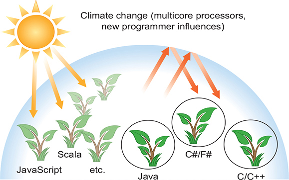
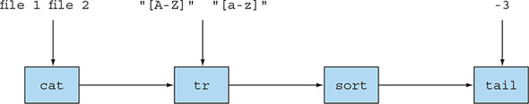
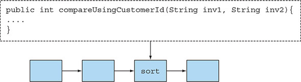
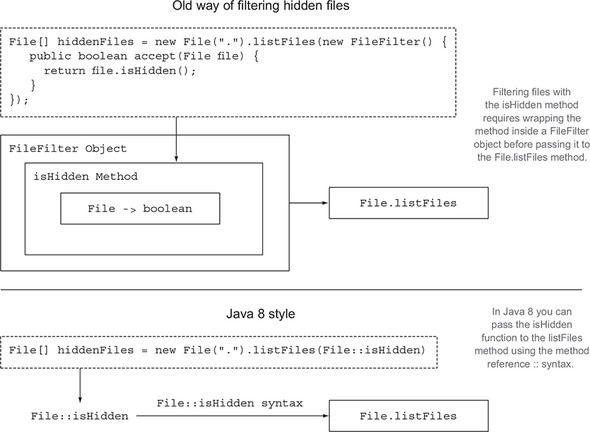
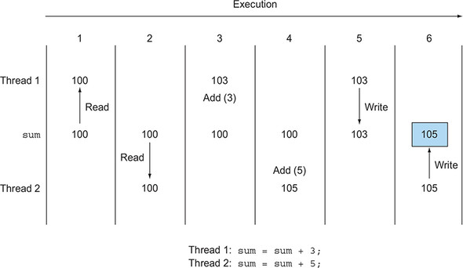
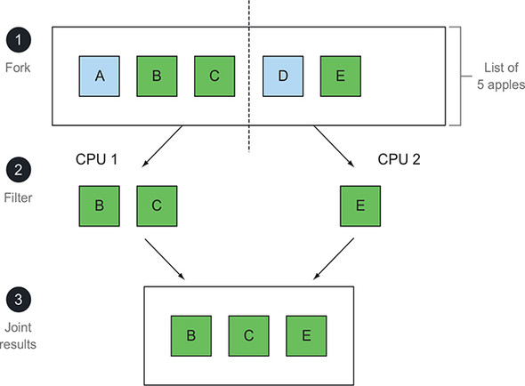

# Chương 1. Java 8, 9, 10 và 11: có gì mới?

> **Nội dung chương này**
>
> - Vì sao Java liên tục thay đổi
> - Bối cảnh điện toán đang đổi thay
> - Những áp lực buộc Java phải tiến hoá
> - Giới thiệu các tính năng cốt lõi mới của Java 8 và 9

Kể từ khi Java Development Kit (JDK 1.0) được phát hành vào năm 1996, Java đã chinh phục được một lượng lớn người theo đuổi gồm sinh viên, quản lý dự án và lập trình viên đang sử dụng ngôn ngữ này hằng ngày. Đây là một ngôn ngữ giàu sức biểu đạt và vẫn tiếp tục được dùng cho cả những dự án lớn lẫn nhỏ. Quá trình tiến hoá của nó (thông qua việc bổ sung các tính năng mới) từ Java 1.1 (1997) đến Java 7 (2011) đã được quản lý rất tốt. Java 8 được phát hành vào tháng 3 năm 2014, Java 9 vào tháng 9 năm 2017, Java 10 vào tháng 3 năm 2018, và Java 11 dự kiến vào tháng 9 năm 2018. Câu hỏi đặt ra là: Vì sao bạn nên quan tâm đến những thay đổi này?

## 1.1. Vậy câu chuyện lớn ở đây là gì?

Chúng tôi cho rằng những thay đổi trong Java 8 xét trên nhiều phương diện còn sâu sắc hơn bất kỳ thay đổi nào khác của Java trong suốt lịch sử của nó (Java 9 bổ sung những thay đổi quan trọng nhưng ít mang tính nền tảng hơn về năng suất làm việc, như bạn sẽ thấy ở phần sau của chương này, còn Java 10 chỉ tinh chỉnh ở quy mô nhỏ hơn nhiều đối với type inference). Tin tốt là những thay đổi này giúp bạn viết chương trình dễ dàng hơn. Ví dụ, thay vì viết đoạn code dài dòng (để sắp xếp một danh sách táo trong kho theo trọng lượng) như sau:

```java
Collections.sort(inventory, new Comparator<Apple>() {
    public int compare(Apple a1, Apple a2) {
        return a1.getWeight().compareTo(a2.getWeight());
    }
});
```

thì trong Java 8 bạn có thể viết một đoạn code ngắn gọn hơn, đọc lên gần với chính phát biểu của bài toán hơn nhiều, như sau:

```java
// Đoạn code Java 8 đầu tiên của cuốn sách!
inventory.sort(comparing(Apple::getWeight));
```

Nó đọc lên là "sắp xếp inventory bằng cách so sánh trọng lượng của quả táo". Bạn đừng bận tâm về đoạn code này lúc này. Cuốn sách sẽ giải thích nó làm gì và làm sao để bạn viết được những đoạn code tương tự.

Còn có một ảnh hưởng đến từ phần cứng: các CPU phổ thông đã trở thành multicore — bộ xử lý trong máy laptop hay máy để bàn của bạn có lẽ chứa bốn nhân CPU trở lên. Nhưng phần lớn các chương trình Java hiện có chỉ dùng một trong số các nhân đó và để ba nhân còn lại rảnh rỗi (hoặc chỉ dùng một phần rất nhỏ năng lực xử lý của chúng để chạy một phần hệ điều hành hay một chương trình quét virus).

Trước Java 8, các chuyên gia có thể sẽ bảo bạn rằng bạn phải dùng thread để tận dụng các nhân này. Vấn đề là làm việc với thread rất khó và dễ sinh lỗi. Java đã đi theo một lộ trình tiến hoá liên tục nhằm làm cho lập trình đồng thời dễ hơn và ít lỗi hơn. Java 1.0 đã có thread và lock, thậm chí có cả một memory model — đó là thực hành tốt nhất ở thời điểm ấy — nhưng những nguyên thuỷ này tỏ ra quá khó để dùng một cách đáng tin cậy trong các nhóm dự án không chuyên sâu. Java 5 bổ sung những khối xây dựng ở mức công nghiệp như thread pool và các concurrent collection. Java 7 bổ sung framework fork/join, khiến việc song song hoá thực tế hơn nhưng vẫn còn khó. Java 8 mang lại cho chúng ta một cách nghĩ mới, đơn giản hơn về parallelism. Nhưng bạn vẫn phải tuân theo một số quy tắc, và bạn sẽ học chúng trong cuốn sách này.

Như bạn sẽ thấy ở phần sau của cuốn sách, Java 9 bổ sung thêm một phương pháp cấu trúc nữa cho lập trình đồng thời — reactive programming. Mặc dù thứ này mang tính chuyên biệt hơn, nó chuẩn hoá cách khai thác các bộ công cụ reactive streams như RxJava và Akka, vốn đang ngày càng phổ biến cho các hệ thống có mức độ đồng thời cao.

Từ hai mong muốn nêu trên (code ngắn gọn hơn và sử dụng bộ xử lý multicore đơn giản hơn) mà bật ra toàn bộ công trình nhất quán được gói gọn trong Java 8. Chúng ta bắt đầu bằng việc nếm thử nhanh các ý tưởng này (hy vọng đủ để khơi gợi sự tò mò của bạn, nhưng cũng đủ ngắn để tóm lược chúng):

- Streams API
- Các kỹ thuật truyền code cho phương thức
- Default method trong interface

Java 8 cung cấp một API mới (gọi là Streams) hỗ trợ nhiều thao tác song song để xử lý dữ liệu và giống với cách bạn tư duy trong các ngôn ngữ truy vấn cơ sở dữ liệu — bạn diễn đạt *điều bạn muốn* ở mức trừu tượng cao hơn, và phần cài đặt (ở đây là thư viện Streams) sẽ chọn cơ chế thực thi ở mức thấp tốt nhất. Nhờ vậy, nó tránh cho bạn khỏi phải viết code dùng `synchronized`, thứ không chỉ rất dễ sinh lỗi mà còn tốn kém hơn bạn tưởng trên các CPU multicore.[1]

> **[1]** Các CPU multicore có cache riêng (bộ nhớ nhanh) gắn với từng nhân xử lý. Việc khoá (locking) đòi hỏi các cache này phải được đồng bộ, kéo theo giao tiếp liên nhân theo giao thức cache-coherency tương đối chậm.

Nhìn từ một góc độ hơi "xét lại" một chút, việc bổ sung Streams trong Java 8 có thể được xem là nguyên nhân trực tiếp của hai bổ sung còn lại trong Java 8: các kỹ thuật ngắn gọn để truyền code cho phương thức (method reference, lambda) và default method trong interface.

Nhưng nếu chỉ xem việc truyền code cho phương thức như một hệ quả đơn thuần của Streams thì lại xem nhẹ phạm vi ứng dụng của nó trong Java 8. Nó mang đến cho bạn một cách ngắn gọn mới để diễn đạt behavior parameterization (tham số hoá hành vi). Giả sử bạn muốn viết hai phương thức chỉ khác nhau ở vài dòng code. Giờ đây bạn có thể đơn giản là truyền phần code khác biệt đó vào như một đối số (kỹ thuật lập trình này ngắn hơn, rõ hơn và ít lỗi hơn so với thói quen phổ biến là copy và paste). Các chuyên gia hẳn sẽ nhận xét rằng trước Java 8 thì behavior parameterization vẫn có thể được mã hoá bằng anonymous class — nhưng chúng tôi sẽ để ví dụ ở đầu chương này, vốn cho thấy code Java 8 ngắn gọn hơn hẳn, tự lên tiếng về mặt sự rõ ràng.

Tính năng truyền code cho phương thức của Java 8 (và khả năng trả về code cũng như đưa nó vào các cấu trúc dữ liệu) còn mở ra một loạt kỹ thuật bổ sung thường được gọi chung là lập trình theo phong cách hàm (functional-style programming). Nói vắn tắt, những đoạn code như vậy — mà cộng đồng functional programming gọi là *hàm* — có thể được truyền đi và kết hợp lại theo những cách tạo ra các thành ngữ lập trình đầy sức mạnh mà bạn sẽ thấy dưới lớp áo Java xuyên suốt cuốn sách này.

Phần trọng tâm của chương này bắt đầu bằng một cuộc thảo luận ở mức cao về lý do vì sao các ngôn ngữ tiến hoá, tiếp tục với các mục về những tính năng cốt lõi của Java 8, rồi giới thiệu những ý tưởng của functional-style programming mà các tính năng mới giúp sử dụng dễ dàng hơn và mà các kiến trúc máy tính mới ưu ái. Về bản chất, mục 1.2 bàn về quá trình tiến hoá và các khái niệm mà trước đây Java còn thiếu để khai thác parallelism trên multicore một cách dễ dàng. Mục 1.3 giải thích vì sao việc truyền code cho phương thức trong Java 8 lại là một thành ngữ lập trình mới mạnh mẽ đến thế, và mục 1.4 làm điều tương tự với Streams — cách mới của Java 8 để biểu diễn dữ liệu có thứ tự và chỉ ra liệu chúng có thể được xử lý song song hay không. Mục 1.5 giải thích tính năng mới default method của Java 8 giúp các interface và thư viện của chúng tiến hoá với ít phiền toái và ít phải biên dịch lại hơn như thế nào; nó cũng giải thích phần bổ sung module trong Java 9, cho phép đặc tả các thành phần của những hệ thống Java lớn một cách rõ ràng hơn so với "chỉ là một file JAR chứa các package". Cuối cùng, mục 1.6 nhìn tới các ý tưởng của functional-style programming trong Java và trong các ngôn ngữ khác cùng chia sẻ JVM. Tóm lại, chương này giới thiệu những ý tưởng sẽ được đào sâu dần ở phần còn lại của cuốn sách. Chúc bạn có một hành trình thú vị!

## 1.2. Vì sao Java vẫn tiếp tục thay đổi?

Thập niên 1960 đã đến cùng với cuộc truy tìm một ngôn ngữ lập trình hoàn hảo. Peter Landin, một nhà khoa học máy tính nổi tiếng thời bấy giờ, đã ghi nhận vào năm 1966 trong một bài báo có tính cột mốc[2] rằng khi ấy đã có tới 700 ngôn ngữ lập trình, và ông suy đoán 700 ngôn ngữ tiếp theo sẽ trông như thế nào — bao gồm cả những lập luận ủng hộ functional-style programming tương tự như trong Java 8.

> **[2]** P. J. Landin, "The Next 700 Programming Languages," CACM 9(3):157–65, tháng 3 năm 1966.

Hàng nghìn ngôn ngữ lập trình sau đó, giới học thuật đã đi đến kết luận rằng các ngôn ngữ lập trình hành xử giống như các hệ sinh thái: ngôn ngữ mới xuất hiện, còn ngôn ngữ cũ bị thay thế trừ phi chúng tiến hoá. Tất cả chúng ta đều mong có một ngôn ngữ phổ quát hoàn hảo, nhưng trên thực tế một số ngôn ngữ nhất định lại phù hợp hơn với những ngách nhất định. Ví dụ, C và C++ vẫn phổ biến trong việc xây dựng hệ điều hành và nhiều hệ thống nhúng khác nhau nhờ dấu chân runtime nhỏ, bất chấp việc chúng thiếu an toàn lập trình. Sự thiếu an toàn này có thể khiến chương trình sập một cách khó lường và để lộ những lỗ hổng bảo mật cho virus và những thứ tương tự; quả thực, các ngôn ngữ an toàn kiểu (type-safe) như Java và C# đã thay thế C và C++ trong nhiều ứng dụng khi mà dấu chân runtime lớn hơn là chấp nhận được.

Việc đã chiếm giữ một ngách từ trước có xu hướng làm nản lòng các đối thủ. Chuyển sang một ngôn ngữ và một chuỗi công cụ mới thường là quá đau đớn nếu chỉ vì một tính năng duy nhất, nhưng những kẻ mới đến rốt cuộc sẽ thế chỗ các ngôn ngữ hiện có, trừ phi chúng tiến hoá đủ nhanh để bắt kịp. (Những độc giả lớn tuổi hơn thường có thể kể ra một loạt ngôn ngữ như vậy mà họ từng viết code, nhưng độ phổ biến từ đó đã lụi tàn — Ada, Algol, COBOL, Pascal, Delphi và SNOBOL, chỉ để nêu vài cái tên.)

Bạn là một lập trình viên Java, và Java đã thành công trong việc thực dân hoá (và thay thế các ngôn ngữ đối thủ trong) một ngách sinh thái lớn gồm các tác vụ lập trình trong gần 20 năm. Hãy cùng xem xét vài lý do cho điều đó.

### 1.2.1. Vị trí của Java trong hệ sinh thái ngôn ngữ lập trình

Java đã khởi đầu tốt. Ngay từ đầu, nó đã là một ngôn ngữ hướng đối tượng được thiết kế tốt với nhiều thư viện hữu ích. Nó cũng hỗ trợ tính đồng thời ở quy mô nhỏ ngay từ ngày đầu tiên với sự hỗ trợ tích hợp cho thread và lock (cùng với sự thừa nhận sớm và có tầm nhìn xa, dưới dạng một memory model trung lập với phần cứng, rằng các thread chạy đồng thời trên bộ xử lý multicore có thể có những hành vi bất ngờ bên cạnh những hành vi xảy ra trên bộ xử lý đơn nhân). Ngoài ra, quyết định biên dịch Java thành bytecode của JVM (một dạng mã máy ảo mà chẳng bao lâu sau mọi trình duyệt đều hỗ trợ) đã khiến nó trở thành ngôn ngữ được lựa chọn cho các chương trình applet trên internet (bạn còn nhớ applet không?). Quả thực, có một nguy cơ là Java Virtual Machine (JVM) và bytecode của nó sẽ được xem là quan trọng hơn chính bản thân ngôn ngữ Java, và rằng với một số ứng dụng nhất định, Java có thể bị thay thế bởi một trong các ngôn ngữ cạnh tranh với nó như Scala, Groovy hay Kotlin, vốn cũng chạy trên JVM. Nhiều bản cập nhật gần đây của JVM (ví dụ, bytecode `invokedynamic` mới trong JDK7) nhắm tới việc giúp các ngôn ngữ đối thủ đó chạy mượt mà trên JVM — và tương tác được với Java. Java cũng đã thành công trong việc chiếm lĩnh nhiều khía cạnh của điện toán nhúng (từ thẻ thông minh, lò nướng bánh mì, set-top box cho tới hệ thống phanh xe hơi).

#### Java đã lọt vào ngách lập trình phổ thông bằng cách nào?

Lập trình hướng đối tượng trở thành thời thượng vào thập niên 1990 vì hai lý do: kỷ luật encapsulation của nó dẫn tới ít vấn đề công nghệ phần mềm hơn so với C; và với tư cách một mô hình tư duy, nó nắm bắt dễ dàng mô hình lập trình WIMP của Windows 95 trở về sau. Điều này có thể tóm gọn như sau: mọi thứ đều là một đối tượng; và một cú nhấp chuột sẽ gửi một thông điệp sự kiện tới một handler (gọi phương thức `clicked` trong một đối tượng `Mouse`). Mô hình "viết một lần, chạy mọi nơi" của Java cùng khả năng của các trình duyệt thời kỳ đầu trong việc thực thi (một cách an toàn) các applet code Java đã mang lại cho nó một ngách trong các trường đại học, và sinh viên tốt nghiệp từ đó toả ra ngành công nghiệp. Ban đầu có sự phản kháng với chi phí chạy cao hơn của Java so với C/C++, nhưng máy móc ngày càng nhanh hơn, còn thời gian của lập trình viên ngày càng trở nên quan trọng hơn. C# của Microsoft càng khẳng định thêm giá trị của mô hình hướng đối tượng kiểu Java.

Nhưng khí hậu của hệ sinh thái ngôn ngữ lập trình đang thay đổi; lập trình viên ngày càng phải xử lý cái gọi là dữ liệu lớn (big data — những tập dữ liệu cỡ terabyte trở lên) và mong muốn khai thác hiệu quả các máy tính multicore hay các cụm máy tính để xử lý chúng. Và điều này nghĩa là phải dùng xử lý song song — thứ mà trước đây Java không hề thân thiện. Có thể bạn đã bắt gặp những ý tưởng từ các ngách lập trình khác (ví dụ, map-reduce của Google hay sự dễ dàng tương đối trong thao tác dữ liệu bằng các ngôn ngữ truy vấn cơ sở dữ liệu như SQL) giúp bạn làm việc với khối lượng dữ liệu lớn và với CPU multicore. Hình 1.1 tóm tắt hệ sinh thái ngôn ngữ bằng hình ảnh: hãy hình dung cảnh quan là không gian các bài toán lập trình, và thảm thực vật chiếm ưu thế trên một mảnh đất cụ thể là ngôn ngữ được ưa chuộng cho loại chương trình đó. Biến đổi khí hậu là ý tưởng rằng phần cứng mới hoặc những ảnh hưởng lập trình mới (ví dụ, "Tại sao tôi không thể lập trình theo phong cách giống SQL?") khiến những ngôn ngữ khác nhau trở thành lựa chọn hàng đầu cho các dự án mới, y như việc nhiệt độ vùng miền tăng lên khiến nho giờ đây phát triển tốt ở các vĩ độ cao hơn. Nhưng vẫn có độ trễ (hysteresis) — nhiều bác nông dân già vẫn sẽ tiếp tục trồng những cây truyền thống. Tóm lại, các ngôn ngữ mới đang xuất hiện và ngày càng phổ biến vì chúng đã thích nghi nhanh chóng với sự biến đổi khí hậu ấy.

> **Hình 1.1.** Hệ sinh thái ngôn ngữ lập trình và sự biến đổi khí hậu
>
> 

Lợi ích chính của những bổ sung trong Java 8 đối với một lập trình viên là chúng cung cấp thêm nhiều công cụ và khái niệm lập trình để giải quyết các bài toán lập trình mới hoặc đã có một cách nhanh hơn, hoặc quan trọng hơn, theo một cách ngắn gọn hơn và dễ bảo trì hơn. Mặc dù các khái niệm này là mới đối với Java, chúng đã chứng tỏ sức mạnh trong những ngôn ngữ mang tính nghiên cứu ở các ngách hẹp. Trong các mục tiếp theo, chúng tôi sẽ làm nổi bật và phát triển những ý tưởng đứng sau ba khái niệm lập trình đã thúc đẩy sự phát triển các tính năng của Java 8 nhằm khai thác parallelism và viết code ngắn gọn hơn nói chung. Chúng tôi sẽ giới thiệu chúng theo một thứ tự hơi khác so với phần còn lại của cuốn sách, để có thể dùng một phép so sánh dựa trên Unix và để phơi bày những phụ thuộc kiểu "cần cái này vì cái kia" trong cơ chế parallelism mới cho multicore của Java 8.

> **Một yếu tố biến đổi khí hậu khác đối với Java**
>
> Một yếu tố biến đổi khí hậu liên quan đến cách các hệ thống lớn được thiết kế. Ngày nay, một hệ thống lớn thường hợp nhất những hệ thống con thành phần lớn lấy từ nơi khác, và có lẽ những thứ này lại được xây dựng trên nền các thành phần từ những nhà cung cấp khác nữa. Tệ hơn nữa, các thành phần này và interface của chúng cũng có xu hướng tiến hoá. Java 8 và Java 9 đã giải quyết những khía cạnh này bằng cách cung cấp default method và module để hỗ trợ phong cách thiết kế đó.

Ba mục tiếp theo sẽ xem xét ba khái niệm lập trình đã dẫn dắt thiết kế của Java 8.

### 1.2.2. Stream processing

Khái niệm lập trình đầu tiên là stream processing (xử lý theo luồng). Với mục đích giới thiệu, một stream là một dãy các mục dữ liệu mà về mặt khái niệm được sinh ra từng cái một. Một chương trình có thể đọc từng mục một từ một input stream và tương tự, ghi từng mục ra một output stream. Output stream của một chương trình hoàn toàn có thể là input stream của một chương trình khác.

Một ví dụ thực tế nằm ở Unix hoặc Linux, nơi nhiều chương trình hoạt động bằng cách đọc dữ liệu từ đầu vào chuẩn (`stdin` trong Unix và C, `System.in` trong Java), xử lý nó, rồi ghi kết quả ra đầu ra chuẩn (`stdout` trong Unix và C, `System.out` trong Java). Trước hết, một chút kiến thức nền: lệnh `cat` của Unix tạo ra một stream bằng cách nối hai file, `tr` chuyển đổi các ký tự trong một stream, `sort` sắp xếp các dòng trong một stream, và `tail -3` cho ra ba dòng cuối cùng trong một stream. Dòng lệnh Unix cho phép nối các chương trình như vậy lại với nhau bằng pipe (`|`), cho ra những ví dụ như:

```bash
cat file1 file2 | tr "[A-Z]" "[a-z]" | sort | tail -3
```

câu lệnh này (giả sử `file1` và `file2` chứa mỗi dòng một từ) in ra ba từ trong các file xuất hiện muộn nhất theo thứ tự từ điển, sau khi đã chuyển chúng sang chữ thường trước. Ta nói rằng `sort` nhận một stream các dòng[3] làm đầu vào và tạo ra một stream các dòng khác làm đầu ra (stream sau đã được sắp xếp), như minh hoạ trong hình 1.2. Lưu ý rằng trong Unix, các lệnh này (`cat`, `tr`, `sort` và `tail`) được thực thi đồng thời, nhờ vậy `sort` có thể đang xử lý vài dòng đầu tiên trước cả khi `cat` hay `tr` kết thúc. Một phép so sánh mang tính cơ khí hơn là dây chuyền lắp ráp ô tô, nơi một dòng xe được xếp hàng giữa các trạm xử lý mà mỗi trạm nhận một chiếc xe, sửa đổi nó và chuyển tiếp sang trạm kế tiếp để xử lý thêm; việc xử lý tại các trạm riêng biệt thường diễn ra đồng thời ngay cả khi dây chuyền lắp ráp về mặt vật lý là một chuỗi tuần tự.

> **[3]** Những người theo chủ nghĩa thuần tuý sẽ nói đó là một "stream các ký tự", nhưng về mặt khái niệm thì đơn giản hơn nếu nghĩ rằng `sort` sắp xếp lại các dòng.

> **Hình 1.2.** Các lệnh Unix thao tác trên stream
>
> 

Java 8 bổ sung một Streams API (chú ý chữ S viết hoa) trong `java.util.stream` dựa trên ý tưởng này; `Stream<T>` là một dãy các mục có kiểu `T`. Bạn có thể tạm nghĩ về nó như một iterator hào nhoáng. Streams API có nhiều phương thức có thể được nối chuỗi (chain) lại để tạo thành một pipeline phức tạp, đúng như cách các lệnh Unix được nối chuỗi trong ví dụ trước.

Động lực then chốt cho điều này là giờ đây bạn có thể lập trình trong Java 8 ở mức trừu tượng cao hơn, cấu trúc suy nghĩ của mình theo hướng biến một stream của thứ này thành một stream của thứ kia (tương tự cách bạn tư duy khi viết truy vấn cơ sở dữ liệu) thay vì từng mục một. Một lợi thế khác là Java 8 có thể chạy pipeline các thao tác Stream của bạn một cách trong suốt trên nhiều nhân CPU với những phần rời nhau của đầu vào — đây gần như là parallelism miễn phí thay vì phải làm việc vất vả với Thread. Chúng tôi trình bày chi tiết Streams API của Java 8 trong các chương 4–7.

### 1.2.3. Truyền code cho phương thức với behavior parameterization

Khái niệm lập trình thứ hai được bổ sung vào Java 8 là khả năng truyền một đoạn code cho một API. Nghe có vẻ trừu tượng khủng khiếp. Trong ví dụ Unix, bạn có thể muốn bảo lệnh `sort` sử dụng một thứ tự sắp xếp tuỳ chỉnh. Mặc dù lệnh `sort` có hỗ trợ các tham số dòng lệnh để thực hiện nhiều kiểu sắp xếp định sẵn khác nhau, chẳng hạn thứ tự đảo ngược, những kiểu đó là có giới hạn.

Ví dụ, giả sử bạn có một tập hợp các mã hoá đơn với định dạng kiểu như 2013UK0001, 2014US0002, và cứ thế. Bốn chữ số đầu biểu diễn năm, hai chữ cái tiếp theo là mã quốc gia, và bốn chữ số cuối là ID của khách hàng. Bạn có thể muốn sắp xếp các mã hoá đơn này theo năm, hoặc có lẽ theo ID khách hàng, hay thậm chí theo mã quốc gia. Điều bạn muốn là khả năng bảo lệnh `sort` nhận một thứ tự do người dùng định nghĩa làm đối số: một đoạn code riêng biệt được truyền cho lệnh `sort`.

Giờ đây, song song trực tiếp trong Java, bạn muốn bảo một phương thức sort so sánh bằng một thứ tự tuỳ chỉnh. Bạn có thể viết một phương thức `compareUsingCustomerId` để so sánh hai mã hoá đơn, nhưng trước Java 8 bạn không thể truyền phương thức này cho một phương thức khác! Bạn có thể tạo một đối tượng `Comparator` để truyền cho phương thức sort như chúng tôi đã trình bày ở đầu chương này, nhưng cách đó dài dòng và làm mờ đi ý tưởng đơn giản là tái sử dụng một mẩu hành vi đã có. Java 8 bổ sung khả năng truyền các phương thức (code của bạn) làm đối số cho những phương thức khác. Hình 1.3, dựa trên hình 1.2, minh hoạ ý tưởng này. Về mặt khái niệm, chúng ta cũng gọi điều này là behavior parameterization. Tại sao nó lại quan trọng? Streams API được xây dựng trên chính ý tưởng truyền code để tham số hoá hành vi của các thao tác của nó, y như cách bạn truyền `compareUsingCustomerId` để tham số hoá hành vi của `sort`.

> **Hình 1.3.** Truyền phương thức `compareUsingCustomerId` làm đối số cho `sort`
>
> 

Chúng tôi tóm tắt cách hoạt động của cơ chế này trong mục 1.3 của chương này, nhưng để dành đầy đủ chi tiết cho các chương 2 và 3. Các chương 18 và 19 xem xét những điều nâng cao hơn mà bạn có thể làm với tính năng này, với các kỹ thuật từ cộng đồng functional programming.

### 1.2.4. Parallelism và dữ liệu chia sẻ có thể thay đổi

Khái niệm lập trình thứ ba khá ngầm ẩn và nảy sinh từ cụm từ "parallelism gần như miễn phí" trong phần thảo luận trước của chúng ta về stream processing. Bạn phải từ bỏ điều gì? Có thể bạn sẽ phải thực hiện vài thay đổi nhỏ trong cách bạn viết code cho hành vi được truyền vào các phương thức của stream. Ban đầu, những thay đổi này có thể khiến bạn hơi khó chịu, nhưng một khi đã quen, bạn sẽ yêu thích chúng. Bạn phải cung cấp hành vi an toàn để thực thi đồng thời trên những phần khác nhau của đầu vào. Thông thường điều này nghĩa là viết code không truy cập vào dữ liệu chia sẻ có thể thay đổi (shared mutable data) để hoàn thành công việc của nó. Đôi khi những thứ này được gọi là pure function, hay hàm không có side effect, hoặc hàm không trạng thái (stateless), và chúng tôi sẽ bàn chi tiết về chúng trong các chương 18 và 19. Cơ chế parallelism nói trên chỉ nảy sinh khi ta giả định rằng nhiều bản sao của mẩu code của bạn có thể hoạt động độc lập với nhau. Nếu có một biến hay đối tượng dùng chung bị ghi vào, thì mọi thứ không còn hoạt động nữa. Điều gì xảy ra nếu hai tiến trình muốn sửa đổi biến dùng chung ấy cùng lúc? (Mục 1.4 đưa ra lời giải thích chi tiết hơn kèm một hình minh hoạ.) Bạn sẽ tìm hiểu thêm về phong cách này xuyên suốt cuốn sách.

Stream trong Java 8 khai thác parallelism dễ dàng hơn so với Threads API sẵn có của Java, nên mặc dù vẫn có thể dùng `synchronized` để phá vỡ quy tắc không-chia-sẻ-dữ-liệu-có-thể-thay-đổi, làm vậy là chống lại hệ thống, bởi nó lạm dụng một lớp trừu tượng vốn được tối ưu xoay quanh chính quy tắc đó. Việc dùng `synchronized` trên nhiều nhân xử lý thường tốn kém hơn bạn tưởng rất nhiều, bởi việc đồng bộ hoá buộc code phải thực thi tuần tự, điều đi ngược lại mục tiêu của parallelism.

Hai điểm trong số này (không có dữ liệu chia sẻ có thể thay đổi, và khả năng truyền phương thức cũng như hàm — tức code — cho các phương thức khác) là những viên đá tảng của cái thường được mô tả là hệ hình (paradigm) functional programming, thứ bạn sẽ thấy chi tiết trong các chương 18 và 19. Ngược lại, trong hệ hình lập trình mệnh lệnh (imperative programming), bạn thường mô tả một chương trình theo dạng một chuỗi các câu lệnh làm thay đổi trạng thái. Yêu cầu không-chia-sẻ-dữ-liệu-có-thể-thay-đổi nghĩa là một phương thức được mô tả trọn vẹn chỉ bằng cách nó biến đổi các đối số thành kết quả; nói cách khác, nó hành xử như một hàm toán học và không có side effect (nhìn thấy được).

### 1.2.5. Java cần tiến hoá

Bạn đã từng thấy sự tiến hoá trong Java trước đây. Ví dụ, việc giới thiệu generic và việc dùng `List<String>` thay vì chỉ `List` ban đầu có lẽ đã gây khó chịu. Nhưng giờ đây bạn đã quen với phong cách này và với những lợi ích mà nó mang lại (bắt được nhiều lỗi hơn ở thời điểm biên dịch và làm code dễ đọc hơn, bởi giờ bạn đã biết một thứ là danh sách *của cái gì*).

Những thay đổi khác đã khiến các việc thông thường trở nên dễ diễn đạt hơn (ví dụ, dùng vòng lặp for-each thay vì phơi bày cách dùng `Iterator` đầy code khuôn mẫu (boilerplate)). Những thay đổi chính trong Java 8 phản ánh một bước dịch chuyển khỏi hướng đối tượng cổ điển, vốn thường tập trung vào việc biến đổi các giá trị sẵn có, và hướng về phía phổ functional-style programming, trong đó *điều bạn muốn làm* ở mức tổng quát (ví dụ, tạo ra một giá trị biểu diễn tất cả các tuyến vận chuyển từ A đến B với chi phí dưới một mức giá cho trước) được coi là ưu tiên hàng đầu và được tách khỏi *cách bạn đạt được điều đó* (ví dụ, quét một cấu trúc dữ liệu và sửa đổi một số thành phần nhất định). Lưu ý rằng lập trình hướng đối tượng cổ điển và functional programming, khi đẩy tới cực đoan, có vẻ như xung đột nhau. Nhưng ý tưởng ở đây là lấy những gì tốt nhất từ cả hai hệ hình lập trình, để bạn có cơ hội tốt hơn trong việc có đúng công cụ cho đúng việc. Chúng tôi bàn chi tiết điều này trong các mục 1.3 và 1.4.

Một điều rút ra có thể là thế này: các ngôn ngữ cần tiến hoá để theo kịp phần cứng đang thay đổi hoặc kỳ vọng đang thay đổi của lập trình viên (nếu bạn cần được thuyết phục, hãy nghĩ rằng COBOL từng là một trong những ngôn ngữ quan trọng nhất về mặt thương mại). Để trường tồn, Java phải tiến hoá bằng cách bổ sung tính năng mới. Sự tiến hoá này sẽ vô nghĩa trừ phi các tính năng mới được sử dụng, nên khi dùng Java 8 là bạn đang bảo vệ chính lối sống của mình với tư cách một lập trình viên Java. Trên hết, chúng tôi có cảm giác rằng bạn sẽ yêu thích việc dùng các tính năng mới của Java 8. Hãy thử hỏi bất kỳ ai đã dùng Java 8 xem họ có sẵn lòng quay lại như cũ không! Thêm vào đó, theo phép ẩn dụ hệ sinh thái, các tính năng mới của Java 8 có thể giúp Java chinh phục vùng lãnh thổ tác vụ lập trình hiện đang bị các ngôn ngữ khác chiếm giữ, nhờ đó lập trình viên Java 8 sẽ càng được săn đón hơn nữa.

Bây giờ chúng ta sẽ giới thiệu lần lượt các khái niệm mới trong Java 8, đồng thời chỉ ra những chương bàn về các khái niệm này chi tiết hơn.

## 1.3. Hàm trong Java

Từ *function* (hàm) trong các ngôn ngữ lập trình thường được dùng như một từ đồng nghĩa với *method* (phương thức), đặc biệt là static method; điều này bên cạnh việc nó còn được dùng để chỉ hàm toán học, tức hàm không có side effect. May mắn thay, như bạn sẽ thấy, khi Java 8 nhắc đến hàm thì các cách dùng này gần như trùng khớp với nhau.

Java 8 bổ sung hàm như những dạng giá trị mới. Chúng tạo thuận lợi cho việc sử dụng stream, được trình bày trong mục 1.4, thứ mà Java 8 cung cấp để khai thác lập trình song song trên bộ xử lý multicore. Chúng ta bắt đầu bằng việc chỉ ra rằng bản thân việc coi hàm là giá trị đã hữu ích rồi.

Hãy nghĩ về những giá trị mà chương trình Java có thể thao tác. Thứ nhất, có các giá trị primitive như `42` (kiểu `int`) và `3.14` (kiểu `double`). Thứ hai, giá trị có thể là các đối tượng (nói chặt chẽ hơn là các tham chiếu tới đối tượng). Cách duy nhất để có được một trong số đó là dùng `new`, có lẽ thông qua một factory method hoặc một hàm thư viện; tham chiếu đối tượng trỏ tới các thể hiện của một class. Ví dụ bao gồm `"abc"` (kiểu `String`), `new Integer(1111)` (kiểu `Integer`), và kết quả `new HashMap<Integer, String>(100)` của việc gọi tường minh một constructor cho `HashMap`. Ngay cả mảng cũng là đối tượng. Vậy vấn đề là ở đâu?

Để giúp trả lời câu hỏi này, chúng tôi lưu ý rằng toàn bộ mục đích của một ngôn ngữ lập trình là thao tác trên các giá trị, và vì thế, theo truyền thống lịch sử của ngôn ngữ lập trình, chúng được gọi là các giá trị hạng nhất (first-class value) — hay công dân hạng nhất, theo thuật ngữ mượn từ phong trào dân quyền thập niên 1960 ở Hoa Kỳ. Những cấu trúc khác trong ngôn ngữ lập trình của chúng ta, những thứ có lẽ giúp ta diễn đạt cấu trúc của các giá trị nhưng lại không thể được truyền đi trong lúc chương trình chạy, là những công dân hạng hai. Các giá trị đã liệt kê ở trên là công dân hạng nhất của Java, nhưng nhiều khái niệm Java khác, chẳng hạn phương thức và class, lại là ví dụ điển hình của công dân hạng hai. Phương thức thì ổn khi dùng để định nghĩa class, và class rồi có thể được khởi tạo để tạo ra các giá trị, nhưng bản thân cả hai đều không phải là giá trị. Điều đó có quan trọng không? Có, hoá ra khả năng truyền phương thức đi khắp nơi lúc runtime, và nhờ đó biến chúng thành công dân hạng nhất, lại rất hữu ích trong lập trình, nên những người thiết kế Java 8 đã bổ sung khả năng diễn đạt điều này một cách trực tiếp trong Java. Nhân tiện, có thể bạn sẽ tự hỏi liệu việc biến các công dân hạng hai khác như class thành giá trị công dân hạng nhất có phải cũng là một ý hay không. Nhiều ngôn ngữ khác nhau như Smalltalk và JavaScript đã khám phá con đường này.

### 1.3.1. Phương thức và lambda như những công dân hạng nhất

Các thử nghiệm trong những ngôn ngữ khác, chẳng hạn Scala và Groovy, đã xác định rằng việc cho phép những khái niệm như phương thức được dùng như giá trị hạng nhất khiến việc lập trình dễ dàng hơn nhờ bổ sung vào bộ công cụ sẵn có của lập trình viên. Và một khi lập trình viên đã quen với một tính năng mạnh mẽ, họ trở nên miễn cưỡng khi phải dùng những ngôn ngữ không có nó! Những người thiết kế Java 8 đã quyết định cho phép phương thức trở thành giá trị — để giúp bạn lập trình dễ dàng hơn. Hơn nữa, tính năng "phương thức là giá trị" của Java 8 tạo nền tảng cho nhiều tính năng Java 8 khác (chẳng hạn Streams).

Tính năng mới đầu tiên của Java 8 mà chúng tôi giới thiệu là method reference. Giả sử bạn muốn lọc tất cả các file ẩn trong một thư mục. Bạn cần bắt đầu bằng việc viết một phương thức mà khi cho một `File`, sẽ cho bạn biết nó có ẩn hay không. May thay, đã có sẵn một phương thức như vậy trong class `File` tên là `isHidden`. Nó có thể được xem như một hàm nhận vào một `File` và trả về một `boolean`. Nhưng để dùng nó cho việc lọc, bạn cần bọc nó vào một đối tượng `FileFilter` rồi truyền đối tượng đó cho phương thức `File.listFiles`, như sau:

```java
File[] hiddenFiles = new File(".").listFiles(new FileFilter() {
    public boolean accept(File file) {
        return file.isHidden();  // Lọc các file ẩn!
    }
});
```

Ghê quá! Thật kinh khủng. Mặc dù chỉ có ba dòng thực sự có ý nghĩa, đó lại là ba dòng tối nghĩa — tất cả chúng ta đều nhớ mình đã thốt lên "Chẳng lẽ tôi thực sự phải làm theo cách này sao?" trong lần đầu gặp phải. Bạn đã có sẵn phương thức `isHidden` để dùng rồi mà. Tại sao bạn lại phải bọc nó vào một class `FileFilter` dài dòng rồi khởi tạo class đó? Bởi vì đó là điều bạn buộc phải làm trước Java 8.

Giờ đây, bạn có thể viết lại đoạn code đó như sau:

```java
File[] hiddenFiles = new File(".").listFiles(File::isHidden);
```

Chà! Ngầu quá phải không? Bạn đã có sẵn hàm `isHidden`, nên bạn truyền nó cho phương thức `listFiles` bằng cú pháp method reference `::` của Java 8 (nghĩa là "hãy dùng phương thức này như một giá trị"); lưu ý rằng chúng tôi cũng đã bắt đầu dùng từ *hàm* để chỉ phương thức. Chúng tôi sẽ giải thích cơ chế hoạt động sau. Một lợi thế là code của bạn giờ đọc lên gần với phát biểu của bài toán hơn.

Đây là một chút nếm thử về những gì sắp tới: phương thức không còn là giá trị hạng hai nữa. Tương tự việc dùng một tham chiếu đối tượng khi bạn truyền một đối tượng đi khắp nơi (và tham chiếu đối tượng được tạo bằng `new`), trong Java 8 khi bạn viết `File::isHidden`, bạn tạo ra một method reference, thứ cũng có thể được truyền đi tương tự. Khái niệm này được bàn chi tiết trong chương 3. Vì phương thức chứa code (phần thân thực thi được của một phương thức), việc dùng method reference cho phép truyền code đi khắp nơi như trong hình 1.3. Hình 1.4 minh hoạ khái niệm này. Bạn cũng sẽ thấy một ví dụ cụ thể (chọn táo từ một kho hàng) trong mục tiếp theo.

> **Hình 1.4.** Truyền method reference `File::isHidden` cho phương thức `listFiles`
>
> 

> **Lambda: những hàm vô danh**
>
> Bên cạnh việc cho phép các phương thức (có tên) trở thành giá trị hạng nhất, Java 8 còn cho phép một ý tưởng phong phú hơn về hàm như giá trị, bao gồm cả lambda[4] (hay hàm vô danh). Ví dụ, giờ đây bạn có thể viết `(int x) -> x + 1` để chỉ "hàm mà khi được gọi với đối số `x` sẽ trả về giá trị `x + 1`". Có thể bạn sẽ thắc mắc vì sao điều này lại cần thiết, bởi bạn hoàn toàn có thể định nghĩa một phương thức `add1` bên trong một class `MyMathsUtils` rồi viết `MyMathsUtils::add1`! Đúng vậy, bạn có thể làm thế, nhưng cú pháp lambda mới ngắn gọn hơn cho những trường hợp bạn không có sẵn một phương thức và một class tiện lợi. Chương 3 khám phá lambda một cách chi tiết. Các chương trình sử dụng những khái niệm này được nói là viết theo phong cách functional-programming; cụm từ này nghĩa là "viết các chương trình truyền hàm đi khắp nơi như những giá trị hạng nhất".

> **[4]** Ban đầu được đặt tên theo chữ cái Hy Lạp λ (lambda). Mặc dù ký hiệu này không được dùng trong Java, cái tên của nó vẫn còn sống mãi.

### 1.3.2. Truyền code: một ví dụ

Hãy xem một ví dụ về việc điều này giúp bạn viết chương trình như thế nào (được bàn chi tiết hơn trong chương 2). Toàn bộ code cho các ví dụ có sẵn trên một kho GitHub và có thể tải về qua website của cuốn sách. Cả hai liên kết đều có thể tìm thấy tại www.manning.com/books/modern-java-in-action. Giả sử bạn có một class `Apple` với một phương thức `getColor` và một biến `inventory` giữ một danh sách các `Apple`; khi đó bạn có thể muốn chọn tất cả những quả táo xanh (ở đây dùng một kiểu enum `Color` bao gồm các giá trị `GREEN` và `RED`) và trả về chúng trong một danh sách. Từ *filter* thường được dùng để diễn đạt khái niệm này. Trước Java 8, bạn có thể viết một phương thức `filterGreenApples`:

```java
public static List<Apple> filterGreenApples(List<Apple> inventory) {
    // Danh sách result tích luỹ kết quả; ban đầu rỗng, rồi các quả táo
    // xanh được thêm vào lần lượt từng quả một.
    List<Apple> result = new ArrayList<>();
    for (Apple apple : inventory) {
        if (GREEN.equals(apple.getColor())) {  // Chỉ chọn những quả táo xanh
            result.add(apple);
        }
    }
    return result;
}
```

Nhưng ngay sau đó, ai đó lại muốn có danh sách những quả táo nặng (chẳng hạn trên 150 g), và thế là, với một tấm lòng nặng trĩu, bạn phải viết phương thức sau để làm điều đó (thậm chí có lẽ còn dùng copy và paste):

```java
public static List<Apple> filterHeavyApples(List<Apple> inventory) {
    List<Apple> result = new ArrayList<>();
    for (Apple apple : inventory) {
        if (apple.getWeight() > 150) {  // Ở đây chỉ chọn những quả táo nặng
            result.add(apple);
        }
    }
    return result;
}
```

Tất cả chúng ta đều biết những hiểm hoạ của copy và paste đối với công nghệ phần mềm (cập nhật và sửa lỗi cho biến thể này nhưng lại không cho biến thể kia), và này, hai phương thức này chỉ khác nhau đúng một dòng: điều kiện được tô sáng bên trong cấu trúc `if`. Nếu sự khác biệt giữa hai lời gọi phương thức trong đoạn code được tô sáng chỉ là khoảng trọng lượng nào được chấp nhận, thì bạn đã có thể truyền giới hạn trọng lượng dưới và trên làm đối số cho `filter` — chẳng hạn `(150, 1000)` để chọn táo nặng (trên 150 g) hoặc `(0, 80)` để chọn táo nhẹ (dưới 80 g).

Nhưng như chúng tôi đã đề cập trước đó, Java 8 khiến việc truyền code của điều kiện làm đối số trở nên khả thi, tránh được sự trùng lặp code của phương thức filter. Giờ đây bạn có thể viết thế này:

```java
public static boolean isGreenApple(Apple apple) {
    return GREEN.equals(apple.getColor());
}

public static boolean isHeavyApple(Apple apple) {
    return apple.getWeight() > 150;
}

// Được đưa vào cho rõ ràng (thông thường được import từ java.util.function)
public interface Predicate<T> {
    boolean test(T t);
}

// Một phương thức được truyền vào dưới dạng tham số Predicate tên là p
// (xem khung "Predicate là gì?").
static List<Apple> filterApples(List<Apple> inventory,
                                Predicate<Apple> p) {
    List<Apple> result = new ArrayList<>();
    for (Apple apple : inventory) {
        if (p.test(apple)) {  // Quả táo có khớp với điều kiện mà p biểu diễn không?
            result.add(apple);
        }
    }
    return result;
}
```

Và để dùng nó, bạn gọi hoặc là

```java
filterApples(inventory, Apple::isGreenApple);
```

hoặc là

```java
filterApples(inventory, Apple::isHeavyApple);
```

Chúng tôi giải thích chi tiết cách hoạt động của điều này trong hai chương tiếp theo. Ý tưởng then chốt cần rút ra lúc này là bạn có thể truyền một phương thức đi khắp nơi trong Java 8.

> **Predicate là gì?**
>
> Đoạn code trước đã truyền một phương thức `Apple::isGreenApple` (nhận vào một `Apple` làm đối số và trả về một `boolean`) cho `filterApples`, vốn mong đợi một tham số kiểu `Predicate<Apple>`. Từ *predicate* (vị từ) thường được dùng trong toán học để chỉ một thứ giống hàm, nhận vào một giá trị làm đối số và trả về `true` hoặc `false`. Như bạn sẽ thấy sau này, Java 8 cũng cho phép bạn viết `Function<Apple, Boolean>` — quen thuộc hơn với những độc giả từng học về hàm chứ không phải về vị từ ở trường — nhưng dùng `Predicate<Apple>` thì chuẩn mực hơn (và hiệu quả hơn một chút vì nó tránh được việc boxing một `boolean` thành một `Boolean`).

### 1.3.3. Từ truyền phương thức đến lambda

Truyền phương thức như giá trị rõ ràng là hữu ích, nhưng thật phiền toái khi phải viết định nghĩa cho những phương thức ngắn như `isHeavyApple` và `isGreenApple` trong khi chúng có lẽ chỉ được dùng một hai lần. Nhưng Java 8 cũng đã giải quyết điều này. Nó giới thiệu một ký pháp mới (hàm vô danh, hay lambda) cho phép bạn chỉ cần viết

```java
filterApples(inventory, (Apple a) -> GREEN.equals(a.getColor()));
```

hoặc

```java
filterApples(inventory, (Apple a) -> a.getWeight() > 150);
```

hoặc thậm chí

```java
filterApples(inventory, (Apple a) -> a.getWeight() < 80 ||
                                     RED.equals(a.getColor()));
```

Bạn thậm chí không cần viết một định nghĩa phương thức chỉ dùng đúng một lần; code trở nên gọn gàng và rõ ràng hơn bởi bạn không phải đi tìm đoạn code mà mình đang truyền vào. Nhưng nếu một lambda như vậy dài quá vài dòng (đến mức hành vi của nó không còn rõ ràng ngay lập tức), thì thay vào đó bạn nên dùng một method reference tới một phương thức có tên mang tính mô tả, thay vì dùng một lambda vô danh. Sự rõ ràng của code phải là kim chỉ nam của bạn.

Những người thiết kế Java 8 gần như đã có thể dừng lại ở đây, và có lẽ họ đã dừng nếu như không có các CPU multicore. Functional-style programming như đã trình bày cho tới lúc này hoá ra đã rất mạnh mẽ rồi, như bạn sẽ thấy. Java khi đó có thể đã được hoàn thiện bằng cách bổ sung `filter` cùng một vài người bạn của nó dưới dạng các phương thức thư viện generic, chẳng hạn:

```java
static <T> Collection<T> filter(Collection<T> c, Predicate<T> p);
```

Bạn thậm chí sẽ không phải viết những phương thức như `filterApples`, bởi vì, chẳng hạn, lời gọi trước đó:

```java
filterApples(inventory, (Apple a) -> a.getWeight() > 150);
```

có thể được viết thành một lời gọi tới phương thức thư viện `filter`:

```java
filter(inventory, (Apple a) -> a.getWeight() > 150);
```

Nhưng, vì những lý do xoay quanh việc khai thác parallelism tốt hơn, những người thiết kế đã không làm như vậy. Thay vào đó, Java 8 chứa một API mới giống Collection có tên là `Stream`, chứa một tập hợp toàn diện các thao tác tương tự thao tác `filter` mà các lập trình viên functional có thể đã quen thuộc (ví dụ, `map` và `reduce`), cùng với các phương thức để chuyển đổi qua lại giữa `Collection` và `Stream`, và đây chính là thứ chúng ta sẽ tìm hiểu bây giờ.

## 1.4. Streams

Gần như mọi ứng dụng Java đều tạo ra và xử lý các collection. Nhưng làm việc với collection không phải lúc nào cũng lý tưởng. Ví dụ, giả sử bạn cần lọc ra những giao dịch đắt tiền từ một danh sách rồi nhóm chúng theo loại tiền tệ. Bạn sẽ phải viết rất nhiều code khuôn mẫu (boilerplate) để cài đặt truy vấn xử lý dữ liệu này, như thể hiện dưới đây:

```java
// Tạo Map nơi các giao dịch đã nhóm sẽ được tích luỹ
Map<Currency, List<Transaction>> transactionsByCurrencies = new HashMap<>();

for (Transaction transaction : transactions) {          // Duyệt qua List các giao dịch
    if (transaction.getPrice() > 1000) {                // Lọc các giao dịch đắt tiền
        Currency currency = transaction.getCurrency();  // Trích ra loại tiền tệ của giao dịch
        List<Transaction> transactionsForCurrency =
            transactionsByCurrencies.get(currency);
        // Nếu chưa có mục nào trong Map nhóm cho loại tiền tệ này, hãy tạo nó.
        if (transactionsForCurrency == null) {
            transactionsForCurrency = new ArrayList<>();
            transactionsByCurrencies.put(currency, transactionsForCurrency);
        }
        // Thêm giao dịch đang duyệt vào List các giao dịch cùng loại tiền tệ
        transactionsForCurrency.add(transaction);
    }
}
```

Thêm nữa, rất khó để hiểu ngay trong một cái liếc mắt xem đoạn code này làm gì, vì có nhiều câu lệnh điều khiển luồng lồng nhau.

Dùng Streams API, bạn có thể giải quyết bài toán này như sau:

```java
import static java.util.stream.Collectors.groupingBy;

Map<Currency, List<Transaction>> transactionsByCurrencies =
    transactions.stream()
                .filter((Transaction t) -> t.getPrice() > 1000)   // Lọc các giao dịch đắt tiền
                .collect(groupingBy(Transaction::getCurrency));   // Nhóm chúng theo loại tiền tệ
```

Đừng lo lắng về đoạn code này lúc này vì nó có thể trông hơi ma thuật. Các chương 4–7 được dành riêng để giải thích cách hiểu Streams API. Còn bây giờ, điều đáng chú ý là Streams API cung cấp một cách xử lý dữ liệu khác so với Collections API. Khi dùng một collection, chính bạn là người quản lý quá trình lặp. Bạn cần lặp qua từng phần tử một bằng vòng lặp for-each và xử lý chúng lần lượt. Chúng ta gọi cách lặp trên dữ liệu này là external iteration. Ngược lại, khi dùng Streams API, bạn không cần tư duy theo kiểu vòng lặp. Việc xử lý dữ liệu diễn ra ở bên trong thư viện. Chúng ta gọi ý tưởng này là internal iteration. Chúng ta sẽ quay lại những ý tưởng này trong chương 4.

Về điểm đau thứ hai khi làm việc với collection, hãy thử nghĩ trong giây lát xem bạn sẽ xử lý danh sách giao dịch như thế nào nếu bạn có một số lượng khổng lồ các giao dịch; làm sao bạn xử lý được danh sách khổng lồ này? Một CPU đơn lẻ sẽ không thể xử lý được lượng dữ liệu lớn đến vậy, nhưng có lẽ bạn đang có một chiếc máy tính multicore trên bàn làm việc. Lý tưởng nhất là bạn muốn chia sẻ công việc giữa các nhân CPU khác nhau có sẵn trên máy để giảm thời gian xử lý. Về lý thuyết, nếu bạn có tám nhân, chúng có thể xử lý dữ liệu của bạn nhanh gấp tám lần so với dùng một nhân, bởi chúng làm việc song song.[5]

> **[5]** Cách đặt tên này ở một số khía cạnh là đáng tiếc. Mỗi nhân trong một chip multicore đều là một CPU đầy đủ. Nhưng cụm từ *CPU multicore* đã trở nên phổ biến, nên *core* (nhân) được dùng để chỉ từng CPU riêng lẻ.

> **Máy tính multicore**
>
> Tất cả máy tính để bàn và laptop mới đều là máy tính multicore. Thay vì một CPU đơn lẻ, chúng có bốn, tám hoặc nhiều CPU hơn (thường được gọi là Core[5]). Vấn đề là một chương trình Java cổ điển chỉ dùng đúng một trong số các nhân đó, và sức mạnh của những nhân còn lại bị lãng phí. Tương tự, nhiều công ty dùng các cụm máy tính (computing cluster — các máy tính được nối với nhau bằng mạng tốc độ cao) để có thể xử lý những khối lượng dữ liệu khổng lồ một cách hiệu quả. Java 8 tạo thuận lợi cho những phong cách lập trình mới nhằm khai thác tốt hơn những chiếc máy như vậy.

Công cụ tìm kiếm của Google là một ví dụ về đoạn code quá lớn để chạy trên một máy tính đơn lẻ. Nó đọc mọi trang trên internet và tạo ra một chỉ mục, ánh xạ mỗi từ xuất hiện trên bất kỳ trang internet nào ngược trở lại mọi URL chứa từ đó. Sau đó, khi bạn thực hiện một tìm kiếm Google với nhiều từ, phần mềm có thể nhanh chóng dùng chỉ mục này để đưa cho bạn một tập các trang web chứa những từ đó. Hãy thử tưởng tượng bạn sẽ viết code cho thuật toán này trong Java như thế nào (ngay cả với một chỉ mục nhỏ hơn của Google, bạn cũng sẽ cần khai thác tất cả các nhân trong máy tính của mình).

### 1.4.1. Đa luồng thì khó

Vấn đề là việc khai thác parallelism bằng cách viết code đa luồng (dùng Threads API từ các phiên bản Java trước) rất khó. Bạn phải tư duy theo cách khác: các thread có thể truy cập và cập nhật các biến dùng chung cùng lúc. Kết quả là dữ liệu có thể thay đổi một cách bất ngờ nếu không được phối hợp[6] đúng cách. Mô hình này khó tư duy hơn[7] so với một mô hình tuần tự từng bước. Ví dụ, hình 1.5 cho thấy một vấn đề có thể xảy ra với hai thread cùng cố cộng một số vào biến dùng chung `sum` nếu chúng không được đồng bộ đúng cách.

> **[6]** Theo truyền thống là thông qua từ khoá `synchronized`, nhưng rất nhiều lỗi tinh vi nảy sinh từ việc đặt nó sai chỗ. Cơ chế parallelism dựa trên Stream của Java 8 khuyến khích phong cách functional programming, trong đó `synchronized` hiếm khi được dùng; nó tập trung vào việc phân hoạch dữ liệu thay vì phối hợp việc truy cập vào dữ liệu.

> **[7]** A ha — một nguồn áp lực buộc ngôn ngữ phải tiến hoá!

> **Hình 1.5.** Một vấn đề có thể xảy ra với hai thread cùng cố cộng vào một biến `sum` dùng chung. Kết quả là 105 thay vì kết quả mong đợi là 108.
>
> 

Java 8 cũng giải quyết cả hai vấn đề (code khuôn mẫu và sự tối nghĩa khi xử lý collection, cùng với khó khăn trong việc khai thác multicore) bằng Streams API (`java.util.stream`). Động lực thiết kế đầu tiên là có rất nhiều mẫu xử lý dữ liệu (tương tự `filterApples` ở mục trước, hay những thao tác quen thuộc từ các ngôn ngữ truy vấn cơ sở dữ liệu như SQL) lặp đi lặp lại nhiều lần và sẽ có lợi nếu trở thành một phần của thư viện: lọc dữ liệu dựa trên một tiêu chí (ví dụ, những quả táo nặng), trích xuất dữ liệu (ví dụ, trích ra trường trọng lượng từ mỗi quả táo trong một danh sách), hoặc nhóm dữ liệu (ví dụ, nhóm một danh sách các số thành những danh sách riêng gồm số chẵn và số lẻ), và cứ thế. Động lực thứ hai là những thao tác như vậy thường có thể được song song hoá. Chẳng hạn, như minh hoạ trong hình 1.6, việc lọc một danh sách trên hai CPU có thể được thực hiện bằng cách yêu cầu một CPU xử lý nửa đầu của danh sách và CPU thứ hai xử lý nửa còn lại. Đây được gọi là bước fork (1). Các CPU sau đó lọc nửa danh sách tương ứng của chúng (2). Cuối cùng (3), một CPU sẽ nối hai kết quả lại. (Điều này có liên hệ mật thiết với cách tìm kiếm của Google hoạt động nhanh đến vậy, sử dụng nhiều hơn hai bộ xử lý rất nhiều.)

> **Hình 1.6.** Fork thao tác `filter` lên hai CPU rồi nối kết quả lại
>
> 

Còn bây giờ, chúng tôi chỉ nói rằng Streams API mới hành xử tương tự như Collections API sẵn có của Java: cả hai đều cung cấp quyền truy cập vào các dãy mục dữ liệu. Nhưng lúc này sẽ hữu ích nếu bạn ghi nhớ rằng Collections chủ yếu là về việc lưu trữ và truy cập dữ liệu, trong khi Streams chủ yếu là về việc mô tả các phép tính trên dữ liệu. Điểm mấu chốt ở đây là Streams API cho phép và khuyến khích các phần tử bên trong một stream được xử lý song song. Mặc dù thoạt đầu điều này có vẻ lạ lùng, nhưng thường thì cách nhanh nhất để lọc một collection (ví dụ, dùng `filterApples` ở mục trước trên một danh sách) lại là chuyển nó thành một stream, xử lý song song, rồi chuyển ngược lại thành một danh sách. Một lần nữa, chúng tôi chỉ nói "parallelism gần như miễn phí" và cho bạn nếm thử cách bạn có thể lọc những quả táo nặng từ một danh sách theo kiểu tuần tự hoặc song song bằng stream và một lambda expression.

Đây là một ví dụ về xử lý tuần tự:

```java
import static java.util.stream.Collectors.toList;

List<Apple> heavyApples =
    inventory.stream().filter((Apple a) -> a.getWeight() > 150)
                      .collect(toList());
```

Và đây là nó khi dùng xử lý song song:

```java
import static java.util.stream.Collectors.toList;

List<Apple> heavyApples =
    inventory.parallelStream().filter((Apple a) -> a.getWeight() > 150)
                              .collect(toList());
```

> **Parallelism trong Java và trạng thái dùng chung không thay đổi**
>
> Người ta vẫn luôn nói rằng parallelism trong Java thì khó, và tất cả những thứ liên quan đến `synchronized` đều dễ sinh lỗi. Vậy viên đạn thần kỳ trong Java 8 nằm ở đâu?
>
> Có hai viên đạn thần kỳ. Thứ nhất, thư viện lo việc phân hoạch (partitioning) — chia nhỏ một stream lớn thành nhiều stream nhỏ hơn để xử lý song song thay cho bạn. Thứ hai, cái parallelism gần như miễn phí đến từ stream này chỉ hoạt động nếu các phương thức được truyền cho những phương thức thư viện như `filter` không tương tác với nhau (ví dụ, thông qua việc có các đối tượng dùng chung có thể thay đổi). Nhưng hoá ra hạn chế này lại khá tự nhiên đối với một người viết code (hãy xem, chẳng hạn, ví dụ `Apple::isGreenApple` của chúng ta). Mặc dù nghĩa chính của *functional* trong functional programming là "dùng hàm như những giá trị hạng nhất", nó thường mang thêm một sắc thái phụ là "không có tương tác giữa các thành phần trong lúc thực thi".

Chương 7 khám phá việc xử lý dữ liệu song song trong Java 8 và hiệu năng của nó một cách chi tiết hơn. Một trong những vấn đề thực tế mà các nhà phát triển Java 8 gặp phải khi tiến hoá Java cùng tất cả những món ngon mới này là việc tiến hoá các interface sẵn có. Ví dụ, phương thức `Collections.sort` thuộc về interface `List` nhưng chưa bao giờ được đưa vào đó. Lý tưởng nhất, bạn muốn viết `list.sort(comparator)` thay vì `Collections.sort(list, comparator)`. Điều này nghe có vẻ tầm thường nhưng, trước Java 8, bạn chỉ có thể cập nhật một interface nếu bạn cập nhật tất cả các class cài đặt nó — một cơn ác mộng về hậu cần! Vấn đề này được giải quyết trong Java 8 nhờ default method.

## 1.5. Default method và Java module

Như chúng tôi đã đề cập trước đó, các hệ thống hiện đại có xu hướng được xây dựng từ các thành phần — có lẽ được mua từ nơi khác. Trong lịch sử, Java có rất ít hỗ trợ cho điều này, ngoài một file JAR chứa một tập các package Java mà không có cấu trúc cụ thể nào. Hơn nữa, việc tiến hoá các interface của những package như vậy rất khó — thay đổi một interface Java nghĩa là phải thay đổi mọi class cài đặt nó. Java 8 và 9 đã bắt đầu giải quyết điều này.

Thứ nhất, Java 9 cung cấp một hệ thống module cho bạn cú pháp để định nghĩa các module chứa những tập hợp package — và kiểm soát tốt hơn nhiều về khả năng nhìn thấy (visibility) cũng như không gian tên (namespace). Module làm giàu một thành phần kiểu JAR đơn giản bằng cấu trúc, vừa để làm tài liệu cho người dùng vừa để máy có thể kiểm tra; chúng tôi giải thích chúng chi tiết trong chương 14. Thứ hai, Java 8 bổ sung default method để hỗ trợ các interface có thể tiến hoá. Chúng tôi trình bày chúng chi tiết trong chương 13. Chúng quan trọng bởi bạn sẽ ngày càng gặp chúng nhiều hơn trong các interface, nhưng vì tương đối ít lập trình viên cần tự viết default method và vì chúng tạo thuận lợi cho sự tiến hoá của chương trình hơn là giúp viết một chương trình cụ thể nào đó, nên chúng tôi giữ phần giải thích ở đây ngắn gọn và dựa trên ví dụ.

Trong mục 1.4, chúng tôi đã đưa ra đoạn code Java 8 sau:

```java
List<Apple> heavyApples1 =
    inventory.stream().filter((Apple a) -> a.getWeight() > 150)
                      .collect(toList());

List<Apple> heavyApples2 =
    inventory.parallelStream().filter((Apple a) -> a.getWeight() > 150)
                              .collect(toList());
```

Nhưng có một vấn đề ở đây: một `List<T>` trước Java 8 không có phương thức `stream` hay `parallelStream` — và interface `Collection<T>` mà nó cài đặt cũng không có — bởi những phương thức này chưa hề được hình dung ra. Và nếu không có các phương thức này thì đoạn code trên sẽ không biên dịch được. Giải pháp đơn giản nhất, mà bạn có thể áp dụng cho các interface của chính mình, hẳn sẽ là những người thiết kế Java 8 thêm phương thức `stream` vào interface `Collection` và thêm phần cài đặt vào class `ArrayList`.

Nhưng làm như vậy sẽ là một cơn ác mộng cho người dùng. Nhiều framework collection thay thế khác nhau cũng cài đặt các interface từ Collections API. Việc thêm một phương thức mới vào một interface nghĩa là tất cả các class cụ thể đều phải cung cấp phần cài đặt cho nó. Những người thiết kế ngôn ngữ không có quyền kiểm soát các phần cài đặt sẵn có của `Collection`, nên bạn rơi vào tình thế tiến thoái lưỡng nan: Làm sao bạn có thể tiến hoá những interface đã công bố mà không phá vỡ các phần cài đặt hiện có?

Giải pháp của Java 8 là phá vỡ mắt xích cuối cùng: giờ đây một interface có thể chứa chữ ký phương thức mà class cài đặt nó không cung cấp phần cài đặt. Vậy thì ai cài đặt chúng? Những thân phương thức còn thiếu được cung cấp như một phần của chính interface (do đó gọi là phần cài đặt mặc định — default implementation) thay vì nằm trong class cài đặt.

Điều này mang lại cho người thiết kế interface một cách để mở rộng một interface vượt ra ngoài những phương thức đã được dự tính ban đầu — mà không phá vỡ code hiện có. Java 8 cho phép dùng từ khoá `default` sẵn có trong đặc tả interface để đạt được điều này.

Ví dụ, trong Java 8 bạn có thể gọi trực tiếp phương thức `sort` trên một list. Điều này được thực hiện nhờ default method sau trong interface `List` của Java 8, phương thức này gọi tới static method `Collections.sort`:

```java
default void sort(Comparator<? super E> c) {
    Collections.sort(this, c);
}
```

Điều này nghĩa là bất kỳ class cụ thể nào của `List` cũng không phải cài đặt `sort` một cách tường minh, trong khi ở các phiên bản Java trước, những class cụ thể như vậy sẽ không biên dịch lại được trừ phi chúng cung cấp phần cài đặt cho `sort`.

Nhưng khoan đã. Một class đơn lẻ có thể cài đặt nhiều interface, đúng không? Nếu bạn có nhiều default implementation trong nhiều interface khác nhau, điều đó có nghĩa là bạn có một dạng đa kế thừa trong Java hay sao? Đúng vậy, ở một mức độ nào đó. Chúng tôi sẽ chỉ ra trong chương 13 rằng có một số quy tắc ngăn chặn các vấn đề như bài toán kế thừa hình thoi (diamond inheritance) khét tiếng trong C++.

## 1.6. Những ý tưởng hay khác từ functional programming

Các mục trước đã giới thiệu hai ý tưởng cốt lõi từ functional programming mà giờ đây là một phần của Java: dùng phương thức và lambda như những giá trị hạng nhất, và ý tưởng rằng các lời gọi tới hàm hoặc phương thức có thể được thực thi song song một cách hiệu quả và an toàn khi không có trạng thái dùng chung có thể thay đổi. Cả hai ý tưởng này đều được Streams API mới mà chúng tôi mô tả ở trên khai thác.

Các ngôn ngữ functional phổ biến (SML, OCaml, Haskell) còn cung cấp thêm những cấu trúc khác để giúp lập trình viên. Một trong số đó là tránh `null` bằng cách sử dụng tường minh những kiểu dữ liệu mang tính mô tả hơn. Tony Hoare, một trong những người khổng lồ của khoa học máy tính, đã nói điều này trong một bài trình bày tại QCon London 2009:

> Tôi gọi nó là sai lầm tỷ đô của mình. Đó là việc phát minh ra tham chiếu null vào năm 1965. . . . Tôi đã không thể cưỡng lại cám dỗ đưa vào một tham chiếu null, đơn giản chỉ vì nó quá dễ cài đặt.

Java 8 đã giới thiệu class `Optional<T>` mà, nếu được dùng một cách nhất quán, có thể giúp bạn tránh được các ngoại lệ null-pointer. Đó là một đối tượng chứa (container) có thể chứa hoặc không chứa một giá trị. `Optional<T>` bao gồm các phương thức để xử lý tường minh trường hợp giá trị vắng mặt, và nhờ đó bạn có thể tránh được các ngoại lệ null-pointer. Nó dùng hệ thống kiểu để cho phép bạn chỉ ra khi nào một biến được dự đoán là có khả năng thiếu giá trị. Chúng tôi bàn chi tiết về `Optional<T>` trong chương 11.

Ý tưởng thứ hai là pattern matching (theo cấu trúc).[8] Cái này được dùng trong toán học. Ví dụ:

> **[8]** Cụm từ này có hai cách dùng. Ở đây chúng tôi muốn nói tới cách dùng quen thuộc trong toán học và functional programming, theo đó một hàm được định nghĩa theo các trường hợp, thay vì dùng if-then-else. Nghĩa còn lại liên quan tới những mệnh đề kiểu "tìm tất cả các file có dạng 'IMG*.JPG' trong một thư mục cho trước", gắn với cái gọi là biểu thức chính quy.

```text
f(0) = 1
f(n) = n*f(n-1) trong các trường hợp còn lại
```

Trong Java, bạn sẽ viết một câu lệnh `if-then-else` hoặc một câu lệnh `switch`. Những ngôn ngữ khác đã cho thấy rằng, với các kiểu dữ liệu phức tạp hơn, pattern matching có thể diễn đạt các ý tưởng lập trình một cách ngắn gọn hơn so với việc dùng `if-then-else`. Với những kiểu dữ liệu như vậy, bạn cũng có thể dùng polymorphism và method overriding như một lựa chọn thay thế cho `if-then-else`, nhưng vẫn còn cuộc thảo luận đang diễn ra trong giới thiết kế ngôn ngữ về việc cách nào thì phù hợp hơn.[9] Chúng tôi cho rằng cả hai đều là công cụ hữu ích và bạn nên có cả hai trong kho vũ khí của mình. Đáng tiếc là Java 8 không hỗ trợ đầy đủ pattern matching, mặc dù chúng tôi sẽ chỉ ra cách nó có thể được diễn đạt trong chương 19. Một Java Enhancement Proposal cũng đang được thảo luận để hỗ trợ pattern matching trong một phiên bản Java tương lai (xem http://openjdk.java.net/jeps/305). Trong lúc chờ đợi, hãy cùng minh hoạ bằng một ví dụ được diễn đạt trong ngôn ngữ lập trình Scala (một ngôn ngữ giống Java khác cũng dùng JVM và đã truyền cảm hứng cho một số khía cạnh trong quá trình tiến hoá của Java; xem chương 20). Giả sử bạn muốn viết một chương trình thực hiện những phép rút gọn cơ bản trên một cây biểu diễn một biểu thức số học. Cho một kiểu dữ liệu `Expr` biểu diễn những biểu thức như vậy, trong Scala bạn có thể viết đoạn code sau để phân rã một `Expr` thành các thành phần của nó rồi trả về một `Expr` khác:

> **[9]** Bài viết trên Wikipedia về "expression problem" (một thuật ngữ do Phil Wadler đặt ra) là một lối vào cho cuộc thảo luận này.

```scala
def simplifyExpression(expr: Expr): Expr = expr match {
    case BinOp("+", e, Number(0)) => e     // Cộng 0
    case BinOp("-", e, Number(0)) => e     // Trừ 0
    case BinOp("*", e, Number(1)) => e     // Nhân với 1
    case BinOp("/", e, Number(1)) => e     // Chia cho 1
    case _ => expr                         // Không thể rút gọn với các trường hợp này, nên để nguyên
}
```

Ở đây cú pháp `expr match` của Scala tương ứng với `switch (expr)` của Java. Đừng lo lắng về đoạn code này lúc này — bạn sẽ đọc thêm về pattern matching trong chương 19. Còn bây giờ, bạn có thể nghĩ về pattern matching như một dạng `switch` mở rộng có thể đồng thời phân rã một kiểu dữ liệu thành các thành phần của nó.

Tại sao câu lệnh `switch` trong Java lại phải bị giới hạn ở các giá trị primitive và chuỗi? Các ngôn ngữ functional có xu hướng cho phép `switch` được dùng trên nhiều kiểu dữ liệu hơn nữa, bao gồm cả việc cho phép pattern matching (trong đoạn code Scala, điều này đạt được bằng thao tác `match`). Trong thiết kế hướng đối tượng, visitor pattern là một mẫu phổ biến được dùng để đi qua một họ các class (chẳng hạn các thành phần khác nhau của một chiếc xe hơi: bánh xe, động cơ, khung gầm, và cứ thế) và áp dụng một thao tác lên từng đối tượng được viếng thăm. Một lợi thế của pattern matching là compiler có thể báo cáo những lỗi thường gặp, chẳng hạn: "Class `Brakes` là một phần của họ class được dùng để biểu diễn các thành phần của class `Car`. Bạn đã quên xử lý nó một cách tường minh."

Các chương 18 và 19 đưa ra một phần giới thiệu hướng dẫn đầy đủ về functional programming và cách viết chương trình theo phong cách functional trong Java 8 — bao gồm cả bộ công cụ các hàm được cung cấp trong thư viện của nó. Chương 20 tiếp nối bằng việc thảo luận cách các tính năng của Java 8 so sánh với các tính năng trong Scala — một ngôn ngữ mà, giống như Java, được cài đặt trên nền JVM và đã tiến hoá nhanh chóng tới mức đe doạ một số khía cạnh trong ngách của Java thuộc hệ sinh thái ngôn ngữ lập trình. Phần tài liệu này được đặt về phía cuối cuốn sách nhằm cung cấp thêm hiểu biết sâu sắc về lý do vì sao các tính năng mới của Java 8 và Java 9 được bổ sung.

> **Các tính năng của Java 8, 9, 10 và 11: Bạn nên bắt đầu từ đâu?**
>
> Cả Java 8 lẫn Java 9 đều mang lại những bản cập nhật đáng kể cho Java. Nhưng với tư cách một lập trình viên Java, nhiều khả năng chính những bổ sung của Java 8 mới ảnh hưởng đến bạn nhiều nhất trên cơ sở viết code quy mô nhỏ hằng ngày — ý tưởng truyền một phương thức hay một lambda đang nhanh chóng trở thành kiến thức Java sống còn. Ngược lại, những cải tiến của Java 9 làm giàu khả năng của chúng ta trong việc định nghĩa và sử dụng các thành phần ở quy mô lớn hơn, dù là cấu trúc một hệ thống bằng module hay import một bộ công cụ reactive-programming. Cuối cùng, Java 10 là một bước tăng tiến nhỏ hơn nhiều so với các bản nâng cấp trước và bao gồm việc cho phép type inference cho biến cục bộ, thứ chúng tôi bàn ngắn gọn trong chương 21, nơi chúng tôi cũng nhắc tới cú pháp phong phú hơn có liên quan dành cho đối số của lambda expression, dự kiến được giới thiệu trong Java 11. Vào thời điểm viết cuốn sách này, Java 11 được lên lịch phát hành vào tháng 9 năm 2018. Java 11 cũng mang tới một thư viện HTTP client bất đồng bộ mới (http://openjdk.java.net/jeps/321) tận dụng những phát triển của Java 8 và Java 9 (chi tiết trong các chương 15, 16 và 17) về `CompletableFuture` và reactive programming.

## Tóm tắt

- Hãy ghi nhớ ý tưởng về hệ sinh thái ngôn ngữ và áp lực tiến-hoá-hoặc-lụi-tàn kéo theo đó đối với các ngôn ngữ. Mặc dù Java có thể đang cực kỳ khoẻ mạnh ở thời điểm hiện tại, chúng ta vẫn có thể nhớ lại những ngôn ngữ khoẻ mạnh khác như COBOL đã thất bại trong việc tiến hoá.
- Những bổ sung cốt lõi của Java 8 cung cấp các khái niệm và chức năng mới đầy hứng thú giúp việc viết các chương trình vừa hiệu quả vừa ngắn gọn trở nên dễ dàng hơn.
- Các bộ xử lý multicore chưa được phục vụ đầy đủ bởi thực hành lập trình thời tiền-Java-8.
- Hàm là những giá trị hạng nhất; hãy nhớ cách các phương thức có thể được truyền đi như những giá trị hàm và cách các hàm vô danh (lambda) được viết ra.
- Khái niệm stream của Java 8 tổng quát hoá nhiều khía cạnh của collection, nhưng stream thường cho phép code dễ đọc hơn và cho phép các phần tử của một stream được xử lý song song.
- Lập trình dựa trên thành phần ở quy mô lớn, và việc tiến hoá các interface của một hệ thống, trong lịch sử chưa được Java phục vụ tốt. Giờ đây bạn có thể đặc tả module để cấu trúc các hệ thống trong Java 9 và dùng default method để cho phép một interface được mở rộng mà không phải thay đổi tất cả các class cài đặt nó.
- Những ý tưởng thú vị khác từ functional programming bao gồm việc xử lý `null` và sử dụng pattern matching.
