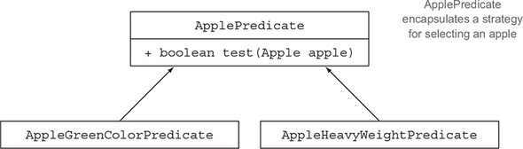
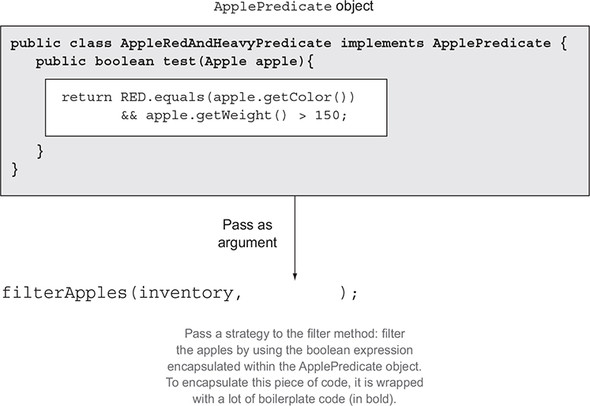
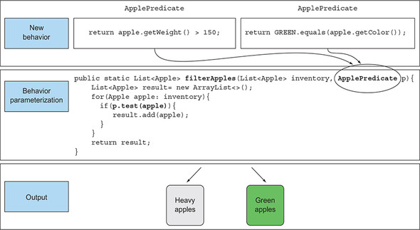
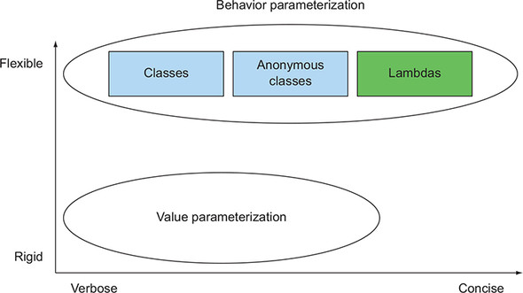

# Chương 2. Truyền code với behavior parameterization

> **Nội dung chương này**
>
> - Đối phó với các yêu cầu luôn thay đổi
> - Behavior parameterization
> - Anonymous class
> - Xem trước về lambda expression
> - Các ví dụ thực tế: Comparator, Runnable và GUI

Một vấn đề ai cũng biết trong kỹ nghệ phần mềm là dù bạn có làm gì đi nữa thì các yêu cầu của người dùng vẫn sẽ thay đổi. Chẳng hạn, hãy tưởng tượng một ứng dụng giúp người nông dân nắm được kho hàng của mình. Người nông dân có thể muốn một tính năng để tìm tất cả những quả táo màu xanh trong kho. Nhưng ngày hôm sau ông ta lại nói với bạn: "Thật ra thì tôi cũng muốn tìm tất cả những quả táo nặng hơn 150 g." Hai ngày sau đó, người nông dân quay lại và bổ sung: "Sẽ thật tuyệt nếu tôi có thể tìm tất cả những quả táo vừa màu xanh vừa nặng hơn 150 g." Bạn sẽ đối phó với những yêu cầu thay đổi liên tục này như thế nào? Lý tưởng nhất là bạn muốn giảm thiểu công sức kỹ thuật bỏ ra. Ngoài ra, những tính năng mới tương tự cũng phải dễ dàng cài đặt và dễ bảo trì về lâu dài.

Behavior parameterization (tham số hoá hành vi) là một mẫu phát triển phần mềm cho phép bạn xử lý những thay đổi yêu cầu diễn ra thường xuyên. Nói ngắn gọn, nó có nghĩa là lấy một khối code và làm cho khối code đó sẵn sàng để dùng mà chưa thực thi nó. Khối code này có thể được gọi sau đó bởi những phần khác trong chương trình của bạn, điều đó có nghĩa là bạn có thể trì hoãn việc thực thi khối code đó. Ví dụ, bạn có thể truyền khối code như một đối số cho một phương thức khác, và phương thức đó sẽ thực thi nó sau. Kết quả là hành vi của phương thức được tham số hoá dựa trên khối code đó. Ví dụ, nếu bạn xử lý một collection, bạn có thể muốn viết một phương thức mà:

- Có thể làm "một việc gì đó" cho mọi phần tử của một danh sách
- Có thể làm "một việc gì đó khác" khi bạn xử lý xong danh sách
- Có thể làm "một việc gì đó nữa" nếu bạn gặp lỗi

Đó chính là điều mà behavior parameterization ám chỉ. Đây là một phép so sánh: người bạn cùng phòng của bạn biết cách lái xe đến siêu thị rồi quay về nhà. Bạn có thể bảo anh ta mua một danh sách các thứ như bánh mì, phô mai và rượu vang. Điều này tương đương với việc gọi một phương thức `goAndBuy` và truyền vào một danh sách sản phẩm làm đối số của nó. Nhưng một ngày nọ bạn đang ở văn phòng, và bạn cần anh ta làm một việc mà anh ta chưa từng làm bao giờ — lấy một bưu kiện từ bưu điện. Bạn cần truyền cho anh ta một danh sách các chỉ dẫn: đi đến bưu điện, dùng mã tham chiếu này, nói chuyện với người quản lý, và nhận gói hàng. Bạn có thể gửi cho anh ta danh sách chỉ dẫn qua email, và khi anh ta nhận được, anh ta có thể làm theo các chỉ dẫn đó. Bây giờ bạn đã làm một việc nâng cao hơn một chút, tương đương với một phương thức `goAndDo` có khả năng thực thi nhiều hành vi mới khác nhau được truyền vào dưới dạng đối số.

Chúng ta sẽ bắt đầu chương này bằng cách dẫn bạn qua một ví dụ về cách bạn có thể tiến hoá code của mình để linh hoạt hơn trước các yêu cầu thay đổi. Dựa trên kiến thức đó, chúng tôi sẽ chỉ ra cách sử dụng behavior parameterization cho vài ví dụ thực tế. Ví dụ, có thể bạn đã từng dùng mẫu behavior parameterization rồi, thông qua các class và interface có sẵn trong Java API để sắp xếp một List, để lọc tên các file, hoặc để bảo một Thread thực thi một khối code, hay thậm chí để xử lý sự kiện GUI. Bạn sẽ sớm nhận ra rằng mẫu này trong lịch sử vốn rất dài dòng trong Java. Lambda expression từ Java 8 trở đi giải quyết vấn đề dài dòng này. Chúng tôi sẽ trình bày ở chương 3 cách xây dựng lambda expression, dùng chúng ở đâu, và làm sao bạn có thể làm code của mình súc tích hơn khi áp dụng chúng.

## 2.1. Đối phó với các yêu cầu luôn thay đổi

Viết code có thể đối phó được với những yêu cầu thay đổi là chuyện khó. Hãy cùng đi qua một ví dụ mà chúng ta sẽ cải tiến dần dần, qua đó cho thấy một vài best practice giúp code của bạn linh hoạt hơn. Trong bối cảnh một ứng dụng quản lý kho nông trại, bạn phải cài đặt một tính năng lọc ra những quả táo màu xanh từ một danh sách. Nghe có vẻ dễ, đúng không?

### 2.1.1. Nỗ lực đầu tiên: lọc táo màu xanh

Giả sử, giống như ở chương 1, bạn có sẵn một enum `Color` để biểu diễn các màu khác nhau của một quả táo:

```java
enum Color { RED, GREEN }
```

Một giải pháp đầu tiên có thể như sau:

```java
public static List<Apple> filterGreenApples(List<Apple> inventory) {
    // Một danh sách tích luỹ dùng để chứa các quả táo
    List<Apple> result = new ArrayList<>();
    for (Apple apple : inventory) {
        // Chỉ chọn những quả táo màu xanh
        if (GREEN.equals(apple.getColor())) {
            result.add(apple);
        }
    }
    return result;
}
```

Dòng được làm nổi bật cho thấy điều kiện cần thiết để chọn ra những quả táo màu xanh. Bạn có thể giả định rằng bạn có sẵn một enum `Color` với một tập các màu, chẳng hạn `GREEN`. Nhưng bây giờ người nông dân đổi ý và muốn lọc cả những quả táo màu đỏ nữa. Bạn có thể làm gì? Một giải pháp ngây thơ sẽ là nhân bản phương thức của bạn, đổi tên nó thành `filterRedApples`, và sửa điều kiện `if` để khớp với táo đỏ. Tuy nhiên, cách tiếp cận này không đối phó tốt với thay đổi nếu người nông dân muốn nhiều màu khác nhau. Một nguyên tắc tốt là: khi bạn thấy mình đang viết code gần như lặp lại, hãy thử trừu tượng hoá thay vì lặp lại.

### 2.1.2. Nỗ lực thứ hai: tham số hoá màu sắc

Làm thế nào để chúng ta tránh việc nhân bản phần lớn code trong `filterGreenApples` để tạo ra `filterRedApples`? Để tham số hoá màu sắc và linh hoạt hơn trước những thay đổi kiểu như vậy, điều bạn có thể làm là thêm một tham số vào phương thức của mình:

```java
public static List<Apple> filterApplesByColor(List<Apple> inventory,
                                              Color color) {
    List<Apple> result = new ArrayList<>();
    for (Apple apple : inventory) {
        if (apple.getColor().equals(color)) {
            result.add(apple);
        }
    }
    return result;
}
```

Bây giờ bạn có thể làm hài lòng người nông dân và gọi phương thức của mình như sau:

```java
List<Apple> greenApples = filterApplesByColor(inventory, GREEN);
List<Apple> redApples = filterApplesByColor(inventory, RED);
...
```

Quá dễ, phải không? Hãy làm cho ví dụ phức tạp lên một chút. Người nông dân quay lại gặp bạn và nói: "Sẽ thật tuyệt nếu phân biệt được táo nhẹ và táo nặng. Táo nặng thường có khối lượng lớn hơn 150 g."

Đội chiếc mũ kỹ sư phần mềm lên, bạn nhận ra trước rằng người nông dân có thể sẽ muốn thay đổi mức khối lượng. Vì vậy bạn tạo ra phương thức sau để đối phó với nhiều mức khối lượng khác nhau thông qua một tham số bổ sung:

```java
public static List<Apple> filterApplesByWeight(List<Apple> inventory,
                                               int weight) {
    List<Apple> result = new ArrayList<>();
    for (Apple apple : inventory) {
        if (apple.getWeight() > weight) {
            result.add(apple);
        }
    }
    return result;
}
```

Đây là một giải pháp tốt, nhưng hãy để ý rằng bạn phải nhân bản phần lớn phần cài đặt để duyệt qua kho hàng và áp dụng tiêu chí lọc lên từng quả táo. Điều này có phần đáng thất vọng vì nó vi phạm nguyên tắc DRY (don't repeat yourself — đừng lặp lại chính mình) trong kỹ nghệ phần mềm. Nếu bạn muốn thay đổi cách duyệt trong bộ lọc để cải thiện hiệu năng thì sao? Lúc này bạn sẽ phải sửa phần cài đặt của tất cả các phương thức thay vì chỉ một phương thức duy nhất. Việc này rất tốn kém xét trên khía cạnh công sức kỹ thuật.

Bạn có thể kết hợp màu sắc và khối lượng vào một phương thức duy nhất, gọi là `filter`. Nhưng khi đó bạn vẫn cần một cách để phân biệt bạn muốn lọc theo thuộc tính nào. Bạn có thể thêm một cờ (flag) để phân biệt giữa truy vấn theo màu và truy vấn theo khối lượng. (Nhưng đừng bao giờ làm thế! Chúng tôi sẽ giải thích lý do ngay sau đây.)

### 2.1.3. Nỗ lực thứ ba: lọc theo mọi thuộc tính mà bạn nghĩ ra được

Một nỗ lực xấu xí nhằm gộp tất cả các thuộc tính lại có thể như sau:

```java
public static List<Apple> filterApples(List<Apple> inventory, Color color,
                                       int weight, boolean flag) {
    List<Apple> result = new ArrayList<>();
    for (Apple apple : inventory) {
        // Một cách xấu xí để chọn theo màu sắc hoặc khối lượng
        if ((flag && apple.getColor().equals(color)) ||
            (!flag && apple.getWeight() > weight)) {
            result.add(apple);
        }
    }
    return result;
}
```

Bạn có thể dùng nó như sau (nhưng nó xấu xí):

```java
List<Apple> greenApples = filterApples(inventory, GREEN, 0, true);
List<Apple> heavyApples = filterApples(inventory, null, 150, false);
...
```

Giải pháp này cực kỳ tệ. Thứ nhất, code phía client trông thật kinh khủng. `true` và `false` nghĩa là gì? Ngoài ra, giải pháp này không đối phó tốt với các yêu cầu thay đổi. Sẽ ra sao nếu người nông dân yêu cầu bạn lọc theo những thuộc tính khác của một quả táo, ví dụ như kích thước, hình dạng, xuất xứ, và vân vân? Hơn nữa, sẽ ra sao nếu người nông dân yêu cầu bạn thực hiện những truy vấn phức tạp hơn kết hợp nhiều thuộc tính, chẳng hạn những quả táo xanh mà cũng phải nặng? Bạn sẽ hoặc là có nhiều phương thức lọc trùng lặp nhau, hoặc là có một phương thức duy nhất cực kỳ phức tạp. Cho tới lúc này, bạn đã tham số hoá phương thức `filterApples` bằng các giá trị như một `String`, một `Integer`, một kiểu enum, hay một `boolean`. Điều này có thể ổn với một số bài toán đã được định nghĩa rõ ràng. Nhưng trong trường hợp này, cái bạn cần là một cách tốt hơn để nói cho phương thức `filterApples` biết tiêu chí chọn táo. Trong mục tiếp theo, chúng tôi mô tả cách tận dụng behavior parameterization để đạt được sự linh hoạt đó.

## 2.2. Behavior parameterization

Bạn đã thấy ở mục trước rằng bạn cần một cách tốt hơn là thêm thật nhiều tham số để đối phó với các yêu cầu thay đổi. Hãy lùi lại một bước và tìm một mức trừu tượng tốt hơn. Một giải pháp khả dĩ là mô hình hoá tiêu chí chọn lựa của bạn: bạn đang làm việc với những quả táo và trả về một giá trị boolean dựa trên vài thuộc tính của `Apple`. Ví dụ, nó có màu xanh không? Nó có nặng hơn 150 g không? Chúng ta gọi cái này là một predicate (một hàm trả về một giá trị boolean). Vì vậy hãy định nghĩa một interface để mô hình hoá tiêu chí chọn lựa:

```java
public interface ApplePredicate {
    boolean test(Apple apple);
}
```

Bây giờ bạn có thể khai báo nhiều phần cài đặt của `ApplePredicate` để biểu diễn các tiêu chí chọn lựa khác nhau, như được trình bày dưới đây (và được minh hoạ trong hình 2.1):

> **Hình 2.1.** Các chiến lược khác nhau để chọn một Apple
>
> 

```java
// Chỉ chọn những quả táo nặng
public class AppleHeavyWeightPredicate implements ApplePredicate {
    public boolean test(Apple apple) {
        return apple.getWeight() > 150;
    }
}

// Chỉ chọn những quả táo màu xanh
public class AppleGreenColorPredicate implements ApplePredicate {
    public boolean test(Apple apple) {
        return GREEN.equals(apple.getColor());
    }
}
```

Bạn có thể xem những tiêu chí này như các hành vi khác nhau dành cho phương thức `filter`. Điều bạn vừa làm có liên quan tới design pattern Strategy (xem http://en.wikipedia.org/wiki/Strategy_pattern), mẫu này cho phép bạn định nghĩa một họ các thuật toán, đóng gói từng thuật toán (gọi là một strategy), và chọn một thuật toán tại thời điểm chạy. Trong trường hợp này, họ thuật toán là `ApplePredicate` và các strategy khác nhau là `AppleHeavyWeightPredicate` và `AppleGreenColorPredicate`.

Nhưng làm thế nào bạn có thể tận dụng các phần cài đặt khác nhau của `ApplePredicate`? Bạn cần phương thức `filterApples` của mình nhận vào các đối tượng `ApplePredicate` để kiểm tra một điều kiện trên một `Apple`. Đây chính là ý nghĩa của behavior parameterization: khả năng bảo một phương thức nhận nhiều hành vi (hay strategy) khác nhau làm tham số và sử dụng chúng ở bên trong để hoàn thành những hành vi khác nhau.

Để đạt được điều này trong ví dụ đang chạy của chúng ta, bạn thêm một tham số vào phương thức `filterApples` để nhận một đối tượng `ApplePredicate`. Điều này mang lại một lợi ích lớn về mặt kỹ nghệ phần mềm: bây giờ bạn có thể tách bạch logic duyệt collection bên trong phương thức `filterApples` với hành vi mà bạn muốn áp dụng lên từng phần tử của collection (trong trường hợp này là một predicate).

### 2.2.1. Nỗ lực thứ tư: lọc theo tiêu chí trừu tượng

Phương thức filter đã được sửa đổi của chúng ta, phương thức sử dụng `ApplePredicate`, trông như sau:

```java
public static List<Apple> filterApples(List<Apple> inventory,
                                       ApplePredicate p) {
    List<Apple> result = new ArrayList<>();
    for (Apple apple : inventory) {
        // Predicate p đóng gói điều kiện cần kiểm tra trên một quả táo.
        if (p.test(apple)) {
            result.add(apple);
        }
    }
    return result;
}
```

**Truyền code/hành vi**

Cũng đáng dừng lại một chút để ăn mừng nho nhỏ. Đoạn code này linh hoạt hơn rất nhiều so với nỗ lực đầu tiên của chúng ta, mà đồng thời nó lại dễ đọc và dễ dùng! Bây giờ bạn có thể tạo ra các đối tượng `ApplePredicate` khác nhau và truyền chúng cho phương thức `filterApples`. Sự linh hoạt miễn phí! Ví dụ, nếu người nông dân yêu cầu bạn tìm tất cả những quả táo đỏ mà nặng hơn 150 g, tất cả những gì bạn cần làm là tạo một class cài đặt `ApplePredicate` một cách tương ứng. Code của bạn giờ đây đủ linh hoạt cho bất kỳ thay đổi yêu cầu nào liên quan đến các thuộc tính của `Apple`:

```java
public class AppleRedAndHeavyPredicate implements ApplePredicate {
    public boolean test(Apple apple) {
        return RED.equals(apple.getColor())
               && apple.getWeight() > 150;
    }
}

List<Apple> redAndHeavyApples =
    filterApples(inventory, new AppleRedAndHeavyPredicate());
```

Bạn đã đạt được một điều rất hay: hành vi của phương thức `filterApples` phụ thuộc vào code mà bạn truyền cho nó thông qua đối tượng `ApplePredicate`. Bạn đã tham số hoá hành vi của phương thức `filterApples`!

Lưu ý rằng trong ví dụ trước, phần code duy nhất thực sự quan trọng là phần cài đặt của phương thức `test`, như được minh hoạ trong hình 2.2; đó là thứ định nghĩa các hành vi mới cho phương thức `filterApples`. Đáng tiếc là, vì phương thức `filterApples` chỉ có thể nhận vào các đối tượng, bạn phải bọc đoạn code đó bên trong một đối tượng `ApplePredicate`. Điều bạn đang làm tương tự như việc truyền code inline, bởi vì bạn đang truyền một biểu thức boolean thông qua một đối tượng cài đặt phương thức `test`. Bạn sẽ thấy ở mục 2.3 (và chi tiết hơn ở chương 3) rằng bằng cách dùng lambda, bạn có thể truyền trực tiếp biểu thức `RED.equals(apple.getColor()) && apple.getWeight() > 150` cho phương thức `filterApples` mà không cần phải định nghĩa nhiều class `ApplePredicate`. Điều này loại bỏ sự dài dòng không cần thiết.

> **Hình 2.2.** Tham số hoá hành vi của filterApples và truyền vào các chiến lược lọc khác nhau
>
> 

**Nhiều hành vi, một tham số**

Như chúng tôi đã giải thích ở trên, behavior parameterization rất tuyệt vì nó cho phép bạn tách bạch logic duyệt collection để lọc với hành vi cần áp dụng lên từng phần tử của collection đó. Hệ quả là, bạn có thể tái sử dụng cùng một phương thức và trao cho nó những hành vi khác nhau để đạt được những kết quả khác nhau, như minh hoạ trong hình 2.3. Đây chính là lý do behavior parameterization là một khái niệm hữu ích mà bạn nên có trong bộ công cụ của mình khi tạo ra các API linh hoạt.

> **Hình 2.3.** Tham số hoá hành vi của filterApples và truyền vào các chiến lược lọc khác nhau
>
> 

Để chắc chắn rằng bạn đã thoải mái với ý tưởng behavior parameterization, hãy thử làm quiz 2.1!

---

**Quiz 2.1: Viết một phương thức prettyPrintApple linh hoạt**

Hãy viết một phương thức `prettyPrintApple` nhận vào một `List` các `Apple` và có thể được tham số hoá bằng nhiều cách khác nhau để sinh ra một kết quả `String` từ một quả táo (hơi giống việc có nhiều phương thức `toString` tuỳ biến). Ví dụ, bạn có thể bảo phương thức `prettyPrintApple` của mình chỉ in ra khối lượng của mỗi quả táo. Ngoài ra, bạn có thể bảo phương thức `prettyPrintApple` in ra từng quả táo riêng lẻ và nêu rõ nó là quả nặng hay quả nhẹ. Lời giải tương tự như các ví dụ lọc mà chúng ta đã khám phá cho tới giờ. Để giúp bạn bắt đầu, chúng tôi cung cấp một bộ khung sơ lược của phương thức `prettyPrintApple`:

```java
public static void prettyPrintApple(List<Apple> inventory, ???) {
    for (Apple apple : inventory) {
        String output = ???.???(apple);
        System.out.println(output);
    }
}
```

**Đáp án:**

Trước hết, bạn cần một cách để biểu diễn một hành vi nhận vào một `Apple` và trả về một kết quả `String` đã được định dạng. Bạn đã làm một việc tương tự khi tạo ra interface `ApplePredicate`:

```java
public interface AppleFormatter {
    String accept(Apple a);
}
```

Bây giờ bạn có thể biểu diễn nhiều hành vi định dạng khác nhau bằng cách cài đặt interface `AppleFormatter`:

```java
public class AppleFancyFormatter implements AppleFormatter {
    public String accept(Apple apple) {
        String characteristic = apple.getWeight() > 150 ? "heavy" : "light";
        return "A " + characteristic +
               " " + apple.getColor() + " apple";
    }
}

public class AppleSimpleFormatter implements AppleFormatter {
    public String accept(Apple apple) {
        return "An apple of " + apple.getWeight() + "g";
    }
}
```

Cuối cùng, bạn cần bảo phương thức `prettyPrintApple` của mình nhận vào các đối tượng `AppleFormatter` và sử dụng chúng ở bên trong. Bạn có thể làm điều này bằng cách thêm một tham số vào `prettyPrintApple`:

```java
public static void prettyPrintApple(List<Apple> inventory,
                                    AppleFormatter formatter) {
    for (Apple apple : inventory) {
        String output = formatter.accept(apple);
        System.out.println(output);
    }
}
```

Bingo! Bây giờ bạn đã có thể truyền nhiều hành vi khác nhau cho phương thức `prettyPrintApple` của mình. Bạn làm việc này bằng cách khởi tạo các phần cài đặt của `AppleFormatter` và đưa chúng vào làm đối số cho `prettyPrintApple`:

```java
prettyPrintApple(inventory, new AppleFancyFormatter());
```

Lệnh này sẽ tạo ra kết quả đại loại như:

```text
A light green apple
A heavy red apple
...
```

Hoặc thử cách này:

```java
prettyPrintApple(inventory, new AppleSimpleFormatter());
```

Lệnh này sẽ tạo ra kết quả đại loại như:

```text
An apple of 80g
An apple of 155g
...
```

---

Bạn đã thấy rằng bạn có thể trừu tượng hoá trên hành vi và làm cho code của mình thích ứng được với các thay đổi yêu cầu, nhưng quá trình này rất dài dòng bởi vì bạn cần khai báo nhiều class mà bạn chỉ khởi tạo có một lần. Hãy xem làm sao để cải thiện điều đó.

## 2.3. Xử lý sự dài dòng

Tất cả chúng ta đều biết rằng một tính năng hay một khái niệm phiền toái khi sử dụng thì sẽ bị né tránh. Ở thời điểm hiện tại, khi bạn muốn truyền một hành vi mới cho phương thức `filterApples` của mình, bạn buộc phải khai báo vài class cài đặt interface `ApplePredicate` rồi khởi tạo vài đối tượng `ApplePredicate` mà bạn chỉ cấp phát một lần duy nhất, như trong listing sau đây, listing này tóm tắt lại những gì bạn đã thấy cho tới giờ. Có rất nhiều sự dài dòng liên quan và đó là một quá trình tốn thời gian!

**Listing 2.1. Behavior parameterization: lọc táo bằng các predicate**

```java
// Chọn những quả táo nặng
public class AppleHeavyWeightPredicate implements ApplePredicate {
    public boolean test(Apple apple) {
        return apple.getWeight() > 150;
    }
}

// Chọn những quả táo màu xanh
public class AppleGreenColorPredicate implements ApplePredicate {
    public boolean test(Apple apple) {
        return GREEN.equals(apple.getColor());
    }
}

public class FilteringApples {
    public static void main(String... args) {
        List<Apple> inventory = Arrays.asList(new Apple(80, GREEN),
                                              new Apple(155, GREEN),
                                              new Apple(120, RED));

        // Kết quả là một List chứa một quả Apple nặng 155 g
        List<Apple> heavyApples =
            filterApples(inventory, new AppleHeavyWeightPredicate());

        // Kết quả là một List chứa hai quả Apple màu xanh
        List<Apple> greenApples =
            filterApples(inventory, new AppleGreenColorPredicate());
    }

    public static List<Apple> filterApples(List<Apple> inventory,
                                           ApplePredicate p) {
        List<Apple> result = new ArrayList<>();
        for (Apple apple : inventory) {
            if (p.test(apple)) {
                result.add(apple);
            }
        }
        return result;
    }
}
```

Đây là một chi phí phụ trội (overhead) không cần thiết. Bạn có thể làm tốt hơn không? Java có một cơ chế gọi là anonymous class, cho phép bạn khai báo và khởi tạo một class cùng một lúc. Chúng giúp bạn cải thiện code thêm một bước nữa bằng cách làm cho nó súc tích hơn một chút. Nhưng chúng vẫn chưa hoàn toàn thoả đáng. Mục 2.3.3 đón đầu chương tiếp theo bằng một bản xem trước ngắn gọn về cách lambda expression có thể làm code của bạn dễ đọc hơn.

### 2.3.1. Anonymous class

Anonymous class cũng giống như các local class (một class được định nghĩa bên trong một khối lệnh) mà bạn vốn đã quen thuộc trong Java. Nhưng anonymous class thì không có tên. Chúng cho phép bạn khai báo và khởi tạo một class cùng một lúc. Nói ngắn gọn, chúng cho phép bạn tạo ra những phần cài đặt tức thời (ad hoc).

### 2.3.2. Nỗ lực thứ năm: dùng một anonymous class

Đoạn code sau đây cho thấy cách viết lại ví dụ lọc bằng việc tạo ra một đối tượng cài đặt `ApplePredicate` bằng anonymous class:

```java
// Tham số hoá hành vi của phương thức filterApples bằng một anonymous class.
List<Apple> redApples = filterApples(inventory, new ApplePredicate() {
    public boolean test(Apple apple) {
        return RED.equals(apple.getColor());
    }
});
```

Anonymous class thường được dùng trong bối cảnh các ứng dụng GUI để tạo ra các đối tượng xử lý sự kiện (event handler). Chúng tôi không muốn khơi lại những ký ức đau thương về Swing, nhưng dưới đây là một mẫu code phổ biến mà bạn hay thấy trong thực tế (ở đây dùng JavaFX API, một nền tảng UI hiện đại cho Java):

```java
button.setOnAction(new EventHandler<ActionEvent>() {
    public void handle(ActionEvent event) {
        System.out.println("Whoooo a click!!");
    }
});
```

Nhưng anonymous class vẫn chưa đủ tốt. Thứ nhất, chúng có xu hướng cồng kềnh vì chiếm rất nhiều chỗ, như thể hiện ở phần code in đậm dưới đây, vẫn dùng hai ví dụ đã nêu trước đó:

```java
// Rất nhiều code khuôn mẫu (boilerplate)
List<Apple> redApples = filterApples(inventory, new ApplePredicate() {
    public boolean test(Apple a) {
        return RED.equals(a.getColor());
    }
});

button.setOnAction(new EventHandler<ActionEvent>() {
    public void handle(ActionEvent event) {
        System.out.println("Whoooo a click!!");
    }
});
```

Thứ hai, nhiều lập trình viên thấy chúng khó hiểu khi sử dụng. Ví dụ, quiz 2.2 trình bày một câu đố Java kinh điển khiến hầu hết lập trình viên phải bất ngờ! Hãy thử sức nào.

---

**Quiz 2.2: Câu đố về anonymous class**

Kết quả in ra sẽ là gì khi đoạn code này được thực thi: 4, 5, 6, hay 42?

```java
public class MeaningOfThis {
    public final int value = 4;

    public void doIt() {
        int value = 6;
        Runnable r = new Runnable() {
            public final int value = 5;
            public void run() {
                int value = 10;
                System.out.println(this.value);
            }
        };
        r.run();
    }

    public static void main(String... args) {
        MeaningOfThis m = new MeaningOfThis();
        m.doIt();  // Kết quả in ra của dòng này là gì?
    }
}
```

**Đáp án:**

Đáp án là 5, bởi vì `this` tham chiếu tới `Runnable` bao quanh nó, chứ không phải class bao ngoài `MeaningOfThis`.

---

Sự dài dòng nói chung là xấu; nó làm người ta ngại dùng một tính năng của ngôn ngữ, bởi vì việc viết và bảo trì code dài dòng tốn rất nhiều thời gian, và đọc nó cũng chẳng dễ chịu chút nào! Code tốt thì phải dễ hiểu chỉ trong một cái liếc mắt. Mặc dù anonymous class phần nào đã xử lý được sự dài dòng gắn với việc khai báo nhiều class cụ thể cho một interface, chúng vẫn chưa thoả đáng. Trong bối cảnh truyền đi một mẩu code đơn giản (ví dụ, một biểu thức boolean biểu diễn một tiêu chí chọn lựa), bạn vẫn phải tạo ra một đối tượng và cài đặt tường minh một phương thức để định nghĩa một hành vi mới (ví dụ, phương thức `test` cho `Predicate` hay phương thức `handle` cho `EventHandler`).

Lý tưởng nhất là chúng ta muốn khuyến khích lập trình viên dùng mẫu behavior parameterization, bởi vì như bạn vừa thấy, nó làm cho code của bạn thích ứng tốt hơn với các thay đổi yêu cầu. Ở chương 3, bạn sẽ thấy rằng những người thiết kế ngôn ngữ Java 8 đã giải quyết vấn đề này bằng cách giới thiệu lambda expression, một cách súc tích hơn để truyền code. Đủ hồi hộp rồi; sau đây là một bản xem trước ngắn về việc lambda expression có thể giúp bạn ra sao trên hành trình đi tìm code sạch.

### 2.3.3. Nỗ lực thứ sáu: dùng một lambda expression

Đoạn code trước có thể được viết lại như sau trong Java 8 bằng một lambda expression:

```java
List<Apple> result =
    filterApples(inventory, (Apple apple) -> RED.equals(apple.getColor()));
```

Bạn phải thừa nhận rằng đoạn code này trông sạch hơn rất nhiều so với những nỗ lực trước đó của chúng ta! Nó tuyệt vời bởi vì nó đang bắt đầu trông gần với phát biểu bài toán hơn nhiều. Bây giờ chúng ta đã xử lý xong vấn đề dài dòng. Hình 2.4 tóm tắt hành trình của chúng ta cho tới giờ.

> **Hình 2.4.** Behavior parameterization so với value parameterization
>
> 

### 2.3.4. Nỗ lực thứ bảy: trừu tượng hoá trên kiểu List

Còn một bước nữa mà bạn có thể thực hiện trên hành trình hướng tới sự trừu tượng. Ở thời điểm hiện tại, phương thức `filterApples` chỉ hoạt động với `Apple`. Nhưng bạn cũng có thể trừu tượng hoá trên kiểu `List` để vượt ra ngoài miền bài toán mà bạn đang nghĩ tới, như sau:

```java
public interface Predicate<T> {
    boolean test(T t);
}

// Giới thiệu một tham số kiểu T
public static <T> List<T> filter(List<T> list, Predicate<T> p) {
    List<T> result = new ArrayList<>();
    for (T e : list) {
        if (p.test(e)) {
            result.add(e);
        }
    }
    return result;
}
```

Bây giờ bạn có thể dùng phương thức `filter` với một `List` chuối, cam, `Integer`, hay `String`! Đây là một ví dụ, dùng lambda expression:

```java
List<Apple> redApples =
    filter(inventory, (Apple apple) -> RED.equals(apple.getColor()));

List<Integer> evenNumbers =
    filter(numbers, (Integer i) -> i % 2 == 0);
```

Thật tuyệt phải không? Bạn đã tìm được điểm cân bằng lý tưởng giữa sự linh hoạt và sự súc tích, điều vốn không thể có được trước Java 8!

## 2.4. Các ví dụ thực tế

Bây giờ bạn đã thấy rằng behavior parameterization là một mẫu hữu ích để dễ dàng thích ứng với các yêu cầu thay đổi. Mẫu này cho phép bạn đóng gói một hành vi (một mẩu code) và tham số hoá hành vi của các phương thức bằng cách truyền và sử dụng những hành vi mà bạn tạo ra (ví dụ, các predicate khác nhau cho một `Apple`). Chúng tôi đã đề cập trước đó rằng cách tiếp cận này tương tự design pattern Strategy. Có thể bạn đã từng dùng mẫu này trong thực tế rồi. Nhiều phương thức trong Java API có thể được tham số hoá bằng những hành vi khác nhau. Những phương thức này thường được dùng kèm với anonymous class. Chúng tôi trình bày bốn ví dụ, những ví dụ này sẽ củng cố cho bạn ý tưởng về việc truyền code: sắp xếp với một Comparator, thực thi một khối code với Runnable, trả về một kết quả từ một tác vụ bằng Callable, và xử lý sự kiện GUI.

### 2.4.1. Sắp xếp với một Comparator

Sắp xếp một collection là một tác vụ lập trình xuất hiện liên tục. Ví dụ, giả sử người nông dân của bạn muốn bạn sắp xếp kho táo dựa trên khối lượng của chúng. Hoặc có lẽ ông ta đổi ý và muốn bạn sắp xếp táo theo màu sắc. Nghe quen chứ? Đúng vậy, bạn cần một cách để biểu diễn và sử dụng những hành vi sắp xếp khác nhau nhằm dễ dàng thích ứng với các yêu cầu thay đổi.

Từ Java 8, một `List` đi kèm với một phương thức `sort` (bạn cũng có thể dùng `Collections.sort`). Hành vi của `sort` có thể được tham số hoá bằng một đối tượng `java.util.Comparator`, đối tượng này có interface như sau:

```java
// java.util.Comparator
public interface Comparator<T> {
    int compare(T o1, T o2);
}
```

Vì vậy bạn có thể tạo ra những hành vi khác nhau cho phương thức `sort` bằng cách tạo một phần cài đặt tức thời của `Comparator`. Ví dụ, bạn có thể dùng nó để sắp xếp kho hàng theo khối lượng tăng dần bằng một anonymous class:

```java
inventory.sort(new Comparator<Apple>() {
    public int compare(Apple a1, Apple a2) {
        return a1.getWeight().compareTo(a2.getWeight());
    }
});
```

Nếu người nông dân đổi ý về cách sắp xếp táo, bạn có thể tạo một `Comparator` tức thời để khớp với yêu cầu mới và truyền nó cho phương thức `sort`. Các chi tiết nội bộ về cách sắp xếp đã được trừu tượng hoá đi. Với một lambda expression, nó sẽ trông như thế này:

```java
inventory.sort(
    (Apple a1, Apple a2) -> a1.getWeight().compareTo(a2.getWeight()));
```

Một lần nữa, đừng lo lắng về cú pháp mới này lúc này; chương tiếp theo sẽ trình bày chi tiết cách viết và sử dụng lambda expression.

### 2.4.2. Thực thi một khối code với Runnable

Thread trong Java cho phép một khối code được thực thi đồng thời với phần còn lại của chương trình. Nhưng làm sao bạn có thể nói cho một thread biết nó nên chạy khối code nào? Nhiều thread có thể mỗi thread chạy một đoạn code khác nhau. Cái bạn cần là một cách để biểu diễn một mẩu code sẽ được thực thi sau. Cho tới Java 8, chỉ có các đối tượng mới được truyền vào constructor của `Thread`, nên mẫu sử dụng vụng về điển hình là truyền vào một anonymous class chứa một phương thức `run` trả về `void` (không có kết quả). Những anonymous class như vậy cài đặt interface `Runnable`.

Trong Java, bạn có thể dùng interface `Runnable` để biểu diễn một khối code cần được thực thi; lưu ý rằng code này trả về `void` (không có kết quả):

```java
// java.lang.Runnable
public interface Runnable {
    void run();
}
```

Bạn có thể dùng interface này để tạo các thread với hành vi tuỳ chọn của mình, như sau:

```java
Thread t = new Thread(new Runnable() {
    public void run() {
        System.out.println("Hello world");
    }
});
```

Nhưng từ Java 8 bạn có thể dùng một lambda expression, nên lời gọi tới `Thread` sẽ trông như thế này:

```java
Thread t = new Thread(() -> System.out.println("Hello world"));
```

### 2.4.3. Trả về một kết quả bằng Callable

Có thể bạn đã quen với trừu tượng `ExecutorService` được giới thiệu trong Java 5. Interface `ExecutorService` tách rời cách các tác vụ được gửi đi với cách chúng được thực thi. Điều hữu ích khi so sánh với việc dùng thread và `Runnable` là bằng cách dùng một `ExecutorService`, bạn có thể gửi một tác vụ tới một pool các thread và cho kết quả của nó được lưu trong một `Future`. Đừng lo nếu điều này còn xa lạ, chúng ta sẽ quay lại chủ đề này ở các chương sau khi bàn về concurrency chi tiết hơn. Còn bây giờ, tất cả những gì bạn cần biết là interface `Callable` được dùng để mô hình hoá một tác vụ có trả về kết quả. Bạn có thể xem nó như một `Runnable` được nâng cấp:

```java
// java.util.concurrent.Callable
public interface Callable<V> {
    V call();
}
```

Bạn có thể dùng nó như sau, bằng cách gửi một tác vụ tới một executor service. Ở đây bạn trả về tên của `Thread` chịu trách nhiệm thực thi tác vụ:

```java
ExecutorService executorService = Executors.newCachedThreadPool();
Future<String> threadName = executorService.submit(new Callable<String>() {
    @Override
    public String call() throws Exception {
        return Thread.currentThread().getName();
    }
});
```

Dùng một lambda expression, đoạn code này rút gọn lại thành:

```java
Future<String> threadName = executorService.submit(
    () -> Thread.currentThread().getName());
```

### 2.4.4. Xử lý sự kiện GUI

Một mẫu điển hình trong lập trình GUI là thực hiện một hành động để đáp lại một sự kiện nào đó, chẳng hạn nhấp chuột hoặc rê chuột qua một đoạn văn bản. Ví dụ, nếu người dùng nhấp vào nút Send, bạn có thể muốn hiển thị một pop up hoặc có lẽ ghi lại hành động đó vào một file. Một lần nữa, bạn cần một cách để đối phó với các thay đổi; bạn phải có khả năng thực hiện bất kỳ phản hồi nào. Trong JavaFX, bạn có thể dùng một `EventHandler` để biểu diễn một phản hồi cho một sự kiện bằng cách truyền nó vào `setOnAction`:

```java
Button button = new Button("Send");
button.setOnAction(new EventHandler<ActionEvent>() {
    public void handle(ActionEvent event) {
        label.setText("Sent!!");
    }
});
```

Ở đây, hành vi của phương thức `setOnAction` được tham số hoá bằng các đối tượng `EventHandler`. Với một lambda expression, nó sẽ trông như sau:

```java
button.setOnAction((ActionEvent event) -> label.setText("Sent!!"));
```

## Tóm tắt

- Behavior parameterization là khả năng của một phương thức trong việc nhận vào nhiều hành vi khác nhau làm tham số và sử dụng chúng ở bên trong để hoàn thành những hành vi khác nhau.
- Behavior parameterization cho phép bạn làm cho code của mình thích ứng tốt hơn với các yêu cầu thay đổi và tiết kiệm công sức kỹ thuật trong tương lai.
- Truyền code là một cách để trao những hành vi mới làm đối số cho một phương thức. Nhưng cách này rất dài dòng trước Java 8. Anonymous class đã giúp ích được phần nào trước Java 8 trong việc loại bỏ sự dài dòng gắn với việc khai báo nhiều class cụ thể cho một interface mà chỉ cần dùng đúng một lần.
- Java API chứa nhiều phương thức có thể được tham số hoá bằng những hành vi khác nhau, bao gồm sắp xếp, thread, và xử lý GUI.
