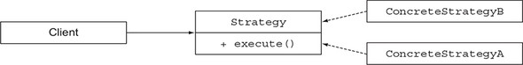
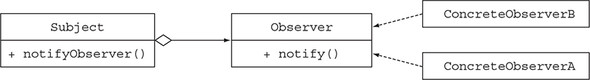
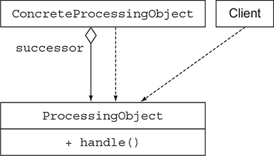
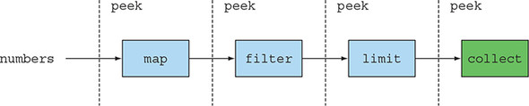

# Chương 9. Refactoring, testing và debugging

> **Nội dung chương này**
>
> - Refactoring code để sử dụng lambda expression
> - Nhận thức được tác động của lambda expression lên các design pattern hướng đối tượng
> - Testing lambda expression
> - Debugging code sử dụng lambda expression và Streams API

Trong tám chương đầu của cuốn sách này, bạn đã thấy sức mạnh biểu đạt của lambda và Streams API. Chủ yếu bạn đang viết code mới sử dụng các tính năng này. Nếu bạn phải bắt đầu một dự án Java mới, bạn có thể dùng lambda và stream ngay lập tức.

Đáng tiếc là bạn không phải lúc nào cũng được bắt đầu một dự án hoàn toàn mới từ con số không. Phần lớn thời gian bạn phải làm việc với một code base sẵn có được viết bằng một phiên bản Java cũ hơn.

Chương này trình bày một số "công thức" cho bạn thấy cách refactoring code sẵn có để sử dụng lambda expression nhằm đạt được tính dễ đọc và tính linh hoạt. Ngoài ra, chúng ta sẽ thảo luận về việc một số design pattern hướng đối tượng (bao gồm Strategy, Template Method, Observer, Chain of Responsibility và Factory) có thể được viết ngắn gọn hơn như thế nào nhờ lambda expression. Cuối cùng, chúng ta khám phá cách bạn có thể test và debug code sử dụng lambda expression và Streams API.

Trong chương 10, chúng ta sẽ khám phá một cách refactoring code có phạm vi rộng hơn nhằm làm cho logic ứng dụng dễ đọc hơn: tạo ra một domain-specific language (ngôn ngữ chuyên biệt cho miền nghiệp vụ).

## 9.1. Refactoring để cải thiện tính dễ đọc và tính linh hoạt

Ngay từ đầu cuốn sách này, chúng tôi đã lập luận rằng lambda expression cho phép bạn viết code ngắn gọn và linh hoạt hơn. Code ngắn gọn hơn bởi vì lambda expression cho phép bạn biểu diễn một mẩu hành vi dưới dạng cô đọng hơn so với việc dùng anonymous class. Trong chương 3, chúng tôi cũng đã chỉ cho bạn thấy rằng method reference còn cho phép bạn viết code ngắn gọn hơn nữa khi tất cả những gì bạn muốn làm chỉ là truyền một phương thức sẵn có làm đối số cho một phương thức khác.

Code của bạn linh hoạt hơn bởi vì lambda expression khuyến khích phong cách behavior parameterization (tham số hoá hành vi) mà chúng tôi đã giới thiệu ở chương 2. Code của bạn có thể sử dụng và thực thi nhiều hành vi khác nhau được truyền vào dưới dạng đối số để ứng phó với những thay đổi về yêu cầu.

Trong mục này, chúng tôi gộp tất cả lại với nhau và chỉ cho bạn những bước đơn giản để refactoring code nhằm đạt được tính dễ đọc và tính linh hoạt, sử dụng các tính năng bạn đã học ở các chương trước: lambda, method reference và stream.

### 9.1.1. Cải thiện tính dễ đọc của code

Cải thiện tính dễ đọc của code nghĩa là gì? Định nghĩa thế nào là dễ đọc có thể mang tính chủ quan. Quan điểm chung là thuật ngữ này có nghĩa "code này dễ được một người khác hiểu đến mức nào". Cải thiện tính dễ đọc của code đảm bảo rằng code của bạn có thể hiểu được và bảo trì được bởi những người khác ngoài bạn. Bạn có thể thực hiện một vài bước để chắc chắn rằng code của mình dễ hiểu với người khác, chẳng hạn như đảm bảo code được viết tài liệu đầy đủ và tuân theo các chuẩn viết code.

Việc sử dụng các tính năng được giới thiệu trong Java 8 cũng có thể cải thiện tính dễ đọc của code so với các phiên bản trước. Bạn có thể giảm bớt sự dài dòng của code, khiến nó dễ hiểu hơn. Ngoài ra, bạn có thể thể hiện rõ ý định của code tốt hơn bằng cách dùng method reference và Streams API.

Trong chương này, chúng tôi mô tả ba phép refactoring đơn giản sử dụng lambda, method reference và stream mà bạn có thể áp dụng cho code của mình để cải thiện tính dễ đọc:

- Refactoring anonymous class thành lambda expression
- Refactoring lambda expression thành method reference
- Refactoring việc xử lý dữ liệu theo phong cách mệnh lệnh (imperative) thành stream

### 9.1.2. Từ anonymous class sang lambda expression

Phép refactoring đơn giản đầu tiên mà bạn nên cân nhắc là chuyển đổi các chỗ dùng anonymous class cài đặt một phương thức abstract duy nhất thành lambda expression. Tại sao? Chúng tôi hy vọng rằng ở các chương trước, chúng tôi đã thuyết phục được bạn rằng anonymous class thì dài dòng và dễ gây lỗi. Bằng cách áp dụng lambda expression, bạn tạo ra code súc tích và dễ đọc hơn. Như đã trình bày ở chương 3, dưới đây là một anonymous class để tạo một đối tượng Runnable và bản tương ứng dùng lambda expression:

```java
// Trước, dùng anonymous class
Runnable r1 = new Runnable() {
    public void run() {
        System.out.println("Hello");
    }
};

// Sau, dùng lambda expression
Runnable r2 = () -> System.out.println("Hello");
```

Tuy nhiên, việc chuyển anonymous class thành lambda expression có thể là một quá trình khó khăn trong một số tình huống nhất định.[1] Thứ nhất, ý nghĩa của `this` và `super` là khác nhau giữa anonymous class và lambda expression. Bên trong một anonymous class, `this` tham chiếu đến chính anonymous class đó, nhưng bên trong một lambda, nó tham chiếu đến class bao ngoài. Thứ hai, anonymous class được phép che khuất (shadow) các biến của class bao ngoài. Lambda expression thì không (chúng sẽ gây lỗi biên dịch), như minh hoạ trong đoạn code sau:

> [1] Bài báo xuất sắc sau đây mô tả quy trình này chi tiết hơn: http://dig.cs.illinois.edu/papers/lambdaRefactoring.pdf.

```java
int a = 10;
Runnable r1 = () -> {
    int a = 2;  // Lỗi biên dịch
    System.out.println(a);
};
Runnable r2 = new Runnable() {
    public void run() {
        int a = 2;  // Mọi thứ đều ổn!
        System.out.println(a);
    }
};
```

Cuối cùng, việc chuyển một anonymous class thành lambda expression có thể khiến code kết quả trở nên nhập nhằng trong bối cảnh có overload. Thật vậy, kiểu của anonymous class là tường minh tại thời điểm khởi tạo, nhưng kiểu của lambda lại phụ thuộc vào ngữ cảnh của nó. Dưới đây là một ví dụ cho thấy tình huống này có thể gây rắc rối ra sao. Giả sử bạn đã khai báo một functional interface có cùng signature với Runnable, ở đây gọi là Task (điều này có thể xảy ra khi bạn cần những tên interface có ý nghĩa hơn trong domain model của mình):

```java
interface Task {
    public void execute();
}

public static void doSomething(Runnable r) { r.run(); }
public static void doSomething(Task a) { r.execute(); }
```

Bây giờ bạn có thể truyền vào một anonymous class cài đặt Task mà không gặp vấn đề gì:

```java
doSomething(new Task() {
    public void execute() {
        System.out.println("Danger danger!!");
    }
});
```

Nhưng việc chuyển anonymous class này thành lambda expression lại dẫn đến một lời gọi phương thức nhập nhằng, bởi vì cả Runnable và Task đều là target type hợp lệ:

```java
// Vấn đề; cả doSomething(Runnable) lẫn doSomething(Task) đều khớp.
doSomething(() -> System.out.println("Danger danger!!"));
```

Bạn có thể giải quyết sự nhập nhằng bằng cách cung cấp một ép kiểu tường minh `(Task)`:

```java
doSomething((Task)() -> System.out.println("Danger danger!!"));
```

Tuy vậy, đừng để những vấn đề này làm bạn nản lòng; có tin tốt đây! Hầu hết các môi trường phát triển tích hợp (IDE) — chẳng hạn NetBeans, Eclipse và IntelliJ — đều hỗ trợ phép refactoring này và tự động đảm bảo rằng những cạm bẫy trên không xảy ra.

### 9.1.3. Từ lambda expression sang method reference

Lambda expression rất tuyệt cho những đoạn code ngắn cần được truyền đi khắp nơi. Nhưng hãy cân nhắc dùng method reference bất cứ khi nào có thể để cải thiện tính dễ đọc của code. Một tên phương thức thể hiện ý định của code rõ ràng hơn. Chẳng hạn ở chương 6, chúng tôi đã chỉ cho bạn đoạn code sau để nhóm các món ăn theo mức calo:

```java
Map<CaloricLevel, List<Dish>> dishesByCaloricLevel =
    menu.stream()
        .collect(
            groupingBy(dish -> {
                if (dish.getCalories() <= 400) return CaloricLevel.DIET;
                else if (dish.getCalories() <= 700) return CaloricLevel.NORMAL;
                else return CaloricLevel.FAT;
            }));
```

Bạn có thể trích lambda expression này ra thành một phương thức riêng và truyền nó làm đối số cho groupingBy. Code trở nên ngắn gọn hơn, và ý định của nó rõ ràng hơn:

```java
Map<CaloricLevel, List<Dish>> dishesByCaloricLevel =
    // Lambda expression đã được trích xuất thành một phương thức.
    menu.stream().collect(groupingBy(Dish::getCaloricLevel));
```

Bạn cần thêm phương thức getCaloricLevel vào bên trong chính class Dish để đoạn code này hoạt động:

```java
public class Dish {
    ...
    public CaloricLevel getCaloricLevel() {
        if (this.getCalories() <= 400) return CaloricLevel.DIET;
        else if (this.getCalories() <= 700) return CaloricLevel.NORMAL;
        else return CaloricLevel.FAT;
    }
}
```

Ngoài ra, hãy cân nhắc dùng các static method trợ giúp như comparing và maxBy bất cứ khi nào có thể. Những phương thức này được thiết kế để dùng cùng method reference! Thật vậy, đoạn code sau thể hiện ý định của nó rõ ràng hơn nhiều so với bản tương ứng dùng lambda expression, như chúng tôi đã chỉ cho bạn ở chương 3:

```java
// Bạn phải suy nghĩ về cách cài đặt phép so sánh.
inventory.sort(
    (Apple a1, Apple a2) -> a1.getWeight().compareTo(a2.getWeight()));

// Đọc lên giống như chính phát biểu của bài toán
inventory.sort(comparing(Apple::getWeight));
```

Hơn nữa, với nhiều phép reduction thông dụng như tính tổng hay tìm giá trị lớn nhất, đã có sẵn các phương thức trợ giúp dựng sẵn có thể kết hợp với method reference. Ví dụ, chúng tôi đã chỉ cho bạn thấy rằng bằng cách dùng Collectors API, bạn có thể tìm giá trị lớn nhất hoặc tính tổng theo cách rõ ràng hơn so với việc kết hợp một lambda expression với phép reduce ở mức thấp hơn. Thay vì viết

```java
int totalCalories =
    menu.stream().map(Dish::getCalories)
                 .reduce(0, (c1, c2) -> c1 + c2);
```

hãy thử dùng các collector dựng sẵn thay thế, vốn phát biểu bài toán rõ ràng hơn. Ở đây, chúng ta dùng collector summingInt (tên gọi đóng góp rất nhiều vào việc tự tài liệu hoá code của bạn):

```java
int totalCalories =
    menu.stream().collect(summingInt(Dish::getCalories));
```

### 9.1.4. Từ xử lý dữ liệu kiểu mệnh lệnh sang Streams

Lý tưởng nhất, bạn nên cố gắng chuyển đổi toàn bộ code xử lý một collection theo các mẫu xử lý dữ liệu điển hình bằng iterator sang dùng Streams API. Tại sao? Streams API thể hiện rõ ràng hơn ý định của một pipeline xử lý dữ liệu. Ngoài ra, stream có thể được tối ưu hoá ở phía sau hậu trường, tận dụng short-circuiting và laziness cũng như khai thác kiến trúc đa lõi của bạn, như chúng tôi đã giải thích ở chương 7.

Đoạn code mệnh lệnh sau đây thể hiện hai mẫu (lọc và trích xuất) bị trộn lẫn với nhau, buộc lập trình viên phải xem xét cẩn thận toàn bộ phần cài đặt trước khi hiểu được code làm gì. Ngoài ra, một phần cài đặt chạy song song sẽ khó viết hơn rất nhiều. Hãy xem chương 7 (đặc biệt là mục 7.2) để hình dung khối lượng công việc liên quan:

```java
List<String> dishNames = new ArrayList<>();
for (Dish dish : menu) {
    if (dish.getCalories() > 300) {
        dishNames.add(dish.getName());
    }
}
```

Phương án thay thế, sử dụng Streams API, đọc lên giống với phát biểu bài toán hơn, và nó có thể được song song hoá một cách dễ dàng:

```java
menu.parallelStream()
    .filter(d -> d.getCalories() > 300)
    .map(Dish::getName)
    .collect(toList());
```

Đáng tiếc, việc chuyển code mệnh lệnh sang Streams API có thể là một nhiệm vụ khó khăn, bởi vì bạn cần suy nghĩ về các câu lệnh điều khiển luồng như `break`, `continue` và `return`, rồi từ đó suy ra các phép toán stream phù hợp để dùng. Tin tốt là cũng có một số công cụ có thể giúp bạn trong nhiệm vụ này. Tin tốt là một số công cụ (ví dụ Lambda-Ficator, https://ieeexplore.ieee.org/document/6606699) cũng có thể giúp bạn trong nhiệm vụ này.

### 9.1.5. Cải thiện tính linh hoạt của code

Chúng tôi đã lập luận ở chương 2 và chương 3 rằng lambda expression khuyến khích phong cách behavior parameterization. Bạn có thể biểu diễn nhiều hành vi khác nhau bằng các lambda khác nhau, rồi truyền chúng đi để thực thi. Phong cách này giúp bạn ứng phó với những thay đổi về yêu cầu (chẳng hạn tạo ra nhiều cách lọc khác nhau bằng Predicate hoặc nhiều cách so sánh khác nhau bằng Comparator). Ở mục tiếp theo, chúng ta sẽ xem xét một vài mẫu mà bạn có thể áp dụng cho code base của mình để hưởng lợi ngay lập tức từ lambda expression.

#### Áp dụng functional interface

Trước hết, bạn không thể dùng lambda expression nếu không có functional interface; do đó, bạn nên bắt đầu đưa chúng vào code base của mình. Nhưng trong những tình huống nào thì bạn nên đưa chúng vào? Trong chương này, chúng ta thảo luận hai mẫu code phổ biến có thể được refactoring để tận dụng lambda expression: conditional deferred execution (thực thi trì hoãn có điều kiện) và execute around (thực thi bao quanh). Ngoài ra, ở mục tiếp theo, chúng tôi sẽ chỉ cho bạn thấy nhiều design pattern hướng đối tượng khác nhau — chẳng hạn Strategy và Template Method — có thể được viết lại ngắn gọn hơn bằng lambda expression như thế nào.

#### Conditional deferred execution

Việc thấy các câu lệnh điều khiển luồng bị trộn lẫn bên trong code logic nghiệp vụ là chuyện thường gặp. Các kịch bản điển hình bao gồm kiểm tra bảo mật và ghi log. Hãy xét đoạn code sau, vốn dùng class Logger dựng sẵn của Java:

```java
if (logger.isLoggable(Log.FINER)) {
    logger.finer("Problem: " + generateDiagnostic());
}
```

Có gì sai với nó? Một vài điều:

- Trạng thái của logger (nó hỗ trợ mức nào) bị phơi bày ra code phía client thông qua phương thức isLoggable.
- Tại sao bạn lại phải truy vấn trạng thái của đối tượng logger mỗi lần trước khi ghi một thông điệp log? Điều đó làm code của bạn rối rắm.

Một phương án tốt hơn là dùng phương thức log, vốn kiểm tra bên trong xem đối tượng logger có được đặt ở mức phù hợp hay không trước khi ghi thông điệp:

```java
logger.log(Level.FINER, "Problem: " + generateDiagnostic());
```

Cách tiếp cận này tốt hơn bởi vì code của bạn không còn bị rối bởi các phép kiểm tra `if`, và trạng thái của logger không còn bị phơi bày nữa. Đáng tiếc, đoạn code này vẫn còn một vấn đề: thông điệp log luôn luôn được tính toán, ngay cả khi logger không được bật cho mức thông điệp được truyền vào làm đối số.

Lambda expression có thể giúp ích. Thứ bạn cần là một cách để trì hoãn việc xây dựng thông điệp sao cho nó chỉ được sinh ra khi thoả một điều kiện nhất định (ở đây là khi mức của logger được đặt thành FINER). Hoá ra là những người thiết kế Java 8 API đã biết về vấn đề này và đã giới thiệu một phiên bản overload thay thế của log nhận một Supplier làm đối số. Phương thức log thay thế này có signature như sau:

```java
public void log(Level level, Supplier<String> msgSupplier)
```

Bây giờ bạn có thể gọi nó như sau:

```java
logger.log(Level.FINER, () -> "Problem: " + generateDiagnostic());
```

Phương thức log bên trong chỉ thực thi lambda được truyền vào làm đối số nếu logger đang ở mức phù hợp. Phần cài đặt bên trong của phương thức log đại khái như sau:

```java
public void log(Level level, Supplier<String> msgSupplier) {
    if (logger.isLoggable(level)) {
        log(level, msgSupplier.get());  // Thực thi lambda
    }
}
```

Bài học rút ra từ câu chuyện này là gì? Nếu bạn thấy mình đang truy vấn trạng thái của một đối tượng (chẳng hạn trạng thái của logger) nhiều lần trong code phía client, chỉ để rồi gọi một phương thức nào đó trên đối tượng này với các đối số (chẳng hạn để ghi một thông điệp log), hãy cân nhắc đưa vào một phương thức mới, phương thức này chỉ gọi phương thức kia — được truyền vào dưới dạng lambda hoặc method reference — sau khi đã kiểm tra trạng thái của đối tượng ở bên trong. Code của bạn sẽ dễ đọc hơn (bớt rối rắm) và được encapsulation tốt hơn, mà không phơi bày trạng thái của đối tượng ra code phía client.

#### Execute around

Ở chương 3, chúng ta đã thảo luận một mẫu khác mà bạn có thể áp dụng: execute around. Nếu bạn thấy mình đang bao quanh những đoạn code khác nhau bằng cùng những pha chuẩn bị và dọn dẹp giống hệt nhau, bạn thường có thể rút phần code đó ra thành một lambda. Lợi ích là bạn có thể tái sử dụng phần logic xử lý các pha chuẩn bị và dọn dẹp, nhờ đó giảm được sự trùng lặp code.

Dưới đây là đoạn code bạn đã thấy ở chương 3. Nó tái sử dụng cùng một logic để mở và đóng một file, nhưng có thể được tham số hoá bằng các lambda khác nhau để xử lý file:

```java
// Truyền vào một lambda.
String oneLine =
    processFile((BufferedReader b) -> b.readLine());

// Truyền vào một lambda khác.
String twoLines =
    processFile((BufferedReader b) -> b.readLine() + b.readLine());

public static String processFile(BufferedReaderProcessor p) throws IOException {
    try (BufferedReader br = new BufferedReader(
             new FileReader("ModernJavaInAction/chap9/data.txt"))) {
        // Thực thi BufferedReaderProcessor được truyền vào làm đối số.
        return p.process(br);
    }
}

// Một functional interface cho lambda, có thể ném ra IOException
public interface BufferedReaderProcessor {
    String process(BufferedReader b) throws IOException;
}
```

Đoạn code này khả thi được là nhờ việc đưa vào functional interface BufferedReaderProcessor, cho phép bạn truyền các lambda khác nhau để làm việc với một đối tượng BufferedReader.

Trong mục này, bạn đã thấy cách áp dụng nhiều "công thức" khác nhau để cải thiện tính dễ đọc và tính linh hoạt của code. Ở mục tiếp theo, bạn sẽ thấy lambda expression có thể loại bỏ code khuôn mẫu (boilerplate) gắn liền với các design pattern hướng đối tượng phổ biến như thế nào.

## 9.2. Refactoring các design pattern hướng đối tượng bằng lambda

Các tính năng ngôn ngữ mới thường khiến những mẫu code hay thành ngữ lập trình sẵn có trở nên kém phổ biến hơn. Chẳng hạn, việc giới thiệu vòng lặp for-each trong Java 5 đã thay thế nhiều chỗ dùng iterator tường minh bởi vì nó ít gây lỗi hơn và ngắn gọn hơn. Việc giới thiệu toán tử diamond `<>` trong Java 7 đã giảm bớt việc dùng generic tường minh khi tạo đối tượng (và dần dần thúc đẩy các lập trình viên Java đón nhận type inference).

Có một lớp mẫu đặc thù được gọi là design pattern.[2] Design pattern là những bản thiết kế tái sử dụng được, nếu bạn muốn gọi vậy, cho các bài toán phổ biến trong thiết kế phần mềm. Chúng khá giống với việc các kỹ sư xây dựng có sẵn một tập các giải pháp tái sử dụng được để xây cầu cho những kịch bản cụ thể (cầu treo, cầu vòm, v.v.). Ví dụ, design pattern visitor là một giải pháp phổ biến để tách một thuật toán ra khỏi cấu trúc mà nó cần thao tác lên. Pattern singleton là một giải pháp phổ biến để hạn chế việc khởi tạo một class chỉ còn một đối tượng duy nhất.

> [2] Xem *Design Patterns: Elements of Reusable Object-Oriented Software*, của Erich Gamma, Richard Helm, Ralph Johnson và John Vlissides; ISBN 978-0201633610, ISBN 0-201-63361-2

Lambda expression cung cấp thêm một công cụ mới nữa trong hộp đồ nghề của lập trình viên. Chúng có thể đưa ra những giải pháp thay thế cho chính các bài toán mà những design pattern kia đang giải quyết, nhưng thường với ít công sức hơn và theo cách đơn giản hơn. Nhiều design pattern hướng đối tượng sẵn có có thể trở nên dư thừa hoặc được viết theo cách ngắn gọn hơn bằng lambda expression.

Trong mục này, chúng ta khám phá năm design pattern:

- Strategy
- Template Method
- Observer
- Chain of Responsibility
- Factory

Chúng tôi sẽ chỉ cho bạn thấy lambda expression có thể cung cấp một cách thay thế để giải quyết bài toán mà mỗi design pattern nhắm tới như thế nào.

### 9.2.1. Strategy

Pattern Strategy là một giải pháp phổ biến để biểu diễn một họ các thuật toán và cho phép bạn chọn giữa chúng tại thời điểm chạy (runtime). Bạn đã thấy pattern này một cách sơ lược ở chương 2 khi chúng tôi chỉ cho bạn cách lọc một kho hàng bằng những predicate khác nhau (chẳng hạn táo nặng hoặc táo xanh). Bạn có thể áp dụng pattern này cho vô số kịch bản, chẳng hạn kiểm tra hợp lệ một dữ liệu đầu vào theo các tiêu chí khác nhau, dùng các cách phân tích cú pháp (parsing) khác nhau, hoặc định dạng một đầu vào.

Pattern Strategy gồm ba phần, như minh hoạ ở hình 9.1:

- Một interface biểu diễn một thuật toán nào đó (interface Strategy)
- Một hoặc nhiều phần cài đặt cụ thể của interface đó để biểu diễn nhiều thuật toán (các class cụ thể ConcreteStrategyA, ConcreteStrategyB)
- Một hoặc nhiều client sử dụng các đối tượng strategy

> **Hình 9.1.** Design pattern Strategy
>
> 

Giả sử bạn muốn kiểm tra xem một văn bản đầu vào có được định dạng đúng theo các tiêu chí khác nhau hay không (chẳng hạn chỉ gồm chữ thường, hoặc là số). Bạn bắt đầu bằng việc định nghĩa một interface để kiểm tra hợp lệ văn bản (được biểu diễn dưới dạng String):

```java
public interface ValidationStrategy {
    boolean execute(String s);
}
```

Thứ hai, bạn định nghĩa một hoặc nhiều phần cài đặt của interface đó:

```java
public class IsAllLowerCase implements ValidationStrategy {
    public boolean execute(String s) {
        return s.matches("[a-z]+");
    }
}

public class IsNumeric implements ValidationStrategy {
    public boolean execute(String s) {
        return s.matches("\\d+");
    }
}
```

Sau đó bạn có thể dùng các validation strategy khác nhau này trong chương trình của mình:

```java
public class Validator {
    private final ValidationStrategy strategy;

    public Validator(ValidationStrategy v) {
        this.strategy = v;
    }

    public boolean validate(String s) {
        return strategy.execute(s);
    }
}

Validator numericValidator = new Validator(new IsNumeric());
boolean b1 = numericValidator.validate("aaaa");  // Trả về false

Validator lowerCaseValidator = new Validator(new IsAllLowerCase());
boolean b2 = lowerCaseValidator.validate("bbbb");  // Trả về true
```

#### Sử dụng lambda expression

Đến giờ, hẳn bạn đã nhận ra rằng ValidationStrategy là một functional interface. Ngoài ra, nó có cùng function descriptor với `Predicate<String>`. Kết quả là, thay vì khai báo các class mới để cài đặt những strategy khác nhau, bạn có thể truyền trực tiếp các lambda expression ngắn gọn hơn:

```java
// Truyền trực tiếp một lambda
Validator numericValidator =
    new Validator((String s) -> s.matches("[a-z]+"));
boolean b1 = numericValidator.validate("aaaa");

// Truyền trực tiếp một lambda
Validator lowerCaseValidator =
    new Validator((String s) -> s.matches("\\d+"));
boolean b2 = lowerCaseValidator.validate("bbbb");
```

Như bạn thấy, lambda expression loại bỏ được code khuôn mẫu vốn cố hữu trong design pattern Strategy. Nếu bạn suy nghĩ kỹ, lambda expression đóng gói một mẩu code (hay một strategy), vốn chính là điều mà design pattern Strategy được tạo ra để làm, vì vậy chúng tôi khuyên bạn nên dùng lambda expression thay thế cho những bài toán tương tự.

### 9.2.2. Template method

Design pattern Template Method là một giải pháp phổ biến khi bạn cần biểu diễn khung sườn của một thuật toán mà vẫn có thêm sự linh hoạt để thay đổi một số phần nhất định của nó. Được rồi, pattern này nghe có vẻ hơi trừu tượng. Nói cách khác, pattern Template Method hữu ích khi bạn thấy mình nói rằng "Tôi rất muốn dùng thuật toán này, nhưng tôi cần thay đổi vài dòng để nó làm đúng điều tôi muốn."

Đây là một ví dụ về cách pattern này hoạt động. Giả sử bạn cần viết một ứng dụng ngân hàng trực tuyến đơn giản. Người dùng thường nhập vào một ID khách hàng; ứng dụng lấy thông tin chi tiết của khách hàng từ cơ sở dữ liệu của ngân hàng và làm một việc gì đó để khách hàng vui lòng. Những ứng dụng ngân hàng trực tuyến khác nhau cho những chi nhánh ngân hàng khác nhau có thể có những cách khác nhau để làm khách hàng vui lòng (chẳng hạn cộng thêm tiền thưởng vào tài khoản của họ hoặc gửi cho họ ít giấy tờ hơn). Bạn có thể viết class abstract sau để biểu diễn ứng dụng ngân hàng trực tuyến:

```java
abstract class OnlineBanking {
    public void processCustomer(int id) {
        Customer c = Database.getCustomerWithId(id);
        makeCustomerHappy(c);
    }

    abstract void makeCustomerHappy(Customer c);
}
```

Phương thức processCustomer cung cấp một phác thảo cho thuật toán ngân hàng trực tuyến: lấy khách hàng theo ID của họ và làm cho khách hàng vui lòng. Bây giờ các chi nhánh khác nhau có thể cung cấp những phần cài đặt khác nhau của phương thức makeCustomerHappy bằng cách kế thừa class OnlineBanking.

#### Sử dụng lambda expression

Bạn có thể giải quyết cùng bài toán đó (tạo ra khung sườn của một thuật toán và cho phép người cài đặt cắm thêm một số phần vào) bằng cách dùng lambda yêu thích của mình. Các thành phần của thuật toán mà bạn muốn cắm vào có thể được biểu diễn bằng lambda expression hoặc method reference.

Ở đây, chúng ta đưa vào một đối số thứ hai cho phương thức processCustomer có kiểu `Consumer<Customer>` bởi vì nó khớp với signature của phương thức makeCustomerHappy được định nghĩa trước đó:

```java
public void processCustomer(int id, Consumer<Customer> makeCustomerHappy) {
    Customer c = Database.getCustomerWithId(id);
    makeCustomerHappy.accept(c);
}
```

Giờ đây bạn có thể cắm trực tiếp những hành vi khác nhau vào mà không cần kế thừa class OnlineBanking, bằng cách truyền vào các lambda expression:

```java
new OnlineBankingLambda().processCustomer(1337, (Customer c) ->
    System.out.println("Hello " + c.getName()));
```

Ví dụ này cho thấy lambda expression có thể giúp bạn loại bỏ phần boilerplate vốn cố hữu trong các design pattern như thế nào.

### 9.2.3. Observer

Design pattern Observer là một giải pháp phổ biến khi một đối tượng (gọi là subject) cần tự động thông báo cho một danh sách các đối tượng khác (gọi là observer) khi một sự kiện nào đó xảy ra (chẳng hạn một thay đổi trạng thái). Bạn thường bắt gặp pattern này khi làm việc với các ứng dụng GUI. Bạn đăng ký một tập các observer lên một thành phần GUI, chẳng hạn một nút bấm. Nếu nút được nhấn, các observer sẽ được thông báo và có thể thực thi một hành động cụ thể. Nhưng pattern Observer không chỉ giới hạn ở GUI. Design pattern Observer cũng phù hợp trong tình huống mà nhiều nhà giao dịch (observer) muốn phản ứng với sự thay đổi giá của một cổ phiếu (subject). Hình 9.2 minh hoạ sơ đồ UML của pattern Observer.

> **Hình 9.2.** Design pattern Observer
>
> 

Bây giờ hãy viết một chút code để thấy pattern Observer hữu ích như thế nào trong thực tế. Bạn sẽ thiết kế và cài đặt một hệ thống thông báo tuỳ biến cho một ứng dụng như Twitter. Ý tưởng rất đơn giản: một số hãng báo (The New York Times, The Guardian và Le Monde) đăng ký nhận một luồng tin tweet tin tức và có thể muốn nhận được thông báo nếu một tweet chứa một từ khoá cụ thể.

Trước hết, bạn cần một interface Observer để gom nhóm các observer. Nó có một phương thức, gọi là notify, sẽ được subject (Feed) gọi khi có một tweet mới:

```java
interface Observer {
    void notify(String tweet);
}
```

Bây giờ bạn có thể khai báo những observer khác nhau (ở đây là ba tờ báo) tạo ra một hành động khác nhau ứng với mỗi từ khoá khác nhau chứa trong một tweet:

```java
class NYTimes implements Observer {
    public void notify(String tweet) {
        if (tweet != null && tweet.contains("money")) {
            System.out.println("Breaking news in NY! " + tweet);
        }
    }
}

class Guardian implements Observer {
    public void notify(String tweet) {
        if (tweet != null && tweet.contains("queen")) {
            System.out.println("Yet more news from London... " + tweet);
        }
    }
}

class LeMonde implements Observer {
    public void notify(String tweet) {
        if (tweet != null && tweet.contains("wine")) {
            System.out.println("Today cheese, wine and news! " + tweet);
        }
    }
}
```

Bạn vẫn còn thiếu phần cốt yếu: subject. Hãy định nghĩa một interface cho subject:

```java
interface Subject {
    void registerObserver(Observer o);
    void notifyObservers(String tweet);
}
```

Subject có thể đăng ký một observer mới bằng phương thức registerObserver và thông báo cho các observer của nó về một tweet bằng phương thức notifyObservers. Bây giờ hãy cài đặt class Feed:

```java
class Feed implements Subject {
    private final List<Observer> observers = new ArrayList<>();

    public void registerObserver(Observer o) {
        this.observers.add(o);
    }

    public void notifyObservers(String tweet) {
        observers.forEach(o -> o.notify(tweet));
    }
}
```

Phần cài đặt này rất đơn giản: feed giữ một danh sách observer bên trong mà nó có thể thông báo khi một tweet đến. Bạn có thể tạo một ứng dụng demo để kết nối subject và các observer lại với nhau:

```java
Feed f = new Feed();
f.registerObserver(new NYTimes());
f.registerObserver(new Guardian());
f.registerObserver(new LeMonde());
f.notifyObservers("The queen said her favourite book is Modern Java in Action!");
```

Không có gì đáng ngạc nhiên, The Guardian bắt được tweet này.

#### Sử dụng lambda expression

Có thể bạn đang tự hỏi làm thế nào để dùng lambda expression với design pattern Observer. Hãy chú ý rằng các class khác nhau cài đặt interface Observer đều chỉ cung cấp phần cài đặt cho một phương thức duy nhất: notify. Chúng đang bọc lại một mẩu hành vi để thực thi khi một tweet đến. Lambda expression được thiết kế chính xác để loại bỏ phần boilerplate đó. Thay vì khởi tạo tường minh ba đối tượng observer, bạn có thể truyền trực tiếp một lambda expression để biểu diễn hành vi cần thực thi:

```java
f.registerObserver((String tweet) -> {
    if (tweet != null && tweet.contains("money")) {
        System.out.println("Breaking news in NY! " + tweet);
    }
});

f.registerObserver((String tweet) -> {
    if (tweet != null && tweet.contains("queen")) {
        System.out.println("Yet more news from London... " + tweet);
    }
});
```

Vậy có nên dùng lambda expression mọi lúc không? Câu trả lời là không. Trong ví dụ chúng tôi vừa mô tả, lambda expression hoạt động rất tốt bởi vì hành vi cần thực thi rất đơn giản, nên chúng hữu ích trong việc loại bỏ code khuôn mẫu. Nhưng các observer có thể phức tạp hơn; chúng có thể có trạng thái, định nghĩa nhiều phương thức, và những thứ tương tự. Trong những tình huống đó, bạn nên bám vào việc dùng class.

### 9.2.4. Chain of responsibility

Pattern Chain of Responsibility là một giải pháp phổ biến để tạo ra một chuỗi các đối tượng xử lý (chẳng hạn một chuỗi các phép toán). Một đối tượng xử lý có thể làm một phần công việc rồi chuyển kết quả cho một đối tượng khác, đối tượng này cũng làm một phần công việc rồi chuyển tiếp cho một đối tượng xử lý khác nữa, và cứ như vậy.

Nhìn chung, pattern này được cài đặt bằng cách định nghĩa một class abstract biểu diễn một đối tượng xử lý, trong đó định nghĩa một trường để theo dõi đối tượng kế nhiệm (successor). Khi hoàn thành công việc của mình, đối tượng xử lý sẽ bàn giao công việc cho đối tượng kế nhiệm. Code trông như sau:

```java
public abstract class ProcessingObject<T> {
    protected ProcessingObject<T> successor;

    public void setSuccessor(ProcessingObject<T> successor) {
        this.successor = successor;
    }

    public T handle(T input) {
        T r = handleWork(input);
        if (successor != null) {
            return successor.handle(r);
        }
        return r;
    }

    abstract protected T handleWork(T input);
}
```

Hình 9.3 minh hoạ pattern Chain of Responsibility dưới dạng UML.

> **Hình 9.3.** Design pattern Chain of Responsibility
>
> 

Ở đây, có thể bạn nhận ra design pattern Template Method mà chúng ta đã thảo luận ở mục 9.2.2. Phương thức handle cung cấp khung sườn cho việc xử lý một phần công việc. Bạn có thể tạo ra những loại đối tượng xử lý khác nhau bằng cách kế thừa class ProcessingObject và cung cấp phần cài đặt cho phương thức handleWork.

Dưới đây là một ví dụ về cách dùng pattern này. Bạn có thể tạo hai đối tượng xử lý thực hiện một số thao tác xử lý văn bản:

```java
public class HeaderTextProcessing extends ProcessingObject<String> {
    public String handleWork(String text) {
        return "From Raoul, Mario and Alan: " + text;
    }
}

public class SpellCheckerProcessing extends ProcessingObject<String> {
    public String handleWork(String text) {
        // Ối — chúng ta quên mất chữ 'm' trong "lambda"!
        return text.replaceAll("labda", "lambda");
    }
}
```

Bây giờ bạn có thể nối hai đối tượng xử lý lại để tạo thành một chuỗi các phép toán:

```java
ProcessingObject<String> p1 = new HeaderTextProcessing();
ProcessingObject<String> p2 = new SpellCheckerProcessing();
p1.setSuccessor(p2);  // Nối hai đối tượng xử lý lại với nhau
String result = p1.handle("Aren't labdas really sexy?!!");
// In ra "From Raoul, Mario and Alan: Aren't lambdas really sexy?!!"
System.out.println(result);
```

#### Sử dụng lambda expression

Khoan đã — pattern này trông giống hệt việc nối chuỗi (tức là kết hợp) các hàm. Chúng ta đã thảo luận việc kết hợp lambda expression ở chương 3. Bạn có thể biểu diễn các đối tượng xử lý dưới dạng một thể hiện của `Function<String, String>`, hay (chính xác hơn) là `UnaryOperator<String>`. Để nối chúng lại, hãy kết hợp các hàm này bằng phương thức andThen:

```java
// Đối tượng xử lý thứ nhất
UnaryOperator<String> headerProcessing =
    (String text) -> "From Raoul, Mario and Alan: " + text;

// Đối tượng xử lý thứ hai
UnaryOperator<String> spellCheckerProcessing =
    (String text) -> text.replaceAll("labda", "lambda");

// Kết hợp hai hàm lại, tạo thành một chuỗi các phép toán.
Function<String, String> pipeline =
    headerProcessing.andThen(spellCheckerProcessing);

String result = pipeline.apply("Aren't labdas really sexy?!!");
```

### 9.2.5. Factory

Design pattern Factory cho phép bạn tạo ra các đối tượng mà không phơi bày logic khởi tạo ra cho client. Giả sử bạn đang làm việc cho một ngân hàng cần một cách để tạo ra các sản phẩm tài chính khác nhau: khoản vay (loan), trái phiếu (bond), cổ phiếu (stock), v.v.

Thông thường, bạn sẽ tạo một class Factory với một phương thức chịu trách nhiệm tạo ra các đối tượng khác nhau, như minh hoạ dưới đây:

```java
public class ProductFactory {
    public static Product createProduct(String name) {
        switch (name) {
            case "loan": return new Loan();
            case "stock": return new Stock();
            case "bond": return new Bond();
            default: throw new RuntimeException("No such product " + name);
        }
    }
}
```

Ở đây, Loan, Stock và Bond là các kiểu con của Product. Phương thức createProduct có thể có thêm logic để cấu hình từng sản phẩm được tạo ra. Nhưng lợi ích là bạn có thể tạo ra những đối tượng này mà không phơi bày constructor và phần cấu hình ra cho client, điều này khiến việc tạo sản phẩm trở nên đơn giản hơn cho client, như sau:

```java
Product p = ProductFactory.createProduct("loan");
```

#### Sử dụng lambda expression

Bạn đã thấy ở chương 3 rằng bạn có thể tham chiếu đến constructor theo cách mà bạn tham chiếu đến phương thức: bằng cách dùng method reference. Dưới đây là cách tham chiếu đến constructor của Loan:

```java
Supplier<Product> loanSupplier = Loan::new;
Loan loan = loanSupplier.get();
```

Dùng kỹ thuật này, bạn có thể viết lại đoạn code phía trên bằng cách tạo một Map ánh xạ tên sản phẩm sang constructor của nó:

```java
final static Map<String, Supplier<Product>> map = new HashMap<>();
static {
    map.put("loan", Loan::new);
    map.put("stock", Stock::new);
    map.put("bond", Bond::new);
}
```

Bạn có thể dùng Map này để khởi tạo các sản phẩm khác nhau, giống như bạn đã làm với design pattern Factory:

```java
public static Product createProduct(String name) {
    Supplier<Product> p = map.get(name);
    if (p != null) return p.get();
    throw new IllegalArgumentException("No such product " + name);
}
```

Kỹ thuật này là một cách gọn gàng để dùng tính năng Java 8 nhằm đạt được cùng ý định như pattern Factory. Nhưng kỹ thuật này không mở rộng tốt nếu phương thức factory createProduct cần nhận nhiều đối số để truyền cho constructor của sản phẩm. Bạn sẽ phải cung cấp một functional interface khác chứ không phải chỉ một Supplier đơn giản.

Giả sử bạn muốn tham chiếu đến constructor của các sản phẩm nhận ba đối số (hai Integer và một String); bạn cần tạo một functional interface đặc biệt là TriFunction để hỗ trợ những constructor như vậy. Kết quả là signature của Map trở nên phức tạp hơn:

```java
public interface TriFunction<T, U, V, R> {
    R apply(T t, U u, V v);
}

Map<String, TriFunction<Integer, Integer, String, Product>> map
    = new HashMap<>();
```

Bạn đã thấy cách viết và refactoring code bằng lambda expression. Ở mục tiếp theo, bạn sẽ thấy cách đảm bảo rằng code mới của bạn là đúng đắn.

## 9.3. Testing lambda

Bạn đã rắc lambda expression khắp code của mình, và nó trông đẹp đẽ và ngắn gọn. Nhưng trong hầu hết các công việc lập trình, bạn được trả tiền không phải vì viết code đẹp, mà vì viết code đúng.

Nhìn chung, thực hành kỹ thuật phần mềm tốt bao gồm việc dùng unit test để đảm bảo rằng chương trình của bạn hành xử đúng như dự định. Bạn viết các test case, chúng khẳng định rằng những phần nhỏ riêng lẻ trong mã nguồn của bạn tạo ra kết quả như mong đợi. Hãy xét một class Point đơn giản cho một ứng dụng đồ hoạ:

```java
public class Point {
    private final int x;
    private final int y;

    private Point(int x, int y) {
        this.x = x;
        this.y = y;
    }

    public int getX() { return x; }
    public int getY() { return y; }

    public Point moveRightBy(int x) {
        return new Point(this.x + x, this.y);
    }
}
```

Unit test sau đây kiểm tra xem phương thức moveRightBy có hành xử như mong đợi hay không:

```java
@Test
public void testMoveRightBy() throws Exception {
    Point p1 = new Point(5, 5);
    Point p2 = p1.moveRightBy(10);
    assertEquals(15, p2.getX());
    assertEquals(5, p2.getY());
}
```

### 9.3.1. Testing hành vi của một lambda hiển thị được

Đoạn code này hoạt động ổn thoả bởi vì phương thức moveRightBy là public, và do đó có thể được test bên trong test case. Nhưng lambda thì không có tên (dù sao thì chúng cũng là các hàm vô danh), và việc test chúng trong code của bạn là chuyện khó khăn bởi vì bạn không thể tham chiếu đến chúng bằng tên.

Đôi khi, bạn có quyền truy cập một lambda thông qua một trường (field) để có thể tái sử dụng nó, và bạn muốn test phần logic được đóng gói trong lambda đó. Bạn có thể làm gì? Bạn có thể test lambda giống như khi bạn gọi các phương thức. Giả sử bạn thêm một trường static compareByXAndThenY vào class Point, trường này cho bạn quyền truy cập một đối tượng Comparator được sinh ra từ các method reference:

```java
public class Point {
    public final static Comparator<Point> compareByXAndThenY =
        comparing(Point::getX).thenComparing(Point::getY);
    ...
}
```

Hãy nhớ rằng lambda expression sinh ra một thể hiện của một functional interface. Kết quả là, bạn có thể test hành vi của thể hiện đó. Ở đây, bạn có thể gọi phương thức compare trên đối tượng Comparator compareByXAndThenY với những đối số khác nhau để kiểm tra xem hành vi của nó có đúng như dự định hay không:

```java
@Test
public void testComparingTwoPoints() throws Exception {
    Point p1 = new Point(10, 15);
    Point p2 = new Point(10, 20);
    int result = Point.compareByXAndThenY.compare(p1, p2);
    assertTrue(result < 0);
}
```

### 9.3.2. Tập trung vào hành vi của phương thức sử dụng lambda

Nhưng mục đích của lambda là đóng gói một mẩu hành vi dùng một lần để được một phương thức khác sử dụng. Trong trường hợp đó, bạn không nên làm cho lambda expression hiển thị công khai; chúng chỉ là chi tiết cài đặt mà thôi. Thay vào đó, chúng tôi cho rằng bạn nên test hành vi của phương thức có sử dụng lambda expression. Hãy xét phương thức moveAllPointsRightBy dưới đây:

```java
public static List<Point> moveAllPointsRightBy(List<Point> points, int x) {
    return points.stream()
                 .map(p -> new Point(p.getX() + x, p.getY()))
                 .collect(toList());
}
```

Chẳng có ý nghĩa gì khi test lambda `p -> new Point(p.getX() + x, p.getY())`; nó chỉ là một chi tiết cài đặt của phương thức moveAllPointsRightBy. Thay vào đó, bạn nên tập trung test hành vi của phương thức moveAllPointsRightBy:

```java
@Test
public void testMoveAllPointsRightBy() throws Exception {
    List<Point> points =
        Arrays.asList(new Point(5, 5), new Point(10, 5));
    List<Point> expectedPoints =
        Arrays.asList(new Point(15, 5), new Point(20, 5));
    List<Point> newPoints = Point.moveAllPointsRightBy(points, 10);

    assertEquals(expectedPoints, newPoints);
}
```

Lưu ý rằng trong unit test này, điều quan trọng là class Point phải cài đặt phương thức equals một cách phù hợp; nếu không, nó sẽ dựa vào phần cài đặt mặc định từ Object.

### 9.3.3. Tách các lambda phức tạp ra thành phương thức riêng

Có lẽ bạn sẽ gặp phải một lambda expression thực sự phức tạp chứa rất nhiều logic (chẳng hạn một thuật toán định giá kỹ thuật với các trường hợp biên). Bạn làm gì đây, vì bạn không thể tham chiếu đến lambda expression đó bên trong test của mình? Một chiến lược là chuyển lambda expression thành một method reference (việc này bao gồm khai báo một phương thức thông thường mới), như chúng tôi đã giải thích ở mục 9.1.3. Sau đó bạn có thể test hành vi của phương thức mới đó giống như với bất kỳ phương thức thông thường nào.

### 9.3.4. Testing các hàm bậc cao

Các phương thức nhận một hàm làm đối số hoặc trả về một hàm khác (gọi là higher-order function, được giải thích ở chương 19) thì khó xử lý hơn một chút. Một việc bạn có thể làm nếu một phương thức nhận một lambda làm đối số là test hành vi của nó với những lambda khác nhau. Bạn có thể test phương thức filter mà bạn đã tạo ở chương 2 với những predicate khác nhau:

```java
@Test
public void testFilter() throws Exception {
    List<Integer> numbers = Arrays.asList(1, 2, 3, 4);
    List<Integer> even = filter(numbers, i -> i % 2 == 0);
    List<Integer> smallerThanThree = filter(numbers, i -> i < 3);
    assertEquals(Arrays.asList(2, 4), even);
    assertEquals(Arrays.asList(1, 2), smallerThanThree);
}
```

Còn nếu phương thức cần được test lại trả về một hàm khác thì sao? Bạn có thể test hành vi của hàm đó bằng cách coi nó như một thể hiện của một functional interface, như chúng tôi đã chỉ cho bạn trước đó với một Comparator.

Đáng tiếc, không phải mọi thứ đều hoạt động ngay từ lần đầu, và các test của bạn có thể báo cáo một số lỗi liên quan đến việc bạn dùng lambda expression. Vì vậy, ở mục tiếp theo chúng ta chuyển sang debugging.

## 9.4. Debugging

Kho vũ khí của một lập trình viên có hai vũ khí "cổ điển" chính để debug code có vấn đề:

- Kiểm tra stack trace
- Ghi log

Lambda expression và stream có thể mang đến những thách thức mới cho quy trình debug thông thường của bạn. Chúng ta sẽ khám phá cả hai trong mục này.

### 9.4.1. Kiểm tra stack trace

Khi chương trình của bạn dừng lại (chẳng hạn vì một ngoại lệ được ném ra), điều đầu tiên bạn cần biết là chương trình dừng ở đâu và nó đã đi đến đó bằng cách nào. Stack frame rất hữu ích cho mục đích này. Mỗi lần chương trình của bạn thực hiện một lời gọi phương thức, thông tin về lời gọi đó được sinh ra, bao gồm vị trí của lời gọi trong chương trình, các đối số của lời gọi, và các biến cục bộ của phương thức được gọi. Thông tin này được lưu trong một stack frame.

Khi chương trình của bạn thất bại, bạn nhận được một stack trace, đó là một bản tóm tắt về cách chương trình của bạn đi đến chỗ thất bại đó, theo từng stack frame. Nói cách khác, bạn nhận được một danh sách quý giá gồm các lời gọi phương thức cho tới lúc lỗi xuất hiện. Danh sách này giúp bạn hiểu vấn đề đã xảy ra như thế nào.

#### Sử dụng lambda expression

Đáng tiếc, do việc lambda expression không có tên, stack trace có thể hơi khó hiểu. Hãy xét đoạn code đơn giản sau, được cố ý viết để thất bại:

```java
import java.util.*;

public class Debugging {
    public static void main(String[] args) {
        List<Point> points = Arrays.asList(new Point(12, 2), null);
        points.stream().map(p -> p.getX()).forEach(System.out::println);
    }
}
```

Chạy đoạn code này tạo ra một stack trace đại khái như sau (tuỳ vào phiên bản javac của bạn; có thể bạn sẽ không nhận được stack trace giống hệt):

```text
Exception in thread "main" java.lang.NullPointerException
        at Debugging.lambda$main$0(Debugging.java:6)     <-- $0 trong dòng này nghĩa là gì?
        at Debugging$$Lambda$5/284720968.apply(Unknown Source)
        at java.util.stream.ReferencePipeline$3$1.accept(ReferencePipeline.java:193)
        at java.util.Spliterators$ArraySpliterator.forEachRemaining(Spliterators.java:948)
...
```

Ối chà! Chuyện gì đang xảy ra vậy? Chương trình thất bại, dĩ nhiên rồi, bởi vì phần tử thứ hai của danh sách các point là null. Bạn đang cố xử lý một tham chiếu null. Bởi vì lỗi xảy ra bên trong một stream pipeline, toàn bộ chuỗi lời gọi phương thức làm cho stream pipeline hoạt động đều bị phơi bày ra cho bạn. Nhưng hãy chú ý rằng stack trace tạo ra những dòng khó hiểu sau:

```text
at Debugging.lambda$main$0(Debugging.java:6)
    at Debugging$$Lambda$5/284720968.apply(Unknown Source)
```

Những dòng này có nghĩa là lỗi xảy ra bên trong một lambda expression. Đáng tiếc, bởi vì lambda expression không có tên, compiler phải tự bịa ra một cái tên để tham chiếu đến chúng. Trong trường hợp này, cái tên là `lambda$main$0`, vốn không hề trực quan và có thể gây rắc rối nếu bạn có những class lớn chứa nhiều lambda expression.

Ngay cả khi bạn dùng method reference, vẫn có khả năng stack sẽ không hiển thị cho bạn tên của phương thức bạn đã dùng. Việc đổi lambda `p -> p.getX()` ở trên thành method reference `Point::getX` cũng dẫn đến một stack trace có vấn đề:

```text
points.stream().map(Point::getX).forEach(System.out::println);

Exception in thread "main" java.lang.NullPointerException
    at Debugging$$Lambda$5/284720968.apply(Unknown Source)     <-- Dòng này nghĩa là gì?
      at java.util.stream.ReferencePipeline$3$1.accept(ReferencePipeline.java:193)
...
```

Lưu ý rằng nếu một method reference tham chiếu đến một phương thức được khai báo trong chính class nơi nó được dùng, thì nó sẽ xuất hiện trong stack trace. Trong ví dụ sau:

```java
import java.util.*;

public class Debugging {
    public static void main(String[] args) {
        List<Integer> numbers = Arrays.asList(1, 2, 3);
        numbers.stream().map(Debugging::divideByZero).forEach(System.out::println);
    }

    public static int divideByZero(int n) {
        return n / 0;
    }
}
```

Phương thức divideByZero được báo cáo đúng trong stack trace:

```text
Exception in thread "main" java.lang.ArithmeticException: / by zero
      at Debugging.divideByZero(Debugging.java:10)     <-- divideByZero xuất hiện trong stack trace.
      at Debugging$$Lambda$1/999966131.apply(Unknown Source)
      at java.util.stream.ReferencePipeline$3$1.accept(ReferencePipeline.java:193)
...
```

Nói chung, hãy ghi nhớ rằng các stack trace có liên quan đến lambda expression có thể khó hiểu hơn. Đây là một lĩnh vực mà compiler có thể được cải thiện trong một phiên bản Java tương lai.

### 9.4.2. Ghi log thông tin

Giả sử bạn đang cố debug một pipeline gồm các phép toán trong một stream. Bạn có thể làm gì? Bạn có thể dùng forEach để in ra hoặc ghi log kết quả của một stream như sau:

```java
List<Integer> numbers = Arrays.asList(2, 3, 4, 5);
numbers.stream()
       .map(x -> x + 17)
       .filter(x -> x % 2 == 0)
       .limit(3)
       .forEach(System.out::println);
```

Đoạn code này tạo ra đầu ra sau:

```text
20
22
```

Đáng tiếc, sau khi bạn gọi forEach, toàn bộ stream đã bị tiêu thụ. Sẽ rất hữu ích nếu hiểu được mỗi phép toán (map, filter, limit) tạo ra cái gì trong pipeline của một stream.

Phép toán stream peek có thể giúp ích. Mục đích của peek là thực thi một hành động lên từng phần tử của stream khi phần tử đó được tiêu thụ. Tuy nhiên, nó không tiêu thụ toàn bộ stream theo cách mà forEach làm; nó chuyển tiếp phần tử mà nó vừa thực hiện hành động lên đó sang phép toán kế tiếp trong pipeline. Hình 9.4 minh hoạ phép toán peek.

> **Hình 9.4.** Kiểm tra các giá trị chảy qua một stream pipeline bằng peek
>
> 

Trong đoạn code sau, bạn dùng peek để in ra các giá trị trung gian trước và sau mỗi phép toán trong stream pipeline:

```java
List<Integer> result =
    numbers.stream()
           // In ra phần tử hiện tại được tiêu thụ từ nguồn
           .peek(x -> System.out.println("from stream: " + x))
           .map(x -> x + 17)
           // In ra kết quả của phép toán map.
           .peek(x -> System.out.println("after map: " + x))
           .filter(x -> x % 2 == 0)
           // In ra số được chọn sau phép toán filter.
           .peek(x -> System.out.println("after filter: " + x))
           .limit(3)
           // In ra số được chọn sau phép toán limit.
           .peek(x -> System.out.println("after limit: " + x))
           .collect(toList());
```

Đoạn code này tạo ra đầu ra hữu ích tại mỗi bước của pipeline:

```text
from stream: 2
after map: 19
from stream: 3
after map: 20
after filter: 20
after limit: 20
from stream: 4
after map: 21
from stream: 5
after map: 22
after filter: 22
after limit: 22
```

## Tóm tắt

- Lambda expression có thể làm cho code của bạn dễ đọc hơn và linh hoạt hơn.
- Hãy cân nhắc chuyển đổi anonymous class thành lambda expression, nhưng phải cảnh giác với những khác biệt ngữ nghĩa tinh tế, chẳng hạn ý nghĩa của từ khoá `this` và việc che khuất (shadowing) biến.
- Method reference có thể làm cho code của bạn dễ đọc hơn so với lambda expression.
- Hãy cân nhắc chuyển đổi việc xử lý collection theo kiểu lặp sang dùng Streams API.
- Lambda expression có thể loại bỏ code khuôn mẫu gắn liền với một số design pattern hướng đối tượng, chẳng hạn Strategy, Template Method, Observer, Chain of Responsibility và Factory.
- Lambda expression có thể được unit-test, nhưng nhìn chung, bạn nên tập trung vào việc test hành vi của các phương thức nơi lambda expression xuất hiện.
- Hãy cân nhắc trích các lambda expression phức tạp ra thành những phương thức thông thường.
- Lambda expression có thể làm cho stack trace khó đọc hơn.
- Phương thức peek của stream rất hữu ích để ghi log các giá trị trung gian khi chúng chảy qua những điểm nhất định của một stream pipeline.
