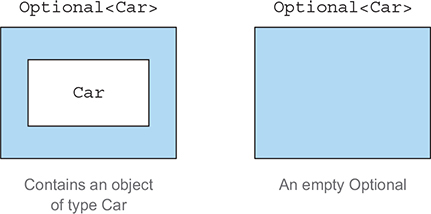
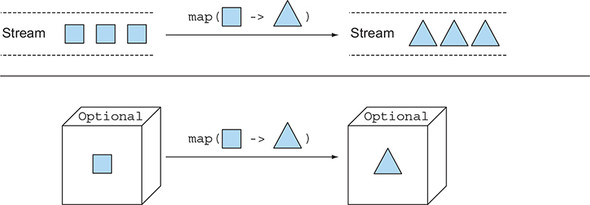
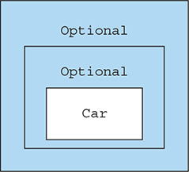
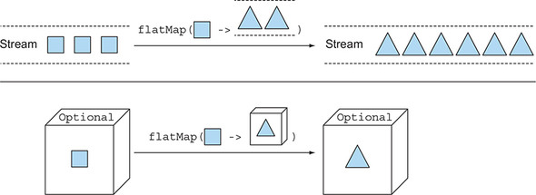
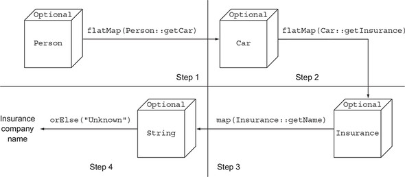

# Chương 11. Dùng Optional thay cho null

> **Nội dung chương này**
>
> - Vấn đề của null reference (tham chiếu null) và vì sao bạn nên tránh chúng
> - Từ null sang Optional: viết lại domain model của bạn theo hướng an toàn với null
> - Đưa optional vào thực chiến: loại bỏ các phép kiểm tra null khỏi code của bạn
> - Các cách khác nhau để đọc giá trị có thể được chứa bên trong một optional
> - Suy nghĩ lại về cách lập trình khi giá trị có thể vắng mặt

Hãy giơ tay lên nếu bạn từng gặp một NullPointerException trong đời làm lập trình viên Java. Cứ giữ tay giơ như thế nếu Exception này chính là loại ngoại lệ mà bạn gặp thường xuyên nhất. Thật đáng tiếc là lúc này chúng tôi không nhìn thấy bạn, nhưng chúng tôi tin rằng khả năng rất cao là tay bạn đang giơ lên. Chúng tôi cũng đoán rằng bạn có thể đang nghĩ điều gì đó đại loại như "Đúng vậy, tôi đồng ý. NullPointerException là nỗi đau của mọi lập trình viên Java, dù là người mới hay chuyên gia. Nhưng chúng ta chẳng làm được gì nhiều với chúng cả, bởi đó là cái giá phải trả để dùng một cấu trúc tiện lợi, và có lẽ là không thể tránh khỏi, như null reference." Cảm giác này rất phổ biến trong thế giới lập trình (mệnh lệnh — imperative); tuy nhiên, đó có thể không phải là toàn bộ sự thật, mà nhiều khả năng là một định kiến có gốc rễ lịch sử vững chắc.

Nhà khoa học máy tính người Anh Tony Hoare đã giới thiệu null reference vào năm 1965 khi thiết kế ALGOL W, một trong những ngôn ngữ lập trình có kiểu đầu tiên hỗ trợ các record cấp phát trên heap, và về sau ông nói rằng ông làm vậy "đơn giản vì nó quá dễ để cài đặt." Bất chấp mục tiêu của mình là "bảo đảm rằng mọi cách sử dụng tham chiếu đều tuyệt đối an toàn, với việc kiểm tra được compiler thực hiện tự động," ông đã quyết định tạo một ngoại lệ cho null reference vì ông nghĩ rằng đó là cách tiện lợi nhất để mô hình hoá sự vắng mặt của một giá trị. Sau nhiều năm, ông hối tiếc về quyết định này, gọi nó là "sai lầm tỷ đô của tôi." Tất cả chúng ta đều đã thấy hậu quả. Chúng ta xem xét một trường (field) của một đối tượng, có lẽ để xác định xem giá trị của nó có thuộc một trong hai dạng được mong đợi hay không, để rồi phát hiện ra rằng thứ chúng ta đang xem xét không phải là một đối tượng mà là một con trỏ null, và nó lập tức ném ra cái NullPointerException phiền toái kia.

Trên thực tế, phát biểu của Hoare có thể còn đánh giá thấp những chi phí mà hàng triệu lập trình viên đã phải gánh chịu để sửa các lỗi do null reference gây ra trong suốt 50 năm qua. Quả thật, phần lớn áp đảo các ngôn ngữ[1] được tạo ra trong những thập niên gần đây, kể cả Java, đều được xây dựng với cùng quyết định thiết kế đó, có thể vì lý do tương thích với các ngôn ngữ cũ hơn hoặc (nhiều khả năng hơn), như Hoare nói, "đơn giản vì nó quá dễ để cài đặt." Chúng ta bắt đầu bằng việc chỉ cho bạn thấy một ví dụ đơn giản về các vấn đề với null.

> [1] Những ngoại lệ đáng chú ý bao gồm hầu hết các ngôn ngữ hàm có kiểu, chẳng hạn Haskell và ML. Các ngôn ngữ này có kiểu dữ liệu đại số (algebraic data type) cho phép biểu diễn các kiểu dữ liệu một cách súc tích, bao gồm việc chỉ định tường minh xem các giá trị đặc biệt như null có được đưa vào hay không, trên từng kiểu một.

## 11.1. Làm sao để mô hình hoá sự vắng mặt của một giá trị?

Hãy tưởng tượng bạn có cấu trúc đối tượng lồng nhau sau đây cho một người sở hữu một chiếc xe và có bảo hiểm xe, như trong listing dưới đây.

**Listing 11.1. Mô hình dữ liệu Person/Car/Insurance**

```java
public class Person {
    private Car car;
    public Car getCar() { return car; }
}

public class Car {
    private Insurance insurance;
    public Insurance getInsurance() { return insurance; }
}

public class Insurance {
    private String name;
    public String getName() { return name; }
}
```

Đoạn code sau đây có vấn đề gì?

```java
public String getCarInsuranceName(Person person) {
    return person.getCar().getInsurance().getName();
}
```

Đoạn code này trông khá hợp lý, nhưng nhiều người không sở hữu xe hơi, vậy kết quả của việc gọi phương thức getCar là gì? Một thực hành phổ biến nhưng đáng tiếc là trả về null reference để biểu thị sự vắng mặt của một giá trị (ở đây là để biểu thị việc không có xe). Hệ quả là lời gọi getInsurance sẽ trả về bảo hiểm của một null reference, dẫn tới một NullPointerException tại thời điểm chạy và làm chương trình của bạn dừng lại không chạy tiếp được. Nhưng chưa hết. Điều gì xảy ra nếu bản thân person là null? Điều gì xảy ra nếu phương thức getInsurance cũng trả về null?

### 11.1.1. Giảm NullPointerException bằng cách kiểm tra phòng thủ

Bạn có thể làm gì để tránh gặp phải một NullPointerException bất ngờ? Thông thường, bạn có thể thêm các phép kiểm tra null ở những nơi cần thiết (và đôi khi, do lập trình phòng thủ quá đà, cả ở những nơi không cần thiết) và thường theo nhiều phong cách khác nhau. Nỗ lực đầu tiên để viết một phương thức ngăn NullPointerException được trình bày trong listing dưới đây.

**Listing 11.2. Nỗ lực an toàn với null số 1: những nghi ngờ chồng chất**

```java
public String getCarInsuranceName(Person person) {
    // Mỗi phép kiểm tra null lại tăng thêm một mức lồng nhau
    // cho phần còn lại của chuỗi lời gọi.
    if (person != null) {
        Car car = person.getCar();
        if (car != null) {
            Insurance insurance = car.getInsurance();
            if (insurance != null) {
                return insurance.getName();
            }
        }
    }
    return "Unknown";
}
```

Phương thức này thực hiện một phép kiểm tra null mỗi lần nó truy xuất (dereference) một biến, trả về chuỗi "Unknown" nếu bất kỳ biến nào được duyệt qua trong chuỗi truy xuất này mang giá trị null. Ngoại lệ duy nhất cho quy tắc này là bạn không kiểm tra xem tên của công ty bảo hiểm có null hay không, bởi vì (như mọi công ty khác) bạn biết rằng nó bắt buộc phải có tên. Lưu ý rằng bạn chỉ có thể bỏ qua phép kiểm tra cuối cùng này nhờ kiến thức của bạn về nghiệp vụ (business domain), nhưng thực tế đó lại không được phản ánh trong các class Java mô hình hoá dữ liệu của bạn.

Chúng tôi gọi phương thức trong listing 11.2 là "những nghi ngờ chồng chất" vì nó thể hiện một khuôn mẫu lặp đi lặp lại: mỗi lần bạn nghi ngờ một biến có thể là null, bạn buộc phải thêm một khối if lồng nhau nữa, làm tăng mức thụt lề của code. Kỹ thuật này rõ ràng mở rộng rất kém và làm tổn hại tính dễ đọc, nên có lẽ bạn muốn thử một giải pháp khác. Hãy thử tránh vấn đề này bằng cách làm điều gì đó khác đi như trong listing tiếp theo.

**Listing 11.3. Nỗ lực an toàn với null số 2: quá nhiều lối ra**

```java
public String getCarInsuranceName(Person person) {
    // Mỗi phép kiểm tra null lại thêm một điểm thoát nữa.
    if (person == null) {
        return "Unknown";
    }
    Car car = person.getCar();
    if (car == null) {
        return "Unknown";
    }
    Insurance insurance = car.getInsurance();
    if (insurance == null) {
        return "Unknown";
    }
    return insurance.getName();
}
```

Trong nỗ lực thứ hai này, bạn cố gắng tránh các khối if lồng nhau sâu bằng cách áp dụng một chiến lược khác: mỗi khi gặp một biến null, bạn trả về chuỗi "Unknown". Tuy vậy, giải pháp này cũng còn xa mới lý tưởng; giờ đây phương thức có tới bốn điểm thoát khác nhau, khiến nó khó bảo trì. Tệ hơn nữa, giá trị mặc định phải trả về trong trường hợp null, chuỗi "Unknown", bị lặp lại ở ba nơi — và (hy vọng là) không bị viết sai chính tả! (Tất nhiên, bạn có thể muốn tách chuỗi lặp lại đó thành một hằng số để ngăn ngừa vấn đề này.)

Hơn nữa, quá trình này dễ sinh lỗi. Điều gì xảy ra nếu bạn quên kiểm tra một thuộc tính nào đó có thể là null? Chúng tôi lập luận trong chương này rằng việc dùng null để biểu diễn sự vắng mặt của một giá trị là một cách tiếp cận sai lầm. Thứ bạn cần là một cách tốt hơn để mô hình hoá sự vắng mặt và sự hiện diện của một giá trị.

### 11.1.2. Các vấn đề với null

Để tóm lược lại phần thảo luận từ đầu đến giờ, việc dùng null reference trong Java gây ra cả các vấn đề lý thuyết lẫn thực tiễn:

- **Nó là nguồn gốc của lỗi.** NullPointerException cho đến nay vẫn là ngoại lệ phổ biến nhất trong Java.
- **Nó làm phình code.** Nó làm giảm tính dễ đọc do buộc bạn phải nhồi vào code các phép kiểm tra null thường lồng nhau rất sâu.
- **Nó vô nghĩa.** Nó không mang bất kỳ ý nghĩa ngữ nghĩa nào, và đặc biệt, nó là cách sai để mô hình hoá sự vắng mặt của một giá trị trong một ngôn ngữ có kiểu tĩnh.
- **Nó phá vỡ triết lý của Java.** Java luôn giấu con trỏ khỏi lập trình viên, ngoại trừ một trường hợp: con trỏ null.
- **Nó tạo ra một lỗ hổng trong hệ thống kiểu.** null không mang theo kiểu hay bất kỳ thông tin nào khác, nên nó có thể được gán cho bất kỳ kiểu tham chiếu nào. Tình huống này là một vấn đề bởi khi null được lan truyền sang một phần khác của hệ thống, bạn không có manh mối gì về việc ban đầu null đó đáng lẽ phải là cái gì.

Để có thêm bối cảnh cho các giải pháp khác, ở mục tiếp theo chúng ta điểm qua nhanh xem các ngôn ngữ lập trình khác cung cấp những gì.

### 11.1.3. Các giải pháp thay thế null trong các ngôn ngữ khác là gì?

Trong những năm gần đây, các ngôn ngữ như Groovy đã lách vấn đề này bằng cách giới thiệu toán tử điều hướng an toàn (safe navigation operator), ký hiệu là `?.`, để điều hướng an toàn qua các giá trị có thể là null. Để hiểu quá trình này hoạt động ra sao, hãy xét đoạn code Groovy sau, đoạn code lấy tên của công ty bảo hiểm mà một người dùng để bảo hiểm cho xe của mình:

```groovy
def carInsuranceName = person?.car?.insurance?.name
```

Câu lệnh này làm gì thì hẳn đã rõ. Một người có thể không có xe, và bạn thường mô hình hoá khả năng này bằng cách gán null cho tham chiếu car của đối tượng Person. Tương tự, một chiếc xe có thể chưa được bảo hiểm. Toán tử điều hướng an toàn của Groovy cho phép bạn điều hướng an toàn qua các tham chiếu có thể null này mà không ném NullPointerException, bằng cách lan truyền null reference qua chuỗi lời gọi, trả về null trong trường hợp bất kỳ giá trị nào trong chuỗi là null.

Một tính năng tương tự đã được đề xuất rồi bị loại bỏ khỏi Java 7. Tuy vậy, bằng cách nào đó, dường như chúng ta không thấy thiếu vắng một toán tử điều hướng an toàn trong Java. Cám dỗ đầu tiên của mọi lập trình viên Java khi đối mặt với một NullPointerException là sửa nó thật nhanh bằng cách thêm một câu lệnh if, kiểm tra xem một giá trị có khác null không trước khi gọi một phương thức trên nó. Nếu bạn giải quyết vấn đề theo cách này, mà không tự hỏi liệu việc thuật toán hay mô hình dữ liệu của bạn xuất hiện một giá trị null trong tình huống cụ thể đó có đúng hay không, thì bạn không phải đang sửa một lỗi mà đang che giấu nó, khiến việc phát hiện và khắc phục trở nên khó khăn hơn nhiều cho bất kỳ ai phải xử lý nó lần sau (nhiều khả năng là chính bạn trong tuần sau hoặc tháng sau). Bạn đang quét rác xuống dưới thảm. Toán tử truy xuất an toàn với null của Groovy chỉ là một cây chổi to hơn và mạnh hơn để bạn phạm sai lầm đó mà không phải lo lắng nhiều về hậu quả.

Các ngôn ngữ hàm khác, như Haskell và Scala, có góc nhìn khác. Haskell có kiểu Maybe, về cơ bản đóng gói một giá trị optional. Một giá trị thuộc kiểu Maybe có thể chứa một giá trị thuộc kiểu cho trước hoặc không chứa gì cả. Haskell không có khái niệm null reference. Scala có một cấu trúc tương tự gọi là Option[T] để đóng gói sự hiện diện hay vắng mặt của một giá trị thuộc kiểu T, mà chúng ta sẽ thảo luận trong chương 20. Khi đó bạn phải kiểm tra tường minh xem một giá trị có hiện diện hay không bằng các thao tác có sẵn trên kiểu Option, điều này buộc thực thi ý tưởng "kiểm tra null". Bạn không thể quên kiểm tra null nữa — bởi việc kiểm tra được hệ thống kiểu bắt buộc.

Được rồi, chúng ta đã đi hơi lạc đề, và tất cả những điều này nghe khá trừu tượng. Bạn có thể đang thắc mắc về Java 8. Java 8 lấy cảm hứng từ ý tưởng về giá trị optional này bằng cách giới thiệu một class mới tên là `java.util.Optional<T>`! Trong chương này, chúng tôi trình bày các lợi thế của việc dùng class này để mô hình hoá các giá trị có thể vắng mặt thay vì gán null reference cho chúng. Chúng tôi cũng làm rõ vì sao việc chuyển đổi từ null sang Optional đòi hỏi bạn phải suy nghĩ lại cách xử lý các giá trị optional trong domain model của mình. Cuối cùng, chúng ta khám phá các tính năng của class Optional mới này và cung cấp một vài ví dụ thực tế cho thấy cách dùng nó hiệu quả. Rốt cuộc, bạn sẽ học được cách thiết kế các API tốt hơn, trong đó người dùng có thể biết được liệu có nên mong đợi một giá trị optional hay không chỉ bằng cách đọc chữ ký (signature) của một phương thức.

## 11.2. Giới thiệu class Optional

Java 8 giới thiệu một class mới tên là `java.util.Optional<T>`, lấy cảm hứng từ Haskell và Scala. Class này đóng gói một giá trị optional. Ví dụ, nếu bạn biết rằng một người có thể không có xe, thì biến car bên trong class Person không nên được khai báo kiểu Car rồi gán null reference khi người đó không sở hữu xe; thay vào đó, nó nên có kiểu `Optional<Car>`, như minh hoạ trong hình 11.1.

> **Hình 11.1.** Một Car dạng optional
>
> 

Khi một giá trị hiện diện, class Optional bọc nó lại. Ngược lại, sự vắng mặt của một giá trị được mô hình hoá bằng một optional rỗng do phương thức `Optional.empty` trả về. Phương thức static factory này trả về một thể hiện singleton đặc biệt của class Optional. Bạn có thể thắc mắc về sự khác biệt giữa một null reference và `Optional.empty()`. Về mặt ngữ nghĩa, chúng có thể được xem là cùng một thứ, nhưng trên thực tế, khác biệt là rất lớn. Cố gắng truy xuất một null luôn luôn gây ra NullPointerException, trong khi `Optional.empty()` là một đối tượng hợp lệ, dùng được, thuộc kiểu Optional và có thể được gọi theo những cách hữu ích. Bạn sẽ sớm thấy điều đó.

Một khác biệt ngữ nghĩa quan trọng và thực tiễn khi dùng Optional thay cho null là trong trường hợp đầu, việc khai báo một biến kiểu `Optional<Car>` thay vì Car báo hiệu rõ ràng rằng một giá trị vắng mặt là được phép ở đó. Ngược lại, việc luôn dùng kiểu Car và có thể gán null reference cho một biến thuộc kiểu đó ngụ ý rằng bạn chẳng có sự trợ giúp nào, ngoài kiến thức của bạn về mô hình nghiệp vụ, để hiểu được liệu null có thuộc miền giá trị hợp lệ của biến đó hay không.

Với suy nghĩ này, bạn có thể làm lại mô hình ban đầu từ listing 11.1, sử dụng class Optional như trong listing dưới đây.

**Listing 11.4. Định nghĩa lại mô hình dữ liệu Person/Car/Insurance bằng Optional**

```java
public class Person {
    // Một người có thể không sở hữu xe, nên bạn khai báo trường này là Optional.
    private Optional<Car> car;
    public Optional<Car> getCar() { return car; }
}

public class Car {
    // Một chiếc xe có thể chưa được bảo hiểm, nên bạn khai báo trường này là Optional.
    private Optional<Insurance> insurance;
    public Optional<Insurance> getInsurance() { return insurance; }
}

public class Insurance {
    // Một công ty bảo hiểm bắt buộc phải có tên.
    private String name;
    public String getName() { return name; }
}
```

Hãy để ý cách việc dùng class Optional làm giàu ngữ nghĩa cho mô hình của bạn. Việc một person tham chiếu tới một `Optional<Car>`, và một car tham chiếu tới một `Optional<Insurance>`, khiến cho việc "một người có thể sở hữu hoặc không sở hữu xe, và chiếc xe đó có thể được bảo hiểm hoặc không" trở nên tường minh ngay trong domain.

Đồng thời, việc tên của công ty bảo hiểm được khai báo kiểu String thay vì `Optional<String>` làm cho rõ ràng rằng một công ty bảo hiểm bắt buộc phải có tên. Bằng cách này, bạn biết chắc chắn liệu mình có nhận được NullPointerException hay không khi truy xuất tên của một công ty bảo hiểm; bạn không cần thêm phép kiểm tra null, vì làm vậy sẽ che giấu vấn đề thay vì sửa nó. Một công ty bảo hiểm bắt buộc phải có tên, nên nếu bạn tìm thấy một công ty không có tên, bạn sẽ phải tìm ra dữ liệu của mình có gì sai thay vì thêm một đoạn code để lấp liếm tình huống này. Việc dùng các giá trị Optional một cách nhất quán tạo ra sự phân biệt rõ ràng giữa một giá trị vắng mặt đã được dự liệu và một giá trị vắng mặt chỉ vì có lỗi trong thuật toán hoặc vấn đề trong dữ liệu của bạn. Cần lưu ý rằng ý định của class Optional không phải là thay thế mọi null reference. Thay vào đó, mục đích của nó là giúp bạn thiết kế các API dễ hiểu hơn, sao cho chỉ bằng việc đọc chữ ký của một phương thức, bạn có thể biết liệu có nên mong đợi một giá trị optional hay không. Bạn bị buộc phải chủ động mở bọc (unwrap) một optional để xử lý sự vắng mặt của giá trị.

## 11.3. Các khuôn mẫu để áp dụng Optional

Đến đây mọi thứ vẫn ổn; bạn đã học được cách dùng optional trong các kiểu dữ liệu để làm rõ domain model, và bạn đã thấy các lợi thế của cách làm này so với việc biểu diễn giá trị vắng mặt bằng null reference. Vậy giờ bạn dùng optional như thế nào? Cụ thể hơn, làm sao bạn dùng được một giá trị được bọc trong một optional?

### 11.3.1. Tạo đối tượng Optional

Bước đầu tiên trước khi làm việc với Optional là học cách tạo các đối tượng optional! Bạn có thể tạo chúng theo nhiều cách.

**Optional rỗng**

Như đã đề cập trước đó, bạn có thể lấy được một đối tượng optional rỗng bằng phương thức static factory `Optional.empty`:

```java
Optional<Car> optCar = Optional.empty();
```

**Optional từ một giá trị khác null**

Bạn cũng có thể tạo một optional từ một giá trị khác null bằng phương thức static factory `Optional.of`:

```java
Optional<Car> optCar = Optional.of(car);
```

Nếu car là null, một NullPointerException sẽ được ném ra ngay lập tức (thay vì nhận một lỗi tiềm ẩn khi bạn cố truy cập các thuộc tính của car).

**Optional từ null**

Cuối cùng, bằng cách dùng phương thức static factory `Optional.ofNullable`, bạn có thể tạo một đối tượng Optional có thể chứa một giá trị null:

```java
Optional<Car> optCar = Optional.ofNullable(car);
```

Nếu car là null, đối tượng Optional thu được sẽ rỗng.

Bạn có thể hình dung rằng chúng ta sẽ tiếp tục bằng việc tìm hiểu cách lấy một giá trị ra khỏi một optional. Phương thức get làm chính xác điều này, và chúng ta sẽ nói thêm về nó sau. Nhưng get ném ra ngoại lệ khi optional rỗng, nên việc dùng nó một cách thiếu kỷ luật thực chất là tái tạo lại toàn bộ các vấn đề bảo trì gây ra bởi việc dùng null. Thay vào đó, chúng ta bắt đầu bằng việc xem xét các cách sử dụng giá trị optional mà tránh được những phép kiểm tra tường minh, lấy cảm hứng từ các thao tác tương tự trên stream.

### 11.3.2. Trích xuất và biến đổi giá trị từ Optional với map

Một khuôn mẫu phổ biến là trích xuất thông tin từ một đối tượng. Ví dụ, bạn có thể muốn trích xuất tên từ một công ty bảo hiểm. Bạn cần kiểm tra xem insurance có null hay không trước khi trích xuất tên như sau:

```java
String name = null;
if (insurance != null) {
    name = insurance.getName();
}
```

Optional hỗ trợ phương thức map cho khuôn mẫu này, hoạt động như sau (từ đây trở đi, chúng ta dùng mô hình được trình bày trong listing 11.4):

```java
Optional<Insurance> optInsurance = Optional.ofNullable(insurance);
Optional<String> name = optInsurance.map(Insurance::getName);
```

Phương thức này về mặt khái niệm tương tự phương thức map của Stream mà bạn đã thấy trong chương 4 và 5. Thao tác map áp dụng hàm được cung cấp lên mỗi phần tử của một stream. Bạn cũng có thể xem một đối tượng Optional như một tập hợp dữ liệu đặc biệt, chứa nhiều nhất một phần tử. Nếu Optional chứa một giá trị, hàm được truyền làm đối số cho map sẽ biến đổi giá trị đó. Nếu Optional rỗng, không có gì xảy ra. Hình 11.2 minh hoạ sự tương đồng này, cho thấy điều gì xảy ra khi bạn truyền một hàm biến hình vuông thành hình tam giác cho phương thức map của cả một stream các hình vuông lẫn một optional chứa hình vuông.

> **Hình 11.2.** So sánh phương thức map của Stream và của Optional
>
> 

Ý tưởng này trông có vẻ hữu ích, nhưng làm sao bạn dùng nó để viết lại code trong listing 11.1,

```java
public String getCarInsuranceName(Person person) {
    return person.getCar().getInsurance().getName();
}
```

vốn nối chuỗi nhiều lời gọi phương thức, theo một cách an toàn?

Câu trả lời là dùng một phương thức khác được Optional hỗ trợ, gọi là flatMap.

### 11.3.3. Nối chuỗi các đối tượng Optional với flatMap

Vì bạn đã học cách dùng map, phản ứng đầu tiên của bạn có thể là dùng map để viết lại code như sau:

```java
Optional<Person> optPerson = Optional.of(person);
Optional<String> name =
    optPerson.map(Person::getCar)
             .map(Car::getInsurance)
             .map(Insurance::getName);
```

Đáng tiếc, đoạn code này không biên dịch được. Tại sao? Biến optPerson có kiểu `Optional<Person>`, nên việc gọi phương thức map là hoàn toàn hợp lệ. Nhưng getCar trả về một đối tượng kiểu `Optional<Car>` (như trình bày trong listing 11.4), nghĩa là kết quả của thao tác map là một đối tượng kiểu `Optional<Optional<Car>>`. Kết quả là lời gọi getInsurance không hợp lệ vì optional ngoài cùng chứa bên trong nó một optional khác, và tất nhiên optional đó không hỗ trợ phương thức getInsurance. Hình 11.3 minh hoạ cấu trúc optional lồng nhau mà bạn sẽ nhận được.

> **Hình 11.3.** Một optional hai tầng
>
> 

Bạn giải quyết vấn đề này như thế nào? Một lần nữa, bạn có thể nhìn vào một khuôn mẫu mà bạn đã dùng trước đây với stream: phương thức flatMap. Với stream, phương thức flatMap nhận một hàm làm đối số và trả về một stream khác. Hàm này được áp dụng lên mỗi phần tử của một stream, tạo ra một stream của các stream. Nhưng flatMap có tác dụng thay thế mỗi stream được sinh ra bằng chính nội dung của stream đó. Nói cách khác, tất cả các stream riêng lẻ được sinh ra bởi hàm sẽ được hợp nhất, hay làm phẳng (flatten), thành một stream duy nhất. Ở đây bạn muốn điều gì đó tương tự, nhưng bạn muốn làm phẳng một optional hai tầng thành một tầng.

Giống như hình 11.2 làm với phương thức map, hình 11.4 minh hoạ những điểm tương đồng giữa phương thức flatMap của class Stream và của class Optional.

> **Hình 11.4.** So sánh phương thức flatMap của Stream và của Optional
>
> 

Ở đây, hàm được truyền cho phương thức flatMap của stream biến mỗi hình vuông thành một stream khác chứa hai hình tam giác. Khi đó kết quả của một phép map đơn thuần là một stream chứa ba stream khác, mỗi stream có hai hình tam giác, nhưng phương thức flatMap làm phẳng stream hai tầng này thành một stream duy nhất chứa tổng cộng sáu hình tam giác. Theo cách tương tự, hàm được truyền cho phương thức flatMap của optional biến hình vuông chứa trong optional gốc thành một optional chứa một hình tam giác. Nếu hàm này được truyền cho phương thức map, kết quả sẽ là một optional chứa một optional khác, mà optional đó lại chứa một hình tam giác, nhưng phương thức flatMap làm phẳng optional hai tầng này thành một optional duy nhất chứa một hình tam giác.

**Tìm tên công ty bảo hiểm của một chiếc xe bằng optional**

Giờ đây bạn đã nắm lý thuyết về các phương thức map và flatMap của Optional, bạn đã sẵn sàng đưa chúng vào thực hành. Những nỗ lực xấu xí trong listing 11.2 và 11.3 có thể được viết lại bằng mô hình dữ liệu dựa trên optional của listing 11.4 như sau.

**Listing 11.5. Tìm tên công ty bảo hiểm của một chiếc xe bằng Optional**

```java
public String getCarInsuranceName(Optional<Person> person) {
    return person.flatMap(Person::getCar)
                 .flatMap(Car::getInsurance)
                 .map(Insurance::getName)
                 .orElse("Unknown");  // Giá trị mặc định nếu Optional kết quả là rỗng
}
```

So sánh listing 11.5 với hai nỗ lực trước đó cho thấy các lợi thế của việc dùng optional khi xử lý những giá trị có thể vắng mặt. Lần này, bạn có thể đạt được điều mình muốn bằng một câu lệnh dễ hiểu thay vì làm tăng độ phức tạp của code với các nhánh điều kiện.

Về mặt cài đặt, trước hết hãy để ý rằng bạn đã thay đổi chữ ký của phương thức getCarInsuranceName so với listing 11.2 và 11.3. Chúng tôi đã nói rõ rằng có thể có trường hợp một Person không tồn tại được truyền vào phương thức này, chẳng hạn khi Person đó được lấy từ cơ sở dữ liệu thông qua một định danh, và bạn muốn mô hình hoá khả năng không có Person nào trong dữ liệu của bạn ứng với định danh đã cho. Bạn mô hình hoá yêu cầu bổ sung này bằng cách đổi kiểu đối số của phương thức từ Person thành `Optional<Person>`.

Một lần nữa, cách tiếp cận này cho phép bạn làm tường minh thông qua hệ thống kiểu một điều mà nếu không thì sẽ chỉ ngầm nằm trong kiến thức của bạn về domain model: mục đích đầu tiên của một ngôn ngữ, kể cả ngôn ngữ lập trình, là giao tiếp. Việc khai báo một phương thức nhận một optional làm đối số hoặc trả về một optional làm kết quả sẽ tài liệu hoá cho đồng nghiệp của bạn — và cho mọi người dùng phương thức của bạn trong tương lai — rằng nó có thể nhận một giá trị rỗng hoặc trả về một giá trị rỗng.

**Chuỗi truy xuất Person/Car/Insurance bằng optional**

Bắt đầu từ `Optional<Person>` này, Car lấy từ Person, Insurance lấy từ Car, và String chứa tên công ty bảo hiểm lấy từ Insurance đều được truy xuất bằng cách kết hợp các phương thức map và flatMap đã giới thiệu ở phần trước của chương này. Hình 11.5 minh hoạ pipeline các thao tác này.

> **Hình 11.5.** Chuỗi truy xuất Person/Car/Insurance bằng optional
>
> 

Ở đây, bạn bắt đầu với optional bọc Person và gọi `flatMap(Person::getCar)` trên nó. Như chúng tôi đã nói, bạn có thể hình dung lời gọi này về mặt logic là điều gì đó xảy ra qua hai bước. Ở bước 1, một Function được áp dụng lên Person bên trong optional để biến đổi nó. Trong trường hợp này, Function được biểu diễn bằng một method reference gọi phương thức getCar trên Person đó. Vì phương thức đó trả về một `Optional<Car>`, Person bên trong optional được biến đổi thành một thể hiện của kiểu đó, tạo ra một optional hai tầng và optional này được làm phẳng như một phần của thao tác flatMap. Từ góc nhìn lý thuyết, bạn có thể nghĩ về thao tác làm phẳng này như thao tác kết hợp hai optional lồng nhau, cho ra một optional rỗng nếu ít nhất một trong hai là rỗng. Điều thực sự xảy ra là nếu bạn gọi flatMap trên một optional rỗng, không có gì thay đổi và optional rỗng được trả về nguyên trạng. Ngược lại, nếu optional bọc một Person, Function được truyền cho phương thức flatMap sẽ được áp dụng lên Person đó. Vì giá trị do việc áp dụng Function tạo ra vốn đã là một optional, phương thức flatMap có thể trả về nó nguyên trạng.

Bước thứ hai tương tự bước đầu tiên, biến đổi `Optional<Car>` thành `Optional<Insurance>`. Bước 3 biến `Optional<Insurance>` thành `Optional<String>`: bởi vì phương thức `Insurance.getName()` trả về một String. Trong trường hợp này, không cần dùng flatMap.

Đến đây, optional kết quả sẽ rỗng nếu bất kỳ phương thức nào trong chuỗi lời gọi này trả về một optional rỗng, hoặc ngược lại nó chứa tên công ty bảo hiểm mà bạn mong muốn. Bạn đọc giá trị đó bằng cách nào? Rốt cuộc, bạn sẽ nhận được một `Optional<String>` có thể chứa hoặc không chứa tên của công ty bảo hiểm. Trong listing 11.5, chúng tôi đã dùng một phương thức khác tên là orElse, phương thức này cung cấp một giá trị mặc định trong trường hợp optional rỗng. Có nhiều phương thức cung cấp hành động mặc định hoặc mở bọc một optional. Ở mục tiếp theo, chúng ta xem xét chi tiết các phương thức đó.

> **Dùng optional trong domain model và vì sao chúng không serializable được**
>
> Trong listing 11.4, chúng tôi đã cho thấy cách dùng Optional trong domain model của bạn để đánh dấu bằng một kiểu cụ thể những giá trị được phép vắng mặt hoặc chưa xác định. Tuy nhiên, những người thiết kế class Optional đã phát triển nó dựa trên các giả định khác và với một tình huống sử dụng khác trong đầu. Cụ thể, kiến trúc sư ngôn ngữ Java Brian Goetz đã tuyên bố rõ ràng rằng mục đích của Optional chỉ là hỗ trợ thành ngữ "optional-return" (trả về giá trị optional).
>
> Bởi vì class Optional không được thiết kế để dùng làm kiểu của trường (field), nó không cài đặt interface Serializable. Vì lý do này, việc dùng Optional trong domain model có thể làm hỏng các ứng dụng sử dụng những công cụ hay framework đòi hỏi một mô hình serializable mới hoạt động được. Tuy vậy, chúng tôi tin rằng chúng tôi đã cho bạn thấy vì sao việc dùng Optional như một kiểu đúng nghĩa trong domain của bạn là một ý tưởng tốt, đặc biệt khi bạn phải duyệt một đồ thị các đối tượng có thể không hiện diện. Ngoài ra, nếu bạn cần có một domain model serializable, chúng tôi gợi ý rằng ít nhất bạn nên cung cấp một phương thức cho phép truy cập bất kỳ giá trị nào có thể vắng mặt dưới dạng một optional, như trong ví dụ sau:
>
> ```java
> public class Person {
>     private Car car;
>     public Optional<Car> getCarAsOptional() {
>         return Optional.ofNullable(car);
>     }
> }
> ```

### 11.3.4. Thao tác trên một stream các optional

Phương thức `stream()` của Optional, được giới thiệu trong Java 9, cho phép bạn chuyển một Optional có giá trị thành một Stream chỉ chứa giá trị đó, hoặc chuyển một Optional rỗng thành một Stream rỗng tương ứng. Kỹ thuật này có thể đặc biệt tiện lợi trong một trường hợp phổ biến: khi bạn có một Stream của Optional và cần biến đổi nó thành một Stream khác chỉ chứa những giá trị hiện diện trong các Optional không rỗng của Stream ban đầu. Trong mục này, chúng tôi trình bày bằng một ví dụ thực tế khác vì sao bạn có thể rơi vào tình huống phải xử lý một Stream của Optional và cách thực hiện thao tác này.

Ví dụ trong listing 11.6 dùng domain model Person/Car/Insurance được định nghĩa trong listing 11.4. Giả sử bạn được yêu cầu cài đặt một phương thức nhận vào một `List<Person>` và phải trả về một `Set<String>` chứa tất cả các tên riêng biệt của những công ty bảo hiểm được sử dụng bởi những người trong danh sách đó mà có sở hữu xe.

**Listing 11.6. Tìm các tên công ty bảo hiểm riêng biệt được dùng bởi một danh sách người**

```java
public Set<String> getCarInsuranceNames(List<Person> persons) {
    return persons.stream()
                  // Chuyển danh sách người thành một Stream các Optional<Car>
                  // với những chiếc xe mà họ có thể sở hữu.
                  .map(Person::getCar)
                  // FlatMap mỗi Optional<Car> thành Optional<Insurance> tương ứng.
                  .map(optCar -> optCar.flatMap(Car::getInsurance))
                  // Map mỗi Optional<Insurance> thành Optional<String> chứa tên tương ứng.
                  .map(optIns -> optIns.map(Insurance::getName))
                  // Biến Stream<Optional<String>> thành Stream<String>
                  // chỉ chứa những cái tên hiện diện.
                  .flatMap(Optional::stream)
                  // Thu thập các String kết quả vào một Set để chỉ giữ các giá trị riêng biệt.
                  .collect(toSet());
}
```

Thông thường, việc thao tác trên các phần tử của một Stream dẫn tới một chuỗi dài các phép biến đổi, phép lọc và các thao tác khác, nhưng trường hợp này có thêm một phức tạp nữa vì mỗi phần tử còn được bọc trong một Optional. Hãy nhớ rằng bạn đã mô hình hoá việc một người có thể không có xe bằng cách để phương thức `getCar()` của họ trả về một `Optional<Car>` thay vì một Car đơn thuần. Vì thế, sau phép biến đổi map đầu tiên, bạn thu được một `Stream<Optional<Car>>`. Tại thời điểm này, hai phép map tiếp theo cho phép bạn biến mỗi `Optional<Car>` thành một `Optional<Insurance>` rồi biến mỗi cái đó thành một `Optional<String>` như bạn đã làm trong listing 11.5 cho một phần tử đơn lẻ thay vì cho một Stream.

Ở cuối ba phép biến đổi này, bạn thu được một `Stream<Optional<String>>` trong đó một số Optional có thể rỗng vì một người không sở hữu xe hoặc vì chiếc xe không được bảo hiểm. Việc dùng Optional cho phép bạn thực hiện các thao tác này một cách hoàn toàn an toàn với null ngay cả khi có giá trị vắng mặt, nhưng giờ bạn gặp vấn đề là phải loại bỏ các Optional rỗng và mở bọc các giá trị chứa trong những cái còn lại trước khi thu thập kết quả vào một Set. Tất nhiên, bạn có thể đạt được kết quả này bằng một filter theo sau bởi một map, như sau:

```java
Stream<Optional<String>> stream = ...
Set<String> result = stream.filter(Optional::isPresent)
                           .map(Optional::get)
                           .collect(toSet());
```

Tuy nhiên, như đã báo trước trong listing 11.6, có thể đạt được cùng kết quả chỉ trong một thao tác thay vì hai bằng cách dùng phương thức `stream()` của class Optional. Quả thật, phương thức này biến mỗi Optional thành một Stream có không hoặc một phần tử, tuỳ vào việc Optional được biến đổi có rỗng hay không. Vì lý do này, một tham chiếu tới phương thức đó có thể được xem như một hàm đi từ một phần tử đơn lẻ của Stream tới một Stream khác, và sau đó được truyền cho phương thức flatMap gọi trên Stream ban đầu. Như bạn đã học, theo cách này mỗi phần tử được chuyển thành một Stream rồi Stream hai tầng của các Stream được làm phẳng thành một tầng duy nhất. Mẹo này cho phép bạn mở bọc các Optional có chứa giá trị và bỏ qua những cái rỗng chỉ trong một bước.

### 11.3.5. Hành động mặc định và mở bọc một Optional

Trong mục 11.3.3, bạn đã quyết định đọc một giá trị Optional bằng phương thức orElse, phương thức này cũng cho phép bạn cung cấp một giá trị mặc định sẽ được trả về trong trường hợp optional rỗng. Class Optional cung cấp một số phương thức thể hiện (instance method) để đọc giá trị được chứa bởi một thể hiện Optional:

- `get()` là phương thức đơn giản nhất nhưng cũng kém an toàn nhất trong số các phương thức này. Nó trả về giá trị được bọc nếu có giá trị hiện diện và ném NoSuchElementException nếu không. Vì lý do này, việc dùng phương thức này hầu như luôn là một ý tưởng tồi trừ khi bạn chắc chắn rằng optional có chứa một giá trị. Ngoài ra, phương thức này không cải thiện được bao nhiêu so với các phép kiểm tra null lồng nhau.
- `orElse(T other)` là phương thức được dùng trong listing 11.5, và như chúng tôi đã lưu ý ở đó, nó cho phép bạn cung cấp một giá trị mặc định khi optional không chứa giá trị.
- `orElseGet(Supplier<? extends T> other)` là phiên bản lười (lazy) tương ứng của phương thức orElse, bởi vì supplier chỉ được gọi nếu optional không chứa giá trị nào. Bạn nên dùng phương thức này khi việc tạo ra giá trị mặc định tốn nhiều thời gian (để đạt hiệu quả cao hơn), hoặc khi bạn muốn supplier chỉ được gọi nếu optional rỗng (khi đó việc dùng orElseGet là thiết yếu).
- `or(Supplier<? extends Optional<? extends T>> supplier)` tương tự phương thức orElseGet ở trên, nhưng nó không mở bọc giá trị bên trong Optional, nếu có. Trên thực tế, phương thức này (được giới thiệu cùng Java 9) không thực hiện hành động nào và trả về Optional nguyên trạng khi nó có chứa một giá trị, nhưng cung cấp một cách lười một Optional khác khi cái ban đầu rỗng.
- `orElseThrow(Supplier<? extends X> exceptionSupplier)` tương tự phương thức get ở chỗ nó ném ra một ngoại lệ khi optional rỗng, nhưng nó cho phép bạn chọn loại ngoại lệ mà bạn muốn ném.
- `ifPresent(Consumer<? super T> consumer)` cho phép bạn thực thi hành động được truyền vào làm đối số nếu một giá trị hiện diện; nếu không, không hành động nào được thực hiện.

Java 9 giới thiệu thêm một phương thức thể hiện nữa:

- `ifPresentOrElse(Consumer<? super T> action, Runnable emptyAction)`. Phương thức này khác với ifPresent ở chỗ nó nhận thêm một Runnable cung cấp hành động dựa-trên-trường-hợp-rỗng để thực thi khi Optional rỗng.

### 11.3.6. Kết hợp hai Optional

Bây giờ giả sử bạn có một phương thức mà, khi cho trước một Person và một Car, sẽ truy vấn một số dịch vụ bên ngoài và cài đặt một logic nghiệp vụ phức tạp để tìm ra công ty bảo hiểm đưa ra hợp đồng rẻ nhất cho tổ hợp đó:

```java
public Insurance findCheapestInsurance(Person person, Car car) {
    // truy vấn các dịch vụ do các công ty bảo hiểm khác nhau cung cấp
    // so sánh toàn bộ dữ liệu đó
    return cheapestCompany;
}
```

Cũng giả sử bạn muốn phát triển một phiên bản an toàn với null của phương thức này, nhận hai optional làm đối số và trả về một `Optional<Insurance>` sẽ rỗng nếu ít nhất một trong các giá trị được truyền vào cũng rỗng. Class Optional còn cung cấp một phương thức isPresent trả về true nếu optional chứa một giá trị, nên nỗ lực đầu tiên của bạn có thể là cài đặt phương thức này như sau:

```java
public Optional<Insurance> nullSafeFindCheapestInsurance(
        Optional<Person> person, Optional<Car> car) {
    if (person.isPresent() && car.isPresent()) {
        return Optional.of(findCheapestInsurance(person.get(), car.get()));
    } else {
        return Optional.empty();
    }
}
```

Phương thức này có lợi thế là làm rõ ngay trong chữ ký của nó rằng cả giá trị Person lẫn Car được truyền vào đều có thể vắng mặt và vì lý do đó, nó có thể không trả về giá trị nào cả. Đáng tiếc, phần cài đặt của nó lại giống một cách quá gần gũi với những phép kiểm tra null mà bạn sẽ phải viết nếu phương thức nhận vào một Person và một Car, cả hai đều có thể là null. Liệu có cách nào tốt hơn, đúng chất hơn (idiomatic) để cài đặt phương thức này bằng cách dùng các tính năng của class Optional không? Hãy dành vài phút làm quiz 11.1 và thử tìm một lời giải thanh lịch.

---

**Quiz 11.1: Kết hợp hai optional mà không mở bọc chúng**

Sử dụng kết hợp các phương thức map và flatMap mà bạn đã học trong mục này, hãy viết lại phần cài đặt của phương thức `nullSafeFindCheapestInsurance()` ở trên trong một câu lệnh duy nhất.

**Đáp án:**

Bạn có thể cài đặt phương thức đó trong một câu lệnh duy nhất và không dùng bất kỳ cấu trúc điều kiện nào như toán tử ba ngôi, như sau:

```java
public Optional<Insurance> nullSafeFindCheapestInsurance(
        Optional<Person> person, Optional<Car> car) {
    return person.flatMap(p -> car.map(c -> findCheapestInsurance(p, c)));
}
```

Ở đây, bạn gọi một flatMap trên optional thứ nhất, nên nếu optional này rỗng, lambda expression được truyền cho nó sẽ không được thực thi, và lời gọi này sẽ trả về một optional rỗng. Ngược lại, nếu person hiện diện, flatMap dùng nó làm đầu vào cho một Function trả về một `Optional<Insurance>` như phương thức flatMap yêu cầu. Thân của hàm này gọi một map trên optional thứ hai, nên nếu nó không chứa Car nào, Function trả về một optional rỗng, và toàn bộ phương thức nullSafeFindCheapestInsurance cũng vậy. Cuối cùng, nếu cả Person lẫn Car đều hiện diện, lambda expression được truyền làm đối số cho phương thức map có thể gọi một cách an toàn phương thức findCheapestInsurance ban đầu với chúng.

---

Những điểm tương đồng giữa class Optional và interface Stream không chỉ giới hạn ở các phương thức map và flatMap. Một phương thức thứ ba, filter, cũng hành xử theo cách tương tự trên cả hai class, và chúng ta khám phá nó tiếp theo đây.

### 11.3.7. Loại bỏ một số giá trị với filter

Thường thì bạn cần gọi một phương thức trên một đối tượng để kiểm tra một thuộc tính nào đó. Ví dụ, bạn có thể cần kiểm tra xem tên của công ty bảo hiểm có bằng "CambridgeInsurance" hay không. Để làm điều đó một cách an toàn, trước tiên hãy kiểm tra xem tham chiếu trỏ tới đối tượng Insurance có null hay không rồi mới gọi phương thức getName, như sau:

```java
Insurance insurance = ...;
if (insurance != null && "CambridgeInsurance".equals(insurance.getName())) {
    System.out.println("ok");
}
```

Bạn có thể viết lại khuôn mẫu này bằng cách dùng phương thức filter trên một đối tượng Optional, như sau:

```java
Optional<Insurance> optInsurance = ...;
optInsurance.filter(insurance ->
                        "CambridgeInsurance".equals(insurance.getName()))
            .ifPresent(x -> System.out.println("ok"));
```

Phương thức filter nhận một predicate làm đối số. Nếu một giá trị hiện diện trong đối tượng Optional, và giá trị đó khớp với predicate, phương thức filter trả về giá trị đó; nếu không, nó trả về một đối tượng Optional rỗng. Nếu bạn nhớ rằng bạn có thể nghĩ về một optional như một stream chứa nhiều nhất một phần tử, thì hành vi của phương thức này hẳn đã rõ ràng. Nếu optional vốn đã rỗng, nó không có tác dụng gì; nếu không, nó áp dụng predicate lên giá trị chứa trong optional. Nếu việc áp dụng này trả về true, optional được trả về không thay đổi; nếu không, giá trị bị lọc bỏ, để lại optional rỗng. Bạn có thể kiểm tra mức độ hiểu của mình về cách hoạt động của phương thức filter bằng cách làm quiz 11.2.

---

**Quiz 11.2: Lọc một optional**

Giả sử class Person trong mô hình Person/Car/Insurance của bạn còn có một phương thức getAge để truy cập tuổi của người đó, hãy sửa phương thức getCarInsuranceName trong listing 11.5 bằng cách dùng chữ ký

```java
public String getCarInsuranceName(Optional<Person> person, int minAge)
```

sao cho tên công ty bảo hiểm chỉ được trả về nếu người đó có tuổi lớn hơn hoặc bằng đối số minAge.

**Đáp án:**

Bạn có thể lọc `Optional<Person>` để loại bỏ bất kỳ người nào có tuổi không đạt tối thiểu bằng đối số minAge, bằng cách mã hoá điều kiện này trong một predicate được truyền cho phương thức filter như sau:

```java
public String getCarInsuranceName(Optional<Person> person, int minAge) {
    return person.filter(p -> p.getAge() >= minAge)
                 .flatMap(Person::getCar)
                 .flatMap(Car::getInsurance)
                 .map(Insurance::getName)
                 .orElse("Unknown");
}
```

---

Ở mục tiếp theo, chúng ta tìm hiểu các tính năng còn lại của class Optional và cung cấp thêm nhiều ví dụ thực tế về các kỹ thuật khác nhau mà bạn có thể dùng để cài đặt lại đoạn code bạn viết nhằm quản lý các giá trị vắng mặt.

Bảng 11.1 tóm tắt các phương thức của class Optional.

**Bảng 11.1. Các phương thức của class Optional**

| Phương thức | Mô tả |
|---|---|
| empty | Trả về một thể hiện Optional rỗng |
| filter | Nếu giá trị hiện diện và khớp với predicate cho trước, trả về chính Optional này; nếu không, trả về Optional rỗng |
| flatMap | Nếu một giá trị hiện diện, trả về Optional thu được từ việc áp dụng hàm ánh xạ được cung cấp lên nó; nếu không, trả về Optional rỗng |
| get | Trả về giá trị được bọc bởi Optional này nếu hiện diện; nếu không, ném ra NoSuchElementException |
| ifPresent | Nếu một giá trị hiện diện, gọi consumer được chỉ định với giá trị đó; nếu không, không làm gì cả |
| ifPresentOrElse | Nếu một giá trị hiện diện, thực hiện một hành động với giá trị đó làm đầu vào; nếu không, thực hiện một hành động khác không có đầu vào |
| isPresent | Trả về true nếu một giá trị hiện diện; nếu không, trả về false |
| map | Nếu một giá trị hiện diện, áp dụng hàm ánh xạ được cung cấp lên nó |
| of | Trả về một Optional bọc giá trị cho trước, hoặc ném NullPointerException nếu giá trị này là null |
| ofNullable | Trả về một Optional bọc giá trị cho trước, hoặc Optional rỗng nếu giá trị này là null |
| or | Nếu giá trị hiện diện, trả về chính Optional đó; nếu không, trả về một Optional khác được tạo ra bởi hàm cung cấp (supplying function) |
| orElse | Trả về giá trị nếu hiện diện; nếu không, trả về giá trị mặc định cho trước |
| orElseGet | Trả về giá trị nếu hiện diện; nếu không, trả về giá trị do Supplier cho trước cung cấp |
| orElseThrow | Trả về giá trị nếu hiện diện; nếu không, ném ra ngoại lệ được tạo bởi Supplier cho trước |
| stream | Nếu một giá trị hiện diện, trả về một Stream chỉ chứa nó; nếu không, trả về một Stream rỗng |

## 11.4. Các ví dụ thực tế về việc dùng Optional

Như bạn đã học, việc sử dụng hiệu quả class Optional mới đòi hỏi một sự suy nghĩ lại hoàn toàn về cách bạn xử lý các giá trị có thể vắng mặt. Sự suy nghĩ lại này không chỉ liên quan đến code bạn viết, mà còn (và có thể còn quan trọng hơn) đến cách bạn tương tác với các API gốc của Java.

Quả thật, chúng tôi tin rằng nhiều API trong số đó đã được viết khác đi nếu class Optional có sẵn vào thời điểm chúng được phát triển. Vì lý do tương thích ngược, các API Java cũ không thể được thay đổi để sử dụng optional cho đúng, nhưng không phải mọi thứ đều mất. Bạn có thể sửa, hoặc ít nhất là lách, vấn đề này bằng cách thêm vào code của mình những phương thức tiện ích nhỏ cho phép bạn tận dụng sức mạnh của optional. Bạn sẽ thấy cách làm điều này qua một vài ví dụ thực tế.

### 11.4.1. Bọc một giá trị có thể null trong một Optional

Một API Java hiện có hầu như luôn trả về null để báo hiệu rằng giá trị được yêu cầu vắng mặt hoặc việc tính toán để có được nó đã thất bại vì lý do nào đó. Ví dụ, phương thức get của một Map trả về null làm giá trị của nó nếu Map không chứa ánh xạ nào cho khoá được yêu cầu. Nhưng vì những lý do chúng tôi đã liệt kê ở trên, trong hầu hết các trường hợp như thế này, bạn muốn các phương thức đó trả về một optional hơn. Bạn không thể sửa chữ ký của những phương thức này, nhưng bạn có thể dễ dàng bọc giá trị chúng trả về bằng một optional. Tiếp tục với ví dụ Map, và giả sử bạn có một `Map<String, Object>`, việc truy cập giá trị được đánh chỉ mục bởi khoá bằng

```java
Object value = map.get("key");
```

sẽ trả về null nếu không có giá trị nào trong map gắn với String "key". Bạn có thể cải thiện code như vậy bằng cách bọc giá trị do map trả về trong một optional. Bạn có thể hoặc là thêm một khối if-then-else xấu xí làm tăng độ phức tạp của code, hoặc là dùng phương thức `Optional.ofNullable` mà chúng ta đã thảo luận ở trên:

```java
Optional<Object> value = Optional.ofNullable(map.get("key"));
```

Bạn có thể dùng phương thức này mỗi khi muốn biến đổi một cách an toàn một giá trị có thể null thành một optional.

### 11.4.2. Exception so với Optional

Ném ra một ngoại lệ là một phương án thay thế phổ biến khác trong API Java cho việc trả về null khi không thể cung cấp một giá trị. Một ví dụ điển hình là việc chuyển đổi String thành int do phương thức static `Integer.parseInt(String)` cung cấp. Trong trường hợp này, nếu String không chứa một số nguyên có thể phân tích được, phương thức này ném ra một NumberFormatException. Một lần nữa, hiệu ứng thực tế là code báo hiệu một đối số không hợp lệ nếu một String không biểu diễn một số nguyên, khác biệt duy nhất là lần này bạn phải kiểm tra nó bằng một khối try/catch thay vì dùng một điều kiện if để kiểm soát xem một giá trị có khác null hay không.

Bạn cũng có thể mô hình hoá giá trị không hợp lệ gây ra bởi các String không chuyển đổi được bằng một optional rỗng, vì vậy bạn muốn parseInt trả về một optional hơn. Bạn không thể thay đổi phương thức Java gốc, nhưng không gì ngăn bạn cài đặt một phương thức tiện ích nhỏ, bọc nó lại và trả về một optional như bạn mong muốn, như trong listing dưới đây.

**Listing 11.7. Chuyển một String thành Integer, trả về một optional**

```java
public static Optional<Integer> stringToInt(String s) {
    try {
        // Nếu String có thể chuyển thành Integer, trả về một optional chứa nó.
        return Optional.of(Integer.parseInt(s));
    } catch (NumberFormatException e) {
        // Nếu không, trả về một optional rỗng.
        return Optional.empty();
    }
}
```

Gợi ý của chúng tôi là gom nhiều phương thức tương tự vào một class tiện ích, bạn có thể gọi nó là OptionalUtility. Từ đó trở đi, bạn sẽ luôn được phép chuyển một String thành một `Optional<Integer>` bằng phương thức `OptionalUtility.stringToInt` này. Bạn có thể quên đi việc bạn đã đóng gói cái logic try/catch xấu xí ở bên trong nó.

### 11.4.3. Optional cho kiểu primitive và vì sao bạn không nên dùng chúng

Lưu ý rằng cũng như stream, optional cũng có các phiên bản tương ứng cho kiểu primitive — OptionalInt, OptionalLong và OptionalDouble — nên phương thức trong listing 11.7 lẽ ra có thể trả về OptionalInt thay vì `Optional<Integer>`. Trong chương 5, chúng tôi khuyến khích việc dùng các stream cho kiểu primitive (đặc biệt khi chúng có thể chứa số lượng phần tử rất lớn) vì lý do hiệu năng, nhưng bởi vì một Optional chỉ có thể có nhiều nhất một giá trị, lý do biện minh đó không áp dụng được ở đây.

Chúng tôi không khuyến khích dùng optional cho kiểu primitive vì chúng thiếu các phương thức map, flatMap và filter, vốn (như bạn đã thấy trong mục 11.2) là những phương thức hữu ích nhất của class Optional. Hơn nữa, giống như với stream, một optional không thể kết hợp với phiên bản primitive tương ứng của nó, nên nếu phương thức trong listing 11.7 trả về OptionalInt, bạn sẽ không thể truyền nó dưới dạng một method reference cho phương thức flatMap của một optional khác.

### 11.4.4. Ghép tất cả lại với nhau

Trong mục này, chúng tôi minh hoạ cách các phương thức của class Optional mà chúng tôi đã trình bày từ đầu đến giờ có thể được dùng cùng nhau trong một tình huống sử dụng thuyết phục hơn. Giả sử bạn có một số Properties được truyền vào chương trình của bạn dưới dạng các đối số cấu hình. Vì mục đích của ví dụ này và để kiểm thử code bạn sắp phát triển, hãy tạo một số Properties mẫu như sau:

```java
Properties props = new Properties();
props.setProperty("a", "5");
props.setProperty("b", "true");
props.setProperty("c", "-3");
```

Cũng giả sử rằng chương trình của bạn cần đọc một giá trị từ các Properties này và diễn giải nó như một khoảng thời gian tính bằng giây. Bởi vì một khoảng thời gian phải là một số dương (>0), bạn sẽ muốn một phương thức với chữ ký

```java
public int readDuration(Properties props, String name)
```

sao cho khi giá trị của một property cho trước là một String biểu diễn một số nguyên dương, phương thức trả về số nguyên đó, còn trong mọi trường hợp khác nó trả về không. Để làm rõ yêu cầu này, hãy hình thức hoá nó bằng một vài phép khẳng định (assertion) JUnit:

```java
assertEquals(5, readDuration(param, "a"));
assertEquals(0, readDuration(param, "b"));
assertEquals(0, readDuration(param, "c"));
assertEquals(0, readDuration(param, "d"));
```

Các phép khẳng định này phản ánh yêu cầu ban đầu: phương thức readDuration trả về 5 cho property "a" vì giá trị của property này là một String chuyển đổi được thành một số dương, và phương thức trả về 0 cho "b" vì nó không phải là số, trả về 0 cho "c" vì nó là số nhưng âm, và trả về 0 cho "d" vì không tồn tại property nào mang tên đó. Hãy thử cài đặt phương thức thoả mãn yêu cầu này theo phong cách mệnh lệnh (imperative), như trong listing tiếp theo.

**Listing 11.8. Đọc duration từ một property theo kiểu mệnh lệnh**

```java
public int readDuration(Properties props, String name) {
    String value = props.getProperty(name);
    // Bảo đảm rằng tồn tại một property với tên được yêu cầu.
    if (value != null) {
        try {
            // Thử chuyển property dạng String thành một số.
            int i = Integer.parseInt(value);
            // Kiểm tra xem số thu được có dương không.
            if (i > 0) {
                return i;
            }
        } catch (NumberFormatException nfe) { }
    }
    // Trả về 0 nếu bất kỳ điều kiện nào không thoả mãn.
    return 0;
}
```

Như bạn có thể đoán, phần cài đặt thu được rất rối rắm và không dễ đọc, trình bày nhiều điều kiện lồng nhau được viết dưới dạng cả câu lệnh if lẫn khối try/catch. Hãy dành vài phút để tìm ra trong quiz 11.3 cách bạn có thể đạt được cùng kết quả bằng những gì bạn đã học trong chương này.

Hãy để ý phong cách chung khi dùng optional và stream; cả hai đều gợi nhớ đến một truy vấn cơ sở dữ liệu, trong đó nhiều thao tác được nối chuỗi lại với nhau.

---

**Quiz 11.3: Đọc duration từ một property bằng Optional**

Sử dụng các tính năng của class Optional và phương thức tiện ích của listing 11.7, hãy thử cài đặt lại phương thức mệnh lệnh của listing 11.8 bằng một câu lệnh fluent duy nhất.

**Đáp án:**

Bởi vì giá trị do phương thức `Properties.getProperty(String)` trả về là null khi property được yêu cầu không tồn tại, sẽ tiện lợi khi biến giá trị này thành một optional bằng phương thức factory ofNullable. Sau đó bạn có thể chuyển `Optional<String>` thành `Optional<Integer>` bằng cách truyền cho phương thức flatMap của nó một tham chiếu tới phương thức `OptionalUtility.stringToInt` được phát triển trong listing 11.7. Cuối cùng, bạn có thể dễ dàng lọc bỏ các số âm. Bằng cách này, nếu bất kỳ thao tác nào trong số đó trả về một optional rỗng, phương thức sẽ trả về giá trị 0 được truyền làm giá trị mặc định cho phương thức orElse; nếu không, nó trả về số nguyên dương chứa trong optional. Mô tả này được cài đặt như sau:

```java
public int readDuration(Properties props, String name) {
    return Optional.ofNullable(props.getProperty(name))
                   .flatMap(OptionalUtility::stringToInt)
                   .filter(i -> i > 0)
                   .orElse(0);
}
```

---

## Tóm tắt

- null reference trong lịch sử được đưa vào các ngôn ngữ lập trình để báo hiệu sự vắng mặt của một giá trị.
- Java 8 giới thiệu class `java.util.Optional<T>` để mô hình hoá sự hiện diện hay vắng mặt của một giá trị.
- Bạn có thể tạo các đối tượng Optional bằng các phương thức static factory `Optional.empty`, `Optional.of` và `Optional.ofNullable`.
- Class Optional hỗ trợ nhiều phương thức — chẳng hạn map, flatMap và filter — vốn tương tự về mặt khái niệm với các phương thức của một stream.
- Việc dùng Optional buộc bạn phải chủ động mở bọc một optional để xử lý sự vắng mặt của giá trị; nhờ đó, bạn bảo vệ code của mình khỏi những null pointer exception ngoài ý muốn.
- Việc dùng Optional có thể giúp bạn thiết kế các API tốt hơn, trong đó, chỉ bằng cách đọc chữ ký của một phương thức, người dùng có thể biết được liệu có nên mong đợi một giá trị optional hay không.
