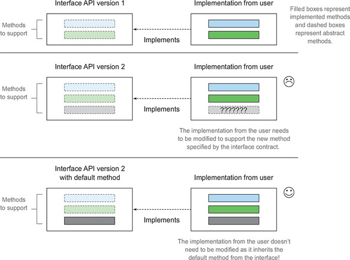
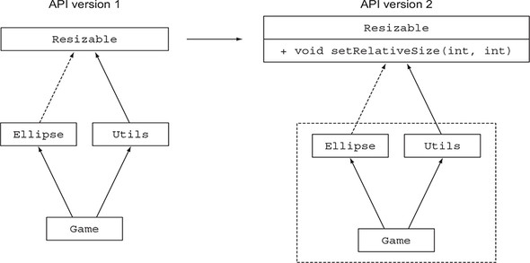
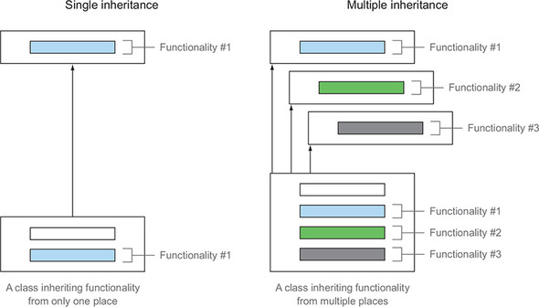
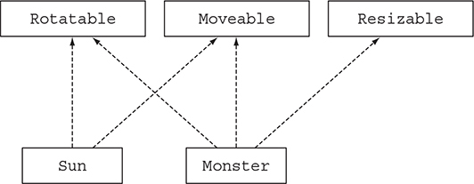
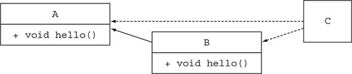
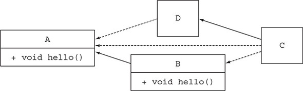
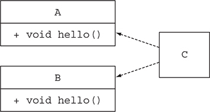
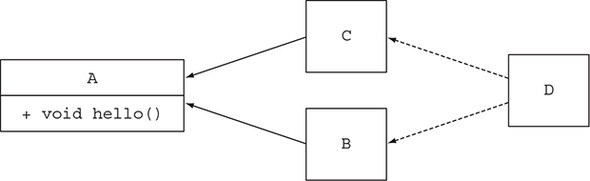

# Chương 13. Default method

> **Nội dung chương này**
>
> - Default method là gì
> - Tiến hoá API theo cách tương thích
> - Các mẫu sử dụng (usage pattern) cho default method
> - Các quy tắc giải quyết xung đột (resolution rules)

Theo cách truyền thống, một interface trong Java nhóm các phương thức liên quan lại với nhau thành một bản hợp đồng (contract). Bất kỳ class (không trừu tượng) nào implement một interface đều phải cung cấp phần cài đặt cho từng phương thức mà interface đó định nghĩa, hoặc kế thừa phần cài đặt từ một superclass. Nhưng yêu cầu này gây ra vấn đề khi những người thiết kế thư viện cần cập nhật một interface để thêm một phương thức mới. Thật vậy, các class cụ thể đang tồn tại (mà rất có thể không nằm dưới quyền kiểm soát của người thiết kế interface) sẽ cần được sửa đổi để phản ánh bản hợp đồng mới của interface. Tình huống này đặc biệt rắc rối bởi vì API của Java 8 bổ sung rất nhiều phương thức mới vào các interface sẵn có, chẳng hạn như phương thức `sort` trên interface `List` mà bạn đã dùng ở các chương trước. Hãy tưởng tượng cơn giận dữ của tất cả những người bảo trì các collection framework thay thế như Guava và Apache Commons, những người giờ đây phải sửa lại toàn bộ các class implement interface `List` để cung cấp thêm phần cài đặt cho phương thức `sort`!

Nhưng đừng lo. Java 8 đã giới thiệu một cơ chế mới để giải quyết vấn đề này. Nghe có vẻ đáng ngạc nhiên, nhưng kể từ Java 8, interface có thể khai báo các phương thức kèm code cài đặt theo hai cách. Thứ nhất, Java 8 cho phép static method bên trong interface. Thứ hai, Java 8 giới thiệu một tính năng mới gọi là default method (phương thức mặc định), cho phép bạn cung cấp một phần cài đặt mặc định cho các phương thức trong một interface. Nói cách khác, giờ đây interface có thể cung cấp phần cài đặt cụ thể cho các phương thức. Kết quả là, các class hiện có đang implement một interface sẽ tự động kế thừa các phần cài đặt mặc định nếu chúng không cung cấp phần cài đặt của riêng mình một cách tường minh, nhờ đó bạn có thể tiến hoá các interface mà không xâm phạm (nonintrusively) đến code hiện có. Thực ra bạn đã sử dụng nhiều default method từ đầu đến giờ rồi. Hai ví dụ mà bạn đã thấy là `sort` trong interface `List` và `stream` trong interface `Collection`.

Phương thức `sort` trong interface `List`, mà bạn đã thấy ở chương 1, là mới trong Java 8 và được định nghĩa như sau:

```java
default void sort(Comparator<? super E> c) {
    Collections.sort(this, c);
}
```

Hãy để ý bổ từ (modifier) `default` mới đặt trước kiểu trả về. Bổ từ này chính là cách để bạn biết một phương thức là default method. Ở đây, phương thức `sort` gọi phương thức `Collections.sort` để thực hiện việc sắp xếp. Nhờ phương thức mới này, bạn có thể sắp xếp một danh sách bằng cách gọi trực tiếp phương thức đó:

```java
List<Integer> numbers = Arrays.asList(3, 5, 1, 2, 6);
numbers.sort(Comparator.naturalOrder());  // sort là một default method trong interface List
```

Còn một điều mới nữa trong đoạn code này. Hãy chú ý rằng bạn gọi phương thức `Comparator.naturalOrder`. Static method mới này trong interface `Comparator` trả về một đối tượng `Comparator` để sắp xếp các phần tử theo thứ tự tự nhiên (thứ tự sắp xếp chữ-số tiêu chuẩn). Phương thức `stream` trong `Collection` mà bạn đã thấy ở chương 4 trông như thế này:

```java
default Stream<E> stream() {
    return StreamSupport.stream(spliterator(), false);
}
```

Ở đây, phương thức `stream`, mà bạn đã sử dụng rất nhiều ở các chương trước để xử lý các collection, gọi phương thức `StreamSupport.stream` để trả về một stream. Hãy để ý cách phần thân của phương thức `stream` gọi phương thức `spliterator`, bản thân nó cũng là một default method của interface `Collection`.

Chà! Vậy giờ đây interface giống như abstract class rồi sao? Vừa đúng vừa không; có những khác biệt căn bản mà chúng tôi sẽ giải thích trong chương này. Quan trọng hơn, tại sao bạn nên quan tâm đến default method? Người dùng chính của default method là những người thiết kế thư viện. Như chúng tôi sẽ giải thích ở phần sau, default method được giới thiệu để tiến hoá các thư viện như Java API theo cách tương thích, như minh hoạ ở hình 13.1.

> **Hình 13.1.** Thêm một phương thức vào một interface
>
> 

Nói ngắn gọn, việc thêm một phương thức vào một interface là nguồn gốc của rất nhiều vấn đề; các class hiện có đang implement interface đó cần được thay đổi để cung cấp phần cài đặt cho phương thức mới. Nếu bạn nắm quyền kiểm soát interface và tất cả các phần cài đặt của nó thì tình hình không đến nỗi tệ. Nhưng thường thì không phải như vậy — và đó chính là động cơ dẫn tới default method, thứ cho phép các class tự động kế thừa một phần cài đặt mặc định từ một interface.

Nếu bạn là người thiết kế thư viện thì chương này rất quan trọng, bởi default method cung cấp một phương tiện để tiến hoá interface mà không cần sửa đổi các phần cài đặt hiện có. Ngoài ra, như chúng tôi sẽ giải thích ở phần sau của chương, default method có thể giúp bạn cấu trúc chương trình bằng cách cung cấp một cơ chế linh hoạt cho đa kế thừa hành vi (multiple inheritance of behavior); một class có thể kế thừa default method từ nhiều interface. Do đó, bạn vẫn có thể quan tâm đến việc tìm hiểu về default method ngay cả khi bạn không phải là người thiết kế thư viện.

> **Static method và interface**
>
> Một mẫu (pattern) phổ biến trong Java là định nghĩa cả một interface lẫn một class tiện ích đi kèm (utility companion class) chứa nhiều static method để làm việc với các thể hiện của interface đó. Chẳng hạn, `Collections` là class đi kèm để làm việc với các đối tượng `Collection`. Giờ đây, khi static method có thể tồn tại bên trong interface, những class tiện ích như vậy trong code của bạn có thể biến mất, và các static method của chúng có thể được chuyển vào bên trong interface. Các class đi kèm này vẫn còn trong Java API để bảo toàn tính tương thích ngược (backward compatibility).

Chương này được cấu trúc như sau. Trước tiên, chúng tôi dẫn bạn đi qua một tình huống sử dụng về việc tiến hoá một API và những vấn đề có thể phát sinh. Sau đó chúng tôi giải thích default method là gì và bàn về cách bạn có thể dùng chúng để xử lý các vấn đề trong tình huống sử dụng đó. Tiếp theo, chúng tôi trình bày cách bạn có thể tạo default method của riêng mình để đạt được một dạng đa kế thừa trong Java. Chúng ta kết thúc chương bằng một số thông tin kỹ thuật chi tiết hơn về cách trình biên dịch Java giải quyết những nhập nhằng có thể xảy ra khi một class kế thừa nhiều default method có cùng chữ ký (signature).

## 13.1. Tiến hoá các API

Để hiểu tại sao việc tiến hoá một API lại khó khăn sau khi nó đã được công bố, trong mục này hãy giả sử bạn là người thiết kế một thư viện vẽ (drawing library) phổ biến của Java. Thư viện của bạn chứa một interface `Resizable` định nghĩa nhiều phương thức mà một hình đơn giản có thể thay đổi kích thước phải hỗ trợ: `setHeight`, `setWidth`, `getHeight`, `getWidth` và `setAbsoluteSize`. Ngoài ra, bạn cung cấp sẵn vài phần cài đặt dùng ngay cho nó, chẳng hạn như `Square` và `Rectangle`. Vì thư viện của bạn quá phổ biến, bạn có một số người dùng đã tự tạo ra những phần cài đặt thú vị của riêng họ, chẳng hạn như `Ellipse`, dựa trên interface `Resizable` của bạn.

Vài tháng sau khi phát hành API, bạn nhận ra rằng `Resizable` còn thiếu một vài tính năng. Chẳng hạn, sẽ thật tuyệt nếu interface có một phương thức `setRelativeSize` nhận đối số là một hệ số phóng to để thay đổi kích thước một hình. Bạn có thể thêm phương thức `setRelativeSize` vào `Resizable` và cập nhật các phần cài đặt `Square` và `Rectangle` của mình. Nhưng khoan đã! Còn tất cả những người dùng đã tự tạo phần cài đặt riêng cho interface `Resizable` thì sao? Đáng tiếc là bạn không có quyền truy cập và cũng không thể thay đổi các class của họ đang implement `Resizable`. Vấn đề này chính là vấn đề mà những người thiết kế thư viện Java phải đối mặt khi họ cần tiến hoá Java API. Ở mục tiếp theo, chúng ta sẽ xem xét chi tiết một ví dụ cho thấy hậu quả của việc sửa đổi một interface đã được công bố.

### 13.1.1. API phiên bản 1

Phiên bản đầu tiên của interface `Resizable` của bạn có các phương thức sau:

```java
public interface Resizable extends Drawable {
    int getWidth();
    int getHeight();
    void setWidth(int width);
    void setHeight(int height);
    void setAbsoluteSize(int width, int height);
}
```

**Phần cài đặt của người dùng**

Một trong những người dùng trung thành nhất của bạn quyết định tạo phần cài đặt của riêng anh ta cho `Resizable`, đặt tên là `Ellipse`:

```java
public class Ellipse implements Resizable {
    ...
}
```

Anh ta đã tạo một trò chơi xử lý nhiều kiểu hình `Resizable` khác nhau (bao gồm cả `Ellipse` của chính anh ta):

```java
public class Game {
    public static void main(String... args) {
        // Một danh sách các hình có thể thay đổi kích thước
        List<Resizable> resizableShapes =
            Arrays.asList(new Square(), new Rectangle(), new Ellipse());
        Utils.paint(resizableShapes);
    }
}

public class Utils {
    public static void paint(List<Resizable> l) {
        l.forEach(r -> {
            r.setAbsoluteSize(42, 42);  // Gọi phương thức setAbsoluteSize trên từng hình
            r.draw();
        });
    }
}
```

### 13.1.2. API phiên bản 2

Sau khi thư viện của bạn được sử dụng vài tháng, bạn nhận được nhiều yêu cầu cập nhật các phần cài đặt của `Resizable` — `Square`, `Rectangle`, v.v. — để hỗ trợ phương thức `setRelativeSize`. Bạn cho ra đời phiên bản 2 của API như sau, và được minh hoạ ở hình 13.2:

```java
public interface Resizable {
    int getWidth();
    int getHeight();
    void setWidth(int width);
    void setHeight(int height);
    void setAbsoluteSize(int width, int height);
    // Thêm một phương thức mới cho API phiên bản 2
    void setRelativeSize(int wFactor, int hFactor);
}
```

> **Hình 13.2.** Tiến hoá một API bằng cách thêm một phương thức vào `Resizable`. Việc biên dịch lại ứng dụng sẽ sinh ra lỗi bởi vì ứng dụng phụ thuộc vào interface `Resizable`.
>
> 

**Những vấn đề cho người dùng của bạn**

Bản cập nhật này của `Resizable` tạo ra nhiều vấn đề. Thứ nhất, interface giờ đây đòi hỏi phải có một phần cài đặt cho `setRelativeSize`, nhưng phần cài đặt `Ellipse` mà người dùng của bạn tạo ra lại không implement phương thức `setRelativeSize`. Việc thêm một phương thức mới vào một interface là tương thích nhị phân (binary compatible), nghĩa là các file class đang tồn tại vẫn chạy được mà không cần có phần cài đặt cho phương thức mới, miễn là không ai cố biên dịch lại chúng. Trong trường hợp này, trò chơi vẫn sẽ chạy (trừ khi nó được biên dịch lại) mặc dù phương thức `setRelativeSize` đã được thêm vào interface `Resizable`. Tuy nhiên, người dùng có thể sửa phương thức `Utils.paint` trong trò chơi của anh ta để dùng phương thức `setRelativeSize`, bởi vì phương thức `paint` mong đợi một danh sách các đối tượng `Resizable` làm đối số. Nếu một đối tượng `Ellipse` được truyền vào, một lỗi sẽ được ném ra lúc chạy (runtime) vì phương thức `setRelativeSize` chưa được cài đặt:

```text
Exception in thread "main" java.lang.AbstractMethodError:
    lambdasinaction.chap9.Ellipse.setRelativeSize(II)V
```

Thứ hai, nếu người dùng cố build lại toàn bộ ứng dụng của anh ta (bao gồm cả `Ellipse`), anh ta sẽ nhận được lỗi biên dịch sau:

```text
lambdasinaction/chap9/Ellipse.java:6: error: Ellipse is not abstract and
    does not override abstract method setRelativeSize(int,int) in Resizable
```

Do đó, việc cập nhật một API đã công bố tạo ra sự không tương thích ngược (backward incompatibility), và đó chính là lý do vì sao việc tiến hoá các API hiện có, chẳng hạn như Java Collections API chính thức, lại gây ra vấn đề cho người dùng của các API đó. Bạn có những lựa chọn thay thế để tiến hoá một API, nhưng chúng đều là những lựa chọn tồi. Chẳng hạn, bạn có thể tạo một phiên bản riêng biệt cho API của mình và duy trì song song cả phiên bản cũ lẫn phiên bản mới, nhưng phương án này bất tiện vì nhiều lý do. Thứ nhất, nó phức tạp hơn cho bạn với vai trò người thiết kế thư viện phải bảo trì. Thứ hai, người dùng của bạn có thể phải dùng cả hai phiên bản của API trong cùng một code base, điều này ảnh hưởng đến không gian bộ nhớ và thời gian nạp (loading time) bởi vì dự án của họ cần nhiều file class hơn.

Trong trường hợp này, default method đến giải cứu. Chúng cho phép những người thiết kế thư viện tiến hoá API mà không phá vỡ code hiện có, bởi vì các class implement một interface đã được cập nhật sẽ tự động kế thừa một phần cài đặt mặc định.

> **Các loại tương thích khác nhau: tương thích nhị phân, mã nguồn và hành vi**
>
> Có ba loại tương thích chính khi đưa một thay đổi vào một chương trình Java: tương thích nhị phân (binary), tương thích mã nguồn (source) và tương thích hành vi (behavioral) (xem https://blogs.oracle.com/darcy/entry/kinds_of_compatibility). Bạn đã thấy rằng việc thêm một phương thức vào một interface là tương thích nhị phân nhưng lại gây ra lỗi biên dịch nếu class implement interface đó được biên dịch lại. Việc nắm được các loại tương thích khác nhau là điều hữu ích, nên trong khung phụ này, chúng ta sẽ xem xét chúng một cách chi tiết.
>
> **Tương thích nhị phân** (binary compatibility) nghĩa là các file nhị phân hiện đang chạy không lỗi vẫn tiếp tục liên kết (link — bao gồm các bước verification, preparation và resolution) mà không gặp lỗi sau khi thay đổi được đưa vào. Chẳng hạn, việc thêm một phương thức vào một interface là tương thích nhị phân, bởi vì nếu phương thức đó không được gọi thì các phương thức hiện có của interface vẫn chạy bình thường.
>
> Ở dạng đơn giản nhất, **tương thích mã nguồn** (source compatibility) nghĩa là một chương trình đang tồn tại vẫn biên dịch được sau khi thay đổi được đưa vào. Việc thêm một phương thức vào một interface là không tương thích mã nguồn; các phần cài đặt hiện có sẽ không biên dịch lại được vì chúng cần phải cài đặt phương thức mới.
>
> Cuối cùng, **tương thích hành vi** (behavioral compatibility) nghĩa là việc chạy một chương trình sau khi thay đổi với cùng dữ liệu đầu vào sẽ cho ra cùng một hành vi. Việc thêm một phương thức vào một interface là tương thích hành vi, bởi vì phương thức đó không bao giờ được gọi trong chương trình (hoặc bị override bởi một phần cài đặt).

## 13.2. Default method — tóm tắt nhanh

Bạn đã thấy việc thêm phương thức vào một API đã công bố phá vỡ các phần cài đặt hiện có như thế nào. Default method là tính năng mới trong Java 8 nhằm tiến hoá các API theo cách tương thích. Giờ đây một interface có thể chứa chữ ký phương thức mà class implement nó không cần cung cấp phần cài đặt. Vậy ai cài đặt chúng? Phần thân phương thức còn thiếu được cung cấp như một phần của chính interface (do đó mới gọi là phần cài đặt mặc định — default implementation), chứ không phải trong class implement.

Làm sao để nhận ra một default method? Đơn giản thôi: nó bắt đầu bằng bổ từ `default` và chứa một phần thân giống như một phương thức được khai báo trong class. Trong bối cảnh của một thư viện collection, bạn có thể định nghĩa một interface `Sized` với một phương thức trừu tượng `size` và một default method `isEmpty`, như sau:

```java
public interface Sized {
    int size();

    // Một default method
    default boolean isEmpty() {
        return size() == 0;
    }
}
```

Giờ đây bất kỳ class nào implement interface `Sized` đều tự động kế thừa phần cài đặt của `isEmpty`. Do đó, việc thêm một phương thức có phần cài đặt mặc định vào một interface không gây ra sự không tương thích mã nguồn.

Bây giờ hãy quay lại ví dụ ban đầu về thư viện vẽ của Java và trò chơi của bạn. Cụ thể, để tiến hoá thư viện theo cách tương thích (nghĩa là người dùng thư viện của bạn không phải sửa toàn bộ các class của họ đang implement `Resizable`), hãy dùng một default method và cung cấp một phần cài đặt mặc định cho `setRelativeSize`, như sau:

```java
default void setRelativeSize(int wFactor, int hFactor) {
    setAbsoluteSize(getWidth() / wFactor, getHeight() / hFactor);
}
```

Vì giờ đây interface có thể có phương thức kèm phần cài đặt, liệu điều đó có nghĩa là đa kế thừa (multiple inheritance) đã đến với Java? Chuyện gì xảy ra nếu một class implement cũng định nghĩa cùng chữ ký phương thức đó, hay liệu default method có thể bị override hay không? Đừng lo lắng về những vấn đề này lúc này; có một vài quy tắc và cơ chế sẵn sàng giúp bạn xử lý chúng. Chúng ta sẽ khám phá chi tiết ở mục 13.4.

Chắc bạn cũng đoán được rằng default method được dùng rất nhiều trong Java 8 API. Bạn đã thấy ở phần mở đầu chương này rằng phương thức `stream` trong interface `Collection` mà chúng ta dùng rất nhiều ở các chương trước là một default method. Phương thức `sort` trong interface `List` cũng là một default method. Nhiều functional interface mà chúng tôi đã trình bày ở chương 3 — chẳng hạn như `Predicate`, `Function` và `Comparator` — cũng bổ sung các default method mới, chẳng hạn `Predicate.and` và `Function.andThen`. (Hãy nhớ rằng một functional interface chỉ chứa duy nhất một phương thức trừu tượng; default method là các phương thức không trừu tượng.)

> **Abstract class và interface trong Java 8**
>
> Sự khác biệt giữa một abstract class và một interface là gì? Cả hai đều có thể chứa các phương thức trừu tượng và các phương thức có phần thân.
>
> Thứ nhất, một class chỉ có thể extend từ một abstract class duy nhất, nhưng một class có thể implement nhiều interface.
>
> Thứ hai, một abstract class có thể áp đặt một trạng thái chung thông qua các biến thể hiện (instance variable hay field). Một interface không thể có biến thể hiện.

Để vận dụng kiến thức của bạn về default method, hãy thử sức với quiz 13.1.

---

**Quiz 13.1: removeIf**

Trong quiz này, hãy giả vờ rằng bạn là một trong những bậc thầy của ngôn ngữ và API Java. Bạn nhận được rất nhiều yêu cầu về một phương thức `removeIf` để dùng trên `ArrayList`, `TreeSet`, `LinkedList` và tất cả các collection khác. Phương thức `removeIf` phải loại bỏ khỏi một collection tất cả các phần tử khớp với một predicate cho trước. Nhiệm vụ của bạn trong quiz này là tìm ra cách tốt nhất để bổ sung phương thức mới này vào Collections API.

**Đáp án:**

Cách gây xáo trộn nhất để bổ sung cho Collections API là gì? Bạn có thể copy và paste phần cài đặt của `removeIf` vào từng class cụ thể của Collections API, nhưng giải pháp đó sẽ là một tội ác đối với cộng đồng Java. Bạn còn có thể làm gì khác? Này nhé, tất cả các class `Collection` đều implement một interface tên là `java.util.Collection`. Tuyệt vời; bạn có thể thêm một phương thức vào đó không? Có. Bạn đã học được rằng default method cho phép bạn thêm phần cài đặt bên trong một interface theo cách tương thích mã nguồn. Tất cả các class implement `Collection` (bao gồm cả các class của người dùng vốn không thuộc Collections API) đều có thể dùng phần cài đặt của `removeIf`. Lời giải bằng code cho `removeIf` như sau (đây gần như chính là phần cài đặt trong Java 8 Collections API chính thức). Lời giải này là một default method bên trong interface `Collection`:

```java
default boolean removeIf(Predicate<? super E> filter) {
    boolean removed = false;
    Iterator<E> each = iterator();
    while (each.hasNext()) {
        if (filter.test(each.next())) {
            each.remove();
            removed = true;
        }
    }
    return removed;
}
```

---

## 13.3. Các mẫu sử dụng cho default method

Bạn đã thấy rằng default method có thể hữu ích cho việc tiến hoá một thư viện theo cách tương thích. Bạn có thể làm gì khác với chúng nữa không? Bạn cũng có thể tạo các interface của riêng mình có default method. Bạn có thể muốn làm điều này cho hai tình huống sử dụng mà chúng ta sẽ khám phá trong các mục sau: optional method (phương thức tuỳ chọn) và multiple inheritance of behavior (đa kế thừa hành vi).

### 13.3.1. Optional method

Nhiều khả năng bạn đã từng gặp những class implement một interface nhưng để trống phần cài đặt của một số phương thức. Chẳng hạn, hãy lấy interface `Iterator`, vốn định nghĩa `hasNext` và `next` nhưng cũng định nghĩa cả phương thức `remove`. Trước Java 8, `remove` thường bị bỏ qua bởi vì người dùng quyết định không sử dụng khả năng đó. Kết quả là nhiều class implement `Iterator` có một phần cài đặt rỗng cho `remove`, dẫn đến code khuôn mẫu (boilerplate) không cần thiết.

Với default method, bạn có thể cung cấp một phần cài đặt mặc định cho những phương thức như vậy, nhờ đó các class cụ thể không cần phải cung cấp một phần cài đặt rỗng một cách tường minh. Interface `Iterator` trong Java 8 cung cấp một phần cài đặt mặc định cho `remove` như sau:

```java
interface Iterator<T> {
    boolean hasNext();
    T next();

    default void remove() {
        throw new UnsupportedOperationException();
    }
}
```

Do đó, bạn có thể giảm bớt code khuôn mẫu. Bất kỳ class nào implement interface `Iterator` cũng không còn cần khai báo một phương thức `remove` rỗng để bỏ qua nó nữa, bởi vì giờ đây nó đã có sẵn một phần cài đặt mặc định.

### 13.3.2. Đa kế thừa hành vi

Default method mở ra một điều gì đó thật thanh lịch mà trước đây không thể làm được: đa kế thừa hành vi (multiple inheritance of behavior), tức là khả năng một class tái sử dụng code từ nhiều nơi khác nhau (hình 13.3).

> **Hình 13.3.** Đơn kế thừa so với đa kế thừa
>
> 

Hãy nhớ rằng các class trong Java chỉ có thể kế thừa từ đúng một class khác, nhưng các class thì luôn luôn được phép implement nhiều interface. Để xác nhận điều đó, dưới đây là cách class `ArrayList` được định nghĩa trong Java API:

```java
public class ArrayList<E> extends AbstractList<E>          // Kế thừa từ một class
        implements List<E>, RandomAccess, Cloneable,
                   Serializable {                          // Implement bốn interface
}
```

**Đa kế thừa kiểu (Multiple inheritance of types)**

Ở đây, `ArrayList` extend một class và trực tiếp implement bốn interface. Kết quả là, `ArrayList` là kiểu con (subtype) trực tiếp của bảy kiểu: `AbstractList`, `List`, `RandomAccess`, `Cloneable`, `Serializable`, `Iterable` và `Collection`. Theo một nghĩa nào đó, bạn đã có sẵn đa kế thừa kiểu rồi.

Vì các phương thức của interface có thể có phần cài đặt trong Java 8, các class có thể kế thừa hành vi (code cài đặt) từ nhiều interface. Ở mục tiếp theo, chúng ta khám phá một ví dụ để thấy cách bạn có thể tận dụng khả năng này cho lợi ích của mình. Việc giữ cho các interface tối giản và trực giao (orthogonal) cho phép bạn đạt được mức tái sử dụng và khả năng kết hợp hành vi rất tốt trong code base của mình.

**Các interface tối giản với các chức năng trực giao**

Giả sử bạn cần định nghĩa nhiều hình khác nhau với những đặc điểm khác nhau cho trò chơi mà bạn đang tạo. Một số hình cần có khả năng thay đổi kích thước nhưng không xoay được; một số cần xoay được và di chuyển được nhưng không thay đổi kích thước được. Làm sao bạn có thể đạt được mức tái sử dụng code cao?

Bạn có thể bắt đầu bằng cách định nghĩa một interface `Rotatable` độc lập với hai phương thức trừu tượng: `setRotationAngle` và `getRotationAngle`. Interface này cũng khai báo một default method `rotateBy` mà bạn có thể cài đặt bằng cách dùng các phương thức `setRotationAngle` và `getRotationAngle` như sau:

```java
public interface Rotatable {
    void setRotationAngle(int angleInDegrees);
    int getRotationAngle();

    // Một phần cài đặt mặc định cho phương thức rotateBy
    default void rotateBy(int angleInDegrees) {
        setRotationAngle((getRotationAngle() + angleInDegrees) % 360);
    }
}
```

Kỹ thuật này phần nào liên quan đến design pattern Template Method, trong đó một thuật toán khung (skeleton algorithm) được định nghĩa dựa trên các phương thức khác cần được cài đặt.

Giờ đây bất kỳ class nào implement `Rotatable` sẽ cần cung cấp phần cài đặt cho `setRotationAngle` và `getRotationAngle`, nhưng sẽ được kế thừa miễn phí phần cài đặt mặc định của `rotateBy`.

Tương tự, bạn có thể định nghĩa hai interface mà bạn đã thấy trước đó: `Moveable` và `Resizable`. Cả hai interface đều chứa các phần cài đặt mặc định. Dưới đây là code cho `Moveable`:

```java
public interface Moveable {
    int getX();
    int getY();
    void setX(int x);
    void setY(int y);

    default void moveHorizontally(int distance) {
        setX(getX() + distance);
    }

    default void moveVertically(int distance) {
        setY(getY() + distance);
    }
}
```

Và đây là code cho `Resizable`:

```java
public interface Resizable {
    int getWidth();
    int getHeight();
    void setWidth(int width);
    void setHeight(int height);
    void setAbsoluteSize(int width, int height);

    default void setRelativeSize(int wFactor, int hFactor) {
        setAbsoluteSize(getWidth() / wFactor, getHeight() / hFactor);
    }
}
```

**Kết hợp các interface**

Bạn có thể tạo ra các class cụ thể khác nhau cho trò chơi của mình bằng cách kết hợp các interface này. Chẳng hạn, quái vật (monster) có thể di chuyển được, xoay được và thay đổi kích thước được:

```java
public class Monster implements Rotatable, Moveable, Resizable {
    // Cần cung cấp phần cài đặt cho tất cả các phương thức trừu tượng
    // nhưng không cần cho các default method
    ...
}
```

Class `Monster` tự động kế thừa các default method từ các interface `Rotatable`, `Moveable` và `Resizable`. Trong trường hợp này, `Monster` kế thừa các phần cài đặt của `rotateBy`, `moveHorizontally`, `moveVertically` và `setRelativeSize`.

Giờ đây bạn có thể gọi trực tiếp các phương thức khác nhau:

```java
// Constructor thiết lập bên trong các toạ độ, chiều cao, chiều rộng và góc mặc định
Monster m = new Monster();
m.rotateBy(180);        // Gọi rotateBy từ Rotatable
m.moveVertically(10);   // Gọi moveVertically từ Moveable
```

Giả sử bây giờ bạn cần khai báo thêm một class nữa có thể di chuyển được và xoay được nhưng không thay đổi kích thước được, chẳng hạn như mặt trời. Bạn không cần phải copy và paste code; bạn có thể tái sử dụng các phần cài đặt mặc định từ các interface `Moveable` và `Rotatable`, như dưới đây.

```java
public class Sun implements Moveable, Rotatable {
    // Cần cung cấp phần cài đặt cho tất cả các phương thức trừu tượng
    // nhưng không cần cho các default method
    ...
}
```

Hình 13.4 minh hoạ sơ đồ UML của kịch bản này.

> **Hình 13.4.** Kết hợp nhiều hành vi
>
> 

Đây là một ưu điểm nữa của việc định nghĩa các interface đơn giản kèm phần cài đặt mặc định như những interface cho trò chơi của bạn. Giả sử bạn cần sửa phần cài đặt của `moveVertically` để nó hiệu quả hơn. Bạn có thể thay đổi phần cài đặt của nó trực tiếp trong interface `Moveable`, và tất cả các class implement interface đó sẽ tự động kế thừa đoạn code mới (với điều kiện là bản thân chúng không tự cài đặt phương thức đó)!

> **Kế thừa bị xem là có hại**
>
> Kế thừa không nên là câu trả lời cho mọi thứ khi nói đến việc tái sử dụng code. Chẳng hạn, việc kế thừa từ một class có 100 phương thức và trường dữ liệu chỉ để tái sử dụng một phương thức là một ý tưởng tồi, bởi vì nó làm tăng thêm độ phức tạp không cần thiết. Bạn sẽ tốt hơn nếu dùng uỷ nhiệm (delegation): tạo một phương thức gọi trực tiếp phương thức của class mà bạn cần thông qua một biến thành viên. Vì lý do này, đôi khi bạn sẽ thấy những class được khai báo "final" một cách có chủ ý: chúng không thể bị kế thừa, nhằm ngăn chặn kiểu antipattern này hoặc ngăn ai đó phá hỏng hành vi cốt lõi của chúng. Lưu ý rằng đôi khi các class final thực sự có chỗ đứng của mình. Chẳng hạn, `String` là final bởi vì bạn không muốn ai đó có thể can thiệp vào một chức năng cốt lõi như vậy.

Ý tưởng tương tự cũng áp dụng cho các interface có default method. Bằng cách giữ cho interface của bạn tối giản, bạn có thể đạt được khả năng kết hợp tốt hơn bởi vì bạn chỉ chọn đúng những phần cài đặt mà bạn cần.

Bạn đã thấy rằng default method hữu ích cho nhiều mẫu sử dụng. Nhưng đây là một điều đáng suy ngẫm: Chuyện gì xảy ra nếu một class implement hai interface có cùng chữ ký default method? Class đó được phép dùng phương thức nào? Chúng ta sẽ khám phá vấn đề này ở mục tiếp theo.

## 13.4. Các quy tắc giải quyết xung đột

Như bạn đã biết, trong Java một class chỉ có thể extend đúng một class cha nhưng lại có thể implement nhiều interface. Với sự ra đời của default method trong Java 8, có khả năng một class kế thừa nhiều hơn một phương thức có cùng chữ ký. Vậy phiên bản nào của phương thức nên được dùng? Những xung đột như vậy có lẽ khá hiếm trong thực tế, nhưng khi chúng xảy ra thì phải có các quy tắc quy định cách xử lý xung đột. Mục này giải thích cách trình biên dịch Java giải quyết những xung đột tiềm tàng như vậy. Chúng ta hướng đến việc trả lời những câu hỏi kiểu như "Trong đoạn code sau, `C` đang gọi phương thức `hello` nào?" Lưu ý rằng các ví dụ sau đây được dựng ra để khám phá những kịch bản rắc rối; những kịch bản như thế không nhất thiết sẽ xảy ra thường xuyên trong thực tế:

```java
public interface A {
    default void hello() {
        System.out.println("Hello from A");
    }
}

public interface B extends A {
    default void hello() {
        System.out.println("Hello from B");
    }
}

public class C implements B, A {
    public static void main(String... args) {
        new C().hello();  // Cái gì sẽ được in ra?
    }
}
```

Ngoài ra, có thể bạn đã từng nghe nói về bài toán kim cương (diamond problem) trong C++, trong đó một class có thể kế thừa hai phương thức có cùng chữ ký. Cái nào sẽ được chọn? Java 8 cũng cung cấp các quy tắc giải quyết để xử lý vấn đề này. Hãy đọc tiếp!

### 13.4.1. Ba quy tắc giải quyết xung đột cần biết

Bạn có ba quy tắc cần tuân theo khi một class kế thừa một phương thức có cùng chữ ký từ nhiều nơi (chẳng hạn từ một class khác hoặc từ một interface):

1. **Class luôn thắng.** Một khai báo phương thức trong class hoặc trong một superclass được ưu tiên hơn bất kỳ khai báo default method nào.

2. **Nếu không, interface con thắng**: phương thức có cùng chữ ký trong interface cung cấp default method cụ thể nhất (most specific default-providing interface) sẽ được chọn. (Nếu `B` extend `A` thì `B` cụ thể hơn `A`.)

3. **Cuối cùng, nếu lựa chọn vẫn còn nhập nhằng**, class kế thừa từ nhiều interface phải chọn một cách tường minh phần cài đặt default method nào sẽ được dùng, bằng cách override phương thức đó và gọi tường minh phương thức mong muốn.

Chúng tôi cam đoan rằng đây là những quy tắc duy nhất bạn cần biết! Ở mục tiếp theo, chúng ta sẽ xem xét một vài ví dụ.

### 13.4.2. Interface cung cấp default method cụ thể nhất sẽ thắng

Ở đây, bạn xem lại ví dụ từ đầu mục này, trong đó `C` implement cả `B` lẫn `A`, hai interface cùng định nghĩa một default method tên là `hello`. Ngoài ra, `B` extend `A`. Hình 13.5 cung cấp sơ đồ UML cho kịch bản này.

> **Hình 13.5.** Interface cung cấp default method cụ thể nhất sẽ thắng.
>
> 

Trình biên dịch sẽ dùng khai báo nào của phương thức `hello`? Quy tắc 2 nói rằng phương thức thuộc interface cung cấp default method cụ thể nhất sẽ được chọn. Vì `B` cụ thể hơn `A`, `hello` từ `B` được chọn. Do đó, chương trình in ra `"Hello from B"`.

Bây giờ hãy xem điều gì sẽ xảy ra nếu `C` kế thừa từ `D` như sau (được minh hoạ ở hình 13.6):

> **Hình 13.6.** Kế thừa từ một class và implement hai interface
>
> 

```java
public class D implements A { }

public class C extends D implements B, A {
    public static void main(String... args) {
        new C().hello();  // Cái gì sẽ được in ra?
    }
}
```

Quy tắc 1 nói rằng một khai báo phương thức trong class được ưu tiên. Nhưng `D` không override `hello`; nó chỉ implement interface `A`. Do đó, nó có một default method từ interface `A`. Quy tắc 2 nói rằng nếu không có phương thức nào trong class hoặc superclass thì phương thức thuộc interface cung cấp default method cụ thể nhất sẽ được chọn. Vì vậy, trình biên dịch phải lựa chọn giữa phương thức `hello` từ interface `A` và phương thức `hello` từ interface `B`. Vì `B` cụ thể hơn, chương trình lại in ra `"Hello from B"`.

Để kiểm tra mức độ hiểu của bạn về các quy tắc giải quyết xung đột, hãy thử quiz 13.2.

---

**Quiz 13.2: Ghi nhớ các quy tắc giải quyết xung đột**

Trong quiz này, hãy tái sử dụng ví dụ ngay phía trên, chỉ khác là `D` override một cách tường minh phương thức `hello` từ `A`. Bạn nghĩ cái gì sẽ được in ra?

```java
public class D implements A {
    void hello() {
        System.out.println("Hello from D");
    }
}

public class C extends D implements B, A {
    public static void main(String... args) {
        new C().hello();
    }
}
```

**Đáp án:**

Chương trình in ra `"Hello from D"` bởi vì một khai báo phương thức từ superclass được ưu tiên, đúng như quy tắc 1 đã nêu.

Lưu ý rằng nếu `D` được khai báo như sau,

```java
public abstract class D implements A {
    public abstract void hello();
}
```

thì `C` sẽ buộc phải tự mình cài đặt phương thức `hello`, ngay cả khi tồn tại các phần cài đặt mặc định ở những nơi khác trong cây phân cấp.

---

### 13.4.3. Xung đột và việc khử nhập nhằng một cách tường minh

Những ví dụ mà bạn đã thấy cho đến giờ đều có thể được giải quyết bằng hai quy tắc đầu tiên. Bây giờ hãy giả sử `B` không còn extend `A` nữa (được minh hoạ ở hình 13.7):

```java
public interface A {
    default void hello() {
        System.out.println("Hello from A");
    }
}

public interface B {
    default void hello() {
        System.out.println("Hello from B");
    }
}

public class C implements B, A { }
```

> **Hình 13.7.** Implement hai interface
>
> 

Quy tắc 2 không giúp được bạn lúc này bởi vì không còn interface nào cụ thể hơn để chọn. Cả hai phương thức `hello` từ `A` và `B` đều có thể là lựa chọn hợp lệ. Vì vậy, trình biên dịch Java sinh ra một lỗi biên dịch bởi vì nó không biết phương thức nào phù hợp hơn: `"Error: class C inherits unrelated defaults for hello() from types B and A."`

**Giải quyết xung đột**

Không có nhiều giải pháp để giải quyết xung đột giữa hai phương thức hợp lệ khả dĩ; bạn phải quyết định một cách tường minh khai báo phương thức nào bạn muốn `C` sử dụng. Để làm điều đó, bạn có thể override phương thức `hello` trong class `C` và sau đó, trong phần thân của nó, gọi tường minh phương thức mà bạn muốn dùng. Java 8 giới thiệu cú pháp mới `X.super.m(...)`, trong đó `X` là super-interface có phương thức `m` mà bạn muốn gọi. Chẳng hạn, nếu bạn muốn `C` dùng default method từ `B` thì code sẽ trông như thế này:

```java
public class C implements B, A {
    void hello() {
        B.super.hello();  // Chọn một cách tường minh việc gọi phương thức từ interface B
    }
}
```

Hãy thử sức với quiz 13.3 để tìm hiểu một trường hợp hóc búa có liên quan.

---

**Quiz 13.3: Gần như cùng một chữ ký**

Trong quiz này, giả sử các interface `A` và `B` được khai báo như sau:

```java
public interface A {
    default Number getNumber() {
        return 10;
    }
}

public interface B {
    default Integer getNumber() {
        return 42;
    }
}
```

Cũng giả sử class `C` được khai báo như sau:

```java
public class C implements B, A {
    public static void main(String... args) {
        System.out.println(new C().getNumber());
    }
}
```

Chương trình sẽ in ra cái gì?

**Đáp án:**

`C` không thể phân biệt được phương thức của `A` hay của `B` là cụ thể hơn. Vì lý do này, class `C` sẽ không biên dịch được.

---

### 13.4.4. Bài toán kim cương

Cuối cùng, hãy xem xét một kịch bản khiến cộng đồng C++ phải rùng mình:

```java
public interface A {
    default void hello() {
        System.out.println("Hello from A");
    }
}

public interface B extends A { }

public interface C extends A { }

public class D implements B, C {
    public static void main(String... args) {
        new D().hello();  // Cái gì sẽ được in ra?
    }
}
```

Hình 13.8 minh hoạ sơ đồ UML cho kịch bản này. Vấn đề này được gọi là bài toán kim cương (diamond problem) bởi vì sơ đồ trông giống một viên kim cương. `D` kế thừa khai báo default method nào: cái từ `B` hay cái từ `C`? Bạn chỉ có duy nhất một khai báo phương thức để chọn. Chỉ có `A` khai báo một default method. Vì interface này là super-interface của `D`, đoạn code in ra `"Hello from A"`.

> **Hình 13.8.** Bài toán kim cương
>
> 

Bây giờ chuyện gì xảy ra nếu `B` cũng có một default method `hello` với cùng chữ ký? Quy tắc 2 nói rằng bạn chọn interface cung cấp default method cụ thể nhất. Vì `B` cụ thể hơn `A`, khai báo default method từ `B` được chọn. Nếu cả `B` lẫn `C` đều khai báo một phương thức `hello` với cùng chữ ký thì bạn có một xung đột và cần giải quyết nó một cách tường minh, như chúng tôi đã trình bày ở trên.

Nói thêm một chút, có thể bạn thắc mắc điều gì sẽ xảy ra nếu bạn thêm một phương thức trừu tượng `hello` (tức là một phương thức không phải default) vào interface `C` như sau (vẫn không có phương thức nào trong `A` và `B`):

```java
public interface C extends A {
    void hello();
}
```

Phương thức trừu tượng `hello` mới trong `C` được ưu tiên hơn default method `hello` từ interface `A` bởi vì `C` cụ thể hơn. Do đó, class `D` cần cung cấp một phần cài đặt tường minh cho `hello`; nếu không, chương trình sẽ không biên dịch được.

> **Bài toán kim cương trong C++**
>
> Bài toán kim cương phức tạp hơn trong C++. Thứ nhất, C++ cho phép đa kế thừa class. Theo mặc định, nếu một class `D` kế thừa từ các class `B` và `C`, và cả hai class `B` và `C` đều kế thừa từ `A`, thì class `D` có quyền truy cập vào một bản sao của đối tượng `B` và một bản sao của đối tượng `C`. Kết quả là, việc sử dụng các phương thức của `A` phải được chỉ định rõ ràng: chúng đến từ `B` hay từ `C`? Ngoài ra, các class có trạng thái, nên việc sửa đổi các biến thành viên từ `B` sẽ không được phản ánh trong bản sao của đối tượng `C`.

Bạn đã thấy rằng cơ chế giải quyết default method rất đơn giản khi một class kế thừa nhiều phương thức có cùng chữ ký. Hãy tuân theo ba quy tắc một cách có hệ thống để giải quyết mọi xung đột có thể xảy ra:

1. Trước hết, một khai báo phương thức tường minh trong class hoặc trong một superclass được ưu tiên hơn bất kỳ khai báo default method nào.
2. Nếu không, phương thức có cùng chữ ký trong interface cung cấp default method cụ thể nhất sẽ được chọn.
3. Cuối cùng, nếu vẫn còn xung đột, bạn phải override một cách tường minh các default method và chọn cái nào class của bạn sẽ dùng.

## Tóm tắt

- Interface trong Java 8 có thể chứa code cài đặt thông qua default method và static method.
- Default method bắt đầu bằng từ khoá `default` và chứa một phần thân, giống như các phương thức của class.
- Việc thêm một phương thức trừu tượng vào một interface đã công bố là một sự không tương thích mã nguồn (source incompatibility).
- Default method giúp những người thiết kế thư viện tiến hoá API theo cách tương thích ngược.
- Default method có thể được dùng để tạo ra các optional method và để đa kế thừa hành vi.
- Tồn tại các quy tắc giải quyết xung đột (resolution rules) để xử lý xung đột khi một class kế thừa nhiều default method có cùng chữ ký.
- Một khai báo phương thức trong class hoặc trong một superclass được ưu tiên hơn bất kỳ khai báo default method nào. Nếu không, phương thức có cùng chữ ký trong interface cung cấp default method cụ thể nhất sẽ được chọn.
- Khi hai phương thức có mức độ cụ thể ngang nhau, một class phải override tường minh phương thức này, chẳng hạn để chọn xem sẽ gọi cái nào.
