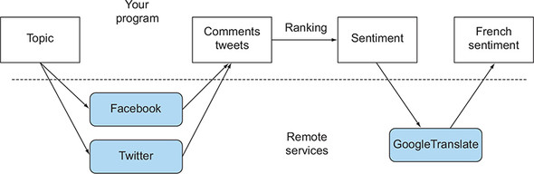
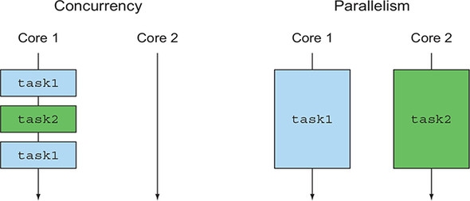
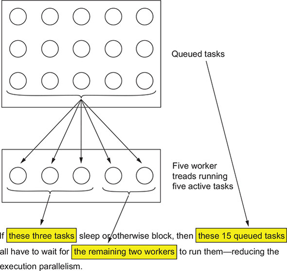
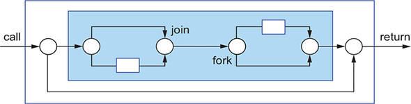
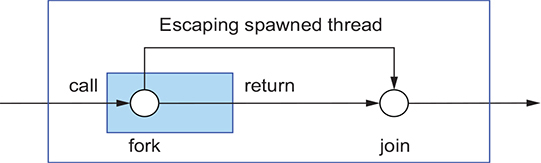
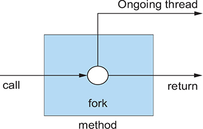
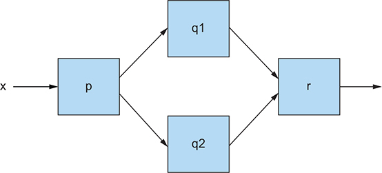
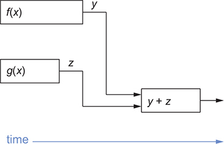
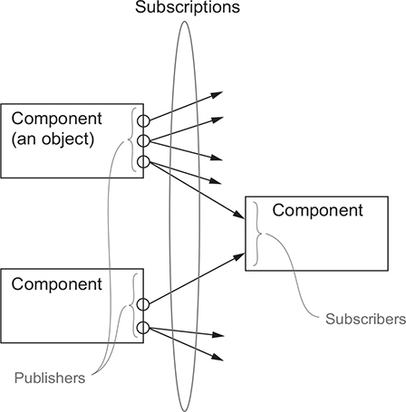

# Chương 15. Khái niệm nền tảng của CompletableFuture và reactive programming

> **Nội dung chương này**
>
> - Thread, Future, và những động lực tiến hoá khiến Java phải hỗ trợ các API xử lý đồng thời phong phú hơn
> - API asynchronous
> - Góc nhìn "hộp và kênh" (boxes-and-channels) về tính toán đồng thời
> - Các combinator của CompletableFuture dùng để nối các hộp lại với nhau một cách linh động
> - Giao thức publish-subscribe — nền tảng của Flow API trong Java 9 dành cho reactive programming
> - Reactive programming và reactive system

Trong những năm gần đây, có hai xu hướng buộc các lập trình viên phải suy nghĩ lại về cách viết phần mềm. Xu hướng thứ nhất liên quan tới phần cứng mà ứng dụng chạy trên đó, còn xu hướng thứ hai liên quan tới cách các ứng dụng được cấu trúc (đặc biệt là cách chúng tương tác với nhau). Chúng ta đã bàn về tác động của xu hướng phần cứng ở chương 7. Ở đó chúng ta đã lưu ý rằng kể từ khi bộ xử lý multicore xuất hiện, cách hiệu quả nhất để tăng tốc ứng dụng là viết phần mềm có thể khai thác trọn vẹn các bộ xử lý multicore. Bạn đã thấy rằng có thể chia nhỏ những tác vụ lớn và cho mỗi tác vụ con chạy song song với các tác vụ con khác. Bạn cũng đã học được cách fork/join framework (có từ Java 7) và parallel stream (mới trong Java 8) giúp bạn hoàn thành công việc này theo cách đơn giản hơn, hiệu quả hơn so với việc làm việc trực tiếp với các thread.

Xu hướng thứ hai phản ánh việc các dịch vụ Internet ngày càng sẵn có và ngày càng được ứng dụng sử dụng nhiều hơn. Chẳng hạn, việc áp dụng kiến trúc microservices đã tăng trưởng mạnh trong vài năm qua. Thay vì là một ứng dụng monolithic duy nhất, ứng dụng của bạn được chia nhỏ thành các dịch vụ nhỏ hơn. Việc điều phối các dịch vụ nhỏ này đòi hỏi giao tiếp qua mạng nhiều hơn. Tương tự, ngày càng có nhiều dịch vụ Internet có thể truy cập qua các API công khai, do những nhà cung cấp nổi tiếng cung cấp như Google (thông tin định vị), Facebook (thông tin mạng xã hội) và Twitter (tin tức). Ngày nay, việc phát triển một website hay một ứng dụng mạng hoạt động hoàn toàn biệt lập là tương đối hiếm. Nhiều khả năng hơn là ứng dụng web tiếp theo của bạn sẽ là một mashup, sử dụng nội dung từ nhiều nguồn khác nhau và tổng hợp lại để giúp cuộc sống của người dùng dễ dàng hơn.

Bạn có thể muốn xây dựng một website thu thập và tóm tắt cảm xúc trên mạng xã hội về một chủ đề nhất định cho những người dùng nói tiếng Pháp của bạn. Để làm điều đó, bạn có thể dùng Facebook API hoặc Twitter API để tìm những bình luận đang thịnh hành về chủ đề đó bằng nhiều ngôn ngữ, rồi xếp hạng những bình luận liên quan nhất bằng các thuật toán nội bộ của mình. Sau đó bạn có thể dùng Google Translate để dịch các bình luận sang tiếng Pháp, hoặc dùng Google Maps để định vị tác giả của chúng, tổng hợp tất cả thông tin này và hiển thị trên website của bạn.

Tất nhiên, nếu bất kỳ dịch vụ mạng bên ngoài nào phản hồi chậm, bạn sẽ muốn cung cấp kết quả từng phần cho người dùng — có lẽ là hiển thị phần kết quả dạng văn bản cùng với một tấm bản đồ chung có dấu chấm hỏi trong đó, thay vì để màn hình trắng trơn cho tới khi máy chủ bản đồ phản hồi hoặc hết thời gian chờ. Hình 15.1 minh hoạ cách kiểu ứng dụng mashup này tương tác với các dịch vụ từ xa.

> **Hình 15.1.** Một ứng dụng mashup điển hình
>
> 

Để hiện thực những ứng dụng như thế, bạn phải liên lạc với nhiều web service khác nhau qua Internet. Nhưng bạn không muốn chặn (block) các tính toán của mình và lãng phí hàng tỷ chu kỳ xung nhịp quý giá của CPU chỉ để chờ câu trả lời từ những dịch vụ đó. Chẳng hạn, bạn không nên phải chờ dữ liệu từ Facebook trước khi xử lý dữ liệu đến từ Twitter.

Tình huống này thể hiện mặt còn lại của "đồng xu" lập trình đa nhiệm. Fork/join framework và parallel stream, đã bàn ở chương 7, là những công cụ giá trị cho tính song song; chúng chia một tác vụ thành nhiều tác vụ con và thực thi các tác vụ con đó song song trên các core, các CPU, hoặc thậm chí các máy khác nhau.

Ngược lại, khi bạn đang xử lý tính đồng thời (concurrency) thay vì tính song song (parallelism), hoặc khi mục tiêu chính của bạn là thực hiện nhiều tác vụ ít liên quan với nhau trên cùng những CPU, giữ cho các core của chúng bận rộn nhất có thể nhằm tối đa hoá throughput của ứng dụng, thì bạn muốn tránh việc chặn một thread và lãng phí tài nguyên tính toán của nó trong khi chờ đợi (có thể khá lâu) kết quả từ một dịch vụ từ xa hoặc từ việc truy vấn một cơ sở dữ liệu.

Java cung cấp hai bộ công cụ chính cho những hoàn cảnh như vậy. Thứ nhất, như bạn sẽ thấy trong chương 16 và 17, interface Future — và đặc biệt là phần cài đặt CompletableFuture của nó trong Java 8 — thường mang lại những giải pháp đơn giản và hiệu quả (chương 16). Gần đây hơn, Java 9 bổ sung ý tưởng về reactive programming, được xây dựng quanh cái gọi là giao thức publish-subscribe thông qua Flow API, cung cấp những cách tiếp cận lập trình tinh vi hơn (chương 17).

Hình 15.2 minh hoạ sự khác biệt giữa concurrency và parallelism. Concurrency là một thuộc tính của chương trình (thực thi chồng lấn — overlapped execution), có thể xảy ra ngay cả trên một máy đơn core, trong khi parallelism là thuộc tính của phần cứng thực thi (thực thi đồng thời — simultaneous execution).

> **Hình 15.2.** Concurrency so với parallelism
>
> 

Phần còn lại của chương này giải thích những ý tưởng nền tảng làm cơ sở cho các API mới CompletableFuture và Flow của Java.

Chúng ta bắt đầu bằng việc giải thích quá trình tiến hoá của Java về concurrency, bao gồm Thread và các lớp trừu tượng ở mức cao hơn như Thread Pool và Future (mục 15.1). Cần lưu ý rằng chương 7 chủ yếu bàn về việc dùng parallelism trong các chương trình dạng vòng lặp. Mục 15.2 khám phá cách bạn có thể khai thác concurrency tốt hơn cho các lời gọi phương thức. Mục 15.3 cung cấp cho bạn một cách biểu diễn bằng sơ đồ để nhìn các phần của chương trình như những chiếc hộp giao tiếp với nhau qua các kênh. Mục 15.4 và mục 15.5 xem xét CompletableFuture và các nguyên lý reactive programming trong Java 8 và 9. Cuối cùng, mục 15.6 giải thích sự khác biệt giữa một reactive system và reactive programming.

> **Hướng dẫn cho người đọc**
>
> Chương này chứa rất ít code Java thực tế. Chúng tôi gợi ý rằng những độc giả chỉ muốn xem code có thể nhảy sang chương 16 và 17. Mặt khác, như tất cả chúng ta đều đã nhận ra, code hiện thực những ý tưởng xa lạ có thể rất khó hiểu. Vì vậy, chúng tôi dùng những hàm đơn giản và kèm theo các sơ đồ để giải thích những ý tưởng ở tầm tổng quát, chẳng hạn như giao thức publish-subscribe đằng sau Flow API vốn thâu tóm tinh thần của reactive programming.

Chúng tôi minh hoạ hầu hết các khái niệm bằng một ví dụ xuyên suốt, cho thấy cách tính các biểu thức như f(x)+g(x) rồi trả về, hoặc in ra, kết quả bằng nhiều tính năng concurrency khác nhau của Java — với giả định rằng f(x) và g(x) là những phép tính chạy lâu.

## 15.1. Sự tiến hoá của Java trong việc hỗ trợ biểu diễn concurrency

Java đã tiến hoá đáng kể trong việc hỗ trợ lập trình đồng thời, phần lớn phản ánh những thay đổi về phần cứng, hệ thống phần mềm và các khái niệm lập trình trong suốt 20 năm qua. Tóm lược quá trình tiến hoá này có thể giúp bạn hiểu lý do của những bổ sung mới và vai trò của chúng trong lập trình cũng như trong thiết kế hệ thống.

Ban đầu, Java có lock (thông qua các class và phương thức synchronized), Runnable và Thread. Năm 2004, Java 5 giới thiệu gói java.util.concurrent, hỗ trợ biểu diễn concurrency giàu tính diễn đạt hơn, đặc biệt là interface ExecutorService[1] (tách rời việc gửi tác vụ khỏi việc thực thi thread), cũng như Callable\<T> và Future\<T> — những biến thể ở mức cao hơn và có trả về kết quả của Runnable và Thread, đồng thời sử dụng generic (cũng được giới thiệu trong Java 5). ExecutorService có thể thực thi cả Runnable lẫn Callable. Những tính năng này tạo thuận lợi cho lập trình song song trên các CPU multicore bắt đầu xuất hiện vào năm sau đó. Nói thật lòng, chẳng ai thích làm việc trực tiếp với thread cả!

> [1] Interface ExecutorService mở rộng interface Executor với phương thức submit để chạy một Callable; interface Executor chỉ có phương thức execute dành cho Runnable.

Các phiên bản Java về sau tiếp tục tăng cường hỗ trợ concurrency, khi nhu cầu này ngày càng lớn từ phía các lập trình viên cần lập trình hiệu quả trên CPU multicore. Như bạn đã thấy ở chương 7, Java 7 bổ sung java.util.concurrent.RecursiveTask để hỗ trợ cài đặt fork/join cho các thuật toán chia-để-trị, và Java 8 bổ sung hỗ trợ cho Stream cùng khả năng xử lý song song của chúng (xây dựng trên nền hỗ trợ lambda vừa được thêm vào).

Java tiếp tục làm giàu các tính năng concurrency của mình bằng cách hỗ trợ kết hợp (compose) các Future (thông qua phần cài đặt CompletableFuture của Future trong Java 8, mục 15.4 và chương 16), và Java 9 cung cấp hỗ trợ tường minh cho lập trình bất đồng bộ phân tán. Những API này mang lại cho bạn một mô hình tư duy và một bộ công cụ để xây dựng kiểu ứng dụng mashup đã nhắc tới ở phần mở đầu chương. Ở đó, ứng dụng hoạt động bằng cách liên hệ với nhiều web service khác nhau và kết hợp thông tin của chúng theo thời gian thực cho một người dùng, hoặc để phơi bày kết quả ra thành một web service khác. Quá trình này được gọi là reactive programming, và Java 9 hỗ trợ nó thông qua giao thức publish-subscribe (được đặc tả bởi interface java.util.concurrent.Flow; xem mục 15.5 và chương 17). Một khái niệm cốt lõi của CompletableFuture và java.util.concurrent.Flow là cung cấp những cấu trúc lập trình cho phép các tác vụ độc lập thực thi đồng thời bất cứ khi nào có thể, và theo cách khai thác dễ dàng, tối đa lượng parallelism mà multicore hoặc nhiều máy tính có thể mang lại.

### 15.1.1. Thread và các lớp trừu tượng ở mức cao hơn

Nhiều người trong chúng ta đã học về thread và process từ một môn học về hệ điều hành. Một máy tính đơn CPU có thể phục vụ nhiều người dùng bởi vì hệ điều hành của nó cấp phát một process cho mỗi người dùng. Hệ điều hành cấp cho các process này những không gian địa chỉ ảo riêng biệt, để hai người dùng đều có cảm giác như họ là người dùng duy nhất của máy tính. Hệ điều hành củng cố thêm ảo giác này bằng cách thức dậy định kỳ để chia sẻ CPU giữa các process. Một process có thể yêu cầu hệ điều hành cấp cho nó một hoặc nhiều thread — những tiến trình chia sẻ chung không gian địa chỉ với process sở hữu chúng, và do đó có thể chạy các tác vụ một cách đồng thời và hợp tác với nhau.

Trong bối cảnh multicore — chẳng hạn một chiếc laptop cá nhân chỉ chạy một process người dùng — một chương trình sẽ không bao giờ khai thác được trọn vẹn sức mạnh tính toán của chiếc laptop trừ khi nó dùng thread. Mỗi core có thể được dùng cho một hoặc nhiều process hay thread, nhưng nếu chương trình của bạn không dùng thread thì thực chất nó chỉ đang dùng một core của bộ xử lý mà thôi.

Quả thực, nếu bạn có một CPU bốn core và có thể sắp xếp để mỗi core liên tục làm việc hữu ích, thì về lý thuyết chương trình của bạn chạy nhanh gấp bốn lần. (Tất nhiên, các chi phí phụ trội (overhead) sẽ làm giảm bớt kết quả này phần nào.) Với một mảng số có kích thước 1.000.000 lưu số câu trả lời đúng của các sinh viên trong một ví dụ, hãy so sánh chương trình

```java
long sum = 0;
for (int i = 0; i < 1_000_000; i++) {
    sum += stats[i];
}
```

chạy trên một thread duy nhất — vốn hoạt động tốt trong thời kỳ đơn core — với một phiên bản tạo ra bốn thread, trong đó thread thứ nhất thực thi

```java
long sum0 = 0;
for (int i = 0; i < 250_000; i++) {
    sum0 += stats[i];
}
```

và cho tới thread thứ tư thực thi

```java
long sum3 = 0;
for (int i = 750_000; i < 1_000_000; i++) {
    sum3 += stats[i];
}
```

Bốn thread này được bổ trợ bởi chương trình chính, nơi lần lượt khởi động chúng (.start() trong Java), chờ chúng hoàn thành (.join()), rồi tính

```java
sum = sum0 + ... + sum3;
```

Vấn đề là làm như vậy cho từng vòng lặp thì rất tẻ nhạt và dễ sai sót. Hơn nữa, bạn làm gì với đoạn code không phải là vòng lặp?

Chương 7 đã cho thấy Java Stream có thể đạt được tính song song này với rất ít nỗ lực từ phía lập trình viên, bằng cách dùng internal iteration thay cho external iteration (vòng lặp tường minh):

```java
sum = Arrays.stream(stats).parallel().sum();
```

Ý tưởng cần rút ra là: duyệt Stream song song là một khái niệm ở mức cao hơn so với việc dùng thread một cách tường minh. Nói cách khác, cách dùng Stream này trừu tượng hoá một mẫu sử dụng thread nhất định. Sự trừu tượng hoá vào Stream này tương tự như một design pattern, nhưng có ưu điểm là phần lớn độ phức tạp được cài đặt bên trong thư viện thay vì trở thành code khuôn mẫu (boilerplate). Chương 7 cũng đã giải thích cách dùng hỗ trợ java.util.concurrent.RecursiveTask trong Java 7 cho lớp trừu tượng fork/join của thread nhằm song song hoá các thuật toán chia-để-trị, cung cấp một cách ở mức cao hơn để tính tổng mảng một cách hiệu quả trên máy multicore.

Trước khi xem xét thêm các lớp trừu tượng khác cho thread, chúng ta hãy ghé thăm ý tưởng (từ Java 5) về ExecutorService và các thread pool mà những lớp trừu tượng cao hơn này được xây dựng trên đó.

### 15.1.2. Executor và thread pool

Java 5 cung cấp Executor framework và ý tưởng về thread pool như một khái niệm ở mức cao hơn nắm bắt sức mạnh của thread, cho phép lập trình viên Java tách rời việc gửi tác vụ khỏi việc thực thi tác vụ.

**Những vấn đề với thread**

Thread trong Java truy cập trực tiếp các thread của hệ điều hành. Vấn đề là thread của hệ điều hành rất tốn kém để tạo ra và huỷ đi (liên quan tới việc tương tác với bảng trang), và hơn nữa, số lượng chúng chỉ có hạn. Vượt quá số lượng thread của hệ điều hành nhiều khả năng sẽ khiến ứng dụng Java sập một cách khó hiểu, nên hãy cẩn thận đừng để thread chạy lay lắt trong khi vẫn tiếp tục tạo thêm thread mới.

Số lượng thread của hệ điều hành (và của Java) sẽ vượt xa số lượng hardware thread[2], nhờ đó tất cả các hardware thread đều có thể được tận dụng hữu ích để thực thi code ngay cả khi một số thread của hệ điều hành đang bị chặn hoặc đang ngủ. Ví dụ, bộ xử lý máy chủ Intel Core i7-6900K năm 2016 có tám core, mỗi core có hai hardware thread theo cơ chế đa xử lý đối xứng (SMP), dẫn tới 16 hardware thread; và một máy chủ có thể chứa vài bộ xử lý như vậy, tức là có lẽ tới 64 hardware thread. Ngược lại, một chiếc laptop có thể chỉ có một hoặc hai hardware thread, nên các chương trình có tính khả chuyển phải tránh giả định về số lượng hardware thread khả dụng. Trái lại, số lượng thread Java tối ưu cho một chương trình cho trước lại phụ thuộc vào số lượng hardware core sẵn có!

> [2] Chúng tôi lẽ ra dùng từ core ở đây, nhưng các CPU như Intel i7-6900K có nhiều hardware thread trên mỗi core, nên CPU có thể thực thi những lệnh hữu ích ngay cả trong những khoảng trễ ngắn như một lần cache miss.

**Thread pool và lý do chúng tốt hơn**

Java ExecutorService cung cấp một interface nơi bạn có thể gửi các tác vụ vào và nhận kết quả của chúng sau đó. Phần cài đặt được kỳ vọng sẽ dùng một pool các thread, có thể được tạo bằng một trong các phương thức factory, chẳng hạn phương thức newFixedThreadPool:

```java
ExecutorService newFixedThreadPool(int nThreads)
```

Phương thức này tạo ra một ExecutorService chứa nThreads (thường gọi là worker thread) và lưu chúng trong một thread pool; từ pool này, các thread rảnh rỗi được lấy ra để chạy những tác vụ đã gửi theo nguyên tắc đến trước phục vụ trước. Những thread này được trả lại pool khi tác vụ của chúng kết thúc. Một kết quả tuyệt vời là việc gửi hàng nghìn tác vụ vào thread pool trở nên rất rẻ, trong khi vẫn giữ số lượng tác vụ đang chạy ở mức phù hợp với phần cứng. Có nhiều cấu hình khả dĩ, bao gồm kích thước hàng đợi, chính sách từ chối, và độ ưu tiên cho các tác vụ khác nhau.

Hãy chú ý tới cách diễn đạt: Lập trình viên cung cấp một tác vụ (một Runnable hoặc một Callable), và tác vụ đó được thực thi bởi một thread.

**Thread pool và lý do chúng tệ hơn**

Thread pool tốt hơn việc thao tác thread tường minh ở gần như mọi phương diện, nhưng bạn cần lưu ý hai "cái bẫy":

- Một thread pool với k thread chỉ có thể thực thi đồng thời k tác vụ. Mọi tác vụ gửi thêm sẽ được giữ trong một hàng đợi và không được cấp thread cho tới khi một trong các tác vụ hiện có hoàn thành. Tình huống này nói chung là tốt, ở chỗ nó cho phép bạn gửi nhiều tác vụ mà không vô tình tạo ra quá nhiều thread, nhưng bạn phải cảnh giác với những tác vụ ngủ hoặc chờ I/O hay chờ kết nối mạng. Trong bối cảnh I/O có chặn (blocking I/O), những tác vụ này chiếm dụng worker thread nhưng chẳng làm việc gì hữu ích trong lúc chờ. Hãy thử với bốn hardware thread và một thread pool kích thước 5, rồi gửi 20 tác vụ vào đó (hình 15.3). Bạn có thể trông đợi rằng các tác vụ sẽ chạy song song cho tới khi cả 20 hoàn thành. Nhưng giả sử ba trong số các tác vụ được gửi đầu tiên lại ngủ hoặc chờ I/O. Khi đó chỉ còn hai thread khả dụng cho 15 tác vụ còn lại, nên bạn chỉ đạt được một nửa throughput như mong đợi (và như bạn hẳn đã có nếu tạo thread pool với tám thread thay vì năm). Thậm chí có thể gây ra deadlock trong một thread pool nếu những tác vụ được gửi trước, hoặc những tác vụ đang chạy, cần chờ những tác vụ được gửi sau — đây vốn là một mẫu sử dụng điển hình của Future.

  > **Hình 15.3.** Các tác vụ đang ngủ làm giảm throughput của thread pool.
  >
  > 

  Điều cần rút ra là hãy cố tránh gửi vào thread pool những tác vụ có thể bị chặn (ngủ hoặc chờ sự kiện), nhưng trong các hệ thống hiện hữu, không phải lúc nào bạn cũng làm được điều đó.

- Java thường chờ tất cả các thread hoàn thành trước khi cho phép trả về từ main, nhằm tránh giết chết một thread đang thực thi đoạn code trọng yếu. Vì vậy, trên thực tế và như một phần của thói quen tốt, việc tắt (shut down) mọi thread pool trước khi thoát chương trình là rất quan trọng (bởi các worker thread của pool này đã được tạo ra nhưng chưa kết thúc, vì chúng đang chờ được gửi thêm tác vụ). Trên thực tế, việc có một ExecutorService chạy dài hạn để quản lý một dịch vụ Internet luôn hoạt động là rất phổ biến. Java có cung cấp phương thức Thread.setDaemon để điều khiển hành vi này, và chúng ta sẽ bàn tới trong mục tiếp theo.

### 15.1.3. Những lớp trừu tượng khác của thread: không lồng nhau theo lời gọi phương thức

Để giải thích vì sao các dạng concurrency dùng trong chương này khác với những dạng dùng ở chương 7 (xử lý parallel Stream và fork/join framework), chúng ta lưu ý rằng các dạng dùng ở chương 7 có một tính chất đặc biệt: bất cứ khi nào một tác vụ (hay thread) được khởi động bên trong một lời gọi phương thức, thì chính lời gọi phương thức đó sẽ chờ nó hoàn thành trước khi trả về. Nói cách khác, việc tạo thread và lời join() tương ứng diễn ra theo cách lồng nhau đúng đắn bên trong cấu trúc lồng gọi-trả về của các lời gọi phương thức. Ý tưởng này, gọi là strict fork/join, được minh hoạ ở hình 15.4.

> **Hình 15.4.** Strict fork/join. Các mũi tên biểu thị thread, các hình tròn biểu thị fork và join, còn các hình chữ nhật biểu thị lời gọi và trả về của phương thức.
>
> 

Việc có một dạng fork/join nới lỏng hơn cũng tương đối vô hại, trong đó một tác vụ được sinh ra thoát khỏi một lời gọi phương thức bên trong nhưng được join ở một lời gọi bên ngoài, sao cho interface cung cấp cho người dùng vẫn trông như một lời gọi bình thường,[3] như thể hiện ở hình 15.5.

> [3] Hãy so sánh với "Tư duy theo kiểu hàm" (chương 18), nơi chúng ta bàn về việc có một interface không có side effect cho một phương thức mà bên trong lại dùng side effect!

> **Hình 15.5.** Fork/join nới lỏng
>
> 

Trong chương này, chúng ta tập trung vào những dạng concurrency phong phú hơn, trong đó các thread được tạo ra (hay các tác vụ được sinh ra) bởi một lời gọi phương thức của người dùng có thể sống lâu hơn chính lời gọi đó, như thể hiện ở hình 15.6.

> **Hình 15.6.** Một phương thức asynchronous
>
> 

Kiểu phương thức này thường được gọi là phương thức asynchronous, đặc biệt khi tác vụ đang chạy được sinh ra vẫn tiếp tục làm những việc có ích cho bên gọi phương thức. Chúng ta sẽ khám phá các kỹ thuật của Java 8 và 9 để hưởng lợi từ những phương thức như vậy ở phần sau của chương, bắt đầu từ mục 15.2, nhưng trước hết hãy điểm qua các nguy cơ:

- Thread đang chạy đó chạy đồng thời với đoạn code phía sau lời gọi phương thức, và do đó đòi hỏi lập trình cẩn thận để tránh data race.
- Chuyện gì xảy ra nếu phương thức main() của Java trả về trước khi thread đang chạy kết thúc? Có hai câu trả lời, cả hai đều khá không thoả đáng:
  - Chờ tất cả các thread còn tồn đọng trước khi thoát ứng dụng.
  - Giết tất cả các thread còn tồn đọng rồi thoát.

Giải pháp thứ nhất có nguy cơ khiến ứng dụng trông như bị treo vì không bao giờ kết thúc do một thread bị quên lãng; giải pháp thứ hai có nguy cơ làm gián đoạn một chuỗi thao tác I/O đang ghi xuống đĩa, do đó để lại dữ liệu bên ngoài ở trạng thái không nhất quán. Để tránh cả hai vấn đề này, hãy đảm bảo chương trình của bạn theo dõi mọi thread mà nó tạo ra và join tất cả chúng trước khi thoát (bao gồm cả việc tắt mọi thread pool).

Thread trong Java có thể được gán nhãn là daemon[4] hoặc nondaemon, bằng lời gọi phương thức setDaemon(). Các daemon thread bị giết khi thoát (và do đó hữu ích cho những dịch vụ không để lại đĩa ở trạng thái không nhất quán), trong khi việc trả về từ main vẫn tiếp tục chờ tất cả các thread không phải daemon kết thúc trước khi thoát chương trình.

> [4] Về từ nguyên, daemon và demon xuất phát từ cùng một từ Hy Lạp, nhưng daemon mang ý nghĩa một linh hồn hữu ích, còn demon mang ý nghĩa một linh hồn xấu xa. UNIX đã đặt ra từ daemon cho mục đích tin học, dùng nó cho các dịch vụ hệ thống như sshd — một process hay thread lắng nghe các kết nối ssh đến.

### 15.1.4. Bạn muốn gì từ thread?

Điều bạn mong muốn là có thể cấu trúc chương trình sao cho bất cứ khi nào nó có thể hưởng lợi từ parallelism, sẽ có đủ tác vụ để lấp đầy tất cả các hardware thread — nghĩa là cấu trúc chương trình để có nhiều tác vụ nhỏ hơn (nhưng đừng nhỏ quá vì chi phí chuyển đổi tác vụ). Bạn đã thấy cách làm điều này cho các vòng lặp và các thuật toán chia-để-trị ở chương 7, bằng cách xử lý parallel stream và fork/join; nhưng trong phần còn lại của chương này (và trong chương 16 và 17), bạn sẽ thấy cách làm điều đó cho các lời gọi phương thức mà không phải viết hàng đống code khuôn mẫu (boilerplate) thao tác thread.

## 15.2. API synchronous và asynchronous

Chương 7 đã cho bạn thấy rằng Java 8 Streams mang lại một cách khai thác phần cứng song song. Việc khai thác này diễn ra qua hai giai đoạn. Trước tiên, bạn thay external iteration (vòng lặp for tường minh) bằng internal iteration (dùng các phương thức của Stream). Sau đó, bạn có thể dùng phương thức parallel() trên Stream để cho phép các phần tử được xử lý song song bởi thư viện runtime của Java, thay vì phải viết lại mọi vòng lặp bằng các thao tác tạo thread phức tạp. Một lợi thế nữa là hệ thống runtime nắm thông tin về số lượng thread khả dụng tại thời điểm vòng lặp được thực thi tốt hơn nhiều so với lập trình viên, người chỉ có thể phỏng đoán.

Những tình huống khác ngoài các tính toán dựa trên vòng lặp cũng có thể hưởng lợi từ parallelism. Một bước phát triển quan trọng của Java, tạo nên bối cảnh cho chương này cùng chương 16 và 17, chính là các API asynchronous.

Hãy lấy làm ví dụ xuyên suốt bài toán tính tổng kết quả của các lời gọi tới phương thức f và g với chữ ký:

```java
int f(int x);
int g(int x);
```

Để nhấn mạnh, chúng ta sẽ gọi các chữ ký này là một API synchronous, vì chúng trả về kết quả ngay khi chúng trả về về mặt vật lý — theo một nghĩa mà sẽ sớm trở nên rõ ràng. Bạn có thể gọi API này bằng một đoạn code gọi cả hai và in ra tổng kết quả của chúng:

```java
int y = f(x);
int z = g(x);
System.out.println(y + z);
```

Bây giờ giả sử các phương thức f và g chạy trong thời gian dài. (Những phương thức này có thể hiện thực một bài toán tối ưu hoá toán học, chẳng hạn gradient descent; nhưng trong chương 16 và 17 chúng ta sẽ xét những trường hợp thực tế hơn, trong đó chúng thực hiện các truy vấn Internet.) Nói chung, trình biên dịch Java chẳng thể làm gì để tối ưu đoạn code này, bởi f và g có thể tương tác với nhau theo những cách mà trình biên dịch không nhìn ra được. Nhưng nếu bạn biết rằng f và g không tương tác với nhau, hoặc bạn không bận tâm điều đó, thì bạn sẽ muốn thực thi f và g trên các core CPU riêng biệt, khiến tổng thời gian thực thi chỉ bằng giá trị lớn nhất trong thời gian của hai lời gọi f và g, thay vì bằng tổng của chúng. Tất cả những gì bạn cần làm là chạy các lời gọi tới f và g trên những thread riêng biệt. Ý tưởng này rất hay, nhưng nó làm phức tạp[5] đoạn code đơn giản ở trên:

> [5] Một phần độ phức tạp ở đây liên quan tới việc chuyển kết quả trở lại từ thread. Chỉ những biến final của đối tượng bên ngoài mới có thể dùng trong lambda hoặc inner class, nhưng vấn đề thực sự là toàn bộ việc thao tác thread một cách tường minh.

```java
class ThreadExample {

    public static void main(String[] args) throws InterruptedException {
        int x = 1337;
        Result result = new Result();

        Thread t1 = new Thread(() -> { result.left = f(x); });
        Thread t2 = new Thread(() -> { result.right = g(x); });
        t1.start();
        t2.start();
        t1.join();
        t2.join();
        System.out.println(result.left + result.right);
    }

    private static class Result {
        private int left;
        private int right;
    }
}
```

Bạn có thể đơn giản hoá đoạn code này phần nào bằng cách dùng interface Future API thay cho Runnable. Giả sử trước đó bạn đã thiết lập một thread pool dưới dạng một ExecutorService (chẳng hạn executorService), bạn có thể viết

```java
public class ExecutorServiceExample {
    public static void main(String[] args)
            throws ExecutionException, InterruptedException {

        int x = 1337;

        ExecutorService executorService = Executors.newFixedThreadPool(2);
        Future<Integer> y = executorService.submit(() -> f(x));
        Future<Integer> z = executorService.submit(() -> g(x));
        System.out.println(y.get() + z.get());

        executorService.shutdown();
    }
}
```

nhưng đoạn code này vẫn bị ô nhiễm bởi code khuôn mẫu liên quan tới các lời gọi submit tường minh.

Bạn cần một cách diễn đạt ý tưởng này tốt hơn, tương tự như cách internal iteration trên Stream đã loại bỏ nhu cầu dùng cú pháp tạo thread để song song hoá external iteration.

Câu trả lời liên quan tới việc thay đổi API thành một API asynchronous.[6] Thay vì để một phương thức trả về kết quả cùng lúc với việc nó trả về về mặt vật lý cho bên gọi (một cách synchronous), bạn cho phép nó trả về về mặt vật lý trước khi tạo ra kết quả, như thể hiện ở hình 15.6. Nhờ đó, lời gọi tới f và đoạn code theo sau lời gọi đó (ở đây là lời gọi tới g) có thể thực thi song song. Bạn có thể đạt được tính song song này bằng hai kỹ thuật, cả hai đều thay đổi chữ ký của f và g.

> [6] API synchronous còn được gọi là API blocking, vì việc trả về về mặt vật lý bị trì hoãn cho tới khi kết quả sẵn sàng (rõ nhất khi xét một lời gọi tới thao tác I/O), trong khi các API asynchronous có thể hiện thực một cách tự nhiên I/O non-blocking (nơi lời gọi API chỉ khởi động thao tác I/O mà không chờ kết quả, với điều kiện thư viện đang dùng — chẳng hạn Netty — có hỗ trợ các thao tác I/O non-blocking).

Kỹ thuật thứ nhất dùng Java Future theo một cách tốt hơn. Future xuất hiện trong Java 5 và được làm giàu thành CompletableFuture trong Java 8 để chúng có thể kết hợp được với nhau; chúng ta giải thích khái niệm này ở mục 15.4 và khám phá chi tiết API Java bằng một ví dụ code Java hoàn chỉnh ở chương 16. Kỹ thuật thứ hai là phong cách reactive programming sử dụng các interface java.util.concurrent.Flow của Java 9, dựa trên giao thức publish-subscribe được giải thích ở mục 15.5 và minh hoạ bằng code thực tế ở chương 17.

Vậy những phương án này ảnh hưởng thế nào tới chữ ký của f và g?

### 15.2.1. API kiểu Future

Ở phương án này, hãy thay đổi chữ ký của f và g thành

```java
Future<Integer> f(int x);
Future<Integer> g(int x);
```

và thay đổi các lời gọi thành

```java
Future<Integer> y = f(x);
Future<Integer> z = g(x);
System.out.println(y.get() + z.get());
```

Ý tưởng là phương thức f trả về một Future, chứa một tác vụ tiếp tục tính toán phần thân gốc của nó, nhưng việc trả về từ f xảy ra nhanh nhất có thể sau lời gọi. Phương thức g cũng tương tự trả về một Future, và dòng code thứ ba dùng get() để chờ cả hai Future hoàn thành rồi cộng kết quả của chúng lại.

Trong trường hợp này, bạn hoàn toàn có thể giữ nguyên API và lời gọi của g mà không làm giảm tính song song — chỉ đưa Future vào cho f mà thôi. Nhưng bạn có hai lý do để không làm vậy trong những chương trình lớn hơn:

- Những chỗ dùng g khác có thể cần một phiên bản kiểu Future, nên bạn muốn có một phong cách API đồng nhất.
- Để phần cứng song song thực thi chương trình của bạn nhanh nhất có thể, việc có nhiều tác vụ hơn và nhỏ hơn (trong chừng mực hợp lý) là điều hữu ích.

### 15.2.2. API kiểu reactive

Ở phương án thứ hai, ý tưởng cốt lõi là dùng lập trình theo phong cách callback bằng cách thay đổi chữ ký của f và g thành

```java
void f(int x, IntConsumer dealWithResult);
```

Phương án này thoạt nhìn có vẻ đáng ngạc nhiên. Làm sao f có thể hoạt động được nếu nó không trả về giá trị nào? Câu trả lời là thay vào đó, bạn truyền một callback[7] (một lambda) cho f dưới dạng một đối số bổ sung, và phần thân của f sẽ sinh ra một tác vụ gọi lambda này với kết quả khi kết quả sẵn sàng, thay vì trả về một giá trị bằng return. Một lần nữa, f trả về ngay lập tức sau khi sinh ra tác vụ để tính toán phần thân, dẫn tới phong cách code như sau:

> [7] Một số tác giả dùng thuật ngữ callback để chỉ bất kỳ lambda hay method reference nào được truyền làm đối số cho một phương thức, chẳng hạn đối số của Stream.filter hay Stream.map. Chúng tôi chỉ dùng nó cho những lambda và method reference có thể được gọi sau khi phương thức đã trả về.

```java
public class CallbackStyleExample {
    public static void main(String[] args) {

        int x = 1337;
        Result result = new Result();

        f(x, (int y) -> {
            result.left = y;
            System.out.println((result.left + result.right));
        });

        g(x, (int z) -> {
            result.right = z;
            System.out.println((result.left + result.right));
        });

    }
}
```

Ồ, nhưng cái này không giống như trước! Trước khi đoạn code này in ra kết quả đúng (tổng của các lời gọi tới f và g), nó in ra giá trị nào hoàn thành nhanh nhất (và đôi khi lại in ra tổng hai lần, bởi ở đây không có khoá nào cả, và cả hai toán hạng của phép + đều có thể đã được cập nhật trước khi bất kỳ lời gọi println nào được thực thi). Có hai câu trả lời:

- Bạn có thể khôi phục hành vi ban đầu bằng cách gọi println sau khi kiểm tra bằng if-then-else rằng cả hai callback đều đã được gọi, có lẽ bằng cách đếm chúng với khoá phù hợp.
- API kiểu reactive này được thiết kế để phản ứng với một chuỗi các sự kiện, chứ không phải với những kết quả đơn lẻ — với kết quả đơn lẻ thì Future phù hợp hơn.

Lưu ý rằng phong cách reactive programming này cho phép các phương thức f và g gọi callback dealWithResult của chúng nhiều lần. Các phiên bản gốc của f và g buộc phải dùng return, vốn chỉ có thể thực hiện một lần duy nhất. Tương tự, một Future chỉ có thể hoàn thành một lần, và kết quả của nó sẵn sàng cho get(). Theo một nghĩa nào đó, API asynchronous kiểu reactive tạo điều kiện một cách tự nhiên cho một chuỗi (mà sau này chúng ta sẽ ví như một stream) các giá trị, trong khi API kiểu Future tương ứng với một khuôn khổ khái niệm chỉ dùng một lần (one-shot).

Ở mục 15.5, chúng ta sẽ tinh chỉnh ví dụ ý tưởng cốt lõi này để mô hình hoá một ô bảng tính chứa công thức như =C1+C2.

Bạn có thể lập luận rằng cả hai phương án đều làm code phức tạp hơn. Ở một mức độ nào đó, lập luận này là đúng; bạn không nên dùng bừa bãi một trong hai API cho mọi phương thức. Nhưng những API này giữ cho code đơn giản hơn (và dùng các cấu trúc ở mức cao hơn) so với việc thao tác thread tường minh. Ngoài ra, việc sử dụng cẩn thận những API này cho các lời gọi phương thức mà (a) gây ra những tính toán chạy lâu (có lẽ lâu hơn vài mili giây) hoặc (b) chờ mạng hay chờ đầu vào từ con người, có thể cải thiện đáng kể hiệu quả của ứng dụng. Trong trường hợp (a), những kỹ thuật này khiến chương trình của bạn chạy nhanh hơn mà không cần dùng thread tường minh khắp nơi làm ô nhiễm chương trình. Trong trường hợp (b), còn có lợi ích bổ sung là hệ thống bên dưới có thể dùng thread một cách hiệu quả mà không bị tắc nghẽn. Chúng ta sẽ chuyển sang điểm sau cùng này trong mục tiếp theo.

### 15.2.3. Ngủ (và các thao tác blocking khác) bị xem là có hại

Khi bạn tương tác với con người hoặc với một ứng dụng cần hạn chế tốc độ diễn ra của mọi thứ, một cách lập trình tự nhiên là dùng phương thức sleep(). Tuy nhiên, một thread đang ngủ vẫn chiếm dụng tài nguyên hệ thống. Điều này không quan trọng nếu bạn chỉ có vài thread, nhưng lại quan trọng nếu bạn có nhiều thread mà phần lớn trong số đó đang ngủ. (Xem thảo luận ở mục 15.2.1 và hình 15.3.)

Bài học cần nhớ là các tác vụ đang ngủ trong một thread pool tiêu tốn tài nguyên bằng cách chặn những tác vụ khác bắt đầu chạy. (Chúng không thể dừng những tác vụ đã được cấp phát thread, vì hệ điều hành lập lịch cho những tác vụ đó.)

Tất nhiên, không chỉ việc ngủ mới có thể làm tắc nghẽn các thread khả dụng trong một thread pool. Bất kỳ thao tác blocking nào cũng có thể gây ra điều tương tự. Các thao tác blocking rơi vào hai loại: chờ một tác vụ khác làm việc gì đó, chẳng hạn gọi get() trên một Future; và chờ những tương tác bên ngoài như đọc từ mạng, từ máy chủ cơ sở dữ liệu, hoặc từ các thiết bị giao tiếp với con người như bàn phím.

Bạn có thể làm gì? Một câu trả lời khá độc đoán là đừng bao giờ block bên trong một tác vụ, hoặc ít nhất chỉ làm vậy ở một số ít ngoại lệ trong code của bạn. (Xem mục 15.2.4 để có cái nhìn thực tế.) Phương án tốt hơn là chia tác vụ của bạn thành hai phần — trước và sau — rồi yêu cầu Java lập lịch cho phần sau chỉ khi nào nó sẽ không bị block.

Hãy so sánh code A, được thể hiện như một tác vụ duy nhất

```java
work1();
Thread.sleep(10000);  // Ngủ 10 giây.
work2();
```

với code B:

```java
public class ScheduledExecutorServiceExample {
    public static void main(String[] args) {
        ScheduledExecutorService scheduledExecutorService
            = Executors.newScheduledThreadPool(1);

        work1();
        // Lập lịch một tác vụ riêng cho work2() sau khi work1() kết thúc 10 giây.
        scheduledExecutorService.schedule(
            ScheduledExecutorServiceExample::work2, 10, TimeUnit.SECONDS);

        scheduledExecutorService.shutdown();
    }

    public static void work1() {
        System.out.println("Hello from Work1!");
    }

    public static void work2() {
        System.out.println("Hello from Work2!");
    }
}
```

Hãy hình dung cả hai tác vụ được thực thi bên trong một thread pool.

Hãy xét cách code A thực thi. Trước tiên, nó được xếp hàng để thực thi trong thread pool, rồi sau đó nó bắt đầu chạy. Tuy nhiên, đi được nửa chừng, nó bị block ở lời gọi sleep, chiếm dụng một worker thread suốt 10 giây trời mà chẳng làm gì. Sau đó nó thực thi work2() trước khi kết thúc và giải phóng worker thread. Ngược lại, code B thực thi work1() rồi kết thúc — nhưng chỉ sau khi đã xếp hàng một tác vụ để làm work2() 10 giây sau đó.

Code B tốt hơn, nhưng tại sao? Code A và code B làm cùng một việc. Khác biệt nằm ở chỗ code A chiếm dụng một thread quý giá trong lúc nó ngủ, trong khi code B xếp hàng một tác vụ khác để thực thi (chỉ tốn vài byte bộ nhớ và không cần một thread nào) thay vì ngủ.

Đây là điều bạn nên luôn ghi nhớ khi tạo ra các tác vụ. Các tác vụ chiếm dụng tài nguyên quý giá khi chúng bắt đầu thực thi, nên bạn nên hướng tới việc giữ chúng chạy cho tới khi hoàn thành và giải phóng tài nguyên. Thay vì block, một tác vụ nên kết thúc sau khi đã gửi đi một tác vụ tiếp nối để hoàn tất công việc mà nó dự định làm.

Bất cứ khi nào có thể, hướng dẫn này cũng áp dụng cho I/O. Thay vì thực hiện một thao tác đọc blocking cổ điển, một tác vụ nên phát ra một lời gọi phương thức non-blocking kiểu "bắt đầu đọc" rồi kết thúc, sau khi đã yêu cầu thư viện runtime lập lịch một tác vụ tiếp nối khi việc đọc hoàn tất.

Design pattern này có vẻ như sẽ dẫn tới rất nhiều code khó đọc. Nhưng interface CompletableFuture của Java (mục 15.4 và chương 16) trừu tượng hoá phong cách code này bên trong thư viện runtime, dùng các combinator thay cho việc dùng tường minh các thao tác get() blocking trên Future, như chúng ta đã bàn ở trên.

Như một nhận xét cuối cùng, chúng ta lưu ý rằng code A và code B sẽ hiệu quả như nhau nếu thread là vô hạn và rẻ. Nhưng chúng không như vậy, nên code B là cách nên đi bất cứ khi nào bạn có nhiều hơn một vài tác vụ có thể ngủ hoặc bị block theo cách nào đó.

### 15.2.4. Đối chiếu với thực tế

Nếu bạn đang thiết kế một hệ thống mới, thì việc thiết kế nó với nhiều tác vụ nhỏ chạy đồng thời sao cho mọi thao tác blocking có thể xảy ra đều được hiện thực bằng các lời gọi asynchronous có lẽ là hướng đi đúng nếu bạn muốn khai thác phần cứng song song. Nhưng thực tế cần chen vào nguyên tắc thiết kế "mọi thứ đều asynchronous" này. (Hãy nhớ rằng, "cái hoàn hảo là kẻ thù của cái tốt".) Java đã có các primitive I/O non-blocking (java.nio) từ Java 1.4 năm 2002, và chúng tương đối phức tạp và không được biết đến rộng rãi. Một cách thực dụng, chúng tôi gợi ý bạn hãy cố xác định những tình huống sẽ hưởng lợi từ các API concurrency được tăng cường của Java, và dùng chúng mà không cần lo lắng phải biến mọi API thành asynchronous.

Bạn cũng có thể thấy hữu ích khi xem xét những thư viện mới hơn như Netty (https://netty.io/), vốn cung cấp một API blocking/non-blocking thống nhất cho các máy chủ mạng.

### 15.2.5. Ngoại lệ hoạt động thế nào với các API asynchronous?

Ở cả API asynchronous dựa trên Future lẫn kiểu reactive, phần thân khái niệm của phương thức được gọi sẽ thực thi trên một thread riêng, và luồng thực thi của bên gọi nhiều khả năng đã ra khỏi phạm vi của bất kỳ trình xử lý ngoại lệ nào đặt quanh lời gọi. Rõ ràng là hành vi bất thường vốn lẽ ra kích hoạt một ngoại lệ thì nay cần thực hiện một hành động thay thế. Nhưng hành động đó có thể là gì? Trong phần cài đặt CompletableFuture của Future, API có bao gồm cơ chế phơi bày ngoại lệ tại thời điểm gọi phương thức get(), và cũng cung cấp những phương thức như exceptionally() để phục hồi từ ngoại lệ, mà chúng ta sẽ bàn ở chương 16.

Với các API asynchronous kiểu reactive, bạn phải sửa đổi interface bằng cách đưa vào một callback bổ sung, callback này được gọi thay cho việc ném ra một ngoại lệ, cũng giống như callback hiện có được gọi thay cho việc thực thi một lệnh return. Để làm điều này, hãy đưa nhiều callback vào API reactive, như trong ví dụ sau:

```java
void f(int x, Consumer<Integer> dealWithResult,
              Consumer<Throwable> dealWithException);
```

Khi đó phần thân của f có thể thực hiện

```java
dealWithException(e);
```

Nếu có nhiều callback, thay vì cung cấp chúng riêng rẽ, bạn có thể gói chúng lại thành các phương thức trong một đối tượng duy nhất một cách tương đương. Chẳng hạn, Flow API của Java 9 gói nhiều callback này bên trong một đối tượng duy nhất (thuộc class Subscriber\<T> chứa bốn phương thức được hiểu như các callback). Đây là ba trong số đó:

```java
void onComplete()
void onError(Throwable throwable)
void onNext(T item)
```

Các callback riêng biệt báo hiệu khi nào một giá trị sẵn sàng (onNext), khi nào một ngoại lệ phát sinh trong lúc cố tạo ra một giá trị (onError), và callback onComplete cho phép chương trình báo hiệu rằng sẽ không có thêm giá trị (hay ngoại lệ) nào được sinh ra nữa. Với ví dụ ở trên, API cho f bây giờ sẽ là

```java
void f(int x, Subscriber<Integer> s);
```

và phần thân của f bây giờ sẽ báo hiệu một ngoại lệ, được biểu diễn bằng Throwable t, bằng cách thực hiện

```java
s.onError(t);
```

Hãy so sánh API chứa nhiều callback này với việc đọc các con số từ một tệp hay từ thiết bị bàn phím. Nếu bạn nghĩ về một thiết bị như vậy như một nhà sản xuất (producer) chứ không phải một cấu trúc dữ liệu thụ động, thì nó tạo ra một chuỗi các mục "Đây là một con số" hoặc "Đây là một mục sai định dạng thay vì một con số", và cuối cùng là một thông báo "Không còn ký tự nào nữa (end-of-file)".

Người ta thường gọi những lời gọi này là message, hay event. Chẳng hạn, bạn có thể nói rằng bộ đọc tệp đã tạo ra các sự kiện số 3, 7 và 42, tiếp theo là một sự kiện số sai định dạng, tiếp theo là sự kiện số 2 rồi tới sự kiện end-of-file.

Khi xem những sự kiện này như một phần của API, điều quan trọng cần lưu ý là API không nói gì về thứ tự tương đối của các sự kiện này (thường được gọi là giao thức kênh — channel protocol). Trên thực tế, tài liệu đi kèm sẽ đặc tả giao thức bằng những câu như "Sau một sự kiện onComplete, sẽ không có thêm sự kiện nào được sinh ra."

## 15.3. Mô hình hộp và kênh (box-and-channel)

Thông thường, cách tốt nhất để thiết kế và tư duy về các hệ thống đồng thời là bằng hình ảnh. Chúng tôi gọi kỹ thuật này là mô hình box-and-channel. Hãy xét một tình huống đơn giản với các số nguyên, tổng quát hoá ví dụ trước đó về việc tính f(x) + g(x). Bây giờ bạn muốn gọi phương thức hoặc hàm p với đối số x, truyền kết quả của nó cho các hàm q1 và q2, gọi phương thức hoặc hàm r với kết quả của hai lời gọi này, rồi in ra kết quả. (Để tránh rối rắm trong phần giải thích này, chúng tôi sẽ không phân biệt giữa một phương thức m của class C và hàm C::m tương ứng của nó.) Về mặt hình ảnh, nhiệm vụ này rất đơn giản, như thể hiện ở hình 15.7.

> **Hình 15.7.** Một sơ đồ box-and-channel đơn giản
>
> 

Hãy xem hai cách viết code cho hình 15.7 trong Java để thấy những vấn đề mà chúng gây ra. Cách thứ nhất là

```java
int t = p(x);
System.out.println( r(q1(t), q2(t)) );
```

Đoạn code này trông có vẻ rõ ràng, nhưng Java chạy các lời gọi tới q1 và q2 lần lượt, đó chính là điều bạn muốn tránh khi cố khai thác tính song song của phần cứng.

Một cách khác là dùng Future để tính f và g song song:

```java
int t = p(x);
Future<Integer> a1 = executorService.submit(() -> q1(t));
Future<Integer> a2 = executorService.submit(() -> q2(t));
System.out.println( r(a1.get(), a2.get()) );
```

Lưu ý: Chúng tôi không bọc p và r trong Future ở ví dụ này vì hình dạng của sơ đồ box-and-channel. p phải được thực hiện trước mọi thứ khác, còn r thì sau mọi thứ khác. Điều này sẽ không còn đúng nếu chúng ta đổi ví dụ thành

```java
System.out.println( r(q1(t), q2(t)) + s(x) );
```

trong đó chúng ta sẽ cần bọc cả năm hàm (p, q1, q2, r và s) trong Future để tối đa hoá tính đồng thời.

Giải pháp này hoạt động tốt nếu tổng mức độ đồng thời trong hệ thống là nhỏ. Nhưng chuyện gì xảy ra nếu hệ thống trở nên lớn, với nhiều sơ đồ box-and-channel riêng rẽ, và với một số hộp bên trong lại tự dùng các hộp và kênh riêng của chúng? Trong tình huống này, nhiều tác vụ có thể đang chờ (bằng một lời gọi get()) một Future hoàn thành, và như đã bàn ở mục 15.1.2, kết quả có thể là việc khai thác không đầy đủ tính song song của phần cứng, hoặc thậm chí là deadlock. Hơn nữa, thường rất khó hiểu được cấu trúc hệ thống quy mô lớn như vậy đủ sâu để tính ra được bao nhiêu tác vụ có nguy cơ đang chờ một lời get(). Giải pháp mà Java 8 áp dụng (CompletableFuture; xem mục 15.4 để biết chi tiết) là dùng các combinator. Bạn đã thấy rằng có thể dùng những phương thức như compose() và andThen() trên hai Function để có được một Function khác (xem chương 3). Chẳng hạn, giả sử add1 cộng 1 vào một Integer và dble nhân đôi một Integer, bạn có thể viết

```java
Function<Integer, Integer> myfun = add1.andThen(dble);
```

để tạo ra một Function nhân đôi đối số của nó rồi cộng 2 vào kết quả. Nhưng các sơ đồ box-and-channel cũng có thể được viết thành code trực tiếp và gọn gàng bằng các combinator. Hình 15.7 có thể được diễn đạt súc tích với các Java Function p, q1, q2 và BiFunction r như sau

```java
p.thenBoth(q1, q2).thenCombine(r)
```

Đáng tiếc là cả thenBoth lẫn thenCombine đều không phải là một phần của các class Function và BiFunction của Java theo đúng dạng này.

Trong mục tiếp theo, bạn sẽ thấy những ý tưởng combinator tương tự hoạt động thế nào với CompletableFuture và giúp các tác vụ không bao giờ phải chờ bằng get().

Trước khi rời khỏi mục này, chúng tôi muốn nhấn mạnh rằng mô hình box-and-channel có thể được dùng để cấu trúc suy nghĩ và code. Theo một nghĩa quan trọng, nó nâng mức trừu tượng cho việc xây dựng một hệ thống lớn hơn. Bạn vẽ các hộp (hoặc dùng combinator trong chương trình) để diễn đạt phép tính bạn muốn, và phép tính đó sẽ được thực thi sau, có lẽ hiệu quả hơn so với những gì bạn có thể đạt được khi tự viết tay. Cách dùng combinator này không chỉ hiệu quả với các hàm toán học, mà còn với Future và các reactive stream dữ liệu. Ở mục 15.5, chúng ta sẽ tổng quát hoá những sơ đồ box-and-channel này thành các sơ đồ viên bi (marble diagram), trong đó nhiều viên bi (biểu diễn các message) được thể hiện trên mỗi kênh. Mô hình box-and-channel cũng giúp bạn thay đổi góc nhìn từ việc lập trình concurrency một cách trực tiếp sang việc để các combinator làm công việc đó bên trong. Tương tự, Java 8 Streams thay đổi góc nhìn từ việc người viết code phải tự duyệt qua một cấu trúc dữ liệu sang việc các combinator trên Stream làm công việc đó bên trong.

## 15.4. CompletableFuture và các combinator cho concurrency

Một vấn đề với interface Future là nó chỉ là một interface, khuyến khích bạn tư duy và cấu trúc các nhiệm vụ lập trình đồng thời của mình dưới dạng Future. Tuy nhiên, về mặt lịch sử, Future cung cấp rất ít hành động ngoài các phần cài đặt FutureTask: tạo một future với một phép tính cho trước, chạy nó, chờ nó kết thúc, và tương tự. Các phiên bản Java về sau cung cấp hỗ trợ có cấu trúc hơn (chẳng hạn RecursiveTask, đã bàn ở chương 7).

Điều mà Java 8 mang tới bữa tiệc này là khả năng kết hợp (compose) các Future, bằng cách dùng phần cài đặt CompletableFuture của interface Future. Vậy tại sao lại gọi nó là CompletableFuture chứ không phải, chẳng hạn, ComposableFuture? À, một Future thông thường thường được tạo với một Callable, được chạy, và kết quả được lấy về bằng một lời get(). Nhưng CompletableFuture cho phép bạn tạo một Future mà không cần đưa cho nó bất kỳ đoạn code nào để chạy, và một phương thức complete() cho phép một thread nào đó hoàn tất nó sau này với một giá trị (do đó mới có cái tên này) để get() có thể truy cập giá trị đó. Để tính tổng f(x) và g(x) một cách đồng thời, bạn có thể viết

```java
public class CFComplete {

    public static void main(String[] args)
            throws ExecutionException, InterruptedException {
        ExecutorService executorService = Executors.newFixedThreadPool(10);
        int x = 1337;

        CompletableFuture<Integer> a = new CompletableFuture<>();
        executorService.submit(() -> a.complete(f(x)));
        int b = g(x);
        System.out.println(a.get() + b);

        executorService.shutdown();
    }
}
```

hoặc bạn có thể viết

```java
public class CFComplete {

    public static void main(String[] args)
            throws ExecutionException, InterruptedException {
        ExecutorService executorService = Executors.newFixedThreadPool(10);
        int x = 1337;

        CompletableFuture<Integer> b = new CompletableFuture<>();
        executorService.submit(() -> b.complete(g(x)));
        int a = f(x);
        System.out.println(a + b.get());

        executorService.shutdown();
    }
}
```

Lưu ý rằng cả hai phiên bản code này đều có thể lãng phí tài nguyên xử lý (nhớ lại mục 15.2.3) do có một thread bị block chờ một lời get — phiên bản đầu nếu f(x) chạy lâu hơn, và phiên bản sau nếu g(x) chạy lâu hơn. Dùng CompletableFuture của Java 8 cho phép bạn tránh được tình huống này; nhưng trước hết là một quiz.

---

**Quiz 15.1:**

Trước khi đọc tiếp, hãy nghĩ xem bạn sẽ viết các tác vụ thế nào để khai thác thread một cách hoàn hảo trong trường hợp này: hai thread hoạt động trong lúc cả f(x) và g(x) đang thực thi, và một thread bắt đầu từ khi cái đầu tiên hoàn thành cho tới câu lệnh return.

**Đáp án:**

Đáp án là bạn sẽ dùng một tác vụ để thực thi f(x), một tác vụ thứ hai để thực thi g(x), và một tác vụ thứ ba (một tác vụ mới hoặc một trong các tác vụ hiện có) để tính tổng; và bằng cách nào đó, tác vụ thứ ba không thể bắt đầu trước khi hai tác vụ đầu kết thúc. Bạn giải bài toán này thế nào trong Java?

---

Giải pháp là dùng ý tưởng kết hợp (composition) trên Future.

Trước hết, hãy làm mới trí nhớ của bạn về việc kết hợp các thao tác, điều bạn đã gặp hai lần trước đây trong cuốn sách này. Kết hợp các thao tác là một ý tưởng cấu trúc chương trình mạnh mẽ, được dùng trong nhiều ngôn ngữ khác, nhưng nó chỉ thực sự cất cánh trong Java khi lambda được thêm vào ở Java 8. Một trường hợp của ý tưởng kết hợp này là kết hợp các thao tác trên stream, như trong ví dụ sau:

```java
myStream.map(...).filter(...).sum()
```

Một trường hợp khác của ý tưởng này là dùng những phương thức như compose() và andThen() trên hai Function để có được một Function khác (xem mục 15.5).

Điều này mang lại cho bạn một cách mới và tốt hơn để cộng kết quả của hai phép tính, bằng cách dùng phương thức thenCombine từ CompletableFuture\<T>. Đừng quá lo lắng về chi tiết lúc này; chúng ta sẽ bàn chủ đề này toàn diện hơn ở chương 16. Phương thức thenCombine có chữ ký sau (đã được đơn giản hoá đôi chút để tránh sự rối rắm liên quan tới generic và wildcard):

```java
CompletableFuture<V> thenCombine(CompletableFuture<U> other,
                                 BiFunction<T, U, V> fn)
```

Phương thức này nhận hai giá trị CompletableFuture (với kiểu kết quả T và U) và tạo ra một cái mới (với kiểu kết quả V). Khi hai cái đầu hoàn thành, nó lấy cả hai kết quả của chúng, áp dụng fn lên cả hai kết quả, và hoàn tất future kết quả mà không bị block. Đoạn code ở trên bây giờ có thể được viết lại theo dạng sau:

```java
public class CFCombine {

    public static void main(String[] args)
            throws ExecutionException, InterruptedException {

        ExecutorService executorService = Executors.newFixedThreadPool(10);
        int x = 1337;

        CompletableFuture<Integer> a = new CompletableFuture<>();
        CompletableFuture<Integer> b = new CompletableFuture<>();
        CompletableFuture<Integer> c = a.thenCombine(b, (y, z) -> y + z);

        executorService.submit(() -> a.complete(f(x)));
        executorService.submit(() -> b.complete(g(x)));

        System.out.println(c.get());
        executorService.shutdown();
    }
}
```

Dòng thenCombine là mấu chốt: mà không cần biết gì về các phép tính trong Future a và b, nó tạo ra một phép tính được lập lịch để chạy trong thread pool chỉ khi cả hai phép tính đầu tiên đã hoàn thành. Phép tính thứ ba, c, cộng kết quả của chúng lại và (quan trọng nhất) không được xem là đủ điều kiện để thực thi trên một thread cho tới khi hai phép tính kia đã hoàn thành (thay vì bắt đầu thực thi sớm rồi bị block). Vì vậy, không có thao tác chờ thực sự nào được thực hiện — điều vốn gây phiền toái ở hai phiên bản trước của đoạn code này. Trong những phiên bản đó, nếu phép tính trong Future tình cờ kết thúc sau, thì hai thread trong thread pool vẫn đang hoạt động, dù bạn chỉ cần một! Hình 15.8 minh hoạ tình huống này bằng sơ đồ. Ở cả hai phiên bản trước, việc tính y+z diễn ra trên cùng một thread cố định đã tính f(x) hoặc g(x) — với một khoảng chờ tiềm tàng ở giữa. Ngược lại, việc dùng thenCombine lập lịch cho phép tính tổng chỉ sau khi cả f(x) và g(x) đều đã hoàn thành.

> **Hình 15.8.** Sơ đồ thời gian thể hiện ba phép tính: f(x), g(x) và việc cộng kết quả của chúng
>
> 

Nói cho rõ, với nhiều đoạn code, bạn không cần bận tâm về chuyện một vài thread bị block chờ một lời get(), nên các Future trước Java 8 vẫn là những lựa chọn lập trình hợp lý. Tuy nhiên, trong một số tình huống, bạn muốn có một số lượng lớn Future (chẳng hạn để xử lý nhiều truy vấn tới các dịch vụ). Trong những trường hợp này, việc dùng CompletableFuture và các combinator của nó để tránh những lời gọi get() gây block cùng khả năng mất tính song song hoặc deadlock thường là giải pháp tốt nhất.

## 15.5. Publish-subscribe và reactive programming

Mô hình tư duy cho Future và CompletableFuture là một phép tính thực thi độc lập và đồng thời. Kết quả của Future sẵn sàng thông qua get() sau khi phép tính hoàn thành. Như vậy, Future là dùng một lần (one-shot), thực thi đoạn code chạy tới hoàn tất chỉ một lần duy nhất.

Ngược lại, mô hình tư duy cho reactive programming là một đối tượng giống Future nhưng theo thời gian sinh ra nhiều kết quả. Hãy xét hai ví dụ, bắt đầu với một đối tượng nhiệt kế. Bạn kỳ vọng đối tượng này sinh ra kết quả lặp đi lặp lại, cho bạn một giá trị nhiệt độ sau mỗi vài giây. Một ví dụ khác là một đối tượng biểu diễn thành phần listener của một máy chủ web; đối tượng này chờ cho tới khi có một yêu cầu HTTP xuất hiện qua mạng và tương tự sinh ra dữ liệu từ yêu cầu đó. Sau đó code khác có thể xử lý kết quả: một nhiệt độ hoặc dữ liệu từ một yêu cầu HTTP. Rồi các đối tượng nhiệt kế và listener quay lại việc cảm biến nhiệt độ hoặc lắng nghe trước khi có thể sinh ra thêm các kết quả khác.

Hãy lưu ý hai điểm ở đây. Điểm cốt lõi là những ví dụ này giống với Future nhưng khác ở chỗ chúng có thể hoàn thành (hay sinh ra kết quả) nhiều lần thay vì chỉ một lần. Điểm thứ hai là ở ví dụ thứ hai, những kết quả sớm hơn có thể quan trọng ngang với những kết quả xuất hiện sau, trong khi với một nhiệt kế thì hầu hết người dùng chỉ quan tâm tới nhiệt độ mới nhất. Nhưng tại sao kiểu lập trình này lại được gọi là reactive (phản ứng)? Câu trả lời là một phần khác của chương trình có thể muốn phản ứng với một báo cáo nhiệt độ thấp (chẳng hạn bằng cách bật lò sưởi).

Bạn có thể nghĩ rằng ý tưởng trên chỉ là một Stream. Nếu chương trình của bạn phù hợp một cách tự nhiên với mô hình Stream thì Stream có thể là phần cài đặt tốt nhất. Tuy nhiên, nói chung, mô hình reactive programming có sức diễn đạt cao hơn. Một Java Stream cho trước chỉ có thể được tiêu thụ bởi một terminal operation duy nhất. Như chúng ta đã đề cập ở mục 15.3, mô hình Stream khiến việc diễn đạt các thao tác kiểu Stream có thể chia một chuỗi giá trị giữa hai pipeline xử lý (hãy nghĩ tới fork) hoặc xử lý và kết hợp các phần tử từ hai stream riêng biệt (hãy nghĩ tới join) trở nên khó khăn. Stream có các pipeline xử lý tuyến tính.

Java 9 mô hình hoá reactive programming bằng các interface có trong java.util.concurrent.Flow và mã hoá cái được biết đến như mô hình publish-subscribe (hay giao thức, thường gọi tắt là pub-sub). Bạn sẽ tìm hiểu về Flow API của Java 9 chi tiết hơn ở chương 17, nhưng ở đây chúng tôi cung cấp một cái nhìn tổng quan ngắn gọn. Có ba khái niệm chính:

- Một publisher mà một subscriber có thể đăng ký (subscribe) vào.
- Kết nối đó được gọi là một subscription.
- Các message (còn gọi là các event) được truyền qua kết nối đó.

Hình 15.9 thể hiện ý tưởng này bằng hình ảnh, với subscription là các kênh và publisher cùng subscriber là các cổng trên những chiếc hộp. Nhiều thành phần có thể đăng ký vào cùng một publisher, một thành phần có thể publish nhiều stream riêng biệt, và một thành phần có thể đăng ký vào nhiều publisher. Trong mục tiếp theo, chúng tôi sẽ cho bạn thấy ý tưởng này hoạt động thế nào từng bước một, dùng thuật ngữ của interface Flow trong Java 9.

> **Hình 15.9.** Mô hình publish-subscribe
>
> 

### 15.5.1. Ví dụ sử dụng: cộng hai luồng dữ liệu

Một ví dụ đơn giản nhưng đặc trưng của publish-subscribe là kết hợp các sự kiện từ hai nguồn thông tin và publish chúng cho những bên khác thấy. Quá trình này thoạt nghe có vẻ khó hiểu, nhưng về mặt khái niệm thì đó chính là điều mà một ô chứa công thức trong bảng tính làm. Hãy mô hình hoá một ô bảng tính C3, chứa công thức "=C1+C2". Bất cứ khi nào ô C1 hoặc C2 được cập nhật (bởi con người hoặc vì ô đó lại chứa một công thức khác), C3 được cập nhật để phản ánh thay đổi. Đoạn code sau giả định rằng thao tác duy nhất khả dụng là cộng các giá trị của các ô.

Trước tiên, hãy mô hình hoá khái niệm một ô chứa một giá trị:

```java
private class SimpleCell {
    private int value = 0;
    private String name;

    public SimpleCell(String name) {
        this.name = name;
    }
}
```

Lúc này, đoạn code còn đơn giản, và bạn có thể khởi tạo một vài ô như sau:

```java
SimpleCell c2 = new SimpleCell("C2");
SimpleCell c1 = new SimpleCell("C1");
```

Làm sao bạn chỉ định rằng khi giá trị của c1 hoặc c2 thay đổi thì c3 cộng hai giá trị lại? Bạn cần một cách để c1 và c2 đăng ký c3 vào các sự kiện của chúng. Để làm điều đó, hãy đưa vào interface Publisher\<T>, mà cốt lõi trông như thế này:

```java
interface Publisher<T> {
    void subscribe(Subscriber<? super T> subscriber);
}
```

Interface này nhận một subscriber làm đối số để nó có thể giao tiếp cùng. Interface Subscriber\<T> bao gồm một phương thức đơn giản, onNext, nhận thông tin đó làm đối số và sau đó tuỳ ý cung cấp một phần cài đặt cụ thể:

```java
interface Subscriber<T> {
    void onNext(T t);
}
```

Làm sao bạn gắn kết hai khái niệm này lại với nhau? Bạn có thể nhận ra rằng một Cell thực chất vừa là một Publisher (có thể đăng ký các ô khác vào sự kiện của nó) vừa là một Subscriber (phản ứng với các sự kiện từ những ô khác). Phần cài đặt của class Cell bây giờ trông như thế này:

```java
private class SimpleCell implements Publisher<Integer>, Subscriber<Integer> {
    private int value = 0;
    private String name;
    private List<Subscriber> subscribers = new ArrayList<>();

    public SimpleCell(String name) {
        this.name = name;
    }

    @Override
    public void subscribe(Subscriber<? super Integer> subscriber) {
        subscribers.add(subscriber);
    }

    // Phương thức này thông báo cho tất cả subscriber về một giá trị mới.
    private void notifyAllSubscribers() {
        subscribers.forEach(subscriber -> subscriber.onNext(this.value));
    }

    @Override
    // Phản ứng với một giá trị mới từ một ô mà nó đăng ký, bằng cách cập nhật giá trị của mình
    public void onNext(Integer newValue) {
        this.value = newValue;
        // In giá trị ra console, nhưng cũng có thể là hiển thị ô đã cập nhật như một phần của UI
        System.out.println(this.name + ":" + this.value);
        // Thông báo cho tất cả subscriber về giá trị đã cập nhật
        notifyAllSubscribers();
    }
}
```

Hãy thử một ví dụ đơn giản:

```java
SimpleCell c3 = new SimpleCell("C3");
SimpleCell c2 = new SimpleCell("C2");
SimpleCell c1 = new SimpleCell("C1");

c1.subscribe(c3);

c1.onNext(10); // Cập nhật giá trị của C1 thành 10
c2.onNext(20); // Cập nhật giá trị của C2 thành 20
```

Đoạn code này cho ra kết quả sau, vì C3 đăng ký trực tiếp vào C1:

```text
C1:10
C3:10
C2:20
```

Làm sao bạn hiện thực hành vi của "C3=C1+C2"? Bạn cần đưa vào một class riêng có khả năng lưu hai vế của một phép toán số học (left và right):

```java
public class ArithmeticCell extends SimpleCell {

    private int left;
    private int right;

    public ArithmeticCell(String name) {
        super(name);
    }

    public void setLeft(int left) {
        this.left = left;
        onNext(left + this.right);  // Cập nhật giá trị ô và thông báo cho mọi subscriber.
    }

    public void setRight(int right) {
        this.right = right;
        onNext(right + this.left);  // Cập nhật giá trị ô và thông báo cho mọi subscriber.
    }
}
```

Bây giờ bạn có thể thử một ví dụ thực tế hơn:

```java
ArithmeticCell c3 = new ArithmeticCell("C3");
SimpleCell c2 = new SimpleCell("C2");
SimpleCell c1 = new SimpleCell("C1");

c1.subscribe(c3::setLeft);
c2.subscribe(c3::setRight);

c1.onNext(10); // Cập nhật giá trị của C1 thành 10
c2.onNext(20); // Cập nhật giá trị của C2 thành 20
c1.onNext(15); // Cập nhật giá trị của C1 thành 15
```

Kết quả là

```text
C1:10
C3:10
C2:20
C3:30
C1:15
C3:35
```

Khi xem xét kết quả, bạn thấy rằng khi C1 được cập nhật thành 15, C3 lập tức phản ứng và cũng cập nhật giá trị của nó. Điều hay ho ở tương tác publisher-subscriber là bạn có thể thiết lập cả một đồ thị các publisher và subscriber. Chẳng hạn, bạn có thể tạo thêm một ô C5 phụ thuộc vào C3 và C4 bằng cách diễn đạt "C5=C3+C4":

```java
ArithmeticCell c5 = new ArithmeticCell("C5");
ArithmeticCell c3 = new ArithmeticCell("C3");
SimpleCell c4 = new SimpleCell("C4");
SimpleCell c2 = new SimpleCell("C2");
SimpleCell c1 = new SimpleCell("C1");

c1.subscribe(c3::setLeft);
c2.subscribe(c3::setRight);

c3.subscribe(c5::setLeft);
c4.subscribe(c5::setRight);
```

Sau đó bạn có thể thực hiện nhiều cập nhật khác nhau trong bảng tính của mình:

```java
c1.onNext(10); // Cập nhật giá trị của C1 thành 10
c2.onNext(20); // Cập nhật giá trị của C2 thành 20

c1.onNext(15); // Cập nhật giá trị của C1 thành 15
c4.onNext(1);  // Cập nhật giá trị của C4 thành 1
c4.onNext(3);  // Cập nhật giá trị của C4 thành 3
```

Những hành động này cho ra kết quả sau:

```text
C1:10
C3:10
C5:10
C2:20
C3:30
C5:30
C1:15
C3:35
C5:35
C4:1
C5:36
C4:3
C5:38
```

Cuối cùng, giá trị của C5 là 38 vì C1 là 15, C2 là 20, và C4 là 3.

> **Thuật ngữ**
>
> Vì dữ liệu chảy từ publisher (bên sản xuất) tới subscriber (bên tiêu thụ), các lập trình viên thường dùng những từ như upstream (thượng nguồn) và downstream (hạ nguồn). Trong các ví dụ code ở trên, dữ liệu newValue nhận được bởi các phương thức onNext() phía upstream được truyền qua lời gọi notifyAllSubscribers() tới lời gọi onNext() phía downstream.

Đó là ý tưởng cốt lõi của publish-subscribe. Tuy nhiên, chúng ta đã bỏ qua một vài thứ, trong đó có những thứ chỉ là những chi tiết trang trí đơn giản, và có một thứ (backpressure) quan trọng tới mức chúng ta sẽ bàn riêng ở mục tiếp theo.

Trước hết, hãy bàn về những thứ đơn giản. Như chúng ta đã nhận xét ở mục 15.2, việc lập trình luồng dữ liệu trong thực tế có thể cần báo hiệu những thứ khác ngoài một sự kiện onNext, nên các subscriber (bên lắng nghe) cần định nghĩa các phương thức onError và onComplete để publisher có thể báo hiệu ngoại lệ và sự kết thúc của luồng dữ liệu. (Có lẽ ví dụ về nhiệt kế đã bị thay thế và sẽ không bao giờ sinh thêm giá trị nào qua onNext nữa.) Các phương thức onError và onComplete được hỗ trợ trong interface Subscriber thực tế của Flow API trong Java 9. Những phương thức này nằm trong số các lý do khiến giao thức này mạnh hơn Observer pattern truyền thống.

Hai ý tưởng đơn giản nhưng thiết yếu, làm phức tạp đáng kể các interface Flow, là pressure (áp lực) và backpressure (áp lực ngược). Những ý tưởng này thoạt trông có vẻ không quan trọng, nhưng chúng lại rất thiết yếu cho việc sử dụng thread. Giả sử chiếc nhiệt kế của bạn, vốn trước đây báo nhiệt độ vài giây một lần, được nâng cấp lên một chiếc tốt hơn báo nhiệt độ mỗi mili giây một lần. Liệu chương trình của bạn có thể phản ứng với những sự kiện này đủ nhanh không, hay có bộ đệm nào đó sẽ tràn và gây sập? (Hãy nhớ lại những vấn đề khi đưa số lượng lớn tác vụ vào thread pool nếu có nhiều hơn một vài tác vụ có thể bị block.) Tương tự, giả sử bạn đăng ký vào một publisher cung cấp tất cả tin nhắn SMS trên điện thoại của bạn. Việc đăng ký này có thể hoạt động tốt trên chiếc điện thoại còn mới của tôi với chỉ vài tin nhắn SMS, nhưng chuyện gì xảy ra sau vài năm nữa khi có hàng nghìn tin nhắn, tất cả đều có thể được gửi qua các lời gọi onNext trong chưa tới một giây? Tình huống này thường được gọi là pressure.

Bây giờ hãy hình dung một cái ống thẳng đứng chứa các quả bóng có ghi thông điệp trên đó. Bạn cũng cần một dạng backpressure, chẳng hạn một cơ chế giới hạn số quả bóng được thêm vào cột. Backpressure được hiện thực trong Flow API của Java 9 bằng một phương thức request() (trong một interface mới tên là Subscription), phương thức này mời publisher gửi (những) mục tiếp theo, thay vì các mục được gửi với tốc độ không giới hạn (mô hình pull thay vì mô hình push). Chúng ta sẽ chuyển sang chủ đề này trong mục tiếp theo.

### 15.5.2. Backpressure

Bạn đã thấy cách truyền một đối tượng Subscriber (chứa các phương thức onNext, onError và onComplete) cho một Publisher, để publisher gọi khi thích hợp. Đối tượng này truyền thông tin từ Publisher tới Subscriber. Bạn muốn giới hạn tốc độ mà thông tin này được gửi đi thông qua backpressure (kiểm soát luồng — flow control), điều này đòi hỏi bạn gửi thông tin từ Subscriber tới Publisher. Vấn đề là Publisher có thể có nhiều Subscriber, và bạn muốn backpressure chỉ ảnh hưởng tới kết nối điểm-tới-điểm liên quan. Trong Flow API của Java 9, interface Subscriber bao gồm một phương thức thứ tư

```java
void onSubscribe(Subscription subscription);
```

được gọi như sự kiện đầu tiên gửi trên kênh được thiết lập giữa Publisher và Subscriber. Đối tượng Subscription chứa các phương thức cho phép Subscriber giao tiếp với Publisher, như sau:

```java
interface Subscription {
    void cancel();
    void request(long n);
}
```

Hãy lưu ý hiệu ứng "cái này có vẻ ngược đời" quen thuộc với callback. Publisher tạo ra đối tượng Subscription và truyền nó cho Subscriber, và Subscriber có thể gọi các phương thức của nó để truyền thông tin từ Subscriber trở lại Publisher.

### 15.5.3. Một dạng đơn giản của backpressure thực sự

Để cho phép một kết nối publish-subscribe xử lý các sự kiện từng cái một, bạn cần thực hiện những thay đổi sau:

- Sắp xếp để Subscriber lưu cục bộ đối tượng Subscription được truyền vào bởi onSubscribe, có lẽ dưới dạng một trường subscription.
- Làm cho hành động cuối cùng của onSubscribe, onNext, và (có lẽ) onError là một lời gọi channel.request(1) để yêu cầu sự kiện tiếp theo (chỉ một sự kiện, điều này ngăn Subscriber bị quá tải).
- Thay đổi Publisher sao cho notifyAllSubscribers (trong ví dụ này) chỉ gửi sự kiện onNext hoặc onError dọc theo những kênh đã đưa ra yêu cầu. (Thông thường, Publisher tạo một đối tượng Subscription mới để gắn với mỗi Subscriber, nhờ đó nhiều Subscriber có thể xử lý dữ liệu, mỗi bên theo tốc độ riêng của mình.)

Mặc dù quá trình này có vẻ đơn giản, việc hiện thực backpressure đòi hỏi suy nghĩ về một loạt đánh đổi trong cài đặt:

- Bạn gửi sự kiện tới nhiều Subscriber theo tốc độ của bên chậm nhất, hay bạn có một hàng đợi riêng chứa dữ liệu chưa gửi cho mỗi Subscriber?
- Chuyện gì xảy ra khi những hàng đợi này phình to quá mức?
- Bạn có bỏ bớt sự kiện nếu Subscriber chưa sẵn sàng nhận chúng không?

Lựa chọn phụ thuộc vào ngữ nghĩa của dữ liệu được gửi. Mất một báo cáo nhiệt độ trong một chuỗi có thể chẳng sao, nhưng mất một khoản tiền ghi có vào tài khoản ngân hàng của bạn thì chắc chắn là có sao!

Bạn thường nghe khái niệm này được gọi là reactive pull-based backpressure. Khái niệm này được gọi là reactive pull-based bởi nó cung cấp một cách để Subscriber kéo (yêu cầu) thêm thông tin từ Publisher thông qua các sự kiện (reactive). Kết quả là một cơ chế backpressure.

## 15.6. Reactive system so với reactive programming

Ngày càng nhiều trong cộng đồng lập trình và học thuật, bạn có thể nghe về reactive system và reactive programming, và điều quan trọng là nhận ra rằng những thuật ngữ này diễn đạt những ý tưởng khá khác nhau.

Một reactive system là một chương trình mà kiến trúc của nó cho phép nó phản ứng với những thay đổi trong môi trường runtime của mình. Những tính chất mà các reactive system nên có được hình thức hoá trong Reactive Manifesto (http://www.reactivemanifesto.org) (xem chương 17). Ba trong số những tính chất này có thể được tóm tắt là responsive (đáp ứng), resilient (kiên cường), và elastic (co giãn).

Responsive nghĩa là một reactive system có thể phản hồi các đầu vào theo thời gian thực, thay vì trì hoãn một truy vấn đơn giản chỉ vì hệ thống đang xử lý một công việc lớn cho người khác. Resilient nghĩa là một hệ thống nói chung không sụp đổ chỉ vì một thành phần hỏng; một liên kết mạng bị đứt không nên ảnh hưởng tới những truy vấn không liên quan tới liên kết đó, và các truy vấn tới một thành phần không phản hồi có thể được định tuyến lại tới một thành phần thay thế. Elastic nghĩa là một hệ thống có thể điều chỉnh theo những thay đổi trong khối lượng công việc và tiếp tục thực thi hiệu quả. Cũng như bạn có thể phân bổ lại nhân viên trong một quán bar một cách linh động giữa việc phục vụ đồ ăn và phục vụ đồ uống sao cho thời gian chờ ở cả hai hàng là tương đương nhau, bạn có thể điều chỉnh số lượng worker thread gắn với các dịch vụ phần mềm khác nhau sao cho không có worker nào rảnh rỗi trong khi vẫn đảm bảo mỗi hàng đợi tiếp tục được xử lý.

Rõ ràng, bạn có thể đạt được những tính chất này theo nhiều cách, nhưng một cách tiếp cận chính là dùng phong cách reactive programming, được Java cung cấp thông qua các interface gắn với java.util.concurrent.Flow. Thiết kế của những interface này phản ánh tính chất thứ tư và cuối cùng của Reactive Manifesto: message-driven (hướng thông điệp). Các hệ thống message-driven có những API nội bộ dựa trên mô hình box-and-channel, với các thành phần chờ những đầu vào để xử lý, rồi kết quả được gửi đi dưới dạng message tới những thành phần khác, giúp hệ thống trở nên responsive.

## 15.7. Lộ trình

Chương 16 khám phá CompletableFuture API bằng một ví dụ Java thực tế, còn chương 17 khám phá Flow API (publish-subscribe) của Java 9.

## Tóm tắt

- Sự hỗ trợ cho concurrency trong Java đã tiến hoá và vẫn đang tiếp tục tiến hoá.
- Thread pool nói chung là hữu ích nhưng có thể gây ra vấn đề khi bạn có nhiều tác vụ có khả năng bị block.
- Làm cho các phương thức trở nên asynchronous (trả về trước khi toàn bộ công việc của chúng hoàn tất) cho phép có thêm tính song song, bổ trợ cho tính song song được dùng để tối ưu các vòng lặp.
- Bạn có thể dùng mô hình box-and-channel để hình dung các hệ thống asynchronous.
- Class CompletableFuture của Java 8 và Flow API của Java 9 đều có thể biểu diễn các sơ đồ box-and-channel.
- Class CompletableFuture diễn đạt những phép tính asynchronous dùng một lần (one-shot). Các combinator có thể được dùng để kết hợp các phép tính asynchronous mà không gặp rủi ro bị block vốn cố hữu trong cách dùng Future truyền thống.
- Flow API dựa trên giao thức publish-subscribe, bao gồm cả backpressure, và tạo nên nền tảng cho reactive programming trong Java.
- Reactive programming có thể được dùng để hiện thực một reactive system.
