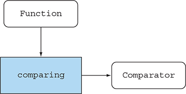
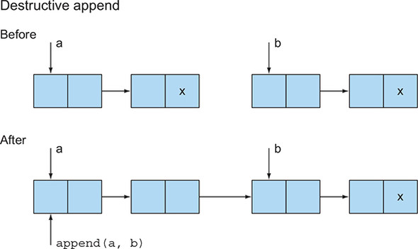
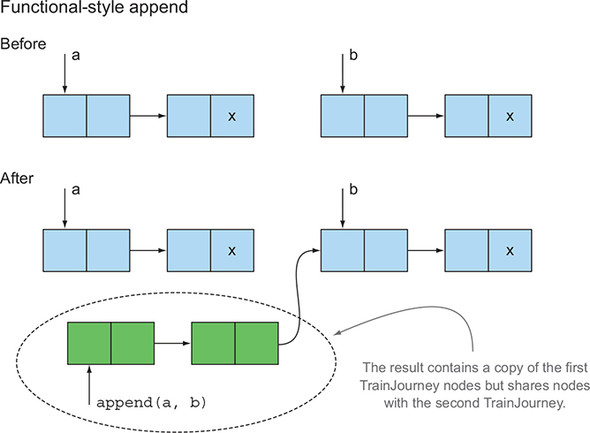
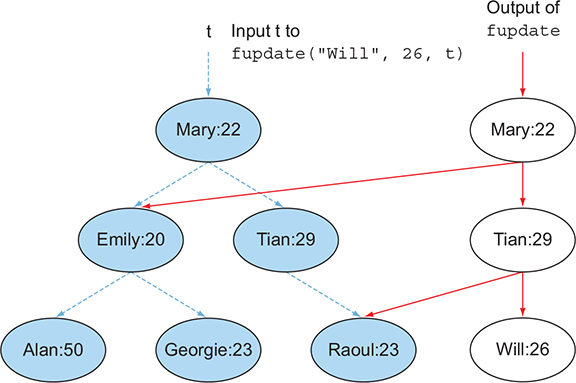
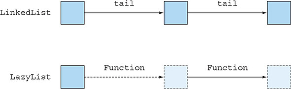

# Chương 19. Các kỹ thuật lập trình hàm

> **Nội dung chương này**
>
> - First-class citizens (công dân hạng nhất), higher-order functions, currying và partial application
> - Persistent data structures (cấu trúc dữ liệu bền vững)
> - Lazy evaluation và lazy list như một dạng tổng quát hoá của Java stream
> - Pattern matching và cách mô phỏng nó trong Java
> - Referential transparency và caching

Trong chương 18, bạn đã thấy cách tư duy theo lối hàm; việc suy nghĩ theo hướng những phương thức không có side effect có thể giúp bạn viết code dễ bảo trì hơn. Trong chương này, chúng tôi giới thiệu thêm những kỹ thuật lập trình hàm nâng cao hơn. Bạn có thể xem chương này như một sự pha trộn giữa các kỹ thuật thực dụng để áp dụng vào code base của mình và những kiến thức mang tính học thuật giúp bạn trở thành một lập trình viên hiểu biết hơn. Chúng ta sẽ bàn về higher-order functions, currying, persistent data structures, lazy list, pattern matching, caching dựa trên referential transparency, và combinator.

## 19.1. Hàm ở khắp mọi nơi

Trong chương 18, chúng ta đã dùng cụm từ *functional-style programming* (lập trình theo phong cách hàm) để chỉ việc hành vi của các hàm và phương thức nên giống như hành vi của các hàm theo kiểu toán học, tức là không có side effect. Các lập trình viên dùng ngôn ngữ hàm thường dùng cụm từ này với nghĩa tổng quát hơn: rằng các hàm có thể được sử dụng giống như mọi giá trị khác — được truyền vào làm đối số, được trả về làm kết quả, và được lưu trữ trong các cấu trúc dữ liệu. Những hàm có thể được dùng như các giá trị khác được gọi là *first-class function* (hàm hạng nhất). First-class function chính là thứ mà Java 8 bổ sung so với các phiên bản Java trước đó: bạn có thể dùng bất kỳ phương thức nào như một giá trị hàm, dùng toán tử `::` để tạo ra một method reference, và dùng lambda expression (chẳng hạn `(int x) -> x + 1`) để biểu diễn giá trị hàm một cách trực tiếp. Trong Java 8, việc lưu phương thức `Integer.parseInt` vào một biến bằng cách dùng method reference như sau là hoàn toàn hợp lệ[^1]:

```java
Function<String, Integer> strToInt = Integer::parseInt;
```

[^1]: Nếu `Integer::parseInt` là phương thức duy nhất mà bạn định lưu vào biến `strToInt`, có lẽ bạn nên khai báo `strToInt` với kiểu `ToIntFunction<String>` để tiết kiệm chi phí boxing. Ở đây chúng tôi không làm vậy, bởi việc dùng những phiên bản chuyên biệt cho primitive của Java như thế có thể cản trở việc nhìn thấy điều gì thực sự đang diễn ra, dù rằng chúng cải thiện hiệu năng cho các kiểu primitive.

### 19.1.1. Higher-order functions

Cho đến giờ, bạn chủ yếu mới tận dụng việc giá trị hàm là first-class để truyền chúng vào các thao tác xử lý stream của Java 8 (như trong các chương 4–7) và để đạt được hiệu quả tương tự behavior parameterization (tham số hoá hành vi) khi bạn truyền `Apple::isGreenApple` như một giá trị hàm vào `filterApples` ở các chương 1 và 2. Một ví dụ thú vị khác là việc dùng static method `Comparator.comparing`, phương thức này nhận vào một hàm làm tham số và trả về một hàm khác (một `Comparator`), như minh hoạ trong đoạn code dưới đây và hình 19.1:

> **Hình 19.1.** `comparing` nhận một hàm làm tham số và trả về một hàm khác.
>
> 

```java
Comparator<Apple> c = comparing(Apple::getWeight);
```

Bạn cũng đã làm điều tương tự khi kết hợp các hàm lại với nhau ở chương 3 để tạo ra một pipeline các thao tác:

```java
Function<String, String> transformationPipeline
    = addHeader.andThen(Letter::checkSpelling)
               .andThen(Letter::addFooter);
```

Những hàm (chẳng hạn `Comparator.comparing`) có thể làm được ít nhất một trong hai điều sau được cộng đồng lập trình hàm gọi là *higher-order function* (hàm bậc cao):

- Nhận một hoặc nhiều hàm làm tham số
- Trả về một hàm làm kết quả

Đặc trưng này liên quan trực tiếp đến các hàm trong Java 8, bởi chúng không chỉ có thể được truyền vào làm đối số, mà còn được trả về làm kết quả, được gán cho biến cục bộ, hoặc thậm chí được nhét vào các cấu trúc dữ liệu. Một chương trình máy tính bỏ túi có thể có một `Map<String, Function<Double, Double>>` ánh xạ chuỗi `"sin"` sang `Function<Double, Double>` để giữ method reference `Math::sin`. Bạn đã làm điều gì đó tương tự khi tìm hiểu về design pattern Factory ở chương 8.

Những độc giả thích ví dụ về phép tính vi phân ở cuối chương 3 có thể coi kiểu của phép lấy đạo hàm là

```java
Function<Function<Double,Double>, Function<Double,Double>>
```

bởi vì nó nhận một hàm làm đối số (chẳng hạn `(Double x) -> x * x`) và trả về một hàm làm kết quả (trong ví dụ này là `(Double x) -> 2 * x`). Chúng tôi viết đoạn này dưới dạng một kiểu hàm (chữ `Function` ngoài cùng bên trái) để khẳng định rõ ràng rằng bạn có thể truyền hàm lấy đạo hàm này vào một hàm khác. Nhưng cũng nên nhớ rằng kiểu của phép lấy đạo hàm và chữ ký sau

```java
Function<Double,Double> differentiate(Function<Double,Double> func)
```

nói lên cùng một điều.

> **Side effect và higher-order function**
>
> Chúng ta đã lưu ý ở chương 7 rằng các hàm được truyền vào những thao tác stream nói chung nên không có side effect, và chúng ta cũng đã nêu ra những vấn đề nảy sinh nếu không như vậy (chẳng hạn kết quả sai, thậm chí kết quả không thể đoán trước do những race condition mà bạn không hề nghĩ tới). Nguyên tắc này cũng áp dụng một cách tổng quát khi bạn dùng higher-order function. Khi bạn viết một higher-order function hay phương thức bậc cao, bạn không biết trước những đối số nào sẽ được truyền vào, và nếu các đối số đó có side effect thì những side effect ấy có thể gây ra chuyện gì. Việc suy luận xem code của bạn làm gì trở nên quá phức tạp nếu nó sử dụng các hàm được truyền vào làm đối số mà những hàm này lại thay đổi trạng thái chương trình một cách khó lường; những hàm như vậy thậm chí có thể can thiệp vào code của bạn theo cách rất khó debug. Một nguyên tắc thiết kế tốt là ghi lại rõ ràng bằng tài liệu những side effect nào bạn sẵn sàng chấp nhận từ các hàm được truyền vào làm tham số. Không có side effect nào cả là tốt nhất!

Ở mục tiếp theo, chúng ta chuyển sang currying: một kỹ thuật giúp bạn module hoá các hàm và tái sử dụng code.

### 19.1.2. Currying

Trước khi đưa ra định nghĩa lý thuyết về currying, chúng tôi sẽ trình bày một ví dụ. Các ứng dụng gần như luôn cần được quốc tế hoá, nên việc chuyển đổi từ hệ đơn vị này sang hệ đơn vị khác là một bài toán xuất hiện lặp đi lặp lại.

Việc chuyển đổi đơn vị luôn liên quan đến một hệ số chuyển đổi và, đôi khi, một hệ số điều chỉnh mốc gốc (baseline). Ví dụ, công thức chuyển đổi từ độ C sang độ F là `CtoF(x) = x*9/5 + 32`. Khuôn mẫu cơ bản của mọi phép chuyển đổi đơn vị là như sau:

1. Nhân với hệ số chuyển đổi.
2. Điều chỉnh mốc gốc nếu có liên quan.

Bạn có thể biểu diễn khuôn mẫu này bằng phương thức tổng quát sau:

```java
static double converter(double x, double f, double b) {
    return x * f + b;
}
```

Ở đây, `x` là đại lượng bạn muốn chuyển đổi, `f` là hệ số chuyển đổi, và `b` là mốc gốc. Nhưng phương thức này hơi quá tổng quát. Thông thường, bạn cần thực hiện rất nhiều phép chuyển đổi giữa cùng một cặp đơn vị, chẳng hạn từ kilômét sang dặm. Bạn có thể gọi phương thức `converter` với ba đối số ở mỗi lần dùng, nhưng việc cung cấp hệ số và mốc gốc mỗi lần sẽ rất tẻ nhạt, và bạn có thể vô tình gõ nhầm chúng.

Bạn có thể viết một phương thức mới cho từng ứng dụng, nhưng làm vậy sẽ bỏ lỡ cơ hội tái sử dụng phần logic nền tảng.

Đây là một cách đơn giản để tận dụng logic sẵn có trong khi vẫn tuỳ biến bộ chuyển đổi cho từng ứng dụng cụ thể. Bạn có thể định nghĩa một factory chuyên sản xuất ra các hàm chuyển đổi một đối số, minh hoạ cho ý tưởng currying:

```java
static DoubleUnaryOperator curriedConverter(double f, double b) {
    return (double x) -> x * f + b;
}
```

Bây giờ tất cả những gì bạn phải làm là truyền cho `curriedConverter` hệ số chuyển đổi và mốc gốc (`f` và `b`), và nó sẽ ngoan ngoãn trả về một hàm (theo `x`) làm đúng điều bạn yêu cầu. Sau đó bạn có thể dùng factory này để tạo ra bất kỳ bộ chuyển đổi nào bạn cần, như sau:

```java
DoubleUnaryOperator convertCtoF = curriedConverter(9.0/5, 32);
DoubleUnaryOperator convertUSDtoGBP = curriedConverter(0.6, 0);
DoubleUnaryOperator convertKmtoMi = curriedConverter(0.6214, 0);
```

Vì `DoubleUnaryOperator` định nghĩa phương thức `applyAsDouble`, bạn có thể dùng các bộ chuyển đổi của mình như sau:

```java
double gbp = convertUSDtoGBP.applyAsDouble(1000);
```

Kết quả là code của bạn linh hoạt hơn, và nó tái sử dụng lại logic chuyển đổi sẵn có!

Hãy suy ngẫm về điều bạn vừa làm ở đây. Thay vì truyền tất cả các đối số `x`, `f` và `b` cùng một lúc vào phương thức `converter`, bạn chỉ yêu cầu các đối số `f` và `b` rồi trả về một hàm khác — hàm này, khi được cho một đối số `x`, sẽ trả về `x * f + b`. Quy trình hai giai đoạn này cho phép bạn tái sử dụng logic chuyển đổi và tạo ra những hàm khác nhau với những hệ số chuyển đổi khác nhau.

> **Định nghĩa hình thức của currying**
>
> Currying[^a] là một kỹ thuật trong đó một hàm `f` nhận hai đối số (chẳng hạn `x` và `y`) được nhìn nhận thay thế bằng một hàm `g` nhận một đối số và trả về một hàm cũng nhận một đối số. Giá trị mà hàm sau trả về giống hệt giá trị của hàm gốc — nghĩa là `f(x,y) = (g(x))(y)`.
>
> Định nghĩa này tất nhiên có thể tổng quát hoá. Bạn có thể curry một hàm sáu đối số để trước tiên nó nhận các đối số thứ 2, 4 và 6, rồi trả về một hàm nhận đối số thứ 5, hàm này lại trả về một hàm nhận các đối số còn lại là 1 và 3.
>
> Khi một số đối số (nhưng ít hơn toàn bộ số đối số) đã được truyền vào, ta nói hàm đã được áp dụng một phần (*partially applied*).

[^a]: Từ *currying* chẳng liên quan gì đến món ăn Ấn Độ; thuật ngữ này được đặt theo tên nhà logic học Haskell Brooks Curry, người đã phổ biến kỹ thuật này. Tuy nhiên, chính ông lại quy công cho Moses Ilyich Schönfinkel. Vậy chúng ta có nên gọi currying là *schönfinkeling* thay thế không?

Ở mục tiếp theo, chúng ta chuyển sang một khía cạnh khác của lập trình theo phong cách hàm: cấu trúc dữ liệu. Liệu có thể lập trình với các cấu trúc dữ liệu nếu bạn bị cấm sửa đổi chúng không?

## 19.2. Persistent data structures

Các cấu trúc dữ liệu được dùng trong những chương trình theo phong cách hàm có nhiều tên gọi khác nhau, chẳng hạn *functional data structure* và *immutable data structure*, nhưng có lẽ phổ biến nhất là *persistent data structure*. (Đáng tiếc là thuật ngữ này xung đột với khái niệm "persistent" trong cơ sở dữ liệu, vốn có nghĩa là "tồn tại lâu hơn một lần chạy chương trình".)

Điều đầu tiên cần lưu ý là một phương thức theo phong cách hàm không được phép cập nhật bất kỳ cấu trúc dữ liệu toàn cục nào hay bất kỳ cấu trúc nào được truyền vào làm tham số. Vì sao? Bởi vì gọi nó hai lần rất có thể sẽ cho ra những câu trả lời khác nhau, vi phạm referential transparency và khả năng hiểu phương thức đó như một phép ánh xạ đơn giản từ đối số sang kết quả.

### 19.2.1. Cập nhật phá huỷ so với cập nhật theo lối hàm

Hãy xem xét những vấn đề có thể nảy sinh. Giả sử bạn biểu diễn các hành trình tàu hoả từ A đến B bằng một class `TrainJourney` mutable (một cài đặt đơn giản của danh sách liên kết đơn), với một trường `int` mô hình hoá một chi tiết nào đó của hành trình, chẳng hạn giá vé của chặng hiện tại. Những hành trình đòi hỏi phải đổi tàu sẽ có nhiều đối tượng `TrainJourney` được liên kết với nhau qua trường `onward`; một chuyến tàu thẳng hoặc chặng cuối cùng của hành trình sẽ có `onward` bằng `null`:

```java
class TrainJourney {
    public int price;
    public TrainJourney onward;

    public TrainJourney(int p, TrainJourney t) {
        price = p;
        onward = t;
    }
}
```

Bây giờ giả sử bạn có hai đối tượng `TrainJourney` riêng biệt biểu diễn một hành trình từ X đến Y và một hành trình từ Y đến Z. Bạn có thể muốn tạo ra một hành trình duy nhất nối hai đối tượng `TrainJourney` này lại (nghĩa là X đến Y đến Z).

Dưới đây là một phương thức mệnh lệnh truyền thống đơn giản để nối các hành trình tàu này lại:

```java
static TrainJourney link(TrainJourney a, TrainJourney b) {
    if (a == null) return b;
    TrainJourney t = a;
    while (t.onward != null) {
        t = t.onward;
    }
    t.onward = b;
    return a;
}
```

Phương thức này hoạt động bằng cách tìm chặng cuối cùng trong `TrainJourney` của `a` rồi thay thế cái `null` đánh dấu điểm kết thúc danh sách của `a` bằng danh sách `b`. (Bạn cần một trường hợp đặc biệt nếu `a` không có phần tử nào.)

Và đây là vấn đề: giả sử biến `firstJourney` chứa lộ trình từ X đến Y và biến `secondJourney` chứa lộ trình từ Y đến Z. Nếu bạn gọi `link(firstJourney, secondJourney)`, đoạn code này sẽ cập nhật một cách phá huỷ `firstJourney` để nó chứa luôn cả `secondJourney`. Kết quả là, ngoài việc người dùng duy nhất yêu cầu chuyến đi từ X đến Z nhìn thấy hành trình được ghép như mong muốn, thì hành trình từ X đến Y cũng đã bị cập nhật một cách phá huỷ. Quả thực, biến `firstJourney` không còn là lộ trình từ X đến Y nữa, mà là lộ trình từ X đến Z, và điều này làm hỏng những đoạn code phụ thuộc vào việc `firstJourney` không bị sửa đổi! Giả sử `firstJourney` biểu diễn chuyến tàu sớm từ London đến Brussels, thì tất cả những người dùng sau đó muốn đến Brussels sẽ ngạc nhiên khi thấy nó đòi hỏi thêm một chặng nối tiếp, có lẽ là tới Cologne. Tất cả chúng ta đều đã từng vật lộn với những bug kiểu này, liên quan đến việc một thay đổi trong cấu trúc dữ liệu nên được nhìn thấy tới mức nào.

Cách tiếp cận theo phong cách hàm cho vấn đề này là cấm hẳn những phương thức gây side effect như vậy. Nếu bạn cần một cấu trúc dữ liệu để biểu diễn kết quả của một phép tính, bạn nên tạo ra một cấu trúc mới, chứ không phải thay đổi cấu trúc dữ liệu đang có như bạn đã làm trước đó. Làm như vậy thường cũng là một best practice trong lập trình hướng đối tượng thông thường. Một phản bác thường gặp đối với cách tiếp cận hàm là nó gây ra việc sao chép dư thừa, và lập trình viên thì bảo "tôi sẽ nhớ" hoặc "tôi sẽ ghi tài liệu" về các side effect. Nhưng sự lạc quan kiểu đó là một cái bẫy dành cho những lập trình viên bảo trì sẽ phải xử lý code của bạn về sau. Vì thế, giải pháp theo phong cách hàm là như sau:

```java
static TrainJourney append(TrainJourney a, TrainJourney b) {
    return a == null ? b : new TrainJourney(a.price, append(a.onward, b));
}
```

Đoạn code này rõ ràng theo phong cách hàm (không dùng phép biến đổi trạng thái, kể cả cục bộ) và không sửa đổi bất kỳ cấu trúc dữ liệu sẵn có nào. Tuy nhiên, hãy lưu ý rằng đoạn code này không tạo ra một `TrainJourney` hoàn toàn mới. Nếu `a` là một dãy gồm `n` phần tử và `b` là một dãy gồm `m` phần tử, đoạn code trả về một dãy gồm `n+m` phần tử, trong đó `n` phần tử đầu tiên là các node mới còn `m` phần tử cuối cùng được chia sẻ với `TrainJourney b`. Lưu ý rằng người dùng có nghĩa vụ không được thay đổi kết quả của `append`, vì nếu làm vậy họ có thể làm hỏng các chuyến tàu được truyền vào ở dãy `b`. Các hình 19.2 và 19.3 minh hoạ sự khác biệt giữa `append` phá huỷ và `append` theo phong cách hàm.

> **Hình 19.2.** Cấu trúc dữ liệu bị cập nhật một cách phá huỷ.
>
> 

> **Hình 19.3.** Phong cách hàm không hề sửa đổi cấu trúc dữ liệu.
>
> 

### 19.2.2. Một ví dụ khác với Tree

Trước khi rời khỏi chủ đề này, hãy xem xét một cấu trúc dữ liệu khác: một cây tìm kiếm nhị phân có thể được dùng để cài đặt một interface tương tự `HashMap`.

Ý tưởng là một `Tree` chứa một `String` biểu diễn khoá và một `int` biểu diễn giá trị của nó, chẳng hạn tên và tuổi:

```java
class Tree {
    private String key;
    private int val;
    private Tree left, right;

    public Tree(String k, int v, Tree l, Tree r) {
        key = k; val = v; left = l; right = r;
    }
}

class TreeProcessor {
    public static int lookup(String k, int defaultval, Tree t) {
        if (t == null) return defaultval;
        if (k.equals(t.key)) return t.val;
        return lookup(k, defaultval,
                      k.compareTo(t.key) < 0 ? t.left : t.right);
    }
    // các phương thức khác xử lý một Tree
}
```

Bạn muốn dùng cây tìm kiếm nhị phân này để tra cứu các giá trị `String` nhằm cho ra một `int`. Bây giờ hãy xem bạn có thể cập nhật giá trị gắn với một khoá cho trước như thế nào (để cho đơn giản, giả sử khoá đó đã có sẵn trong cây):

```java
public static void update(String k, int newval, Tree t) {
    if (t == null) { /* nên thêm một node mới */ }
    else if (k.equals(t.key)) t.val = newval;
    else update(k, newval, k.compareTo(t.key) < 0 ? t.left : t.right);
}
```

Việc thêm một node mới thì rắc rối hơn. Cách dễ nhất là cho phương thức `update` trả về `Tree` đã được duyệt qua (không thay đổi gì trừ khi bạn phải thêm một node). Bây giờ đoạn code này hơi vụng về hơn một chút, bởi người dùng cần nhớ rằng `update` cố gắng cập nhật cây tại chỗ và trả về chính cái cây đã được truyền vào. Nhưng nếu cây ban đầu rỗng thì một node mới sẽ được trả về làm kết quả:

```java
public static Tree update(String k, int newval, Tree t) {
    if (t == null)
        t = new Tree(k, newval, null, null);
    else if (k.equals(t.key))
        t.val = newval;
    else if (k.compareTo(t.key) < 0)
        t.left = update(k, newval, t.left);
    else
        t.right = update(k, newval, t.right);
    return t;
}
```

Lưu ý rằng cả hai phiên bản của `update` đều thay đổi cái `Tree` sẵn có, nghĩa là mọi người dùng của map được lưu trong cây đó đều nhìn thấy sự thay đổi này.

### 19.2.3. Sử dụng cách tiếp cận hàm

Bạn có thể lập trình những phép cập nhật cây như vậy theo lối hàm như thế nào? Bạn cần tạo một node mới cho cặp khoá-giá trị mới. Bạn cũng cần tạo các node mới trên đường đi từ gốc của cây đến node mới đó, như sau:

```java
public static Tree fupdate(String k, int newval, Tree t) {
    return (t == null) ?
        new Tree(k, newval, null, null) :
        k.equals(t.key) ?
            new Tree(k, newval, t.left, t.right) :
            k.compareTo(t.key) < 0 ?
                new Tree(t.key, t.val, fupdate(k, newval, t.left), t.right) :
                new Tree(t.key, t.val, t.left, fupdate(k, newval, t.right));
}
```

Nói chung, đoạn code này không hề tốn kém. Nếu cây có độ sâu `d` và tương đối cân bằng, nó có thể chứa khoảng 2^d mục, nên bạn chỉ tạo lại một phần nhỏ của nó.

Chúng tôi viết đoạn code này dưới dạng một biểu thức điều kiện duy nhất thay vì dùng `if-then-else` để nhấn mạnh ý tưởng rằng thân hàm là một biểu thức duy nhất không có side effect. Nhưng bạn có thể thích viết một chuỗi `if-then-else` tương đương, mỗi nhánh chứa một câu lệnh `return`.

Sự khác biệt giữa `update` và `fupdate` là gì? Trước đó chúng ta đã lưu ý rằng phương thức `update` giả định mọi người dùng đều muốn chia sẻ cấu trúc dữ liệu và nhìn thấy những cập nhật do bất kỳ phần nào của chương trình gây ra. Vì vậy, trong code phi hàm, điều tối quan trọng (nhưng thường bị bỏ qua) là mỗi khi bạn thêm một giá trị có cấu trúc nào đó vào một cây, bạn phải sao chép nó, bởi sau này có ai đó có thể cho rằng anh ta được phép cập nhật nó. Ngược lại, `fupdate` hoàn toàn thuần hàm; nó tạo ra một `Tree` mới làm kết quả nhưng chia sẻ nhiều nhất có thể với đối số của nó. Hình 19.4 minh hoạ ý tưởng này. Bạn có một cây gồm các node lưu tên và tuổi của một người. Việc gọi `fupdate` không sửa đổi cây hiện có; nó tạo ra những node mới "sống ở bên cạnh" cây mà không làm tổn hại đến cấu trúc dữ liệu sẵn có.

> **Hình 19.4.** Không có cấu trúc dữ liệu sẵn có nào bị tổn hại trong quá trình thực hiện phép cập nhật này lên `Tree`.
>
> 

Những cấu trúc dữ liệu theo lối hàm như vậy thường được gọi là *persistent* — các giá trị của chúng tồn tại bền vững và được cô lập khỏi những thay đổi xảy ra ở nơi khác — nên với tư cách lập trình viên, bạn chắc chắn rằng `fupdate` sẽ không thay đổi các cấu trúc dữ liệu được truyền vào làm đối số. Có một điều kiện đi kèm: phía bên kia của thoả thuận đòi hỏi tất cả người dùng của persistent data structure phải tuân thủ yêu cầu không-được-thay-đổi. Nếu không, một lập trình viên phớt lờ điều kiện này có thể thay đổi kết quả của `fupdate` (chẳng hạn bằng cách sửa số 20 của Emily). Khi đó, sự thay đổi này sẽ hiện ra như một biến đổi bất ngờ và bị trì hoãn (và gần như chắc chắn là không mong muốn) đối với cấu trúc dữ liệu được truyền vào làm đối số cho `fupdate`!

Nhìn theo góc độ này, `fupdate` có thể hiệu quả hơn. Quy tắc "không thay đổi cấu trúc sẵn có" cho phép những cấu trúc chỉ khác nhau đôi chút (chẳng hạn `Tree` mà người dùng A nhìn thấy và phiên bản đã sửa đổi mà người dùng B nhìn thấy) chia sẻ bộ nhớ cho những phần chung của chúng. Bạn có thể nhờ compiler giúp thực thi quy tắc này bằng cách khai báo các trường `key`, `val`, `left` và `right` của class `Tree` là `final`. Nhưng hãy nhớ rằng `final` chỉ bảo vệ trường, chứ không bảo vệ đối tượng mà nó trỏ tới; đối tượng đó có thể lại cần các trường của chính nó phải là `final` để được bảo vệ, và cứ thế tiếp tục.

Bạn có thể nói: "Tôi muốn những cập nhật lên cây được một số người dùng nhìn thấy (nhưng thú thật là không phải một số người khác)." Bạn có hai lựa chọn. Lựa chọn thứ nhất là giải pháp Java cổ điển: hãy cẩn thận khi cập nhật thứ gì đó, kiểm tra xem bạn có cần sao chép nó trước không. Lựa chọn còn lại là giải pháp theo phong cách hàm: về mặt logic, bạn tạo ra một cấu trúc dữ liệu mới mỗi khi thực hiện một phép cập nhật (để không có gì bị thay đổi) và thu xếp để truyền đúng phiên bản của cấu trúc dữ liệu tới từng người dùng cho phù hợp. Ý tưởng này có thể được thực thi thông qua một API. Nếu một số client nhất định của cấu trúc dữ liệu cần nhìn thấy các cập nhật, họ nên đi qua một API trả về phiên bản mới nhất. Còn các client không muốn nhìn thấy cập nhật (chẳng hạn khi chạy phân tích thống kê kéo dài) thì cứ dùng bản sao mà họ đã lấy được, với sự yên tâm rằng nó không thể bị thay đổi ngay dưới chân họ.

Kỹ thuật này giống như việc cập nhật một file trên đĩa CD-R, loại đĩa chỉ cho phép ghi một file duy nhất một lần bằng cách khắc laser. Nhiều phiên bản của file được lưu trên đĩa CD (phần mềm tạo đĩa CD thông minh thậm chí có thể chia sẻ những phần chung của nhiều phiên bản), và bạn truyền vào địa chỉ block thích hợp của điểm bắt đầu file (hoặc một tên file có mã hoá phiên bản trong chính tên đó) để chọn phiên bản mình muốn dùng. Trong Java, mọi thứ còn tốt hơn trên đĩa CD, ở chỗ những phiên bản cũ của cấu trúc dữ liệu không còn được dùng tới sẽ được garbage collection thu dọn.

## 19.3. Lazy evaluation với stream

Ở các chương trước, bạn đã thấy stream là cách tuyệt vời để xử lý một tập hợp dữ liệu. Nhưng vì nhiều lý do, trong đó có yêu cầu cài đặt hiệu quả, những người thiết kế Java 8 đã bổ sung stream vào Java theo một cách khá đặc thù. Một hạn chế là bạn không thể định nghĩa một stream theo kiểu đệ quy, bởi một stream chỉ có thể được tiêu thụ một lần. Ở các mục sau, chúng tôi sẽ chỉ cho bạn thấy tình huống này có thể gây rắc rối như thế nào.

### 19.3.1. Stream tự định nghĩa

Hãy quay lại ví dụ sinh số nguyên tố từ chương 6 để hiểu ý tưởng về stream đệ quy. Ở chương đó, bạn đã thấy rằng (có lẽ như một phần của class `MyMathUtils`), bạn có thể tính một stream các số nguyên tố như sau:

```java
public static Stream<Integer> primes(int n) {
    return Stream.iterate(2, i -> i + 1)
                 .filter(MyMathUtils::isPrime)
                 .limit(n);
}

public static boolean isPrime(int candidate) {
    int candidateRoot = (int) Math.sqrt((double) candidate);
    return IntStream.rangeClosed(2, candidateRoot)
                    .noneMatch(i -> candidate % i == 0);
}
```

Nhưng giải pháp này có phần vụng về. Bạn phải duyệt qua mọi số mỗi lần để xem nó có chia hết cho một số ứng viên nào đó hay không. (Thực ra, bạn chỉ cần kiểm tra những số đã được xác định là nguyên tố.)

Lý tưởng nhất, stream nên lọc bỏ những số chia hết cho chính các số nguyên tố mà stream đang sinh ra dần dần. Quy trình đó có thể diễn ra như sau:

1. Bạn cần một stream các số, từ đó bạn sẽ chọn ra các số nguyên tố.
2. Từ stream đó, lấy số đầu tiên (phần đầu — head — của stream), số này sẽ là một số nguyên tố. (Ở bước khởi đầu, con số này là 2.)
3. Lọc bỏ khỏi phần đuôi (tail) của stream tất cả các số chia hết cho số đó.
4. Phần đuôi thu được chính là stream số mới mà bạn có thể dùng để tìm các số nguyên tố. Về bản chất, bạn quay lại bước 1, nên thuật toán này mang tính đệ quy.

Lưu ý rằng thuật toán này kém hiệu quả vì một vài lý do,[^2] nhưng nó dễ suy luận, phục vụ mục đích làm việc với stream. Ở các mục sau, bạn sẽ thử viết thuật toán này bằng Streams API.

[^2]: Bạn có thể tìm hiểu thêm về lý do thuật toán này kém hiệu quả tại www.cs.hmc.edu/~oneill/papers/Sieve-JFP.pdf.

**Bước 1: Lấy một stream các số**

Bạn có thể lấy một stream vô hạn các số bắt đầu từ 2 bằng phương thức `IntStream.iterate` (mà chúng tôi đã mô tả ở chương 5) như sau:

```java
static IntStream numbers() {
    return IntStream.iterate(2, n -> n + 1);
}
```

**Bước 2: Lấy phần đầu**

`IntStream` có sẵn phương thức `findFirst`, bạn có thể dùng nó để trả về phần tử đầu tiên:

```java
static int head(IntStream numbers) {
    return numbers.findFirst().getAsInt();
}
```

**Bước 3: Lọc phần đuôi**

Định nghĩa một phương thức để lấy phần đuôi của một stream:

```java
static IntStream tail(IntStream numbers) {
    return numbers.skip(1);
}
```

Với phần đầu của stream đã có, bạn có thể lọc các số như sau:

```java
IntStream numbers = numbers();
int head = head(numbers);
IntStream filtered = tail(numbers).filter(n -> n % head != 0);
```

**Bước 4: Tạo stream các số nguyên tố một cách đệ quy**

Đây là phần khó nhằn. Bạn có thể bị cám dỗ thử truyền ngược lại stream đã lọc để có thể lấy phần đầu của nó và lọc thêm nhiều số nữa, như thế này:

```java
static IntStream primes(IntStream numbers) {
    int head = head(numbers);
    return IntStream.concat(
            IntStream.of(head),
            primes(tail(numbers).filter(n -> n % head != 0))
    );
}
```

**Tin xấu**

Đáng tiếc, nếu bạn chạy đoạn code ở bước 4, bạn sẽ nhận được lỗi sau: `java.lang.IllegalStateException: stream has already been operated upon or closed`. Quả thực, bạn đang dùng hai terminal operation để tách stream thành phần đầu và phần đuôi: `findFirst` và `skip`. Hãy nhớ từ chương 4 rằng sau khi bạn gọi một terminal operation trên một stream, nó bị tiêu thụ vĩnh viễn!

**Lazy evaluation**

Còn một vấn đề khác quan trọng hơn: static method `IntStream.concat` mong đợi hai thể hiện của stream, nhưng đối số thứ hai của nó lại là một lời gọi đệ quy trực tiếp tới `primes`, dẫn đến đệ quy vô hạn! Với nhiều mục đích sử dụng Java, những hạn chế của stream trong Java 8 như việc không cho phép định nghĩa đệ quy là không thành vấn đề, và chúng đem lại cho các truy vấn kiểu cơ sở dữ liệu của bạn khả năng biểu đạt cũng như khả năng song song hoá. Vì thế, những người thiết kế Java 8 đã chọn một điểm cân bằng hợp lý. Tuy nhiên, những tính năng và mô hình stream tổng quát hơn từ các ngôn ngữ hàm như Scala và Haskell có thể là những bổ sung hữu ích cho bộ công cụ lập trình của bạn. Thứ bạn cần là một cách để đánh giá một cách lười biếng lời gọi tới phương thức `primes` ở đối số thứ hai của `concat`. (Trong từ vựng lập trình chuyên môn hơn, chúng ta gọi khái niệm này là *lazy evaluation*, *nonstrict evaluation*, hoặc thậm chí *call by name*.) Chỉ khi nào bạn cần xử lý các số nguyên tố (chẳng hạn với phương thức `limit`) thì stream mới nên được đánh giá. Scala (mà chúng ta sẽ khám phá ở chương 20) hỗ trợ ý tưởng này. Trong Scala, bạn có thể viết thuật toán trên như sau, trong đó toán tử `#::` thực hiện phép nối lười biếng (các đối số chỉ được đánh giá khi bạn cần tiêu thụ stream):

```scala
def numbers(n: Int): Stream[Int] = n #:: numbers(n+1)

def primes(numbers: Stream[Int]): Stream[Int] = {
    numbers.head #:: primes(numbers.tail filter (n => n % numbers.head != 0))
}
```

Đừng lo lắng về đoạn code này. Mục đích duy nhất của nó là cho bạn thấy một điểm khác biệt giữa Java và các ngôn ngữ lập trình hàm khác. Sẽ tốt nếu bạn dành một chút thời gian suy ngẫm về cách các đối số được đánh giá. Trong Java, khi bạn gọi một phương thức, tất cả các đối số của nó đều được đánh giá đầy đủ ngay lập tức. Nhưng khi bạn dùng `#::` trong Scala, phép nối trả về ngay lập tức, và các phần tử chỉ được đánh giá khi cần thiết.

Ở mục tiếp theo, chúng ta sẽ chuyển sang việc cài đặt trực tiếp ý tưởng lazy list này trong Java.

### 19.3.2. Lazy list của riêng bạn

Stream trong Java 8 thường được mô tả là *lazy* (lười biếng). Chúng lười biếng ở một khía cạnh cụ thể: một stream hành xử như một hộp đen có thể sinh ra các giá trị theo yêu cầu. Khi bạn áp dụng một chuỗi thao tác lên một stream, những thao tác này chỉ đơn thuần được lưu lại. Chỉ khi bạn áp dụng một terminal operation lên stream thì mới có thứ gì đó thực sự được tính toán. Sự trì hoãn này mang lại lợi thế lớn khi bạn áp dụng nhiều thao tác (có lẽ là một `filter` và một `map` theo sau bởi một terminal operation `reduce`) lên một stream: stream chỉ phải được duyệt qua một lần thay vì một lần cho mỗi thao tác.

Trong mục này, bạn sẽ xem xét khái niệm lazy list, vốn là những dạng của một stream tổng quát hơn. (Lazy list là một khái niệm tương tự stream.) Lazy list cũng là một cách tuyệt vời để tư duy về higher-order function. Bạn đặt một giá trị hàm vào bên trong một cấu trúc dữ liệu để phần lớn thời gian nó cứ nằm im ở đó mà không được dùng đến, nhưng khi nó được gọi (theo yêu cầu), nó có thể tạo ra thêm phần nữa của cấu trúc dữ liệu. Hình 19.5 minh hoạ ý tưởng này.

> **Hình 19.5.** Các phần tử của một `LinkedList` tồn tại (được trải ra) trong bộ nhớ. Nhưng các phần tử của một `LazyList` được tạo ra theo yêu cầu bởi một `Function`; bạn có thể coi chúng như được trải ra theo thời gian.
>
> 

Tiếp theo, bạn sẽ thấy khái niệm này hoạt động ra sao. Bạn muốn sinh ra một danh sách vô hạn các số nguyên tố bằng thuật toán mà chúng ta đã mô tả trước đó.

**Tạo một danh sách liên kết cơ bản**

Hãy nhớ lại rằng bạn có thể định nghĩa một class kiểu danh sách liên kết đơn giản tên là `MyLinkedList` trong Java bằng cách viết như sau (kèm một interface `MyList` tối giản):

```java
interface MyList<T> {
    T head();

    MyList<T> tail();

    default boolean isEmpty() {
        return true;
    }
}

class MyLinkedList<T> implements MyList<T> {
    private final T head;
    private final MyList<T> tail;

    public MyLinkedList(T head, MyList<T> tail) {
        this.head = head;
        this.tail = tail;
    }

    public T head() {
        return head;
    }

    public MyList<T> tail() {
        return tail;
    }

    public boolean isEmpty() {
        return false;
    }
}

class Empty<T> implements MyList<T> {
    public T head() {
        throw new UnsupportedOperationException();
    }

    public MyList<T> tail() {
        throw new UnsupportedOperationException();
    }
}
```

Bây giờ bạn có thể xây dựng một giá trị `MyLinkedList` mẫu như sau:

```java
MyList<Integer> l =
    new MyLinkedList<>(5, new MyLinkedList<>(10, new Empty<>()));
```

**Tạo một lazy list cơ bản**

Một cách dễ dàng để biến đổi class này theo khái niệm lazy list là làm sao cho phần đuôi không hiện diện toàn bộ trong bộ nhớ cùng một lúc, mà thay vào đó dùng `Supplier<T>` mà bạn đã thấy ở chương 3 (bạn cũng có thể coi nó là một factory với function descriptor `void -> T`) để sinh ra node tiếp theo của danh sách. Thiết kế này dẫn tới đoạn code sau:

```java
import java.util.function.Supplier;

class LazyList<T> implements MyList<T> {
    final T head;
    final Supplier<MyList<T>> tail;

    public LazyList(T head, Supplier<MyList<T>> tail) {
        this.head = head;
        this.tail = tail;
    }

    public T head() {
        return head;
    }

    public MyList<T> tail() {
        // Lưu ý rằng tail dùng một Supplier để mã hoá tính lười biếng,
        // khác với phương thức head.
        return tail.get();
    }

    public boolean isEmpty() {
        return false;
    }
}
```

Việc gọi phương thức `get` từ `Supplier` sẽ khiến một node của `LazyList` được tạo ra (giống như một factory tạo ra một đối tượng mới).

Bây giờ bạn có thể tạo danh sách lười vô hạn các số bắt đầu từ `n` như sau. Hãy truyền một `Supplier` làm đối số `tail` của constructor `LazyList`; supplier này sẽ tạo ra phần tử tiếp theo trong dãy số:

```java
public static LazyList<Integer> from(int n) {
    return new LazyList<Integer>(n, () -> from(n+1));
}
```

Nếu bạn thử đoạn code sau, bạn sẽ thấy nó in ra `2 3 4`. Quả thực, các số được sinh ra theo yêu cầu. Để kiểm chứng, hãy chèn `System.out.println` vào chỗ thích hợp, hoặc lưu ý rằng `from(2)` sẽ chạy mãi mãi nếu nó cố tính toán tất cả các số bắt đầu từ 2:

```java
LazyList<Integer> numbers = from(2);
int two = numbers.head();
int three = numbers.tail().head();
int four = numbers.tail().tail().head();
System.out.println(two + " " + three + " " + four);
```

**Sinh số nguyên tố một lần nữa**

Hãy xem bạn có thể dùng những gì đã làm được đến giờ để sinh ra một lazy list tự định nghĩa các số nguyên tố hay không (điều mà bạn đã không thể làm được với Streams API). Nếu bạn dịch đoạn code dùng Streams API ở phần trước sang `LazyList` mới, code sẽ trông giống như thế này:

```java
public static MyList<Integer> primes(MyList<Integer> numbers) {
    return new LazyList<>(
            numbers.head(),
            () -> primes(
                    numbers.tail()
                           .filter(n -> n % numbers.head() != 0)
            )
    );
}
```

**Cài đặt một filter lười biếng**

Đáng tiếc, `LazyList` (chính xác hơn là interface `MyList`) không định nghĩa phương thức `filter`, nên đoạn code trên sẽ không biên dịch được! Để khắc phục vấn đề này, hãy khai báo một phương thức `filter` như sau:

```java
public MyList<T> filter(Predicate<T> p) {
    return isEmpty() ?
            // Bạn có thể trả về new Empty<>(), nhưng dùng 'this' cũng tốt tương
            // đương và cũng rỗng.
            this :
            p.test(head()) ?
                    new LazyList<>(head(), () -> tail().filter(p)) :
                    tail().filter(p);
}
```

Code của bạn đã biên dịch được và sẵn sàng sử dụng! Bạn có thể tính ba số nguyên tố đầu tiên bằng cách nối chuỗi các lời gọi `tail` và `head` như sau:

```java
LazyList<Integer> numbers = from(2);
int two = primes(numbers).head();
int three = primes(numbers).tail().head();
int five = primes(numbers).tail().tail().head();
System.out.println(two + " " + three + " " + five);
```

Đoạn code này in ra `2 3 5`, chính là ba số nguyên tố đầu tiên. Bây giờ bạn có thể vui đùa một chút. Chẳng hạn, bạn có thể in ra tất cả các số nguyên tố. (Chương trình sẽ chạy vô hạn nếu bạn viết một phương thức `printAll` in ra phần đầu và phần đuôi của danh sách một cách lặp đi lặp lại.)

```java
static <T> void printAll(MyList<T> list) {
    while (!list.isEmpty()) {
        System.out.println(list.head());
        list = list.tail();
    }
}

printAll(primes(from(2)));
```

Vì đây là một chương về lập trình hàm, chúng tôi nên giải thích rằng đoạn code này có thể được viết một cách gọn gàng theo lối đệ quy:

```java
static <T> void printAll(MyList<T> list) {
    if (list.isEmpty())
        return;
    System.out.println(list.head());
    printAll(list.tail());
}
```

Tuy nhiên, chương trình này sẽ không chạy vô hạn. Đáng buồn thay, cuối cùng nó sẽ thất bại vì stack overflow, bởi Java không hỗ trợ tail call elimination, như đã bàn ở chương 18.

**Nhìn lại**

Bạn đã xây dựng cả một đống kỹ thuật với lazy list và hàm, chỉ để dùng chúng vào việc định nghĩa một cấu trúc dữ liệu chứa tất cả các số nguyên tố. Vậy công dụng thực tế là gì? Vâng, bạn đã thấy cách đặt các hàm vào bên trong những cấu trúc dữ liệu (vì Java 8 cho phép bạn làm thế), và bạn có thể dùng những hàm này để tạo ra các phần của cấu trúc dữ liệu theo yêu cầu thay vì tạo ngay lúc cấu trúc được khởi tạo. Khả năng này có thể hữu ích nếu bạn đang viết một chương trình chơi game, chẳng hạn cờ vua; bạn có thể có một cấu trúc dữ liệu về mặt khái niệm biểu diễn toàn bộ cây các nước đi khả dĩ (quá lớn để tính toán một cách háo hức) nhưng lại có thể được tạo ra theo yêu cầu. Cấu trúc dữ liệu này sẽ là một *lazy tree*, thay vì một lazy list. Chúng tôi tập trung vào lazy list trong chương này vì chúng tạo ra một mối liên hệ với một tính năng khác của Java 8 là stream, nhờ đó chúng ta có thể bàn về ưu và nhược điểm của stream so với lazy list.

Vẫn còn đó câu hỏi về hiệu năng. Người ta dễ cho rằng làm mọi thứ một cách lười biếng thì tốt hơn làm một cách háo hức. Chắc chắn là tốt hơn nếu chỉ tính toán những giá trị và cấu trúc dữ liệu mà chương trình cần theo yêu cầu, thay vì tạo ra tất cả những giá trị đó (và có thể còn nhiều hơn nữa) như trong lối thực thi truyền thống. Đáng tiếc, thế giới thực không đơn giản như vậy. Chi phí phụ trội (overhead) của việc làm mọi thứ một cách lười biếng (chẳng hạn những `Supplier` bổ sung nằm giữa các phần tử trong `LazyList` của bạn) lấn át lợi ích trên lý thuyết, trừ khi bạn chỉ khám phá, giả sử, dưới 10% cấu trúc dữ liệu. Cuối cùng, có một khía cạnh tinh tế khiến các giá trị `LazyList` của bạn không thực sự lười biếng. Nếu bạn duyệt một giá trị `LazyList` như `from(2)`, chẳng hạn tới phần tử thứ 10, nó cũng tạo ra tất cả các node hai lần, tức là tạo ra 20 node thay vì 10. Kết quả này khó mà gọi là lười biếng. Vấn đề nằm ở chỗ `Supplier` trong `tail` bị gọi đi gọi lại ở mỗi lần khám phá `LazyList` theo yêu cầu. Bạn có thể khắc phục vấn đề này bằng cách thu xếp để `Supplier` trong `tail` chỉ được gọi ở lần khám phá theo yêu cầu đầu tiên, còn giá trị thu được thì được cache lại, trên thực tế là "hoá rắn" danh sách tại điểm đó. Để đạt được mục tiêu này, hãy thêm một trường private `Optional<LazyList<T>> alreadyComputed` vào định nghĩa `LazyList` của bạn và thu xếp để phương thức `tail` tra cứu và cập nhật nó cho phù hợp. Ngôn ngữ thuần hàm Haskell thu xếp để tất cả các cấu trúc dữ liệu của nó lười biếng đúng nghĩa theo cách sau này. Hãy đọc một trong nhiều bài viết về Haskell nếu bạn quan tâm.

Lời khuyên của chúng tôi là hãy nhớ rằng các cấu trúc dữ liệu lười biếng có thể là những vũ khí hữu dụng trong kho vũ khí lập trình của bạn. Hãy dùng chúng khi chúng làm cho việc lập trình một ứng dụng trở nên dễ dàng hơn; hãy viết lại chúng theo phong cách truyền thống hơn nếu chúng gây ra sự kém hiệu quả không thể chấp nhận được.

Mục tiếp theo bàn về một tính năng khác có ở hầu như mọi ngôn ngữ lập trình hàm trừ Java: pattern matching.

## 19.4. Pattern matching

Có một khía cạnh quan trọng khác trong cái thường được coi là lập trình hàm: pattern matching (theo nghĩa cấu trúc), đừng nhầm lẫn với pattern matching kiểu regex. Chương 1 kết thúc bằng nhận xét rằng toán học có thể viết những định nghĩa như

```text
f(0) = 1
f(n) = n*f(n-1) trong các trường hợp còn lại
```

trong khi ở Java, bạn phải viết một câu lệnh `if-then-else` hoặc `switch`. Khi các kiểu dữ liệu trở nên phức tạp hơn, lượng code (và sự rối rắm) cần thiết để xử lý chúng cũng tăng lên. Việc dùng pattern matching có thể giảm bớt sự rối rắm này.

Để minh hoạ, hãy lấy một cấu trúc cây mà bạn muốn duyệt qua. Hãy xét một ngôn ngữ số học đơn giản gồm các số và các phép toán hai ngôi:

```java
class Expr { ... }
class Number extends Expr { int val; ... }
class BinOp extends Expr { String opname; Expr left, right; ... }
```

Giả sử bạn được yêu cầu viết một phương thức để rút gọn một số biểu thức. Chẳng hạn, `5 + 0` có thể rút gọn thành `5`. Dùng class `Expr` của chúng ta, `new BinOp("+", new Number(5), new Number(0))` có thể được rút gọn thành `Number(5)`. Bạn có thể duyệt một cấu trúc `Expr` như sau:

```java
Expr simplifyExpression(Expr expr) {
    if (expr instanceof BinOp
            && ((BinOp) expr).opname.equals("+")
            && ((BinOp) expr).right instanceof Number
            && ... // mọi thứ đang trở nên rất vụng về
            && ...) {
        return ((BinOp) expr).left;
    }
    ...
}
```

Bạn có thể thấy đoạn code này nhanh chóng trở nên xấu xí!

### 19.4.1. Design pattern Visitor

Một cách khác để "bóc tách" kiểu dữ liệu trong Java là dùng design pattern Visitor. Về bản chất, bạn tạo ra một class riêng biệt đóng gói một thuật toán để viếng thăm một kiểu dữ liệu cụ thể.

Class visitor hoạt động bằng cách nhận vào một thể hiện cụ thể của kiểu dữ liệu; sau đó nó có thể truy cập tất cả các thành viên của thể hiện đó. Đây là một ví dụ. Trước tiên, thêm phương thức `accept` vào `BinOp`, phương thức này nhận `SimplifyExprVisitor` làm đối số và truyền chính nó vào visitor (và thêm một phương thức tương tự cho `Number`):

```java
class BinOp extends Expr {
    ...
    public Expr accept(SimplifyExprVisitor v) {
        return v.visit(this);
    }
}
```

Bây giờ `SimplifyExprVisitor` có thể truy cập một đối tượng `BinOp` và bóc tách nó:

```java
public class SimplifyExprVisitor {
    ...
    public Expr visit(BinOp e) {
        if ("+".equals(e.opname) && e.right instanceof Number && ...) {
            return e.left;
        }
        return e;
    }
}
```

### 19.4.2. Pattern matching đến giải cứu

Một giải pháp đơn giản hơn dùng đến một tính năng gọi là pattern matching. Tính năng này không có trong Java, nên chúng tôi sẽ dùng những ví dụ nhỏ từ ngôn ngữ lập trình Scala để minh hoạ pattern matching. Các ví dụ này cho bạn hình dung về những gì có thể làm được trong Java nếu pattern matching được hỗ trợ.

Với kiểu dữ liệu `Expr` biểu diễn các biểu thức số học, trong ngôn ngữ lập trình Scala (chúng tôi dùng nó vì cú pháp của nó gần với Java nhất), bạn có thể viết đoạn code sau để phân rã một biểu thức:

```scala
def simplifyExpression(expr: Expr): Expr = expr match {
    case BinOp("+", e, Number(0)) => e     // Cộng với không
    case BinOp("*", e, Number(1)) => e     // Nhân với một
    case BinOp("/", e, Number(1)) => e     // Chia cho một
    case _ => expr                         // Không rút gọn được expr
}
```

Cách dùng pattern matching này cho bạn một phương thức cực kỳ ngắn gọn và giàu tính biểu đạt để thao tác với nhiều cấu trúc dữ liệu dạng cây. Thông thường, kỹ thuật này hữu ích cho việc xây dựng compiler hoặc các engine xử lý quy tắc nghiệp vụ. Lưu ý rằng cú pháp Scala

```scala
Expression match { case Pattern => Expression ... }
```

tương tự cú pháp Java

```java
switch (Expression) { case Constant : Statement ... }
```

với pattern wildcard `_` của Scala khiến cho `case _` cuối cùng đóng vai trò của `default:` trong Java. Khác biệt cú pháp dễ thấy nhất là Scala hướng biểu thức, còn Java thì thiên về câu lệnh hơn. Nhưng đối với lập trình viên, khác biệt chính về khả năng biểu đạt nằm ở chỗ các pattern trong nhãn `case` của Java bị giới hạn ở một vài kiểu primitive, các enumeration, một vài class đặc biệt bọc một số kiểu primitive nhất định, và `String`. Một trong những lợi thế thực tiễn lớn nhất khi dùng các ngôn ngữ có pattern matching là bạn tránh được việc phải dùng những chuỗi dài các câu lệnh `switch` hoặc `if-then-else` xen kẽ với các thao tác chọn trường.

Rõ ràng pattern matching của Scala thắng thế so với Java về mức độ dễ biểu đạt, và bạn có thể mong đợi một phiên bản Java trong tương lai cho phép những câu lệnh `switch` giàu tính biểu đạt hơn. (Chúng tôi đưa ra một đề xuất cụ thể cho tính năng này ở chương 21.)

Trong lúc chờ đợi, chúng tôi sẽ chỉ cho bạn thấy cách lambda của Java 8 có thể cung cấp một phương án thay thế để đạt được code giống-như-pattern-matching trong Java. Chúng tôi mô tả kỹ thuật này thuần tuý để cho bạn thấy một ứng dụng thú vị khác của lambda.

**Giả lập pattern matching trong Java**

Trước hết, hãy xem biểu thức `match` của pattern matching trong Scala giàu có đến mức nào. Trường hợp

```scala
def simplifyExpression(expr: Expr): Expr = expr match {
    case BinOp("+", e, Number(0)) => e
    ...
```

có nghĩa là "Kiểm tra xem `expr` có phải là một `BinOp` không, trích xuất ba thành phần của nó (`opname`, `left`, `right`), rồi thực hiện pattern matching trên các thành phần này — thành phần đầu tiên khớp với chuỗi `+`, thành phần thứ hai khớp với biến `e` (biến này luôn khớp), và thành phần thứ ba khớp với pattern `Number(0)`." Nói cách khác, pattern matching trong Scala (và trong nhiều ngôn ngữ hàm khác) là đa tầng (multilevel). Việc mô phỏng pattern matching bằng lambda của Java 8 chỉ tạo ra pattern matching một tầng. Trong ví dụ trên, phần mô phỏng của bạn sẽ diễn đạt được các trường hợp như `BinOp(op, l, r)` hoặc `Number(n)`, nhưng không diễn đạt được `BinOp("+", e, Number(0))`.

Trước tiên, chúng tôi đưa ra một nhận xét hơi bất ngờ: giờ đây khi bạn đã có lambda, về nguyên tắc bạn có thể không bao giờ cần dùng `if-then-else` trong code của mình nữa. Bạn có thể thay thế code kiểu `condition ? e1 : e2` bằng một lời gọi phương thức, như sau:

```java
myIf(condition, () -> e1, () -> e2);
```

Ở đâu đó, có lẽ trong một thư viện, bạn sẽ có một định nghĩa (generic theo kiểu `T`):

```java
static <T> T myIf(boolean b, Supplier<T> truecase, Supplier<T> falsecase) {
    return b ? truecase.get() : falsecase.get();
}
```

Kiểu `T` đóng vai trò là kiểu kết quả của biểu thức điều kiện. Về nguyên tắc, bạn có thể thực hiện những mánh tương tự với các cấu trúc điều khiển luồng khác như `switch` và `while`.

Trong code thông thường, cách mã hoá này sẽ khiến code của bạn tối nghĩa hơn, bởi `if-then-else` diễn đạt thành ngữ đó một cách hoàn hảo. Nhưng chúng ta đã lưu ý rằng `switch` và `if-then-else` của Java không diễn đạt được thành ngữ pattern matching, và hoá ra lambda có thể mã hoá pattern matching (một tầng) — gọn gàng hơn hẳn so với những chuỗi `if-then-else`.

Quay lại việc pattern matching trên các giá trị của class `Expr` (class này có hai class con là `BinOp` và `Number`), bạn có thể định nghĩa một phương thức `patternMatchExpr` (một lần nữa generic theo `T`, kiểu kết quả của phép pattern match):

```java
interface TriFunction<S, T, U, R> {
    R apply(S s, T t, U u);
}

static <T> T patternMatchExpr(
        Expr e,
        TriFunction<String, Expr, Expr, T> binopcase,
        Function<Integer, T> numcase,
        Supplier<T> defaultcase) {
    return
        (e instanceof BinOp) ?
            binopcase.apply(((BinOp) e).opname, ((BinOp) e).left,
                            ((BinOp) e).right) :
        (e instanceof Number) ?
            numcase.apply(((Number) e).val) :
            defaultcase.get();
}
```

Kết quả là lời gọi phương thức

```java
patternMatchExpr(e, (op, l, r) -> { return binopcode; },
                    (n) -> { return numcode; },
                    () -> { return defaultcode; });
```

sẽ xác định xem `e` là một `BinOp` (và nếu đúng thì chạy `binopcode`, đoạn code này truy cập được các trường của `BinOp` qua các định danh `op`, `l`, `r`) hay là một `Number` (và nếu đúng thì chạy `numcode`, đoạn code này truy cập được giá trị `n`). Phương thức này thậm chí còn dự phòng cho `defaultcode`, đoạn code sẽ được thực thi nếu về sau có ai đó tạo ra một node cây không phải `BinOp` cũng không phải `Number`.

Listing dưới đây cho bạn thấy cách bắt đầu sử dụng `patternMatchExpr` bằng việc rút gọn các biểu thức cộng và nhân.

**Listing 19.1. Cài đặt pattern matching để rút gọn một biểu thức**

```java
public static Expr simplify(Expr e) {
    // Xử lý biểu thức BinOp
    TriFunction<String, Expr, Expr, Expr> binopcase =
        (opname, left, right) -> {
            // Xử lý trường hợp phép cộng
            if ("+".equals(opname)) {
                if (left instanceof Number && ((Number) left).val == 0) {
                    return right;
                }
                if (right instanceof Number && ((Number) right).val == 0) {
                    return left;
                }
            }
            // Xử lý trường hợp phép nhân
            if ("*".equals(opname)) {
                if (left instanceof Number && ((Number) left).val == 1) {
                    return right;
                }
                if (right instanceof Number && ((Number) right).val == 1) {
                    return left;
                }
            }
            return new BinOp(opname, left, right);
        };
    // Xử lý một Number
    Function<Integer, Expr> numcase = val -> new Number(val);
    // Trường hợp mặc định nếu người dùng cung cấp một Expr không nhận diện được
    Supplier<Expr> defaultcase = () -> new Number(0);
    // Áp dụng pattern matching
    return patternMatchExpr(e, binopcase, numcase, defaultcase);
}
```

Bây giờ bạn có thể gọi phương thức `simplify` như sau:

```java
Expr e = new BinOp("+", new Number(5), new Number(0));
Expr match = simplify(e);
System.out.println(match);  // In ra 5
```

Đến giờ bạn đã tiếp nhận rất nhiều thông tin: higher-order function, currying, persistent data structure, lazy list và pattern matching. Mục tiếp theo xem xét một số điểm tinh tế mà chúng tôi đã hoãn lại tới cuối chương để tránh làm phần trình bày trở nên quá phức tạp.

## 19.5. Những điều linh tinh khác

Trong mục này, chúng ta khám phá hai điểm tinh tế của việc lập trình theo lối hàm và của việc có referential transparency: một điểm về hiệu quả và một điểm về việc trả về cùng một kết quả. Những vấn đề này thú vị, nhưng chúng tôi đặt chúng ở đây bởi các điểm tinh tế đó liên quan tới side effect và không phải là trọng tâm về mặt khái niệm. Chúng ta cũng khám phá ý tưởng về combinator — những phương thức hoặc hàm nhận vào hai hay nhiều hàm và trả về một hàm khác. Ý tưởng này đã truyền cảm hứng cho nhiều bổ sung trong API của Java 8 và gần đây hơn là Flow API của Java 9.

### 19.5.1. Caching hay memoization

Giả sử bạn có một phương thức không side effect `computeNumberOfNodes(Range)` tính số node nằm trong một khoảng cho trước của một mạng có cấu trúc liên kết dạng cây. Giả sử mạng này không bao giờ thay đổi (nghĩa là cấu trúc của nó immutable), nhưng việc gọi phương thức `computeNumberOfNodes` lại tốn kém để tính toán vì cấu trúc phải được duyệt một cách đệ quy. Bạn có thể muốn tính đi tính lại kết quả nhiều lần. Nếu bạn có referential transparency, bạn có một cách khôn ngoan để tránh chi phí phụ trội này. Một giải pháp tiêu chuẩn là *memoization* — thêm một cache (chẳng hạn một `HashMap`) vào phương thức dưới dạng một lớp bọc (wrapper). Trước hết, wrapper tra cứu cache để xem cặp (đối số, kết quả) đã có trong cache hay chưa. Nếu có, nó có thể trả về ngay kết quả đã lưu. Nếu không, bạn gọi `computeNumberOfNodes`, nhưng trước khi trả về từ wrapper, bạn lưu cặp (đối số, kết quả) mới vào cache. Nói một cách chặt chẽ, giải pháp này không thuần hàm, bởi nó thay đổi một cấu trúc dữ liệu được chia sẻ bởi nhiều bên gọi, nhưng phiên bản code đã được bọc lại thì có referential transparency.

Trong thực tế, đoạn code này hoạt động như sau:

```java
final Map<Range, Integer> numberOfNodes = new HashMap<>();

Integer computeNumberOfNodesUsingCache(Range range) {
    Integer result = numberOfNodes.get(range);
    if (result != null) {
        return result;
    }
    result = computeNumberOfNodes(range);
    numberOfNodes.put(range, result);
    return result;
}
```

> **Note**
>
> Java 8 nâng cấp interface `Map` (xem phụ lục B) với phương thức `computeIfAbsent` cho những tình huống sử dụng như thế này. Bạn có thể dùng `computeIfAbsent` để viết code rõ ràng hơn:
>
> ```java
> Integer computeNumberOfNodesUsingCache(Range range) {
>     return numberOfNodes.computeIfAbsent(range,
>                                          this::computeNumberOfNodes);
> }
> ```

Rõ ràng phương thức `computeNumberOfNodesUsingCache` có referential transparency (giả sử phương thức `computeNumberOfNodes` cũng có referential transparency). Nhưng việc `numberOfNodes` có trạng thái chia sẻ mutable và việc `HashMap` không được đồng bộ hoá[^3] nghĩa là đoạn code này không thread-safe. Ngay cả khi dùng `Hashtable` (được bảo vệ bằng khoá) hoặc `ConcurrentHashMap` (đồng thời mà không cần khoá) thay cho `HashMap` cũng có thể không cho ra hiệu năng như mong đợi nếu các lời gọi song song tới `numberOfNodes` được thực hiện từ nhiều core. Có một race condition giữa lúc bạn phát hiện `range` không có trong map và lúc bạn chèn cặp (đối số, kết quả) trở lại map, điều đó nghĩa là nhiều tiến trình có thể cùng tính ra cùng một giá trị để thêm vào map.

[^3]: Đây là nơi bug sinh sôi nảy nở. Rất dễ dùng `HashMap` mà quên mất rằng tài liệu Java có ghi rõ nó không thread-safe (hoặc không thèm quan tâm vì chương trình *của bạn* hiện tại đang chạy đơn luồng).

Có lẽ điều tốt nhất rút ra được từ cuộc vật lộn này là sự thật rằng việc trộn lẫn trạng thái mutable với tính đồng thời còn khó nhằn hơn bạn tưởng. Lập trình theo phong cách hàm tránh được thực hành này, ngoại trừ những mánh tối ưu hiệu năng ở mức thấp như caching. Điều rút ra thứ hai là ngoài việc cài đặt những mánh như caching ra, nếu bạn lập trình theo phong cách hàm, bạn không bao giờ cần quan tâm liệu một phương thức theo phong cách hàm khác mà bạn gọi có được đồng bộ hoá hay không, bởi bạn biết rằng nó không có trạng thái mutable được chia sẻ.

### 19.5.2. "Trả về cùng một đối tượng" nghĩa là gì?

Hãy xét lại ví dụ cây nhị phân ở mục 19.2.3. Trong hình 19.4, biến `t` trỏ tới một `Tree` sẵn có, và hình vẽ cho thấy hiệu ứng của việc gọi `fupdate("Will", 26, t)` để tạo ra một `Tree` mới, mà giả định là được gán cho biến `t2`. Hình vẽ làm rõ rằng `t` và tất cả các cấu trúc dữ liệu có thể tiếp cận được từ nó đều không bị thay đổi. Bây giờ giả sử bạn thực hiện một lời gọi giống hệt về mặt văn bản trong một phép gán bổ sung:

```java
t3 = fupdate("Will", 26, t);
```

Bây giờ `t3` trỏ tới ba node vừa được tạo mới chứa cùng dữ liệu như những node trong `t2`. Câu hỏi đặt ra là liệu `fupdate` có referential transparency hay không. Referential transparency nghĩa là "đối số bằng nhau (đúng như trường hợp ở đây) thì kết quả cũng bằng nhau". Vấn đề là `t2` và `t3` là hai tham chiếu khác nhau, và do đó `(t2 == t3)` là `false`, nên có vẻ như bạn phải kết luận rằng `fupdate` không có referential transparency. Nhưng khi bạn dùng các persistent data structure vốn không được phép sửa đổi, thì giữa `t2` và `t3` không tồn tại khác biệt nào về mặt logic.

Chúng ta có thể tranh luận về điểm này rất dài dòng, nhưng châm ngôn đơn giản nhất là: lập trình theo phong cách hàm nói chung dùng `equals` để so sánh các giá trị có cấu trúc, thay vì dùng `==` (so sánh tham chiếu), bởi dữ liệu không bị sửa đổi; và theo mô hình này, `fupdate` có referential transparency.

### 19.5.3. Combinator

Trong lập trình hàm, việc viết một higher-order function (có thể được viết dưới dạng một phương thức) nhận vào, giả sử, hai hàm và tạo ra một hàm khác kết hợp hai hàm đó theo cách nào đó là chuyện phổ biến và tự nhiên. Thuật ngữ *combinator* thường được dùng để chỉ ý tưởng này. Phần lớn API mới của Java 8 lấy cảm hứng từ ý tưởng này, chẳng hạn `thenCombine` trong class `CompletableFuture`. Bạn có thể đưa cho phương thức này hai `CompletableFuture` và một `BiFunction` để tạo ra một `CompletableFuture` khác.

Mặc dù việc thảo luận chi tiết về combinator trong lập trình hàm nằm ngoài phạm vi cuốn sách này, cũng đáng để xem qua vài trường hợp đặc biệt nhằm cho bạn cảm nhận về việc những thao tác nhận vào và trả về các hàm là một cấu trúc lập trình hàm phổ biến và tự nhiên như thế nào. Phương thức sau đây mã hoá ý tưởng về phép hợp thành hàm (function composition):

```java
static <A,B,C> Function<A,C> compose(Function<B,C> g, Function<A,B> f) {
    return x -> g.apply(f.apply(x));
}
```

Phương thức này nhận các hàm `f` và `g` làm đối số và trả về một hàm có tác dụng là thực hiện `f` trước rồi mới đến `g`. Sau đó bạn có thể định nghĩa một thao tác nắm bắt ý tưởng internal iteration dưới dạng một combinator. Giả sử bạn muốn lấy dữ liệu và áp dụng hàm `f` lên nó lặp đi lặp lại `n` lần, giống như trong một vòng lặp. Thao tác của bạn (hãy gọi nó là `repeat`) nhận vào một hàm `f` cho biết điều gì xảy ra trong một lần lặp và trả về một hàm cho biết điều gì xảy ra sau `n` lần lặp. Một lời gọi như

```java
repeat(3, (Integer x) -> 2*x);
```

trả về `x -> (2*(2*(2*x)))` hay tương đương là `x -> 8*x`.

Bạn có thể kiểm chứng đoạn code này bằng cách viết

```java
System.out.println(repeat(3, (Integer x) -> 2*x).apply(10));
```

và nó in ra `80`.

Bạn có thể viết phương thức `repeat` như sau (lưu ý trường hợp đặc biệt của vòng lặp chạy không lần nào):

```java
static <A> Function<A,A> repeat(int n, Function<A,A> f) {
    // Trả về hàm identity không làm gì cả nếu n bằng 0.
    // Ngược lại, thực hiện f lặp lại n-1 lần, rồi thực hiện thêm một lần nữa.
    return n == 0 ? x -> x
                  : compose(f, repeat(n-1, f));
}
```

Các biến thể của ý tưởng này có thể mô hình hoá những khái niệm lặp phong phú hơn, bao gồm cả việc có một mô hình hàm cho trạng thái mutable được truyền qua lại giữa các lần lặp. Nhưng đã đến lúc chuyển sang chủ đề khác. Vai trò của chương này là cho bạn một bản tóm lược về lập trình hàm với tư cách là nền tảng của Java 8. Nhiều cuốn sách xuất sắc khác khám phá lập trình hàm sâu hơn nhiều.

## Tóm tắt

- First-class function là những hàm có thể được truyền vào làm đối số, được trả về làm kết quả, và được lưu trữ trong các cấu trúc dữ liệu.
- Một higher-order function nhận một hoặc nhiều hàm làm đầu vào hoặc trả về một hàm khác. Các higher-order function tiêu biểu trong Java bao gồm `comparing`, `andThen` và `compose`.
- Currying là một kỹ thuật cho phép bạn module hoá các hàm và tái sử dụng code.
- Một persistent data structure bảo toàn phiên bản trước đó của chính nó khi nó bị sửa đổi. Nhờ đó, nó có thể ngăn ngừa việc sao chép phòng vệ không cần thiết.
- Stream trong Java không thể tự định nghĩa chính nó.
- Lazy list là một phiên bản giàu tính biểu đạt hơn của Java stream. Lazy list cho phép bạn sinh ra các phần tử của danh sách theo yêu cầu bằng cách dùng một supplier có khả năng tạo thêm phần nữa của cấu trúc dữ liệu.
- Pattern matching là một tính năng hàm cho phép bạn bóc tách các kiểu dữ liệu. Bạn có thể xem việc so khớp dữ liệu như một dạng tổng quát hoá của câu lệnh `switch` trong Java.
- Referential transparency cho phép các phép tính toán được cache lại.
- Combinator là những ý tưởng hàm kết hợp hai hay nhiều hàm hoặc các cấu trúc dữ liệu khác.
