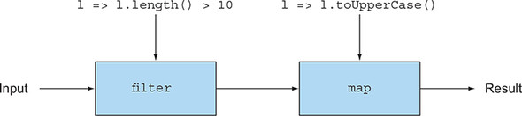

# Chương 20. Kết hợp OOP và FP: so sánh Java và Scala

> **Nội dung chương này**
>
> - Giới thiệu về Scala
> - Java liên hệ với Scala như thế nào và ngược lại
> - So sánh hàm (function) trong Scala với Java
> - Class và trait

Scala là một ngôn ngữ lập trình pha trộn giữa lập trình hướng đối tượng (object-oriented programming) và lập trình hàm (functional programming). Nó thường được xem như một ngôn ngữ thay thế cho Java dành cho những lập trình viên muốn có các tính năng hàm trong một ngôn ngữ lập trình định kiểu tĩnh (statically typed) chạy trên JVM, đồng thời vẫn giữ được cảm giác quen thuộc của Java. Scala giới thiệu nhiều tính năng hơn Java: một hệ thống kiểu (type system) tinh vi hơn, type inference, pattern matching (như đã trình bày ở chương 19), các cấu trúc cho phép định nghĩa DSL (domain-specific language) một cách đơn giản, v.v. Ngoài ra, bạn có thể truy cập toàn bộ các thư viện Java từ bên trong code Scala.

Có thể bạn tự hỏi tại sao chúng tôi lại đưa một chương về Scala vào một quyển sách về Java. Quyển sách này chủ yếu xoay quanh việc áp dụng lập trình theo phong cách hàm (functional-style programming) trong Java. Scala, cũng giống như Java, hỗ trợ các khái niệm xử lý collection theo phong cách hàm (tức là các thao tác kiểu stream), first-class function và default method. Nhưng Scala đẩy những ý tưởng này đi xa hơn, cung cấp một tập tính năng lớn hơn để hỗ trợ chúng so với Java. Chúng tôi tin rằng bạn sẽ thấy thú vị khi so sánh Scala với cách tiếp cận mà Java lựa chọn, và qua đó nhận ra những giới hạn của Java. Chương này nhằm làm sáng tỏ vấn đề đó để thoả mãn sự tò mò của bạn. Chúng tôi không nhất thiết khuyến khích bạn chuyển từ Java sang Scala. Những ngôn ngữ lập trình mới thú vị khác trên JVM, chẳng hạn như Kotlin, cũng rất đáng để tìm hiểu. Mục đích của chương này là mở rộng tầm nhìn của bạn về những gì có sẵn bên ngoài Java. Chúng tôi tin rằng một kỹ sư phần mềm toàn diện cần phải hiểu biết về hệ sinh thái ngôn ngữ lập trình rộng lớn hơn.

Cũng hãy nhớ rằng mục đích của chương này không phải là dạy bạn cách viết code Scala đúng phong cách bản địa (idiomatic), cũng không phải kể cho bạn mọi thứ về Scala. Scala hỗ trợ rất nhiều tính năng (chẳng hạn như pattern matching, for-comprehension và implicit) mà Java không có, và chúng tôi sẽ không bàn đến những tính năng đó. Thay vào đó, chúng tôi tập trung vào việc so sánh các tính năng của Java và Scala để bạn hình dung được bức tranh toàn cảnh. Chẳng hạn, bạn sẽ thấy rằng mình có thể viết code ngắn gọn và dễ đọc hơn trong Scala so với Java.

Chương này bắt đầu bằng phần giới thiệu về Scala: viết các chương trình đơn giản và làm việc với collection. Tiếp theo, chúng ta thảo luận về hàm trong Scala: first-class function, closure và currying. Cuối cùng, chúng ta xem xét class trong Scala và một tính năng gọi là trait, chính là cách Scala hiện thực hoá ý tưởng về interface và default method.

## 20.1. Giới thiệu về Scala

Mục này giới thiệu ngắn gọn các tính năng cơ bản của Scala để bạn có cảm nhận về những chương trình Scala đơn giản. Chúng ta bắt đầu với một ví dụ “Hello world” được sửa đổi đôi chút, viết theo phong cách mệnh lệnh (imperative) và theo phong cách hàm. Sau đó, chúng ta xem xét một vài cấu trúc dữ liệu mà Scala hỗ trợ — List, Set, Map, Stream, Tuple và Option — và so sánh chúng với Java. Cuối cùng, chúng tôi trình bày trait, thứ thay thế cho interface của Java trong Scala, đồng thời cũng hỗ trợ việc kế thừa phương thức ngay tại thời điểm khởi tạo đối tượng.

### 20.1.1. Hello beer

Để thay đổi một chút so với ví dụ “Hello world” kinh điển, hãy mang bia vào cuộc chơi. Bạn muốn in ra màn hình kết quả sau:

```text
Hello 2 bottles of beer
Hello 3 bottles of beer
Hello 4 bottles of beer
Hello 5 bottles of beer
Hello 6 bottles of beer
```

**Scala theo phong cách mệnh lệnh**

Đây là code in ra kết quả trên bằng Scala khi bạn dùng phong cách mệnh lệnh:

```scala
object Beer {
  def main(args: Array[String]) {
    var n : Int = 2
    while (n <= 6) {
      println(s"Hello ${n} bottles of beer")   // String interpolation
      n += 1
    }
  }
}
```

Bạn có thể tìm thông tin về cách chạy đoạn code này trên trang web chính thức của Scala (xem https://docs.scala-lang.org/getting-started.html). Chương trình này trông khá giống với những gì bạn sẽ viết trong Java, và cấu trúc của nó cũng tương tự cấu trúc của các chương trình Java, gồm một phương thức tên là `main` nhận vào một mảng các chuỗi làm đối số. (Chú thích kiểu tuân theo cú pháp `s : String` thay vì `String s` như trong Java.) Phương thức `main` không trả về giá trị nào, nên trong Scala không cần khai báo kiểu trả về như bạn buộc phải làm trong Java khi dùng `void`.

> **Ghi chú**
>
> Nói chung, các khai báo phương thức không đệ quy trong Scala không cần kiểu trả về tường minh, bởi vì Scala có thể suy diễn kiểu giúp bạn.

Trước khi xem xét phần thân của phương thức `main`, chúng ta cần bàn về khai báo `object`. Xét cho cùng, trong Java bạn phải khai báo phương thức `main` bên trong một class. Khai báo `object` giới thiệu một singleton object, vừa khai báo class `Beer` vừa khởi tạo nó cùng lúc. Chỉ có duy nhất một instance được tạo ra. Ví dụ này là ví dụ đầu tiên về một design pattern kinh điển (singleton design pattern) được hiện thực hoá thành một tính năng của ngôn ngữ, và bạn được dùng nó miễn phí, sẵn có ngay từ đầu. Ngoài ra, bạn có thể xem các phương thức bên trong một khai báo `object` như thể chúng được khai báo là `static`, đó là lý do vì sao chữ ký của phương thức `main` không được khai báo tường minh là `static`.

Bây giờ hãy nhìn vào thân của `main`. Phương thức này cũng trông tương tự một phương thức Java, nhưng các câu lệnh không cần kết thúc bằng dấu chấm phẩy (dấu này là tuỳ chọn). Thân phương thức gồm một vòng lặp `while`, nó tăng dần một biến mutable là `n`. Với mỗi giá trị mới của `n`, bạn in một chuỗi ra màn hình bằng phương thức `println` đã được định nghĩa sẵn. Dòng `println` phô diễn thêm một tính năng nữa của Scala: string interpolation (nội suy chuỗi), cho phép bạn nhúng trực tiếp các biến và biểu thức vào bên trong chuỗi ký tự. Trong đoạn code trên, bạn có thể dùng thẳng biến `n` trong chuỗi ký tự `s"Hello ${n} bottles of beer"`. Việc thêm bộ nội suy `s` vào trước chuỗi tạo nên phép màu đó. Thông thường trong Java, bạn phải nối chuỗi một cách tường minh, chẳng hạn `"Hello " + n + " bottles of beer"`.

**Scala theo phong cách hàm**

Nhưng sau tất cả những gì chúng ta đã bàn về lập trình theo phong cách hàm xuyên suốt quyển sách này, Scala mang lại được điều gì? Đoạn code phía trên có thể được viết theo dạng thiên về phong cách hàm hơn trong Java như sau:

```java
public class Foo {
    public static void main(String[] args) {
        IntStream.rangeClosed(2, 6)
                 .forEach(n -> System.out.println("Hello " + n +
                                                  " bottles of beer"));
    }
}
```

Còn đây là đoạn code đó trong Scala:

```scala
object Beer {
  def main(args: Array[String]) {
    2 to 6 foreach { n => println(s"Hello ${n} bottles of beer") }
  }
}
```

Code Scala tương tự code Java nhưng ít dài dòng hơn. Trước hết, bạn có thể tạo một dải giá trị (range) bằng biểu thức `2 to 6`. Và đây là điều thú vị: `2` là một object thuộc kiểu `Int`. Trong Scala, mọi thứ đều là object; không có khái niệm kiểu primitive như trong Java, điều này khiến Scala trở thành một ngôn ngữ hướng đối tượng hoàn chỉnh. Một object `Int` trong Scala hỗ trợ một phương thức tên là `to`, phương thức này nhận vào một `Int` khác làm đối số và trả về một range. Lẽ ra bạn có thể viết `2.to(6)`. Nhưng các phương thức nhận một đối số có thể được viết ở dạng trung tố (infix). Tiếp theo, `foreach` (với chữ `e` thường) tương tự `forEach` trong Java (với chữ `E` hoa). Phương thức này có sẵn trên một range (một lần nữa bạn lại dùng ký pháp trung tố), và nó nhận một lambda expression làm đối số để áp dụng lên từng phần tử. Cú pháp lambda expression tương tự như trong Java, nhưng mũi tên là `=>` thay vì `->`.[1] Đoạn code trên mang tính hàm; bạn không làm thay đổi (mutate) một biến nào như đã làm trong ví dụ trước với vòng lặp `while`.

> [1] Lưu ý rằng các thuật ngữ *anonymous function* và *closure* trong Scala (dùng thay thế cho nhau) chỉ đến thứ mà Java gọi là lambda expression.

### 20.1.2. Các cấu trúc dữ liệu cơ bản: List, Set, Map, Tuple, Stream, Option

Bạn thấy dễ chịu hơn sau khi làm vài chai bia giải khát chứ? Hầu hết các chương trình thực tế đều cần thao tác và lưu trữ dữ liệu, nên trong mục này, bạn sẽ thao tác với collection trong Scala và xem quá trình đó khác gì so với Java.

**Tạo collection**

Việc tạo collection trong Scala rất đơn giản, nhờ vào sự chú trọng của Scala vào tính súc tích. Để minh hoạ, đây là cách tạo một `Map`:

```scala
val authorsToAge = Map("Raoul" -> 23, "Mario" -> 40, "Alan" -> 53)
```

Có vài điều mới mẻ trong dòng code này. Thứ nhất, thật tuyệt vời khi bạn có thể tạo một `Map` và gán một khoá với một giá trị một cách trực tiếp, dùng cú pháp `->`. Không cần phải thêm từng phần tử một cách thủ công như trong Java:

```java
Map<String, Integer> authorsToAge = new HashMap<>();
authorsToAge.put("Raoul", 23);
authorsToAge.put("Mario", 40);
authorsToAge.put("Alan", 53);
```

Tuy nhiên, bạn đã học ở chương 8 rằng Java 9 có một vài factory method, lấy cảm hứng từ Scala, có thể giúp bạn gọn gàng hoá loại code này:

```java
Map<String, Integer> authorsToAge
    = Map.ofEntries(entry("Raoul", 23),
                    entry("Mario", 40),
                    entry("Alan", 53));
```

Điều mới mẻ thứ hai là bạn có thể chọn không chú thích kiểu cho biến `authorsToAge`. Lẽ ra bạn có thể viết tường minh `val authorsToAge : Map[String, Int]`, nhưng Scala có thể suy diễn kiểu của biến giúp bạn. (Lưu ý rằng code vẫn được kiểm tra tĩnh. Mọi biến đều có một kiểu xác định tại thời điểm biên dịch.) Chúng ta sẽ quay lại tính năng này ở chương 21. Thứ ba, bạn dùng từ khoá `val` thay vì `var`. Khác biệt là gì? Từ khoá `val` nghĩa là biến chỉ đọc và không thể gán lại (giống `final` trong Java). Từ khoá `var` nghĩa là biến có thể đọc-ghi.

Còn các collection khác thì sao? Bạn có thể tạo một `List` (danh sách liên kết đơn) hoặc một `Set` (không có phần tử trùng lặp) một cách dễ dàng, như sau:

```scala
val authors = List("Raoul", "Mario", "Alan")
val numbers = Set(1, 1, 2, 3, 5, 8)
```

Biến `authors` có ba phần tử, còn biến `numbers` có năm phần tử.

**Immutable và mutable**

Một sự thật quan trọng cần ghi nhớ là các collection bạn vừa tạo ở trên mặc định là immutable, nghĩa là chúng không thể bị thay đổi sau khi được tạo ra. Tính immutable rất hữu ích vì bạn biết chắc rằng việc truy cập collection tại bất kỳ thời điểm nào trong chương trình luôn cho ra một collection với cùng các phần tử.

Vậy làm sao để cập nhật một collection immutable trong Scala? Quay lại thuật ngữ đã dùng ở chương 19, những collection kiểu này trong Scala được gọi là persistent. Việc cập nhật một collection tạo ra một collection mới chia sẻ càng nhiều càng tốt với phiên bản trước, còn phiên bản trước vẫn tồn tại mà không bị ảnh hưởng bởi các thay đổi (như chúng tôi đã minh hoạ ở các hình 19.3 và 19.4). Hệ quả của tính chất này là code của bạn có ít phụ thuộc dữ liệu ngầm định hơn: bớt đi sự mơ hồ về việc chỗ nào trong code cập nhật một collection (hay bất kỳ cấu trúc dữ liệu chia sẻ nào khác) và cập nhật vào thời điểm nào.

Ví dụ sau minh hoạ ý tưởng này. Hãy thêm một phần tử vào một `Set`:

```scala
val numbers = Set(2, 5, 3);
// Ở đây, + là một phương thức thêm 8 vào Set, tạo ra một object Set mới làm kết quả.
val newNumbers = numbers + 8
println(newNumbers)   // (2, 5, 3, 8)
println(numbers)      // (2, 5, 3)
```

Trong ví dụ này, tập `numbers` không bị thay đổi. Thay vào đó, một `Set` mới được tạo ra với một phần tử bổ sung.

Lưu ý rằng Scala không ép buộc bạn phải dùng collection immutable — nó chỉ làm cho việc áp dụng tính immutable trong code trở nên dễ dàng. Ngoài ra, các phiên bản mutable cũng có sẵn trong package `scala.collection.mutable`.

> **Unmodifiable và immutable**
>
> Java cung cấp vài cách để tạo collection không thể sửa đổi (unmodifiable). Trong đoạn code sau, biến `newNumbers` là một khung nhìn chỉ đọc của tập `numbers`:
>
> ```java
> Set<Integer> numbers = new HashSet<>();
> Set<Integer> newNumbers = Collections.unmodifiableSet(numbers);
> ```
>
> Đoạn code này nghĩa là bạn sẽ không thể thêm phần tử mới thông qua biến `newNumbers`. Nhưng một collection unmodifiable chỉ là một lớp bọc (wrapper) bên ngoài một collection có thể sửa đổi, nên bạn vẫn có thể thêm phần tử bằng cách truy cập biến `numbers`.
>
> Ngược lại, các collection immutable đảm bảo rằng không gì có thể thay đổi collection đó, bất kể có bao nhiêu biến đang trỏ tới nó.
>
> Chúng tôi đã giải thích ở chương 19 cách bạn có thể tạo một persistent data structure: một cấu trúc dữ liệu immutable bảo toàn phiên bản trước đó của chính nó khi bị sửa đổi. Mọi sửa đổi luôn tạo ra một cấu trúc mới đã được cập nhật.

**Làm việc với collection**

Bây giờ khi bạn đã biết cách tạo collection, bạn cần biết mình có thể làm gì với chúng. Các collection trong Scala hỗ trợ những thao tác tương tự như trong Stream API của Java. Bạn có thể nhận ra `filter` và `map` trong ví dụ sau, và như được minh hoạ ở hình 20.1:

```scala
val fileLines = Source.fromFile("data.txt").getLines.toList()
val linesLongUpper
  = fileLines.filter(l => l.length() > 10)
             .map(l => l.toUpperCase())
```

> **Hình 20.1.** Các thao tác kiểu stream với `List` của Scala
>
> 

Đừng bận tâm về dòng đầu tiên, dòng này biến một file thành một danh sách các chuỗi tương ứng với các dòng trong file (tương tự những gì `Files.readAllLines` cung cấp trong Java). Dòng thứ hai tạo ra một pipeline gồm hai thao tác:

- Một thao tác `filter` chỉ chọn ra những dòng có độ dài lớn hơn 10
- Một thao tác `map` biến đổi những dòng dài đó thành chữ in hoa

Đoạn code này cũng có thể được viết như sau:

```scala
val linesLongUpper
  = fileLines filter (_.length() > 10) map(_.toUpperCase())
```

Bạn dùng ký pháp trung tố cũng như ký tự gạch dưới (`_`), vốn là một chỗ giữ chỗ (placeholder) được khớp theo vị trí với bất kỳ đối số nào. Trong trường hợp này, bạn có thể đọc `_.length()` là `l => l.length()`. Trong các hàm được truyền cho `filter` và `map`, dấu gạch dưới được ràng buộc với tham số dòng đang được xử lý.

Còn rất nhiều thao tác hữu ích khác có sẵn trong collection API của Scala. Chúng tôi khuyên bạn nên xem qua tài liệu Scala để có hình dung (https://docs.scala-lang.org/overviews/collections/introduction.html). Lưu ý rằng API này phong phú hơn Streams API một chút (bao gồm cả hỗ trợ cho các thao tác zipping, cho phép bạn kết hợp phần tử của hai danh sách), nên chắc chắn bạn sẽ học thêm được vài lối viết (idiom) lập trình khi tìm hiểu nó. Những idiom này cũng có thể sẽ được đưa vào Streams API trong các phiên bản Java tương lai.

Cuối cùng, hãy nhớ rằng trong Java, bạn có thể yêu cầu một pipeline được thực thi song song bằng cách gọi `parallel` trên một `Stream`. Scala cũng có một mẹo tương tự. Bạn chỉ cần dùng phương thức `par`:

```scala
val linesLongUpper
  = fileLines.par filter (_.length() > 10) map(_.toUpperCase())
```

**Tuple**

Mục này xem xét một tính năng khác thường gây ra sự dài dòng đến khó chịu trong Java: tuple. Bạn có thể muốn dùng tuple để nhóm những người theo tên và số điện thoại (ở đây là các cặp đơn giản) mà không cần khai báo một class mới đặc thù rồi khởi tạo một object cho nó: `("Raoul", "+44 7700 700042")`, `("Alan", "+44 7700 700314")`, v.v.

Đáng tiếc là Java không hỗ trợ tuple, nên bạn phải tự tạo cấu trúc dữ liệu của riêng mình. Đây là một class `Pair` đơn giản:

```java
public class Pair<X, Y> {
    public final X x;
    public final Y y;

    public Pair(X x, Y y) {
        this.x = x;
        this.y = y;
    }
}
```

Và dĩ nhiên bạn cũng cần khởi tạo các cặp một cách tường minh:

```java
Pair<String, String> raoul = new Pair<>("Raoul", "+44 7700 700042");
Pair<String, String> alan = new Pair<>("Alan", "+44 7700 700314");
```

Được rồi, nhưng còn bộ ba (triplet) và các tuple có kích thước tuỳ ý thì sao? Việc định nghĩa một class mới cho mỗi kích thước tuple thật tẻ nhạt và cuối cùng ảnh hưởng đến tính dễ đọc và tính dễ bảo trì của chương trình.

Scala cung cấp các tuple literal, cho phép bạn tạo tuple thông qua cú pháp đường (syntactic sugar) đơn giản với ký pháp toán học thông thường, như sau:

```scala
val raoul = ("Raoul", "+44 7700 700042")
val alan = ("Alan", "+44 7700 700314")
```

Scala hỗ trợ tuple với kích thước tuỳ ý,[2] nên những dòng sau đều hợp lệ:

> [2] Tuple bị giới hạn ở 22 phần tử.

```scala
val book = (2018, "Modern Java in Action", "Manning")   // Một tuple kiểu (Int, String, String)
val numbers = (42, 1337, 0, 3, 14)                      // Một tuple kiểu (Int, Int, Int, Int, Int)
```

Bạn có thể truy cập các phần tử của tuple theo vị trí bằng các bộ truy cập `_1`, `_2` (bắt đầu từ 1), như trong ví dụ này:

```scala
println(book._1)      // In ra 2018
println(numbers._4)   // In ra 3
```

Chẳng phải ví dụ đó đẹp hơn nhiều so với những gì bạn phải viết trong Java sao? Tin vui là đang có những thảo luận về việc đưa tuple literal vào các phiên bản Java trong tương lai. (Xem chương 21 để bàn thêm về các tính năng mới có thể có trong Java.)

**Stream**

Các collection mà chúng ta đã mô tả cho đến giờ — `List`, `Set`, `Map` và `Tuple` — đều được đánh giá một cách háo hức (eagerly), tức là ngay lập tức. Đến giờ, bạn đã biết rằng stream trong Java được đánh giá theo nhu cầu (tức là lazily). Bạn đã thấy ở chương 5 rằng nhờ tính chất này, stream có thể biểu diễn một dãy vô hạn mà không làm tràn bộ nhớ.

Scala cũng cung cấp một cấu trúc dữ liệu tương ứng được đánh giá theo kiểu lazy, gọi là `Stream`. Nhưng `Stream` trong Scala cung cấp nhiều tính năng hơn so với trong Java. `Stream` trong Scala ghi nhớ những giá trị đã được tính toán để có thể truy cập lại các phần tử trước đó. Ngoài ra, `Stream` được đánh chỉ số nên các phần tử có thể được truy cập theo chỉ số, giống như một danh sách. Lưu ý rằng cái giá phải đánh đổi cho những tính chất bổ sung này là `Stream` của Scala kém hiệu quả về bộ nhớ hơn so với `Stream` của Java, bởi vì việc có thể tham chiếu tới các phần tử trước đó đồng nghĩa với việc các phần tử phải được ghi nhớ (cache lại).

**Option**

Một cấu trúc dữ liệu khác mà bạn sẽ thấy quen thuộc là `Option` — phiên bản `Optional` của Java trong Scala, thứ chúng ta đã thảo luận ở chương 11. Chúng tôi đã lập luận rằng bạn nên dùng `Optional` khi có thể để thiết kế các API tốt hơn, trong đó chỉ cần đọc chữ ký của một phương thức là người dùng biết được liệu họ có thể mong đợi một giá trị tuỳ chọn hay không. Bạn nên dùng cấu trúc dữ liệu này thay cho `null` bất cứ khi nào có thể để ngăn chặn lỗi null-pointer exception.

Bạn đã thấy ở chương 11 rằng bạn có thể dùng `Optional` để trả về tên công ty bảo hiểm của một người nếu tuổi của người đó lớn hơn một độ tuổi tối thiểu nào đó, như sau:

```java
public String getCarInsuranceName(Optional<Person> person, int minAge) {
    return person.filter(p -> p.getAge() >= minAge)
                 .flatMap(Person::getCar)
                 .flatMap(Car::getInsurance)
                 .map(Insurance::getName)
                 .orElse("Unknown");
}
```

Trong Scala, bạn có thể dùng `Option` theo cách tương tự `Optional`:

```scala
def getCarInsuranceName(person: Option[Person], minAge: Int) =
  person.filter(_.age >= minAge)
        .flatMap(_.car)
        .flatMap(_.insurance)
        .map(_.name)
        .getOrElse("Unknown")
```

Bạn có thể nhận ra cùng một cấu trúc và cùng những tên phương thức, ngoại trừ `getOrElse`, vốn tương đương với `orElse` trong Java. Bạn thấy đấy, xuyên suốt quyển sách này, bạn đã học được những khái niệm mới mà bạn có thể áp dụng trực tiếp sang các ngôn ngữ lập trình khác! Đáng tiếc, `null` cũng tồn tại trong Scala vì lý do tương thích với Java, nhưng việc dùng nó rất không được khuyến khích.

## 20.2. Hàm

Hàm trong Scala có thể được xem như những chuỗi chỉ thị được nhóm lại để thực hiện một nhiệm vụ. Những hàm này hữu ích cho việc trừu tượng hoá hành vi và là nền tảng của lập trình hàm.

Trong Java, bạn đã quen với phương thức: những hàm gắn với một class. Bạn cũng đã thấy lambda expression, thứ có thể được xem là các hàm vô danh (anonymous function). Scala cung cấp một tập tính năng phong phú hơn để hỗ trợ hàm so với Java, và chúng ta sẽ xem xét những tính năng đó trong mục này. Scala cung cấp:

- *Function type* — cú pháp đường biểu diễn ý tưởng về function descriptor của Java (tức là các ký pháp biểu diễn chữ ký của phương thức trừu tượng được khai báo trong một functional interface), thứ chúng tôi đã mô tả ở chương 3
- Các anonymous function không bị hạn chế "không được ghi" lên các biến phi cục bộ (nonlocal variable) như lambda expression của Java
- Hỗ trợ currying, nghĩa là chia nhỏ một hàm nhận nhiều đối số thành một chuỗi các hàm, mỗi hàm nhận một phần trong số các đối số đó

### 20.2.1. First-class function trong Scala

Hàm trong Scala là các giá trị hạng nhất (first-class value), nghĩa là chúng có thể được truyền đi như tham số, trả về như kết quả và lưu trong biến, giống như các giá trị kiểu `Integer` và `String`. Như chúng tôi đã trình bày ở các chương trước, method reference và lambda expression trong Java cũng có thể được xem là first-class function.

Đây là một ví dụ về cách first-class function hoạt động trong Scala. Giả sử bạn có một danh sách các chuỗi biểu diễn những tweet mà bạn đã nhận được. Bạn muốn lọc danh sách này theo các tiêu chí khác nhau, chẳng hạn những tweet có nhắc đến từ *Java* hoặc những tweet có độ dài ngắn nhất định. Bạn có thể biểu diễn hai tiêu chí này dưới dạng predicate (những hàm trả về giá trị Boolean):

```scala
def isJavaMentioned(tweet: String) : Boolean = tweet.contains("Java")
def isShortTweet(tweet: String) : Boolean = tweet.length() < 20
```

Trong Scala, bạn có thể truyền trực tiếp những phương thức này vào `filter` có sẵn như sau (giống như cách bạn truyền chúng bằng method reference trong Java):

```scala
val tweets = List(
    "I love the new features in Java",
    "How's it going?",
    "An SQL query walks into a bar, sees two tables and says 'Can I join you?'"
)
tweets.filter(isJavaMentioned).foreach(println)
tweets.filter(isShortTweet).foreach(println)
```

Bây giờ hãy xem xét chữ ký của phương thức `filter` có sẵn:

```scala
def filter[T](p: (T) => Boolean): List[T]
```

Có thể bạn tự hỏi kiểu của tham số `p` nghĩa là gì (ở đây là `(T) => Boolean`), bởi vì trong Java, bạn sẽ mong đợi một functional interface. Cú pháp Scala này (chưa) có trong Java, nhưng nó mô tả một function type. Ở đây, kiểu này biểu diễn một hàm nhận vào một object kiểu `T` và trả về một `Boolean`. Trong Java, kiểu này được diễn đạt bằng `Predicate<T>` hoặc `Function<T, Boolean>`, vốn có cùng chữ ký với các phương thức `isJavaMentioned` và `isShortTweet`, nên bạn có thể truyền chúng làm đối số cho `filter`. Những người thiết kế ngôn ngữ Java đã quyết định không đưa vào cú pháp tương tự cho function type nhằm giữ cho ngôn ngữ nhất quán với các phiên bản trước đó. (Việc đưa quá nhiều cú pháp mới vào một phiên bản mới của ngôn ngữ được xem là làm tăng quá nhiều gánh nặng nhận thức.)

### 20.2.2. Anonymous function và closure

Scala cũng hỗ trợ anonymous function, với cú pháp tương tự lambda expression. Trong ví dụ sau, bạn có thể gán cho một biến tên là `isLongTweet` một anonymous function kiểm tra xem một tweet cho trước có dài hay không:

```scala
val isLongTweet : String => Boolean          // Một biến có function type từ String tới Boolean
    = (tweet : String) => tweet.length() > 60  // Một anonymous function
```

Trong Java, một lambda expression cho phép bạn tạo một instance của một functional interface. Scala có một cơ chế tương tự. Đoạn code trên là cú pháp đường cho việc khai báo một anonymous class kiểu `scala.Function1` (một hàm có một tham số), lớp này cung cấp phần cài đặt của phương thức `apply`:

```scala
val isLongTweet : String => Boolean
    = new Function1[String, Boolean] {
        def apply(tweet: String): Boolean = tweet.length() > 60
      }
```

Bởi vì biến `isLongTweet` giữ một object kiểu `Function1`, bạn có thể gọi phương thức `apply`, thứ có thể được xem như việc gọi hàm:

```scala
isLongTweet.apply("A very short tweet")   // Trả về false
```

Trong Java, bạn có thể làm như sau:

```java
Function<String, Boolean> isLongTweet = (String s) -> s.length() > 60;
boolean isLong = isLongTweet.apply("A very short tweet");
```

Để cho phép bạn dùng lambda expression, Java cung cấp vài functional interface có sẵn như `Predicate`, `Function` và `Consumer`. Scala cung cấp trait (tạm thời bạn có thể nghĩ về trait như là interface) để đạt được điều tương tự: từ `Function0` (một hàm có 0 tham số và một kết quả trả về) cho đến `Function22` (một hàm có 22 tham số), tất cả đều định nghĩa phương thức `apply`.

Một mẹo hay khác trong Scala cho phép bạn gọi ngầm phương thức `apply` bằng cú pháp đường trông giống một lời gọi hàm hơn:

```scala
isLongTweet("A very short tweet")   // Trả về false
```

Trình biên dịch tự động chuyển một lời gọi `f(a)` thành `f.apply(a)`, và tổng quát hơn, chuyển lời gọi `f(a1, ..., an)` thành `f.apply(a1, ..., an)`, nếu `f` là một object hỗ trợ phương thức `apply`. (Lưu ý rằng `apply` có thể có số lượng đối số bất kỳ.)

**Closure**

Ở chương 3, chúng tôi đã bình luận về việc liệu lambda expression trong Java có phải là closure hay không. Một closure là một instance của một hàm có thể tham chiếu tới các biến phi cục bộ của hàm đó mà không bị hạn chế nào. Nhưng lambda expression trong Java có một hạn chế: chúng không thể sửa đổi nội dung của các biến cục bộ trong phương thức nơi lambda được định nghĩa. Những biến đó phải ngầm định là final. Sẽ dễ hiểu hơn nếu ta nghĩ rằng lambda đóng gói (close over) các *giá trị*, chứ không phải các *biến*.

Ngược lại, anonymous function trong Scala có thể capture chính các biến, chứ không phải các giá trị mà biến đang tham chiếu tới. Đoạn sau là hợp lệ trong Scala:

```scala
def main(args: Array[String]) {
    var count = 0
    val inc = () => count += 1   // Một closure capture và tăng biến count
    inc()
    println(count)               // In ra 1
    inc()
    println(count)               // In ra 2
}
```

Nhưng trong Java, đoạn sau sẽ gây lỗi biên dịch vì `count` bị ép ngầm định phải là final:

```java
public static void main(String[] args) {
    int count = 0;

    // Lỗi: count phải là final hoặc effectively final.
    Runnable inc = () -> count += 1;
    inc.run();
    System.out.println(count);
    inc.run();
}
```

Chúng tôi đã lập luận ở các chương 7, 18 và 19 rằng bạn nên tránh việc thay đổi trạng thái (mutation) bất cứ khi nào có thể để chương trình dễ bảo trì và dễ song song hoá hơn, vì vậy chỉ dùng tính năng này khi thật sự cần thiết.

### 20.2.3. Currying

Ở chương 19, chúng tôi đã mô tả một kỹ thuật gọi là currying, trong đó một hàm `f` nhận hai đối số (chẳng hạn `x` và `y`) được nhìn nhận thành một hàm `g` nhận một đối số, và hàm này trả về một hàm cũng nhận một đối số. Định nghĩa này có thể được tổng quát hoá cho các hàm nhiều đối số, sinh ra nhiều hàm mỗi hàm nhận một đối số. Nói cách khác, bạn có thể chia nhỏ một hàm nhận nhiều đối số thành một chuỗi các hàm, mỗi hàm nhận một tập con của các đối số. Scala cung cấp một cấu trúc giúp việc curry một hàm có sẵn trở nên dễ dàng.

Để hiểu Scala mang lại điều gì, trước hết hãy xem lại một ví dụ trong Java. Bạn có thể định nghĩa một phương thức đơn giản để nhân hai số nguyên:

```java
static int multiply(int x, int y) {
    return x * y;
}
int r = multiply(2, 10);
```

Nhưng định nghĩa này đòi hỏi phải truyền tất cả các đối số cho nó. Bạn có thể chia nhỏ phương thức `multiply` một cách thủ công bằng cách cho nó trả về một hàm khác:

```java
static Function<Integer, Integer> multiplyCurry(int x) {
    return (Integer y) -> x * y;
}
```

Hàm được trả về bởi `multiplyCurry` capture giá trị của `x` và nhân nó với đối số `y` của nó, trả về một `Integer`. Nhờ đó, bạn có thể dùng `multiplyCurry` như sau bên trong một `map` để nhân mỗi phần tử với 2:

```java
Stream.of(1, 3, 5, 7)
      .map(multiplyCurry(2))
      .forEach(System.out::println);
```

Đoạn code này cho ra kết quả 2, 6, 10, 14. Nó hoạt động được vì `map` mong đợi một `Function` làm đối số và `multiplyCurry` trả về một `Function`.

Việc tách một hàm một cách thủ công để tạo ra dạng curry trong Java hơi tẻ nhạt, nhất là khi hàm có nhiều đối số. Scala có một cú pháp đặc biệt thực hiện việc này một cách tự động. Bạn có thể định nghĩa phương thức `multiply` thông thường như sau:

```scala
def multiply(x : Int, y: Int) = x * y
val r = multiply(2, 10)
```

Và đây là dạng curry:

```scala
def multiplyCurry(x : Int)(y : Int) = x * y   // Định nghĩa một hàm dạng curry
val r = multiplyCurry(2)(10)                  // Gọi một hàm dạng curry
```

Khi bạn dùng cú pháp `(x: Int)(y: Int)`, phương thức `multiplyCurry` nhận hai danh sách đối số, mỗi danh sách có một tham số kiểu `Int`. Ngược lại, `multiply` nhận một danh sách gồm hai tham số `Int`. Điều gì xảy ra khi bạn gọi `multiplyCurry`? Lời gọi đầu tiên tới `multiplyCurry` với một `Int` duy nhất (tham số `x`), tức `multiplyCurry(2)`, trả về một hàm khác nhận tham số `y` và nhân nó với giá trị `x` đã được capture (ở đây là giá trị 2). Chúng ta nói rằng hàm này được áp dụng một phần (partially applied) như đã giải thích ở chương 19, vì không phải tất cả đối số đều được cung cấp. Lời gọi thứ hai nhân `x` với `y`. Bạn có thể lưu lời gọi đầu tiên tới `multiplyCurry` vào một biến và tái sử dụng nó, như sau:

```scala
val multiplyByTwo : Int => Int = multiplyCurry(2)
val r = multiplyByTwo(10)   // 20
```

So với Java, trong Scala bạn không cần tự tay cung cấp dạng curry của một hàm như trong ví dụ phía trên. Scala cung cấp một cú pháp định nghĩa hàm tiện lợi để chỉ ra rằng một hàm có nhiều danh sách đối số dạng curry.

## 20.3. Class và trait

Trong mục này, chúng ta xem xét class và interface trong Java so với trong Scala như thế nào. Hai cấu trúc này là tối quan trọng để thiết kế ứng dụng. Bạn sẽ thấy rằng class và interface của Scala có thể mang lại sự linh hoạt hơn so với trong Java.

### 20.3.1. Ít dài dòng hơn với class của Scala

Bởi vì Scala là một ngôn ngữ hướng đối tượng hoàn chỉnh, bạn có thể tạo class và khởi tạo chúng để sinh ra object. Ở dạng cơ bản nhất, cú pháp khai báo và khởi tạo class tương tự như của Java. Đây là cách khai báo một class `Hello`:

```scala
class Hello {
  def sayThankYou() {
    println("Thanks for reading our book")
  }
}
val h = new Hello()
h.sayThankYou()
```

**Getter và setter**

Scala trở nên thú vị hơn khi bạn có một class với các trường (field). Bạn đã bao giờ gặp một class Java chỉ thuần tuý định nghĩa một danh sách các trường mà lại phải khai báo một danh sách dài các getter, setter và một constructor phù hợp chưa? Thật là cực hình! Ngoài ra, bạn thường còn thấy cả các test cho phần cài đặt của từng phương thức. Một lượng lớn code thường bị dành cho những class như vậy trong các ứng dụng Enterprise Java. Hãy xét class `Student` đơn giản sau:

```java
public class Student {
    private String name;
    private int id;

    public Student(String name) {
        this.name = name;
    }

    public String getName() {
        return name;
    }

    public void setName(String name) {
        this.name = name;
    }

    public int getId() {
        return id;
    }

    public void setId(int id) {
        this.id = id;
    }
}
```

Bạn phải tự tay định nghĩa constructor khởi tạo tất cả các trường, hai getter và hai setter. Một class đơn giản giờ đây có hơn 20 dòng code. Một số IDE (môi trường phát triển tích hợp) và công cụ có thể giúp bạn sinh ra đoạn code này, nhưng code base của bạn vẫn phải gánh một lượng lớn code bổ sung chẳng mấy hữu ích so với logic nghiệp vụ thực sự.

Trong Scala, constructor, getter và setter có thể được sinh ra một cách ngầm định, dẫn đến code ít dài dòng hơn:

```scala
class Student(var name: String, var id: Int)
val s = new Student("Raoul", 1)   // Khởi tạo một object Student.
println(s.name)                   // Lấy name và in ra Raoul.
s.id = 1337                       // Gán id.
println(s.id)                     // In ra 1337.
```

Trong Java, bạn có thể đạt được hành vi tương tự bằng cách định nghĩa các trường public, nhưng bạn vẫn phải định nghĩa constructor một cách tường minh. Class trong Scala giúp bạn tiết kiệm code khuôn mẫu (boilerplate).

### 20.3.2. Trait của Scala so với interface của Java

Scala có thêm một tính năng hữu ích khác dành cho việc trừu tượng hoá, gọi là trait, đây là thứ thay thế cho interface của Java trong Scala. Một trait có thể định nghĩa cả các phương thức trừu tượng lẫn các phương thức có phần cài đặt mặc định. Trait cũng có thể được kế thừa bội (multiply inherited) giống như interface trong Java, nên bạn có thể xem chúng tương tự các interface của Java có hỗ trợ default method. Trait còn có thể chứa các trường giống như abstract class, điều mà interface của Java không hỗ trợ. Vậy trait có giống abstract class không? Không, bởi vì khác với abstract class, trait có thể được kế thừa bội. Java luôn có kế thừa bội về kiểu bởi vì một class có thể implement nhiều interface. Java 8, thông qua default method, đã giới thiệu kế thừa bội về hành vi, nhưng vẫn không cho phép kế thừa bội về trạng thái — điều mà trait của Scala cho phép.

Để xem một trait trong Scala trông như thế nào, hãy định nghĩa một trait tên là `Sized` chứa một trường mutable tên là `size` và một phương thức tên là `isEmpty` với phần cài đặt mặc định:

```scala
trait Sized {
  var size : Int = 0        // Một trường tên là size
  def isEmpty() = size == 0 // Một phương thức tên là isEmpty với phần cài đặt mặc định
}
```

Bạn có thể kết hợp (compose) đoạn code này ngay tại thời điểm khai báo với một class, chẳng hạn một class `Empty` luôn có size bằng 0:

```scala
class Empty extends Sized              // Một class kế thừa từ trait Sized
println(new Empty().isEmpty())         // In ra true
```

Điều thú vị là, so với interface của Java, trait có thể được kết hợp tại thời điểm khởi tạo đối tượng (nhưng thao tác này vẫn là thao tác tại thời điểm biên dịch). Bạn có thể tạo một class `Box` và quyết định rằng một instance cụ thể nào đó sẽ hỗ trợ các thao tác được định nghĩa bởi trait `Sized`, như sau:

```scala
class Box
val b1 = new Box() with Sized   // Kết hợp trait tại thời điểm khởi tạo đối tượng
println(b1.isEmpty())           // In ra true
val b2 = new Box()
// Lỗi biên dịch: khai báo class Box không kế thừa từ Sized.
b2.isEmpty()
```

Điều gì xảy ra nếu nhiều trait được kế thừa mà chúng lại khai báo các phương thức có cùng chữ ký hoặc các trường có cùng tên? Scala cung cấp những quy tắc hạn chế tương tự như các quy tắc áp dụng cho default method (chương 13).

## Tóm tắt

- Java và Scala kết hợp các tính năng hướng đối tượng và lập trình hàm vào cùng một ngôn ngữ lập trình; cả hai đều chạy trên JVM và ở mức độ lớn có thể tương tác với nhau.
- Scala hỗ trợ các trừu tượng về collection tương tự như trong Java — `List`, `Set`, `Map`, `Stream`, `Option` — nhưng còn hỗ trợ cả tuple.
- Scala cung cấp các tính năng phong phú hơn để hỗ trợ hàm so với Java. Những tính năng này bao gồm function type, closure không bị hạn chế khi truy cập các biến cục bộ, và các dạng currying có sẵn.
- Class trong Scala có thể cung cấp constructor, getter và setter một cách ngầm định.
- Scala hỗ trợ trait, là những interface có thể chứa cả trường lẫn default method.
