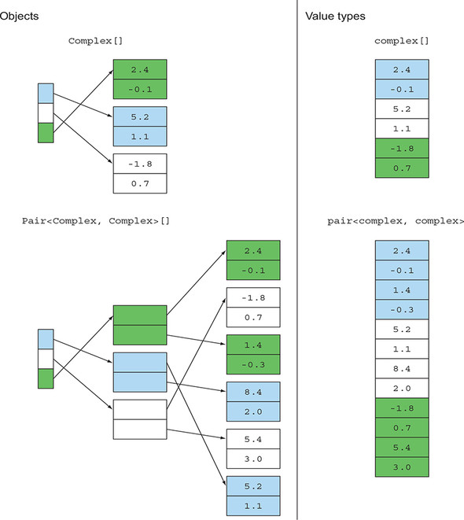
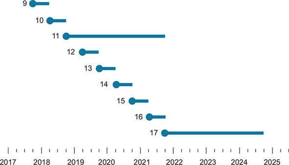

# Chương 21. Kết luận và hướng đi tiếp của Java

> **Nội dung chương này**
>
> - Các tính năng mới của Java 8 và ảnh hưởng mang tính tiến hoá của chúng lên phong cách lập trình
> - Module system mới của Java 9
> - Vòng đời phát hành gia tăng (incremental-release) sáu tháng một lần của Java
> - Bản phát hành gia tăng đầu tiên tạo nên Java 10
> - Một vài ý tưởng mà nhiều khả năng bạn sẽ thấy được cài đặt trong một phiên bản Java nào đó trong tương lai

Chúng ta đã đi qua rất nhiều nội dung trong cuốn sách này, và chúng tôi hy vọng bạn cảm thấy mình đã sẵn sàng bắt đầu sử dụng các tính năng mới của Java 8 và 9 trong code của chính bạn, có lẽ bằng cách xây dựng dựa trên các ví dụ và bài Quiz của chúng tôi. Trong chương này, chúng ta điểm lại hành trình học về Java 8 và cú hích nhẹ nhàng hướng tới lập trình theo phong cách hàm (functional-style programming), cũng như những ưu điểm của khả năng modul hoá mới cùng các cải tiến nhỏ khác được giới thiệu cùng Java 9. Bạn cũng sẽ tìm hiểu những gì được đưa vào Java 10. Ngoài ra, chúng tôi còn phỏng đoán về những cải tiến trong tương lai và những tính năng mới tuyệt vời có thể đang nằm trong lộ trình (pipeline) của Java, vượt ra ngoài Java 9, 10, 11 và 12.

## 21.1. Điểm lại các tính năng của Java 8

Một cách hay để giúp bạn hiểu Java 8 như một ngôn ngữ thực dụng và hữu ích là xem lại lần lượt từng tính năng. Thay vì chỉ đơn giản liệt kê chúng ra, chúng tôi muốn trình bày chúng như những mảnh ghép liên kết với nhau, để giúp bạn hiểu chúng không chỉ như một tập hợp các tính năng, mà còn như một cái nhìn tổng quan ở mức cao về thiết kế ngôn ngữ mạch lạc mang tên Java 8. Mục tiêu còn lại của chúng tôi trong chương tổng kết này là nhấn mạnh rằng phần lớn các tính năng mới trong Java 8 đều nhằm tạo điều kiện cho functional-style programming trong Java. Hãy nhớ rằng, việc hỗ trợ lập trình hàm không phải là một lựa chọn thiết kế tuỳ hứng, mà là một chiến lược thiết kế có ý thức, xoay quanh hai xu hướng mà chúng tôi coi như "biến đổi khí hậu" trong mô hình đã nêu ở chương 1:

- Nhu cầu ngày càng lớn trong việc khai thác sức mạnh của các bộ vi xử lý đa lõi (multicore), giờ đây khi mà vì các lý do công nghệ silicon, số lượng transistor tăng thêm hằng năm theo định luật Moore không còn chuyển hoá thành tốc độ xung nhịp cao hơn cho từng lõi CPU riêng lẻ nữa. Nói một cách đơn giản, muốn code của bạn chạy nhanh hơn thì cần đến code song song.
- Xu hướng ngày càng phổ biến trong việc thao tác cô đọng trên các collection dữ liệu bằng một phong cách khai báo (declarative style) để xử lý dữ liệu, chẳng hạn như lấy một nguồn dữ liệu nào đó, trích ra tất cả dữ liệu khớp với một tiêu chí cho trước, rồi áp dụng một phép toán nào đó lên kết quả (tổng hợp nó lại hoặc tạo thành một collection kết quả để xử lý tiếp về sau). Phong cách này gắn liền với việc sử dụng các đối tượng và collection immutable, chúng sau đó được xử lý để tạo ra các giá trị immutable khác.

Không động lực nào trong hai động lực trên được hỗ trợ hiệu quả bởi cách tiếp cận truyền thống, hướng đối tượng, mệnh lệnh (imperative) — vốn xoay quanh việc thay đổi (mutate) các field và áp dụng iterator. Việc thay đổi dữ liệu trên một lõi rồi đọc nó từ một lõi khác tốn kém một cách đáng ngạc nhiên, chưa kể nó còn kéo theo nhu cầu khoá (locking) vốn rất dễ sinh lỗi. Tương tự, khi bạn tập trung vào việc lặp qua và thay đổi các đối tượng có sẵn, lối viết kiểu stream có thể mang lại cảm giác xa lạ. Nhưng hai xu hướng này lại được hỗ trợ bởi những ý tưởng đến từ lập trình hàm, điều này giải thích tại sao trọng tâm của Java 8 đã dịch chuyển đôi chút so với những gì bạn vẫn quen chờ đợi từ Java.

Chương này điểm lại, theo một góc nhìn tổng thể thống nhất, những gì bạn đã học được từ cuốn sách này và cho bạn thấy mọi thứ ăn khớp với nhau ra sao trong bối cảnh mới.

### 21.1.1. Behavior parameterization (lambda và method reference)

Để viết một phương thức có thể tái sử dụng như `filter`, bạn cần chỉ định làm đối số của nó một mô tả về tiêu chí lọc. Mặc dù các chuyên gia Java có thể hoàn thành nhiệm vụ này ở những phiên bản Java trước đây bằng cách gói tiêu chí lọc thành một phương thức bên trong một class rồi truyền vào một instance của class đó, giải pháp này không phù hợp để dùng phổ biến vì quá cồng kềnh khi viết và bảo trì.

Như bạn đã khám phá ở chương 2 và 3, Java 8 cung cấp một cách — vay mượn từ lập trình hàm — để truyền một mẩu code vào một phương thức. Java tiện lợi cung cấp hai biến thể:

- Truyền một lambda (một mẩu code dùng một lần), chẳng hạn như

  ```java
  apple -> apple.getWeight() > 150
  ```

- Truyền một method reference tới một phương thức đã có, chẳng hạn như `Apple::isHeavy`

Những giá trị này có các kiểu như `Function<T, R>`, `Predicate<T>` và `BiFunction<T, U, R>`, và bên nhận có thể thực thi chúng bằng cách dùng các phương thức `apply`, `test`, và tương tự. Những kiểu này được gọi là functional interface và có duy nhất một abstract method, như bạn đã học ở chương 3. Xét riêng bản thân chúng, lambda có thể trông như một khái niệm khá hẹp, nhưng cách Java 8 sử dụng chúng trong phần lớn Streams API mới đã đẩy chúng lên vị trí trung tâm của Java.

### 21.1.2. Stream

Các class collection trong Java, cùng với iterator và cấu trúc for-each, đã phục vụ lập trình viên một cách đáng trân trọng trong suốt một thời gian dài. Lẽ ra sẽ rất dễ dàng nếu những người thiết kế Java 8 chỉ việc thêm các phương thức như `filter` và `map` vào collection, khai thác lambda để diễn đạt các truy vấn kiểu cơ sở dữ liệu. Nhưng thay vào đó, họ đã thêm một Streams API mới, vốn là chủ đề của các chương 4–7, và cũng đáng để chúng ta dừng lại một chút để suy ngẫm xem tại sao.

Collection có gì sai đến mức phải bị thay thế hoặc bổ trợ bằng một khái niệm tương tự là Stream? Chúng tôi tóm tắt như thế này: nếu bạn có một collection lớn và áp dụng ba thao tác lên nó (chẳng hạn map các đối tượng trong collection để cộng hai field của chúng, filter các tổng thoả mãn một tiêu chí nào đó, rồi sắp xếp kết quả), bạn sẽ thực hiện ba lượt duyệt riêng biệt trên collection. Thay vào đó, Streams API gom một cách lười biếng (lazily) các thao tác này thành một pipeline và chỉ thực hiện một lượt duyệt stream duy nhất, thi hành tất cả các thao tác cùng lúc. Quá trình này hiệu quả hơn nhiều với các tập dữ liệu lớn, và vì những lý do như bộ nhớ cache, tập dữ liệu càng lớn thì việc giảm thiểu số lượt duyệt càng quan trọng.

Lý do còn lại, không kém phần quan trọng, liên quan đến việc xử lý các phần tử song song, điều thiết yếu để khai thác hiệu quả các CPU đa lõi. Stream, và cụ thể là phương thức `parallel`, cho phép đánh dấu một stream là phù hợp để xử lý song song. Hãy nhớ rằng tính song song và trạng thái mutable rất khó đi cùng nhau, nên các khái niệm cốt lõi của lập trình hàm (các thao tác không có side effect và các phương thức được tham số hoá bằng lambda cùng method reference cho phép internal iteration thay vì external iteration, như đã bàn ở chương 4) đóng vai trò trung tâm trong việc khai thác stream song song bằng `map`, `filter`, và tương tự.

Trong mục tiếp theo, chúng ta xem xét những ý tưởng này — vốn được giới thiệu dưới góc độ stream — có một tương đồng trực tiếp trong thiết kế của `CompletableFuture` như thế nào.

### 21.1.3. CompletableFuture

Java đã cung cấp interface `Future` từ Java 5. Future rất hữu ích để khai thác multicore vì chúng cho phép một tác vụ được sinh ra trên một thread hoặc lõi khác, đồng thời cho phép tác vụ sinh ra nó tiếp tục thực thi song song với tác vụ được sinh ra. Khi tác vụ sinh cần đến kết quả, nó có thể dùng phương thức `get` để chờ `Future` hoàn tất (tức là tạo ra giá trị của nó).

Chương 16 giải thích phần cài đặt `CompletableFuture` của `Future` trong Java 8, vốn một lần nữa khai thác lambda. Một câu châm ngôn hữu ích, dù có hơi thiếu chính xác, là "CompletableFuture với Future cũng như Stream với Collection". Hãy so sánh:

- `Stream` cho phép bạn tạo pipeline các thao tác và cung cấp behavior parameterization với `map`, `filter`, và tương tự, loại bỏ đi phần code khuôn mẫu (boilerplate) mà bạn thường phải viết khi dùng iterator.
- `CompletableFuture` cung cấp các thao tác như `thenCompose`, `thenCombine` và `allOf`, vốn đưa ra cách mã hoá cô đọng theo phong cách lập trình hàm cho các design pattern thông dụng liên quan đến Future, và cho phép bạn tránh được code khuôn mẫu tương tự theo phong cách mệnh lệnh.

Phong cách thao tác này, dù trong một kịch bản đơn giản hơn, cũng áp dụng cho các thao tác trên `Optional` của Java 8, mà chúng ta sẽ xem lại trong mục tiếp theo.

### 21.1.4. Optional

Thư viện Java 8 cung cấp class `Optional<T>`, cho phép code của bạn chỉ rõ rằng một giá trị hoặc là một giá trị hợp lệ kiểu `T`, hoặc là một giá trị vắng mặt (missing value) được trả về bởi static method `Optional.empty`. Tính năng này rất tuyệt cho việc hiểu chương trình và cho tài liệu hoá. Nó cung cấp một kiểu dữ liệu với một giá trị vắng mặt tường minh, thay cho việc dùng con trỏ `null` dễ sinh lỗi trước đây để biểu thị giá trị vắng mặt, mà lập trình viên không bao giờ có thể chắc chắn đó là một giá trị vắng mặt có chủ đích hay là một `null` tình cờ sinh ra từ một phép tính sai sót trước đó.

Như đã bàn ở chương 11, nếu `Optional<T>` được dùng một cách nhất quán, chương trình lẽ ra sẽ không bao giờ sinh ra `NullPointerException`. Một lần nữa, bạn có thể xem tình huống này như một thứ đơn lẻ, chẳng liên quan gì đến phần còn lại của Java 8, và hỏi: "Việc chuyển từ dạng giá trị vắng mặt này sang một dạng khác thì giúp gì cho tôi trong việc viết chương trình?" Quan sát kỹ hơn sẽ thấy class `Optional<T>` cung cấp `map`, `filter` và `ifPresent`. Các phương thức này có hành vi tương tự các phương thức tương ứng trong class Streams và có thể được dùng để nối chuỗi các phép tính, một lần nữa theo phong cách hàm, với việc kiểm tra giá trị vắng mặt do thư viện thực hiện thay vì code người dùng. Lựa chọn giữa kiểm tra bên trong (internal) và bên ngoài (external) trong `Optional<T>` hoàn toàn tương đồng với cách thư viện Streams thực hiện internal iteration so với external iteration trong code người dùng. Java 9 đã bổ sung nhiều phương thức mới vào Optional API, bao gồm `stream()`, `or()` và `ifPresentOrElse()`.

### 21.1.5. Flow API

Java 9 đã chuẩn hoá reactive streams và giao thức backpressure kiểu reactive-pull, một cơ chế được thiết kế để ngăn một consumer chậm bị quá tải bởi một hay nhiều producer nhanh hơn. Flow API bao gồm bốn interface cốt lõi mà các phần cài đặt thư viện có thể hỗ trợ để đạt được khả năng tương thích rộng rãi hơn: `Publisher`, `Subscriber`, `Subscription` và `Processor`.

Chủ đề cuối cùng của chúng ta trong mục này không liên quan đến functional-style programming, mà là về việc Java 8 hỗ trợ mở rộng thư viện theo hướng tương thích ngược (upward-compatible), xuất phát từ những mong muốn của công nghệ phần mềm.

### 21.1.6. Default method

Java 8 còn có những bổ sung khác, không cái nào trong số đó đặc biệt ảnh hưởng đến sức biểu đạt của bất kỳ chương trình nào. Nhưng một thứ rất hữu ích cho những người thiết kế thư viện là việc cho phép thêm default method vào một interface. Trước Java 8, interface chỉ định nghĩa chữ ký phương thức; giờ đây chúng còn có thể cung cấp phần cài đặt mặc định cho những phương thức mà người thiết kế interface ngờ rằng không phải mọi client đều muốn tự cung cấp một cách tường minh.

Đây là một công cụ mới tuyệt vời cho những người thiết kế thư viện, vì nó cho họ khả năng bổ sung một thao tác mới vào một interface mà không cần bắt tất cả client (các class cài đặt interface này) phải thêm code để định nghĩa phương thức đó. Do vậy, default method cũng liên quan đến những người sử dụng thư viện, bởi nó che chắn cho họ khỏi những thay đổi interface trong tương lai (xem chương 13).

## 21.2. Module system của Java 9

Java 8 đã bổ sung rất nhiều thứ, cả về mặt tính năng mới (chẳng hạn lambda và default method trên interface) lẫn các class hữu ích mới trong API gốc, như `Stream` và `CompletableFuture`. Java 9 không giới thiệu bất kỳ tính năng ngôn ngữ mới nào mà chủ yếu trau chuốt lại công việc đã bắt đầu từ Java 8, hoàn thiện các class được giới thiệu ở đó bằng một số phương thức hữu ích như `takeWhile` và `dropWhile` trên `Stream`, cùng `completeOnTimeout` trên `CompletableFuture`. Thực tế, trọng tâm chính của Java 9 là giới thiệu module system mới. Hệ thống mới này không ảnh hưởng đến ngôn ngữ ngoại trừ file `module-info.java` mới, nhưng dù vậy nó cải thiện cách bạn thiết kế và viết ứng dụng từ góc nhìn kiến trúc, đánh dấu rõ ràng ranh giới của các thành phần con và định nghĩa cách chúng tương tác với nhau.

Đáng tiếc là Java 9 lại gây tổn hại đến tính tương thích ngược của Java nhiều hơn bất kỳ bản phát hành nào khác (hãy thử biên dịch một code base Java 8 lớn bằng Java 9). Nhưng cái giá này đáng để trả cho những lợi ích của việc modul hoá đúng cách. Một lý do là để bảo đảm encapsulation tốt hơn và mạnh mẽ hơn giữa các package. Thực tế, các visibility modifier của Java được thiết kế để định nghĩa encapsulation giữa các phương thức và class, nhưng xuyên qua các package thì chỉ có duy nhất một mức visibility khả dĩ: `public`. Sự thiếu hụt này khiến việc modul hoá một hệ thống một cách đúng đắn trở nên khó khăn, đặc biệt là việc chỉ rõ phần nào của một module được thiết kế để dùng công khai và phần nào là chi tiết cài đặt cần được che giấu khỏi các module và ứng dụng khác.

Lý do thứ hai, vốn là hệ quả trực tiếp của encapsulation yếu giữa các package, là nếu không có một module system đúng nghĩa thì không thể tránh khỏi việc phơi bày những chức năng có liên quan đến bảo mật ra cho toàn bộ code chạy trong cùng môi trường. Code độc hại có thể truy cập những phần trọng yếu trong module của bạn, qua đó vượt qua mọi biện pháp bảo mật được mã hoá bên trong chúng.

Cuối cùng, module system mới của Java cho phép Java runtime được chia nhỏ thành các phần nhỏ hơn, nhờ đó bạn chỉ dùng những phần cần thiết cho ứng dụng của mình. Chẳng hạn, sẽ rất đáng ngạc nhiên nếu CORBA là một yêu cầu cho dự án Java mới của bạn, thế nhưng nhiều khả năng nó vẫn được đưa vào tất cả các ứng dụng Java của bạn. Mặc dù điều này có thể ít liên quan với các thiết bị tính toán kích cỡ truyền thống, nó lại quan trọng với các thiết bị nhúng và với tình huống ngày càng thường gặp khi ứng dụng Java của bạn chạy trong một môi trường container hoá. Nói cách khác, module system của Java là một yếu tố tạo điều kiện cho việc sử dụng Java runtime trong các ứng dụng Internet of Things (IoT) và trên cloud.

Như đã bàn ở chương 14, module system của Java giải quyết những vấn đề này bằng cách giới thiệu một cơ chế ở cấp độ ngôn ngữ để modul hoá các hệ thống lớn của bạn và cả bản thân Java runtime. Những ưu điểm của module system trong Java bao gồm:

- *Cấu hình đáng tin cậy (Reliable configuration)* — Việc khai báo tường minh các yêu cầu của module cho phép phát hiện sớm lỗi ở thời điểm build thay vì ở runtime, trong trường hợp các phụ thuộc bị thiếu, xung đột hoặc vòng tròn.
- *Encapsulation mạnh (Strong encapsulation)* — Java Module System cho phép các module chỉ export những package cụ thể, qua đó tách bạch ranh giới công khai và có thể truy cập được của mỗi module với phần cài đặt nội bộ.
- *Bảo mật được cải thiện (Improved security)* — Việc không cho phép người dùng gọi những phần cụ thể trong module của bạn khiến kẻ tấn công khó lách qua các kiểm soát bảo mật được cài đặt trong đó hơn nhiều.
- *Hiệu năng tốt hơn (Better performance)* — Nhiều kỹ thuật tối ưu hoá có thể hiệu quả hơn khi một class chỉ có thể tham chiếu tới một vài thành phần thay vì tới bất kỳ class nào khác được runtime nạp lên.
- *Khả năng mở rộng quy mô (Scalability)* — Module system của Java cho phép nền tảng Java SE được phân rã thành các phần nhỏ hơn, chỉ chứa những tính năng mà ứng dụng đang chạy yêu cầu.

Nhìn chung, modul hoá là một chủ đề khó, và nhiều khả năng nó sẽ không phải là động lực thúc đẩy việc nhanh chóng chuyển sang Java 9 như lambda đã từng làm với Java 8. Tuy nhiên, chúng tôi tin rằng về lâu dài, công sức bạn đầu tư vào việc modul hoá ứng dụng sẽ được đền đáp bằng tính dễ bảo trì cao hơn.

Cho đến giờ, chúng ta đã tóm tắt các khái niệm của Java 8 và 9 được trình bày trong cuốn sách này. Trong mục tiếp theo, chúng ta chuyển sang chủ đề gai góc hơn về những cải tiến trong tương lai và những tính năng tuyệt vời có thể đang nằm trong lộ trình của Java, vượt ra ngoài Java 9.

## 21.3. Local variable type inference trong Java 10

Ban đầu trong Java, mỗi khi bạn giới thiệu một biến hay một phương thức, bạn phải đồng thời cho biết kiểu của nó. Ví dụ sau

```java
double convertUSDToGBP(double money) { ExchangeRate e = ...; }
```

chứa ba kiểu, lần lượt cho biết kiểu kết quả của `convertUSDToGBP`, kiểu của đối số `money`, và kiểu của biến cục bộ `e`. Theo thời gian, yêu cầu này đã được nới lỏng theo hai hướng. Thứ nhất, bạn có thể bỏ qua các tham số kiểu của generic trong một biểu thức khi ngữ cảnh đã xác định được chúng. Ví dụ sau

```java
Map<String, List<String>> myMap = new HashMap<String, List<String>>();
```

có thể được viết tắt như sau kể từ Java 7:

```java
Map<String, List<String>> myMap = new HashMap<>();
```

Thứ hai, để dùng chính ý tưởng lan truyền kiểu được xác định bởi ngữ cảnh vào trong một biểu thức, một lambda expression như

```java
Function<Integer, Boolean> p = (Integer x) -> booleanExpression;
```

có thể được rút gọn thành

```java
Function<Integer, Boolean> p = x -> booleanExpression;
```

bằng cách bỏ đi phần kiểu. Trong cả hai trường hợp, compiler suy diễn ra các kiểu đã bị bỏ đi.

Type inference có một vài ưu điểm khi một kiểu chỉ gồm một định danh duy nhất, ưu điểm chính là giảm bớt công sức chỉnh sửa khi thay một kiểu này bằng một kiểu khác. Nhưng khi kích thước của kiểu tăng lên, chẳng hạn generic được tham số hoá bởi các generic khác, type inference có thể hỗ trợ tính dễ đọc.[1] Các ngôn ngữ Scala và C# cho phép thay thế kiểu trong một khai báo biến cục bộ có khởi tạo bằng từ khoá (có giới hạn) `var`; compiler sẽ điền vào kiểu thích hợp lấy từ vế phải. Khai báo `myMap` trình bày ở trên theo cú pháp Java có thể được viết như sau:

```java
var myMap = new HashMap<String, List<String>>();
```

> **[1]** Tất nhiên, điều quan trọng là type inference phải được thực hiện một cách hợp lý. Type inference hoạt động tốt nhất khi bạn chỉ có một cách, hoặc một cách dễ dàng ghi thành tài liệu, để tái tạo lại kiểu mà người dùng đã bỏ đi. Vấn đề sẽ nảy sinh nếu hệ thống suy diễn ra một kiểu khác với kiểu mà người dùng đang nghĩ tới. Vì vậy, một thiết kế type inference tốt sẽ báo lỗi khi có hai kiểu không thể so sánh được với nhau đều có thể được suy diễn ra; các phép heuristic có thể tạo cảm giác như hệ thống chọn nhầm kiểu một cách ngẫu nhiên.

Ý tưởng này được gọi là local variable type inference và đã được đưa vào Java 10.

Tuy nhiên vẫn có một chút lý do để lo ngại. Cho một class `Car` là class con của class `Vehicle`, thì khai báo

```java
var x = new Car();
```

ngầm khai báo `x` có kiểu `Car` hay `Vehicle` (hay thậm chí `Object`)? Trong trường hợp này, một lời giải thích đơn giản rằng kiểu bị thiếu chính là kiểu của biểu thức khởi tạo (ở đây là `Car`) là hoàn toàn rõ ràng. Java 10 chính thức hoá điều này, đồng thời cũng quy định rằng `var` không thể được dùng khi không có biểu thức khởi tạo.

## 21.4. Điều gì đang chờ Java phía trước?

Một số điểm chúng tôi đề cập trong mục này được bàn chi tiết hơn trên trang web JDK Enhancement Proposal tại http://openjdk.java.net/jeps/0. Ở đây, chúng tôi chú trọng giải thích tại sao những ý tưởng trông có vẻ hợp lý lại có những khó khăn tinh tế hoặc những tương tác với các tính năng hiện có, khiến chúng không thể được đưa thẳng vào Java.

### 21.4.1. Declaration-site variance

Java hỗ trợ wildcard như những cơ chế linh hoạt cho phép subtyping với generic (nhìn chung được gọi là use-site variance). Sự hỗ trợ này khiến phép gán sau đây là hợp lệ:

```java
List<? extends Number> numbers = new ArrayList<Integer>();
```

Nhưng phép gán sau đây, bỏ đi phần `? extends`, lại sinh ra lỗi biên dịch:

```java
List<Number> numbers = new ArrayList<Integer>();  // Các kiểu không tương thích
```

Nhiều ngôn ngữ lập trình, chẳng hạn C# và Scala, hỗ trợ một cơ chế variance khác gọi là declaration-site variance. Những ngôn ngữ này cho phép lập trình viên chỉ định variance ngay khi định nghĩa một generic class. Tính năng này hữu ích với những class vốn dĩ đã mang tính variant. Chẳng hạn, `Iterator` vốn dĩ mang tính covariant, còn `Comparator` vốn dĩ mang tính contravariant, và lẽ ra bạn không cần phải nghĩ theo kiểu `? extends` hay `? super` khi dùng chúng. Việc thêm declaration-site variance vào Java sẽ hữu ích, bởi những đặc tả này thay vào đó sẽ xuất hiện ngay tại phần khai báo class. Kết quả là, bổ sung này sẽ giảm bớt gánh nặng nhận thức cho lập trình viên. Lưu ý rằng tại thời điểm viết cuốn sách này (2018), có một đề xuất cải tiến JDK sẽ cho phép declaration-site variance mặc định trong các phiên bản Java sắp tới (http://openjdk.java.net/jeps/300).

### 21.4.2. Pattern matching

Như chúng ta đã bàn ở chương 19, các ngôn ngữ theo phong cách hàm thường cung cấp một dạng pattern matching nào đó — một dạng nâng cao của `switch` — trong đó bạn có thể hỏi: "Giá trị này có phải là một instance của một class cho trước không?" và (tuỳ chọn) hỏi tiếp một cách đệ quy xem các field của nó có mang những giá trị nhất định hay không. Trong Java, một phép kiểm tra trường hợp đơn giản trông như thế này:

```java
if (op instanceof BinOp) {
    Expr e = ((BinOp) op).getLeft();
}
```

Lưu ý rằng bạn phải lặp lại kiểu `BinOp` bên trong biểu thức ép kiểu, mặc dù đã rõ ràng rằng đối tượng được tham chiếu bởi `op` mang kiểu đó.

Tất nhiên, bạn có thể phải xử lý một hệ thống phân cấp biểu thức phức tạp, và cách tiếp cận nối chuỗi nhiều điều kiện `if` sẽ khiến code của bạn dài dòng hơn. Cũng cần nhắc bạn rằng thiết kế hướng đối tượng truyền thống không khuyến khích dùng `switch` mà khuyến khích các pattern như visitor pattern, trong đó luồng điều khiển phụ thuộc kiểu dữ liệu được thực hiện bằng cơ chế dispatch phương thức thay vì bằng `switch`. Ở đầu bên kia của phổ ngôn ngữ lập trình, trong functional-style programming, pattern matching trên các giá trị của kiểu dữ liệu thường là cách thuận tiện nhất để thiết kế một chương trình.

Việc thêm pattern matching kiểu Scala vào Java một cách tổng quát hoàn toàn có vẻ là một công việc lớn, nhưng tiếp nối việc tổng quát hoá gần đây cho `switch` để cho phép dùng `String`, bạn có thể hình dung một phần mở rộng cú pháp khiêm tốn hơn cho phép `switch` hoạt động trên các đối tượng bằng cú pháp `instanceof`. Thực tế, một đề xuất cải tiến JDK đang khám phá pattern matching như một tính năng ngôn ngữ cho Java (http://openjdk.java.net/jeps/305). Ví dụ sau đây xem lại ví dụ của chúng ta ở chương 19 và giả định có một class `Expr`, được kế thừa thành `BinOp` và `Number`:

```java
switch (someExpr) {
    case (op instanceof BinOp):
        doSomething(op.getOpName(), op.getLeft(), op.getRight());
    case (n instanceof Number):
        dealWithLeafNode(n.getValue());
    default:
        defaultAction(someExpr);
}
```

Hãy để ý một vài điều. Thứ nhất, đoạn code này mượn từ pattern matching cái ý tưởng rằng trong `case (op instanceof BinOp):`, `op` là một biến cục bộ mới (kiểu `BinOp`), được gắn (bound) với cùng giá trị như `someExpr`. Tương tự, trong trường hợp `Number`, `n` trở thành một biến kiểu `Number`. Trong trường hợp `default`, không có biến nào được gắn. Đề xuất này loại bỏ rất nhiều code khuôn mẫu so với việc dùng các chuỗi `if-then-else` và ép kiểu về kiểu con. Một nhà thiết kế hướng đối tượng truyền thống có lẽ sẽ lập luận rằng loại code dispatch theo kiểu dữ liệu như vậy sẽ được diễn đạt tốt hơn bằng các phương thức kiểu visitor được override trong các kiểu con, nhưng dưới con mắt của lập trình hàm, giải pháp đó dẫn đến việc code có liên quan với nhau bị rải rác khắp nhiều định nghĩa class khác nhau. Sự phân đôi thiết kế kinh điển này được bàn trong tài liệu chuyên ngành dưới cái tên bài toán biểu thức (the expression problem).[2]

> **[2]** Để có lời giải thích đầy đủ hơn, xem http://en.wikipedia.org/wiki/Expression_problem.

### 21.4.3. Các dạng generic phong phú hơn

Mục này bàn về hai hạn chế của generic trong Java và xem xét một hướng tiến hoá khả dĩ để giảm nhẹ chúng.

#### Reified generic

Khi generic được giới thiệu trong Java 5, chúng phải tương thích ngược với JVM đang có. Vì mục đích đó, biểu diễn ở runtime của `ArrayList<String>` và `ArrayList<Integer>` là giống hệt nhau. Mô hình này được gọi là mô hình xoá bỏ (erasure model) của generic polymorphism. Một số chi phí runtime nhỏ đi kèm với lựa chọn này, nhưng ảnh hưởng lớn nhất đối với lập trình viên là các tham số của kiểu generic chỉ có thể là đối tượng chứ không thể là primitive type. Giả sử Java cho phép, chẳng hạn, `ArrayList<int>`. Khi đó bạn có thể cấp phát một đối tượng `ArrayList` trên heap chứa một giá trị primitive như `int 42`, nhưng container `ArrayList` lại không chứa bất kỳ chỉ dấu nào cho biết nó chứa một giá trị `Object` như một `String` hay một giá trị primitive `int` như `42`.

Ở một mức độ nào đó, tình huống này có vẻ vô hại. Nếu bạn lấy ra một primitive `42` từ một `ArrayList<int>` và một đối tượng `String` `"abc"` từ một `ArrayList<String>`, thì tại sao bạn phải bận tâm rằng các container `ArrayList` không phân biệt được với nhau? Đáng tiếc, câu trả lời là garbage collection, bởi việc thiếu thông tin kiểu ở runtime về nội dung của `ArrayList` sẽ khiến JVM không thể xác định được phần tử thứ 13 trong `ArrayList` của bạn là một tham chiếu `String` (cần được đi theo và đánh dấu là đang được dùng bởi garbage collection) hay là một giá trị primitive `int` (chắc chắn không được đi theo).

Trong ngôn ngữ C#, biểu diễn ở runtime của `ArrayList<String>`, `ArrayList<Integer>` và `ArrayList<int>` về nguyên tắc là khác nhau. Nhưng ngay cả khi các biểu diễn này giống nhau, vẫn có đủ thông tin kiểu được giữ lại ở runtime để cho phép, chẳng hạn, garbage collection xác định được một field là một tham chiếu hay một primitive. Mô hình này được gọi là mô hình hiện thực hoá (reified model) của generic polymorphism, hay đơn giản hơn là reified generic. Từ *reification* nghĩa là "làm cho tường minh cái mà lẽ ra sẽ chỉ là ngầm định".

Reified generic rõ ràng là đáng mong muốn vì chúng cho phép hợp nhất đầy đủ hơn giữa các primitive type và các kiểu đối tượng tương ứng — một điều mà bạn sẽ thấy là có vấn đề trong các mục tiếp theo. Khó khăn chính đối với Java là tính tương thích ngược, cả ở JVM lẫn ở các chương trình hiện có vốn dùng reflection và trông đợi generic bị xoá bỏ (erased).

#### Thêm sự linh hoạt về cú pháp trong generic cho các kiểu hàm

Generic đã chứng tỏ là một tính năng tuyệt vời khi chúng được thêm vào Java 5. Chúng cũng ổn cho việc diễn đạt kiểu của nhiều lambda và method reference trong Java 8. Bạn có thể diễn đạt một hàm một đối số như sau:

```java
Function<Integer, Integer> square = x -> x * x;
```

Nếu bạn có một hàm hai đối số, bạn dùng kiểu `BiFunction<T, U, R>`, trong đó `T` là kiểu của tham số thứ nhất, `U` là tham số thứ hai, và `R` là kết quả. Nhưng không có `TriFunction` trừ khi bạn tự khai báo lấy.

Tương tự, bạn không thể dùng `Function<T, R>` cho tham chiếu tới các phương thức không nhận đối số nào và trả về kiểu kết quả `R`; thay vào đó bạn phải dùng `Supplier<R>`.

Về bản chất, lambda trong Java 8 đã làm phong phú thêm những gì bạn có thể viết, nhưng hệ thống kiểu lại chưa theo kịp sự linh hoạt của code. Trong nhiều ngôn ngữ hàm, bạn có thể viết, chẳng hạn, kiểu `(Integer, Double) => String` để biểu diễn cái mà Java 8 gọi là `BiFunction<Integer, Double, String>`, cùng với `Integer => String` để biểu diễn `Function<Integer, String>`, và thậm chí `() => String` để biểu diễn `Supplier<String>`. Bạn có thể hiểu `=>` như một phiên bản trung tố (infix) của `Function`, `BiFunction`, `Supplier`, và tương tự. Một mở rộng đơn giản cho cú pháp kiểu trong Java để cho phép `=>` dạng trung tố sẽ mang lại những kiểu dễ đọc hơn, tương tự như những gì Scala cung cấp, như đã bàn ở chương 20.

#### Đặc hoá primitive và generic

Trong Java, tất cả các primitive type (chẳng hạn `int`) đều có một kiểu đối tượng tương ứng (ở đây là `java.lang.Integer`). Lập trình viên thường gọi những kiểu này là unboxed và boxed. Mặc dù sự phân biệt này có một mục tiêu đáng khen là tăng hiệu quả ở runtime, các kiểu này lại có thể gây rối. Chẳng hạn, tại sao bạn lại viết `Predicate<Apple>` thay vì `Function<Apple, Boolean>` trong Java 8? Một đối tượng kiểu `Predicate<Apple>`, khi được gọi bằng phương thức `test`, trả về một `boolean` primitive.

Ngược lại, giống như mọi generic trong Java, một `Function` chỉ có thể được tham số hoá bằng các kiểu đối tượng. Trong trường hợp `Function<Apple, Boolean>`, đây là kiểu đối tượng `Boolean`, chứ không phải primitive type `boolean`. `Predicate<Apple>` hiệu quả hơn vì nó tránh được việc boxing giá trị `boolean` thành một `Boolean`. Vấn đề này đã dẫn đến việc tạo ra nhiều interface tương tự nhau như `LongToIntFunction` và `BooleanSupplier`, làm gia tăng thêm gánh nặng khái niệm.

Một ví dụ khác liên quan đến sự khác biệt giữa `void`, vốn chỉ có thể dùng để mô tả kiểu trả về của phương thức và không có giá trị nào, với kiểu đối tượng `Void`, vốn có `null` là giá trị duy nhất của nó (một câu hỏi thường xuyên xuất hiện trên các diễn đàn). Các trường hợp đặc biệt của `Function` như `Supplier<T>`, vốn có thể được viết là `() => T` theo ký pháp mới đề xuất ở mục trước, càng chứng thực thêm những hệ luỵ do sự phân biệt giữa kiểu primitive và kiểu đối tượng gây ra. Chúng ta đã bàn trước đó về việc reified generic có thể giải quyết được nhiều vấn đề trong số này như thế nào.

### 21.4.4. Hỗ trợ sâu hơn cho tính immutable

Một số độc giả chuyên gia có thể đã hơi phật lòng khi chúng tôi nói rằng Java 8 có ba dạng giá trị:

- Giá trị primitive
- (Tham chiếu tới) đối tượng
- (Tham chiếu tới) hàm

Ở một mức độ nào đó, chúng tôi sẽ giữ nguyên lập trường của mình và nói: "Nhưng đây chính là những giá trị mà giờ đây một phương thức có thể nhận làm đối số và trả về làm kết quả." Nhưng chúng tôi cũng muốn thừa nhận rằng lời giải thích này có chút vấn đề. Bạn trả về một giá trị (theo nghĩa toán học) đến mức nào khi bạn trả về một tham chiếu tới một mảng mutable? Một `String` hay một mảng immutable rõ ràng là một giá trị, nhưng trường hợp một đối tượng hay mảng mutable thì rõ ràng ít dứt khoát hơn nhiều. Phương thức của bạn có thể trả về một mảng với các phần tử được sắp xếp tăng dần, nhưng một đoạn code khác sau đó có thể thay đổi một trong các phần tử của nó.

Nếu bạn quan tâm đến functional-style programming trong Java, bạn cần đến sự hỗ trợ ở cấp độ ngôn ngữ để nói "giá trị immutable". Như đã lưu ý ở chương 18, từ khoá `final` không đạt được mục đích này; nó chỉ ngăn không cho field mà nó bổ nghĩa bị cập nhật. Hãy xem ví dụ sau:

```java
final int[] arr = {1, 2, 3};
final List<T> list = new ArrayList<>();
```

Dòng đầu tiên cấm một phép gán khác kiểu `arr = ...` nhưng không cấm `arr[1] = 2`; dòng thứ hai cấm các phép gán cho `list` nhưng không cấm các phương thức khác thay đổi số lượng phần tử trong `list`. Từ khoá `final` hoạt động tốt với các giá trị primitive, nhưng với tham chiếu tới đối tượng, nó thường tạo ra một cảm giác an toàn giả tạo.

Điều chúng tôi muốn dẫn tới là thế này: vì functional-style programming đặt trọng tâm mạnh mẽ vào việc không thay đổi cấu trúc đang có, nên có một lập luận vững chắc cho một từ khoá kiểu như `transitively_final`, có thể bổ nghĩa cho các field kiểu tham chiếu và bảo đảm rằng không có thay đổi nào có thể xảy ra trong field đó hoặc trong bất kỳ đối tượng nào có thể truy cập trực tiếp hay gián tiếp thông qua field đó.

Những kiểu như vậy thể hiện một trực giác về giá trị: giá trị là immutable, và chỉ có biến (vốn chứa giá trị) mới có thể bị thay đổi để chứa một giá trị immutable khác. Như chúng tôi đã nhận xét ở đầu mục này, các tác giả Java (kể cả chúng tôi) đôi khi nói một cách thiếu nhất quán về khả năng một giá trị Java lại là một mảng mutable. Trong mục tiếp theo, chúng ta trở về với trực giác đúng đắn và bàn về ý tưởng value type, vốn chỉ có thể chứa các giá trị immutable, ngay cả khi các biến kiểu value type vẫn có thể được cập nhật trừ khi chúng được bổ nghĩa bằng `final`.

### 21.4.5. Value type

Trong mục này, chúng ta bàn về sự khác biệt giữa primitive type và kiểu đối tượng, tiếp nối phần thảo luận về mong muốn có value type, thứ giúp bạn viết chương trình theo lối hàm, cũng như kiểu đối tượng là cần thiết cho lập trình hướng đối tượng. Nhiều vấn đề chúng ta bàn tới đều liên quan tới nhau, nên không có cách nào dễ dàng để giải thích riêng lẻ một vấn đề. Thay vào đó, chúng ta nhận diện vấn đề qua các khía cạnh khác nhau của nó.

#### Compiler không thể đối xử với Integer và int như nhau sao?

Với tất cả những chuyện boxing và unboxing ngầm định mà Java đã dần dần tích luỹ kể từ Java 1.1, bạn có thể tự hỏi liệu đã đến lúc Java đối xử với, chẳng hạn, `Integer` và `int` như nhau và trông cậy vào compiler Java để tối ưu hoá thành dạng tốt nhất cho JVM hay chưa.

Ý tưởng này về nguyên tắc thì tuyệt vời, nhưng hãy xem xét các vấn đề xoay quanh việc thêm kiểu `Complex` vào Java để hiểu tại sao boxing lại gây rắc rối. Kiểu `Complex`, mô hình hoá cái gọi là số phức với phần thực và phần ảo, được giới thiệu một cách tự nhiên như sau:

```java
class Complex {
    public final double re;
    public final double im;

    public Complex(double re, double im) {
        this.re = re;
        this.im = im;
    }

    public static Complex add(Complex a, Complex b) {
        return new Complex(a.re + b.re, a.im + b.im);
    }
}
```

Nhưng các giá trị kiểu `Complex` là kiểu tham chiếu, và mọi thao tác trên `Complex` đều cần thực hiện một phép cấp phát đối tượng, làm lu mờ chi phí của hai phép cộng trong `add`. Lập trình viên cần một dạng tương tự kiểu primitive của `Complex`, có lẽ gọi là `complex`.

Vấn đề nằm ở chỗ lập trình viên muốn một đối tượng không boxed (unboxed object), thứ mà cả Java lẫn JVM đều không cung cấp bất kỳ hỗ trợ thực sự nào. Bạn có thể quay lại lời than "Ồ, nhưng chắc chắn compiler có thể tối ưu chuyện này mà". Đáng buồn thay, quá trình này khó hơn nhiều so với vẻ ngoài của nó; mặc dù một phép tối ưu hoá compiler dựa trên cái gọi là escape analysis đôi khi có thể xác định rằng unboxing là chấp nhận được, phạm vi áp dụng của nó bị giới hạn bởi những giả định của Java về Object, vốn đã tồn tại từ Java 1.1. Hãy xem câu đố sau:

```java
double d1 = 3.14;
double d2 = d1;
Double o1 = d1;
Double o2 = d2;
Double ox = o1;
System.out.println(d1 == d2 ? "yes" : "no");
System.out.println(o1 == o2 ? "yes" : "no");
System.out.println(o1 == ox ? "yes" : "no");
```

Kết quả là "yes", "no", "yes". Một lập trình viên Java kỳ cựu có lẽ sẽ nói: "Code gì mà ngớ ngẩn. Ai cũng biết là nên dùng `equals` ở hai dòng cuối thay vì `==` chứ." Nhưng chúng tôi vẫn kiên trì. Mặc dù tất cả các primitive và đối tượng này đều chứa giá trị immutable `3.14` và lẽ ra phải không phân biệt được với nhau, nhưng định nghĩa của `o1` và `o2` lại tạo ra các đối tượng mới, và toán tử `==` (so sánh định danh) có thể phân biệt được chúng. Lưu ý rằng trên primitive, phép so sánh định danh thực hiện so sánh theo từng bit, còn trên đối tượng thì nó thực hiện so sánh tham chiếu. Bạn thường vô tình tạo ra một đối tượng `Double` mới và khác biệt, mà compiler buộc phải tôn trọng vì ngữ nghĩa của `Object`, mà `Double` kế thừa, yêu cầu như vậy. Bạn đã thấy phần thảo luận này trước đây rồi, cả trong phần bàn về value type ở chương này lẫn ở chương 19, nơi chúng ta bàn về referential transparency của các phương thức cập nhật persistent data structure theo lối hàm.

#### Value type: Không phải mọi thứ đều là primitive hoặc đối tượng

Chúng tôi đề xuất rằng cách giải quyết vấn đề này là làm lại những giả định của Java rằng (1) mọi thứ không phải primitive đều là đối tượng và do đó kế thừa `Object`, và (2) mọi tham chiếu đều là tham chiếu tới đối tượng.

Sự phát triển bắt đầu như thế này. Giá trị có hai dạng:

- Kiểu đối tượng (object type), có các field mutable trừ khi bị cấm bằng `final`, và cũng có định danh (identity), thứ có thể được kiểm tra bằng `==`.
- Value type, vốn là immutable và không có định danh tham chiếu. Primitive type là một tập con của khái niệm rộng hơn này.

Bạn có thể cho phép các value type do người dùng định nghĩa (có lẽ bắt đầu bằng chữ cái thường để nhấn mạnh sự tương đồng của chúng với các primitive type như `int` và `boolean`). Trên value type, `==` mặc định sẽ thực hiện so sánh theo từng phần tử, giống như cách phép so sánh phần cứng trên `int` thực hiện so sánh theo từng bit. Chúng ta cần cẩn thận với các thành phần dấu phẩy động vì phép so sánh với chúng là một thao tác có phần tinh vi hơn. Kiểu `Complex` sẽ là một ví dụ hoàn hảo cho một value type không phải primitive; những kiểu như vậy tương tự như struct trong C#.

Ngoài ra, value type có thể giảm bớt nhu cầu lưu trữ vì chúng không có định danh tham chiếu. Hình 21.1 minh hoạ một mảng kích thước ba, có các phần tử 0, 1 và 2 lần lượt mang màu xám nhạt, trắng và xám đậm. Sơ đồ bên trái cho thấy nhu cầu lưu trữ điển hình khi `Pair` và `Complex` là Object, còn sơ đồ bên phải cho thấy bố cục tốt hơn khi `Pair` và `Complex` là value type. Lưu ý rằng chúng tôi gọi chúng là `pair` và `complex` viết thường trong sơ đồ để nhấn mạnh sự tương đồng của chúng với các primitive type. Cũng lưu ý rằng value type nhiều khả năng sẽ cho hiệu năng tốt hơn, không chỉ đối với việc truy cập dữ liệu (nhiều tầng con trỏ gián tiếp được thay bằng một lệnh định địa chỉ theo chỉ số duy nhất), mà còn đối với việc sử dụng cache phần cứng (nhờ tính liền kề của dữ liệu).

> **Hình 21.1.** Object so với value type
>
> 

Lưu ý rằng vì value type không có định danh tham chiếu, compiler có thể tuỳ ý box và unbox chúng. Nếu bạn truyền một `complex` làm đối số từ một hàm này sang một hàm khác, compiler có thể truyền nó một cách tự nhiên dưới dạng hai giá trị `double` riêng biệt. (Tất nhiên, việc trả về nó mà không boxing thì phức tạp hơn trong JVM, bởi JVM chỉ cung cấp các lệnh trả về từ phương thức cho những giá trị biểu diễn được trong một thanh ghi máy 64 bit.) Nhưng nếu bạn truyền một value type lớn hơn làm đối số (chẳng hạn một mảng immutable lớn), compiler có thể thay vào đó truyền nó dưới dạng tham chiếu sau khi đã box nó, một cách trong suốt với người dùng. Công nghệ tương tự đã tồn tại trong C#. Microsoft nói (https://docs.microsoft.com/en-us/dotnet/csharp/language-reference/keywords/value-types):

> Các biến dựa trên value type chứa trực tiếp giá trị. Việc gán một biến value type này cho một biến khác sẽ sao chép giá trị chứa bên trong. Điều này khác với phép gán các biến kiểu tham chiếu, vốn sao chép một tham chiếu tới đối tượng chứ không sao chép bản thân đối tượng.

Tại thời điểm viết cuốn sách này (2018), một đề xuất cải tiến JDK cho value type trong Java đang chờ xử lý (http://openjdk.java.net/jeps/169).

#### Boxing, generic, value type: bài toán phụ thuộc lẫn nhau

Chúng ta muốn có value type trong Java vì các chương trình theo phong cách hàm làm việc với các giá trị immutable không có định danh. Chúng ta muốn xem primitive type như một trường hợp đặc biệt của value type, nhưng mô hình erasure của generic mà Java hiện đang dùng có nghĩa là value type không thể được dùng với generic nếu không boxing. Các phiên bản đối tượng (boxed) (chẳng hạn `Integer`) của các primitive type (chẳng hạn `int`) tiếp tục đóng vai trò sống còn với collection và generic trong Java vì mô hình erasure của chúng, nhưng giờ đây việc chúng kế thừa `Object` (và do đó có so sánh tham chiếu) lại bị coi là một nhược điểm. Giải quyết bất kỳ vấn đề nào trong số này đồng nghĩa với việc phải giải quyết tất cả chúng.

## 21.5. Đưa Java tiến lên nhanh hơn

Đã có mười bản phát hành lớn của Java trong 22 năm — trung bình hơn hai năm giữa các bản phát hành. Trong một vài trường hợp, thời gian chờ đợi lên tới năm năm. Các kiến trúc sư Java nhận ra rằng tình trạng này không còn bền vững nữa vì nó không giúp ngôn ngữ tiến hoá đủ nhanh và là lý do chính khiến các ngôn ngữ mới nổi trên JVM (như Scala và Kotlin) đang tạo ra một khoảng cách khổng lồ về tính năng so với Java. Chu kỳ phát hành dài như vậy có thể xem là hợp lý với những tính năng đồ sộ và mang tính cách mạng như lambda và Java Module System, nhưng nó cũng hàm ý rằng những cải tiến nhỏ phải chờ đợi, mà không có lý do chính đáng nào, cho đến khi một trong những thay đổi lớn đó được cài đặt hoàn tất mới được đưa vào ngôn ngữ. Chẳng hạn, các collection factory method bàn ở chương 8 đã sẵn sàng để phát hành từ rất lâu trước khi module system của Java 9 được hoàn thiện.

Vì những lý do này, người ta đã quyết định rằng từ nay trở đi, Java sẽ có chu kỳ phát triển sáu tháng. Nói cách khác, một phiên bản chính mới của Java và JVM sẽ xuất hiện sau mỗi sáu tháng, với Java 10 phát hành vào tháng 3 năm 2018 và Java 11 dự kiến vào tháng 9 năm 2018. Các kiến trúc sư Java cũng nhận ra rằng mặc dù chu kỳ phát triển nhanh hơn này có lợi cho bản thân ngôn ngữ, và cũng có lợi cho các công ty theo hướng agile cùng những lập trình viên quen với việc liên tục thử nghiệm công nghệ mới, nó lại có thể gây khó khăn cho các tổ chức bảo thủ hơn, vốn thường cập nhật phần mềm của họ với nhịp độ chậm hơn. Vì lý do đó, các kiến trúc sư Java cũng quyết định rằng cứ ba năm một lần, sẽ có một bản phát hành hỗ trợ dài hạn (long-term support — LTS) được hỗ trợ trong ba năm tiếp theo. Java 9 không phải là bản phát hành LTS, nên nó được coi là đã kết thúc vòng đời khi Java 10 ra mắt. Điều tương tự sẽ xảy ra với Java 10. Ngược lại, Java 11 sẽ là một phiên bản LTS, với kế hoạch phát hành vào tháng 9 năm 2018 và được hỗ trợ đến tháng 9 năm 2021. Hình 21.2 cho thấy vòng đời của các phiên bản Java được lên kế hoạch phát hành trong vài năm tới.

> **Hình 21.2.** Vòng đời của các bản phát hành Java trong tương lai
>
> 

Chúng tôi hết sức đồng cảm với quyết định trao cho Java một chu kỳ phát triển ngắn hơn, đặc biệt là trong thời buổi ngày nay, khi mọi hệ thống phần mềm và ngôn ngữ đều phải cải tiến nhanh hết mức có thể. Một chu kỳ phát triển ngắn hơn giúp Java tiến hoá với tốc độ phù hợp và cho phép ngôn ngữ này giữ được tính thời sự và phù hợp trong những năm sắp tới.

## 21.6. Lời cuối

Cuốn sách này đã khám phá những tính năng mới chính được thêm vào bởi Java 8 và 9. Java 8 có lẽ đại diện cho bước tiến hoá lớn nhất mà Java từng thực hiện. Bước tiến hoá lớn duy nhất có thể so sánh được là việc giới thiệu generic trong Java 5 một thập kỷ trước đó (năm 2005). Tính năng đặc trưng nhất của Java 9 là việc giới thiệu module system được mong đợi từ lâu, thứ nhiều khả năng sẽ thú vị với các kiến trúc sư phần mềm hơn là với lập trình viên. Java 9 cũng đón nhận reactive streams bằng cách chuẩn hoá giao thức của chúng thông qua Flow API. Java 10 giới thiệu local-variable type inference, một tính năng phổ biến ở các ngôn ngữ lập trình khác giúp tăng năng suất. Java 11 cho phép cú pháp `var` của local-variable type inference được dùng trong danh sách tham số của một lambda expression có kiểu ngầm định. Có lẽ quan trọng hơn, Java 11 đón nhận các ý tưởng về concurrency và reactive programming đã bàn trong cuốn sách này và mang đến một thư viện HTTP client bất đồng bộ mới áp dụng trọn vẹn `CompletableFuture`. Cuối cùng, tại thời điểm viết cuốn sách này, Java 12 đã được công bố sẽ hỗ trợ một cấu trúc `switch` nâng cao có thể được dùng như một biểu thức thay vì chỉ là một câu lệnh — một tính năng then chốt của các ngôn ngữ lập trình hàm. Thực tế, switch expression mở đường cho việc giới thiệu pattern matching trong Java, điều mà chúng ta đã bàn ở mục 21.4.2. Tất cả những cập nhật ngôn ngữ này cho thấy rằng các ý tưởng và ảnh hưởng của lập trình hàm sẽ tiếp tục thâm nhập vào Java trong tương lai!

Trong chương này, chúng ta đã xem xét những áp lực thúc đẩy Java tiếp tục tiến hoá. Để kết luận, chúng tôi đề xuất phát biểu sau:

> Java 8, 9, 10 và 11 là những điểm tuyệt vời để dừng chân nghỉ, nhưng không phải để dừng lại!

Chúng tôi hy vọng bạn đã tận hưởng cuộc phiêu lưu học tập này cùng chúng tôi và rằng chúng tôi đã khơi dậy được ở bạn niềm hứng thú khám phá sự tiến hoá tiếp theo của Java.
