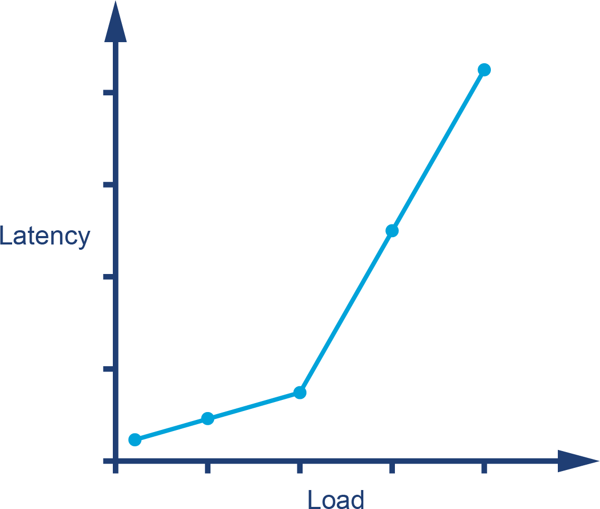
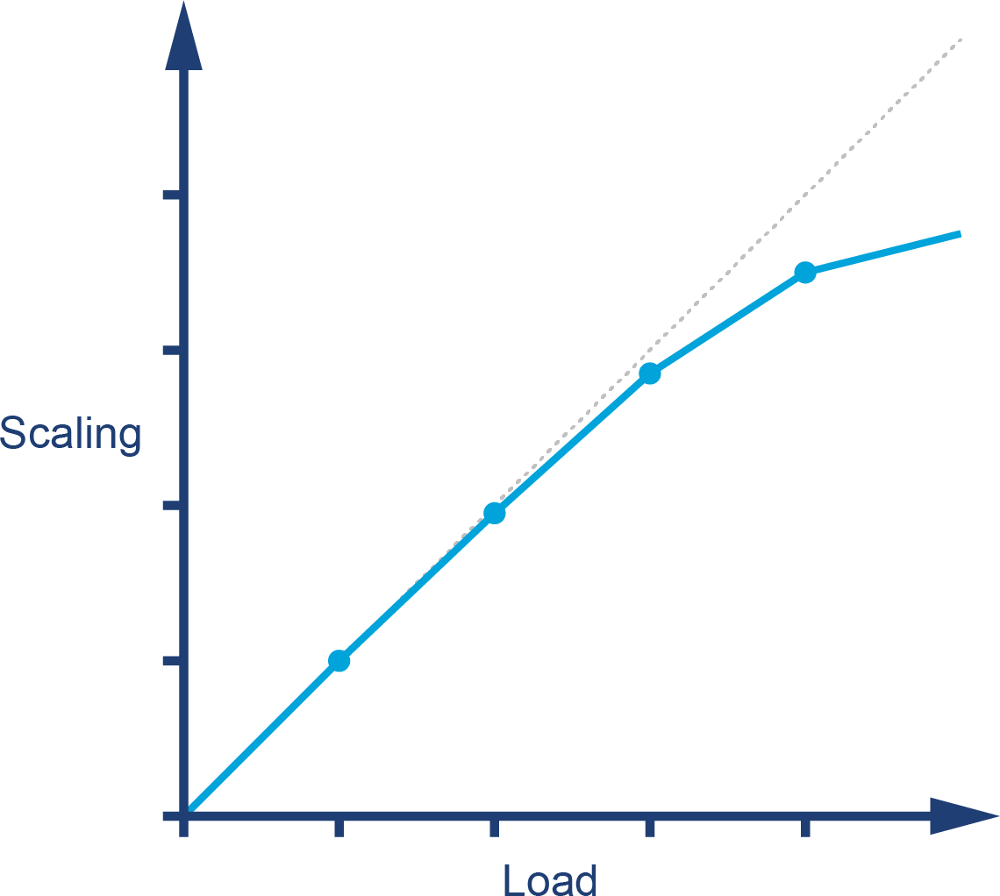
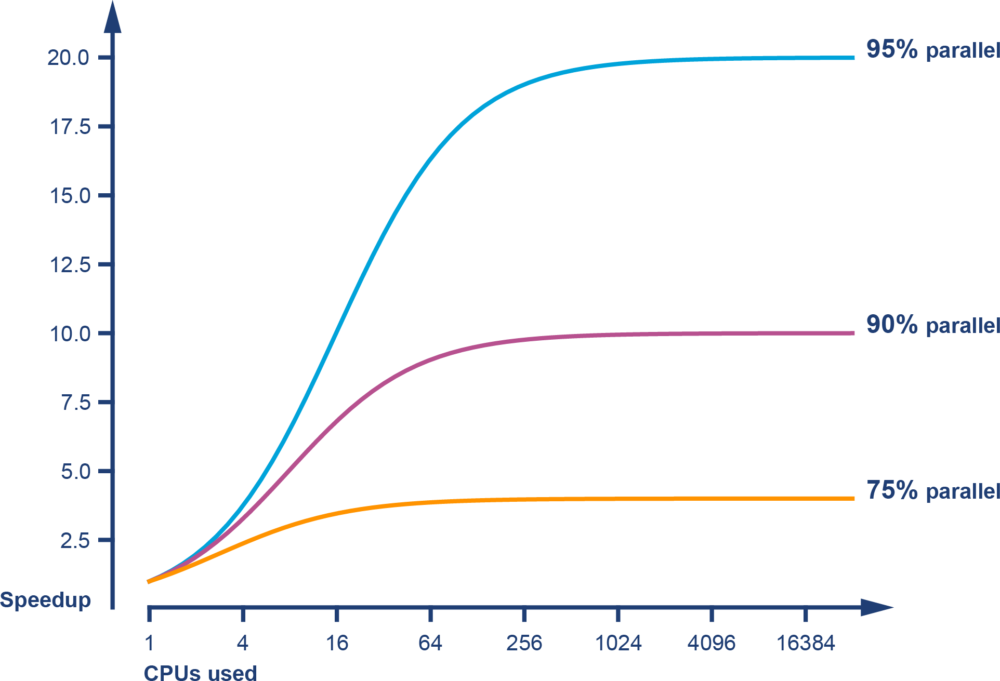
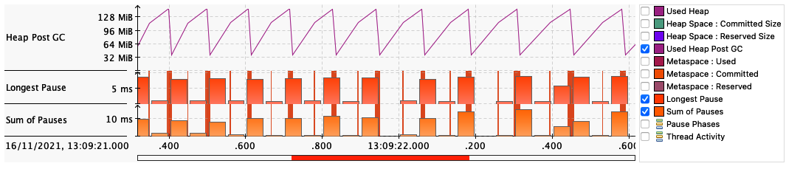
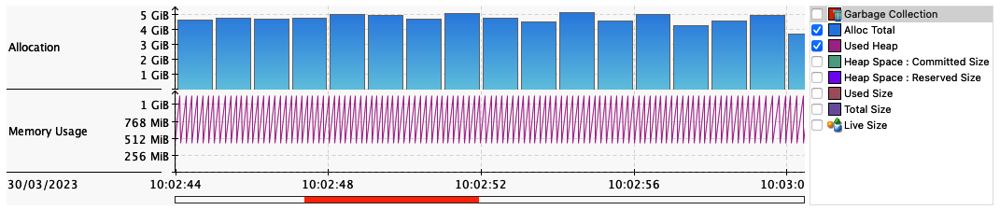
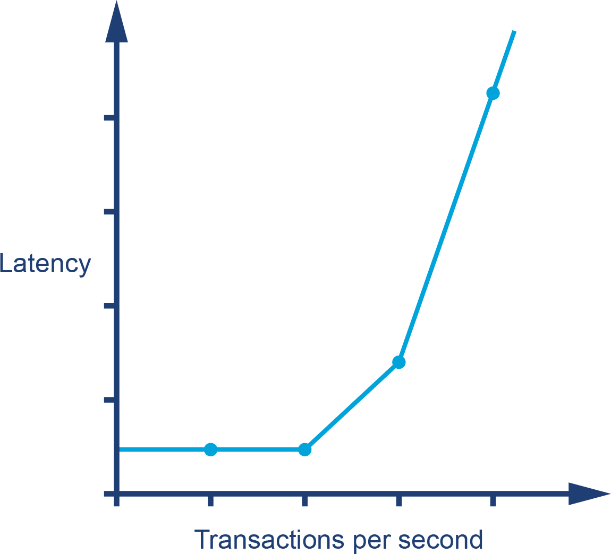

# Chương 1. Định nghĩa về Tối ưu hóa và Hiệu năng

Tối ưu hóa hiệu năng của Java (hay bất kỳ loại mã nguồn nào khác) thường được xem như một môn nghệ thuật huyền bí. Có một sự thần bí bao quanh việc phân tích hiệu năng — nó thường được nhìn nhận như một nghề thủ công được thực hành bởi "gã hacker đơn độc, dằn vặt và trầm tư" (một trong những hình tượng ưa thích của Hollywood về máy tính và những người vận hành chúng). Hình ảnh đó là về một cá nhân đơn lẻ có thể nhìn thấu vào bên trong hệ thống và đưa ra một giải pháp thần kỳ khiến hệ thống chạy nhanh hơn.

Hình ảnh này thường đi kèm với một tình huống đáng tiếc (nhưng lại quá phổ biến), khi hiệu năng chỉ là mối quan tâm hạng hai của các đội phát triển phần mềm. Điều này tạo ra kịch bản mà việc phân tích chỉ được thực hiện khi hệ thống đã gặp rắc rối và cần một "người hùng" hiệu năng ra tay cứu vãn. Tuy nhiên, thực tế lại có phần khác biệt.

Sự thật là phân tích hiệu năng là một sự pha trộn kỳ lạ giữa chủ nghĩa thực nghiệm cứng rắn và tâm lý học con người mềm dẻo. Điều quan trọng, cùng một lúc, là các con số tuyệt đối của những metric quan sát được, và cảm nhận của người dùng cuối cùng như các bên liên quan về chúng. Việc giải quyết nghịch lý bề ngoài này chính là chủ đề của phần còn lại của cuốn sách.

Kể từ khi ấn bản đầu tiên được xuất bản, tình hình này chỉ càng trở nên gay gắt hơn. Khi ngày càng nhiều workload chuyển lên cloud, và khi các hệ thống ngày càng phức tạp, thứ hỗn hợp kỳ lạ kết hợp nhiều yếu tố rất khác nhau này lại càng trở nên quan trọng và phổ biến hơn. "Phạm vi quan tâm" (domain of concern) mà một kỹ sư quan tâm đến hiệu năng cần hoạt động trong đó vẫn tiếp tục mở rộng.

Lý do là vì các hệ thống production đã trở nên phức tạp hơn nữa. Nhiều hệ thống trong số đó giờ đây có các khía cạnh của hệ phân tán (distributed system) cần cân nhắc, bên cạnh hiệu năng của từng tiến trình ứng dụng riêng lẻ. Khi kiến trúc hệ thống trở nên lớn hơn và phức tạp hơn, số lượng kỹ sư buộc phải quan tâm đến hiệu năng cũng tăng theo.

Ấn bản mới của cuốn sách này đáp ứng những thay đổi đó trong ngành của chúng ta bằng cách cung cấp bốn thứ:

- Một phần đào sâu cần thiết về hiệu năng của mã ứng dụng chạy bên trong một Java Virtual Machine (JVM) đơn lẻ
- Thảo luận về nội tại (internals) của JVM
- Chi tiết về cách cloud stack hiện đại tương tác với các ứng dụng Java/JVM
- Cái nhìn đầu tiên về hành vi của các ứng dụng Java chạy trên một cluster trong môi trường cloud

Trong chương này, chúng ta sẽ khởi động bằng cách dựng bối cảnh với một số định nghĩa và thiết lập một khung tư duy về cách chúng ta nói về hiệu năng — bắt đầu từ một số vấn đề và cạm bẫy vốn gây phiền toái cho nhiều cuộc thảo luận về hiệu năng Java.

## Hiệu năng Java theo cách sai lầm

Trong nhiều năm, một trong ba kết quả hàng đầu trên Google cho từ khóa "Java performance tuning" là một bài viết từ năm 1997–8, vốn đã được đưa vào chỉ mục (index) từ rất sớm trong lịch sử của Google. Trang này có lẽ đã ở gần đầu bảng xếp hạng bởi vì thứ hạng ban đầu của nó chủ động dẫn traffic đến trang, tạo thành một vòng lặp phản hồi (feedback loop).

Trang đó chứa những lời khuyên hoàn toàn lỗi thời, không còn đúng nữa, và trong nhiều trường hợp còn gây hại cho ứng dụng. Tuy nhiên, vị trí ưu ái của nó trong kết quả tìm kiếm đã khiến rất, rất nhiều lập trình viên tiếp xúc với những lời khuyên tồi tệ.

Ví dụ, các phiên bản Java rất sơ khai có hiệu năng method dispatch cực kỳ tệ. Như một cách khắc phục, một số lập trình viên Java khuyến khích tránh viết các method nhỏ mà thay vào đó viết những method khổng lồ. Tất nhiên, theo thời gian, hiệu năng của virtual dispatch đã cải thiện rất nhiều.

Không chỉ vậy, với các công nghệ JVM hiện đại (đặc biệt là automatic managed inlining), virtual dispatch giờ đây đã bị loại bỏ tại một số lượng lớn — thậm chí có thể là phần lớn — các call site. Mã nguồn tuân theo lời khuyên "gộp mọi thứ vào một method" giờ đây ở thế bất lợi đáng kể, vì nó rất không thân thiện với các trình biên dịch just-in-time (JIT) hiện đại.

Không có cách nào để biết được bao nhiêu thiệt hại đã gây ra cho hiệu năng của những ứng dụng chịu ảnh hưởng bởi lời khuyên tồi này, nhưng trường hợp trên minh họa gọn ghẽ mối nguy của việc không sử dụng cách tiếp cận định lượng và có thể kiểm chứng đối với hiệu năng. Nó cũng cung cấp thêm một ví dụ tuyệt vời nữa cho việc tại sao bạn không nên tin mọi thứ mình đọc trên internet.

> **GHI CHÚ**
>
> Tốc độ thực thi của mã Java mang tính động rất cao và về cơ bản phụ thuộc vào Java virtual machine nằm bên dưới. Một đoạn mã Java cũ hoàn toàn có thể chạy nhanh hơn trên một JVM mới hơn, ngay cả khi không biên dịch lại mã nguồn Java.

Như bạn có thể hình dung, vì lý do này (và những lý do khác chúng ta sẽ bàn sau), cuốn sách này không phải là một cuốn "cookbook" các mẹo hiệu năng để áp dụng vào mã của bạn. Thay vào đó, chúng ta tập trung vào một loạt khía cạnh kết hợp lại với nhau để tạo nên kỹ thuật hiệu năng (performance engineering) tốt:

- Phương pháp luận về hiệu năng trong toàn bộ vòng đời phần mềm
- Lý thuyết kiểm thử áp dụng cho hiệu năng
- Đo lường, thống kê và công cụ
- Kỹ năng phân tích (cả hệ thống lẫn dữ liệu)
- Công nghệ và cơ chế nền tảng

Bằng cách kết hợp các khía cạnh này lại với nhau, mục tiêu là giúp bạn xây dựng một hiểu biết có thể áp dụng rộng rãi cho bất kỳ tình huống hiệu năng nào bạn có thể gặp phải.

Ở phần sau của cuốn sách, chúng tôi sẽ giới thiệu một số heuristic và kỹ thuật tối ưu hóa ở mức mã nguồn, nhưng tất cả đều đi kèm những cảnh báo và đánh đổi (tradeoff) mà lập trình viên cần nhận thức được trước khi sử dụng chúng.

> **MẸO**
>
> Xin đừng nhảy cóc đến các phần đó và bắt đầu áp dụng những kỹ thuật được trình bày chi tiết mà không hiểu đúng bối cảnh mà lời khuyên được đưa ra. Tất cả những kỹ thuật này đều có khả năng gây hại nhiều hơn lợi nếu bạn thiếu hiểu biết đúng đắn về việc chúng nên được áp dụng như thế nào — và tại sao.

Nhìn chung, không hề có:

- Công tắc thần kỳ "chạy nhanh hơn" nào cho JVM
- "Mẹo và thủ thuật" nào khiến Java chạy nhanh hơn
- Thuật toán bí mật nào bị giấu khỏi bạn

Khi khám phá chủ đề này, chúng ta sẽ thảo luận chi tiết hơn về những quan niệm sai lầm đó, cùng với một số sai lầm phổ biến khác mà lập trình viên thường mắc phải khi tiếp cận việc phân tích hiệu năng Java và các vấn đề liên quan.

Vẫn còn ở đây chứ? Tốt. Vậy thì hãy cùng nói về hiệu năng.

## Tổng quan về hiệu năng Java

Để hiểu tại sao hiệu năng Java lại như hiện nay, hãy bắt đầu bằng việc xem xét một câu nói kinh điển của James Gosling, cha đẻ của Java:

> Java là một ngôn ngữ "cổ cồn xanh" (blue collar). Nó không phải là chất liệu cho luận án tiến sĩ, mà là một ngôn ngữ để làm việc.[^1]
>
> — James Gosling

Nghĩa là, Java luôn là một ngôn ngữ cực kỳ thực dụng. Thái độ ban đầu của nó đối với hiệu năng là: miễn môi trường đủ nhanh, thì hiệu năng thô có thể được hy sinh nếu năng suất của lập trình viên được hưởng lợi. Do đó, phải đến khoảng năm 2005, với sự trưởng thành và tinh vi ngày càng tăng của các JVM như HotSpot, môi trường Java mới trở nên phù hợp cho các ứng dụng tính toán hiệu năng cao.

Tính thực dụng này thể hiện theo nhiều cách trong nền tảng Java, nhưng một trong những biểu hiện rõ ràng nhất là việc sử dụng các *managed subsystem* (hệ thống con được quản lý). Ý tưởng là lập trình viên từ bỏ một số khía cạnh của việc kiểm soát ở mức thấp để đổi lấy việc không phải lo lắng về một số chi tiết của năng lực đang được quản lý.

Ví dụ rõ ràng nhất, tất nhiên, là quản lý bộ nhớ. JVM cung cấp quản lý bộ nhớ tự động dưới dạng một hệ thống con garbage collection có thể thay thế được (thường gọi tắt là GC), nhờ đó bộ nhớ không phải được theo dõi thủ công bởi lập trình viên.

> **GHI CHÚ**
>
> Các managed subsystem xuất hiện xuyên suốt JVM, và sự tồn tại của chúng đưa thêm độ phức tạp vào hành vi lúc chạy (runtime behavior) của các ứng dụng JVM.

Như chúng ta sẽ thảo luận ở phần tiếp theo, hành vi runtime phức tạp của các ứng dụng JVM đòi hỏi chúng ta phải đối xử với ứng dụng của mình như những thí nghiệm đang được kiểm định. Điều này dẫn chúng ta đến việc suy nghĩ về mặt thống kê của các phép đo quan sát được, và ở đây chúng ta có một phát hiện không mấy vui vẻ.

Các phép đo hiệu năng quan sát được của ứng dụng JVM rất thường xuyên *không* tuân theo phân phối chuẩn (normal distribution). Điều này có nghĩa là các kỹ thuật thống kê sơ đẳng (đặc biệt là độ lệch chuẩn và phương sai, chẳng hạn) không phù hợp để xử lý kết quả từ ứng dụng JVM. Lý do là vì nhiều phương pháp thống kê cơ bản chứa một giả định ngầm về tính chuẩn của phân phối kết quả.

Một cách để hiểu điều này là: với ứng dụng JVM, các giá trị ngoại lai (outlier) có thể rất quan trọng — ví dụ với một ứng dụng giao dịch low-latency hoặc hệ thống đặt vé. Điều này có nghĩa việc lấy mẫu (sampling) các phép đo cũng có vấn đề, vì nó rất dễ bỏ sót chính những sự kiện có tầm quan trọng lớn nhất.

Cuối cùng, một lời cảnh báo. Rất dễ bị đánh lừa bởi các phép đo hiệu năng Java. Độ phức tạp của môi trường có nghĩa là rất khó để cô lập từng khía cạnh riêng lẻ của hệ thống.

Việc đo lường cũng có chi phí phụ trội (overhead), và việc lấy mẫu thường xuyên (hoặc ghi lại mọi kết quả) có thể tạo ra tác động quan sát được lên chính những con số hiệu năng đang được ghi nhận. Bản chất của các con số hiệu năng Java đòi hỏi một mức độ tinh tế nhất định về thống kê, và các kỹ thuật ngây thơ thường xuyên tạo ra kết quả sai khi áp dụng cho ứng dụng Java/JVM.

Những mối quan tâm này cũng vang vọng sang lĩnh vực ứng dụng cloud native. Việc quản lý ứng dụng một cách tự động đã trở thành một phần rất lớn của trải nghiệm cloud native — đặc biệt với sự trỗi dậy của các công nghệ orchestration như Kubernetes. Nhu cầu cân bằng giữa chi phí thu thập dữ liệu với nhu cầu thu thập đủ dữ liệu để đưa ra kết luận cũng là một mối quan tâm kiến trúc quan trọng đối với ứng dụng cloud native — chúng ta sẽ nói nhiều hơn về điều đó ở Chương 10.

## Hiệu năng như một khoa học thực nghiệm

Bức tranh tổng quát ban đầu bạn nên có là: JVM là một nền tảng nhanh (và nhìn chung ngày càng nhanh hơn qua mỗi bản phát hành), nhưng bất chấp điều đó, các ứng dụng Java vẫn có thể chậm. Đó là bởi vì các software stack Java/JVM, cũng như hầu hết các hệ thống phần mềm hiện đại, rất phức tạp.

Trên thực tế, do bản chất tối ưu hóa cao và thích ứng của JVM, các hệ thống production xây dựng trên nền JVM có thể có những hành vi hiệu năng tinh vi và phức tạp. Độ phức tạp này trở nên khả thi nhờ định luật Moore và sự tăng trưởng chưa từng có về năng lực phần cứng mà nó đại diện.

> Thành tựu đáng kinh ngạc nhất của ngành công nghiệp phần mềm máy tính là việc nó liên tục triệt tiêu những bước tiến đều đặn và đáng kinh ngạc mà ngành công nghiệp phần cứng máy tính đạt được.
>
> — Henry Petroski (được cho là)

Trong khi một số hệ thống phần mềm đã phung phí những thành quả lịch sử của ngành, JVM đại diện cho một chiến thắng về mặt kỹ thuật. Kể từ khi ra đời vào cuối những năm 1990, JVM đã phát triển thành một môi trường thực thi đa dụng, hiệu năng rất cao, tận dụng những thành quả đó một cách rất hiệu quả.

Tuy nhiên, sự đánh đổi là: giống như bất kỳ hệ thống phức tạp, hiệu năng cao nào, JVM đòi hỏi một mức độ kỹ năng và kinh nghiệm nhất định để khai thác được tối đa.

> Một phép đo không được định nghĩa rõ ràng còn tệ hơn là vô dụng.[^2]
>
> — Eli Goldratt

Do đó, việc tinh chỉnh (tuning) hiệu năng JVM là sự tổng hợp giữa công nghệ, phương pháp luận, các đại lượng đo được và công cụ. Mục tiêu của nó là tạo ra những kết quả đầu ra đo lường được theo cách mà chủ sở hữu hoặc người dùng hệ thống mong muốn. Nói cách khác, hiệu năng là một khoa học thực nghiệm — nó đạt được kết quả mong muốn bằng cách:

1. Định nghĩa kết quả mong muốn
2. Đo lường hệ thống hiện tại
3. Xác định những gì cần làm để đạt được yêu cầu
4. Tiến hành một đợt cải tiến
5. Kiểm thử lại
6. Xác định xem mục tiêu đã đạt được hay chưa

Quá trình định nghĩa và xác định các kết quả hiệu năng mong muốn sẽ xây dựng nên một tập hợp các mục tiêu định lượng. Việc thiết lập những gì cần đo và ghi lại các mục tiêu là rất quan trọng; chúng sau đó trở thành một phần của các artifact và deliverable của dự án. Từ đây, ta có thể thấy rằng phân tích hiệu năng dựa trên việc định nghĩa, rồi đạt được, các yêu cầu phi chức năng (nonfunctional requirement).

Quá trình này, như đã nói trước, không phải là việc diễn giải những điềm báo bí ẩn. Thay vào đó, chúng ta dựa vào thống kê và cách xử lý (cũng như diễn giải) kết quả một cách phù hợp.

Trong chương này, chúng ta thảo luận về những kỹ thuật này khi áp dụng cho một JVM đơn lẻ. Ở Chương 2, chúng tôi sẽ giới thiệu phần nhập môn về các kỹ thuật thống kê cơ bản cần thiết để xử lý chính xác dữ liệu sinh ra từ một dự án phân tích hiệu năng JVM. Sau đó, chủ yếu ở Chương 10, chúng ta sẽ thảo luận cách các kỹ thuật này được tổng quát hóa cho một ứng dụng dạng cluster và làm nảy sinh khái niệm observability (khả năng quan sát).

Cần nhận thức rằng, với nhiều dự án thực tế, chắc chắn sẽ cần một hiểu biết tinh vi hơn về dữ liệu và thống kê. Do đó, bạn được khuyến khích xem các kỹ thuật thống kê trong cuốn sách này như một điểm khởi đầu, thay vì một tuyên bố dứt khoát.

## Một hệ phân loại cho hiệu năng

Trong phần này, chúng tôi giới thiệu một số đại lượng quan sát được cơ bản dùng cho phân tích hiệu năng. Chúng cung cấp một bộ từ vựng cho phân tích hiệu năng và sẽ cho phép bạn đóng khung các mục tiêu của một dự án tuning theo ngôn ngữ định lượng. Những mục tiêu này chính là các yêu cầu phi chức năng định nghĩa nên các mục tiêu hiệu năng. Lưu ý rằng các đại lượng này không nhất thiết có sẵn trực tiếp trong mọi trường hợp, và một số có thể đòi hỏi chút công sức để thu được từ các con số thô lấy ra từ hệ thống.

Một tập hợp cơ bản phổ biến của các đại lượng hiệu năng quan sát được là:

- Throughput (thông lượng)
- Latency (độ trễ)
- Capacity (dung lượng xử lý)
- Utilization (mức độ sử dụng)
- Efficiency (hiệu suất)
- Scalability (khả năng mở rộng)
- Degradation (sự suy giảm)

Chúng ta sẽ lần lượt thảo luận ngắn gọn từng đại lượng. Lưu ý rằng với hầu hết các dự án hiệu năng, không phải mọi metric đều được tối ưu hóa đồng thời. Trường hợp chỉ có một vài metric được cải thiện trong một vòng lặp hiệu năng là phổ biến hơn nhiều, và đó có lẽ cũng là số lượng tối đa có thể tinh chỉnh cùng lúc. Trong các dự án thực tế, rất có thể việc tối ưu một metric lại gây tổn hại cho một metric hoặc một nhóm metric khác.

### Throughput

Throughput là một metric biểu diễn tốc độ làm việc mà một hệ thống hoặc hệ thống con có thể thực hiện. Nó thường được biểu diễn dưới dạng số đơn vị công việc trong một khoảng thời gian nào đó. Ví dụ, chúng ta có thể quan tâm đến việc một hệ thống có thể thực thi bao nhiêu giao dịch mỗi giây.

Để con số throughput có ý nghĩa trong một bài toán hiệu năng thực tế, nó nên bao gồm mô tả về nền tảng tham chiếu (reference platform) mà nó được đo trên đó. Ví dụ, cấu hình phần cứng, OS và software stack đều liên quan đến throughput, cũng như việc hệ thống đang được kiểm thử là một server đơn lẻ hay một cluster. Ngoài ra, các giao dịch (hoặc đơn vị công việc) phải giống nhau giữa các lần kiểm thử. Về cơ bản, chúng ta nên tìm cách đảm bảo rằng workload cho các bài test throughput được giữ nhất quán giữa các lần chạy.

Các metric hiệu năng đôi khi được giải thích qua những phép ẩn dụ gợi liên tưởng đến ống nước. Nếu áp dụng góc nhìn này, thì nếu một ống nước có thể tạo ra một trăm lít mỗi giây, thì thể tích tạo ra trong một giây (một trăm lít) chính là throughput. Lưu ý rằng giá trị này là một hàm của tốc độ dòng nước và tiết diện ngang của ống.

### Latency

Tiếp tục phép ẩn dụ ở phần trước — latency là khoảng thời gian một lít nước cần để đi hết chiều dài ống. Đây là hàm của cả chiều dài ống lẫn tốc độ nước chảy qua nó. Tuy nhiên, nó *không* phải là hàm của đường kính ống.

Trong phần mềm, latency thường được nêu dưới dạng thời gian end-to-end — thời gian cần để xử lý một giao dịch đơn lẻ và thấy được kết quả. Nó phụ thuộc vào workload, nên một cách tiếp cận phổ biến là tạo ra một đồ thị biểu diễn latency như một hàm của workload tăng dần. Chúng ta sẽ thấy ví dụ về loại đồ thị này ở phần "Đọc đồ thị hiệu năng".

### Capacity

Capacity là mức độ song song (work parallelism) mà một hệ thống sở hữu — tức là số đơn vị công việc (ví dụ: giao dịch) có thể đồng thời diễn ra trong hệ thống.

Capacity rõ ràng có liên quan đến throughput, và chúng ta nên kỳ vọng rằng khi tải đồng thời (concurrent load) lên hệ thống tăng, throughput (và latency) sẽ bị ảnh hưởng. Vì lý do này, capacity thường được nêu dưới dạng khả năng xử lý sẵn có tại một giá trị latency hoặc throughput cho trước.

Ví dụ, nếu chúng ta có một bể chứa lớn ở đầu ống, điều đó sẽ làm tăng capacity nhưng không tăng throughput tổng thể. Ngược lại, nếu chúng ta có một đầu vào rất hẹp dẫn vào ống, rồi ống mới mở rộng ra, thì capacity sẽ nhỏ, bởi vì đầu vào đóng vai trò một điểm nghẽn (choke point).

### Utilization

Một trong những nhiệm vụ phân tích hiệu năng phổ biến nhất là đạt được việc sử dụng hiệu quả tài nguyên của hệ thống. Lý tưởng nhất, CPU nên được dùng để xử lý các đơn vị công việc thay vì nhàn rỗi (hoặc dành thời gian xử lý các tác vụ của OS hay các công việc dọn dẹp khác).

Tùy thuộc vào workload, có thể có sự chênh lệch rất lớn giữa mức utilization của các tài nguyên khác nhau. Ví dụ, một workload nặng về tính toán (như xử lý đồ họa hay mã hóa) có thể chạy ở gần 100% CPU nhưng chỉ dùng một phần nhỏ bộ nhớ khả dụng.

Bên cạnh CPU, các loại tài nguyên khác — như mạng, bộ nhớ, và (đôi khi) hệ thống con storage I/O — đang trở thành những tài nguyên quan trọng cần quản lý trong ứng dụng cloud native. Với nhiều ứng dụng, bộ nhớ bị "lãng phí" nhiều hơn CPU, và với nhiều microservice, lưu lượng mạng đã trở thành nút thắt cổ chai thực sự.

Trong kịch bản ống nước có đầu vào hẹp, mặc dù phần lớn ống có throughput lớn, mức utilization tổng thể lại thấp (nên mực nước trong ống sẽ thấp) do hạn chế về capacity mà đầu vào bị thu hẹp gây ra.

### Efficiency

Chia throughput của một hệ thống cho lượng tài nguyên đã sử dụng sẽ cho ta một thước đo về hiệu suất tổng thể của hệ thống. Về mặt trực giác, điều này hợp lý, bởi việc cần nhiều tài nguyên hơn để tạo ra cùng một throughput chính là một định nghĩa hữu ích về việc kém hiệu quả hơn.

Khi làm việc với các hệ thống lớn hơn, cũng có thể dùng một dạng hạch toán chi phí để đo hiệu suất. Nếu giải pháp A có tổng chi phí sở hữu (total cost of ownership — TCO) gấp đôi giải pháp B cho cùng một throughput, thì rõ ràng nó chỉ hiệu quả bằng một nửa.

### Scalability

Throughput hoặc capacity của một hệ thống, tất nhiên, phụ thuộc vào tài nguyên sẵn có để xử lý. Scalability của một hệ thống hoặc ứng dụng có thể được định nghĩa theo nhiều cách — nhưng một định nghĩa hữu ích là sự thay đổi của throughput khi tài nguyên được bổ sung. Chén thánh của khả năng mở rộng hệ thống là để throughput thay đổi đúng nhịp với tài nguyên.

Hãy xét một hệ thống dựa trên một cluster gồm nhiều server. Nếu cluster được mở rộng, ví dụ tăng gấp đôi quy mô, thì throughput nào có thể đạt được? Nếu cluster mới có thể xử lý gấp đôi khối lượng giao dịch, thì hệ thống đang thể hiện "khả năng mở rộng tuyến tính hoàn hảo" (perfect linear scaling). Điều này rất khó đạt được trên thực tế, đặc biệt trên một dải rộng các mức tải có thể xảy ra.

Scalability của hệ thống phụ thuộc vào nhiều yếu tố và thường không phải là một quan hệ tuyến tính đơn giản. Rất phổ biến việc một hệ thống mở rộng gần như tuyến tính trong một khoảng tài nguyên nào đó, nhưng rồi ở mức tải cao hơn lại gặp phải một giới hạn nào đó ngăn cản việc scale hoàn hảo.

### Degradation

Nếu chúng ta tăng tải lên hệ thống, hoặc bằng cách tăng tốc độ đến của các request hoặc tăng kích thước từng request, thì chúng ta có thể thấy sự thay đổi về latency và/hoặc throughput quan sát được.

Lưu ý rằng sự thay đổi này phụ thuộc vào utilization. Nếu hệ thống chưa được sử dụng hết, thì sẽ có một khoảng dư trước khi các đại lượng quan sát được thay đổi, nhưng nếu tài nguyên đã được dùng hết công suất, thì chúng ta kỳ vọng thấy throughput ngừng tăng hoặc latency tăng lên. Những thay đổi này thường được gọi là sự *degradation* (suy giảm) của hệ thống dưới tải bổ sung.

Degradation cũng phụ thuộc vào độ vững chắc của kiến trúc hệ thống. Ví dụ, nếu ống nước được làm bằng cùng chất liệu với bóng bay trẻ em, thì sự suy giảm dưới tải sẽ khá thảm khốc. Một khi tải tăng vượt một mức nhất định, throughput sẽ về không.

Mặt khác, một hệ thống vững chắc hơn sẽ cho thấy một kịch bản suy giảm thực tế hơn. Ví dụ, các chỗ rò rỉ xuất hiện và tệ dần khi áp suất tăng, hoặc các request bị từ chối trước khi đi vào hệ thống, tương tự như việc vặn vòi quá mạnh khiến nước bắn ra ngoài mà không vào được ống.

### Mối tương quan giữa các đại lượng quan sát được

Hành vi của các đại lượng hiệu năng quan sát được thường liên kết với nhau theo cách nào đó. Chi tiết của mối liên kết này sẽ phụ thuộc vào việc hệ thống có đang chạy ở mức đỉnh (peak) hay không.

Ví dụ, nhìn chung, utilization sẽ thay đổi khi tải lên hệ thống tăng. Tuy nhiên, nếu hệ thống chưa được sử dụng hết, thì việc tăng tải có thể không làm tăng utilization một cách đáng kể. Ngược lại, nếu hệ thống đã bị căng thẳng, thì tác động của việc tăng tải có thể sẽ thể hiện ở một đại lượng quan sát được khác.

Một ví dụ khác: scalability và degradation đều biểu diễn sự thay đổi hành vi của hệ thống khi tải được bổ sung. Với scalability, khi tải tăng thì tài nguyên khả dụng cũng tăng, và câu hỏi trung tâm là liệu hệ thống có sử dụng được chúng hay không. Mặt khác, nếu tải được bổ sung nhưng tài nguyên bổ sung không được cung cấp, thì sự degradation của một đại lượng hiệu năng nào đó (ví dụ latency) là kết quả được kỳ vọng.

> **GHI CHÚ**
>
> Trong những trường hợp hiếm gặp, tải bổ sung có thể gây ra kết quả phản trực giác. Ví dụ, nếu sự thay đổi về tải khiến một phần nào đó của hệ thống chuyển sang chế độ tốn tài nguyên hơn nhưng hiệu năng cao hơn, thì tác động tổng thể có thể là giảm latency, ngay cả khi nhiều request hơn đang được tiếp nhận.

Lấy một ví dụ, ở Chương 6 chúng ta sẽ thảo luận chi tiết về trình biên dịch JIT của HotSpot. Để được coi là đủ điều kiện cho việc biên dịch JIT, một method phải được thực thi ở chế độ interpreted "đủ thường xuyên". Vì vậy, ở mức tải thấp, có thể có những method quan trọng bị mắc kẹt ở chế độ interpreted, nhưng chúng lại trở nên đủ điều kiện để biên dịch ở mức tải cao hơn do tần suất gọi tăng lên. Điều này khiến các lời gọi sau đó đến cùng method chạy nhanh hơn rất, rất nhiều so với những lần thực thi trước đó.

Các workload khác nhau có thể có những đặc tính rất khác nhau. Ví dụ, một giao dịch trên thị trường tài chính, nhìn từ đầu đến cuối, có thể có thời gian thực thi (tức latency) tính bằng giờ hoặc thậm chí hàng ngày. Tuy nhiên, hàng triệu giao dịch như vậy có thể đang diễn ra tại một ngân hàng lớn ở bất kỳ thời điểm nào. Do đó, capacity của hệ thống là rất lớn, nhưng latency cũng lớn.

Tuy nhiên, hãy chỉ xét một hệ thống con đơn lẻ bên trong ngân hàng. Việc khớp giữa bên mua và bên bán (về cơ bản là các bên thỏa thuận về giá) được gọi là *order matching* (khớp lệnh). Hệ thống con riêng lẻ này có thể chỉ có hàng trăm lệnh đang chờ tại bất kỳ thời điểm nào, nhưng latency từ lúc chấp nhận lệnh đến lúc khớp xong có thể chỉ là một mili-giây (hoặc thậm chí ít hơn trong trường hợp giao dịch "low-latency").

Trong phần này, chúng ta đã gặp những đại lượng hiệu năng quan sát được thường gặp nhất. Đôi khi các định nghĩa hơi khác, hoặc thậm chí các metric khác, được sử dụng, nhưng trong hầu hết trường hợp đây sẽ là các con số hệ thống cơ bản thường được dùng để định hướng việc tinh chỉnh hiệu năng và đóng vai trò một hệ phân loại để thảo luận về hiệu năng của các hệ thống quan tâm.

## Đọc đồ thị hiệu năng

Để kết thúc chương này, hãy cùng xem một số mẫu hành vi phổ biến xuất hiện trong các bài test hiệu năng. Chúng ta sẽ khám phá chúng bằng cách nhìn vào đồ thị của các đại lượng quan sát được trong thực tế, và chúng ta sẽ gặp nhiều ví dụ khác về đồ thị dữ liệu khi đi tiếp.

Đồ thị trong Hình 1-1 cho thấy sự suy giảm hiệu năng đột ngột, ngoài dự kiến (trong trường hợp này là latency) dưới tải tăng dần — thường được gọi là *performance elbow* (khuỷu tay hiệu năng).

*Hình 1-1. Một performance elbow*

Ngược lại, Hình 1-2 cho thấy trường hợp đáng mừng hơn nhiều: throughput scale gần như tuyến tính khi thêm máy vào cluster. Đây là hành vi gần như lý tưởng và chỉ có khả năng đạt được trong những điều kiện cực kỳ thuận lợi — ví dụ, scale một giao thức stateless không cần session affinity với một server cụ thể.

*Hình 1-2. Scaling gần tuyến tính*

Ở Chương 13, chúng ta sẽ gặp định luật Amdahl (Amdahl's law), được đặt theo tên nhà khoa học máy tính nổi tiếng (và "cha đẻ của mainframe") Gene Amdahl của IBM. Hình 1-3 thể hiện dưới dạng đồ thị ràng buộc cơ bản của ông về khả năng mở rộng: mức tăng tốc tối đa có thể đạt được như một hàm của số bộ xử lý dành cho tác vụ.

*Hình 1-3. Định luật Amdahl*

Chúng tôi hiển thị ba trường hợp: khi tác vụ nền tảng có thể song song hóa 75%, 90% và 95%. Điều này cho thấy rõ rằng bất cứ khi nào workload có bất kỳ phần nào phải thực hiện tuần tự, thì khả năng mở rộng tuyến tính là không thể, và có những giới hạn nghiêm ngặt về mức độ scalability có thể đạt được. Điều này biện minh cho nhận xét quanh Hình 1-2 — ngay cả trong những trường hợp tốt nhất, khả năng mở rộng tuyến tính gần như là bất khả thi.

Các giới hạn do định luật Amdahl áp đặt chặt chẽ đến bất ngờ. Đặc biệt lưu ý rằng trục x của đồ thị là thang logarit, nên ngay cả với một thuật toán song song hóa được 95% (và do đó chỉ 5% tuần tự), cần đến 32 bộ xử lý để đạt được mức tăng tốc gấp 12 lần. Tệ hơn nữa, dù dùng bao nhiêu core đi chăng nữa, mức tăng tốc tối đa cho thuật toán đó cũng chỉ là 20 lần. Trên thực tế, nhiều thuật toán tuần tự hơn 5% rất nhiều, nên chúng có mức tăng tốc tối đa còn bị giới hạn hơn.

Một chủ đề phổ biến khác của các đồ thị hiệu năng trong hệ thống phần mềm là mức sử dụng bộ nhớ. Như chúng ta sẽ thấy ở Chương 4, công nghệ nền tảng trong hệ thống con garbage collection của JVM một cách tự nhiên tạo ra mẫu "răng cưa" (sawtooth) của bộ nhớ được sử dụng đối với những ứng dụng khỏe mạnh, không bị căng thẳng. Chúng ta có thể thấy một ví dụ ở Hình 1-4, là ảnh chụp cận cảnh từ công cụ JDK Mission Control (JMC) do Eclipse Adoptium cung cấp.

*Hình 1-4. Mức sử dụng bộ nhớ khỏe mạnh*

Một metric hiệu năng then chốt của JVM là *allocation rate* (tốc độ cấp phát) — thực chất là tốc độ nó có thể tạo ra object mới (tính bằng byte mỗi giây). Chúng ta sẽ nói rất nhiều về khía cạnh này của hiệu năng JVM ở Chương 4 và 5.

Trong Hình 1-5, chúng ta thấy góc nhìn phóng to của allocation rate, cũng được ghi lại từ JMC. Đồ thị này được tạo ra từ một chương trình benchmark cố tình gây căng thẳng cho hệ thống con bộ nhớ của JVM — chúng tôi đã cố khiến JVM đạt mức cấp phát 8 GiB/s, nhưng như ta thấy, điều này vượt quá khả năng của phần cứng, và thay vào đó tốc độ cấp phát tối đa của hệ thống nằm trong khoảng 4 đến 5 GiB/s.

*Hình 1-5. Ví dụ về allocation rate có vấn đề*

Lưu ý rằng việc allocation bị cạn kiệt là một vấn đề khác với việc hệ thống bị rò rỉ tài nguyên (resource leak). Trong trường hợp rò rỉ, thường thấy nó biểu hiện theo cách như Hình 1-6, nơi một đại lượng quan sát được (trong trường hợp này là latency) suy giảm chậm rãi khi tải được tăng dần, trước khi chạm đến một điểm uốn (inflection point) mà tại đó hệ thống suy giảm nhanh chóng.

*Hình 1-6. Latency suy giảm dưới tải cao hơn*

Hãy chuyển sang thảo luận một số điều cần cân nhắc thêm khi làm việc với các hệ thống cloud.

## Hiệu năng trong hệ thống Cloud

Các hệ thống cloud hiện đại gần như luôn là hệ phân tán, theo nghĩa chúng được cấu thành từ một cluster gồm các node (các instance JVM) tương tác với nhau qua tài nguyên mạng chung. Điều này có nghĩa là, bên cạnh toàn bộ độ phức tạp của hệ thống một node, còn có thêm một tầng phức tạp nữa phải giải quyết.

Người vận hành hệ phân tán phải suy nghĩ về những điều như:

- Công việc được phân chia thế nào giữa các node trong cluster?
- Chúng ta triển khai (roll out) một phiên bản phần mềm mới (hoặc cấu hình mới) ra cluster như thế nào?
- Điều gì xảy ra khi một node rời khỏi cluster?
- Điều gì xảy ra khi một node mới tham gia cluster?
- Điều gì xảy ra nếu node mới bị cấu hình sai theo cách nào đó?
- Điều gì xảy ra nếu node mới hành xử khác với phần còn lại của cluster theo cách nào đó?
- Điều gì xảy ra nếu có vấn đề với chính đoạn mã điều khiển cluster?
- Điều gì xảy ra nếu có một sự cố thảm khốc với toàn bộ cluster, hoặc với hạ tầng nào đó mà nó phụ thuộc vào?
- Điều gì xảy ra nếu một thành phần trong hạ tầng mà cluster phụ thuộc vào là tài nguyên hữu hạn và trở thành nút thắt cổ chai cho khả năng mở rộng?

Những mối quan tâm này, mà chúng ta sẽ khám phá đầy đủ ở phần sau của cuốn sách, có tác động lớn đến cách các hệ thống cloud hành xử. Chúng ảnh hưởng đến các đại lượng hiệu năng then chốt như throughput, latency, efficiency và utilization.

Không chỉ vậy, còn có hai khía cạnh rất quan trọng — khác biệt so với trường hợp một JVM đơn lẻ — mà thoạt nhìn có thể không rõ ràng với người mới đến với hệ thống cloud.

Thứ nhất, đơn vị mã có thể triển khai (unit of deployable code) trên cloud là *container* (chúng ta sẽ nói nhiều hơn nữa về điều này sau), chứ không phải tiến trình JVM của ứng dụng (như thời của những server bare-metal to lớn). Cũng đúng rằng nhiều tác động hiệu năng có thể xảy ra là do hành vi nội tại của một cluster gây ra, vốn có thể mờ đục (opaque) đối với kỹ sư.

Chúng ta sẽ thảo luận chi tiết điều này ở Chương 10 khi giải quyết chủ đề observability trong các hệ thống hiện đại và cách triển khai giải pháp cho vấn đề khả năng nhìn thấy (visibility) này.

Thứ hai, mức độ efficiency và utilization trong cách một dịch vụ sử dụng nhà cung cấp cloud có tác động trực tiếp đến chi phí vận hành dịch vụ đó. Sự kém hiệu quả và cấu hình sai có thể thể hiện trong cơ cấu chi phí của một dịch vụ một cách trực tiếp hơn nhiều. Trên thực tế, đây là một cách để nghĩ về sự trỗi dậy của cloud.

Ngày xưa, các đội thường sở hữu server vật lý thật sự trong những khu vực chuyên dụng (thường gọi là *cage*) trong datacenter. Việc mua các server này là chi tiêu vốn (capital expenditure), và server được theo dõi như một tài sản.

Khi chúng ta dùng nhà cung cấp cloud như AWS hay Azure, chúng ta đang thuê thời gian trên những cỗ máy thực sự thuộc sở hữu của các công ty như Amazon hay Microsoft. Đây là chi tiêu vận hành (operational expenditure), và nó là một khoản chi phí (hay nghĩa vụ nợ). Sự dịch chuyển này có nghĩa là các yêu cầu tính toán của hệ thống chúng ta giờ đây bị bộ phận tài chính soi xét kỹ hơn nhiều.

Nhìn chung, điều quan trọng là nhận ra rằng các hệ thống cloud về cơ bản bao gồm các cluster tiến trình (trong trường hợp của chúng ta là các JVM) thay đổi một cách động theo thời gian. Các cluster có thể phình to hoặc thu nhỏ về kích thước, nhưng ngay cả khi không đổi, theo thời gian các tiến trình tham gia vẫn sẽ thay đổi. Điều này tương phản rõ rệt với các hệ thống truyền thống dựa trên host, nơi các tiến trình tạo thành một cluster thường có tuổi thọ dài hơn nhiều và thuộc về một tập hợp host đã biết — và ổn định.

## Tóm tắt

Trong chương này, chúng ta đã bắt đầu thảo luận hiệu năng Java là gì và không phải là gì. Chúng ta đã giới thiệu các chủ đề nền tảng về khoa học thực nghiệm và đo lường, cùng bộ từ vựng và các đại lượng quan sát được cơ bản mà một bài toán hiệu năng tốt sẽ sử dụng. Chúng ta đã giới thiệu một số trường hợp phổ biến thường thấy trong kết quả thu được từ các bài test hiệu năng. Cuối cùng, chúng ta đã giới thiệu những điều cơ bản nhất về loại vấn đề bổ sung có thể phát sinh trong hệ thống cloud.

Hãy đi tiếp và bắt đầu thảo luận một số khía cạnh chính của kiểm thử hiệu năng cũng như cách xử lý các con số được sinh ra từ những bài test đó.

---

[^1]: J. Gosling, "The Feel of Java," *Computer*, vol. 30, no. 6 (June 1997): 53–57.

[^2]: Eliyahu Goldratt và Jeff Cox, *The Goal* (Gower Publishing, 1984).
