# Chương 2. Phương pháp luận Kiểm thử Hiệu năng

Kiểm thử hiệu năng (performance testing) được tiến hành vì nhiều lý do khác nhau. Trong chương này, chúng tôi sẽ giới thiệu các loại bài test hiệu năng khác nhau mà một đội có thể muốn thực hiện, và thảo luận một số best practice cho từng loại kiểm thử con.

Ở phần sau của chương, chúng ta sẽ thảo luận về thống kê — và một số yếu tố con người rất quan trọng — vốn thường bị bỏ qua khi xem xét các vấn đề hiệu năng.

## Các loại kiểm thử hiệu năng

Các bài test hiệu năng thường xuyên được tiến hành vì những lý do sai, hoặc được tiến hành một cách tồi tệ. Nguyên nhân rất đa dạng nhưng thường bắt nguồn từ việc không hiểu bản chất của phân tích hiệu năng và niềm tin rằng "làm gì đó còn hơn không làm gì". Như chúng ta sẽ thấy nhiều lần xuyên suốt cuốn sách, niềm tin này thường chỉ là một nửa sự thật nguy hiểm, ở mức tốt nhất.

Một trong những sai lầm phổ biến hơn cả là nói chung chung về "performance testing" mà không đi vào các chi tiết cụ thể. Trên thực tế, có rất nhiều loại bài test hiệu năng quy mô lớn khác nhau có thể được tiến hành trên một hệ thống.

> **GHI CHÚ**
>
> Các bài test hiệu năng tốt mang tính định lượng. Chúng đặt ra những câu hỏi tạo ra câu trả lời bằng số, có thể được xử lý như đầu ra thực nghiệm và đem đi phân tích thống kê.

Các loại test hiệu năng chúng ta sẽ thảo luận trong cuốn sách này thường có những mục tiêu độc lập (nhưng có phần chồng lấn). Do đó, điều quan trọng là hiểu rõ những câu hỏi định lượng mà bạn đang cố trả lời *trước khi* quyết định loại kiểm thử nào nên được thực hiện.

Điều này không nhất thiết phải phức tạp — chỉ cần viết ra những câu hỏi mà bài test nhằm trả lời là đủ. Tuy nhiên, thông thường nên cân nhắc *tại sao* những bài test này quan trọng với ứng dụng và xác nhận lý do đó với chủ sở hữu ứng dụng (hoặc các khách hàng chủ chốt).

Một số loại test phổ biến nhất, kèm ví dụ câu hỏi cho mỗi loại, như sau:

**Latency test (kiểm thử độ trễ)**
: Thời gian giao dịch end-to-end là bao nhiêu?

**Throughput test (kiểm thử thông lượng)**
: Capacity hiện tại của hệ thống có thể xử lý bao nhiêu giao dịch đồng thời?

**Stress test (kiểm thử áp lực)**
: Điểm gãy (breaking point) của hệ thống là ở đâu?

**Load test (kiểm thử tải)**
: Hệ thống có xử lý được một mức tải cụ thể hay không?

**Endurance test (kiểm thử độ bền)**
: Những bất thường hiệu năng nào được phát hiện khi hệ thống chạy trong thời gian dài?

**Capacity planning test (kiểm thử hoạch định năng lực)**
: Hệ thống có scale như kỳ vọng khi bổ sung tài nguyên hay không?

**Degradation (kiểm thử suy giảm)**
: Điều gì xảy ra khi hệ thống bị lỗi một phần?

Hãy cùng xem xét chi tiết hơn từng loại test này.

### Latency Test

Latency là một trong những loại test hiệu năng phổ biến nhất, bởi nó thường là đại lượng quan sát được của hệ thống mà ban quản lý (và người dùng) rất quan tâm: khách hàng của chúng ta phải chờ bao lâu cho một giao dịch (hoặc một lần tải trang)?

Đây có thể là con dao hai lưỡi, vì tính đơn giản của câu hỏi (mà một latency test tìm cách trả lời) có thể khiến các đội tập trung quá mức vào latency. Điều này, đến lượt nó, có thể khiến đội bỏ qua sự cần thiết phải xác định các câu hỏi định lượng cho những loại test hiệu năng khác.

> **GHI CHÚ**
>
> Mục tiêu của một đợt tinh chỉnh latency thường là cải thiện trực tiếp trải nghiệm người dùng hoặc đáp ứng một service-level agreement.

Tuy nhiên, ngay cả trong những trường hợp đơn giản nhất, một latency test cũng có những điểm tinh tế cần được xử lý cẩn thận. Một trong những điểm dễ nhận thấy nhất là giá trị trung bình (mean/average) đơn giản không hữu ích lắm khi dùng làm thước đo mức độ ứng dụng phản hồi các request tốt đến đâu. Chúng ta sẽ thảo luận chủ đề này đầy đủ hơn ở phần "Thống kê cho hiệu năng JVM" và khám phá thêm các thước đo bổ sung.

### Throughput Test

Throughput có lẽ là đại lượng phổ biến thứ hai được đem đi kiểm thử hiệu năng. Ở một số khía cạnh, nó thậm chí có thể được xem là đối ngẫu (dual) với latency.

Ví dụ, khi tiến hành một latency test, điều quan trọng là phải nêu rõ (và kiểm soát) số giao dịch đồng thời khi tạo ra phân phối kết quả latency. Tương tự, khi tiến hành một throughput test, chúng ta phải để mắt đến latency và kiểm tra rằng nó không tăng vọt đến những giá trị không chấp nhận được khi chúng ta tăng dần tải.

> **GHI CHÚ**
>
> Latency quan sát được của một hệ thống nên được nêu ở những mức throughput đã biết và được kiểm soát, và ngược lại.

Chúng ta xác định "throughput tối đa" bằng cách nhận biết thời điểm phân phối latency đột ngột thay đổi — thực chất là một "điểm gãy" (còn gọi là điểm uốn — inflection point) của hệ thống. Mục đích của stress test, như chúng ta sẽ thấy ở phần tới, là định vị những điểm như vậy và các mức tải mà tại đó chúng xảy ra.

Mặt khác, throughput test là về việc đo throughput tối đa quan sát được trước khi hệ thống bắt đầu suy giảm. Một lần nữa, các loại test này được thảo luận riêng rẽ nhưng hiếm khi thực sự độc lập trong thực tế.

### Stress Test

Một cách để nghĩ về stress test là như một phương thức xác định hệ thống còn bao nhiêu dư địa (headroom) dự phòng. Bài test này thường tiến hành bằng cách đưa hệ thống vào trạng thái giao dịch ổn định — tức là một mức throughput xác định (thường là mức đỉnh hiện tại). Sau đó bài test tăng dần số giao dịch đồng thời một cách chậm rãi, cho đến khi các đại lượng quan sát được của hệ thống bắt đầu suy giảm.

Giá trị ngay trước khi các đại lượng quan sát được bắt đầu suy giảm sẽ xác định throughput tối đa đạt được trong stress test.

### Load Test

Load test khác với throughput test (hoặc stress test) ở chỗ nó thường được đóng khung như một bài test nhị phân: "Hệ thống có xử lý được mức tải dự kiến này hay không?" Load test đôi khi được tiến hành trước các sự kiện kinh doanh được dự đoán — ví dụ, việc onboarding một khách hàng mới hoặc một thị trường mới được kỳ vọng sẽ đẩy lượng traffic tăng mạnh đến ứng dụng.

Những ví dụ khác về các sự kiện có thể cần thực hiện loại test này bao gồm các chiến dịch quảng cáo, sự kiện trên mạng xã hội, và "nội dung lan truyền" (viral content).

### Endurance Test

Một số vấn đề chỉ bộc lộ sau những khoảng thời gian dài hơn nhiều (thường tính bằng ngày). Chúng bao gồm rò rỉ bộ nhớ chậm (slow memory leak), ô nhiễm cache (cache pollution), và phân mảnh bộ nhớ (memory fragmentation) — đặc biệt với các ứng dụng cuối cùng có thể gặp lỗi GC concurrent mode failure; xem Chương 5 để biết thêm chi tiết.

Để phát hiện những loại vấn đề này, endurance test (còn gọi là *soak test*) là cách tiếp cận thông thường. Chúng được chạy ở mức utilization trung bình (hoặc cao), nhưng nằm trong phạm vi tải thực tế quan sát được của hệ thống. Trong quá trình test, các mức tài nguyên được giám sát chặt chẽ để phát hiện bất kỳ sự cố hay cạn kiệt tài nguyên nào.

Loại test này phổ biến hơn ở các hệ thống low-latency, bởi rất thường xuyên những hệ thống đó không thể chịu đựng được độ dài của một sự kiện stop-the-world do một chu kỳ full GC gây ra (xem Chương 4 và các chương tiếp theo để biết thêm về sự kiện stop-the-world và các khái niệm GC liên quan).

Endurance test không được thực hiện thường xuyên như lẽ ra nên có, vì lý do đơn giản là chúng mất nhiều thời gian để chạy và có thể rất tốn kém — nhưng không có đường tắt nào cả. Cũng có khó khăn cố hữu trong việc test với dữ liệu hoặc mẫu sử dụng thực tế trong thời gian dài. Đây có thể là một trong những lý do chính khiến các đội cuối cùng phải "test trên production".

Loại test này cũng không phải lúc nào cũng áp dụng được cho microservice hoặc các kiến trúc khác nơi rất nhiều thay đổi mã có thể được triển khai trong thời gian ngắn.

### Capacity Planning Test

Capacity planning test có nhiều điểm tương đồng với stress test, nhưng chúng là một loại test riêng biệt. Vai trò của stress test là tìm ra hệ thống *hiện tại* chịu được đến đâu, trong khi capacity planning test mang tính hướng tới tương lai hơn và tìm cách xác định một hệ thống *đã nâng cấp* có thể xử lý được mức tải nào.

Vì lý do này, capacity planning test thường được thực hiện như một phần của hoạt động hoạch định theo lịch, chứ không phải để phản ứng với một sự kiện hay mối đe dọa cụ thể.

### Degradation Test

Ngày xưa, việc kiểm thử failover và recovery nghiêm ngặt thực sự chỉ được thực hành trong những môi trường bị quản lý và giám sát chặt chẽ nhất (bao gồm ngân hàng và các tổ chức tài chính). Tuy nhiên, khi các ứng dụng di cư lên cloud, các mô hình triển khai dạng cluster (ví dụ dựa trên Kubernetes) đã trở nên phổ biến hơn. Một hệ quả chính của điều này là ngày càng nhiều lập trình viên cần nhận thức được các chế độ lỗi (failure mode) có thể xảy ra của ứng dụng chạy trên cluster.

> **GHI CHÚ**
>
> Việc thảo luận đầy đủ mọi khía cạnh của kiểm thử khả năng phục hồi (resilience) và failover nằm ngoài phạm vi cuốn sách này. Ở Chương 14, chúng ta sẽ thảo luận một số hiệu ứng đơn giản hơn có thể thấy trong hệ thống cloud khi một cluster bị lỗi một phần hoặc cần phục hồi.

Trong phần này, loại test resilience duy nhất chúng ta sẽ thảo luận là *degradation test* — loại test này còn được gọi là *partial failure test* (kiểm thử lỗi một phần).

Cách tiếp cận cơ bản của bài test này là xem hệ thống hành xử ra sao khi một thành phần hoặc toàn bộ một hệ thống con đột ngột mất capacity trong khi hệ thống đang chạy ở mức tải mô phỏng tương đương với khối lượng production thông thường. Ví dụ có thể là các cluster application server đột ngột mất thành viên, hoặc băng thông mạng đột ngột sụt giảm.

Các đại lượng quan sát then chốt trong một degradation test bao gồm phân phối latency giao dịch và throughput.

Một biến thể đặc biệt thú vị của partial failure test được biết đến với tên *Chaos Monkey*. Nó được đặt tên theo một dự án tại Netflix nhằm kiểm chứng độ vững chắc của hạ tầng.

Ý tưởng đằng sau Chaos Monkey là: trong một kiến trúc thực sự có khả năng phục hồi, lỗi của một thành phần đơn lẻ không được phép gây ra lỗi dây chuyền (cascading failure) hay tạo tác động đáng kể lên toàn hệ thống.

Chaos Monkey buộc người vận hành hệ thống phải đối mặt với khả năng này bằng cách ngẫu nhiên giết chết các tiến trình đang chạy trong môi trường production.

Để triển khai thành công các hệ thống kiểu Chaos Monkey, một tổ chức phải có mức độ rất cao về vệ sinh hệ thống (system hygiene), thiết kế dịch vụ, và sự xuất sắc trong vận hành. Dù vậy, đây là lĩnh vực được ngày càng nhiều công ty và đội nhóm quan tâm và khao khát đạt tới.

Như chúng ta sẽ thấy nhiều lần trong cuốn sách này, các hệ thống cloud được thiết kế tốt là "được thiết kế để chịu lỗi" (designed for failure), theo nghĩa là trong một hệ thống triển khai đủ lớn, luôn có khía cạnh nào đó của hệ thống bị hỏng tại bất kỳ thời điểm nào. Các hệ thống hoạt động hoàn hảo là sản phẩm của quy mô nhỏ, chứ không phải chuẩn mực.

Ngoài ra, nhiều hệ thống được xây dựng với rất ít giả định về chi tiết cụ thể của phần cứng và hạ tầng. Những hệ thống này cũng có thể chọn không gắn chặt trực tiếp với các tính năng cụ thể do nhà cung cấp cloud của chúng cung cấp — điều này có nghĩa là có thể chạy trên nhiều nền tảng khác nhau vì lý do dự phòng và failover.

Trong trường hợp này, thiết kế phần mềm có tính đến, và mã hóa vào bên trong, những giả định về lỗi đó. Kết quả là, viết mã cho cloud có thể trông rất khác so với viết mã chạy trên những khoản đầu tư ban đầu lớn vào hạ tầng tĩnh — vốn được thiết kế để "hỏng ở mức tối thiểu".

## Nhập môn Best Practice

Khi quyết định nên tập trung nỗ lực vào đâu trong một đợt tinh chỉnh hiệu năng, ba quy tắc vàng có thể cung cấp chỉ dẫn hữu ích:

- Xác định điều bạn quan tâm và tìm cách đo lường nó.
- Tối ưu những gì *quan trọng*, không phải những gì *dễ* tối ưu.
- Bắt đầu bằng việc tối ưu những đóng góp lớn nhất.

Điểm thứ hai có một mặt trái, đó là nhắc bản thân đừng rơi vào bẫy gán quá nhiều ý nghĩa cho bất kỳ đại lượng nào mà bạn dễ đo được. Không phải mọi đại lượng quan sát được đều có ý nghĩa với doanh nghiệp, nhưng đôi khi thật hấp dẫn khi báo cáo một thước đo dễ dàng thay vì thước đo *đúng*.

Với điểm thứ ba, cũng rất dễ rơi vào bẫy tối ưu những thứ nhỏ nhặt chỉ đơn giản vì mục đích tối ưu.

## Hiệu năng theo hướng Top-Down

Một trong những khía cạnh của hiệu năng Java mà nhiều kỹ sư bỏ sót thoạt đầu là: việc benchmark quy mô lớn cho ứng dụng Java thường dễ hơn nhiều so với việc cố lấy con số chính xác cho những đoạn mã nhỏ.

Đây là một điểm bị hiểu lầm rộng rãi đến mức, để cố ý giảm bớt sự nhấn mạnh vào nó, chúng tôi hoàn toàn không thảo luận về microbenchmarking trong phần thân chính của cuốn sách. Thay vào đó, nó được thảo luận ở Phụ lục A, một vị trí phản ánh chính xác hơn tính hữu dụng của kỹ thuật này đối với đa số ứng dụng.

> **GHI CHÚ**
>
> Cách tiếp cận bắt đầu từ hành vi hiệu năng của toàn bộ ứng dụng thường được gọi là *top-down performance*.

Để tận dụng tối đa cách tiếp cận top-down, một đội kiểm thử cần có môi trường test, hiểu biết rõ ràng về những gì cần đo và tối ưu, và hiểu biết về việc hoạt động hiệu năng sẽ khớp vào vòng đời phát triển phần mềm tổng thể ra sao.

### Tạo môi trường kiểm thử

Thiết lập môi trường kiểm thử là một trong những nhiệm vụ đầu tiên mà hầu hết các đội performance testing cần thực hiện. Bất cứ khi nào có thể, đây phải là bản sao chính xác của môi trường production về mọi phương diện.

> **GHI CHÚ**
>
> Một số đội có thể ở vào tình thế buộc phải từ bỏ môi trường test và chỉ đơn giản đo lường trên production bằng các kỹ thuật triển khai và observability hiện đại. Đây là chủ đề của Chương 10, nhưng nó không được khuyến nghị như một cách tiếp cận trừ khi cần thiết.

Điều này bao gồm không chỉ application server (vốn nên có cùng số lượng CPU, cùng phiên bản OS và Java runtime, v.v.) mà còn cả web server, database, message queue, v.v. Bất kỳ dịch vụ nào (ví dụ, dịch vụ mạng bên thứ ba không dễ nhân bản hoặc không có đủ năng lực QA để xử lý mức tải tương đương production) sẽ cần được mock để có một môi trường kiểm thử hiệu năng mang tính đại diện.

> **GHI CHÚ**
>
> Những môi trường kiểm thử hiệu năng khác biệt đáng kể so với môi trường production mà chúng tự nhận là đại diện thì thường vô tác dụng — chúng không tạo ra được kết quả có tính hữu ích hay khả năng dự đoán nào trong môi trường thật.

Với các môi trường truyền thống (tức không dựa trên cloud), một môi trường kiểm thử hiệu năng giống production về lý thuyết là tương đối dễ đạt được — đội chỉ cần mua đúng số máy đang dùng trong môi trường production rồi cấu hình chúng y hệt cách production được cấu hình.

Ban quản lý đôi khi phản đối chi phí hạ tầng bổ sung mà điều này đại diện. Đây gần như luôn là một sự tiết kiệm giả tạo, nhưng đáng buồn là nhiều tổ chức không hạch toán đúng chi phí của các sự cố ngừng hoạt động (outage). Điều này có thể dẫn đến niềm tin rằng khoản tiết kiệm từ việc không có môi trường kiểm thử hiệu năng chính xác là đáng kể, bởi nó không tính đúng những rủi ro nảy sinh từ việc có một môi trường QA không phản chiếu production.

Sự xuất hiện của các công nghệ cloud đã thay đổi bức tranh này. Những cách tiếp cận động hơn đối với quản lý hạ tầng giờ đây đã phổ biến rộng rãi. Điều này bao gồm hạ tầng theo yêu cầu (on-demand) và tự động mở rộng (autoscaling), cũng như các cách tiếp cận như immutable infrastructure, còn được gọi là đối xử với hạ tầng server như "gia súc, không phải thú cưng" (livestock, not pets).

Về lý thuyết, những xu hướng này khiến việc xây dựng một môi trường kiểm thử hiệu năng giống production trở nên dễ hơn. Tuy nhiên, vẫn có những điểm tinh tế ở đây. Ví dụ:

- Có một quy trình cho phép thực hiện thay đổi trong môi trường test trước rồi mới di chuyển sang production
- Đảm bảo môi trường test không có những phụ thuộc bị bỏ sót mà lại phụ thuộc vào production
- Đảm bảo môi trường test có hệ thống xác thực và phân quyền thực tế, chứ không phải các thành phần giả (dummy)

Bất chấp những mối lo này, khả năng thiết lập một môi trường kiểm thử có thể tắt đi khi không dùng là một lợi thế then chốt của triển khai trên nền cloud. Điều này có thể mang lại khoản tiết kiệm chi phí đáng kể cho dự án, nhưng nó đòi hỏi một quy trình phù hợp để khởi động và tắt môi trường theo lịch.

### Xác định yêu cầu hiệu năng

Hiệu năng tổng thể của một hệ thống không chỉ được quyết định bởi mã ứng dụng của bạn. Như chúng ta sẽ khám phá xuyên suốt phần còn lại của cuốn sách, container, hệ điều hành và phần cứng đều có vai trò của mình.

> **GHI CHÚ**
>
> Trong phần "Một mô hình hệ thống đơn giản", chúng ta sẽ gặp một mô hình hệ thống đơn giản mô tả chi tiết hơn về cách tương tác giữa OS, phần cứng, JVM và mã nguồn tác động đến hiệu năng.

Do đó, các metric mà chúng ta dùng để đánh giá hiệu năng không nên được nghĩ đến chỉ dưới góc độ mã nguồn. Thay vào đó, chúng ta phải xem xét hệ thống như một tổng thể và các đại lượng quan sát được quan trọng với khách hàng và ban quản lý. Chúng thường được gọi là các *yêu cầu phi chức năng về hiệu năng* (performance nonfunctional requirements — NFR) và là những chỉ số then chốt mà chúng ta muốn tối ưu.

> **GHI CHÚ**
>
> Một cách tiếp cận hữu ích là dùng *service level objective* (SLO), điều mà chúng ta sẽ thảo luận ở Chương 10.

Một số mục tiêu hiệu năng khá hiển nhiên:

- Giảm thời gian giao dịch ở phân vị 95% xuống 100 ms.
- Cải thiện hệ thống để có thể đạt throughput gấp 5 lần trên phần cứng hiện có.
- Cải thiện thời gian phản hồi trung bình 30%.

Những mục tiêu khác có thể ít rõ ràng hơn:

- Giảm 50% chi phí tài nguyên để phục vụ một khách hàng trung bình.
- Đảm bảo hệ thống vẫn nằm trong ngưỡng 25% của mục tiêu response, ngay cả khi các cluster ứng dụng bị suy giảm 50%.
- Giảm 25% tỷ lệ khách hàng "bỏ đi" (drop-off) bằng cách loại bỏ 10 ms latency.

Một cuộc thảo luận cởi mở với các bên liên quan về việc chính xác cái gì nên được đo và mục tiêu nào cần đạt được là điều thiết yếu. Lý tưởng nhất, cuộc thảo luận này nên là một phần của buổi kickoff đầu tiên cho bất kỳ hoạt động hiệu năng nào.

### Kiểm thử hiệu năng như một phần của SDLC

Một số công ty và đội nhóm thích nghĩ về kiểm thử hiệu năng như một hoạt động thỉnh thoảng, làm một lần rồi thôi. Tuy nhiên, các đội tinh vi hơn có xu hướng biến việc kiểm thử hiệu năng liên tục, và đặc biệt là *performance regression testing*, thành một phần không thể tách rời của vòng đời phát triển phần mềm (SDLC).

Điều này đòi hỏi sự phối hợp giữa lập trình viên và đội hạ tầng để kiểm soát phiên bản mã nào hiện diện trong môi trường kiểm thử hiệu năng tại bất kỳ thời điểm nào. Nó cũng gần như không thể triển khai nếu không có môi trường kiểm thử chuyên dụng.

### Các vấn đề riêng của Java

Phần lớn khoa học phân tích hiệu năng đều áp dụng được cho bất kỳ hệ thống phần mềm hiện đại nào. Tuy nhiên, bản chất của JVM khiến có những phức tạp bổ sung nhất định mà kỹ sư hiệu năng cần nhận thức và cân nhắc kỹ. Chúng chủ yếu bắt nguồn từ khả năng tự quản lý động của JVM, chẳng hạn như việc tinh chỉnh động các vùng bộ nhớ và biên dịch JIT.

Ví dụ, các JVM hiện đại phân tích những method nào đang được chạy để xác định ứng viên cho việc biên dịch JIT sang mã máy đã tối ưu. Điều này có nghĩa là nếu một method không được JIT-compile, thì một trong hai điều sau là đúng về method đó:

- Nó không được chạy đủ thường xuyên để xứng đáng được biên dịch.
- Method quá lớn hoặc quá phức tạp để phân tích cho việc biên dịch.

Nhân tiện, điều kiện thứ hai hiếm gặp hơn nhiều so với điều kiện thứ nhất. Ở Chương 6, chúng ta sẽ thảo luận chi tiết về biên dịch JIT và trình bày một số kỹ thuật đơn giản để đảm bảo rằng những method quan trọng của ứng dụng được JVM nhắm tới cho việc biên dịch JIT.

Sau khi đã thảo luận một số best practice phổ biến nhất về hiệu năng, giờ hãy chuyển sự chú ý sang những cạm bẫy và antipattern mà các đội có thể mắc phải.

## Nguyên nhân của các Antipattern về hiệu năng

Một *antipattern* là một hành vi không mong muốn của một dự án hoặc đội phần mềm, được quan sát thấy trên một số lượng lớn dự án.[^1] Tần suất xuất hiện dẫn đến kết luận (hoặc nghi ngờ) rằng có một yếu tố nền tảng nào đó chịu trách nhiệm tạo ra hành vi không mong muốn đó. Một số antipattern thoạt nhìn có vẻ hợp lý, với các khía cạnh không lý tưởng của chúng không lộ ra ngay lập tức. Những antipattern khác là kết quả của các thực hành dự án tiêu cực tích tụ dần theo thời gian.

Một danh mục antipattern (chưa đầy đủ) có thể tìm thấy ở Phụ lục B — nơi một ví dụ cho loại thứ nhất sẽ là kiểu như *Distracted by Shiny* (Bị phân tâm bởi đồ mới bóng bẩy), trong khi *Tuning by Folklore* (Tinh chỉnh theo lời đồn) là ví dụ cho loại thứ hai.

Trong một số trường hợp, hành vi có thể bị thúc đẩy bởi các ràng buộc xã hội hoặc đội nhóm, hoặc bởi các kỹ thuật quản lý phổ biến bị áp dụng sai, hoặc đơn giản bởi bản chất con người (và lập trình viên). Bằng cách phân loại và sắp xếp những đặc điểm không mong muốn này, chúng ta phát triển một ngôn ngữ mẫu (pattern language) để thảo luận về chúng, và hy vọng loại bỏ chúng khỏi các dự án của mình.

Việc tinh chỉnh hiệu năng luôn nên được xem như một quá trình rất khách quan, với các mục tiêu chính xác được đặt ra sớm trong giai đoạn lập kế hoạch. Nói thì dễ hơn làm: khi một đội đang chịu áp lực hoặc không hoạt động trong hoàn cảnh hợp lý, điều này có thể đơn giản bị bỏ rơi bên lề.

Nhiều độc giả hẳn đã chứng kiến tình huống một khách hàng mới sắp go-live hoặc một tính năng mới sắp ra mắt, rồi một sự cố ngừng hoạt động ngoài dự kiến xảy ra — trong user acceptance testing (UAT) nếu bạn may mắn, nhưng thường là trên production. Đội nhóm sau đó phải cuống cuồng tìm và sửa nguyên nhân gây nghẽn. Điều này thường có nghĩa là kiểm thử hiệu năng đã không được thực hiện, hoặc "ninja" của đội đã đưa ra một giả định nào đó và giờ đã biến mất (ninja giỏi khoản này).

Một đội làm việc theo cách này nhiều khả năng sẽ trở thành nạn nhân của antipattern thường xuyên hơn so với một đội tuân theo các thực hành kiểm thử hiệu năng tốt và có những cuộc trò chuyện cởi mở, có lý lẽ. Cũng như với nhiều vấn đề phát triển phần mềm, thường thì chính các yếu tố con người, như vấn đề giao tiếp, chứ không phải bất kỳ khía cạnh kỹ thuật nào, mới dẫn đến việc ứng dụng gặp vấn đề.

Một khả năng phân loại thú vị được đưa ra trong một bài blog của Carey Flichel có tên "Why Developers Keep Making Bad Technology Choices". Bài viết chỉ ra cụ thể năm lý do chính khiến lập trình viên đưa ra lựa chọn tồi. Hãy lần lượt xem từng lý do.

### Sự nhàm chán (Boredom)

Hầu hết lập trình viên đều từng trải qua sự nhàm chán trong một vai trò, và với một số người, điều này không cần kéo dài lâu trước khi họ tìm kiếm thử thách hoặc vị trí mới — trong công ty hoặc ở nơi khác. Tuy nhiên, các cơ hội khác có thể không tồn tại trong tổ chức, và việc chuyển đi nơi khác có thể không khả thi.

Nhiều độc giả có lẽ đã gặp một lập trình viên chỉ đơn giản là "cầm cự cho qua", thậm chí có thể chủ động tìm kiếm một cuộc sống dễ dàng hơn. Tuy nhiên, những lập trình viên nhàm chán có thể gây hại cho dự án theo nhiều cách.

Ví dụ, họ có thể đưa vào độ phức tạp mã không cần thiết, chẳng hạn viết thẳng một thuật toán sắp xếp trong mã trong khi một `Collections.sort()` đơn giản là đủ. Họ cũng có thể thể hiện sự nhàm chán bằng cách tìm cách xây dựng các thành phần với những công nghệ xa lạ hoặc có lẽ không phù hợp với use case, chỉ như một cơ hội để dùng chúng — điều này dẫn chúng ta đến phần tiếp theo.

### Tô điểm CV (Résumé Padding)

Đôi khi việc lạm dụng công nghệ không gắn với sự nhàm chán mà đại diện cho việc lập trình viên khai thác cơ hội để tăng kinh nghiệm với một công nghệ cụ thể trong résumé (hoặc CV) của họ.

Trong kịch bản này, lập trình viên đang chủ động nỗ lực tăng mức lương tiềm năng và khả năng cạnh tranh trên thị trường khi họ sắp quay lại thị trường việc làm. Khó có nhiều người thoát được chuyện này trong một đội hoạt động tốt, nhưng nó vẫn có thể là gốc rễ của một lựa chọn đưa dự án đi theo một con đường không cần thiết.

Hậu quả của việc một công nghệ không cần thiết được thêm vào do sự nhàm chán hoặc việc tô điểm CV của lập trình viên có thể lan rộng và tồn tại rất lâu, kéo dài nhiều năm sau khi lập trình viên ban đầu đã ra đi.

### Áp lực xã hội (Social Pressure)

Các quyết định kỹ thuật thường tệ nhất khi những mối lo ngại không được nói ra hoặc thảo luận vào lúc lựa chọn đang được đưa ra. Điều này có thể biểu hiện theo nhiều cách; ví dụ, có lẽ một lập trình viên junior không muốn phạm sai lầm trước mặt các thành viên senior hơn trong đội, hoặc có lẽ một lập trình viên sợ bị đồng nghiệp xem là thiếu hiểu biết về một chủ đề cụ thể.

Một loại áp lực xã hội đặc biệt độc hại khác là khi các đội cạnh tranh nhau, muốn được nhìn nhận là có tốc độ phát triển cao, sẽ vội vàng đưa ra các quyết định then chốt mà không khám phá đầy đủ mọi hệ quả.

### Thiếu hiểu biết (Lack of Understanding)

Lập trình viên có thể tìm cách đưa vào công cụ mới để giúp giải quyết một vấn đề bởi vì họ không nhận thức được đầy đủ năng lực của công cụ hiện tại. Thường rất hấp dẫn khi quay sang một thành phần công nghệ mới và thú vị bởi nó rất giỏi trong việc thực hiện một tác vụ cụ thể. Tuy nhiên, việc đưa vào thêm độ phức tạp kỹ thuật phải được cân bằng với những gì công cụ hiện tại thực sự có thể làm.

Ví dụ, Hibernate đôi khi được xem là câu trả lời để đơn giản hóa việc chuyển đổi giữa domain object và database. Nếu đội chỉ có hiểu biết hạn chế về Hibernate, các lập trình viên có thể đưa ra giả định về sự phù hợp của nó dựa trên việc đã thấy nó được dùng trong một dự án khác.

Sự thiếu hiểu biết này có thể gây ra việc sử dụng Hibernate quá phức tạp và các sự cố production không thể khắc phục. Ngược lại, viết lại toàn bộ tầng dữ liệu bằng các lời gọi JDBC đơn giản cho phép lập trình viên ở lại trong địa hạt quen thuộc.

Một trong các tác giả từng dạy một khóa Hibernate có một học viên đúng ở tình cảnh này; họ đang cố học đủ Hibernate để xem ứng dụng có cứu được không, nhưng rốt cuộc phải gỡ bỏ Hibernate trong suốt một kỳ nghỉ cuối tuần — chắc chắn không phải một vị trí đáng ganh tị.

### Vấn đề bị hiểu sai / không tồn tại

Lập trình viên có thể dùng một công nghệ để giải quyết một vấn đề cụ thể trong khi bản thân không gian vấn đề chưa được điều tra đầy đủ. Nếu chưa đo các giá trị hiệu năng, thì gần như không thể hiểu được mức độ thành công của một giải pháp cụ thể. Thường thì việc đối chiếu các metric hiệu năng này cho phép hiểu vấn đề tốt hơn.

Để tránh antipattern, điều quan trọng là đảm bảo rằng việc giao tiếp về các vấn đề kỹ thuật là cởi mở với mọi thành viên trong đội và được khuyến khích chủ động. Ở những chỗ chưa rõ ràng, việc thu thập bằng chứng thực tế và làm prototype có thể giúp định hướng các quyết định của đội. Một công nghệ có thể trông hấp dẫn; tuy nhiên, nếu prototype không đạt yêu cầu, thì đội có thể đưa ra quyết định sáng suốt hơn.

Để thấy những nguyên nhân nền tảng này có thể dẫn đến nhiều loại antipattern hiệu năng ra sao, độc giả quan tâm nên tham khảo Phụ lục B.

## Thống kê cho hiệu năng JVM

Nếu phân tích hiệu năng thực sự là một khoa học thực nghiệm, thì chúng ta chắc chắn sẽ phải làm việc với các phân phối dữ liệu kết quả. Các nhà thống kê và nhà khoa học biết rằng kết quả bắt nguồn từ thế giới thực gần như không bao giờ được biểu diễn bằng những tín hiệu sạch sẽ, nổi bật. Chúng ta phải xử lý thế giới như nó vốn có, chứ không phải trạng thái lý tưởng hóa quá mức mà chúng ta muốn tìm thấy.

> Chúng ta tin vào Chúa; tất cả những người khác phải dùng dữ liệu.[^2]
>
> — W. Edwards Deming (được cho là)

Mọi phép đo đều chứa một lượng sai số nào đó, nên cần phải chạy lặp lại nhiều lần để cố giảm thiểu ảnh hưởng của sai số trong bất kỳ lần chạy đơn lẻ nào. Tiêu chuẩn vàng cho hiệu năng Java được thiết lập năm 2007 trong bài báo "Statistically Rigorous Java Performance Evaluation".[^3] Bài báo này chứa quy tắc thường được nhắc lại rằng cần **ba mươi lần chạy** để có hành vi thống kê hợp lý trong một hệ thống phần mềm động cao như JVM.

Ở phần tiếp theo, chúng tôi sẽ mô tả hai loại sai số chính mà một lập trình viên Java có thể gặp phải khi làm phân tích hiệu năng.

### Các loại sai số

Hai nguồn sai số chính mà một kỹ sư có thể gặp là:

**Random error (sai số ngẫu nhiên)**
: Một sai số đo lường hoặc một yếu tố không liên quan ảnh hưởng đến kết quả theo cách không tương quan.

**Systematic error (sai số hệ thống)**
: Một yếu tố không được tính đến ảnh hưởng đến phép đo của đại lượng quan sát theo cách có tương quan.

Có những từ ngữ cụ thể gắn với từng loại sai số. Ví dụ, *accuracy* (độ chính xác) được dùng để mô tả mức độ sai số hệ thống trong một phép đo; accuracy cao tương ứng với sai số hệ thống thấp. Tương tự, *precision* (độ chụm) là thuật ngữ tương ứng với sai số ngẫu nhiên; precision cao là sai số ngẫu nhiên thấp.

Các hình minh họa trong Hình 2-1 cho thấy ảnh hưởng của hai loại sai số này lên một phép đo. Hình ngoài cùng bên trái cho thấy các phát bắn (đại diện cho các phép đo của chúng ta) tụ lại quanh kết quả thật (tâm bia). Các phép đo này có cả precision cao lẫn accuracy cao.

Hình thứ hai có một hiệu ứng hệ thống (có thể do thước ngắm bị lệch chuẩn?) khiến tất cả các phát bắn đều lệch bia, nên các phép đo này có precision cao nhưng accuracy thấp. Hình thứ ba cho thấy các phát bắn về cơ bản trúng bia nhưng tụ lỏng lẻo quanh tâm, tức precision thấp nhưng accuracy cao. Hình cuối cùng không có mẫu hình rõ ràng nào, kết quả của việc có cả precision thấp lẫn accuracy thấp.


*Hình 2-1. Các loại sai số khác nhau*

Hãy đi tiếp để khám phá các loại sai số này chi tiết hơn, bắt đầu với sai số ngẫu nhiên.

#### Sai số ngẫu nhiên

Sai số ngẫu nhiên hy vọng là quen thuộc với hầu hết mọi người — đây là con đường đã được đi lại rất nhiều. Tuy nhiên, chúng vẫn xứng đáng được nhắc đến ở đây, vì bất kỳ việc xử lý dữ liệu quan sát hay thực nghiệm nào cũng cần đối phó với chúng ở một mức độ nào đó.

> **GHI CHÚ**
>
> Phần thảo luận này giả định độc giả đã quen với việc xử lý thống kê cơ bản đối với các phép đo phân phối chuẩn (mean, mode, độ lệch chuẩn, v.v.); những độc giả chưa quen nên tham khảo một cuốn giáo trình cơ bản, chẳng hạn *Handbook of Biological Statistics*.[^4]

Sai số ngẫu nhiên gây ra bởi những thay đổi không rõ hoặc không dự đoán được trong môi trường. Trong sử dụng khoa học nói chung, những thay đổi này có thể xảy ra ở dụng cụ đo hoặc ở môi trường, nhưng với phần mềm, chúng ta giả định rằng bộ khung đo lường của mình là đáng tin cậy, nên nguồn sai số ngẫu nhiên chỉ có thể là môi trường vận hành.

Sai số ngẫu nhiên thường được coi là tuân theo phân phối Gauss (còn gọi là phân phối chuẩn — normal). Một vài ví dụ điển hình về phân phối Gauss được thể hiện trong Hình 2-2.

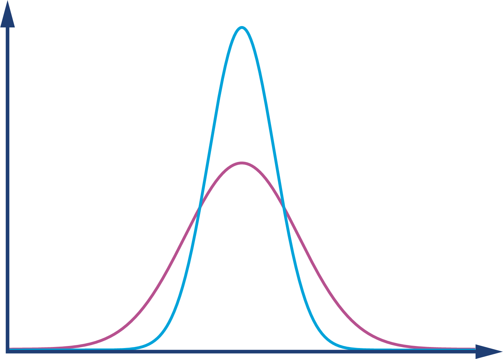

*Hình 2-2. Phân phối Gauss (còn gọi là phân phối chuẩn hay đường cong hình chuông)*

Phân phối này là mô hình tốt cho trường hợp một sai số có khả năng đóng góp dương hoặc âm như nhau vào một đại lượng quan sát được. Tuy nhiên, như chúng ta sẽ thấy ở phần về thống kê phi chuẩn, tình huống với các phép đo JVM phức tạp hơn một chút.

#### Sai số hệ thống

Như một ví dụ về sai số hệ thống, hãy xét một bài test hiệu năng chạy đối với một nhóm dịch vụ web Java backend gửi và nhận JSON. Loại test này rất phổ biến khi việc dùng trực tiếp frontend của ứng dụng để load testing gặp trở ngại.

Hình 2-3 được tạo ra từ công cụ sinh tải Apache JMeter. Trong đó, thực ra có hai hiệu ứng hệ thống đang hoạt động. Thứ nhất là mẫu hình tuyến tính quan sát được ở đường trên cùng (dịch vụ ngoại lai), biểu diễn sự cạn kiệt chậm rãi của một tài nguyên server hữu hạn nào đó.

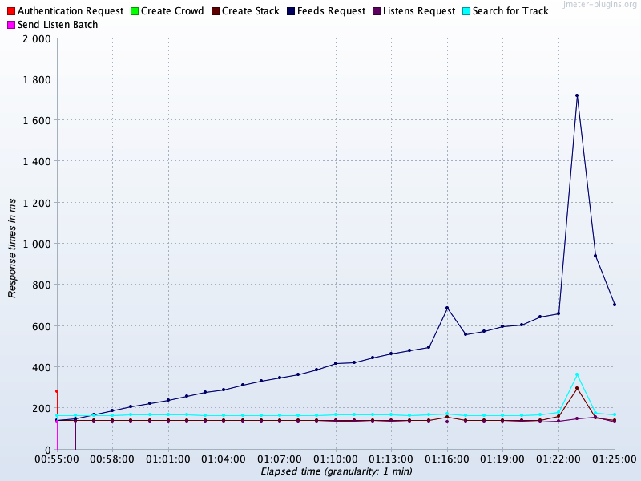

*Hình 2-3. Sai số hệ thống*

Loại mẫu hình này thường gắn với một memory leak hoặc một tài nguyên nào đó được thread sử dụng mà không giải phóng trong quá trình xử lý request, và nó là ứng viên cho việc điều tra — có vẻ như đây có thể là một vấn đề thực sự.

> **GHI CHÚ**
>
> Cần phân tích thêm để xác nhận loại tài nguyên nào đang bị ảnh hưởng; chúng ta không thể chỉ đơn giản kết luận đó là memory leak.

Hiệu ứng thứ hai cần lưu ý là sự nhất quán của đa số các dịch vụ còn lại ở quanh mức 180 ms. Điều này đáng ngờ, vì các dịch vụ đang làm những khối lượng công việc rất khác nhau để phản hồi một request. Vậy tại sao kết quả lại nhất quán đến vậy?

Câu trả lời là: trong khi các dịch vụ được test đặt tại London, bài load test này được tiến hành từ Mumbai, Ấn Độ. Thời gian phản hồi quan sát được bao gồm cả độ trễ mạng khứ hồi không thể giảm được từ Mumbai đến London. Con số này nằm trong khoảng 120–150 ms, nên nó chiếm đại đa số thời gian quan sát được của các dịch vụ ngoài dịch vụ ngoại lai kia.

Hiệu ứng hệ thống lớn này đang nhấn chìm sự khác biệt về thời gian phản hồi thực tế (vì các dịch vụ thực ra phản hồi trong thời gian ít hơn 120 ms rất nhiều). Đây là ví dụ về một sai số hệ thống *không* đại diện cho vấn đề của ứng dụng.

Thay vào đó, sai số này bắt nguồn từ vấn đề trong thiết lập test của chúng ta không sao chép được production, nên tin tốt là hiện tượng này biến mất hoàn toàn (như dự đoán) khi bài test được chạy lại từ London.

Chúng ta đã gặp một số ví dụ về nguồn sai số và nhắc đến một vài cạm bẫy khét tiếng, vậy hãy chuyển sang thảo luận một khía cạnh của việc đo hiệu năng JVM đòi hỏi sự cẩn trọng và chú ý đặc biệt đến chi tiết.

### Thống kê phi chuẩn (Non-Normal Statistics)

Thống kê dựa trên phân phối chuẩn không đòi hỏi nhiều sự tinh vi về toán học. Vì lý do này, cách tiếp cận thống kê tiêu chuẩn thường được dạy ở bậc phổ thông hoặc đại học tập trung nhiều vào việc phân tích dữ liệu phân phối chuẩn.

Sinh viên được dạy cách tính mean và độ lệch chuẩn (hoặc phương sai), và đôi khi các moment bậc cao hơn như độ lệch (skew) và độ nhọn (kurtosis). Tuy nhiên, những kỹ thuật này có một nhược điểm nghiêm trọng, ở chỗ kết quả có thể dễ dàng bị bóp méo nếu phân phối có dù chỉ tương đối ít điểm ngoại lai nằm rất xa.

> **GHI CHÚ**
>
> Trong hiệu năng Java, các outlier đại diện cho những giao dịch chậm và những khách hàng không hài lòng. Chúng ta cần đặc biệt chú ý đến những điểm này và tránh các kỹ thuật làm loãng đi tầm quan trọng của outlier.

Trong Hình 2-4, chúng ta thấy một đường cong thực tế hơn cho phân phối khả dĩ của thời gian method (hoặc giao dịch). Rõ ràng nó không phải phân phối chuẩn.

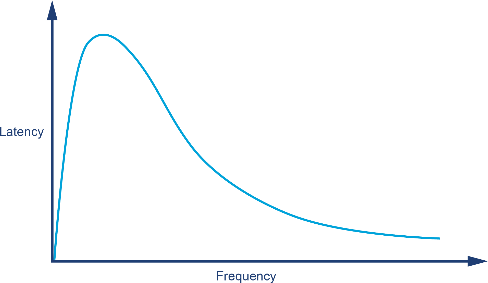

*Hình 2-4. Góc nhìn thực tế hơn về phân phối thời gian giao dịch*

Hình dạng của phân phối trong Hình 2-4 cho thấy điều mà chúng ta biết bằng trực giác về JVM: nó có những "hot path" nơi toàn bộ mã liên quan đã được JIT-compile, không có chu kỳ GC nào, v.v. Chúng đại diện cho kịch bản tốt nhất (dù là kịch bản phổ biến); đơn giản là không có lời gọi nào "nhanh hơn một chút" nhờ các hiệu ứng ngẫu nhiên.

Điều này vi phạm một giả định nền tảng của thống kê Gauss và buộc chúng ta phải xét đến các phân phối phi chuẩn.

> **GHI CHÚ**
>
> Với các phân phối phi chuẩn, nhiều "quy tắc cơ bản" của thống kê phân phối chuẩn bị vi phạm. Đặc biệt, độ lệch chuẩn/phương sai và các moment bậc cao khác về cơ bản là vô dụng.

Xét từ một góc nhìn khác: trừ khi đã có một lượng lớn khách hàng phàn nàn, khó có khả năng việc cải thiện thời gian phản hồi *trung bình* là một mục tiêu hiệu năng hữu ích. Chắc chắn, làm vậy sẽ cải thiện trải nghiệm cho mọi người, nhưng thường gặp hơn nhiều là một vài khách hàng bất mãn chính là nguyên nhân của một đợt tinh chỉnh latency. Điều này ngụ ý rằng các sự kiện outlier có khả năng đáng quan tâm hơn so với trải nghiệm của đa số những người đang nhận được dịch vụ thỏa đáng.

Một kỹ thuật rất hữu ích để xử lý các phân phối phi chuẩn, "đuôi dài" (long-tail) mà JVM tạo ra là dùng một sơ đồ phân vị (percentile) đã được điều chỉnh. Hãy nhớ rằng một phân phối là cả một tập hợp điểm — một *hình dạng* của dữ liệu, và không được biểu diễn tốt bằng một con số duy nhất.

Thay vì chỉ tính mean, vốn cố gắng diễn đạt toàn bộ phân phối trong một kết quả duy nhất, chúng ta có thể lấy mẫu phân phối tại các khoảng. Khi dùng cho dữ liệu phân phối chuẩn, các mẫu thường được lấy tại những khoảng đều nhau. Tuy nhiên, một điều chỉnh nhỏ cho phép kỹ thuật này được dùng hiệu quả hơn cho thống kê JVM.

Điều chỉnh đó là dùng cách lấy mẫu có tính đến phân phối đuôi dài, bằng cách bắt đầu từ mean, rồi đến phân vị thứ 90, rồi mở rộng ra theo thang logarit, như trong kết quả đo thời gian method sau. Điều này có nghĩa là chúng ta đang lấy mẫu theo một mẫu hình khớp hơn với hình dạng của dữ liệu:

```
Mức 50.0%    là 23 ns
Mức 90.0%    là 30 ns
Mức 99.0%    là 43 ns
Mức 99.9%    là 164 ns
Mức 99.99%   là 248 ns
Mức 99.999%  là 3,458 ns
Mức 99.9999% là 17,463 ns
```

Các mẫu cho chúng ta thấy rằng trong khi thời gian trung bình để thực thi một getter method là 23 ns, thì với 1 request trong 1.000, thời gian tệ hơn một bậc độ lớn, và với 1 request trong 100.000, nó tệ hơn hai bậc độ lớn so với trung bình.

Các phân phối đuôi dài cũng có thể được gọi là phân phối *high dynamic range* (HDR — dải động cao). Dải động của một đại lượng quan sát được thường được định nghĩa là giá trị lớn nhất ghi nhận được chia cho giá trị nhỏ nhất (giả sử giá trị nhỏ nhất khác không).

Phân vị theo thang logarit là một công cụ đơn giản hữu ích để hiểu phần đuôi dài. Tuy nhiên, để phân tích tinh vi hơn, chúng ta có thể dùng một thư viện public domain để xử lý các tập dữ liệu có dải động cao. Thư viện đó, tên là **HdrHistogram**, có sẵn trên GitHub. Nó ban đầu được tạo ra bởi Gil Tene (Azul Systems), với sự đóng góp thêm của Mike Barker và các contributor khác.

> **GHI CHÚ**
>
> Một *histogram* là cách tóm tắt dữ liệu bằng cách dùng một tập hữu hạn các khoảng (gọi là *bucket*) và hiển thị tần suất dữ liệu rơi vào mỗi bucket.

HdrHistogram cũng có sẵn trên Maven Central. Tại thời điểm viết sách, phiên bản hiện tại là 2.1.12, và bạn có thể thêm nó vào dự án bằng cách thêm đoạn dependency này vào *pom.xml*:

```xml
<dependency>
    <groupId>org.hdrhistogram</groupId>
    <artifactId>HdrHistogram</artifactId>
    <version>2.1.12</version>
</dependency>
```

Hãy xem một ví dụ đơn giản dùng HdrHistogram. Ví dụ này nhận vào một file chứa các con số và tính HdrHistogram cho hiệu số giữa các kết quả liên tiếp:

```java
public class BenchmarkWithHdrHistogram {
    private static final long NORMALIZER = 1_000_000;

    private static final Histogram HISTOGRAM
            = new Histogram(TimeUnit.MINUTES.toMicros(1), 2);

    public static void main(String[] args) throws Exception {
        final List<String> values = Files.readAllLines(Paths.get(args[0]));
        double last = 0;
        for (final String tVal : values) {
            double parsed = Double.parseDouble(tVal);
            double gcInterval = parsed - last;
            last = parsed;
            HISTOGRAM.recordValue((long)(gcInterval * NORMALIZER));
        }
        HISTOGRAM.outputPercentileDistribution(System.out, 1000.0);
    }
}
```

Đầu ra cho thấy khoảng thời gian giữa các lần garbage collection liên tiếp. Như chúng ta sẽ thấy ở Chương 4 và 5, GC không xảy ra ở các khoảng đều nhau, và việc hiểu phân phối tần suất xảy ra của nó có thể hữu ích. Đây là những gì trình vẽ histogram tạo ra cho một GC log mẫu:

```
      Value       Percentile TotalCount 1/(1-Percentile)

      14.02 0.000000000000              1               1.00
    1245.18 0.100000000000             37               1.11
    1949.70 0.200000000000             82               1.25
    1966.08 0.300000000000            126               1.43
    1982.46 0.400000000000            157               1.67

...

   28180.48 0.996484375000            368             284.44
   28180.48 0.996875000000            368             320.00
   28180.48 0.997265625000            368             365.71
   36438.02 0.997656250000            369             426.67
   36438.02 1.000000000000            369
#[Mean    =      2715.12, StdDeviation  =    2875.87]
#[Max     =     36438.02, Total count   =        369]
#[Buckets =           19, SubBuckets    =        256]
```

Đầu ra thô của trình định dạng khá khó phân tích, nhưng may mắn là dự án HdrHistogram có kèm một trình định dạng trực tuyến có thể dùng để tạo histogram trực quan từ đầu ra thô.

Với ví dụ này, nó tạo ra kết quả như trong Hình 2-5.

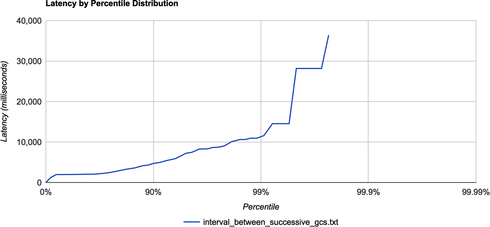

*Hình 2-5. Ví dụ trực quan hóa HdrHistogram*

Với nhiều đại lượng quan sát mà chúng ta muốn đo trong việc tinh chỉnh hiệu năng Java, thống kê thường có tính phi chuẩn cao, và HdrHistogram có thể là một công cụ rất hữu ích giúp hiểu và trực quan hóa hình dạng của dữ liệu.

Công cụ này cũng có thể giúp phát hiện và hiểu hiện tượng *coordinated omission*. Đây là thuật ngữ mô tả hiện tượng trong đó hệ thống đo lường vô tình "phối hợp" với hệ thống đang được đo theo cách hoặc là đo sai các outlier, hoặc khiến một số request bị bỏ qua và không được gửi đi.[^5]

## Diễn giải thống kê

Dữ liệu thực nghiệm và kết quả quan sát được không tồn tại trong chân không, và khá phổ biến là một trong những công việc khó nhất lại nằm ở việc diễn giải kết quả chúng ta thu được từ việc đo lường ứng dụng.

> Dù vấn đề là gì đi nữa, nó luôn là vấn đề con người.
>
> — Gerald Weinberg (được cho là)

Khá nhiều vấn đề khác nhau gắn với việc diễn giải. Hãy bắt đầu bằng cách nhìn nhanh vào một vấn đề khét tiếng thường đi kèm với sai số hệ thống — *tương quan giả* (spurious correlation).

### Tương quan giả

Một trong những câu châm ngôn nổi tiếng nhất về thống kê là "tương quan không hàm ý nhân quả" (correlation does not imply causation) — tức là, chỉ vì hai biến số có vẻ hành xử tương tự nhau không có nghĩa là có mối liên hệ nền tảng giữa chúng.

Đây là một khái niệm rất quan trọng để một kỹ sư hiệu năng nắm bắt và đáng để mổ xẻ thêm chút ít. Wikipedia liệt kê bốn lựa chọn khác nhau. Với bất kỳ hai sự kiện tương quan A và B nào, có những quan hệ khả dĩ sau:

- A gây ra B (nhân quả trực tiếp).
- B gây ra A (nhân quả ngược).
- A và B đều do C gây ra (nhân quả chung).
- Không có mối liên hệ nào giữa A và B; sự tương quan là trùng hợp ngẫu nhiên.

Hai trường hợp đầu tương đối đơn giản. Trường hợp thứ ba, nhân quả chung, là tình huống khi hai biến số có liên hệ nhưng chúng ta rút ra một liên kết nhân quả sai. Nghĩa là, đó là tương quan thật chứ không phải giả, nhưng điều đó không có nghĩa chúng ta có thể suy ra quan hệ nhân quả.

Ví dụ, trong y tế, việc cho trẻ bú mẹ trong giai đoạn sơ sinh tương quan với điểm IQ cao hơn ở giai đoạn sau của tuổi thơ. Điều này có bằng chứng rõ ràng, nhưng trong trường hợp này có một yếu tố thứ ba mang tính nhân quả và thúc đẩy sự tương quan — về cơ bản, tỷ lệ bú mẹ cao hơn có xu hướng xảy ra ở tầng lớp xã hội cao hơn, điều này đến lượt nó dẫn đến việc dành nhiều thời gian hơn để khuyến khích sự phát triển trí tuệ của trẻ.

Trong những ví dụ cực đoan nhất của trường hợp thứ tư, nếu một người thực hành tìm kiếm đủ chăm chỉ, thì có thể tìm ra tương quan giữa những phép đo hoàn toàn không liên quan. Ví dụ, trong Hình 2-6 chúng ta thấy rằng lượng tiêu thụ thịt gà ở Mỹ tương quan tốt với tổng lượng nhập khẩu dầu thô.[^6]

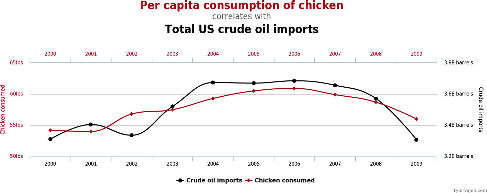

*Hình 2-6. Một tương quan hoàn toàn giả (Vigen)*

Những con số này rõ ràng không có liên hệ nhân quả; không có yếu tố nào vừa thúc đẩy việc nhập khẩu dầu thô vừa thúc đẩy việc ăn thịt gà. Tuy nhiên, không phải những tương quan phi lý và lố bịch mới là thứ mà người thực hành cần cảnh giác.

Trong Hình 2-7, chúng ta thấy doanh thu tạo ra bởi các trung tâm trò chơi điện tử tương quan với số lượng bằng tiến sĩ khoa học máy tính được trao. Không quá khó để tưởng tượng một nghiên cứu xã hội học tuyên bố có mối liên hệ giữa những đại lượng này, có lẽ lập luận rằng "các nghiên cứu sinh căng thẳng tìm sự thư giãn bằng vài giờ chơi game." Những tuyên bố kiểu này phổ biến đến mức đáng buồn, dù chẳng có yếu tố chung nào như vậy thực sự tồn tại.

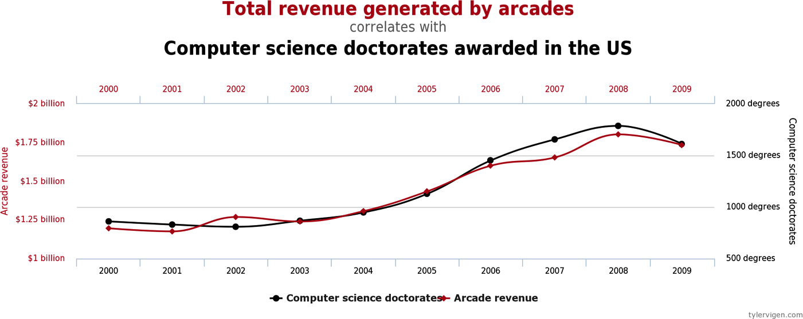

*Hình 2-7. Một tương quan ít giả hơn? (Vigen)*

Trong lĩnh vực JVM và phân tích hiệu năng, chúng ta cần đặc biệt cẩn thận không gán quan hệ nhân quả giữa các phép đo chỉ dựa trên sự tương quan và việc mối liên hệ đó "có vẻ hợp lý".

> Nguyên tắc đầu tiên là bạn không được tự lừa dối chính mình — và bạn chính là người dễ bị lừa nhất.[^7]
>
> — Richard Feynman

Trong Hình 2-8, chúng tôi trình bày một ví dụ về tốc độ cấp phát bộ nhớ cho một ứng dụng Java thực. Ví dụ này là của một ứng dụng có hiệu năng khá tốt.

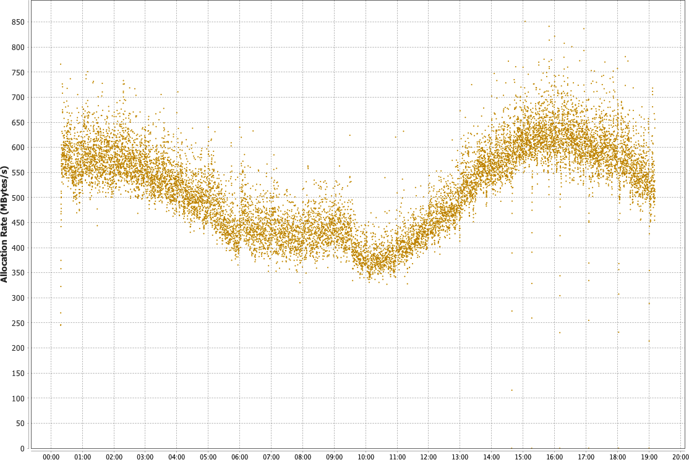

*Hình 2-8. Ví dụ về allocation rate*

Việc diễn giải dữ liệu allocation tương đối đơn giản, vì có một tín hiệu rõ ràng hiện diện. Trong khoảng thời gian được bao phủ (gần một ngày), tốc độ cấp phát về cơ bản ổn định trong khoảng 350 đến 700 MB mỗi giây. Có một xu hướng giảm bắt đầu khoảng 5 giờ sau khi JVM khởi động, và một điểm cực tiểu rõ ràng giữa giờ thứ 9 và 10, sau đó allocation rate lại bắt đầu tăng.

Những xu hướng kiểu này ở các đại lượng quan sát được rất phổ biến, vì allocation rate thường phản ánh khối lượng công việc mà ứng dụng thực sự đang làm, và điều này sẽ biến động rộng tùy theo thời điểm trong ngày. Tuy nhiên, khi chúng ta diễn giải các đại lượng quan sát thực tế, bức tranh có thể nhanh chóng trở nên phức tạp hơn.

### Vấn đề Cái mũ / Con voi

Điều này có thể dẫn đến cái mà đôi khi được gọi là vấn đề "hat/elephant" (cái mũ/con voi), theo một đoạn trong *Hoàng tử bé* của Antoine de Saint-Exupéry. Trong sách, người kể chuyện mô tả rằng lúc sáu tuổi mình đã vẽ một bức tranh con trăn đã nuốt một con voi. Tuy nhiên, vì góc nhìn là từ bên ngoài, bức tranh chỉ giống (ít nhất là trong con mắt ngu ngơ của những người lớn trong truyện) một chiếc mũ hơi méo mó.

Phép ẩn dụ này là lời nhắc nhở độc giả hãy có chút trí tưởng tượng và suy nghĩ sâu hơn về những gì bạn thực sự đang nhìn thấy, thay vì chỉ chấp nhận một lời giải thích nông cạn theo bề mặt.

Vấn đề này, khi áp dụng vào phần mềm, được minh họa bởi Hình 2-9. Tất cả những gì ban đầu chúng ta thấy là một histogram phức tạp về thời gian request-response HTTP. Tuy nhiên, giống như người kể chuyện trong sách, nếu ta có thể tưởng tượng hoặc phân tích thêm chút nữa, ta sẽ thấy rằng bức tranh phức tạp đó thực ra được tạo thành từ vài phần khá đơn giản.

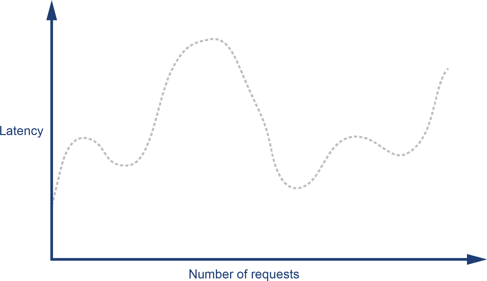

*Hình 2-9. Cái mũ hay con voi bị trăn nuốt?*

Chìa khóa để giải mã histogram response là nhận ra rằng "phản hồi ứng dụng web" là một phạm trù rất tổng quát, bao gồm các request thành công (gọi là phản hồi 2xx), lỗi phía client (4xx, bao gồm lỗi 404 khét tiếng), và lỗi phía server (5xx, đặc biệt là 500 Internal Server Error).

Mỗi loại phản hồi có một phân phối đặc trưng khác nhau cho thời gian phản hồi. Nếu một client gửi request đến một URL không có ánh xạ (lỗi 404), thì web server có thể trả lời ngay lập tức. Điều này có nghĩa là histogram chỉ riêng cho các phản hồi lỗi client sẽ trông giống Hình 2-10 hơn.

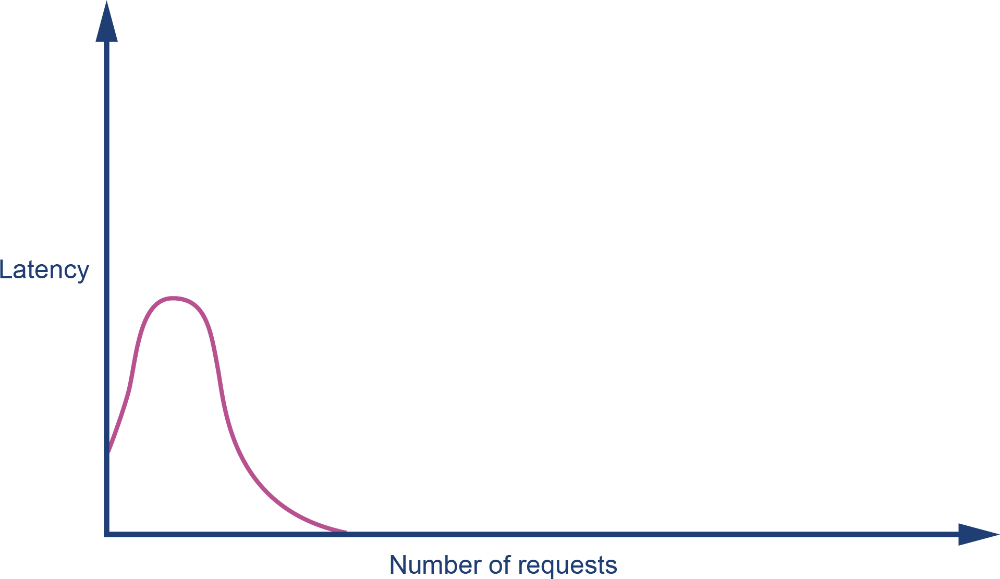

*Hình 2-10. Lỗi phía client*

Ngược lại, lỗi phía server thường xảy ra sau khi một lượng lớn thời gian xử lý đã bị tiêu tốn (ví dụ, do tài nguyên backend đang chịu áp lực hoặc bị timeout). Vì vậy, histogram cho các phản hồi lỗi server có thể trông giống Hình 2-11.

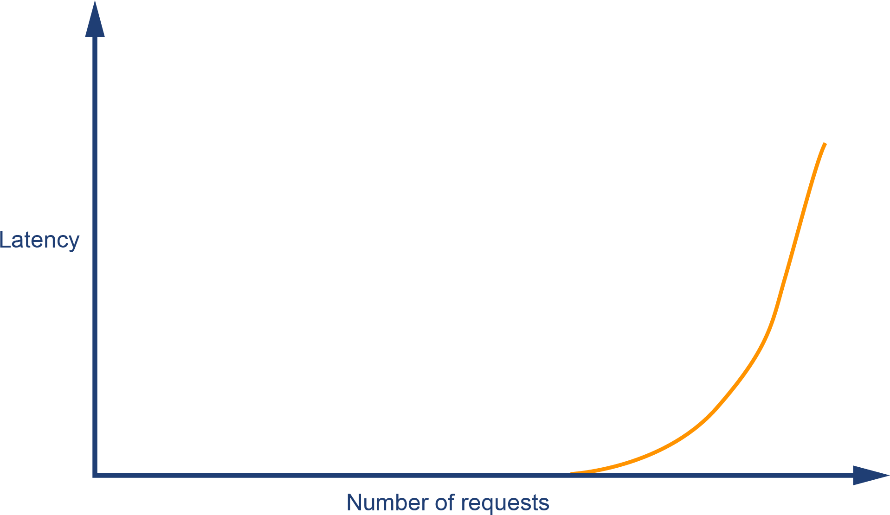

*Hình 2-11. Lỗi phía server*

Các request thành công sẽ có phân phối đuôi dài, nhưng trên thực tế, chúng ta có thể kỳ vọng phân phối response mang tính "đa đỉnh" (multimodal) và có nhiều cực đại địa phương. Một ví dụ được thể hiện ở Hình 2-12, biểu diễn khả năng có hai đường thực thi phổ biến qua ứng dụng với thời gian phản hồi khá khác nhau.

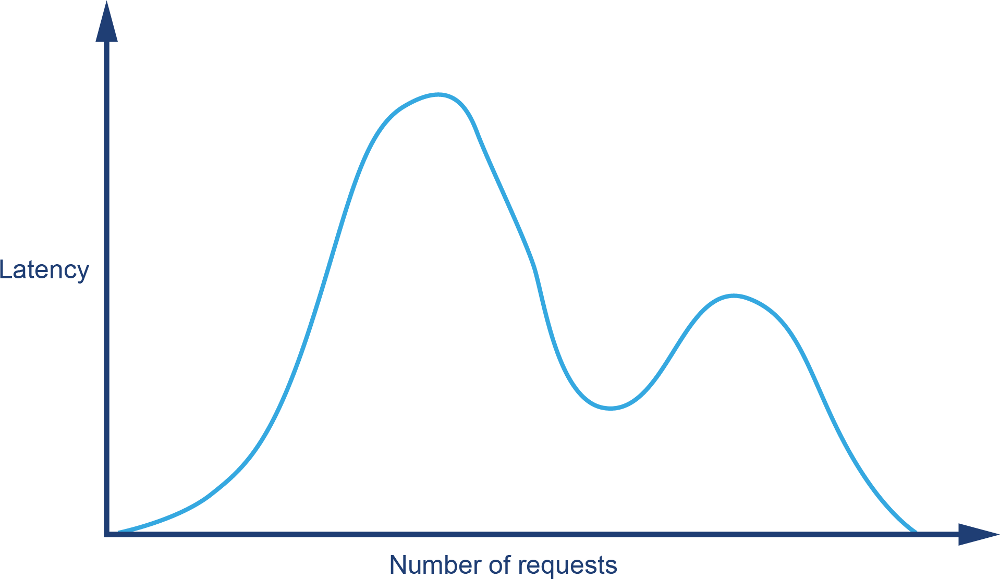

*Hình 2-12. Các request thành công*

Kết hợp các loại phản hồi khác nhau này vào một đồ thị duy nhất cho ra cấu trúc thể hiện trong Hình 2-13. Chúng ta đã tái tạo lại được hình dạng "cái mũ" ban đầu từ các histogram riêng rẽ.

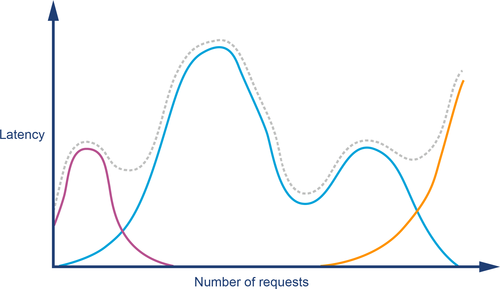

*Hình 2-13. Cái mũ hay con voi, nhìn lại*

Khái niệm phân rã một đại lượng quan sát tổng quát thành các tiểu quần thể (sub-population) có ý nghĩa hơn là một khái niệm rất hữu ích. Nó cho thấy chúng ta cần đảm bảo hiểu dữ liệu và lĩnh vực của mình đủ tốt trước khi cố suy luận kết luận từ kết quả. Chúng ta rất có thể muốn phân rã dữ liệu tiếp thành các tập nhỏ hơn; ví dụ, các request thành công có thể có phân phối rất khác nhau giữa những request chủ yếu là đọc so với những request là cập nhật hoặc upload.

Đội kỹ sư tại PayPal đã viết rất nhiều về việc họ sử dụng thống kê và phân tích; họ có một blog chứa nhiều tài nguyên xuất sắc. Đặc biệt, bài "Statistics for Software" của Mahmoud Hashemi là một phần giới thiệu tuyệt vời về các phương pháp luận của họ và bao gồm một phiên bản của vấn đề hat/elephant đã thảo luận ở trên.[^8]

Cũng đáng nhắc đến là "Datasaurus Dozen" — một tập hợp các bộ dữ liệu có cùng các chỉ số thống kê cơ bản nhưng hình dạng lại khác nhau hoàn toàn.[^9]

## Thiên kiến nhận thức và kiểm thử hiệu năng

Con người có thể rất kém trong việc hình thành ý kiến chính xác một cách nhanh chóng — ngay cả khi đối mặt với vấn đề mà họ có thể rút kinh nghiệm từ quá khứ và các tình huống tương tự.

Một *cognitive bias* (thiên kiến nhận thức) là một hiệu ứng tâm lý khiến bộ não con người rút ra kết luận sai. Nó đặc biệt gây vấn đề bởi người mang thiên kiến thường không nhận thức được điều đó và có thể tin rằng mình đang lý trí.

Nhiều antipattern chúng ta quan sát thấy trong phân tích hiệu năng (như những cái ở Phụ lục B, mà bạn có thể muốn đọc kèm với phần này) được gây ra, toàn bộ hoặc một phần, bởi một hay nhiều thiên kiến nhận thức, vốn lại dựa trên các giả định vô thức.

Ví dụ, với antipattern *Blame Donkey* (Con lừa gánh tội), nếu một thành phần đã gây ra vài sự cố gần đây, đội có thể bị thiên kiến kỳ vọng chính thành phần đó là nguyên nhân của mọi vấn đề hiệu năng mới. Bất kỳ dữ liệu nào được phân tích cũng có thể dễ được coi là đáng tin hơn nếu nó xác nhận ý tưởng rằng thành phần Blame Donkey phải chịu trách nhiệm.

Antipattern này kết hợp các khía cạnh của những thiên kiến gọi là *confirmation bias* (thiên kiến xác nhận) và *recency bias* (thiên kiến gần đây — xu hướng giả định rằng bất cứ điều gì đã xảy ra gần đây sẽ tiếp tục xảy ra).

> **GHI CHÚ**
>
> Một thành phần đơn lẻ trong Java có thể hành xử khác nhau giữa ứng dụng này với ứng dụng khác tùy thuộc vào cách nó được tối ưu lúc runtime. Để loại bỏ mọi thiên kiến có sẵn, điều quan trọng là nhìn ứng dụng như một tổng thể.

Các thiên kiến có thể bổ sung hoặc đối ngẫu với nhau. Ví dụ, một số lập trình viên có thể bị thiên kiến giả định rằng vấn đề hoàn toàn không liên quan đến phần mềm, và nguyên nhân phải là hạ tầng mà phần mềm đang chạy trên đó; điều này phổ biến trong antipattern *Works for Me* (Chạy tốt trên máy tôi), đặc trưng bởi những phát biểu như: "Cái này chạy tốt trên UAT, nên chắc phải có vấn đề với hệ thống production." Ngược lại là giả định rằng mọi vấn đề đều phải do phần mềm gây ra, bởi đó là phần của hệ thống mà lập trình viên biết và có thể tác động trực tiếp.

Hãy cùng gặp một số thiên kiến phổ biến nhất mà mọi kỹ sư hiệu năng nên đề phòng.

> Biết cái bẫy nằm ở đâu — đó là bước đầu tiên để né tránh nó.[^10]
>
> — Công tước Leto Atreides I

Bằng cách nhận ra những thiên kiến này ở chính mình và ở người khác, chúng ta tăng cơ hội thực hiện được phân tích hiệu năng đúng đắn và giải quyết các vấn đề trong hệ thống của mình.

### Tư duy giản lược (Reductionist Thinking)

Thiên kiến tư duy giản lược dựa trên cách tiếp cận phân tích giả định trước rằng nếu bạn chia nhỏ một hệ thống thành những mảnh đủ nhỏ, bạn có thể hiểu nó bằng cách hiểu các bộ phận cấu thành. Hiểu từng bộ phận nghĩa là giảm khả năng đưa ra các giả định sai.

Vấn đề lớn của quan điểm này rất dễ giải thích — trong các hệ thống phức tạp, điều đó đơn giản là không đúng. Các hệ thống phần mềm (hoặc vật lý) không tầm thường hầu như luôn thể hiện *hành vi nổi lên* (emergent behavior), nơi tổng thể lớn hơn những gì phép cộng đơn giản các bộ phận gợi ý.

### Thiên kiến xác nhận (Confirmation Bias)

Thiên kiến xác nhận có thể dẫn đến những vấn đề đáng kể khi nói đến kiểm thử hiệu năng hoặc cố gắng nhìn ứng dụng một cách chủ quan. Một thiên kiến xác nhận được đưa vào, thường là không chủ ý, khi một tập test kém được chọn hoặc kết quả từ bài test không được phân tích một cách đúng đắn về mặt thống kê. Thiên kiến xác nhận khá khó chống lại, bởi thường có những yếu tố động cơ hoặc cảm xúc mạnh mẽ đang tác động (chẳng hạn ai đó trong đội đang cố chứng minh một luận điểm).

Hãy xét một antipattern như *Distracted by Shiny*, nơi một thành viên trong đội đang muốn đưa vào cơ sở dữ liệu NoSQL mới nhất và tuyệt nhất. Họ chạy vài bài test trên dữ liệu không giống dữ liệu production, bởi việc biểu diễn đầy đủ schema là quá phức tạp cho mục đích đánh giá.

Họ nhanh chóng chứng minh rằng trên một tập test, cơ sở dữ liệu NoSQL cho ra thời gian truy cập vượt trội trên máy cục bộ của họ. Lập trình viên đó đã nói với mọi người trước rằng sẽ như vậy, và khi thấy kết quả, họ tiến hành triển khai đầy đủ. Có vài antipattern đang hoạt động ở đây, tất cả dẫn đến những giả định mới, chưa được kiểm chứng trong stack thư viện mới.

### Màn sương chiến trận (Fog of War / Action Bias)

Thiên kiến "màn sương chiến trận" thường bộc lộ trong các sự cố ngừng hoạt động hoặc tình huống hệ thống không hoạt động như kỳ vọng và đội đang chịu áp lực. Một số nguyên nhân phổ biến bao gồm:

- Thay đổi ở hạ tầng mà hệ thống chạy trên đó, có lẽ không được thông báo hoặc không nhận ra là sẽ có tác động
- Thay đổi ở các thư viện mà hệ thống phụ thuộc vào
- Một bug lạ hoặc race condition bộc lộ, nhưng chỉ vào những ngày bận rộn

Trong một ứng dụng được bảo trì tốt với đủ công cụ observability, những điều này sẽ tạo ra tín hiệu rõ ràng dẫn đội hỗ trợ đến nguyên nhân của vấn đề.

Tuy nhiên, quá nhiều ứng dụng chưa từng test các kịch bản lỗi và thiếu công cụ phù hợp. Trong hoàn cảnh này, ngay cả các kỹ sư giàu kinh nghiệm cũng có thể rơi vào bẫy cần cảm thấy rằng mình *đang làm gì đó* để giải quyết sự cố và nhầm lẫn giữa chuyển động với vận tốc — "màn sương chiến trận" buông xuống.

Vào lúc này, nhiều yếu tố con người được thảo luận trong chương này có thể phát huy tác dụng nếu những người tham gia không có cách tiếp cận hệ thống đối với vấn đề.

Ví dụ, một antipattern như *Blame Donkey* có thể cắt ngắn một cuộc điều tra đầy đủ và dẫn đội production đi theo một hướng điều tra cụ thể — thường bỏ lỡ bức tranh lớn hơn. Tương tự, đội có thể bị cám dỗ chia nhỏ hệ thống thành các bộ phận cấu thành và soi mã ở mức thấp mà không xác định trước vấn đề thực sự nằm ở hệ thống con nào.

### Thiên kiến rủi ro (Risk Bias)

Con người vốn dĩ ngại rủi ro và kháng cự sự thay đổi. Chủ yếu là vì người ta đã thấy các ví dụ về việc thay đổi có thể khiến mọi thứ đi sai — điều này khiến họ cố tránh rủi ro đó. Điều này có thể cực kỳ bực bội khi việc chấp nhận những rủi ro nhỏ, được tính toán có thể đẩy sản phẩm tiến lên. Phần lớn sự ngại rủi ro này nảy sinh từ các đội miễn cưỡng thực hiện những thay đổi có thể làm thay đổi profile hiệu năng của ứng dụng.

Chúng ta có thể giảm đáng kể thiên kiến rủi ro này bằng cách có một bộ unit test và production regression test vững chắc. Các bài performance regression test là nơi tuyệt vời để gắn kết các yêu cầu phi chức năng của hệ thống và đảm bảo rằng những mối quan tâm mà các NFR đại diện được phản ánh trong regression test.

Tuy nhiên, nếu một trong hai thứ này không được đội tin tưởng đủ, thì thay đổi trở nên cực kỳ khó khăn, và yếu tố rủi ro không được kiểm soát. Thiên kiến này thường biểu hiện ở việc không rút ra bài học từ các vấn đề của ứng dụng (bao gồm các sự cố dịch vụ) và không triển khai biện pháp giảm thiểu phù hợp.

## Tóm tắt

Khi bạn đánh giá kết quả hiệu năng, việc xử lý dữ liệu một cách phù hợp và tránh rơi vào tư duy phi khoa học, chủ quan là điều thiết yếu. Điều này bao gồm việc tránh các cạm bẫy thống kê của việc dựa vào mô hình Gauss khi chúng không phù hợp.

Trong chương này, chúng ta đã gặp một số loại test hiệu năng khác nhau, các best practice kiểm thử, và những vấn đề con người vốn có trong phân tích hiệu năng.

Ở chương tiếp theo, chúng ta sẽ chuyển sang tổng quan về JVM, giới thiệu các hệ thống con cơ bản, vòng đời của một ứng dụng Java "cổ điển", và cái nhìn đầu tiên về giám sát và công cụ.

---

[^1]: Thuật ngữ này được phổ biến bởi cuốn sách *AntiPatterns: Refactoring Software, Architectures, and Projects in Crisis*, của William J. Brown, Raphael C. Malveau, Hays W. McCormick III, và Thomas J. Mowbray (New York: Wiley, 1998).

[^2]: Mary Walton, *The Deming Management Method* (Mercury Books, 1989).

[^3]: Andy Georges, Dries Buytaert, và Lieven Eeckhout. 2007. "Statistically Rigorous Java Performance Evaluation," *ACM SIGPLAN Notices*, vol. 42, iss. 10 (October 2007): 57–76.

[^4]: John H. McDonald, *Handbook of Biological Statistics*, 3rd ed. (Baltimore, MD: Sparky House Publishing, 2014).

[^5]: Để biết thêm về điều này, xem Ivan Prisyazhynyy, "On Coordinated Omission," Scylla, April 22, 2021, https://oreil.ly/VoW98.

[^6]: Các tương quan giả trong phần này lấy từ trang của Tyler Vigen và được sử dụng lại ở đây với sự cho phép theo giấy phép CC BY 4.0. Nếu bạn thích chúng, một cuốn sách với nhiều ví dụ thú vị hơn có sẵn trên website của ông.

[^7]: Richard Feynman và Ralph Leighton, *Surely You're Joking, Mr. Feynman!* (W.W. Norton, 1985).

[^8]: Mahmoud Hashemi viết bài này khi làm việc cho PayPal, nhưng hiện nó được ghi nhận cho Paypal Tech Blog Team.

[^9]: Justin Matejka và George Fitzmaurice, "Same Stats, Different Graphs: Generating Datasets with Varied Appearance and Identical Statistics through Simulated Annealing," *ACM SIGCHI Conference on Human Factors in Computing Systems 2017*, Denver (2017).

[^10]: Frank Herbert, *Dune* (Chilton Books, 1965).
