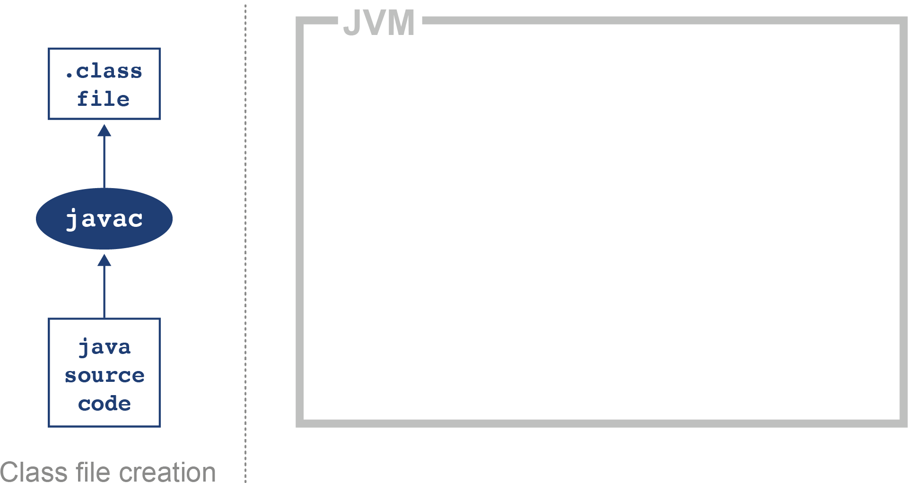
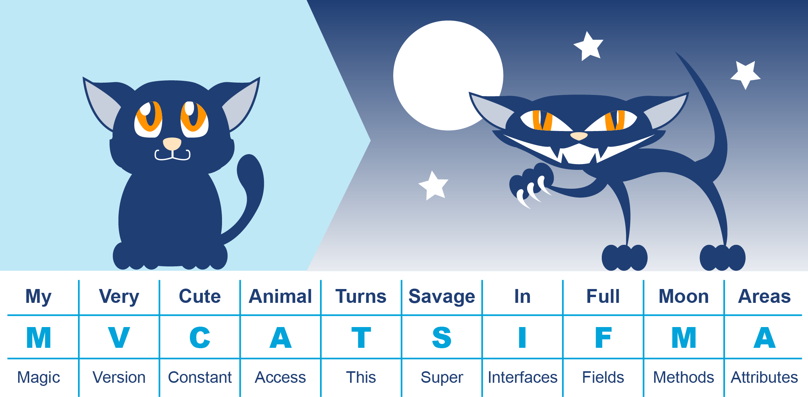
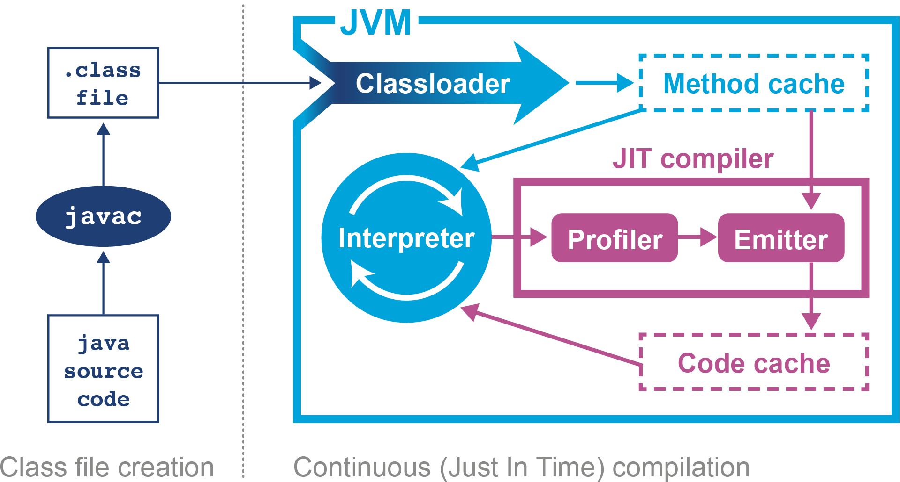
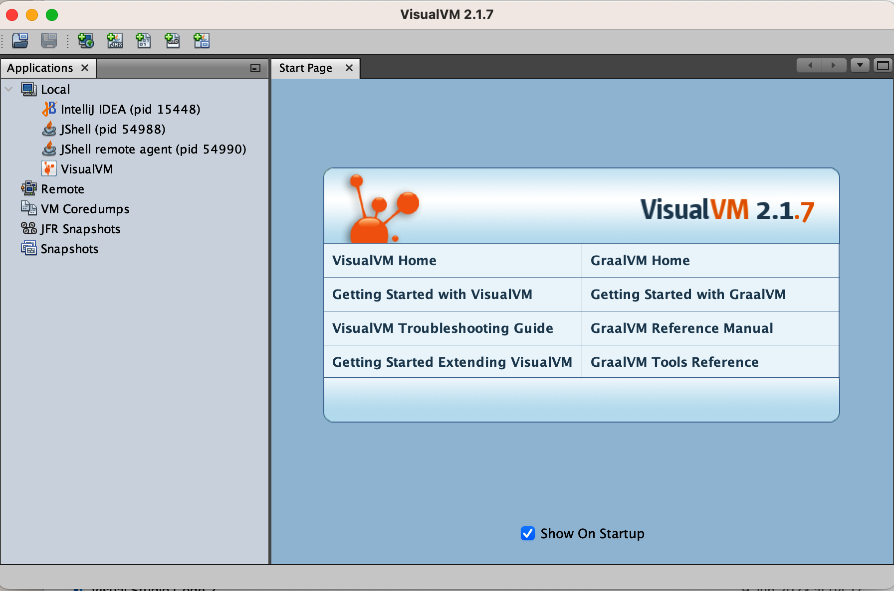
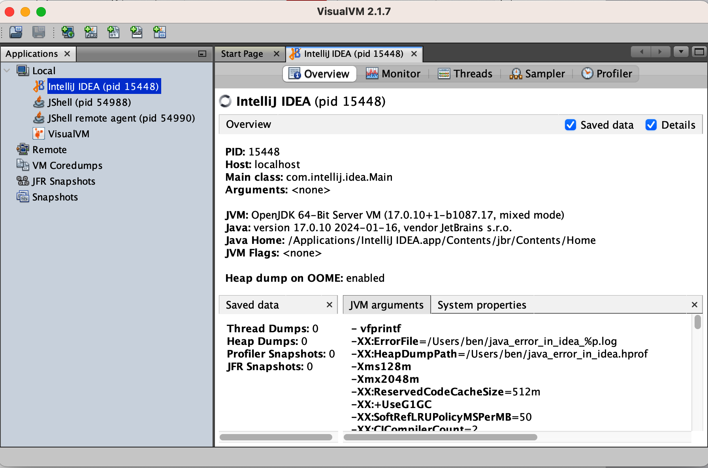
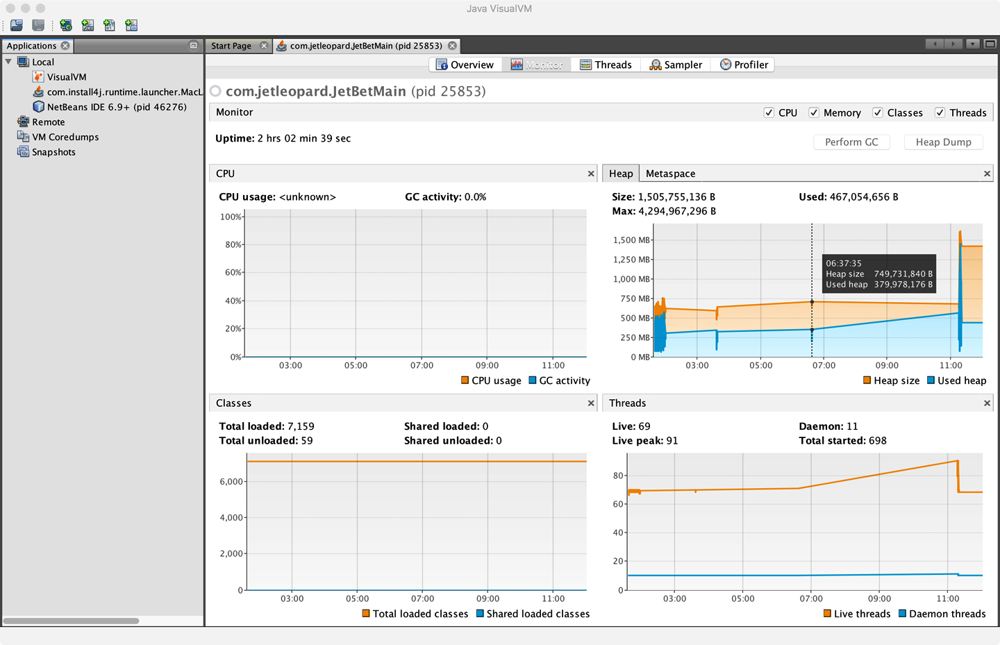

# Chương 3. Tổng quan về JVM

Không nghi ngờ gì Java là một trong những nền tảng công nghệ lớn nhất hành tinh — ước tính khả dĩ nhất là có hơn 10 triệu lập trình viên đang làm việc với Java.

Thiết kế của JVM ở mức cao (high level), với mục tiêu loại bỏ độ phức tạp cho lập trình viên. Các khía cạnh then chốt như garbage collection và tối ưu hóa thực thi được giữ dưới sự kiểm soát của JVM thay mặt cho lập trình viên. Việc Java hướng tới lập trình viên phổ thông một cách có ý thức dẫn đến tình huống mà nhiều lập trình viên không cần biết về những chi tiết phức tạp ở mức thấp của nền tảng họ làm việc hằng ngày. Kết quả là, lập trình viên có thể không gặp những khía cạnh nội tại này thường xuyên — mà chỉ khi có vấn đề phát sinh, chẳng hạn khách hàng phàn nàn về một vấn đề hiệu năng.

Tuy nhiên, với những lập trình viên quan tâm đến hiệu năng, việc hiểu những điều cơ bản của technology stack JVM là rất quan trọng. Hiểu công nghệ JVM cho phép lập trình viên viết phần mềm tốt hơn và cung cấp nền tảng lý thuyết cần thiết để điều tra các vấn đề liên quan đến hiệu năng.

Chương này giới thiệu cách JVM thực thi Java để tạo cơ sở cho việc khám phá sâu hơn các chủ đề đó ở phần sau của cuốn sách. Đặc biệt, Chương 6 có phần xử lý chuyên sâu về bytecode, bổ trợ cho phần thảo luận ở đây.

Chúng tôi gợi ý bạn đọc hết chương này rồi quay lại đọc lần thứ hai sau khi đã đọc Chương 6.

## Thông dịch và nạp lớp (Interpreting and Classloading)

Theo đặc tả định nghĩa Java virtual machine (thường gọi là *VM spec*), JVM là một máy thông dịch dựa trên stack (stack-based interpreted machine). Điều này có nghĩa là thay vì có các thanh ghi (register) như một CPU phần cứng vật lý, nó dùng một *execution stack* chứa các kết quả trung gian và thực hiện tính toán bằng cách thao tác trên (các) giá trị ở đỉnh stack đó.

Nếu bạn chưa quen với cách hoạt động của trình thông dịch, thì bạn có thể hình dung hành vi cơ bản của trình thông dịch JVM về bản chất là "một câu lệnh switch bên trong một vòng lặp while". Trình thông dịch xử lý từng opcode của chương trình một cách độc lập với opcode trước đó và dùng evaluation stack để giữ kết quả của các phép tính cũng như các kết quả trung gian.

> **GHI CHÚ**
>
> Như chúng ta sẽ thấy khi đi sâu vào nội tại của VM Oracle/OpenJDK (HotSpot), tình hình đối với những trình thông dịch Java cấp production thực sự thì phức tạp hơn, nhưng mô hình switch-trong-while dùng stack interpreter là một mô hình tư duy chấp nhận được ở thời điểm này.

Khi chúng ta khởi chạy ứng dụng bằng lệnh `java HelloWorld`, hệ điều hành khởi động tiến trình máy ảo (binary `java`). Việc này thiết lập môi trường ảo Java và khởi tạo trình thông dịch sẽ thực sự thực thi mã người dùng trong file *HelloWorld.class*.

Điểm vào (entry point) của ứng dụng sẽ là method `main()` của *HelloWorld.class*. Để bàn giao quyền điều khiển cho class này, nó phải được nạp bởi máy ảo trước khi việc thực thi có thể bắt đầu.

Để đạt được điều này, cơ chế nạp class (class loading) của Java được sử dụng. Khi một tiến trình Java mới đang khởi tạo, một chuỗi các class loader được dùng. Loader ban đầu được gọi là *Bootstrap class loader* (trong lịch sử còn được gọi là "Primordial class loader"), và nó nạp các class trong lõi Java runtime. Mục đích chính của Bootstrap class loader là nạp một tập class tối thiểu (bao gồm những thứ thiết yếu như `java.lang.Object`, `Class`, và `Classloader`) để cho phép các class loader khác dựng lên phần còn lại của hệ thống.

Đến đây, cũng nên thảo luận đôi chút về việc Java Platform Module System (đôi khi gọi là JPMS) đã thay đổi bức tranh khởi động ứng dụng ra sao. Trước hết, từ Java 9 trở đi, mọi JVM đều là modular — không có chế độ "tương thích" hay "cổ điển" nào khôi phục lại runtime JVM nguyên khối (monolithic) của Java 8.

Điều này có nghĩa là trong quá trình khởi động, một *module graph* luôn được xây dựng — ngay cả khi bản thân ứng dụng không phải là modular. Đây phải là một đồ thị có hướng không chu trình (directed acyclic graph — DAG), và sẽ là lỗi khởi động nghiêm trọng nếu metadata module của ứng dụng cố xây dựng một module graph chứa chu trình.

Module graph có nhiều ưu điểm, bao gồm:

- Chỉ những module cần thiết mới được nạp.
- Metadata liên module có thể được xác nhận là hợp lệ ngay tại thời điểm khởi động.

Module graph có một *main module*, nơi chứa class entrypoint. Nếu ứng dụng chưa được modular hóa hoàn toàn, thì nó sẽ có cả *modulepath* lẫn *classpath*, và mã ứng dụng có thể nằm trong module UNNAMED.

> **GHI CHÚ**
>
> Chi tiết đầy đủ về hệ thống module nằm ngoài phạm vi cuốn sách này. Phần trình bày mở rộng có thể tìm thấy trong *Java in a Nutshell, 8th Edition* của Benjamin J. Evans, Jason Clark và David Flanagan (O'Reilly), hoặc một tài liệu tham khảo chuyên sâu hơn như *Java 9 Modularity* của Sander Mak và Paul Bakker (O'Reilly).

Trong thực tế, công việc của Bootstrap class loader bao gồm nạp `java.base` và một số module hỗ trợ khác (bao gồm cả một số mục có lẽ gây bất ngờ — ví dụ `java.security.sasl` và `java.datatransfer`).

Java mô hình hóa class loader như các object bên trong chính runtime và hệ thống kiểu của nó, nên cần có cách nào đó để đưa một tập class ban đầu vào tồn tại. Nếu không, sẽ có vấn đề vòng tròn trong việc định nghĩa class loader là gì.

Bootstrap class loader không xác minh (verify) các class mà nó nạp (chủ yếu để cải thiện hiệu năng khởi động), và nó dựa vào việc boot classpath là an toàn. Bất kỳ thứ gì được nạp bởi Bootstrap class loader đều được cấp toàn quyền bảo mật, nên nhóm module này được giữ ở mức hạn chế nhất có thể.

> **GHI CHÚ**
>
> Các phiên bản Java cũ đến hết bản 8 dùng runtime nguyên khối, và Bootstrap class loader nạp nội dung của *rt.jar*.

Phần còn lại của hệ thống cơ sở (tức phần tương đương với phần còn lại của *rt.jar* cũ dùng trong bản 8 và trước đó) được nạp bởi *Platform class loader*, có thể truy cập qua method `ClassLoader::getPlatformClassLoader`. Nó có Bootstrap class loader làm cha, bởi Extension class loader cũ đã bị loại bỏ.

Trong các triển khai modular mới của Java, cần ít mã hơn nhiều để bootstrap một tiến trình Java, và theo đó, càng nhiều mã JDK (giờ được biểu diễn dưới dạng module) càng tốt đã được chuyển ra khỏi phạm vi của bootstrap loader và chuyển sang platform loader.

Cuối cùng, *Application class loader* được tạo ra; nó chịu trách nhiệm nạp các class người dùng từ classpath đã định nghĩa. Đáng tiếc là một số tài liệu gọi đây là class loader "System". Nên tránh thuật ngữ này, vì lý do đơn giản là nó không nạp các class hệ thống (Bootstrap và Platform class loader mới làm việc đó). Application class loader được gặp cực kỳ thường xuyên, và nó có Platform loader làm cha.

Java nạp các phụ thuộc vào class mới khi chúng được gặp lần đầu trong quá trình thực thi chương trình. Nếu một class loader không tìm thấy class, hành vi thường là ủy quyền việc tra cứu lên cho loader cha. Nếu chuỗi tra cứu đi đến Bootstrap class loader mà vẫn không tìm thấy, một `ClassNotFoundException` sẽ được ném ra. Điều quan trọng là lập trình viên nên dùng một quy trình build biên dịch hiệu quả với đúng cùng classpath sẽ dùng trên production, vì điều này giúp giảm thiểu vấn đề tiềm tàng đó.

Thông thường, Java chỉ nạp một class một lần, và một object `Class` được tạo ra để đại diện cho class đó trong môi trường runtime. Tuy nhiên, cần nhận thức rằng trong một số hoàn cảnh, cùng một class có thể được nạp hai lần bởi các class loader khác nhau. Kết quả là, một class trong hệ thống được định danh bởi class loader đã nạp nó *cùng với* tên class đầy đủ (fully qualified, bao gồm cả tên package).

> **GHI CHÚ**
>
> Một số ngữ cảnh thực thi, như application server (ví dụ Tomcat hay JBoss EAP), theo thiết kế thể hiện hành vi này khi có nhiều ứng dụng tenant hiện diện trong server. Điều này cho phép các tenant khác nhau có các phiên bản class khác nhau mà chúng cần.

Cũng có trường hợp một số công cụ (ví dụ Java agent) có thể nạp lại và biến đổi lại (retransform) class như một phần của việc dệt bytecode (bytecode weaving) — và những công cụ như vậy thường được dùng trong giám sát và observability.

## Thực thi Bytecode

Điều quan trọng cần nhận thức là mã nguồn Java trải qua một số lượng đáng kể các biến đổi trước khi được thực thi. Biến đổi đầu tiên là bước biên dịch dùng trình biên dịch Java `javac`, thường được gọi như một phần của quy trình build lớn hơn.

Công việc của `javac` là chuyển mã Java thành các file *.class* chứa bytecode. Nó đạt được điều này bằng cách thực hiện một phép dịch khá đơn giản từ mã nguồn Java, như thể hiện trong Hình 3-1. Sơ đồ cho thấy rõ rằng việc tạo ra class file không phải là toàn bộ câu chuyện — và phần lớn sức mạnh của JVM đến từ những gì xảy ra lúc runtime.

Theo đó, rất ít tối ưu hóa được `javac` thực hiện trong quá trình biên dịch, và bytecode kết quả vẫn khá dễ đọc và nhận diện được là mã Java khi xem bằng một công cụ dịch ngược như `javap` tiêu chuẩn.



*Hình 3-1. Biên dịch class file Java*

Bytecode là một biểu diễn trung gian (intermediate representation) không gắn với một kiến trúc máy cụ thể. Việc tách rời khỏi kiến trúc máy mang lại tính di động (portability), nghĩa là phần mềm đã phát triển (hoặc đã biên dịch) có thể chạy trên bất kỳ nền tảng nào được JVM hỗ trợ, và cung cấp một lớp trừu tượng khỏi ngôn ngữ Java. Điều này cho ta hiểu biết quan trọng đầu tiên về cách JVM thực thi mã.

Ngôn ngữ Java và Java virtual machine giờ đây độc lập với nhau ở một mức độ nhất định, nên chữ J trong JVM có phần gây hiểu nhầm, bởi JVM có thể thực thi bất kỳ ngôn ngữ JVM nào có thể tạo ra một class file hợp lệ. Trên thực tế, Hình 3-1 cũng có thể dễ dàng minh họa trình biên dịch Kotlin `kotlinc` sinh ra bytecode để thực thi trên JVM.

Bất kể trình biên dịch mã nguồn nào được dùng, class file kết quả đều có một cấu trúc được định nghĩa rất rõ ràng bởi VM spec (Bảng 3-1). Bất kỳ class nào được JVM nạp đều sẽ được xác minh là tuân thủ định dạng kỳ vọng trước khi được phép chạy.

**Bảng 3-1. Giải phẫu một class file**

| Thành phần | Mô tả |
|---|---|
| Magic number | `0xCAFEBABE` |
| Version of class file | Phiên bản minor và major của định dạng class file |
| Constant pool | Kho hằng số (pool of constants) của class |
| Access flags | Class là abstract, static, v.v. hay không |
| This class | Tên của class hiện tại |
| Superclass | Tên của lớp cha |
| Interfaces | Các interface trong class |
| Fields | Các field trong class |
| Methods | Các method trong class |
| Attributes | Các attribute của class (ví dụ, tên của file mã nguồn) |

Mọi class file đều bắt đầu bằng magic number `0xCAFEBABE`, 4 byte đầu tiên ở dạng thập lục phân dùng để biểu thị sự tuân thủ định dạng class file. 4 byte tiếp theo biểu diễn phiên bản minor và major được dùng để biên dịch class file, và chúng được kiểm tra để đảm bảo phiên bản JVM không thấp hơn phiên bản dùng để biên dịch class file. Phiên bản major và minor được class loader kiểm tra để đảm bảo tương thích; nếu chúng không tương thích, một `UnsupportedClassVersionError` sẽ được ném ra lúc runtime, cho biết runtime có phiên bản thấp hơn class file đã biên dịch.

> **GHI CHÚ**
>
> Magic number cung cấp cách để môi trường Unix nhận diện kiểu của một file (trong khi Windows thường dùng phần mở rộng file). Vì lý do này, chúng khó thay đổi một khi đã được quyết định. Đáng tiếc, điều này có nghĩa Java bị kẹt với con số `0xCAFEBABE` khá ngượng ngùng và mang tính phân biệt giới trong tương lai gần.

*Constant pool* giữ các giá trị hằng trong mã: ví dụ tên của class, interface và field. Khi JVM thực thi mã, bảng constant pool được dùng để tham chiếu đến các giá trị thay vì phải dựa vào bố cục chính xác của các cấu trúc bộ nhớ lúc runtime.

*Access flags* được dùng để xác định các modifier áp dụng cho class. Phần đầu của khối flag xác định các thuộc tính chung, như class có phải public không, tiếp theo là nó có phải final và do đó không thể kế thừa hay không. Các flag cũng xác định class file có đại diện cho một interface hay một abstract class hay không. Phần cuối của khối flag cho biết class file có đại diện cho một class tổng hợp (synthetic — tức không hiện diện trong mã nguồn), một kiểu annotation, hay một enum hay không.

Các mục *this class*, *superclass*, và *interface* là các chỉ mục trỏ vào constant pool để xác định phân cấp kiểu thuộc về class. *Fields* và *methods* định nghĩa một cấu trúc kiểu chữ ký (signature-like), bao gồm các modifier áp dụng cho field hoặc method. Một tập *attribute* sau đó được dùng để biểu diễn các mục có cấu trúc cho những cấu trúc phức tạp hơn và không cố định kích thước. Ví dụ, method dùng attribute `Code` để biểu diễn bytecode gắn với method cụ thể đó.

Hình 3-2 cung cấp một cách ghi nhớ (mnemonic) để nhớ cấu trúc này.



*Hình 3-2. Cách ghi nhớ cấu trúc class file*

Trong ví dụ mã rất đơn giản này, có thể quan sát được tác động của việc chạy `javac`:

```java
public class HelloWorld {
    public static void main(String[] args) {
        for (int i = 0; i < 10; i++) {
            System.out.println("Hello World");
        }
    }
}
```

Java đi kèm một trình dịch ngược class file tên là `javap`, cho phép kiểm tra các file *.class*. Lấy class file HelloWorld và chạy `javap -c HelloWorld` cho ra kết quả sau:

```
public class HelloWorld {
    public HelloWorld();
     Code:
          0: aload_0
          1: invokespecial #1        // Method java/lang/Object."<init>":()V
          4: return

    public static void main(java.lang.String[]);
     Code:
          0: iconst_0
          1: istore_1
          2: iload_1
          3: bipush        10
          5: if_icmpge     22
          8: getstatic     #2        // Field java/lang/System.out ...
         11: ldc           #3        // String Hello World
         13: invokevirtual #4        // Method java/io/PrintStream.println .
         16: iinc          1, 1
         19: goto          2
         22: return
}
```

Bố cục này mô tả bytecode cho file *HelloWorld.class*. Để biết chi tiết hơn, `javap` cũng có tùy chọn `-v` cung cấp đầy đủ thông tin header của class file và chi tiết constant pool. Class file chứa hai method, mặc dù chỉ có một method `main()` được cung cấp trong file mã nguồn; đây là kết quả của việc `javac` tự động thêm một constructor mặc định vào class.

Chỉ thị đầu tiên được thực thi trong constructor là `aload_0`, đặt tham chiếu `this` vào vị trí đầu tiên trên stack. Lệnh `invokespecial` sau đó được gọi, nó gọi một instance method có cách xử lý đặc biệt cho việc gọi superconstructor và tạo object. Trong constructor mặc định, lời gọi này khớp với constructor mặc định của `Object`, vì không có override nào được cung cấp.

> **GHI CHÚ**
>
> Các opcode trong JVM rất súc tích và biểu diễn kiểu, phép toán, và tương tác giữa biến cục bộ, constant pool và stack. Xem Chương 6 để biết thêm chi tiết.

Chuyển sang method `main()`, `iconst_0` đẩy hằng số nguyên 0 lên evaluation stack. `istore_1` lưu giá trị hằng này vào biến cục bộ ở offset 1 (được biểu diễn là `i` trong vòng lặp). Offset của biến cục bộ bắt đầu từ 0, nhưng với instance method, mục thứ 0 luôn là `this`. Biến ở offset 1 sau đó được nạp trở lại lên stack, và hằng số 10 được đẩy lên để so sánh bằng `if_icmpge` ("if integer compare greater or equal"). Phép kiểm tra chỉ thành công nếu số nguyên hiện tại >= 10.

Với 10 lần lặp đầu tiên, phép so sánh này thất bại, nên chúng ta tiếp tục đến chỉ thị 8. Ở đây static method từ `System.out` được phân giải, tiếp theo là việc nạp chuỗi "Hello World" từ constant pool. Lời gọi tiếp theo, `invokevirtual`, gọi một instance method dựa trên class. Số nguyên sau đó được tăng lên, và `goto` được gọi để lặp lại về chỉ thị 2.

Quá trình này tiếp tục cho đến khi phép so sánh `if_icmpge` cuối cùng thành công (khi biến vòng lặp >= 10); ở lần lặp đó của vòng lặp, quyền điều khiển chuyển sang chỉ thị 22, và method trả về.

## Giới thiệu HotSpot

Vào tháng 4 năm 1999, Sun giới thiệu HotSpot — một trong những thay đổi lớn nhất từ trước đến nay (về mặt hiệu năng) đối với triển khai Java thống trị. HotSpot là một máy ảo đã tiến hóa để đạt được hiệu năng ngang bằng (hoặc tốt hơn) các ngôn ngữ như C và C++ (xem Hình 3-3). Để giải thích tại sao điều này khả thi, hãy đi sâu hơn một chút vào thiết kế của các ngôn ngữ dành cho phát triển ứng dụng.



*Hình 3-3. JVM HotSpot*

Thiết kế ngôn ngữ và nền tảng thường liên quan đến việc đưa ra quyết định và đánh đổi giữa các năng lực mong muốn. Trong trường hợp này, sự phân chia nằm giữa các ngôn ngữ ở "sát kim loại" (close to the metal) và dựa vào những ý tưởng như "trừu tượng không chi phí" (zero-cost abstractions), và các ngôn ngữ ưu tiên năng suất lập trình viên và "hoàn thành công việc" hơn là kiểm soát chặt chẽ ở mức thấp.

> Nhìn chung, các triển khai C++ tuân theo nguyên tắc không phụ trội (zero-overhead principle): Cái gì bạn không dùng, bạn không phải trả tiền. Và hơn nữa: Cái gì bạn có dùng, bạn cũng không thể tự viết tay tốt hơn được.[^1]
>
> — Bjarne Stroustrup

Nguyên tắc zero-overhead nghe rất tuyệt về lý thuyết, nhưng nó đòi hỏi mọi người dùng ngôn ngữ phải đối mặt với thực tế mức thấp về cách hệ điều hành và máy tính thực sự hoạt động. Đây là gánh nặng nhận thức bổ sung đáng kể đặt lên vai những lập trình viên có thể không coi hiệu năng thô là mục tiêu chính.

Không chỉ vậy, nó còn đòi hỏi mã nguồn phải được biên dịch thành mã máy đặc thù nền tảng vào lúc build — thường gọi là biên dịch *ahead-of-time* (AOT). Đó là bởi các mô hình thực thi thay thế như trình thông dịch, máy ảo và tầng portability đều chắc chắn *không* phải zero-overhead.

Cụm từ "cái gì bạn có dùng, bạn cũng không thể tự viết tay tốt hơn" cũng có một cái đuôi châm chích. Nó ngụ ý nhiều điều, nhưng quan trọng nhất với mục đích của chúng ta là một lập trình viên không thể tạo ra mã tốt hơn một hệ thống tự động (như trình biên dịch).

Java chưa bao giờ theo triết lý trừu tượng zero-overhead. Thay vào đó, cách tiếp cận của máy ảo HotSpot là phân tích hành vi runtime của chương trình bạn và áp dụng tối ưu hóa một cách thông minh ở những nơi chúng mang lại lợi ích hiệu năng nhiều nhất. Mục tiêu của HotSpot VM là cho phép bạn viết Java theo lối tự nhiên (idiomatic) và tuân theo các nguyên tắc thiết kế tốt, thay vì phải bóp méo chương trình để vừa với JVM.

## Giới thiệu biên dịch Just-in-Time

Các chương trình Java bắt đầu việc thực thi trong trình thông dịch bytecode, nơi các chỉ thị được thực hiện trên một máy stack ảo hóa. Sự trừu tượng khỏi CPU này mang lại lợi ích về tính di động của class file, nhưng để đạt hiệu năng tối đa, chương trình của bạn phải tận dụng tối ưu các tính năng native.

HotSpot đạt được điều này bằng cách biên dịch các đơn vị của chương trình bạn từ bytecode được thông dịch sang mã native, sau đó thực thi trực tiếp mà không cần chi phí phụ trội của các lớp trừu tượng trong trình thông dịch. Các đơn vị biên dịch trong HotSpot VM là *method* và *vòng lặp*. Đây được gọi là biên dịch *just-in-time* (JIT).

Biên dịch JIT hoạt động bằng cách giám sát ứng dụng khi nó đang chạy ở chế độ thông dịch và quan sát những phần mã được thực thi thường xuyên nhất. Trong quá trình phân tích này, thông tin trace của chương trình được thu thập, cho phép tối ưu hóa tinh vi hơn. Một khi việc thực thi một method cụ thể vượt qua một ngưỡng, profiler sẽ tìm cách biên dịch và tối ưu hóa đoạn mã cụ thể đó.

Có nhiều ưu điểm ở cách tiếp cận JIT đối với việc biên dịch, nhưng một trong những ưu điểm chính là nó dựa các quyết định tối ưu hóa của trình biên dịch trên thông tin trace được thu thập trong khi method đang được thông dịch. Thông tin này cho phép HotSpot đưa ra những tối ưu hóa có căn cứ hơn nếu method đủ điều kiện để biên dịch.

> **GHI CHÚ**
>
> Một số trình biên dịch JIT cũng có khả năng JIT lại (re-JIT) nếu một tối ưu hóa tốt hơn trở nên rõ ràng sau đó trong quá trình thực thi. Điều này bao gồm một số trình biên dịch của HotSpot.

Không chỉ vậy, HotSpot đã được đầu tư hàng trăm năm-người kỹ sư (hoặc hơn) cho việc phát triển, và các tối ưu hóa cũng như lợi ích mới được thêm vào với hầu như mỗi bản phát hành mới. Điều này có nghĩa là tất cả ứng dụng Java đều hưởng lợi từ những tối ưu hóa hiệu năng HotSpot mới nhất trong VM mà thậm chí không cần biên dịch lại.

> **MẸO**
>
> Sau khi được dịch từ mã nguồn Java sang bytecode rồi lại trải qua một bước biên dịch (JIT) nữa, mã thực sự đang được thực thi đã thay đổi rất đáng kể so với mã nguồn được viết ra. Đây là một hiểu biết then chốt, và nó sẽ định hướng cách tiếp cận của chúng ta khi xử lý các cuộc điều tra liên quan đến hiệu năng. Mã đã JIT-compile đang chạy trên JVM rất có thể trông chẳng giống gì mã nguồn Java gốc.

Bức tranh chung là các ngôn ngữ như C++ và Rust có xu hướng có hiệu năng dễ dự đoán hơn nhưng phải trả giá bằng việc buộc rất nhiều độ phức tạp mức thấp lên người dùng.

Cũng lưu ý rằng "dễ dự đoán hơn" không nhất thiết có nghĩa là "tốt hơn". Trình biên dịch AOT tạo ra mã có thể phải chạy trên một lớp rộng các bộ xử lý — và thường không thể giả định rằng những tính năng bộ xử lý cụ thể là có sẵn.

Các môi trường dùng *profile-guided optimization* (PGO), như Java, có tiềm năng sử dụng thông tin runtime theo những cách đơn giản là bất khả thi với hầu hết nền tảng AOT. Điều này có thể mang lại cải thiện hiệu năng, chẳng hạn như dynamic inlining và tối ưu hóa loại bỏ các lời gọi virtual. HotSpot thậm chí có thể phát hiện chính xác loại CPU nó đang chạy trên đó lúc VM khởi động và dùng thông tin này để bật các tối ưu hóa được thiết kế cho những tính năng bộ xử lý cụ thể nếu có sẵn.

> **MẸO**
>
> Kỹ thuật phát hiện chính xác năng lực bộ xử lý được gọi là *JVM intrinsics* và không nên nhầm lẫn với *intrinsic lock* được giới thiệu bởi từ khóa `synchronized`.

Thảo luận đầy đủ về PGO và biên dịch JIT có thể tìm thấy ở Chương 6.

Cách tiếp cận tinh vi mà HotSpot áp dụng là lợi ích lớn cho đa số lập trình viên thông thường, nhưng sự đánh đổi này (từ bỏ trừu tượng zero-overhead) có nghĩa là trong trường hợp cụ thể của các ứng dụng Java hiệu năng cao, lập trình viên phải rất cẩn thận tránh những lập luận "theo lẽ thường" và những mô hình tư duy quá đơn giản về cách ứng dụng Java thực sự thực thi.

> **GHI CHÚ**
>
> Một lần nữa, phân tích hiệu năng của những đoạn mã Java nhỏ (microbenchmark) thường khó hơn nhiều so với phân tích toàn bộ ứng dụng, và là một nhiệm vụ rất chuyên biệt mà đa số lập trình viên không nên thực hiện.

Hệ thống con biên dịch của HotSpot là một trong hai hệ thống con quan trọng nhất mà máy ảo cung cấp. Cái còn lại là quản lý bộ nhớ tự động, vốn là một trong những điểm bán hàng chính của Java từ những năm đầu.

## Quản lý bộ nhớ trong JVM

Trong các ngôn ngữ như C, C++ và Objective-C, lập trình viên chịu trách nhiệm quản lý việc cấp phát và giải phóng bộ nhớ. Lợi ích của việc tự quản lý bộ nhớ và vòng đời của object là hiệu năng mang tính quyết định (deterministic) hơn và khả năng gắn vòng đời tài nguyên với việc tạo và xóa object. Tuy nhiên, những lợi ích này đi kèm cái giá rất lớn — để đảm bảo tính đúng đắn, lập trình viên phải có khả năng hạch toán bộ nhớ một cách chính xác.

Đáng tiếc, hàng thập kỷ kinh nghiệm thực tế cho thấy nhiều lập trình viên hiểu biết kém về các mẫu hình quản lý bộ nhớ. Các phiên bản sau của C++ và Objective-C đã cải thiện điều này phần nào bằng cách dùng các idiom smart pointer trong thư viện chuẩn. Tuy nhiên, vào thời điểm Java được tạo ra, quản lý bộ nhớ kém là nguyên nhân chính gây lỗi ứng dụng. Điều này dẫn đến mối lo ngại giữa các lập trình viên và nhà quản lý về lượng thời gian bỏ ra để xử lý các đặc tính ngôn ngữ thay vì mang lại giá trị cho doanh nghiệp.

Java tìm cách giúp giải quyết vấn đề bằng cách giới thiệu bộ nhớ heap được quản lý tự động, sử dụng một quy trình gọi là *garbage collection* (GC). Nói đơn giản, garbage collection là một quy trình không mang tính quyết định (nondeterministic) kích hoạt việc thu hồi và tái sử dụng bộ nhớ không còn cần thiết khi JVM cần thêm bộ nhớ để cấp phát.

GC đi kèm một cái giá: khi nó chạy, theo truyền thống nó *stop the world*, nghĩa là trong khi GC đang diễn ra, ứng dụng tạm dừng. Thông thường các khoảng dừng này cực kỳ ngắn, nhưng khi ứng dụng chịu áp lực, những khoảng thời gian này có thể tăng lên.

Nói vậy, garbage collection của JVM vào năm 2024 là loại tốt nhất trong ngành và tinh vi hơn nhiều so với thuật toán nhập môn thường được dạy trong các khóa học đại học khoa học máy tính. Ví dụ, việc stop the world trở nên ít cần thiết và ít xâm lấn hơn nhiều trong các thuật toán hiện đại, như chúng ta sẽ thấy sau.

Việc loại bỏ mối lo quản lý bộ nhớ khỏi lập trình viên mang lại lợi ích cải thiện tính đúng đắn của ứng dụng. Garbage collection tác động đến hiệu năng và là một hệ thống con quan trọng trong JVM. Tác động này có tiềm năng vừa tích cực vừa tiêu cực đối với ứng dụng đang chạy.

Garbage collection là một chủ đề lớn trong tối ưu hóa hiệu năng Java, nên chúng tôi sẽ dành Chương 4 và 5 cho các chi tiết về GC của Java.

## Luồng và Java Memory Model

Một trong những tiến bộ lớn mà Java mang đến ngay từ phiên bản đầu tiên là hỗ trợ sẵn có cho lập trình đa luồng (multithreaded). Nền tảng Java cho phép lập trình viên tạo ra các luồng thực thi mới. Ví dụ, với cú pháp Java 8:

```java
Thread t = new Thread(() -> {System.out.println("Hello World!");});
t.start();
```

Không chỉ vậy, về cơ bản mọi JVM production đều là đa luồng — và điều này có nghĩa mọi chương trình Java về bản chất đều đa luồng, vì chúng thực thi như một phần của tiến trình JVM.

Sự thật này tạo ra thêm độ phức tạp không thể giảm bớt trong hành vi của chương trình Java, và nó làm công việc của nhà phân tích hiệu năng khó hơn. Tuy nhiên, nó cho phép JVM tận dụng mọi core sẵn có, mang lại đủ loại lợi ích hiệu năng cho lập trình viên Java.

Mối quan hệ giữa quan niệm về thread của Java ("application thread") và góc nhìn của hệ điều hành về thread ("platform thread") có một lịch sử thú vị. Trong những ngày đầu tiên của nền tảng, có sự phân biệt rạch ròi giữa hai khái niệm này, và application thread được ánh xạ lại hoặc ghép kênh (multiplex) lên một pool các platform thread — ví dụ, trong mô hình Solaris M:N, hay mô hình green threads của Linux.

Tuy nhiên, cách tiếp cận này hóa ra không mang lại profile hiệu năng chấp nhận được và thêm độ phức tạp không cần thiết. Kết quả là, trong hầu hết các triển khai JVM chính thống, mô hình này được thay thế bằng một mô hình đơn giản hơn — mỗi application thread Java tương ứng chính xác với một platform thread riêng.

Tuy nhiên, đây chưa phải là hồi kết của câu chuyện.

Trong hơn 20 năm kể từ bước chuyển "app thread == platform thread", các ứng dụng đã phát triển và mở rộng ồ ạt — và số lượng thread (hay tổng quát hơn là ngữ cảnh thực thi) mà một ứng dụng có thể muốn tạo ra cũng vậy. Điều này dẫn đến vấn đề "thread bottleneck", và việc giải quyết nó đã là trọng tâm của một dự án nghiên cứu lớn trong OpenJDK (Project Loom).

Kết quả là *virtual thread*, một dạng thread mới chỉ có ở Java 21+, có thể được dùng hiệu quả cho một số tác vụ nhất định — đặc biệt là những tác vụ thực hiện I/O mạng.

Lập trình viên phải chủ động chọn tạo một thread dưới dạng virtual — nếu không chúng là platform thread và giữ nguyên hành vi như trước (nên ngữ nghĩa của mọi chương trình Java hiện có được bảo toàn khi chạy trên JVM có khả năng virtual thread).

> **GHI CHÚ**
>
> An toàn khi giả định rằng mọi platform thread (hoặc bất kỳ thread nào, trước Java 21) đều được hậu thuẫn bởi một OS thread duy nhất được tạo ra khi method `start()` được gọi trên object `Thread` tương ứng.

Virtual thread là cách tiếp cận của Java đối với một ý tưởng có thể tìm thấy ở nhiều ngôn ngữ hiện đại khác — ví dụ, lập trình viên Go có thể coi một virtual thread của Java về đại thể tương tự như một goroutine. Chúng ta sẽ thảo luận virtual thread chi tiết hơn ở Chương 13.

Chúng ta cũng nên thảo luận ngắn gọn về cách tiếp cận của Java trong việc xử lý dữ liệu trong chương trình đa luồng. Nó có từ cuối những năm 1990 và có các nguyên tắc thiết kế nền tảng sau:

- Tất cả thread trong một tiến trình Java chia sẻ một heap chung duy nhất được garbage-collect.
- Bất kỳ object nào được tạo bởi một thread đều có thể được truy cập bởi bất kỳ thread nào khác có tham chiếu đến object đó.
- Object mặc định là mutable (có thể thay đổi); tức là, các giá trị giữ trong field của object có thể bị thay đổi trừ khi lập trình viên dùng từ khóa `final` một cách tường minh để đánh dấu chúng là immutable.

*Java Memory Model* (JMM) là một mô hình hình thức về bộ nhớ giải thích cách các luồng thực thi khác nhau nhìn thấy các giá trị đang thay đổi được giữ trong object. Nghĩa là, nếu thread A và B đều có tham chiếu đến object `obj`, và thread A thay đổi nó, thì điều gì xảy ra với giá trị được quan sát trong thread B?

Câu hỏi tưởng chừng đơn giản này thực ra phức tạp hơn vẻ ngoài, bởi bộ lập lịch của hệ điều hành (mà chúng ta sẽ gặp ở Chương 7) có thể cưỡng bức đẩy platform thread ra khỏi core CPU. Điều này có thể dẫn đến việc một thread khác bắt đầu thực thi và truy cập một object trước khi thread ban đầu hoàn tất việc xử lý nó, và có khả năng thấy object ở trạng thái trước đó hoặc thậm chí không hợp lệ.

Phòng tuyến duy nhất mà lõi Java cung cấp chống lại thiệt hại tiềm tàng này cho object trong quá trình thực thi mã đồng thời là *mutual exclusion lock* (khóa loại trừ tương hỗ), và cái này có thể rất phức tạp để dùng trong ứng dụng thực tế. Chương 13 chứa phần tìm hiểu chi tiết về cách JMM hoạt động và những vấn đề thực tiễn khi làm việc với thread và lock.

## Giám sát và công cụ cho JVM

JVM là một nền tảng thực thi đã trưởng thành, và nó cung cấp một số lựa chọn công nghệ cho việc đo đạc (instrumentation), giám sát và observability các ứng dụng đang chạy. Các công nghệ chính có sẵn cho những loại công cụ này đối với ứng dụng JVM là:

- Java Management Extensions (JMX)
- Java agent
- JVM Tool Interface (JVMTI)
- Serviceability Agent (SA)

JMX là công nghệ đa dụng để điều khiển và giám sát JVM cùng các ứng dụng chạy trên đó. Nó cung cấp khả năng thay đổi tham số và gọi method theo cách tổng quát từ một ứng dụng client. Đáng tiếc, việc trình bày đầy đủ cách nó được triển khai nằm ngoài phạm vi cuốn sách này. Tuy nhiên, JMX (và giao thức mạng đi kèm, Remote Method Invocation hay RMI) là một khía cạnh nền tảng của khả năng quản lý JVM.

Một *Java agent* là thành phần công cụ dùng các interface trong `java.lang.instrument` để sửa đổi bytecode của method khi class được nạp. Việc sửa đổi bytecode cho phép thêm logic đo đạc, chẳng hạn như đo thời gian method hoặc distributed tracing (xem Chương 10 để biết thêm chi tiết), vào bất kỳ ứng dụng nào, kể cả ứng dụng không được viết với bất kỳ hỗ trợ nào cho những mối quan tâm đó.

Đây là một kỹ thuật cực kỳ mạnh mẽ, và việc cài đặt một agent thay đổi vòng đời ứng dụng tiêu chuẩn mà chúng ta đã gặp ở phần trước. Để được cài đặt, một agent phải được đóng gói thành JAR và cung cấp qua một flag khởi động cho JVM:

```
-javaagent:<path-to-agent-jar>=<options>
```

File JAR của agent phải chứa file manifest, *META-INF/MANIFEST.MF*, và nó phải bao gồm thuộc tính `Premain-Class`.

Thuộc tính này chứa tên của class agent, class này phải triển khai một method `premain()` public static đóng vai trò hook đăng ký cho Java agent. Method này sẽ chạy trên thread ứng dụng chính *trước* method `main()` của ứng dụng (do đó có tên gọi như vậy). Lưu ý rằng method `premain` phải thoát ra, nếu không ứng dụng chính sẽ không khởi động.

Biến đổi bytecode là mục đích thông thường của một agent, và việc này được thực hiện bằng cách tạo và đăng ký các bytecode transformer — các object triển khai interface `ClassFileTransformer`.

Tuy nhiên, một Java agent chỉ là mã Java, nên nó có thể làm bất cứ điều gì mà bất kỳ chương trình Java nào khác có thể làm, tức là nó có thể chứa mã tùy ý để thực thi. Sự linh hoạt này có nghĩa là, ví dụ, một agent có thể khởi động thêm các thread tồn tại suốt vòng đời ứng dụng, và có thể thu thập dữ liệu để gửi ra khỏi ứng dụng vào một hệ thống giám sát bên ngoài.

> **GHI CHÚ**
>
> Chúng tôi sẽ nói thêm một chút về JMX và agent ở Chương 11, nơi chúng ta thảo luận việc sử dụng chúng trong các công cụ cloud observability.

Nếu Java instrumentation API không đủ, thì JVMTI có thể được dùng thay thế. Đây là một interface native của JVM, nên các agent dùng nó phải được viết bằng ngôn ngữ biên dịch native — về cơ bản là C hoặc C++. Có thể coi nó như một giao diện giao tiếp cho phép một native agent giám sát và được JVM thông báo về các sự kiện. Để cài đặt một native agent, cung cấp một flag hơi khác:

```
-agentlib:<agent-lib-name>=<options>
```

hoặc:

```
-agentpath:<path-to-agent>=<options>
```

Yêu cầu rằng agent JVMTI phải được viết bằng mã native có nghĩa là những agent này có thể khó viết và khó debug hơn. Lỗi lập trình trong agent JVMTI có thể gây hại cho ứng dụng đang chạy và thậm chí làm crash JVM.

Do đó, khi có thể, thường nên viết một Java agent thay vì mã JVMTI. Agent dễ viết hơn nhiều, nhưng một số thông tin không có sẵn qua Java API, và JVMTI có thể là khả năng duy nhất để truy cập dữ liệu đó.

Cách tiếp cận cuối cùng là *Serviceability Agent*. Đây là tập hợp các API và công cụ có thể phơi bày cả object Java lẫn cấu trúc dữ liệu của HotSpot.

SA không yêu cầu bất kỳ mã nào chạy trong VM đích. Thay vào đó, HotSpot SA dùng các nguyên thủy như tra cứu symbol và đọc bộ nhớ tiến trình để triển khai khả năng debug. SA có khả năng debug các tiến trình Java đang sống cũng như các file core (còn gọi là file crash dump).

Một công cụ nên được giới thiệu ở điểm này là *VisualVM*, một công cụ đồ họa dựa trên nền tảng NetBeans. Nó từng đi kèm như một phần của JDK và trước đây được phân phối trong Oracle JDK phiên bản 6–8 và trong GraalVM phiên bản 19–23.0.

Tuy nhiên, từ đó nó đã bị chuyển ra khỏi bản phân phối chính, nên lập trình viên sẽ phải tải binary riêng từ website VisualVM. Sau khi tải, bạn sẽ phải đảm bảo rằng binary `jvisualvm` được thêm vào PATH, nếu không bạn có thể nhận được phiên bản lỗi thời từ một bản Java cũ.

> **MẸO**
>
> `jvisualvm` là bản thay thế cho công cụ `jconsole` nay đã lỗi thời từ các phiên bản Java trước. Nếu bạn vẫn đang dùng `jconsole`, bạn nên chuyển sang VisualVM (có một plug-in tương thích cho phép các plug-in của `jconsole` chạy bên trong VisualVM).

Khi VisualVM được khởi động lần đầu, nó sẽ hiệu chuẩn (calibrate) cỗ máy nó đang chạy trên đó, nên không nên có ứng dụng nào khác đang chạy có thể ảnh hưởng đến việc hiệu chuẩn hiệu năng.

Khi ứng dụng desktop được khởi động lần đầu, một màn hình tương tự Hình 3-4 được hiển thị (sau một khoảng dừng hiệu chuẩn ngắn).



*Hình 3-4. Màn hình khởi động VisualVM*

Ở phía bên trái là lựa chọn các JVM Local và Remote cũng như các snapshot và file dump. Lưu ý rằng bản thân VisualVM là một ứng dụng Java.

Chọn một JVM từ thanh bên này cho ra khung nhìn mặc định như Hình 3-5.



*Hình 3-5. Khung nhìn mặc định của VisualVM*

Khung nhìn quen thuộc nhất của VisualVM là màn hình Monitor, tương tự như Hình 3-6.



*Hình 3-6. Màn hình Monitor của VisualVM*

VisualVM được dùng để giám sát trực tiếp một tiến trình đang chạy, và nó dùng cơ chế attach của JVM. Cơ chế này hoạt động hơi khác nhau tùy thuộc vào việc tiến trình là local hay remote.

Các tiến trình local khá đơn giản. VisualVM liệt kê chúng dọc bên trái màn hình. Nhấp đúp vào một trong số đó khiến nó xuất hiện dưới dạng một tab mới trong khung bên phải.

Để kết nối đến một tiến trình remote, phía remote phải chấp nhận kết nối đến (qua JMX). Với các tiến trình Java tiêu chuẩn, điều này có nghĩa `jstatd` phải đang chạy trên host remote (xem trang manual của `jstatd` để biết thêm chi tiết).

> **GHI CHÚ**
>
> Nhiều application server và container thực thi cung cấp khả năng tương đương `jstatd` ngay trong server. Những tiến trình như vậy không cần một tiến trình `jstatd` riêng miễn là chúng có khả năng port-forward lưu lượng JMX và RMI.

Để kết nối đến một tiến trình remote, nhập hostname và một tên hiển thị sẽ được dùng trên tab. Cổng mặc định để kết nối là 1099, nhưng cổng này có thể thay đổi dễ dàng.

Ngay khi cài đặt, VisualVM trình bày cho người dùng bốn tab:

**Overview**
: Cung cấp tóm tắt thông tin về tiến trình Java của bạn. Bao gồm đầy đủ các flag được truyền vào và tất cả system property. Nó cũng hiển thị chính xác phiên bản Java đang thực thi.

**Monitor**
: Đây là tab giống nhất với khung nhìn `jconsole` cũ. Nó hiển thị telemetry mức cao cho JVM, bao gồm mức sử dụng CPU và heap. Nó cũng hiển thị số lượng class đã nạp và đã gỡ bỏ, cùng tổng quan về số lượng thread đang chạy.

**Threads**
: Mỗi thread trong ứng dụng đang chạy được hiển thị với một dòng thời gian. Bao gồm cả application thread và VM thread. Trạng thái của mỗi thread có thể được xem cùng một chút lịch sử. Thread dump cũng có thể được tạo ra nếu cần.

**Sampler và Profiler**
: Trong hai tab này, có thể truy cập việc lấy mẫu đơn giản hóa cho mức sử dụng CPU và bộ nhớ. Điều này sẽ được thảo luận đầy đủ hơn ở Chương 12.

Kiến trúc plug-in của VisualVM cho phép dễ dàng thêm các công cụ bổ sung vào nền tảng lõi để tăng cường chức năng cốt lõi. Chúng bao gồm các plug-in cho phép tương tác với JMX console và cầu nối tới JConsole cũ, cùng một plug-in garbage collection rất hữu ích là VisualGC.

## Các triển khai, bản phân phối và bản phát hành Java

Trong phần này, chúng tôi sẽ thảo luận ngắn gọn về bối cảnh các triển khai và bản phân phối Java cũng như chu kỳ phát hành Java.

Đây là lĩnh vực thay đổi rất nhiều theo thời gian — nên mô tả này chỉ đúng tại thời điểm viết sách. Kể từ đó, ví dụ, các nhà cung cấp có thể đã tham gia (hoặc rời khỏi) mảng kinh doanh làm bản phân phối Java, hoặc chu kỳ phát hành có thể đã thay đổi. *Caveat lector!* (Người đọc hãy cẩn trọng!)

Nhiều lập trình viên có lẽ chỉ quen thuộc với các binary Java do Oracle tạo ra (Oracle JDK). Tuy nhiên, tính đến năm 2024, chúng ta có một bối cảnh khá phức tạp, và điều quan trọng là hiểu các thành phần cơ bản tạo nên "Java".

Trước hết, có mã nguồn sẽ được build thành binary. Mã nguồn cần thiết để build một triển khai Java gồm hai phần:

- Mã nguồn máy ảo
- Mã nguồn thư viện class

Dự án OpenJDK, có thể tìm thấy tại website OpenJDK, là dự án phát triển triển khai tham chiếu mã nguồn mở của Java — được cấp phép theo GNU Public License phiên bản 2, với Classpath Exemption (GPLv2+CE). Dự án được dẫn dắt và hỗ trợ bởi Oracle — công ty cung cấp đa số kỹ sư làm việc trên codebase OpenJDK.

Điểm then chốt cần hiểu về OpenJDK là nó *chỉ* cung cấp mã nguồn. Điều này đúng cho cả VM (HotSpot) lẫn các thư viện class.

Sự kết hợp giữa HotSpot và các thư viện class OpenJDK tạo nên nền tảng của đại đa số bản phân phối Java được dùng trong môi trường production ngày nay (bao gồm cả của Oracle). Tuy nhiên, còn có vài VM Java khác mà chúng ta sẽ gặp — và thảo luận ngắn gọn trong cuốn sách này — bao gồm Eclipse OpenJ9 và GraalVM. Những VM này cũng có thể được kết hợp với thư viện class OpenJDK để tạo ra một triển khai Java hoàn chỉnh.

Tuy nhiên, bản thân mã nguồn không hữu ích lắm với lập trình viên — nó cần được build thành một bản phân phối binary, được test, và tùy chọn được chứng nhận.

Điều này phần nào tương tự tình huống với Linux — mã nguồn tồn tại và có sẵn miễn phí, nhưng trên thực tế hầu như không ai ngoại trừ những người phát triển phiên bản kế tiếp làm việc trực tiếp với mã nguồn. Thay vào đó, lập trình viên sử dụng một bản phân phối Linux dạng binary.

Trong thế giới Java có một số nhà cung cấp phát hành các bản phân phối, cũng như với Linux. Hãy cùng gặp các nhà cung cấp và xem nhanh những gì họ cung cấp.

### Chọn một bản phân phối

Lập trình viên và kiến trúc sư nên cân nhắc kỹ lựa chọn nhà cung cấp JVM của mình. Một số tổ chức lớn — đáng chú ý là X (trước đây là Twitter) và Alibaba — thậm chí chọn tự duy trì các bản build OpenJDK riêng (hoặc bán công khai) của họ, mặc dù nỗ lực kỹ thuật cần thiết cho việc này nằm ngoài tầm với của nhiều công ty.

Với điều này trong đầu, các yếu tố chính mà các tổ chức thường quan tâm là:

- Tôi có phải trả tiền để dùng cái này trên production không?
- Làm sao để các bug tôi phát hiện được sửa?
- Làm sao tôi nhận được các bản vá bảo mật?

Lần lượt xét từng câu hỏi:

Một binary được build từ mã nguồn OpenJDK (vốn được cấp phép GPLv2+CE) là miễn phí để dùng trên production. Điều này bao gồm mọi binary từ Eclipse Adoptium, Red Hat, Amazon và Microsoft, cũng như binary từ các nhà cung cấp ít tên tuổi hơn như BellSoft. Một số, nhưng không phải tất cả, binary của Oracle cũng thuộc nhóm này.

Tiếp theo, để một bug trong OpenJDK được sửa, người phát hiện có thể làm một trong hai việc: hoặc mua hợp đồng hỗ trợ và nhờ nhà cung cấp sửa, hoặc nhờ một tác giả OpenJDK mở một bug trên repo OpenJDK rồi hy vọng (hoặc lịch sự nhờ vả) ai đó sửa giúp bạn. Hoặc luôn có lựa chọn thứ ba tất yếu mà mọi phần mềm mã nguồn mở cung cấp — tự sửa rồi gửi patch.

Điểm cuối cùng — về cập nhật bảo mật — thì tinh tế hơn một chút. Trước hết, lưu ý rằng gần như mọi thay đổi trong Java đều bắt đầu dưới dạng commit vào một repository OpenJDK công khai trên GitHub. Ngoại lệ là một số bản vá bảo mật chưa được công bố công khai.

Khi một bản vá được phát hành và công khai, có một quy trình để patch chảy ngược vào các repo OpenJDK khác nhau. Các nhà cung cấp sau đó có thể lấy bản vá mã nguồn đó rồi build và phát hành một binary chứa nó. Tuy nhiên, có một số điểm tinh tế trong quy trình này, và đó là một lý do khiến hầu hết các công ty Java thích ở lại phiên bản hỗ trợ dài hạn (long-term support hay LTS) — chúng tôi sẽ nói thêm về điều này ở phần về các phiên bản Java.

Giờ khi đã thảo luận các tiêu chí chính để chọn bản phân phối, hãy cùng gặp một số lựa chọn chính có sẵn:

**Oracle**
: Java của Oracle (Oracle JDK) có lẽ là triển khai được biết đến rộng rãi nhất. Về cơ bản nó là codebase OpenJDK, được cấp phép lại theo giấy phép độc quyền của Oracle với vài khác biệt cực kỳ nhỏ (chẳng hạn việc bao gồm một số thành phần bổ sung không có sẵn theo giấy phép mã nguồn mở). Oracle đạt được điều này bằng cách yêu cầu mọi người đóng góp cho OpenJDK ký một thỏa thuận cấp phép cho phép cấp phép kép đóng góp của họ cho cả GPLv2+CE của OpenJDK lẫn giấy phép độc quyền của Oracle.[^2]

**Eclipse Adoptium**
: Dự án do cộng đồng dẫn dắt này khởi đầu là AdoptOpenJDK, đổi tên khi chuyển sang Eclipse Foundation. Các thành viên của dự án Adoptium (từ các công ty như Red Hat, Google, Microsoft và Azul) chủ yếu là kỹ sư build và test chứ không phải kỹ sư phát triển (những người triển khai tính năng mới và sửa bug). Đây là điều có chủ đích — nhiều công ty thành viên của Adoptium cũng đóng góp lớn cho việc phát triển OpenJDK thượng nguồn, nhưng họ làm điều đó dưới tên công ty riêng chứ không phải Adoptium. Dự án Adoptium lấy mã nguồn OpenJDK và build các binary được test đầy đủ trên nhiều nền tảng. Là một dự án cộng đồng, Adoptium không cung cấp hỗ trợ trả phí, dù các công ty thành viên có thể chọn làm vậy — ví dụ, Red Hat làm vậy cho một số hệ điều hành.

**Red Hat**
: Red Hat là một trong những nhà sản xuất binary Java ngoài Oracle lâu đời nhất — cũng như là bên đóng góp lớn thứ hai cho OpenJDK (sau Oracle). Họ tạo các bản build và cung cấp hỗ trợ cho hệ điều hành của mình — RHEL và Fedora — cùng Windows (vì lý do lịch sử). Red Hat cũng phát hành các container image miễn phí dựa trên hệ thống Linux Universal Base Image (UBI) của họ.

**Amazon Corretto**
: Corretto là bản phân phối OpenJDK của Amazon, và nó chủ yếu nhằm chạy trên hạ tầng cloud AWS. Amazon cũng cung cấp bản build cho Mac, Windows và Linux để mang lại trải nghiệm lập trình viên nhất quán và khuyến khích lập trình viên dùng bản build của họ trên mọi môi trường.

**Microsoft OpenJDK**
: Microsoft đã sản xuất binary từ tháng 5 năm 2021 (OpenJDK 11.0.11) cho Mac, Windows và Linux. Cũng như với AWS, bản phân phối của Microsoft chủ yếu nhằm cung cấp lối vào dễ dàng cho lập trình viên sẽ triển khai trên hạ tầng cloud Azure của họ.

**Azul Systems**
: Zulu là một triển khai OpenJDK miễn phí do Azul Systems cung cấp — công ty này cũng cung cấp hỗ trợ trả phí cho các binary OpenJDK của mình. Azul cũng cung cấp một JVM độc quyền hiệu năng cao tên "Azul Platform Prime" (trước đây gọi là Zing). Prime không phải là bản phân phối OpenJDK.

**GraalVM**
: GraalVM là một bổ sung tương đối mới cho danh sách này. Ban đầu là dự án nghiên cứu tại Oracle Labs, nó đã tốt nghiệp thành một triển khai Java hoàn toàn sẵn sàng cho production (và còn hơn thế nữa). GraalVM có thể hoạt động ở chế độ VM động và bao gồm một runtime dựa trên OpenJDK — được tăng cường với một trình biên dịch JIT viết bằng Java. Tuy nhiên, GraalVM cũng có khả năng biên dịch native cho Java — về cơ bản là biên dịch AOT. Chúng tôi sẽ nói thêm về chủ đề này ở phần sau của cuốn sách.

**OpenJ9**
: OpenJ9 khởi đầu là JVM độc quyền của IBM (khi nó chỉ được gọi là J9) nhưng đã được mã nguồn mở hóa vào năm 2017 giữa vòng đời của nó (giống như HotSpot). Giờ đây nó được xây dựng trên nền một dự án open runtime của Eclipse (OMR). Nó tuân thủ đầy đủ chứng nhận Java. IBM Semeru Runtimes là các runtime miễn phí được build với thư viện class OpenJDK và JVM Eclipse OpenJ9 (vốn được cấp phép Eclipse).

**Android**
: Dự án Android của Google đôi khi được cho là "dựa trên Java". Tuy nhiên, bức tranh thực ra phức tạp hơn một chút. Android dùng một cross compiler để chuyển class file sang một định dạng file khác (*.dex*). Những file *.dex* này sau đó được thực thi bởi Android Runtime (ART), vốn không phải một JVM. Trên thực tế, Google giờ khuyến nghị ngôn ngữ Kotlin hơn Java để phát triển ứng dụng Android. Vì technology stack này quá xa so với các ví dụ khác, chúng tôi sẽ không xét Android thêm nữa trong cuốn sách này.

Lưu ý rằng danh sách này không nhằm mục đích đầy đủ — còn có các bản phân phối khác nữa.

Đại đa số phần còn lại của cuốn sách này tập trung vào công nghệ có trong HotSpot. Điều này có nghĩa tài liệu áp dụng như nhau cho Java của Oracle và các bản phân phối do Adoptium, Red Hat, Amazon, Microsoft, Azul Zulu, và mọi JVM dẫn xuất từ OpenJDK khác cung cấp.

Chúng tôi cũng bao gồm một số tài liệu liên quan đến Eclipse OpenJ9. Điều này nhằm cung cấp nhận thức về các lựa chọn thay thế chứ không phải một hướng dẫn dứt khoát. Một số độc giả có thể muốn khám phá những công nghệ này sâu hơn, và họ được khuyến khích tiến hành bằng cách đặt mục tiêu hiệu năng, rồi đo lường và so sánh, theo cách thông thường.

Cuối cùng, trước khi thảo luận chu kỳ phát hành Java, xin nói đôi lời về đặc tính hiệu năng của các bản phân phối OpenJDK khác nhau.

Các đội thỉnh thoảng đặt câu hỏi về hiệu năng vì họ tin rằng một số bản phân phối bao gồm các thành phần JIT hoặc GC khác nhau không có ở các bản phân phối dựa trên OpenJDK khác.

Hãy làm rõ ngay bây giờ: tất cả bản phân phối OpenJDK đều build từ cùng một mã nguồn, nên không có khác biệt chức năng nào ở các phiên bản tương đương — điều này được hỗ trợ bởi bộ test cực kỳ chắc chắn chạy trên các bản build OpenJDK ở mọi bản phân phối.

Ngoài ra, không nên có khác biệt hiệu năng mang tính hệ thống nào giữa các triển khai dựa trên HotSpot khi so sánh các phiên bản và cấu hình build flag tương đương. Ngoại lệ nhỏ duy nhất là Oracle không phát hành bộ thu gom rác Shenandoah do Red Hat và Amazon phát triển, mà thay vào đó quảng bá bộ thu gom ZGC của chính mình.

> **GHI CHÚ**
>
> Một số nhà cung cấp chọn các tổ hợp build flag rất cụ thể, đặc thù cao cho môi trường cloud của họ, và một số nghiên cứu chỉ ra rằng những tổ hợp này có thể có ích với một số nhóm workload nhất định, nhưng điều này còn lâu mới rõ ràng.

Thỉnh thoảng, mạng xã hội hào hứng đưa tin rằng đã tìm thấy khác biệt hiệu năng đáng kể giữa một số bản phân phối. Tuy nhiên, việc thực hiện những bài test như vậy trong môi trường được kiểm soát đầy đủ nổi tiếng là khó — nên mọi kết quả nên được đối xử với sự hoài nghi lành mạnh trừ khi chúng có thể được kiểm chứng độc lập là chặt chẽ về mặt thống kê.

### Chu kỳ phát hành Java

Giờ chúng ta có thể hoàn thiện bức tranh bằng cách thảo luận ngắn gọn về chu kỳ phát hành Java.

Việc phát triển tính năng mới diễn ra công khai — tại một tập hợp các repository GitHub. Các tính năng nhỏ đến vừa và bản sửa lỗi được chấp nhận dưới dạng pull request trực tiếp vào nhánh main trong repository OpenJDK chính. Các tính năng lớn hơn và dự án lớn thường được phát triển trong các repo fork rồi được di chuyển vào mainline khi đã sẵn sàng.

Cứ sáu tháng, một bản phát hành Java mới được cắt ra từ bất cứ thứ gì đang có trong main. Các tính năng "lỡ chuyến tàu" phải chờ bản phát hành tiếp theo — nhịp độ sáu tháng và khung thời gian nghiêm ngặt đã được duy trì từ tháng 9 năm 2017. Những bản phát hành này được gọi là "feature release", và chúng do Oracle điều hành, trong vai trò người quản lý (steward) của Java.

Oracle ngừng làm việc trên bất kỳ feature release nào ngay khi feature release tiếp theo xuất hiện. Tuy nhiên, một thành viên OpenJDK có vị thế và năng lực phù hợp có thể đề nghị tiếp tục điều hành bản phát hành sau khi Oracle rút lui. Đến nay, điều này chỉ xảy ra với một số bản phát hành nhất định — trên thực tế là Java 8, 11, 17 và 21, được gọi là *update release*.

Ý nghĩa của những bản phát hành này là chúng khớp với khái niệm hỗ trợ dài hạn (LTS) của Oracle. Về mặt kỹ thuật, đây thuần túy là một cấu trúc trong quy trình bán hàng của Oracle — theo đó khách hàng Oracle không muốn nâng cấp Java mỗi sáu tháng sẽ có một số phiên bản ổn định nhất định mà Oracle sẽ hỗ trợ họ.

Trên thực tế, hệ sinh thái Java đã áp đảo bác bỏ giáo điều chính thức của Oracle về việc "nâng cấp JDK của bạn mỗi sáu tháng" — các đội dự án và quản lý kỹ thuật đơn giản là không có hứng thú với điều đó. Thay vào đó, các đội nâng cấp từ phiên bản LTS này sang phiên bản LTS tiếp theo, và các dự án update release (8u, 11u, 17u và 21u) vẫn hoạt động, cung cấp bản vá bảo mật và một số ít bản sửa lỗi và backport. Oracle và cộng đồng hợp tác để giữ tất cả các dòng mã được bảo trì này an toàn.

Đây là mảnh ghép cuối cùng chúng ta cần để trả lời câu hỏi làm sao chọn một bản phân phối Java. Nếu bạn muốn một bản phân phối Java miễn phí nhận được bản vá bảo mật và có cơ hội khác không nhận được các bản sửa lỗi bảo mật (và có thể cả bug), hãy chọn nhà cung cấp OpenJDK bạn thích và bám vào các phiên bản LTS.

Bất kỳ lựa chọn nào trong số: Adoptium, Red Hat, Amazon và Microsoft đều là lựa chọn tốt — và một số bản khác cũng vậy. Tùy thuộc vào cách và nơi bạn triển khai phần mềm (ví dụ, ứng dụng triển khai trên AWS có thể ưa thích bản phân phối Corretto của Amazon), bạn có thể có lý do để chọn một trong số đó hơn những cái khác.

Để có hướng dẫn chuyên sâu hơn về các lựa chọn khác nhau và một số phức tạp về cấp phép, bạn có thể tham khảo *Java Is Still Free*. Tài liệu này được viết bởi Java Champions, một tổ chức độc lập gồm các chuyên gia và lãnh đạo Java.

## Tóm tắt

Trong chương này, chúng ta đã đi một vòng nhanh qua giải phẫu tổng thể của JVM, bao gồm: biên dịch bytecode, thông dịch, biên dịch JIT sang mã native, quản lý bộ nhớ, luồng, vòng đời của việc giám sát tiến trình Java, và cuối cùng là cách Java được build và phân phối.

Chỉ có thể chạm đến một số chủ đề quan trọng nhất, và hầu như mọi chủ đề được nhắc đến ở đây đều có một câu chuyện phong phú, đầy đủ đằng sau, xứng đáng để tìm hiểu thêm.

Ở Chương 4, chúng ta sẽ bắt đầu hành trình vào garbage collection, khởi đầu với các khái niệm cơ bản của mark-and-sweep và đi sâu vào các chi tiết cụ thể, bao gồm một số chi tiết nội tại về cách HotSpot triển khai GC.

---

[^1]: Bjarne Stroustrup, "Abstraction and the C++ Machine Model," *Lecture Notes in Computer Science*, vol. 3605 (Springer, 2005).

[^2]: Giấy phép sau đã thay đổi nhiều lần, nên việc dẫn link đến phiên bản mới nhất hiện tại có thể không hữu ích — nó có thể đã lỗi thời vào lúc bạn đọc phần này.
