# Chương 4. Tìm hiểu về Garbage Collection

Trong chương này, chúng tôi sẽ giới thiệu các hệ thống con garbage collection của JVM. Chúng ta sẽ tiếp cận bằng cách bắt đầu với tổng quan về lý thuyết cơ bản của *mark and sweep* (còn gọi là *tracing garbage collection*). Sau đó, chúng ta sẽ xem xét các đặc tính mức thấp của HotSpot runtime và cách nó biểu diễn các object Java lúc runtime.

Ở nửa sau của chương, chúng ta sẽ nói về các khái niệm then chốt là *allocation* và *lifetime* trước khi thảo luận hai kỹ thuật chính mà HotSpot dùng để hỗ trợ việc cấp phát. Rồi chúng ta sẽ kết hợp mọi chủ đề đã gặp và giới thiệu bộ thu gom production đơn giản nhất của HotSpot — các *parallel collector* — và giải thích một số chi tiết khiến chúng hữu ích cho nhiều workload production.

> **GHI CHÚ**
>
> Garbage collection là một chủ đề khổng lồ, nên chúng tôi chỉ có thể trình bày một số tài liệu nhập môn trong chương này. Ở Chương 5, chúng ta sẽ trình bày một số chủ đề nâng cao hơn.

Hãy bắt đầu bằng việc lưu ý rằng môi trường Java có vài đặc điểm mang tính biểu tượng hoặc định danh, và garbage collection là một trong những đặc điểm dễ nhận diện nhất ngay lập tức.

Bản chất của garbage collection trong Java là: thay vì đòi hỏi lập trình viên phải hiểu chính xác vòng đời của mọi object trong hệ thống, runtime nên theo dõi các object thay mặt lập trình viên và tự động loại bỏ những object không còn cần thiết. Bộ nhớ được thu hồi tự động sau đó có thể được xóa sạch và tái sử dụng.

Tuy nhiên, khi nền tảng này lần đầu ra mắt, đã có sự phản đối đáng kể đối với GC. Điều này được tiếp lửa bởi việc Java cố tình không cung cấp cách nào ở mức ngôn ngữ để điều khiển hành vi của collector (và tiếp tục không có, ngay cả trong các phiên bản hiện đại).

> **GHI CHÚ**
>
> Method `System.gc()` có tồn tại nhưng về cơ bản vô dụng cho bất kỳ mục đích thực tiễn nào.[^1]

Điều này có nghĩa là, trong những ngày đầu, đã có một mức độ bực bội nhất định về chức năng của Java — cộng hưởng với hiệu năng không tốt của GC trong Java. Điều này ảnh hưởng đến nhận thức về nền tảng nói chung, và thậm chí ngày nay, bạn vẫn có thể gặp những người vẫn giả định, một cách sai lầm, rằng GC của Java là một vấn đề. Sự thật là, ngày nay GC của Java cực kỳ nhanh (tốt nhất trong ngành) và hoàn toàn phù hợp cho đại đa số workload production.

Trên thực tế, tầm nhìn ban đầu về GC bắt buộc, không cho người dùng điều khiển đã hơn cả được minh chứng, và ngày nay rất ít lập trình viên ứng dụng sẽ cố bảo vệ quan điểm rằng bộ nhớ nên được quản lý thủ công. Ngay cả các ngôn ngữ lập trình hệ thống hiện đại (ví dụ Rust và Go) cũng coi việc quản lý bộ nhớ là địa hạt thích hợp của trình biên dịch và runtime, tương ứng, chứ không phải của lập trình viên.[^2]

Có hai quy tắc cơ bản của garbage collection mà mọi triển khai đều cố gắng tuân thủ:

- Không bao giờ được thu gom một object còn sống (live object).
- Thuật toán phải thu gom hết mọi rác.

Trong hai quy tắc này, quy tắc đầu quan trọng hơn rất nhiều. Việc thu gom một object còn sống có thể dẫn đến segmentation fault hoặc (thậm chí tệ hơn) làm hỏng dữ liệu chương trình một cách âm thầm. Các thuật toán GC của Java cần chắc chắn rằng chúng sẽ không bao giờ thu gom một object mà chương trình vẫn đang dùng.

Nếu một thuật toán GC liên tục không thu gom được một số rác, thì trường hợp xấu nhất là theo thời gian, ứng dụng sẽ hết bộ nhớ và cuối cùng bị crash. Đây là kết cục tồi tệ, nhưng ngay cả thế vẫn tốt hơn phương án thu gom nhầm object còn sống và gây hỏng bộ nhớ.

Tuy nhiên, nói vậy, quy tắc thứ hai có khá nhiều linh hoạt.

Ví dụ, các thuật toán generational mà chúng ta sẽ gặp ở phần sau của chương này thường để các object cũ nằm trong heap một thời gian dài, cho đến khi một chu kỳ full GC được kích hoạt. Ngoài ra, ở chương tiếp theo, chúng ta sẽ gặp các thuật toán tránh thu gom những vùng bộ nhớ chưa tích tụ đủ rác.

Nhìn chung, ý tưởng lập trình viên nhượng lại một phần quyền kiểm soát ở mức thấp để đổi lấy việc không phải hạch toán từng chi tiết mức thấp bằng tay chính là bản chất của cách tiếp cận "được quản lý" (managed) của Java, và thể hiện quan niệm của James Gosling về Java như một ngôn ngữ "cổ cồn xanh" để hoàn thành công việc.

## Giới thiệu Mark and Sweep

Hầu hết lập trình viên Java, nếu bị gặng hỏi, đều có thể nhớ rằng GC của Java dựa trên một thuật toán gọi là *mark and sweep*, nhưng hầu hết cũng chật vật nhớ ra bất kỳ chi tiết nào về cách quy trình đó thực sự vận hành.

Trong phần này, chúng tôi sẽ giới thiệu một dạng cơ bản của thuật toán và cho thấy nó có thể được dùng để thu hồi bộ nhớ heap một cách tự động ra sao. Đây là bản đơn giản hóa có chủ đích và chỉ nhằm giới thiệu vài khái niệm cơ bản — nó không đại diện cho cách các JVM production thực sự tiến hành GC (chúng ta sẽ gặp chúng sau).

Dạng nhập môn này của thuật toán mark-and-sweep dùng một *allocated object list* (danh sách object đã cấp phát) để giữ con trỏ đến mỗi object đã được cấp phát nhưng chưa được thu hồi. Thuật toán GC tổng thể khi đó có thể diễn đạt như sau:

1. Lặp qua allocated list, xóa bit mark.
2. Bắt đầu từ bất kỳ con trỏ nào trỏ vào heap, tìm tất cả object có thể tìm được.
3. Đặt bit mark trên mỗi object tiếp cận được.
4. Lặp qua allocated list, và với mỗi object có bit mark chưa được đặt:
   a. Thu hồi bộ nhớ trong heap và đưa nó trở lại free list.
   b. Loại object đó khỏi allocated list.

Các object còn sống thường được định vị theo chiều sâu (depth-first), và đồ thị object kết quả được gọi là *live object graph*. Đôi khi nó cũng được gọi là *bao đóng bắc cầu của các object tiếp cận được* (transitive closure of reachable objects), và một ví dụ có thể thấy ở Hình 4-1. Ngược lại, các object không tiếp cận được đôi khi được gọi là *dead* (chết).

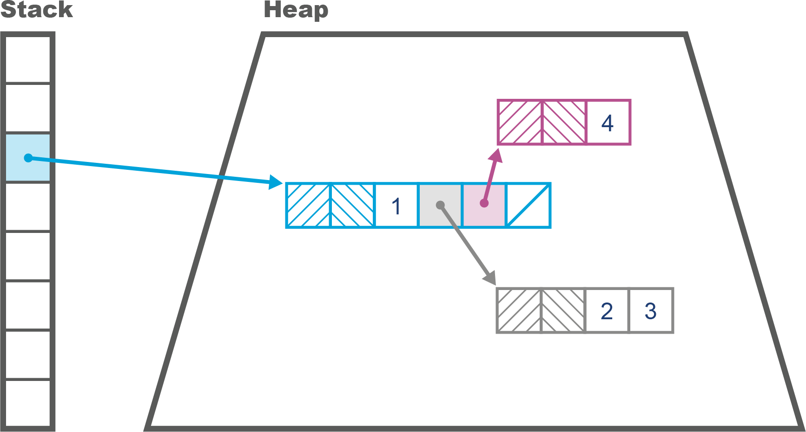

*Hình 4-1. Góc nhìn đơn giản về bố cục bộ nhớ*

Trạng thái của heap có thể khó hình dung, nhưng may mắn là có một số công cụ đơn giản giúp chúng ta. Một trong những công cụ đơn giản nhất là công cụ dòng lệnh `jmap -histo`. Nó hiển thị số byte được cấp phát cho mỗi kiểu, và số instance chịu trách nhiệm chung cho mức sử dụng bộ nhớ đó. Nó tạo ra kết quả như sau:

```
num    #instances       #bytes class name
----------------------------------------------
  1:           20839            14983608   [B
  2:          118743            12370760   [C
  3:           14528             9385360   [I
  4:             282             6461584   [D
  5:          115231             3687392   java.util.HashMap$Node
  6:          102237             2453688   java.lang.String
  7:           68388             2188416   java.util.Hashtable$Entry
  8:            8708             1764328   [Ljava.util.HashMap$Node;
  9:            39047            1561880   jdk.nashorn.internal.runtime.CompiledFunct
 10:            23688            1516032   com.mysql.jdbc.Co...$BooleanConnectionProp
 11:            24217            1356152   jdk.nashorn.internal.runtime.ScriptFunctio
 12:            27344            1301896   [Ljava.lang.Object;
 13:            10040            1107896   java.lang.Class
 14:            44090            1058160   java.util.LinkedList$Node
 15:            29375             940000   java.util.LinkedList
 16:            25944            830208    jdk.nashorn.interna...FinalScriptFunctionD
 17:               20            655680    [Lscala.concurrent.forkjoin.ForkJoinTask;
 18:            19943            638176    java.util.concurrent.ConcurrentHashMap$Nod
 19:              730            614744    [Ljava.util.Hashtable$Entry;
 20:            24022            578560    [Ljava.lang.Class;
```

Kết quả này cho thấy một ảnh chụp nhanh (snapshot) của heap (và có những công cụ khác phức tạp, mạnh mẽ hơn như Eclipse MAT), nhưng chúng ta có thể muốn thực hiện phân tích trực tiếp (live analysis) thay vì vậy.

Trong trường hợp đó, chúng ta có thể dùng các công cụ GUI như tab Sampling của VisualVM (đã giới thiệu ở Chương 3) hoặc plug-in VisualGC cho VisualVM. Những công cụ này cung cấp khung nhìn thời gian thực, có thể hữu ích để có cảm nhận nhanh về việc heap đang thay đổi ra sao.

Tuy nhiên, nhìn chung, khung nhìn từng khoảnh khắc về heap không đủ cho việc phân tích chính xác. Thay vào đó, chúng ta nên dùng công cụ như JDK Flight Recorder (JFR) hoặc GC log để có cái nhìn sâu hơn về những câu hỏi như: "Heap của tôi lớn bao nhiêu? Nó đang thay đổi thế nào? Tôi có bị rò rỉ (leak) không?"

### Bảng thuật ngữ Garbage Collection

Biệt ngữ dùng để mô tả các thuật toán GC đôi khi hơi gây bối rối (và nghĩa của một số thuật ngữ đã thay đổi theo thời gian). Để rõ ràng, chúng tôi đưa vào một bảng thuật ngữ cơ bản về cách chúng tôi dùng các thuật ngữ cụ thể:

**Stop-the-world (STW)**
: Chu kỳ GC yêu cầu tất cả application thread phải tạm dừng trong khi rác được thu gom. Điều này ngăn mã ứng dụng làm mất hiệu lực góc nhìn của thread GC về trạng thái heap. Đây là trường hợp thông thường cho các thuật toán GC đơn giản.

**Concurrent (đồng thời)**
: Các thread GC có thể chạy trong khi application thread đang chạy. Điều này khó đạt được hơn và tốn kém hơn về mặt tính toán. Bộ thu gom mặc định của HotSpot (từ Java 9) là Garbage First (G1), và nó có một số khía cạnh concurrent, như chúng ta sẽ thấy.

**Parallel (song song)**
: Nhiều thread (và nhiều core) được dùng để thực thi garbage collection.

**Exact (chính xác)**
: Một sơ đồ GC exact có đủ thông tin kiểu về trạng thái heap để đảm bảo rằng mọi rác đều có thể được thu gom trong một chu kỳ duy nhất. Nói lỏng hơn, một sơ đồ exact có tính chất là nó luôn có thể phân biệt được giữa một field là `int` và một field là tham chiếu object.

**Conservative (bảo thủ)**
: Một sơ đồ conservative thiếu thông tin của sơ đồ exact. Kết quả là các sơ đồ conservative thường xuyên lãng phí tài nguyên và thường kém hiệu quả hơn nhiều do sự thiếu hiểu biết căn bản về hệ thống kiểu mà chúng tuyên bố biểu diễn.

**Moving (di dời)**
: Trong một moving collector, object có thể được tái định vị trong bộ nhớ. Điều này có nghĩa chúng không có địa chỉ ổn định. Các môi trường (không giống Java) cung cấp truy cập trực tiếp đến con trỏ thô không phù hợp tự nhiên với moving collector.

**Compacting (nén)**
: Ở cuối chu kỳ thu gom, bộ nhớ đã cấp phát (tức các object sống sót) được sắp xếp thành một vùng liên tục duy nhất (thường ở đầu vùng), và một con trỏ chỉ ra điểm bắt đầu của không gian trống sẵn sàng để ghi object vào. Một compacting collector sẽ tránh được phân mảnh bộ nhớ.

**Evacuating (sơ tán)**
: Ở cuối chu kỳ thu gom, vùng được thu gom hoàn toàn trống rỗng, và mọi object còn sống đã được di chuyển (sơ tán) sang một vùng bộ nhớ khác. Một evacuating collector tốt sẽ tránh được phân mảnh bộ nhớ.

Trong hầu hết các ngôn ngữ và môi trường khác, cùng những thuật ngữ này được dùng — nhưng hãy cẩn thận, vì một số môi trường làm những việc như hoán đổi nghĩa của "concurrent" và "parallel", hoặc gọi "moving" là "copying".

Thuật ngữ "concurrent" cũng nên được hiểu tốt nhất như một thang trượt chứ không phải trạng thái nhị phân. Tùy vào collector đang dùng, phần công việc thu gom được thực hiện đồng thời với application thread có thể nhiều hoặc ít.

## Giới thiệu HotSpot Runtime

Bên cạnh thuật ngữ GC chung, HotSpot giới thiệu những thuật ngữ đặc thù hơn cho việc triển khai. Để hiểu đầy đủ cách garbage collection hoạt động trên JVM này, chúng ta cần nắm được một số chi tiết nội tại của HotSpot.

Với những gì tiếp theo, sẽ rất hữu ích khi nhớ rằng Java chỉ có hai loại giá trị:

- Kiểu nguyên thủy (primitive type: `byte`, `int`, v.v.)
- Tham chiếu object (object reference)

Nhiều lập trình viên Java nói một cách lỏng lẻo về "object", nhưng với mục đích của chúng ta, cần nhớ rằng khác với C++, Java không có cơ chế giải tham chiếu địa chỉ tổng quát và chỉ có thể dùng toán tử offset (toán tử `.`) để truy cập field và gọi method trên các tham chiếu object.

Cũng lưu ý rằng ngữ nghĩa gọi method của Java thuần túy là *call-by-value*, mặc dù với tham chiếu object, điều này có nghĩa giá trị được sao chép là địa chỉ của object trong heap.

### Biểu diễn Object lúc runtime

HotSpot biểu diễn các object Java lúc runtime thông qua một cấu trúc gọi là *oop*. Đây là viết tắt của *ordinary object pointer*, và nó là một con trỏ đích thực theo nghĩa của C. Những con trỏ này có thể được đặt trong các biến cục bộ kiểu tham chiếu, nơi chúng trỏ từ stack frame của method Java vào vùng bộ nhớ tạo thành Java heap.

Một điều quan trọng cần nhớ là HotSpot không dùng system call để quản lý Java heap. Như chúng ta sẽ thấy ở Chương 5, HotSpot quản lý kích thước heap từ mã user space, nên chúng ta có thể dùng các đại lượng quan sát đơn giản để xác định liệu hệ thống con GC có đang gây ra một số loại vấn đề hiệu năng hay không.

Có vài cấu trúc dữ liệu khác nhau tạo thành họ oop, và loại biểu diễn instance của một class Java được gọi là *instanceOop*, hoặc *arrayOop* nếu chúng biểu diễn một mảng. Quy tắc chung là bất cứ thứ gì trong Java heap đều phải có một object header.

Theo đó, bố cục bộ nhớ của một instanceOop bắt đầu bằng hai từ máy (machine word) header hiện diện trên mọi object (arrayOop có những từ này, cộng thêm 32 bit header nữa — chiều dài của mảng). *Mark word* là từ đầu tiên trong số này và là một con trỏ trỏ đến metadata đặc thù instance. Tiếp theo là *klass word*, trỏ đến metadata ở cấp class.

Klass word được dùng để định vị *klass metadata* (hay klass), vốn được giữ bên ngoài phần chính của Java heap (nhưng không nằm ngoài C heap của tiến trình JVM). Vì tồn tại bên ngoài Java heap, các klass không cần object header.

> **GHI CHÚ**
>
> Chữ *k* ở đầu "klass" được dùng để giúp phân biệt klass ở cấp VM với instanceOop biểu diễn object `Class<?>` của Java — chúng không phải là một.

Trong Hình 4-2, chúng ta thấy sự khác biệt trong một trường hợp đơn giản — phía trên bên trái là một object `Entry` tương tự `Map.Entry` mà ta có thể dùng trong `HashMap`, và phía trên bên phải là object `Entry.class` (ví dụ, lấy được qua `getClass()`). Cả hai object Java này đều có klass, được hiển thị bên dưới đường chấm chấm:

```java
record Entry<K,V> (int hash, K key, V value, Entry<K,V> next) {}
```

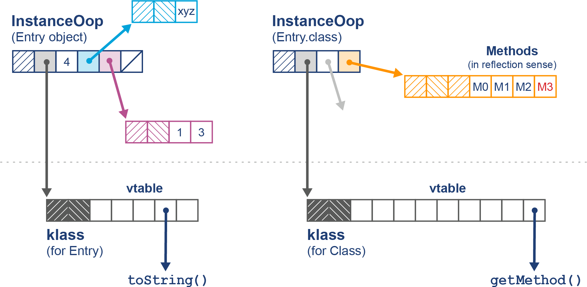

*Hình 4-2. Object Klass và Class*

Về cơ bản, klass chứa bảng hàm ảo (virtual function table hay *vtable*) cho class, trong khi object `Class` chứa (cùng nhiều thứ khác) một mảng tham chiếu đến các object `Method` để dùng trong lời gọi phản chiếu (reflective invocation). Chúng tôi sẽ nói thêm về chủ đề này ở Chương 6, khi thảo luận về biên dịch JIT.

Oop thường là từ máy, tức 32 bit trên một máy 32-bit cũ, và 64 bit trên bộ xử lý hiện đại. Tuy nhiên, điều này có tiềm năng lãng phí một lượng bộ nhớ có thể đáng kể. Để giúp giảm nhẹ, HotSpot cung cấp một kỹ thuật gọi là *compressed oops*. Nếu tùy chọn:

```
-XX:+UseCompressedOops
```

được đặt (và đây là mặc định cho heap 64-bit), thì các oop sau trong heap sẽ được nén:

- Klass word của mọi object trong heap
- Các instance field kiểu tham chiếu
- Mọi phần tử của một mảng object

Điều này có nghĩa là, nhìn chung, một object header của HotSpot bao gồm:

- Mark word ở kích thước native đầy đủ
- Klass word (có thể được nén)
- 32 bit cho biết chiều dài nếu object là mảng
- Một khoảng trống 32-bit (nếu quy tắc căn chỉnh yêu cầu)

Các instance field của object sau đó nằm ngay sau header. Bố cục bộ nhớ cho compressed oops có thể thấy ở Hình 4-3.

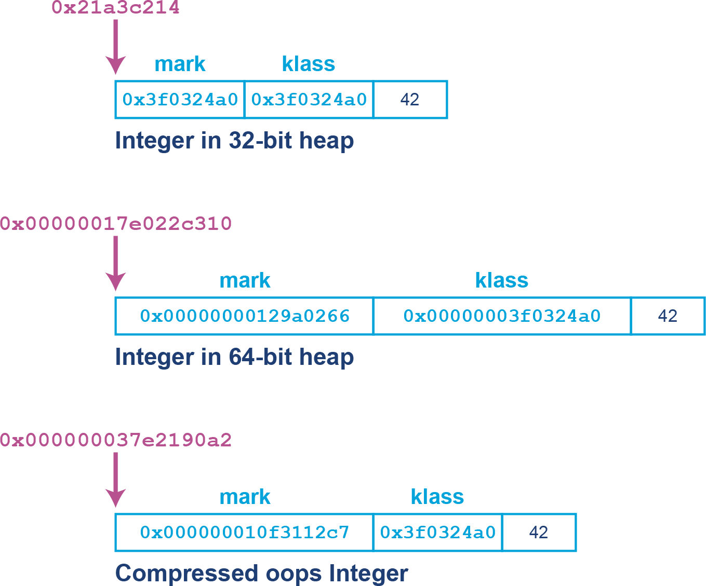

*Hình 4-3. Compressed oops*

Trước đây, một số ứng dụng cực kỳ nhạy cảm với latency thỉnh thoảng có thể thấy cải thiện khi tắt tính năng compressed oops — với cái giá là kích thước heap tăng (thường tăng 10%–50%). Tuy nhiên, lớp ứng dụng mà điều này mang lại lợi ích hiệu năng đo được là rất nhỏ. Với hầu hết ứng dụng hiện đại, đây sẽ là ví dụ kinh điển cho antipattern có tên *Fiddling with Switches* (Nghịch công tắc) — xem Phụ lục B để có mô tả đầy đủ.

Như ta nhớ từ Java cơ bản, mảng là object. Điều này có nghĩa các mảng của JVM cũng được biểu diễn dưới dạng oop. Đó là lý do mảng có một từ metadata thứ ba bên cạnh mark và klass word thông thường — chiều dài của mảng. Điều này cũng giải thích tại sao chỉ số mảng trong Java bị giới hạn ở giá trị 32-bit, bởi các phiên bản Java đầu tiên hoàn toàn dành cho kiến trúc 32-bit.

> **GHI CHÚ**
>
> Việc dùng metadata bổ sung để mang chiều dài mảng làm giảm nhẹ cả một lớp vấn đề hiện diện trong C và C++, nơi việc không biết chiều dài mảng có nghĩa là phải truyền thêm tham số cho hàm.

Môi trường được quản lý của JVM không cho phép một tham chiếu Java trỏ đến bất cứ đâu ngoài một oop (hoặc `null`). Điều này có nghĩa ở mức thấp:

- Một giá trị Java là một mẫu bit tương ứng với hoặc một giá trị nguyên thủy, hoặc địa chỉ của một oop (một tham chiếu Java).
- Bất kỳ tham chiếu Java nào được xem như con trỏ đều trỏ đến điểm bắt đầu của một object trong phần chính của Java heap.
- Các địa chỉ là đích của tham chiếu Java chứa một mark word theo sau là một klass word ở từ máy tiếp theo.
- Một klass và một instance của `Class<?>` là khác nhau (vì cái trước nằm trong vùng metadata của heap), và một klass không thể được đặt vào biến Java.

HotSpot định nghĩa một phân cấp các oop trong các file *.hpp* được giữ trong *src/hotspot/share/oops* trong cây mã nguồn OpenJDK nhánh main.

Phân cấp kế thừa tổng thể cơ bản cho oop trông như sau (tính đến Java 22):

```
oop (lớp cơ sở trừu tượng)
  instanceOop (object instance)
      stackChunkOop
    arrayOop (lớp cơ sở trừu tượng cho mảng)
     objArrayOop (mảng object)
     objArrayOop (mảng kiểu nguyên thủy)
```

Việc dùng cấu trúc oop để biểu diễn object lúc runtime, với một con trỏ chứa metadata cấp class và một con trỏ khác chứa metadata instance, không phải là điều riêng có của HotSpot — nhiều JVM và môi trường thực thi khác cũng dùng cơ chế tương tự.

### GC Roots

Các bài báo và bài blog về HotSpot thường xuyên nhắc đến *GC roots*. Đây là các "điểm neo" cho bộ nhớ, về cơ bản là những con trỏ đã biết bắt nguồn từ *bên ngoài* một memory pool đang quan tâm và trỏ *vào* đó. Chúng là các con trỏ ngoài (external pointer), đối lập với con trỏ trong (internal pointer) vốn bắt nguồn bên trong memory pool và trỏ đến một vị trí bộ nhớ khác cũng trong memory pool đó.

Chúng ta đã thấy ví dụ về GC root ở Hình 4-1. Tuy nhiên, như chúng ta sẽ thấy, còn có những loại GC root khác, bao gồm:

- Stack frame
- Java Native Interface (JNI)
- Register (thanh ghi)[^3]
- Code root (từ code cache của JVM)
- Global
- Metadata class từ các class đã nạp

Nếu định nghĩa này có vẻ khá phức tạp, thì ví dụ đơn giản nhất về GC root là một biến cục bộ kiểu tham chiếu vốn sẽ luôn trỏ đến một object trong heap (miễn nó không phải `null`).

Ở phần tiếp theo, chúng ta sẽ xem xét kỹ hơn hai đặc điểm quan trọng nhất chi phối hành vi garbage collection của bất kỳ workload Java hay JVM nào. Hiểu tốt những đặc điểm này là thiết yếu với bất kỳ lập trình viên nào muốn thực sự nắm bắt các yếu tố chi phối GC của Java (vốn là một trong những động lực tổng thể then chốt cho hiệu năng Java).

## Allocation và Lifetime

Hai động lực chính của hành vi garbage collection trong một ứng dụng Java là:

- Allocation rate (tốc độ cấp phát)
- Object lifetime (vòng đời object)

*Allocation rate* là lượng bộ nhớ được các object mới tạo sử dụng trong một khoảng thời gian nào đó (thường đo bằng MB/s). Chỉ số này không được JVM phơi bày trực tiếp theo mặc định nhưng là một đại lượng quan sát tương đối dễ ước lượng, và các công cụ như JFR có thể cung cấp nó (mặc dù có những hệ quả hiệu năng tiềm tàng khi làm vậy, như chúng ta sẽ thảo luận ở phần sau của cuốn sách).

Ngược lại, *object lifetime* thường khó đo (hoặc thậm chí khó ước lượng) hơn nhiều. Trên thực tế, một trong những lập luận chính chống lại việc dùng quản lý bộ nhớ thủ công là độ phức tạp liên quan đến việc thực sự hiểu vòng đời object cho một ứng dụng thực. Kết quả là, object lifetime nếu có gì thì còn nền tảng hơn cả allocation rate.

> **GHI CHÚ**
>
> Garbage collection cũng có thể được hiểu là "thu hồi và tái sử dụng bộ nhớ". Khả năng dùng đi dùng lại cùng một mẩu bộ nhớ vật lý, bởi các object có vòng đời ngắn, là một giả định then chốt của các kỹ thuật garbage collection.

Ý tưởng rằng object được tạo ra, tồn tại một thời gian, rồi bộ nhớ dùng để lưu trạng thái của chúng có thể được thu hồi là thiết yếu; nếu không có nó, garbage collection sẽ hoàn toàn không hoạt động. Như chúng ta sẽ thấy ở Chương 5, có một số đánh đổi khác nhau mà các garbage collector phải cân bằng — và một số đánh đổi quan trọng nhất được chi phối bởi các mối quan tâm về lifetime và allocation.

### Giả thuyết thế hệ yếu (Weak Generational Hypothesis)

Một phần then chốt trong việc quản lý bộ nhớ của JVM dựa vào một hiệu ứng runtime quan sát được của các hệ thống phần mềm, gọi là *weak generational hypothesis* (WGH):

> Phân phối vòng đời object trên JVM và các hệ thống phần mềm tương tự có dạng lưỡng đỉnh (bimodal) — với đại đa số object có vòng đời rất ngắn và một quần thể thứ cấp có kỳ vọng sống dài hơn nhiều.

Điều này có thể thấy dưới dạng đồ họa ở Hình 4-4.

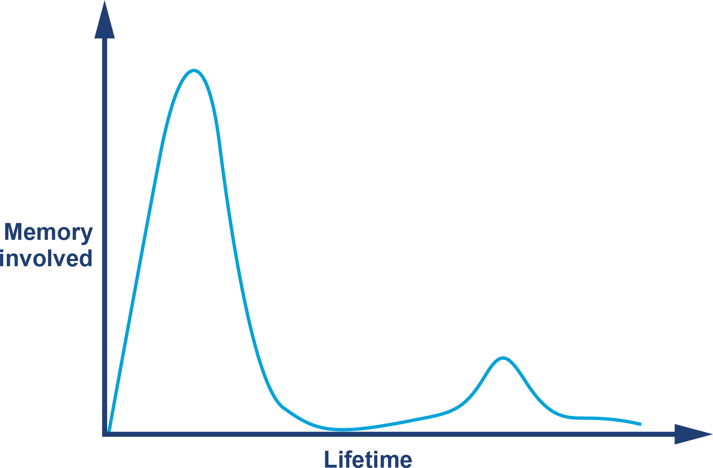

*Hình 4-4. Giả thuyết thế hệ yếu*

Giả thuyết này, vốn thực chất là một quy tắc được quan sát và kiểm chứng bằng thực nghiệm về hành vi của các workload hướng đối tượng, dẫn đến một kết luận hiển nhiên. Đó là, các heap được garbage-collect nên được cấu trúc theo cách cho phép object vòng đời ngắn được thu gom dễ dàng và nhanh chóng, và cho phép object vòng đời dài được tách khỏi object vòng đời ngắn.

Điều này ngụ ý rằng heap nên có hai vùng riêng biệt — một vùng vòng đời ngắn và một vùng vòng đời dài — và chúng nên được thu gom riêng rẽ trong các đợt thu gom *young* và *full*, tương ứng.

Một kỹ thuật then chốt là dùng thu gom mark-and-sweep trên vùng các object mới tạo — vùng này thường gọi là *Eden*. Trong quá trình sweeping, collector dùng một pha evacuation (sơ tán) để di chuyển mọi object sống sót sang không gian vòng đời dài. Sau đó toàn bộ không gian Eden có thể được thu hồi cùng một lúc.

Chúng ta có thể thấy hình ảnh về điều này ở Hình 4-5.

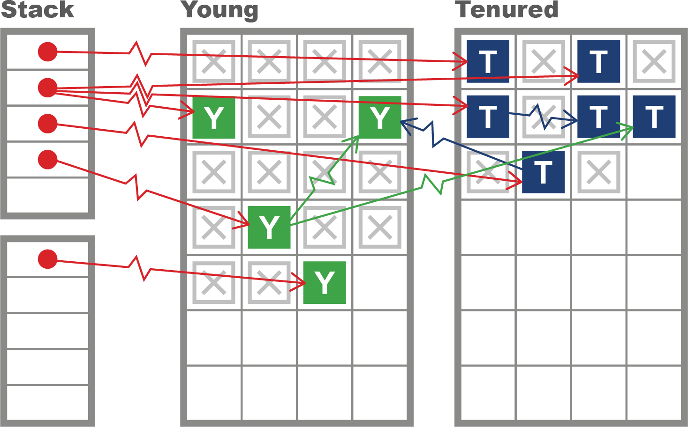

*Hình 4-5. Heap generational đơn giản*

Lưu ý rằng một trong những hệ quả chính của việc dùng heap generational là việc thu gom một object đã chết hoàn toàn không tốn gì cả — đơn giản là không có việc sổ sách nào cần làm cho nó, vì chúng ta chỉ quan tâm đến các object còn sống.

HotSpot dùng vài cơ chế để cố tận dụng weak generational hypothesis và cải thiện bức tranh về heap generational này. Chúng ta sẽ gặp một số cơ chế đó khi khám phá khả năng của một collector thực trong hai phần tiếp theo.

## Các kỹ thuật GC production trong HotSpot

Trong phần này, chúng ta sẽ xây dựng trên lý thuyết đã gặp và giới thiệu một số kỹ thuật cho phép chúng ta, ở phần tiếp theo, hiểu được cách các GC production đơn giản nhất trong HotSpot hoạt động. Hãy bắt đầu với một trong những kỹ thuật quan trọng nhất được dùng để cải thiện hiệu năng cấp phát.

### Thread-Local Allocation

Eden là vùng của heap nơi hầu hết object được tạo ra, và các object có vòng đời rất ngắn (những object có vòng đời ngắn hơn thời gian còn lại đến chu kỳ GC tiếp theo) sẽ không bao giờ nằm ở đâu khác. Vì lý do này, đây là vùng quan trọng cần quản lý hiệu quả, bởi nếu WGH đúng, thì rất nhiều object của chúng ta có thể được thu gom với chi phí bằng không.

Để cải thiện hiệu quả cấp phát, HotSpot phân chia Eden thành các buffer và giao từng vùng riêng của Eden cho các application thread dùng làm vùng cấp phát cho object mới. Ưu điểm của cách tiếp cận này là mỗi thread biết rằng nó không phải xét đến khả năng các thread khác đang cấp phát bên trong buffer đó. Những vùng này được gọi là *thread-local allocation buffer* (TLAB).

> **GHI CHÚ**
>
> HotSpot định cỡ động các TLAB mà nó giao cho application thread, nên nếu một thread đang "đốt" bộ nhớ, nó có thể được giao TLAB lớn hơn để giảm chi phí phụ trội trong việc cung cấp buffer cho thread đó.

Quyền kiểm soát độc quyền mà một application thread có với TLAB của nó có nghĩa là việc cấp phát là O(1) đối với thread JVM. Đó là bởi khi một thread tạo object mới, không gian lưu trữ được cấp phát cho object đó, và con trỏ thread-local được cập nhật đến địa chỉ bộ nhớ trống kế tiếp. Về mặt mã C, đây là một phép *pointer bump* đơn giản — tức là một chỉ thị bổ sung để dịch con trỏ "trống kế tiếp" tiến lên.

Hành vi này có thể thấy ở Hình 4-6, nơi mỗi application thread giữ một buffer riêng để cấp phát object mới.

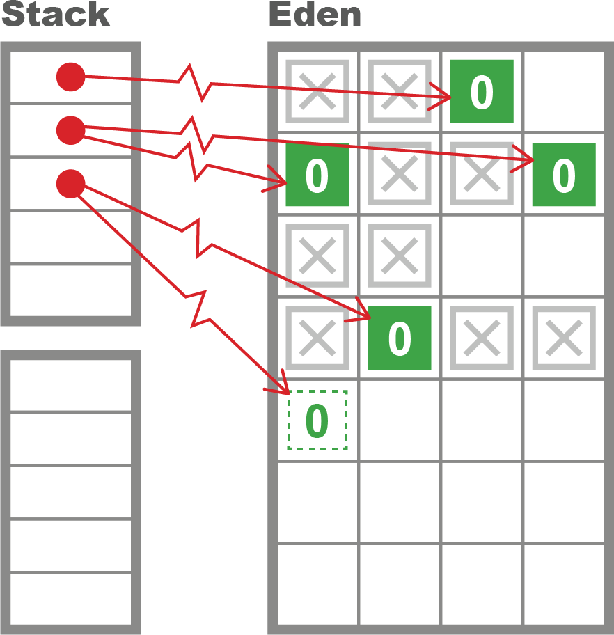

*Hình 4-6. Thread-local allocation*

Nếu một application thread lấp đầy TLAB hiện tại của nó, thì JVM cung cấp một con trỏ đến một vùng Eden mới, tức là một TLAB mới. Điều này có nghĩa một young GC sẽ xảy ra khi JVM không còn TLAB nào để giao ra.

### Thu gom bán cầu (Hemispheric Collection)

Một trường hợp đặc biệt của evacuating collector đáng được lưu ý. Đôi khi được gọi là *hemispheric evacuating collector*, loại collector này dùng hai không gian (thường có kích thước bằng nhau). Ý tưởng trung tâm là dùng các không gian này như vùng giữ tạm cho những object thực ra không có vòng đời dài. Điều này ngăn các object vòng đời ngắn làm bừa bộn thế hệ tenured và giảm tần suất full GC.

Các không gian này có vài tính chất cơ bản:

- Khi collector đang thu gom bán cầu hiện đang sống, các object được di chuyển theo kiểu nén (compacting) sang bán cầu kia, và bán cầu đã thu gom được làm trống để tái sử dụng.
- Một nửa không gian luôn được giữ hoàn toàn trống mọi lúc.

Cách tiếp cận này, tất nhiên, dùng gấp đôi lượng bộ nhớ so với lượng thực sự có thể chứa trong phần bán cầu của collector. Điều này có phần lãng phí, nhưng thường là kỹ thuật hữu ích nếu kích thước các không gian không quá lớn. HotSpot dùng cách tiếp cận bán cầu này kết hợp với không gian Eden để cung cấp một collector cho thế hệ young.

Phần bán cầu của heap young trong HotSpot được gọi là *survivor space*. Như chúng ta thấy từ khung nhìn VisualGC ở Hình 4-7, các survivor space thường tương đối nhỏ so với Eden, và vai trò của các survivor space hoán đổi cho nhau ở mỗi lần thu gom thế hệ young.

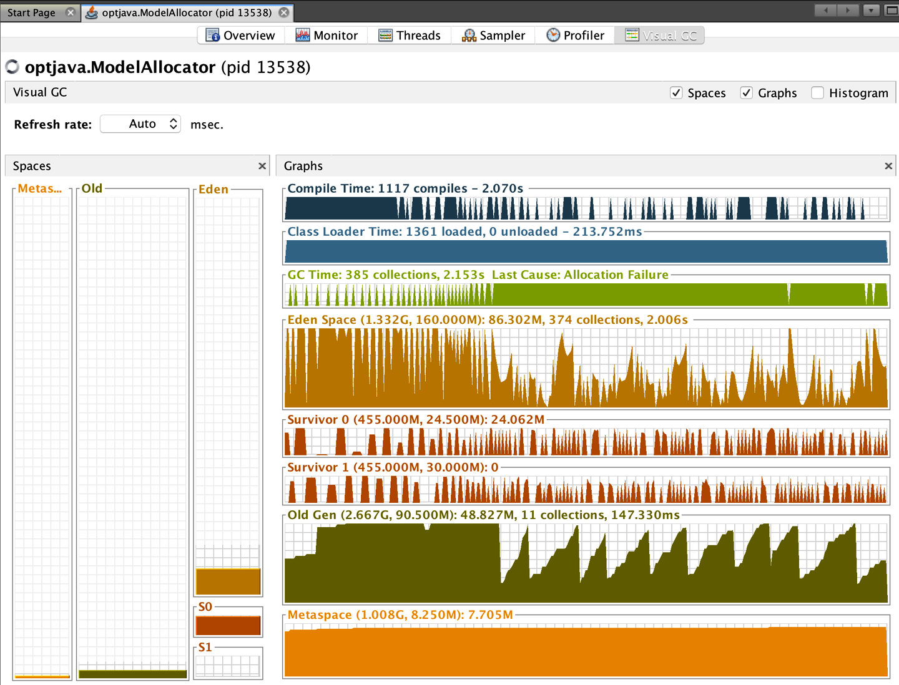

*Hình 4-7. Plug-in VisualGC*

Plug-in VisualGC cho VisualVM là một công cụ debug GC ban đầu rất hữu ích. Như chúng ta sẽ thảo luận ở Chương 5, GC log chứa nhiều thông tin hữu ích hơn và cho phép phân tích GC sâu hơn nhiều so với dữ liệu JMX từng khoảnh khắc mà VisualGC dùng. Tuy nhiên, khi bắt đầu một phân tích mới, việc đơn giản nhìn qua mức sử dụng bộ nhớ của ứng dụng thường có ích.

Dùng VisualGC, có thể thấy một số hiệu ứng tổng hợp của garbage collection, chẳng hạn object được tái định vị trong heap và việc luân chuyển giữa các survivor space xảy ra ở mỗi lần thu gom young.

### Heap HotSpot "cổ điển"

Hãy kết hợp tất cả lại và mô tả các khía cạnh cơ bản của heap HotSpot:

- Nó theo dõi "generational count" của mỗi object (số lần garbage collection mà object đó đã sống sót qua).
- Ngoại trừ các object lớn, nó tạo object mới trong không gian "Eden" (còn gọi là "nursery") và kỳ vọng di chuyển các object sống sót sang một trong hai survivor space.
- Nó duy trì một vùng bộ nhớ riêng (thế hệ "old" hay "tenured") để giữ những object được cho là đã sống sót đủ lâu để có khả năng có vòng đời dài.

Cách tiếp cận này dẫn đến khung nhìn được thể hiện dưới dạng đơn giản hóa ở Hình 4-8, nơi các object đã sống sót qua một số chu kỳ garbage collection nhất định được thăng cấp (promote) lên thế hệ tenured. Lưu ý bản chất liên tục của các vùng, như thể hiện trong sơ đồ.

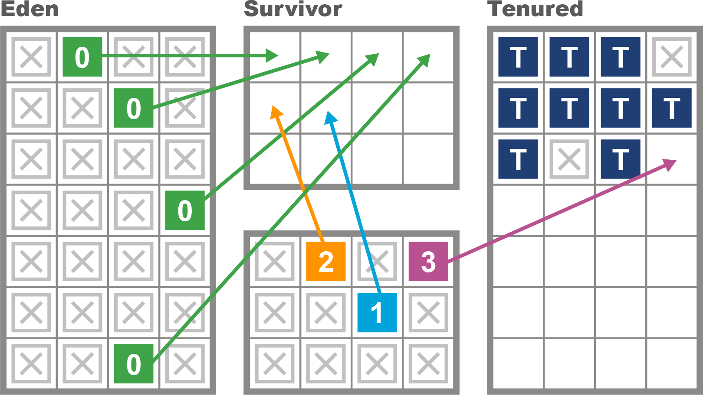

*Hình 4-8. Heap của HotSpot*

Việc chia bộ nhớ thành các vùng khác nhau cho mục đích thu gom generational có một số hệ quả bổ sung về cách HotSpot triển khai thu gom mark-and-sweep. Một kỹ thuật quan trọng liên quan đến việc theo dõi các con trỏ trỏ vào thế hệ young từ bên ngoài. Việc này giúp chu kỳ GC không phải duyệt toàn bộ đồ thị object để xác định những object young vẫn còn sống.

> **GHI CHÚ**
>
> "Có tương đối ít tham chiếu từ object old sang object young" đôi khi được nêu như một phần thứ cấp của weak generational hypothesis.

Để hỗ trợ quá trình này, HotSpot duy trì một cấu trúc gọi là *card table* để giúp ghi lại những object thế hệ old nào có thể trỏ đến object young. Card table về cơ bản là một mảng byte do JVM quản lý. Mỗi phần tử của mảng tương ứng với một vùng 512 byte của không gian thế hệ old.

> **GHI CHÚ**
>
> Sau này, chúng ta sẽ gặp *remembered set*, là phiên bản tinh vi hơn của card table.

Ý tưởng trung tâm là khi một field kiểu tham chiếu trên một object old, `o`, bị sửa đổi, thì mục card table cho card chứa oop tương ứng với `o` được đánh dấu là *dirty*. HotSpot đạt được điều này bằng một *write barrier* đơn giản khi cập nhật các field tham chiếu. Về cơ bản nó rút gọn thành đoạn mã sau được thực thi sau khi lưu field:

```c
cards[*oop >> 9] = 0;
```

Lưu ý rằng giá trị dirty cho card là `0`, và phép dịch phải 9 bit cho ta kích thước card table là 512 byte.

Cuối cùng, chúng ta nên lưu ý rằng mô tả này về heap dưới dạng các vùng young và old liên tục là một mô tả mang tính lịch sử — đây là cách các collector của Java theo truyền thống đã quản lý bộ nhớ. Các collector hiện đại, như G1, không yêu cầu lưu trữ liên tục cho các thế hệ — thay vào đó, chúng có các *region* vẫn thuộc về các thế hệ nhưng không cần nằm cạnh nhau.

Chúng tôi sẽ nói nhiều hơn về những collector theo vùng (regional collector) này, như chúng ta sẽ thấy ở phần "G1". Hiện tại, khung nhìn cổ điển về heap HotSpot cung cấp một cách tuyệt vời để vượt qua góc nhìn đơn giản, cơ bản nhất về tracing garbage collection, và là bước đầu tiên để hiểu thực tế của các collector production.

Nhớ lại rằng khác với C/C++ và các môi trường tương tự, Java không dùng hệ điều hành để quản lý bộ nhớ động. Thay vào đó, JVM cấp phát (hoặc đặt trước) bộ nhớ ngay từ đầu, khi tiến trình JVM khởi động, và quản lý một memory pool liên tục duy nhất từ user space.

Như chúng ta đã thấy, pool bộ nhớ này được tạo thành từ các vùng khác nhau với mục đích chuyên biệt, và địa chỉ mà một object cư trú sẽ rất thường xuyên thay đổi theo thời gian khi collector tái định vị object, vốn thường được tạo trong Eden. Các collector thực hiện tái định vị được gọi là collector "evacuating", như đã đề cập ở phần "Bảng thuật ngữ Garbage Collection".

Nhiều, nhưng không phải tất cả, collector đi kèm HotSpot là evacuating — hãy cùng gặp vài ví dụ đơn giản ở phần tiếp theo.

## Các Parallel Collector

Trong Java 8 và các phiên bản trước, collector mặc định của JVM là các *parallel collector*. Chúng hoàn toàn STW cho cả thu gom young lẫn full, và chúng được tối ưu cho throughput. Sau khi dừng tất cả application thread, các parallel collector dùng mọi core CPU sẵn có để thu gom bộ nhớ nhanh nhất có thể.

Các parallel collector có sẵn là:

**Parallel GC**
: Collector đơn giản nhất cho thế hệ young

**ParNew**
: Một biến thể nhỏ của Parallel GC được dùng với collector Concurrent Mark Sweep (đã bị loại bỏ)

**ParallelOld**
: Parallel collector cho thế hệ old (hay tenured)

Các parallel collector, ở một số khía cạnh, tương tự nhau — chúng được thiết kế để dùng nhiều thread nhằm xác định các object còn sống nhanh nhất có thể và thực hiện việc sổ sách ở mức tối thiểu.

> **GHI CHÚ**
>
> Từ Java 17 trở đi, collector Concurrent Mark Sweep (CMS) đã bị loại bỏ, và chỉ còn một parallel GC, với các đợt thu gom parallel young và old tạo thành Parallel GC.

Có một số khác biệt giữa các đợt thu gom khác nhau, vậy hãy xem xét kỹ hơn.

### Thu gom Young Parallel

Loại thu gom phổ biến nhất là thu gom thế hệ young. Việc này thường xảy ra khi một thread cố cấp phát một object vào Eden nhưng không có đủ không gian trong TLAB của nó, và JVM không thể cấp một TLAB mới cho thread. Khi điều này xảy ra, JVM không còn lựa chọn nào khác ngoài dừng tất cả application thread — bởi nếu một thread không thể cấp phát, thì rất sớm thôi mọi thread đều sẽ không thể.

> **GHI CHÚ**
>
> Thread cũng có thể cấp phát bên ngoài TLAB (ví dụ, cho các khối bộ nhớ lớn). Trường hợp mong muốn là khi tốc độ cấp phát ngoài TLAB thấp, vì vài lý do, ví dụ quá nhiều lần cấp phát các object lớn vòng đời ngắn sẽ buộc phải có thêm các full GC, vốn tốn kém hơn thu gom young.

Một khi tất cả application thread đã dừng, HotSpot nhìn vào thế hệ young (được định nghĩa là Eden và survivor space hiện đang không trống) và xác định mọi object không phải rác. Việc này sẽ sử dụng các GC root (và card table để xác định các GC root đến từ thế hệ old) làm điểm khởi đầu cho một lượt quét đánh dấu song song.

Collector Parallel GC sau đó sơ tán tất cả object sống sót vào survivor space hiện đang trống (và tăng generational count của chúng khi được tái định vị). Cuối cùng, Eden và survivor space vừa được sơ tán được đánh dấu là không gian trống, có thể tái sử dụng, và các application thread được khởi động lại để quá trình giao TLAB cho application thread có thể bắt đầu lại. Quá trình này được thể hiện ở Hình 4-9 và 4-10.

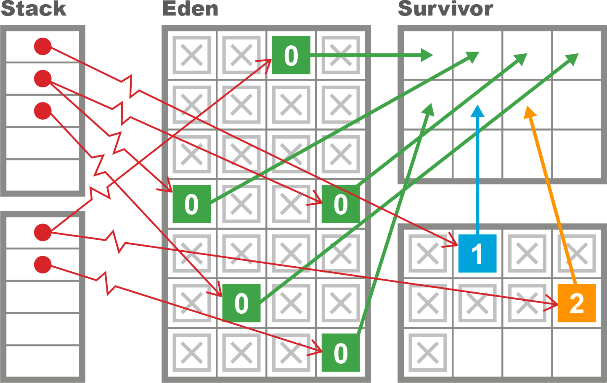

*Hình 4-9. Thu gom thế hệ young*

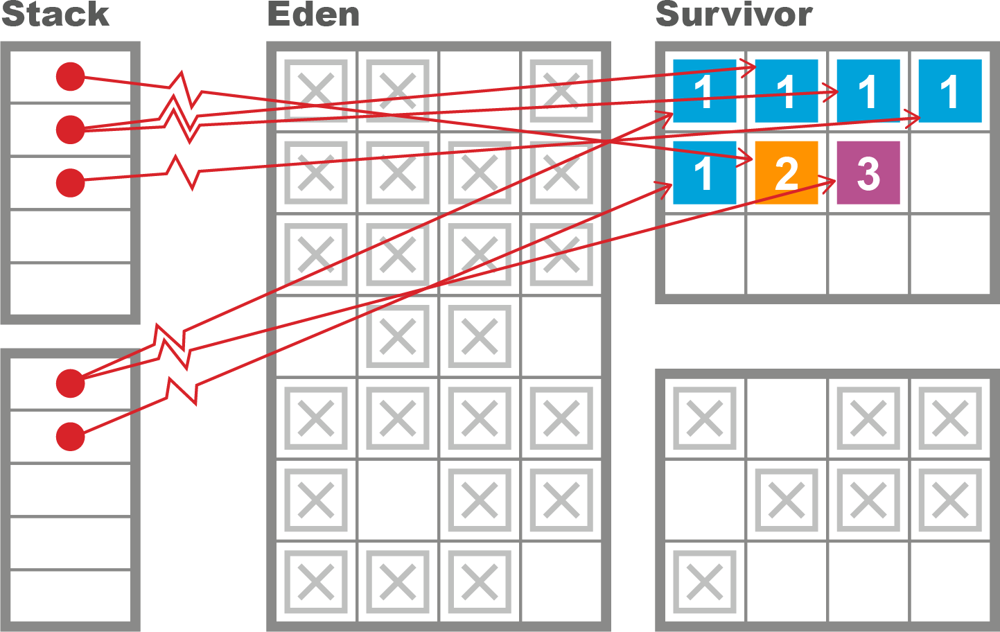

*Hình 4-10. Sơ tán thế hệ young*

Cách tiếp cận này cố tận dụng tối đa weak generational hypothesis bằng cách chỉ chạm vào các object còn sống. Nó cũng muốn hiệu quả nhất có thể và chạy sử dụng mọi core càng nhiều càng tốt để rút ngắn thời gian dừng STW.

### Thu gom Old Parallel

Collector ParallelOld là collector mặc định cho thế hệ old cho đến Java 8, và với một số ứng dụng chủ yếu quan tâm đến hiệu năng throughput bền vững, nó vẫn có thể vượt trội hơn G1.[^4]

> **GHI CHÚ**
>
> Như chúng ta sẽ thấy ở chương tiếp theo, mặc định cho Java 11+ là collector G1.

Nó có một số điểm tương đồng mạnh với Parallel GC nhưng cũng có những khác biệt căn bản. Đặc biệt, Parallel GC là một hemispheric evacuating collector, trong khi ParallelOld là một compacting collector chỉ có một không gian bộ nhớ liên tục duy nhất.

Điều này có nghĩa là vì thế hệ old không có không gian nào khác để sơ tán sang, parallel collector cố tái định vị object *bên trong* thế hệ old để thu hồi không gian có thể bị bỏ lại bởi các object old đã chết. Do đó, collector này có tiềm năng rất hiệu quả trong việc sử dụng bộ nhớ, và nó sẽ không chịu phân mảnh bộ nhớ.

Điều này cho ra một bố cục bộ nhớ rất hiệu quả với cái giá là dùng một lượng CPU có thể rất lớn trong các chu kỳ full GC. Chúng ta đã thấy cách tiếp cận evacuating ở Hình 4-9 và 4-10, và khác biệt giữa cách tiếp cận này với việc nén tại chỗ (in-place compaction) có thể thấy ở Hình 4-11.

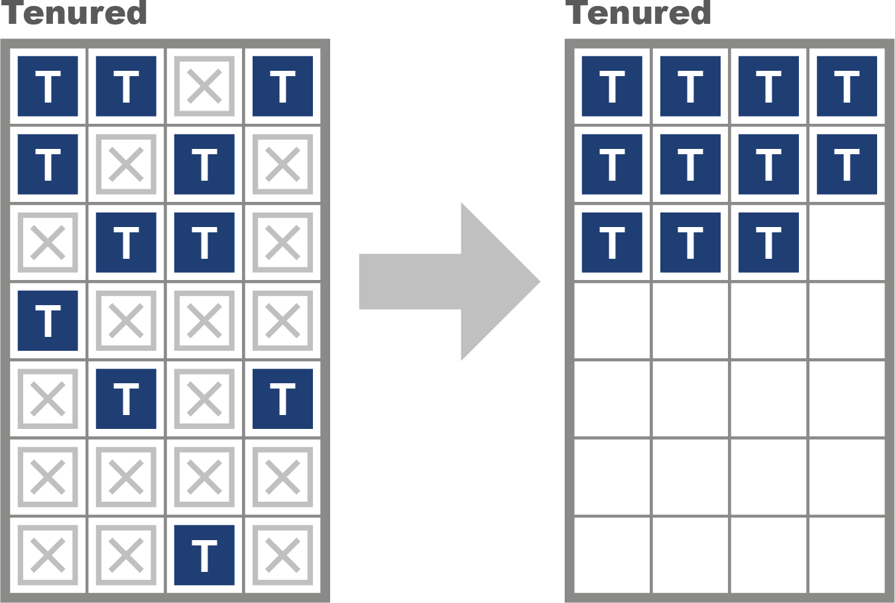

*Hình 4-11. Thu gom evacuating*

Hành vi của hai không gian bộ nhớ khác nhau hoàn toàn, vì chúng phục vụ những mục đích khác nhau. Mục đích của các đợt thu gom young là xử lý các object vòng đời ngắn, nên mức chiếm dụng của không gian young thay đổi mạnh mẽ với việc cấp phát và giải phóng tại các sự kiện GC.

Ngược lại, không gian old không thay đổi rõ rệt như vậy. Thỉnh thoảng các object lớn sẽ được tạo trực tiếp trong tenured, nhưng ngoài điều đó ra, không gian này chỉ thay đổi tại các đợt thu gom — hoặc do object được thăng cấp từ thế hệ young, hoặc do một lượt quét lại và sắp xếp lại toàn bộ tại một đợt thu gom old hay full.

### Serial và SerialOld

Các collector Serial và SerialOld được đưa vào phần này chủ yếu như một câu chuyện cảnh báo.

Chúng hoạt động tương tự Parallel GC và ParallelOld, nhưng với một khác biệt quan trọng — chúng chỉ dùng *một* core CPU để thực hiện GC. Nói thật rõ ràng — chúng *không* phải collector concurrent và vẫn hoàn toàn STW.

Trên hệ thống nhiều core, việc dùng những collector này rõ ràng là sai — vì tất cả CPU trừ một cái sẽ ngồi không trong khi một core duy nhất thực hiện STW GC. Điều này dẫn đến thời gian dừng tăng lên rất nhiều mà không có lợi ích gì, nên không nên dùng những collector này nếu không có lựa chọn có ý thức (xem "Container và GC" để biết một điểm tinh tế quan trọng).

### Giới hạn của các Parallel Collector

Các parallel collector xử lý toàn bộ nội dung của một thế hệ cùng lúc và cố thu gom hiệu quả nhất có thể. Tuy nhiên, thiết kế này có một số nhược điểm. Thứ nhất, chúng hoàn toàn stop-the-world. Điều này thường không phải vấn đề với thu gom young, vì weak generational hypothesis có nghĩa là rất ít object sẽ sống sót.

> **GHI CHÚ**
>
> Thiết kế của các young parallel collector là sao cho các object đã chết không bao giờ bị chạm vào, nên độ dài của pha marking tỷ lệ với số lượng (nhỏ) object sống sót.

Thiết kế cơ bản này, kết hợp với kích thước thường nhỏ của các vùng young trong heap, có nghĩa là thời gian dừng của thu gom young rất ngắn với hầu hết workload. Thời gian dừng điển hình cho một đợt thu gom young trên một JVM 2 GB hiện đại (với định cỡ mặc định) rất có thể chỉ vài mili-giây — và thậm chí có thể dưới mili-giây.

Tuy nhiên, việc thu gom thế hệ old thường là một câu chuyện rất khác. Thứ nhất, thế hệ old theo mặc định lớn gấp bảy lần thế hệ young. Chỉ riêng sự thật này đã khiến độ dài STW kỳ vọng của một đợt full collection dài hơn nhiều so với thu gom young.

Một thực tế then chốt khác là thời gian marking tỷ lệ với số object còn sống trong một vùng. Object old có thể có vòng đời dài, nên một lượng có thể lớn hơn các object old có thể sống sót qua một đợt full collection.

Hành vi này cũng giải thích một điểm yếu then chốt của thu gom ParallelOld — thời gian STW sẽ tăng gần như tuyến tính với kích thước heap. Khi kích thước heap tiếp tục tăng, ParallelOld bắt đầu scale kém về mặt thời gian dừng.

Những người mới đến với lý thuyết GC đôi khi ấp ủ những lý thuyết riêng rằng những sửa đổi nhỏ đối với thuật toán mark-and-sweep có thể giúp giảm nhẹ các đợt dừng STW. Tuy nhiên, điều này không đúng.

Garbage collection đã là một lĩnh vực nghiên cứu được nghiên cứu rất kỹ của khoa học máy tính trong hơn 40 năm, và các production collector rất phức tạp, với nhiều đánh đổi. Cực kỳ khó có khả năng bất kỳ tinh chỉnh kiểu "sao không thử..." nào sẽ mang lại cải thiện áp dụng được một cách tổng quát.

Như chúng ta sẽ thấy ở Chương 5, các collector *phần lớn concurrent* có tồn tại, và chúng có thể chạy với thời gian dừng giảm đi rất nhiều. Tuy nhiên, chúng không phải thuốc chữa bách bệnh, và vài khó khăn căn bản với garbage collection vẫn còn đó.

Ví dụ, hãy xét việc cấp phát TLAB. Nó tăng cường lớn cho hiệu năng cấp phát nhưng không giúp gì cho các chu kỳ thu gom. Để hiểu tại sao, hãy xét đoạn mã này:

```java
public static void main(String[] args) {
    int[] anInt = new int[1];
    anInt[0] = 42;
    Runnable r = () -> {
        anInt[0]++;
        System.out.println("Changed: "+ anInt[0]);
    };
    new Thread(r).start();
}
```

Biến `anInt` là một object mảng chứa một `int` duy nhất. Nó được cấp phát từ một TLAB do thread main giữ nhưng ngay sau đó được truyền cho một thread mới. Nói cách khác, tính chất then chốt của TLAB — rằng chúng là riêng tư với một thread duy nhất — chỉ đúng tại thời điểm cấp phát. Tính chất này có thể bị vi phạm ngay khi object đã được cấp phát.

Khả năng của môi trường Java trong việc tạo thread mới một cách dễ dàng là một phần nền tảng, và cực kỳ mạnh mẽ, của nền tảng này. Tuy nhiên, nó làm phức tạp đáng kể bức tranh cho garbage collection, vì thread mới ngụ ý các execution stack, mà mỗi frame của chúng là một nguồn GC root.

## Vai trò của Allocation

Quá trình garbage collection của Java thường được kích hoạt nhất khi có yêu cầu cấp phát bộ nhớ nhưng không có đủ bộ nhớ trống sẵn có để cung cấp lượng cần thiết. Điều này có nghĩa các chu kỳ GC không xảy ra theo lịch cố định hay dự đoán được mà thuần túy theo nhu cầu.

Đây là một trong những khía cạnh quan trọng nhất của garbage collection: nó *không mang tính quyết định* (nondeterministic) và không xảy ra theo nhịp đều đặn.[^5] Thay vào đó, một chu kỳ GC được kích hoạt khi một hoặc nhiều không gian bộ nhớ của heap về cơ bản đã đầy, và việc tạo thêm object sẽ không thể được. Điều này có nghĩa, theo ngôn ngữ của Chương 10, hành vi GC được biểu diễn dưới dạng *event*, và cần được tổng hợp để tạo ra *metric*.

> **MẸO**
>
> Bản chất theo-nhu-cầu của các sự kiện GC khiến chúng khó xử lý bằng các phương pháp phân tích chuỗi thời gian (time series) truyền thống. Việc thiếu tính đều đặn giữa các sự kiện GC là một khía cạnh mà hầu hết thư viện time series không dễ đáp ứng.

Khi một đợt STW GC xảy ra, tất cả application thread bị tạm dừng (vì chúng không thể tạo thêm object nữa, và không đoạn mã Java đáng kể nào có thể chạy lâu mà không tạo ra object mới). JVM tiếp quản mọi core để thực hiện GC và thu hồi bộ nhớ trước khi khởi động lại các application thread.

Để hiểu rõ hơn tại sao allocation lại quan trọng đến vậy, hãy xét nghiên cứu tình huống được đơn giản hóa cao sau đây. Các tham số heap được thiết lập như bên dưới, và chúng ta giả định chúng không thay đổi theo thời gian. Tất nhiên, một ứng dụng thực thường sẽ có heap tự định cỡ động, nhưng ví dụ này phục vụ như một minh họa đơn giản:

| Vùng heap | Kích thước |
|---|---|
| Tổng thể | 2 GB |
| Thế hệ old | 1.5 GB |
| Thế hệ young | 500 MB |
| Eden | 400 MB |
| SS1 | 50 MB |
| SS2 | 50 MB |

Sau khi ứng dụng đạt trạng thái ổn định, các metric GC sau được quan sát:

| Metric | Giá trị |
|---|---|
| Allocation rate | 100 MB/s |
| Thời gian Young GC | 2 ms |
| Thời gian Full GC | 100 ms |
| Object lifetime | 200 ms |

Điều này cho thấy Eden sẽ đầy trong 4 giây, nên ở trạng thái ổn định, một young GC sẽ xảy ra mỗi 4 giây. Eden đã đầy, nên GC được kích hoạt. Hầu hết object trong Eden đã chết, nhưng bất kỳ object nào vẫn còn sống sẽ được sơ tán sang một survivor space (S1, để tiện thảo luận). Trong mô hình đơn giản này, bất kỳ object nào được tạo trong 200 ms cuối chưa có thời gian chết đi, nên chúng sẽ sống sót. Vậy ta có:

| | | |
|---|---|---|
| GC0 | @ 4s | 20 MB Eden → SS1 (20 MB) |

Sau 4 giây nữa, Eden đầy lại và sẽ cần được sơ tán (sang SS2 lần này). Tuy nhiên, trong mô hình đơn giản hóa này, không object nào được thăng cấp vào SS1 bởi GC0 còn sống sót — vòng đời của chúng chỉ 200 ms, và 4 giây nữa đã trôi qua, nên tất cả object được cấp phát trước GC0 giờ đã chết. Giờ ta có:

| | | |
|---|---|---|
| GC1 | @ 8.002 s | 20 MB Eden → SS2 (20 MB) |

Một cách nói khác là sau GC1, nội dung của SS2 chỉ gồm các object mới đến từ Eden, và không object nào trong SS2 có generational age > 1. Tiếp tục thêm một đợt thu gom nữa, mẫu hình sẽ trở nên rõ ràng:

| | | |
|---|---|---|
| GC2 | @ 12.004 s | 20 MB Eden → SS1 (20 MB) |

Mô hình đơn giản, lý tưởng hóa này dẫn đến tình huống mà không object nào từng đủ điều kiện được thăng cấp lên thế hệ old, và không gian đó vẫn trống suốt quá trình chạy. Tất nhiên, điều này rất phi thực tế.

Thay vào đó, weak generational hypothesis chỉ ra rằng vòng đời object sẽ là một *phân phối*, và do sự bất định của phân phối này, một số object rốt cuộc sẽ sống sót đủ để đến tenured.

Hãy xem một trình mô phỏng rất đơn giản cho kịch bản cấp phát này. Nó cấp phát các object, hầu hết trong số đó có vòng đời rất ngắn nhưng một số có tuổi thọ dài hơn đáng kể. Nó có vài tham số định nghĩa việc cấp phát: `x` và `y`, cùng nhau định nghĩa kích thước mỗi object; allocation rate (`mbPerSec`); vòng đời của một object ngắn hạn (`shortLivedMS`) và số thread mà ứng dụng nên mô phỏng (`nThreads`). Các giá trị mặc định như sau:

```java
public class ModelAllocator implements Runnable {
    private volatile boolean shutdown = false;

    private double chanceOfLongLived = 0.02;
    private int multiplierForLongLived = 20;
    private int x = 1024;
    private int y = 1024;
    private int mbPerSec = 50;
    private int shortLivedMs = 100;
    private int nThreads = 8;
    private Executor exec = Executors.newFixedThreadPool(nThreads);
```

Bỏ qua `main()` và bất kỳ mã khởi động/thiết lập tham số nào khác, phần còn lại của `ModelAllocator` trông như thế này:

```java
    public void run() {
        final int mainSleep = (int) (1000.0 / mbPerSec);

        while (!shutdown) {
            for (int i = 0; i < mbPerSec; i++) {
                ModelObjectAllocation to =
                     new ModelObjectAllocation(x, y, lifetime());
                exec.execute(to);
                try {
                    Thread.sleep(mainSleep);
                } catch (InterruptedException ex) {
                    shutdown = true;
                }
            }
        }
    }

    // Hàm đơn giản mô hình hóa weak generational hypothesis
    // Trả về vòng đời kỳ vọng của một object - thường thì
    // rất ngắn, nhưng có xác suất nhỏ để một object
    // trở nên "long-lived"
    public int lifetime() {
        if (Math.random() < chanceOfLongLived) {
            return multiplierForLongLived * shortLivedMs;
        }

        return shortLivedMs;
    }
}
```

Bộ chạy chính của allocator được kết hợp với một mock object đơn giản dùng để đại diện cho việc cấp phát object mà ứng dụng thực hiện:

```java
public class ModelObjectAllocation implements Runnable {
    private final int[][] allocated;
    private final int lifeTime;

    public ModelObjectAllocation(final int x, final int y, final int liveFor) {
        allocated = new int[x][y];
        lifeTime = liveFor;
    }

    @Override
    public void run() {
        try {
            Thread.sleep(lifeTime);
            System.err.println(System.currentTimeMillis() +": "
                 + allocated.length);
        } catch (InterruptedException ex) {
        }
    }
}
```

Khi xem trong VisualVM, chương trình này sẽ hiển thị mẫu răng cưa (sawtooth) đơn giản thường thấy trong hành vi bộ nhớ của các ứng dụng Java sử dụng heap hiệu quả. Mẫu hình này có thể thấy ở Hình 4-12.

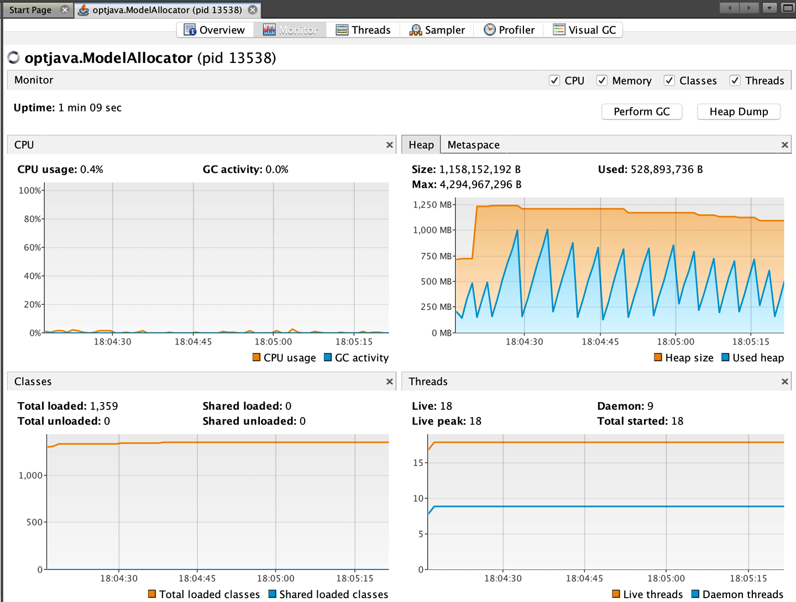

*Hình 4-12. Mẫu răng cưa đơn giản*

Độc giả quan tâm có thể tải trình mô phỏng allocation và lifetime được tham chiếu trong chương này và đặt các tham số để xem tác động của allocation rate và tỷ lệ phần trăm object vòng đời dài.

> **MẸO**
>
> Amazon cung cấp công cụ HyperAlloc, một phần của dự án Heapothesys. Công cụ benchmark này là "một workload tổng hợp mô phỏng các đặc tính ứng dụng nền tảng ảnh hưởng đến latency của garbage collector."

Để kết thúc phần thảo luận về allocation, chúng tôi muốn chuyển trọng tâm sang một khía cạnh rất phổ biến của hành vi cấp phát. Trong thế giới thực, allocation rate có thể rất hay thay đổi và "bùng nổ" (bursty). Hãy xét kịch bản sau cho một ứng dụng có hành vi trạng thái ổn định như mô tả trước đó:

| Thời gian | Hành vi |
|---|---|
| 2 s | Cấp phát trạng thái ổn định 100 MB/s |
| 1 s | Cấp phát bùng nổ/đỉnh 1 GB/s |
| 100 s | Trở lại trạng thái ổn định 100 MB/s |

Việc thực thi ở trạng thái ổn định ban đầu đã cấp phát 200 MB trong Eden. Trong trường hợp không có object vòng đời dài, toàn bộ bộ nhớ này có vòng đời 100 ms. Tiếp theo, đợt bùng nổ cấp phát bắt đầu. Nó cấp phát 200 MB không gian Eden còn lại chỉ trong 200 ms, và trong số đó, 100 MB nằm dưới ngưỡng tuổi 100 ms. Kích thước của nhóm sống sót lớn hơn survivor space, nên JVM không còn lựa chọn nào ngoài thăng cấp những object này thẳng lên tenured. Vậy ta có:

| | | |
|---|---|---|
| GC0 | @ 2.2 s | 100 MB Eden → Tenured (100 MB) |

Việc tăng vọt allocation rate đã tạo ra 100 MB object sống sót, mặc dù lưu ý rằng trong mô hình này tất cả những "kẻ sống sót" thực ra đều có vòng đời ngắn và sẽ rất nhanh chóng trở thành object chết làm bừa bộn thế hệ tenured. Chúng sẽ không được thu hồi cho đến khi một đợt full collection xảy ra.

Tiếp tục thêm vài đợt thu gom nữa, mẫu hình trở nên rõ ràng:

| | | |
|---|---|---|
| GC1 | @ 2.602 s | 200 MB Eden → Tenured (300 MB) |
| GC2 | @ 3.004 s | 200 MB Eden → Tenured (500 MB) |
| GC3 | @ 7.006 s | 20 MB Eden → SS1 (20 MB) [+ Tenured (500 MB)] |

Lưu ý rằng, như đã thảo luận, garbage collector chạy theo nhu cầu, chứ không phải theo khoảng thời gian đều đặn. Allocation rate càng lớn, GC càng thường xuyên. Nếu allocation rate quá cao, thì object rốt cuộc sẽ bị buộc phải thăng cấp sớm.

Hiện tượng này gọi là *premature promotion* (thăng cấp sớm); nó là một trong những tác động gián tiếp quan trọng nhất của garbage collection và là điểm khởi đầu cho nhiều đợt tinh chỉnh, như chúng ta sẽ thấy ở chương tiếp theo.

## Tóm tắt

Chủ đề garbage collection đã là đề tài thảo luận sôi nổi trong cộng đồng Java kể từ khi nền tảng này ra đời. Trong chương này, chúng tôi đã giới thiệu các khái niệm then chốt mà kỹ sư hiệu năng cần hiểu để làm việc hiệu quả với hệ thống con GC của JVM:

- Thu gom mark-and-sweep
- Biểu diễn runtime nội tại của HotSpot cho object
- Weak generational hypothesis
- Các vấn đề thực tiễn của hệ thống con bộ nhớ trong HotSpot
- Các collector parallel và serial
- Allocation và vai trò trung tâm của nó

Ở chương tiếp theo, chúng ta sẽ thảo luận các chủ đề trong GC hiện đại — bao gồm các concurrent collector và collector mặc định của HotSpot (G1) cũng như các lựa chọn thay thế ít phổ biến hơn như Shenandoah và ZGC.

Một số khái niệm chúng ta đã gặp trong chương này — đặc biệt là allocation và các hiệu ứng cụ thể như premature promotion — sẽ có ý nghĩa đặc biệt với chương sắp tới, và có thể sẽ hữu ích khi thường xuyên tham chiếu lại tài liệu này.

---

[^1]: Cũng có class `Unsafe` và các khả năng của nó, mà chúng ta sẽ thảo luận ở Chương 13, cùng với những lý do tại sao không nên dùng chúng.

[^2]: Trong mọi hoàn cảnh trừ những trường hợp ngoại lệ.

[^3]: Điều này có thể xảy ra trong mã đã JIT-compile khi một tham chiếu object đã được đưa lên (hoist) một thanh ghi.

[^4]: Điều này đặc biệt đúng với ứng dụng Java 8 nhưng ít đúng hơn với Java 11, và đến Java 17 thì rất khó tìm được workload nào mà Parallel vượt trội hơn G1. Bạn phải đo hiệu năng của mình trước khi đổi thuật toán GC.

[^5]: Một số GC của Java có cách cấu hình GC định kỳ, dựa trên thời gian — thực hiện GC ít nhất mỗi N (mili)giây nếu không được kích hoạt bằng cách khác. Tính năng này thoạt nhìn có vẻ hấp dẫn, nhưng trên thực tế hiếm khi hữu ích và có thể là nguồn gây vấn đề hiệu năng khi lập trình viên cố "nghĩ hơn GC".
