# Chương 5. Garbage Collection nâng cao

Ở chương trước, chúng tôi đã giới thiệu lý thuyết cơ bản về garbage collection trong Java và collector production đơn giản nhất về mặt khái niệm (Parallel). Từ điểm khởi đầu đó, chúng ta sẽ tiến lên giới thiệu một số lý thuyết về các garbage collector Java hiện đại. Sau đó, chúng tôi sẽ giới thiệu garbage collector mặc định (G1) được HotSpot (và GraalVM) sử dụng.

Nhìn chung, với hầu hết workload, G1 là đủ. Tuy nhiên, có một số kịch bản mà những đánh đổi không thể tránh khỏi của GC sẽ định hướng lựa chọn collector của kỹ sư. Vì vậy, chúng ta cũng sẽ xem xét một số collector ít gặp hơn. Đó là:

- Shenandoah
- Z Garbage Collector (ZGC)
- Balanced
- Các collector HotSpot cũ (legacy)

Lưu ý rằng không phải tất cả những collector này đều được dùng trong máy ảo HotSpot — collector Balanced mà chúng ta sẽ thảo luận là một collector từ Eclipse OpenJ9.

## Đánh đổi và Collector cắm được (Pluggable)

Một khía cạnh của nền tảng Java mà người mới không phải lúc nào cũng nhận ra ngay là: mặc dù Java có garbage collector, các đặc tả ngôn ngữ và VM *không* nói GC phải được triển khai như thế nào. Trên thực tế, đã có những triển khai Java (ví dụ Epsilon, mà bạn sẽ gặp sau, và Lego Mindstorms) hoàn toàn không triển khai bất kỳ loại GC nào![^1]

Trong môi trường Oracle/OpenJDK, hệ thống con GC được đối xử như một hệ thống con *cắm được* (pluggable). Điều này có nghĩa cùng một chương trình Java có thể thực thi với các garbage collector khác nhau mà không thay đổi ngữ nghĩa của chương trình, mặc dù hiệu năng của chương trình có thể biến động đáng kể tùy theo collector đang dùng.

Lý do chính để có collector cắm được là GC là một kỹ thuật tính toán rất tổng quát. Đặc biệt, cùng một thuật toán có thể không phù hợp với mọi workload. Kết quả là, các thuật toán GC thường đại diện cho một sự thỏa hiệp hay đánh đổi giữa những mối quan tâm cạnh tranh nhau.

> **GHI CHÚ**
>
> Không có một thuật toán GC đa dụng đơn lẻ nào có thể tối ưu đồng thời cho tất cả các mối quan tâm về GC.

Các mối quan tâm chính mà lập trình viên thường cần cân nhắc khi chọn garbage collector bao gồm:

- Thời gian dừng STW của ứng dụng (còn gọi là pause length hay duration)
- Throughput (tính theo tỷ lệ phần trăm thời gian GC so với thời gian chạy ứng dụng)
- Tần suất dừng (collector cần dừng ứng dụng bao nhiêu lần)
- Hiệu suất thu hồi (một lần GC có thể thu gom được bao nhiêu rác)
- Tính nhất quán của các lần dừng (mọi lần dừng có độ dài xấp xỉ như nhau không?)

Trong số này, pause time thường thu hút một lượng chú ý không tương xứng. Dù quan trọng với nhiều ứng dụng, nó không nên được xét một cách tách biệt.

> **MẸO**
>
> Với nhiều workload, pause time không phải là đặc tính hiệu năng hiệu quả hay hữu ích.

Hãy xét một ứng dụng xử lý theo lô (batch) có tính song song cao. Nó có khả năng quan tâm nhiều hơn đến throughput của ứng dụng chứ không phải độ dài lần dừng (hay latency ứng dụng do GC gây ra). Đó là bởi với nhiều batch job, thời gian dừng thậm chí hàng chục giây cũng không thực sự liên quan, miễn là throughput ứng dụng cao và công việc có thể hoàn thành trong cửa sổ thời gian đã định. Điều này có nghĩa một thuật toán GC ưu tiên hiệu suất CPU của GC và throughput được ưa chuộng hơn rất nhiều so với một thuật toán low-pause bằng mọi giá.

Tuy nhiên, cần biết rằng throughput tinh tế hơn vẻ ngoài ban đầu. Định nghĩa chúng tôi đưa ra là định nghĩa chuẩn, nhưng có thể việc tối ưu để có tỷ lệ thời gian trong GC thấp lại rốt cuộc phải trả giá bằng throughput của ứng dụng. Điều đó sẽ gây hại nhiều hơn lợi.

Ví dụ, giả sử một ứng dụng đang hoạt động kém vì lý do nào đó — có lẽ là một yếu tố bên ngoài. Nó sẽ tạo ra ít rác hơn, nhưng chỉ vì ít công việc được thực hiện hơn. Nếu có ít rác hơn, GC có ít việc hơn phải làm, nên tỷ lệ thời gian dành cho GC sẽ thấp hơn — nhưng điều đó không có nghĩa ứng dụng đang hoạt động tốt hơn.

Cân nhắc thứ hai liên quan đến *compaction*, một tính chất mà nhiều collector của Java có, chẳng hạn collector ParallelOld mà chúng ta gặp ở Chương 4.[^2] Compaction có xu hướng đặt các object liên quan gần nhau, và nếu chúng gần nhau hơn, việc đọc chúng hiệu quả hơn, bởi chúng có nhiều khả năng đã nằm sẵn trong cache line đúng.

Ứng dụng dành rất nhiều thời gian cấp phát và đọc bộ nhớ, nên việc bỏ thời gian làm cho điều đó nhanh hơn có thể là khoản đầu tư tốt, thậm chí phải trả giá bằng một chút thời gian thêm trong GC — như mọi khi, chúng ta phải *đo*, không đoán.

Kỹ sư hiệu năng cũng nên lưu ý rằng có một số đánh đổi và mối quan tâm khác đôi khi quan trọng khi cân nhắc lựa chọn collector.

Với Oracle/OpenJDK, tính đến phiên bản 21, có bốn collector được cung cấp. Chúng ta đã gặp các parallel collector (hay throughput collector), và chúng dễ hiểu nhất từ góc độ lý thuyết và thuật toán. Trong chương này, chúng ta sẽ gặp collector chính thống còn lại (G1) và giải thích nó khác Parallel GC ra sao.

Ở phần sau của chương, bắt đầu từ "Shenandoah", chúng ta sẽ gặp một số collector khác cũng có sẵn. Xin lưu ý rằng không phải tất cả chúng đều được khuyến nghị dùng trong production cho mọi workload, và một số hiện đã bị deprecated.

Hãy bắt đầu bằng việc thảo luận một số nền tảng của garbage collection đồng thời.

## Lý thuyết GC đồng thời

Như đã thảo luận ở chương trước, tính không xác định (nondeterminism) trong GC bị gây ra trực tiếp bởi hành vi cấp phát, và nhiều hệ thống mà Java được dùng cho thể hiện mức cấp phát rất biến động. Tệ hơn nữa, các garbage collector đa dụng không có kiến thức lĩnh vực nào để cải thiện tính xác định của các lần dừng.

Trong các hệ thống chuyên biệt, như hệ thống hiển thị đồ họa hoặc hoạt hình, thường có một tốc độ khung hình cố định, cung cấp cơ hội đều đặn, cố định để thực hiện GC. Java không cung cấp cơ chế nào cho ứng dụng để cung cấp thông tin như vậy cho GC, bởi triết lý của nền tảng là GC nên là một managed subsystem.

GC không biết chi tiết của ứng dụng, chỉ biết đồ thị các object còn sống trong heap. Điều này chỉ làm tăng thêm tính không xác định vốn có trong GC của Java.

> Nhược điểm nhỏ của cách sắp xếp này là sự trì hoãn việc tính toán thực sự; nhược điểm lớn của nó là tính không thể dự đoán của những khoảng nghỉ thu gom rác đó.[^3]
>
> — Dijkstra và cộng sự

Điểm khởi đầu cho lý thuyết GC hiện đại là cố gắng giải quyết nhận định của Dijkstra rằng bản chất không xác định của các lần dừng STW (cả về thời lượng lẫn tần suất) là phiền toái lớn nhất của việc dùng kỹ thuật GC.

Một cách tiếp cận là dùng một collector *concurrent* (hoặc ít nhất là một phần hoặc phần lớn concurrent) để giảm thời gian dừng bằng cách thực hiện một phần công việc cần thiết cho việc thu gom trong khi các application thread đang chạy. Điều này chắc chắn làm giảm năng lực xử lý sẵn có cho công việc thực sự của ứng dụng, cũng như làm phức tạp thêm mã cần thiết để thực hiện thu gom.

Tuy nhiên, trước khi thảo luận về concurrent collector, có một phần thuật ngữ và công nghệ GC quan trọng của Java mà chúng ta cần giải quyết, vì nó thiết yếu để hiểu bản chất và hành vi của các garbage collector hiện đại.

### JVM Safepoint

Để thực hiện một đợt STW garbage collection, như những đợt do các parallel collector của HotSpot thực hiện, tất cả application thread phải được dừng lại. Điều này có vẻ gần như một điều hiển nhiên, nhưng đến giờ chúng ta chưa thảo luận chính xác JVM đạt được điều đó như thế nào.

> **GHI CHÚ**
>
> JVM thực ra không phải là một môi trường đa luồng hoàn toàn ưu tiên (preemptive) — đây là một bí mật công khai trong thế giới Java.

Điều này không có nghĩa nó thuần túy là môi trường hợp tác — hoàn toàn ngược lại. Hệ điều hành vẫn có thể preempt (loại một thread khỏi core) bất cứ lúc nào. Việc này được thực hiện, ví dụ, khi một thread đã dùng hết timeslice của nó hoặc tự đưa mình vào `wait()`.

Bên cạnh chức năng cốt lõi này của OS, JVM cũng cần thực hiện các hành động phối hợp. Để hỗ trợ điều này, runtime yêu cầu mỗi application thread phải có những điểm thực thi đặc biệt, gọi là *safepoint*, nơi cấu trúc dữ liệu nội tại của thread ở trạng thái được biết là tốt. Vào những lúc đó, thread có thể bị tạm dừng cho các hành động phối hợp.

> **GHI CHÚ**
>
> Chúng ta có thể thấy tác động của safepoint trong STW GC (ví dụ kinh điển) và đồng bộ hóa thread, nhưng cũng còn những trường hợp khác.

Để hiểu mục đích của safepoint, hãy xét trường hợp một garbage collector hoàn toàn STW, như Parallel. Để nó chạy được, cần có một đồ thị object ổn định. Điều này có nghĩa tất cả application thread phải tạm dừng.

Không có cách nào để một GC thread (chạy trong user space) yêu cầu OS cưỡng chế điều kiện này lên một application thread, nên các application thread (vốn thực thi như một phần của tiến trình JVM) phải *hợp tác* để đạt được điều đó.

Có hai quy tắc chính chi phối cách tiếp cận safepointing của JVM:

- JVM không thể ép một thread vào trạng thái safepoint.
- JVM có thể ngăn một thread rời khỏi trạng thái safepoint.

Điều này có nghĩa việc triển khai trình thông dịch JVM phải chứa mã để nhường quyền (yield) tại một barrier nếu safepointing được yêu cầu. Với các method đã JIT-compile, các barrier tương đương phải được chèn vào mã máy được sinh ra. Vậy trường hợp tổng quát để đạt tới safepoint trông như sau:

1. JVM đặt một cờ toàn cục "time to safepoint".
2. Từng application thread poll và thấy cờ đã được đặt.
3. Chúng tạm dừng và chờ được đánh thức lại.

Khi cờ này được đặt, mọi app thread phải dừng. Các thread dừng nhanh phải chờ những thread dừng chậm hơn (và thời gian này có thể không được tính đầy đủ trong thống kê pause time).

Các app thread thông thường dùng cơ chế polling này. Chúng sẽ luôn kiểm tra giữa việc thực thi bất kỳ hai bytecode nào trong trình thông dịch.[^4] Trong mã đã biên dịch, những trường hợp phổ biến nhất mà trình biên dịch JIT chèn một poll cho safepoint là khi thoát khỏi một method đã biên dịch và khi một vòng lặp nhảy ngược (ví dụ, về đầu vòng lặp).

Một thread có thể mất nhiều thời gian để đến safepoint, và về lý thuyết thậm chí không bao giờ dừng (nhưng đây về cơ bản là trường hợp bệnh lý phải được cố tình gây ra).

> **GHI CHÚ**
>
> Ý tưởng rằng mọi thread phải dừng hoàn toàn trước khi pha STW có thể bắt đầu tương tự việc dùng latch, chẳng hạn như `CountDownLatch` trong thư viện `java.util.concurrent`.

Một số trường hợp cụ thể về điều kiện safepoint đáng được nhắc đến ở đây.

Một thread tự động ở safepoint nếu nó:

- Đang bị block trên một monitor
- Đang thực thi mã JNI

Một thread không nhất thiết ở safepoint nếu nó:

- Đang thực thi dở một bytecode (chế độ thông dịch)
- Đã bị OS ngắt
- Đang trong mã đã JIT và không ở một safepoint tường minh

Bạn sẽ gặp lại cơ chế safepointing ở phần sau, vì nó là một mảnh quan trọng trong hoạt động nội tại của JVM.

Hãy chuyển sang thảo luận một mảng lý thuyết khoa học máy tính kinh điển vốn nền tảng để hiểu garbage collection đồng thời.

### Đánh dấu ba màu (Tri-Color Marking)

Bài báo năm 1978 của Dijkstra và Lamport mô tả thuật toán đánh dấu ba màu của họ là một cột mốc cho cả việc chứng minh tính đúng đắn của thuật toán đồng thời lẫn cho GC, và thuật toán cơ bản mà nó mô tả vẫn là phần quan trọng của lý thuyết garbage collection.

Thuật toán hoạt động bằng cách duy trì một tập các node *xám*, là những node đã được phát hiện nhưng chưa được xử lý đầy đủ. Thuật toán chạy như sau:

- Các GC root được tô màu xám.
- Mọi node (object) khác được tô màu trắng.
- Một thread đánh dấu chọn ngẫu nhiên một node xám.
- Nếu node đó không có node con màu trắng nào, thread đánh dấu tô node đó thành đen.
- Ngược lại, thread đánh dấu di chuyển đến một node con màu trắng và tô nó thành xám.
- Quá trình này lặp lại cho đến khi không còn node xám nào.
- Mọi object đen đã được chứng minh là tiếp cận được và phải giữ sống.
- Các node trắng đủ điều kiện để thu gom và tương ứng với những object không còn tiếp cận được.

Có một số phức tạp, nhưng đây là dạng cơ bản của thuật toán. Một ví dụ được thể hiện ở Hình 5-1.

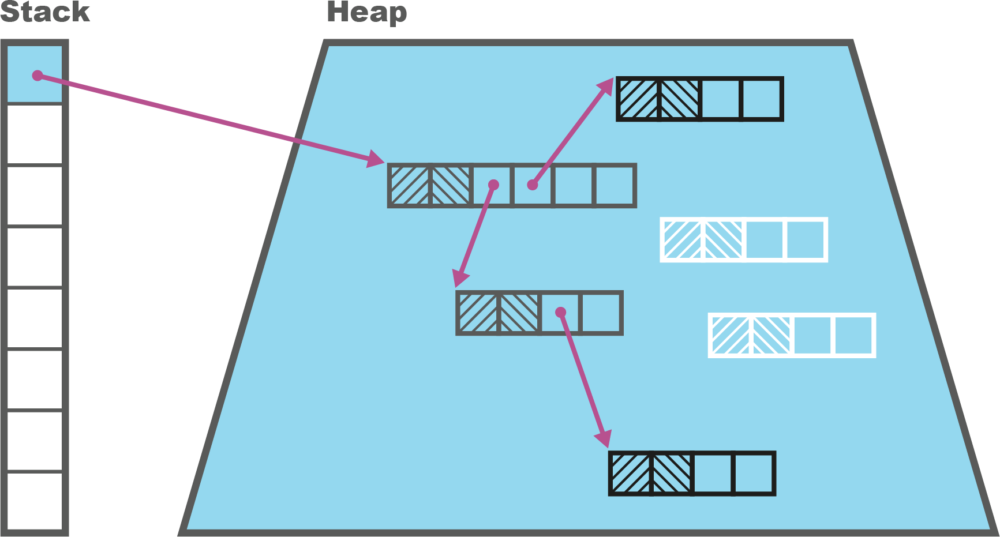

*Hình 5-1. Đánh dấu ba màu*

Thu gom đồng thời cũng thường xuyên dùng một kỹ thuật gọi là *snapshot at the beginning* (SATB — ảnh chụp tại thời điểm bắt đầu). Điều này có nghĩa collector coi các object là còn sống nếu chúng tiếp cận được vào lúc bắt đầu chu kỳ thu gom hoặc đã được cấp phát kể từ đó. Điều này thêm vài nếp gấp nhỏ vào thuật toán, chẳng hạn các mutator thread cần tạo object mới ở trạng thái *đen* nếu một đợt thu gom đang chạy và ở trạng thái *trắng* nếu không có đợt thu gom nào đang diễn ra.

Thuật toán đánh dấu ba màu cần được kết hợp với một lượng nhỏ công việc bổ sung để đảm bảo những thay đổi do các application thread đang chạy gây ra không khiến các object còn sống bị thu gom. Đó là bởi trong một concurrent collector, các application thread (mutator) đang thay đổi đồ thị object, trong khi các thread đánh dấu đang thực thi thuật toán ba màu.

Hãy xét tình huống một object đã được thread đánh dấu tô đen, rồi được một mutator thread cập nhật để trỏ đến một object trắng. Đây là tình huống thể hiện ở Hình 5-2.

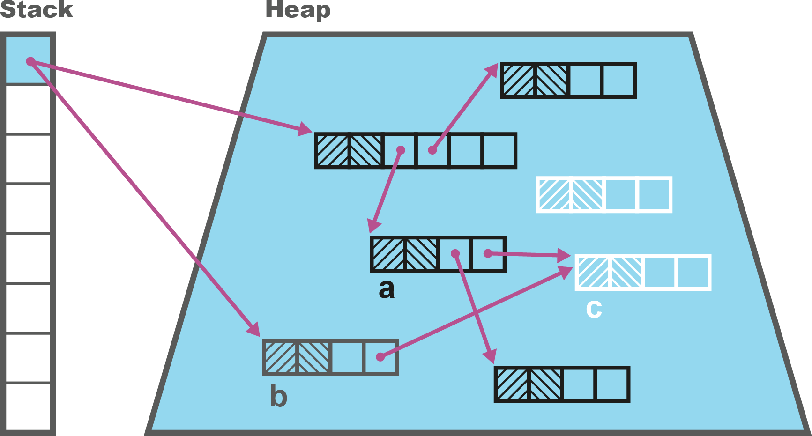

*Hình 5-2. Một mutator thread có thể làm mất hiệu lực đánh dấu ba màu*

Nếu tất cả tham chiếu từ object xám đến object trắng mới giờ bị xóa, chúng ta có tình huống mà object trắng lẽ ra vẫn tiếp cận được nhưng sẽ bị xóa, vì nó sẽ không được tìm thấy theo các quy tắc của thuật toán.

Vấn đề này có thể được giải quyết theo vài cách khác nhau. Ví dụ, chúng ta có thể đổi màu object đen trở lại thành xám, đưa nó trở lại tập các node cần xử lý khi mutator thread xử lý việc cập nhật.

Cách tiếp cận đó, dùng một "write barrier" cho việc cập nhật, sẽ có tính chất thuật toán tốt là nó duy trì bất biến ba màu (tri-color invariant) xuyên suốt toàn bộ chu kỳ đánh dấu.

> **GHI CHÚ**
>
> Bất biến ba màu: không node object đen nào được giữ tham chiếu đến một node object trắng trong quá trình đánh dấu đồng thời.

Tuy nhiên, điều này đi kèm cái giá — nó phá hủy một tính chất ("tính đơn điệu" — monotonicity) cần thiết cho một chứng minh đơn giản rằng thuật toán đánh dấu sẽ kết thúc.

Một cách tiếp cận thay thế là giữ một hàng đợi mọi thay đổi có khả năng vi phạm bất biến, rồi có một pha "fixup" thứ cấp chạy sau khi pha chính kết thúc. Pha fixup này, tất yếu, phải là một pha STW, nhưng trên thực tế nó thường rất ngắn.

Collector đa dụng hiện đại G1 dùng cách tiếp cận thứ hai (gọi là pha *remark*) — chúng ta sẽ thảo luận điều này chi tiết hơn khi gặp nó ở phần "G1".[^5] Trước hết, hãy nói về những kỹ thuật quan trọng khác cho garbage collection đồng thời.

### Forwarding Pointer

Trong phần này, chúng ta sẽ thảo luận việc sử dụng *forwarding pointer*. Chúng cũng được gọi là *Brooks pointer* theo tên người phát minh, Rodney Brooks.[^6] Kỹ thuật này, ở dạng đơn giản nhất, dùng một từ bộ nhớ bổ sung cho mỗi object để chỉ ra liệu object đã được tái định vị trong một pha garbage collection trước đó hay chưa, và để cho biết vị trí của phiên bản mới của nội dung object.

Bố cục heap kết quả (như được dùng bởi các phiên bản đầu của collector Shenandoah, chẳng hạn) cho các object pointer (oop) của nó có thể thấy ở Hình 5-3. Lưu ý rằng nếu object chưa được tái định vị, thì Brooks pointer đơn giản trỏ vào đầu object header.

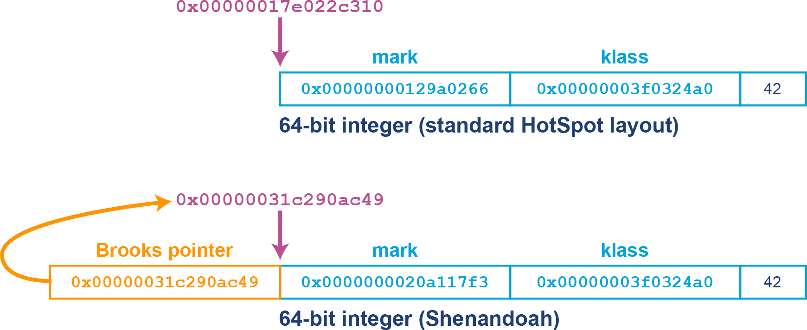

*Hình 5-3. Brooks pointer*

> **GHI CHÚ**
>
> Cơ chế Brooks pointer dựa vào sự sẵn có của các thao tác compare-and-swap (CAS) ở mức phần cứng để cung cấp cập nhật nguyên tử cho địa chỉ forwarding.

Trong một pha đánh dấu đồng thời, các thread collector truy vết qua heap và đánh dấu bất kỳ object nào còn sống. Nếu một tham chiếu object trỏ đến một oop có forwarding pointer, thì tham chiếu đó được cập nhật để trỏ trực tiếp đến vị trí oop mới. Điều này có thể thấy ở Hình 5-4.

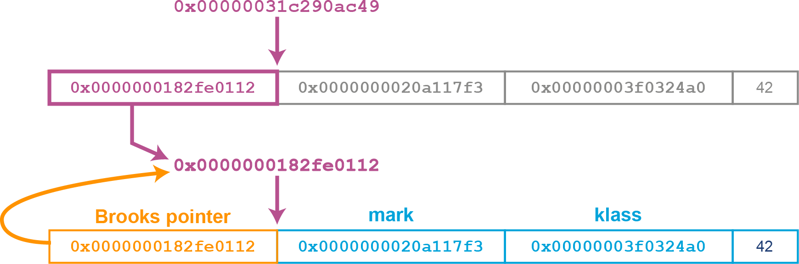

*Hình 5-4. Cập nhật forwarding pointer*

Đây có thể là kỹ thuật hữu ích, nhưng nhược điểm rõ ràng của nó là đòi hỏi thêm một từ bộ nhớ cho mỗi object. Ví dụ, điều này làm tăng không gian heap cần cho một object `Integer` từ 20 lên 28 byte. Đây có thể là một chi phí phụ trội đáng kể.

Kỹ thuật này được Shenandoah và các collector nâng cao khác sử dụng — chúng tôi sẽ nói thêm về việc sử dụng thực tế của nó sau, bao gồm những cách giảm nhẹ yêu cầu bộ nhớ tăng thêm.

Hãy chuyển sang chủ đề lớn tiếp theo — collector G1, vốn là mặc định cho máy ảo HotSpot với các phiên bản Java mới hơn 8.

## G1

G1 (collector "Garbage First") là một kiểu collector rất khác so với các parallel collector. Nó lần đầu được giới thiệu ở dạng cực kỳ thử nghiệm và không ổn định trong Java 6, nhưng đã được viết lại rộng rãi trong suốt vòng đời của Java 7, và trở nên ổn định, sẵn sàng cho production với bản phát hành Java 8u40.

> **MẸO**
>
> Chúng tôi không khuyến nghị dùng G1 với bất kỳ phiên bản Java nào trước 8u40, bất kể loại workload đang xét là gì.

G1 ban đầu được dự định là collector low-pause thay thế, kế nhiệm collector Concurrent Mark Sweep (CMS) (hiện không còn được hỗ trợ). Nó được thiết kế để trở thành một collector:

- Dễ tinh chỉnh hơn nhiều so với CMS
- Ít bị ảnh hưởng bởi premature promotion
- Có khả năng scale tốt hơn (đặc biệt về pause time) trên các heap lớn
- Có thể giảm đáng kể nhu cầu phải quay về full STW collection

Tuy nhiên, theo thời gian, G1 tiến hóa để được xem như một collector đa dụng hơn. Nó trở thành collector mặc định trong Java 9, thay thế cho các parallel collector. G1 tiếp tục được cải thiện qua các bản phát hành Java kế tiếp — nó được cải thiện rất nhiều ở Java 11, và còn tốt hơn nữa ở Java 17 và 21.

Một trong những khái niệm quan trọng nhất trong G1 là *pause goal* (mục tiêu thời gian dừng). Chúng cho phép lập trình viên chỉ định lượng thời gian tối đa mong muốn mà ứng dụng nên tạm dừng ở mỗi chu kỳ garbage collection.

Lưu ý rằng đây được diễn đạt như một *mục tiêu*, và không có gì đảm bảo ứng dụng sẽ đáp ứng được. Nếu giá trị này được đặt quá thấp, thì hệ thống con GC sẽ không thể đáp ứng mục tiêu.

Giá trị mặc định cho pause goal là 200 ms — nhưng trên thực tế, các lần dừng thường ít hơn nhiều, nên giá trị mặc định thường ổn với hầu hết ứng dụng có kích thước heap điển hình. Với các ứng dụng có heap rất lớn (hàng chục hoặc hàng trăm gigabyte), pause goal có thể cần được điều chỉnh.

> **GHI CHÚ**
>
> Garbage collection được thúc đẩy bởi allocation, vốn có thể rất khó dự đoán với nhiều ứng dụng Java. Điều này có thể hạn chế hoặc phá hủy khả năng đáp ứng pause goal của G1.

Một khác biệt lớn khác trong thiết kế của collector G1 là nó tư duy lại khái niệm *thế hệ* (generation) như chúng ta đã gặp đến giờ. Cụ thể, không giống các parallel collector, G1 không có các không gian bộ nhớ chuyên dụng, liên tục cho mỗi thế hệ, mà thay vào đó giới thiệu các *region* (vùng).

### Bố cục heap và Region của G1

Heap của G1 dựa trên khái niệm các region kích thước cố định tạo nên một thế hệ. Đây là những vùng mặc định có kích thước 1 MB (nhưng lớn hơn trên các heap lớn hơn). Việc dùng region cho phép các thế hệ không liên tục và làm cho việc có một collector không cần thu gom toàn bộ rác ở mỗi lần chạy (thu gom tăng dần — incremental collection) trở nên khả thi.

> **GHI CHÚ**
>
> Heap G1 tổng thể vẫn liên tục trong bộ nhớ — chỉ là phần bộ nhớ tạo nên mỗi thế hệ thì không cần phải liên tục nữa.

Bố cục dựa trên region của heap G1 có thể thấy ở Hình 5-5.

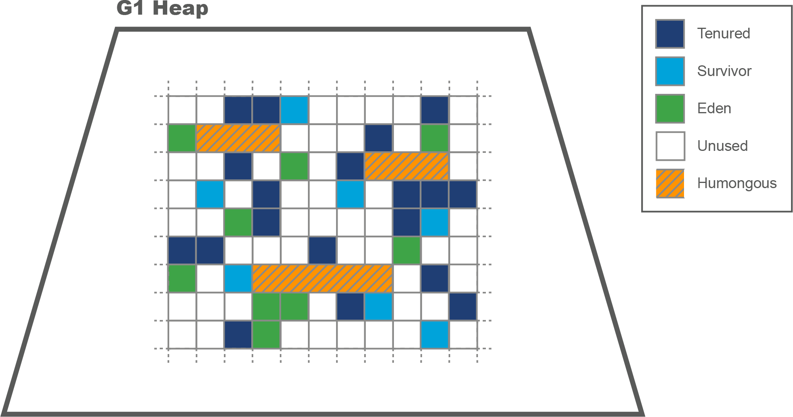

*Hình 5-5. Các region của G1*

Như bạn thấy, G1 vẫn có khái niệm thế hệ young tạo thành từ các region Eden và survivor.

Tính đến Java 21, thuật toán của G1 cho phép các region có kích thước lũy thừa của 2 MB — tức 1, 2, 4… MB, với kích thước tối đa là 512 MB. Theo mặc định, nó kỳ vọng có từ 2.048 đến 4.095 region trong heap và sẽ điều chỉnh kích thước region để đạt được điều này.

Để tính kích thước region, chúng ta tính giá trị này:

```
<Kích thước heap> / 2048
```

rồi làm tròn xuống giá trị kích thước region được phép gần nhất. Sau đó có thể tính số region:

```
Số region = <Kích thước heap> / <kích thước region>
```

Như thường lệ, chúng ta có thể thay đổi giá trị kích thước region bằng cách áp dụng một tùy chọn cấu hình, nhưng trên thực tế điều này hiếm khi cần thiết.

Nếu một ứng dụng tạo ra một object chiếm nhiều không gian hơn một nửa kích thước region, thì nó được coi là *humongous object* (object khổng lồ).

Những object này được cấp phát trực tiếp trong các *humongous region* đặc biệt, là các region trống, liên tục được đưa ngay vào thế hệ tenured (thay vì Eden). Trường hợp điển hình cho điều này là các mảng lớn (vì mảng là object trong Java).

### Các đợt thu gom của G1

G1 có hai loại thu gom:

**Young GC (hay G1New)**
: Các region cần thu gom chỉ bao gồm region young.

**Mixed GC (hay G1Old)**
: Tập thu gom chứa cả region young lẫn old.

Một đợt thu gom young là đợt thu gom STW nhằm thu hồi càng nhiều heap càng nhanh càng tốt. Nó làm vậy bằng cách sơ tán hoàn toàn các region để chúng có thể được tái sử dụng ngay lập tức.

Trong khi khởi động (warming up), collector theo dõi thống kê về việc có bao nhiêu region "điển hình" có thể được thu gom mỗi lần chạy GC. Nếu có thể thu gom đủ bộ nhớ để cân bằng với các object mới đã được cấp phát kể từ lần GC trước, thì collector không bị thua allocation, và các đợt thu gom G1New sẽ tiếp tục. Điều này có nghĩa pause time có thể được kiểm soát, miễn là collector đi trước được allocation rate.

Một đợt mixed collection là đợt thu gom phần lớn đồng thời, được dùng khi số lượng object old đã tăng đủ mức khiến một đợt thu gom young không còn đủ để thu hồi đủ bộ nhớ cân bằng với allocation. Vào thời điểm này, đáng để bỏ thêm nỗ lực thu hồi các object old và tăng số region trống.

Thời điểm mà một mixed collection sẽ bắt đầu được gọi là ngưỡng *Initiating Heap Occupancy Percent* (IHOP). G1 tự động xác định IHOP dựa trên hành vi ứng dụng trước đó. Giá trị khởi tạo mặc định là 45% (nhưng có thể thay đổi bằng một config switch), và ứng dụng sẽ điều chỉnh lên xuống một cách thích ứng.

Điều này cho ta một bức tranh mức cao hợp lý về collector, tức là G1:

- Là một collector generational, theo region
- Là một collector evacuating
- Cung cấp "nén thống kê" (statistical compaction)
- Dùng một pha đánh dấu đồng thời (cho các mixed collection)

Các khái niệm cấp phát TLAB, sơ tán sang survivor space, và thăng cấp lên tenured về đại thể tương tự các GC HotSpot khác bạn đã gặp.

Tuy nhiên, các đợt mixed collection của G1 phức tạp hơn một chút so với những đợt thu gom chúng ta đã thảo luận, vậy hãy xem xét kỹ hơn.

### Mixed Collection của G1

Một trong những khía cạnh thường bị bỏ qua nhất của G1, kỳ lạ thay, chính là sức mạnh lớn của nó. Cụ thể, các mixed collection của G1 phần lớn chạy đồng thời với application thread. Theo mặc định, một số core sẵn có (ít nhất một) sẽ thực hiện các pha đồng thời của G1, và nửa còn lại sẽ tiếp tục thực thi mã ứng dụng.

> **GHI CHÚ**
>
> Công thức chính xác cho `ConcGCThreads` — số core dùng cho GC đồng thời — hơi phức tạp:
>
> ```
> max(1, (ParallelGCThreads + 2) / 4)
> ```
>
> trong đó `ParallelGCThreads` thường là số core, ít nhất trên các máy nhỏ.

Điều này có hai hệ quả chính:

- Throughput ứng dụng bị giảm trong khi một mixed collection đang chạy.
- Có thể ứng dụng cần thực hiện một young GC trong khi một đợt thu gom đồng thời đang diễn ra.

Lưu ý rằng trong trường hợp một young GC cần chạy trong lúc mixed collection, nó thường sẽ mất nhiều thời gian hơn bình thường để hoàn tất, vì young GC chỉ có số core bị giảm bớt để làm việc.

G1Old có bốn pha:

1. Concurrent Start (bao gồm một đợt STW G1New)
2. Concurrent Mark
3. Remark (STW)
4. Cleanup (STW)

Pha Concurrent Mark thường mất nhiều thời gian hơn hẳn các pha khác. Điều này có nghĩa với phần lớn thời gian chạy của nó, G1Old chạy song song với application thread. Tuy nhiên, với ba pha (Concurrent Start, Remark và Cleanup), tất cả application thread phải dừng. Hiệu ứng tổng thể (so với ParallelOld) là thay thế một lần dừng STW dài duy nhất bằng ba lần dừng STW, thường rất ngắn.

Mục đích của pha Concurrent Start là cung cấp một tập điểm khởi đầu ổn định cho GC nằm trong mỗi region; đây là các GC root cho mục đích của chu kỳ thu gom. Sau khi việc đánh dấu ban đầu kết thúc, pha Concurrent Mark bắt đầu. Về cơ bản pha này chạy một dạng thuật toán đánh dấu ba màu trên heap, theo dõi mọi thay đổi có thể cần fixup sau này.

Sau Concurrent Mark, G1Old phải sửa lại bản ghi của mình để tránh vi phạm quy tắc đầu tiên của garbage collector — thu gom một object vẫn còn sống. Đây là pha Remark, và một lượng công việc đáng kể đã được thực hiện để loại bỏ các tác vụ khỏi pha STW này và chuyển chúng vào pha Concurrent Mark.[^7]

Pha Cleanup phần lớn là STW và bao gồm các tác vụ hạch toán xác định những region giờ đã hoàn toàn trống và sẵn sàng tái sử dụng (ví dụ, làm các region Eden).

### Remembered Set

Nhớ lại rằng khi gặp collector ParallelOld, heuristic "có ít tham chiếu từ object old sang object young" đã được thảo luận ở phần "Giả thuyết thế hệ yếu". HotSpot dùng cơ chế gọi là *card table* để giúp tận dụng hiện tượng này trong các collector parallel (và cả CMS).

Collector G1 có một tính năng liên quan để hỗ trợ theo dõi region. *Remembered Set* (thường chỉ gọi là RSet) là các mục theo từng region theo dõi các tham chiếu bên ngoài trỏ vào một region heap.

Điều này có nghĩa thay vì truy vết qua toàn bộ heap để tìm tham chiếu trỏ vào một region, G1 chỉ cần kiểm tra các RSet rồi quét những region đó để tìm tham chiếu.

Hình 5-6 cho thấy cách các RSet được dùng để triển khai cách tiếp cận của G1 trong việc phân chia công việc GC giữa allocator và collector.

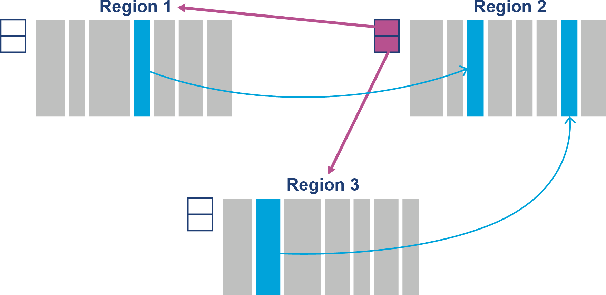

*Hình 5-6. Remembered Set*

RSet (và cả card table trong Parallel) là kỹ thuật có thể góp phần gây ra một vấn đề GC gọi là *floating garbage* (rác trôi nổi). Đây là vấn đề gây ra khi các object vốn đã chết lại được giữ sống bởi tham chiếu từ những object chết nằm ngoài tập thu gom hiện tại. Nghĩa là, trên một lượt đánh dấu toàn cục, chúng có thể được thấy là đã chết, nhưng một lượt đánh dấu cục bộ hạn chế hơn có thể báo cáo sai rằng chúng còn sống, tùy vào tập root được dùng. RSet có thể gây tăng floating garbage do quét các con trỏ từ object đã chết trong region.

Trong pha Cleanup của một mixed collection, G1 thực hiện việc "chà rửa" (scrubbing) RSet. Đây là quá trình xem xét RSet của các region trỏ vào những region đã được sơ tán và cập nhật các tham chiếu đến object đã được di chuyển sang region khác.

### Full Collection

Một full GC là đợt thu gom STW tương tự các đợt full collection chúng ta đã gặp ở các parallel collector.

Một full GC dọn sạch toàn bộ heap — cả không gian young lẫn tenured (old gen). Nó cũng nén tại chỗ các object trong các humongous region — chúng không được đưa vào các pha sơ tán bình thường để giảm chi phí sao chép.

Full GC có thể xảy ra theo vài cách — một trong số đó là qua sự phân mảnh của các humongous region. Nếu điều này xảy ra, thì việc cấp phát humongous object có thể thất bại, ngay cả khi có đủ bộ nhớ trống để thỏa mãn yêu cầu cấp phát (bởi không gian trống không nằm trong một khối liên tục).

Một khả năng khác là nếu pha Concurrent Mark trong một mixed collection không kịp hoàn tất trước khi ứng dụng đã cấp phát hết bộ nhớ heap sẵn có, thì G1 không còn lựa chọn nào ngoài thực hiện một full GC — điều này đôi khi gọi là *concurrent mode failure*.

Thông thường, ngưỡng IHOP được đặt động để điều này không xảy ra; tuy nhiên, nếu profile cấp phát của ứng dụng thay đổi, giá trị dự đoán (dựa trên hành vi quá khứ) có thể sai.

Để tránh loại full GC này, việc hiển nhiên cần làm là bắt đầu một pha đánh dấu đồng thời sớm hơn — điều này thường sẽ xảy ra một cách thích ứng, nhưng với một số workload, có thể cần đặt ngưỡng IHOP khác một cách thủ công bằng config switch.

### Các cờ cấu hình JVM cho G1

Nếu bạn vẫn đang chạy Java 8, thì switch bạn cần để bật G1 là:

```
+XX:UseG1GC
```

Với các phiên bản Java hiện đại, không cần switch nào — nhưng hãy cẩn thận khi chạy trong container. Nếu container của bạn chỉ có một core nhìn thấy được, thì G1 sẽ không thể chạy đồng thời (vì chỉ có một core) và sẽ quay về dùng serial collector. Điều này khó có khả năng là thứ bạn muốn.

Như đã đề cập, G1 được xây dựng quanh pause goal. Switch điều khiển hành vi cốt lõi này của collector là:

```
-XX:MaxGCPauseMillis=200
```

Nói cách khác, mục tiêu pause time mặc định là 200 ms. Trên thực tế, nếu kích thước heap của bạn ở mức đơn vị gigabyte, thì collector có lẽ sẽ chẳng bao giờ tiến gần giá trị này — và thời gian STW của bạn sẽ thấp hơn rất nhiều.

Nếu concurrent mode failure gây ra full GC quá thường xuyên, thì có thể điều chỉnh ngưỡng IHOP. Việc đầu tiên nên thử là yêu cầu JVM giảm ngưỡng bắt đầu mixed collection. Việc này được thực hiện bằng cách tăng kích thước buffer dùng trong tính toán IHOP:

```
-XX:G1ReservePercent=10
```

Cũng có thể tắt việc tính IHOP thích ứng bằng cách đặt nó thủ công, mặc dù điều này không được khuyến nghị cho hầu hết ứng dụng và chỉ nên thử nếu cách tiếp cận thích ứng đã không thành công. Việc này dùng một cặp switch:

```
-XX:-G1UseAdaptiveIHOP
-XX:InitiatingHeapOccupancyPercent=45
```

Trong một số hoàn cảnh, bạn có thể muốn giữ hành vi thích ứng nhưng chỉ thay đổi giá trị khởi tạo của IHOP. Trong trường hợp này, bạn chỉ đặt `-XX:InitiatingHeapOccupancyPercent=n`.

Một tùy chọn khác cũng có thể hữu ích là tùy chọn thay đổi kích thước region, ghi đè thuật toán mặc định:

```
-XX:G1HeapRegionSize=<n>m
```

Lưu ý rằng `<n>` phải là lũy thừa của 2, từ 1 đến 512, như trước, và phải chỉ một giá trị tính bằng megabyte. Hậu tố `m` là bắt buộc, và nếu bỏ qua, có thể có kết quả bất ngờ.

G1 đã cải thiện rất nhiều kể từ khi ra mắt, và nó là một collector đa dụng tuyệt vời. Tuy nhiên, nó không phải collector duy nhất sẵn có cho HotSpot — có những collector khác, mặc dù chúng thường chỉ phù hợp với những workload cụ thể.

Hãy chuyển sang thảo luận Shenandoah, collector thay thế đầu tiên trong số này.

## Shenandoah

Một lựa chọn thay thế cho G1 là collector Shenandoah. Nó được Red Hat tạo ra trong dự án OpenJDK và được cung cấp như một collector thử nghiệm trong Java 12. Nó được đưa vào production ở Java 15, và là collector được hỗ trợ đầy đủ ở Java 17 và 21.[^8]

> **GHI CHÚ**
>
> Red Hat cũng đã backport Shenandoah về Java 8 và 11 cho các bản phân phối OpenJDK hạ nguồn của họ.

Mục tiêu của Shenandoah là giảm pause time trên các heap lớn (nghĩa là hàng chục hoặc hàng trăm gigabyte). Tuy nhiên, không có bữa trưa miễn phí, nên Shenandoah có thể dùng đáng kể nhiều tài nguyên CPU hơn G1 để đạt được mục tiêu này.

Cách tiếp cận của Shenandoah để đạt latency thấp trên heap lớn là thực hiện *nén đồng thời* (concurrent compaction). Các pha thu gom kết quả trong Shenandoah là:

1. Init Mark (STW)
2. Concurrent Mark
3. Final Mark (STW)
4. Concurrent Cleanup
5. Concurrent Evacuation
6. Init Update Refs (STW)
7. Concurrent Update Refs
8. Final Update Refs (STW)
9. Concurrent Cleanup

Các pha này thoạt đầu có vẻ tương tự những pha thấy ở G1, và một số cách tiếp cận tương tự (ví dụ SATB) được Shenandoah dùng. Tuy nhiên, có một số khác biệt căn bản.

### Concurrent Evacuation

Hãy xem cách các GC thread (đang chạy đồng thời với app thread) thực hiện việc sơ tán. Để dễ hiểu hơn một chút, chúng ta sẽ nói về phiên bản gốc của Shenandoah, vốn được triển khai bằng forwarding pointer:

1. Sao chép object vào một TLAB (theo kiểu suy đoán — speculatively).
2. Dùng thao tác CAS để cập nhật forwarding pointer trỏ đến bản sao suy đoán.
3. Nếu thành công, thì thread nén đã thắng cuộc đua, và mọi truy cập tương lai đến phiên bản này của object sẽ qua Brooks pointer.
4. Nếu thất bại, thread nén đã thua. Nó hoàn tác bản sao suy đoán và đi theo Brooks pointer do thread thắng cuộc để lại.

Vì Shenandoah là collector đồng thời, trong khi một chu kỳ thu gom đang chạy, các application thread lại tạo ra thêm rác. Do đó, việc thu gom phải theo kịp tốc độ tạo rác mới; nếu không, ứng dụng sẽ gặp concurrent mode failure.

### Các cờ cấu hình JVM cho Shenandoah

Shenandoah có thể được kích hoạt bằng switch sau:

```
-XX:+UseShenandoahGC
```

So sánh pause time của Shenandoah với các collector khác có thể thấy ở Hình 5-7.

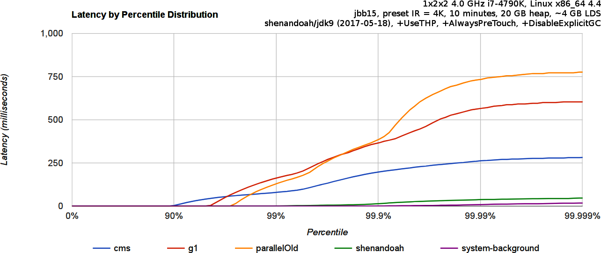

*Hình 5-7. Shenandoah so với các collector khác (Shipilëv)*

So với G1 và các collector như Parallel, không dự kiến rằng Shenandoah sẽ đòi hỏi cấu hình đặc biệt nào từ hầu hết người dùng.

### Sự tiến hóa của Shenandoah

Thiết kế của Shenandoah đã tiến hóa theo thời gian, và triển khai hiện tại khá khác so với phiên bản gốc. Một lĩnh vực chúng ta thấy điều này là việc sử dụng Brooks pointer. Thiết kế gốc của Shenandoah dùng phiên bản cổ điển của Brooks pointer, với từ header bổ sung ở offset âm.

Tuy nhiên, có thể dùng một mẹo để tránh tiêu tốn từ bộ nhớ bổ sung. Để hiểu mẹo này hoạt động ra sao, hãy để ý rằng việc dùng forwarding pointer có hai khía cạnh:

- Nó chỉ ra rằng phiên bản này của object có thể không hợp lệ.
- Nó chỉ ra địa chỉ nơi có thể tìm thấy phiên bản hợp lệ của object.

Hóa ra có thể dùng một tổ hợp bit cụ thể trong mark word — một tổ hợp trước đây chưa được HotSpot dùng — để chỉ ra rằng object không hợp lệ. Nói cách khác, chúng ta có thể trực tiếp chỉ ra ngay trên mark word rằng object đã được chuyển tiếp (forwarded).

Nội dung của phần lưu trữ còn lại cho object này giờ không còn quan trọng — vì phiên bản đúng của object có thể được tìm thấy bằng cách đi theo forwarding pointer. Điều này có nghĩa một phần bộ nhớ của object có thể dùng để lưu forwarding pointer, nên từ bộ nhớ bổ sung trong object header không còn cần thiết nữa.

Mẹo này có thể đã được triển khai trên phiên bản gốc của Shenandoah, nhưng vào thời điểm đó nó không được coi là đánh đổi hiệu năng chấp nhận được. Tuy nhiên, điều này thay đổi với sự xuất hiện của kỹ thuật gọi là *loaded-reference barrier* trong HotSpot cùng Java 13.[^9] Điều này mở đường cho một phiên bản Shenandoah mới đi kèm Java 13 và chứa những cải tiến này.[^10]

Những cải tiến tiếp theo được thực hiện ở các bản phát hành sau, chẳng hạn:

- Java 14: Self-fixing barrier
- Java 14: Concurrent class unloading
- Java 15: Concurrent reference processing
- Java 17: Concurrent thread-stack processing

Kết quả cuối cùng là phiên bản Shenandoah của Java 17 đã sẵn sàng cho production, cũng như các bản backport của Red Hat. Tuy nhiên, cần nhắc lại rằng nó không được coi là collector đa dụng — nó chỉ dành để dùng trên các heap lớn.

Một lưu ý thận trọng khác là, tại thời điểm viết sách, Shenandoah không phải collector generational. Các nỗ lực đang được tiến hành để thêm tính năng này, nhưng nó chưa có sẵn.[^11]

Hãy chuyển sang gặp collector thay thế tiếp theo cho HotSpot — ZGC.

## ZGC

Oracle cũng đã làm việc trên một collector phục vụ mục đích tương tự Shenandoah, gọi là ZGC. Ý định là tạo ra một collector trong đó mọi thao tác GC có quy mô tỷ lệ với kích thước heap hoặc kích thước metaspace đều được chuyển ra khỏi safepoint (tức các pha STW) và vào các pha đồng thời.

> **MẸO**
>
> Mục tiêu chính mà người dùng thấy được của ZGC là đáp ứng kỳ vọng rằng thời gian dành bên trong GC safepoint không vượt quá một mili-giây trên các heap lên đến 1 TB (mặc dù ZGC có thể xử lý kích thước heap lên đến 16 TB).

ZGC lần đầu được giới thiệu như một collector thử nghiệm cho Linux/x64 trong Java 11 và đã tiến hóa đáng kể từ điểm khởi đầu đó. Giờ nó là collector được hỗ trợ đầy đủ trong Java 17 và 21, trên nhiều hệ điều hành.

Về mặt lý thuyết, chúng ta có thể nói ZGC là:

- Concurrent (đồng thời)
- Region-based (dựa trên vùng)
- Compacting (nén)
- Nhận biết truy cập bộ nhớ không đồng nhất (NUMA)
- Dùng colored pointer
- Dùng load barrier

Điều này có nghĩa nó phần nào tương tự G1 và Shenandoah ở một số khía cạnh — ví dụ, ZGC là một collector đồng thời, dựa trên region.

Không chỉ vậy, một số công nghệ và kỹ thuật then chốt (ví dụ, xử lý reference và thread-stack đồng thời) mà Shenandoah dựa vào ban đầu được đội ZGC triển khai rồi được cả hai collector sử dụng. ZGC cũng dùng một phiên bản của remembered set (tương tự G1).

Tuy nhiên, ở những khía cạnh khác, ZGC khá khác so với các collector còn lại.

Ví dụ, một chi tiết triển khai quan trọng khác là ZGC không dùng Brooks pointer mà thay vào đó sử dụng *colored pointer* (con trỏ có màu).

Kỹ thuật này lưu metadata bổ sung về vòng đời object ngay trong chính object pointer/oop. Metadata mô tả những thứ như liệu object có được biết là còn sống hay không và liệu địa chỉ có đúng hay không (tức đây có phải bản chính tắc của object). Bố cục oop này có thể thấy ở Hình 5-8.

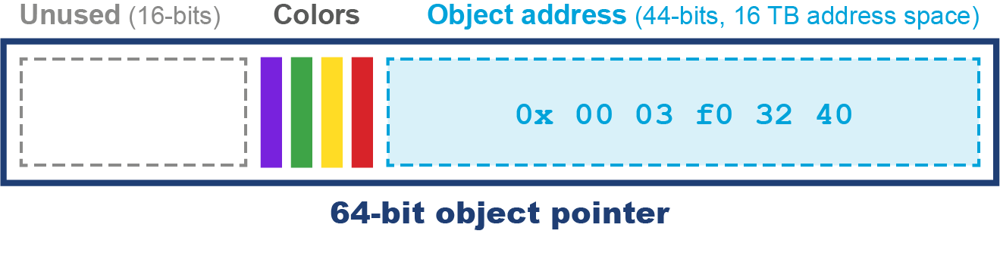

*Hình 5-8. Colored pointer của ZGC*

Khi gặp một load barrier, GC thread sẽ kiểm tra colored pointer và đảm bảo nó là giá trị kỳ vọng trước khi tiếp tục.

> **GHI CHÚ**
>
> Với ZGC không có compressed oop — nên colored pointer luôn là 64 bit. Điều này cung cấp 44 bit địa chỉ heap, đủ cho các heap kích thước lên đến 16 TB.

ZGC tiêu chuẩn dùng *multimapping*, nên mỗi trang bộ nhớ vật lý được tham chiếu bởi nhiều trang ảo. Điều này có thể dẫn đến những con số gây hiểu nhầm — con số RSS truyền thống có thể báo cáo vượt mức sử dụng heap khi dùng ZGC đến gấp 3 lần, so với con số PSS chính xác.

ZGC có thể được bật bằng switch này:

```
-XX:+UseZGC
```

Một mục tiêu chính của ZGC là tránh đòi hỏi người dùng phải tinh chỉnh collector.

Ví dụ, ZGC không có IHOP (theo nghĩa của G1) mà thay vào đó dùng một mô hình chi phí để quyết định khi nào bắt đầu một đợt thu gom. Ví dụ khác, số thread dùng cho GC cũng là một thuộc tính động của ZGC — bao gồm khả năng thay đổi kích thước pool thread GC ngay trong một đợt thu gom.

ZGC đã được sử dụng rộng rãi cho các workload production trong vài năm nay, nhưng đến giờ vẫn luôn có một vấn đề tiềm tàng với nó — nó không phải collector generational.

Java 21 giới thiệu một phiên bản mới của ZGC, gọi là *Generational ZGC*. ZGC không generational là phiên bản cũ hơn của ZGC — và như bạn có thể đoán từ cái tên, nó không tận dụng các thế hệ để tối ưu đặc tính runtime của mình.

Các collector không generational dễ bị ảnh hưởng bởi allocation stall hơn, vì chúng không thể thực hiện một young GC nhanh để thu hồi không gian. Do đó, việc thêm thế hệ vào ZGC là một bước tiến hữu ích, vì nó giúp giảm tác động của allocation rate biến động cao.

Generational ZGC dùng thuật ngữ *minor* và *major* cho các đợt thu gom của mình — minor collection chỉ ảnh hưởng đến các object young, trong khi major collection chạy trên toàn bộ heap. Theo cách này, chúng tương tự các đợt thu gom young và mixed của G1.

Như đã lưu ý ở phần trước, ZGC không generational dùng bộ nhớ multimapped, có thể gây báo cáo vượt mức sử dụng bộ nhớ. Generational ZGC tránh điều này bằng cách dùng mã tường minh trong các memory barrier thay thế.

Generational ZGC cũng dùng cách tiếp cận khác với colored pointer — nó dùng 12 bit màu thay vì 4, như bạn thấy ở Hình 5-9.

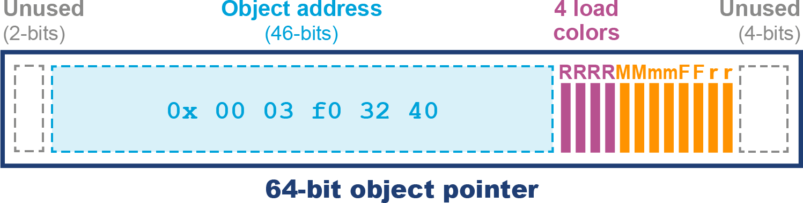

*Hình 5-9. Colored pointer của Generational ZGC*

Chúng ta cũng nên lưu ý rằng các tham chiếu lưu trên stack của JVM được triển khai dưới dạng *colorless pointer* (con trỏ không màu), và thuật toán GC cần dịch chúng thành colored pointer trước khi chúng có thể được dùng trong heap.

Đây là mức tăng đáng kể về độ phức tạp so với phiên bản dùng bởi ZGC không generational; tuy nhiên, nó mở cánh cửa cho một số tối ưu hóa thú vị, và ý định dài hạn là Generational ZGC sẽ thay thế hoàn toàn phiên bản không generational.

> **GHI CHÚ**
>
> Chi tiết hơn về cách Generational ZGC được triển khai có thể tìm thấy ở JEP 439.

Generational ZGC được bật bằng các tùy chọn dòng lệnh sau:

```
-XX:+UseZGC -XX:+ZGenerational
```

Người dùng hiện tại của phiên bản cũ được khuyến khích chuyển sang dùng phiên bản Generational mới hơn của ZGC.

Hãy chuyển sang gặp collector cuối cùng mà chúng ta sẽ thảo luận trong chương này — collector Balanced của JVM OpenJ9.

## Balanced (Eclipse OpenJ9)

Tổ chức mã nguồn mở Eclipse duy trì một JVM tên OpenJ9. Trong lịch sử đây là JVM độc quyền do IBM tạo ra, nhưng đã được mã nguồn mở hóa vài năm trước. VM này có vài collector khác nhau có thể bật lên, bao gồm một collector throughput cao tương tự parallel collector mà HotSpot dùng làm mặc định.

Tuy nhiên, trong phần này chúng ta sẽ thảo luận collector Balanced. Đây là collector dựa trên region có sẵn trên các JVM 64-bit và được thiết kế cho các heap vượt quá 4 GB. Mục tiêu thiết kế chính của nó là:

- Cải thiện khả năng scale của pause time trên các heap Java lớn.
- Giảm thiểu pause time trong trường hợp xấu nhất.
- Tận dụng nhận thức về hiệu năng NUMA.

Để đạt mục tiêu đầu tiên, heap được chia thành một số region, được quản lý và thu gom độc lập. Giống G1, collector Balanced muốn quản lý tối đa 2.048 region, nên nó sẽ chọn kích thước region để đạt được điều này. Kích thước region là lũy thừa của 2, như với G1, nhưng Balanced cho phép region nhỏ đến 512 KB.

Như chúng ta kỳ vọng từ một collector generational dựa trên region, mỗi region có một *tuổi* (age) đi kèm, với các region tuổi-không (Eden) được dùng để cấp phát object mới. Khi không gian Eden đầy, một đợt thu gom phải được thực hiện. Thuật ngữ của IBM cho việc này là *partial garbage collection* (PGC).

Một PGC là thao tác STW thu gom tất cả region Eden và có thể thêm vào việc chọn thu gom các region có tuổi cao hơn, nếu collector xác định rằng chúng đáng được thu gom. Theo cách này, PGC tương tự các mixed collection của G1.

> **GHI CHÚ**
>
> Một khi PGC hoàn tất, tuổi của các region chứa object sống sót được tăng lên 1. Chúng đôi khi được gọi là *generational region*.

Một lợi ích khác, so với các chính sách GC khác của OpenJ9, là việc gỡ bỏ class (class unloading) có thể được thực hiện tăng dần. Balanced có thể thu gom các class loader thuộc tập thu gom hiện tại trong một PGC. Điều này tương phản với các collector OpenJ9 khác, nơi class loader chỉ có thể được thu gom trong một đợt thu gom toàn cục.

Một nhược điểm là vì một PGC chỉ nhìn thấy được các region mà nó chọn thu gom, loại thu gom này có thể chịu floating garbage. Để giải quyết vấn đề này, Balanced dùng một *global mark phase* (GMP). Đây là thao tác một phần đồng thời quét toàn bộ Java heap, đánh dấu các object đã chết để thu gom. Một khi GMP hoàn tất, PGC tiếp theo hành động dựa trên dữ liệu này. Do đó, lượng floating garbage trong heap bị giới hạn bởi số object đã chết kể từ khi GMP cuối cùng bắt đầu.

Loại thao tác GC cuối cùng mà Balanced thực hiện là *global garbage collection* (GGC). Đây là đợt thu gom full STW nén heap. Nó tương tự các đợt full collection sẽ được kích hoạt trong HotSpot bởi một concurrent mode failure.

### Object Header của OpenJ9

Object header cơ bản của OpenJ9 là một *class slot*, có kích thước 64 bit, hoặc 32 bit khi compressed references được bật.

> **GHI CHÚ**
>
> Compressed references là mặc định cho các heap nhỏ hơn 57 GB và tương tự kỹ thuật compressed oops của HotSpot.

Tuy nhiên, header có thể có thêm các slot bổ sung, tùy vào loại object:

- Các object được synchronized sẽ có monitor slot.
- Các object được đưa vào cấu trúc nội tại của JVM sẽ có hashed slot.

Ngoài ra, monitor và hashed slot không nhất thiết nằm liền kề object header — chúng có thể được lưu ở bất cứ đâu trong object, tận dụng không gian vốn bị lãng phí do căn chỉnh. Bố cục object của OpenJ9 có thể thấy ở Hình 5-10.

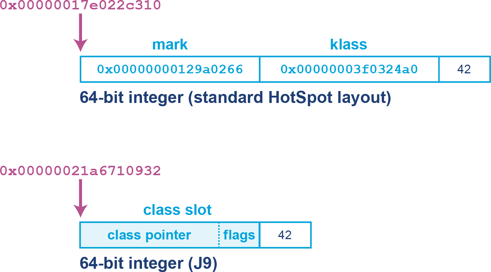

*Hình 5-10. Bố cục object của OpenJ9*

24 (hoặc 56) bit cao nhất của class slot là con trỏ đến cấu trúc class, vốn nằm ngoài heap, tương tự Metaspace của Java. 8 bit thấp là các cờ được dùng cho nhiều mục đích khác nhau tùy theo chính sách GC đang dùng.

### Mảng lớn trong Balanced

Việc cấp phát các mảng lớn trong Java là nguyên nhân phổ biến kích hoạt các đợt thu gom nén, vì phải tìm được đủ không gian liên tục để thỏa mãn yêu cầu cấp phát. Chúng ta đã thấy một khía cạnh của điều này trong phần thảo luận về G1, nơi việc cấp phát humongous object dẫn đến phân mảnh và không đủ không gian cho một lần cấp phát lớn — dẫn đến concurrent mode failure.

Với một collector dựa trên region, hoàn toàn có thể cấp phát một object mảng trong Java vượt quá kích thước một region đơn lẻ. Để giải quyết điều này, Balanced dùng một biểu diễn thay thế cho các mảng lớn cho phép chúng được cấp phát trong các khối không liên tục. Biểu diễn này được gọi là *arraylet*, và đây là hoàn cảnh duy nhất mà các object heap có thể trải qua nhiều region.

Biểu diễn arraylet là vô hình với mã Java của người dùng, và thay vào đó được JVM xử lý một cách trong suốt. Allocator sẽ biểu diễn một mảng lớn dưới dạng một object trung tâm, gọi là *spine* (xương sống), và một tập các *array leaf* (lá mảng). Các leaf chứa các mục thực tế của mảng và được trỏ đến bởi các mục của spine. Điều này cho phép đọc các mục chỉ với chi phí phụ trội của một lần gián tiếp duy nhất. Một ví dụ có thể thấy ở Hình 5-11.

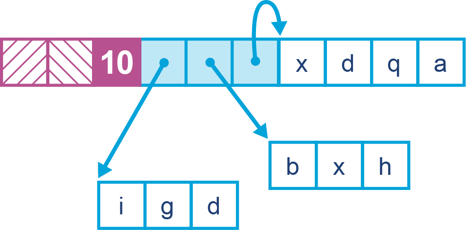

*Hình 5-11. Arraylet trong OpenJ9*

> **GHI CHÚ**
>
> Biểu diễn arraylet có khả năng nhìn thấy được qua các API JNI (mặc dù không phải từ Java thông thường), nên lập trình viên nên nhận thức rằng khi port mã JNI từ một JVM khác, có thể cần tính đến biểu diễn spine và leaf.

Việc thực hiện GC từng phần trên các region làm giảm pause time trung bình, mặc dù tổng thời gian dành cho các thao tác GC có thể cao hơn do chi phí phụ trội của việc duy trì thông tin về các region của một spine và các leaf của nó. Điều quan trọng là khả năng phải cần một đợt thu gom hoặc nén STW toàn cục (trường hợp xấu nhất cho pause time) giảm đi rất nhiều, và điều này thường chỉ xảy ra như phương án cuối cùng khi heap đã đầy.

Có một chi phí phụ trội cho việc quản lý region và các mảng lớn không liên tục, và do đó, Balanced phù hợp với những ứng dụng mà việc tránh các lần dừng lớn quan trọng hơn throughput thuần túy.

### NUMA và Balanced

Non-uniform memory access (truy cập bộ nhớ không đồng nhất) là một kiến trúc bộ nhớ được dùng trong các hệ thống đa vi xử lý, thường là server cỡ vừa đến lớn. Hệ thống như vậy bao gồm khái niệm *khoảng cách* giữa bộ nhớ và bộ xử lý, với bộ xử lý và bộ nhớ được sắp xếp thành các *node*. Một bộ xử lý trên một node nhất định có thể truy cập bộ nhớ từ bất kỳ node nào, nhưng thời gian truy cập nhanh hơn đáng kể với bộ nhớ cục bộ (tức bộ nhớ thuộc cùng node).

Với các JVM đang thực thi trên nhiều node NUMA, collector Balanced có thể chia Java heap trên các node đó. Các application thread được sắp xếp sao cho chúng ưu tiên thực thi trên một node cụ thể, và việc cấp phát object ưu tiên các region trong bộ nhớ cục bộ với node đó. Sơ đồ minh họa cách sắp xếp này có thể thấy ở Hình 5-12.

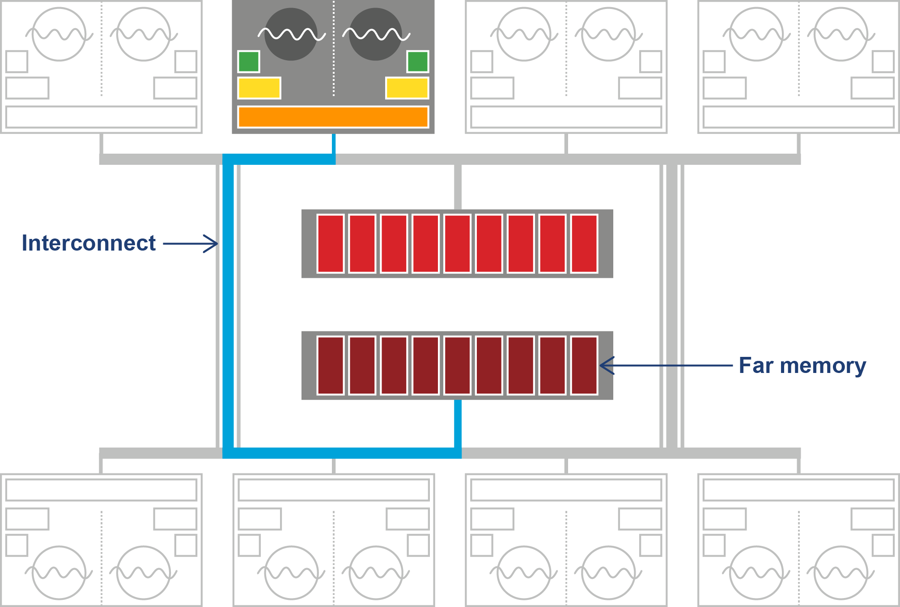

*Hình 5-12. Truy cập bộ nhớ không đồng nhất*

Ngoài ra, một đợt partial garbage collection sẽ cố di chuyển các object gần hơn (về mặt khoảng cách bộ nhớ) với các object và thread tham chiếu đến chúng. Điều này có nghĩa bộ nhớ được một thread tham chiếu có nhiều khả năng là cục bộ hơn, cải thiện hiệu năng. Quá trình này vô hình với ứng dụng.

## Các collector HotSpot ngách

Ở các phiên bản HotSpot trước, có nhiều collector khác từng có sẵn. Hầu hết đã bị loại bỏ, nhưng tính đến Java 21, hai collector ngách vẫn còn tồn tại. Chúng tôi nhắc đến chúng cho đầy đủ, nhưng không collector nào được khuyến nghị dùng trong production.

### CMS

Collector Concurrent Mark Sweep (CMS) được thiết kế là collector cực kỳ low-pause chỉ dành cho không gian tenured (hay old generation). Nó được ghép với một parallel collector được sửa đổi đôi chút để thu gom thế hệ young — gọi là ParNew thay vì Parallel GC.

Nó có mặt ở Java 8 và 11, nhưng đã bị deprecated ở Java 9, và không còn khả dụng từ Java 14.[^12] Trên thực tế, với Java 8, CMS vẫn vượt trội hơn G1 với một số workload cần GC low-pause. Tuy nhiên, G1 đã cải thiện rất đáng kể giữa Java 8 và 11. Kết quả là các workload mà CMS là lựa chọn tốt nhất trở nên hiếm hơn nhiều với Java 11 — và tất nhiên, collector này hoàn toàn không có ở Java 17 hay 21.

Collector CMS được kích hoạt bằng cờ sau:

```
-XX:+UseConcMarkSweepGC
```

CMS có cấu trúc pha đại thể tương tự một mixed collection của G1 về chu kỳ nhiệm vụ GC. Vậy một câu hỏi quan trọng là: điều gì xảy ra nếu Eden đầy trong khi CMS đang chạy?

Câu trả lời, không có gì ngạc nhiên, là vì các application thread không thể tiếp tục, chúng tạm dừng, và một young GC (STW) chạy trong khi CMS đang chạy. Lần chạy young GC này thường sẽ mất nhiều thời gian hơn so với trường hợp parallel collector, bởi nó chỉ có một nửa số core sẵn có cho GC thế hệ young (nửa còn lại đang chạy CMS).

Trong hoàn cảnh bình thường, đợt thu gom young chỉ thăng cấp một số ít object lên tenured, và đợt thu gom old CMS hoàn tất bình thường, giải phóng không gian trong tenured. Ứng dụng sau đó trở lại xử lý bình thường, với mọi core được giải phóng cho application thread.

Tuy nhiên, hãy xét trường hợp allocation rate rất cao, có thể kèm premature promotion. Điều này có thể gây ra tình huống mà đợt thu gom young có quá nhiều object cần thăng cấp so với không gian sẵn có trong tenured.

Đây là một dạng concurrent mode failure, và JVM không còn lựa chọn nào vào lúc này ngoài quay về dùng một đợt thu gom bằng ParallelOld, vốn hoàn toàn STW. Thực chất, áp lực cấp phát cao đến mức CMS không kịp xử lý xong thế hệ old trước khi toàn bộ không gian "dư địa" để chứa các object mới thăng cấp bị lấp đầy.

Để tránh concurrent mode failure thường xuyên, CMS cần bắt đầu một chu kỳ thu gom trước khi tenured đầy hoàn toàn. Điều này tương tự hành vi IHOP của G1 mà chúng ta gặp ở phần "Concurrent Evacuation".

### Epsilon

Collector Epsilon không phải là collector cũ. Tuy nhiên, nó được đưa vào đây bởi *nó không được dùng trong production trong bất kỳ hoàn cảnh nào*. Trong khi CMS, nếu gặp trong môi trường của bạn, nên được đánh dấu là rủi ro cao và cần phân tích, loại bỏ ngay, thì Epsilon hơi khác.

Epsilon là một collector thử nghiệm được thiết kế chỉ cho mục đích kiểm thử. Nó là một *collector không nỗ lực* (zero-effort collector). Điều này có nghĩa nó không hề nỗ lực thu gom bất kỳ rác nào. Mỗi byte bộ nhớ heap được cấp phát khi chạy dưới Epsilon thực chất là một memory leak. Nó không thể được thu hồi và cuối cùng sẽ khiến JVM (có lẽ rất nhanh) hết bộ nhớ và crash.

> Phát triển một GC chỉ xử lý việc cấp phát bộ nhớ, nhưng không triển khai bất kỳ cơ chế thu hồi bộ nhớ thực sự nào. Một khi Java heap khả dụng đã cạn kiệt, thực hiện tắt JVM một cách có trật tự.
>
> — JEP 318: Epsilon: A No-Op Garbage Collector

Một "collector" như vậy có thể hữu ích cho các mục đích sau:

- Kiểm thử hiệu năng và microbenchmark
- Regression testing
- Kiểm thử mã ứng dụng hoặc thư viện Java cấp phát thấp/bằng không

Đặc biệt, Java Microbenchmark Harness (JMH) sẽ hưởng lợi từ khả năng loại trừ một cách tự tin mọi sự kiện GC gây gián đoạn các con số hiệu năng. Các regression test về cấp phát bộ nhớ, đảm bảo rằng mã đã thay đổi không làm biến đổi lớn hành vi cấp phát, cũng trở nên dễ thực hiện. Lập trình viên có thể viết những bài test chạy với cấu hình Epsilon chỉ chấp nhận một số lượng cấp phát có giới hạn rồi thất bại ở mọi lần cấp phát tiếp theo do heap cạn kiệt.

Cuối cùng, giao diện VM-GC được đề xuất cũng sẽ hưởng lợi từ việc có Epsilon như một test case tối thiểu cho chính giao diện đó.

## Tóm tắt

Garbage collection là một khía cạnh thực sự nền tảng của việc phân tích và tinh chỉnh hiệu năng Java. Bối cảnh phong phú các garbage collector của Java là sức mạnh lớn của nền tảng, nhưng nó có thể gây choáng ngợp với người mới, đặc biệt khi có ít tài liệu xem xét các đánh đổi và hệ quả hiệu năng của mỗi lựa chọn.

Trong chương này, chúng tôi đã phác thảo những quyết định mà kỹ sư hiệu năng phải đối mặt và các đánh đổi họ phải thực hiện khi quyết định collector phù hợp cho ứng dụng của mình. Chúng tôi đã thảo luận một số lý thuyết nền tảng và gặp một loạt thuật toán GC hiện đại triển khai những ý tưởng đó.

Ở chương tiếp theo, chúng ta sẽ đưa một phần lý thuyết này vào thực hành và giới thiệu logging, monitoring và tooling như một cách mang lại chút chặt chẽ khoa học cho cuộc thảo luận về tinh chỉnh hiệu năng garbage collection.

---

[^1]: Một hệ thống như vậy rất khó lập trình, vì mọi object được tạo ra đều phải được tái sử dụng, và bất kỳ object nào ra khỏi phạm vi (scope) thực chất đều làm rò rỉ bộ nhớ.

[^2]: Các collector evacuating cũng có được compaction về cơ bản là "miễn phí".

[^3]: Edsger Dijkstra, Leslie Lamport, A. J. Martin, C. S. Scholten, và E. F. M. Steffens, "On-the-Fly Garbage Collection: An Exercise in Cooperation," *Communications of the ACM* 21 (1978): 966–975.

[^4]: Ở các phiên bản JVM gần đây, "thread-local handshake polling" đã được thêm vào, làm thay đổi bức tranh phần nào, nhưng đây vẫn là mô hình tư duy hợp lý cho các lập trình viên mới với lĩnh vực này.

[^5]: Trên thực tế, G1 thực hiện phần lớn công việc này một cách đồng thời và không cần làm tăng thời gian STW của Remark.

[^6]: Rodney Brooks, "Trading Data Space for Reduced Time and Code Space in Real-Time Garbage Collection on Stock Hardware," trong *LFP'84, Proceedings of the 1984 ACM Symposium on LISP and Functional Programming* (New York: ACM, 1984): 256–262.

[^7]: Tại thời điểm viết sách (tháng 8/2024), nguồn tốn thời gian tiềm tàng chính trong Remark là việc xử lý weak reference, bởi điều này có thể dẫn đến hoạt động marking không giới hạn.

[^8]: Oracle không phát hành Shenandoah, nhưng nó có sẵn trong mọi bản build OpenJDK khác.

[^9]: Shenandoah GC in JDK 13, Part 1.

[^10]: Shenandoah GC in JDK 13, Part 2.

[^11]: JEP 404: Generational Shenandoah (Experimental).

[^12]: Java Enhancement Process có 3 bước liên quan đến việc loại bỏ một tính năng: deprecated, deprecated for removal, và removed. Các tính năng có thể ở lại hai mức đầu bao nhiêu bản phát hành tùy nhu cầu, và một số tính năng có thể bị deprecated mà không có kỳ vọng thực tế nào rằng chúng sẽ từng bị loại bỏ.
