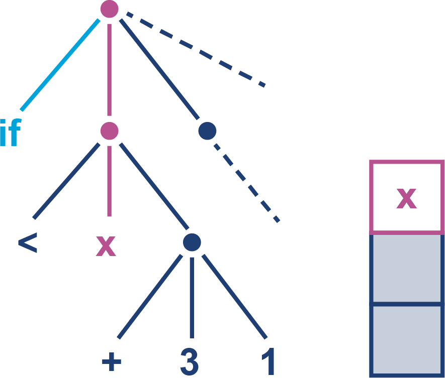
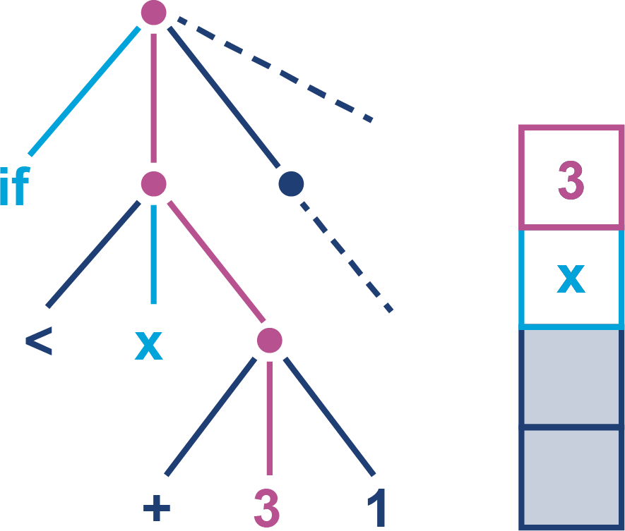
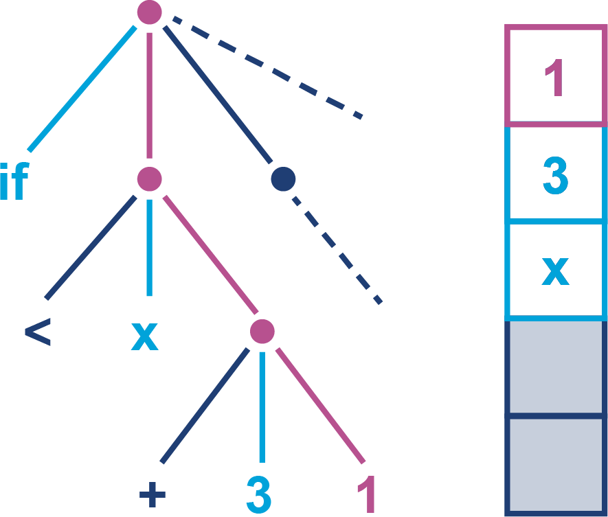
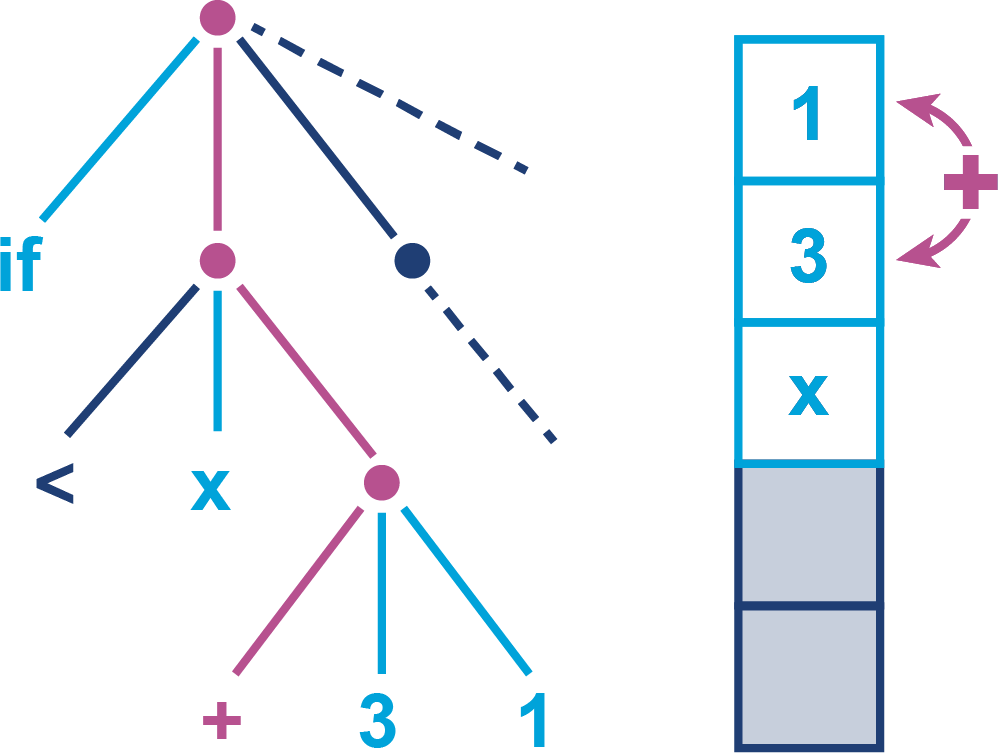
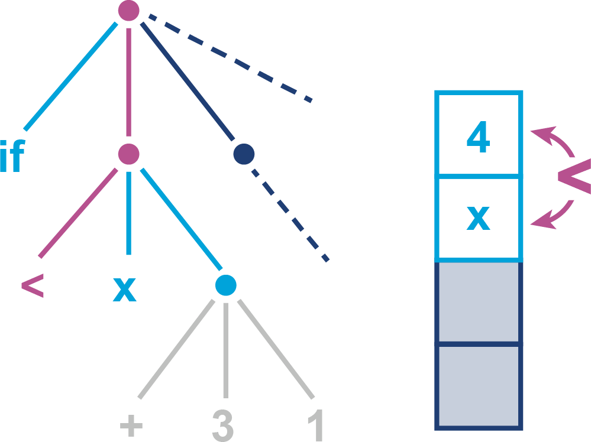
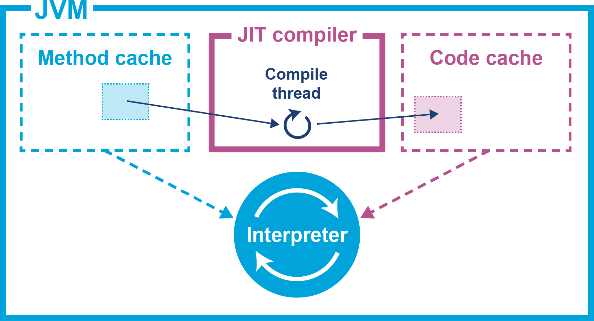
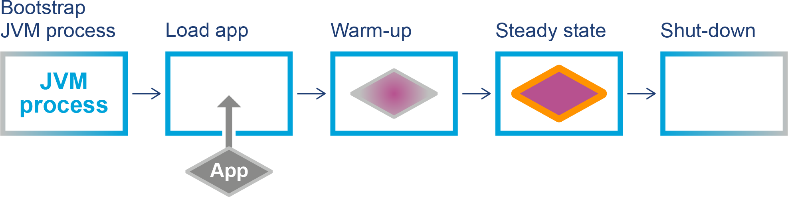
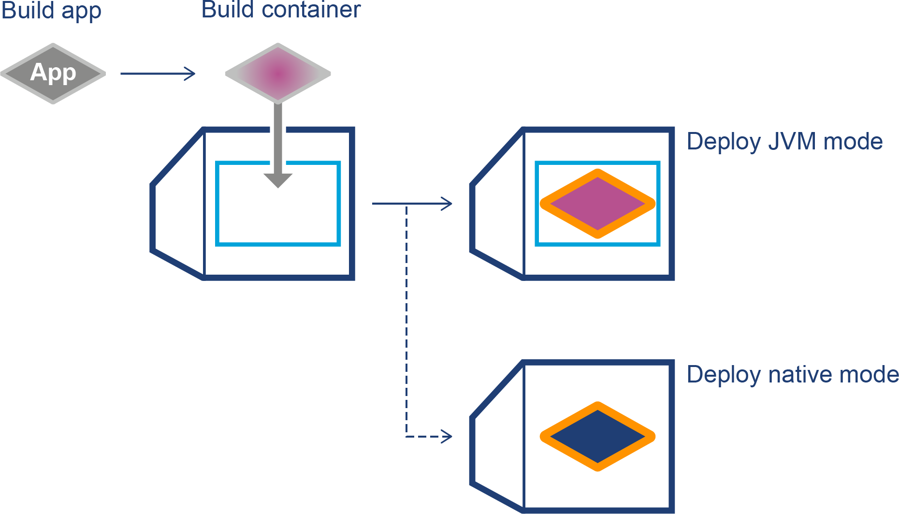

# Chương 6. Thực thi mã trên JVM

Hai dịch vụ chính mà bất kỳ JVM nào cũng cung cấp là quản lý bộ nhớ và một container dễ dùng để thực thi mã ứng dụng. Chúng ta đã trình bày garbage collection khá sâu ở Chương 4 và 5, và trong chương này chúng ta chuyển sang việc thực thi mã.

> **GHI CHÚ**
>
> Nhớ lại rằng đặc tả Java virtual machine, thường gọi là *VM spec*, mô tả cách một triển khai Java tuân thủ cần hành xử.

VM spec định nghĩa việc thực thi bytecode Java dưới dạng một trình thông dịch. Tuy nhiên, nói rộng ra, các môi trường thông dịch có hiệu năng không thuận lợi so với các môi trường lập trình thực thi mã máy trực tiếp. Hầu hết môi trường Java hiện đại cấp production giải quyết vấn đề này bằng cách cung cấp khả năng biên dịch động.

Như đã thảo luận ở Chương 3, khả năng này còn được gọi là *just-in-time compilation*, hay ngắn gọn là biên dịch JIT. Đây là cơ chế mà JVM theo dõi những method nào đang được thực thi để xác định xem từng method có đủ điều kiện được biên dịch thành mã thực thi trực tiếp hay không.

Trong chương này, chúng ta bắt đầu bằng việc trình bày vòng đời cơ bản của một ứng dụng Java, như nó thường diễn ra ngày nay. Sau đó, chúng tôi cung cấp tổng quan ngắn gọn về việc thông dịch bytecode và tại sao HotSpot khác với các trình thông dịch khác mà bạn có thể quen thuộc.

Rồi chúng ta chuyển sang các khái niệm cơ bản của biên dịch JIT và tối ưu hóa dựa trên profile. Chúng ta thảo luận về code cache rồi giới thiệu những điều cơ bản của hệ thống con biên dịch trong HotSpot.

Về cuối chương, chúng ta thảo luận những thay đổi gần đây trong nền tảng Java được thúc đẩy bởi việc tư duy lại cách xử lý việc thực thi chương trình Java. Những phát triển này phần lớn được thúc đẩy bởi sự dịch chuyển sang các ứng dụng triển khai trên cloud và nhu cầu giải quyết các mối quan tâm của môi trường triển khai mới này.

## Vòng đời của một ứng dụng Java truyền thống

Hãy bắt đầu bằng cách đi sâu hơn một chút vào điều thực sự xảy ra khi bạn gõ `java HelloWorld` trên một hệ thống kiểu Unix (như Linux hay Mac; những nhận xét tương tự áp dụng cho Windows).

Ở mức thấp, việc thực thi tiến trình tiêu chuẩn diễn ra để thiết lập JVM, vốn là một tiến trình đơn. Shell định vị binary JVM (ví dụ, có thể ở `$JAVA_HOME/bin/java`) và khởi động một tiến trình tương ứng với binary đó, truyền vào các tham số (bao gồm tên class entrypoint).

Tiến trình vừa khởi động phân tích các cờ dòng lệnh và chuẩn bị cho việc khởi tạo VM, vốn sẽ được tùy chỉnh qua các cờ (cho kích thước heap, GC, v.v.). Vào lúc này tiến trình dò xét cỗ máy nó đang chạy trên đó và kiểm tra nhiều tham số hệ thống khác nhau, chẳng hạn máy có bao nhiêu core CPU, bao nhiêu bộ nhớ, và chính xác tập chỉ thị CPU nào sẵn có.

Thông tin rất chi tiết này được dùng để tùy chỉnh và tối ưu cách JVM tự cấu hình. Ví dụ, JVM sẽ dùng số core để xác định dùng bao nhiêu thread khi garbage collection chạy và để định cỡ pool thread chung.

> **MẸO**
>
> Hành vi tự dò xét và tự cấu hình của JVM là điều quan trọng cần biết, bởi nó ảnh hưởng đến cách ứng dụng Java hành xử trong container. Chúng ta sẽ trình bày điều này thêm ở Chương 8.

Một bước sớm then chốt là đặt trước một vùng bộ nhớ userspace (từ hệ điều hành, còn gọi là C heap) bằng `Xmx` (hoặc giá trị mặc định) cho Java heap — vùng nơi mọi object Java sẽ được lưu trữ. Một bước quan trọng khác là khởi tạo một kho lưu trữ các class Java và metadata liên quan (gọi là Metaspace trong HotSpot).

Sau đó bản thân VM được tạo ra, thường qua hàm `JNI_CreateJavaVM`, trên một thread mới đối với HotSpot. Các thread của chính VM — như GC thread và các thread thực hiện biên dịch JIT — cũng cần được khởi động.

Như đã thảo luận trước đó, các class bootstrapping được chuẩn bị rồi khởi tạo. Các bytecode đầu tiên được chạy và các object đầu tiên được tạo ngay khi class được nạp — ví dụ, trong class initializer (các khối `static {}` hay method `clinit`) cho các class bootstrapping.

Ý nghĩa của điều này là các chức năng cơ bản của JVM — như biên dịch JIT và GC — đang chạy từ rất sớm trong vòng đời ứng dụng. Khi VM khởi động, có thể có một chút hoạt động GC và JIT ngay cả trước khi quyền điều khiển đến được class entrypoint. Một khi đến đó, việc nạp class tiếp theo sẽ xảy ra khi ứng dụng bắt đầu thực thi và cần chạy mã từ những class chưa có trong cache metadata class.

Do đó, với hầu hết ứng dụng production điển hình, giai đoạn khởi động được đặc trưng bởi một đợt tăng vọt hoạt động nạp class, JIT và GC trong khi ứng dụng đạt đến trạng thái ổn định. Một khi điều này xảy ra, lượng JIT và nạp class thường giảm mạnh vì:

- Toàn bộ "thế giới" các class mà ứng dụng cần đã được nạp.
- Tập các method được gọi thường xuyên đã được trình biên dịch JIT chuyển thành mã máy.

Tuy nhiên, điều quan trọng là nhận ra rằng "trạng thái ổn định" không có nghĩa là "không thay đổi". Hoàn toàn bình thường khi ứng dụng trải qua thêm hoạt động nạp class và JIT — chẳng hạn deoptimization và reoptimization. Điều này có thể do gặp phải một đường mã hiếm khi được thực thi và gây ra việc nạp một class mới.

Một trường hợp đặc biệt quan trọng khác của mô hình startup–steady-state đôi khi được gọi là "nạp class hai pha". Điều này xảy ra ở các ứng dụng dùng Spring và các kỹ thuật dependency injection tương tự.

Trong trường hợp này, các class framework lõi được nạp trước. Sau đó, framework xem xét mã ứng dụng chính và cấu hình để xác định đồ thị các object cần được khởi tạo để kích hoạt ứng dụng. Điều này kích hoạt pha nạp class thứ hai, nơi mã ứng dụng và các phụ thuộc khác của nó được nạp.

Trường hợp hành vi GC hơi khác một chút. Trong một ứng dụng không gặp vấn đề hiệu năng cụ thể nào, mẫu hình GC cũng có khả năng thay đổi khi đạt trạng thái ổn định — nhưng các sự kiện GC vẫn sẽ xảy ra.

Đó là bởi trong các ứng dụng Java (trừ vài trường hợp sử dụng rất bệnh lý), object được tạo ra, sống một thời gian, rồi được thu gom tự động — đây chính là toàn bộ mục đích của quản lý bộ nhớ tự động. Tuy nhiên, mẫu hình GC ở trạng thái ổn định rất có thể trông rất khác so với giai đoạn khởi động.

Ấn tượng tổng thể mà bạn nên xây dựng từ mô tả này là về một runtime có tính động cao. Các ứng dụng triển khai trên đó thể hiện đặc tính runtime gồm một giai đoạn khởi động được định nghĩa rõ, tiếp theo là một trạng thái ổn định nơi có những lượng thay đổi nhỏ (nhưng thường khác không). Cộng đồng đã chấp nhận thuật ngữ *dynamic VM mode* cho vòng đời ứng dụng Java truyền thống này.

Tuy nhiên, với sự trỗi dậy của Cloud Native Java, đã có sự quan tâm gia tăng đến những chế độ vận hành và triển khai mới cho ứng dụng Java, phù hợp hơn với container và cloud, và khác biệt với dynamic VM mode theo nhiều cách.

Chúng ta sẽ thảo luận những phát triển gần đây này ở phần sau của chương, nhưng trước hết chúng ta cần thảo luận về những điều cơ bản trong cách mã được thực thi trên JVM.

## Tổng quan về thông dịch Bytecode

Như chúng ta đã thấy sơ qua ở phần "Thực thi Bytecode", trình thông dịch JVM hoạt động như một *stack machine*. Điều này có nghĩa là, không giống các CPU vật lý, không có thanh ghi nào được dùng làm vùng giữ tức thời cho việc tính toán. Thay vào đó, mọi giá trị cần thao tác đều được đặt lên một *evaluation stack*, và các chỉ thị của stack machine hoạt động bằng cách biến đổi (các) giá trị ở đỉnh stack.

JVM cung cấp ba vùng chính để giữ dữ liệu:

- Evaluation stack, cục bộ với một method cụ thể
- Biến cục bộ để lưu tạm thời kết quả (cũng cục bộ với method)
- Object heap, được chia sẻ giữa các method và giữa các thread

Một loạt thao tác VM sử dụng evaluation stack để thực hiện tính toán có thể thấy ở Hình 6-1 đến 6-5, dưới dạng một loại mã giả mà lập trình viên Java sẽ nhận ra ngay lập tức.



*Hình 6-1. Trạng thái thông dịch ban đầu*

Trình thông dịch giờ phải tính cây con bên phải để xác định một giá trị so sánh với nội dung của `x`.



*Hình 6-2. Đánh giá cây con*

Giá trị đầu tiên của cây con tiếp theo, một hằng `int` bằng `3`, được nạp lên stack.



*Hình 6-3. Đánh giá cây con (Bước 2)*

Giờ một giá trị `int` khác, `1`, cũng được nạp lên stack. Trong một JVM thực, những giá trị này hoặc đã được nạp từ vùng hằng số của class file, hoặc sẽ dùng một "dạng rút gọn" cho các hằng số nhỏ, phổ biến.



*Hình 6-4. Đánh giá cây con (Bước 3)*

Vào lúc này, phép cộng tác động lên hai phần tử trên đỉnh stack, loại bỏ chúng, và thay thế chúng bằng kết quả của việc cộng hai số lại với nhau.



*Hình 6-5. Đánh giá cây con cuối cùng*

Giá trị kết quả giờ đã sẵn sàng để so sánh với giá trị chứa trong `x`, vốn đã nằm trên evaluation stack suốt toàn bộ quá trình đánh giá cây con kia.

### Giới thiệu Bytecode của JVM

Trong trường hợp của JVM, mỗi mã thao tác (opcode) của stack machine được biểu diễn bằng một byte, do đó có tên *bytecode*. Theo đó, các opcode chạy từ 0 đến 255, trong đó khoảng 200 đang được sử dụng tính đến Java 23.

Các chỉ thị bytecode có kiểu, theo nghĩa `iadd` và `dadd` kỳ vọng tìm thấy đúng kiểu nguyên thủy (hai giá trị `int` và hai giá trị `double`, tương ứng) ở hai vị trí đỉnh của stack.

Nhiều chỉ thị bytecode đi theo "họ" (family), với mỗi kiểu nguyên thủy có một chỉ thị và một chỉ thị cho tham chiếu object.

Ví dụ, trong họ `store`, các chỉ thị cụ thể có nghĩa cụ thể: `dstore` nghĩa là "lưu đỉnh stack vào một biến cục bộ kiểu `double`", trong khi `astore` nghĩa là "lưu đỉnh stack vào một biến cục bộ kiểu tham chiếu". Trong cả hai trường hợp, kiểu của biến cục bộ phải khớp với kiểu của giá trị đến.

Vì Java được thiết kế để có tính di động cao, đặc tả JVM được thiết kế để có thể chạy cùng một bytecode mà không sửa đổi trên cả kiến trúc phần cứng big-endian lẫn little-endian. Kết quả là, bytecode JVM phải quyết định theo quy ước endianness nào (với hiểu biết rằng phần cứng có quy ước ngược lại phải xử lý sự khác biệt bằng phần mềm).

> **MẸO**
>
> Bytecode là big-endian, nên byte có trọng số lớn nhất của bất kỳ chuỗi nhiều byte nào cũng đến trước.

Một số họ opcode, như `load`, có các dạng rút gọn. Điều này cho phép bỏ qua tham số, tiết kiệm chi phí của các byte tham số trong class file. Đặc biệt, `aload_0` đặt object hiện tại (tức `this`) lên đỉnh stack. Vì đó là thao tác rất phổ biến, điều này giúp tiết kiệm đáng kể kích thước class file.

Tuy nhiên, vì các class Java thường khá gọn, quyết định thiết kế này có lẽ quan trọng hơn trong những ngày đầu của nền tảng, khi class file — thường là applet — sẽ được tải xuống qua modem 14.4 Kbps.

> **GHI CHÚ**
>
> Từ Java 1.0, chỉ có một opcode bytecode mới (`invokedynamic`) được giới thiệu, và hai opcode (`jsr` và `ret`) đã bị deprecated.

Việc dùng các dạng rút gọn và chỉ thị đặc thù kiểu làm tăng đáng kể số opcode cần thiết, vì nhiều opcode được dùng để biểu diễn cùng một thao tác về mặt khái niệm. Số opcode được gán do đó lớn hơn nhiều so với số thao tác cơ bản mà bytecode biểu diễn, và bytecode thực ra rất đơn giản về mặt khái niệm.

Hãy cùng gặp một số danh mục bytecode chính, được sắp xếp theo họ opcode. Lưu ý rằng trong các bảng sau, `c1` chỉ một chỉ mục constant pool hai byte, trong khi `i1` chỉ một biến cục bộ trong method hiện tại. Dấu ngoặc đơn cho biết họ đó có một số opcode ở dạng rút gọn.

Danh mục đầu tiên chúng ta gặp là *load và store*, thể hiện ở Bảng 6-1. Danh mục này gồm các opcode di chuyển dữ liệu lên và xuống stack — ví dụ, bằng cách nạp nó từ constant pool hoặc bằng cách lưu đỉnh stack vào một field của một object trong heap.

**Bảng 6-1. Danh mục load và store**

| Tên họ | Tham số | Mô tả |
|---|---|---|
| `load` | (`i1`) | Nạp giá trị từ biến cục bộ `i1` lên stack |
| `store` | (`i1`) | Lưu đỉnh stack vào biến cục bộ `i1` |
| `ldc` | `c1` | Nạp giá trị từ CP#`c1` lên stack |
| `const` | | Nạp giá trị hằng đơn giản lên stack |
| `pop` | | Loại bỏ giá trị ở đỉnh stack |
| `dup` | | Nhân đôi giá trị ở đỉnh stack |
| `getfield` | `c1` | Nạp giá trị từ field được chỉ bởi CP#`c1` trong object ở đỉnh stack lên stack |
| `putfield` | `c1` | Lưu giá trị từ đỉnh stack vào field được chỉ bởi CP#`c1` |
| `getstatic` | `c1` | Nạp giá trị từ field static được chỉ bởi CP#`c1` lên stack |
| `putstatic` | `c1` | Lưu giá trị từ đỉnh stack vào field static được chỉ bởi CP#`c1` |

Sự khác biệt giữa `ldc` và `const` cần được làm rõ. Bytecode `ldc` nạp một hằng từ constant pool của class hiện tại. Nó chứa các chuỗi, hằng nguyên thủy, class literal, và các hằng (nội bộ) khác cần cho chương trình chạy.[^1]

Ngược lại, các opcode `const` không nhận tham số nào và liên quan đến việc nạp một số hữu hạn các hằng thực sự, chẳng hạn `aconst_null`, `dconst_0`, và `iconst_m1` (cái sau nạp `-1` dưới dạng `int`).

Danh mục tiếp theo, các bytecode *số học*, chỉ áp dụng cho kiểu nguyên thủy, và không cái nào nhận tham số, vì chúng biểu diễn các thao tác thuần túy dựa trên stack. Danh mục đơn giản này được thể hiện ở Bảng 6-2.

**Bảng 6-2. Danh mục số học**

| Tên họ | Mô tả |
|---|---|
| `add` | Cộng hai giá trị từ đỉnh stack |
| `sub` | Trừ hai giá trị từ đỉnh stack |
| `div` | Chia hai giá trị từ đỉnh stack |
| `mul` | Nhân hai giá trị từ đỉnh stack |
| (`cast`) | Ép kiểu giá trị ở đỉnh stack sang kiểu nguyên thủy khác |
| `neg` | Đảo dấu giá trị ở đỉnh stack |
| `rem` | Tính phần dư (chia nguyên) của hai giá trị trên cùng của stack |

Ở Bảng 6-3, chúng ta thấy danh mục *điều khiển luồng*. Danh mục này biểu diễn ở mức bytecode các cấu trúc lặp và rẽ nhánh của ngôn ngữ mức mã nguồn. Ví dụ, các câu lệnh `for`, `if`, `while`, và `switch` của Java đều sẽ được biến đổi thành các opcode điều khiển luồng sau khi biên dịch mã nguồn.

**Bảng 6-3. Danh mục điều khiển luồng**

| Tên họ | Tham số | Mô tả |
|---|---|---|
| `if` | (`i1`) | Nhảy đến vị trí được chỉ bởi tham số nếu điều kiện đúng |
| `goto` | `i1` | Nhảy vô điều kiện đến offset được cung cấp |
| `return` | | Trả về từ method hiện tại cho caller, truyền lại giá trị ở đỉnh stack (nếu có) |
| `tableswitch` | | Nhảy đến vị trí được chỉ định trong bảng nhảy, dùng nhãn làm chỉ số nhảy |
| `lookupswitch` | | Nhảy đến vị trí được chỉ định trong bảng nhảy, dùng khóa làm chỉ số nhảy |

> **GHI CHÚ**
>
> Mô tả chi tiết về cách `tableswitch` và `lookupswitch` hoạt động nằm ngoài phạm vi cuốn sách này. Bạn có thể tham khảo đặc tả Java virtual machine mới nhất để biết thêm chi tiết.

Danh mục điều khiển luồng có vẻ rất nhỏ, nhưng số opcode điều khiển luồng thực tế lại lớn đến bất ngờ. Điều này là do có rất nhiều thành viên trong họ opcode `if`. Chúng ta đã gặp opcode `if_icmpge` (if-integer-compare-greater-or-equal) trong ví dụ `javap` ở Chương 3, nhưng còn nhiều opcode khác biểu diễn các biến thể khác nhau của câu lệnh `if` trong Java.

Các bytecode `jsr` và `ret` đã bị deprecated (không còn được `javac` sinh ra kể từ Java 6) cũng thuộc họ này. Chúng không còn hợp lệ với các phiên bản hiện đại của nền tảng nên không được đưa vào bảng này.

Một trong những danh mục opcode quan trọng nhất được thể hiện ở Bảng 6-4. Đây là danh mục *gọi method*, cơ chế duy nhất mà chương trình Java cho phép để chuyển quyền điều khiển sang một method mới. Nghĩa là, nền tảng hoàn toàn tách biệt các khái niệm điều khiển luồng cục bộ (tức trong một method) và chuyển quyền điều khiển sang method khác.

**Bảng 6-4. Danh mục gọi method**

| Tên opcode | Tham số | Mô tả |
|---|---|---|
| `invokevirtual` | `c1` | Gọi method tìm thấy tại CP#`c1` qua virtual dispatch |
| `invokespecial` | `c1` | Gọi method tìm thấy tại CP#`c1` qua dispatch "đặc biệt" (tức chính xác) |
| `invokeinterface` | `c1`, `count`, `0` | Gọi interface method tìm thấy tại CP#`c1` bằng tra cứu offset interface |
| `invokestatic` | `c1` | Gọi static method tìm thấy tại CP#`c1` |
| `invokedynamic` | `c1`, `0`, `0` | Tra cứu động method nào cần gọi và thực thi nó |

Thiết kế của JVM — và việc dùng các opcode gọi method tường minh — có nghĩa là không có gì tương đương với một thao tác `call` như thấy trong mã máy.

Thay vào đó, bytecode JVM dùng một số thuật ngữ chuyên biệt; chúng ta nói về *call site*, là một nơi trong một method (caller) nơi một method khác (callee) được gọi. Không chỉ vậy, trong trường hợp gọi method không static, luôn có một object mà chúng ta phân giải method trên đó. Object này được gọi là *receiver object*, và kiểu runtime của nó được gọi là *receiver type*.

> **GHI CHÚ**
>
> Các lời gọi đến static method luôn được chuyển thành `invokestatic` và không có receiver object.

Các lập trình viên Java mới nhìn ở mức VM có thể ngạc nhiên khi biết rằng các lời gọi method trên object Java thực ra được biến đổi thành một trong ba bytecode khả dĩ (`invokevirtual`, `invokespecial`, hoặc `invokeinterface`), tùy vào ngữ cảnh của lời gọi.

> **MẸO**
>
> Có thể là bài tập rất hữu ích khi viết vài đoạn mã Java và xem hoàn cảnh nào tạo ra mỗi khả năng, bằng cách dịch ngược một class Java đơn giản bằng `javap`.

Các lời gọi instance method thường được chuyển thành chỉ thị `invokevirtual`, ngoại trừ khi kiểu tĩnh của receiver object chỉ được biết là một kiểu interface. Trong trường hợp này, lời gọi được biểu diễn bằng opcode `invokeinterface`. Cuối cùng, trong các trường hợp (ví dụ, method private hoặc lời gọi superclass) mà method chính xác cho việc dispatch đã biết lúc biên dịch, một chỉ thị `invokespecial` được sinh ra.

Điều này đặt ra câu hỏi `invokedynamic` xuất hiện thế nào trong bức tranh. Câu trả lời ngắn gọn là không có truy cập trực tiếp ở mức ngôn ngữ đến `invokedynamic` trong Java, ngay cả tính đến phiên bản 23.

Trên thực tế, khi `invokedynamic` được thêm vào runtime ở Java 7, hoàn toàn không có cách nào buộc `javac` phát ra bytecode mới này. Ở phiên bản Java cũ đó, công nghệ `invokedynamic` chỉ được thêm vào để hỗ trợ thử nghiệm dài hạn và các ngôn ngữ động không phải Java (đặc biệt là JRuby).

Tuy nhiên, từ Java 8 trở đi, `invokedynamic` đã trở thành phần quan trọng của ngôn ngữ Java, và nó được dùng để hỗ trợ các tính năng ngôn ngữ nâng cao. Hãy xem một ví dụ đơn giản từ lambda của Java 8:

```java
public class LambdaExample {
    private static final String HELLO = "Hello";

    public static void main(String[] args) throws Exception {
        Runnable r = () -> System.out.println(HELLO);
        Thread t = new Thread(r);
        t.start();

        t.join();
    }
}
```

Cách dùng lambda expression đơn giản này tạo ra bytecode như sau:

```
public static void main(java.lang.String[]) throws java.lang.Exception;
  Code:
     0: invokedynamic #2, 0 // InvokeDynamic #0:run:()Ljava/lang/Runnabl
     5: astore_1
     6: new           #3    // class java/lang/Thread
     9: dup
    10: aload_1
    11: invokespecial #4    // Method java/lang/Thread.
                            //          "<init>":(Ljava/lang/Runnable;)V
    14: astore_2
    15: aload_2
    16: invokevirtual #5    // Method java/lang/Thread.start:()V
    19: aload_2
    20: invokevirtual #6    // Method java/lang/Thread.join:()V
    23: return
```

Ngay cả khi không biết gì thêm về nó, dạng của chỉ thị `invokedynamic` cho thấy rằng có một method nào đó đang được gọi, và giá trị trả về của lời gọi đó được đặt lên stack.

Đào sâu hơn vào bytecode, chúng ta phát hiện rằng, không có gì ngạc nhiên, giá trị này là tham chiếu object tương ứng với lambda expression. Nó được tạo ra bởi một factory method của nền tảng đang được chỉ thị `invokedynamic` gọi. Lời gọi này tham chiếu đến các mục mở rộng trong constant pool của class để hỗ trợ bản chất runtime động của lời gọi.

Đây có lẽ là use case rõ ràng nhất của `invokedynamic` đối với lập trình viên Java, nhưng không phải duy nhất. Opcode này được dùng rộng rãi bởi các ngôn ngữ không phải Java trên JVM, như Kotlin, JRuby và Scala, và ngày càng nhiều bởi các framework Java. Chúng ta sẽ gặp một số khía cạnh liên quan đến `invokedynamic` ở phần sau của cuốn sách.

Danh mục opcode cuối cùng chúng ta xét là các opcode *nền tảng* (platform). Chúng được thể hiện ở Bảng 6-5, và bao gồm các thao tác như cấp phát bộ nhớ heap mới và thao tác trên các intrinsic lock (các monitor dùng cho đồng bộ hóa) trên từng object.

**Bảng 6-5. Danh mục opcode nền tảng**

| Tên opcode | Tham số | Mô tả |
|---|---|---|
| `new` | `c1` | Cấp phát không gian cho object kiểu tìm thấy tại CP#`c1` |
| `newarray` | `prim` | Cấp phát không gian cho mảng nguyên thủy kiểu `prim` |
| `anewarray` | `c1` | Cấp phát không gian cho mảng object kiểu tìm thấy tại CP#`c1` |
| `arraylength` | | Thay mảng ở đỉnh stack bằng chiều dài của nó |
| `monitorenter` | | Khóa monitor của object ở đỉnh stack |
| `monitorexit` | | Mở khóa monitor của object ở đỉnh stack |

Với `newarray` và `anewarray`, chiều dài của mảng cần cấp phát phải nằm ở đỉnh stack khi opcode thực thi.

Trong danh mục bytecode, có sự khác biệt rõ ràng giữa các bytecode "thô" (coarse) và "mịn" (fine-grained), xét về độ phức tạp cần thiết để triển khai mỗi opcode.

Ví dụ, các thao tác số học sẽ rất mịn và được triển khai thuần bằng assembly trong HotSpot. Ngược lại, các thao tác thô (ví dụ, thao tác cần tra cứu constant pool, đặc biệt là dispatch method) sẽ cần gọi ngược vào HotSpot VM.

Cùng với ngữ nghĩa của từng bytecode, chúng ta cũng nên nói đôi lời về safepoint trong mã được thông dịch. Ở Chương 5 chúng ta đã gặp khái niệm JVM safepoint, như một điểm mà JVM cần thực hiện việc dọn dẹp nội bộ và cần một trạng thái nội tại nhất quán. Điều này bao gồm đồ thị object (vốn tất nhiên đang bị các application thread đang chạy thay đổi theo cách rất tổng quát).

Để đạt được trạng thái nhất quán này, mọi application thread phải được dừng để ngăn chúng biến đổi heap chung trong suốt thời gian JVM dọn dẹp. Điều này được thực hiện thế nào?

Giải pháp là nhớ rằng mọi application thread của JVM đều là một OS thread thực sự.[^2] Không chỉ vậy, với các thread đang thực thi method thông dịch, khi một opcode sắp được dispatch thì application thread chắc chắn đang chạy mã trình thông dịch JVM, chứ không phải mã người dùng. Do đó, heap nên ở trạng thái nhất quán, và application thread có thể được dừng.

Do đó, "giữa các bytecode" là thời điểm lý tưởng để dừng một application thread, và nó là một trong những ví dụ đơn giản nhất về safepoint.[^3]

Tình huống với các method đã JIT-compile phức tạp hơn, nhưng về cơ bản các barrier tương đương phải được trình biên dịch JIT chèn vào mã máy được sinh ra.

### Trình thông dịch đơn giản

Như đã đề cập ở Chương 3, trình thông dịch đơn giản nhất có thể được xem như một câu lệnh `switch` bên trong một vòng lặp `while`. Hãy xem một ví dụ đơn giản về loại trình thông dịch này, viết bằng Java, có thể thực thi một tập con nhỏ của bytecode JVM.[^4]

Method `execMethod()` của trình thông dịch thông dịch một method bytecode duy nhất. Chỉ vừa đủ số opcode đã được triển khai (một số với triển khai giả) để cho phép chạy phép toán số nguyên và "Hello World".

Một triển khai đầy đủ có khả năng xử lý ngay cả một chương trình rất đơn giản sẽ cần các thao tác phức tạp, như tra cứu constant pool, đã được triển khai và hoạt động đúng. Tuy nhiên, ngay cả với chỉ vài phần xương xẩu, cấu trúc cơ bản của trình thông dịch vẫn rõ ràng:

```java
public EvalValue execMethod(final byte[] instr) {
    if (instr == null || instr.length == 0)
        return null;

    EvaluationStack eval = new EvaluationStack();

    int current = 0;
    LOOP:
    while (true) {
        byte b = instr[current++];
        Opcode op = table[b & 0xff];
        if (op == null) {
            System.err.println("Unrecognized opcode byte: " + (b & 0xff));
            System.exit(1);
        }
        byte num = op.numParams();
        switch (op) {
            case IADD:
                eval.iadd();
                break;
            case ICONST_0:
                eval.iconst(0);
                break;
// ...
            case IRETURN:
                return eval.pop();
            case ISTORE:
                istore(instr[current++]);
                break;
            case ISUB:
                eval.isub();
                break;
            // Triển khai giả
            case ALOAD:
            case ALOAD_0:
            case ASTORE:
            case GETSTATIC:
            case INVOKEVIRTUAL:
            case LDC:
                System.out.print("Executing " + op + " with param bytes: ");
                for (int i = current; i < current + num; i++) {
                    System.out.print(instr[i] + " ");
                }
                current += num;
                System.out.println();
                break;
            case RETURN:
                return null;
            default:
                System.err.println("Saw " + op + " : can't happen. Exit.");
                System.exit(1);
        }
    }
}
```

Các bytecode được đọc từng cái một từ method và được dispatch dựa trên mã. Trong trường hợp opcode có tham số, những tham số này cũng được đọc từ luồng, để đảm bảo vị trí đọc vẫn chính xác.

Các giá trị tạm thời được đánh giá trên `EvaluationStack`, là một biến cục bộ trong `execMethod()`. Các opcode số học thao tác trên stack này để thực hiện tính toán số học nguyên.

Việc gọi method không được triển khai trong phiên bản đơn giản nhất của trình thông dịch — nhưng nếu có, thì nó sẽ tiến hành bằng cách tra cứu một method trong constant pool, tìm bytecode tương ứng với method cần gọi, rồi gọi đệ quy `execMethod()`.

### Các chi tiết riêng của HotSpot

HotSpot là một JVM chất lượng production với nhiều tính năng nâng cao được thiết kế để cho phép thực thi nhanh, ngay cả ở chế độ thông dịch. Thay vì kiểu đơn giản mà chúng ta gặp ở ví dụ trình thông dịch đơn giản, HotSpot là một *template interpreter*, sinh ra trình thông dịch một cách động mỗi lần nó khởi động.

Điều này khó hiểu hơn đáng kể và khiến việc đọc ngay cả mã nguồn của trình thông dịch trở thành thách thức với người mới. HotSpot cũng dùng một lượng tương đối lớn ngôn ngữ assembly để triển khai các thao tác VM đơn giản (như số học) và khai thác bố cục stack frame native của nền tảng để có thêm lợi ích hiệu năng.

Cũng có thể gây bất ngờ là HotSpot định nghĩa và dùng các bytecode đặc thù JVM (hay riêng tư) không xuất hiện trong VM spec. Chúng được dùng để cho phép HotSpot phân biệt các trường hợp "nóng" phổ biến với trường hợp sử dụng tổng quát hơn của một opcode cụ thể.

Điều này được thiết kế để giúp xử lý một số lượng trường hợp biên đáng ngạc nhiên. Ví dụ, một method `final` không thể bị override, nên lập trình viên có thể nghĩ rằng một opcode `invokespecial` sẽ được `javac` phát ra khi method như vậy được gọi.

Tuy nhiên, Java Language Specification có điều muốn nói về trường hợp này:

> Thay đổi một method được khai báo `final` để không còn được khai báo `final` nữa không phá vỡ tính tương thích với các binary đã tồn tại.
>
> — JLS 13.4.17

Hãy xét một đoạn mã Java như:

```java
public class A {
    public final void fMethod() {
        // ... làm gì đó
    }
}

public class CallA {
    public void otherMethod(A obj) {
        obj.fMethod();
    }
}
```

Giờ, giả sử `javac` biên dịch các lời gọi đến method `final` thành `invokespecial`. Bytecode cho `CallA::otherMethod` sẽ trông như sau:

```
public void otherMethod()
  Code:
     0: aload_1
     1: invokespecial #4      // Method A.fMethod:()V
     4: return
```

Giờ, giả sử mã của `A` thay đổi để `fMethod()` không còn `final`. Nó giờ có thể bị override trong một lớp con; ta gọi lớp đó là `B`. Giờ giả sử một instance của `B` được truyền vào `otherMethod()`. Từ bytecode, chỉ thị `invokespecial` sẽ được thực thi, và triển khai sai của method sẽ được gọi.

Đây là vi phạm các quy tắc hướng đối tượng của Java. Nói chặt chẽ, nó vi phạm nguyên lý thay thế Liskov (Liskov substitution principle, đặt theo tên Barbara Liskov, một trong những người tiên phong của lập trình hướng đối tượng), nói đơn giản là: một instance của lớp con có thể được dùng ở bất cứ đâu mà một instance của lớp cha được kỳ vọng. Nguyên lý này cũng là chữ L trong bộ nguyên lý SOLID nổi tiếng của kỹ thuật phần mềm.

Vì lý do này, các lời gọi đến method `final` phải được biên dịch thành chỉ thị `invokevirtual`. Tuy nhiên, vì JVM biết rằng những method như vậy không thể bị override, trình thông dịch HotSpot có một bytecode riêng tư được dùng riêng cho việc dispatch các method `final`. Cách tiếp cận bytecode riêng tư trong HotSpot là một tối ưu hóa hiệu năng cho phép lời gọi hàm gắn kết tĩnh tại thời điểm biên dịch. Không có nó, sẽ cần một lời gọi động lúc runtime để xác định lời gọi hàm đúng.

Một ví dụ khác, đặc tả ngôn ngữ nói rằng một object phải chịu finalization phải đăng ký với hệ thống con finalization. Việc đăng ký này phải xảy ra ngay sau khi lời gọi supercall đến constructor `Object::<init>` của `Object` hoàn tất. Trong trường hợp JVMTI và các việc viết lại bytecode tiềm tàng khác, vị trí mã này có thể bị che khuất. Để đảm bảo tuân thủ nghiêm ngặt, HotSpot có một bytecode riêng tư đánh dấu việc trả về từ constructor `Object` gốc.

Danh sách các opcode có thể tìm thấy trong *hotspot/src/share/vm/interpreter/bytecodes.cpp*, và các trường hợp đặc biệt riêng của HotSpot được liệt kê ở đó dưới dạng "JVM bytecodes".

Với hiểu biết cơ bản về cách JVM thông dịch bytecode, hãy chuyển sang xem nó sử dụng biên dịch JIT ra sao.

## Biên dịch JIT trong HotSpot

Biên dịch just-in-time là một kỹ thuật tổng quát trong đó các chương trình được chuyển đổi (thường từ một định dạng trung gian tiện lợi nào đó) thành mã máy tối ưu cao lúc runtime. HotSpot và các JVM cấp production chính thống khác dựa nhiều vào cách tiếp cận này.

Để hiệu quả, kỹ thuật này dùng thông tin runtime để định hướng quá trình tối ưu hóa. Đây được gọi là *profile-guided optimization* (PGO), và chúng ta sẽ chuyển sang chủ đề này tiếp theo.

### Profile-Guided Optimization

Ở dạng đơn giản nhất, PGO thu thập thông tin về chương trình của bạn lúc runtime và xây dựng một profile có thể dùng để xác định phần nào của chương trình được dùng thường xuyên và sẽ hưởng lợi nhiều nhất từ việc tối ưu — trong HotSpot điều đó có nghĩa là biên dịch JIT.

> **GHI CHÚ**
>
> Hệ thống con JIT chia sẻ tài nguyên VM với chương trình đang chạy của bạn, nên chi phí của việc profiling này và mọi tối ưu hóa được thực hiện cần được cân bằng với lợi ích hiệu năng kỳ vọng trong suốt vòng đời tiến trình.

Chi phí biên dịch bytecode thành mã native được trả lúc runtime và tiêu tốn tài nguyên (chu kỳ CPU, bộ nhớ) vốn có thể dành cho việc thực thi chương trình của bạn. Do đó, biên dịch JIT được thực hiện một cách tiết chế, và VM thu thập thống kê về chương trình của bạn (tìm kiếm các "hot spot") để biết nên tối ưu ở đâu là tốt nhất.

Nhớ lại kiến trúc tổng thể được thể hiện ở Hình 3-3: hệ thống con profiling theo dõi những method nào đang chạy. Nếu một method vượt ngưỡng khiến nó đủ điều kiện biên dịch, thì hệ thống con emitter khởi động một thread biên dịch để chuyển bytecode thành mã máy.

> **GHI CHÚ**
>
> Thiết kế của các phiên bản `javac` hiện đại nhằm tạo ra "bytecode ngốc nghếch" (dumb bytecode). Nó chỉ thực hiện những tối ưu hóa rất hạn chế, và thay vào đó cung cấp một biểu diễn chương trình dễ hiểu cho trình biên dịch JIT.

Ở Chương 3, chúng tôi đã giới thiệu vấn đề JVM warmup — mà giờ chúng ta hiểu là kết quả của PGO. Giai đoạn hiệu năng không ổn định này khi ứng dụng khởi động thường khiến lập trình viên Java hỏi những câu như: "Chẳng lẽ chúng ta không thể lưu mã đã biên dịch ra đĩa và dùng nó lần sau khi ứng dụng khởi động?" hoặc "Chẳng phải rất lãng phí khi chạy lại các quyết định tối ưu hóa và biên dịch mỗi lần chúng ta chạy ứng dụng sao?"

Vấn đề là những câu hỏi này chứa một số giả định về bản chất của mã ứng dụng đang chạy. Hãy xem một ví dụ từ ngành tài chính để minh họa vấn đề.

Số liệu thất nghiệp của Mỹ được công bố mỗi tháng một lần. Ngày *nonfarm payroll* (NFP) này tạo ra lưu lượng trong các hệ thống giao dịch rất bất thường và không thường thấy trong phần còn lại của tháng.

Nếu các tối ưu hóa được lưu từ một ngày khác và chạy vào ngày NFP, chúng sẽ không hiệu quả bằng các tối ưu hóa được tính mới. Điều này sẽ dẫn đến kết quả cuối cùng là một hệ thống giao dịch dùng tối ưu hóa tính trước thực ra lại kém cạnh tranh hơn một ứng dụng dùng PGO.

> **MẸO**
>
> PGO không phải con đường một chiều, và các quyết định biên dịch có thể được điều chỉnh lúc runtime dựa trên sự sụt giảm hiệu năng runtime do thay đổi profile gây ra. Tuy nhiên, với các dự án như GraalVM và Leyden như thấy ở Chương 15, câu trả lời trong hệ sinh thái Java cho câu hỏi "Chúng ta nên biên dịch ahead-of-time hay dùng PGO?" phức tạp hơn để trả lời. Chúng ta sẽ quay lại cuộc thảo luận này khi xem xét các công nghệ mới hơn ở phần sau.

Hành vi này, nơi hiệu năng ứng dụng biến động đáng kể giữa các lần chạy khác nhau của ứng dụng, rất phổ biến và đại diện cho loại thông tin lĩnh vực mà một môi trường như Java được cho là bảo vệ lập trình viên khỏi.

Vì lý do này, HotSpot không cố lưu bất kỳ thông tin profiling nào cho mã ứng dụng mà thay vào đó vứt bỏ nó khi VM tắt, nên profile phải được xây lại từ đầu mỗi lần.

Ở phần tiếp theo, chúng ta sẽ đào sâu hơn một chút vào cơ chế HotSpot triển khai biên dịch JIT, xây dựng trên phần thảo luận về bố cục object đã giới thiệu ở Chương 4.

### Klass Word, Vtable và Pointer Swizzling

Hãy bắt đầu bằng cách nhớ rằng HotSpot là một ứng dụng C++ đa luồng. Điều này có vẻ là phát biểu đơn giản, nhưng đáng nhớ rằng do đó, mọi chương trình Java đang thực thi thực ra luôn là một phần của ứng dụng đa luồng từ góc nhìn của hệ điều hành. Ngay cả các ứng dụng Java đơn luồng cũng luôn thực thi cùng với các VM thread.

Một trong những nhóm thread quan trọng nhất trong HotSpot là các thread tạo nên hệ thống con biên dịch JIT. Điều này bao gồm các thread profiling phát hiện khi một method đủ điều kiện biên dịch, và bản thân các thread biên dịch sinh ra mã máy thực tế.

Bản chất theo phạm vi method của biên dịch JIT trong HotSpot dùng các bảng hàm ảo (vtable) như một phần then chốt của việc triển khai.

Bức tranh tổng thể là khi hệ thống con emitter chỉ định việc biên dịch, method được đặt lên một thread biên dịch, thread này biên dịch ở nền. Quá trình tổng thể có thể thấy ở Hình 6-6.



*Hình 6-6. Biên dịch đơn giản một method*

Khi mã máy tối ưu đã sẵn sàng, mục trong vtable của klass liên quan được cập nhật để trỏ đến mã đã biên dịch mới.

> **MẸO**
>
> Việc cập nhật con trỏ vtable được đặt cho cái tên hơi lạ là *pointer swizzling*.

Điều này có nghĩa mọi lời gọi mới đến method sẽ nhận được dạng đã biên dịch, trong khi các thread đang thực thi dạng thông dịch sẽ hoàn tất lời gọi hiện tại ở chế độ thông dịch nhưng sẽ nhận dạng đã biên dịch mới ở lời gọi tiếp theo.

Bạn cũng nên biết rằng đơn vị biên dịch cơ bản trong HotSpot là cả một method, nên toàn bộ bytecode tương ứng với một method được biên dịch thành mã native cùng một lúc. Tuy nhiên, HotSpot cũng hỗ trợ biên dịch một vòng lặp nóng bằng kỹ thuật gọi là *on-stack replacement* (OSR).

OSR được dùng để hỗ trợ trường hợp một method không được gọi đủ thường xuyên để được biên dịch nhưng chứa một vòng lặp lẽ ra sẽ đủ điều kiện biên dịch nếu thân vòng lặp là một method riêng.

Khi xét mã tối ưu hóa cho máy, điều quan trọng là các tối ưu hóa HotSpot phải có sẵn trên một kiến trúc nhất định để đạt được lợi ích. OpenJDK HotSpot đã được port rộng rãi sang nhiều kiến trúc khác nhau, với x86, x86-64 và ARM là các mục tiêu chính. SPARC, Power, MIPS và S390 cũng được hỗ trợ ở các mức độ khác nhau. Oracle chính thức hỗ trợ Linux, macOS và Windows làm hệ điều hành, nhưng có các dự án mã nguồn mở hỗ trợ native cho một loạt rộng hơn nhiều, bao gồm BSD và hệ thống nhúng.

### Các trình biên dịch trong HotSpot

JVM HotSpot thực ra không có một mà có *hai* trình biên dịch JIT. Chúng được gọi đúng tên là C1 và C2, nhưng đôi khi được gọi là *client compiler* và *server compiler*, tương ứng. Trong lịch sử, C1 được dùng cho ứng dụng GUI và các chương trình "client" khác, trong khi C2 được dùng cho các ứng dụng "server" chạy lâu. Các ứng dụng Java hiện đại thường làm mờ ranh giới này, và HotSpot đã thay đổi để tận dụng bối cảnh mới.

> **GHI CHÚ**
>
> Một đơn vị mã đã biên dịch được gọi là *nmethod* (viết tắt của native method).

Cách tiếp cận chung mà cả hai trình biên dịch dùng là dựa vào một phép đo then chốt để kích hoạt biên dịch: số lần một method được gọi, hay *invocation count*. Một khi bộ đếm này chạm một ngưỡng nhất định, VM được thông báo và sẽ xem xét đưa method vào hàng đợi biên dịch.

Quá trình biên dịch tiến hành bằng cách trước hết tạo một biểu diễn nội tại của method. Tiếp theo, các tối ưu hóa được áp dụng có tính đến thông tin profiling đã được thu thập trong pha thông dịch. Tuy nhiên, biểu diễn nội tại của mã mà C1 và C2 tạo ra khá khác nhau. C1 được thiết kế đơn giản hơn và có thời gian biên dịch ngắn hơn C2. Sự đánh đổi là, do đó, C1 không tối ưu đầy đủ như C2.

Một kỹ thuật chung cho cả hai là *single static assignment*. Về cơ bản nó chuyển chương trình thành dạng không có việc gán lại biến. Về mặt lập trình Java, chương trình thực chất được viết lại để chỉ chứa các biến `final`.

Trong lịch sử, JVM yêu cầu lập trình viên chọn giữa trình biên dịch C1 và C2 vào lúc khởi động ứng dụng. Tuy nhiên, kể từ Java 6, JVM hỗ trợ một chế độ gọi là *tiered compilation* (biên dịch phân tầng), là mặc định cho các ứng dụng hiện đại.

Điều này thường được giải thích một cách lỏng lẻo là chạy ở chế độ thông dịch cho đến khi dạng biên dịch C1 đơn giản sẵn sàng, rồi chuyển sang dùng mã đã biên dịch đó trong khi C2 hoàn tất các tối ưu hóa nâng cao hơn.

Tuy nhiên, mô tả này không hoàn toàn chính xác. Từ file mã nguồn *advancedThresholdPolicy.hpp*, chúng ta thấy rằng trong VM có năm mức thực thi khả dĩ:

- Level 0: interpreter
- Level 1: C1 với tối ưu hóa đầy đủ (không profiling)
- Level 2: C1 với bộ đếm invocation và backedge
- Level 3: C1 với profiling đầy đủ
- Level 4: C2

Chúng ta cũng thấy ở Bảng 6-6 rằng không phải mọi mức đều được từng cách tiếp cận biên dịch sử dụng.

**Bảng 6-6. Các lộ trình biên dịch**

| Lộ trình | Mô tả |
|---|---|
| 0-3-4 | Interpreter, C1 với profiling đầy đủ, C2 |
| 0-2-3-4 | Interpreter, C2 bận nên biên dịch nhanh bằng C1, rồi biên dịch đầy đủ C1, rồi C2 |
| 0-3-1 | Method tầm thường |
| 0-4 | Không có tiered compilation (thẳng đến C2) |

Trong trường hợp method tầm thường, method bắt đầu ở chế độ thông dịch như thường lệ nhưng rồi C1 (với profiling đầy đủ) có thể xác định method là tầm thường. Điều này có nghĩa rõ ràng rằng trình biên dịch C2 sẽ không tạo ra mã tốt hơn C1, nên việc biên dịch kết thúc.

Như đã lưu ý, tiered compilation đã là mặc định một thời gian rồi, và thường không cần thiết phải điều chỉnh hoạt động của nó trong quá trình tinh chỉnh hiệu năng. Tuy nhiên, hiểu biết về hoạt động của nó đôi khi vẫn hữu ích, bởi nó có thể làm phức tạp hành vi quan sát được của các method đã biên dịch và có khả năng đánh lừa kỹ sư hiệu năng bất cẩn.

### Code Cache

Mã đã JIT-compile được lưu trong một vùng bộ nhớ gọi là *code cache*. Vùng này cũng lưu mã native khác thuộc về chính VM, chẳng hạn các phần của trình thông dịch.

Code cache có kích thước tối đa cố định được đặt lúc VM khởi động. Nó không thể mở rộng vượt giới hạn này, nên có khả năng nó bị đầy. Vào lúc đó, không thể biên dịch JIT thêm nữa, và mọi mã chưa biên dịch còn lại sẽ chỉ thực thi trong trình thông dịch. Điều này sẽ tác động đến hiệu năng và có thể khiến ứng dụng có hiệu năng thấp hơn đáng kể so với mức tối đa tiềm năng.

Về nội tại, code cache được triển khai như một heap chứa một vùng chưa cấp phát và một danh sách liên kết các khối đã giải phóng. Mỗi lần mã native bị loại bỏ, khối của nó được thêm vào free list. Một quá trình gọi là *sweeper* chịu trách nhiệm tái chế các khối.

Khi một native method mới cần được lưu, free list được tìm kiếm để có một khối đủ lớn lưu mã đã biên dịch. Nếu không tìm thấy, thì với điều kiện code cache còn đủ không gian trống, một khối mới sẽ được tạo ra từ không gian chưa cấp phát.

Mã native có thể bị loại khỏi code cache khi:

- Nó bị de-optimize (một giả định làm nền cho một tối ưu hóa suy đoán hóa ra sai).
- Nó được thay bằng một phiên bản đã biên dịch khác (trong trường hợp tiered compilation).
- Class chứa method bị gỡ bỏ (unload).

Bạn có thể kiểm soát kích thước tối đa của code cache bằng switch của VM:

```
-XX:ReservedCodeCacheSize=<n>
```

Lưu ý rằng khi tiered compilation được bật, nhiều method hơn sẽ đạt các ngưỡng biên dịch thấp hơn của trình biên dịch client C1. Để tính đến điều này, kích thước tối đa mặc định lớn hơn để chứa những method đã biên dịch bổ sung này.

Trong Java 8 trên Linux x86-64, kích thước tối đa mặc định cho code cache là:

```
251658240 (240MB) khi tiered compilation được bật  (-XX:+TieredCompilation)
 50331648 (48MB)  khi tiered compilation bị tắt    (-XX:-TieredCompilation)
```

Một code cache đơn lẻ có thể bị phân mảnh — ví dụ nếu nhiều bản biên dịch trung gian từ trình biên dịch C1 bị loại bỏ sau khi chúng được thay bằng bản biên dịch C2. Điều này có thể dẫn đến việc vùng chưa cấp phát bị dùng hết và toàn bộ không gian trống nằm trong free list.

Bộ cấp phát code cache sẽ phải duyệt danh sách liên kết cho đến khi tìm được khối đủ lớn để chứa mã native của một bản biên dịch mới. Đến lượt nó, sweeper cũng sẽ phải làm nhiều việc hơn để quét tìm các khối có thể tái chế vào free list.

Rốt cuộc, bất kỳ sơ đồ garbage collection nào không tái định vị các khối bộ nhớ đều sẽ chịu phân mảnh, và code cache không phải ngoại lệ.

Nếu không có sơ đồ nén, code cache có thể phân mảnh, và điều này có thể khiến việc biên dịch dừng lại — suy cho cùng nó chỉ là một dạng cạn kiệt cache khác. Trong Java 9, JEP 197 giới thiệu *Segmented Code Cache*, nhằm giải quyết các thách thức của một code cache đơn lẻ. Tiered compilation đã làm tăng lượng mã đã biên dịch khoảng 200–400%. Việc phân đoạn code cache nhóm theo loại mã đã biên dịch, gắn chặt với vòng đời, giúp ngăn các hiệu ứng phân mảnh và các lượt quét, thu gom liên quan.

Việc nhóm này có lợi ích về locality, cải thiện thời gian truy cập. Các nhóm của Segmented Code Cache là:

- **Non-method code heap**, chứa các bản biên dịch không phải method sẽ tồn tại trong code cache suốt thời gian chạy ứng dụng. Kích thước có thể cấu hình bằng `-XX:NonMethodCodeHeapSize`.
- **Profiled code heap**, chứa mã đã biên dịch tối ưu nhẹ, có xu hướng vòng đời ngắn. Kích thước có thể cấu hình bằng `-XX:ProfiledCodeHeapSize`.
- **Non-profiled code heap**, chứa các method tối ưu đầy đủ, không profiling, có xu hướng vòng đời dài. Kích thước có thể cấu hình bằng `-XX:NonProfiledCodeHeapSize`.

> **CẢNH BÁO**
>
> Các kích thước này là cố định, và việc điều chỉnh chúng có thể có hệ quả bất ngờ nếu không được test đầy đủ với ứng dụng của bạn.

### Ghi log biên dịch JIT

Một switch quan trọng của JVM mà mọi kỹ sư hiệu năng nên biết là:

```
-XX:+PrintCompilation
```

Switch này sẽ khiến một log các sự kiện biên dịch được xuất ra STDOUT và cho phép kỹ sư hiểu cơ bản những gì đang được biên dịch.

Ví dụ, nếu ví dụ caching từ Ví dụ 7-1 được gọi như sau:

```
java -XX:+PrintCompilation optjava.Caching 2>/dev/null
```

Thì log kết quả (dưới Java 21) sẽ trông như sau:

```
 50    1   3   java.lang.Object::<init> (1 bytes)
 55    2   3   java.lang.String::hashCode (60 bytes)
 55    3   3   jdk.internal.util.ArraysSupport::signedHashCode (37 bytes)
 56    5   3   java.util.ImmutableCollections$SetN::probe (56 bytes)
 56    6   3   java.lang.Math::floorMod (20 bytes)
 56    4   3   jdk.internal.util.ArraysSupport::vectorizedHashCode (158 bytes)
 58    7   3   java.lang.StringLatin1::hashCode (52 bytes)
 58    8   3   java.lang.String::equals (56 bytes)
 58    9   3   java.lang.StringLatin1::equals (36 bytes)
 58   11   4   java.lang.Object::<init> (1 bytes)
 59   10   3   java.util.Objects::equals (23 bytes)
 59   12   3   java.lang.module.ModuleDescriptor$Exports::<init> (20 bytes)
 59    1   3   java.lang.Object::<init> (1 bytes)   made not entrant
 59   13   3   java.util.Objects::requireNonNull (14 bytes)
 59   16   3   java.util.Set::of (4 bytes)
 59   14   3   java.util.AbstractCollection::<init> (5 bytes)
 60   15   3   java.util.ImmutableCollections$AbstractImmutableCollection::<init>
 (5 bytes)
 60   17   3   java.lang.module.ModuleDescriptor::modsHashCode (43 bytes)
 60   18   3   java.util.Set::of (68 bytes)
 61   19   3   java.lang.String::coder (15 bytes)
 61   21   3   java.lang.String::length (11 bytes)
 61   20   1   java.lang.module.ModuleDescriptor::name (5 bytes)
 62   22   3   java.lang.String::isLatin1 (19 bytes)
 62   23   1   java.lang.module.ModuleReference::descriptor (5 bytes)
 65   24   3   java.lang.String::charAt (25 bytes)
 66   25   3   java.lang.StringLatin1::charAt (15 bytes)
 ...
```

Lưu ý rằng vì đại đa số thư viện chuẩn JRE được viết bằng Java, chúng sẽ đủ điều kiện biên dịch JIT cùng với mã ứng dụng. Do đó chúng ta không nên ngạc nhiên khi thấy nhiều method không thuộc ứng dụng hiện diện trong mã đã biên dịch.

> **MẸO**
>
> Tập chính xác các method được biên dịch có thể thay đổi đôi chút giữa các lần chạy, ngay cả trên một benchmark rất đơn giản. Đây là tác dụng phụ của bản chất động của PGO và không nên là điều đáng lo.

Đầu ra của `PrintCompilation` được định dạng khá đơn giản. Trước tiên là thời điểm một method được biên dịch (tính bằng mili-giây kể từ khi VM khởi động). Tiếp theo là một con số cho biết thứ tự method được biên dịch trong lần chạy này. Một số trường khác là:

**n**
: Method là native

**s**
: Method là synchronized

**!**
: Method có exception handler

**%**
: Method được biên dịch qua on-stack replacement

Mức độ chi tiết có được từ `PrintCompilation` khá hạn chế. Để truy cập thông tin chi tiết hơn về các quyết định do trình biên dịch JIT của HotSpot đưa ra, chúng ta có thể dùng:

```
-XX:+LogCompilation
```

Đây là tùy chọn chẩn đoán mà chúng ta phải mở khóa bằng một cờ bổ sung:

```
-XX:+UnlockDiagnosticVMOptions
```

Điều này chỉ thị VM xuất ra một logfile chứa các thẻ XML biểu diễn thông tin về việc xếp hàng và tối ưu hóa bytecode thành mã native. Cờ `LogCompilation` có thể rất dài dòng và sinh ra hàng trăm megabyte đầu ra XML.

Tuy nhiên, như chúng ta sẽ thấy ở chương tiếp theo, công cụ mã nguồn mở JITWatch có thể phân tích file này và trình bày thông tin ở định dạng dễ tiêu hóa hơn.

Các VM khác, như J9 của IBM với JIT Testarossa, cũng có thể được làm cho ghi log thông tin trình biên dịch JIT, nhưng không có định dạng chuẩn cho việc ghi log JIT, nên lập trình viên phải học cách diễn giải từng định dạng log hoặc dùng công cụ phù hợp.

### Tinh chỉnh JIT đơn giản

Khi thực hiện một đợt tinh chỉnh mã, tương đối dễ để đảm bảo ứng dụng đang tận dụng biên dịch JIT.

Nguyên tắc chung của việc tinh chỉnh biên dịch JIT đơn giản: "Bất kỳ method nào muốn được biên dịch nên được cấp tài nguyên để làm điều đó." Để đạt mục tiêu này, hãy làm theo checklist sau:

1. Trước hết chạy ứng dụng với switch `PrintCompilation` bật.
2. Thu thập các log cho biết những method nào được biên dịch.
3. Giờ tăng kích thước code cache qua `ReservedCodeCacheSize`.
4. Chạy lại ứng dụng.
5. Xem tập các method đã biên dịch với cache lớn hơn.

Kỹ sư hiệu năng sẽ cần tính đến tính không xác định vốn có trong biên dịch JIT. Ghi nhớ điều này, có vài dấu hiệu rõ ràng dễ quan sát:

- Tập các method đã biên dịch có lớn hơn một cách có ý nghĩa khi kích thước cache được tăng không?
- Mọi method quan trọng với các đường giao dịch chính có đang được biên dịch không?

Nếu số method đã biên dịch không tăng (cho thấy code cache không được dùng hết) khi kích thước cache tăng, thì với điều kiện mẫu tải là đại diện, trình biên dịch JIT không thiếu tài nguyên.

Vào lúc này, việc xác nhận rằng mọi method thuộc các hot path giao dịch xuất hiện trong log biên dịch nên đơn giản. Nếu không, thì bước tiếp theo là xác định nguyên nhân gốc — tại sao những method này không được biên dịch.

Thực chất, chiến lược này đảm bảo rằng biên dịch JIT không bao giờ ngừng bằng cách đảm bảo JVM không bao giờ hết không gian code cache. Chúng ta sẽ gặp những kỹ thuật tinh vi hơn ở phần sau của cuốn sách, nhưng cách tiếp cận tinh chỉnh JIT đơn giản này có thể giúp tăng hiệu năng cho một số lượng ứng dụng đáng ngạc nhiên.

## Sự tiến hóa trong thực thi chương trình Java

Ở đầu chương này, chúng tôi đã giới thiệu các giai đoạn vòng đời điển hình của một ứng dụng Java. Mô tả bằng đồ họa của quá trình này có thể thấy ở Hình 6-7.



*Hình 6-7. Vòng đời đơn giản của một ứng dụng Java*

Đây là mô hình tư duy chuẩn cho vòng đời tổng thể của ứng dụng Java và đã như vậy từ khi Java có biên dịch JIT. Tuy nhiên, nó có những nhược điểm nhất định — nhược điểm lớn nhất là thời gian thực thi có thể chậm hơn trong khi ứng dụng chuyển sang trạng thái ổn định (tức "JVM warm-up").

Thời gian chuyển tiếp này có thể dễ dàng kéo dài hàng chục giây sau khi ứng dụng khởi động. Với các ứng dụng chạy lâu, điều này thường không phải vấn đề — một tiến trình chạy liên tục hàng giờ (hoặc hàng ngày hay hàng tuần) nhận được lợi ích lớn hơn nhiều từ mã đã JIT-compile so với nỗ lực một lần bỏ ra để tạo nó lúc khởi động.

Tuy nhiên, trong thế giới cloud native, các tiến trình có thể có vòng đời ngắn hơn nhiều. Điều này đặt ra vài câu hỏi:

- Trong hoàn cảnh nào thì chi phí phân bổ của việc khởi động Java và JIT thực sự đáng giá?
- Có thể làm gì để khiến ứng dụng Java khởi động nhanh hơn và tránh những chi phí đó?
- Có quá nhiều tài nguyên (đặc biệt là bộ nhớ) đang được dùng để cung cấp những khả năng động mà nhiều workload cloud native thực ra không cần không?

Để dựng bối cảnh, hãy nói trước về biên dịch AOT rồi chuyển sang thảo luận một trong những framework hiện đại phổ biến nhất được thiết kế với những câu hỏi này trong đầu — Quarkus.

### Biên dịch Ahead-of-Time (AOT)

Nếu bạn có kinh nghiệm lập trình bằng các ngôn ngữ như C và C++, bạn sẽ quen với biên dịch AOT (có thể bạn chỉ gọi nó là "biên dịch"). Đây là quá trình mà một chương trình bên ngoài (trình biên dịch) lấy mã nguồn chương trình mà con người đọc được và xuất ra mã máy thực thi trực tiếp.

> **CẢNH BÁO**
>
> Biên dịch mã nguồn của bạn trước có nghĩa là bạn chỉ có một cơ hội duy nhất để tận dụng bất kỳ tối ưu hóa tiềm năng nào.

Bạn nhiều khả năng sẽ muốn tạo ra một file thực thi nhắm vào nền tảng và kiến trúc bộ xử lý mà bạn định chạy nó trên đó. Những binary nhắm chính xác này sẽ có thể tận dụng bất kỳ tính năng đặc thù bộ xử lý nào có thể tăng tốc chương trình của bạn.

Tuy nhiên, trong hầu hết trường hợp, file thực thi được tạo ra mà không biết nền tảng cụ thể mà nó sẽ được thực thi trên đó. Điều này có nghĩa biên dịch AOT phải đưa ra những lựa chọn bảo thủ về việc tính năng bộ xử lý nào có khả năng sẵn có. Nếu mã được biên dịch với giả định rằng một số tính năng nhất định là sẵn có, và hóa ra chúng không có, thì binary sẽ hoàn toàn không chạy được.

Điều này dẫn đến tình huống mà các binary biên dịch AOT thường không tận dụng đầy đủ khả năng của CPU, và những cải thiện hiệu năng tiềm năng bị bỏ lại trên bàn.

Trình JIT tinh vi có trong HotSpot không chịu những hạn chế này. Như đã thảo luận ở đầu chương, khi HotSpot khởi động, nó dò xét CPU để xem chính xác những chỉ thị nào sẵn có. Với thông tin này, JVM có thể quyết định bật các tối ưu hóa đặc thù bộ xử lý (gọi là *compiler intrinsics*) để điều chỉnh biên dịch JIT cho môi trường runtime thực tế đang dùng. Đây là một trong những cơ chế khiến các ứng dụng Java thường có thể được tăng hiệu năng chỉ bằng cách nâng cấp JVM mà chúng chạy trên đó — mà thậm chí không cần biên dịch lại mã.

Các compiler intrinsic mới và những cải tiến khác được phát triển liên tục, và rất phổ biến việc ứng dụng thấy được lợi ích rõ rệt, chẳng hạn khi nâng cấp phiên bản major của JVM dùng trong production.

Nhìn chung, các ứng dụng Java theo truyền thống không được biên dịch AOT.[^5] Có nhiều lý do cho điều này, nhưng lý do chính là JVM thực ra là một môi trường thực thi rất động — điều này trái ngược với quan điểm của nhiều lập trình viên rằng Java là ngôn ngữ "tĩnh".

Một vấn đề cụ thể mà việc biên dịch native cho ứng dụng Java gặp phải là cách xử lý reflection. Reflection là một cơ chế động, runtime được dùng rất rộng rãi trong Java — nhiều framework và công cụ lập trình phổ biến (như debugger và code browser) dựa vào reflection để triển khai khả năng của chúng.

Về cơ bản, các ứng dụng Java có thể dùng reflection để nạp class và gọi những method mà tên chưa biết lúc biên dịch. Đây là khả năng cực kỳ mạnh mẽ, và nó có thể được dùng để triển khai những hệ thống rất mở và động, nhưng nó có thể (và thực sự) xung đột với các hệ thống đóng gói kín hơn vốn được mong muốn cho biên dịch AOT và các kỹ thuật cloud native khác.

> **GHI CHÚ**
>
> Thảo luận đầy đủ về reflection và các kỹ thuật động liên quan có thể tìm thấy trong ấn bản thứ hai của *The Well-Grounded Java Developer* của Benjamin J. Evans và cộng sự (Manning, 2022).

Bất kỳ sơ đồ AOT nào cho Java rốt cuộc đều phải đối mặt với thực tế rằng reflection và các kỹ thuật động khác có mặt khắp nơi trong hệ sinh thái. Chúng tôi sẽ nói thêm về chủ đề này khi thảo luận GraalVM ở phần sau của chương.

Cuối cùng, chúng ta nên lưu ý rằng biên dịch AOT là một *cơ chế*, nhưng điều mà chủ sở hữu ứng dụng và SRE thực sự quan tâm là *hiệu năng* của ứng dụng — tức *kết quả*. Đây là lỗi phổ biến của các nhà công nghệ khi lẫn lộn hai điều đó, đặc biệt khi cái trước đại diện cho một thách thức trí tuệ hấp dẫn.

Hãy chuyển sang gặp Quarkus, một framework phát triển ứng dụng hiện đại ngày càng phổ biến, tập trung vào triển khai cloud native và có thể tận dụng, nhưng không đòi hỏi, biên dịch AOT.

### Quarkus

Quarkus là một framework Java đã khẳng định vị thế, được Red Hat và cộng đồng phát triển.[^6] Nó được thiết kế để dùng trong môi trường cloud native, bao gồm microservice và ứng dụng serverless, và như vậy, nó được tối ưu cho khởi động nhanh và năng suất lập trình viên.

Quarkus tự mô tả là "một Java stack Kubernetes Native được điều chỉnh cho OpenJDK HotSpot và GraalVM, được chế tác từ những thư viện và chuẩn Java tốt nhất." Nó triển khai các chuẩn như API Jakarta EE và MicroProfile cũng như hỗ trợ các chuẩn mới nổi như OpenTelemetry.[^7]

Một trong những cơ chế mà Quarkus dùng cho điều này là giới thiệu một pha mới vào vòng đời của ứng dụng Java: pha *build*. Mục đích của pha build là thực hiện càng nhiều càng tốt phần công việc vốn thường được làm lúc khởi động ứng dụng — thực chất là dịch chuyển tính toán từ runtime sang thời điểm biên dịch.

Ví dụ, dependency injection trong Quarkus dựa trên ArC — một thư viện dependency injection dựa trên CDI được thiết kế phù hợp với vòng đời của ứng dụng Quarkus.[^8]

Quarkus cũng chuyển ("shift left") các thao tác như quét annotation classpath từ runtime sang build time. Để điều này hoạt động, chúng ta cần khai báo mọi phụ thuộc lúc build — Quarkus cung cấp một khả năng lập chỉ mục tên Jandex để xử lý điều này, và một thư viện sinh bytecode (Gizmo) để giảm hoặc loại bỏ nhu cầu dùng reflection.

Sự dịch chuyển tính toán này có ý nghĩa trong thế giới cloud native mà chúng ta đang sống do cách các ứng dụng được triển khai ngày nay, tức là container. Trong một container, các phụ thuộc mới không xuất hiện lúc runtime bởi các triển khai container là bất biến (immutable). Hơn nữa, việc dịch chuyển mã thực ra có lợi cho JIT C2 bởi nó dẫn đến việc sinh ra mã Java ít động hơn, khiến công việc của C2 dễ dàng hơn.

Trong production, Quarkus có khả năng chạy ở hai chế độ: chế độ *dynamic VM* dùng JVM HotSpot theo cách truyền thống, và chế độ *native* dùng khả năng AOT do trình biên dịch native image của GraalVM cung cấp (chúng ta sẽ thảo luận ở phần sau của chương).

Lập trình viên đôi khi giả định rằng chế độ native là cần thiết để đạt được khởi động nhanh cho ứng dụng Quarkus. Tuy nhiên, một lượng đáng ngạc nhiên các tính toán khởi động có thể được dịch chuyển sang build time — bao gồm những thứ như xây dựng đồ thị phụ thuộc object của ứng dụng. Ví dụ, việc khởi động một REST service trong Java và phản hồi một request trên stack truyền thống mất khoảng 4,3 giây, Quarkus + JIT là 0,943 giây, và biên dịch native là 0,016 giây.[^9]

Việc sử dụng mạnh mẽ build-time shifting bất cứ khi nào có thể có nghĩa là các ứng dụng Quarkus ở chế độ dynamic VM thường khởi động nhanh hơn nhiều so với các hệ thống Java truyền thống. Chế độ native có thể mang lại thêm chút lợi ích hiệu năng, nhưng chính xác bao nhiêu thì tùy vào chi tiết của ứng dụng. Nhiều đội thấy khởi động và hiệu năng đỉnh của Quarkus ở chế độ dynamic VM là xuất sắc và không cảm thấy cần thêm độ phức tạp cần thiết để build ứng dụng chế độ native.

Hai pha này có thể thấy ở Hình 6-8.



*Hình 6-8. Build và deploy Quarkus*

Quarkus nhấn mạnh năng suất lập trình viên, và nhiều đội đã áp dụng Quarkus chủ yếu dựa trên trải nghiệm lập trình viên mà nó mang lại.

Ví dụ, Quarkus cung cấp một *development mode*, có thể đơn giản như chạy `./mvnw quarkus:dev` cho một ứng dụng cục bộ. Lệnh này khởi động Quarkus với live reload và biên dịch nền. Điều này có nghĩa khi bạn sửa các file Java và/hoặc file tài nguyên (bao gồm file thuộc tính cấu hình) và refresh trình duyệt, các thay đổi của bạn sẽ tự động có hiệu lực.

Framework Quarkus cho phép cả phong cách phát triển ứng dụng mệnh lệnh (imperative) lẫn phản ứng (reactive), nghĩa là nó có thể dễ dàng được áp dụng bởi các đội đang di cư từ những mô hình thuần mệnh lệnh như Spring Boot. Khi một ứng dụng cần khả năng mở rộng cao, Quarkus cũng cung cấp khả năng dùng lập trình reactive (tức không chặn — nonblocking).

Với sự linh hoạt đến từ việc lựa chọn phong cách lập trình mệnh lệnh và reactive, cũng như cả chế độ dynamic VM lẫn native, có lẽ không ngạc nhiên khi Quarkus đang được ngày càng nhiều tổ chức và đội nhóm áp dụng.

### GraalVM

GraalVM tự mô tả là "một JDK hiệu năng cao được thiết kế để tăng tốc việc thực thi các ứng dụng viết bằng Java và các ngôn ngữ JVM khác."

Oracle phát triển GraalVM trong bộ phận nghiên cứu của mình trước khi phát hành nó như một sản phẩm và hiện cung cấp hai bản phân phối riêng biệt của công nghệ này: Oracle GraalVM Community Edition (CE) và Oracle GraalVM Enterprise Edition (EE). Bản community là mã nguồn mở, nhưng bản enterprise là phần mềm độc quyền đòi hỏi giấy phép trả phí từ Oracle để triển khai trong production.

GraalVM bao gồm Truffle, một framework triển khai ngôn ngữ viết bằng Java, để xây dựng trình thông dịch cho nhiều ngôn ngữ lập trình, sau đó chạy trên GraalVM.

Truffle là một công nghệ hấp dẫn, nhưng có lẽ thú vị hơn cho mục đích của chúng ta là chức năng *native image*. Đây là tính năng then chốt của GraalVM, được triển khai qua trình biên dịch Graal — một trình biên dịch JIT viết bằng Java và cũng có thể hoạt động như trình biên dịch AOT.[^10]

Native image của GraalVM đã ổn định dần trong vài năm qua, và giờ nó được ngày càng nhiều đội triển khai — những đội muốn triển khai ứng dụng Java nhưng muốn giảm thiểu thời gian khởi động càng nhiều càng tốt.

Một lưu ý quan trọng là native image cần biết lúc build những phần tử chương trình được truy cập qua reflection. Nó cố xác định điều này tự động bằng cách thực hiện một phân tích tĩnh phát hiện các lời gọi đến Reflection API. Nếu phân tích thất bại, hoặc đường mã reflective quá phức tạp, thì script build của ứng dụng phải chỉ định thủ công các phần tử sẽ được truy cập qua reflection lúc runtime.

Quarkus có thể tận dụng khả năng native image của GraalVM để tạo ra các file thực thi native. Nhiều lập trình viên và đội thấy rằng dùng Quarkus ở chế độ native dễ hơn dùng GraalVM độc lập.

Điều này có vài lý do, nhưng lý do chính là biên dịch sang native với Quarkus dễ hơn nhiều so với build trực tiếp từ đầu bằng GraalVM, bởi Quarkus đã làm phần việc nặng nhọc là làm cho các thư viện hoạt động ở chế độ native. Không có sự hỗ trợ của framework, việc lấy được các bản build chất lượng production từ GraalVM có thể là thách thức.

Red Hat khuyến nghị dùng bản phân phối hạ nguồn Mandrel của GraalVM CE, vốn được điều chỉnh riêng để làm việc với ứng dụng Quarkus.

## Tóm tắt

Môi trường thực thi mã ban đầu của JVM là trình thông dịch bytecode. Chúng ta đã khám phá những điều cơ bản của trình thông dịch, vì kiến thức làm việc về bytecode là thiết yếu để hiểu đúng việc thực thi mã trên JVM. Lý thuyết cơ bản về biên dịch JIT cũng đã được giới thiệu.

Tuy nhiên, với hầu hết công việc hiệu năng, hành vi của mã đã JIT-compile quan trọng hơn nhiều so với bất kỳ khía cạnh nào của trình thông dịch. Với nhiều ứng dụng, việc tinh chỉnh code cache đơn giản như trình bày trong chương này là đủ. Những ứng dụng đặc biệt nhạy cảm về hiệu năng có thể cần khám phá sâu hơn hành vi JIT.

Chúng ta cũng đã thảo luận một số khía cạnh ban đầu của hành vi cloud native cụ thể, liên quan đến vòng đời của các ứng dụng Java triển khai trên cloud.

Ở chương tiếp theo, chúng ta sẽ bắt đầu hành trình vào các khía cạnh triển khai mà những ứng dụng Java cloud native hiện đại đòi hỏi. Viên gạch đầu tiên sẽ là ôn lại các khía cạnh liên quan của phần cứng và hệ điều hành, vốn vẫn là tầng dưới cùng của các application stack.

---

[^1]: Các phiên bản JVM gần đây cũng cho phép các hằng số kỳ lạ hơn để hỗ trợ những kỹ thuật VM nâng cao hiện đại.

[^2]: Ít nhất là trong các JVM server chính thống.

[^3]: Các phiên bản HotSpot hiện đại có thể không cần kiểm tra giữa mọi bytecode, nhờ những tiến bộ như thread-local handshake, nhưng nó vẫn là mô hình tư duy hữu ích cho các lập trình viên mới với nội tại JVM.

[^4]: Mã này dựa trên phiên bản 0.1.1 của ocelotvm — một triển khai một phần của trình thông dịch JVM được thiết kế cho mục đích giảng dạy.

[^5]: Có những ngoại lệ cho điều này, bao gồm iOS App Store, vốn chỉ cho phép các ứng dụng Java biên dịch AOT, bởi quy định của App Store cấm các kỹ thuật như biên dịch JIT.

[^6]: Quarkus cũng hỗ trợ Kotlin trong lõi (và Scala qua một extension Quarkiverse được cộng đồng hỗ trợ).

[^7]: Jakarta EE là bản kế nhiệm của chuẩn Java EE, vốn được chuyển sang Eclipse Foundation năm 2017.

[^8]: ArC triển khai đặc tả CDI Lite.

[^9]: Dữ liệu từ https://quarkus.io.

[^10]: Trình biên dịch Graal hoạt động bằng cách về cơ bản "tự biên dịch chính nó" để tạo ra một thư viện native có thể được phát hành như một trình biên dịch JIT cho GraalVM.
