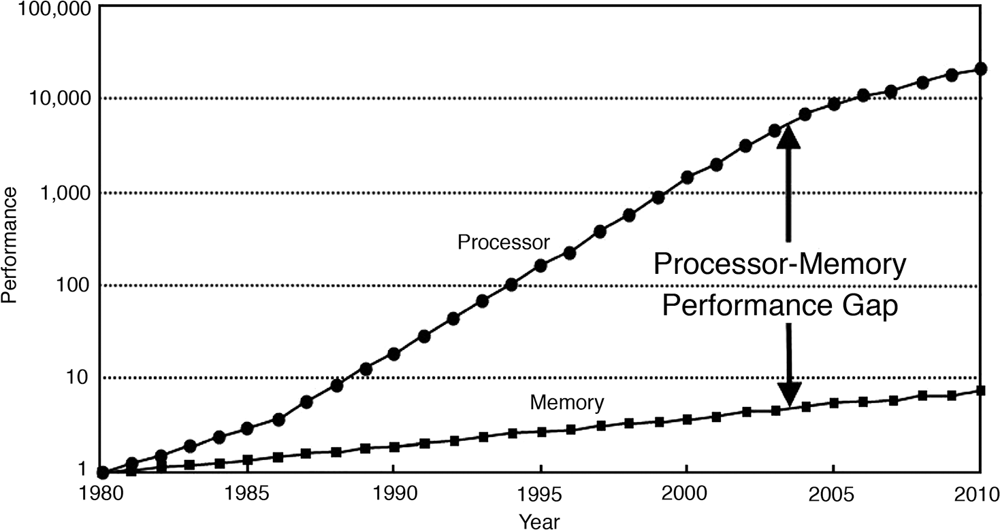
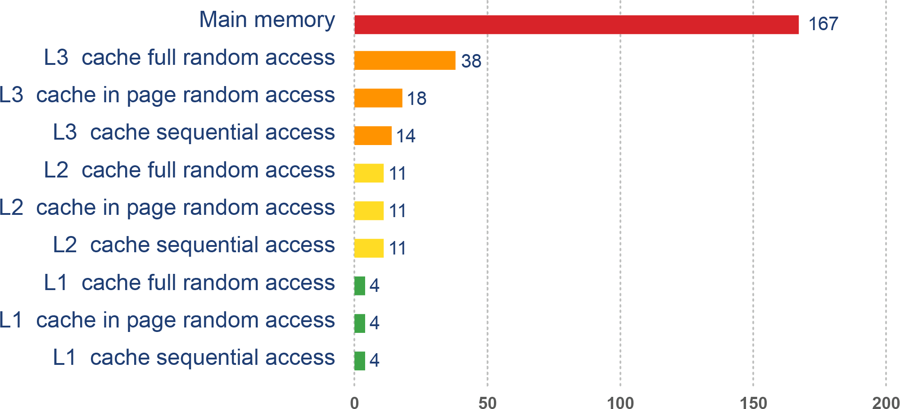
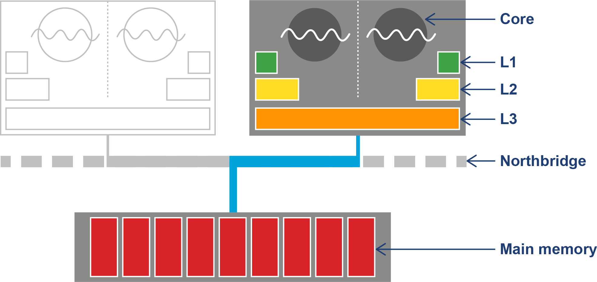
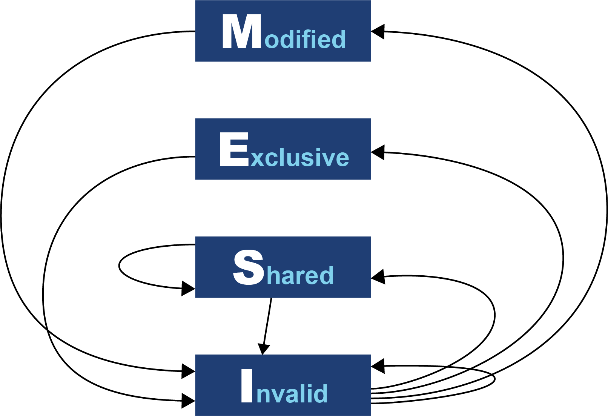
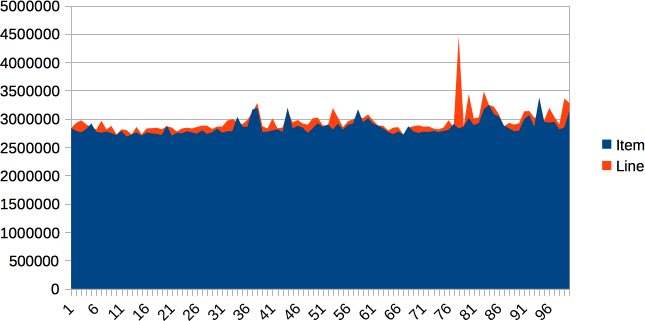
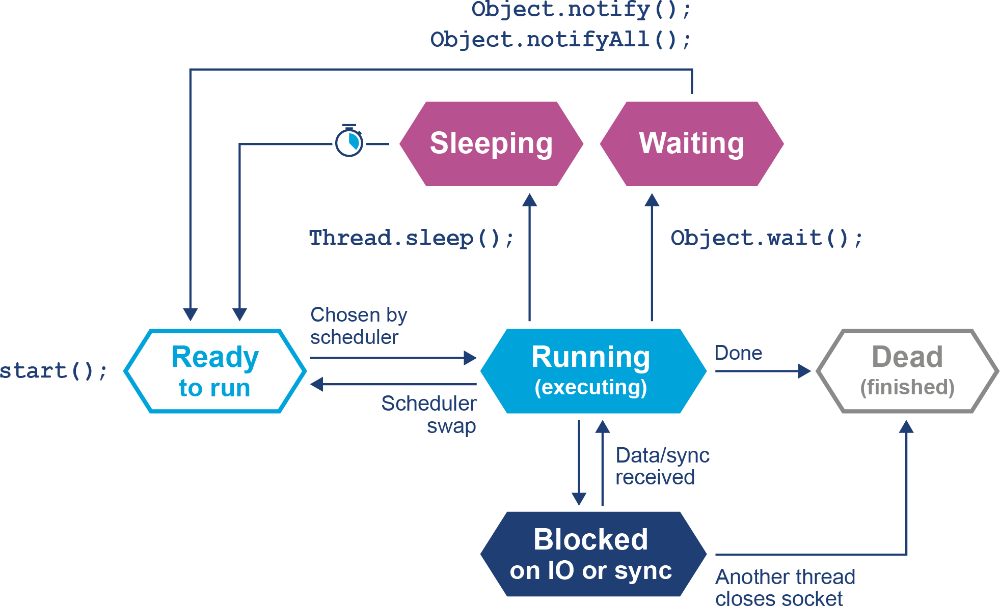
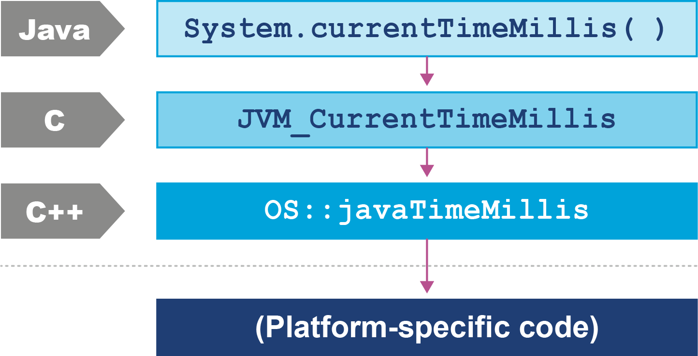
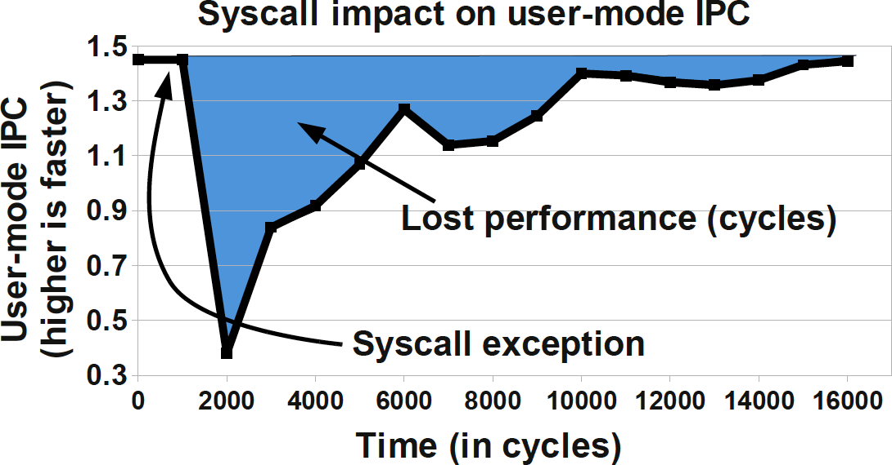
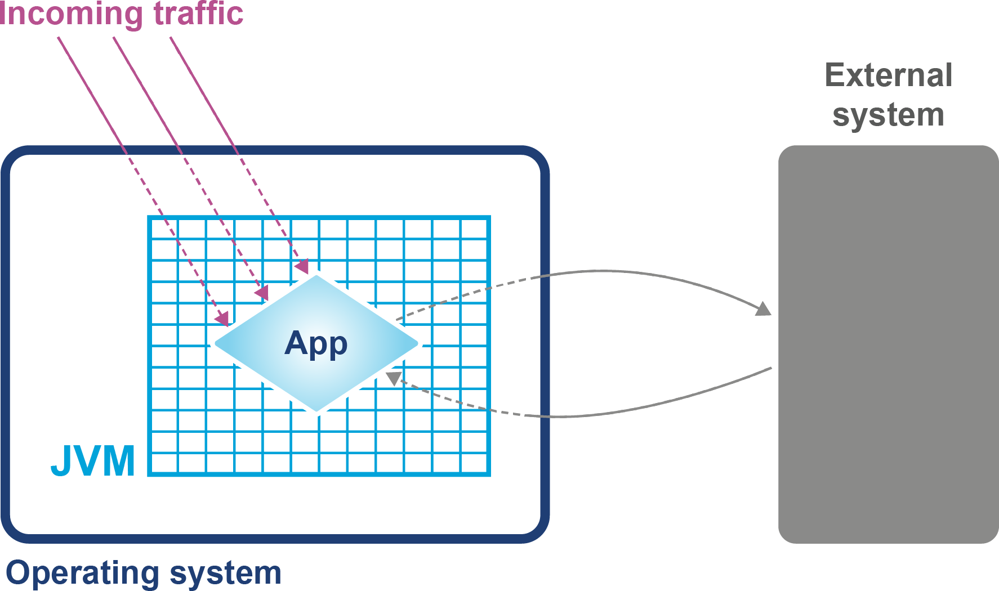

# Chương 7. Phần cứng và Hệ điều hành

Tại sao lập trình viên Java lại cần quan tâm đến phần cứng?

Trong nhiều năm, ngành công nghiệp máy tính được thúc đẩy bởi định luật Moore, một giả thuyết do người sáng lập Intel Gordon Moore đưa ra về xu hướng dài hạn trong năng lực bộ xử lý. Định luật này (thực ra là một quan sát hoặc phép ngoại suy) có thể được diễn đạt theo nhiều cách, nhưng một trong những cách thông thường nhất là:

> Số transistor trên một con chip sản xuất hàng loạt tăng gấp đôi khoảng mỗi 18 tháng.
>
> — Định luật Moore (diễn đạt không chính thức)

Hiện tượng này đại diện cho sự gia tăng theo cấp số nhân về sức mạnh máy tính theo thời gian. Nó được nêu lần đầu năm 1965, nên đại diện cho một xu hướng dài hạn đáng kinh ngạc, chưa từng có trong lịch sử tính toán. Tác động của định luật Moore mang tính chuyển đổi trong nhiều (nếu không nói là hầu hết) lĩnh vực của thế giới hiện đại. Cái chết của định luật Moore đã được tuyên bố lặp đi lặp lại trong nhiều thập kỷ. Tuy nhiên, có những lý do rất chính đáng để cho rằng, xét trên mọi phương diện thực tiễn, tiến bộ đáng kinh ngạc này trong công nghệ chip đã (cuối cùng) đi đến hồi kết:

> Transistor chỉ có thể nhỏ đến một mức nào đó và cuối cùng, các định luật vật lý bền vững hơn sẽ cản đường. Transistor giờ đã có thể đo ở thang nguyên tử, với những con nhỏ nhất được bán thương mại chỉ rộng 3 nanomet, chỉ hơn một sợi DNA của con người (2,5nm) một chút. Dù vẫn còn chỗ để làm chúng nhỏ hơn (năm 2021, IBM công bố tạo thành công chip 2 nanomet), tiến bộ như vậy đã trở nên tốn kém và chậm đến mức cấm đoán, khiến những lợi ích đáng tin cậy bị đặt dấu hỏi. Và vẫn còn giới hạn vật lý rằng dây dẫn không thể mỏng hơn nguyên tử, ít nhất là không với hiểu biết hiện tại của chúng ta về vật lý vật liệu.
>
> — Audrey Woods, "The Death of Moore's Law: What it means and what might fill the gap going forward"

Phần cứng đã trở nên ngày càng phức tạp để sử dụng tốt "ngân sách transistor" sẵn có trong máy tính hiện đại. Các nền tảng phần mềm chạy trên phần cứng đó cũng tăng độ phức tạp để khai thác các khả năng mới. Có nhiều mã lực hơn, nhưng kỹ sư phải làm nhiều việc hơn trong phần mềm để tận dụng nó, nên hiệu năng mang lại bị giảm bớt bởi chi phí phụ trội này.

Các ứng dụng phần mềm giờ đây thâm nhập (gần như) mọi khía cạnh của xã hội toàn cầu. Và phần mềm đó ngày càng phức tạp, khi các nhà phát triển ứng dụng tận dụng hiệu năng sẵn có.

Hay nói cách khác:

> Phần mềm đang nuốt chửng thế giới.
>
> — Marc Andreessen

Như chúng ta sẽ thấy, Java đã là bên hưởng lợi từ lượng sức mạnh máy tính ngày càng tăng. Thiết kế của ngôn ngữ và runtime đã rất phù hợp (hoặc may mắn) để sử dụng xu hướng này trong năng lực bộ xử lý, như chúng ta đã thảo luận ở các chương trước. Tuy nhiên, một lập trình viên Java thực sự có ý thức về hiệu năng cần hiểu các nguyên lý và công nghệ làm nền cho nền tảng để sử dụng tốt nhất các tài nguyên sẵn có.

Điều này đặc biệt liên quan bởi vì, như chúng ta sẽ thấy ở các chương sau, việc phát triển ứng dụng cloud native đã phần nào thay đổi bối cảnh hiệu năng. Nhưng trước khi chuyển sang những chủ đề đó, hãy xem nhanh phần cứng và hệ điều hành hiện đại, vì hiểu biết về những chủ đề này sẽ giúp ích cho mọi thứ tiếp theo.

## Giới thiệu về phần cứng hiện đại

Nhiều khóa học đại học về kiến trúc phần cứng vẫn dạy một góc nhìn cổ điển, dễ hiểu về phần cứng. Góc nhìn logic trừu tượng này về phần cứng tập trung vào một cỗ máy dựa trên thanh ghi đơn giản, với các thao tác số học, logic, load và store. Từ những năm 1990, thế giới của nhà phát triển ứng dụng, ở mức độ lớn, xoay quanh kiến trúc Intel x86/x64 (và gần đây hơn là sự trỗi dậy của chip ARM).

Tuy nhiên, đây là lĩnh vực công nghệ đã trải qua thay đổi triệt để. Mô hình tư duy đơn giản về hoạt động của bộ xử lý giờ đây là sai, và lập luận trực giác dựa trên đó dễ dẫn đến những kết luận hoàn toàn sai lầm.

Để giải quyết điều này, trong chương này chúng ta sẽ thảo luận vài tiến bộ trong công nghệ CPU. Chúng ta sẽ bắt đầu với hành vi của bộ nhớ, vì đây là điều quan trọng nhất đối với một lập trình viên Java hiện đại.

### Bộ nhớ

Khi định luật Moore tiến triển, số transistor tăng theo cấp số nhân ban đầu được dùng cho tốc độ xung nhịp ngày càng nhanh hơn. Lý do rất rõ ràng: tốc độ xung nhịp nhanh hơn nghĩa là nhiều chỉ thị hoàn thành hơn mỗi giây. Theo đó, tốc độ bộ xử lý đã tiến bộ vượt bậc, và các bộ xử lý 2+ GHz mà chúng ta có ngày nay nhanh hơn hàng trăm lần so với chip 4,77 MHz gốc trong chiếc IBM PC đầu tiên.

Tuy nhiên, tốc độ xung nhịp tăng lại phơi bày một vấn đề khác — chip nhanh hơn đòi hỏi dòng dữ liệu nhanh hơn để xử lý. Như Hình 7-1 cho thấy,[^1] theo thời gian, bộ nhớ chính không thể theo kịp nhu cầu dữ liệu mới của lõi bộ xử lý.



*Hình 7-1. Khoảng cách giữa năng lực hiệu năng của bộ xử lý và bộ nhớ (Hennessy và Patterson, 2011)*

Điều này dẫn đến một vấn đề: nếu CPU đang chờ dữ liệu, thì chu kỳ nhanh hơn cũng chẳng giúp gì, vì CPU sẽ chỉ ngồi không cho đến khi dữ liệu cần thiết đến.

### Bộ nhớ đệm (Memory Cache)

Để giải quyết vấn đề này, các CPU cache đã được giới thiệu. Đây là những vùng bộ nhớ trên CPU chậm hơn thanh ghi CPU nhưng nhanh hơn bộ nhớ chính. Ý tưởng là để CPU lấp đầy cache bằng các bản sao của những vị trí bộ nhớ được truy cập thường xuyên thay vì liên tục phải đánh địa chỉ lại bộ nhớ chính.

Các CPU hiện đại có nhiều tầng cache, với các cache được truy cập thường xuyên nhất nằm gần lõi xử lý. Cache gần CPU nhất thường được gọi là L1 (cho "level 1 cache"), tiếp theo là L2, v.v. Các kiến trúc bộ xử lý khác nhau có số lượng và cấu hình cache khác nhau, nhưng một lựa chọn phổ biến là mỗi lõi thực thi có một cache L1 và L2 riêng, chuyên dụng, và một cache L3 được chia sẻ giữa một số hoặc tất cả các lõi. Tác động của những cache này trong việc tăng tốc thời gian truy cập được thể hiện ở Hình 7-2.[^2]



*Hình 7-2. Thời gian truy cập cho các loại bộ nhớ khác nhau*

Cách tiếp cận kiến trúc cache này cải thiện thời gian truy cập và giúp giữ cho lõi luôn được cung cấp đầy đủ dữ liệu để xử lý. Do khoảng cách giữa tốc độ xung nhịp và thời gian truy cập, nhiều ngân sách transistor hơn được dành cho cache trên một CPU hiện đại.

Thiết kế kết quả có thể thấy ở Hình 7-3. Hình này cho thấy các cache L1 và L2 (riêng cho từng lõi CPU) và một cache L3 chung được chia sẻ cho mọi lõi trên CPU. Bộ nhớ chính được truy cập qua thành phần Northbridge, và chính việc đi qua bus này gây ra sự sụt giảm lớn về thời gian truy cập bộ nhớ chính.



*Hình 7-3. Kiến trúc tổng thể của CPU và bộ nhớ*

Mặc dù việc thêm kiến trúc caching cải thiện rất nhiều throughput của bộ xử lý, nó lại đưa vào một tập vấn đề mới. Những vấn đề này bao gồm việc xác định bộ nhớ được nạp vào và ghi ngược từ cache ra sao. Các giải pháp cho vấn đề này thường được gọi là *cache consistency protocol* (giao thức nhất quán cache).

> **GHI CHÚ**
>
> Có những vấn đề khác nảy sinh khi loại caching này được áp dụng trong môi trường xử lý song song, như chúng ta sẽ thấy ở phần sau của cuốn sách.

Ở mức thấp nhất, một giao thức tên MESI (và các biến thể của nó) thường thấy trên nhiều loại bộ xử lý. Nó định nghĩa bốn trạng thái cho bất kỳ dòng nào trong cache. Mỗi dòng (thường 64 byte) là:

- **Modified** (đã sửa đổi nhưng chưa flush ra bộ nhớ chính)
- **Exclusive** (chỉ có trong cache này, nhưng khớp với bộ nhớ chính)
- **Shared** (có thể cũng có trong các cache khác; khớp với bộ nhớ chính)
- **Invalid** (không được dùng; sẽ bị loại bỏ ngay khi thực tế cho phép)

Ý tưởng của giao thức là nhiều bộ xử lý có thể đồng thời ở trạng thái Shared. Tuy nhiên, nếu một bộ xử lý chuyển sang bất kỳ trạng thái hợp lệ nào khác (Exclusive hoặc Modified), thì điều này sẽ buộc tất cả bộ xử lý khác vào trạng thái Invalid. Điều này được thể hiện ở Bảng 7-1, nơi Y chỉ một chuyển đổi được phép và `-` biểu thị chuyển đổi không được phép.

**Bảng 7-1. Các trạng thái MESI được phép giữa các bộ xử lý**

| | M | E | S | I |
|---|---|---|---|---|
| **M** | - | - | - | Y |
| **E** | - | - | - | Y |
| **S** | - | - | Y | Y |
| **I** | Y | Y | Y | Y |

Giao thức hoạt động bằng cách phát quảng bá ý định của một bộ xử lý muốn đổi trạng thái. Một tín hiệu điện được gửi qua bus bộ nhớ chung, và các bộ xử lý khác được thông báo. Logic đầy đủ cho các chuyển đổi trạng thái được thể hiện ở Hình 7-4.



*Hình 7-4. Sơ đồ chuyển trạng thái MESI*

Ban đầu, bộ xử lý ghi mọi thao tác cache trực tiếp vào bộ nhớ chính. Đây gọi là hành vi *write-through*, nhưng nó đã và đang rất kém hiệu quả, và đòi hỏi lượng băng thông lớn tới bộ nhớ. Các bộ xử lý gần đây hơn cũng triển khai hành vi *write-back*, nơi lưu lượng trở lại bộ nhớ chính được giảm đáng kể nhờ bộ xử lý chỉ ghi các khối cache đã sửa đổi (dirty) ra bộ nhớ khi các khối cache đó bị thay thế.

Tác động tổng thể của công nghệ caching là tăng đáng kể tốc độ dữ liệu có thể được ghi vào hoặc đọc từ bộ nhớ. Điều này được diễn đạt theo *băng thông tới bộ nhớ*. Tốc độ burst, hay mức tối đa lý thuyết, dựa trên vài yếu tố:

- Tần số xung nhịp của bộ nhớ
- Độ rộng của bus bộ nhớ (thường 64 bit)
- Số interface (thường là hai trong các máy hiện đại)

Con số này được nhân đôi trong trường hợp DDR RAM (DDR viết tắt của "double data rate" vì nó truyền thông trên cả hai sườn của tín hiệu xung nhịp).

Áp dụng công thức cho phần cứng phổ thông năm 2024 cho ra tốc độ ghi tối đa lý thuyết là 17+ GB/s mỗi lõi, với băng thông hệ thống tổng thể 70–90 GB/s.[^3] Trên thực tế, tất nhiên, điều này có thể bị giới hạn bởi nhiều yếu tố khác trong hệ thống. Như vậy, nó cho ta một giá trị hữu ích vừa phải để thấy phần cứng và phần mềm có thể tiến gần đến đâu.

Hãy viết vài đoạn mã đơn giản để khai thác phần cứng cache, như thấy ở Ví dụ 7-1.

**Ví dụ 7-1. Ví dụ về caching**

```java
public class Caching {

    private final int ARR_SIZE = 2 * 1024 * 1024;
    private final int[] testData = new int[ARR_SIZE];

    private void run() {
        System.err.println("Start: "+ System.currentTimeMillis());
        for (int i = 0; i < 15_000; i++) {
            touchEveryLine();
            touchEveryItem();
        }
        System.err.println("Warmup finished: "+ System.currentTimeMillis());
        System.err.println("Item           Line");
        for (int i = 0; i < 100; i++) {
            long t0 = System.nanoTime();
            touchEveryLine();
            long t1 = System.nanoTime();
            touchEveryItem();
            long t2 = System.nanoTime();
            long elItem = t2 - t1;
            long elLine = t1 - t0;
            double diff = elItem - elLine;
            System.err.println(elItem + " " + elLine +" "+ (100 * diff / elLine));
        }
    }

    private void touchEveryItem() {
        for (int i = 0; i < testData.length; i++)
            testData[i]++;
    }

    private void touchEveryLine() {
        for (int i = 0; i < testData.length; i += 16)
            testData[i]++;
    }

    public static void main(String[] args) {
        Caching c = new Caching();
        c.run();
    }
}
```

Theo trực giác, `touchEveryItem()` làm nhiều việc gấp 16 lần `touchEveryLine()`, vì phải cập nhật số mục dữ liệu gấp 16 lần. Tuy nhiên, mục đích của ví dụ đơn giản này là cho thấy trực giác có thể dẫn chúng ta đi lạc đến mức nào khi làm việc với hiệu năng JVM. Hãy xem một số kết quả mẫu từ class `Caching`, như thể hiện ở Hình 7-5.



*Hình 7-5. Thời gian (ns) trôi qua cho ví dụ caching*

Đồ thị cho thấy 100 lần chạy của mỗi hàm và nhằm thể hiện vài hiệu ứng khác nhau. Trước hết, hãy để ý rằng kết quả cho cả hai hàm rất giống nhau về thời gian tiêu tốn, nên kỳ vọng trực giác về "nhiều việc gấp 16 lần" rõ ràng là sai.

Thay vào đó, hiệu ứng chi phối của đoạn mã này là khai thác bus bộ nhớ bằng cách chuyển nội dung của mảng từ bộ nhớ chính vào cache để được `touchEveryItem()` và `touchEveryLine()` thao tác.

Về mặt thống kê của các con số, mặc dù kết quả khá nhất quán, vẫn có những giá trị ngoại lai riêng lẻ khác biệt 30%–35% so với giá trị trung vị.

Nhìn chung, chúng ta thấy mỗi lần lặp của hàm bộ nhớ đơn giản mất khoảng 3 mili-giây (trung bình 2,86 ms) để duyệt một khối bộ nhớ 100 MB, cho ra băng thông bộ nhớ hiệu dụng chỉ dưới 3,5 GB/s. Con số này thấp hơn mức tối đa lý thuyết, nhưng vẫn là con số hợp lý. Thiết kế theo giới hạn lý thuyết có thể là công thức cho sự thất vọng (hoặc thảm họa). Các con số thực nghiệm hữu ích cho việc thiết lập baseline và lập kế hoạch. Kết quả khác biệt đáng kể — tức là khác bậc độ lớn — so với giới hạn lý thuyết có thể được xem là bất hợp lý và đáng để khám phá thêm.

> **GHI CHÚ**
>
> Các CPU hiện đại có một *hardware prefetcher* có thể phát hiện các mẫu hình dự đoán được trong việc truy cập dữ liệu (thường chỉ là một "bước nhảy" (stride) đều đặn qua dữ liệu). Trong ví dụ này, chúng ta đang tận dụng điều đó để tiến gần hơn đến mức tối đa thực tế cho băng thông truy cập bộ nhớ.

Một trong những chủ đề then chốt trong hiệu năng Java là độ nhạy của ứng dụng với tốc độ cấp phát object. Chúng ta sẽ quay lại điểm này vài lần, nhưng ví dụ đơn giản này cho ta một thước đo cơ bản về giới hạn trên của tốc độ cấp phát.

## Các tính năng của bộ xử lý hiện đại

Các kỹ sư phần cứng đôi khi gọi những tính năng mới trở nên khả thi nhờ định luật Moore là "tiêu ngân sách transistor". Bộ nhớ cache là cách dùng rõ ràng nhất của số transistor ngày càng tăng, nhưng các kỹ thuật khác cũng đã xuất hiện qua nhiều năm.

### Translation Lookaside Buffer

Một cách dùng rất quan trọng của caching phần cứng là *translation lookaside buffer* (TLB), một cache phần cứng cho các bảng trang ánh xạ vị trí bộ nhớ ảo (những vị trí mà mã ứng dụng nhìn thấy) sang vị trí phần cứng. Điều này tăng tốc rất nhiều một thao tác rất thường xuyên — truy cập địa chỉ vật lý nằm dưới một địa chỉ ảo.

> **GHI CHÚ**
>
> Chúng ta đã gặp tính năng TLAB của GC trong HotSpot ở Chương 4, và một số tài liệu gọi TLAB là TLB, điều này có thể gây nhầm lẫn vì hai khái niệm không liên quan. Luôn kiểm tra tính năng nào đang được thảo luận khi bạn thấy TLB được nhắc đến.

Nếu không có TLB, mọi lần tra cứu địa chỉ ảo sẽ mất 16 chu kỳ, ngay cả khi bảng trang nằm trong cache L1. Hiệu năng kết quả sẽ không chấp nhận được, nên TLB về cơ bản là thiết yếu cho mọi chip hiện đại.

### Dự đoán rẽ nhánh và thực thi suy đoán

Một trong những mẹo nâng cao của bộ xử lý xuất hiện trên các bộ xử lý hiện đại là *branch prediction* (dự đoán rẽ nhánh). Nó được dùng để ngăn bộ xử lý phải chờ đánh giá một giá trị cần cho một nhánh có điều kiện. Các bộ xử lý hiện đại có pipeline chỉ thị nhiều tầng. Điều này có nghĩa việc thực thi một chu kỳ CPU đơn lẻ được chia thành nhiều giai đoạn riêng biệt. Có thể có nhiều chỉ thị đang bay (ở các giai đoạn thực thi khác nhau) cùng lúc.

Trong mô hình này, một nhánh có điều kiện gây vấn đề, bởi cho đến khi điều kiện được đánh giá, không biết được chỉ thị tiếp theo sau nhánh sẽ là gì. Điều này có thể khiến bộ xử lý ngưng trệ vài chu kỳ (trên thực tế lên đến 20), vì nó thực chất phải dọn sạch pipeline nhiều tầng phía sau nhánh.

> **GHI CHÚ**
>
> Thực thi suy đoán, nổi tiếng thay, là nguyên nhân của những vấn đề bảo mật lớn (bao gồm Meltdown và Spectre) được phát hiện ảnh hưởng đến rất nhiều CPU vào đầu năm 2018.

Để tránh điều này, bộ xử lý có thể dành transistor để xây dựng một heuristic quyết định nhánh nào có khả năng được chọn hơn. Dùng phỏng đoán này, CPU lấp đầy pipeline dựa trên một canh bạc. Nếu đúng, thì CPU tiếp tục như không có gì xảy ra. Nếu sai, thì các chỉ thị thực thi dở dang bị vứt bỏ, và CPU phải trả giá bằng việc dọn sạch pipeline.

### Mô hình bộ nhớ phần cứng

Câu hỏi cốt lõi về bộ nhớ cần được trả lời trong hệ thống đa lõi là "Làm sao nhiều CPU khác nhau có thể truy cập cùng một vị trí bộ nhớ một cách nhất quán?"

Câu trả lời cho câu hỏi này phụ thuộc nhiều vào phần cứng, nhưng nhìn chung, `javac`, trình biên dịch JIT, và CPU đều được phép thay đổi thứ tự mã thực thi. Điều này với điều kiện là mọi thay đổi không ảnh hưởng đến kết quả như thread hiện tại quan sát được.

Ví dụ, giả sử chúng ta có đoạn mã như thế này:

```java
myInt = otherInt;
intChanged = true;
```

Không có mã nào giữa hai phép gán, nên thread đang thực thi không cần quan tâm chúng xảy ra theo thứ tự nào, và do đó môi trường được tự do thay đổi thứ tự các chỉ thị.

Tuy nhiên, điều này có thể có nghĩa là trong một thread khác có tầm nhìn tới các mục dữ liệu này, thứ tự có thể thay đổi, và giá trị `myInt` mà thread kia đọc được có thể là giá trị cũ, dù `intChanged` được thấy là `true`.

Loại sắp xếp lại này (store dịch chuyển sau store) không thể xảy ra trên chip x86, nhưng như Bảng 7-2 cho thấy, có những kiến trúc khác mà nó có thể, và thực sự, xảy ra.

**Bảng 7-2. Hỗ trợ bộ nhớ phần cứng**

| | ARMv7 | POWER | SPARC | x86 | AMD64 | zSeries |
|---|---|---|---|---|---|---|
| Load dịch chuyển sau load | Y | Y | - | - | - | - |
| Load dịch chuyển sau store | Y | Y | - | - | - | - |
| Store dịch chuyển sau store | Y | Y | - | - | - | - |
| Store dịch chuyển sau load | Y | Y | Y | Y | Y | Y |
| Atomic dịch chuyển cùng load | Y | Y | - | - | - | - |
| Atomic dịch chuyển cùng store | Y | Y | - | - | - | - |
| Chỉ thị không nhất quán | Y | Y | Y | Y | - | Y |

Trong môi trường Java, Java Memory Model (JMM) được thiết kế một cách tường minh là một mô hình *yếu* để tính đến sự khác biệt về tính nhất quán truy cập bộ nhớ giữa các loại bộ xử lý. Việc dùng đúng lock và truy cập `volatile` là phần chính trong việc đảm bảo mã đa luồng hoạt động đúng. Đây là chủ đề rất quan trọng mà chúng ta sẽ quay lại ở Chương 13.

Một xu hướng trong những năm gần đây là các nhà phát triển phần mềm tìm kiếm hiểu biết lớn hơn về hoạt động của phần cứng để đạt hiệu năng tốt hơn. Thuật ngữ *mechanical sympathy* (sự đồng cảm cơ khí) đã được đặt ra để mô tả cách tiếp cận này, đặc biệt khi áp dụng vào các lĩnh vực low-latency và hiệu năng cao.

> Cái tên "mechanical sympathy" đến từ tay đua vĩ đại Jackie Stewart, người ba lần vô địch thế giới Formula 1. Ông tin rằng những tay lái giỏi nhất có đủ hiểu biết về cách một cỗ máy hoạt động để có thể làm việc hài hòa với nó.
>
> — Martin Thompson

Điều này có thể thấy trong nghiên cứu gần đây về các thuật toán và cấu trúc dữ liệu lock-free, mà chúng ta sẽ gặp ở Chương 13.

## Hệ điều hành

Mục đích của một hệ điều hành là kiểm soát truy cập vào các tài nguyên phải được chia sẻ giữa nhiều tiến trình đang thực thi. Mọi tài nguyên đều hữu hạn, và mọi tiến trình đều tham lam, nên nhu cầu về một hệ thống trung tâm để phân xử và đo lường việc truy cập là thiết yếu. Trong số những tài nguyên khan hiếm này, hai thứ quan trọng nhất thường là bộ nhớ và thời gian CPU.

Đánh địa chỉ ảo qua memory management unit (MMU) và các bảng trang của nó là tính năng then chốt cho phép kiểm soát truy cập bộ nhớ và ngăn một tiến trình làm hỏng các vùng bộ nhớ thuộc về tiến trình khác.

Các TLB mà chúng ta gặp trước đó trong chương là tính năng phần cứng cải thiện thời gian tra cứu tới bộ nhớ vật lý. Việc dùng các buffer này cải thiện hiệu năng cho thời gian truy cập bộ nhớ của phần mềm. Tuy nhiên, MMU thường quá thấp cấp để lập trình viên đo được.

Thay vào đó, hãy xem xét kỹ hơn bộ lập lịch tiến trình (process scheduler) của OS, vì nó kiểm soát truy cập CPU và là một phần dễ thấy hơn nhiều của nhân hệ điều hành đối với người dùng.

### Bộ lập lịch (Scheduler)

Công việc của bộ lập lịch tiến trình là quản lý truy cập vào các lõi CPU (và phản hồi các interrupt). Trên một hệ thống hiện đại, hầu như luôn có nhiều platform thread hơn số có thể chạy đồng thời, nên sự tranh chấp CPU này đòi hỏi một cơ chế kiểm soát truy cập để giải quyết.

> **GHI CHÚ**
>
> Trong phần này, chúng ta đang nói tường minh về các platform thread ở mức OS. Virtual thread của Java 21+ không tuân theo mô hình này — thay vào đó, chính các *carrier thread* mà virtual thread được ghép kênh lên mới tuân theo mô hình này. Xem Chương 13 để biết thêm chi tiết.

Việc kiểm soát truy cập này dùng một hàng đợi gọi là *run queue* làm khu vực chờ cho các platform thread đủ điều kiện chạy nhưng phải chờ đến lượt dùng CPU. Vòng đời tổng thể của một platform thread được thể hiện ở Hình 7-6.



*Hình 7-6. Vòng đời thread*

Trong góc nhìn tương đối đơn giản này, bộ lập lịch OS đưa các platform thread lên và xuống khỏi lõi đơn duy nhất trong hệ thống. Ở cuối lượng tử thời gian (time quantum — thường là 10 ms hoặc 100 ms ở các hệ điều hành cũ hơn), bộ lập lịch chuyển thread về cuối run queue để chờ cho đến khi nó đến đầu hàng đợi và đủ điều kiện chạy lại.

Nếu một thread muốn tự nguyện từ bỏ lượng tử thời gian của mình, nó có thể làm vậy hoặc trong một khoảng thời gian cố định (qua `sleep()`) hoặc cho đến khi một điều kiện được thỏa mãn (dùng `wait()`). Cuối cùng, một thread cũng có thể bị block trên I/O hoặc một khóa phần mềm.

Khi bạn gặp mô hình này lần đầu, có thể sẽ dễ hiểu hơn nếu nghĩ về một cỗ máy chỉ có một lõi thực thi duy nhất. Phần cứng thực tế, tất nhiên, phức tạp hơn, và hầu như mọi máy hiện đại sẽ có nhiều lõi, cho phép thực thi thực sự đồng thời nhiều đường thực thi. Điều này có nghĩa việc lập luận về thực thi trong một môi trường đa xử lý thực sự là rất phức tạp và phản trực giác.

Một tính năng thường bị bỏ qua của hệ điều hành là, bởi bản chất của chúng, chúng tạo ra những khoảng thời gian mà mã ta quan tâm không chạy trên CPU. Một tiến trình đã hoàn thành lượng tử thời gian của nó sẽ không trở lại CPU cho đến khi nó lại đến đầu run queue. Kết hợp với thực tế rằng CPU là tài nguyên khan hiếm, điều này có nghĩa là mã đang *chờ* thường xuyên hơn là đang *chạy*.

Điều này có nghĩa các thống kê chúng ta muốn tạo ra từ những tiến trình mà ta thực sự muốn quan sát bị ảnh hưởng bởi hành vi của các tiến trình khác trên hệ thống. "Jitter" này và chi phí phụ trội của việc lập lịch là nguyên nhân chính gây nhiễu trong các kết quả quan sát được. Chúng ta đã thảo luận tính chất thống kê và cách xử lý kết quả thực tế ở Chương 2 và đã quan sát điều này trong *Caching.java*.

Một trong những cách dễ nhất để thấy hành động và hành vi của bộ lập lịch là cố quan sát chi phí phụ trội mà OS áp đặt để đạt được việc lập lịch. Đoạn mã sau thực thi 1.000 lần ngủ riêng biệt, mỗi lần 1 ms. Mỗi lần ngủ này sẽ liên quan đến việc thread bị đưa về cuối run queue và phải chờ một lượng tử thời gian mới. Vậy nên, tổng thời gian trôi qua của đoạn mã cho chúng ta ý niệm về chi phí phụ trội của việc lập lịch với một tiến trình điển hình:

```java
long start = System.currentTimeMillis();
for (int i = 0; i < 1_000; i++) {
    Thread.sleep(1);
}
long end = System.currentTimeMillis();
System.out.println("Millis elapsed: " + (end - start) / 1000.0);
```

Chạy đoạn mã này sẽ cho ra kết quả phân kỳ rất lớn, tùy thuộc vào hệ điều hành. Hầu hết các Unix sẽ báo cáo chi phí phụ trội khoảng 10%–20%. Các phiên bản Windows trước đây có bộ lập lịch tệ nổi tiếng, với một số phiên bản Windows XP báo cáo chi phí phụ trội lên đến 180% cho việc lập lịch (nên 1.000 lần ngủ 1 ms sẽ mất 2,8 s).

Thậm chí có báo cáo rằng một số nhà cung cấp OS độc quyền đã chèn mã vào bản phát hành của họ để phát hiện các lần chạy benchmark và gian lận các metric.

Giờ khi đã hiểu lượng tử lập lịch và tác động của nó lên việc thực thi thread của tiến trình, hãy đào sâu hơn một chút vào cách JVM thường gọi vào hệ điều hành khi cần.

### JVM và hệ điều hành

JVM cung cấp một môi trường thực thi di động, độc lập với hệ điều hành bằng cách cung cấp một interface chung cho mã Java. Tuy nhiên, với một số dịch vụ nền tảng như lập lịch thread (hay thậm chí thứ tầm thường như lấy thời gian từ đồng hồ hệ thống), hệ điều hành nằm dưới phải được truy cập.

Khả năng này được cung cấp bởi các *native method*, được đánh dấu bằng từ khóa `native`. Chúng được viết bằng C nhưng có thể truy cập như các method Java thông thường. Interface này được gọi là Java Native Interface (JNI). Ví dụ, `java.lang.Object` khai báo nhiều native method không private; tất cả các method này xử lý các mối quan tâm nền tảng ở mức tương đối thấp.

Hãy xem một ví dụ đơn giản và quen thuộc hơn: lấy thời gian hệ thống.

Hãy xét hàm `os::javaTimeMillis()`. Đây là mã (đặc thù hệ thống) chịu trách nhiệm triển khai static method `System.currentTimeMillis()` của Java. Mã thực sự làm việc được triển khai bằng C++ nhưng được truy cập từ Java qua một "cầu nối" bằng mã C. Hãy xem mã này thực sự được gọi ra sao trong HotSpot.

Như bạn thấy ở Hình 7-7, native method `System.currentTimeMillis()` được ánh xạ tới method entry point của JVM là `JVM_CurrentTimeMillis()`. Ánh xạ này đạt được qua cơ chế JNI `Java_java_lang_System_registerNatives()` chứa trong *java/lang/System.c*.



*Hình 7-7. Ngăn xếp lời gọi của HotSpot*

`JVM_CurrentTimeMillis()` là lời gọi tới method entry point của VM. Nó hiện ra như một hàm C nhưng thực ra là một hàm C++ được export với quy ước gọi của C. Lời gọi rút gọn thành lời gọi `os::javaTimeMillis()` được bọc trong vài macro của OpenJDK.

Method này được định nghĩa trong namespace `os` và phụ thuộc hệ điều hành. Các định nghĩa cho method này được cung cấp bởi các thư mục con mã nguồn đặc thù OS trong OpenJDK. Điều này cung cấp một minh họa đơn giản về cách các phần độc lập nền tảng của Java có thể gọi vào các dịch vụ được cung cấp bởi hệ điều hành và phần cứng nằm dưới.

Hãy xem một chủ đề liên quan, đó là điều gì xảy ra khi bộ lập lịch cần thay đổi những thread nào đang thực thi.

### Context Switch

Một *context switch* (chuyển ngữ cảnh) là quá trình mà bộ lập lịch OS loại bỏ một platform thread đang chạy và thay bằng thread khác. Có vài loại context switch khác nhau, nhưng nói rộng ra, tất cả đều liên quan đến việc hoán đổi các chỉ thị đang thực thi và trạng thái stack của thread.

Một context switch có thể là thao tác tốn kém, dù là giữa các user thread hay từ chế độ user sang chế độ kernel (đôi khi gọi là *mode switch*).

Trường hợp sau đặc biệt quan trọng, bởi một user thread có thể cần chuyển sang chế độ kernel để thực hiện một chức năng nào đó giữa chừng lát thời gian của nó. Tuy nhiên, việc chuyển này sẽ buộc các cache chỉ thị và cache khác phải bị dọn sạch, vì các vùng bộ nhớ mà mã user space truy cập thường sẽ không có gì chung với kernel.

Một context switch sang chế độ kernel sẽ làm mất hiệu lực các TLB và có khả năng các cache khác. Khi lời gọi trả về, các cache này sẽ phải được lấp đầy lại, nên tác động của một mode switch sang kernel vẫn tồn tại ngay cả sau khi quyền điều khiển đã trở lại user space. Điều này khiến chi phí thực sự của một system call bị che khuất.[^4]

Ví dụ, Hình 7-8 làm nổi bật chi phí của một lời gọi giao tiếp liên tiến trình (IPC) — nó được thực hiện ở chế độ user nhưng đòi hỏi chuyển sang chế độ kernel. Sau khi việc chuyển xảy ra (được biểu diễn là "syscall exception", nhưng lưu ý rằng đây không phải exception của Java mà là một interrupt), thì hiệu năng giảm xuống và chỉ phục hồi chậm khi cache được lấp đầy lại.



*Hình 7-8. Tác động của một system call (Soares và Stumm, 2010)*

Để giảm nhẹ điều này khi có thể, Linux cung cấp một cơ chế gọi là *virtual dynamic shared object* (vDSO). Đây là một vùng bộ nhớ trong user space được dùng để tăng tốc các syscall thực ra không cần đặc quyền kernel. Nó đạt được sự tăng tốc này bằng cách không thực sự thực hiện context switch sang chế độ kernel. Hãy xem một ví dụ để thấy điều này hoạt động ra sao với một syscall thực.

Ví dụ, một system call Unix rất phổ biến là `gettimeofday()`. Nó trả về "thời gian đồng hồ treo tường" (wallclock time) theo hiểu biết của hệ điều hành. Đằng sau hậu trường, nó thực ra chỉ đọc một cấu trúc dữ liệu của kernel để lấy thời gian đồng hồ hệ thống. Vì việc này không có tác dụng phụ, nó không cần truy cập đặc quyền.

Nếu chúng ta có thể dùng vDSO để sắp xếp cho cấu trúc dữ liệu này được ánh xạ vào không gian địa chỉ của tiến trình user, thì không cần thực hiện chuyển sang chế độ kernel. Kết quả là, hình phạt lấp đầy lại cache thể hiện ở Hình 7-7 không phải trả.

Xét việc hầu hết ứng dụng Java thường xuyên cần truy cập dữ liệu thời gian, đây là một sự tăng cường hiệu năng đáng hoan nghênh. Cơ chế vDSO tổng quát hóa ví dụ này đôi chút và có thể là kỹ thuật hữu ích, ngay cả khi nó chỉ có trên Linux.

## Một mô hình hệ thống đơn giản

Trong phần này, chúng tôi trình bày một mô hình đơn giản để mô tả các nguồn cơ bản của những vấn đề hiệu năng có thể xảy ra. Mô hình được diễn đạt theo các đại lượng quan sát được của hệ điều hành đối với các hệ thống con nền tảng và có thể liên hệ trực tiếp trở lại với đầu ra của các công cụ dòng lệnh Unix tiêu chuẩn.

> **GHI CHÚ**
>
> Điều này có vẻ quá thấp cấp hoặc lỗi thời theo tiêu chuẩn của các ứng dụng cloud hiện đại, nhưng mục đích là thiết lập một mô hình nền tảng mà sau đó chúng ta có thể dùng với các nguồn dữ liệu (ví dụ, dữ liệu observability) mà chúng ta sẽ thực sự dùng để chẩn đoán vấn đề.

Mô hình dựa trên quan niệm đơn giản về một ứng dụng Java chạy trên hệ điều hành Unix hoặc kiểu Unix. Hình 7-9 cho thấy các thành phần cơ bản của mô hình, bao gồm:

- Phần cứng và hệ điều hành mà ứng dụng chạy trên đó
- JVM (hoặc container) mà ứng dụng chạy trong đó
- Bản thân mã ứng dụng
- Bất kỳ hệ thống bên ngoài nào mà ứng dụng gọi
- Lưu lượng request đến đang tới ứng dụng



*Hình 7-9. Mô hình hệ thống đơn giản*

Bất kỳ khía cạnh nào của hệ thống đều có thể chịu trách nhiệm cho một nút thắt cổ chai hiệu năng. Một số kỹ thuật chẩn đoán đơn giản có thể được dùng để thu hẹp hoặc cô lập những phần cụ thể của hệ thống như thủ phạm tiềm năng của vấn đề hiệu năng.

Trên thực tế, một định nghĩa cho ứng dụng hoạt động tốt là việc sử dụng hiệu quả các tài nguyên hệ thống. Điều này bao gồm sử dụng CPU, bộ nhớ, và băng thông mạng hoặc I/O.

> **MẸO**
>
> Nếu một ứng dụng khiến một hoặc nhiều giới hạn tài nguyên bị chạm tới, thì kết quả sẽ là một vấn đề hiệu năng.

Bước đầu tiên trong bất kỳ chẩn đoán hiệu năng nào là nhận ra giới hạn tài nguyên nào đang bị chạm tới. Chúng ta không thể tinh chỉnh hiệu năng mà không xử lý sự thiếu hụt tài nguyên — hoặc bằng cách tăng tài nguyên sẵn có hoặc tăng hiệu suất sử dụng.

Cũng đáng lưu ý rằng bản thân hệ điều hành thường không nên là yếu tố đóng góp lớn vào mức sử dụng hệ thống — vai trò của hệ điều hành là quản lý tài nguyên thay mặt các tiến trình user, chứ không phải tự tiêu thụ chúng.

Ngoại lệ thực sự duy nhất cho quy tắc này là khi tài nguyên khan hiếm đến mức OS gặp khó khăn trong việc cấp phát đủ để thỏa mãn yêu cầu của user. Với hầu hết phần cứng cấp server hiện đại, điều này chỉ nên xảy ra khi yêu cầu I/O (hoặc thỉnh thoảng là bộ nhớ) vượt quá nhiều so với năng lực.

### Sử dụng CPU

Một metric then chốt cho hiệu năng ứng dụng là mức sử dụng CPU. Chu kỳ CPU khá thường là tài nguyên quan trọng nhất mà ứng dụng cần, nên sử dụng chúng hiệu quả là thiết yếu cho hiệu năng tốt. Các ứng dụng CPU-bound nên nhắm đến mức sử dụng càng gần 100% càng tốt trong giai đoạn tải cao, dù điều này khó đạt được trên thực tế do các phụ thuộc khác của ứng dụng. Nhìn tiến trình của bạn ở mức cao giúp phát hiện các ràng buộc lên ứng dụng.

> **MẸO**
>
> Khi bạn phân tích hiệu năng ứng dụng, hệ thống phải chịu đủ tải để khai thác nó. Hành vi của một ứng dụng nhàn rỗi thường vô nghĩa cho công việc hiệu năng.

Ba công cụ cơ bản mà mọi kỹ sư hiệu năng nên biết là `vmstat`, `ifstat` và `iostat`.

**vmstat**
: Báo cáo thống kê về bộ nhớ ảo, bao gồm thông tin về kích thước, IO và truy cập

**ifstat**
: Cung cấp thống kê về giao diện mạng và sẽ được dùng làm điểm khởi đầu để debug tương tác tiến trình ở mức mạng

**iostat**
: Giám sát input/output trên các thiết bị và sẽ được dùng để xác định bất kỳ tương tác thiết bị nào gây vấn đề

Trên Linux và các Unix khác, những công cụ dòng lệnh này cung cấp cái nhìn tức thời và thường rất hữu ích về trạng thái hiện tại của các hệ thống con bộ nhớ ảo và I/O, tương ứng.

Các công cụ này chỉ cung cấp con số ở mức toàn host, nhưng điều này thường đủ để chỉ hướng cho các cách tiếp cận chẩn đoán chi tiết hơn. Hãy xem cách dùng `vmstat` làm ví dụ:

```
$ vmstat 1
 r  b swpd   free   buff   cache   si  so  bi  bo  in   cs us sy id wa st
 2  0    0 759860 248412 2572248    0   0   0  80  63  127  8  0 92  0  0
 2  0    0 759002 248412 2572248    0   0   0   0  55  103 12  0 88  0  0
 1  0    0 758854 248412 2572248    0   0   0  80  57  116  5  1 94  0  0
 3  0    0 758604 248412 2572248    0   0   0  14  65  142 10  0 90  0  0
 2  0    0 758932 248412 2572248    0   0   0  96  52  100  8  0 92  0  0
 2  0    0 759860 248412 2572248    0   0   0   0  60  112  3  0 97  0  0
```

Tham số `1` theo sau `vmstat` cho biết chúng ta muốn `vmstat` cung cấp đầu ra liên tục ở tần suất 1 mẫu mỗi giây (cho đến khi bị ngắt bằng Ctrl-C) thay vì một snapshot đơn lẻ. Các dòng đầu ra mới được in mỗi giây, cho phép kỹ sư hiệu năng để đầu ra này chạy (hoặc ghi lại vào log) trong khi một bài test hiệu năng ban đầu được thực hiện.

Đầu ra của `vmstat` tương đối dễ hiểu và chứa nhiều thông tin hữu ích, chia thành các phần:

1. Hai cột đầu cho thấy số tiến trình có thể chạy (`r`) và bị block (`b`).
2. Trong phần memory, lượng bộ nhớ đã swap và còn trống được hiển thị, tiếp theo là bộ nhớ dùng làm buffer và làm cache.
3. Phần swap cho thấy bộ nhớ được swap vào từ và ra đĩa (`si` và `so`). Các máy cấp server hiện đại thường không nên có nhiều hoạt động swap.
4. Số block in và block out (`bi` và `bo`) cho thấy số khối 512-byte đã nhận từ và gửi tới một thiết bị block (I/O).
5. Trong phần system, số interrupt (`in`) và số context switch mỗi giây (`cs`) được hiển thị.
6. Phần CPU chứa một số metric liên quan trực tiếp, biểu diễn dưới dạng phần trăm thời gian CPU. Theo thứ tự, chúng là user time (`us`), kernel time (`sy`, cho "system time"), idle time (`id`), waiting time (`wa`), và "stolen time" (`st`, cho máy ảo).

Trong phần còn lại của cuốn sách, chúng ta sẽ gặp nhiều công cụ khác, tinh vi hơn. Tuy nhiên, điều quan trọng là không bỏ qua các công cụ cơ bản trong tầm tay. Các công cụ phức tạp có thể có những hành vi đánh lừa chúng ta, trong khi các công cụ đơn giản hoạt động sát với tiến trình và hệ điều hành có thể truyền đạt cái nhìn rõ ràng, không rối rắm về cách hệ thống của chúng ta thực sự hành xử.

Hãy xét một ví dụ. Ở phần "JVM và hệ điều hành", chúng ta đã thảo luận tác động của một context switch, và thấy tác động tiềm năng của một context switch đầy đủ sang không gian kernel ở Hình 7-7. Tuy nhiên, dù là giữa các user thread hay sang không gian kernel, context switch đều gây lãng phí không thể tránh khỏi tài nguyên CPU.

Một chương trình được tinh chỉnh tốt nên sử dụng tối đa có thể các tài nguyên của nó, đặc biệt là CPU. Với các workload chủ yếu phụ thuộc vào tính toán (bài toán "CPU-bound"), mục tiêu là đạt gần 100% mức sử dụng CPU cho công việc ở userland.

Nói cách khác, nếu chúng ta quan sát thấy mức sử dụng CPU không tiến gần 100% user time, thì câu hỏi hiển nhiên tiếp theo là "Tại sao không?" Điều gì khiến chương trình không đạt được điều đó? Các context switch không tự nguyện do lock gây ra có phải là vấn đề? Có phải do việc bị block bởi tranh chấp I/O?

Công cụ `vmstat` có thể, trên hầu hết hệ điều hành (đặc biệt là Linux), cho thấy số context switch đang xảy ra, nên chạy `vmstat 1` cho phép nhà phân tích thấy tác động thời gian thực của context switching. Một tiến trình không đạt được 100% mức sử dụng CPU userland và cũng thể hiện tỷ lệ context switch cao thì có khả năng đang bị block trên I/O, đang gặp tranh chấp lock thread, hoặc được viết theo cách gây ra context switch không cần thiết.

Tuy nhiên, đầu ra `vmstat` không đủ để phân biệt hoàn toàn các trường hợp này một mình — `vmstat` chỉ có thể giúp chỉ ra các vấn đề I/O, vì nó chỉ cung cấp góc nhìn thô sơ về các thao tác I/O. Chẩn đoán chi tiết hơn sẽ khả thi với các công cụ như JMC (trên desktop) hoặc Java Flight Recorder (hoặc các công cụ profiling thương mại). Xem Chương 10, 11 và 12 để biết thêm chi tiết.

### Garbage Collection

Như chúng ta đã thấy ở Chương 4, trong JVM HotSpot (JVM được dùng phổ biến nhất cho đến nay), bộ nhớ được cấp phát lúc khởi động và được quản lý từ trong user space. Điều đó có nghĩa các system call (như `sbrk()`) không cần thiết để cấp phát bộ nhớ. Đến lượt nó, điều này có nghĩa hoạt động chuyển sang kernel cho garbage collection là khá tối thiểu.

Do đó, nếu một hệ thống đang thể hiện mức sử dụng CPU hệ thống cao, thì nó chắc chắn không dành lượng thời gian đáng kể trong GC, vì hoạt động GC đốt các chu kỳ CPU ở user space và không tác động đến mức sử dụng ở không gian kernel.

Mặt khác, nếu một tiến trình JVM đang dùng 100% (hoặc gần đó) CPU ở user space, thì garbage collection có thể là thủ phạm. Khi phân tích một vấn đề hiệu năng, nếu các công cụ đơn giản (như `vmstat`) cho thấy mức sử dụng CPU 100% nhất quán nhưng với hầu như mọi chu kỳ được tiêu thụ bởi user space, thì chúng ta nên hỏi: "Đó là JVM hay mã user chịu trách nhiệm cho mức sử dụng này?"

Trong nhiều trường hợp, mức sử dụng user space cao bởi JVM là do hệ thống con GC gây ra, nên một quy tắc hữu ích là kiểm tra GC log và xem các mục mới được thêm vào đó thường xuyên đến mức nào.

Việc ghi log garbage collection trong JVM cực kỳ rẻ, đến mức ngay cả những phép đo chính xác nhất về chi phí tổng thể cũng không thể phân biệt đáng tin cậy nó với nhiễu nền ngẫu nhiên. GC log cũng cực kỳ hữu ích như một nguồn dữ liệu cho phân tích. Do đó bắt buộc phải bật GC log cho mọi tiến trình JVM, đặc biệt trong production.

Chúng tôi khuyến khích độc giả tham khảo ý kiến nhân viên vận hành của mình và xác nhận xem GC logging có được bật trong production hay không. Các công cụ observability, như những công cụ chúng ta sẽ thảo luận ở Chương 10 và 11, có báo cáo một số metric GC, nhưng đây là dữ liệu tổng hợp và chi tiết của từng sự kiện GC đã bị mất — và một số trong đó có thể rất quan trọng cho việc chẩn đoán.

### I/O

I/O file theo truyền thống là một trong những khía cạnh mờ mịt hơn của hiệu năng hệ thống tổng thể. Một phần, điều này đến từ mối quan hệ gần gũi hơn của nó với phần cứng vật lý lộn xộn, với các kỹ sư nói đùa về "gỉ sét quay tròn" (spinning rust), nhưng cũng bởi I/O thiếu những lớp trừu tượng sạch sẽ như chúng ta thấy ở những nơi khác trong hệ điều hành.

Trong trường hợp bộ nhớ, sự thanh lịch của bộ nhớ ảo như một cơ chế tách biệt hoạt động tốt. Tuy nhiên, I/O không có lớp trừu tượng tương đương nào cung cấp sự cô lập phù hợp cho nhà phát triển ứng dụng.

May mắn thay, trong khi hầu hết chương trình Java có một chút I/O đơn giản, lớp ứng dụng sử dụng nặng các hệ thống con I/O là tương đối nhỏ, và đặc biệt, hầu hết ứng dụng không đồng thời cố làm bão hòa I/O cùng lúc với CPU hoặc bộ nhớ.

Không chỉ vậy, thực hành vận hành đã được thiết lập dẫn đến một văn hóa mà các kỹ sư production đã nhận thức được về giới hạn của I/O và chủ động giám sát các tiến trình sử dụng I/O nặng.

Với nhà phân tích/kỹ sư hiệu năng, có nhận thức về hành vi I/O của ứng dụng là đủ. Các công cụ như `iostat` (và thậm chí `vmstat`) có các bộ đếm cơ bản (ví dụ, block in hoặc out), thường là tất cả những gì chúng ta cần cho chẩn đoán cơ bản, đặc biệt nếu chúng ta giả định rằng chỉ có một ứng dụng nặng I/O trên mỗi host.

Lưu ý rằng trong các môi trường ảo hóa (về cơ bản là mọi ứng dụng cloud), các ứng dụng nặng I/O có thể gây ra cái được gọi là vấn đề "hàng xóm ồn ào" (noisy neighbor) — nơi một container có nhu cầu cao về những thứ như băng thông hoặc disk I/O và ảnh hưởng tiêu cực đến hiệu năng của những người dùng khác chạy trên cùng máy vật lý bên dưới.

Kỹ sư hiệu năng nên đặc biệt chú ý đến khả năng này, vì có thể khó phát hiện trực tiếp.

## Mechanical Sympathy

Mechanical sympathy là ý tưởng rằng việc hiểu biết về phần cứng là vô giá cho những trường hợp chúng ta cần vắt kiệt thêm hiệu năng.

> Bạn không cần phải là kỹ sư để trở thành tay đua, nhưng bạn phải có mechanical sympathy.
>
> — Jackie Stewart (được cho là)

Cụm từ này ban đầu được Martin Thompson đặt ra như một tham chiếu trực tiếp đến Jackie Stewart và chiếc xe của ông. Tuy nhiên, cũng như các trường hợp cực đoan, việc có hiểu biết nền tảng về những mối quan tâm được nêu trong chương này cũng hữu ích khi xử lý các vấn đề production và tìm cách cải thiện hiệu năng tổng thể của ứng dụng.

Với nhiều lập trình viên Java, mechanical sympathy là mối quan tâm có thể bỏ qua. Đó là bởi JVM cung cấp một mức trừu tượng khỏi phần cứng để giải phóng lập trình viên khỏi một loạt mối quan tâm về hiệu năng. Tuy nhiên, lập trình viên có thể dùng Java và JVM khá thành công trong lĩnh vực hiệu năng cao và low-latency, bằng cách hiểu JVM và tương tác mà nó có với phần cứng. Một điểm quan trọng cần lưu ý là JVM thực ra khiến việc lập luận về hiệu năng và mechanical sympathy khó hơn, vì có nhiều thứ hơn để xét đến.

Việc mechanical sympathy có quan trọng với dự án của bạn hay không sẽ tùy thuộc vào mục tiêu kinh doanh và service-level agreement của ứng dụng.

Hãy xét một ví dụ: hành vi của các cache line.

Trước đó trong chương này, chúng ta đã thảo luận lợi ích của việc caching bộ xử lý. Việc dùng cache line cho phép nạp các khối bộ nhớ. Trong môi trường đa luồng, cache line có thể gây vấn đề khi bạn có hai thread cố đọc hoặc ghi vào một biến nằm trên cùng cache line, dẫn đến một race condition. Thread đầu tiên sẽ làm mất hiệu lực cache line trên thread thứ hai, khiến nó phải đọc lại từ bộ nhớ. Một khi thread thứ hai đã thực hiện thao tác, nó sẽ làm mất hiệu lực cache line trong thread đầu. Hành vi bóng bàn này dẫn đến sự sụt giảm hiệu năng gọi là *false sharing* — nhưng làm sao khắc phục điều này?

Mechanical sympathy sẽ gợi ý rằng trước hết chúng ta cần hiểu rằng điều này đang xảy ra, và chỉ sau đó mới xác định cách giải quyết. Trong Java, bố cục của các field trong một object không được đảm bảo, nghĩa là dễ dàng dẫn đến việc các biến chia sẻ một cache line. Một cách để vòng tránh điều này là thêm padding xung quanh các biến để buộc chúng vào những cache line khác nhau.

## Tóm tắt

Thiết kế bộ xử lý và phần cứng hiện đại đã thay đổi rất nhiều. Được thúc đẩy bởi định luật Moore và bởi các giới hạn kỹ thuật (đáng chú ý là tốc độ tương đối chậm của bộ nhớ), các tiến bộ trong thiết kế bộ xử lý đã trở nên phần nào bí truyền. Tỷ lệ cache miss đã trở thành chỉ báo dẫn dắt rõ ràng nhất về mức độ hiệu năng của một ứng dụng.

Trong lĩnh vực Java, thiết kế của JVM cho phép nó dùng thêm các lõi bộ xử lý ngay cả cho mã ứng dụng đơn luồng. Điều này có nghĩa các ứng dụng Java đã nhận được những lợi thế hiệu năng đáng kể từ các xu hướng phần cứng, so với các môi trường khác.

Khi định luật Moore mờ dần, sự chú ý sẽ lại chuyển sang hiệu năng tương đối của phần mềm. Các kỹ sư quan tâm đến hiệu năng cần hiểu ít nhất những điểm cơ bản của phần cứng và hệ điều hành hiện đại để đảm bảo họ có thể tận dụng tối đa phần cứng của mình chứ không chống lại nó.

Ở chương tiếp theo, chúng ta sẽ chuyển từ việc xem xét một host đơn lẻ với phần cứng và hệ điều hành của nó, và bắt đầu xem xét các môi trường ảo hóa/container hóa cao vốn ngày càng đại diện cho môi trường nơi ứng dụng Java được triển khai.

---

[^1]: John L. Hennessy và David A. Patterson, *Computer Architecture: A Quantitative Approach*, 5th ed. (Burlington, MA: Morgan Kaufmann, 2011).

[^2]: Thời gian truy cập được thể hiện theo số chu kỳ xung nhịp mỗi thao tác; dữ liệu do Google cung cấp.

[^3]: Theo tài liệu cho bộ xử lý Intel Core i9-13900K.

[^4]: Livio Soares và Michael Stumm, "FlexSC: Flexible System Call Scheduling with Exception-Less System Calls," trong *OSDI'10, Proceedings of the 9th USENIX Conference on Operating Systems Design and Implementation* (Berkeley, CA: USENIX Association, 2010): 33–46.
