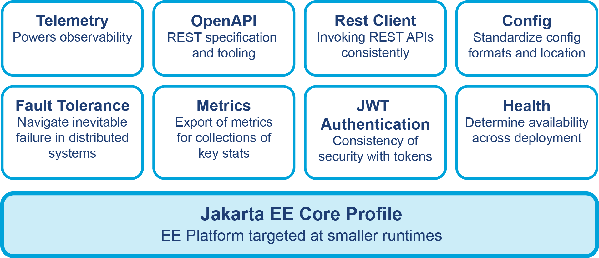
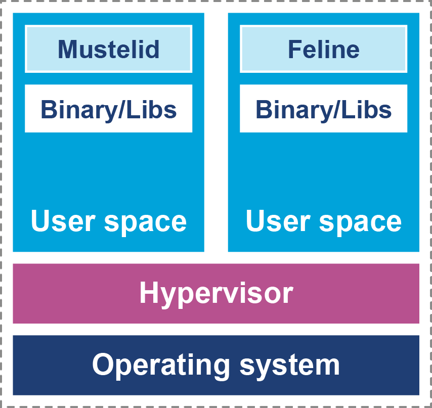
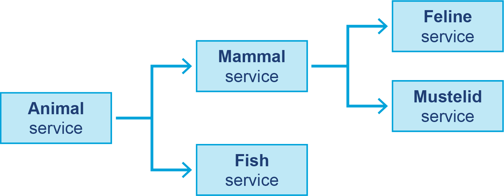

# Chương 8. Các thành phần của Cloud Stack

Việc lập luận về hiệu năng Java trên một cỗ máy đơn lẻ đã khó — có nhiều biến số phát sinh từ các hệ thống con của JVM và phần cứng nằm dưới. Trước chương này, chúng ta đã khám phá và thảo luận cách tiếp cận những thách thức đó. Chúng ta đã bàn một số khía cạnh nội tại của JVM, chẩn đoán, và các công cụ hiệu năng của hệ điều hành cùng cách chúng giúp thẩm vấn một tiến trình đang chạy. Đi xa hơn, mechanical sympathy — hiểu tương tác giữa JVM và phần cứng — cho phép chúng ta giải quyết các mối quan tâm hiệu năng cao trên một JVM đơn lẻ.

Trong chương này, chúng ta sẽ phá vỡ mô hình JVM đơn lẻ và xem xét các nền tảng hỗ trợ mô hình triển khai theo chiều ngang (horizontal) cho các tiến trình Java. Bạn sẽ thấy các nền tảng chứa tiến trình Java đã dịch chuyển đáng kể ra sao. Cụ thể, các môi trường cloud native đã thay đổi bối cảnh, và cùng với đó, cách phân loại các chủ đề mà kiến trúc sư và kỹ sư hiệu năng cần hiểu.

Đặc biệt, bên cạnh những câu hỏi then chốt được nêu ở phần "Một hệ phân loại cho hiệu năng", có những tình huống mà lập trình viên làm việc trên nền tảng cloud cũng sẽ cần cân nhắc:

- Tối ưu cho chi phí
- Tối ưu cho độ tin cậy
- Mở rộng theo chiều ngang

Nói cách khác, tối ưu cho chi phí, độ tin cậy, và khả năng mở rộng đàn hồi (quản lý hiệu năng trên nhiều instance của tiến trình Java đang chạy) sẽ là những yếu tố then chốt bổ sung cho hệ phân loại hiệu năng cổ điển.

Trong chương này, bạn sẽ học tổng quan về một số khối xây dựng cloud native then chốt và các chuẩn liên quan. Bạn cũng sẽ học về các chuẩn Java liên quan đến việc xây dựng ứng dụng cloud native. Chúng tôi sẽ trình bày phần nhập môn về ảo hóa, container và image.

Sau đó chúng ta sẽ bàn về mạng, vì có một số khác biệt lớn ảnh hưởng đến cách bạn cần cân nhắc khi thiết kế cho cloud native. Cuối cùng, chúng tôi sẽ giới thiệu repository *Fighting Animals*, mà chúng ta sẽ dùng ở các chương sau để làm quen thực tế với những khái niệm mới.

## Các chuẩn Java cho Cloud Stack

Các framework trong Java mở rộng thư viện Java lõi có trong JDK để hỗ trợ giải quyết các vấn đề thực tế. Điều này giúp lập trình viên giải quyết các vấn đề phổ biến trên các mục tiêu triển khai và nền tảng phổ biến. Các nền tảng phân tán dựa trên kiến trúc microservice đã trở nên phổ biến hơn. Điều quan trọng là không chỉ xét một framework đơn lẻ mà còn cả các chuẩn sẵn có áp dụng cho phương pháp luận triển khai phân tán.

Các chuẩn tạo ra tính di động trên một loạt sản phẩm Java cloud native bao gồm Quarkus, Helidon và Open Liberty.[^1]

Đặc biệt quan trọng là hai chuẩn mở này:

- **Jakarta EE**, mà chúng tôi đã đề cập ở Chương 6, cung cấp một loạt chuẩn Enterprise Java và được áp dụng rộng rãi, nhưng việc trình bày đầy đủ nó nằm ngoài phạm vi cuốn sách này.
- **MicroProfile** là chuẩn cho hệ phân tán trên nền tảng cloud native, và tính đến phiên bản 6.1, thực chất phân rã Jakarta EE 10 thành một tập các thành phần chuẩn hóa liên quan nhưng độc lập.

Đặc biệt, MicroProfile cung cấp một tập chuẩn trung lập với nhà cung cấp, hỗ trợ kiến trúc dựa trên microservice và best practice của hệ phân tán. Nó đặc biệt được lập trình viên và kiến trúc sư Java quan tâm bởi nó cung cấp sự chuẩn hóa cho các thư viện xây dựng ứng dụng twelve-factor. Không có chuẩn, dễ dẫn đến tình huống lập trình viên tự xây giải pháp riêng hoặc có khả năng bị khóa vào một framework cụ thể.

> **GHI CHÚ**
>
> Eclipse Foundation là nơi đặt cả working group MicroProfile lẫn Jakarta EE. Các working group này chịu trách nhiệm định nghĩa các chuẩn enterprise Java và microservice, tương ứng. Eclipse cũng lưu trữ bản build cộng đồng Adoptium của OpenJDK.

Hình 8-1 mô tả các chuẩn được bao phủ trong MicroProfile 6.1 và thể hiện những khía cạnh then chốt bạn phải xét khi xây dựng ứng dụng trong môi trường cloud native. Khi các xu hướng tiến hóa sang những mẫu hình khác nhau để xây dựng kiến trúc dựa trên microservice, Jakarta EE và MicroProfile sẽ thích ứng và có khả năng thêm các chuẩn mới.



*Hình 8-1. Cấu trúc của chuẩn MicroProfile*

Các chuẩn trong Java hữu ích, nhưng chúng ta cũng cần tìm một chiến lược để giải quyết tính trung lập với nhà cung cấp và tính di động trong các nền tảng chúng ta nhắm tới. Phần mềm mã nguồn mở có truyền thống lâu đời trong việc dùng các quỹ mở để giải quyết những khía cạnh này của bối cảnh phần mềm.

### Cloud Native Computing Foundation

Cloud Native Computing Foundation (CNCF) là một quỹ phần mềm mã nguồn mở trung lập với nhà cung cấp, chuyên tâm vào việc phổ cập hóa điện toán cloud native.

> Các công nghệ cloud native trao quyền cho các tổ chức xây dựng và chạy những ứng dụng có khả năng mở rộng trong các môi trường hiện đại, động như cloud công cộng, riêng tư và lai. Container, service mesh, microservice, immutable infrastructure và declarative API là ví dụ cho cách tiếp cận này.
>
> — Điều lệ CNCF

Vì tính trung lập với nhà cung cấp và tính di động là mối quan tâm kiến trúc đáng kể, không nên ngạc nhiên khi vài dự án CNCF cực kỳ quan trọng trong việc phân phối ứng dụng cloud native.

> **GHI CHÚ**
>
> Các nền tảng tính toán không gắn với một stack ngôn ngữ cụ thể, nên lời khuyên đưa ra trong phần còn lại của chương này sẽ mở rộng vượt phạm vi Java.

Khi xây dựng hệ thống gồm nhiều dịch vụ, có khả năng bạn sẽ cần xem lại việc một số thành phần được triển khai ở đâu và như thế nào để đáp ứng các yêu cầu phi chức năng đang tiến hóa. Đây là nơi CNCF trở nên quan trọng, lưu trữ các dự án then chốt với những lợi ích khác nhau giúp đáp ứng yêu cầu kinh doanh và phi chức năng.

Việc tìm ra dự án nào trong số rất nhiều dự án để áp dụng cho use case cụ thể của bạn là khó. *CNCF Landscape* là một bản đồ tương tác cố phân loại hầu hết các dự án và sản phẩm trong không gian cloud native. CNCF Landscape được tổ chức thành nhiều danh mục bao phủ một loạt mối quan tâm. Năm trong số các danh mục then chốt là:

- Định nghĩa và triển khai ứng dụng
- Orchestration và quản lý
- Runtime
- Provisioning
- Observability và phân tích

Trong mỗi danh mục này của CNCF Landscape, bạn sẽ thấy các dự án CNCF riêng lẻ, thống kê của dự án, và quyền sở hữu của mỗi dự án thuộc về ai.

Lưu ý rằng các định dạng và chuẩn cho bản thân container image không thuộc CNCF và được duy trì bởi một sáng kiến chuẩn hóa riêng, Open Container Initiative (OCI). Mặc dù trung lập với nhà cung cấp, các dự án trên CNCF Landscape bao gồm cả những dự án "vì lợi nhuận". Các dự án mã nguồn mở CNCF có các mức độ trưởng thành khác nhau, giúp lập trình viên và kiến trúc sư cân nhắc nhiều công nghệ khác nhau trong các triển khai cloud native của họ:

**Sandbox**
: Các dự án đổi mới sớm đang ở giai đoạn phát triển ban đầu và có thể chưa đạt chuẩn production.

**Incubating**
: Dự án đã sẵn sàng cho production và đã được chứng minh bằng việc áp dụng tích cực. Dự án có quản trị và bảo trì, cộng đồng, nguyên tắc kỹ thuật, bảo mật và hệ sinh thái đầy đủ. Nó nên đáp ứng các tiêu chí của incubating template.

**Graduated**
: Dự án có thành tích được chứng minh về việc sử dụng trong production ở nhiều ngành và dự án. Nó nên đáp ứng các tiêu chí của graduation template.

> **GHI CHÚ**
>
> Các kiến trúc sư thường xuyên dùng CNCF landscape. Nó được dùng như một cơ chế để xác định công nghệ trong một lĩnh vực vấn đề cụ thể, khám phá ưu điểm của dự án, và để tập trung các proof of concept và spike chức năng.

Ba dự án CNCF cực kỳ quan trọng với lập trình viên và kỹ sư hiệu năng Java cloud native.

#### Kubernetes

Kubernetes (thường viết tắt là K8s) là một hệ thống container-orchestration mã nguồn mở. Nó dùng một cluster các node tính toán (host) để cho phép người vận hành hệ thống và đội DevOps triển khai, mở rộng và điều phối các ứng dụng phân tán trên cluster. Kubernetes trở thành dự án graduated trong CNCF năm 2018.

Ở Chương 9, bạn sẽ học về triển khai ứng dụng Java bằng container và Kubernetes.

#### Prometheus

Prometheus là một định dạng metric và cơ sở dữ liệu chuỗi thời gian (time series) được dùng để lưu dữ liệu metric. Nó được chấp nhận vào CNCF tháng 5/2016 như một dự án incubating và đạt trạng thái graduated tháng 8/2018.

Nó được triển khai rộng rãi trong các ứng dụng Kubernetes và đã hưởng lợi từ lợi thế người đi đầu đáng kể, mặc dù bối cảnh metric đang tiến hóa nhanh chóng. Bạn sẽ học thêm về Prometheus ở Chương 10 và 11.

#### OpenTelemetry

OpenTelemetry (OTel) là một tập các chuẩn, định dạng và thư viện xử lý việc thu thập, tổng hợp và vận chuyển dữ liệu observability từ ứng dụng vào một hệ thống observability.

OTel là một dự án CNCF, và việc phát triển kỹ thuật của dự án diễn ra trên GitHub.

OTel một cách tường minh là công nghệ đa nền tảng và không đặc thù Java, mặc dù Java là một triển khai trưởng thành của các chuẩn. Điều này có nghĩa có rất nhiều dự án khác nhau được viết bằng (và cho) nhiều ngôn ngữ lập trình.

OTel hiện là dự án incubating tại CNCF, nhưng nó đang chứng kiến sự tăng trưởng bùng nổ và đã được nhiều tổ chức dùng trong production. Chúng ta sẽ quay lại OTel một cách chuyên sâu ở Chương 11.

Nằm dưới các công nghệ nêu trên là mô hình về cách mọi thứ được triển khai, vậy hãy xem tầm quan trọng của ảo hóa trong cloud native stack.

## Ảo hóa (Virtualization)

Trước khi có thể bàn về chủ đề ảo hóa, trước hết chúng ta cần giải quyết câu hỏi rộng hơn — cloud là gì? Bạn sẽ thường nghe câu đùa "Cloud chỉ là máy tính của người khác", nhưng còn nhiều hơn thế. Đoạn sau giúp cung cấp một định nghĩa làm việc:

> Định nghĩa đơn giản nhất về cloud là một trung tâm dữ liệu chứa đầy phần cứng giống hệt nhau mà không ai từng chạm vào trừ khi bóc hộp ngày đầu tiên và vứt đi khi nó hỏng; ở giữa, mọi quá trình triển khai, cập nhật, điều tra và quản lý đều được tự động hóa.
>
> — Mary Branscombe

Khi hạ tầng của bạn ở trên cloud, năng lực của bạn được hàng hóa hóa và sẵn sàng chạy, sẵn có cho một loạt use case ứng dụng đa dạng. Truy cập thường không được cung cấp trực tiếp đến hạ tầng và phần cứng. Thay vào đó, cần có sự kiểm soát, quản lý và tách biệt rõ ràng giữa runtime của khách hàng với cả hạ tầng lẫn có khả năng cả các khách hàng khác.

Với lập trình viên và kỹ sư hiệu năng Java, đây là đánh đổi đầu tiên liên quan đến việc chuyển sang cloud.

Truy cập vào hệ điều hành và phần cứng nằm dưới chỉ có được với chi phí đáng kể; thường bạn sẽ chỉ có cái nhìn hạn chế vào nền tảng vật lý, nếu có. Có lẽ đáng ngạc nhiên, các kỹ thuật ảo hóa ban đầu được phát triển trong môi trường mainframe của IBM từ tận những năm 1970. Tuy nhiên, phải đến gần đây các kiến trúc x86 mới có khả năng hỗ trợ ảo hóa "thực sự".

> **MẸO**
>
> Các kỹ thuật sysadmin truyền thống kiểu "SSH vào một máy và nhìn quanh" thường không có sẵn trong môi trường cloud — thay vào đó, các kỹ thuật quản lý từ xa hơn nhiều đã trở thành cách tiếp cận chuẩn.

Ảo hóa thường được định nghĩa bởi ba điều kiện sau:

- Các chương trình chạy trên OS được ảo hóa nên hành xử về cơ bản giống như khi chạy trên bare metal.[^2]
- Một thành phần, gọi là *hypervisor*, phải trung gian hóa mọi truy cập đến tài nguyên phần cứng.
- Chi phí phụ trội của việc ảo hóa phải nhỏ nhất có thể và không chiếm phần đáng kể trong thời gian thực thi.

Trong một hệ thống truyền thống không ảo hóa, nhân OS chạy ở một chế độ đặc quyền đặc biệt (do đó cần chuyển sang chế độ kernel). Điều này cho OS truy cập trực tiếp vào phần cứng — đây là tình huống khi làm việc cục bộ trên laptop lập trình của bạn, chẳng hạn.

Tuy nhiên, trong một hệ thống ảo hóa, việc guest OS truy cập trực tiếp vào phần cứng bị cấm. Hình 8-2 phác thảo cấu trúc, với hệ điều hành host của hạ tầng cloud được hàng hóa hóa tạo thành tầng cơ sở của hạ tầng. Các thành phần Feline và Mustelid là các microservice REST điển hình mà chúng tôi sẽ giới thiệu sau trong chương.

Tầng tiếp theo là hypervisor, đóng vai trò một tầng gián tiếp giữa hệ điều hành và guest operating system. Là lập trình viên, bạn có thể triển khai tự do lên guest operating system, có khả năng dùng container — chúng ta sẽ thảo luận lựa chọn này ngay sau đây.



*Hình 8-2. Stack ảo hóa*

Hypervisor là cốt lõi của ảo hóa, và dễ dàng nhìn vào nó mà nhớ đến những câu chuyện về các môi trường ảo hóa chậm chạp. Việc sử dụng rộng rãi máy ảo và hypervisor trên cloud đã thúc đẩy nghiên cứu và cải tiến đáng kể cho chi phí phụ trội của hypervisor.

Khi chuyển sang public cloud, nền tảng đích của bạn thường sẽ là một máy ảo đóng gói cùng hypervisor. Điều này sẽ có tác động tổng thể lên hiệu năng mà, ít nhất một phần, nằm ngoài tầm kiểm soát của bạn — mặc dù các nhà cung cấp public cloud có cung cấp các lựa chọn khác nhau cho những máy ảo sẵn có với bạn. Chọn đúng máy ảo sẽ trở thành một yếu tố với một số loại workload chạy trên public cloud.

Hãy khám phá một số máy ảo do nhà cung cấp cloud cung cấp và bạn có những quyết định gì với vai trò kiến trúc sư và lập trình viên.

### Chọn đúng máy ảo

Các nhà cung cấp public cloud cung cấp nhiều loại máy ảo khác nhau được thiết kế phù hợp với các loại profile workload khác nhau.

Amazon EC2 có rất nhiều lựa chọn khả dĩ cho cấu hình VM tùy vào use case của bạn. AWS cũng cung cấp server bare metal bên cạnh máy ảo; sau đây là một số lựa chọn EC2 sẵn có để chạy workload:

**General purpose (đa dụng)**
: Điểm khởi đầu cho ứng dụng; tuy nhiên, trong nhóm đa dụng có một dải rộng các lựa chọn tính toán. Ví dụ, trong dòng M7g, bạn có thể chọn từ VM cỡ medium với một vCPU và 4 GB bộ nhớ đến `m7gd.metal`, một máy bare metal với 64 CPU và 256 GB bộ nhớ.

**Compute optimized (tối ưu tính toán)**
: Cung cấp hỗ trợ cho các workload có tải CPU cao.

**Memory optimized (tối ưu bộ nhớ)**
: Thiết lập cho các workload với tập dữ liệu lớn có profile đọc/ghi in-memory đáng kể. Danh mục này bao gồm cơ sở dữ liệu, caching in-memory và phân tích dữ liệu.

**Accelerated computing (tính toán tăng tốc)**
: Dùng tăng tốc phần cứng và hướng đến đồ họa, tính toán nặng và các ứng dụng AI sinh tạo.

**Storage optimized (tối ưu lưu trữ)**
: Được thiết kế cho các thao tác đọc/ghi trên lưu trữ cục bộ. Loại instance này tập trung vào cơ sở dữ liệu giao dịch và các workload kiểu Apache Spark.

**High-performance computing (tính toán hiệu năng cao)**
: Workload tập trung vào các mô phỏng phức tạp và workload kiểu deep learning.

Azure cung cấp một loạt lựa chọn, từ dòng D dùng cho tính toán đa dụng đến dòng L dùng cho máy ảo tối ưu lưu trữ.

Google Cloud có tập tương tự, bao gồm các workload tập trung vào đa dụng, bộ nhớ siêu lớn, tính toán nặng, và các workload ứng dụng đòi hỏi cần GPU.

Là một phần của việc thiết kế ứng dụng trên cloud, nhìn chung cách tiếp cận tốt nhất là bắt đầu với VM đa dụng và xây dựng từ đó. Các loại instance thường được định cỡ theo lũy thừa của 2, nên chuyển sang VM lớn hơn là một đánh đổi chi phí trong tình huống bạn chỉ cần thêm 5% CPU. Các họ instance cung cấp tỷ lệ CPU/bộ nhớ/throughput mạng/lưu trữ (nếu có) nhất quán trên các kích thước instance trong họ đó. Đây có thể là điểm khởi đầu hữu ích để chọn loại instance.

Nhớ các bài học từ phần trước của cuốn sách — hãy đi từng bước nhỏ và đo xem việc điều chỉnh VM có mang lại loại lợi ích hiệu năng so với đánh đổi chi phí mà bạn đang tìm kiếm hay không.

Ở Chương 9, bạn sẽ khám phá cách kết hợp và phối hợp thêm các VM trong triển khai ứng dụng của mình, vì một phần thách thức sẽ quy về việc lập lịch và triển khai các ứng dụng trên nền cloud. Các nền tảng orchestration như Kubernetes cung cấp khả năng kết hợp và phối hợp VM, nên bạn có khả năng chạy một pool node chuyên biệt trong khi các node khác tập trung vào use case đa dụng.

### Cân nhắc về ảo hóa

Khi thiết kế ứng dụng cloud, hãy tối ưu cho chi phí, độ tin cậy và khả năng mở rộng bằng cách chọn đúng VM cho use case của bạn. Ví dụ, trong tình huống bạn đang (hoặc dự kiến sẽ) nặng về CPU, tác động này nên được đo và xác nhận như một phần của bài test hiệu năng tiến hành trong môi trường giống production.

> **GHI CHÚ**
>
> Một lợi ích bổ sung của việc chạy trên cloud là việc tạo các môi trường tạm thời (ephemeral) để kiểm thử trở nên đơn giản hơn. Chúng ta sẽ quay lại khái niệm này ở Chương 9.

Một lựa chọn khác là chạy nền tảng "tốt nhất của cả hai thế giới". Trong mô hình này, một số tiến trình chạy trên public cloud và một số tiến trình chạy trên bare metal. Điều này mang lại khả năng tối ưu một số workload cần quy mô bùng nổ và độ tin cậy, nhưng cũng cho phép quan tâm đến hiệu năng và mechanical sympathy trên phần xử lý cốt lõi.

Chúng ta sẽ khám phá điều này thêm ở phần "Container Orchestration", khi xem xét các hệ thống orchestration và việc bố trí tiến trình, nhưng công nghệ OpenShift ("hybrid cloud") của Red Hat là một ví dụ tốt cho cách tiếp cận này.

Giờ khi bạn đã hiểu về VM, hãy xem xét kỹ hơn các khối xây dựng cho triển khai cloud native: image và container.

## Image và Container

Khi Java xuất hiện vào cuối những năm 90, nó hứa hẹn một tương lai tuyệt vời về tính di động với câu thần chú "Write once, run everywhere" (Viết một lần, chạy mọi nơi), nghĩa là bất kỳ hệ điều hành và cỗ máy nào có khả năng chạy một Java virtual machine đều có thể chạy mã của bạn. Đây là tham vọng cực kỳ táo bạo, và lớp trừu tượng không phải lúc nào cũng hoàn hảo, đặc biệt trong những ngày đầu.

Tuy nhiên, cũng như rất nhiều khía cạnh khác của phần mềm hiện đại, Java đóng vai trò ống dẫn để những ý tưởng tiên tiến thực sự bước vào dòng chính.

> Những ý tưởng lớn như máy ảo, tự quản lý động, biên dịch JIT và garbage collection giờ đây là một phần của bối cảnh chung của các ngôn ngữ lập trình.
>
> — Benjamin J. Evans, "Java is a '90s Kid" trong *97 Things Every Java Programmer Should Know*

Bối cảnh công nghệ tiếp tục dịch chuyển, và đã có sự bùng nổ về ngôn ngữ lập trình và nền tảng nhắm vào big data, trí tuệ nhân tạo, định tuyến cloud native, và các sản phẩm ở mức mạng. Để hỗ trợ mảng công nghệ phức tạp này, ngành công nghiệp đã phải phản ứng với việc triển khai phần mềm trên nhiều hệ điều hành, môi trường khác nhau, và với một tập phụ thuộc đa dạng hơn.

Tính di động là mục tiêu thiết kế của ứng dụng cloud native, mặc dù nó xuất hiện không phải ở tính di động của bytecode Java mà ở mức cao hơn một chút — *container image*. Một container image (hay đơn giản là image) là một file lưu trữ (archive) có thể dùng để tạo ra một tiến trình ứng dụng (hoặc một nhóm chúng) chạy dưới sự kiểm soát của một hệ thống orchestration hoặc quản lý container.

Hãy đi sâu hơn vào cấu trúc image.

### Cấu trúc Image

Cũng như trong các môi trường Unix truyền thống, file thực thi trên đĩa là biểu diễn "đông lạnh" của chương trình. Lúc khởi động, nó được chuyển thành một tiến trình ứng dụng đang hoạt động bằng cách thực thi chương trình. Image có thể được xem như biểu diễn đông lạnh (và di động) của thành phần ứng dụng, sẽ được chuyển thành một thành phần đang hoạt động thông qua việc lập lịch và orchestration.

Với sự đa dạng và phức tạp lớn hơn của các thành phần, việc chuẩn hóa một lần nữa là vũ khí được ngành công nghiệp lựa chọn để quản lý và kiểm soát các application stack của họ. Một ví dụ tốt là Open Container Image (OCI) được Docker thành lập năm 2015.

Image đang trở thành đơn vị đóng gói ứng dụng được ngành ưa chuộng, bao gồm cả ứng dụng Java, ngay cả khi nền tảng đích là bare metal. Image được đóng gói cùng mọi thứ cần thiết để chạy ứng dụng, bao gồm các thành phần userspace (chẳng hạn một tập con các thành phần hệ điều hành) và JVM.

Theo đó, OCI chịu trách nhiệm định nghĩa định dạng của image, cách image chạy thành container, và cách image được phân phối.

Hãy khám phá một số khía cạnh thú vị của việc build và chạy container — và một số vấn đề tiềm ẩn cần lưu ý.

### Xây dựng Image

Một cách để tạo image như một phần của quy trình build phần mềm là định nghĩa các chỉ thị image trong một *Dockerfile*. Mỗi dòng trong Dockerfile đại diện cho một *layer* (tầng) mới. Một layer là một thay đổi bất biến đối với hệ thống file, sẽ được biểu diễn trong container và được lưu trong build cache. Mỗi layer hiện có trong build cache có thể được tái sử dụng như khối xây dựng cho image mới.

> **GHI CHÚ**
>
> Docker thường bị nhầm lẫn giữa việc dùng như một công nghệ và như một thực thể thương mại kiêm nhà cung cấp registry. Trong chương này, chúng tôi dùng Docker để chỉ định dạng chuẩn trên thực tế được hỗ trợ trong mã nguồn mở và bởi các công cụ tuyệt vời.

Trong ví dụ sau, chúng ta thấy từ khóa `FROM`, về cơ bản dùng một layer image khác làm cơ sở để thêm vào ứng dụng Java `animals-demo-1.0-SNAPSHOT.jar` của chúng ta.

Các lệnh `USER`, `RUN`, `COPY` và `WORKDIR` thiết lập thư mục app và di chuyển jar đã build vào thư mục `/app`, sẵn sàng được thực thi bởi lệnh entry point của container `CMD`:

```dockerfile
FROM registry.access.redhat.com/ubi8/openjdk-17:1.13-1
USER root
RUN mkdir /app
COPY target/animals-demo-1.0-SNAPSHOT.jar /app
WORKDIR /app
CMD ["java", "-jar" , "animals-demo-1.0-SNAPSHOT.jar", \
     "io.opentelemetry.examples.animal.AnimalApplication"]
```

Các công cụ khác đã được phát triển như lựa chọn thay thế cho cách tiếp cận Dockerfile, với nhiều thông tin sẵn có hơn để đưa ra các quyết định tối ưu về build và layer.

**Jib** chạy như một phần của hệ thống build Java (ví dụ Maven) để tạo image và do đó có lợi thế là có nhiều thông tin hơn về cấu trúc ứng dụng Java và các phụ thuộc của bạn. Nó tổ chức image thành các layer riêng biệt, bao gồm phụ thuộc, tài nguyên và class. Jib chỉ sửa đổi các layer đã thay đổi. Lý thuyết là các phụ thuộc thư viện Java và tài nguyên trong dự án thay đổi ít thường xuyên hơn so với các class trong mã ứng dụng của bạn. Bằng cách tách layer theo cách này, các layer bất biến không phải chịu nhiều biến động, giảm thời gian build và khởi động trong quá trình phát triển.

Dùng Jib có thêm lợi ích giữ mọi phụ thuộc luôn mới với mỗi lần build ứng dụng, cho cả thư viện ở mức Java lẫn các layer image thấp hơn. Cách tiếp cận Dockerfile cũng hoạt động, nhưng cần đảm bảo rằng các base image được cập nhật khi các bản vá và phiên bản mới hơn được phát hành. Jib có lợi ích tiềm năng cho việc vá bảo mật và hiệu năng bằng cách giúp giữ phụ thuộc luôn mới.

Cũng có thể chạy build nhiều giai đoạn (multistage build) trong Docker bằng cách dùng nó vừa để build jar rồi dùng jar đó ở giai đoạn thứ hai để dựng image. Các layer dùng trong giai đoạn build đầu tiên bị loại bỏ, và chỉ jar đích được sao chép sang image cuối. Lợi thế của điều này là đảm bảo một môi trường build chuẩn hóa bằng cách container hóa và đơn giản hóa quy trình build. Ví dụ Dockerfile sau minh họa cách tiếp cận nhiều giai đoạn này.

Phần đầu của Dockerfile thiết lập base image với Maven và OpenJDK 17 để thực thi việc build, tạo ra một `jar`. Phần `AS builder` định danh giai đoạn này trong các giai đoạn build tiếp theo. Phần thứ hai của Dockerfile build image đích và bao gồm `jar` bằng câu lệnh `--from=builder`.

```dockerfile
# Giai đoạn đầu tiên đóng vai trò builder, dùng base image maven để tạo jar
FROM maven:3.9-openjdk-17 AS builder
COPY src /usr/src/app/src
COPY pom.xml /usr/src/app
RUN mvn -f /usr/src/app/pom.xml package

FROM registry.access.redhat.com/ubi8/openjdk-17:1.13-1
USER root
RUN mkdir /app
# Sao chép jar được tạo bởi giai đoạn đầu tiên
COPY --from=builder /usr/src/app/target/animals-demo-1.0-SNAPSHOT.jar /app
WORKDIR /app
CMD ["java", "-jar" , "animals-demo-1.0-SNAPSHOT.jar"]
```

Một image stack điển hình cho ứng dụng Java bao gồm các phụ thuộc OS, JVM và cấu hình, và một `jar`. Một base image tối thiểu là Universal Base Image (UBI) Minimal từ Red Hat, chỉ 37,1 MB ở dạng nén. Xếp thêm OpenJDK trên kiến trúc AMD64 cho ra base image 147,8 MB ở dạng nén. Layer cuối cùng phụ thuộc vào kích thước build của ứng dụng bạn. Các image có thể trở nên khá lớn; ví dụ, một image Eclipse Temurin cho Windows AMD64 là 2,27 GB.

Ở phần "Thách thức với Container và việc lập lịch", chúng ta sẽ xét xem kích thước image có khả năng tác động đến việc lập lịch ra sao.

### Chạy Container

Container cung cấp cơ chế để chạy ứng dụng trong môi trường cô lập. Chúng được điều khiển bằng hai cấu trúc của nhân Linux: *namespace* và *cgroup*. Namespace kiểm soát truy cập và tầm nhìn tới tài nguyên trên máy host, còn cgroup thực thi các giới hạn với tài nguyên máy — đặc biệt là mức sử dụng CPU và bộ nhớ.

Một mục tiêu của lớp trừu tượng container là cung cấp sự cô lập tiến trình giữa các container khác nhau. Điều này phần nào tương tự máy ảo — khác biệt khái niệm chính là container không dùng hypervisor như VM. Thay vào đó, các ứng dụng trong container thực thi trực tiếp trên hệ điều hành host và truy cập nhân của host mà không cần lớp gián tiếp bổ sung của hypervisor.

Điều này khiến container nhẹ và khởi động nhanh trên tính toán, tạo nền tảng cho các hệ thống orchestration mà chúng ta sẽ thảo luận ở Chương 9.

Giờ hãy xem tầm quan trọng của mạng khi chạy container.

## Mạng (Networking)

Container và hệ thống orchestration dùng tính toán tạm thời (ephemeral), nên lập trình viên nên kỳ vọng các workload sẽ không nằm cố định ở cùng một "chỗ" (tức host vật lý hay ảo). Tính toán tạm thời có lợi thế tối ưu chi phí, vì nó cho phép mở rộng lên và thu nhỏ động.

Việc mở rộng lên/xuống có thể nằm trong một quy mô cho trước, hoặc có lẽ động bổ sung vào quy mô khi cần (ví dụ, thêm node vào cluster). Điều này có thể tận dụng *spot computing*, khả năng dùng tài nguyên nhà máy chưa sử dụng với chi phí giảm. Spot instance không được đặt trước hay đảm bảo; khi nhu cầu về những tài nguyên đó xuất hiện, các spot instance sẽ bị chấm dứt mà không báo trước.

Từ góc độ mạng, mọi thứ sẽ không ổn định như các trung tâm dữ liệu on-premises cố định, và các thành phần sẽ không phải lúc nào cũng có địa chỉ IP chuyên dụng hay tính toán liên tục sẵn có. Kết quả là, khi nghĩ về mạng và giao tiếp ứng dụng, thường tốt nhất là nghĩ về lớp trừu tượng của *lưu lượng* (traffic). Lưu lượng có thể được tổng quát hóa thành hai danh mục: bắc → nam và đông → tây.

**Bắc → nam** là lưu lượng không thuộc hệ thống của bạn và sẽ bắt nguồn từ nơi nào khác trên cloud hoặc có lẽ từ internet. Lưu lượng bắc → nam cần có địa chỉ IP cố định và thường được gọi là *ingress*. Chúng tôi sẽ trình bày chi tiết hơn ở phần "Kết nối đến các Service trên Cluster".

Một lựa chọn cho ingress là dùng một load balancer khả dụng cao, và nhiều nền tảng orchestration sử dụng load balancer do nhà cung cấp cloud cung cấp. Các ứng dụng riêng lẻ khi đó sẽ thiết lập định tuyến tương ứng vào cluster. Điều này cho phép một địa chỉ IP cố định cho các lời gọi bên ngoài nhưng vẫn cung cấp khả năng mở rộng lên và thêm workload phía sau hậu trường để đáp ứng quy mô.

**Đông → tây** thường chỉ các lời gọi service-to-service trong tầng orchestration, và ở đây bạn có thể dùng service discovery nội bộ do nền tảng orchestration cung cấp để mở rộng lên và xuống. Trong một hệ thống orchestration như Kubernetes, chúng ta có thể dùng một *service* để tạo một mục DNS nhẹ và cục bộ, sẵn có cho các service khác trong cluster. Chúng ta sẽ quay lại điều này ở phần "Services" khi đi sâu hơn vào chủ đề này.

Để kết thúc chương này, hãy giới thiệu một hệ thống ví dụ hoàn chỉnh như một cách minh họa các khái niệm về ứng dụng cloud native, rồi sau đó là build và triển khai, và tiếp theo là observability.

## Giới thiệu ví dụ Fighting Animals

Trong cuốn sách này, chúng tôi đã cố đảm bảo cung cấp các ví dụ hoàn chỉnh và hoạt động được, vượt ra ngoài "Hello World" nhưng vẫn đủ đơn giản để hiểu và dùng làm điểm khởi đầu cho các hệ thống thực. Điều này vì vài lý do, nhưng một trong những lý do quan trọng nhất là người mới đến với cloud stack thường thấy khó tiến xa hơn những dự án mẫu ban đầu, thường là bán tầm thường.

Khi observability được xếp chồng lên ví dụ, tình hình trở nên phức tạp hơn, vì các ví dụ quá đơn giản không phải lúc nào cũng dễ dàng tổng quát hóa thành một triển khai thực tế có thể làm nền tảng cho một hệ thống observability production thực sự.

Cũng có một mức độ phức tạp không thể giảm bớt liên quan đến việc triển khai một hệ thống observability, và điều này có thể khó thiết lập, vì có quá nhiều biến số và lựa chọn có thể áp dụng hoặc không cho một hệ thống được quan sát cụ thể.

Do đó, chúng tôi đã quyết định giới thiệu ứng dụng ví dụ "Fighting Animals" ở đây trước. Sau đó, ở Chương 10 và 11, bạn sẽ khám phá các cân nhắc về observability chi tiết hơn.

Fighting Animals là một ứng dụng Java đơn giản với kiến trúc microservice, có trên GitHub. Phiên bản chính được viết như một ứng dụng Spring Boot, nhưng có một phiên bản thay thế dựa trên Quarkus. Tuy nhiên, trong phần thân sách chúng tôi sẽ bám vào phiên bản Spring Boot.

Ứng dụng được chạy như một tập hợp các container Docker (ví dụ, qua Docker Compose) và phơi bày một REST endpoint trên cổng 8080. Gọi endpoint trả về một biểu diễn JSON đơn giản của hai con vật từ vài nhánh sinh học khác nhau sẽ chiến đấu với nhau.[^3]

Gọi `GET /battle` để nhận một trận đấu trông như thế này:

```json
{
    "good": <animal1>,
    "evil": <animal1>
}
```

Có vài nhánh (branch) mà chúng ta sẽ khám phá thêm (chủ yếu ở các chương sắp tới):

**main**
: Không có observability

**micrometer_only**
: Chỉ có Micrometer metrics

**micrometer_with_prom**
: Micrometer metrics với Prometheus

**manual_tracing**
: OpenTelemetry tracing dùng span thủ công

**auto_otel**
: Dùng OpenTelemetry Java agent để trace tự động

**k8s-with-argo**
: Ví dụ dùng Kubernetes và triển khai thay đổi bằng deployment strategy

**logging_only**
: Logging SLF4J được export sang OpenTelemetry

**micrometer_with_otel**
: Micrometer với OpenTelemetry metrics

**otel_metrics_raw_api**
: OpenTelemetry metrics dùng raw API

**distributed_systems**
: Nâng cấp Fighting Animals với Kafka

**with_infinispan**
: Nâng cấp Fighting Animals với Kafka và Infinispan

Trong Hình 8-3, chúng ta thấy cấu trúc đơn giản và các lời gọi API của hệ thống Fighting Animals.



*Hình 8-3. Các microservice của Fighting Animals*

Lời gọi ban đầu dẫn đến các lời gọi downstream tiếp theo đến các microservice khác để hoàn tất request đến.

> **ĐÔI LỜI VỀ SỐ PHIÊN BẢN**
>
> Trong mọi ví dụ Fighting Animals, chúng tôi dùng các phiên bản được ghim (pinned) cho phụ thuộc và container. Điều này để đảm bảo các ví dụ có thể tái tạo và không thay đổi theo thời gian. Trong một hệ thống dùng phiên bản trôi nổi (như `latest`), các phiên bản sẽ thay đổi theo thời gian. Điều này có thể khiến rất khó hiểu cái gì đã thay đổi và tại sao — và vấn đề này chỉ tệ hơn khi hệ thống trở nên phức tạp hơn. Chúng tôi có dùng `latest` cho các container ứng dụng của chính mình, nhưng đó là vì chúng nằm dưới sự kiểm soát của chúng tôi và chúng tôi có thể đảm bảo chúng luôn được cập nhật.

## Tóm tắt

Trong chương này, bạn đã học về cách các nền tảng và thành phần cloud thách thức mô hình truyền thống của chúng ta về tối ưu hóa và hiệu năng.

MicroProfile là một chuẩn xuất sắc để xây dựng ứng dụng vừa cloud native vừa sẵn sàng cho kiến trúc microservice. Vượt ra ngoài việc xét các chuẩn Java một cách tách biệt, CNCF cung cấp hướng dẫn cho các cân nhắc về nền tảng và những dự án nên được xét đến cho một cách tiếp cận kiến trúc cloud native.

Ảo hóa là khía cạnh quan trọng của cloud native stack và là khối xây dựng chính cho tính toán. Mặc dù có những chi tiết mức thấp trong ảo hóa, lợi ích lớn hơn đến từ việc tìm cấu hình VM đúng cho nhiệm vụ. Có thể kết hợp bare metal và ảo hóa trong một triển khai dạng cluster.

Image và container là đơn vị triển khai trên thực tế trong môi trường cloud native. Có những cách tiếp cận khác nhau để tạo và xếp layer cho image Java cùng một số cạm bẫy phổ biến cần cân nhắc. Mạng là khía cạnh quan trọng của cloud native stack, và cùng với đó là các mối quan tâm về service discovery và định tuyến lưu lượng. Chúng tôi đã giới thiệu dự án Fighting Animals, mà chúng ta sẽ dùng xuyên suốt các chương sắp tới để mô tả những phức tạp hơn trong cloud stack.

Ở chương tiếp theo, chúng ta sẽ xem xét việc chạy các tiến trình Java cloud native chi tiết hơn. Chúng ta sẽ bắt đầu bằng việc chạy container cục bộ rồi đến cách lập lịch và triển khai trên hạ tầng cloud native.

---

[^1]: Một số framework phổ biến, như Spring, trong lịch sử đã không tham gia vào các nỗ lực chuẩn hóa.

[^2]: Chúng tôi dùng "bare metal" để chỉ việc chạy phần mềm trực tiếp trên một host với một hệ điều hành duy nhất và không có ảo hóa.

[^3]: Ứng dụng khởi đầu là một ứng dụng "battle" dùng các nhân vật từ một gã khổng lồ giải trí nổi tiếng. Điều này phải được thay đổi cho cuốn sách vì những lý do bản quyền khá rõ ràng.
