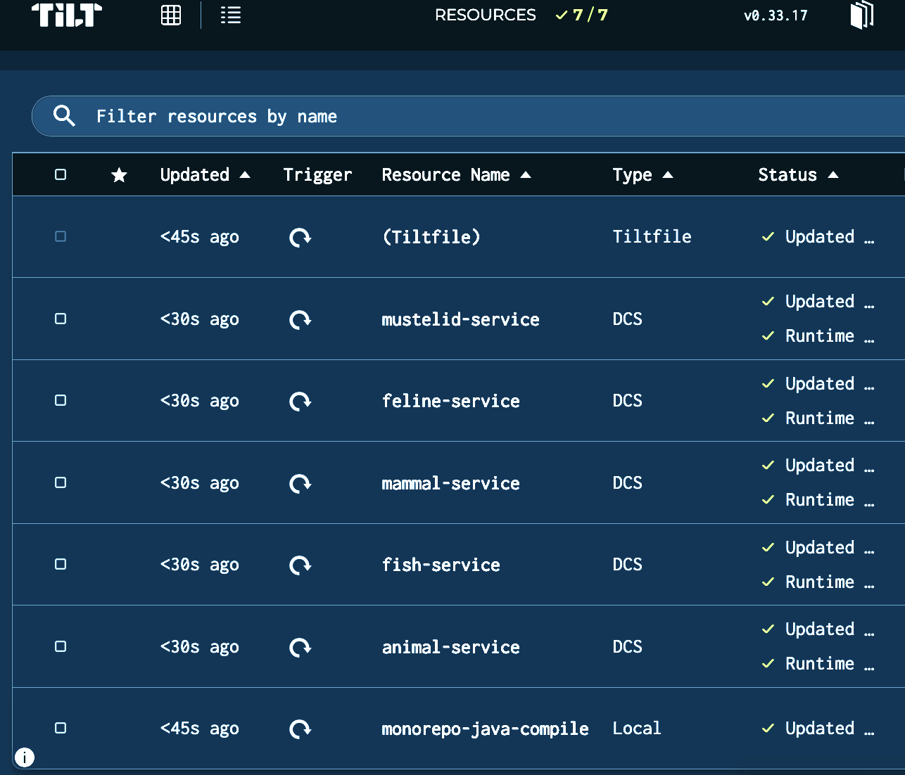
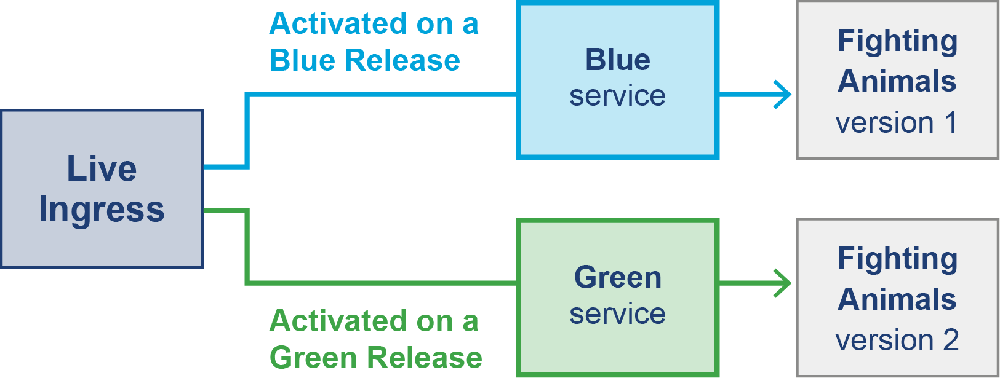
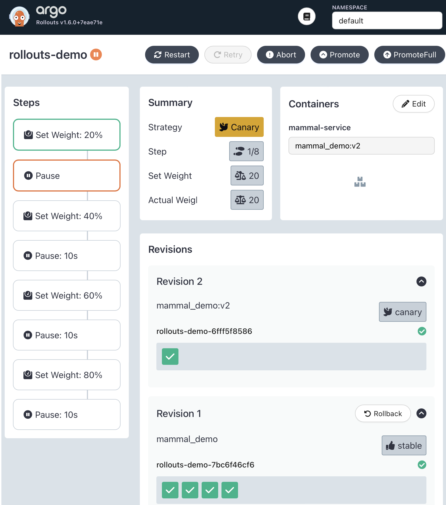

# Chương 9. Triển khai Java trên Cloud

Ở Chương 8, chúng ta đã trình bày các khía cạnh nền tảng của cloud stack. Trong chương này, chúng ta sẽ đưa chủ đề này đi xa hơn và xem xét các khía cạnh thực tiễn của việc triển khai tiến trình Java trên nền tảng cloud native.

Chúng ta sẽ bắt đầu bằng việc làm việc cục bộ với container và hiểu một số điều cơ bản về cách các container tương tác khi được triển khai. Tương tác và chi tiết về cách mọi thứ được triển khai sẽ dẫn đến việc xem xét container orchestration hoạt động ra sao và bạn cần lưu ý những gì.

Một khía cạnh cực kỳ hữu ích của nền tảng cloud native là quyền truy cập vào tính toán tạm thời và khả năng mở rộng — nhưng điều này cần được điều phối để hữu ích. Với những điều cơ bản này, bạn sẽ học về các lựa chọn cho mẫu hình release và deployment. Kỹ thuật triển khai cực kỳ hữu ích khi triển khai thay đổi cho các tiến trình dựa trên JVM một cách nhanh chóng, đồng thời vẫn giảm thiểu rủi ro về bug.

Nếu bạn là lập trình viên, bạn có thể tự hỏi liệu triển khai có thực sự là khía cạnh quan trọng để bạn cân nhắc hay không. Trong lịch sử, bạn có thể đã xây phần mềm và bàn giao cho đội vận hành để chạy. Tuy nhiên, một trong những thay đổi lớn với phát triển cloud native là ranh giới đã mờ đi giữa vận hành và phát triển, do đó có thuật ngữ "DevOps".

Ví dụ, việc tạo các môi trường nhất quán cho hệ thống production và phi production đơn giản hơn nhiều. Kết quả là, nhiều đội chọn hoạt động như các đội "build and run", tìm sự cân bằng giữa việc xây dựng và hỗ trợ dịch vụ. Việc xây dựng và vận hành như một đội duy nhất có thể dẫn đến hiệu quả (hay "velocity") được cải thiện. Lợi ích về hiệu quả phát sinh từ việc ít hiểu lầm và bực bội hoặc lỗi hơn trong quá trình bàn giao từ dev sang ops. Các đội build and run phát triển chuyên môn sâu và cảm giác trách nhiệm với toàn bộ stack. Làm việc trong đội build and run dẫn đến một đội gắn kết với sự hài lòng công việc tăng lên.

Hãy bắt đầu bằng cách xem bạn có thể làm việc với container cục bộ ra sao.

## Làm việc cục bộ với Container

Ở phần "Image và Container", chúng ta đã trình bày phần nhập môn về những điều cơ bản của image và container. Một lợi ích của container là tạo ra môi trường mang tính đại diện hơn tại thời điểm triển khai trên máy cục bộ của bạn. Container loại bỏ mọi phiền toái liên quan đến việc san bằng khác biệt giữa hệ điều hành trên máy của lập trình viên và máy runtime.

Chạy các lệnh sau sẽ build và khởi chạy `mammal_demo` từ demo Fighting Animals. Tuy nhiên, chạy lệnh `curl` sẽ không thực sự hoạt động do các phụ thuộc — tức là, các dịch vụ khác chưa sẵn có:

```bash
git clone https://github.com/kittylyst/fighting-animals.git .
git checkout main

mvn clean package
docker build -t mammal_demo -f src/main/docker/mammal/Dockerfile .
docker run -p 8081:8081 -t mammal_demo
curl localhost:8081/getAnimal
 {"timestamp":"2024-04-29T17:18:00.170+00:00","status":500,
 "error":"Internal Server Error","path":"/getAnimal"}
```

Nhìn vào map các service trong `MammalController` được hiển thị trong đoạn mã sau, có một phụ thuộc DNS ở mức mã. Cả service `mustelid` và `feline` đều được gọi là `mustelid-service` và `feline-service` trong URL. Ở phần sau của chương này, chúng tôi sẽ minh họa cách DNS hoạt động trong các nền tảng orchestration; tuy nhiên, hiện tại chúng ta cần một cách để tái tạo điều này cục bộ:

```java
private static final Map<String, String> SERVICES =
  Map.of(
      "mustelids", "http://mustelid-service:8084/getAnimal",
      "felines", "http://feline-service:8085/getAnimal");
```

Một lựa chọn là chạy một cluster Kubernetes cục bộ; lựa chọn khác là dùng Docker Compose, một điểm khởi đầu đơn giản hơn.

### Docker Compose

Docker Compose là công cụ để định nghĩa và chạy các ứng dụng Docker nhiều container cục bộ trong quá trình phát triển. Một file *docker-compose.yml* được dùng để cấu hình các service của ứng dụng và định nghĩa các phụ thuộc giữa chúng. Sau đó, chỉ với một lệnh duy nhất, `docker-compose up`, bạn có thể tạo và khởi động tất cả service dựa trên cấu hình của mình.

YAML sau đây là một ví dụ *docker-compose.yml*. Ví dụ Fighting Animals có thiết lập đơn giản với năm service, mỗi service được định nghĩa trong một Dockerfile riêng. Các mệnh đề `depends_on` định nghĩa topology của service và tên các service (ví dụ `mustelid-service`) tạo ra một mục DNS nhẹ mà các container khác có thể địa chỉ hóa:

```yaml
# Fish service
fish-service:
  image: fish_demo:latest
  ports:
    - "8083:8083"
# Mustelid service
mustelid-service:
  image: mustelid_demo:latest
  ports:
     - "8084:8084"
# Feline service
feline-service:
  image: feline_demo:latest
  ports:
    - "8085:8085"
# Mammal service
mammal-service:
  image: mammal_demo:latest
  ports:
    - "8081:8081"
  depends_on:
    - feline-service
    - mustelid-service
# Animal service
animal-service:
  image: animals_demo:latest
  ports:
    - "8080:8080"
  depends_on:
     - fish-service
     - mammal-service
```

Chạy `docker-compose up` khởi chạy năm microservice riêng biệt trong ví dụ này, mỗi cái lắng nghe trên một cổng TCP khác nhau. Chạy `curl localhost:8081/getAnimal` sẽ cho phản hồi từ mammal service. Các phụ thuộc feline và mustelid được thiết lập trên một service có tên và có thể được tham chiếu từ các container khác.

Đáng lưu ý rằng lệnh `curl` phải chạy trên `localhost`, vì bên ngoài các container thì các service có tên không nhìn thấy được. Lớp trừu tượng của service có tên hữu ích cho việc tạo tên service cục bộ; điều này nhất quán với các hệ thống orchestration.

> **MẸO**
>
> Một thách thức với lập trình viên là có rất nhiều công cụ trong vòng lặp phát triển; trong ví dụ của chúng ta, có Maven, Docker và Docker Compose.

Không cần thay đổi công cụ build và triển khai cục bộ, sẽ hữu ích nếu có thể thực hiện thay đổi và thấy nó phản ánh trong môi trường chạy cục bộ.

### Tilt

Tilt là một bộ công cụ điều phối một cách gọn gàng các công cụ khác để tạo ra một quy trình làm việc cục bộ với microservice. Sau khi cài đặt, một *Tiltfile* được tạo ra chứa công thức. Công thức chứa nhiều tác vụ cần thiết để biên dịch, chạy và triển khai ví dụ, và sẽ triển khai lại các phần của ứng dụng khi file được `local_resource` xác định, như trong ví dụ Tiltfile sau.

Tác vụ `monorepo-java-compile` build lại mã sau khi nó thay đổi. Sau đó, `docker_build` chạy trên tất cả image và sẽ được triển khai lại theo cấu hình được đặt ra bởi `docker_compose`:

```python
local_resource(
  'monorepo-java-compile',
  'mvn clean package',
  deps=['src', 'pom.xml'])

docker_build(
  'animals_demo',
  '.',
  dockerfile='./src/main/docker/animal/Dockerfile')

// ... Mọi tác vụ docker_build khác được lược bỏ

docker_compose("deploy/docker-compose.yml")
```

Hình 9-1 là ví dụ về giao diện Tilt, cung cấp phản hồi trực quan về trạng thái của việc build và các container đang chạy. Nó có một số tính năng hữu ích ngoài việc xem trạng thái hiện tại của các triển khai cục bộ, chẳng hạn truy cập nhanh log từ một container đang chạy.



*Hình 9-1. Giao diện người dùng Tilt*

## Container Orchestration

Có nhiều lựa chọn để orchestrate container; trong chương này, chúng ta sẽ tập trung vào Kubernetes, lựa chọn phổ biến nhất cho đến nay.

> **GHI CHÚ**
>
> Cái tên "Kubernetes" đến từ tiếng Hy Lạp cổ, và nó có nghĩa là "người lái tàu" hay "hoa tiêu". Nhiều công cụ khác trong lĩnh vực này chơi chữ theo chủ đề này khi đặt tên.

Container orchestration cloud native thường được triển khai với hai thành phần nền tảng ở mức cao: *control plane* và *data plane*.

Control plane là nơi các hành động được thực hiện để điều chỉnh trạng thái của data plane. Data plane là nơi công việc diễn ra và là nơi năm service Fighting Animals sẽ chạy. Từ góc nhìn của lập trình viên, việc nghĩ về nơi service đang chạy và cách nó được địa chỉ hóa được trừu tượng hóa gọn gàng thành mối quan tâm của nền tảng do control plane xử lý.

> **GHI CHÚ**
>
> Các thao tác của control plane có tính nhất quán cuối cùng (eventually consistent), nghĩa là các thao tác được áp dụng sẽ mất thời gian để áp dụng lên data plane. Các đánh đổi được thực hiện giữa tính nhất quán và tính khả dụng; Kubernetes, theo thiết kế, nhắm đến tính khả dụng. Bạn sẽ học thêm về các mẫu hình phân tán ở Chương 14.

Có vài cách tiếp cận để chạy Kubernetes cục bộ, sẽ dựng lên một cluster cục bộ. Trong phần còn lại của chương này, chúng tôi giả định rằng bạn đã chọn một trong các cấu hình khả dĩ — mọi hướng dẫn đều nên hoạt động bất kể lựa chọn bạn đã đưa ra.

Hãy lấy mammal service và xem các tương tác với Kubernetes control plane để đưa service vào chạy.

Lệnh then chốt để thực hiện các thao tác Kubernetes là `kubectl`, viết tắt của "Kubernetes Control". Trên thực tế, nhiều lập trình viên sẽ tạo các alias Kubernetes để làm việc với `kubectl`. Ví dụ, `k` là alias phổ biến bạn sẽ thấy trong tài liệu và ví dụ trên internet.

### Deployment

Một `Deployment` mô tả điều gì nên xảy ra với các workload chạy trong data plane. Trong ví dụ deployment, `mammal-service` được định nghĩa cùng đặc tả container. Deployment thể hiện trong ví dụ sau được định nghĩa trong *deployment-mammal.yaml*. Chạy `kubectl apply -f deployment-mammal.yaml` áp dụng deployment của chúng ta trong cluster:

```yaml
apiVersion: apps/v1
kind: Deployment
metadata:
  name: mammal-service
spec:
  replicas: 1
  selector:
    matchLabels:
      app: mammal-service
  template:
    metadata:
      labels:
        app: mammal-service
    spec:
      containers:
        - name: mammaldemo
          image: mammal_demo
          ports:
            - containerPort: 8081
```

Một khi Deployment được áp dụng, bộ lập lịch Kubernetes sẽ tạo một `Pod` và orchestrate việc triển khai lên một node trong data plane. Một Pod là một hoặc nhiều container được triển khai cùng nhau trên một node trong cluster Kubernetes. Trong deployment cho mammal service, một Pod duy nhất sẽ được tạo với một container duy nhất.

Ví dụ, trong đầu ra sau, Pod có tên duy nhất và 1/1 container đang chạy — nghĩa là Pod có một container đang chạy và kỳ vọng có một container chạy; nói cách khác, Pod đã đạt trạng thái nhất quán:

```
kubectl get Pods
NAME                              READY   STATUS    RESTARTS   AGE
mammal-service-79b4ccb9bb-4bqrj   1/1     Running   0          3m56s
```

Hãy khám phá một số lý do bạn có thể muốn chạy nhiều container trong một Pod.

### Chia sẻ trong Pod

Việc phát triển với Pod tạo ra các lớp trừu tượng mạnh mẽ và là trung tâm của vài kiến trúc triển khai phổ biến:

- Các container chạy trong một Pod có quyền truy cập chung đến các storage volume và mạng dùng chung.
- Các container được triển khai cùng nhau trong một Pod có sự gắn kết chặt chẽ hoặc phụ thuộc mang tính hợp thành với nhau.
- Các container được triển khai trong một Pod duy nhất chia sẻ `localhost`, giúp các service nhạy cảm với latency có giao tiếp ngoài tiến trình có thể được triển khai cùng nhau. Điều này khả thi nhờ loopback adapter, vốn chặn lưu lượng khi nó đi xuống network stack trước khi chạm mạng vật lý. Thực tế này có thể là một phần trong thiết kế triển khai ứng dụng của bạn, và nó cũng thường được dùng trong các dự án ở mức hạ tầng.

Việc đi ra (egress) từ Pod này sang Pod khác sẽ phát sinh thêm độ trễ mạng và là điều bạn sẽ muốn quan sát trong hiệu năng của luồng request tổng thể. Tác động của điều này sẽ cao hơn nếu service kết nối nằm trên node khác trong cluster.

*Service mesh* là một nhóm dự án CNCF dựa vào việc Pod được cấu hình sao cho nó có thể kiểm soát lưu lượng mạng và định tuyến. Phần trình bày đầy đủ về service mesh có thể tìm thấy trong *Mastering API Architecture* của James Gough và cộng sự.

Các dự án service mesh như Istio triển khai một Envoy proxy vào cùng Pod với container ứng dụng của người dùng. Có thể sẽ hấp dẫn khi nghĩ rằng điều này đòi hỏi mã phải thay đổi để định tuyến qua proxy, vốn sẽ chạy trên `localhost`. Tuy nhiên, có thể thao tác các IP table (tức quy tắc định tuyến và tường lửa) bên trong Pod để thay đổi hành vi của mạng cục bộ ở mức Pod. Để thiết lập Pod theo cách này, một tiến trình init-container do Istio cung cấp sẽ thực thi, thiết lập mọi trạng thái và cấu hình cần thiết trong IP table của Pod, rồi thoát.

Service mesh được dùng để cung cấp các tính năng bổ sung vượt ra ngoài những gì Kubernetes cung cấp sẵn:

- Proxy có thể cưỡng chế rằng mọi lưu lượng dùng TLS hoặc mTLS khi đi qua cluster. Điều này trong suốt với lập trình viên, nhờ việc chặn ở mức Pod. Ứng dụng kết nối đến proxy cục bộ của nó, và proxy đảm nhận trách nhiệm thêm mã hóa.
- Vì lưu lượng được mã hóa tại proxy, proxy có quyền truy cập payload chưa mã hóa. Điều này tạo ra một điểm tích hợp cho việc thu thập telemetry ở mức mạng.
- Proxy có khả năng định tuyến lưu lượng chi tiết hơn tới các service đích. Một ví dụ là ưu tiên lưu lượng cho người dùng thật so với lưu lượng cho các tiến trình batch hoặc chạy lâu.

Pod cung cấp một lớp trừu tượng nhất quán như khối xây dựng cho các hệ thống phức tạp hơn. Với khả năng thao tác và cấu hình tài nguyên chung một cách nhất quán, Pod cung cấp một lớp trừu tượng rất linh hoạt, nhất quán trên nền node vật lý.

### Vòng đời của Container và Pod

Các yêu cầu phi chức năng bổ sung là cần thiết cho ứng dụng chạy trong môi trường phân tán và được lập lịch.

Một yêu cầu thiết yếu là nhu cầu cung cấp các health check *liveness* và *readiness*. Một liveness check đánh giá xem ứng dụng có đang chạy hay không, và một readiness check cho biết tiến trình đã sẵn sàng phục vụ request hay chưa. Độ chính xác của các health check này đảm bảo rằng hệ thống orchestration hoặc luồng lưu lượng mang lại độ tin cậy và khả năng phục hồi.

Lưu ý rằng việc định nghĩa readiness thuộc về người triển khai hoặc kiến trúc sư, và nó nên xét xem mọi phụ thuộc đã sẵn sàng để phục vụ một request thành công hay chưa. Điều quan trọng là có thể quan sát cả sức khỏe container độc lập lẫn sức khỏe tổng thể của hệ thống.

Pod có một chu kỳ thực thi được mô tả bởi pha vòng đời hiện tại, vốn kết nối trực tiếp với các kiểm tra liveness và readiness ở mức container. Pod có các điều kiện `PodScheduled`, `ContainersReady`, `Initialized` và `Ready`. Để biết thêm thông tin, tham khảo tài liệu Kubernetes về Pod Lifecycle.

Đảm bảo rằng các kiểm tra liveness và readiness chính xác trong ứng dụng của chúng ta có nghĩa là một Pod sẽ không được lập lịch vào vòng quay (gắn với một service) cho đến khi nó ở trạng thái `Ready`. Bài blog "Kubernetes Probes: Startup, Liveness, Readiness" của Levent Ogut ghi lại điều này chi tiết hơn.

Pod là tạm thời, nên để kết nối nhất quán đến các container chạy bên trong Pod, cần đưa vào khả năng định tuyến đến nhiều Pod trên cluster — đây là lúc service xuất hiện.

### Service

Một `Service` cung cấp lớp trừu tượng trên các Pod được triển khai trong cluster và là cơ sở cho việc quảng bá một mục DNS nhẹ và định tuyến trên cluster.

Trong ví dụ sau, chúng ta triển khai một `Service` với tên `mammal-service`. Chúng ta sẽ tạo một mục DNS ở mức cluster — tương tự cái dùng cho `docker-compose`. `selector` khớp với deployment của chúng ta; tuy nhiên, có thể chỉ định khớp phiên bản và khớp trên metadata khác:

```yaml
apiVersion: v1
kind: Service
metadata:
  name: mammal-service
spec:
  selector:
    app: mammal-service
  ports:
    - protocol: TCP
      port: 8081
      targetPort: 8081
```

> **MẸO**
>
> Trong các triển khai đơn giản, việc gõ và gõ lại metadata dạng chuỗi bằng tay là ổn, nhưng điều này có thể phức tạp lên khá nhanh. Các công cụ như Helm và Kustomize giúp giải quyết vấn đề này bằng cách đưa vào kiểu dữ liệu, template và biến.

Chạy `kubectl get services` sẽ hiển thị các Service đang chạy trên cluster trong namespace mặc định như thể hiện ở đầu ra sau. Một Service được tạo theo cách này được thiết kế để giao tiếp trong cluster:

```
kubectl get services
NAME             TYPE        CLUSTER-IP       EXTERNAL-IP   PORT(S)    AGE
kubernetes       ClusterIP   10.96.0.1        <none>        443/TCP    16d
mammal-service   ClusterIP   10.105.113.150   <none>        8081/TCP   57s
```

Để cluster chấp nhận lưu lượng bên ngoài, cần cấu hình một điểm ingress bên ngoài.

### Kết nối đến các Service trên Cluster

Các Pod và Service được tạo đến giờ chỉ nhìn thấy được trong cluster. Đây là tính năng có giá trị của các triển khai cluster, nhưng trong nhiều ứng dụng sẽ cần phơi bày một điểm vào cluster. Có vài lựa chọn cho việc này; tuy nhiên, một cách tiếp cận phổ biến là tạo một `LoadBalancer` trên một địa chỉ IP có thể truy cập được từ bên ngoài cluster.

Trong ví dụ Fighting Animals, chỉ animal service nên được phơi bày ra ngoài cluster. Các service khác chỉ được tham chiếu như service nội bộ, có thể dùng `Service` cho định tuyến nội bộ trong cluster. Trong YAML Service sau, `animal-service` được tạo với `LoadBalancer` trong spec. Điều này chỉ ra rằng một load balancer bên ngoài với địa chỉ IP nên được đăng ký:

```yaml
apiVersion: v1
kind: Service
metadata:
  name: animal-service
spec:
  type: LoadBalancer
  selector:
    app: animal-service
  ports:
    - protocol: TCP
      port: 8080
      targetPort: 8080
```

Tạo điểm ingress này sẽ phơi bày một địa chỉ IP bên ngoài mà bạn có thể kết nối từ ngoài cluster. Chạy `kubectl get services` ở đầu ra sau hiển thị các service với `ClusterIP` và loại `LoadBalancer` của `animal-service` cùng IP bên ngoài (20.108.87.2) và cổng (8080). Bạn giờ có thể kết nối bằng địa chỉ IP bên ngoài tại `http://20.108.87.2:8080`:

```
NAME               TYPE           CLUSTER-IP       EXTERNAL-IP   PORT(S)
animal-service     LoadBalancer   10.106.223.136   20.108.87.2   8080:3176
feline-service     ClusterIP      10.101.233.232   <none>        8085/TCP
fish-service       ClusterIP      10.101.40.193    <none>        8083/TCP
kubernetes         ClusterIP      10.96.0.1        <none>        443/TCP
mammal-service     ClusterIP      10.111.138.65    <none>        8081/TCP
mustelid-service   ClusterIP      10.98.142.128    <none>        8084/TCP
```

Các triển khai `LoadBalancer` khác nhau tùy vào biến thể Kubernetes bạn đang chạy. Ví dụ, khi triển khai lên một nhà cung cấp cloud, đây sẽ là giải pháp cân bằng tải do mạng của nhà cung cấp cung cấp.

Tiếp theo, hãy xem một số thách thức phổ biến khi dùng Kubernetes làm môi trường production của bạn.

### Thách thức với Container và việc lập lịch

Cũng như nhiều môi trường triển khai, việc đưa mọi thứ vào chạy và làm việc cục bộ với Kubernetes rất đơn giản — tuy nhiên, việc vận hành môi trường ở quy mô lớn có thể đặt ra nhiều thách thức. Việc vận hành đầy đủ một cluster Kubernetes nằm ngoài phạm vi cuốn sách này, nhưng chúng tôi sẽ trình bày một số khía cạnh có thể gây bất ngờ cho lập trình viên.

Khi cluster tăng độ phức tạp, cả về số lượng ứng dụng lẫn số node trong cluster, có thể khó khám phá nguyên nhân gốc của các vấn đề đang diễn ra hoặc đã xảy ra. Cũng khó để xem đường đi của một request lỗi đã thực thi qua nhiều service. Có thể xem log thủ công, nhưng với nhiều instance đang chạy, việc này có thể tốn thời gian và khó tìm ra Pod và container nào liên quan đến một request thất bại.

Theo quan điểm của chúng tôi, observability ba trụ cột là bắt buộc để vận hành workload Kubernetes ở quy mô lớn; chúng tôi sẽ trình bày thêm ở Chương 10.

Việc áp dụng observability ba trụ cột cũng cung cấp giám sát sức khỏe tổng thể của cluster, có thể hỗ trợ quản lý năng lực.

Việc nạp image là khía cạnh quan trọng của việc lập lịch container. Kích thước image là chủ đề thảo luận quan trọng với các nền tảng, đặc biệt khi xét chi phí của *cold start*, thuật ngữ mô tả tình huống bạn yêu cầu một container không có trong container registry cục bộ.

Kích thước image càng lớn, sẽ càng mất thời gian tải xuống và sẵn sàng cho tiến trình khởi động. Điều này cũng sẽ đặt nhiều tải hơn lên hạ tầng mạng của bạn, và trong một số trường hợp bạn sẽ phải trả tiền cho băng thông này. Với các tiến trình chạy lâu, tác động không đáng kể bằng, vì chi phí khởi động được phân bổ trên một ứng dụng chạy lâu. Tuy nhiên, với ứng dụng chỉ chạy vài giây, chi phí là cực kỳ cao.

Kích thước image chỉ là một phần của vấn đề bởi thời gian khởi động Java có thể chậm với một số framework nhất định. Điều này đã tạo ra huyền thoại rằng Java không phù hợp để triển khai trên nền tảng cloud native. Như chúng ta đã thấy ở phần "Biên dịch Ahead-of-Time (AOT)", có những kỹ thuật biên dịch AOT khiến ứng dụng Java khởi chạy trong ~0,029 giây và cũng chiếm ít không gian image hơn đáng kể.

Để giúp giảm nhẹ tác động của cold start, Kubernetes duy trì một container registry cục bộ ở mức node, lưu các image được cache. Trong object `Deployment`, có một `imagePullPolicy` được đặt để xác định Kubernetes nên đối xử với mối quan hệ giữa container registry cục bộ và từ xa ra sao. `imagePullPolicy` có thể có các giá trị sau:

- `IfNotPresent` sẽ pull một image không tồn tại trên node. Ý tưởng là chi phí pull image chỉ phải trả một lần. Đây là mặc định khi tag `:latest` không được dùng cho image.
- `Always` sẽ luôn pull một image mới hơn từ container registry từ xa. Dùng `Always` có vẻ kém hiệu quả; tuy nhiên, một lượt kiểm tra được thực hiện để chỉ pull các layer mới khi cần. `Always` có thể cần thiết nếu các tag registry không bất biến và registry cho phép cập nhật một tag image hiện có.
- `Never` sẽ không bao giờ nhìn vào container registry từ xa; tuy nhiên, điều này giả định rằng bạn đã cấu hình một cơ chế để nạp vào container registry.

Một điều cần tránh là dùng tag `:latest` khi chỉ định image trong cluster production, vì hai lý do: thứ nhất, vì nó về cơ bản đặt policy thành `Always` và có thể gây lưu lượng mạng không cần thiết. Thứ hai, và quan trọng hơn, không dùng image có phiên bản trong production có khả năng dẫn đến những thay đổi không kiểm soát được xâm nhập môi trường production của bạn.

Trong trường hợp xấu nhất, điều này thậm chí có thể có nghĩa là những thay đổi phá vỡ (breaking change) — nhưng nguy hiểm ngầm hơn là khả năng deployment của bạn thay đổi bên dưới mà bạn không biết hay không có chủ ý rõ ràng. Điều này có thể xảy ra khi ứng dụng của bạn được auto-scale, tạo ra một hỗn hợp một phần phiên bản cũ và mới. Đây là một cờ đỏ lớn (và thậm chí có thể khiến bạn chịu trách nhiệm hình sự trong các ngành được quản lý hoặc kiểm toán) — bạn luôn nên biết chính xác cái gì đang chạy trong production và có thể tái dựng trạng thái hệ thống nếu cần.

Điều này có thể không rõ ràng nếu bạn quen với hệ sinh thái Java hoạt động từ một class path tĩnh và các phụ thuộc binary dựa trên thư viện. Dùng một tag có ý nghĩa/có phiên bản đảm bảo bạn sẽ nhận được một phiên bản được ghim, và `IfNotPresent` giảm rủi ro pull image mới ngoài dự kiến.

> **CẢNH BÁO**
>
> Tag không bất biến, nên việc điều tra cách các phụ thuộc image của bạn hoạt động là cân nhắc quan trọng khi vận hành cluster.

Để có khả năng phục hồi trong production, cluster nên luôn chứa nhiều node. Vị trí đặt node là cân nhắc quan trọng, và các node nên được đặt ở những trung tâm dữ liệu hoặc availability zone khác nhau của public cloud. Mất một node trong Kubernetes không nên là vấn đề lớn, nhưng nó đòi hỏi việc bố trí chính xác và đủ năng lực để đảm bảo các node còn lại có thể xử lý việc bố trí container trong tình huống lỗi một phần.

Kubernetes nhìn chung sẽ thực hiện phân phối container mượt mà trên các node khác nhau trong cluster. Tuy nhiên, người vận hành cũng có thể kiểm soát việc bố trí/chống bố trí container đối với các node bằng *node affinity*. Nếu bạn dùng các node chuyên biệt cho một số workload nhất định, việc kiểm thử hiệu năng sẽ đảm bảo bạn tận dụng tối đa tài nguyên sẵn có.

Bảo mật cluster Kubernetes là một thách thức quan trọng cần được cân nhắc cẩn thận. Kubernetes control plane là mục tiêu chính của hacker — về cơ bản vì thao túng control plane có thể xâm phạm toàn bộ cluster. OWASP Security Cheat Sheet là điểm khởi đầu tốt để đảm bảo bảo mật cho control plane và cluster của bạn. Các điểm ingress phải được bảo mật ngay từ đầu, vì chúng thường sẵn có rộng rãi. Một trong các tác giả đã chạy demo một ứng dụng không an toàn như một phần của workshop, và sau 15 phút triển khai, nó đã bị tấn công tích cực.

Việc dùng namespace là chủ đề lớn phần lớn nằm ngoài phạm vi cuốn sách này, nhưng khi các nhóm ứng dụng phát triển, namespace là cơ chế then chốt để giảm rủi ro vận hành. Namespace về cơ bản là việc nhóm các tài nguyên trên cluster, cũng cung cấp sự cô lập và cấu hình chỉ áp dụng trong một namespace. Quyền truy cập kiểm soát namespace từ control plane có thể bị khóa lại, để chỉ người vận hành từ một đội mới có thể triển khai tài nguyên trong namespace của đội đó.

*Kubernetes Best Practices* của Brendan Burns và cộng sự (O'Reilly, 2023) là tài liệu tuyệt vời bao phủ những chủ đề này.

### Làm việc với Container từ xa bằng phát triển "Remocal"

Ở phần "Làm việc cục bộ với Container", chúng tôi đã trình bày các lựa chọn để làm việc cục bộ với container. Một lựa chọn khác là làm cho container cục bộ của bạn trông như thể nó là một phần của cluster từ xa. Đây là lúc phát triển *remocal* mang lại lợi thế của việc làm việc cục bộ với IDE và container để dùng các công cụ debug và profiling. Trong các kiến trúc phức tạp, nó có lợi ích là không cần chạy mọi service cục bộ để test đầy đủ ứng dụng của bạn.

Telepresence là công cụ cung cấp khả năng này bằng cách tạo một proxy giữa máy cục bộ và cluster. Bạn có thể cấu hình service nào phân giải cục bộ và service nào nên phân giải tới cluster từ xa.

## Kỹ thuật triển khai

Khi làm việc trong môi trường cloud native, việc hiểu khác biệt giữa *deployment* (triển khai) và *release* (phát hành) giúp mở khóa những kỹ thuật mới để triển khai thay đổi phần mềm. Deployment chỉ việc thay đổi các thành phần ứng dụng (mã và/hoặc cấu hình) hoặc hạ tầng. Release chỉ được dùng khi một tính năng hoặc thay đổi được cung cấp cho người dùng cuối. Có hai hệ quả chính của việc xem deployment và release là các thao tác riêng biệt:

- Deployment có thể thay đổi hệ thống production mà không phát hành tính năng, nên việc deploy có thể thường xuyên hơn.
- Release thay đổi hành vi mà người dùng thấy được, nhưng deploy có thể có hoặc không.

Ví dụ, với demo Fighting Animals, bạn có thể deploy một phiên bản mới của `fish_demo` vào môi trường production. Từ điểm này, chúng ta có các lựa chọn về cách release `fish_demo` mới vào hệ sinh thái đang chạy. Mặc dù đã được deploy, tính năng mới không hoạt động hay được thực thi bởi các tương tác với hệ thống production.

Vài kỹ thuật triển khai hữu ích có thể giúp chẩn đoán nhiều vấn đề chúng ta sẽ thảo luận trong phần này (và nhiều vấn đề khác nữa):

- Blue/green deployment
- Canary deployment
- Feature flag và cách chúng có thể đóng góp cho một kiến trúc tiến hóa

### Blue/Green Deployment

Blue/green là một trong những kỹ thuật dễ hiểu hơn và cung cấp điểm khởi đầu tốt khi lần đầu xem xét việc tách biệt release. Trong hầu hết trường hợp, nó cũng có thể dùng như mẫu hình triển khai mà không cần một nền tảng cloud native đầy đủ. Để triển khai nó, bạn cần một điểm quyết định để chuyển đổi giữa môi trường blue và green trong kiến trúc của bạn.

Một điểm quyết định là một thành phần, ví dụ một load balancer, được cấu hình để lưu lượng chảy tới các đích khác nhau. Quyết định cấu hình load balancer cho blue hay green là một quyết định tại một thời điểm đi kèm bước release. Phía sau điểm quyết định, một bản sao toàn bộ software stack của bạn đang chạy — được gọi là môi trường *blue*. Một bản sao thứ hai phía sau điểm quyết định cũng được dựng lên — nhưng cái này được gọi là môi trường *green* và về mặt khái niệm đại diện cho phiên bản tiếp theo của nền tảng.

Có nhiều lựa chọn về cách mô hình hóa blue/green trong Kubernetes. Một cách tiếp cận là tạo các service mới, ví dụ `fighting-animals-blue` và `fighting-animals-green`.

Một `Ingress` là tài nguyên Kubernetes, cung cấp điểm vào nhưng cũng cung cấp tập lựa chọn cấu hình phong phú hơn so với việc phơi bày một service trực tiếp trên load balancer. Bạn có thể đẩy một thay đổi cấu hình lên Ingress để lật giữa service blue và green. Hình 9-2 làm nổi bật cách lựa chọn này hoạt động với Fighting Animals.



*Hình 9-2. Ví dụ về thiết lập blue/green với Fighting Animals*

Trong quá trình triển khai môi trường green, các thay đổi mới và bất kỳ regression test nào có thể được thực hiện trong production. Tại thời điểm release thay đổi mới, lưu lượng thật được lật từ blue sang green. Nếu phát hiện vấn đề, việc rollback về phiên bản trước rất nhanh chóng bằng cách cập nhật feature flag hoặc môi trường mà gateway hay ingress trỏ tới.

Việc chuyển giữa môi trường blue và green có thể được thực hiện theo cách "big bang", và đây có thể là bước đầu tiên để phát triển chiến lược rollout. Một khi mọi lưu lượng đã hoàn toàn chuyển từ blue sang green, các tiến trình blue có thể chuyển sang chế độ chờ (ví dụ, phòng khi cần rollback). Lần release tiếp theo sẽ quay lại môi trường blue, với các deployment mới được tạo và cấu hình đối với môi trường này. Việc quản lý ingress và service để chuyển thủ công giữa blue và green có thể hơi rắc rối.

> **CẢNH BÁO**
>
> Việc truy cập trực tiếp blue hoặc green, cho mục đích regression testing, là cần thiết để xác minh môi trường. Điều này tất yếu khác với cách người dùng cuối — vốn không biết blue/green nào đang hoạt động — truy cập môi trường. Điều này có thể tạo ra những bug tinh vi, ví dụ nếu quyền truy cập được kiểm soát bởi một path trong URL, và có bug trong logic đánh giá path không bộc lộ trong regression nhưng sẽ bộc lộ khi go live.

Ở phần tiếp theo về canary, chúng tôi sẽ giới thiệu Argo CD, cũng có thể được dùng cho blue/green deployment.

Một nhược điểm tiềm tàng của blue/green deployment là bạn cần có mọi service được nhân đôi, điều này có thể tốn kém. Vậy hãy xem canary deployment có thể mang lại nhiều linh hoạt hơn thế nào khi thay thế service mà không cần nhân bản đầy đủ một môi trường blue/green.

### Canary Deployment

Canary deployment thay thế các service đang chạy một cách độc lập và cho một tỷ lệ nhỏ lưu lượng production chảy vào canary như một phần của chuỗi release theo giai đoạn. Thuật ngữ *canary* (chim hoàng yến) bắt nguồn từ ngành mỏ, nơi một con chim hoàng yến được đưa vào trước thợ mỏ để kiểm tra khí độc có thể có trong môi trường. Cái chết đáng tiếc của con chim sẽ ngăn thợ mỏ tiến tiếp (tương tự việc release đầy đủ).

Các công cụ như Argo CD cung cấp một bộ công cụ phong phú để tự động hóa canary release trong cluster Kubernetes. Trong phần này, chúng tôi sẽ minh họa một rollout nơi chúng ta thiết lập năm replica của image `mammal_demo` ở phiên bản mới nhất. Chúng ta sẽ tạo một chiến lược yêu cầu can thiệp thủ công sau khi xác minh 20% đầu tiên của rollout. Sau đó, rollout sẽ đưa thêm 20% lưu lượng vào phiên bản mới ở các khoảng mười giây.

Để tự thử ví dụ, bạn sẽ cần cài Argo CD trên cluster của mình. Bạn có thể làm điều này bằng cách chạy các lệnh sau hoặc theo hướng dẫn cài đặt:

```bash
git checkout k8s-with-argo

kubectl create namespace argo-rollouts
kubectl apply -n argo-rollouts -f \
https://github.com/argoproj/argo-rollouts/releases/latest/download/install.yaml
```

Để tạo chiến lược, bạn cần áp dụng một định nghĩa rollout lên cluster Kubernetes: `kubectl apply -f operations/k8s-canary-rollout-demo.yaml`. Định nghĩa rollout được ArgoCD (mà bạn đã cài lên cluster) nhận diện.

YAML sau hiển thị nội dung của *operations/k8s-canary-rollout-demo.yaml*; bạn có thể tìm ví dụ này trong nhánh `k8s-with-argo` của Fighting Animals tại *operations/k8s-canary-rollout-demo.yaml*. Rollout định nghĩa yêu cầu năm replica ban đầu sẽ được đặt thành image `mammal_demo`. Chiến lược được định nghĩa là `canary` và nêu rằng 20% nên được release trước, và `pause: {}` chỉ thị rollout chờ đầu vào từ người dùng. `pause: {duration: 10}` sẽ không chờ đầu vào người dùng mà tiếp tục với trọng số kế tiếp sau khi chờ mười giây. Điểm khởi đầu là năm replica chạy ở phiên bản gốc, chờ lệnh để thăng cấp lên phiên bản mới:

```yaml
apiVersion: argoproj.io/v1alpha1
kind: Rollout
metadata:
  name: rollouts-demo
spec:
  replicas: 5
  strategy:
    canary:
      steps:
        - setWeight: 20
        - pause: {}
        - setWeight: 40
        - pause: {duration: 10}
        - setWeight: 60
        - pause: {duration: 10}
        - setWeight: 80
        - pause: {duration: 10}
  revisionHistoryLimit: 2
  selector:
    matchLabels:
      app: mammal-service
  template:
    metadata:
      labels:
        app: mammal-service
    spec:
      containers:
        - name: mammal-service
          image: mammal_demo
          ports:
            - name: http
              containerPort: 8081
              protocol: TCP
          resources:
            requests:
              memory: 32Mi
              cpu: 5m
```

Giả sử chúng ta muốn release một container v2 vào production. Chúng ta sẽ thực thi lệnh sau:

```bash
kubectl argo rollouts set image rollouts-demo mammal-service=mammal_demo:v2
```

Lệnh này thực thi chiến lược được định nghĩa trong rollout ở trên và khởi động một canary deployment 20% nơi một container được đặt thành `mammal_demo:v2`. Hình 9-3 cho thấy rollout đang diễn ra dùng Argo CD Dashboard; bạn có thể xem điều này bằng cách chạy `kubectl argo rollouts dashboard`.

Trong Hình 9-3, rollout đang dừng ở bước pause đầu tiên và hiển thị trực quan rằng một container v2 đang chạy. Trong rollout này, nhấn `Promote` thủ công sẽ kích hoạt 20% tiếp theo của rollout. Nếu phát hiện vấn đề, nhấn nút `Rollback` sẽ loại phiên bản mới khỏi production và thực hiện rollback đầy đủ về phiên bản trước.



*Hình 9-3. Thực thi một canary release của mammal service*

Bên cạnh việc tương tác thủ công của người dùng để thăng cấp các giai đoạn qua canary release, cũng có thể dùng các tín hiệu (signal) để tiến hành release.

Ở Chương 10, bạn sẽ học thêm về các tín hiệu bạn có thể dùng để giám sát mức độ thành công của một canary nhằm kích hoạt các giai đoạn tiếp theo của release. Sau đây là ví dụ về một `AnalysisTemplate` dùng metric Prometheus để xem số request thành công trên một service.

Giai đoạn analysis sẽ được áp dụng như một phần của định nghĩa rollout:

```yaml
apiVersion: argoproj.io/v1alpha1
kind: AnalysisTemplate
metadata:
  name: success-rate
spec:
  args:
    - name: service-name
    - name: prometheus-port
      value: 9090
  metrics:
  - name: success-rate
    successCondition: result[0] >= 0.95
    provider:
      prometheus:
        address: "http://prometheus.example.com:{{args.prometheus-port}}"
```

Với nhiều container chạy ở các phiên bản khác nhau và ở các vị trí khác nhau trên cloud native stack, việc hiểu điều gì đang diễn ra tại bất kỳ thời điểm nào có thể là vấn đề khá nản. Ở Chương 10, bạn sẽ học cách xử lý mức độ phức tạp mới do một nền tảng phân tán đưa vào.

### Kiến trúc tiến hóa và Feature Flagging

Là kiến trúc sư, các tác giả thường được hỏi về việc chuyển mã legacy sang tham gia vào kiến trúc cloud native. Blue/green và canary là những cơ chế triển khai rất tốt, nhưng làm sao để di cư sang dùng chúng? Khó có khả năng chúng ta sẽ thay đổi các hệ thống phức tạp cùng một lúc bởi cách tiếp cận này đưa vào quá nhiều rủi ro. Các kiến trúc tiến hóa (evolutionary architecture) không gặp vấn đề đó.

Kiến trúc tiến hóa được thiết kế với kỳ vọng rằng hệ thống sẽ thay đổi theo thời gian và luôn mở với điều đó. Ý tưởng đằng sau kiến trúc tiến hóa là một kế hoạch thực thi để tiến tới kiến trúc trạng thái đích. *Building Evolutionary Architectures* của Neal Ford và cộng sự là hướng dẫn tuyệt vời cho khái niệm này.

> **GHI CHÚ**
>
> Kiến trúc tiến hóa là một hành trình, và bạn sẽ học được nhiều điều dọc đường. Có khả năng trạng thái đích của bạn sẽ dịch chuyển khi bạn tìm hiểu thêm về công nghệ.

Năm 2016, Amazon Web Services công bố cách tiếp cận "six R's" cho việc di cư lên cloud. Nếu bạn đang cân nhắc di cư các ứng dụng Java hiện có lên cloud, đây là một tập các cách tiếp cận khả dĩ về cách bạn có thể di cư.

Sáu chữ R là:

- Retain hoặc Revisit (Giữ lại hoặc Xem lại)
- Rehost (Chuyển host)
- Replatform (Chuyển nền tảng)
- Repurchase (Mua lại)
- Refactor/Re-architect (Tái cấu trúc/Tái kiến trúc)
- Retire (Ngừng sử dụng)

Điều quan trọng cần biết là, trong một số trường hợp, không làm gì cả cũng ổn, và *Retain hoặc Revisit* chấp nhận rằng một hệ thống quá khó để di chuyển, hoặc có lẽ mang lại giá trị đáng kể ở dạng hiện tại.

Nghĩ rằng bạn cần di chuyển và thay đổi mọi thứ cùng một lúc là một antipattern khi áp dụng công nghệ cloud native. Chỉ di chuyển những thứ sẽ tạo ra khác biệt hữu hình cho hoặc trường hợp kinh doanh của bạn hoặc cải thiện các yêu cầu phi chức năng trong kiến trúc.

*Rehosting* lấy cùng mô hình nền tảng bạn có hôm nay và chuyển nó lên cloud, về mặt kiến trúc không thay đổi, đôi khi được gọi là cách tiếp cận *lift-and-shift*. Điều này có vẻ là bài tập vô nghĩa, nhưng có lợi thế khi bắt đầu hợp nhất và đặt chung các ứng dụng của bạn trên cloud.

Đây thường là bước ban đầu trong một cuộc di cư tổng thể và có thể được xem như một điểm quyết định hữu ích — tức là, có nên hoàn toàn đặt cược vào nhà cung cấp cloud hay hiểu rằng một kiến trúc lai giữa cloud và các trung tâm dữ liệu được quản lý truyền thống hợp lý hơn. Lai (hybrid) nghĩa là bạn sẽ dùng cái tốt nhất của nền tảng cloud native, nhưng cũng chấp nhận rằng bạn sẽ sở hữu hoặc giữ lại server riêng.

*Replatform* phần nào tương tự rehosting nhưng liên quan đến một thang trượt của việc làm lại để điều chỉnh cho môi trường cloud. Điều này có thể có nghĩa là tinh chỉnh vài thứ để có thể tận dụng một giải pháp hơi khác, chẳng hạn các server cơ sở dữ liệu được quản lý đàn hồi (ví dụ RDS trong AWS) thay vì cơ sở dữ liệu tự quản. Ở đầu cao hơn, replatforming có thể liên quan đến những thay đổi rất đáng kể trong kiến trúc ứng dụng và có khả năng chồng lấn với tái kiến trúc.

*Repurchasing* liên quan đến việc dùng một sản phẩm SaaS có sẵn thay vì thứ gì đó bạn từng sở hữu hay vận hành.

*Refactor/Re-architect* là thú vị nhất từ góc độ kỹ thuật, vì nó mang lại cơ hội điều chỉnh phần mềm để tận dụng đầy đủ các nền tảng như Kubernetes.

*Retiring* đúng như tên gọi. Việc di cư có thể có nghĩa là một số thành phần không còn cần thiết và có thể được ngừng hoạt động.

Để hỗ trợ việc di cư lên cloud, bạn sẽ cần các kỹ thuật khác nhau để tận dụng tính năng mới một cách có kiểm soát. Đặc biệt, cần một cấu trúc ở mức mã để cung cấp việc di cư ở mức chi tiết. *Feature flag* là một lượt kiểm tra ở mức mã dùng một kho cờ bên ngoài, có thể được cấu hình để thao túng luồng của hệ thống đang chạy, dựa trên một điều kiện nào đó.

Đây là chủ đề khổng lồ, và là chủ đề chúng tôi không thể trình bày đầy đủ, nhưng hãy xem một ví dụ dùng mã giả từ công cụ feature-flagging Java phổ biến LaunchDarkly.

Trong ví dụ mã sau, chúng ta đang thực hiện chuyển đổi dựa trên người dùng đối với các tính năng để quyết định xem mammal service mới được dùng hay một thư viện nội bộ cung cấp chức năng. Feature flag `"user.enabled.mammals"` được kiểm tra và sẽ mặc định là `false`:

```java
LDUser user = new LDUser("authors");
boolean mammalService =
    launchDarklyClient.boolVariation("user.enabled.mammals", user, false);
if (mammalService) {
    // Lấy mammal từ môi trường hiện đại
}
else {
    // Lấy mammal từ codebase monolithic hiện có
}
```

Với loại flagging này, có sự linh hoạt hoàn toàn để đưa vào và bật/tắt tính năng mới khi cần, thực chất tách biệt deployment và release cho bất kỳ ứng dụng nào. Dùng feature flag kết hợp với canary release và blue/green là cách tiếp cận tốt cho việc di cư ứng dụng.

> **GHI CHÚ**
>
> Feature flag phải có tính khả dụng cao trong một kiến trúc, nhưng một mặc định hợp lý là có phương án dự phòng trong trường hợp lỗi.

Feature flag cũng thường được dùng như cơ chế chính để triển khai. Ví dụ, trong ví dụ Fighting Animals, bạn có thể quyết định chỉ dùng feature flag để triển khai thay đổi mới tới người dùng cuối. Feature flag là trung tâm của nhiều hệ thống quá lớn để cân nhắc blue/green. Với nhiều ứng dụng chạy 24/7, chúng là một trong số ít cách toàn diện để release thay đổi mà không cần một lần rollback tốn thời gian. Bạn phải dọn dẹp feature flag và cân nhắc kỹ việc đặt tên feature flag. Feature flag nên có vòng đời được xác định và không nên tồn tại vô thời hạn trong codebase.

> **CẢNH BÁO**
>
> Knight Capital là ví dụ cực đoan nơi việc tái sử dụng feature flag và không dọn dẹp dẫn đến nửa tỷ đô la thiệt hại giao dịch điện tử trong vài giờ. Đáng để đặt ra một chính sách cho việc đặt tên và sử dụng feature flag trong hệ thống.

Tìm sự cân bằng giữa các lựa chọn triển khai được dùng cho một stack kiến trúc cụ thể là một cân bằng quan trọng. Đảm bảo mọi thứ không quá phức tạp, deployment được đẩy nhanh chóng, và tính năng được bật khi cần ở trạng thái đích.

## Các mối quan tâm riêng của Java

Trong phần này, chúng tôi sẽ giải quyết một số mối quan tâm phổ biến đặc thù cho việc triển khai Java mà các ứng dụng viết bằng ngôn ngữ khác có thể không gặp phải. Chúng tôi đã thấy những tình huống trong production nơi việc dùng container đã sai vì nhiều lý do. Hãy khám phá một số vấn đề này và những gì bạn nên cân nhắc từ đầu để tránh điều đó trong dự án của mình.

### Container và GC

Cả hai tác giả đều đã thấy những tình huống mà các cấu hình được đặt ra buộc JVM vào ngõ cụt.

Nghiên cứu từ New Relic cho thấy 70%+ ứng dụng Java giờ được triển khai trong môi trường container hóa.[^1]

Bản thân điều này không phải vấn đề — cho đến khi chúng ta nhìn vào phân phối CPU thường dùng trong những container này. Khoảng một nửa số container này được cấu hình sao cho chúng có vẻ chỉ có một CPU duy nhất. Đây là vấn đề vì, như chúng ta đã thảo luận ở phần "Các triển khai, bản phân phối và bản phát hành Java", lúc khởi động JVM đặt động một số thuộc tính của VM kiểm soát hành vi runtime — bao gồm cấu hình GC.

Nhớ lại rằng collector G1 mặc định là một phần concurrent — nhưng để chạy một concurrent collector, nó cần nhiều CPU. Trên một máy một-CPU (là những gì một container một-core thể hiện), ergonomics của JVM sẽ phát hiện rằng G1 không thể hoạt động hiệu quả, nên các collector Serial và SerialOld sẽ được chọn thay thế.

Ví dụ, đặt `CPU: 1` ràng buộc môi trường runtime chỉ được truy cập một CPU. Bề ngoài, điều này có vẻ là ý tưởng hợp lý; tuy nhiên, như chúng ta đã thảo luận ở Chương 5, các garbage collector hiện đại là concurrent. Tác động thực tế của ràng buộc này sẽ là JVM phải chạy GC như một thao tác tuần tự, tạo ra thời gian dừng lớn hơn, nhiều gián đoạn ứng dụng hơn, và throughput thấp hơn.

Là một kỹ sư hiệu năng, bạn nên nhận thức được tác động này và đảm bảo rằng bạn chỉ triển khai vào container một-core nếu bạn hoàn toàn chắc rằng có lợi ích khi làm vậy. Nghiên cứu bởi các công ty như Red Hat và Microsoft chỉ ra rằng với nhiều workload, các cluster lớn gồm container một-core kém hiệu quả hơn đáng kể so với các cluster nhỏ hơn với nhiều CPU hơn mỗi container.

Nói cách khác — rất có thể việc triển khai nhiều container một-core là lãng phí, cả về tài nguyên lẫn tiền chi cho hạ tầng cloud. Do đó, giả định mặc định, khi không có bằng chứng nào khác, là các ứng dụng Java nên được triển khai trong container với hai (hoặc nhiều hơn) core.

Các thách thức về bộ nhớ đã gây ra những vấn đề đáng kể với các ứng dụng Java áp dụng container — hãy khám phá một số tác động với người áp dụng sớm và lập trình viên không dùng phiên bản JVM mới nhất.

### Bộ nhớ và OOME

Vấn đề đầu tiên là các phiên bản JVM cũ trong lịch sử không quan sát các gợi ý cgroup (vì các phiên bản Java cũ có trước sự phát triển của công nghệ cgroup) mà thay vào đó nhìn vào chi tiết của toàn bộ máy host. Điều này có nghĩa một JVM có thể cố dùng nhiều bộ nhớ hơn mức thực sự có sẵn, khiến hệ điều hành giết ứng dụng. Đây là vấn đề lớn, vì vi phạm giới hạn cgroup có nghĩa là tiến trình có khả năng bị chấm dứt, bởi nhân không hoàn toàn cưỡng chế sự cô lập bằng cgroup.

Chức năng cgroup đã được backport về Java 8, nhưng nếu bạn dùng container, bạn nên dùng phiên bản JVM cập nhật, vì các tối ưu hóa khác đã được thêm vào. Ví dụ, hai bổ sung lớn trong Java 17 là hỗ trợ cgroups v2 và nhận thức container trong `OperatingSystemMxBean`.

> **CẢNH BÁO**
>
> Nếu bạn chạy một JVM cũ trên máy chỉ hỗ trợ cgroups v2, bạn sẽ thấy mình ở tình huống JVM nhìn vào chi tiết ở mức host thay vì các ràng buộc container.

Nhìn chung, luôn đáng để chạy với JVM LTS mới nhất khi có thể (lý tưởng là 17 hoặc 21), đặc biệt trong môi trường container hóa. Không chỉ có những cải thiện hiệu năng với mỗi phiên bản LTS của Java mà việc chạy trên bất cứ thứ gì thấp hơn Java 11 cũng có thể có những tác động bất thường lên ứng dụng của bạn trên một số phần cứng nhất định, vốn có thể không nhìn thấy trong quá trình phát triển cục bộ.

Vấn đề thứ hai là cấu hình và thiết lập giữa container và JVM. Ví dụ, nếu bạn cấp một hạn ngạch 1 GB cho một container, kích thước heap tối đa của JVM sẽ tự động cấu hình thành 256 MB. Bạn cần đảm bảo để lại chỗ cho nội tại container hoặc các tiến trình khác đang chạy, nhưng điều này có khả năng dẫn đến việc sử dụng dưới mức.

Ghi đè kích thước heap tối đa `-Xmx` và chạy một bài test hiệu năng là thực hành tốt để đảm bảo sử dụng tối đa. Một lựa chọn khác là đặt tùy chọn `-XX:MaxRam`, khai báo lượng RAM vật lý sẵn có cho một tiến trình, cho phép JVM quyết định cách định cỡ heap. Bên cạnh việc cân nhắc định cỡ heap, quan trọng là cân nhắc định cỡ stack và bất kỳ bộ nhớ trực tiếp hoặc cấp phát off-heap nào trong ứng dụng của bạn.

Thực tế là giờ bạn có một loạt lựa chọn để cấu hình, ràng buộc và tinh chỉnh. Có các tùy chọn cấu hình JVM và các tùy chọn cấu hình runtime cho tầng orchestration. Các tùy chọn cấu hình không phải lúc nào cũng có thể được cân nhắc hoặc test một cách tách biệt. Có thể chạy mà không có ràng buộc nào, và trong một lift-and-shift,[^2] đây có thể là điểm khởi đầu tốt. Khó có khả năng bạn muốn đây là trạng thái đích, vì điều này có khả năng sẽ không đáp ứng các mục tiêu về hiệu năng và khả năng phục hồi.

## Tóm tắt

Trong chương này, chúng ta đã chạm bề mặt của một sự dịch chuyển phức tạp hướng tới mối quan hệ gần gũi hơn giữa phát triển và triển khai ứng dụng Java. Bạn đã học về các công cụ và cách tiếp cận để làm việc cục bộ với container và cách tạo các mục DNS nhẹ bằng Docker Compose.

Chúng ta đã xem lại điểm khởi đầu để làm việc với Kubernetes và một số khái niệm then chốt cho vòng đời của Pod và container, bao gồm một số cạm bẫy phổ biến. Chúng ta đã khám phá qua ví dụ cách các công cụ như Argo CD giúp tự động hóa việc release. Cuối cùng, chúng ta đã xem xét các cách tiếp cận để tách biệt khái niệm deployment và release bằng blue/green, canary và feature flag cho kiến trúc tiến hóa.

Việc dùng riêng bộ công cụ này mà không có cách tốt để quản lý dịch vụ trong production sẽ rất thách thức. Ở chương tiếp theo, chúng ta sẽ khám phá observability, thứ nên được coi là bắt buộc cho các lựa chọn triển khai chúng tôi đã chia sẻ trong chương này.

---

[^1]: Đây không phải góc nhìn hoàn hảo về toàn bộ thị trường nhưng dựa trên dữ liệu từ hàng chục triệu JVM production.

[^2]: Di cư một kiến trúc hiện có sang nền tảng khác với thay đổi tối thiểu.
