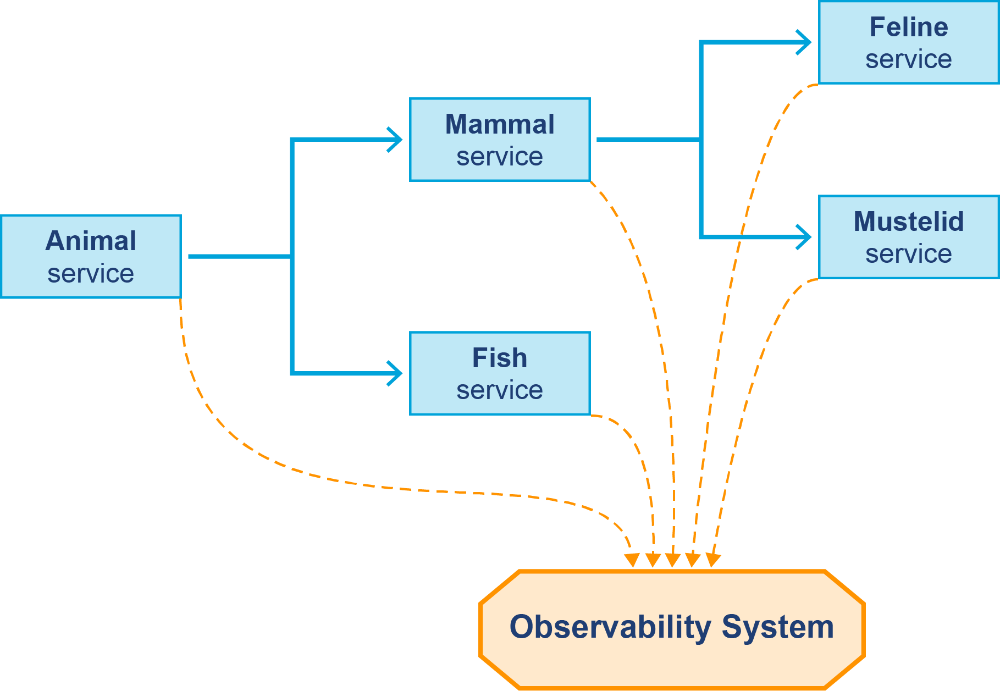
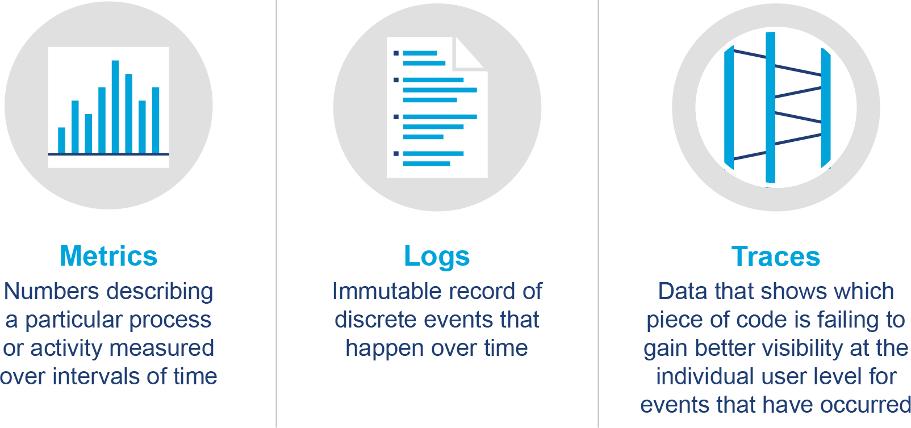
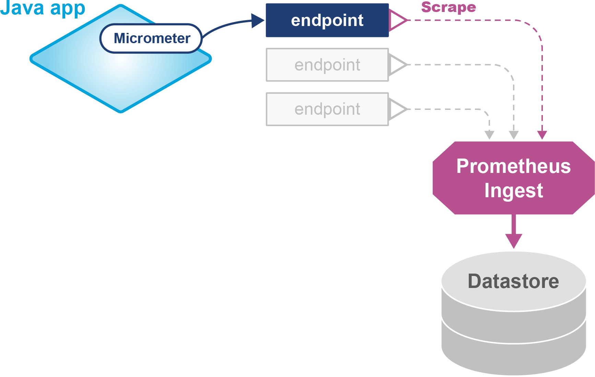
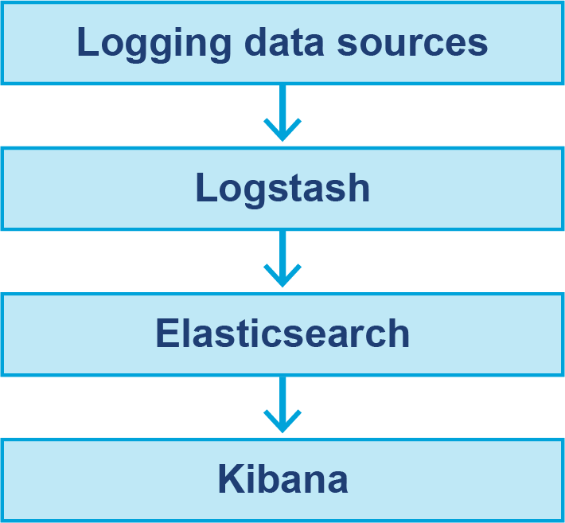
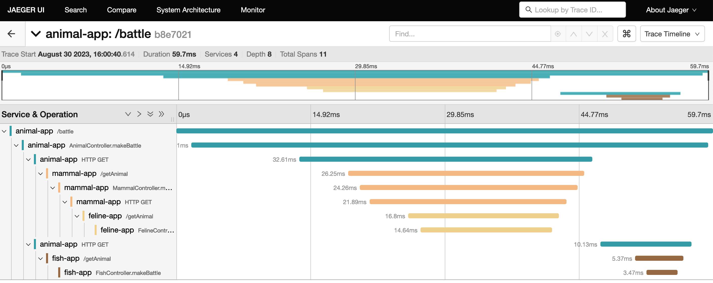
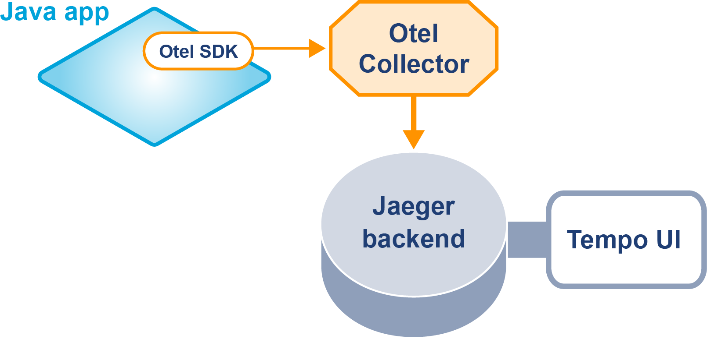
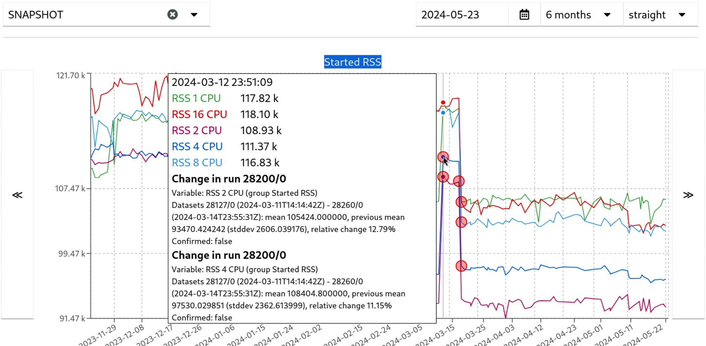
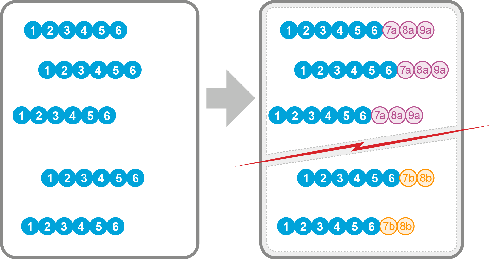
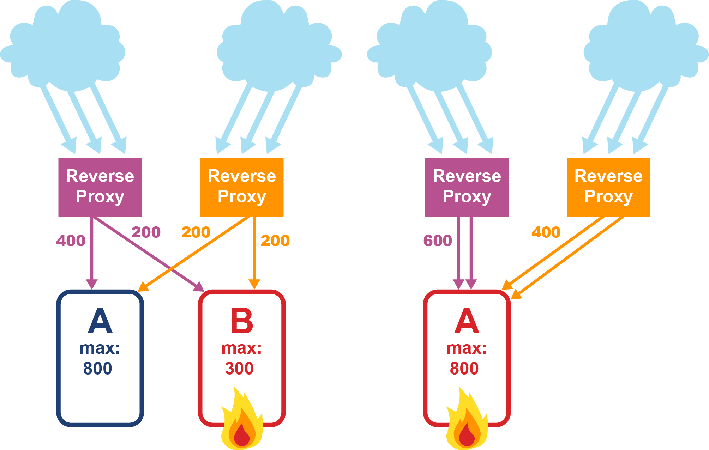
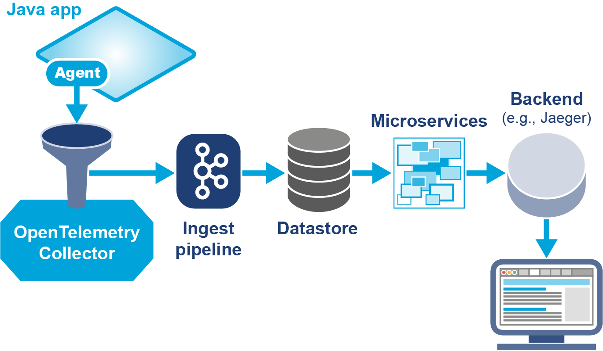

# Chương 10. Giới thiệu về Observability

Chủ đề observability (khả năng quan sát) ngày càng nổi lên hàng đầu trong phát triển phần mềm những năm gần đây.

> Observability đang chuyển từ một mối quan tâm ngách thành biên giới mới cho trải nghiệm người dùng, hệ thống và quản lý dịch vụ ở cả các công ty web lẫn doanh nghiệp.
>
> — James Governor

Nhưng tại sao lập trình viên Java lại cần quan tâm đến observability? Và rốt cuộc observability là cái quái gì?

Trong chương này, chúng ta sẽ khám phá các khái niệm và nền tảng của observability, và ở Chương 11, chúng ta sẽ thấy các kỹ thuật này có thể được triển khai trong ứng dụng Java bằng thư viện và công nghệ mã nguồn mở ra sao.

## Observability là gì và tại sao

Observability có tiếng, với một số lập trình viên, là mơ hồ và khó hiểu. Theo quan điểm của chúng tôi, điều này không xứng đáng — observability về mặt khái niệm là đơn giản và nên dễ giải thích. Các công cụ observability về cơ bản là sự tiếp nối, mở rộng và tổng quát hóa của các hệ thống monitoring cổ điển để cung cấp những khả năng vượt ra ngoài các kỹ thuật monitoring truyền thống.

Để giúp minh họa các khái niệm về observability, chúng tôi sẽ dùng ví dụ Fighting Animals đã giới thiệu ở Chương 8.

### Observability là gì?

Các bước liên quan đến một giải pháp observability về cơ bản là:

1. Đo đạc (instrument) các hệ thống và ứng dụng production để thu thập dữ liệu observability.
2. Gửi dữ liệu này đến một hệ thống bên ngoài có thể lưu trữ nó.
3. Cung cấp các công cụ phân tích cho phép trích xuất hiểu biết sâu về hành vi hệ thống cho DevOps, SRE, ban quản lý, v.v.

Điều thiết yếu là dữ liệu observability được gửi ra khỏi hệ thống production và vào một hệ thống observability hoàn toàn riêng biệt đang chạy trên cluster khác (nên nằm trên phần cứng tách biệt về mặt vật lý). Điều này có thể thấy ở Hình 10-1 cho ví dụ Fighting Animals.



*Hình 10-1. Gửi dữ liệu observability đến một hệ thống riêng biệt*

Lý do cho điều này hy vọng là rõ ràng, nhưng để tránh nghi ngờ — dữ liệu observability được dùng để giải quyết các vấn đề runtime và sự cố ngừng hoạt động. Nếu dữ liệu cần thiết để giải quyết sự cố lại nằm trong chính hệ thống đang gặp sự cố, thì có thể sẽ không dùng được dữ liệu đó để giải quyết sự cố.

Thứ hai, và vì cùng lý do, hệ thống observability không được nâng cấp cùng lúc với hệ thống production đang được quan sát.

Thứ ba, một khía cạnh cực kỳ quan trọng khác của các giải pháp observability là nhu cầu để các công cụ phân tích rất linh hoạt.

> Observability đòi hỏi bạn không phải định nghĩa trước những câu hỏi bạn sẽ cần hỏi, hay tối ưu những câu hỏi đó từ trước.
>
> — Charity Majors

Một phân tích sự cố dựa trên dữ liệu observability mang tính thăm dò và có những khía cạnh giống với kiểm định giả thuyết trong khoa học dữ liệu hoặc khoa học vật lý. Điều này có nghĩa một dạng biểu diễn đồ họa nào đó (bao gồm trình vẽ đồ thị) và một công cụ truy vấn là các giao diện người dùng phổ biến cho công cụ observability.

Cuối cùng, dữ liệu observability tốt nên cung cấp những hiểu biết có thể hành động được từ toàn bộ hệ thống, chứ không chỉ các khía cạnh hay mặt riêng lẻ, và điều này đòi hỏi các hệ thống, dịch vụ và loại tín hiệu riêng biệt phải được tương quan hoặc liên kết trong ngữ cảnh. Điều này đặc biệt đúng với các hệ thống lớn hơn nơi khối lượng dữ liệu observability có thể quá tải.

### Tại sao cần Observability?

Ba mạch tư duy đã dẫn đến thực hành observability.

Thứ nhất, và là một trong những mạch quan trọng nhất, bắt nguồn từ lý thuyết điều khiển hệ thống, và cụ thể là câu hỏi: "Trạng thái nội tại của một hệ thống có thể được suy ra từ bên ngoài tốt đến mức nào?" Câu hỏi này nảy sinh tự nhiên trong việc giải quyết sự cố, nhưng nó cũng có tính hữu dụng rộng hơn.

> **GHI CHÚ**
>
> Một cách observability khác với monitoring là do độ phức tạp của các ứng dụng hiện đại, bạn không thể thực sự giám sát sức khỏe của ứng dụng mà không có kiến thức về nội tại của ứng dụng. Điều này có nghĩa là chấp nhận một cách tiếp cận DevOps nào đó và loại bỏ tư duy rằng "monitoring là trách nhiệm của đội ops và dev không cần quan tâm."

Mạch thứ hai là sự thừa nhận rằng "cloud thì khác". Các ứng dụng hiện đại thường dùng những cách tiếp cận như immutable infrastructure như một phần của bối cảnh triển khai. Ví dụ, một container chứa ứng dụng được build bởi hệ thống continuous deployment và đẩy ra, chẳng hạn, một cluster Kubernetes.

Những khác biệt kiến trúc trong các hệ thống như Kubernetes, so với hệ thống truyền thống, đòi hỏi một cách tiếp cận vận hành mới. Các triển khai này không nhằm được nâng cấp hay tồn tại đặc biệt lâu. Thay vào đó, nếu có vấn đề với nó, nó sẽ hoặc được đưa về một phiên bản đã biết là tốt, hoặc được đẩy tiếp lên một bản build ứng viên mới.

Tính bất biến này của cấu hình không hoạt động tốt với vận hành hệ thống truyền thống, chẳng hạn SSH vào hệ thống để thực hiện debug tương tác và khám phá. Observability nhằm giải quyết sự thay đổi này về trọng tâm (và quy mô) của thực hành vận hành.

Mạch thứ ba và cuối cùng dẫn đến observability là application performance monitoring (APM). Lĩnh vực này ban đầu bị chi phối bởi các công ty công nghệ độc quyền như New Relic, Dynatrace, AppDynamics, v.v.

Những năm gần đây, các bên tham gia mới với cách tiếp cận mã nguồn mở hơn đã xuất hiện, bao gồm Datadog và Honeycomb. Hiệu ứng tổng thể là các nhà cung cấp APM hiện có đã trở thành công cụ tập trung vào observability tổng quát hơn và đã áp dụng nhiều thành phần mã nguồn mở hơn khi làm vậy.

## Ba trụ cột

Ba trụ cột (three pillars) là mô hình đơn giản để giải thích các nguồn dữ liệu chính dùng trong phân tích observability. Chúng được biểu diễn dưới dạng đồ họa ở Hình 10-2.



*Hình 10-2. Ba trụ cột*

Các trụ cột chỉ những nguồn dữ liệu khác nhau ở các khía cạnh nền tảng về hình dáng và hình thức:

- Metrics
- Logs
- Traces

Hãy thảo luận ba trụ cột theo thứ tự đó.

### Metrics

Nhiều lập trình viên Java đã quen với metric, ít nhất là theo trực giác, nhưng hãy nói cụ thể về ý chúng ta là gì khi nói về một metric. Metric là những con số đo lường hoạt động cụ thể trong một khoảng thời gian đều đặn. Điều này có nghĩa metric thường là counter hoặc gauge, và chúng đại diện cho sự tổng hợp một tập giá trị dữ liệu thành một chuỗi thời gian.

Trong sự tổng hợp này, chi tiết chính xác của từng sự kiện riêng biệt bị mất đi, nhưng tín hiệu kết quả gọn gàng hơn nhiều, đặc biệt cho dashboard/alert.

> **GHI CHÚ**
>
> Metric thường có thể được dùng làm điểm khởi đầu của một cuộc điều tra. Log và trace sau đó có thể cung cấp ngữ cảnh chi tiết giúp bạn ghép nối lại điều đã xảy ra.

Một metric thường có bốn phần:

- Timestamp (dấu thời gian)
- Name (tên)
- Value (giá trị)
- Dimensions (chiều, nếu có)

Những phần này khá tự giải thích, ngoại trừ có thể là mục cuối — các chiều của metric.

Chiều (dimension) đại diện cho các giá trị khác nhau của một thuộc tính nào đó (còn gọi là tag), được ghi lại dưới dạng cặp key/value. Điều then chốt là, để phù hợp dùng làm chiều, các giá trị metric phải cho phép tổng hợp qua các chiều.

Ví dụ, tỷ lệ phần trăm sử dụng CPU của system và user có thể được tổng hợp một cách hợp lý — bằng cách cộng chúng lại để cho ra tổng mức sử dụng CPU. Chúng ta có thể biểu diễn metric như thế này, tương tự định dạng Prometheus phổ biến mà chúng ta sẽ gặp sau:

```
cpu_memory_usage{type="system",} 0.12
cpu_memory_usage{type="user",} 0.66
```

Đây là một metric có chiều được định nghĩa tốt: nó tên `cpu_memory_usage` và có một chiều duy nhất (`type`) với chỉ hai giá trị khả dĩ — `system` và `user` — và hai giá trị của metric (`0.12` và `0.66`) có thể được tổng hợp hợp lý thành một giá trị tổng.

Mặt khác, nhiệt độ của các phòng riêng biệt trong nhà bạn, chẳng hạn bếp và phòng ngủ, không có tổng hợp nào đặc biệt hữu ích. Cộng chúng lại chẳng có ý nghĩa gì, và giá trị trung bình cùng lắm chỉ hữu ích ở mức tối thiểu. Trong trường hợp này, các nhiệt độ được biểu diễn tốt nhất bằng những tên riêng biệt, thay vì các chiều.

Chiều cũng được kỳ vọng có lực lượng (cardinality) tương đối thấp — nghĩa là chỉ có một số nhỏ giá trị khả dĩ cho chiều đó.

Ngoài ra, trên thực tế, metric rất có thể có nhiều chiều, và do đó, lực lượng tối đa thực sự của metric là tích các kích thước của tập giá trị cho mỗi chiều riêng biệt. Điều này có thể ảnh hưởng đến cả hiệu năng truy vấn lẫn khối lượng lưu trữ — đến lượt nó có thể làm tăng chi phí triển khai observability. Cũng có thể gặp vấn đề khi trực quan hóa và diễn giải các metric có lực lượng cao. Tuy nhiên, lực lượng thực tế quan sát được có thể ít hơn, vì trên thực tế, một số tổ hợp khả dĩ có thể không xảy ra.

> **GHI CHÚ**
>
> Khó nói chính xác thế nào là quá nhiều lực lượng cho một chiều, nhưng ở một cực đoan, nếu hệ thống của bạn có một triệu người dùng riêng biệt, thì `user_id` sẽ không phải lựa chọn phù hợp cho một chiều.

Một khi metric được sinh ra, chúng cần được export sang một hệ thống lưu trữ và phân tích, cũng như với các loại dữ liệu observability khác.

Một cài đặt observability metric đơn giản nhưng điển hình có thể thấy ở Hình 10-3.



*Hình 10-3. Ví dụ về observability của metric*

Như chúng tôi đã thảo luận ngắn gọn ở Chương 8, Prometheus là một trong những công nghệ then chốt trong không gian metric. Đặc biệt, nó có lẽ là hệ thống lưu trữ metric phổ biến nhất. Chúng tôi sẽ nói thêm một chút về nó ở chương tiếp theo, nhưng thảo luận đầy đủ về mọi khía cạnh của nó nằm ngoài phạm vi cuốn sách này — vui lòng tham khảo tài liệu sản phẩm.

Cuối cùng, hãy nhớ rằng metric là dữ liệu chuỗi thời gian, tức là chúng được báo cáo ở một chu kỳ cố định. JVM có tạo ra dữ liệu — ví dụ, garbage collection — vốn dựa trên sự kiện và không xảy ra ở nhịp thời gian đều đặn. Những sự kiện này không phù hợp cho phân tích chuỗi thời gian tiêu chuẩn, vì kỹ thuật này thường giả định tốc độ cố định. Do đó, cần thận trọng khi dùng chúng làm metric — có những điểm tinh tế liên quan đến việc xử lý dữ liệu.

Ví dụ, trong trường hợp GC, để tạo ra metric, chúng ta phải tổng hợp các sự kiện qua một cửa sổ cố định. Những metric này có thể hữu ích (đặc biệt khi biểu diễn dưới dạng histogram), nhưng cần nhớ rằng thông tin đã bị mất so với các sự kiện nền tảng.

Hãy chuyển sang xem trụ cột thứ hai, log, cũng có khả năng quen thuộc với lập trình viên Java.

### Logs

Phát triển Java đã có — và tiếp tục có — một truyền thống phong phú về log và xử lý log. Nhiều, có lẽ thậm chí là hầu hết, đội Java đã quen với các framework logging tiêu chuẩn (SLF4J, Log4j, v.v.).

Việc dùng mẫu hình logging facade rất phổ biến, và với lập trình viên Java thì đó "chỉ là một API logging". Trong mô hình này, cấu hình log định nghĩa một log exporter phù hợp (có thể là file writer, network logger, hoặc thứ gì đó phức tạp hơn, như một exporter gửi tới JDBC). Lập trình viên không cần quan tâm log được xử lý ra sao, vì API là như nhau bất kể phần ống nước bên dưới, như ví dụ mã này cho thấy:

```java
// Ví dụ mã SLF4J từ nhánh logging_only
@RestController
public class AnimalController {
  private static Logger LOGGER = LoggerFactory.getLogger(AnimalController.class);

    // ...

    private String fetchRandomAnimal() throws IOException, InterruptedException {
      var pause = (int) (SERVICES.size() * Math.random());
      LOGGER.info("Pausing for: "+ pause);

        // ...
    }
}
```

Nhưng log thực sự là gì? Các mục log được hiểu tốt nhất như bản ghi của các sự kiện rời rạc xảy ra tại một thời điểm cụ thể. Chúng thường được hiểu là bất biến sau khi tạo.

Ví dụ bao gồm log hệ thống và server (như syslog), log tường lửa hoặc hệ thống mạng, cũng như log nền tảng và ứng dụng hướng lập trình viên. Loại log này là văn bản phi cấu trúc và thường có một mức nghiêm trọng (severity) gắn với sự kiện log. Việc mã hóa log thường là văn bản thuần, nhưng không có lý do gì nó không thể là nhị phân — chúng tôi coi đây là chi tiết triển khai.

Log có đặc điểm là văn bản người đọc được. Điều này mang lại các khả năng hữu ích, chẳng hạn có thể `grep` từ khóa/cụm từ/regex cũng như vẽ đồ thị số lượng các thông điệp cụ thể theo thời gian.

Ngoài ra, mức nghiêm trọng của log cung cấp cách kiểm soát độ chi tiết dễ dàng cho lượng dữ liệu chúng ta muốn xem. Chúng cũng có thể hữu ích như nguồn dữ liệu cho công cụ kiểm toán hoặc dấu vết cho việc phát lại kiểu pháp y, mặc dù điều này phụ thuộc vào việc thiết kế và kiến trúc hệ thống log đúng đắn, như chúng ta sẽ thấy sau trong chương này.

> **GHI CHÚ**
>
> Cũng có khả năng có *event*, là bản ghi có cấu trúc, bất biến của một sự kiện rời rạc không có mức nghiêm trọng (nhưng có thể có tên mô tả lớp của sự kiện). Chúng thường được biểu diễn ở định dạng JSON để cung cấp một cấu trúc xác định, và một số người thực hành gọi chúng là *structured log* (log có cấu trúc).

Trong một mẫu hình logging observability điển hình, chúng ta tổng hợp log từ từng microservice riêng lẻ về một vị trí duy nhất qua mạng. Điều này cung cấp một tập dữ liệu log duy nhất, thống nhất, có thể tìm kiếm, lọc và nhóm được. Tuy nhiên, cần lưu ý rằng đây là mẫu hình *logging tập trung* — mọi log đều ở một chỗ, dù chúng đến từ các tiến trình khác nhau của một hệ phân tán.

Lưu ý rằng việc tổng hợp log từ các nguồn khác nhau đòi hỏi chúng ta phải có sự nhất quán nào đó về cách ghi log qua các service đó.

Ngược lại, *logging phân tán* thực sự thì ít phổ biến hơn nhiều và phức tạp hơn nhiều về mặt kỹ thuật. Nó thường chỉ thấy khi một khía cạnh hoặc ràng buộc nào đó của hệ thống ngăn logging tập trung trở nên khả thi — ví dụ, tranh chấp với các tiến trình ứng dụng về mạng, hoặc khối lượng log quá lớn không thể giảm được. Đây là trường hợp biên, và không phải trường hợp mà hầu hết lập trình viên ứng dụng sẽ cần giải quyết. Theo đó, chúng tôi không thảo luận thêm về logging phân tán trong cuốn sách này.

Khi triển khai giải pháp logging tập trung như một phần của observability, có rất nhiều công cụ mã nguồn mở và của nhà cung cấp để chọn. Một thuật ngữ thường gặp là *ELK stack*. Đây là từ viết tắt mô tả một stack gồm ba dự án phổ biến:

**Logstash**
: Pipeline xử lý dữ liệu cho việc thu nạp (từ nhiều nguồn) và biến đổi dữ liệu

**Elasticsearch**
: Lưu trữ dữ liệu cho tìm kiếm và phân tích

**Kibana**
: Thành phần GUI và ngôn ngữ truy vấn KQL

Khi được triển khai, ELK stack có thể trông tương tự kiến trúc thể hiện ở Hình 10-4.



*Hình 10-4. Ví dụ ELK stack*

Việc chạy và bảo trì một ELK stack có thể trở nên tốn kém — không kém phần quan trọng là do chi phí hạ tầng liên quan đến việc host nó trên một trong các nền tảng cloud lớn. Nhiều công ty cung cấp phiên bản được host của ELK stack.

Nhìn chung, nhân viên DevOps có nhiều khả năng là người dùng ELK stack qua một UI (dù tự host hay từ nhà cung cấp), thay vì cần kiến thức chi tiết về cách thiết lập và bảo trì nó.

Để hoàn thiện các trụ cột, chúng ta cũng cần thảo luận về trace — chủ đề mà lập trình viên Java có thể không quen thuộc bằng.

### Traces

Một *distributed trace* là bản ghi của một lời gọi service ở cấp cao nhất. Trong trường hợp bình thường, điều này tương ứng với một request duy nhất từ một người dùng cá nhân, ví dụ được kích hoạt bởi hoạt động của người dùng. Trace bao gồm các metadata sau về mỗi request:

- Instance nào được gọi
- Mỗi subrequest chạy trên container nào
- Method nào được gọi
- Request hoạt động ra sao
- Request thành công hay lỗi
- Metadata tùy chỉnh bổ sung tùy chọn để tăng cường tìm kiếm và truy xuất

Trong các kiến trúc phân tán, vốn là trường hợp chính chúng ta xét trong cuốn sách này, một lời gọi service cấp cao nhất thường kích hoạt các hành động khác góp phần vào trace tổng thể. Những hành động này được gọi là *span* và có thể bao gồm, ví dụ, một lời gọi đến một method hoặc lời gọi đến một service từ xa. Mỗi span có cùng loại metadata liên quan như trace tổng thể, nên một trace tạo thành một cấu trúc cây các span.

Lưu ý rằng distributed trace chủ yếu được dùng để đo đạc các lời gọi service theo hướng request-response, chẳng hạn HTTP. Các lời gọi như messaging bất đồng bộ, nơi không có phản hồi, có những khó khăn bổ sung liên quan.

Nhìn chung, distributed tracing vẫn đang được phát triển cho messaging bất đồng bộ — nhưng nó đang được nhiều bên quan tâm tích cực làm việc. Vì câu chuyện async vẫn đang biến động, trong phần còn lại của cuốn sách, chúng ta sẽ chỉ xét các luồng đồng bộ, hướng request-response.

Một span ví dụ có thể trông như thế này:

```json
{
    "name": "/v1/app/foo",
    "context": {
      "trace_id": "kDMI7LTxLxTj220awNARJw==",
      "span_id": "9ir6veJ4Hdw="
    },
    "parent_id": "",
    "kind": 1,
    "start_time": "2021-10-22 16:04:01.209458162 +0000 UTC",
    "end_time": "2021-10-22 16:04:01.209514132 +0000 UTC",
    "status_code": "STATUS_CODE_OK",
    "status_message": "",
    "attributes": {
      "key": "attr",
      "string.value": "value2"

      // ... Chi tiết HTTP và transport được lược bỏ
    },
    "events": [
        {
            "name": "",
            "message": "OK",
            "timestamp": "2021-10-22 16:04:01.209512872 +0000 UTC"
        }
    ]
}
```

Lưu ý `trace_id`, `span_id` và `parent_id` — ba trường này sẽ được dùng để kết nối các span khác nhau và tái dựng distributed trace, như bạn sẽ thấy. Trong ví dụ của chúng ta, đây là một root span, bởi không có `parent_id`.

Góc nhìn span tương ứng với cái được gọi là *extrinsic view* (góc nhìn ngoại tại) của các lời gọi service trong monitoring truyền thống. Các phần của một lời gọi người dùng đơn lẻ (nói cách khác là các span) được thu thập vào một trace, có thể được trực quan hóa dưới dạng *traceview*. Đây là biểu diễn về cách cây span được sinh ra.

Bạn có thể thấy một ví dụ ở Hình 10-5, dùng lại ví dụ Fighting Animals và được trực quan hóa trong Jaeger UI.



*Hình 10-5. Ví dụ traceview*

Để triển khai distributed tracing, một đội cần cân nhắc vài khía cạnh của kiến trúc. Quan trọng nhất là:

- Đo đạc (instrumentation) ứng dụng, middleware và các thành phần khác
- Lan truyền (propagation) ngữ cảnh trace giữa các service
- Thu nạp và lưu trữ dữ liệu trace
- Tìm kiếm và truy xuất các trace quan tâm
- Trực quan hóa trace

Điều này có thể được thực hiện bằng công cụ của nhà cung cấp (như Datadog, New Relic, Dynatrace, Honeycomb, v.v.) hoặc bằng cách triển khai một tổ hợp các công cụ mã nguồn mở. Một số công cụ và dự án phổ biến nhất được dùng trong tracing mã nguồn mở là OpenTelemetry, Jaeger và Grafana Tempo. Các công cụ cung cấp những vai trò khác nhau và thường được kết hợp để tạo ra một giải pháp tổng thể.

Ví dụ, ở Hình 10-6, bạn thấy OpenTelemetry được dùng cho instrumentation, lan truyền ngữ cảnh trace, và vận chuyển dữ liệu (hay export/exfiltration) đến hệ thống observability. Lưu trữ dữ liệu do Tempo cung cấp và trực quan hóa do Jaeger đảm nhiệm.



*Hình 10-6. Ví dụ về observability của distributed tracing*

Phần lan truyền ngữ cảnh được xử lý bởi ba trường: `trace_id`, `span_id` và `parent_id`. Các giá trị này phải được truyền từ microservice này sang microservice khác, và thoạt nhìn khó thấy điều này đạt được ra sao, khi các service có thể ở các JVM khác nhau hoặc trên những host tách biệt về vật lý.

Trên thực tế, các giá trị cho những trường này được mang trong các HTTP header bổ sung, theo định dạng W3C Trace Context, vốn là một Khuyến nghị của W3C kể từ tháng 3/2024. Các header này có thể được xử lý thủ công bởi mã ứng dụng hoặc qua instrumentation và injection tự động. Chúng ta sẽ thấy ví dụ cho cả hai (trong trường hợp trace của OpenTelemetry) ở chương tiếp theo.

Trên thực tế, việc trực quan hóa trace thường là phần khó — traceview là hình thức thông thường (ví dụ Jaeger). Tuy nhiên, cái này thường quá thấp cấp và khó tương quan với bức tranh tổng thể lớn hơn của hệ thống. Tại thời điểm viết sách (tháng 8/2024), có vẻ như rất cần một số hình thức trực quan hóa trace mới — đặc biệt khi các hệ thống trở nên phức tạp hơn theo thời gian.

Cuối cùng, còn về lấy mẫu dữ liệu thì sao? Distributed tracing có thể tạo ra khối lượng dữ liệu rất lớn. Các chính sách lấy mẫu khác nhau có thể được dùng để hợp lý hóa khối lượng dữ liệu phát sinh từ trace.

Trên thực tế, đại đa số trace sẽ là cho những request trả về mã thành công (nếu không thì bạn có những vấn đề khác), và không thực sự cần thiết phải xử lý toàn bộ tập dữ liệu phát sinh từ thành công.

> **GHI CHÚ**
>
> Đặc tả W3C cũng định nghĩa trường `trace-flags`, kiểm soát các cờ tracing như lấy mẫu, mức trace, v.v. như những khuyến nghị từ bên gọi đến các service downstream.

Mục đích của việc lấy mẫu là bảo tồn các tính chất thống kê của tập dữ liệu. Điều này quan trọng bởi vì, ví dụ, mọi thay đổi trong phân phối thời gian phản hồi do một thay đổi mã cần phải quan sát được.

Ví dụ, chính sách sampler mặc định trong OpenTelemetry là sampler "ParentBased Always On". Chính sách này là: nếu không có span cha, lấy mẫu span này. Nếu có cha, lấy mẫu theo việc cha có được lấy mẫu hay không. Điều này về cơ bản ủy quyền quyết định lấy mẫu cho điểm khởi nguồn của trace.

Điều này có lợi ích về sự đơn giản, nhưng có vấn đề là khi quyết định lấy mẫu được đưa ra, sampler không thể biết trace sẽ thành công hay có lỗi.

> **GHI CHÚ**
>
> Các trace chứa mã lỗi — dù phía client hay server, tức 4XX hay 5YY về HTTP — thường thú vị hơn thành công và lý tưởng nên luôn được thu thập không lấy mẫu, nhưng điều này đòi hỏi tail-based sampling, vốn vẫn còn thách thức.

Cách tiếp cận lấy mẫu cũng giải thích tại sao cả `trace_id` lẫn `parent_span_id` đều được lan truyền.

### Các trụ cột như những nguồn dữ liệu

Cách tiếp cận ba trụ cột về cơ bản đòi hỏi chúng ta đối xử với tín hiệu từ mỗi trụ cột như những nguồn dữ liệu riêng biệt khi chúng được sinh ra. Điều này phần lớn bởi dữ liệu gửi từ mỗi trụ cột có cấu trúc rất khác nhau:

- **Metrics** là bốn trường cố định (với trường chiều là một tập cặp key-value) đại diện cho các sự kiện được tổng hợp qua một khoảng thời gian có nhịp đều đặn.
- **Logs** là văn bản phi cấu trúc với một mức nghiêm trọng (và event là dữ liệu có cấu trúc không có mức nghiêm trọng) xảy ra tại một thời điểm cụ thể (tức một `Instant` của Java).
- **Traces** được tạo thành từ các span, là metadata có cấu trúc, được xác định, xảy ra trong một khoảng thời gian (có thể thay đổi từ trace này sang trace khác).

Khối lượng dữ liệu được tạo ra cũng khác nhau rất nhiều:

- Khối lượng metric không tăng theo lưu lượng request, vì chúng được tạo ra ở các khoảng thời gian cố định bất kể đã nhận bao nhiêu request.[^1]
- Khối lượng log không có quan hệ đơn giản với tốc độ request. Trong một hệ thống có kỷ luật logging kém (dù trong vận hành bình thường hay khi gặp nhiều lỗi), sự tăng trưởng có thể là siêu tuyến tính.
- Khối lượng trace liên hệ tuyến tính với lưu lượng request. Điều này vẫn ít nhiều đúng khi lấy mẫu trace.

Những khác biệt này khiến các dự án mã nguồn mở xử lý dữ liệu observability có xu hướng chỉ tập trung vào một trụ cột duy nhất. Việc phân silo dự án này có hệ quả với các tổ chức muốn triển khai observability OSS tích hợp.[^2]

Sức mạnh thực sự của observability là đưa tất cả dữ liệu này lại với nhau — lý tưởng là có thể tương quan qua các loại dữ liệu khác nhau, chứ không chỉ thu thập và phân tích từng cái riêng lẻ. Việc cung cấp sự tương quan giữa các tín hiệu là lĩnh vực phát triển tích cực trong các công cụ mã nguồn mở, nhưng tại thời điểm viết sách (tháng 8/2024) đây vẫn chưa phải bài toán đã giải quyết.

Cuối cùng, đáng lưu ý rằng không phải mọi người thực hành observability đều đồng ý với ba trụ cột như một mô hình cơ bản. Trong cuốn sách này, chúng tôi chọn nó làm cách tiếp cận chính vì hai lý do:

- Người mới có khả năng quen với các loại dữ liệu cơ bản và các khái niệm theo sau chúng.
- Các loại dữ liệu như đã thảo luận, như chúng ta đã thấy, về cơ bản khác nhau.

Các cách tiếp cận khác có tồn tại, và bạn rất có thể gặp chúng khi tiến bước trên hành trình observability. Như mọi khi, ý định của chúng tôi là cung cấp điểm khởi đầu và khuyến khích bạn khám phá xa hơn.

### Profiling — trụ cột thứ tư?

Bên cạnh ba trụ cột tiêu chuẩn, ngày càng có sự quan tâm đến việc xem profiling ứng dụng như loại dữ liệu và trụ cột thứ tư. Tuy nhiên, có những khác biệt đáng kể giữa dữ liệu profiling và các loại dữ liệu observability khác.

Việc triển khai profiling tổng quát, quy mô lớn cũng liên quan đến những thách thức kỹ thuật. Điều này phần lớn bởi profiling (dù là CPU hay bộ nhớ) có thể có chi phí phụ trội đáng kể. Vì lý do này, hai cách tiếp cận riêng biệt đã tiến hóa:

**On-demand profiling (profiling theo yêu cầu)**
: Chỉ kích hoạt khi cần, cung cấp tập dữ liệu phong phú hơn

**Continuous profiling (profiling liên tục)**
: Luôn bật, nên chi phí phụ trội được giảm càng nhiều càng tốt

Có những đánh đổi ở cả hai cách tiếp cận. Ví dụ, continuous profiling thường sẽ có chi phí phụ trội thấp hơn (vì buộc phải vậy), nhưng nó cũng sẽ có độ phân giải dữ liệu thấp hơn — nên có thể khó phát hiện vấn đề hơn trong dữ liệu thu thập được.

Mặt khác, với on-demand profiling, cần có gì đó (hoặc người vận hành hoặc một agent giám sát) có thể bật và tắt profiling. Điều này không chỉ ngụ ý một control plane mà còn đòi hỏi ai đó/thứ gì đó nhận ra rằng có vấn đề ngay từ đầu.

Nó cũng có nghĩa là khó (hoặc không thể) dùng cho phân tích vấn đề dự đoán — tức là có thể thấy trước một sự cố đang đến.

Profiling là chủ đề của Chương 12, và chúng tôi sẽ nói thêm về nó ở đó.

## Các mẫu hình và Antipattern kiến trúc Observability

Chúng ta đã thảo luận logging facade như một mẫu hình then chốt trong observability. Trong phần này, chúng tôi sẽ thảo luận một số mẫu hình khác, đặc biệt trong lĩnh vực metric. Chúng tôi sẽ kết thúc bằng việc xem vài antipattern mà các đội nên nhắm tránh.

### Mẫu hình kiến trúc cho Metric

Metric là khía cạnh đã được thiết lập tốt của observability cho ứng dụng Java, và kết quả là một số phong cách kiến trúc khác nhau đã nổi lên để hỗ trợ nó.

Chúng ta đã gặp khái niệm chiều (dimensionality), nhưng không phải mọi hệ thống metric đều hỗ trợ chiều. Câu hỏi then chốt chúng ta cần hỏi là: "Bên tiêu thụ có hỗ trợ chú thích key/value cho phép đo không?"

Nếu có, thì thư viện metric đang dùng là *dimensional*. Nếu không, lựa chọn thay thế là kết hợp thông tin được mang trong chiều vào tên metric dưới dạng hậu tố của một tên metric cơ sở.

Ví dụ, có hai quy ước chính cho việc đặt tên metric:

**Dotted (dấu chấm)**
: Được dùng bởi OpenTelemetry Metrics và nhiều công cụ, thư viện của nhà cung cấp

**Snake-cased (gạch dưới)**
: Được dùng chủ yếu bởi Prometheus (nhưng Prometheus cũng có chiều, mà nó gọi là *metric label*)

Một quy ước dotted sẽ trông như thế này: `jvm.memory.used{area=heap,id=G1 Eden Space}` trong khi cùng metric đó ở quy ước đặt tên hậu tố phi chiều có thể trông như: `jvm_memory_used_heap_G1_Eden_Space`.

Khía cạnh thứ hai của kiến trúc hệ thống metric là *kỷ luật tổng hợp* (aggregation discipline). Thuật ngữ này chỉ nơi việc tính toán tổng hợp metric được thực hiện:

**Client-side (phía client)**
: Các mẫu rời rạc được xử lý (ví dụ, chuyển thành tốc độ) trước khi được xuất bản ra khỏi ứng dụng

**Server-side (phía server)**
: Việc tổng hợp diễn ra tại observability server

Ở khía cạnh này, Prometheus cũng khác với các lựa chọn thay thế — nó ưa thích tổng hợp phía server, trong khi hầu hết công nghệ metric khác dùng tổng hợp phía client.

Vấn đề này một lần nữa đại diện cho một đánh đổi: gửi mọi phép đo qua mạng có thể tốn kém, nhưng tài nguyên bổ sung cần cho lưu trữ tạm và tính toán phía client cũng vậy.

Cuối cùng, hãy xét câu hỏi metric nên được đưa đến hệ thống observability ra sao. Hai cách tiếp cận khác nhau về cơ bản là:

**Server poll (server thăm dò)**
: Hệ thống observability thu thập metric từ ứng dụng.

**Client push (client đẩy)**
: Ứng dụng được quan sát chủ động gửi metric đến hệ thống observability.

Trong hai cách này, Prometheus dùng server poll, mà nó gọi là *scraping*. Điều này có nghĩa mọi service bạn muốn giám sát bằng Prometheus phải cung cấp một Prometheus metrics endpoint sẵn có qua HTTP. Prometheus cũng dựa vào việc các service được biết hoặc có thể khám phá được, điều này đặt ra thách thức cho các job vòng đời ngắn và cho các hệ thống không thể (hoặc không muốn) phơi bày một metrics endpoint vì lý do bảo mật.

Để xử lý điều này, và cũng để tích hợp tốt hơn với các công nghệ như OpenTelemetry, Prometheus cũng có tùy chọn remote-write, nhưng nó không phải lúc nào cũng được các đội triển khai.

Chúng tôi sẽ thảo luận điều này chi tiết hơn ở Chương 11.

### Instrumentation thủ công so với tự động

Instrumentation thủ công liên quan đến việc thay đổi mã ứng dụng để thêm các lời gọi tường minh đến một thư viện telemetry.

Trong trường hợp tracing, điều này cung cấp toàn quyền kiểm soát khi nào trace và span được tạo và hoàn tất. Tuy nhiên, nó có hai nhược điểm lớn:

- Nó áp đặt sự gắn kết trực tiếp với thư viện observability (ít nhất là một API).
- Có tiềm năng đáng kể cho lỗi con người — nó giả định rằng lập trình viên đã biết cần trace những gì.

Điểm thứ hai quan trọng hơn nhiều so với nhiều lập trình viên nhận ra.

Một trong những khía cạnh then chốt của observability là nó phải cho phép bạn "tìm câu trả lời cho những câu hỏi mà bạn chưa biết mình có ngay từ đầu." Nếu bạn không biết những câu hỏi sẽ là gì, thì làm sao bạn chắc chắn rằng mình đã instrument thủ công tập con các đường gọi cho phép bạn hỏi những câu hỏi đó?

Nói cách khác, instrumentation thủ công cho trace mang rủi ro rất thực về việc đưa các điểm mù observability vào ứng dụng. Điều này có thể cực kỳ có hại, vì chúng có thể và sẽ tạo ấn tượng sai về nơi vấn đề nằm ở đâu.

Logging (ví dụ SLF4J hay Log4j) hầu như luôn được làm thủ công, bằng cách bao gồm tường minh các lời gọi đến một logging facade. Điều này có thể dẫn đến trường hợp các sự kiện log cần thiết bị thiếu hoặc được sinh ra ở mức nghiêm trọng sai. Tuy nhiên, so với việc thiếu thông tin trace, đây là phiền toái nhỏ, và các đội đã quen với việc thêm log bổ sung hoặc thay đổi mức nghiêm trọng để phản ứng với một sự cố.

Do đó, do độ phức tạp vốn có, nhiều đội thích instrumentation tự động cho tracing. Điều này được cung cấp hoặc bằng cách dùng một Java agent hoặc hỗ trợ sẵn có do framework mà ứng dụng của bạn được viết bằng cung cấp.

Trong trường hợp agent, kỹ thuật này phụ thuộc vào bytecode weaving. Như đã lưu ý ở phần "Tóm tắt", việc cài đặt một Java agent cho phép thành phần công cụ sửa đổi bytecode của bất kỳ class nào được nạp trong quá trình chạy ứng dụng. Điều này cho phép agent tự động hóa việc chèn những đoạn mã boilerplate vốn có thể khá tẻ nhạt.

> **GHI CHÚ**
>
> Một ví dụ OpenTelemetry có thể thấy ở phần "Manual Tracing", nếu bạn muốn đọc trước.

Cũng như chúng ta đã thảo luận cho garbage collection, một hệ thống tự động đúng đắn không chịu tính hay sai sót của con người. Tuy nhiên, cách tiếp cận agent vẫn có thể cần một chút cấu hình (tức là để nó không instrument tuyệt đối mọi thứ). Ngoài ra, có thể có tác động đến thời gian khởi động và hình phạt hiệu năng runtime — ít nhất trong một số hoàn cảnh.

Một số framework Java hàng đầu cũng đi kèm hỗ trợ tracing tự động — ví dụ, Quarkus có thể bật OpenTelemetry chỉ bằng cách thêm phụ thuộc Maven:

```xml
<dependency>
    <groupId>io.quarkus</groupId>
    <artifactId>quarkus-opentelemetry</artifactId>
</dependency>
```

Không có tham số cấu hình bắt buộc nào để extension hoạt động — theo mặc định, nó sẽ cố gửi trace tới cổng 4317 trên `localhost` dùng OTLP qua GRPC.[^3]

Để hoàn thiện bức tranh, metric thường kết hợp các khía cạnh của cả instrumentation thủ công lẫn tự động. Lập trình viên có thể thiết lập metric riêng cho những mục quan tâm đặc thù cho ứng dụng, và chúng được mã hóa thủ công. Những metric này sau đó có thể được bổ sung bằng các metric sinh tự động do các thư viện (hoặc bởi chính JVM) tạo ra. Chúng tôi sẽ nói thêm về cách tiếp cận lai này ở Chương 11, khi thảo luận về Micrometer.

### Antipattern: Nhồi nhét dữ liệu vào Metric

Nhớ lại rằng metric là counter, gauge hoặc histogram — chúng đại diện cho dữ liệu được thu thập và/hoặc tổng hợp trong một khoảng thời gian cố định. Dữ liệu không khớp với góc nhìn khái niệm này không phải ứng viên phù hợp cho một metric.

Điều này cũng áp dụng cho các chiều — nếu các giá trị của một chiều không thể tổng hợp được, thì nó không phải một chiều, và các giá trị phải được đối xử như những metric riêng biệt.

Nhớ rằng một metric, về bản chất, là sự nén một phân phối các sự kiện thành một chuỗi thời gian. Thông tin về hình dạng của phân phối tất yếu bị mất không thể phục hồi mỗi khi chúng ta làm điều này.

Ví dụ, giả sử chúng ta quan tâm đến số mã lỗi 500 từ một trong các service. Chúng rõ ràng đến vào những thời điểm khác nhau, nhưng nếu chúng ta gói chúng vào một metric `errors.per.hour`, thì kịch bản một request mỗi phút thất bại và kịch bản 60 request thất bại trong 0,1 giây cuối của giờ đó trông y hệt nhau theo metric này.

> Là một chỉ số thống kê, giá trị trung bình (bao gồm trung bình cộng) có nhiều công dụng thực tiễn. Hiểu đúng một phân phối không phải là một trong số đó.
>
> — Brendan Gregg

Đặc biệt, đừng tổng hợp các phân vị — nó không hoạt động. Lý do rất đơn giản — để tính một phân vị, bạn cần dữ liệu gốc (quần thể).

Không có điều này, bạn không có khả năng xác định khi nào các phân vị trung bình hóa của mình đang nói dối bạn. Ví dụ, khi bạn có nhiều outlier, chúng có thể khiến các hệ thống không khỏe mạnh trông khỏe mạnh, và ngược lại.

Những phép tổng hợp sai lầm này có thể dẫn đến phân tích không chính xác và các quyết định kỹ thuật/kinh doanh kém. Không chỉ là những phép tổng hợp nói dối — nó còn tệ hơn thế. Chúng là những lời nói dối khoác áo sự thật. Con người sẽ nhìn vào những biểu đồ đẹp đẽ và coi chúng là trạng thái thật của hệ thống — trong khi thực tế, chúng có thể hoàn toàn gây hiểu nhầm.

Một điểm quan trọng khác là đừng cố thu thập tuyệt đối mọi thứ — không phải mọi thứ đều quan trọng. Antipattern này đôi khi thấy khi một đội phát triển đang thu thập, ví dụ:

- Các con số rất chi tiết đặc thù runtime
- Metric quá thô (ví dụ, trung bình CPU trong năm phút)

Trường hợp đầu có thể xảy ra khi đội quan tâm đến một con số có vẻ liên quan đến vấn đề nào đó họ đang giải quyết, và họ quên rằng nó không thú vị trong trường hợp tổng quát. Điều này có thể xảy ra khi đội dev cố khiến một hệ thống metric cung cấp dữ liệu vốn nên đến từ một nguồn khác — như một hệ thống tracing hoặc một profiler. Với một số loại triage nhất định, metric đơn giản không phải câu trả lời, và việc thêm chúng một cách không cần thiết có thể làm giảm khả năng sử dụng và sức khỏe tổng thể của nền tảng observability.

Trường hợp thứ hai là thông tin có thể không hành động được — đến lúc bạn nhận thấy trung bình CPU năm phút quá cao, hệ thống của bạn đã gặp rắc rối rồi, và Kubernetes có thể đã bắt đầu giết Pod.

Một quy tắc ngón tay cái tốt là, khi cân nhắc thêm một metric, luôn hỏi: "Metric này có thể giúp chúng ta debug vấn đề gì?" Nếu bạn không thể trả lời câu hỏi đó, thì có lẽ bạn không cần metric đó. Cũng đáng kiểm tra xem metric mới đề xuất có thể suy trực tiếp từ các metric hiện có hay không — nếu có, thì có lẽ nó nên được backend observability metric tổng hợp thay thế.

### Antipattern: Lạm dụng Log tương quan

Đây là nỗ lực bằng cách nào đó tránh triển khai một giải pháp distributed tracing thực sự bằng cách nhồi metadata request vào log thay thế. Nó thường được đặc trưng bởi:

"Nếu chúng ta có một ID chảy qua các log, chúng ta có thể theo dõi request."

Điều này thoạt nhìn có vẻ đúng, nhưng nó chỉ đúng với điều kiện:

- Mọi thành phần logging được thiết lập đúng (ví dụ, log level).
- Các ID luôn được tạo theo cùng một cách.
- Các ID không chứa PII/dữ liệu nhạy cảm khác.
- Hệ thống logging có thể theo kịp 100% luồng log.

Đặc biệt, trường ID không được chỉ là dạng mã hóa base-64 của dữ liệu PII nào đó (một tình trạng kinh khủng mà một trong các tác giả đã thực sự chứng kiến).

Không chỉ vậy, để làm cho bộ tương quan log tự chế hoạt động, bạn cũng phải sẵn sàng:

- Trả tiền cho 100% lưu trữ log trong bao lâu bạn cần.
- Trả tiền cho đủ tính toán để xử lý 100% luồng log.
- Tạo và duy trì mã tùy chỉnh cùng các tích hợp cho mọi thành phần trong giải pháp.

Antipattern, tất nhiên, là những giải pháp tồi thường gặp cho các vấn đề phổ biến. Tuy nhiên, đôi khi mọi thứ chỉ đơn giản là sai, ngay cả khi chúng ta xây và vận hành hệ thống hoàn hảo. Hãy chuyển sang xem điều đó — phần giới thiệu về điều gì xảy ra khi hệ thống chỉ đơn giản là hỏng, và cách dùng observability để phát hiện vấn đề.

## Chẩn đoán vấn đề ứng dụng bằng Observability

Rất quan trọng khi hiểu những cách phổ biến nhất mà một ứng dụng có thể hỏng, để bạn có thể thấy làm sao có thể phát hiện — và sửa — những lỗi này bằng công cụ observability. Vậy nên, trong phần này, chúng tôi sẽ thảo luận một số lỗi phổ biến nhất mà ứng dụng của bạn có thể gặp.

> Sau sự kiện thì việc phân loại tín hiệu liên quan và không liên quan dễ hơn nhiều. Sau sự kiện, tất nhiên, một tín hiệu luôn rõ như pha lê. Giờ chúng ta có thể thấy nó báo hiệu thảm họa nào vì thảm họa đã xảy ra, nhưng trước sự kiện thì nó mờ mịt và chứa đầy những ý nghĩa mâu thuẫn.[^4]
>
> — Roberta Wohlstetter

Xuyên suốt phần này, chúng tôi cũng sẽ ghi lại một số chế độ lỗi của hệ phân tán. Còn nhiều chế độ khác, nên phần này chỉ nhằm đóng vai trò nhập môn.

### Suy giảm hiệu năng (Performance Regression)

Một trong những vấn đề đơn giản nhất mà observability có thể giúp phát hiện là suy giảm hiệu năng. Đôi khi, một thay đổi mã (hoặc cấu hình) có thể có tác động không mong đợi lên khía cạnh nào đó của hiệu năng. Điều này có thể là các khía cạnh mức thấp như mức sử dụng CPU, sử dụng bộ nhớ, hay allocation rate, hoặc các con số mức cao hơn như latency giao dịch tổng thể.

Một công cụ observability, với giao diện truy vấn và thành phần vẽ đồ thị, giúp có thể thấy tác động của một thay đổi bằng cách nhìn vào một đại lượng quan sát phù hợp trước và sau thay đổi. Điều này có thể được làm hoặc bằng cách so sánh hiệu năng trước và sau, hoặc bằng cách dùng một trong các kỹ thuật triển khai chúng ta gặp ở Chương 9.

Một ví dụ cho loại thứ hai có thể thấy ở Hình 10-7, nơi chúng ta dùng canary deploy.



*Hình 10-7. Nhìn thấy một outlier*

Suy giảm dễ thấy với những kỹ thuật triển khai này, bởi nếu các tiến trình đã sửa đổi thể hiện sự phân kỳ đáng kể so với baseline đã thiết lập về hành vi hiệu năng, thì nó sẽ nhìn thấy được trong đại lượng quan sát liên quan.

Đối mặt với một suy giảm đơn giản như thế này, đội có thể quyết định hoặc chấp nhận suy giảm (nếu nó đủ nhỏ) hoặc rút thay đổi ra và làm phân tích thêm để sửa đổi thay đổi nhằm giảm tác động.

Lý tưởng nhất, phân tích thêm sẽ diễn ra trong một sandbox phát triển hoặc kiểm thử. Tuy nhiên, một số loại suy giảm không bộc lộ rõ ràng ngoài môi trường production, và trong trường hợp này, cách tiếp cận sửa-và-triển-khai-lại là cần thiết — vốn phù hợp tự nhiên với kỹ thuật như canary deploy.

Đặt các service level objective (SLO) với một metric liên quan là cách tuyệt vời để xác thực xuyên suốt việc release và vận hành hàng ngày rằng hệ thống của bạn đang hoạt động như kỳ vọng. Cảnh báo hoặc build failure có thể được thiết lập trong tình huống một SLO không còn được đáp ứng, tạo cơ hội để phản ứng và giải quyết vấn đề. Vì hiệu năng không phải khoa học chính xác, nên áp dụng error budget để thiết lập một dung sai cho một metric nhất định. Cân nhắc dùng metric làm SLO và áp dụng error budget phù hợp với kỷ luật SRE và cực kỳ hữu ích trong việc duy trì hiệu năng mong muốn của hệ thống.

### Thành phần không ổn định

Một vấn đề phổ biến khác là một thay đổi đưa vào sự bất ổn định cho một thành phần ứng dụng. Các trường hợp dễ của điều này, ví dụ khi toàn bộ thành phần bị mất ổn định, thường rõ ràng ngay lập tức và có thể được rút ra ngay. Tuy nhiên, khá phổ biến việc sự bất ổn định chỉ bộc lộ trên một số đường mã nhất định hoặc với một số loại request nhất định. Trong trường hợp này, thay đổi có thể đã được triển khai hoàn toàn lên production trước khi thành phần gặp phải các đường mã hoặc request kích hoạt sự bất ổn định.

Loại vấn đề này là một ví dụ về loại bài toán mà distributed trace có thể giúp giải quyết. Phương pháp phát hiện có thể liên quan đến việc so sánh tỷ lệ lỗi của trace trước và sau một thay đổi, và nhìn vào các trace lỗi để xem có mẫu hình nào không, chẳng hạn một URL cụ thể hay một service cụ thể bị ảnh hưởng.

Trong ngữ cảnh này, service có thể hoặc là một trong các service của chúng ta hoặc một phụ thuộc bên ngoài nào đó. Sẽ hữu ích khi có metric cho tỷ lệ lỗi của các thành phần này, và điều này cũng cho thấy bản chất thăm dò của công việc observability. Đào sâu vào vấn đề có thể dẫn đến việc điều tra các khía cạnh của hệ thống vốn không rõ ràng là bị ảnh hưởng.

Một vấn đề làm phức tạp thêm là tính mùa vụ (seasonality). Nhiều hệ thống có các đường mã hiếm khi được thực thi trong hoàn cảnh bình thường, nhưng lại xuất hiện quá mức vào những thời điểm cụ thể (những ngày cụ thể trong tuần hay quý, hoặc các sự kiện đặc biệt một lần). Trong trường hợp này, một sự bất ổn định có thể nằm im — vì thay đổi đưa nó vào đã xảy ra vào lúc các đường mã dễ tổn thương không được gọi đủ thường xuyên để vấn đề bộc lộ.

Điều này có nghĩa khi phân tích những loại vấn đề này, một kỹ sư observability phải đảm bảo họ không trở thành nạn nhân của thiên kiến gần đây — tự động giả định rằng thay đổi vừa được thực hiện là nguyên nhân, chỉ đơn thuần vì sự gần gũi về thời gian.

### Phân vùng lại và "Split-Brain"

Một vấn đề kinh điển trong hệ phân tán được gọi là "split-brain" (não tách đôi): điều gì xảy ra khi một cluster gặp lỗi giao tiếp, khiến một số thành viên không thể tiếp cận tất cả các thành viên khác?

Trong trường hợp xấu nhất, cluster có thể vỡ thành hai hoặc nhiều mảnh — với mỗi mảnh duy trì kết nối bên trong nó nhưng bị ngắt kết nối với các mảnh khác. Như chúng ta sẽ thảo luận ở Chương 14, khi nhiều node tin rằng chúng là Leader, điều này có thể dẫn đến phân vùng mạng (network partition) — một ví dụ có thể thấy ở Hình 10-8.



*Hình 10-8. Split-brain*

Đây là vấn đề đáng kể với kỹ sư observability, vì các tín hiệu mâu thuẫn từ các mảnh có thể dẫn đến suy luận sai. Thậm chí tệ hơn là trường hợp các mảnh vẫn, nhìn chung, đồng thuận về các đại lượng quan sát của hệ thống.

Chúng ta có thực sự phân biệt được giữa một tổng thể gắn kết và hai mảnh tình cờ đang trên những quỹ đạo tương tự vào lúc này không? Vì lý do này, chúng ta nên đảm bảo rằng các node của cluster báo cáo node nào chúng coi là Leader, và cảnh báo nếu có hơn một Leader cho một cluster.

> **GHI CHÚ**
>
> Phân vùng mạng đã được nghiên cứu rộng rãi, và nhiều kỹ thuật để phục hồi từ nó, và đảm bảo hòa giải dữ liệu, đã được biết đến. Chúng ta sẽ thấy thêm chi tiết ở phần "Cấu trúc dữ liệu phân tán cơ bản".

Một câu hỏi liên quan và quan trọng khác là: nếu một cluster dựa vào kỹ thuật phân vùng, thì điều gì xảy ra nếu một node bị mất?

Bất kỳ hệ thống nào không giữ nhiều bản sao của các phân vùng dữ liệu sẽ mất dữ liệu trong trường hợp lỗi cứng (ví dụ, JVM crash hoặc kernel panic). Do đó, các giải pháp cluster thực tế cung cấp khả năng phục hồi và failover để ngăn mất dữ liệu. Trong trường hợp xấu nhất, luôn nên có ít nhất một bản sao lưu của mỗi mẩu dữ liệu, để việc mất một thành viên đơn lẻ sẽ không bao giờ gây mất dữ liệu.

Tuy nhiên, ngay cả trong trường hợp này, các phân vùng chứa dữ liệu sẽ cần được gán lại và cân bằng giữa các node sống sót, vì một số phân vùng giờ chỉ có một bản sao, và điều này phải được sửa. Đây được gọi là sự kiện *repartitioning* (phân vùng lại).

Trong nhiều hệ thống (ví dụ Kafka), khi một thành phần ở trạng thái repartitioning, thì không thread nào có thể đọc hay xử lý dữ liệu. Điều này thực chất kích hoạt một sự kiện stop-the-world phân tán trong khi sự kiện repartitioning hoàn tất. Những sự kiện STW này là một tín hiệu khác mà kỹ sư observability có thể, và nên, tìm kiếm và cảnh báo về.

### Thundering Herd

*Thundering herd* (đàn thú chạy rầm rập) là điều kiện gây ra khi một sự kiện nào đó kích hoạt một số lượng lớn client thực hiện request lên một tài nguyên server đang bị tranh chấp. Thường chỉ một (hoặc vài) request này có thể được phục vụ (do tranh chấp), khiến đa số request bị đình trệ và thậm chí có thể timeout.

Điều này thường có thể do việc khởi động lại thành phần trong hệ thống — và nó có thể ở một phần rất khác của hệ thống. Hãy xét việc khởi động lại một cơ sở dữ liệu hoặc hệ thống giống cơ sở dữ liệu; điều này dẫn đến việc đóng mọi kết nối đang hoạt động. Tại điểm khởi động lại, một thundering herd các kết nối lại tới cơ sở dữ liệu dẫn đến thời gian phản hồi tăng lên, hoặc tệ hơn, sự bão hòa làm sập tài nguyên.

Một cách khác để nghĩ về thundering herd là bằng phép so sánh với một khóa đồng bộ hóa Java bị tranh chấp cao — khi tất cả thread được đánh thức, thì chỉ một có thể thắng cuộc đua giành khóa, và tất cả các thread khác phải block lại. Tuy nhiên, việc tiêu thụ tài nguyên do một thundering herd gây ra có thể đáng kể hơn nhiều so với chỉ vài lần đánh thức thread không cần thiết.

Một biến thể phổ biến của vấn đề này liên quan đến cache — vài reader cố đọc từ cache, thất bại, và do đó cố nạp nó từ cơ sở dữ liệu hậu thuẫn. Điều này gây tải cơ sở dữ liệu khổng lồ, không cần thiết, vì mỗi lượt đọc đồng thời thực thi cùng một truy vấn (có khả năng tốn kém) đối với cơ sở dữ liệu.

Sự kiện thundering herd thường xuất hiện dưới dạng một đợt bùng nổ tải cơ sở dữ liệu hoặc cache backend đột ngột, không mong đợi, không tương quan với các request đến từ người dùng, và đây có thể là tín hiệu hữu ích để bắt đầu chẩn đoán.

Để giúp phát hiện thundering herd, chúng ta có thể dùng các metric như số kết nối đang hoạt động. Đặc biệt, đạo hàm (tốc độ thay đổi) của metric đó là cách tốt để phát hiện sự tăng vọt đột ngột tương ứng với thundering herd.

Ngoài ra, một chiến lược giảm nhẹ phổ biến liên quan là dùng một hàng đợi request để đệm các request đến trước khi gửi chúng tới tài nguyên backend bị tranh chấp. Nếu hàng đợi request là một dạng `BoundedQueue`, thì kỹ thuật này buộc bên gửi phải block, thực chất điều tiết số lượng request và áp dụng backpressure.

### Lỗi dây chuyền (Cascading Failure)

Ở dạng đơn giản nhất, lỗi dây chuyền là khi một thành phần ứng dụng bị lỗi khiến các hệ thống con khác bắt đầu lỗi theo do phản hồi tích cực (positive feedback).

Ví dụ, một bản sao đơn lẻ của một service có thể bắt đầu lỗi do tải cao hơn bình thường. Điều này làm tăng số request đang bay, làm tăng tải lên các bản sao khác trong cluster. Đến lượt nó, điều này làm tăng xác suất lỗi của chúng, có thể gây hiệu ứng domino cuối cùng làm sập toàn bộ cluster service, như có thể thấy ở Hình 10-9.



*Hình 10-9. Lỗi dây chuyền*

Sự đổ vỡ và giảm sút công việc hữu ích được thực hiện có thể lan ra ngoài cluster bị ảnh hưởng ban đầu và có khả năng lan khắp hệ thống.

Ví dụ, load balancer của hệ thống có thể phản ứng với một cluster đã crash bằng cách định tuyến request tới các cluster khác. Tuy nhiên, nếu hệ thống đã gần giới hạn năng lực, điều này có thể làm quá tải các server trong cluster mới, gây lây lan thêm sự đổ vỡ và cuối cùng dẫn đến lỗi toàn dịch vụ.

Phiên bản phần mềm của vấn đề này được đặt tên theo hiệu ứng tương tự trong các trường hợp như hệ thống điện cao thế. Trong trường hợp đó, một lỗi đơn lẻ trên hệ thống đầy tải dẫn đến một đợt tăng vọt đột ngột trên tất cả node còn lại khi điện được phân phối lại. Điều này khiến các node khác quá tải và có thể cũng bắt đầu lỗi, làm vấn đề tệ hơn.

Tuy nhiên, cần nhận ra giới hạn của phép ẩn dụ và cách đặt tên tương tự. Đặc biệt, các hệ thống điện vật lý thể hiện hai khía cạnh tiêu cực mà phần mềm không phải đối phó khi xử lý một chuỗi lỗi.

Thứ nhất, các hệ thống điện có thể chịu hư hại vĩnh viễn và không thể đảo ngược nếu bị đẩy đến quá tải. Phần mềm có thể cần chút thời gian hạ nhiệt, nhưng chỉ vậy thôi — mã không ngừng hoạt động vĩnh viễn nếu bị quá tải một lần.

Thứ hai, trong hệ thống điện, các tín hiệu điều khiển — vốn cần thiết để cô lập hoặc tắt các phần khác của mạng nhằm tránh hư hại — lan truyền với cùng tốc độ như tải gây hại, nên không thể chạy nhanh hơn chuỗi lỗi. Trong trường hợp của chúng ta, một control plane được định nghĩa tốt sẽ tiếp tục hoạt động ngay cả khi data plane bị ngập, nghĩa là các load balancer, router, v.v. vẫn có thể được chỉ thị để giảm lưu lượng nhằm cho phép các hệ thống con bị ảnh hưởng phục hồi.

Ví dụ này minh họa việc hạ tầng điều khiển và observability tách biệt khỏi data plane thiết yếu đến mức nào. Nếu observability thất bại, việc biết hành động nào cần thực hiện trong control plane để hạn chế và sửa chữa lỗi dây chuyền trở nên khó hơn nhiều (hoặc hoàn toàn không thể).

### Lỗi kết hợp (Compound Failure)

Trong các sự cố thực, một số chế độ lỗi vừa mô tả có thể kết hợp với nhau tạo thành những cách mới và thú vị để ứng dụng hỏng.

Ví dụ, một thành phần có thể trở nên không ổn định do latency downstream tăng lên, khiến request của thành phần upstream thỉnh thoảng timeout.

Lỗi này có thể khó phát hiện vì nó có thể bộc lộ khi không có gì thay đổi trong thành phần upstream. Một biến thể còn tệ hơn là khi những thay đổi gần đây duy nhất với upstream chỉ mang tính hình thức hoặc không liên quan, và sự suy giảm quan trọng được đưa vào bởi một thay đổi ở downstream (có thể do một đội khác thực hiện) nhưng không thấy ngay do tính mùa vụ ở thành phần upstream.

Đây là ví dụ tốt về một vấn đề có thể được chẩn đoán bằng tracing (và có thể khó phát hiện hơn nếu chỉ có metric và log), vì latency downstream tăng có thể được tương quan với các timeout của thành phần upstream.

Lấy ví dụ thứ hai, hãy xét việc mức sử dụng tăng gây thời gian xử lý kéo dài, gây tắc nghẽn request dẫn đến một đợt dừng GC dài, đến lượt nó khiến healthcheck bắt đầu thất bại, nên K8s tái chế Pod, gây ra một đợt repartition Kafka, gây ra lỗi dây chuyền.

Loại lỗi "cơn bão hoàn hảo" này có thể khó tìm ra, ngay cả khi có observability đúng đắn. Trên thực tế, thực hành observability của một tổ chức sẽ tiến hóa theo thời gian — quan sát cái gì, cảnh báo về cái gì, và phản ứng với tín hiệu ra sao vừa là một quá trình vừa là một thủ tục cố định.

Các tổ chức DevOps thành công sẽ tiến hành hồi cứu (retrospective) sau những loại lỗi này, trong đó dữ liệu thu thập và hành động thực hiện nên được xem xét và phê bình. Những buổi này, tất nhiên, nên được xem như cơ hội để cải thiện observability và nên tránh đổ lỗi càng nhiều càng tốt.

## Giải pháp của nhà cung cấp hay OSS?

Có nhiều cách tiếp cận kiến trúc khác nhau để triển khai observability. Mỗi cách có tập hệ quả riêng cho cả ứng dụng lẫn các thành phần observability.

Nói rộng ra, các lựa chọn phổ biến nhất chia thành một lựa chọn ban đầu giữa *build hay buy* — liệu duy trì khả năng nội bộ bằng cách triển khai các thành phần mã nguồn mở (hoặc có thể là độc quyền on-premises) hay trả tiền cho một nhà cung cấp, thực chất là thuê ngoài chức năng observability.

Các tổ chức chọn con đường tự xây dựng khả năng của mình (có lẽ bằng cách kết hợp các thành phần mã nguồn mở hiện có) sẽ cần đối mặt với thực tế đơn giản là ba trụ cột đại diện cho những loại dữ liệu rất khác nhau với hình dáng và hành vi khác nhau. Những khác biệt này khiến rất khó có một công cụ phần mềm duy nhất có khả năng xử lý và lưu trữ mọi loại dữ liệu này — và trên thực tế, cho đến nay chưa có dự án OSS đơn lẻ đáng tin cậy nào bao phủ mọi nhu cầu observability.

> **MẸO**
>
> Dự án OpenTelemetry, mà chúng ta sẽ thảo luận ở Chương 11, là dự án gần nhất với việc bao phủ mọi khía cạnh của observability, nhưng phạm vi của nó giới hạn ở việc instrumentation ứng dụng và exfiltration tín hiệu.

Điều này có nghĩa các tổ chức muốn dùng một stack mã nguồn mở mà họ sẽ tự duy trì nội bộ sẽ cần đưa ra lựa chọn về công nghệ họ muốn triển khai (và hỗ trợ).

Nói rộng ra, các giải pháp mã nguồn mở rơi vào một trong hai lựa chọn:

- Tự xây pipeline SaaS của riêng bạn.
- Giữ mọi thứ trên cluster.

Lựa chọn đầu tiên, xây pipeline riêng dựa trên các thành phần OSS, được minh họa ở Hình 10-10.



*Hình 10-10. Ví dụ về pipeline mã nguồn mở*

Lựa chọn thứ hai, giữ mọi thứ trên một cluster duy nhất, gắn chặt với các kỹ thuật orchestration — chủ yếu là K8s — và có nhiều lựa chọn khác nhau, bao gồm các giải pháp dựa trên eBPF. Tất cả chúng đều có chung nhược điểm là giải pháp một-cluster và có thể khiến khó phát hiện các vấn đề trải rộng nhiều cluster.

Chuyển sang các giải pháp của nhà cung cấp, các sản phẩm độc quyền thương mại có thể cung cấp trải nghiệm tích hợp hơn, bao gồm các thành phần mà hiện chưa có sản phẩm OSS khả thi. Ví dụ về các thành phần đặc thù nhà cung cấp bao gồm:

- Cảnh báo (Alerting)
- Giám sát serverless
- Giám sát tổng hợp (Synthetic monitoring)
- Giám sát người dùng thực (Real user monitoring)
- Phát hiện outlier/bất thường
- Tương quan sự kiện (Event correlation)

Trong số này, cái cuối có lẽ là thứ cấp bách nhất cần được giải quyết trong cách tiếp cận OSS, vì nó được dùng để gắn kết các tín hiệu từ ba trụ cột lại với nhau.

Các nhà cung cấp khác nhau cung cấp sản phẩm khác nhau, nhưng hai kiến trúc rất phổ biến cho giải pháp của nhà cung cấp là:

- Tổng hợp dữ liệu observability trên host ứng dụng và gửi các tổng hợp tới SaaS của nhà cung cấp
- Gửi toàn bộ dữ liệu tới SaaS

Trong hai lựa chọn này, lựa chọn đầu là trường hợp thông thường, do các ràng buộc về băng thông và tính phí (thường thì các nhà cung cấp ngày nay dùng định giá theo mức tiêu thụ). Tuy nhiên, một số nhà cung cấp cũng cung cấp lựa chọn thứ hai, nhưng điều này thường chỉ khả thi trong một cloud region do chi phí băng thông egress do các nhà cung cấp cloud hyperscaler tính. Các công cụ observability có thể tạo ra rất nhiều dữ liệu, nên vượt qua ranh giới region có thể dẫn đến hóa đơn băng thông lớn.

Cuối cùng, mỗi tổ chức sẽ phải tự đưa ra quyết định kiến trúc của mình — đặc biệt là lựa chọn giữa OSS và nhà cung cấp. Ở các công ty hoặc tổ chức lớn hơn, có thể không có một kết quả duy nhất. Các đơn vị kinh doanh khác nhau, các loại ứng dụng khác nhau, các vai trò khác nhau (debug so với giám sát prod) có thể chọn các giải pháp khác nhau.

Mặc dù giải pháp của nhà cung cấp đại diện cho chi phí tiền bạc trực tiếp để vận hành, chi phí thực sự của việc triển khai và vận hành một hệ thống observability (vốn tự nó cũng sẽ là một hệ thống quan trọng), bao gồm chi phí nhân sự, không nên bị đánh giá thấp.

## Tóm tắt

Observability đang nổi lên như một kỷ luật hoàn toàn thiết yếu cho các ứng dụng cloud native.

Trong chương này, chúng tôi đã giới thiệu với bạn các khái niệm cơ bản đằng sau observability. Chúng ta đã nói về mô hình ba trụ cột, mô tả các loại nguồn dữ liệu chính dùng trong phân tích observability. Chúng ta cũng đã thảo luận kiến trúc và gặp một số mẫu hình cùng antipattern observability phổ biến, bao gồm câu hỏi quan trọng về lựa chọn giữa giải pháp nội bộ và của nhà cung cấp.

Một trong những động lực then chốt của chúng tôi trong chương này là giải thích observability có thể giúp bạn chẩn đoán những gì — những hiểu biết có thể hành động được, vốn nên là trung tâm của kỷ luật này.

Ở chương tiếp theo, chúng ta sẽ xây dựng trên những nền tảng này và giải thích chi tiết hơn cách triển khai một giải pháp observability cho ứng dụng Java production.

---

[^1]: Có một số điểm tinh tế ở đây quanh việc chính xác điều gì xảy ra khi tổ hợp các request đến bao gồm nhiều giá trị chiều khác nhau.

[^2]: Một trong những điểm bán hàng của giải pháp nhà cung cấp là loại tương quan này.

[^3]: Mặc định đã thay đổi trong OpenTelemetry thượng nguồn đầu năm 2024 thành cổng 4318 dùng HTTPS/protobuf.

[^4]: Roberta Wohlstetter, *Pearl Harbor: Warning and Decision* (Stanford University Press, 1962).
