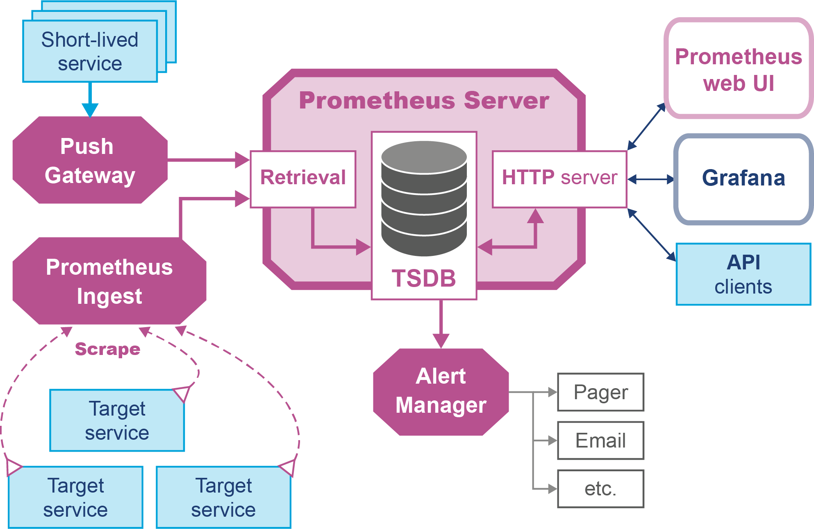
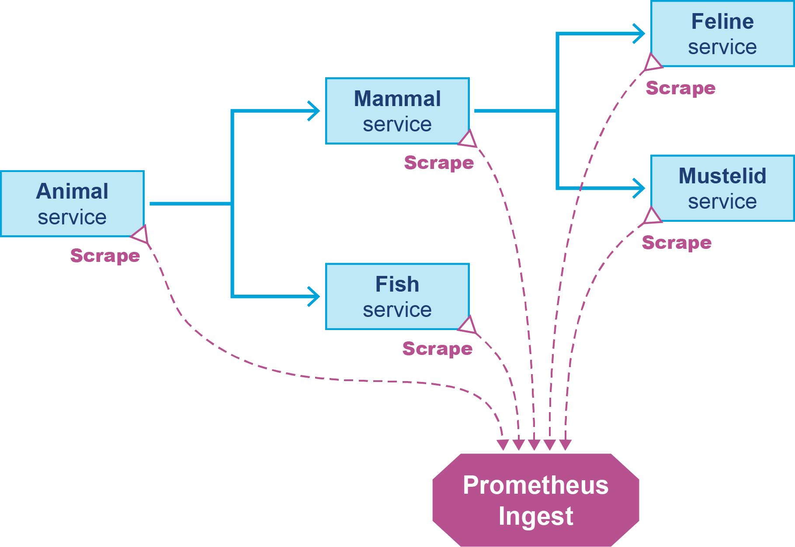
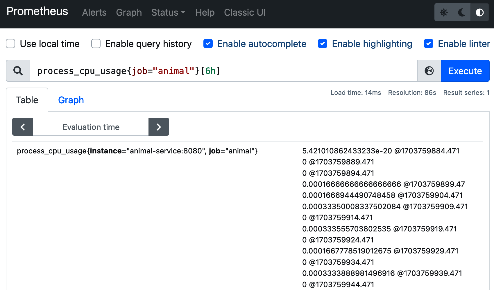
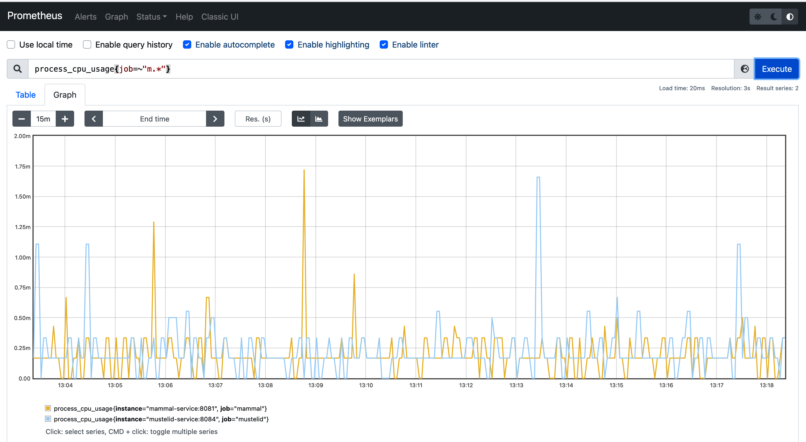
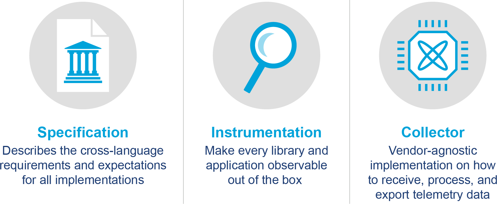
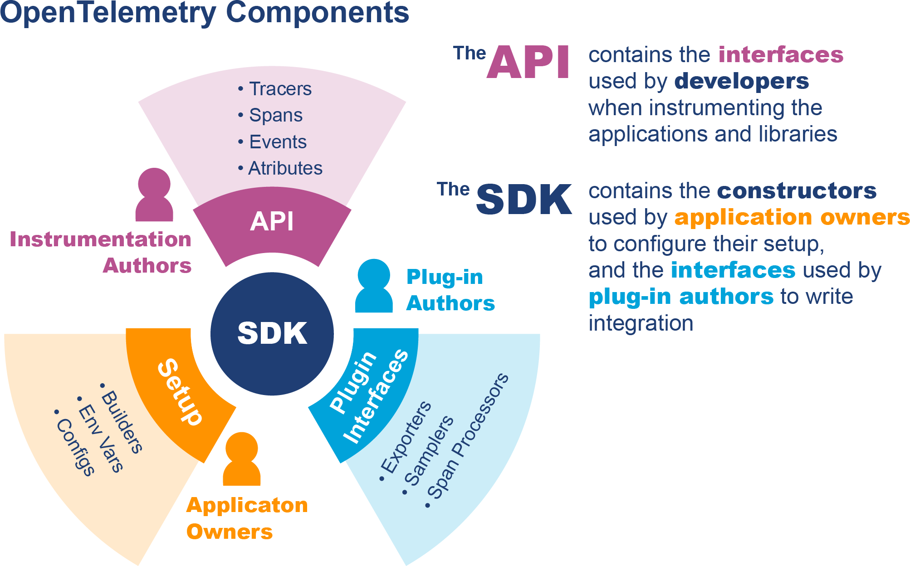
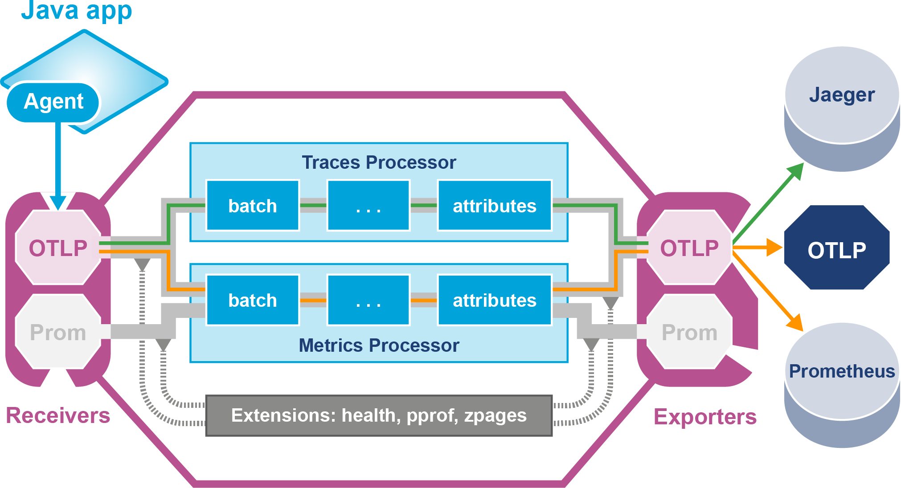

# Chương 11. Triển khai Observability trong Java

Trong chương này, bạn sẽ thấy cách áp dụng các nguyên lý và ý tưởng của chương trước vào các hệ thống Java/JVM production thực sự. Điều này sẽ bao gồm ba trụ cột metric, trace và log.

Chúng tôi sẽ dùng ba công nghệ chính cho các ví dụ — Micrometer, Prometheus và OpenTelemetry. Tuy nhiên, cần hiểu rõ rằng những công nghệ này có phạm vi áp dụng khác nhau, và trên thực tế, nhiều hệ thống thực sẽ dùng một số hoặc tất cả chúng cùng nhau để cung cấp một triển khai observability hoàn chỉnh.

Cũng có nhiều công nghệ khác đang được dùng trong lĩnh vực này, với các mức độ trưởng thành khác nhau — thực tế, một trong những vấn đề khó trong observability là quản lý độ phức tạp của các triển khai khả dĩ.

Vấn đề thứ hai, và liên quan: observability, theo thiết kế, nhằm được dùng để hiểu các hệ thống phần mềm phức tạp và các kiến trúc đa dạng. Điều này có nghĩa là, dù có một tập mẫu hình đang nổi lên, không có một cách "đúng" duy nhất để triển khai observability — giải pháp tốt nhất cho một hệ thống phần mềm cụ thể phụ thuộc vào các chi tiết.

Trong chương này, chúng tôi sẽ dùng Fighting Animals, từ Chương 8, làm ứng dụng ví dụ.

> **CẢNH BÁO**
>
> Các lựa chọn kiến trúc chúng tôi đưa ra để quan sát Fighting Animals không nhất thiết là lựa chọn tốt nhất cho các ứng dụng khác — rất nhiều thứ phụ thuộc vào chi tiết của kiến trúc ứng dụng và môi trường triển khai nó.

Hãy bắt đầu xem thư viện Micrometer để thấy nó có thể được áp dụng vào ứng dụng ví dụ của chúng ta ra sao.

## Giới thiệu Micrometer

Tại thời điểm viết sách (tháng 8/2024), một trong những thư viện metric Java phổ biến nhất — và cũng hiệu quả nhất — là Micrometer, ban đầu được phát triển như một phần của dự án Spring nhưng giờ đã độc lập. Đây là dự án Java/JVM, nên các đội muốn dùng cùng một thư viện xuyên suốt một kiến trúc không đồng nhất sẽ cần cân nhắc các lựa chọn thay thế.

Dự án có lẽ được mô tả tốt nhất là một *facade metric ứng dụng trung lập với nhà cung cấp*, mặc dù nó có các dự án con khác cũng xử lý các loại dữ liệu observability khác, chẳng hạn tracing.

Micrometer tích hợp với một số lượng lớn nguồn dữ liệu và backend metric, bao gồm: Azure Monitor, CloudWatch, Datadog, Dynatrace, Elastic, JMX, New Relic, OpenTelemetry Protocol (OTLP), Prometheus, SignalFx và StatsD.

Đây là thư viện dành cho nhà phát triển ứng dụng dùng, và như vậy, nó kỳ vọng lập trình viên chủ động tạo và ghi lại các metric họ muốn thu thập.

### Meter và Registry

Micrometer cung cấp một thư viện lõi dưới dạng service provider interface (SPI) và dùng các bộ tiêu thụ metric cắm được, là các triển khai dịch vụ export tới nhiều giải pháp của nhà cung cấp và OSS. Điều này tương tự cách một framework logging hoạt động (tức là, cả hai đều là ví dụ của mẫu hình facade). Cấu trúc này cho phép framework xử lý mọi khác biệt giữa các hệ thống metric bằng cách ủy quyền mọi chuyển đổi cần thiết cho các bộ tiêu thụ export dữ liệu.

Chúng ta đã gặp một số khác biệt này ở phần "Mẫu hình kiến trúc cho Metric", và interface của Micrometer được thiết kế đủ tổng quát để dung nạp chúng. Ví dụ, không phải mọi hệ thống metric đều hỗ trợ chú thích chiều cho phép đo, mà thay vào đó dùng cách đặt tên phân cấp.

Cũng có vấn đề về kỷ luật tổng hợp, xác định cách metric được tạo ra từ từng mẫu riêng lẻ. Có hai cách tiếp cận tổng quát, và các hệ thống metric khác nhau đưa ra quyết định khác nhau về việc triển khai cái nào:

**Client-side**
: Các mẫu rời rạc được chuyển thành tốc độ cố định (tổng hợp) trước khi được gửi tới server.

**Server-side**
: Mọi mẫu được gửi qua mạng, và việc tổng hợp diễn ra tại server.

Các hệ thống metric cũng khác nhau ở cách dữ liệu thực sự được truyền (hay xuất bản) tới server. Cũng có hai lựa chọn chính cho điều này:

**Client push**
: Exporter của ứng dụng kết nối tới server và gửi cập nhật cho nó.

**Server poll**
: Backend metric kết nối tới một cổng chuẩn (thường là HTTP) và scrape dữ liệu từ ứng dụng.

Những khía cạnh này là thuộc tính của các exporter và được Micrometer trừu tượng hóa đi. Kết quả là, lập trình viên muốn làm việc từ góc nhìn lập trình Java có thể tập trung vào Micrometer API và không phải lo về chi tiết của backend metric khi triển khai metric trong mã của mình.

Trong API này, `Meter` là interface then chốt để thu thập metric. Các loại meter khác nhau (các loại instrument) được biểu diễn bởi các instance của class triển khai nhiều interface con khác nhau của `Meter`. Meter được đặt tên toàn chữ thường với dấu chấm phân tách, và cái này được dịch, nếu cần, sang sơ đồ đặt tên gốc khi export metric.

Mỗi meter tồn tại trong một registry cụ thể, chẳng hạn các ví dụ sau:

**SimpleMeterRegistry**
: Chỉ trong bộ nhớ, dùng cho phát triển và unit test

**LoggingMeterRegistry**
: Cũng cho phát triển và kiểm thử, nhưng ghi log các meter định kỳ

**CompositeMeterRegistry**
: Giữ nhiều registry (multipub)

**Metrics.globalRegistry**
: Registry toàn cục tĩnh

Micrometer tự động wire một registry test (`SimpleMeterRegistry`) khi dùng trong ứng dụng Spring. Các ứng dụng không phải Spring có thể đơn giản khởi tạo một instance của nó (và điều tương tự đúng với `LoggingMeterRegistry`):

```java
// cho việc kiểm thử ứng dụng không phải Spring
MeterRegistry myRegistry = new SimpleMeterRegistry();

// tạo ra một số đầu ra
MeterRegistry withOutput = new LoggingMeterRegistry();
```

Trong ví dụ Fighting Animals của chúng ta (từ nhánh `micrometer_only`), ban đầu chúng ta muốn dùng một `LoggingMeterRegistry`. Chúng ta wire nó bằng cách cung cấp một Spring bean trong class ứng dụng, như thế này:

```java
@SpringBootApplication
public class AnimalApplication {

    @Bean
    public MeterRegistry basicRegistry() {
        return new LoggingMeterRegistry();
    }

    public static void main(String[] args) {
        SpringApplication.run(AnimalApplication.class, args);
    }
}
```

Điều này sẽ tạo một `LoggingMeterRegistry` mới và làm nó khả dụng để autowiring trong controller. Nó sẽ ghi log các metric ra console, đây là cách hợp lý để bắt đầu với Micrometer. Sau đó, bạn sẽ thấy cách xây dựng thứ gì đó tinh vi hơn và giống với những gì chúng ta thực sự dùng trong production.

Lưu ý rằng phần "ống nước" này phải được làm cho từng class `*Application`, vì các microservice khác nhau chạy trong các container khác nhau.

Micrometer hỗ trợ một loạt loại instrument bao phủ hầu hết các use case phổ biến:

**Counter**
: Đếm mọi sự kiện

**Gauge**
: Giá trị metric đơn lẻ

**Timer**
: Số lượng và tổng thời gian của mọi sự kiện được đo thời gian

**DistributionSummary**
: Theo dõi phân phối của các sự kiện không đo thời gian (histogram)

Các instrument ít phổ biến hơn bao gồm `LongTaskTimer`, `TimeGauge`, `FunctionCounter` và `FunctionTimer`.

Trong Micrometer, các chiều được biểu diễn dưới dạng object `Tag`. Tag cũng được đặt tên theo quy ước chữ thường có dấu chấm và phải có giá trị non-null.

### Counter

Hãy xem một ví dụ mã Micrometer đơn giản dùng counter:

```java
@RestController
public class AnimalController {
    // ...

    private final Counter battlesTotal;

    private final MeterRegistry registry;

    // ...

    public AnimalController(MeterRegistry registry) {
        this.registry = registry;
        this.battlesTotal = this.registry.counter("battles.total");
    }

    @GetMapping("/battle")
    public String makeBattle() throws IOException, InterruptedException {
        battlesTotal.increment();

        // ...
    }
}
```

Một `Counter` của Micrometer đại diện cho một giá trị đơn điệu — giá trị chỉ có thể tăng theo thời gian. Điều này khiến nó phù hợp cho một metric đại diện cho số trận đấu đã diễn ra.

Chúng có thể được tạo bằng method `counter()` trên registry hoặc bằng cách dùng builder theo kiểu fluent và `register()`:

```java
this.battlesTotal = Counter
            .builder("battles.total")
            .description("Total number of battles fought")
            .register(this.registry);
```

Bước cuối cùng trong việc tạo counter là đăng ký nó với registry. Cũng có một số method tùy chọn — như đặt đơn vị và các tag.

### Gauge

Hãy xem một ví dụ khác, lần này dùng `Gauge`. Gauge phức tạp hơn counter một chút, vì nó cần có thể thay đổi trạng thái cả lên lẫn xuống chứ không chỉ tăng đơn điệu.

Trong trường hợp này, chúng ta muốn theo dõi tỷ lệ phần trăm động vật họ mèo (feline) đã được thấy theo thời gian. Cho việc này, chúng ta cần một class đóng vai trò vật mang một giá trị `double` có thể thay đổi. Không thực sự có gì phù hợp trong JDK, nên chúng ta tạo class riêng, `FelinePercent`, kế thừa `java.lang.Number`.

> **CẢNH BÁO**
>
> Các thư viện concurrency của Java không cung cấp class `AtomicDouble` — vốn đáng lẽ là lựa chọn hiển nhiên (vì tính thay đổi được chứ không phải khía cạnh đồng thời).

Mã kết quả cho controller trông gần như thế này (chi tiết được rút gọn để làm rõ phần mã observability):

```java
@RestController
public class MammalController {
  // ...
    private final FelinePercent felinePercent;
    private int felineCount = 0;
    private int mustelidCount = 0;

    private final MeterRegistry registry;

    public MammalController(MeterRegistry registry) {
        this.registry = registry;
        felinePercent = this.registry.gauge("battles.felinePercent",
          new FelinePercent(0.5));
    }

    @GetMapping("/getAnimal")
    public String getAnimal() throws IOException, InterruptedException {
        // ...

        var id = (int) (SERVICES.size() * Math.random());
        if (id == 0) {
          mustelidCount += 1;
        } else {
          felineCount += 1;
        }
        felinePercent.setValue((double) felineCount / (double) (felineCount
          + mustelidCount));

        // ...
    }
}
```

Trong ví dụ này, lời gọi then chốt là `registry.gauge()`, tạo một instance `Gauge` mới và đăng ký nó với registry. Trong class `MeterRegistry` của Micrometer, dạng đơn giản nhất của method `gauge()` là như sau:

```java
@Nullable
public <T extends Number> T gauge(String name, T number) {
    return this.gauge((String)name, (Iterable)Collections.emptyList(),
      (Number)number);
}
```

Lưu ý rằng generic yêu cầu class gauge phải kế thừa `Number`, nên chúng ta dùng định nghĩa class đơn giản này:

```java
public final class FelinePercent extends Number {
    private volatile double value;

    public FelinePercent(double v) {
      if (v < 0.0 || v > 1.0) {
        throw new IllegalArgumentException("Require 0 < felinePercent < 1");
      }
      value = v;
    }

    public void setValue(double v) {
      if (v < 0.0 || v > 1.0) {
        throw new IllegalArgumentException("Require 0 < felinePercent < 1");
      }
      value = v;
    }

    @Override
    public int intValue() {
      return (int) value;
    }

    @Override
    public long longValue() {
        return (long) value;
    }

    @Override
    public float floatValue() {
        return (float) value;
    }

    @Override
    public double doubleValue() {
      return value;
    }
}
```

Khi một instance của `FelinePercent` được truyền cho method `gauge()`, nó thực chất tạo ra một watcher cho trạng thái — tỷ lệ phần trăm động vật họ mèo đã được thấy.

Lập trình viên chỉ cần cập nhật giá trị gauge, và phần còn lại của hệ thống metric được trừu tượng hóa đi. Watcher cập nhật giá trị gauge bất cứ khi nào cần — nhưng lưu ý rằng điều này là theo yêu cầu, nên không phải mọi thay đổi trạng thái đều nhất thiết được quan sát, chỉ giá trị hiện tại tại thời điểm cần cập nhật.

### Meter Filter

Micrometer cũng triển khai *meter filter* — chúng cung cấp kiểm soát lớn hơn về:

- Cách và khi nào meter được đăng ký
- Loại thống kê nào chúng phát ra

Là ví dụ đầu tiên, filter có thể được dùng để điều chỉnh metric sang một tập quy ước mới (hoặc cũ) mà không cần thay đổi mã trên diện rộng.

Meter filter cung cấp ba chức năng cơ bản:

- Từ chối/chấp nhận việc đăng ký meter
- Biến đổi meter (đổi tên metric, tag, đơn vị, v.v.)
- Cấu hình thống kê phân phối

Lưu ý rằng chức năng cuối chỉ có thể được cấu hình cho các loại meter phù hợp — nghĩa là timer và distribution summary. Chúng tôi sẽ giải thích chức năng cuối này chi tiết hơn ở phần sau của mục này khi gặp các loại instrument mà nó áp dụng.

Filter được biểu diễn dưới dạng các triển khai của interface `MeterFilter`. Chúng có thể được thêm theo cách lập trình, thường bằng cách dùng một factory method, như thế này:

```java
// Dòng tiếp theo ngăn các metric nội bộ được xuất bản
this.registry.config()
    .meterFilter(MeterFilter.denyNameStartsWith("internal"));
```

Chúng ta thực ra không có metric nội bộ nào trong ví dụ, nhưng đây là minh họa tốt về cách dùng filter, và việc ngăn metric nội bộ được xuất bản là use case phổ biến.

> **GHI CHÚ**
>
> `MeterFilter` là một interface, nhưng không phải functional interface, vì nó có ba method không static, tất cả đều là default method (nó hoàn toàn không có method bắt buộc nào).

Chúng ta cũng có thể tạo object filter một cách tường minh. Ví dụ, filter từ ví dụ trước tương đương với mã này:

```java
new MeterFilter() {
    @Override
    public MeterFilterReply accept(Meter.Id id) {
        if (id.getName().startsWith("internal")) {
          return MeterFilterReply.DENY;
        }
        return MeterFilterReply.NEUTRAL;
    }
};
```

Enum `MeterFilterReply` có ba giá trị khả dĩ: `DENY`, `NEUTRAL` và `ACCEPT`. Giá trị `DENY` ngăn meter được đăng ký, trong khi `ACCEPT` đăng ký nó ngay lập tức mà không xem xét thêm filter nào. `NEUTRAL` nghĩa là filter không có ý kiến gì về meter, và filter ứng dụng tiếp theo cho metric này (nếu có) nên được tham vấn.

> **GHI CHÚ**
>
> Việc triển khai `meterFilter()` là hoàn toàn cộng dồn (additive), nên lập trình viên nên cân nhắc thứ tự các filter được thêm vào chuỗi.

Filter cũng có thể được dùng cho các use case nâng cao hơn, chẳng hạn dùng chúng làm customizer cho một `CompositeMeterRegistry`. Điều này cho phép các mẫu hình như gửi một tập con metric tới một backend phụ trợ. Điều này có thể rất hữu ích trong triển khai production, nhưng thảo luận đầy đủ về nó nằm ngoài phạm vi cuốn sách này.

### Timer

Timer là loại dữ liệu phức tạp hơn, lưu ít nhất ba giá trị bên trong:

- Tổng của mọi giá trị được ghi
- Số lượng các giá trị đã được ghi
- Giá trị lớn nhất thấy trong một cửa sổ thời gian, dưới dạng gauge

Timer có thể được cấu hình để phát ra các thống kê bổ sung, chẳng hạn dữ liệu histogram, phân vị tính trước, hoặc thậm chí các ranh giới service level objective (SLO).

Hãy xem một ví dụ và tập trung vào mã timer trên nhánh `micrometer_only`. Đây là mã cho việc dùng timer trong `AnimalController`:

```java
@RestController
public class AnimalController {
    // ...

    private final Timer responseTimer;

    private final MeterRegistry registry;

    // ...

    public AnimalController(MeterRegistry registry) {
        this.registry = registry;

        // ...

        this.responseTimer = Timer
                 .builder("response.time")
                 .description("Response time")
                 .register(registry);
    }

    @GetMapping("/battle")
    public String makeBattle() throws Exception {
        Callable<String> callable = () -> {
          // Gửi hai request và trả về response body làm phản hồi
          var good = fetchRandomAnimal();
          var evil = fetchRandomAnimal();
          return String.format("""
{ "good": "%s", "evil": "%s" }""", good, evil);
        };

        // ...

        return responseTimer.recordCallable(callable);
    }
}
```

Trong mã này, chúng ta thiết lập một khối mã dưới dạng `Callable` rồi truyền nó cho method `recordCallable()` của timer. Điều này sẽ thực thi khối mã và ghi lại thời gian cần để hoàn thành nó.

Timer cũng có thể xử lý mã được biểu diễn dưới dạng `Runnable` và `Supplier`. Method `Timer` phù hợp được gọi là `record()` trong những trường hợp này — điều này là do xung đột chữ ký giữa `Callable` và `Supplier`.

Để kết thúc phần thảo luận về timer của Micrometer, chúng tôi nên chỉ ra rằng nhìn chung, timer không phải cách tiếp cận được ưa thích để đo hiệu năng của các method trong hệ phân tán. Distributed tracing, chẳng hạn như cái được OpenTelemetry triển khai, thường là cách tiếp cận tốt hơn nhiều cho điều này. Chúng ta sẽ thảo luận cách tiếp cận này ở phần sau của chương.

Vậy tiếp theo, hãy thảo luận loại instrument cuối cùng chúng ta muốn xem — `DistributionSummary`.

### Distribution Summary

Chúng ta vừa gặp timer, và chúng cung cấp thống kê về phân phối các phép đo thời gian mà chúng đã thấy. Trên thực tế, chúng là trường hợp đặc biệt của trường hợp tổng quát hơn là distribution summary.

Một distribution summary, như tên gọi, là một instrument dùng để tóm tắt toàn bộ một tập (hay phân phối) các giá trị. Chúng cần nhiều bộ nhớ hơn một counter đơn giản, vì chúng cần lưu nhiều dữ liệu hơn, nhưng chúng vẫn đại diện cho một biểu diễn có mất mát của một phân phối tổng thể.

> **MẸO**
>
> Distribution summary nên được dùng cho những thứ không được đo thời gian. Nếu đại lượng đo là một khoảng thời gian, thì nên dùng timer thay thế.

Hãy xem một ví dụ và đưa một `DistributionSummary` vào `AnimalController`:

```java
@RestController
public class AnimalController {
    // ...

    private static final Random random = new Random();

    private final DistributionSummary winSummary;

    private final MeterRegistry registry;

    public AnimalController(MeterRegistry registry) {

        this.registry = registry;

        // Tóm tắt sức mạnh của bên tấn công khi nó thắng
        this.winSummary = registry.summary("attacker.win.size");

        // ...
    }
}
```

Để minh họa cho summary này, chúng ta cũng sẽ đưa vào một số mã cho method `resolveFight()` trong `AnimalController`. Mục tiêu là mô phỏng một trận đấu giữa hai con vật và trả về bên thắng. Chúng ta chuẩn hóa sức mạnh của bên phòng thủ về 0,5 rồi dùng một số ngẫu nhiên cho sức mạnh của bên tấn công để xác định người thắng:

```java
@GetMapping("/fight/{a}/{d}")
public String resolveFight(
    @PathVariable("a") String attacker, @PathVariable("d") String defender) {
    final String winner;
    // Sức mạnh bên phòng thủ được lấy là 0.5
    var attackerStrength = random.nextDouble();
    if (attackerStrength > 0.5) {
      winner = attacker;
      // Thêm vào distribution summary
      winSummary.record(attackerStrength);
    } else {
      winner = defender;
    }
    return String.format("""
{ "winner": "%s"}""", winner);
}
```

Nếu bên tấn công thắng, "sức mạnh" của họ được ghi vào distribution summary. Điều này sẽ tạo ra một phân phối đều các giá trị giữa 0,5 và 1,0, mà `DistributionSummary` sau đó sẽ tóm tắt.

Chúng ta sẽ dùng `LoggingMeterRegistry` cho ví dụ này, và đầu ra kết quả trông như sau:

```
animal-service_1  | 2024-01-14T08:27:31.748Z  INFO 1 --- [trics-publisher
i.m.c.i.logging.LoggingMeterRegistry     : attacker.win.size{} ↩
throughput=0.183333/s mean=0.699785 max=0.98829
```

Thiết lập mặc định cho distribution summary đủ tốt cho nhiều mục đích, nhưng có thể dùng metric filter để thiết lập cấu hình nâng cao hơn. Chìa khóa cho việc này là method thứ ba trong số các method không static của interface `MeterFilter`, `configure()`, được định nghĩa như sau:

```java
@Nullable
default DistributionStatisticConfig configure(Meter.Id id,
              DistributionStatisticConfig config) {
    return config;
}
```

Triển khai mặc định đại diện cho một phép biến đổi đồng nhất của cấu hình, nhưng nhìn chung, một triển khai tùy chỉnh sẽ hợp nhất cấu hình được cung cấp với cấu hình đầu vào.

Bằng cách định nghĩa một filter tùy chỉnh ghi đè method này, có thể cấu hình các thống kê phân phối tùy chọn (bên cạnh những thứ cơ bản là count, total và max). Những thống kê bổ sung này có thể bao gồm phân vị tính trước, SLO và histogram.

Ví dụ, để cấu hình các phân vị "đuôi dài" tính trước (mà chúng ta gặp ở Chương 2) cho mọi metric JVM, chúng ta có thể dùng một filter như sau:

```java
new MeterFilter() {
    @Override
    public DistributionStatisticConfig configure(Meter.Id id,
                  DistributionStatisticConfig config) {
        if (id.getName().startsWith("jvm")) {
            return DistributionStatisticConfig.builder()
                    .publishPercentiles(0.9, 0.99, 0.999, 0.9999)
                    .build()
                    .merge(config);
        }
        return config;
    }
};
```

Điều này sẽ thêm phân vị thứ 90, 99, 99.9 và 99.99 vào mọi metric JVM — rất hữu ích để quan sát phân phối phi chuẩn của nhiều metric JVM.

Ở điểm này cần lưu ý rằng count, sum và một số dữ liệu khác gắn với distribution summary có thể được tổng hợp lại qua các chiều (hoặc thậm chí qua các instance). Tuy nhiên, các giá trị phân vị tính trước *không* thể được tổng hợp lại — cố làm vậy là một lỗi nghiêm trọng và quá phổ biến.

Lý do là cách các phân vị được tạo ra khiến chúng đặc thù cho mỗi tập dữ liệu. Phân vị chính xác trên toàn bộ tập dữ liệu chỉ có thể được tính bằng cách kết hợp các tập dữ liệu gốc rồi tính phân vị. Một khi phân vị đã được tính, dữ liệu đã bị mất, và việc tổng hợp lại các phân vị sẽ không cho ra kết quả đúng ngoại trừ trong các trường hợp đặc biệt bệnh lý.

Để kết thúc phần thảo luận về Micrometer, hãy xem nhanh hỗ trợ metric JVM mà thư viện cung cấp sẵn.

### Runtime Metric

Bên cạnh các metric do lập trình viên định nghĩa, Micrometer cũng cung cấp khả năng thu thập và export một tập metric gắn với JVM và các phần khác của runtime ứng dụng. Có một số tập metric loại này có thể được thu thập.

Interface then chốt cho việc này là `MeterBinder`, được định nghĩa như sau:

```java
public interface MeterBinder {
    void bindTo(@NonNull MeterRegistry var1);
}
```

Hai trong số các triển khai quan trọng nhất của nó là metric bộ nhớ JVM và metric bộ xử lý, như trong ví dụ này:

```java
@RestController
public class AnimalController {
  // ...

    private final MeterRegistry registry;

    // ...

    public AnimalController(MeterRegistry registry) {
      this.registry = registry;

        new ProcessorMetrics().bindTo(this.registry);
        new JvmMemoryMetrics().bindTo(this.registry);
    }

    // ...
}
```

Chìa khóa cho việc này là method `bindTo()`, làm cho registry nhận biết các metric ở mức JVM. Nó không thực sự cần thiết cho ứng dụng Spring Boot, vì framework tự động cài chúng, nhưng với các ứng dụng khác, chúng phải được bật tường minh. Các tập metric khác cũng có thể được thu thập, nhưng đây là một số cái phổ biến nhất.

Để đưa ra vài ví dụ cụ thể, class `JvmMemoryMetrics` cung cấp các metric như `jvm.memory.used` và `jvm.memory.max`, trong khi `ProcessorMetrics` cung cấp các metric như `system.cpu.usage` và `system.load.average.1m`. Một trường hợp quan trọng khác là metric từ một `ExecutorService`, có thể được bật như sau: `new ExecutorServiceMetrics(executor, executorServiceName, tags).bindTo(registry)` và cho phép giám sát dễ dàng các thread pool.

Sau khi đã gặp các instrument cơ bản và chức năng do Micrometer cung cấp, hãy chuyển sang gặp Prometheus một cách bài bản và xem chúng ta có thể tích hợp nó với Micrometer ra sao.

## Giới thiệu Prometheus cho lập trình viên Java

Chúng tôi đã giới thiệu Prometheus rất ngắn gọn ở Chương 8 và nhắc đến nó vài lần ở chương trước, nhưng chưa trình bày kỹ về công nghệ này. Trong phần này, chúng ta sẽ thảo luận nó chi tiết hơn, đặc biệt là cách nó có thể được lập trình viên và dự án Java sử dụng.

### Tổng quan kiến trúc Prometheus

Tóm lại, Prometheus là một dự án CNCF (ban đầu được tạo ra tại SoundCloud) cung cấp một backend metric, cơ chế thu thập và nhiều tích hợp. Nó được thiết kế để xử lý dữ liệu chuỗi thời gian thuần số, đều đặn và không nhằm dùng cho những thứ như log hay trace.

Trong các lựa chọn kiến trúc metric đã thảo luận trước đó, Prometheus dùng server poll, mà nó gọi là *scraping*. Điều này có nghĩa mọi service bạn muốn giám sát bằng Prometheus phải cung cấp một HTTP endpoint mà từ đó Prometheus scraper sẽ thu thập metric. Đến lượt nó, điều này có nghĩa Prometheus cũng dựa vào việc các service được biết hoặc có thể khám phá được, điều này có khả năng đặt ra vấn đề cho các job vòng đời ngắn.

Để xử lý những thách thức này, và cũng để tích hợp tốt hơn với các công nghệ như OpenTelemetry vốn dùng kiến trúc dựa trên push, Prometheus cũng cung cấp khả năng *remote write*. Điều này cũng phù hợp hơn với mô hình bảo mật của các hệ thống như Kubernetes.

Kiến trúc tổng thể của một triển khai Prometheus (tương đối phức tạp) có thể thấy ở Hình 11-1.



*Hình 11-1. Kiến trúc Prometheus (nguồn: tài liệu Prometheus)*

Như sơ đồ làm rõ, có một số lượng lớn thành phần, và tổ hợp chính xác sẽ phụ thuộc vào các lựa chọn kiến trúc được đưa ra. Do đó, điều quan trọng là hỏi để làm rõ khi mọi người nói rằng họ "đang dùng Prometheus."

Prometheus cung cấp một ngôn ngữ truy vấn tên PromQL, được dùng để viết truy vấn đối với dữ liệu thu thập được. Bất chấp cái tên, PromQL không phải SQL, mà là một ngôn ngữ chuyên biệt theo lĩnh vực (DSL) được thiết kế để dùng cho truy vấn dữ liệu chuỗi thời gian thay vì dữ liệu quan hệ truyền thống. Dữ liệu truy vấn được sau đó có thể được trực quan hóa theo nhiều cách khác nhau.

Prometheus đi kèm một UI thô sơ, nhưng cái này thường không đủ cho sử dụng production. Thay vào đó, phổ biến hơn là các công cụ khác xếp chồng lên Prometheus — các công cụ vẽ đồ thị mã nguồn mở Grafana là lựa chọn phổ biến.

Nhìn chung, lập trình viên và người làm DevOps thường tương tác với Prometheus theo hai cách — hoặc qua UI hoặc bằng cách gọi mã thu thập metric từ trong mã ứng dụng của họ. Tuy nhiên, một nhận thức chung về kiến trúc tổng thể của Prometheus (bao gồm khả năng lưu trữ dữ liệu của nó) là hữu ích để hiểu nó khớp vào bức tranh observability tổng thể ra sao — ngay cả khi bạn không trực tiếp chịu trách nhiệm bảo trì triển khai đó.

### Dùng Prometheus với Micrometer

Trong các ví dụ ban đầu, chúng ta dùng `LoggingMeterRegistry` để xuất metric ra console. Đây tất nhiên không phải cấu hình production thực tế. Trong phần này, chúng ta sẽ thấy cách dùng Prometheus làm backend metric cho Micrometer.

Nhớ rằng chúng ta muốn dùng mẫu hình facade để trừu tượng hóa đi chi tiết của backend metric. Ý tưởng là không nên có mã đặc thù Prometheus nào trong ứng dụng. Điều này khiến việc kiểm thử dễ hơn, vì nó có thể chạy với một phụ thuộc metric giả hoặc mock.

Đôi khi người ta nói rằng việc dùng facade nghĩa là có thể hoán đổi các thành phần, chẳng hạn thay Prometheus bằng một backend metric khác mà không thay đổi mã ứng dụng. Khả năng này — thay đổi phần "ống nước" observability mà không cần thay đổi ứng dụng — có thể thực sự quan trọng, và nó là một trong những động lực chính cho việc chuẩn hóa.

Nói vậy, thường có những chi tiết khiến điều này không đơn giản như vậy trên thực tế — vendor lock-in có thể tinh vi hơn chúng ta nghĩ. Cũng đúng rằng trong nhiều trường hợp một thay đổi lớn về thành phần đi kèm với cơ hội xem lại kiến trúc tổng thể và thực hiện các thay đổi khác nữa.

Tuy nhiên, bản chất facade của kiến trúc Micrometer khiến việc dùng Prometheus làm backend metric tương đối đơn giản. Để triển khai Prometheus trong ứng dụng, chúng ta có thể dùng bản chất SPI của thư viện Micrometer. Tất cả những gì chúng ta cần làm là thêm một phụ thuộc nữa vào dự án:

```xml
<dependency>
  <groupId>io.micrometer</groupId>
  <artifactId>micrometer-registry-prometheus</artifactId>
  <scope>runtime</scope>
</dependency>
```

Điều này cung cấp một exporter bổ sung có thể dùng để gửi metric tới Prometheus.

Để thấy điều này trong `fighting-animals`, chúng ta cần thực hiện vài thay đổi. Để rõ ràng hơn, việc này được làm trên một nhánh riêng (`micrometer_with_prom`).

Chúng ta cần thêm dòng này vào *application.properties*:

```
management.endpoints.web.exposure.include=health,info,prometheus
```

Chúng ta đang dùng Micrometer để trực tiếp phơi bày metric từ ứng dụng dưới dạng một endpoint có thể scrape được mà Prometheus có thể kết nối tới.

Bạn cũng có thể loại bỏ logging registry để giảm lượng chi tiết trong log:

```java
// Loại bean này để giảm nhiễu log
@Bean
public MeterRegistry basicRegistry() {
  return new LoggingMeterRegistry();
}
```

Kiến trúc kết quả ở đây vẫn khá đơn giản, như thấy ở Hình 11-2.



*Hình 11-2. Fighting Animals với Prometheus*

Để cấu hình Prometheus cho cấu hình kiến trúc này, chúng ta cần thêm một service mới vào file *docker-compose.yml*:

```yaml
# Prometheus
prom:
  container_name: prometheus
  image: prom/prometheus
  command:
    - "--config.file=/config/prometheus.yml"
  ports:
    - "9090:9090"
  user: root
  volumes:
    - './config:/config'
    - './target/data/prometheus:/prometheus'
```

Cái này tham chiếu đến một file cấu hình mới, *prometheus.yml*, phần khung của nó trông như sau:

```yaml
global:
  # Đặt scrape interval là 15 giây. Mặc định là 1 phút.
  scrape_interval:     15s

  # Đánh giá quy tắc mỗi 15 giây. Mặc định là 1 phút.
  evaluation_interval: 15s
  # scrape_timeout được đặt theo mặc định toàn cục (10s).

# ...

scrape_configs:

- job_name: prometheus
  metrics_path: /metrics
  scheme: http
  static_configs:
  - targets:
     - localhost:9090

- job_name: animal
  metrics_path: /actuator/prometheus
  scrape_interval: 5s
  static_configs:
    - targets:
      - animal-service:8080

# Các service khác được cấu hình tương tự
```

Đây là cấu hình đơn giản, nhưng nó đã được test để hoạt động trên một mạng thực chứ không phải mọi thứ chạy trên `localhost`. Điều này khá có chủ đích, vì nhiều ví dụ có sẵn trên internet không hoạt động trong môi trường mạng thực — chỉ trên `localhost`.

Với cấu hình của chúng ta, mỗi service sẽ phơi bày metric của nó trên cùng URI (`/actuator/prometheus`) ở cổng khác nhau, và Prometheus sẽ scrape tất cả chúng. Đầu ra Prometheus điển hình trông như sau (từ animal service, triển khai tại URL như `http://<Target IP>:8080/actuator/prometheus`):

```
# HELP system_load_average_1m The sum of the number of runnable entities queued
to available processors and the number of runnable entities running on the
available processors averaged over a period of time
# TYPE system_load_average_1m gauge
system_load_average_1m 0.2
# HELP process_files_open_files The open file descriptor count
# TYPE process_files_open_files gauge
process_files_open_files 34.0
# HELP jvm_classes_loaded_classes The number of classes that are currently
loaded in the Java virtual machine
# TYPE jvm_classes_loaded_classes gauge
jvm_classes_loaded_classes 8934.0
# HELP tomcat_sessions_active_current_sessions
# TYPE tomcat_sessions_active_current_sessions gauge
tomcat_sessions_active_current_sessions 0.0
# HELP jvm_memory_committed_bytes The amount of memory in bytes that is ↩
committed for the Java virtual machine to use
# TYPE jvm_memory_committed_bytes gauge
jvm_memory_committed_bytes{area="nonheap",id="CodeHeap 'profiled nmethods'",}
  9109504.0
jvm_memory_committed_bytes{area="heap",id="G1 Survivor Space",} 4194304.0
# ... Các metric JVM khác được lược bỏ cho ngắn gọn ...
jvm_memory_committed_bytes{area="nonheap",id="CodeHeap 'non-profiled nmethods'",}
  3145728.0
```

Lưu ý rằng nhiều trong số các metric này là metric JVM chứ không phải metric ứng dụng. Nếu nhìn xuống sâu hơn trong đầu ra, chúng ta có thể thấy một số metric tùy chỉnh của mình:

```
# HELP battles_total
# TYPE battles_total counter
battles_total 5.0
```

Prometheus tự giám sát chính nó bằng cùng cơ chế, nên chúng ta có thể thấy các metric của Prometheus nữa: `http://<Target IP>:9090/metrics`:

```
# HELP go_gc_duration_seconds A summary of the pause duration of garbage ↩
collection cycles.
# TYPE go_gc_duration_seconds summary
go_gc_duration_seconds{quantile="0"} 3.5e-05
go_gc_duration_seconds{quantile="0.25"} 7.8507e-05
go_gc_duration_seconds{quantile="0.5"} 9.9929e-05
go_gc_duration_seconds{quantile="0.75"} 0.000132907
go_gc_duration_seconds{quantile="1"} 0.000325268
go_gc_duration_seconds_sum 0.018079852
go_gc_duration_seconds_count 164
# HELP go_goroutines Number of goroutines that currently exist.
# TYPE go_goroutines gauge
go_goroutines 47
# HELP go_threads Number of OS threads created.
# TYPE go_threads gauge
go_threads 18
# HELP go_info Information about the Go environment.
# TYPE go_info gauge
go_info{version="go1.17.5"} 1
# ....
# HELP net_conntrack_dialer_conn_attempted_total Total number of connections
attempted by the given dialer a given name.
# TYPE net_conntrack_dialer_conn_attempted_total counter
net_conntrack_dialer_conn_attempted_total{dialer_name="alertmanager"} 0
net_conntrack_dialer_conn_attempted_total{dialer_name="animal"} 42
net_conntrack_dialer_conn_attempted_total{dialer_name="default"} 0
net_conntrack_dialer_conn_attempted_total{dialer_name="feline"} 41
net_conntrack_dialer_conn_attempted_total{dialer_name="fish"} 41
net_conntrack_dialer_conn_attempted_total{dialer_name="mammal"} 42
net_conntrack_dialer_conn_attempted_total{dialer_name="mustelid"} 42
net_conntrack_dialer_conn_attempted_total{dialer_name="prometheus"} 2
```

Nhóm metric đầu tiên là các metric runtime của Go, bao gồm metric GC và số lượng goroutine. Như bạn thấy, Prometheus được viết bằng Go, và ngôn ngữ Go hỗ trợ goroutine — các thread nhẹ được Go runtime quản lý. Chúng rất giống khái niệm virtual thread của Java, mà chúng ta sẽ thảo luận ở Chương 14.

Điều này cung cấp một ví dụ về nguyên lý kiến trúc quan trọng mà Prometheus minh họa — các hệ thống hỗ trợ và truyền tải tín hiệu observability thì bản thân chúng cũng nên quan sát được và được thiết kế tốt từ góc độ observability.

UI Prometheus cơ bản có thể tìm thấy tại `http://<Target IP>:9090/graph` và được thể hiện ở Hình 11-3.



*Hình 11-3. UI truy vấn của Prometheus*

Chuỗi truy vấn của chúng ta ở đây là `process_cpu_usage{job="animal"}[6h]`, là một truy vấn PromQL hỏi mọi điểm dữ liệu biểu diễn mức sử dụng CPU của job `animal` trong sáu giờ qua. Đây được gọi là *range vector*, vì nó trả về một vector các chuỗi thời gian trên một khoảng thời gian.

Lưu ý rằng cái này được hiển thị ở chế độ Table, ở dạng: `<value> @ <timestamp>`. Nếu chúng ta chuyển sang chế độ đồ thị, thì cần đổi truy vấn, vì việc vẽ đồ thị đòi hỏi một biểu thức là *instant vector*.

Chuỗi thời gian cho truy vấn `process_cpu_usage{job=~"m.*"}` được mô tả bằng đồ họa ở Hình 11-4. Truy vấn này trả về metric CPU cho các job bắt đầu bằng chữ `m` — trong trường hợp của chúng ta là `mammal` và `mustelid`. Nó dùng hỗ trợ biểu thức chính quy của Prometheus, `=~`, rất hữu ích để chọn metric.



*Hình 11-4. Đồ thị Prometheus*

Thảo luận đầy đủ về PromQL nằm ngoài phạm vi cuốn sách này — nên tham khảo tài liệu Prometheus cho bất kỳ công việc nghiêm túc nào, cũng như tài liệu cho các thành phần phụ trợ như Grafana.

Thay vào đó, hãy chuyển sang thảo luận công nghệ observability thứ ba, và có thể nói là quan trọng nhất của chúng ta — OpenTelemetry.

## Giới thiệu OpenTelemetry

Trong phần này, chúng tôi sẽ giới thiệu đúng cách về OpenTelemetry (hay OTel), một chuẩn mở mới từ CNCF cho dữ liệu observability, mà chúng tôi đã đề cập ở Chương 8. Dự án được hình thành từ việc sáp nhập các dự án OpenTracing (tracing) và OpenCensus (metric) và giờ là một chuẩn mở đang nhanh chóng được chấp nhận, thể hiện sự tăng trưởng nhanh trong việc áp dụng.

> **GHI CHÚ**
>
> OpenTracing và OpenCensus giờ đã bị deprecated, và mọi phát triển mới nên dùng OpenTelemetry.

Sự tăng trưởng này còn ấn tượng hơn khi bạn xét rằng dự án chỉ mới vài năm tuổi và chỉ đạt bản phát hành 1.0 trong năm 2023. Dự án giờ đã ổn định và sẵn sàng cho sử dụng production, và đã được nhiều công ty và đội nhóm nhiệt tình áp dụng — và xu hướng đó có vẻ sẽ tiếp tục.

OTel có thể được dùng trong nhiều hoàn cảnh, nhưng có lẽ phù hợp nhất trong các ứng dụng triển khai trên cloud, dựa trên microservice, và nhìn chung phù hợp cho các hệ phân tán không đồng nhất (đa ngôn ngữ).[^1]

### OpenTelemetry là gì?

Một trong những điểm mạnh then chốt của OTel là nó không cố cung cấp giải pháp cho mọi vấn đề mà tập trung vào lĩnh vực cốt lõi của mình. OTel không phải là bộ thu nạp dữ liệu hay backend observability, và do đó chỉ là một thành phần của một hệ thống observability hoàn chỉnh.

Như chúng tôi đã đề cập ngắn gọn ở Chương 10, OTel tập trung vào việc instrumentation ứng dụng và vận chuyển dữ liệu tới một hệ thống observability riêng biệt, bên ngoài.

Các lĩnh vực dự án chính của OpenTelemetry được thể hiện ở Hình 11-5.



*Hình 11-5. Các mối quan tâm của dự án OpenTelemetry*

Đặc tả định nghĩa các định dạng và quy ước cho metric, log và trace theo cách độc lập ngôn ngữ, cùng một giao thức để vận chuyển dữ liệu tới backend observability.

Các triển khai ngôn ngữ khác nhau cung cấp một tập API và SDK có thể dùng để instrument các ứng dụng viết bằng hầu như mọi ngôn ngữ chính thống, và các tích hợp với nhiều framework. Triển khai Java cũng cung cấp một Java agent để instrument ứng dụng mà không cần thay đổi mã.

Cuối cùng, OpenTelemetry Collector là một công cụ hữu ích có thể thu thập dữ liệu từ ứng dụng và gửi nó tới nhiều backend khác nhau, sau khi có thể đã thực hiện xử lý và làm giàu dữ liệu. Bạn có thể coi nó như một router hay "trạm chuyển mạch" cũng có thể đóng vai trò bộ dịch giao thức cho dữ liệu observability.

Những lựa chọn thiết kế này cho phép OTel hỗ trợ nhiều lựa chọn kiến trúc dữ liệu observability — nó nhằm áp dụng rộng rãi chứ không mang tính áp đặt.

Ở mức phần mềm, các thành phần được cung cấp cho instrumentation có thể thấy ở Hình 11-6.



*Hình 11-6. Các API và SDK của OpenTelemetry*

SDK là khía cạnh chính của OpenTelemetry mà người dùng cuối sẽ tương tác. Nó chứa hai thành phần chính:

- Các constructor được chủ sở hữu ứng dụng dùng để cấu hình triển khai của họ
- Các interface được tác giả plug-in dùng để viết các tích hợp

Đây là phần mà các đội triển khai OpenTelemetry ngay từ đầu sẽ dùng.

API chứa các interface được lập trình viên dùng để viết instrumentation riêng cho ứng dụng và thư viện của họ.

> **GHI CHÚ**
>
> Nếu một kỹ sư muốn đóng góp mã cho dự án OpenTelemetry, thì điểm khởi đầu phù hợp cho đóng góp của họ thường là cung cấp instrumentation mới cho một thư viện hoặc framework mã nguồn mở hiện chưa có hỗ trợ OTel cụ thể.

OTel đặt nhiều trọng tâm vào tính ổn định và tương thích ngược. Mã tuân theo quy ước semantic versioning và cung cấp, ở mức tối thiểu, hỗ trợ dài hạn cho các phiên bản ổn định của API và SDK:[^2]

**API**
: Đảm bảo hỗ trợ ba năm

**Plug-in interface**
: Đảm bảo hỗ trợ một năm

**Constructor**
: Đảm bảo hỗ trợ một năm

Với Java, có bốn dự án chính dưới tổ chức GitHub `open-telemetry`:

**opentelemetry-java**
: Các thành phần lõi bao gồm API và SDK

**opentelemetry-java-instrumentation**
: Instrumentation thư viện và agent auto instrumentation

**opentelemetry-java-contrib**
: Các thư viện hữu ích và độc lập

**opentelemetry-java-examples**
: Các ví dụ instrumentation thủ công[^3]

Triển khai Java ban đầu tập trung vào trace và metric, với log đạt 1.0 vào cuối năm 2023.

### Tại sao chọn OTel?

Thị trường application performance monitoring (APM) ban đầu bị chi phối bởi các nhà cung cấp độc quyền. Cũng như nhiều phân khúc thị trường khác, nhu cầu về các lựa chọn thay thế mã nguồn mở nổi lên — để giảm vendor lock-in, cắt chi phí, và cung cấp sự linh hoạt lớn hơn.

Chúng ta đã gặp một số dự án mã nguồn mở này, như Jaeger cho trace, Prometheus trong không gian metric, và ELK stack cho logging.

Xu hướng thị trường thứ hai tinh vi hơn, nhưng không kém phần quan trọng — độ phức tạp ngày càng tăng của các hệ thống phần mềm. Khi phần mềm tiếp tục trở nên phức tạp hơn, và khi ngày càng nhiều ngôn ngữ và framework trở nên phổ biến, ngày càng cần nhiều tài nguyên hơn để cung cấp một instrumentation đáng tin.

Với các sản phẩm observability độc quyền, xu hướng này tạo ra sự trùng lặp và kém hiệu quả, vì mỗi công ty riêng biệt phải duy trì bộ thư viện instrumentation của riêng mình. Nỗ lực trùng lặp này cuối cùng khiến việc các nhà cung cấp observability hợp tác trên một tập thư viện mã nguồn mở duy nhất trở nên hợp lý hơn so với việc mỗi bên tự duy trì. Giá trị mà một nhà cung cấp observability mang lại khi đó nằm ở trải nghiệm người dùng, khả năng backend và chi phí, chứ không phải bản thân instrumentation.

Điều này đại diện cho một sự chuyển đổi từ độc quyền sang mã nguồn mở — ít nhất là trong lĩnh vực mã chạy trong ngữ cảnh ứng dụng của khách hàng. Những năm gần đây, chúng ta thực sự đã thấy một số nhà cung cấp độc quyền chuyển sang mô hình mã nguồn mở.

Điều này có thể được xem như nỗ lực của các nhà cung cấp APM để tái định nghĩa mình thành các nhà cung cấp observability. Điều này cũng đi kèm với số lượng ngày càng tăng các startup observability vốn luôn gắn bó chặt chẽ hơn với mô hình mã nguồn mở.

Giao thức và stack instrumentation mà các nhà cung cấp đang hội tụ về, tất nhiên, là OpenTelemetry.

Chuẩn này đã bị phê bình là chậm chạp, nhưng lợi ích của việc có các quy ước đặt tên chung, ổn định và các quy ước ngữ nghĩa liên quan là khổng lồ. Dưới ánh sáng đó, có lẽ không ngạc nhiên khi ngày càng nhiều công ty và đội nhóm đang áp dụng OpenTelemetry.

### OTLP

Một phần then chốt của dự án OpenTelemetry là OpenTelemetry Protocol (OTLP). OTLP không cố định nghĩa toàn bộ không gian giao thức, mà tập trung vào các mối quan tâm chính:

- Mã hóa (Encoding)
- Vận chuyển (Transport)
- Phân phối (Delivery)

Hiệu năng là cân nhắc then chốt cho OTLP, và nó thường được triển khai dùng HTTP/2 hoặc gRPC — vốn về cơ bản là một framework remote procedure call (RPC) dùng định dạng nhị phân Protocol Buffers (protobuf) trên HTTP/2.[^4] Triển khai Java lõi có thể dùng một trong hai cách mã hóa và mặc định là HTTPS/protobuf.

Trước khi bắt đầu xem các thư viện Java cung cấp SDK và API cho OTel, chúng ta cần giới thiệu một thành phần rất quan trọng — OpenTelemetry Collector.

### Collector

OTel Collector là một dịch vụ mạng làm việc với các luồng dữ liệu observability và có thể nhận, xử lý và export bất kỳ hoặc tất cả ba loại dữ liệu observability chính.

Kiến trúc đơn giản của Collector được thiết kế để mở rộng được và trung lập với nhà cung cấp. Nó được viết bằng Go và được duy trì bởi một đội mã nguồn mở đến từ nhiều công ty khác nhau. Bất chấp cái tên, nó cũng làm việc với nhiều định dạng dữ liệu khác nhau, không chỉ OTLP.

Collector được cấu hình bằng YAML và triển khai tới `http://localhost:4317` theo mặc định. Các phần cấu hình chính cho Collector là:

**receivers**
: Các nguồn dữ liệu mà Collector sẽ lắng nghe dữ liệu từ đó

**processors**
: Các phép biến đổi dữ liệu mà Collector sẽ áp dụng

**connectors**
: Các thành phần tùy chọn biến đổi một loại telemetry sang loại khác

**exporters**
: Nơi gửi dữ liệu sau khi biến đổi

**extensions**
: Bất kỳ thành phần tùy chọn nào (ví dụ, health-checking)

Cũng có một phần `service` dùng để cấu hình các pipeline của Collector — nó có các phần riêng cho mỗi tín hiệu observability mà chúng ta muốn xử lý. Ví dụ, phần `service` này cho thấy một trace pipeline đơn giản:

```yaml
service:
  pipelines:
    traces:
      receivers: [otlp]
      processors: [batch]
      exporters: [otlphttp]
```

Dữ liệu sẽ được nhận từ receiver `otlp`, xử lý bởi processor `batch`, rồi gửi tới exporter `otlphttp` — và dữ liệu sẽ được xử lý thành các lô trước khi gửi. Lưu ý rằng, cũng như Prometheus, Collector tạo ra telemetry về chính nó trong phần `telemetry` (tên gọi hơi gây nhầm lẫn) bên dưới `service`.

Các nguyên lý kiến trúc cốt lõi của Collector là:

**Usability (khả dụng)**
: Cấu hình mặc định hợp lý và nên hoạt động ngay từ đầu

**Performance (hiệu năng)**
: Hoạt động tốt dưới nhiều mức tải và cấu hình khác nhau

**Observability**
: Ví dụ tốt về một dịch vụ có thể quan sát được

**Extensibility (mở rộng được)**
: Tùy chỉnh được mà không chạm vào mã lõi

**Unified (thống nhất)**
: Một codebase duy nhất hỗ trợ trace, metric và log

Ở Hình 11-7, chúng tôi trình bày một kiến trúc mẫu dùng OpenTelemetry để xử lý cả metric lẫn trace. Chúng ta thấy rằng trong góc nhìn này, Collector có thể được coi như một lớp đệm giữa các tiến trình ứng dụng (bao gồm cả tiến trình vòng đời ngắn) và lưu trữ dữ liệu cho metric và trace.



*Hình 11-7. Ví dụ kiến trúc OpenTelemetry*

Trong ví dụ này, instance Collector nhận dữ liệu từ nhiều tiến trình và phơi bày một endpoint duy nhất. Với trường hợp metric, điều này duy trì sự linh hoạt của lựa chọn kiến trúc — Prometheus hoặc biết các collector nằm ở đâu, hoặc các collector có thể được cấu hình để remote-write.

Collector thực ra là một thành phần khá đơn giản, nhưng rất linh hoạt, về mặt cấu hình và vận hành, và chúng ta sẽ quay lại nó sau khi giới thiệu các thư viện Java sẽ gửi dữ liệu tới nó.

## OpenTelemetry Tracing trong Java

Như đã thảo luận trước đó — OTel tập trung vào lĩnh vực cốt lõi của mình, là instrumentation và exfiltration dữ liệu. Đây là những mối quan tâm mức thấp, nên mặc dù OpenTelemetry có cung cấp các API hướng người dùng, có một số cách tiếp cận để áp dụng OpenTelemetry, một số trong đó tránh việc gắn kết tường minh với những API đó.

Ngoài ra, OTel không cố cung cấp một API thống nhất duy nhất cho mọi loại dữ liệu observability trong Java. Thay vào đó, khi có thể, nó tìm cách tích hợp với các thành phần Java vốn đã tồn tại và được dùng rộng rãi trong hệ sinh thái.

Như chúng ta sẽ thấy sau, với log, các mẫu hình tốt (và API mức cao) đã tồn tại, và best practice của OTel là dùng chúng. Tuy nhiên, với trace, không có ứng viên hiện có nào đủ chất lượng, nên OpenTelemetry cung cấp hai giải pháp khác nhau — tracing thủ công hoặc tự động.

Trước khi xem hai cách tiếp cận này, xin nói nhanh về kiến trúc OpenTelemetry. Nó được thiết kế để dùng trong triển khai production, nên cần một lượng cấu hình nhất định, và một lượng phức tạp bổ sung nhất định là không thể tránh khỏi.

Do đó, tiểu mục sau, về tracing thủ công, dài hơn mức thực sự đáng có. Đó là bởi nó phải giới thiệu các thành phần hạ tầng (như Collector) và các thay đổi với POM để đưa vào các phụ thuộc OTel cần thiết.

### Tracing thủ công

Như tên gọi ngụ ý, instrumentation thủ công đòi hỏi lập trình viên chèn thủ công các lời gọi tường minh đến thư viện tracing. Điều này có nghĩa là mặc dù có thể dùng nó cho tracing, trên thực tế, bất cứ thứ gì ngoài ví dụ tầm thường nhanh chóng trở nên quá phức tạp để quản lý.

Điều này được thể hiện tốt nhất qua ví dụ — vậy hãy xem chúng ta sẽ dùng tracing thủ công trong Fighting Animals ra sao. Trong phần này, chúng ta sẽ xem mã lấy từ nhánh `manual_tracing`.

Trước hết, chúng ta cần phụ thuộc trực tiếp vào các thư viện OpenTelemetry trong dự án. Các thay đổi cần thiết với POM khá rộng — phần then chốt là việc thêm phần `<dependencyManagement>` và việc dùng một BOM, về cơ bản để quản lý các phụ thuộc theo nhóm:

```xml
<dependencyManagement>
  <dependencies>
    <dependency>
      <groupId>io.opentelemetry</groupId>
      <artifactId>opentelemetry-bom</artifactId>
      <version>1.40.0</version>
      <type>pom</type>
      <scope>import</scope>
    </dependency>
  </dependencies>
</dependencyManagement>
```

Chúng ta sau đó có thể kéo vào các phụ thuộc OTel bổ sung khi cần — chúng ta cần các phụ thuộc `opentelemetry-api`, `opentelemetry-sdk`, `opentelemetry-sdk-extension-autoconfigure` và `opentelemetry-exporter-otlp` cho ví dụ này.

Chúng ta cũng đã đưa vào một bean `OpenTelemetry` được tự động cấu hình trong `AnimalApplication`, như thế này:

```java
@Bean
public OpenTelemetry openTelemetry() {
    return AutoConfiguredOpenTelemetrySdk.initialize().getOpenTelemetrySdk();
}
```

Object `OpenTelemetry` này giờ khả dụng để dùng trong mã, qua constructor injection vào các service controller.

Giờ hãy xem những thay đổi mã cần thiết để thêm tracing vào route HTTP chính từ class `AnimalController`:

```java
@GetMapping("/battle")
public String makeBattle() throws IOException, InterruptedException {
    // Trích xuất ngữ cảnh được lan truyền từ request. Trong trường hợp này,
    // không có ngữ cảnh nào được trích xuất từ request - đây là root span
    var extractedContext = extractContext(httpServletRequest, EXTRACTOR);

    try (var scope = extractedContext.makeCurrent()) {
        // Bắt đầu một span
        var span = serverSpan("/battle", HttpMethod.GET.name(),
            AnimalController.class.getName(), "animal-service:8080");

        // Gửi hai request và trả về response body làm phản hồi
        // rồi kết thúc root span.
        try {
            var good = fetchRandomAnimal(span);
            var evil = fetchRandomAnimal(span);
            return String.format("""
{ "good": "%s", "evil": "%s" }""", good, evil);
        } finally {
            span.end();
        }
    }
    // ...
}
```

Đây tất nhiên chỉ là một service. Mã tracing rất tương tự phải được thêm vào mọi service nếu chúng ta muốn tránh khoảng trống trong độ phủ tracing của mã. Ví dụ, chúng ta cần sửa `MammalController` như sau:

```java
@GetMapping("/getAnimal")
public String makeBattle() throws IOException, InterruptedException {
    // Ngữ cảnh sẽ được trích xuất từ ngữ cảnh lan truyền từ Animal Service
    var extractedContext = extractContext(httpServletRequest, EXTRACTOR);

    try (var scope = extractedContext.makeCurrent()) {
        var span = serverSpan("/getAnimal", HttpMethod.GET.name(),
                MammalController.class.getName(), "mammal-service:8081");

        // Gửi sub-request, trả về phản hồi và kết thúc span
        try {
            return fetchRandomAnimal(span);
        } finally {
            span.end();
        }
    }
}
```

Cả hai controller này đều dùng method `serverSpan()`, được định nghĩa trong class helper `Misc` trong ứng dụng của chúng ta:

```java
public static Span serverSpan(Tracer tracer, String path, String method,
    String serviceName) {
    return tracer
        .spanBuilder(path)
        .setSpanKind(SpanKind.SERVER)
        .setAttribute(SemanticAttributes.HTTP_METHOD, method)
        .setAttribute(SemanticAttributes.HTTP_SCHEME, "http")
        .setAttribute(SemanticAttributes.HTTP_HOST, serviceName)
        .setAttribute(SemanticAttributes.HTTP_TARGET, path)
        .startSpan();
}
```

Object `Tracer` giống như một logger, nên tốt nhất là khởi tạo nó một lần, trong mã constructor. Sau khi tạo các span, chúng ta cần nơi nào đó để gửi chúng, nên trong *docker-compose.yml*, chúng ta có một instance Collector được cấu hình để nhận chúng rồi chuyển tiếp tới Jaeger:

```yaml
# Jaeger
# Cổng GRPC cục bộ (4317) cần được ánh xạ lại thành 14317
# để tránh xung đột với cổng GRPC của OTel collector
jaeger-all-in-one:
  image: jaegertracing/all-in-one:1.52.0
  ports:
    - "16686:16686"
    - "14317:4317"   # OTLP gRPC receiver
    - "4318:4318"    # OTLP HTTP receiver

# Collector
otel-collector:
  image: otel/opentelemetry-collector:0.91.0
  command: ["--config=/etc/otel-collector-config.yaml"]
  volumes:
    - ./otel-collector-config.yaml:/etc/otel-collector-config.yaml
  ports:
    - "13133:13133" # Extension Health_check
    - "4317:4317"   # OTLP gRPC receiver
    - "55681:55681" # Cổng thay thế cho OTLP HTTP receiver
  depends_on:
    - jaeger-all-in-one
```

Theo phần "Đôi lời về số phiên bản", chúng tôi dùng số phiên bản tường minh để đảm bảo ví dụ sẽ hoạt động như hiện trạng. Với sử dụng production thực tế, bạn nên nâng cấp lên phiên bản gần đây hơn của các thành phần này trước khi triển khai, vì image cũ có thể chứa lỗ hổng bảo mật hoặc các bug khác.

Chúng ta cũng cần cấu hình Collector để gửi span tới Jaeger, việc này được làm trong *otel-collector-config.yaml*:

```yaml
receivers:
  otlp:
    protocols:
      grpc:
      http:

exporters:
  otlphttp:
    endpoint: http://jaeger-all-in-one:4318

processors:
  batch:

extensions:
  health_check:

service:
  extensions: [health_check]
  pipelines:
    traces:
      receivers: [otlp]
      processors: [batch]
      exporters: [otlphttp]
```

Những thành phần này về cơ bản là hạ tầng — chúng không phải một phần của mã ứng dụng, mà là một phần của hạ tầng observability. Điều này cũng cung cấp một điểm gián tiếp hữu ích. Đội vận hành có thể thay đổi cấu hình của Collector mà không cần thay đổi ứng dụng.

Chúng ta cũng cần cho các microservice biết tìm Collector ở đâu, vì giờ nó chạy trong container riêng — trong ví dụ, chúng ta làm điều này bằng một tham số dòng lệnh Java để đặt system property: `-Dotel.exporter.otlp.endpoint=http://otel-collector:4317/`, mà chúng ta đưa vào Dockerfile. Cấu hình này cũng có thể được đặt bằng biến môi trường, chẳng hạn `OTEL_EXPORTER_OTLP_ENDPOINT`. Chúng cũng có thể được cấu hình trong Dockerfile.

Chỉ từ hai class controller mà chúng ta gặp trong phần này, có thể thấy lượng mã cần để thêm tracing vào ứng dụng là khá lớn. Điều này cung cấp ví dụ tốt cho những gì chúng tôi đề cập ở phần "Instrumentation thủ công so với tự động": độ phức tạp của tracing thủ công nhanh chóng vượt quá khả năng quản lý của lập trình viên.

Giải pháp cho loại phức tạp tẻ nhạt, tỉ mỉ này cũng như mọi khi — chúng ta để máy tính làm thay.

### Tracing tự động

Điều này dẫn chúng ta đến instrumentation tự động, trong trường hợp OpenTelemetry thường có nghĩa là triển khai với một agent có thể làm việc với bất kỳ ứng dụng Java 8+ nào. Việc attach động agent cũng khả thi và có thể được ưa thích trong một số hoàn cảnh. Cuối cùng, một số framework như Quarkus có hỗ trợ tích hợp sẵn và không cần — và không nên dùng — agent.

> **GHI CHÚ**
>
> Như chúng tôi đã thảo luận ngắn gọn ở Chương 3, một Java agent là một file jar đặc biệt chứa mã được chạy trước khi method main được gọi. Xây dựng những thứ như vậy là chủ đề nâng cao, và độc giả quan tâm được khuyên tham khảo tài liệu chuyên biệt.

Agent thêm bytecode bổ sung để cung cấp thời gian của các method và thông tin khác cần để xây dựng một trace. Đặc biệt, điều này bao gồm trace ID và span ID, sẽ được dùng để liên kết các span lại thành một trace. Các span sẽ được lưu tạm trong bộ nhớ, rồi các exporter OpenTelemetry sẽ gửi chúng tới backend.

> **GHI CHÚ**
>
> Bên cạnh việc instrument mã lõi và export bởi agent, dự án `opentelemetry-java-instrumentation` có các module hỗ trợ hơn 100 thư viện và framework phổ biến nhất ngay từ đầu.

Nhánh `auto_tracing_only` của Fighting Animals chứa ví dụ về tracing tự động trong thực tế. Nó có một agent jar dựng sẵn có trong repo, và vị trí của file jar này phải được truyền cho JVM dưới dạng tham số dòng lệnh, mà bạn có thể thấy trong Dockerfile.

Một lợi thế lớn của tracing tự động là nó dễ dùng hơn nhiều so với tracing thủ công, và nó cũng giữ codebase dự án không có các phụ thuộc tường minh lúc biên dịch vào OTel. Bạn có thể thấy điều đó khi nhìn vào nhánh này — không có phụ thuộc tường minh nào vào OTel trong POM, và không có mã tường minh nào để tạo span.

Theo mặc định, agent dùng một OTLP exporter và trỏ tới `http://localhost:4317`, nơi nó kỳ vọng một OpenTelemetry Collector cục bộ đang chạy.

Tuy nhiên, trên nhánh này, thiết lập Collector hoàn toàn giống như cho tracing thủ công, nên chúng tôi sẽ không lặp lại ở đây. Vậy nên, cũng như đã làm cho tracing thủ công, chúng ta cần thêm một tham số dòng lệnh để cho ứng dụng biết tìm collector ở đâu: `-Dotel.exporter.otlp.endpoint=http://otel-collector:4317/`.

Việc dùng tracing tự động là ví dụ tốt về nguyên lý phân tách mối quan tâm — mã ứng dụng không bận tâm đến chi tiết (hay thậm chí sự tồn tại) của tracing, và khả năng tracing được cung cấp bởi Java agent cùng một chút cấu hình hạ tầng.

Trước khi rời chủ đề distributed tracing, có một khía cạnh thực tiễn chúng ta vẫn cần thảo luận — lấy mẫu.

### Lấy mẫu Trace

Ở phần "Diễn giải thống kê", chúng ta gặp vấn đề "hat/elephant", một cái tên hài hước cho một vấn đề rất thực: không phải mọi danh mục phản hồi đều có cùng lượng thông tin. Ví dụ, trừ khi có sự suy giảm rõ ràng về thời gian phản hồi, các phản hồi thành công không thú vị lắm.

Điều tương tự đúng với trace — đại đa số trace là thành công, nên không thú vị lắm. Mặt khác, các trace chậm hoặc thất bại thì thú vị hơn nhiều, nên chúng ta muốn có thể thấy chúng.

> Mọi gia đình hạnh phúc đều giống nhau; mỗi gia đình bất hạnh lại bất hạnh theo cách riêng của mình.
>
> — Leo Tolstoy, *Anna Karenina*

Một giải pháp mà cộng đồng đã áp dụng là thay đổi tỷ lệ lấy mẫu trace, tùy vào mã phản hồi và số giao dịch mà một service thấy. Nhìn chung, chúng ta luôn muốn ghi lại 100% mọi lỗi (dù là lỗi 4xx hay 5xx) rồi lấy mẫu một phần trăm các trace thành công. Với các service khối lượng tương đối cao, con số này có thể thấp đến 1% các trace thành công.

Điều này hoạt động bởi vì, nếu chúng ta có một service khối lượng cao, thì chúng ta vẫn sẽ có một mẫu có ý nghĩa thống kê về các trace thành công, nên mọi suy giảm hiệu năng vẫn sẽ nhìn thấy được trong dữ liệu đã lấy mẫu.

## OpenTelemetry Metrics trong Java

Hãy chuyển sự chú ý sang metric của OTel. Có một API thủ công được cung cấp để xử lý metric dùng các cấu trúc OTel mức thấp. Chúng ta sẽ thấy cái này so sánh với Micrometer ra sao ngay sau đây, nhưng để đầy đủ, hãy xem một ví dụ nhanh từ nhánh `otel_metrics_raw_api` của Fighting Animals.

Nhánh này có phụ thuộc tường minh vào các thư viện OTel, cũng như với tracing thủ công. Vậy nên, các thay đổi POM là tương tự, và chúng ta cũng cần `opentelemetry-sdk-metrics` khả dụng.

Lưu ý rằng chúng tôi cũng đã loại bỏ phụ thuộc `spring-boot-starter-actuator`. Điều này cần thiết để tránh xung đột với Micrometer đi kèm Spring Boot, và chúng tôi đã loại bỏ bean cung cấp một bean `MeterRegistry`. Thay vào đó, chúng tôi dựa vào bean `OpenTelemetry`, cũng như đã làm cho tracing thủ công.

Trong mã, chúng tôi dùng các instrument từ OTel metrics API trong package `io.opentelemetry.api.metrics` để xử lý metric. Hãy xem một ví dụ trong `AnimalController`, dùng một `LongCounter` và một `ObservableDoubleGauge`.

Trước hết, hãy khai báo các field — một bản sao của bean `OpenTelemetry` và các metric chúng ta muốn dùng:

```java
public class AnimalController {
  // ...

    private final OpenTelemetry sdk;

    private final Meter appMeter;
    private final Meter memoryMeter;
    private final LongCounter battlesTotal;
    private final ObservableDoubleGauge cpuTotal;
```

Tiếp theo, trong constructor, chúng ta cất bean `OpenTelemetry` vào một field, rồi dùng nó để tạo các metric chúng ta muốn dùng:

```java
    public AnimalController(OpenTelemetry sdk) {
        this.sdk = sdk;

        Meter appMeter = sdk.getMeter(INSTRUMENTATION_SCOPE + ".app");
        this.appMeter = appMeter;
        this.battlesTotal = createCounter(appMeter);

        Meter memoryMeter = sdk.getMeter(INSTRUMENTATION_SCOPE + ".memory");
        this.memoryMeter = memoryMeter;
        this.cpuTotal = createGauge(memoryMeter);
    }
```

Việc tạo hai metric này được xử lý bởi các static method:

```java
    static LongCounter createCounter(Meter meter) {
        return meter
            .counterBuilder("battles.total")
            .setDescription("Counts total battles fought.")
            .build();
    }

    static ObservableDoubleGauge createGauge(Meter meter) {
        return meter
            .gaugeBuilder("jvm.memory.total")
            .setDescription("Reports JVM memory usage.")
            .setUnit("By")
            .buildWithCallback(
                result -> result.record(Runtime.getRuntime().totalMemory(),
                 Attributes.empty()));
    }
```

Counter rất giống counter của Micrometer mà chúng ta đã thấy trước đó — và khi một trận đấu mới diễn ra, chúng ta chỉ đơn giản tăng nó lên, như thế này: `battlesTotal.add(1)`.

Tuy nhiên, gauge thì hơi khác.

Như ta thấy, method thực sự tạo ra gauge — `buildWithCallback()` — nhận một hàm callback, được dùng để ghi lại giá trị của gauge. Cái này sẽ chỉ được gọi khi gauge được quan sát — và thứ tự thực thi các callback giữa nhiều gauge không được chỉ định.

Với nhánh này, các metric được gửi tới OTel Collector nhưng chỉ từ `animal_service`, vì điều này khiến mọi thứ ít nhiễu hơn trong log, và tạo ra ví dụ minh họa tốt hơn.

Chỉ có `debug` exporter được cấu hình cho metrics pipeline của collector, để tránh nhu cầu cấu hình một backend metric.

OTel metrics cũng hỗ trợ metric ở mức JVM, và chúng có thể được thu thập từ JMX. Cũng có hỗ trợ cho tích hợp JFR.

Có thể dùng OTel metrics API trực tiếp, nhưng nhiều đội thích sự tiện lợi và linh hoạt của cách tiếp cận facade (như Micrometer) — và đó là chủ đề tiếp theo.

Trên nhánh `micrometer_with_otel`, chúng tôi trình bày ví dụ về việc dùng Micrometer với một OTel exporter. Nhánh này có phụ thuộc vào thư viện `micrometer-registry-otlp`, cung cấp một OTel exporter cho Micrometer:

```xml
<dependency>
  <groupId>io.micrometer</groupId>
  <artifactId>micrometer-registry-otlp</artifactId>
  <scope>runtime</scope>
</dependency>
```

Tuy nhiên, cái này được các thư viện Micrometer cung cấp, nên chúng ta không cần OTel BOM, và không có sự gắn kết trực tiếp với OTel trong POM. Trên thực tế, mã cho `AnimalController` trên nhánh này giống hệt mã trên nhánh `micrometer_only`.

Lưu ý rằng Micrometer registry được cấu hình trong *application.properties*:

```
management.otlp.metrics.export.url=http://otel-collector:4318/v1/metrics
management.otlp.metrics.export.step=10s
```

Tại thời điểm viết sách, registry này chỉ hỗ trợ HTTP nén, không hỗ trợ gRPC, nên chúng ta phải đảm bảo Collector được cấu hình để chấp nhận OTLP qua HTTP bằng cách thêm dòng sau vào phần `ports` của *docker-compose.yml*:

```
- "4318:4318"        # OTLP http receiver
```

Điều này phơi bày cổng HTTP cũng như cổng gRPC, khớp với thiết lập cung cấp trong *application.properties*. Cấu hình trình bày đến giờ có phần sơ khai, nhưng nó cung cấp điểm khởi đầu cho các giải pháp tốt cho metric và trace. Tuy nhiên, chúng ta chưa nói gì về cách đưa log từ ứng dụng vào OTel, vậy hãy thảo luận điều đó tiếp theo.

## OpenTelemetry Logs trong Java

Việc phát triển hỗ trợ log trong OpenTelemetry được tiến hành với con mắt hướng đến điểm kiến trúc rằng log được kỳ vọng tuân theo các mẫu hình facade vốn đã quen thuộc với lập trình viên Java.

Do đó, cách trình bày về log của chúng tôi sẽ hơi khác so với trace và metric (nơi chúng tôi trình bày API OTel "thô" mức thấp trước khi thảo luận các cách tiếp cận thay thế).

Nói rõ ràng, OpenTelemetry có cung cấp một API "Logs Bridge", cho phép log được phát vào pipeline OTel. Tuy nhiên, hầu hết các đội không nên dùng cách tiếp cận này, vì nó đòi hỏi quá nhiều thay đổi với thực hành và codebase hiện có. Thay vào đó, một trong các lựa chọn sau nhiều khả năng phù hợp hơn với use case của bạn:

- Ghi log từ service của bạn ra một file, dùng một appender dựa trên file, và sắp xếp để file này được OpenTelemetry Collector scrape, sau đó chuyển tiếp tới backend logging của bạn qua OTLP.
- Dùng một thư viện instrumentation OTel để export log từ framework logging bạn chọn tới collector (thường cùng với trace và metric).[^5]

Có ưu và nhược ở cả hai cách tiếp cận — cách đầu có vẻ phục vụ tính trung lập kiến trúc, nhưng trên thực tế lại tỏ ra thiếu linh hoạt, trong khi cách thứ hai đòi hỏi nhiều nỗ lực ban đầu hơn nhưng có vẻ cần ít nỗ lực bảo trì hơn trong trung hạn.

Trong phần tiếp theo, chúng ta sẽ tập trung vào lựa chọn thứ hai — nên tham khảo tài liệu logging của OTel nếu bạn muốn khám phá lựa chọn kiến trúc đầu tiên.

Không giống trường hợp tracing dựa trên agent hay metric dựa trên Micrometer, không có SPI hay API facade nào cho log mà không liên quan đến phụ thuộc tường minh vào OTel.

Chúng ta không có lựa chọn nào ngoài việc gắn kết trực tiếp với các thư viện OTel trong POM. Cũng như với metric, chúng ta sẽ cần làm cho một bean `OpenTelemetry` khả dụng cho autowiring. Chúng ta cũng sẽ cần cấu hình Collector để nhận log, nhưng đây là chi tiết nhỏ.

Phần boilerplate trông như sau:

```java
@ConditionalOnClass(LoggerContext.class)
@ConditionalOnProperty(name="otel.instrumentation.logback.enabled",
                       matchIfMissing=true)
@Configuration
static class LogbackAppenderConfig {
  @Bean
  ApplicationListener<ApplicationReadyEvent> logbackOtelAppenderInitializer(
      OpenTelemetry openTelemetry) {
      return event -> OpenTelemetryAppender.install(openTelemetry);
  }
}
```

Chúng ta cần cấu hình collector rất tương tự như trước; chi tiết có thể tìm thấy trên nhánh `logging_only`.

Chúng ta đang dùng Logback appender, cần được đưa vào POM:

```xml
<dependency>
    <groupId>io.opentelemetry.instrumentation</groupId>
    <artifactId>opentelemetry-logback-appender-1.0</artifactId>
    <version>2.0.0-alpha</version>
</dependency>
```

và chúng ta cấu hình nó trong *logback.xml* như sau:

```xml
<appender name="OpenTelemetry"
          class="io.opentelemetry.instrumentation.logback.appender.v1_0.OpenTelemetryAppender">
    <captureExperimentalAttributes>true</captureExperimentalAttributes>
    <captureKeyValuePairAttributes>true</captureKeyValuePairAttributes>
</appender>
```

và thêm một mục vào *application.properties*:

```
otel.instrumentation.logback.enabled=true
```

để kích hoạt các bean có điều kiện trong class `AnimalApplication`.

Với thiết lập này, lập trình viên có thể tiếp tục dùng SLF4J và Logback như bình thường, và các log sẽ được gửi tới OTel Collector, nơi sẽ chuyển tiếp chúng tới backend logging.

Kết hợp các cách tiếp cận khác nhau cho trace, metric và log, chúng ta thấy rằng stack được khuyến nghị cho Java mà ứng dụng của chúng ta có thể dùng có thể trông như:

- OTel agent cho trace và metric JVM
- Micrometer với OTLP registry cho metric ứng dụng
- SLF4J với Logback OTLP logging appender cho log

Các luồng cho mỗi tín hiệu này có thể như sau:

- **Traces**: Java agent → OTLP Exporter → OTel Collector → Jaeger
- **Metrics**: Micrometer → OTLP Exporter → OTel Collector → Prometheus
- **Logs**: SLF4J/Logback → OTLP Exporter → OTel Collector → Loki

Việc dùng một OTel Collector cục bộ — nhìn chung mỗi cluster một cái — cung cấp một điểm gián tiếp hữu ích. Điều này khiến việc thay đổi kiến trúc và xử lý các trường hợp như multipublication dễ hơn nhiều, và nó cũng cô lập lập trình viên khỏi nhiều chi tiết về việc observability được kiến trúc chính xác ra sao.

Tất nhiên, đây không phải cách tiếp cận kiến trúc duy nhất — có rất nhiều tổ hợp thành phần khả dĩ có thể dùng để xây một hệ thống observability. Ví dụ, OTel tracing có thể là thủ công hoặc tự động; Prometheus có thể được cấu hình để scrape từ OTel Collector hoặc nhận remote write từ nó.

Cuối cùng, đó là vấn đề hiểu kiến trúc tổng thể của hệ thống như một tổng thể — cả ở trạng thái hiện tại lẫn cách nó có thể tiến hóa trong tương lai. Từ điểm khởi đầu này, đội có thể đưa ra các lựa chọn kiến trúc và triển khai hoạt động tốt trong hoàn cảnh cụ thể của họ.

## Tóm tắt

Trong chương này, chúng ta đã đi sâu vào các vấn đề thực tiễn của việc triển khai observability trong các ứng dụng Java cloud.

Chúng tôi đã giới thiệu một số công nghệ quan trọng nhất trong không gian này (Micrometer, Prometheus và OpenTelemetry) và cho thấy chúng có thể được dùng cùng nhau để xây một hệ thống observability mã nguồn mở hoàn chỉnh ra sao. Chúng tôi cũng đã thảo luận một số nguyên lý kiến trúc định hướng các quyết định về việc triển khai hệ thống observability cho ứng dụng Java.

Khi có thể, chúng tôi đã cố giới thiệu những cách tiếp cận không tác động đến thực hành làm việc hiện có của đội phát triển. Ví dụ, dùng OpenTelemetry agent để cung cấp tracing tự động, và dùng Micrometer registry cho OTel để cung cấp metric.

Chương này cũng bao gồm cái nhìn về các thành phần như OpenTelemetry Collector và việc dùng giao thức OTLP cho việc vận chuyển dữ liệu observability.

Một thiếu sót đáng chú ý trong chương này là chủ đề profiling ứng dụng. Đây là chủ đề rất quan trọng, nhưng cũng rất lớn, và nó không khớp gọn gàng vào khung observability chúng ta vừa giới thiệu. Trên thực tế, nó xứng đáng có một chương riêng, và đó là nơi chúng ta sẽ chuyển sự chú ý tới tiếp theo.

---

[^1]: Trạng thái của các thành phần OTel cho nhiều ngôn ngữ chính có thể tìm thấy trong tài liệu của OTel.

[^2]: Những cam kết này có thể yếu hơn thực tế, cụ thể với `opentelemetry-java`. Hỗ trợ và cung cấp tương thích ngược trên các thành phần ổn định là mục tiêu lớn của cộng đồng, và việc xuất bản một phiên bản major sẽ là dấu hiệu cho thấy các thay đổi phá vỡ đang được thực hiện.

[^3]: Xem thêm các quy ước ngữ nghĩa (semantic conventions).

[^4]: Các cách mã hóa khác là khả dĩ nhưng không thường thấy trên thực tế.

[^5]: Về mặt kỹ thuật, nếu bạn dùng lựa chọn này, bạn đang dùng Logs Bridge, chỉ là không trực tiếp.
