# Chương 12. Profiling

Thuật ngữ *profiling* được lập trình viên dùng khá lỏng lẻo. Trên thực tế, có vài cách tiếp cận profiling khả dĩ khác nhau, hai cách phổ biến nhất là:

- Execution (thực thi)
- Allocation (cấp phát)

Trong chương này, chúng ta sẽ trình bày cả hai chủ đề này. Trọng tâm ban đầu sẽ là execution profiling, và chúng tôi sẽ dùng chủ đề này để giới thiệu các công cụ có sẵn để profile ứng dụng. Ở phần sau của chương, chúng tôi sẽ giới thiệu memory profiling và xem các công cụ khác nhau cung cấp khả năng này ra sao.

Một trong những chủ đề then chốt chúng ta sẽ khám phá là việc hiểu cách các profiler vận hành nói chung quan trọng đến mức nào với lập trình viên Java và kỹ sư hiệu năng. Profiler hoàn toàn có khả năng biểu diễn sai hành vi ứng dụng và thể hiện những thiên lệch đáng chú ý.

Execution profiling là một trong những lĩnh vực phân tích hiệu năng nơi những thiên lệch này nổi lên hàng đầu. Kỹ sư hiệu năng thận trọng sẽ nhận thức được khả năng này và bù trừ cho nó theo nhiều cách, bao gồm profiling với nhiều công cụ để hiểu điều gì thực sự đang diễn ra.

Cũng quan trọng không kém khi các kỹ sư giải quyết những thiên kiến nhận thức của chính mình, và không đi tìm kiếm hành vi hiệu năng mà họ kỳ vọng. Các antipattern và bẫy nhận thức chúng ta gặp ở Chương 2 (và xem thêm Phụ lục B) là điểm khởi đầu tốt khi tự rèn luyện để tránh những vấn đề này.

## Giới thiệu về Profiling

Nhìn chung, các công cụ profiling và monitoring JVM vận hành bằng cách dùng một số instrumentation mức thấp và hoặc stream dữ liệu tới một công cụ bên ngoài (đôi khi là một console đồ họa GUI hay một SaaS) hoặc lưu nó vào log để phân tích sau. Instrumentation mức thấp thường có dạng hoặc một agent được nạp lúc ứng dụng khởi động, hoặc một thành phần attach động vào một JVM đang chạy.

> **GHI CHÚ**
>
> Agent đã được giới thiệu ở phần "Giám sát và công cụ cho JVM"; chúng là một kỹ thuật rất tổng quát với khả năng áp dụng rộng trong không gian công cụ Java.

Nói rộng ra, chúng ta cần phân biệt giữa các công cụ *monitoring* (mục tiêu chính là quan sát hệ thống và trạng thái hiện tại của nó), hệ thống *alerting* (để phát hiện hành vi bất thường), và *profiler* (cung cấp thông tin đào sâu về ứng dụng đang chạy). Những công cụ này có các mục tiêu khác nhau, dù thường liên quan, và một ứng dụng production được vận hành tốt có thể dùng tất cả chúng.

Tuy nhiên, trọng tâm của chương này là profiling, với mục đích xác định mã do người dùng viết vốn là mục tiêu để refactoring và tối ưu hiệu năng.

Như đã thảo luận ở phần "Một mô hình hệ thống đơn giản", bước đầu tiên trong việc chẩn đoán và sửa chữa một vấn đề hiệu năng là xác định tài nguyên nào đang gây ra vấn đề. Việc xác định sai ở bước này có thể rất tốn kém.

> Điều đáng sợ về benchmark là chúng luôn cho ra một con số, ngay cả khi con số đó vô nghĩa. Chúng đo cái gì đó; chỉ là chúng ta không chắc là cái gì.
>
> — Brian Goetz, "Anatomy of a flawed microbenchmark"

Nói cách khác, các công cụ profiling sẽ luôn cho ra một con số — chỉ là không rõ con số đó có liên quan gì đến vấn đề đang được giải quyết hay không. Vì lý do này, chúng tôi đã giới thiệu một số loại thiên lệch chính ở Chương 2 và trì hoãn việc thảo luận các kỹ thuật profiling đến bây giờ.

> Một lập trình viên giỏi… sẽ khôn ngoan khi xem xét kỹ đoạn mã quan trọng; nhưng chỉ sau khi đoạn mã đó đã được xác định.[^1]
>
> — Donald Knuth

Điều này có nghĩa là trước khi thực hiện một đợt profiling, kỹ sư hiệu năng nên đã xác định được một vấn đề hiệu năng. Việc xác định này có thể đến từ nhiều nguồn, bao gồm:

- Các bài performance regression test trong pipeline dev hoặc CI
- Môi trường UAT hoặc môi trường kiểm thử hiệu năng chuyên dụng
- Thay đổi trong production — ví dụ, bằng cách quan sát hành vi của một canary
- Hiệu năng ban đầu chấp nhận được nhưng giờ đã thành vấn đề — ví dụ, do hết năng lực hoặc dữ liệu tăng trưởng, phơi bày việc lập chỉ mục không đủ

Lưu ý rằng các bài performance regression test có thể khó viết cho tốt, và hầu hết ứng dụng nên cấu trúc chúng dưới dạng integration test thay vì microbenchmark.

Một khi vấn đề hiệu năng đã được xác định (bằng bất kỳ con đường nào), thì bước tiếp theo là tìm ra cái gì gây ra nó. Có thể mã ứng dụng là thủ phạm, nhưng cũng có thể là thứ gì đó như việc nâng cấp một phụ thuộc thư viện đã mang vào một suy giảm hiệu năng. Nếu bạn có performance regression test như một phần của CI/CD, thì bạn sẽ muốn việc triển khai thất bại và ngăn nó lên Production.

Nhìn chung, nếu ứng dụng đang tiêu thụ gần 100% CPU ở chế độ user (mà chúng ta có thể phát hiện qua metric hoặc alert), thì đây là bằng chứng mạnh cho một vấn đề hiệu năng nên được giải quyết bằng execution profiling. Tuy nhiên, chúng ta cũng phải nhớ rằng — ngay cả khi CPU bị đẩy hết ở chế độ user (không phải kernel time) — vẫn có một nguyên nhân khả dĩ khác phải được loại trừ trước khi profiling: garbage collection.

Mọi ứng dụng nghiêm túc về hiệu năng đều nên ghi log các sự kiện GC, nên việc kiểm tra này rất đơn giản: tham khảo GC log và log ứng dụng của máy và đảm bảo rằng GC log yên lặng còn log ứng dụng cho thấy hoạt động. Nếu GC log là cái đang hoạt động, thì việc tinh chỉnh GC nên là bước tiếp theo — không phải execution profiling.

Tuy nhiên, CPU bị đẩy hết không phải tình huống duy nhất mà execution profiling hữu ích. Ví dụ, nếu ứng dụng không đáp ứng SLA về latency trong Production, bạn có thể chọn xem profiler nói gì với mình. Nếu nó có tranh chấp lock cao (mà profiler sẽ cho bạn biết), thì điều đó sẽ ngăn nó dùng mọi core sẵn có.

Ví dụ thứ hai, một ứng dụng bị block trên database I/O vì một thay đổi mã đã đưa vào một truy vấn `SELECT` mới và tốn kém cũng sẽ hiện ra trong một lần chạy execution profiling.[^2] Tuy nhiên, một số vấn đề chỉ hiện ra trong dữ liệu profiling từ Production. Điều này có thể xảy ra khi Staging không có đủ dữ liệu để thiếu chỉ mục hay `SELECT` tốn kém gây hại đủ nặng, nhưng Production thì chắc chắn có.

## Công cụ Profiling dạng GUI

Trong phần này, chúng tôi sẽ thảo luận hai công cụ profiling khác nhau có UI đồ họa. Có khá nhiều công cụ trên thị trường, nên chúng tôi tập trung vào hai công cụ OSS phổ biến nhất thay vì cố khảo sát đầy đủ. Trọng tâm ở đây sẽ là execution profiling, nhưng các công cụ cũng cung cấp nhiều khả năng khác.

### VisualVM

Là ví dụ đầu tiên về công cụ profiling, hãy xét VisualVM, mà chúng ta đã gặp ở phần "Giám sát và công cụ cho JVM". Nó bao gồm cả execution profiler lẫn memory profiler và là công cụ profiling miễn phí rất đơn giản.

Nó khá hạn chế — hiếm khi dùng được như một profiler production, nhưng có thể hữu ích cho các kỹ sư hiệu năng muốn hiểu hành vi ứng dụng của họ trong môi trường dev và QA.

Chúng ta đã gặp một số màn hình phổ biến trong VisualVM — nhưng hãy xét lại tab Monitor. Nó hiển thị thông tin telemetry cơ bản, như ta thấy ở Hình 12-1, và thường là điểm khởi đầu cho một cuộc điều tra profiling.

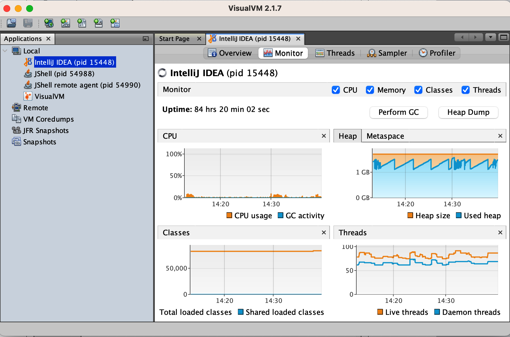

*Hình 12-1. Khung nhìn monitor của VisualVM*

Ở Hình 12-2, chúng ta thấy khung nhìn execution profiling của VisualVM từ tab Profiler.

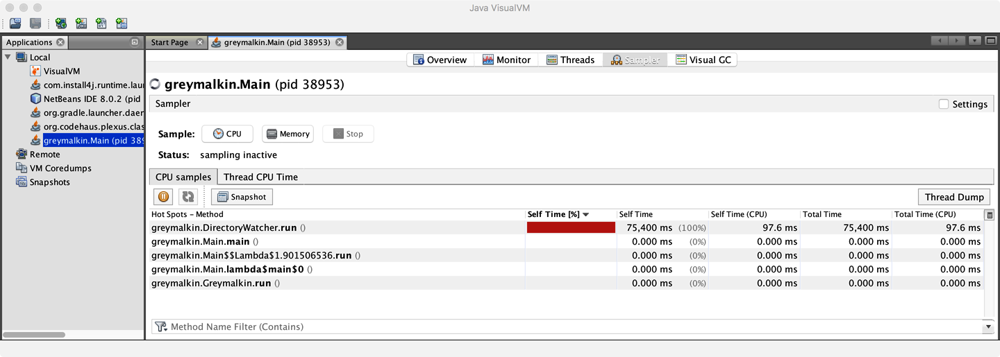

*Hình 12-2. Execution profiler của VisualVM*

Nó cho thấy một góc nhìn đơn giản về các method đang thực thi và mức tiêu thụ CPU tương đối của chúng. Nó có thể là công cụ đầu tiên hữu ích cho các kỹ sư hiệu năng mới với nghệ thuật — và những đánh đổi liên quan đến — profiling. Tuy nhiên, mức độ đào sâu profiling khả dĩ trong UI của VisualVM thực sự khá hạn chế, và hầu hết kỹ sư hiệu năng nhanh chóng vượt qua nó và chuyển sang một trong những công cụ đầy đủ hơn trên thị trường.

### JDK Mission Control

Các công cụ JDK Flight Recorder và JDK Mission Control (gọi là JFR/JMC) là công nghệ profiling và monitoring mà Oracle có được như một phần của việc mua lại BEA Systems.

Hai công nghệ này riêng biệt nhưng có liên quan:

- **JFR** là khả năng thu thập dữ liệu hiệu năng mức thấp, dựa trên sự kiện, được nhúng vào JVM HotSpot, và nó cung cấp các sự kiện cho OS, JVM và các thư viện JDK.[^3]
- **JMC** là thành phần đồ họa, và bản cài đặt ban đầu của nó gồm một JMX Console và một bộ xử lý dữ liệu JFR, mặc dù có thể dễ dàng cài thêm plug-in từ trong Mission Control.

Những công cụ này ban đầu là một phần của bộ công cụ cho JVM JRockit của BEA và được chuyển sang phiên bản thương mại của Oracle JDK như một phần của quá trình ngừng JRockit. Để hỗ trợ việc port từ JRockit, VM HotSpot đã được instrument để đưa vào một rổ lớn các performance counter bổ sung.

Khi Java 11 được phát hành, JFR được hiến tặng cho OpenJDK, và JMC được chuyển thành một dự án độc lập. Sau đó, JFR được backport về OpenJDK 8 như một phần của Update 272 — điều này có nghĩa các bản phát hành gần đây của OpenJDK 8 có JFR khả dụng.

> **GHI CHÚ**
>
> Ứng dụng desktop JMC có thể được build từ mã nguồn hoặc tải xuống từ vài nơi, bao gồm dự án Eclipse Adoptium.

JMC được khởi động bằng cách chạy binary `jmc`. Màn hình khởi động của Mission Control có thể thấy ở Hình 12-3.

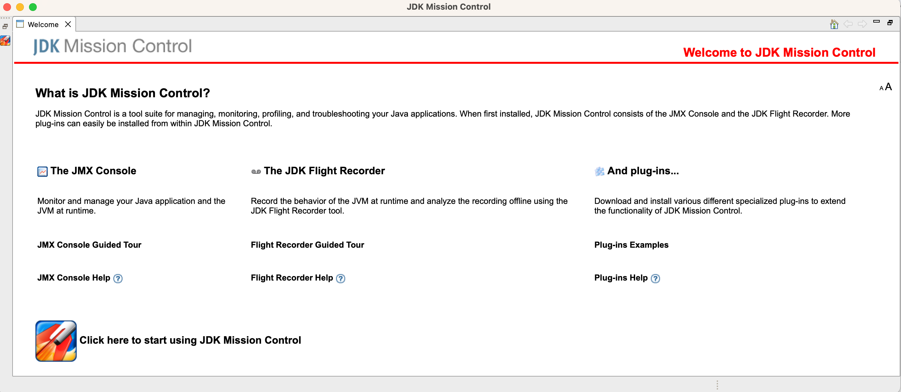

*Hình 12-3. Màn hình khởi động JMC*

Để profile, Flight Recorder phải được bật trên ứng dụng đích. Bạn có thể đạt được điều này theo một trong ba cách: bằng cách khởi động ứng dụng với các cờ JFR được bật, hoặc attach động sau khi ứng dụng đã khởi động, hoặc khởi động ứng dụng rồi dùng lệnh `jcmd` để bắt đầu một bản ghi JFR trong một JVM trên máy cục bộ.[^4]

Một khi đã attach, nhập cấu hình cho phiên ghi và các sự kiện profiling, như thể hiện ở Hình 12-4.

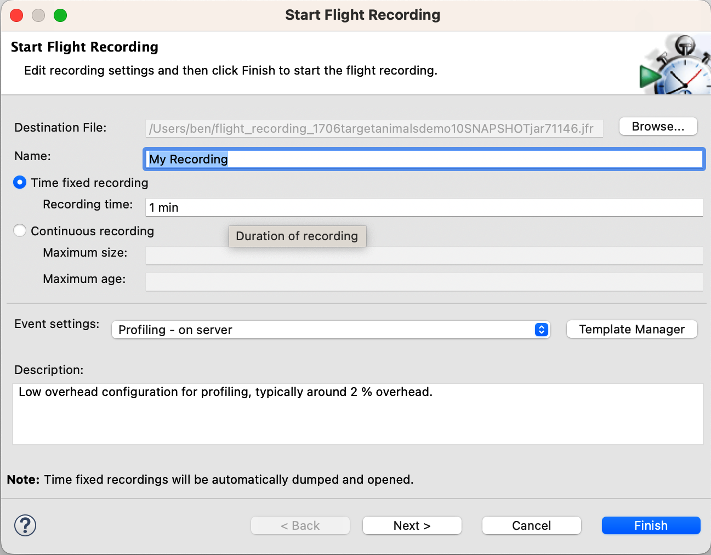

*Hình 12-4. Thiết lập bản ghi JMC*

Như đã thảo luận trước đó trong chương, execution profiling rất không phải viên đạn bạc, và các kỹ sư phải tiến hành cẩn thận để tránh nhầm lẫn và ngộ nhận. Có những đánh đổi hiệu năng không thể tránh khỏi trong cấu hình công cụ, cũng như cần nhận thức về chi phí phụ trội của profiling.

> **GHI CHÚ**
>
> Những ảnh chụp màn hình này mô tả trường hợp một ứng dụng đang nhàn rỗi — tức là không thực hiện nhiều (nếu có) công việc, nên các hình chỉ nhằm mục đích minh họa.

Khi bản ghi hoàn tất, một phân tích tự động được hiển thị trong cửa sổ chính, với phía bên trái hiển thị nhiều sự kiện khả dụng khác nhau. Nó trông như khung nhìn ở Hình 12-5.

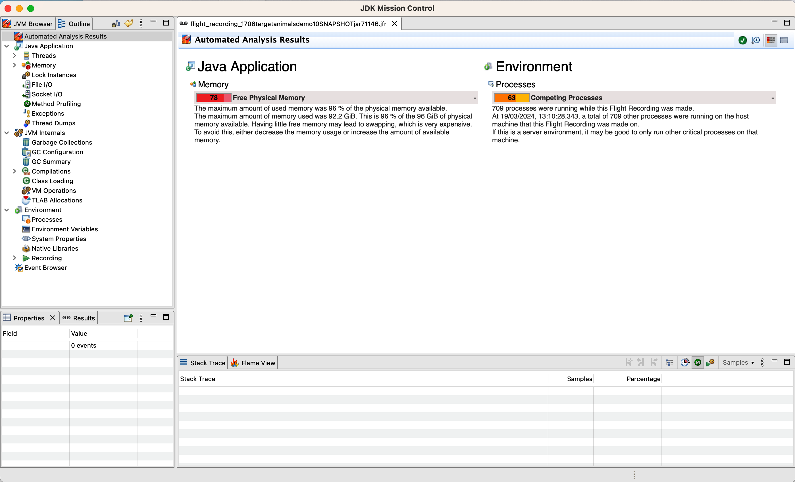

*Hình 12-5. Phân tích tự động của JMC*

Hãy bắt đầu bằng cách chọn mục Method Profiling từ thanh điều hướng bên trái. Điều này cho ra màn hình như Hình 12-6.

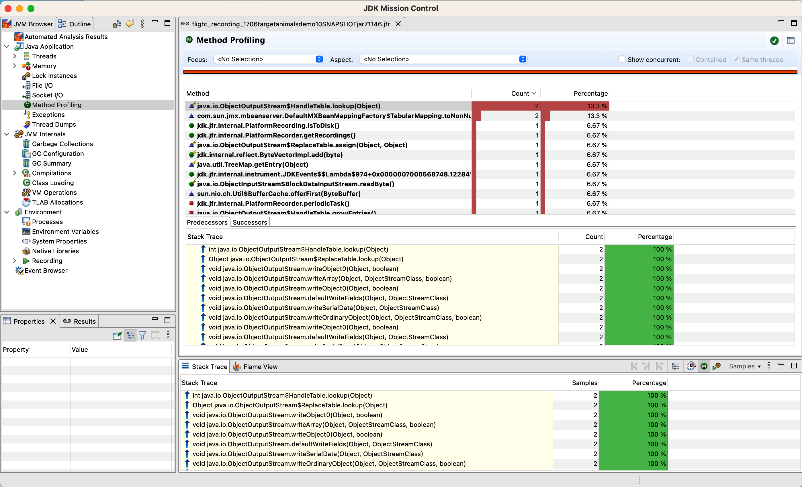

*Hình 12-6. Method Profiling của JMC*

Từ đây, chúng ta có thể bắt đầu xem method nóng nào đang chiếm phần lớn thời gian chạy ứng dụng và cũng có thể dùng các kỹ thuật như flame graph (chúng ta sẽ thảo luận chi tiết hơn sau) — với điều kiện thiết lập profiling của chúng ta hỗ trợ chúng.

Nhìn chung, JMC là công cụ profiling dựa trên GUI vững chắc — nhưng có giới hạn với loại công cụ này. Đặc biệt, có thể khó thấy cách áp dụng profiling dựa trên desktop vào các kỹ thuật observability chúng ta gặp ở Chương 10 và 11.

Chúng ta sẽ thấy cách bắc cầu qua khoảng cách này ngay sau đây, nhưng trước hết chúng ta cần thảo luận một số chi tiết về cách các execution profiler thực sự vận hành.

### Lấy mẫu và thiên lệch Safepoint

Theo truyền thống, execution profiling dùng việc lấy mẫu định kỳ các stack trace để có được góc nhìn về mã nào đang chạy trên mỗi thread. Đó là bởi việc lấy phép đo không miễn phí, nên theo dõi mọi lần vào và ra method sẽ đại diện cho một chi phí thu thập dữ liệu quá lớn. Vậy nên, thay vào đó, một snapshot được lấy mẫu — nhưng việc này chỉ có thể thực hiện ở tần suất tương đối thấp mà không có chi phí phụ trội không chấp nhận được.

Ví dụ, thread profiler trong Java agent của New Relic sẽ lấy mẫu mỗi 100 ms — và điều này thường được coi là quy tắc ngón tay cái, hay phỏng đoán tốt nhất, về giới hạn tần suất lấy mẫu mà không phát sinh chi phí phụ trội cao không chấp nhận được.

Nói cách khác, khoảng lấy mẫu đại diện cho một đánh đổi với kỹ sư hiệu năng. Lấy mẫu quá thường xuyên, và chi phí phụ trội trở nên không chấp nhận được, đặc biệt với ứng dụng quan tâm đến hiệu năng. Mặt khác, lấy mẫu quá thưa, và khả năng bỏ lỡ hành vi quan trọng trở nên quá lớn, vì việc lấy mẫu có thể không phản ánh hiệu năng thực của ứng dụng.

> Đến lúc bạn dùng profiler thì nó nên đang điền chi tiết vào — nó không nên khiến bạn ngạc nhiên.
>
> — Kirk Pepperdine (trao đổi cá nhân)

Việc lấy mẫu không chỉ tạo cơ hội cho các vấn đề ẩn mình trong dữ liệu, mà ở nhiều profiler, việc lấy mẫu chỉ được thực hiện tại các JVM safepoint. Đây được gọi là *safepointing bias* (thiên lệch safepoint) và có hai hệ quả chính:

- Mọi thread phải đạt tới safepoint trước khi một mẫu có thể được lấy.
- Mẫu chỉ có thể là của một trạng thái ứng dụng đang ở safepoint.

Cái đầu áp đặt chi phí phụ trội bổ sung cho việc tạo ra một mẫu profiling từ một tiến trình đang chạy. Hệ quả thứ hai làm lệch phân phối các điểm mẫu bằng cách chỉ lấy mẫu trạng thái khi nó đã được biết là ở safepoint.

> **GHI CHÚ**
>
> Biết rằng một profile chỉ hiển thị mã đang chạy do cách nó lấy mẫu là điều then chốt, bởi việc blocking và waiting cũng gây đau đầu không kém các thuật toán kém hiệu quả.

Các execution profiler dựa trên lấy mẫu dùng hàm `GetCallTrace()` từ C++ API của HotSpot để thu thập mẫu stack cho mỗi thread ứng dụng. Thiết kế thông thường là thu thập mẫu trong một agent, rồi ghi log dữ liệu hoặc thực hiện các xử lý downstream khác.

Tuy nhiên, trong triển khai ban đầu, `GetCallTrace()` có chi phí phụ trội khá nặng: nếu có N thread ứng dụng đang hoạt động, thì việc thu thập một mẫu stack khiến JVM safepoint N lần. Chi phí phụ trội này là một trong những nguyên nhân gốc đặt ra giới hạn trên cho tần suất lấy mẫu, ít nhất với Java 8 và trước đó.

Hạn chế này, ở mức độ nào đó, đã được giải quyết bởi JEP 312, "Thread-Local Handshakes", vốn cũng là nền tảng cần thiết cho các collector Shenandoah và ZGC mà chúng ta thảo luận ở Chương 5. Các phiên bản gần đây hơn, từ Java 11 trở đi, có chi phí phụ trội giảm đáng kể cho việc profiling thread nhờ thay đổi này.

Nhìn chung, do đó, kỹ sư hiệu năng cẩn thận sẽ để mắt đến lượng thời gian safepointing mà ứng dụng đang dùng. Nếu quá nhiều thời gian dành cho safepointing, thì hiệu năng ứng dụng sẽ suy giảm, và mọi đợt tinh chỉnh có thể đang hành động trên dữ liệu không chính xác. Một cờ JVM có thể rất hữu ích để truy vết các trường hợp thời gian safepointing cao là:

```
-XX:+PrintGCApplicationStoppedTime
```

Cờ này sẽ ghi thêm thông tin về thời gian safepointing vào GC log. Một số công cụ có thể tự động phát hiện vấn đề từ dữ liệu do cờ này tạo ra và phân biệt giữa thời gian safepointing với thời gian dừng do nhân OS áp đặt.

Một ví dụ về các vấn đề do safepointing bias gây ra có thể được minh họa bằng một *counted loop* (vòng lặp có đếm). Đây là một vòng lặp đơn giản, có dạng tương tự đoạn mã này:

```java
for (int i = 0; i < LIMIT; i += 1) {
    // chỉ các thao tác "đơn giản" trong thân vòng lặp
}
```

Chúng tôi cố ý không định nghĩa nghĩa của thao tác "đơn giản" trong ví dụ này, vì hành vi phụ thuộc vào chính xác các tối ưu hóa mà trình biên dịch JIT có thể thực hiện. Chi tiết liên quan thêm có thể tìm thấy ở phần "Chẩn đoán vấn đề ứng dụng bằng Observability".

Ví dụ về thao tác đơn giản bao gồm các phép toán số học trên kiểu nguyên thủy và các lời gọi method đã được inline hoàn toàn (nên thực ra không có method nào nằm trong thân vòng lặp).

Nếu `LIMIT` lớn, thì trình biên dịch JIT sẽ dịch mã Java này trực tiếp thành dạng biên dịch tương đương, bao gồm một back branch để quay lại đầu vòng lặp. Như đã thảo luận ở phần "JVM Safepoint", trình biên dịch JIT chèn các lượt kiểm tra safepoint tại các cạnh loop-back. Điều này có nghĩa với vòng lặp lớn, sẽ có cơ hội safepoint một lần mỗi vòng lặp.

Tuy nhiên, với `LIMIT` đủ nhỏ, điều này sẽ không xảy ra, mà thay vào đó trình biên dịch JIT sẽ *unroll* (trải phẳng) vòng lặp này. Điều này có nghĩa thread đang thực thi counted loop đủ nhỏ sẽ không safepoint cho đến sau khi vòng lặp hoàn tất.

Việc chỉ lấy mẫu tại safepoint, do đó, đã dẫn trực tiếp đến một hành vi thiên lệch phụ thuộc nhạy vào kích thước vòng lặp và bản chất các thao tác chúng ta thực hiện trong đó.

Điều này rõ ràng không lý tưởng cho các kết quả hiệu năng nghiêm ngặt và đáng tin. Đây cũng không phải mối lo lý thuyết — việc unroll vòng lặp có thể sinh ra lượng mã đáng kể, dẫn đến những đoạn mã dài mà không mẫu nào từng được thu thập.

Tuy nhiên, có một lựa chọn thay thế cho sampling profiler, và đó là chủ đề của phần tiếp theo.

## Các Profiler hiện đại

Trong phần này, chúng tôi sẽ thảo luận ba công cụ mã nguồn mở hiện đại có thể cung cấp cái nhìn tốt hơn và các con số hiệu năng chính xác hơn so với sampling profiler truyền thống. Những công cụ đó là:

- perf
- Async Profiler
- Honest Profiler

Chúng ta sẽ lần lượt thảo luận từng cái — hãy bắt đầu với công cụ perf.

### perf

`perf` là giải pháp profiling nhẹ hữu ích cho các ứng dụng chạy trên Linux. Nó không đặc thù cho ứng dụng Java/JVM mà đọc các performance counter phần cứng và được bao gồm trong nhân Linux, dưới `tools/perf`.

Performance counter là các thanh ghi vật lý đếm các sự kiện phần cứng mà nhà phân tích hiệu năng quan tâm. Chúng bao gồm số chỉ thị đã thực thi, cache miss và branch misprediction. Điều này tạo cơ sở cho việc profile ứng dụng.

Java đặt ra một số thách thức bổ sung cho perf, do bản chất động của môi trường runtime Java. Để dùng perf với ứng dụng JVM, chúng ta cũng cần một cầu nối để xử lý việc ánh xạ các phần động của việc thực thi VM.

Cầu nối này là *perf-map-agent*, một agent sẽ sinh symbol động cho perf từ các vùng bộ nhớ chưa biết (bao gồm các method đã JIT-compile). Do trình thông dịch được tạo động của HotSpot và bảng nhảy cho virtual dispatch, những thứ này cũng phải được sinh mục. perf-map-agent gồm một agent viết bằng C và một bootstrap Java nhỏ attach agent vào một tiến trình Java đang chạy nếu cần.

Trong Java 8u60, một cờ mới được thêm vào để cho phép tương tác tốt hơn với perf:

```
-XX:+PreserveFramePointer
```

Đáng tiếc, cờ này mặc định là `false`, nên khi dùng perf để profile ứng dụng Java, rất khuyến nghị bạn bật nó một cách tường minh.

> **GHI CHÚ**
>
> Việc kích hoạt cờ này tắt một tối ưu hóa của trình biên dịch JIT, nên nó có thể làm giảm hiệu năng đôi chút.

Một cách trực quan hóa nổi bật cho các con số mà perf tạo ra là *flame graph* (đồ thị ngọn lửa). Nó cho thấy phân tích rất chi tiết về chính xác thời gian thực thi được dùng ở đâu. Một ví dụ có thể thấy ở Hình 12-7.

Kỹ thuật flame graph đã tiến hóa theo thời gian, nên có một số chi tiết quan trọng về việc đọc flame graph mà bạn nên biết:

- Trục x thể hiện quần thể profile stack, được sắp xếp theo bảng chữ cái.
- Trục y thể hiện độ sâu stack, đếm từ dưới lên.
- Mỗi hình chữ nhật đại diện cho một stack frame, và frame càng rộng thì nó càng thường xuyên hiện diện trong các stack.
- Hình chữ nhật trên cùng cho thấy cái gì đang ở trên một CPU cụ thể, và bên dưới nó là tổ tiên của nó.
- Ban đầu, flame graph dùng màu ngẫu nhiên để giúp phân biệt trực quan các frame liền kề.

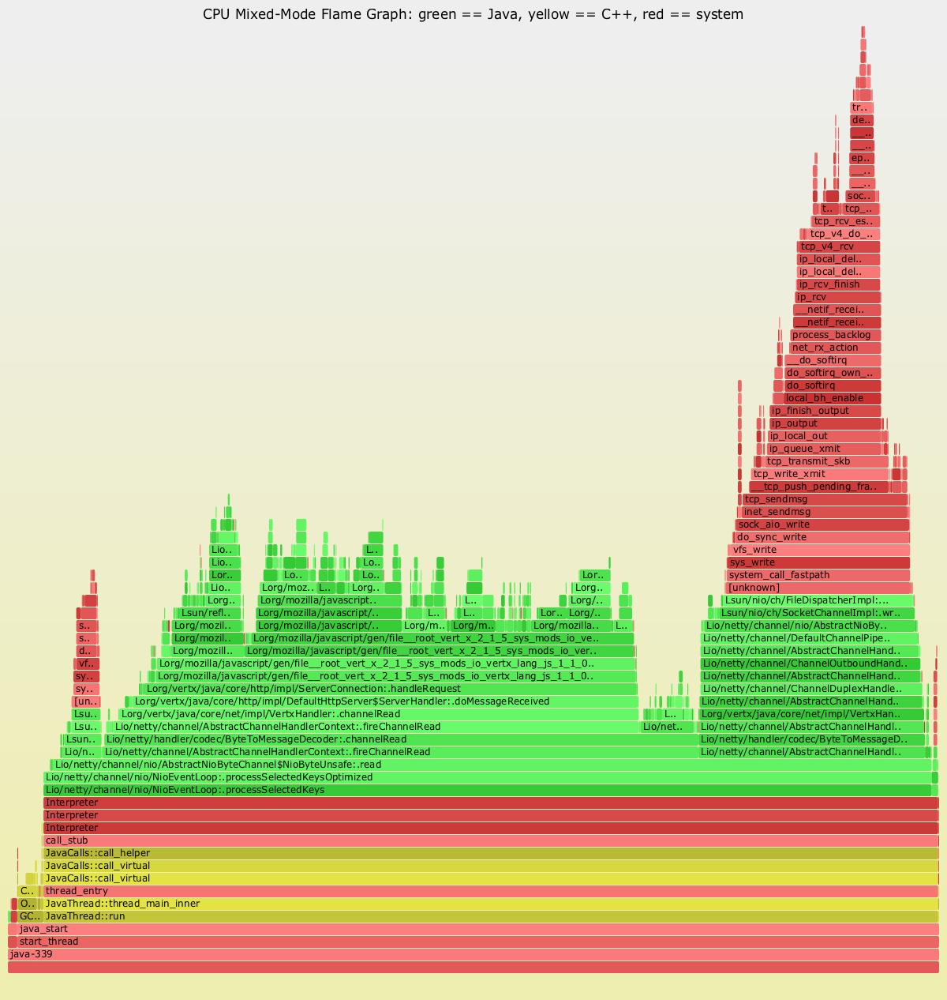

*Hình 12-7. Flame graph của Java*

Trong các điểm này, việc hiểu rằng trục x *không phải* là dòng chảy thời gian có lẽ là điều quan trọng nhất. Flame graph tổ chức các mẫu theo bảng chữ cái và hợp nhất các frame bất cứ khi nào có thể — điều này cho cái nhìn tổng thể tốt hơn về bức tranh lớn của profile.

Đã có vài cải tiến và biến thể trên khái niệm flame graph gốc của Gregg. Ví dụ, một số triển khai đã bắt đầu dùng sơ đồ màu nhất quán, trong đó màu của một hình chữ nhật có ý nghĩa ngữ nghĩa nào đó (ví dụ, đó là frame Java hay native), thay vì chỉ dùng màu để làm đồ thị dễ đọc.

Một biến thể quan trọng là *flame chart*, ban đầu được phát triển cho WebKit Web Inspector của Google Chrome. Flame chart có thời gian trên trục x thay vì sắp xếp theo bảng chữ cái. Điều này có lợi thế là các mẫu hình theo thời gian có thể được hiển thị nhưng phải trả giá bằng việc chỉ có thể hiển thị hợp lý mẫu hình cho một thread duy nhất. Điều này thường ổn với ứng dụng JavaScript, vốn thường đơn luồng, nhưng ít hữu ích hơn nhiều cho ứng dụng Java.

Netflix Technology Blog có phần trình bày chi tiết về cách đội của họ đã triển khai flame graph trên các JVM của mình.

Bạn cũng nên biết một số vấn đề khi chạy perf trong container — nhớ rằng perf dựa trên performance counter phần cứng. Các sự kiện mà perf dựa vào cho việc profile CPU có thể không khả dụng trong container (hoặc trong môi trường seccomp).

Hãy chuyển sang xem Async Profiler, vốn dùng perf làm khối xây dựng cho việc profiling JVM.

### Async Profiler

Các mục tiêu then chốt của Async Profiler là:

- Loại bỏ safepointing bias mà hầu hết profiler khác có.
- Vận hành với chi phí phụ trội thấp hơn đáng kể so với profiler truyền thống.

Để đạt được điều này, Async Profiler dùng một lời gọi API riêng tư: `AsyncGetCallTrace` (hay AGCT) trong HotSpot. Điều này tất nhiên có nghĩa Async Profiler sẽ không hoạt động trên JVM không phải OpenJDK. Nó sẽ hoạt động với các JVM dựa trên OpenJDK (bao gồm bản build từ Adoptium, Amazon, Microsoft, Oracle, Red Hat và Zulu từ Azul) cũng như các JVM HotSpot được build từ đầu.

> **GHI CHÚ**
>
> Nhìn chung, các công cụ như Async Profiler thường được chạy ở chế độ headless như công cụ thu thập dữ liệu. Trong cách tiếp cận này, việc trực quan hóa được cung cấp bởi các công cụ khác hoặc script tùy chỉnh.

Việc phụ thuộc vào perf có nghĩa là Async Profiler cũng chỉ hoạt động trên các hệ điều hành mà perf hoạt động (chủ yếu là Linux). Việc triển khai Async Profiler dùng tín hiệu OS Unix `SIGPROF` để ngắt một thread đang chạy. Call stack sau đó có thể được thu thập qua method riêng tư `AsyncGetCallTrace()`.

Điều này chỉ ngắt từng thread riêng lẻ, nên không bao giờ có bất kỳ loại sự kiện đồng bộ hóa toàn cục nào. Điều này tránh được sự tranh chấp và chi phí phụ trội thường thấy ở các sampling profiler truyền thống. Trong callback bất đồng bộ, call trace được ghi vào một ring buffer lock-free. Một thread riêng chuyên dụng sau đó ghi các chi tiết ra log mà không dừng ứng dụng.

Có một số chi tiết bổ sung về hoạt động của các profiler không lấy mẫu mà bạn cần biết. Trước hết, hãy xét câu hỏi này:

Khi một CPU nhận một interrupt "được kích hoạt từ bên ngoài" (ví dụ, một cache miss), thì CPU bị ngắt tại điểm nào trong luồng chỉ thị?

Câu hỏi này đặc biệt quan trọng với các CPU out-of-order (OOO) hiện đại, vốn về cơ bản là mọi thứ mà một ứng dụng phía server hiện đại có khả năng chạy trên đó.

Nếu đầu ra của một profiler mức thấp (như perf) được xem xét, thì có thể thấy một chỉ thị được gắn thẻ với, chẳng hạn, một sự kiện L1 cache miss vốn không phải do chỉ thị này gây ra. Đây được gọi là *skid* và được định nghĩa là khoảng cách giữa chỉ thị thực sự gây ra sự kiện và chỉ thị nơi sự kiện được gắn thẻ.

Một vấn đề liên quan (đặc thù cho JVM) là cũng có một dạng ẩn của safepoint bias. Mặc dù các profiler không lấy mẫu dùng AGCT hay kỹ thuật tương tự không bị thiên lệch safepoint khi thu thập stacktrace, việc phân giải frame cuối cùng vẫn thiên lệch về phía thông tin debug được ghi lại, và đáng tiếc, theo mặc định những thông tin này ở tại các safepoint.

Để đối phó với điều này, các profiler không lấy mẫu cố kích hoạt cờ `-XX:+DebugNonSafepoints` càng sớm càng tốt để có phân giải chính xác hơn.

Async Profiler cũng cố giải quyết vấn đề `perf_events` ảnh hưởng đến container — bằng cách thêm một engine lấy mẫu CPU mới dựa trên `timer_create` thay thế. Điều này kết hợp lợi ích của các engine lấy mẫu cũ hơn, với đánh đổi nhỏ là nó không thể thu thập kernel stack.

Điều này có nghĩa các phiên bản gần đây của Async Profiler hoạt động trong container theo mặc định, có thiên lệch thời gian giảm, và cũng không tiêu thụ file descriptor.[^5]

> **MẸO**
>
> Để dùng Async Profiler độc lập, cần một lượng nghi thức và script đặc thù cho ứng dụng của bạn. Thay vì đi sâu vào những phức tạp đó, nên tham khảo các tài nguyên bên ngoài như trang GitHub của Async Profiler.

Cuối cùng, một lựa chọn thay thế cho Async Profiler từng phổ biến vài năm trước là Honest Profiler. Nó dùng cùng API nội bộ như Async Profiler, và cũng là công cụ mã nguồn mở chỉ chạy trên JVM HotSpot. Tuy nhiên, nó có vẻ không còn được bảo trì tích cực, nên không nên dùng cho dự án mới (và mọi cài đặt hiện có của nó nên được di chuyển đi).

Ở phần tiếp theo, chúng ta sẽ xem xét JFR — một profiler tích hợp sẵn, ở nhiều khía cạnh tương tự Async Profiler.

## JDK Flight Recorder (JFR)

Chúng ta đã gặp JFR ở phần "Công cụ Profiling dạng GUI" — đây là công cụ chi phí thấp đi kèm OpenJDK để thu thập dữ liệu chẩn đoán và profiling. Ý định là nó nên được dùng bởi một ứng dụng Java đang chạy trên JVM HotSpot trong production.

Với một profiler production, chi phí phụ trội cần đủ nhỏ để chịu đựng được cả trong kịch bản bình thường lẫn sử dụng cao. JFR đạt được điều này bằng cách dùng các *profile* — nhớ rằng JFR dựa trên sự kiện, nên các profile khác nhau tương ứng với các tập sự kiện khác nhau được bật để JFR phản hồi.

Ngay từ đầu, JFR đi kèm hai profile: "Continuous" (đôi khi gọi là "Default") và "Profiling". Các file cấu hình XML tương ứng với những profile này có trong bản cài JDK dưới dạng *default.jfc* và *profile.jfc*.

Trong hai profile mặc định này, Continuous được thiết kế cho profiling luôn bật nhưng có thể thiếu chi tiết quan trọng, đặc biệt cho allocation profiling. Profile "Profiling" (một ví dụ thực sự kinh điển về lý do tại sao không nên để kỹ sư đặt tên cho mọi thứ) có nhiều chi tiết hơn nhưng cũng có chi phí phụ trội runtime cao hơn.

> **GHI CHÚ**
>
> Người dùng nâng cao của JFR có thể chọn tạo một profile tùy chỉnh, chứa một tập sự kiện khác, phản ánh tốt hơn các mối quan tâm hiệu năng của nhóm bảo trì ứng dụng.

Về chủ đề chi phí phụ trội — theo các bài trình bày và demo của Oracle — profiling JFR có tác động khoảng ~1% đến hiệu năng ứng dụng ở trạng thái ổn định với profile Continuous. Các tác giả đại thể đồng ý — thường quan sát thấy tác động trong khoảng ~3% cho một profile bao gồm allocation profiling.

Ngoài ra, một nghiên cứu có hệ thống hơn (nhưng được tiến hành trên microbenchmark thay vì hệ thống đầy đủ) có thể tìm thấy trong "Don't Trust Your Profiler: An Empirical Study on the Precision and Accuracy of Java Profilers".[^6]

Bài báo này đại thể theo phương pháp luận của Georges và cộng sự (2007), mà chúng ta đã thảo luận ngắn gọn ở Chương 2, và so sánh JFR với vài profiler khác (bao gồm Async Profiler và Honest Profiler, mà chúng ta đã gặp).

Đồng thuận là, nhìn chung, JFR gây ra chi phí phụ trội nằm trong khoảng chấp nhận được cho profiler, và có thể dùng nó để thực hiện profiling luôn bật (mặc dù một số ứng dụng có thể có yêu cầu tài nguyên khiến chi phí phụ trội không kham nổi).

Do đó, JFR đã được dùng làm nền tảng để xây nhiều công cụ observability và monitoring khác. Ví dụ, cả Datadog và New Relic đều cung cấp execution profiler dùng dữ liệu JFR làm dữ liệu đầu vào.

Chìa khóa để hiểu điều gì khả thi với JFR là các sự kiện, và dữ liệu nào có thể tìm thấy trong chúng. Vậy hãy xem xét kỹ hơn.

Các sự kiện JFR là dữ liệu có kiểu, và mỗi loại sự kiện có một tên và một cấu trúc. Ví dụ, sự kiện `jdk.CPULoad` đại diện cho một chuỗi thời gian metric của dữ liệu CPU, với vài trường như `jvmUser`, `jvmSystem` và `machineTotal` cũng như một dấu thời gian biểu diễn bởi thời gian bắt đầu sự kiện.

Các sự kiện khác có cấu trúc khác — chẳng hạn các sự kiện GC, vốn chi tiết và có thể chỉ tương ứng với một pha duy nhất của một chu kỳ thu gom. Hoặc các sự kiện lock, như `jdk.JavaMonitorEnter`, có một giá trị ngưỡng, cho phép JFR chỉ ghi lại những trường hợp mà một Java monitor được giữ lâu hơn một thời gian xác định (ví dụ, 10 ms).

JDK đi kèm một công cụ dòng lệnh đơn giản mà bạn có thể dùng để phân tích một file dump JFR. Những file dump này có thể được tạo theo một trong ba cách — dùng GUI JMC, hoặc qua dòng lệnh `jcmd` để điều khiển một tiến trình Java đang chạy, hoặc bằng cách thêm một switch dòng lệnh phù hợp vào lúc khởi động Java.

Với con đường `jcmd`, chúng ta cần thực thi ba lệnh riêng biệt để sinh một file, một để bắt đầu, một để dump, rồi một để tắt thao tác ghi khi đã thu thập đủ dữ liệu:

```bash
jcmd <pid> JFR.start name=MyRecording settings=default
jcmd <pid> JFR.dump filename=my-recording.jfr
jcmd <pid> JFR.stop
```

Để bắt đầu một bản ghi JFR lúc khởi động, chúng ta cần thêm switch dòng lệnh này và cung cấp các tùy chọn phù hợp:

```
-XX:StartFlightRecording:<options>
```

Những bản ghi này có thể có thời lượng cố định hoặc dùng chế độ ring-buffer (như chúng ta sẽ thảo luận sau trong chương). Một khi đã có file dump, chúng ta có thể dùng công cụ `jfr` mà JDK cũng cung cấp để xem các sự kiện trong đó.

> **GHI CHÚ**
>
> Công cụ `jfr` có nhiều lệnh con — dùng `jfr --help` để xem tất cả.

Ví dụ, chúng ta có thể xem các sự kiện `CPULoad` và `JavaMonitorEnter` bằng một lệnh `jfr print` duy nhất như sau:

```bash
jfr print --events CPULoad,JavaMonitorEnter recording.jfr
```

có thể cho ra kết quả tương tự thế này:

```
...

jdk.CPULoad {
  startTime = 11:51:57.745
  jvmUser = 8.75%
  jvmSystem = 0.57%
  machineTotal = 13.50%
}

jdk.JavaMonitorEnter {
  startTime = 11:51:58.065
  duration = 12.1 ms
  monitorClass = jdk.jfr.internal.PlatformRecorder (classLoader = bootstrap)
  previousOwner = "RMI TCP Connection(idle)" (javaThreadId = 32)
  address = 0x12CE66508
  eventThread = "JFR Periodic Tasks" (javaThreadId = 26)
}

...
```

Bằng cách thử nghiệm với vài lệnh `jfr print`, bạn có thể thấy các hình dạng khác nhau của các loại sự kiện khác nhau. Công cụ `jfr` cũng có thể tạo đầu ra ở định dạng XML và JSON.

> **MẸO**
>
> Một trình duyệt sự kiện cho các sự kiện JFR được đội tại SAP duy trì và bao phủ các bản LTS và feature release gần đây của OpenJDK.

Cũng tương đối đơn giản để xử lý file dump JFR theo cách lập trình, vì chỉ đơn giản là lặp qua một object `RecordingFile`:

```java
String fileName = // ... file JFR nào đó
var recording = new RecordingFile(Paths.get(fileName));
while (recording.hasMoreEvents()) {
    var event = recording.readEvent();
    if (event != null) {
        var details = decodeEvent(event);
        if (details == null) {
            System.err.println("Failed to recognize details");
        } else {
            // Chúng ta sẽ xử lý details ở đây, hiện tại chỉ log
            System.out.println(details);
        }
    }
}
```

Tất nhiên, các sự kiện quan tâm vẫn cần được giải mã trong method `decodeEvent()`. Một cách để làm điều này là dùng một tập tĩnh các mapper, được áp dụng như sau:

```java
public Map<String, String> decodeEvent(final RecordedEvent e) {
    for (var ent : mappers.entrySet()) {
        if (ent.getKey().test(e)) {
            return ent.getValue().apply(e);
        }
    }
    return null;
}

private static Predicate<RecordedEvent> makePredicate(String s) {
    return e -> e.getEventType().getName().startsWith(s);
}

private static final Map<Predicate<RecordedEvent>,
                Function<RecordedEvent, Map<String, String>>> mappers =
    Map.of(makePredicate("jdk.CPULoad"),
        ev -> Map.of("timestamp", ""+ ev.getStartTime(),
                     "user", ""+ ev.getDouble("jvmUser"),
                     "system", ""+ ev.getDouble("jvmSystem"),
                     "total", ""+ ev.getDouble("machineTotal")
                    ));
```

Trong ví dụ đơn giản này, method `makePredicate()` tạo ra một object `Predicate` để kiểm tra xem một sự kiện đến có đáng quan tâm không, rồi biến đổi nó thành một map các chuỗi để xuất ra.

Cũng có rất nhiều công cụ OSS sẵn có để xử lý dữ liệu JFR. Một công cụ thú vị là JFR Analytics của Gunnar Morling. Nó trình bày một giao diện giống SQL để truy vấn các file bản ghi JFR và có thể được dùng với mã JDBC thông thường.

Giờ khi đã hiểu các lựa chọn thay thế cho sampling profiler và đã thấy JFR trong ngữ cảnh, đã đến lúc quay lại chủ đề cách chúng ta dùng profiling trong thực hành vận hành.

## Các khía cạnh vận hành của Profiling

Profiler là công cụ của lập trình viên dùng để chẩn đoán vấn đề hoặc hiểu hành vi runtime của ứng dụng ở mức thấp. Ở đầu kia của phổ công cụ là các công cụ observability hoặc giám sát vận hành. Loại sau tồn tại để giúp một đội trực quan hóa trạng thái hiện tại của hệ thống và xác định xem hệ thống đang hoạt động bình thường hay bất thường.

Không gian mà những công cụ này bao trùm là khổng lồ, và một cuốn sách đơn giản không thể bao phủ hoàn toàn mọi công cụ trong không gian đó. Thay vào đó, chúng tôi sẽ chọn vài điểm nhấn để tập trung.

Những ví dụ này có thể đóng vai trò điểm khởi đầu để bạn bắt đầu điều tra các lựa chọn và đánh giá cái nào phù hợp với ứng dụng của mình. Trong observability và phân tích hiệu năng, không có con đường dễ dàng — bạn phải tham gia đầy đủ và tìm những kỹ thuật phù hợp với lĩnh vực quan tâm cụ thể của mình.

### Dùng JFR như một công cụ vận hành

JFR có lịch sử dài, vốn là con dao hai lưỡi. Một mặt, nó có nhiều năm được thử lửa trong production và là công cụ tốt nhất trong ngành nhờ tích hợp sâu với HotSpot.

Tuy nhiên, nó cũng đến từ một thời kỳ sớm hơn nhiều, khi profiling production tiên tiến nhất tạo ra một file dump (chứa nhiều dữ liệu nhị phân và không đọc được bằng mắt người) rồi sao chép nó về máy lập trình viên để phân tích offline.

Tuy nhiên, trong thế giới mới của ứng dụng cloud native, điều này có thể không dễ đạt được hay rất tiện lợi. Nói đơn giản, chúng ta cần các mẫu hình mới và phương pháp luận mới nếu JFR muốn là công cụ hữu ích trong thế giới cloud native.

Một mẫu hình vận hành phổ biến để dùng JFR là khởi động nó ở cấu hình ring buffer. Điều này thường được làm bằng cách khởi động ứng dụng với các tùy chọn ghi JFR được cấu hình trước truyền cho switch `-XX:StartFlightRecording`, như sau:

```
-XX:StartFlightRecording:disk=true,filename=/sandbox/service.jfr,maxage=4h,
settings=profile
```

Điều này cho JFR biết rằng chúng ta muốn giữ các sự kiện khớp với profile "Profiling" cũ đến bốn giờ trong bộ nhớ (và loại bỏ các sự kiện cũ hơn khi có sự kiện mới đến), và khi chúng ta yêu cầu một bản ghi, dump trạng thái hiện tại của buffer vào */sandbox/service.jfr*.

Điều này cho phép người vận hành dump một file khi cần và "quay ngược thời gian" đến sau khi một sự cố đã bắt đầu, với điều kiện ring buffer đủ lớn. Đây có thể là kỹ thuật cực kỳ hữu ích trong quá trình khôi phục sự cố.

Tất nhiên, cần tính đến bộ nhớ bổ sung sẽ được dùng để đệm các sự kiện trong container, và điều này có một hệ quả hơi tinh tế mà bạn nên biết.

Lưu ý rằng trong ví dụ, chúng ta dùng tham số `maxage` để chỉ ra chúng ta muốn giữ sự kiện trong bao lâu. Do đó, vì JFR dựa trên sự kiện, lượng dữ liệu nó tạo ra phụ thuộc vào hoạt động của JVM (ví dụ, số lần garbage collection) và không nhất thiết có giới hạn cứng.

Đến lượt nó, điều này có nghĩa là có thể xảy ra, nếu một ứng dụng gần giới hạn bộ nhớ container, rằng một đợt bùng nổ hoạt động bất ngờ có thể khiến kích thước buffer sự kiện JFR vượt quá giới hạn đó, dẫn đến container runtime hoặc OOM-killer cưỡng chế giới hạn và giết tiến trình ứng dụng.

Vì lý do này, một số đội thích chỉ định tham số `maxsize` thay thế, cung cấp đảm bảo rằng JFR sẽ không khiến container bị giết. Tuy nhiên, cái này phải trả giá bằng việc không chắc 100% cửa sổ thời gian "nhìn lại" mà ring buffer JFR cung cấp là bao nhiêu.

Ngoài ra, JFR sẽ ghi ra một file trên hệ thống file, nên cũng phải cẩn thận để có đủ dung lượng đĩa trống (trên bare metal và VM) và cũng không bị container runtime (Docker hay K8s) đuổi ra vì I/O quá mức trong cái được cho là một container stateless.

Các phiên bản Java gần đây hơn, bao gồm cả 17 và 21, cũng có khả năng JFR Event Streaming. Đây là một API cho phép chương trình nhận callback cho các sự kiện JFR để ứng dụng (hoặc một thread observability, có lẽ trong một Java agent) có thể phản hồi chúng khi chúng xảy ra. Class then chốt ở đây là `RecordingStream`, cho phép lập trình viên đăng ký quan tâm đến các loại sự kiện cụ thể và chỉ định một object callback để xử lý nó.

Cái này phù hợp hơn nhiều làm nền tảng để xây một công cụ observability, nhưng nó gặp vấn đề là Java 17+ chỉ có thị phần khoảng ~35% tính đến tháng 4/2024. Thay vào đó, các khả năng công cụ khác đã được phát triển.

### Red Hat Cryostat

Cryostat là công cụ JFR cho các ứng dụng Java/JVM container hóa. Ban đầu được Red Hat phát triển và được hỗ trợ native trên nền tảng hybrid cloud OpenShift nhưng có sẵn như một dự án OSS thượng nguồn hoạt động trên bất kỳ bản phân phối Kubernetes nào.

Cryostat tìm cách giảm độ phức tạp của việc làm việc với các file bản ghi JFR trong một cluster Kubernetes. Nó cung cấp khả năng cho người dùng khởi động, dừng, truy xuất và phân tích dữ liệu sự kiện JFR từ xa.

Cryostat yêu cầu cert-manager, Operator Lifecycle Manager (OLM), và OperatorHub để triển khai thành công. Nó cung cấp các tính năng như:

- Khung nhìn topology ứng dụng
- Khung nhìn Grafana (cho metric)
- Quy tắc tự động
- Thông báo
- Smart trigger

Ở Hình 12-8, chúng ta thấy khung nhìn topology mà phiên bản Kubernetes tổng quát của Cryostat cung cấp.

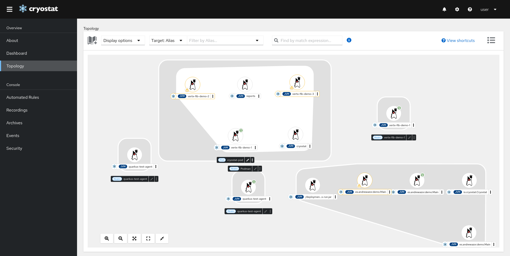

*Hình 12-8. Khung nhìn topology của Cryostat*

Hình ảnh cho thấy một triển khai Kubernetes gồm vài pod, bao gồm cả ứng dụng mẫu lẫn chính các pod Cryostat (một ví dụ khác về việc các dịch vụ observability bản thân chúng cũng nên quan sát được).

Cryostat là công cụ cực kỳ hữu ích để làm việc với JFR, nhưng thảo luận đầy đủ nằm ngoài phạm vi cuốn sách này. Để đầy đủ, trong không gian công cụ độc quyền, cả Datadog và New Relic (và có thể những công ty khác) đều cung cấp execution profiler dựa trên JFR.

### JFR và OTel Profiling

Ở phần "Ba trụ cột", chúng ta gặp ba trụ cột của observability và thảo luận khả năng profiling như trụ cột thứ tư. Sự bổ sung này đang được thảo luận tích cực trong các working group của OpenTelemetry. Với Java, nhiều profiler khác nhau có khả năng dùng được làm nguồn dữ liệu cho một loại tín hiệu profiling OTel trong tương lai.

JFR có thể là một trong những nguồn dữ liệu cung cấp tín hiệu profiling, nhưng có một số phức tạp. Ví dụ, một triển khai OTel thực tế của profiling sẽ cần dựa trên JFR Event Streaming do các hạn chế về cửa sổ thời gian của OTel, và như vậy nó sẽ chỉ hoạt động với Java 17+.

Cũng có vấn đề là tại thời điểm viết sách (tháng 8/2024), không có cách đơn giản nào để liên kết một trace ID với một mẫu profiling JFR. Công việc trong không gian này đang tiếp diễn, không chỉ trong Java mà ở các ngôn ngữ khác nằm trong phạm vi của OpenTelemetry.

> **GHI CHÚ**
>
> Dự án `opentelemetry-java-instrumentation` đi kèm một triển khai các metric JVM của OpenTelemetry dựa trên JFR, định nghĩa một tập metric JVM chuẩn.

Nhìn chung, JFR nên được xem như một bên đóng góp và nguồn dữ liệu quan trọng cho hệ sinh thái OTel và là một phần của sự dịch chuyển tổng thể hướng tới instrumentation mở, nhưng bản thân nó không phải giải pháp execution profiling hoàn chỉnh.

### Chọn một Profiler

Có vài khía cạnh cần tính đến khi chọn profiler, chẳng hạn:

- Tôi có cần một công cụ để làm việc tương tác trong GUI không?
- Công cụ này dành cho profiling production hay chủ yếu cho việc dùng ở dev/CI?
- Tôi có thể dành bao nhiêu thời gian và mức độ tinh vi để thiết lập profiler của mình?
- Tôi có ràng buộc nào về chi phí phụ trội có thể chịu đựng cho giải pháp profiling không?

Nhìn chung, bạn có thể đặc trưng hóa các profiler mã nguồn mở như sau:

- **VisualVM** là công cụ GUI dễ triển khai nhưng cần kết nối JMX trực tiếp hoặc một snapshot để làm việc.
- **JMC** là công cụ GUI khác, tinh vi hơn, cũng có thể dùng JFR (nhưng chỉ qua file dump — sự kiện streaming không được hỗ trợ).
- **JFR** là engine profiling headless chi phí thấp được tích hợp vào JVM — có thể tích hợp với nhiều công cụ khác (cho cả use case offline lẫn thiên về vận hành hơn).
- **perf** rất mức thấp và quan tâm đến các sự kiện phần cứng trên Linux — nó không đặc thù Java và cần một số công cụ cầu nối bổ sung.
- **Async Profiler** xây trên nền `perf_events` và cung cấp giải pháp chi phí thấp không chịu safepoint bias, nhưng nó có lẽ có ít tích hợp sẵn có hơn JFR.

Cuối cùng, có các profiler thương mại độc quyền sẵn có, như JProfiler và YourKit. Chúng từng rõ ràng vượt trội hơn các công cụ miễn phí, nhưng khoảng cách đó có thể nói đã thu hẹp trong những năm gần đây, mặc dù một số đội vẫn thấy giá trị ở những công cụ này. Tuy nhiên, chúng tôi không thảo luận chúng trong cuốn sách này, vì trọng tâm công cụ của chúng tôi là các sản phẩm mã nguồn mở.

Để kết thúc chương này, hãy chuyển từ execution profiling sang dạng profiling lớn khác — bộ nhớ.

## Memory Profiling

Execution profiling là khía cạnh quan trọng của profiling, nhưng không phải khía cạnh duy nhất! Nhiều ứng dụng cũng sẽ cần một mức độ phân tích bộ nhớ nào đó, và ở đây chúng ta sẽ xét hai loại chính — allocation profiling và phân tích heap dump.

### Allocation Profiling

Như đã thảo luận ở Chương 4, một trong những khía cạnh quan trọng nhất của phân tích hiệu năng là xét hành vi cấp phát của ứng dụng. Điều này dẫn đến kỷ luật *allocation profiling*, và vài cách tiếp cận khả dĩ có thể áp dụng.

Ví dụ, chúng ta có thể dùng mẫu hình Visitor mà các công cụ như `jmap` dựa vào.[^7] Ở Hình 12-9, chúng ta thấy khung nhìn memory profiling của VisualVM, dùng cách tiếp cận này để tạo ra một histogram bộ nhớ được mỗi kiểu sử dụng.

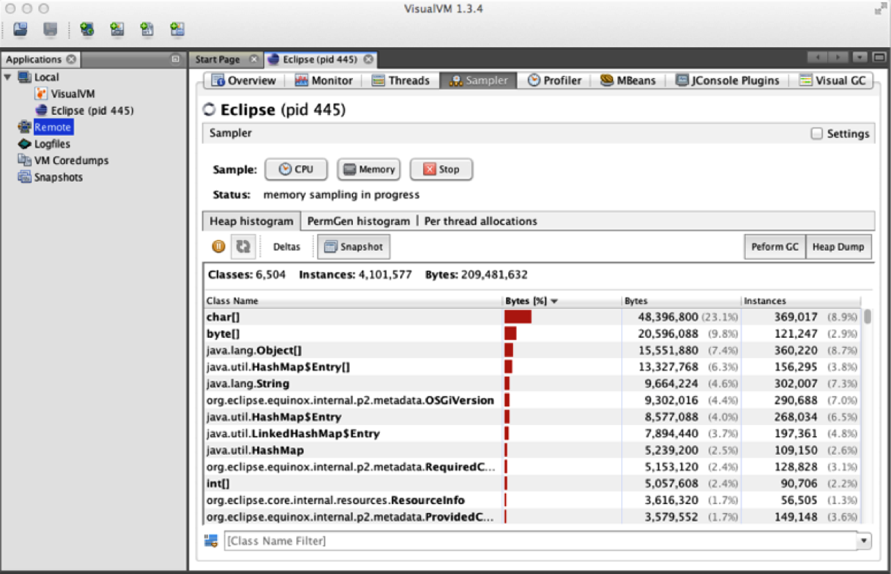

*Hình 12-9. Memory profiler của VisualVM*

Đây là góc nhìn tương đối đơn giản về bộ nhớ, nhưng có vài điều cần chỉ ra ở đây. Trước hết là khi tạo ra histogram này, có hai lựa chọn:

- Một snapshot tạo nhanh nhưng chứa cả object sống lẫn rác.
- Một snapshot chính xác, nhưng cần một STW GC trước khi được tạo ra.

Hai lựa chọn này tương ứng với hai lời gọi dòng lệnh: `jmap -histo` và `jmap -histo:live`.

Thứ hai, ngay cả một histogram đơn giản cũng có thể cho chúng ta biết một lượng nhất định về việc sử dụng bộ nhớ của ứng dụng.

Trong hầu hết ứng dụng, chuỗi (string) là kiểu dữ liệu phổ biến nhất cho đến nay. Bên trong một string là một tham chiếu đến một `byte[]` (hoặc một `char[]` trong Java 8 — việc triển khai đã thay đổi với JEP 254), nên chúng ta sẽ kỳ vọng thấy ít nhất bằng số object `byte[]` như số string.

Chúng ta cũng thường thấy các object phổ biến khác, như các entry `HashMap` và `Object[]`. Các ứng dụng nghiệp vụ cũng thường thấy các domain object của chúng xuất hiện trong danh sách các object phổ biến nhất — và điều này có thể cung cấp một lượt kiểm tra nhanh bằng cách hỏi: "Lượng domain object quan sát được có nằm trong khoảng hợp lý cho ứng dụng của tôi không?"

Chuyển từ VisualVM, và dịch chuyển trọng tâm một chút từ việc sử dụng heap sang profiling GC, chúng ta có thể dùng công cụ JMC để thu thập thống kê chứa một số giá trị không có trong Serviceability Agent truyền thống (mặc dù đa số counter được trình bày là trùng lặp với counter của SA).

Lợi thế là chi phí để JFR thu thập những giá trị này để có thể hiển thị trong JMC thấp hơn nhiều so với SA. Các hiển thị của JMC cũng cung cấp sự linh hoạt lớn hơn cho kỹ sư hiệu năng về cách các chi tiết được hiển thị.

Một cách tiếp cận khác cho allocation profiling là nhìn vào các TLAB, mà bạn đã gặp ở Chương 4. Đặc biệt, JFR dùng các sự kiện để nhận thông báo khi một object được cấp phát:

- Trong một TLAB (sự kiện `jdk.ObjectAllocationInNewTLAB`)
- Ngoài một TLAB ("đường chậm", sự kiện `jdk.ObjectAllocationOutsideTLAB`)

Điều này cho phép JFR tính bộ nhớ đang được cấp phát nhanh đến mức nào.

Khung nhìn Allocations của JMC/JFR có khả năng hiển thị khung nhìn cấp phát TLAB. Hình 12-10 cho thấy một hình mẫu về khung nhìn allocation của JMC.

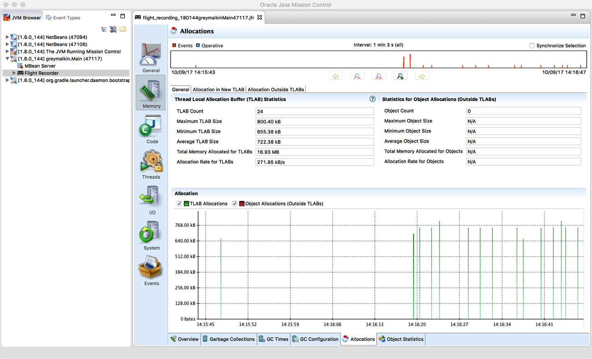

*Hình 12-10. Khung nhìn profiling Allocations của JMC*

JFR cũng đi kèm các sự kiện có thể đóng vai trò một dạng profiler rò rỉ bộ nhớ. Nó lấy mẫu các lần cấp phát object để theo dõi vòng đời của chúng, dùng sự kiện `jdk.OldObjectSample`, và theo thời gian có thể cung cấp gợi ý về điểm khởi đầu để điều tra một memory leak tiềm năng.

### Heap Dump

Một kỹ thuật memory profiling khác là phân tích heap dump. Không như allocation profiling, đây là quá trình offline, trong đó một snapshot của toàn bộ heap được tạo ra và dump vào một file.

Điều này có thể đạt được bằng lệnh `jmap`, ví dụ như sau:

```bash
jmap -dump:live,format=b,file=heap.bin <pid>
```

File dump này sau đó có thể được kiểm tra và phân tích bởi một công cụ riêng để xác định các sự kiện nổi bật, chẳng hạn live set và số lượng cùng loại object, cũng như hình dạng và cấu trúc của đồ thị object. Những công cụ này có thể ở chế độ batch hoặc tương tác.

Với một heap dump được nạp trong công cụ tương tác, kỹ sư hiệu năng sau đó có thể duyệt và phân tích snapshot của heap tại thời điểm heap dump được tạo. Họ sẽ có thể thấy các object sống và bất kỳ object nào đã chết nhưng chưa được thu gom.

Một nhược điểm lớn của heap dump là kích thước khổng lồ của chúng. Một heap dump thường có thể là 300%–400% kích thước bộ nhớ đang được dump, và với một heap production nhiều gigabyte, đây là con số đáng kể. Không chỉ heap phải được ghi ra đĩa, mà với một use case production thực, nó còn phải được truy xuất qua mạng nữa (điều có thể không dễ với ứng dụng container hóa).

Một khi đã truy xuất, nó phải được nạp trên một workstation có đủ tài nguyên (đặc biệt là bộ nhớ) để xử lý dump mà không gây trì hoãn quá mức cho quy trình làm việc. Làm việc với heap dump lớn trên một máy không thể nạp cả dump cùng lúc có thể rất đau đớn, vì workstation phải phân trang các phần của file dump vào và ra khỏi đĩa.

Việc tạo file heap cũng đòi hỏi cùng sự đánh đổi như chúng ta đã thấy với heap histogram — hoặc rác hiện ra bên cạnh các object sống, hoặc tiến trình stop-the-world trong khi heap được duyệt và dump được ghi ra. Trong một hệ thống dựa trên cloud hiện đại, một lần dừng STW như vậy có thể khiến tiến trình JVM có vẻ như đã sập trong khi một heap lớn đang được duyệt, và điều này có thể dẫn đến pod bị giết.

Bất chấp những khó khăn này, có những hoàn cảnh (như các memory leak khó cô lập) mà heap dump có thể hữu ích. Tuy nhiên, bạn nên nhận thức được một số hạn chế quanh chúng, và tránh vô tình làm suy giảm hoặc giết các pod production. Hãy chuyển sang thảo luận cách tạo và làm việc với heap dump.

Như chúng ta đã thấy ở Hình 12-9, VisualVM có thể tạo heap dump. Bạn cũng có thể dùng công cụ này để duyệt nội dung của file heap dump, nhưng trên thực tế, heap dump production khá cồng kềnh và khó làm việc trong VisualVM. Một lựa chọn thay thế là Eclipse Memory Analyzer (hay MAT), một công cụ độc lập có thể dùng để phân tích heap dump.

Phần lớn sức mạnh của MAT đến từ khả năng duyệt đồ thị object và sinh báo cáo dựa trên cấu trúc của heap. Ví dụ, MAT có thể được dùng để tìm memory leak tiềm năng, phân tích các bên tiêu thụ và chi phối bộ nhớ hàng đầu, và thực hiện các tác vụ liên quan đến bộ nhớ khác.

Hình 12-11 cho thấy ví dụ về MAT với vài báo cáo tiêu chuẩn hiển thị trong các tab.

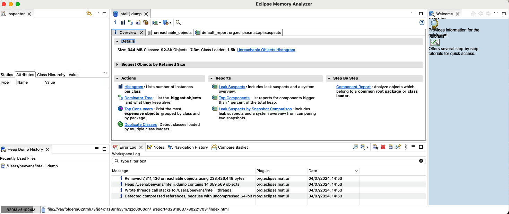

*Hình 12-11. Ví dụ khung nhìn MAT*

Nhìn chung, MAT là công cụ nâng cao, và mặc dù các báo cáo cơ bản có sẵn là hữu ích, sức mạnh thực sự của MAT đến từ việc dành chút thời gian học cách dùng nó hiệu quả.

Allocation và heap profiling đáng quan tâm với đa số ứng dụng cần được profile, và kỹ sư hiệu năng được khuyến khích không tập trung quá mức vào execution profiling mà bỏ qua bộ nhớ.

Như một lưu ý cuối cùng, các tài liệu cũ hơn có thể nhắc đến native agent profiling heap `hprof`. Cái này nhằm làm triển khai tham chiếu cho công nghệ JVMTI chứ không phải một profiler cấp production, và tài liệu thường xuyên chỉ ra điều này.

Bất chấp điều đó, khá nhiều lập trình viên bắt đầu coi `hprof` là công cụ phù hợp để dùng thực tế. Vì lý do này, công cụ `hprof` đã bị loại bỏ ở Java 9, mặc dù khả năng tạo heap dump ở định dạng `hprof` vẫn được giữ lại trong các công cụ như `jmap`. Nếu toolchain hiện tại của bạn dùng `hprof`, thì bạn nên di chuyển sang một công cụ được hỗ trợ như MAT.

## Tóm tắt

Chủ đề profiling là một chủ đề thường bị lập trình viên hiểu nhầm. Cả execution profiling lẫn memory profiling đều là những kỹ thuật cần thiết. Tuy nhiên, rất quan trọng khi kỹ sư hiệu năng hiểu họ đang làm gì — và tại sao. Chỉ đơn giản dùng công cụ một cách mù quáng có thể tạo ra kết quả hoàn toàn không chính xác hoặc không liên quan và lãng phí rất nhiều thời gian phân tích.

Việc profile các ứng dụng hiện đại đòi hỏi sử dụng công cụ, và có rất nhiều lựa chọn, bao gồm cả lựa chọn thương mại lẫn mã nguồn mở.

Ở chương tiếp theo, chúng ta sẽ rời profiling và nói cụ thể về concurrency và cách dùng nó hiệu quả trong ứng dụng Java của bạn. Điều này sẽ bao gồm các kỹ thuật then chốt tổng quát hóa được sang trường hợp hệ phân tán, nên chúng sẽ liên quan đến trường hợp cloud native.

---

[^1]: "Structured Programming with go to Statements," *Computing Surveys*, vol. 6, no. 4 (December 1974): 268.

[^2]: Điều này có thể bao gồm một lượt quét toàn bảng hoặc một vấn đề lazy-load của ORM, hay còn gọi là vấn đề N + 1.

[^3]: Các đội cũng có thể triển khai các sự kiện JFR tùy chỉnh để thêm vào ứng dụng của mình.

[^4]: Có thể khó attach vào một môi trường production đang chạy qua JMX trực tiếp, nên việc trích xuất một file dump JFR thường là cách tiếp cận dễ hơn.

[^5]: Cách tiếp cận này, dựa trên `timer_create`, cũng đã được profiler của Go áp dụng từ bản 1.18.

[^6]: Humphrey Burchell, Octave Larose, Sophie Kaleba, và Stefan Marr, "Don't Trust Your Profiler: An Empirical Study on the Precision and Accuracy of Java Profilers," *MPLR 2023: Proceedings of the 20th ACM SIGPLAN International Conference on Managed Programming Languages and Runtimes* (2023): 100–113, Association for Computing Machinery.

[^7]: Mẫu hình Visitor là một design pattern kinh điển trích xuất một thao tác (trong trường hợp này là phân tích bộ nhớ) vào một class riêng có thể duyệt các thành phần con của một object hợp thành.
