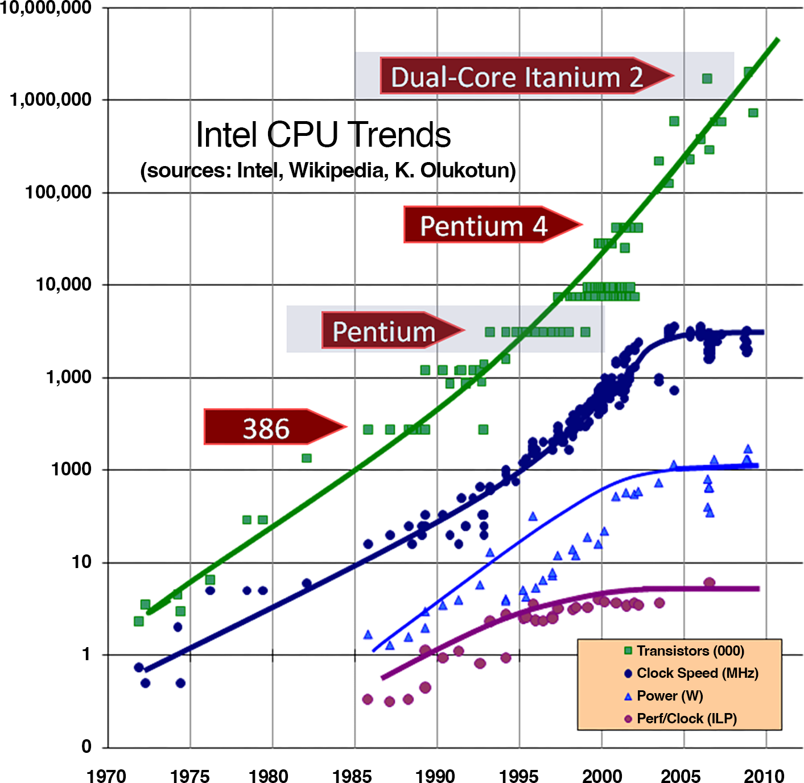
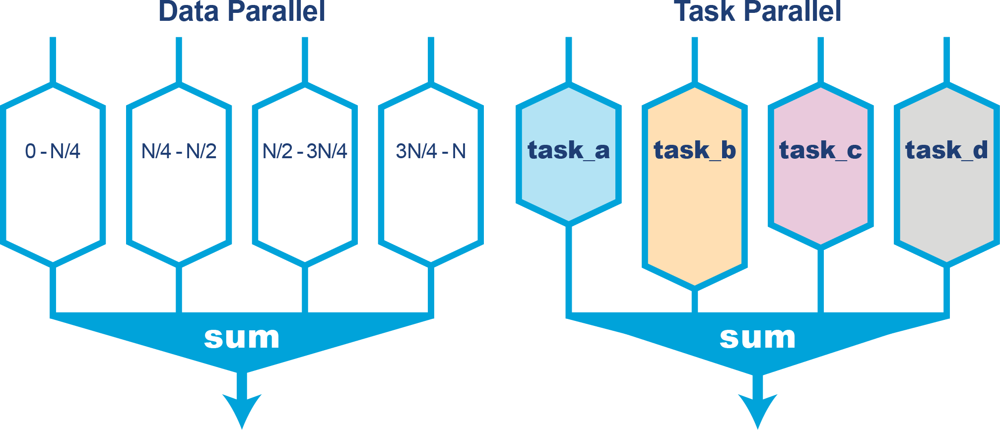
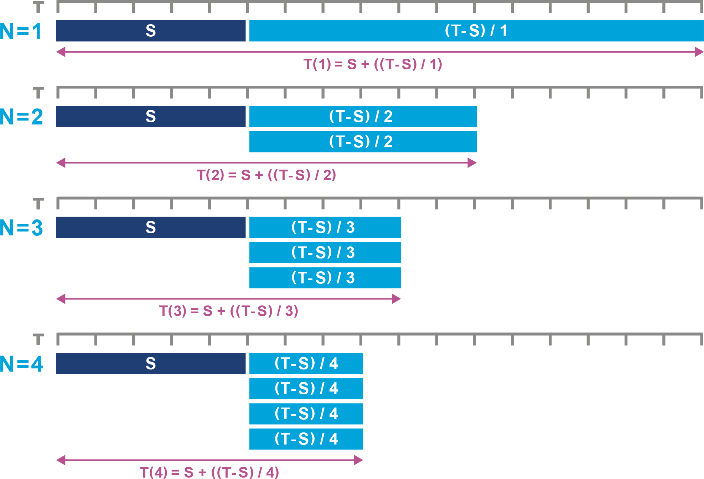
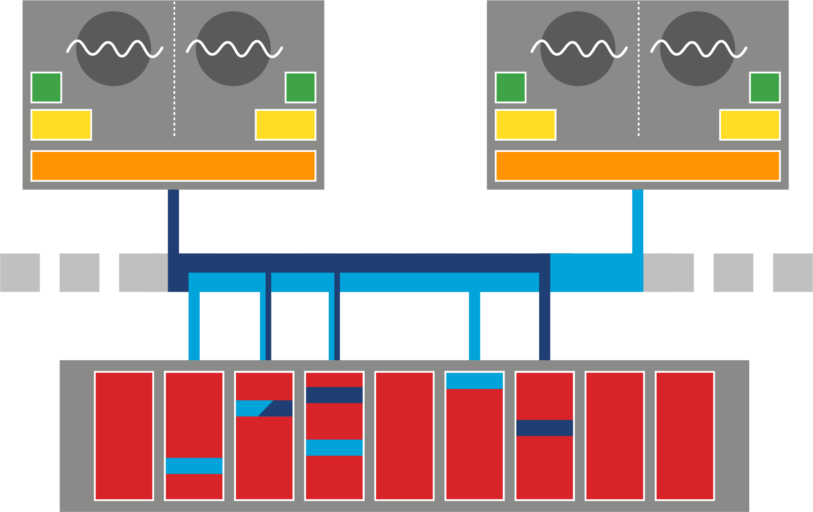
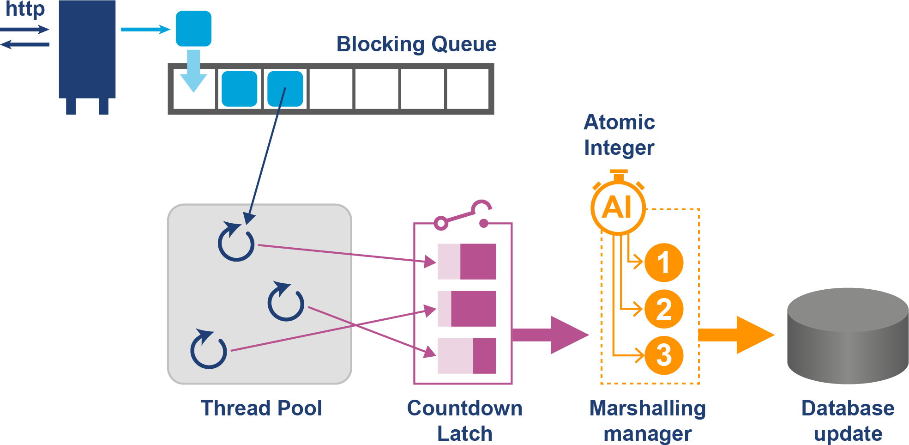
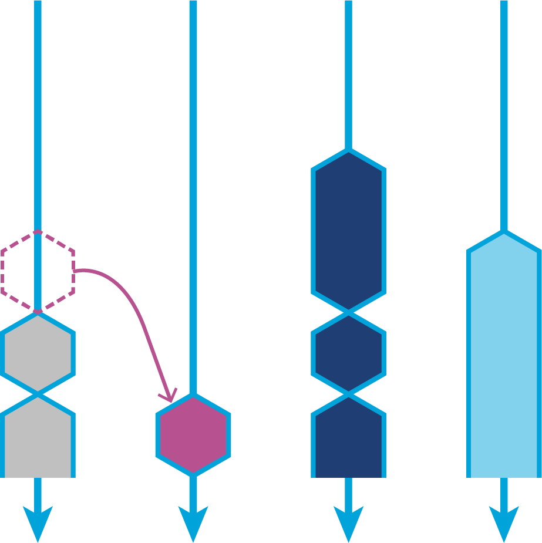
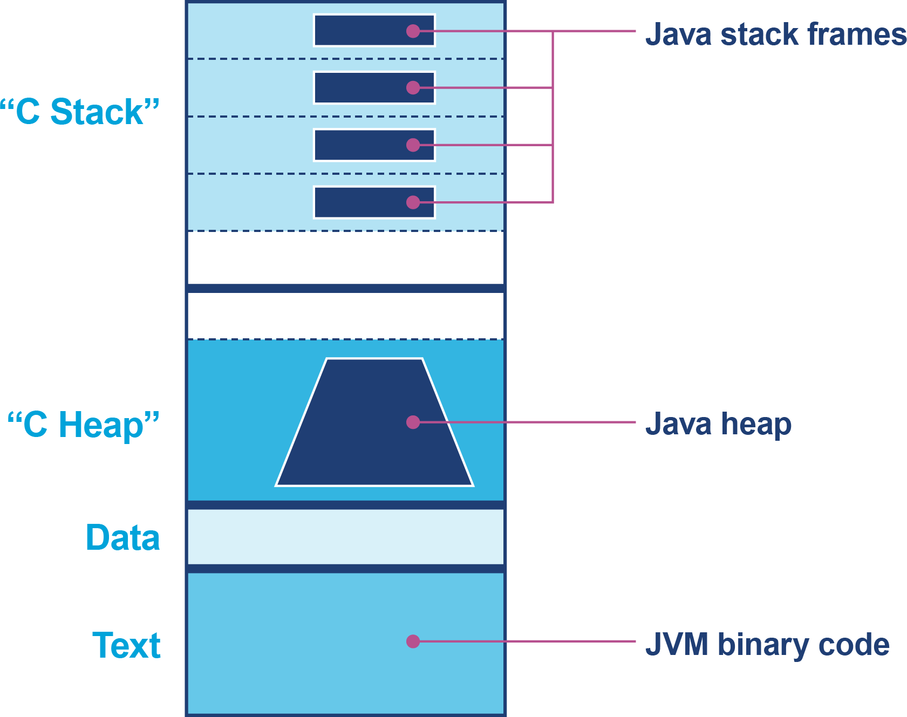
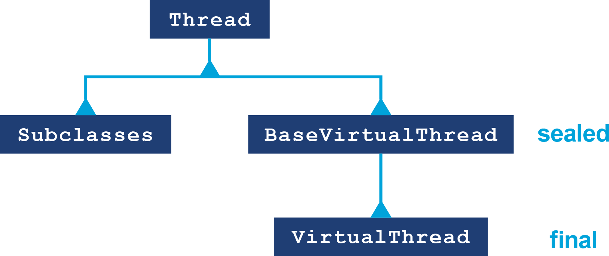

# Chương 13. Kỹ thuật hiệu năng đồng thời

Trong lịch sử điện toán đến nay, các nhà phát triển phần mềm thường viết mã theo định dạng tuần tự. Ngôn ngữ lập trình và phần cứng nhìn chung chỉ hỗ trợ khả năng xử lý một chỉ thị tại một thời điểm. Trong nhiều tình huống, một "bữa trưa miễn phí" đã được tận hưởng, khi hiệu năng ứng dụng cải thiện chỉ nhờ mua phần cứng mới nhất. Số transistor tăng lên trên một con chip dẫn đến các bộ xử lý tốt hơn và mạnh hơn.

Nhiều độc giả hẳn đã trải qua tình huống mà việc chuyển phần mềm sang một cỗ máy lớn hơn hoặc mới hơn là giải pháp cho các vấn đề về năng lực, thay vì trả cái giá điều tra các vấn đề gốc rễ hoặc cân nhắc một mô hình lập trình khác.

Định luật Moore ban đầu dự đoán số transistor trên một chip sẽ tăng gấp đôi mỗi năm. Sau đó ước tính được tinh chỉnh thành mỗi 18 tháng. Định luật Moore đứng vững trong khoảng 50 năm, nhưng nó đã bắt đầu chững lại. Đà tiến chúng ta tận hưởng suốt hơn 50 năm ngày càng khó duy trì.

Tác động của việc công nghệ cạn kiệt động lực có thể thấy ở Hình 13-1, trụ cột trung tâm của "The Free Lunch Is Over," một bài viết năm 2005 của Herb Sutter mô tả rất đúng sự xuất hiện của kỷ nguyên hiện đại trong phân tích hiệu năng.[^1]

Chúng ta giờ sống trong một thế giới nơi bộ xử lý đa lõi là chuẩn mực. Các ứng dụng hiện đại được viết tốt phải tận dụng việc phân phối xử lý ứng dụng trên nhiều lõi. Các nền tảng thực thi ứng dụng như JVM có lợi thế rõ rệt.



*Hình 13-1. The Free Lunch Is Over (Sutter, 2005)*

Đó là bởi luôn có các VM thread có thể tận dụng nhiều lõi bộ xử lý cho các thao tác như biên dịch JIT và garbage collection. Điều này có nghĩa ngay cả các ứng dụng JVM chỉ có một application thread duy nhất cũng hưởng lợi từ phần cứng đa lõi.

Để tận dụng đầy đủ phần cứng hiện tại, chuyên gia Java hiện đại phải có ít nhất nền tảng cơ bản về concurrency và các hệ quả của nó với hiệu năng ứng dụng. Chương này là tổng quan cơ bản nhưng không nhằm cung cấp phần trình bày đầy đủ về concurrency trong Java. Thay vào đó, nên tham khảo thêm một hướng dẫn như *Java Concurrency in Practice* của Brian Goetz và cộng sự (Addison-Wesley Professional) bên cạnh phần thảo luận này.

## Giới thiệu về Parallelism

Trong gần 50 năm, tốc độ lõi đơn tăng lên, rồi khoảng năm 2005 nó bắt đầu chững lại ở khoảng tốc độ xung nhịp 3 GHz do các ràng buộc vật lý trên phần cứng. Các kỹ sư phần mềm buộc phải tập trung nhiều hơn vào kỹ thuật hiệu năng, vì chỉ có thể kỳ vọng những cải thiện hạn chế về hiệu năng phần cứng.

Trong phần này, chúng ta sẽ thảo luận một số nền tảng lý thuyết cơ bản của parallelism và concurrency.

Một trong những khái niệm cơ bản quan trọng nhất là sự phân biệt giữa *data parallelism* (song song dữ liệu) và *task parallelism* (song song tác vụ).

**Data parallelism** là về việc chia nhỏ một tác vụ lớn đơn lẻ thao tác trên một pool dữ liệu lớn. Điều này liên quan đến việc phân phối các khối dữ liệu trên các bộ xử lý khác nhau, ví dụ, một ứng dụng cần xử lý bảng lương và có thể cấp cho mỗi lõi CPU một khối nhân viên để xử lý.

**Task parallelism**, mặt khác, liên quan đến việc phân phối việc thực thi các thao tác *khác nhau* trên các bộ xử lý, như thấy ở Hình 13-2. Trong Java, điều này sẽ đạt được bằng cách dùng thread và object `Executor` — ví dụ, mẫu hình mà mỗi thread phục vụ một người dùng trong ứng dụng REST Java.



*Hình 13-2. Concurrency song song dữ liệu và song song tác vụ*

Điều quan trọng là hiểu khi nào dùng mỗi cách tiếp cận, và trong chương này chúng ta sẽ thảo luận các mẫu hình và lý thuyết liên quan áp dụng cho cả hai trường hợp.

Hãy bắt đầu bằng cách gặp một định luật nổi tiếng của tính toán.

### Định luật Amdahl

Trong thế giới đa lõi ngày nay, định luật Amdahl nổi lên như một cân nhắc lớn để cải thiện tốc độ thực thi của một tác vụ tính toán — thường là tác vụ rõ ràng song song về dữ liệu.

Chúng tôi đã giới thiệu định luật Amdahl ở Chương 1, nhưng giờ chúng ta cần một mô tả chính thức hơn. Hãy xét một tác vụ tính toán song song dữ liệu có thể chia thành hai phần — một phần có thể thực thi song song, và một phần phải chạy tuần tự (ví dụ, để đối chiếu kết quả hoặc phân phối các đơn vị công việc cho việc thực thi song song).

Hãy gọi phần tuần tự là `S` và tổng thời gian cần cho tác vụ là `T`. Chúng ta có thể dùng bao nhiêu bộ xử lý tùy thích cho tác vụ, nên ta ký hiệu số bộ xử lý là `N`. Điều này có nghĩa chúng ta nên viết `T` như một hàm của số bộ xử lý, `T(N)`. Phần đồng thời của công việc là `T - S`, và nếu cái này có thể chia đều cho `N` bộ xử lý, thì tổng thời gian cho tác vụ là:

```
T(N) = S + (1 / N) * (T - S)
```

Điều này có nghĩa dù dùng bao nhiêu bộ xử lý, tổng thời gian không bao giờ có thể ít hơn thời gian tuần tự. Vậy nên, nếu chi phí phụ trội tuần tự là, chẳng hạn, 5% tổng, thì dù dùng bao nhiêu lõi, mức tăng tốc hiệu dụng sẽ không bao giờ vượt quá 20 lần. Nhận định và công thức này tạo nên lý thuyết nền tảng đằng sau phần thảo luận nhập môn về định luật Amdahl ở Chương 1. Tác động có thể thấy theo cách khác ở Hình 13-3.

Chỉ những cải thiện về hiệu năng đơn luồng, như lõi nhanh hơn, mới có thể giảm giá trị của `S`. Đáng tiếc, các xu hướng trong phần cứng hiện đại có nghĩa là tốc độ xung nhịp CPU không còn cải thiện ở mức đáng kể nào. Là hệ quả của việc bộ xử lý đơn lõi không còn nhanh hơn, định luật Amdahl thường là giới hạn thực tế của việc scale phần mềm.

Một hệ quả của định luật Amdahl là nếu không cần giao tiếp giữa các tác vụ song song hay xử lý tuần tự khác, thì về lý thuyết mức tăng tốc không giới hạn là khả thi. Lớp workload này được gọi là *embarrassingly parallel* (song song đến mức đáng xấu hổ), và trong trường hợp này, xử lý đồng thời khá đơn giản để đạt được.

Cách tiếp cận thông thường là chia nhỏ workload giữa nhiều worker thread mà không có dữ liệu chung. Một khi trạng thái hay dữ liệu chung được đưa vào giữa các thread, workload tăng độ phức tạp và tất yếu tái đưa vào một số xử lý tuần tự và chi phí phụ trội giao tiếp.



*Hình 13-3. Định luật Amdahl, nhìn lại*

> Viết chương trình đúng thì khó; viết chương trình đồng thời đúng còn khó hơn. Đơn giản là có nhiều thứ có thể sai trong một chương trình đồng thời hơn trong một chương trình tuần tự.
>
> — *Java Concurrency in Practice*, Brian Goetz và cộng sự (Addison-Wesley Professional)

Đến lượt nó, điều này có nghĩa là bất kỳ workload nào có trạng thái chung đều cần được bảo vệ và kiểm soát đúng cách. Với các workload chạy trên JVM, nền tảng cung cấp một tập các đảm bảo về bộ nhớ gọi là Java Memory Model (JMM). Hãy xem vài ví dụ đơn giản giải thích các vấn đề của concurrency trong Java trước khi giới thiệu mô hình này một cách sâu sắc.

## Concurrency Java nền tảng

Một trong những bài học đầu tiên học được về bản chất phản trực giác của concurrency là nhận ra rằng việc tăng một counter không phải là một thao tác đơn lẻ. Hãy xem:

```java
public class Counter {
    private int i = 0;
    public int increment() {
        return i = i + 1;
    }
}
```

Phân tích bytecode cho đoạn này tạo ra một loạt chỉ thị dẫn đến việc nạp, tăng và lưu giá trị:

```
public int increment();
    Code:
    0: aload_0
    1: aload_0
    2: getfield      #2   // Field i:I
    5: iconst_1
    6: iadd
    7: dup_x1
    8: putfield      #2   // Field i:I
   11: ireturn
```

Nếu counter không được bảo vệ bởi một lock phù hợp và được một thread khác truy cập, có thể một lượt nạp xảy ra trước khi một thread khác lưu giá trị. Vấn đề này dẫn đến *lost update* (mất cập nhật).

Để thấy điều này chi tiết hơn, hãy xét hai thread, A và B, cùng gọi method `increment()` trên cùng một object. Để đơn giản, giả sử chúng chạy trên một máy có một CPU duy nhất và bytecode biểu diễn chính xác việc thực thi mức thấp (nên không có sắp xếp lại, hiệu ứng cache, hay các chi tiết khác của bộ xử lý thực).

> **GHI CHÚ**
>
> Vì bộ lập lịch của hệ điều hành gây ra context switching của các thread tại những thời điểm không xác định, nhiều chuỗi bytecode khác nhau là khả dĩ ngay cả chỉ với hai thread.

Giả sử CPU đơn thực thi các bytecode như sau (lưu ý rằng có một thứ tự thực thi được xác định rõ cho các chỉ thị, điều này sẽ không đúng trên một hệ thống đa xử lý thực):

```
A0: aload_0
A1: aload_0
A2: getfield #2 // Field i:I
A5: iconst_1
A6: iadd
A7: dup_x1
B0: aload_0
B1: aload_0
B2: getfield #2 // Field i:I
B5: iconst_1
B6: iadd
B7: dup_x1
A8: putfield #2 // Field i:I
A11: ireturn
B8: putfield #2 // Field i:I
B11: ireturn
```

Mỗi thread sẽ có một evaluation stack riêng từ lần vào method riêng của nó, nên chỉ các thao tác trên field mới có thể can thiệp lẫn nhau (bởi các field của object nằm trong heap, vốn được chia sẻ).

Hành vi kết quả là, nếu trạng thái ban đầu của `i` là `7` trước khi A hoặc B bắt đầu thực thi, thì nếu thứ tự thực thi đúng như vừa trình bày, cả hai lời gọi sẽ trả về `8` và trạng thái field sẽ được cập nhật thành `8`, bất chấp việc `increment()` đã được gọi hai lần.

> **CẢNH BÁO**
>
> Vấn đề này chỉ do việc lập lịch của OS gây ra — không cần thủ thuật phần cứng nào để phơi bày vấn đề này, và nó sẽ là vấn đề ngay cả trên một CPU rất cũ không có các tính năng hiện đại.

Một ngộ nhận nữa là thêm từ khóa `volatile` sẽ khiến thao tác increment an toàn. Bằng cách buộc giá trị luôn được đọc lại từ cache, `volatile` đảm bảo rằng mọi cập nhật sẽ được thread khác nhìn thấy. Tuy nhiên, nó không ngăn vấn đề lost update vừa nêu, vì vấn đề đến từ bản chất hợp thành của toán tử increment.

Ví dụ sau cho thấy hai thread chia sẻ tham chiếu đến cùng một counter:

```java
public class CounterExample implements Runnable {

    private final Counter counter;

    public CounterExample(Counter counter) {
        this.counter = counter;
    }

    @Override
    public void run() {
        for (int i = 0; i < 100; i++) {
            System.out.println(Thread.currentThread().getName()
                    + " Value: " + counter.increment());
        }
    }
}
```

Counter không được bảo vệ bởi `synchronized` hay một lock phù hợp. Mỗi lần chương trình chạy, việc thực thi hai thread có thể xen kẽ theo những cách khác nhau.

Trong một số dịp mã sẽ chạy như kỳ vọng và counter sẽ tăng ổn thỏa. Đó là do may mắn ngu ngơ của lập trình viên! Trong những dịp khác, việc xen kẽ có thể cho thấy các giá trị lặp lại trong counter do lost update, như thấy ở đây:

```
Thread-1 Value: 1
Thread-1 Value: 2
Thread-1 Value: 3
Thread-0 Value: 1
Thread-1 Value: 4
Thread-1 Value: 6
Thread-0 Value: 5
```

Nói cách khác, một chương trình đồng thời chạy thành công hầu hết thời gian không phải là một chương trình đồng thời *đúng*. Việc chứng minh nó thất bại không giống với việc chứng minh nó đúng — chỉ cần tìm một ví dụ thất bại là đủ để chứng minh nó không đúng.

Tệ hơn nữa, việc tái tạo bug trong mã đồng thời có thể cực kỳ khó. Câu châm ngôn nổi tiếng của Dijkstra rằng "kiểm thử cho thấy sự hiện diện, chứ không phải sự vắng mặt của bug" áp dụng cho mã đồng thời còn mạnh hơn cả với ứng dụng đơn luồng.

Chúng ta có thể dùng `synchronized` để kiểm soát việc cập nhật một giá trị đơn giản như một `int`.[^2]

Vấn đề với việc dùng đồng bộ hóa là nó đòi hỏi thiết kế cẩn thận và suy nghĩ trước. Không có điều đó, việc chỉ đơn giản thêm đồng bộ hóa để cho phép concurrency có thể làm chậm chương trình.

Điều này ngược lại với toàn bộ mục tiêu của việc thêm concurrency: tăng throughput. Theo đó, bất kỳ đợt song song hóa một codebase nào cũng phải được hỗ trợ bởi các bài test hiệu năng chứng minh đầy đủ lợi ích của độ phức tạp bổ sung.

> **GHI CHÚ**
>
> Việc thêm khối đồng bộ hóa, đặc biệt nếu chúng không bị tranh chấp, rẻ hơn nhiều so với các phiên bản JVM cũ (nhưng vẫn không nên làm nếu không cần thiết).

Để làm tốt hơn cách tiếp cận "bắn đạn ghém" với đồng bộ hóa, chúng ta cần hiểu mô hình bộ nhớ mức thấp của JVM và cách nó áp dụng cho các kỹ thuật thực tiễn với ứng dụng đồng thời.

## Tìm hiểu JMM

Java đã có một mô hình chính thức về bộ nhớ, JMM, từ phiên bản 1.0. Mô hình này được sửa đổi mạnh, và một số vấn đề được khắc phục trong JSR 133,[^3] vốn được đưa ra như một phần của Java 5.

Trong các đặc tả Java, JMM xuất hiện dưới dạng mô tả toán học về bộ nhớ. Nó có tiếng là khá đáng gờm, và nhiều lập trình viên coi nó là phần khó hiểu nhất của đặc tả Java (có lẽ ngoại trừ generic).

JMM tìm cách cung cấp câu trả lời cho những câu hỏi như:

- Điều gì xảy ra khi hai lõi truy cập cùng dữ liệu?
- Khi nào chúng được đảm bảo thấy cùng giá trị?
- Bộ nhớ cache ảnh hưởng đến những câu trả lời này ra sao?

Ở bất cứ đâu trạng thái chung được truy cập, nền tảng sẽ đảm bảo rằng những lời hứa trong JMM được tôn trọng. Những lời hứa này rơi vào hai nhóm chính: đảm bảo liên quan đến *thứ tự* (ordering) và đảm bảo liên quan đến *khả năng nhìn thấy* (visibility) các cập nhật giữa các thread.

Khi phần cứng chuyển từ đơn lõi sang đa lõi rồi nhiều lõi, bản chất của mô hình bộ nhớ ngày càng trở nên quan trọng. Thứ tự và khả năng nhìn thấy giữa các thread không còn là vấn đề lý thuyết mà giờ là những vấn đề thực tiễn tác động trực tiếp đến mã của các lập trình viên đang làm việc.

Ở mức cao, có hai cách tiếp cận khả dĩ mà một mô hình bộ nhớ như JMM có thể áp dụng:

**Mô hình bộ nhớ mạnh**
: Mọi lõi luôn thấy cùng giá trị.

**Mô hình bộ nhớ yếu**
: Các lõi có thể thấy giá trị khác nhau, và có các quy tắc cache đặc biệt kiểm soát khi nào điều này xảy ra.

Từ góc nhìn lập trình, mô hình bộ nhớ mạnh có vẻ rất hấp dẫn — không kém phần quan trọng là vì nó không đòi hỏi lập trình viên phải đặc biệt cẩn thận khi viết mã ứng dụng.

Ở Hình 13-4, chúng ta thấy một góc nhìn (đơn giản hóa rất nhiều) về hệ thống đa CPU hiện đại. Chúng ta đã thấy góc nhìn này ở Chương 5 và lại ở Chương 7, nơi nó được thảo luận trong ngữ cảnh kiến trúc NUMA.



*Hình 13-4. Hệ thống đa CPU hiện đại*

Nếu một mô hình bộ nhớ mạnh được triển khai trên nền phần cứng này, điều này sẽ tương đương với cách tiếp cận writeback với bộ nhớ.

Thông báo về việc vô hiệu hóa cache sẽ làm ngập bus bộ nhớ, và tốc độ truyền hiệu dụng đến/từ bộ nhớ chính sẽ lao dốc. Vấn đề này chỉ tệ hơn khi số lõi tăng lên, khiến cách tiếp cận này về cơ bản không phù hợp với thế giới nhiều lõi.

Cũng đáng nhớ rằng Java được thiết kế để là môi trường độc lập kiến trúc. Điều này có nghĩa nếu JVM chỉ định một mô hình bộ nhớ mạnh, nó sẽ đòi hỏi thêm công việc triển khai trong phần mềm chạy trên nền phần cứng không hỗ trợ mô hình bộ nhớ mạnh một cách native. Đến lượt nó, điều này sẽ làm tăng rất nhiều công việc port cần thiết để triển khai một JVM trên phần cứng yếu.

Trên thực tế, JMM có mô hình bộ nhớ rất yếu. Điều này phù hợp hơn với các xu hướng trong kiến trúc CPU thực, bao gồm MESI (mô tả ở phần "Bộ nhớ đệm"). Nó cũng khiến việc port dễ hơn, vì JMM đưa ra ít đảm bảo.

Rất quan trọng khi nhận ra rằng JMM chỉ là *yêu cầu tối thiểu*. Các triển khai JVM và CPU thực có thể làm nhiều hơn JMM yêu cầu, như đã thảo luận ở phần "Mô hình bộ nhớ phần cứng".

Điều này có thể khiến các nhà phát triển ứng dụng bị ru ngủ trong cảm giác an toàn giả tạo. Nếu một ứng dụng được phát triển trên nền tảng phần cứng có mô hình bộ nhớ mạnh hơn JMM, thì các bug concurrency chưa được phát hiện có thể sống sót — vì chúng không bộc lộ trên thực tế nhờ các đảm bảo phần cứng. Khi cùng ứng dụng đó được triển khai lên phần cứng yếu hơn, các bug concurrency có thể trở thành vấn đề vì ứng dụng không còn được phần cứng bảo vệ.

Các đảm bảo do JMM cung cấp dựa trên một tập khái niệm cơ bản:

**Happens-before**
: Một sự kiện chắc chắn xảy ra trước một sự kiện khác.

**Synchronizes-with**
: Sự kiện sẽ khiến góc nhìn của nó về một object được đồng bộ với bộ nhớ chính.

**As-if-serial**
: Các chỉ thị có vẻ như thực thi theo thứ tự khi nhìn từ ngoài thread đang thực thi.

**Release-before-acquire**
: Các lock sẽ được một thread giải phóng trước khi được thread khác giành lấy.

Một trong những kỹ thuật quan trọng nhất để xử lý trạng thái chung có thể thay đổi là khóa (locking) qua đồng bộ hóa. Đây là phần nền tảng trong góc nhìn của Java về concurrency, và chúng ta sẽ cần thảo luận nó khá sâu để làm việc thỏa đáng với JMM.

> **CẢNH BÁO**
>
> Với các lập trình viên quan tâm đến hiệu năng, việc quen sơ qua với class `Thread` và các nguyên thủy cơ bản ở mức ngôn ngữ của cơ chế concurrency trong Java là chưa đủ.

Trong góc nhìn này, các thread có mô tả riêng về trạng thái của một object, và mọi thay đổi thread thực hiện đều phải được flush ra bộ nhớ chính rồi được đọc lại bởi bất kỳ thread nào khác đang truy cập cùng dữ liệu. Điều này phù hợp với góc nhìn write-behind của phần cứng như đã thảo luận trong ngữ cảnh MESI, nhưng trong JVM có một lượng đáng kể mã triển khai bao bọc việc truy cập bộ nhớ mức thấp.

Từ quan điểm này, rõ ràng ngay lập tức từ khóa `synchronized` của Java chỉ điều gì: nó có nghĩa là góc nhìn cục bộ của thread đang giữ monitor đã được *synchronized-with* bộ nhớ chính.

Các method và khối `synchronized` định nghĩa các điểm chạm nơi các thread phải thực hiện đồng bộ. Chúng cũng định nghĩa các khối mã phải hoàn tất đầy đủ trước khi các khối hay method `synchronized` khác có thể bắt đầu.

JMM không nói gì về việc truy cập không đồng bộ hóa. Không có đảm bảo nào về việc khi nào, nếu có, những thay đổi thực hiện trên một thread sẽ trở nên nhìn thấy được với các thread khác. Nếu cần những đảm bảo như vậy, thì việc truy cập ghi phải được bảo vệ bởi một khối `synchronized`, kích hoạt writeback các giá trị đã cache ra bộ nhớ chính. Tương tự, việc truy cập đọc cũng phải nằm trong một phần mã được đồng bộ hóa để buộc đọc lại từ bộ nhớ.

Trước khi có concurrency Java hiện đại, việc dùng từ khóa `synchronized` của Java là cơ chế duy nhất đảm bảo thứ tự và khả năng nhìn thấy dữ liệu giữa nhiều thread.

JMM thực thi hành vi này và cung cấp nhiều đảm bảo có thể giả định về Java và an toàn bộ nhớ. Tuy nhiên, lock `synchronized` truyền thống của Java có vài hạn chế, ngày càng trở nên nghiêm trọng:

- Mọi thao tác `synchronized` trên object bị khóa đều được đối xử như nhau. Không có cơ hội chỉ định chiến lược ưu tiên hay phân biệt giữa truy cập đọc và ghi.
- Việc giành và giải phóng lock phải được làm ở mức method hoặc trong một khối `synchronized` bên trong một method.
- Hoặc lock được giành hoặc thread bị block; không có cách nào để *thử* giành lock và tiếp tục xử lý nếu lock không lấy được.

Một sai lầm rất phổ biến là quên rằng cả thao tác đọc lẫn ghi trên dữ liệu bị khóa đều phải được đối xử công bằng. Nếu một ứng dụng chỉ dùng `synchronized` cho thao tác ghi, điều này có thể dẫn đến lost update.

Ví dụ, có vẻ như một lượt đọc không cần lock, nhưng nó phải dùng `synchronized` để đảm bảo khả năng nhìn thấy các cập nhật đến từ thread khác.

> **GHI CHÚ**
>
> Đồng bộ hóa giữa các thread trong Java là cơ chế *hợp tác*, và nó không hoạt động đúng nếu dù chỉ một thread tham gia không tuân theo các quy tắc.

Một tài nguyên cho người mới với JMM là *JSR-133 Cookbook for Compiler Writers*. Nó chứa lời giải thích đơn giản hóa về các khái niệm JMM mà không làm người đọc quá tải với chi tiết.

Ví dụ, như một phần của việc trình bày mô hình bộ nhớ, một số *barrier* trừu tượng được giới thiệu và thảo luận. Chúng nhằm cho phép người triển khai JVM và tác giả thư viện suy nghĩ về các quy tắc concurrency Java theo cách tương đối độc lập CPU.

Các quy tắc mà các triển khai JVM phải tuân theo được nêu chi tiết trong các đặc tả Java. Trên thực tế, các chỉ thị thực tế triển khai mỗi barrier trừu tượng rất có thể khác nhau trên các CPU khác nhau. Ví dụ, mô hình CPU Intel tự động ngăn một số sắp xếp lại trong phần cứng, nên một số barrier mô tả trong cookbook thực ra là no-op.

Một cân nhắc cuối cùng: bối cảnh hiệu năng là mục tiêu di động. Cả sự tiến hóa của phần cứng lẫn biên giới của concurrency đều không đứng yên kể từ khi JMM được tạo ra. Kết quả là, mô tả của JMM là một biểu diễn không đầy đủ về phần cứng và bộ nhớ hiện đại.

Trong Java 9, JMM đã được mở rộng trong nỗ lực bắt kịp (ít nhất một phần) thực tế của các hệ thống hiện đại. Một khía cạnh then chốt của điều này là tính tương thích với các môi trường lập trình khác, đặc biệt là C++11, vốn đã tiếp thu ý tưởng từ JMM rồi mở rộng chúng. Điều này có nghĩa mô hình C++11 cung cấp định nghĩa cho các khái niệm nằm ngoài phạm vi của JMM Java 5 (JSR 133). Java 9 cập nhật JMM để mang một số khái niệm đó vào nền tảng Java và cho phép mã Java mức thấp, có ý thức về phần cứng, tương tác nhất quán với C++11.

Để đi sâu hơn vào JMM, xem bài blog của Aleksey Shipilёv "Close Encounters of the Java Memory Model Kind", một nguồn bình luận và thông tin kỹ thuật rất chi tiết tuyệt vời.

## Xây dựng thư viện Concurrency

Dù rất thành công, JMM khó hiểu và còn khó dịch thành cách dùng thực tiễn hơn. Liên quan đến điều này là sự thiếu linh hoạt mà intrinsic locking cung cấp.

Kết quả là, từ Java 5, đã có xu hướng ngày càng tăng hướng tới việc chuẩn hóa các thư viện và công cụ concurrency chất lượng cao như một phần của thư viện class Java, và rời xa hỗ trợ tích hợp ở mức ngôn ngữ. Trong đại đa số use case, kể cả những trường hợp nhạy cảm về hiệu năng, các thư viện này phù hợp hơn việc tạo các lớp trừu tượng mới từ đầu.

Các thư viện trong `java.util.concurrent` được thiết kế để việc viết ứng dụng đa luồng trong Java dễ hơn nhiều. Công việc của lập trình viên Java là chọn mức trừu tượng phù hợp nhất với yêu cầu của họ, và may mắn thay việc chọn các thư viện được trừu tượng hóa tốt của `java.util.concurrent` cũng sẽ mang lại hiệu năng "thread hot" tốt hơn. Chúng tôi dùng thuật ngữ "thread hot" để chỉ các profile đồng thời nơi các thread dành phần lớn thời gian thực thi chứ không tranh chấp với các thread khác thực hiện tác vụ trên cùng cấu trúc.

Các khối xây dựng cốt lõi được cung cấp rơi vào vài danh mục tổng quát:

- Lock và semaphore
- Atomic
- Blocking queue
- Latch
- Executor

Ở Hình 13-5, chúng ta thấy biểu diễn của một ứng dụng Java đồng thời hiện đại điển hình được xây từ các nguyên thủy concurrency và logic nghiệp vụ.



*Hình 13-5. Ví dụ ứng dụng đồng thời*

Một số khối xây dựng này được thảo luận ở phần tiếp theo, nhưng trước khi xem lại chúng, hãy xem một số kỹ thuật triển khai chính được dùng trong các thư viện. Hiểu cách các thư viện concurrency được triển khai sẽ cho phép các lập trình viên có ý thức về hiệu năng dùng chúng tốt nhất. Với các lập trình viên hoạt động ở rìa cực đoan, việc biết các thư viện hoạt động ra sao sẽ cho các đội đã vượt qua thư viện chuẩn một điểm khởi đầu để chọn (hoặc phát triển) các bản thay thế hiệu năng siêu cao.

Nhìn chung, các thư viện cố rời xa việc dựa vào hệ điều hành và thay vào đó làm việc nhiều hơn trong user space khi có thể. Điều này có một số lợi thế, không kém phần quan trọng là hành vi của thư viện khi đó hy vọng sẽ nhất quán hơn trên toàn cầu, thay vì phụ thuộc vào những biến thể nhỏ nhưng quan trọng giữa các hệ điều hành kiểu Unix.

### Method Handle và Var Handle

Ở Chương 6, chúng ta gặp `invokedynamic`. Bước phát triển lớn này trong nền tảng mang lại sự linh hoạt lớn hơn nhiều trong việc xác định method nào sẽ được thực thi tại một call site. Điểm then chốt là một call site `invokedynamic` không xác định method nào sẽ được gọi cho đến lúc runtime.

Thay vào đó, khi call site được trình thông dịch đạt tới, một method phụ trợ đặc biệt (gọi là *bootstrap method*, hay BSM) được gọi. BSM trả về một object (một *method handle*, do Method Handles API cung cấp) đại diện cho method thực sự nên được gọi tại call site. Đây được gọi là *call target* và được nói là được "buộc vào" (laced into) call site.

> **GHI CHÚ**
>
> Trong trường hợp đơn giản nhất, việc tra cứu call target chỉ được làm một lần — lần đầu tiên call site được gặp — nhưng có những trường hợp phức tạp hơn mà call site có thể bị vô hiệu hóa và việc tra cứu được chạy lại (có thể dẫn đến call target khác).

Về cốt lõi, Method Handles API cung cấp khả năng quyết định, lấy và gọi một method lúc runtime, mà không cần biết trước lúc biên dịch. Nó tương tự, ở nhiều khía cạnh, với Reflection API nổi tiếng hơn (nhưng cũ hơn nhiều) — tuy nhiên, API nhìn chung tốt hơn, ít cồng kềnh hơn, và với vài lỗi thiết kế đáng kể đã được sửa.

> **GHI CHÚ**
>
> Không quá gượng ép khi nghĩ về method handle như một phiên bản hiện đại hơn của reflection, và từ Java 21, khả năng reflection thực ra được triển khai trên nền method handle.

Một object `MethodHandle` từ package `java.lang.invoke` trong `java.base` đại diện cho một tham chiếu thực thi trực tiếp đến một method. Những object method handle này có một nhóm vài method liên quan cho phép thực thi method nền tảng. Trong số đó, `invoke()` là phổ biến nhất, nhưng có các helper bổ sung và những biến thể nhỏ của method invoker chính.

Cũng như với lời gọi reflective, method nền tảng của một method handle có thể có bất kỳ chữ ký nào. Do đó, các method invoker trên method handle cần có chữ ký rất dễ dãi để có sự linh hoạt đầy đủ. Tuy nhiên, method handle cũng có một tính năng mới và độc đáo vượt ra ngoài trường hợp reflective.

Để hiểu tính năng mới này, và tại sao nó quan trọng, trước hết hãy xét một đoạn mã đơn giản gọi một method theo cách reflective:

```java
Method m = ...
Object receiver = ...
Object o = m.invoke(receiver, new Object(), new Object());
```

Điều này tạo ra đoạn bytecode khá không có gì đáng ngạc nhiên sau:

```
17: iconst_0
18: new           #2    // class java/lang/Object
21: dup
22: invokespecial #1    // Method java/lang/Object."<init>":()V
25: aastore
26: dup
27: iconst_1
28: new           #2    // class java/lang/Object
31: dup
32: invokespecial #1    // Method java/lang/Object."<init>":()V
35: aastore
36: invokevirtual #3    // Method java/lang/reflect/Method.invoke
                        // :(Ljava/lang/Object;[Ljava/lang/Object;)
                        // Ljava/lang/Object;
```

Các opcode `iconst` và `aastore` được dùng để lưu phần tử thứ không và thứ nhất của các tham số variadic vào một mảng để truyền cho `invoke()`. Sau đó, chữ ký tổng thể của lời gọi trong bytecode rõ ràng là `invoke:(Ljava/lang/Object;[Ljava/lang/Object;)Ljava/lang/Object;`, vì method nhận một tham số object duy nhất (receiver) theo sau bởi số lượng tham số variadic sẽ được truyền cho lời gọi reflective. Cuối cùng nó trả về một `Object`, tất cả cho thấy rằng không có gì được biết về lời gọi method này lúc biên dịch — chúng ta đẩy mọi khía cạnh của nó sang runtime.

Kết quả là, đây là một lời gọi rất tổng quát, và nó rất có thể thất bại lúc runtime nếu receiver và object `Method` không khớp hoặc nếu danh sách tham số không đúng.

Ngược lại, hãy xem một ví dụ đơn giản tương tự thực hiện với method handle:

```java
MethodType mt = MethodType.methodType(int.class);
MethodHandles.Lookup l = MethodHandles.lookup();
MethodHandle mh = l.findVirtual(String.class, "hashCode", mt);

String receiver = "b";
int ret = (int) mh.invoke(receiver);
System.out.println(ret);
```

Có hai phần trong lời gọi: đầu tiên là việc tra cứu method handle, rồi là việc gọi nó. Trong các hệ thống thực, hai phần này có thể cách xa nhau về thời gian hoặc vị trí mã; method handle là các object bất biến, ổn định và có thể dễ dàng được cache và giữ lại để dùng sau.

Cơ chế tra cứu có vẻ như là boilerplate bổ sung, nhưng nó được dùng để khắc phục một vấn đề đã tồn tại với reflection từ khi ra đời — kiểm soát truy cập.

Khi một class được nạp lần đầu, bytecode được kiểm tra rộng rãi. Điều này bao gồm kiểm tra để đảm bảo class không cố gắng một cách ác ý gọi bất kỳ method nào mà nó không có quyền truy cập. Bất kỳ nỗ lực gọi method không truy cập được nào sẽ dẫn đến quá trình nạp class thất bại.

Vì lý do hiệu năng, một khi class đã được nạp, không có kiểm tra nào nữa được thực hiện. Điều này mở ra một cửa sổ mà mã reflective có thể cố khai thác, và các lựa chọn thiết kế ban đầu do hệ thống con reflection đưa ra (từ tận Java 1.1) không hoàn toàn thỏa đáng, vì vài lý do.

Method Handles API áp dụng cách tiếp cận khác: *lookup context*. Để dùng nó, chúng ta tạo một object context bằng cách gọi `MethodHandles.lookup()`. Object bất biến được trả về có trạng thái ghi lại những method và field nào truy cập được tại điểm object context được tạo.

Điều này có nghĩa object context có thể được dùng ngay lập tức, hoặc được lưu trữ. Sự linh hoạt này cho phép các mẫu hình mà một class có thể cho phép truy cập chọn lọc vào các method private của nó (bằng cách cache một object lookup và lọc truy cập vào nó). Ngược lại, reflection chỉ có công cụ thô bạo là thủ thuật `setAccessible()`, vốn hoàn toàn lật đổ các tính năng an toàn của kiểm soát truy cập trong Java.

Hãy xem bytecode cho phần lookup của ví dụ method handle:

```
0: getstatic     #2 // Field java/lang/Integer.TYPE:Ljava/lang/Class;
3: invokestatic  #3 // Method java/lang/invoke/MethodType.methodType:
                    // (Ljava/lang/Class;)Ljava/lang/invoke/MethodType;
6: astore_1
7: invokestatic  #4 // Method java/lang/invoke/MethodHandles.lookup:
                    // ()Ljava/lang/invoke/MethodHandles$Lookup;
10: astore_2
11: aload_2
12: ldc           #5 // class java/lang/String
14: ldc           #6 // String hashCode
16: aload_1
17: invokevirtual #7 // Method java/lang/invoke/MethodHandles$Lookup.findVirtual
                     // (Ljava/lang/Class;Ljava/lang/String;Ljava/lang/invoke/
                     // MethodType;)Ljava/lang/invoke/MethodHandle;
20: astore_3
```

Đoạn mã này đã sinh ra một object context có thể thấy mọi method truy cập được tại điểm lời gọi static `lookup()` diễn ra. Từ đây, chúng ta có thể dùng `findVirtual()` (và các method liên quan) để lấy handle cho bất kỳ method nào nhìn thấy được tại điểm đó. Nếu chúng ta cố truy cập một method không nhìn thấy được qua lookup context, thì một `IllegalAccessException` sẽ được ném ra. Không như với reflection, không có cách nào để lập trình viên lật đổ hay tắt lượt kiểm tra truy cập này.

Trong ví dụ, chúng ta chỉ đơn giản tra cứu method public `hashCode()` trên `String`, vốn không cần quyền truy cập đặc biệt. Tuy nhiên, chúng ta vẫn phải dùng cơ chế lookup, và nền tảng vẫn sẽ kiểm tra xem object context có quyền truy cập method được yêu cầu hay không. Tiếp theo, hãy xem bytecode sinh ra bởi việc gọi method handle:

```
21: ldc           #8  // String b
23: astore        4
25: aload_3
26: aload         4
28: invokevirtual #9  // Method java/lang/invoke/MethodHandle.invoke
                      // :(Ljava/lang/String;)I
31: istore        5
33: getstatic     #10 // Field java/lang/System.out:Ljava/io/PrintStream;
36: iload         5
38: invokevirtual #11 // Method java/io/PrintStream.println:(I)V
```

Điều này khác biệt đáng kể so với trường hợp reflective bởi lời gọi tới `invoke()` không đơn giản là một lời gọi "một cỡ vừa mọi người" chấp nhận mọi tham số, mà thay vào đó mô tả chữ ký kỳ vọng của method nên được gọi lúc runtime.

> **GHI CHÚ**
>
> Bytecode cho việc gọi method handle chứa thông tin kiểu tĩnh về call site tốt hơn so với những gì chúng ta sẽ thấy trong trường hợp reflective tương ứng.

Trong trường hợp của chúng ta, chữ ký lời gọi là `invoke:(Ljava/lang/String;)I`, và không có gì trong JavaDoc của `MethodHandle` cho thấy class này có method như vậy.

Thay vào đó, trình biên dịch mã nguồn `javac` đã suy ra một chữ ký kiểu phù hợp cho lời gọi này và phát ra lời gọi tương ứng, dù không có method nào như vậy tồn tại trên `MethodHandle`. Bytecode do `javac` phát ra cũng đã thiết lập stack sao cho lời gọi này sẽ được dispatch theo cách thông thường (giả sử nó liên kết được) mà không có việc đóng hộp varargs vào một mảng.

Bất kỳ JVM runtime nào nạp bytecode này đều được yêu cầu liên kết lời gọi method này như hiện trạng, với kỳ vọng rằng method handle sẽ, lúc runtime, đại diện cho một lời gọi có chữ ký đúng và rằng lời gọi `invoke()` về cơ bản sẽ được thay bằng một lời gọi ủy quyền đến method nền tảng.

> **GHI CHÚ**
>
> Tính năng ngôn ngữ hơi kỳ lạ này của Java được gọi là *signature polymorphism* và chỉ áp dụng cho method handle.

Đây tất nhiên là một tính năng ngôn ngữ rất không giống Java, và use case được thiên lệch có chủ đích về phía những người triển khai ngôn ngữ và framework.

Với nhiều lập trình viên, một cách đơn giản để nghĩ về method handle là chúng cung cấp khả năng tương tự reflection nhưng được làm theo cách hiện đại với an toàn kiểu tĩnh tối đa có thể. Không có gì ngạc nhiên, chúng là bộ công cụ rất hữu ích để triển khai các thư viện concurrency và hiệu năng cao khác.

Trong lịch sử, lựa chọn duy nhất để triển khai các mối quan tâm mức thấp là dùng `Unsafe`. Nó là cách duy nhất để truy cập trực tiếp các tính năng CPU và phần cứng khác, quản lý bộ nhớ off-heap, và nói chung là vượt qua các ràng buộc được đặt đúng chỗ của Java. Bất chấp ý định để `Unsafe` nằm trong phạm vi sử dụng của JDK, nó đã trở nên phổ biến trong hầu như mọi framework Java. Method handle và var handle rất quan trọng, vì chúng đại diện cho con đường tiến lên và nền tảng cho các thư viện concurrency, bao gồm atomic và CAS.

### Atomic và CAS

Class atomic integer của Java (`java.util.concurrent.AtomicInteger`) có các thao tác hợp thành để cộng, tăng và giảm, kết hợp với một `get()` để trả về kết quả bị ảnh hưởng. Điều này có nghĩa một thao tác tăng trên hai thread riêng biệt sẽ trả về `currentValue + 1` và `currentValue + 2`. Ngữ nghĩa của biến atomic là phần mở rộng của `volatile`, nhưng chúng linh hoạt hơn. Các thao tác dựa trên thread được thực hiện mà không cần đồng bộ hóa để đảm bảo khả năng nhìn thấy các tương tác khác.

Lưu ý rằng atomic không kế thừa từ kiểu cơ sở mà chúng bọc, và chúng không cho phép thay thế trực tiếp. Ví dụ, `AtomicInteger` không kế thừa `Integer` — một mặt vì `java.lang.Integer` (đúng đắn) là class final, mặt khác `Integer` đại diện cho một giá trị bất biến, trong khi `AtomicInteger` một cách tường minh là một giá trị có thể thay đổi, thread-safe.

Atomic, cùng với một số thư viện concurrency khác (đáng chú ý là các lock trong `java.util.concurrent`) dựa vào các chỉ thị bộ xử lý mức thấp và đặc thù hệ điều hành để triển khai một kỹ thuật gọi là *compare and swap* (CAS).

Kỹ thuật này nhận một cặp giá trị, "giá trị hiện tại kỳ vọng" và "giá trị mới mong muốn", cùng một vị trí bộ nhớ (một con trỏ). Như một đơn vị atomic, hai thao tác xảy ra:

1. Giá trị hiện tại kỳ vọng được so sánh với nội dung của vị trí bộ nhớ.
2. Nếu chúng khớp, giá trị hiện tại được hoán đổi với giá trị mới mong muốn.

CAS là khối xây dựng cơ bản cho vài tính năng concurrency mức cao then chốt, nên đây là ví dụ kinh điển về việc bối cảnh hiệu năng và phần cứng đã không đứng yên kể từ khi JMM được tạo ra.

Bất chấp việc tính năng CAS được triển khai trong phần cứng trên hầu hết bộ xử lý hiện đại, nó không tạo thành một phần của JMM hay đặc tả nền tảng Java. Trong lịch sử, do đó nó được xử lý như một phần mở rộng đặc thù triển khai, và việc truy cập phần cứng CAS được cung cấp qua class `sun.misc.Unsafe`.

Tuy nhiên, ở các phiên bản Java gần đây, nỗ lực ngày càng tăng đã được thực hiện để loại bỏ `Unsafe` và thay nó bằng method handle và var handle.[^4]

> **GHI CHÚ**
>
> Việc lập trình viên dùng các tiện ích được cung cấp và không tự viết triển khai riêng của, chẳng hạn, một atomic integer, là tối quan trọng để dùng atomic hiệu quả. Yên tâm rằng thư viện chuẩn đã tận dụng method handle (và `Unsafe`, khi được phép).

Hãy xem một ví dụ nhanh cho thấy chúng ta có thể tiếp cận việc thay thế `Unsafe` ra sao:

```java
public class AtomicIntegerWithVarHandles extends Number {

    private volatile int value = 0;
    private static final VarHandle V;

    static {
        try {
            MethodHandles.Lookup l = MethodHandles.lookup();
            V = l.findVarHandle(AtomicIntegerWithVarHandles.class, "value",
                int.class);
        } catch (ReflectiveOperationException e) {
            throw new Error(e);
        }
    }

    public final int getAndSet(int newValue) {
        int v;
        do {
            v = (int)V.getVolatile(this);
        } while (!V.compareAndSet(this, v, newValue));

        return v;
    }
    // ....
```

Mẫu này minh họa việc dùng một vòng lặp để liên tục thử lại một thao tác CAS. Điều này để xử lý tình huống mà phép so sánh thất bại nên việc cập nhật không được thực hiện. Thường điều này xảy ra khi một thread khác vừa thực hiện một cập nhật giữa lúc đọc và lúc ghi (như thread này thấy).

Vòng lặp thử lại này tạo ra sự suy giảm hiệu năng tuyến tính nếu cần nhiều lần thử lại để cập nhật biến. Khi xét đến hiệu năng, việc giám sát mức tranh chấp để đảm bảo mức throughput vẫn cao là quan trọng.

Với cảnh báo này, chúng ta có thể thấy rằng atomic là lock-free và do đó không thể deadlock.

### Lock và Spinlock

Các intrinsic lock tạo nên cơ sở của `synchronized` trong Java vận hành bằng cách gọi hệ điều hành từ mã user. OS được dùng để đưa một thread vào trạng thái chờ vô định cho đến khi được báo hiệu. Đây có thể là chi phí phụ trội khổng lồ nếu tài nguyên bị tranh chấp chỉ được dùng trong thời gian rất ngắn.

Các kỹ thuật lock-free bắt đầu từ tiền đề rằng việc blocking là xấu cho throughput và có thể làm suy giảm hiệu năng. Thay vào đó, có thể hiệu quả hơn nhiều khi để thread bị block ở lại hoạt động trên một CPU, không hoàn thành công việc hữu ích nào, và "đốt CPU" thử lại lock cho đến khi nó khả dụng.

Kỹ thuật này gọi là *spinlock* và nhằm nhẹ hơn một mutual-exclusion lock đầy đủ. Trong các hệ thống hiện đại, spinlock thường được triển khai bằng CAS, giả sử phần cứng hỗ trợ nó. Hãy xem một ví dụ đơn giản bằng assembly x86 mức thấp:

```asm
locked:
        dd    0

spin_lock:
        mov   eax, 1
        xchg  eax, [locked]
        test  eax, eax
        jnz   spin_lock
        ret

spin_unlock:
        mov   eax, 0
        xchg  eax, [locked]
        ret
```

Việc triển khai chính xác một spinlock khác nhau giữa các CPU, nhưng khái niệm cốt lõi là như nhau trên mọi hệ thống:

- Thao tác "test and set" — ở đây được triển khai bởi `xchg` — phải là atomic.
- Nếu có tranh chấp cho spinlock, các bộ xử lý đang chờ thực thi một vòng lặp chặt.

CAS về cơ bản cho phép cập nhật an toàn một giá trị trong một chỉ thị nếu giá trị kỳ vọng là đúng. Điều này giúp chúng ta tạo các khối xây dựng cho một lock.

Tất nhiên, các kỹ thuật này cũng có cái giá. Việc chiếm một lõi CPU là tốn kém về mặt sử dụng và tiêu thụ điện năng: cỗ máy sẽ không nhàn rỗi, nhưng việc quay vòng này cũng ngụ ý nóng hơn, nghĩa là sẽ cần nhiều điện hơn để làm mát lõi đang không xử lý gì.

## Tóm lược về các thư viện Concurrency

Concurrency trong Java ban đầu được thiết kế cho một môi trường mà các tác vụ blocking chạy lâu có thể được xen kẽ để cho phép các thread khác thực thi — ví dụ, I/O và các thao tác chậm tương tự — nhưng nơi phần cứng nền tảng thường chỉ có một lõi thực thi. Ngày nay, hầu như mọi cỗ máy đều là hệ thống đa lõi (kể cả điện thoại di động), nên việc sử dụng hiệu quả tài nguyên CPU sẵn có là rất hợp lý.

Tuy nhiên, khi khái niệm concurrency được xây vào Java, đó không phải là thứ mà ngành công nghiệp có nhiều kinh nghiệm. Trên thực tế, Java là môi trường chuẩn công nghiệp đầu tiên xây hỗ trợ threading ở mức ngôn ngữ — với Thread API. Kết quả là, nhiều bài học đau đớn mà lập trình viên học được về concurrency lần đầu được gặp trong Java. Trong Java, cách tiếp cận nhìn chung là không deprecate các tính năng (đặc biệt là tính năng lõi), nên Thread API vẫn là một phần của Java và sẽ luôn như vậy.

Điều này dẫn đến tình huống mà, trong phát triển ứng dụng hiện đại, thread khá mức thấp so với mức trừu tượng mà lập trình viên Java quen viết mã. Ví dụ, trong Java chúng ta không xử lý quản lý bộ nhớ thủ công, vậy tại sao lập trình viên Java phải xử lý việc tạo thread mức thấp và các sự kiện vòng đời khác?

May mắn thay, Java hiện đại cung cấp một môi trường cho phép đạt được hiệu năng đáng kể từ các lớp trừu tượng được xây vào ngôn ngữ và thư viện chuẩn. Điều này cho phép lập trình viên có lợi thế của lập trình đồng thời với ít bực bội mức thấp và ít boilerplate hơn.

Chúng ta đã thấy phần giới thiệu về các kỹ thuật triển khai mức thấp dùng để cho phép các class atomic và lock đơn giản. Giờ hãy xem thư viện chuẩn dùng những khả năng này ra sao để tạo các thư viện production đầy đủ tính năng cho mục đích chung.

### Lock trong java.util.concurrent

Java 5 hình dung lại các lock và thêm một interface tổng quát hơn cho lock trong `java.util.concurrent.locks.Lock`. Interface này cung cấp nhiều khả năng hơn hành vi của intrinsic lock:

**`lock()`**
: Theo truyền thống giành lock và sẽ block cho đến khi lock khả dụng.

**`newCondition()`**
: Tạo các điều kiện quanh lock, cho phép lock được dùng linh hoạt hơn. Cho phép phân tách mối quan tâm trong lock (ví dụ, một lượt đọc và một lượt ghi).

**`tryLock()`**
: Cố gắng giành lock (với một timeout tùy chọn), cho phép một thread tiếp tục quá trình trong tình huống lock không khả dụng.

**`unlock()`**
: Giải phóng lock. Đây là lời gọi tương ứng theo sau một `lock()`.

Bên cạnh việc cho phép tạo các loại lock khác nhau, các lock giờ cũng có thể trải rộng nhiều method, vì có thể lock trong một method và unlock trong method khác. Nếu một thread muốn giành lock theo cách không blocking, nó có thể làm vậy bằng method `tryLock()` và rút lui nếu lock không khả dụng.

`ReentrantLock` là triển khai chính của `Lock` và về cơ bản dùng một `compareAndSwap()` với một `int`. Điều này có nghĩa việc giành lock là lock-free trong trường hợp không tranh chấp. Điều này có thể tăng đáng kể hiệu năng của một hệ thống nơi có ít tranh chấp lock, đồng thời cung cấp sự linh hoạt bổ sung của các chính sách khóa khác nhau.

> **MẸO**
>
> Ý tưởng một thread có thể giành lại cùng một lock được gọi là *re-entrant locking*, và điều này ngăn một thread tự block chính nó. Hầu hết các sơ đồ khóa ở mức ứng dụng hiện đại đều là re-entrant.

Các lời gọi thực tế đến `compareAndSwap()` và việc dùng `Unsafe` có thể tìm thấy trong lớp con static `Sync`, một phần mở rộng của `AbstractQueuedSynchronizer`. `AbstractQueuedSynchronizer` cũng dùng class `LockSupport`, có các method cho phép thread được park (đỗ) và resume (tiếp tục). Class `LockSupport` hoạt động bằng cách phát *permit* (giấy phép) cho các thread, và nếu không có permit khả dụng, thread phải chờ.

Ý tưởng permit tương tự khái niệm phát permit trong semaphore, nhưng ở đây chỉ có một permit duy nhất (một semaphore nhị phân). Nếu một permit không khả dụng, thread sẽ bị park, và một khi có permit hợp lệ, thread sẽ được unpark. Các method của class này thay thế các method đã bị deprecated từ lâu là `Thread.suspend()` và `Thread.resume()`.

Có ba dạng của `park()` ảnh hưởng đến đoạn mã giả cơ bản sau:

```java
while (!canProceed()) { ... LockSupport.park(this); }
```

Chúng là:

**`park(Object blocker)`**
: Block cho đến khi một thread khác gọi `unpark()`, thread bị interrupt, hoặc một lần đánh thức giả (spurious wakeup) xảy ra.

**`parkNanos(Object blocker, long nanos)`**
: Hành xử giống `park()` nhưng cũng sẽ trả về một khi thời gian nano chỉ định trôi qua.

**`parkUntil(Object blocker, long deadline)`**
: Tương tự `parkNanos()` nhưng thay vào đó dùng một điểm thời gian tuyệt đối (deadline) chỉ định bằng mili-giây từ Epoch.

### Read/Write Lock

Nhiều thành phần trong ứng dụng sẽ có sự mất cân bằng giữa số thao tác đọc và số thao tác ghi. Đọc không thay đổi trạng thái, trong khi thao tác ghi thì có. Việc dùng `synchronized` truyền thống hay `ReentrantLock` (không có điều kiện) sẽ theo chiến lược lock đơn. Trong các tình huống như caching, nơi có thể có nhiều người đọc và một người ghi, cấu trúc dữ liệu có thể dành nhiều thời gian block người đọc một cách không cần thiết do một lượt đọc khác.

Class `ReentrantReadWriteLock` phơi bày một `ReadLock` và một `WriteLock` có thể dùng trong mã. Lợi thế là nhiều thread đọc không khiến các thread đọc khác bị block. Thao tác duy nhất sẽ block là ghi. Việc dùng mẫu khóa này khi số người đọc cao có thể cải thiện đáng kể throughput của thread và giảm khóa. Cũng có thể đặt lock vào "fair mode", làm suy giảm hiệu năng nhưng đảm bảo các thread được xử lý theo thứ tự.

Triển khai sau cho `AgeCache` sẽ là cải thiện đáng kể so với phiên bản dùng lock đơn:

```java
public class AgeCache {
    private final ReentrantReadWriteLock rwl = new ReentrantReadWriteLock();
    private final Lock readLock = rwl.readLock();
    private final Lock writeLock = rwl.writeLock();
    private Map<String, Integer> ageCache = new HashMap<>();

    public Integer getAge(String name) {
        readLock.lock();
        try {
            return ageCache.get(name);
        } finally {
            readLock.unlock();
        }
    }

    public void updateAge(String name, int newAge) {
        writeLock.lock();
        try {
            ageCache.put(name, newAge);
        } finally {
            writeLock.unlock();
        }
    }
}
```

Tuy nhiên, chúng ta có thể làm nó tối ưu hơn nữa bằng cách xét đến cấu trúc dữ liệu nền tảng. Trong ví dụ này, một concurrent collection sẽ là lớp trừu tượng hợp lý hơn và mang lại lợi ích thread hot lớn hơn.

### Semaphore

Semaphore cung cấp một kỹ thuật độc đáo để cho phép truy cập vào một số tài nguyên khả dụng — chẳng hạn thread trong một pool hay các object kết nối cơ sở dữ liệu. Một semaphore hoạt động trên tiền đề rằng "nhiều nhất X object được phép truy cập" và vận hành bằng cách có một số permit cố định để kiểm soát truy cập:

```java
// Semaphore với 2 permit và mô hình fair
private Semaphore poolPermits = new Semaphore(2, true);
```

`Semaphore::acquire()` giảm số permit khả dụng đi một, và nếu không có permit nào khả dụng, sẽ block. `Semaphore::release()` trả lại một permit và sẽ giải phóng một bên đang chờ giành permit nếu có. Vì semaphore thường được dùng ở nơi tài nguyên có khả năng bị block hoặc xếp hàng, rất có khả năng một semaphore sẽ được khởi tạo ở chế độ fair để tránh thread starvation.

Một semaphore một permit (semaphore nhị phân) tương đương với một mutex, nhưng với một khác biệt rõ rệt. Một mutex chỉ có thể được giải phóng bởi thread mà mutex đang khóa trên đó, trong khi một semaphore có thể được giải phóng bởi một thread không phải chủ sở hữu. Một kịch bản mà điều này có thể cần thiết là việc buộc giải quyết một deadlock. Semaphore cũng có lợi thế là có thể yêu cầu và giải phóng nhiều permit. Nếu dùng nhiều permit, việc dùng chế độ fair là thiết yếu; nếu không có nguy cơ thread starvation.

### Concurrent Collection

Từ Java 5, các triển khai của interface collection đã được thiết kế đặc biệt cho việc dùng đồng thời. Những concurrent collection này đã được sửa đổi và cải tiến theo thời gian để cho hiệu năng thread hot tốt nhất có thể.

Ví dụ, triển khai map (`ConcurrentHashMap`) dùng cách chia thành các bucket hay segment, và chúng ta có thể tận dụng cấu trúc này để đạt được lợi ích thực về hiệu năng.

Mỗi segment có thể có chính sách khóa riêng — tức là các lock riêng của nó. Việc có cả read lock lẫn write lock cho phép nhiều người đọc đọc trên khắp `ConcurrentHashMap`, và nếu cần ghi, lock chỉ cần được giữ trên segment đơn đó. Người đọc nhìn chung không khóa và có thể chồng lấn an toàn với các thao tác kiểu `put()` và `remove()`. Người đọc vẫn sẽ quan sát thứ tự happens-before cho một thao tác cập nhật đã hoàn tất.

Điều quan trọng cần lưu ý là các iterator (và spliterator dùng cho parallel stream) được lấy như một dạng snapshot, nghĩa là chúng sẽ không ném `ConcurrentModificationException`. Bảng sẽ được mở rộng động khi có quá nhiều xung đột, đây có thể là thao tác tốn kém. Đáng để (cũng như với `HashMap`) cung cấp một ước lượng kích thước gần đúng nếu bạn biết nó lúc viết mã, hoặc dưới dạng hằng hoặc dưới dạng biến.

Java 5 cũng giới thiệu `CopyOnWriteArrayList` và `CopyOnWriteArraySet`, vốn trong một số mẫu sử dụng có thể cải thiện hiệu năng đa luồng. Với chúng, mọi thao tác biến đổi trên cấu trúc dữ liệu khiến một bản sao mới của mảng hậu thuẫn được tạo ra. Mọi iterator hiện có có thể tiếp tục duyệt mảng cũ, và một khi mọi tham chiếu bị mất, bản sao cũ của mảng đủ điều kiện được garbage collect. Một lần nữa, kiểu duyệt dạng snapshot này đảm bảo không có `ConcurrentModificationException` nào được ném ra.

Sự đánh đổi này hoạt động tốt trong các hệ thống nơi cấu trúc dữ liệu copy-on-write được truy cập để đọc nhiều hơn nhiều so với biến đổi. Nếu bạn đang cân nhắc dùng cách tiếp cận này, hãy thực hiện thay đổi với một bộ test tốt để đo cải thiện hiệu năng. Với việc sử dụng rộng rãi các collection, nên cân nhắc dùng các công cụ như JMH và microbenchmark, được thảo luận ở Phụ lục A.

### Latch và Barrier

Latch và barrier là những kỹ thuật hữu ích để kiểm soát việc thực thi một tập thread. Ví dụ, một hệ thống có thể được viết mà các worker thread:

1. Lấy dữ liệu từ một API và phân tích nó.
2. Ghi kết quả vào cơ sở dữ liệu.
3. Cuối cùng, tính kết quả dựa trên một truy vấn SQL.

Nếu hệ thống chỉ đơn giản khởi động tất cả thread chạy, sẽ không có đảm bảo nào về thứ tự các sự kiện. Hiệu ứng mong muốn là cho phép mọi thread hoàn thành tác vụ #1 rồi tác vụ #2 trước khi bắt đầu tác vụ #3. Một khả năng là dùng một latch. Giả sử chúng ta có năm thread đang chạy, chúng ta có thể viết mã như sau:

```java
public class LatchExample implements Runnable {

    private final CountDownLatch latch;

    public LatchExample(CountDownLatch latch) {
        this.latch = latch;
    }

    @Override
    public void run() {
        // Gọi một API
        System.out.println(Thread.currentThread().getName() + " Done API Call");
        try {
            latch.countDown();
            latch.await();
        } catch (InterruptedException e) {
            e.printStackTrace();
        }
        System.out.println(Thread.currentThread().getName()
            + " Continue processing");
    }

    public static void main(String[] args) throws InterruptedException {
        CountDownLatch apiLatch = new CountDownLatch(5);

        ExecutorService pool = Executors.newFixedThreadPool(5);
        for (int i = 0; i < 5; i++) {
            pool.submit(new LatchExample(apiLatch));
        }
        System.out.println(Thread.currentThread().getName()
            +" about to await on main..");
        apiLatch.await();
        System.out.println(Thread.currentThread().getName()
            + " done awaiting on main..");
        pool.shutdown();
        try {
            pool.awaitTermination(5, TimeUnit.SECONDS);
        } catch (InterruptedException e) {
            e.printStackTrace();
        }
        System.out.println("API Processing Complete");
    }
}
```

Trong ví dụ này, latch được đặt có số đếm là `5`, với mỗi thread thực hiện một lời gọi tới `countdown()` giảm số đó đi một. Một khi số đếm đạt `0`, latch sẽ mở, và mọi thread đang giữ ở hàm `await()` sẽ được giải phóng để tiếp tục xử lý.

Cần nhận thức rằng loại latch này chỉ dùng được một lần. Một khi kết quả là `0`, latch không thể tái sử dụng; không có reset.

> **GHI CHÚ**
>
> Latch cực kỳ hữu ích trong các ví dụ như điền cache lúc khởi động và kiểm thử đa luồng.

Trong ví dụ, chúng ta có thể đã dùng hai latch khác nhau: một cho kết quả API hoàn tất và một cho kết quả cơ sở dữ liệu hoàn tất. Một lựa chọn khác là dùng `CyclicBarrier`, có thể reset được. Tuy nhiên, việc tìm ra thread nào nên kiểm soát việc reset là thách thức khá khó và liên quan đến một loại đồng bộ hóa khác. Một best practice phổ biến là dùng một barrier/latch cho mỗi giai đoạn trong pipeline.

## Executor và trừu tượng hóa Task

Trên thực tế, hầu hết lập trình viên Java không phải xử lý các mối quan tâm threading mức thấp (có lẽ ngoại trừ các use case fire-and-forget của virtual thread). Thay vào đó, chúng ta nên tìm cách dùng một số tính năng của `java.util.concurrent` vốn hỗ trợ lập trình đồng thời ở mức trừu tượng phù hợp. Ví dụ, việc giữ các thread bận rộn bằng một số thư viện `java.util.concurrent` sẽ cho phép hiệu năng thread hot tốt hơn (tức là giữ một thread chạy thay vì bị block và ở trạng thái chờ).

Mức trừu tượng có ít mối quan tâm threading có thể được mô tả là một *concurrent task* — tức là một đơn vị mã hoặc công việc mà chúng ta yêu cầu chạy đồng thời trong ngữ cảnh thực thi hiện tại. Việc xem các đơn vị công việc như task đơn giản hóa việc viết một chương trình đồng thời, vì lập trình viên không phải xét vòng đời thread cho các thread thực sự thực thi task. Cách tiếp cận này cũng giúp việc tắt có kiểm soát (tức là đảm bảo các thread hoàn thành task một cách sạch sẽ), như chúng ta sẽ thấy sau.

### Giới thiệu thực thi bất đồng bộ

Một cách thực hiện trừu tượng hóa task trong Java là dùng interface `Callable` để đại diện cho một task trả về một giá trị. Interface `Callable<V>` là interface generic định nghĩa một hàm, `call()`, trả về một giá trị kiểu `V` và ném exception trong trường hợp không thể tính được kết quả. Bề ngoài, `Callable` trông rất giống `Runnable`; tuy nhiên, `Runnable` không trả về kết quả và không ném exception.

> **GHI CHÚ**
>
> Nếu `Runnable` ném một unchecked exception không được bắt, nó lan lên stack và, theo mặc định, thread đang thực thi ngừng chạy.

Việc xử lý exception trong vòng đời của một thread là một vấn đề lập trình khó. Cũng nên lưu ý rằng thread được đối xử như các tiến trình kiểu OS, nghĩa là chúng có thể tốn kém để tạo trên một số hệ điều hành. Việc lấy được bất kỳ kết quả nào từ `Runnable` cũng có thể thêm độ phức tạp, đặc biệt về mặt điều phối việc trả về thực thi so với một thread khác, chẳng hạn.

Kiểu `Callable<V>` cung cấp cho chúng ta một cách xử lý trừu tượng hóa task một cách gọn ghẽ, nhưng những task này thực sự được thực thi ra sao?

Một `ExecutorService` là một interface định nghĩa cơ chế thực thi các task trên một pool các thread được quản lý. Việc triển khai thực tế của `ExecutorService` định nghĩa các thread trong pool nên được quản lý ra sao và nên có bao nhiêu thread. Một `ExecutorService` có thể nhận hoặc `Runnable` hoặc `Callable` qua method `submit()` và các phiên bản nạp chồng của nó.

Class helper `Executors` có một loạt factory method `new*` xây dựng service và thread pool hậu thuẫn theo hành vi được chọn. Những factory method này là cách thông thường để tạo object executor mới, một số cái phổ biến nhất là:

**`newFixedThreadPool(int nThreads)`**
: Xây dựng một `ExecutorService` với thread pool kích thước cố định, trong đó các thread sẽ được tái sử dụng để chạy nhiều task. Điều này tránh phải trả chi phí tạo thread nhiều lần cho mỗi task. Khi mọi thread đang được dùng, các task mới được lưu trong hàng đợi.

**`newCachedThreadPool()`**
: Xây dựng một `ExecutorService` sẽ tạo thread mới khi cần và tái sử dụng thread khi có thể. Các thread được tạo được giữ 60 giây, sau đó chúng sẽ bị loại khỏi cache. Việc dùng thread pool này có thể cho hiệu năng tốt hơn với các task bất đồng bộ nhỏ.

**`newSingleThreadExecutor()`**
: Xây dựng một `ExecutorService` được hậu thuẫn bởi một thread duy nhất. Mọi task mới gửi được xếp hàng cho đến khi thread khả dụng. Loại executor này có thể hữu ích để kiểm soát số task được thực thi đồng thời.

**`newScheduledThreadPool(int corePoolSize)`**
: Có một loạt method bổ sung cho phép một task được thực thi tại một thời điểm trong tương lai, nhận `Callable` và một độ trễ.

Một khi một task được gửi, nó sẽ được xử lý bất đồng bộ, và mã gửi có thể chọn block hoặc poll để lấy kết quả. Lời gọi `submit()` tới `ExecutorService` trả về một `Future<V>` cho phép một `get()` blocking hoặc một `get()` với timeout, hoặc một lời gọi không blocking dùng `isDone()`.

### Chọn một ExecutorService

Việc chọn đúng `ExecutorService` cho phép kiểm soát tốt xử lý bất đồng bộ và có thể mang lại lợi ích hiệu năng đáng kể nếu bạn chọn đúng số thread trong pool.

Cũng có thể viết một `ExecutorService` tùy chỉnh, nhưng điều này thường không cần thiết. Một cách thư viện hỗ trợ là cung cấp một tùy chọn tùy chỉnh: khả năng cung cấp một `ThreadFactory`. `ThreadFactory` cho phép tác giả viết một bộ tạo thread tùy chỉnh có thể đặt các thuộc tính trên thread như tên, trạng thái daemon, và độ ưu tiên thread.

`ExecutorService` đôi khi sẽ cần được tinh chỉnh theo kinh nghiệm trong bối cảnh của toàn bộ ứng dụng. Có ý niệm tốt về phần cứng mà service sẽ chạy trên đó và các tài nguyên cạnh tranh khác là phần giá trị của bức tranh tinh chỉnh.

Một metric thường được dùng là số lõi so với số thread trong pool. Việc chọn số thread chạy đồng thời cao hơn số bộ xử lý khả dụng có thể gây vấn đề và gây tranh chấp. Hệ điều hành sẽ phải lập lịch cho các thread chạy, và điều này gây ra context switch.

Khi tranh chấp chạm một ngưỡng nhất định, nó có thể triệt tiêu lợi ích hiệu năng của việc chuyển sang cách xử lý đồng thời. Đây là lý do một mô hình hiệu năng tốt và khả năng đo lường các cải thiện (hoặc mất mát) là bắt buộc. Chương 2 thảo luận các kỹ thuật kiểm thử hiệu năng và antipattern cần tránh khi thực hiện loại kiểm thử này.

## Fork/Join và Parallel Stream

Java cung cấp vài cách tiếp cận khác nhau cho concurrency không đòi hỏi lập trình viên kiểm soát và quản lý thread của riêng mình. Điều này bao gồm framework Fork/Join, cung cấp một API mới nhằm làm việc hiệu quả với nhiều bộ xử lý. Nó dựa trên một triển khai mới của `ExecutorService`, gọi là `ForkJoinPool`.

Class này cung cấp một pool các thread được quản lý, có hai tính năng đặc biệt:

- Nó có thể được dùng để xử lý hiệu quả một task được chia nhỏ.
- Nó triển khai thuật toán *work-stealing* (đánh cắp công việc).

Hỗ trợ task chia nhỏ được giới thiệu bởi class `ForkJoinTask`. Đây là một thực thể giống thread nhẹ hơn một thread Java tiêu chuẩn. Use case dự kiến là số lượng lớn task và subtask có thể được host bởi một số nhỏ thread thực sự trong một executor `ForkJoinPool`.

Khía cạnh then chốt của một `ForkJoinTask` là nó có thể tự chia nhỏ thành các task "nhỏ hơn" cho đến khi kích thước task đủ nhỏ để tính trực tiếp. Vì lý do này, framework chỉ phù hợp với một số loại task nhất định, như tính toán các hàm thuần hoặc các task embarrassingly parallel khác. Ngay cả khi đó, có thể cần viết lại thuật toán hoặc mã để tận dụng đầy đủ phần này của Fork/Join.

Bất chấp điều đó, phần thuật toán work-stealing của framework Fork/Join có thể được dùng độc lập với việc chia nhỏ task.[^5] Ví dụ, nếu một thread đã hoàn thành mọi công việc được giao và một thread khác có tồn đọng, nó sẽ đánh cắp công việc từ hàng đợi của thread bận. Việc tái cân bằng công việc này trên nhiều thread là ý tưởng đơn giản nhưng thông minh, mang lại lợi ích đáng kể.

Ở Hình 13-6, chúng ta thấy biểu diễn của work stealing.



*Hình 13-6. Thuật toán work-stealing*

`ForkJoinPool` có một static method, `commonPool()`, trả về tham chiếu đến pool toàn hệ thống. Điều này ngăn lập trình viên phải tạo pool riêng và cung cấp cơ hội chia sẻ. Common pool được khởi tạo lười (lazily) nên sẽ chỉ được tạo nếu cần.

Việc định cỡ pool được định nghĩa bởi `Runtime.getRuntime().availableProcessors() - 1`. Tuy nhiên, method này không phải lúc nào cũng trả về kết quả mong đợi.

Viết trên mailing list Java Specialists, Heinz Kabutz đã tìm thấy một trường hợp mà một máy 16-4-2 (16 socket, mỗi socket có 4 lõi và 2 hyperthread mỗi lõi) trả về giá trị 16. Điều này có vẻ rất thấp; trực giác ngây thơ có được từ việc test trên laptop có thể khiến ta kỳ vọng giá trị là 16 × 4 × 2 = 128.

Tuy nhiên, nếu chúng ta chạy Java 8 trên máy này, nó sẽ cấu hình common Fork/Join pool có mức song song chỉ 15.

> VM không thực sự có ý kiến gì về bộ xử lý là gì; nó chỉ hỏi OS một con số. Tương tự, OS thường cũng chẳng quan tâm, nó hỏi phần cứng. Phần cứng phản hồi bằng một con số, thường là số "hardware thread". OS tin phần cứng. VM tin OS.
>
> — Brian Goetz

May mắn thay, có một cờ cho phép lập trình viên đặt mức song song mong muốn theo cách lập trình:

```
-Djava.util.concurrent.ForkJoinPool.common.parallelism=128
```

Tuy nhiên, như đã thảo luận ở Chương 2, hãy cẩn thận với các cờ thần kỳ. Và như chúng ta sẽ thảo luận với việc chọn tùy chọn `parallelStream()`, chẳng có gì miễn phí cả!

Khía cạnh work-stealing của Fork/Join đang được các nhà phát triển thư viện và framework tận dụng ngày càng nhiều, ngay cả khi không chia nhỏ task.

Cho đến nay thay đổi lớn nhất trong Java 8 (có thể nói là thay đổi lớn nhất từ trước đến nay) là việc giới thiệu lambda và stream. Được dùng cùng nhau, lambda và stream cung cấp một loại "công tắc thần kỳ" cho phép lập trình viên Java tiếp cận một số lợi ích của phong cách lập trình hàm.

Bỏ qua câu hỏi khá phức tạp rằng Java 8 thực sự "hàm" đến mức nào với tư cách một ngôn ngữ, chúng ta có thể nói rằng Java giờ có một mô hình lập trình mới. Phong cách hàm hơn này liên quan đến việc tập trung vào *dữ liệu* thay vì cách tiếp cận hướng đối tượng mệnh lệnh mà nó luôn có.

Một *stream* trong Java là một chuỗi bất biến các mục dữ liệu truyền tải các phần tử từ một nguồn dữ liệu. Một stream có thể từ bất kỳ nguồn nào (collection, I/O) của dữ liệu có kiểu. Chúng ta thao tác trên stream bằng các thao tác biến đổi, như `map()`, chấp nhận lambda expression hoặc function object để thao tác dữ liệu. Thay đổi này từ lặp bên ngoài (vòng `for` truyền thống) sang lặp bên trong (stream) cung cấp cho chúng ta một số cơ hội tốt để song song hóa dữ liệu và đánh giá lười các biểu thức phức tạp.

Mọi collection giờ đều cung cấp method `stream()` từ interface `Collection`. Đây là một default method cung cấp triển khai để tạo stream từ bất kỳ collection nào, và sau hậu trường một `ReferencePipeline` được tạo ra.

Một method thứ hai, `parallelStream()`, có thể dùng để làm việc trên các mục dữ liệu song song và tái kết hợp kết quả. Việc dùng `parallelStream()` liên quan đến việc tách công việc bằng một `Spliterator` và thực thi việc tính toán trên common Fork/Join pool. Đây là kỹ thuật tiện lợi để làm việc với các bài toán embarrassingly parallel, bởi các mục stream được thiết kế là bất biến, nên chúng cho phép chúng ta tránh vấn đề biến đổi trạng thái khi làm việc song song.

Việc giới thiệu stream đã mang lại cách làm việc với Fork/Join thân thiện hơn về cú pháp so với việc viết lại bằng `RecursiveAction`. Việc diễn đạt bài toán theo dữ liệu tương tự trừu tượng hóa task ở chỗ nó giúp lập trình viên tránh phải xét đến cơ chế threading mức thấp và các mối quan tâm về khả năng thay đổi dữ liệu.

Có thể hấp dẫn khi luôn dùng `parallelStream()`, nhưng có cái giá cho việc dùng cách tiếp cận này. Cũng như với bất kỳ tính toán song song nào, phải làm việc để chia nhỏ task trên nhiều thread rồi tái kết hợp kết quả — một ví dụ trực tiếp của định luật Amdahl.

Trên các collection nhỏ hơn, tính toán tuần tự thực ra có thể nhanh hơn nhiều. Bạn nên luôn thận trọng và test hiệu năng khi dùng `parallelStream()`. Về việc dùng parallel stream để đạt hiệu năng, lợi ích cần trực tiếp và đo được, nên đừng chuyển đổi mù quáng một sequential stream thành parallel.

Sự xuất hiện của Java 8 cũng nâng mức sử dụng Fork/Join lên đáng kể, vì sau hậu trường `parallelStream()` dùng common Fork/Join pool.

## Các kỹ thuật dựa trên Actor

Những năm gần đây, vài cách tiếp cận khác nhau để biểu diễn các task tự nhiên nhỏ hơn một thread đã nổi lên. Chúng ta đã gặp ý tưởng này trong class `ForkJoinTask`, và chúng ta sẽ gặp lại nó ở phần về virtual thread. Một cách tiếp cận phổ biến khác là mô hình *actor*.

Actor là các đơn vị xử lý nhỏ, tự chứa, có trạng thái riêng, có hành vi riêng, và bao gồm một hệ thống hộp thư để giao tiếp với các actor khác. Actor quản lý vấn đề trạng thái bằng cách không chia sẻ bất kỳ trạng thái thay đổi được nào và giao tiếp với nhau chỉ qua các thông điệp bất biến. Việc giao tiếp giữa các actor là bất đồng bộ, và actor phản ứng với việc nhận một thông điệp để thực hiện task được chỉ định của mình.

Bằng cách hình thành một mạng lưới trong đó mỗi actor có task cụ thể trong một hệ thống song song, actor có góc nhìn trừu tượng hóa hoàn toàn khỏi mô hình concurrency nền tảng.

Actor có thể sống trong cùng tiến trình, nhưng chúng không bắt buộc phải vậy. Điều này mở ra một lợi thế tốt là các hệ thống actor có thể đa tiến trình và thậm chí có khả năng trải nhiều máy. Nhiều máy và clustering cho phép các hệ thống dựa trên actor hoạt động hiệu quả khi cần một mức độ chịu lỗi nhất định. Để đảm bảo actor hoạt động thành công trong môi trường cộng tác, chúng thường có chiến lược fail-fast.

Với các ngôn ngữ dựa trên JVM, Apache Pekko là một framework phổ biến để phát triển các hệ thống dựa trên actor.[^6] Nó được viết bằng Scala nhưng cũng có Java API, khiến nó dùng được cho Java và các ngôn ngữ JVM khác.

Động lực cho một hệ thống dựa trên actor dựa trên vài vấn đề khiến lập trình đồng thời trở nên khó khăn. Tài liệu Pekko nêu bật ba động lực cốt lõi để cân nhắc dùng Pekko thay vì các sơ đồ khóa truyền thống:

- Việc đóng gói trạng thái thay đổi được trong mô hình domain có thể khó, đặc biệt nếu một tham chiếu đến nội tại của object được phép thoát ra ngoài mà không có kiểm soát.
- Việc bảo vệ trạng thái bằng lock có thể gây giảm đáng kể throughput.
- Lock có thể dẫn đến deadlock và các loại vấn đề liveness khác.

Các vấn đề bổ sung được nêu bật bao gồm khó khăn trong việc dùng bộ nhớ chung cho đúng và các vấn đề hiệu năng mà điều này có thể gây ra khi buộc các cache line phải được chia sẻ trên nhiều CPU.

Động lực cuối cùng được thảo luận liên quan đến lỗi trong các mô hình threading và call stack truyền thống. Trong threading API mức thấp, không có cách chuẩn nào để xử lý lỗi hoặc phục hồi thread. Pekko chuẩn hóa điều này và cung cấp một sơ đồ phục hồi được định nghĩa rõ cho lập trình viên.

Nhìn chung, mô hình actor có thể là bổ sung hữu ích cho hộp công cụ của lập trình viên đồng thời. Tuy nhiên, nó không phải bản thay thế đa dụng cho mọi kỹ thuật khác. Nếu use case phù hợp với phong cách actor (truyền thông điệp bất biến bất đồng bộ, không có trạng thái chung thay đổi được, và việc thực thi mỗi bộ xử lý thông điệp có giới hạn thời gian), thì nó có thể là chiến thắng nhanh xuất sắc.

Tuy nhiên, nếu thiết kế hệ thống bao gồm xử lý đồng bộ request-response, trạng thái chung thay đổi được, hoặc thực thi không giới hạn, thì các lập trình viên cẩn thận có thể chọn dùng một lớp trừu tượng khác để xây hệ thống của mình.

Hãy đi tiếp và gặp một trong những tính năng mới được bàn tán nhiều nhất của Java 21.

## Virtual Thread

Một trong những điểm mạnh lớn của Java là nó rất dễ thích ứng — nó sẽ tiếp thu ý tưởng cho tính năng mới từ bất cứ đâu. Tuy nhiên, nó làm vậy một cách cẩn thận và có chủ đích — mục tiêu là có phiên bản tốt nhất và "Java nhất" của một tính năng, ngay cả khi mất nhiều thời gian hơn để đến.

Một trong những đổi mới quan trọng nhất trong lập trình đồng thời Java nhiều năm qua — *virtual thread* (vthread) — đã đến với Java 21 (nhưng nền móng cho chúng đã được đặt sớm hơn nhiều). Chúng có thể được xem là cách tiếp cận của Java với goroutine, từ ngôn ngữ lập trình Go (hoặc cooperative process trong Erlang).

Hãy xem qua chúng lần đầu.

### Giới thiệu Virtual Thread

Ở các phiên bản Java sớm nhất, các thread của JVM được ghép kênh lên các thread OS (hay platform) trong cái được gọi là *green thread*.

Tuy nhiên, thực hành này chấm dứt vào khoảng thời Java 1.2/1.3, và các phiên bản hiện đại (trước Java 21) chạy trên hệ điều hành chính thống về cơ bản triển khai quy tắc rằng "một Java thread chính xác là một platform thread."

Gọi `Thread.start()` gọi system call tạo thread (ví dụ, `clone()` trên Linux) và thực sự tạo một OS thread mới (đến lúc đó, object `Thread` chỉ gồm metadata cho một thread chưa thực sự tồn tại).

Cơ chế này — theo đó OS tạo, quản lý và hủy các thread (và tiến trình) — có một số hệ quả đáng kể. Để thấy điều này, nhớ rằng không gian bộ nhớ của một tiến trình có bố cục tiêu chuẩn — điều này có từ những ngày đầu tiên của Unix.

Các chương trình Java (và các platform thread trong đó) tuân theo bố cục tiêu chuẩn này và thêm một số chuyên biệt hóa trong bố cục đó, như có thể thấy ở Hình 13-7.



*Hình 13-7. Bố cục bộ nhớ đơn giản hóa của một tiến trình Java*

Một khía cạnh của bố cục này là các tiến trình OS có một *stack segment*. Đây là lượng bộ nhớ cố định được đặt trước, cho mỗi thread, trong không gian địa chỉ ảo của tiến trình (chỉ stack segment của một thread được hiển thị trong sơ đồ). Nó được đặt trước khi mỗi thread được tạo và không được thu hồi cho đến khi thread thoát.

Trên Linux x64, kích thước stack user space mặc định là 1 MB. Điều này có nghĩa 1 MB được OS đặt trước mỗi lần chúng ta khởi chạy một thread mới.

Phép toán khá đơn giản — ngay cả với "chỉ" 20.000 thread chúng ta cần 20 GB bộ nhớ. Đây là vấn đề — gọi là *thread bottleneck problem* — đặc biệt với kiến trúc thread-per-request và tương tự.

Virtual thread (được phát triển dưới tên mã "Project Loom") là phản hồi cho vấn đề đó và cố tìm giải pháp cho nó.

Giải pháp đó có thể được giải thích như một câu hỏi: nếu có một loại thread mới có những tính chất sau thì sao:

- Được JVM tạo và quản lý, không phải OS
- Không có platform thread chuyên dụng — phải chia sẻ một pool các *carrier thread*
- Thay thế việc cấp phát tĩnh các thread segment bằng mô hình linh hoạt hơn
- Được thiết kế cho các task có làm (ít nhất một chút) I/O

Virtual thread "chỉ là" các object Java runnable — chúng cần một platform thread để chạy trên đó, nhưng các platform thread này được chia sẻ dưới dạng *carrier thread*. Điều này loại bỏ mối quan hệ 1:1 giữa Java thread và OS thread, và thay vào đó thiết lập một liên kết tạm thời của một virtual thread với một carrier thread — nhưng cái này chỉ kéo dài trong khi virtual thread đang thực thi.

Nó cũng có nghĩa là khi một carrier thread chuyển đổi giữa các virtual thread khác nhau, context switch có thể còn rẻ hơn, vì giờ không có sự tham gia của hệ điều hành. Thay vào đó, việc chuyển đổi xảy ra hoàn toàn trong user space.

Thứ hai, virtual thread dùng các object Java trong heap được garbage collect để biểu diễn các stack frame. Điều này động hơn nhiều và loại bỏ nút thắt tĩnh do việc đặt trước stack segment gây ra.

Để thấy chúng ta có thể đạt được điều này ra sao, hãy xét lại vòng đời thread (như thể hiện ở Hình 7-6). Chắc chắn có thể các thread chạy đến hoàn thành thuần túy ở chế độ user, có lẽ làm một số tính toán, cho AI/ML hoặc các task tương tự. Điều này có nghĩa chúng sẽ dùng hết timeslice CPU của mình và bị bộ lập lịch OS đưa ra. Tuy nhiên, trên thực tế điều này hiếm khi xảy ra.

Thay vào đó, các thread thường chạm một lời gọi blocking (ví dụ, I/O) và chuyển vào không gian kernel, để hệ điều hành có thể thực hiện tác vụ nào đó thay mặt chúng. Virtual thread dùng những điểm thực thi này như phần then chốt của cơ chế triển khai.

Vào lúc này, cần chính xác về thuật ngữ — Java không có syscall trần, vì nó là môi trường được quản lý hoàn toàn. Mọi "system call" (như I/O) thực ra là các lời gọi thư viện JDK. Trong việc triển khai các lời gọi thư viện đó, JVM thực hiện syscall thay mặt user thread.

Tiếp theo, nhớ rằng Java cung cấp cả biến thể blocking lẫn nonblocking của I/O. Từ Java 17, Java Socket API đã được triển khai lại dựa trên nonblocking I/O (NIO) — trước đó, nó dựa trên blocking I/O. Điều này không thay đổi API (chỉ nội tại), nhưng nó cung cấp một khối xây dựng quan trọng cho vthread.

Về cơ bản, mỗi lần một vthread thực hiện một lời gọi I/O "blocking", nó thực ra thực hiện một lời gọi nonblocking và nhường lại carrier thread của mình. Việc I/O thực tế tiếp diễn trong khi vthread bị tạm dừng, nhưng một vthread khác giờ có thể dùng carrier thread đó.

Không có gì đặc biệt về carrier thread — chúng chỉ là một thread pool Java tiêu chuẩn (`ExecutorService`), và chúng hiện ra như các platform thread tiêu chuẩn với OS.

> **GHI CHÚ**
>
> Có thể tường minh từ bỏ carrier thread bằng cách gọi `yield()` từ vthread, nhưng điều này nhìn chung không được khuyến khích. Như lưu ý trong JavaDoc cho `Thread.yield()`, "Hiếm khi thích hợp để dùng method này" cho bất kỳ loại thread nào.

Điều quan trọng cần biết là mã phải cụ thể tạo một vthread — không bao giờ có "ảo hóa tự động" của thread. Điều này quan trọng vì vài lý do, nhưng một trong những lý do quan trọng nhất là sự xuất hiện của virtual thread không nên thay đổi ý nghĩa — hay đặc tính hiệu năng — của bất kỳ mã hiện có nào.

Về phân cấp class Java, virtual thread được thêm vào bằng cách giới thiệu một lớp con sealed mới của thread, với một lớp con final duy nhất `VirtualThread`, như thể hiện ở Hình 13-8.

Điều này dung nạp mã hiện có kế thừa `Thread` trực tiếp (và việc kế thừa `Thread` luôn cho ra một platform thread), đồng thời đảm bảo mọi virtual thread được tạo từ một `Runnable`.



*Hình 13-8. Phân cấp kế thừa thread mới của Java*

Để lấy một virtual thread, các static method mới đã được thêm vào `Thread`, cũng như một mẫu hình Builder. Nó có thể được dùng như sau:

```java
Thread.Builder tb = Thread.ofVirtual();
tb.name("MyVirtualThread");
Thread t = tb.unstarted(() -> System.out.println("Hello World!"));
System.out.println(t);
t.start();
```

Lưu ý rằng các method mới có thể được dùng để lấy một object thread builder: `.ofPlatform()` và `.ofVirtual()`. Thread builder có thể đặt tên rồi được build thành một thread đã khởi động hoặc chưa khởi động bằng cách cung cấp một task `Runnable`. Cũng có các thread factory khả dụng từ builder qua method `.factory()` để có thêm linh hoạt.

Đã có sự cẩn trọng để cô lập vthread — ví dụ, một vthread không thể trực tiếp quan sát carrier hiện tại của nó; `Thread.currentThread()` sẽ trả về vthread, và các stack frame từ carrier không hiện ra trong stack trace của vthread.

> **GHI CHÚ**
>
> Ngôn ngữ JVM Kotlin có coroutine, thoạt nhìn có vẻ tương tự vthread, nhưng chúng thực ra rất khác nhau. Trình biên dịch mã nguồn Kotlin biến đổi coroutine thành một máy trạng thái nhìn thấy được trong bytecode đã biên dịch, trong khi vthread có hỗ trợ ở mức Java SDK (và VM).

Virtual thread có một số hạn chế, bao gồm:

- Một vthread sẽ chỉ nhường (yield) nếu có một lời gọi I/O blocking — không có preemption.
- Các lời gọi JNI và từ khóa `synchronized` (nhưng không phải các lock trong `java.util.concurrent`) *ghim* (pin) một vthread vào carrier của nó và ngăn việc unmount. Khi một virtual thread được lập lịch, nó được *mount* hay gán cho một platform thread. Việc unmount thường xảy ra tại điểm mà virtual thread bị block chờ I/O hoặc chờ việc thực thi mã hoàn tất, giải phóng platform thread cho việc dùng khác. Việc ghim vthread theo cách này có thể dẫn đến vấn đề tài nguyên và các đợt block ngoài ý muốn.
- vthread luôn là daemon thread với độ ưu tiên bình thường.
- vthread không tương tác tốt với mẫu hình Object Pool; vthread được thiết kế để tồn tại ngắn, và các kỹ thuật caching nền tảng sẽ dẫn đến việc giữ lại các weak reference không dùng được tới các object rác không thể tái sử dụng như dự định.

Từ góc độ công cụ, số lượng vthread có khả năng khổng lồ có thể làm phức tạp việc dùng các công cụ như JMC (và JFR), và các mẫu hình observability mới sẽ phải được phát triển để làm việc hiệu quả với chúng.

> **GHI CHÚ**
>
> Câu chuyện về `ThreadLocal` phức tạp hơn với vthread, và có thể tốt hơn khi dùng cách tiếp cận `ScopedValue` (mà chúng ta sẽ gặp ở Chương 15).

Hãy kết thúc phần giới thiệu này với vài điều nên và không nên với vthread:

- **Nên** kỳ vọng học một số trực giác mới cho vthread.
- **Đừng** nghĩ về vthread như một bữa trưa miễn phí.
- **Nên** tìm hiểu loại vấn đề nào chúng sẽ giúp — đừng áp dụng chúng một cách mù quáng.
- **Đừng** dùng vthread cho các task compute-bound — chúng cần lời gọi blocking để nhường.

Trên thực tế, một trong những lời khuyên tốt nhất có thể là đi nói chuyện với các lập trình viên khác — nếu bạn có bạn bè phát triển bằng Go, hãy hỏi họ dùng goroutine ra sao và mẫu hình nào có thể chuyển giao được.

### Mẫu hình Concurrency với Virtual Thread

Trên thực tế, một trong những lợi ích rõ ràng ngay lập tức của virtual thread là chúng nên loại bỏ hoàn toàn nhu cầu lập trình viên dùng dạng nonblocking của NIO API một cách trực tiếp. Thay vào đó, các chương trình có thể tạo một virtual thread chuyên dụng dùng API blocking, và để runtime lo liệu.

Ý định là điều này về cơ bản giống với việc dùng nonblocking I/O về mặt hiệu năng, đồng thời cung cấp một mô hình lập trình đơn giản hơn. Việc tránh các mô hình lập trình phức tạp hơn thể hiện *asynchronous contagion* (như async-await hay colored function[^7]) là mục tiêu thiết kế lớn của Project Loom.

Đồng thời, việc đưa "cách tiếp cận reactive" tường minh vào JDK là một non-goal rõ ràng. Kết quả cuối cùng là dạng virtual thread mà chúng ta thấy ở Java 21.

Xây dựng trên tính năng ngôn ngữ này, chúng ta muốn xem xét một số mẫu hình liên quan, bắt đầu với một trong những cái rõ ràng nhất: chỉ đơn giản thay một số thread của chương trình bằng vthread.

Nhớ rằng carrier thread là các thread từ một executor `ForkJoinPool` và sẽ nhường trên (hầu hết) các thao tác blocking. Điều này có nghĩa với các thread có làm ít nhất một chút I/O, có lợi ích hiệu năng tiềm năng khi chuyển chúng sang virtual. Nhớ rằng Java 21 không làm bất kỳ ảo hóa tự động nào — trừ khi bạn tường minh tạo một virtual thread, thì bạn sẽ luôn nhận được một platform thread.

Tất nhiên, vì mục đích của việc chuyển một số thread sang virtual là chúng ta có thể có được tăng cường hiệu năng, thì chúng ta phải test thay đổi đó — trong một hệ thống hoàn chỉnh thực tế — để đảm bảo chúng ta thực sự nhận được lợi ích kỳ vọng.

Bên cạnh việc tạo virtual thread thủ công, cũng có một loại executor mới, mà chúng ta có thể lấy từ `Executors.newVirtualThreadPerTaskExecutor()`. Như tên gọi gợi ý, thay vì dựa vào một threadpool truyền thống được tái sử dụng cho nhiều task, executor này tạo một virtual thread mới cho mỗi task được gửi.

Để dung nạp loại executor mới này, interface `ExecutorService` giờ là `AutoCloseable` — nên nó có thể được dùng trong khối try-with-resources.

Đây là ví dụ tuyệt vời về một mẫu hình mới được thiết kế đặc biệt cho virtual thread. Executor cho platform thread thường là các object sống lâu — bởi chúng tạo thread lúc khởi động, vốn là thao tác tốn kém. Do đó, không hợp lý khi tạo chúng như object cục bộ trong một method — chúng nhiều khả năng được thấy như các field (có thể static).

Virtual thread, mặt khác, rất rẻ để tạo — chúng chỉ là các object Java. Việc tạo một executor cho virtual thread cũng rẻ tương tự, nên việc tạo một executor có phạm vi cục bộ không phát sinh cùng hình phạt hiệu năng.

Điều này dẫn đến mã như ví dụ sau, cho thấy bộ khung của một web server, dùng executor virtual thread có phạm vi khối:

```java
private volatile boolean isShutdown = false;

void handle(Socket socket) {
    // Xử lý request đến
}

void serveVT(ServerSocket serverSocket) throws IOException,
    InterruptedException {
    try (var executor = Executors.newVirtualThreadPerTaskExecutor()) {
        try {
            while (!isShutdown) {
                var socket = serverSocket.accept();
                executor.submit(() -> handle(socket));
            }
        } finally {
            // Nếu có lỗi, hoặc chúng ta bị interrupt,
            // chúng ta ngừng chấp nhận
            executor.shutdown();
        }
    }
}

public shutdown() {
    isShutdown = true;
}
```

Server socket được truyền vào method chính `serveVT()` và xử lý mỗi request đến bằng cách khởi động một virtual thread mới.

Mọi request được cô lập khỏi mọi request khác, nên không cần chia sẻ dữ liệu hay ngữ cảnh, và các request sẽ đều hoàn tất trong thời gian có giới hạn (và cần I/O mạng). Chúng ta có thể gọi loại thao tác này là *fire-and-forget*, và mẫu hình này rất phù hợp để triển khai một web server đơn giản dùng vthread.

Cũng quan trọng khi lưu ý rằng mã này dùng mẫu hình *Volatile Shutdown*, dùng field `volatile` `isShutdown` để buộc đọc lại cờ trước khi chấp nhận bất kỳ kết nối mới nào. Đây là mẫu hình cực kỳ tiêu chuẩn để xử lý việc tắt nhẹ nhàng (graceful shutdown) các ứng dụng server Java.

## Tóm tắt

Chương này chỉ mới chạm bề mặt các chủ đề bạn nên cân nhắc trước khi nhắm cải thiện hiệu năng ứng dụng bằng đa luồng. Khi chuyển đổi một ứng dụng đơn luồng sang thiết kế đồng thời:

- Đảm bảo rằng hiệu năng của xử lý tuần tự có thể được đo chính xác.
- Áp dụng một thay đổi và test rằng hiệu năng thực sự được cải thiện.
- Đảm bảo rằng các bài test hiệu năng dễ chạy lại, đặc biệt nếu kích thước dữ liệu do hệ thống xử lý có khả năng thay đổi.

Tránh cám dỗ:

- Dùng parallel stream ở khắp nơi.
- Tạo các cấu trúc dữ liệu phức tạp với khóa thủ công.
- Phát minh lại các cấu trúc đã có trong `java.util.concurrent`.

Hãy nhắm tới:

- Cải thiện hiệu năng thread hot bằng concurrent collection.
- Dùng các thiết kế truy cập tận dụng cấu trúc dữ liệu nền tảng.
- Giảm việc khóa trên toàn ứng dụng.
- Cung cấp các trừu tượng task/bất đồng bộ phù hợp để tránh phải xử lý thread thủ công.

Lùi lại một bước, concurrency là chìa khóa cho tương lai của mã hiệu năng cao. Tuy nhiên:

- Trạng thái chung thay đổi được thì khó.
- Lock có thể khó dùng đúng và tốn kém về tài nguyên phần cứng.
- Cả mô hình chia sẻ trạng thái đồng bộ lẫn bất đồng bộ đều cần thiết.
- JMM là mô hình mức thấp, linh hoạt.
- Trừu tượng thread rất mức thấp.

Xu hướng trong concurrency hiện đại là chuyển sang mô hình concurrency mức cao hơn và rời xa thread, vốn ngày càng trông giống "hợp ngữ của concurrency". Các phiên bản Java gần đây đã tăng số lượng class và thư viện mức cao khả dụng cho lập trình viên. Nhìn chung, ngành công nghiệp có vẻ đang chuyển sang mô hình concurrency mà phần lớn trách nhiệm cho các trừu tượng đồng thời an toàn được runtime và thư viện quản lý.

Ở chương tiếp theo, chúng ta sẽ thấy một số kỹ thuật và mẫu hình chúng ta đã gặp có thể được áp dụng cho trường hợp cluster và phân tán ra sao. Chúng ta cũng sẽ thấy những phức tạp mới nào nảy sinh khi latency mạng đáng kể và các trạng thái lỗi cluster bước vào bức tranh, và cách chúng ta có thể vượt qua chúng.

---

[^1]: Herb Sutter, "The Free Lunch Is Over: A Fundamental Turn Toward Concurrency in Software," *Dr. Dobb's Journal* 30 (2005): 202–210.

[^2]: Và trước Java 5, `synchronized` là lựa chọn duy nhất.

[^3]: Nền tảng Java tiến hóa qua các Java Specification Request (JSR) theo dõi các cải tiến với chuẩn của nền tảng.

[^4]: Việc trình bày đầy đủ về `Unsafe` nằm ngoài phạm vi cuốn sách này — đặc biệt vì nó là một API mà đội OpenJDK đang tích cực cố loại bỏ. Chi tiết thêm có thể tìm thấy trong bài viết này trên tạp chí Java của Oracle.

[^5]: Có thể nói đây là khả năng hữu ích hơn trong hai khả năng mà Fork/Join cung cấp.

[^6]: Pekko được fork từ một dự án trước đó (Akka) khi dự án gốc áp dụng giấy phép không phải mã nguồn mở.

[^7]: Được đặt tên như vậy trong bài blog "What Color is Your Function?" mặc dù tác giả giả định sai rằng Java đang lên kế hoạch hỗ trợ async-await.
