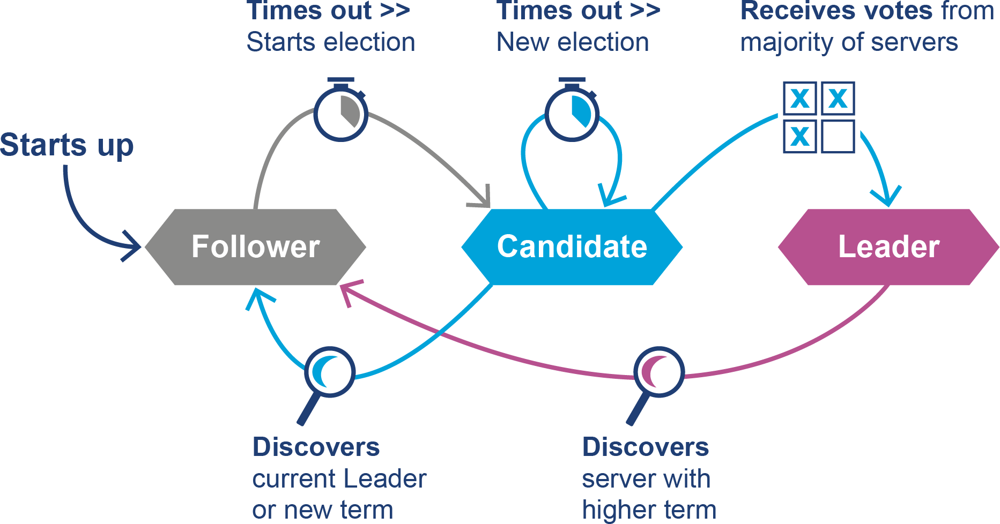
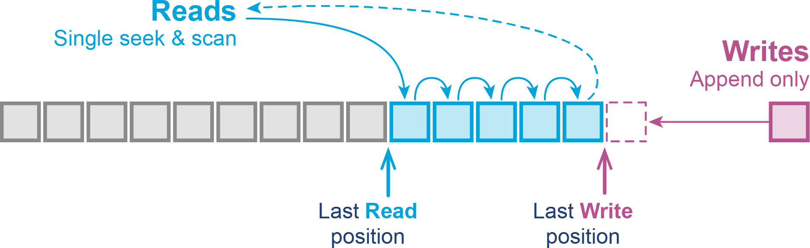
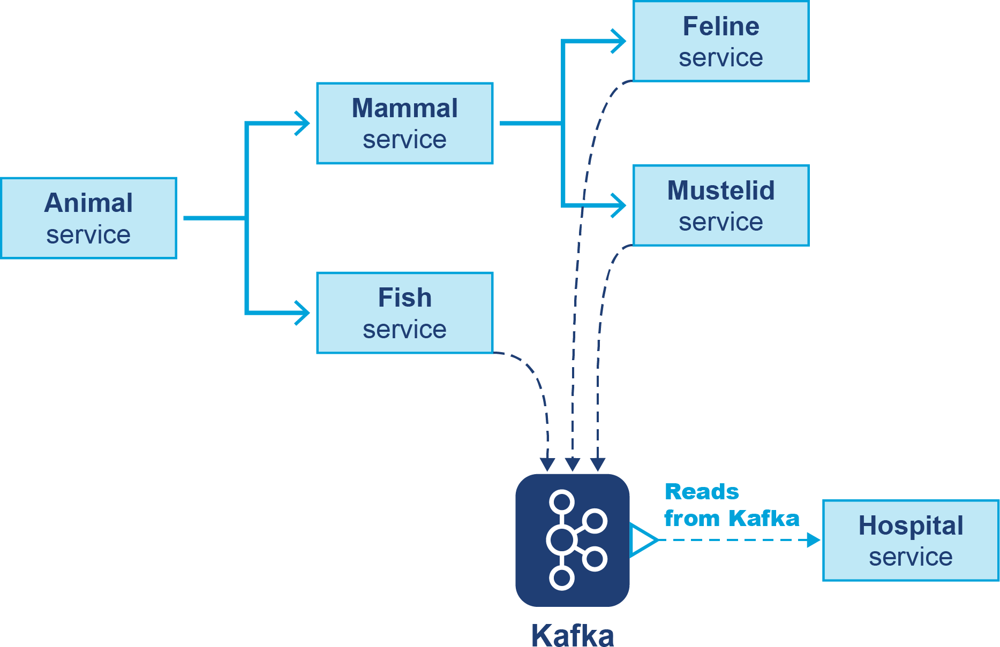
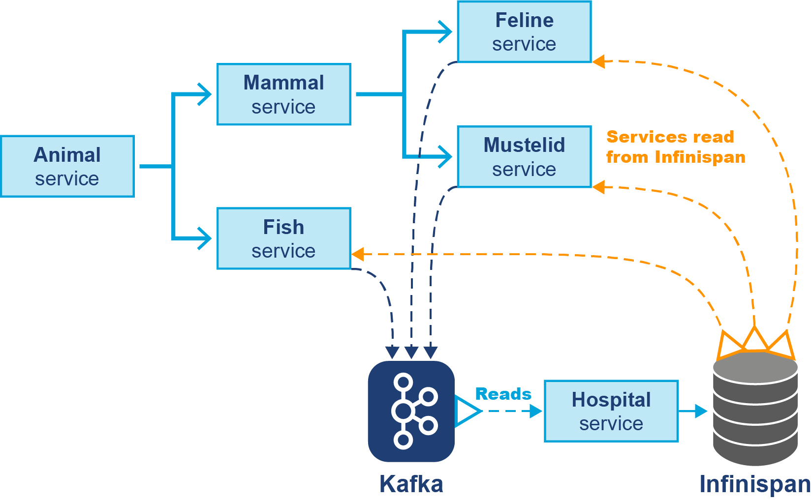

# Chương 14. Kỹ thuật và Mẫu hình cho Hệ phân tán

Trong chương này, chúng tôi sẽ giới thiệu một số kỹ thuật nền tảng của hệ phân tán. Một số trong đó là tổng quát hóa của các mẫu hình đồng thời chúng ta đã gặp, nhưng những cái khác là các lớp trừu tượng mới do một hoặc nhiều *ngộ nhận về điện toán phân tán* (fallacies of distributed computing) mà L. Peter Deutsch và James Gosling liệt kê giữa những năm 1990 gây ra.

Các ngộ nhận đó là:

- Mạng là đáng tin cậy.
- Độ trễ bằng không.
- Băng thông là vô hạn.
- Mạng là an toàn.
- Topology không thay đổi.
- Chỉ có một quản trị viên.
- Chi phí vận chuyển bằng không.
- Mạng là đồng nhất.

Một số hiệu ứng này sẽ tác động đến chúng ta nhiều hơn những cái khác — ví dụ, vấn đề độ trễ đặc biệt quan trọng, cũng như khả năng thay đổi topology trong một cluster. Ngoài ra, các phong cách kiến trúc như service-oriented architecture (SOA) và kiến trúc dựa trên microservice có thể làm tăng đáng kể số kết nối phân tán, đến lượt nó làm tăng tác động tiềm tàng của các ngộ nhận.

Nghĩa là, chúng ta có thể phát hiện rằng dù đã phân tán ứng dụng như một cách tối ưu hóa nó và cho phép nó mở rộng, chúng ta lại làm chính điều ngược lại vì đã không tính đến một hoặc nhiều ngộ nhận. Để chống lại khả năng này, chúng ta cần một số công cụ và kỹ thuật giúp miễn nhiễm với tác động của các ngộ nhận.

Trong chương này, chúng tôi sẽ giới thiệu vài công nghệ hữu ích và sẽ chỉ ra ngộ nhận nào liên quan đến mỗi trường hợp. Phần đầu tiên thảo luận một số cấu trúc dữ liệu phân tán mức thấp, hay cơ bản. Sau đó, chúng ta thảo luận khái niệm *consensus* (đồng thuận), đại thể là ý tưởng rằng các thành viên cluster sẽ cần đồng ý về một giá trị dữ liệu thay đổi được nào đó để việc tính toán phân tán khả thi.

Ở nửa sau của chương, chúng ta sẽ thảo luận các ví dụ về thư viện có thể đơn giản hóa quá trình xây dựng hệ phân tán trong Java. Khi trình bày mỗi chủ đề, chúng ta sẽ thấy một hoặc nhiều ngộ nhận được mỗi công nghệ giảm nhẹ ra sao. Cuối cùng, chúng ta sẽ kết hợp các chủ đề lại và xem cách nâng cấp Fighting Animals bằng một số công nghệ này.

## Cấu trúc dữ liệu phân tán cơ bản

Để xây dựng các cấu trúc dữ liệu phân tán, chúng ta sẽ bắt đầu bằng việc giới thiệu một số khối xây dựng cơ bản. Đây hoàn toàn không phải danh sách đầy đủ — nhiều cái khác cũng hữu ích và liên quan nhưng những cái này là điểm khởi đầu (và nhiều cái được tái sử dụng trong các thư viện mức cao hơn chúng ta thảo luận sau).

### Clock, ID và Write-Ahead Log

Một trong những khối xây dựng đơn giản nhất của cấu trúc dữ liệu phân tán là *generation clock*. Đây là giá trị tăng đơn điệu được dùng để sắp thứ tự các sự kiện trong hệ phân tán. Nó được đính vào mọi thông điệp gửi trong hệ thống (và được lưu trong các replicated log).

Ví dụ, nó có thể được dùng trong cluster leader-follower để xử lý khả năng leader tạm thời bị ngắt kết nối khỏi các follower. Nếu một cuộc bầu cử lãnh đạo mới xảy ra, thì generation clock sẽ tiến lên, nên các node follower biết chúng nên bỏ qua thông điệp từ leader cũ nếu nó kết nối lại vào cluster.

Một kỹ thuật có thể dễ dàng tổng quát hóa từ lập trình đồng thời trên một máy sang hệ phân tán là việc dùng các object bất biến. Với điều kiện các object bất biến có thể được serialize và deserialize, chúng có thể được gửi qua mạng mà không lo lắng. Không có khả năng lost update — bởi trạng thái object không thể được cập nhật sau khi nó được tạo ra.

Một nhu cầu cơ bản khác là các ID duy nhất trên toàn cluster. Có vài kỹ thuật để sinh ID duy nhất trong hệ phân tán, nhưng một trong những cái đơn giản nhất là dùng *segment* toàn cluster. Node leader chịu trách nhiệm phát các segment cho các node follower, sau đó chúng có thể sinh ID từ segment đó và yêu cầu một segment mới khi nó cạn kiệt.

Ví dụ, mỗi follower yêu cầu một segment, chẳng hạn một triệu ID để cấp phát. Sau hậu trường, điều này có thể được tiến trình leader thực hiện bằng một `AtomicLong` và tăng atomic đó khi một follower yêu cầu một segment.

Sau khi yêu cầu segment, thành viên cluster có thể tăng một counter cục bộ mỗi khi cần ID mới. Một khi mọi ID trong segment được dùng hết, follower có thể yêu cầu segment mới.

Hệ quả của cách tiếp cận này là lưu lượng mạng giảm rất nhiều — hầu như toàn bộ việc sinh ID có thể được làm trong bộ nhớ và cực kỳ nhanh. Hệ quả khác là cách tiếp cận này scale tốt hơn nhiều so với một `AtomicLong` thô bởi có ít tranh chấp hơn nhiều — hiệu quả và nhanh hơn nhiều khi lấy các segment gồm 1_000_000 ID `AtomicLong` từ leader so với yêu cầu từng cái một.

Sẽ không có ID trùng lặp nào, nhưng có một số vấn đề bạn cần lưu ý:

- ID sinh bởi các follower khác nhau sẽ không theo thứ tự.
- Nếu một thành viên sập mà chưa dùng hết segment của nó, có thể có khoảng trống. Trong hầu hết trường hợp, với việc sinh ID, điều này không liên quan.
- Nếu leader của cluster khởi động lại, thì (trong trường hợp đơn giản nhất) bộ sinh ID được reset và sẽ bắt đầu lại từ 0.

Vấn đề cuối có thể được giảm nhẹ bằng cách dùng lưu trữ bền vững (ví dụ, một cơ sở dữ liệu) để ghi lại segment cuối cùng đã phát ra. Cũng có các giải pháp thay thế để tạo ID duy nhất toàn cluster, như `java.util.UUID` hoặc các dạng UUID khác, nhưng trong nhiều trường hợp một ID số đơn giản là đủ.

Để kết thúc phần này, hãy giới thiệu *write-ahead log* (WAL). Kỹ thuật này được triển khai rộng rãi trong các hệ thống cơ sở dữ liệu để cung cấp tính nguyên tử và tính bền (hai trong số các tính chất ACID cho cơ sở dữ liệu). Log là cấu trúc dữ liệu có thứ tự, chỉ ghi thêm (append-only), nằm trên lưu trữ bền vững.

Nó theo truyền thống được dùng để triển khai khôi phục sau crash — khi một tiến trình khởi động lại, nó có thể kiểm tra log và xem các thay đổi đã hoàn tất chưa, hay chúng cần được rollback và các mục log bị loại bỏ.

Với mục đích của chúng ta, có thể nghĩ về kỹ thuật này như một log các thay đổi mà một node muốn thực hiện nhưng chỉ mới thực hiện trên cơ sở suy đoán. Khi một điều kiện hoàn thành được đạt tới, log đã chạm một checkpoint, áp dụng các thay đổi, và xóa log.

### Two-Phase Commit

Two-phase commit (commit hai pha) là kỹ thuật rất phổ biến trong lập trình phân tán. Ví dụ, nó thường xuất hiện khi một giao dịch cần được lưu vào cơ sở dữ liệu và cũng được lan truyền tới một hệ thống messaging. Xử lý điều này như hai giao dịch riêng biệt sẽ gây vấn đề vì khả năng giao dịch cơ sở dữ liệu hoàn tất, nhưng rồi giao dịch messaging thất bại.

Cấu trúc cơ bản của two-phase commit là dùng các pha *prepare* (hay voting) và *commit* riêng biệt. Hãy đi qua điều này trong một hệ thống leader-follower.

Trong pha prepare, leader ghi vào một write-ahead log. Leader nhân bản thay đổi qua mạng tới các follower, chúng ghi nó vào WAL cục bộ của mình và trả lời bằng một *promise* — rằng chúng sẵn sàng commit.

Khi đủ số follower đã trả lời bằng promise, leader bắt đầu pha commit. Nó đánh dấu mục là final và gửi ra một thông điệp hoàn thành. Follower có thể áp dụng mục WAL cục bộ của mình, rồi hoàn thành promise bằng cách gửi lại một acknowledgment (ACK).

Một khi nhận đủ ACK, việc commit hoàn tất.

Kỹ thuật này có một số lợi thế hữu ích. Trước hết, nó đơn giản và dễ hiểu. Thứ hai, nó cung cấp tính nguyên tử và tính nhất quán — giao dịch hoặc thành công hoặc thất bại, và không có cách nào để các node khác nhau kết thúc với kết quả khác nhau cho giao dịch. Nó cũng đảm bảo *liveness* — cuối cùng chúng ta sẽ đạt được đồng thuận, dù điều này có thể mất nhiều lần lặp của giao dịch.

Tuy nhiên, two-phase commit có nhiều nhược điểm:

- Nó yêu cầu promise và acknowledgment từ mọi node, và điều này scale tuyến tính với kích thước cluster.
- Một lỗi hay xung đột đơn lẻ từ bất kỳ node nào cũng khiến giao dịch bị hủy và thử lại từ đầu.
- Leader chờ mọi người trong nhóm trả lời, nghĩa là độ trễ tổng thể ít nhất bằng độ trễ của node chậm nhất.

Giao thức này cũng có hành vi blocking khả dĩ. Đó là bởi, trong pha prepare, các node phải cấp phát tài nguyên cần để hoàn thành giao dịch. Điều này có nghĩa toàn bộ cluster đang chờ với một promise chưa được xác nhận cho mục trong write-ahead log.

Cho đến khi giao dịch commit hoặc rollback, chúng không thể chấp nhận các cập nhật mới áp dụng cho bất kỳ tài nguyên bị ảnh hưởng nào.

Các phiên bản thực tế của two-phase commit cũng sẽ cần xử lý timeout và nhắm cung cấp ít nhất khả năng chịu lỗi cơ bản — khi một node không khả dụng hoặc chậm hoặc tạm thời không khả dụng (có lẽ do một đợt dừng GC). Độc giả quan tâm có thể tham khảo một tài liệu như *Designing Data-Intensive Applications* của Martin Kleppmann để có phần trình bày sâu hơn về chủ đề này.

### Object Serialization

Serialization trong Java có lịch sử dài và phần nào không vẻ vang. Nói rộng ra, nó là việc chuyển đổi trạng thái của một instance object thành một byte stream. Byte stream này sau đó có thể được ghi ra đĩa hoặc chuyển qua mạng, nơi nó có thể được deserialize trở lại thành một instance object.

Nó đã là tính năng tích hợp sẵn của nền tảng từ Java 1.1, nhưng cơ chế ở mức ngôn ngữ có nhiều nhược điểm nghiêm trọng và giờ được công nhận rộng rãi là có khiếm khuyết sâu sắc trong trường hợp tổng quát.

> Serialization tạo thành một constructor public nhưng vô hình, và một tập accessor public nhưng vô hình cho trạng thái nội tại của bạn.
>
> — Brian Goetz, "Towards Better Serialization"

Serialization tích hợp sẵn cũng đã góp phần vào một số lượng lớn vấn đề bảo mật trong lịch sử dài của Java. Kết quả là, hầu hết các đội ứng dụng đã chọn giải pháp ở mức thư viện thay vì dựa vào cơ chế tích hợp.

Ví dụ, JSON là một lựa chọn hấp dẫn cho định dạng serialization, vì vài lý do:

- Nó cực kỳ đơn giản.
- Nó đọc được bằng mắt người.
- Thư viện cho nó tồn tại trong về cơ bản mọi ngôn ngữ lập trình.

Tuy nhiên, điều này được cân bằng lại bởi một số yếu tố khác — như kích thước của các object đã serialize, có thể góp phần vào hiệu năng kém cho các thông điệp lớn hơn. Với các ứng dụng hiệu năng cao, mã hóa nhị phân được ưa thích hơn — và có rất nhiều lựa chọn, bao gồm Protocol Buffers và Avro.

Sự đánh đổi và các lựa chọn kiến trúc cho serialization dữ liệu liên quan đến hai ngộ nhận chúng ta gặp ở đầu chương: "Chi phí vận chuyển bằng không" và "Băng thông là vô hạn." Hiệu năng của các thư viện serialization đã là khía cạnh quan trọng của thiết kế tổng thể hệ phân tán trong nhiều năm.

Ví dụ, hơn hai mươi năm trước, một trong các tác giả đang làm việc về hiệu năng trên các kiến trúc dịch vụ nơi các yếu tố cản trở chính cho hiệu năng là:

- Việc serialization và deserialization các object Java sang XML
- Việc tìm độ chi tiết đúng đắn của các dịch vụ (chủ yếu để giảm lượng công việc ở trên)

Dù định dạng serialization trên đường truyền bạn làm việc có lẽ không còn là XML nữa, các nguyên tắc chung đã nêu vẫn là mối quan tâm lớn với các hệ thống hiện đại.

### Phân vùng và nhân bản dữ liệu

Chúng ta đã gặp partitioning ngắn gọn ở Chương 10, như một vấn đề có thể phát hiện bằng observability. Trong phần này, chúng tôi sẽ giới thiệu nó đúng cách và đặt nó vào ngữ cảnh như một kỹ thuật then chốt cho hệ phân tán.

Ở dạng đơn giản nhất, *data partitioning* (hay sharding) là việc chia một tập dữ liệu lớn thành các tập con nhỏ hơn, dễ quản lý hơn — các *partition*. Mỗi partition chứa một tập con của toàn bộ dữ liệu, và chúng được phân phối trên nhiều node.

Có vài cách khác nhau mà dữ liệu có thể được phân vùng. Ví dụ, *horizontal partitioning*, chia dữ liệu theo hàng, và *vertical partitioning*, chia dữ liệu theo cột.

Trong trường hợp horizontal partitioning, có vài kỹ thuật nổi tiếng để chia dữ liệu thành các partition. Ví dụ, dữ liệu có thể được phân vùng theo một khóa nào đó — một ID hoặc một hash của các field quan trọng. Như chúng ta sẽ thảo luận sau, đây là cách tiếp cận mà các hệ thống như Apache Kafka áp dụng.

Một cách tiếp cận rất phổ biến là dùng kết hợp các kết nối mạng heartbeat giữa các host trong cluster, cùng với một hệ thống quorum để đảm bảo rằng một giao dịch phân tán có đủ "phiếu" để hoàn thành (thêm về điều này ở phần tiếp theo).

Để chịu lỗi, có thể có nhiều bản sao của mỗi partition nhằm giảm nhẹ hiệu ứng của việc một node trở nên không khả dụng (đây là ngộ nhận "Mạng là đáng tin cậy"). Mặc định rõ ràng nhất là một bản sao đồng bộ, nhưng các chiến lược khác cũng khả dĩ — như hai bản sao đồng bộ để cho phép rolling update trên cluster đồng thời vẫn bảo vệ chống lại lỗi bất ngờ của một node.

Ví dụ, chúng ta có thể chọn triển khai nhiều bản sao lưu đồng bộ, nhưng điều này sẽ phải trả giá bằng mức tiêu thụ bộ nhớ cao hơn trên toàn cluster (vì mỗi bản sao lưu tiêu thụ bộ nhớ tương đương kích thước cấu trúc dữ liệu gốc).

Tuy nhiên, điều quan trọng cần nhận ra là mọi bản sao lưu đồng bộ đều đòi hỏi khóa giữa các bản sao để ngăn phiên bản phân tán của antipattern Lost Update mà chúng ta gặp ở Chương 13. Càng giữ nhiều bản sao lưu, việc khóa này càng tốn kém.

Trong một số ứng dụng, việc lưu bền một kho dữ liệu in-memory ra một kho hậu thuẫn có thể có lợi. Tuy nhiên, tính bền này đi kèm một vấn đề hiệu năng tiềm tàng — vì để có độ tin cậy đầy đủ, mỗi thay đổi với dữ liệu in-memory phải được "ghi xuyên qua" (written through) tới kho vật lý trước khi thay đổi có thể được xác nhận hoàn toàn. Điều này tương tự trường hợp bộ nhớ chính so với cache, mà chúng ta đã thảo luận ở chương trước.

Có nhiều use case mà hành vi này là quá mức, và một cửa sổ ngắn có khả năng mất dữ liệu có thể được kiến trúc ứng dụng chấp nhận. Trong những hoàn cảnh này, nhiều hệ thống có thể được cấu hình để "write-behind", trong trường hợp đó các lượt ghi tới kho hậu thuẫn thực chất trở nên bất đồng bộ.

Observability cũng có thể có lợi khi triển khai nhân bản và phân vùng. Bên cạnh việc đảm bảo dữ liệu tiếp tục chảy qua pipeline, việc quan sát các sự kiện repartitioning — không chỉ là chúng xảy ra, mà cả thời lượng của chúng — có thể là chỉ báo sớm rằng ứng dụng đang tiến gần các ràng buộc năng lực của hạ tầng messaging.

Repartitioning tốt nhất là tuyến tính theo số node (và đôi khi tệ đến mức bậc hai). Việc có thể quan sát repartitioning trên toàn cluster là quan trọng, bởi góc nhìn của bất kỳ node nào cũng có thể không đủ để tạo thành bức tranh tổng thể đầy đủ.

### Định lý CAP

Định lý CAP là một trong những mảnh lý thuyết dễ nhận biết nhất trong hệ phân tán. Cái tên đến từ ba chữ cái đầu của các khía cạnh hành vi của một hệ thống — *consistency* (nhất quán), *availability* (khả dụng) và *partition-tolerance* (chịu phân vùng).

Định lý chỉ ra rằng chỉ hai trong ba khía cạnh là khả dĩ với bất kỳ hệ thống nào. Các công nghệ khác nhau có thể đưa ra lựa chọn khác nhau, ví dụ, một hệ thống AP chọn availability và partition-tolerance.

Định lý liên quan đến hai trong số các ngộ nhận về điện toán phân tán: "Mạng là đáng tin cậy" và "Topology không thay đổi." Trên thực tế, một network partition là ví dụ kinh điển của thay đổi topology, và do đó, của việc thiếu độ tin cậy.

Một cách, phần nào lỏng lẻo, để tiếp cận định lý là xét rằng nếu bạn có một mạng có thể làm rơi thông điệp, thì bạn không thể có cả availability hoàn toàn lẫn consistency hoàn hảo trong trường hợp có phân vùng.

Vậy nên, trong trường hợp network partition mà các node vẫn hoạt động và kết nối với các nhóm client khác nhau, một chiến lược là từ bỏ consistency và vẫn khả dụng trong lúc bị phân vùng. Đây là cùng khái niệm chúng ta gặp như split-brain ở phần "Phân vùng lại và Split-Brain".

Hiệu ứng với người dùng trong trường hợp có phân vùng sẽ là các client kết nối tới một partition sẽ thấy kết quả nhất quán cục bộ. Tuy nhiên, các client kết nối tới các partition khác nhau sẽ không nhất thiết thấy cùng kết quả. Ví dụ, một giá trị được cho là nguyên tử giờ có khả năng có các giá trị khác nhau ở các partition khác nhau.

Một cách tiếp cận khác là lưu ý rằng network partition — được chỉ ra bởi việc mất hoàn toàn thông điệp — rất hiếm trên các LAN hiện đại (hoặc trong trung tâm dữ liệu). Kết quả là, nhiều người coi định lý CAP chỉ áp dụng trên các mạng diện rộng (và có thể toàn cầu).

Nếu các client của hệ thống luôn được thông báo về danh sách các node cluster mà chúng có thể kết nối tới, thì trong trường hợp mất một trung tâm dữ liệu (hay region), các client sẽ đơn giản kết nối lại tới các node không bị ảnh hưởng.

## Giao thức đồng thuận (Consensus Protocol)

Trong phần này, chúng tôi sẽ thảo luận ngắn gọn hai trong số các giao thức đồng thuận được dùng phổ biến nhất. Các giao thức này được dùng trong hệ phân tán để đảm bảo rằng các thành viên cluster phối hợp đồng ý về một giá trị dữ liệu thay đổi được nào đó (sự đồng thuận) cần thiết trong quá trình tính toán.

> **GHI CHÚ**
>
> Việc dùng thuật toán đồng thuận liên quan đến cùng hai ngộ nhận như chúng ta thấy với định lý CAP, tức "Mạng là đáng tin cậy" và "Topology không thay đổi."

Phần trình bày của chúng tôi sẽ xây dựng trên phần thảo luận về two-phase commit trước đó trong chương. Cũng có một bài trình bày xuất sắc từ Devnexus 2023 bao phủ cả hai thuật toán bằng ngôn ngữ đơn giản.

Lĩnh vực này cũng cung cấp một nghiên cứu tình huống về một thành phần khác của observability thành công: biết các sự kiện chuyển đổi cluster trông ra sao.

Dựa trên điều này, bạn nên cấu hình observability để không cảnh báo cho đến khi có vấn đề thực sự. Điều này có thể không phải ở lần xảy ra đầu tiên — những sự kiện chuyển đổi này tương đối hiếm, nhưng chúng xảy ra tự nhiên trong vận hành bình thường. Ví dụ, khi giám sát các hệ thống như ZooKeeper, không bao giờ nên có hai khoảng giám sát liên tiếp (mặc định là phút) mà trong đó nhiều node báo cáo mình là leader.

### Paxos

Paxos là một thuật toán đồng thuận dựa trên bỏ phiếu phổ biến (hay chính xác hơn là một họ thuật toán) được dùng trong nhiều hệ thống, như Cassandra, DynamoDB và Chubby (hệ thống khóa phân tán từ Google).[^1] Nó được Leslie Lamport giới thiệu vào những năm 1980 và dùng một số khái niệm chúng ta đã gặp (như generation clock).

Giao thức có hai vai trò cơ bản mà các node cluster có thể thực hiện:

- Proposer (bên đề xuất)
- Acceptor (bên chấp nhận)

Nhìn chung, các thông điệp được định danh bằng một số vòng `N` (là thời gian generation clock), và chúng cũng có thể có một giá trị cần được thỏa thuận.

Paxos có hai pha, mỗi pha có hai pha con:

**Pha 1a: Prepare**
: Proposer tạo một thông điệp Prepare và gửi nó tới mọi Acceptor đã biết.

**Pha 1b: Promise**
: Khi bất kỳ Acceptor nào nhận một thông điệp Prepare từ bất kỳ Proposer nào, nó trả về một Promise cho Proposer đó — về cơ bản, rằng nó đồng ý tôn trọng một giá trị sẽ do Proposer đó cung cấp.

**Pha 2a: Accept**
: Một khi một Proposer đã nhận promise từ một quorum các Acceptor, nó cần đặt một giá trị `V` cho đề xuất của mình. Nó làm vậy bằng cách gửi các thông điệp Accept, ký hiệu bởi cặp `(N, V)`, tới mọi Acceptor đã hứa tôn trọng đề xuất.

**Pha 2b: Accepted**
: Nếu một Acceptor nhận một Accept từ một Proposer, nó phải chấp nhận nó khi và chỉ khi nó chưa hứa (ở Pha 1b) chỉ xét các đề xuất có số vòng cao hơn (tức một số lớn hơn `N`).

Paxos là giao thức dựa trên quorum, nên đa số đơn giản là đủ để tiến lên — điều này để đảm bảo rằng tiến độ vẫn có thể được thực hiện ngay cả khi một số node bị ngắt kết nối, chậm, hoặc quá tải. Một phần quan trọng của giao thức là tiêu chí chấp nhận — cái này được thiết kế để ngăn các giá trị xung đột phá vỡ sự hội tụ đến đồng thuận.

Paxos đã được nghiên cứu rất kỹ và có nhiều phần mở rộng khả dĩ khác nhau. Một trong những cái rõ ràng nhất là bao gồm vai trò thứ ba — Learner (đôi khi được biết đến bằng những tên khác, như *observer* trong ZooKeeper).

Learner là các quan sát viên thụ động của cluster — chúng không đề xuất giá trị mới, và chúng không bỏ phiếu. Thay vào đó, chúng chỉ được thông báo về kết quả khi giá trị được thỏa thuận — và cả Acceptor lẫn Proposer đều có thể thông báo cho Learner một khi giá trị được cố định. Điều này có thể rất hữu ích để giảm tải đọc trên các node tham gia thuật toán đồng thuận.

> **GHI CHÚ**
>
> Trên thực tế, nhiều triển khai Paxos gộp các vai trò lại, nên một Acceptor cũng có thể là một Learner.

Chúng ta cũng nên nhắc đến một trong những kết quả lý thuyết quan trọng nhất về thuật toán đồng thuận ở điểm này — được biết đến là kết quả Bất khả thi Fischer, Lynch và Paterson (FLP).

Bài báo năm 1985 của họ (có một bản tổng quan đơn giản hóa rất dễ đọc) thiết lập rằng trong một hệ thống bất đồng bộ, các thuật toán đồng thuận sẽ chỉ cung cấp hai trong ba tính chất: safety (an toàn), liveness (tính sống), và fault tolerance (chịu lỗi).

Đây là kết quả mạnh, nhưng một số cách khắc phục đã được phát triển để giảm thiểu các hạn chế của nó. Ví dụ, việc đưa vào một độ trễ ngẫu nhiên ngắn giữa các giá trị được đề xuất sẽ giảm khả năng thất bại về liveness (về cơ bản là một LiveLock phân tán tương tự cái chúng ta gặp ở Chương 13), nhưng khả năng lý thuyết nền tảng không thể bị loại trừ hoàn toàn.

Hãy chuyển sang xem thuật toán đồng thuận còn lại — Raft.

### Raft

Khi Raft được tạo ra, một trong những mục tiêu thiết kế lớn của nó là cung cấp một thuật toán đồng thuận đơn giản và dễ hiểu. Nó tiếp cận điều này bằng cách phân rã bài toán đồng thuận thành hai bài toán con riêng biệt:

- Bầu cử leader (leader election)
- Nhân bản log (log replication)

Để thúc đẩy thêm ý tưởng về sự đơn giản, Raft dựa trên ý tưởng rằng mỗi node chỉ có hai trạng thái bầu cử khả dĩ (Stable và Election), và ba trạng thái vai trò khả dĩ (Leader, Follower và Candidate). Đây là giao thức dựa trên leader-follower, nên chỉ một trong các node sẽ là Leader, và mọi node khác là Follower, ít nhất khi không có cuộc bầu cử nào đang diễn ra.

Mọi cập nhật đều đi qua Leader, nó ghi vào log của mình và nhân bản thay đổi tới các Follower một cách bất đồng bộ. Một khi Leader đã nhân bản thành công dữ liệu tới một quorum, chỉ số commit được tiến lên, thao tác được áp dụng vào máy trạng thái, và cập nhật được coi là thành công.

Follower trong Raft hoàn toàn thụ động; chúng chỉ chấp nhận các cập nhật do Leader gửi. Các node Leader trong Raft gửi ra thông điệp heartbeat tới mọi Follower ở các khoảng đều đặn (ví dụ, 100 ms). Nếu một Follower nhận thấy Leader không còn gửi heartbeat, thì nó có thể gửi ra một thông điệp tới các peer của mình và kêu gọi một cuộc bầu cử, như chúng ta sẽ thấy.

Giống Paxos, Raft dựa trên ý tưởng generation clock, cũng được gọi là *term* (nhiệm kỳ). Mọi node trong cluster đều biết node nào là Leader và số term hiện tại là bao nhiêu. Nó cũng có danh sách các Follower (vốn là peer của nhau).

Hai thông điệp là `AppendEntry` để gửi một cập nhật từ Leader tới Follower (nó cũng đóng vai trò thông điệp heartbeat, bằng cách chỉ gửi payload cập nhật null), và `RequestVote`, được gửi tới mọi peer nếu một Follower chưa nhận được `AppendEntry` trong một khoảng timeout.

Thông điệp `AppendEntry` và phản hồi của nó có thể được biểu diễn trong Java như sau:

```java
record AppendEntry (
    int term,
    int leaderId,
    List<Payload> payloads,
    int prevLogIndex,
    int prevLogTerm,
    int leaderCommit) { }

record AppendEntryResponse (
    int term,
    boolean accepted,
    int conflictIndex,
    int conflictTerm) { }
```

với `RequestVote` và `RequestVoteResponse` trông như sau:

```java
record RequestVote (
    int term,
    int candidateId,
    int lastLogIndex,
    int lastLogTerm
) {}

record RequestVoteResponse(
    int term,
    boolean inFavor
) {}
```

Máy trạng thái kết quả cho Raft có thể thấy ở Hình 14-1.



*Hình 14-1. Máy trạng thái Raft*

Lưu ý rằng, khi cluster khởi động, không có node Leader nào — nên mọi node bắt đầu là Follower. Để xử lý điều này, các node có thể tự thăng cấp thành Candidate — để làm vậy, chúng tăng số term và gửi cho mọi node khác một `RequestVote`.

Raft đã được nghiên cứu rộng rãi, và thuật toán đã được chứng minh là không đảm bảo hoàn toàn liveness trong trường hợp có lỗi mạng nếu không có sửa đổi bổ sung. Điều này có nghĩa về lý thuyết vẫn có thể một cuộc bầu cử tiếp diễn mãi mãi.

Tuy nhiên, Raft giảm thiểu xác suất này bằng cách đưa vào một timeout bầu cử ngẫu nhiên (và rằng một Candidate không thể thắng cuộc bầu cử trừ khi log của nó cập nhật). Trên thực tế, điều này có nghĩa LiveLock không xảy ra, nhưng cũng như với Paxos, chúng ta không thể chứng minh nó là bất khả thi — một hệ quả khác của kết quả FLP.

Cuối cùng, chúng ta nên lưu ý rằng việc một thuật toán đúng không có nghĩa mã triển khai cũng đúng. Với Raft, một trong các triển khai Java khả dĩ là phiên bản do dự án jgroups-raft cung cấp — được dùng trong các sản phẩm như Infinispan của Red Hat — và đã được kiểm thử rộng rãi về các bug tính đúng đắn.

## Ví dụ về hệ phân tán

Trong phần này, chúng tôi sẽ thảo luận một số nghiên cứu tình huống về việc các kỹ thuật phân tán này được các hệ thống thực dùng trên thực tế ra sao. Các ví dụ của chúng tôi về cơ bản mang tính hạ tầng, ở chỗ chúng được thiết kế để cho phép lập trình viên tách các khía cạnh hệ phân tán khỏi logic nghiệp vụ. Hãy bắt đầu bằng cách thảo luận một ví dụ về cơ sở dữ liệu phân tán.

### Cơ sở dữ liệu phân tán — Cassandra

Cassandra là một trong những cơ sở dữ liệu phân tán NoSQL mã nguồn mở phổ biến nhất. Nó được viết bằng Java và là phi quan hệ, hướng cột. Theo mặc định, Cassandra là cơ sở dữ liệu AP (available, partition-tolerant), nhưng tính nhất quán này có thể được cấu hình ở mức từng truy vấn.

Khá phổ biến việc các hệ thống NoSQL thể hiện loại hành vi nhất quán cuối cùng (eventual consistency) này. Cassandra cung cấp khái niệm *consistency level*, chỉ định bao nhiêu node replica phải xác nhận lượt ghi trước khi bộ điều phối báo thành công cho client. Một số giá trị phổ biến của consistency level là:

- `ONE`: Chỉ cần một xác nhận từ bất kỳ replica nào là đủ để xác nhận lượt ghi.
- `LOCAL_QUORUM`: Cần xác nhận từ đa số đơn giản các node trong cùng trung tâm dữ liệu để xác nhận.
- `QUORUM`: Cần xác nhận từ đa số đơn giản các node cluster trên toàn cầu để xác nhận.
- `ALL`: Cần xác nhận từ mọi node.

Các tùy chọn này được sắp xếp từ nhanh nhất đến chậm nhất. Cassandra được tối ưu để ghi lượng lớn dữ liệu nhanh chóng, nên consistency level càng nghiêm ngặt, lượt ghi sẽ càng chậm.

Lưu ý rằng các triển khai điển hình của Cassandra có thể phân tán toàn cầu, nên `QUORUM` và `ALL` rất có thể liên quan đến lưu lượng WAN, có thể có thời gian xác nhận ghi hàng chục hoặc hàng trăm mili-giây (do giới hạn tốc độ ánh sáng).

> **MẸO**
>
> Thiết lập `ALL` không được khuyến nghị, vì nó không chỉ chậm nhất mà còn ảnh hưởng đến availability — một node lỗi đơn lẻ có thể khiến các lượt ghi thất bại. Điều này đi ngược thiết kế của Cassandra như một cơ sở dữ liệu AP, và nếu bạn bị cám dỗ dùng nó, thì đây có thể là "mùi kiến trúc" của điều gì đó sai ở đâu đó khác trong thiết kế hệ thống.

Giao diện chính vào Cassandra DB là Cassandra Query Language (CQL). Đây là ngôn ngữ truy vấn phần nào tương tự SQL (dù Cassandra là cơ sở dữ liệu NoSQL), ở chỗ cả hai đều có cùng khái niệm cơ bản về một bảng được xây từ cột và hàng. Tuy nhiên, Cassandra là phi quan hệ, nên nó không hỗ trợ join hay subquery.

Nếu chúng ta xem một số ví dụ cơ bản của CQL, thì nó có thể giống SQL một cách đánh lừa. Ví dụ, tất cả các ví dụ sau đều vừa là SQL hợp lệ vừa là CQL hợp lệ:

```sql
CREATE TABLE IF NOT EXISTS demoTable (id INT PRIMARY KEY);
ALTER TABLE demoTable ADD newField INT;
CREATE INDEX myIndex ON demoTable (newField);
INSERT INTO demoTable (id, newField) VALUES (1, 2);
SELECT * FROM demoTable WHERE newField = 2;
SELECT COUNT(*) FROM demoTable;
DELETE FROM demoTable WHERE newField = 2;
```

Tuy nhiên, cũng như câu lệnh này:

```java
var x = 15;
```

vừa là Java hợp lệ vừa là JS hợp lệ nhưng có khác biệt ngữ nghĩa đáng kể trong hai môi trường, điều quan trọng là đừng suy diễn quá nhiều từ ấn tượng bề mặt và các ví dụ đơn giản.

Thực ra có một lượng khác biệt đáng kể giữa CQL và SQL, dù cú pháp giống hệt. Ví dụ, `INSERT` và `DELETE` đều hành xử rất khác trong Cassandra so với thông thường trong các cơ sở dữ liệu SQL.

Cũng đúng rằng cái chúng ta gọi là *table* thực ra chính xác hơn được gọi là *columnfamily* trong CQL — bí danh "table" thực sự ở đó để khiến những người mới đến có kinh nghiệm SQL thấy thoải mái hơn. Tương tự, một *keyspace* của Cassandra là một namespace định nghĩa cách dữ liệu được nhân bản trên các node và đại thể tương tự một database schema cho một SQL RDBMS.

Keyspace được thiết kế để kiểm soát việc nhân bản dữ liệu cho một tập bảng. Việc nhân bản này được kiểm soát trên cơ sở từng keyspace, nên dữ liệu có yêu cầu nhân bản khác nhau thường nằm ở các keyspace khác nhau. Là hệ quả của điều này, một cluster thường sẽ có một keyspace cho mỗi ứng dụng mà cluster phục vụ.

Lưu ý rằng có những trường hợp mà mặc định eventual consistency của Cassandra đơn giản không hoạt động — tức là đôi khi bạn cần duy trì thứ tự đọc và ghi nghiêm ngặt.

Với những trường hợp này, *linearizable consistency* là hữu ích, và Cassandra có hai loại thao tác CQL — thông thường (mà chúng ta đã gặp) và *lightweight transaction*, cung cấp linearizable consistency cho các cập nhật có điều kiện.

Cú pháp lightweight transaction khác với cú pháp của thao tác thông thường, và nó dùng một triển khai của Paxos để hỗ trợ tính năng này. Ở dạng đơn giản nhất, lightweight transaction là các thao tác CAS trông giống như `INSERT ... IF NOT EXIST`.

> **GHI CHÚ**
>
> Các thao tác thông thường không nên trộn với lightweight transaction — nếu ứng dụng của bạn là use case phù hợp cho lightweight transaction, thì chúng nên được dùng xuyên suốt.

Consistency level `SERIAL` được dùng cho lightweight transaction và đảm bảo rằng các lượt ghi có điều kiện được cô lập và áp dụng nguyên tử. Do đó, lightweight transaction của Cassandra chỉ thực sự "nhẹ" khi so với các chiến lược giao dịch trong các loại DB khác hoặc so với two-phase commit.

### In-Memory Data Grid — Infinispan

Infinispan là một cache phân tán và kho dữ liệu in-memory NoSQL dạng key-value do Red Hat phát triển như bản kế nhiệm của JBoss Cache. Ngoài việc in-memory, Infinispan cũng có thể lưu bền dữ liệu ra một cache store lâu dài hơn. Chúng có thể cắm được, và nhiều triển khai khác nhau tồn tại để cho phép dữ liệu Infinispan được lưu bền trong một hệ thống hiện có.

Công nghệ này có thể được dùng để thêm clustering và tính khả dụng cao vào các thư viện và framework. Bằng cách ủy quyền quản lý trạng thái cho Infinispan, các cấu trúc dữ liệu phân tán nội tại mà Infinispan cung cấp có thể cung cấp khả năng clustering.

Thư viện jgroups là bộ công cụ hữu ích cung cấp giao tiếp mạng nhóm đáng tin cậy cho Infinispan và nhiều dự án khác. Nó cung cấp nhiều tính năng hữu ích, như khám phá node, cả point-to-point lẫn point-to-multipoint, phát hiện lỗi, và truyền dữ liệu.

Khả năng chịu lỗi dựa trên thành phần jgroups-raft, vốn (như tên gọi gợi ý) là một triển khai của giao thức Raft. Infinispan cung cấp hệ số nhân bản có thể cấu hình, hoạt động như một hệ thống AP, tương tự Cassandra.

Infinispan phơi bày interface `Cache`, kế thừa `java.util.Map` — nên từ góc nhìn người dùng cuối, ở dạng đơn giản nhất, nó có thể được xem là "một HashMap lớn có thể trải rộng qua các máy" — Infinispan cũng hỗ trợ các nền tảng không phải JVM làm client.

Các use case giao dịch — cả JTA lẫn XA — cũng được hỗ trợ, và Infinispan có thể tham gia vào các giao dịch phân tán do một JTA transaction manager điều phối. Giao dịch trong Infinispan là tùy chọn và có thể tắt để có hiệu năng cao hơn, tùy vào ứng dụng của bạn.

Về observability, Infinispan có hỗ trợ tốt cho tracing, bao gồm các trace OpenTelemetry — dù không dựa trên HTTP, giao thức jgroups đã được mở rộng để bao gồm hỗ trợ OTel.

### Event Streaming — Kafka

Apache Kafka là một mảnh công nghệ hạ tầng then chốt cung cấp một luồng sự kiện theo mô hình publish-subscribe. Các sự kiện được dùng vừa như trigger cho hành động vừa như phương tiện phân phối trạng thái tới các node. Đây là mẫu hình phổ biến để triển khai kiến trúc microservice.

Không như các hệ thống messaging khác (như JMS và AMQP), Kafka được xây với quy mô và throughput làm mục tiêu thiết kế chính. Nó là hệ thống client-broker, nên các thông điệp được gửi từ client tới các cluster tiến trình Kafka broker.

Bên cạnh phân quyền, Kafka cung cấp khả năng xác thực ở mức transport, và điều này giảm nhẹ ngộ nhận "Mạng là an toàn."[^2] Tất nhiên, để giảm nhẹ hoàn toàn vấn đề này, chúng ta cũng sẽ cần bao gồm xác thực trên mọi microservice.

Trái tim của Kafka là một log có thứ tự, được nhân bản. Điều này cho phép triển khai hiệu quả cả đọc lẫn ghi, như thể hiện ở Hình 14-2.



*Hình 14-2. Đọc và ghi trong Kafka*

Mũi tên nảy đại diện cho lượt đọc seek-and-scan, và lưu ý rằng không có cập nhật — Kafka là chỉ ghi thêm (append-only). Điều này có nghĩa các lượt đọc và ghi là thao tác tuần tự. Đến lượt nó, điều này cho phép chúng làm việc với bản chất tuyến tính của phương tiện nền tảng (ví dụ, bộ nhớ và đĩa) để tận dụng những thứ như prefetch và memory cache, cũng như cung cấp cơ hội gộp các thao tác thành lô.

Các bộ xử lý Kafka đăng ký (subscribe) các *topic*, vốn luôn được chia thành một hoặc nhiều *partition*. Topic là lớp trừu tượng hữu ích về cơ bản là một nhãn và cấu hình chung cho một tập partition. Các partition có hai tính chất:

- Mỗi partition được tiêu thụ bởi đúng một consumer.
- Một consumer đơn lẻ có thể tiêu thụ nhiều hơn một partition.

Do đó, số consumer đang hoạt động phải nhỏ hơn hoặc bằng số partition.[^3] Những tính chất này cho phép Kafka cung cấp cả đảm bảo về thứ tự lẫn cân bằng tải trên một pool consumer.

> **GHI CHÚ**
>
> Kafka đảm bảo thứ tự các sự kiện trong cùng một partition. Tuy nhiên, nó không (theo mặc định) đảm bảo thứ tự tổng thể của các sự kiện trên mọi partition.

Class then chốt cần xem xét là `ProducerRecord` trong package `org.apache.kafka.clients.producer`, có các field sau:

```java
public class ProducerRecord<K, V> {
    private final String topic;
    private final Integer partition;
    private final Headers headers;
    private final K key;
    private final V value;
    private final Long timestamp;

    // ...
}
```

Trong hầu hết triển khai, partition đích sẽ được tính từ hash của key. Điều này cho phép Kafka đảm bảo rằng các thông điệp có cùng key luôn đáp xuống cùng partition, và do đó luôn theo thứ tự.

Tuy nhiên, có thể thay đổi hành vi này — hoặc bằng cách cung cấp tường minh số partition hoặc chỉ cho phép Kafka round-robin các thông điệp. Lưu ý rằng trong trường hợp cuối này, các thông điệp khác nhau có cùng key rất có thể được xử lý bởi các consumer khác nhau, điều này có thể phá hủy các tính chất về thứ tự.

Kafka từng dùng dịch vụ ZooKeeper độc lập nhưng đã chuyển sang triển khai Raft của riêng mình — gọi là KRaft. Điều này phần nào đơn giản hóa việc áp dụng Kafka, vì nó giảm số thành phần cần triển khai, bảo trì và quan sát.

Hãy chuyển sang thảo luận một ví dụ cụ thể — và nghĩ về cách chúng ta có thể dùng một số công nghệ này để nâng cấp Fighting Animals.

## Nâng cấp Fighting Animals

Trước hết, hãy giới thiệu một service `VeterinaryHospital` cho bất kỳ con vật nào có thể bị thương trong các trận đấu. Mục đích của bệnh viện là chăm sóc bất kỳ con vật nào đã tham chiến quá nhiều trận.

Chúng ta có thể dùng bất kỳ công nghệ nào từ phần trước để triển khai service bệnh viện. Ví dụ:

- Các service hiện có có thể ghi vào một instance Cassandra chung khi một trong các con vật của chúng chiến đấu.
- Infinispan có thể lưu mọi con vật hiện có sẵn trong một tập các map, và mỗi service hiện có có thể dùng cái đó thay vì giữ một map con vật cục bộ.
- Các service hiện có có thể giao tiếp với bệnh viện qua Kafka.

Chúng ta cũng có thể cân nhắc các ý tưởng như dùng jgroups-raft để triển khai một cluster các web service hiện có, nhưng vì chúng thực chất là stateless, điều này gần như chắc chắn là quá mức — thay vào đó, chúng ta nên dựa vào K8s để cung cấp cân bằng tải và các mối quan tâm liên quan.

Hãy bắt đầu với lựa chọn thứ ba, và triển khai một phiên bản ban đầu của `VeterinaryHospital` nhận cập nhật qua Kafka. Chúng ta có thể lặp lại thiết kế ban đầu này ở phần sau của chương.

### Đưa Kafka vào Fighting Animals

Chúng ta cần xây ba mảnh để đưa Kafka vào. Rõ ràng, chúng ta sẽ cần một chút hạ tầng Kafka dưới dạng một cluster các Kafka broker. Chúng ta cũng cần service bệnh viện — lưu ý rằng nó vẫn sẽ là một microservice, nhưng nó sẽ khác mọi service hiện có, bởi nó không giao tiếp qua HTTP mà lắng nghe thông điệp trên các topic Kafka.

Ngoài ra, chúng ta phải sửa từng microservice "lá" hiện có (những cái trả về một con vật, tức Feline, Fish và Mustelid) để chúng sẽ publish một thông điệp Kafka nói con vật nào đã được trả về. Mỗi microservice sẽ có topic riêng, nên bệnh viện sẽ cần lắng nghe tất cả.

Chúng ta thấy bố cục thành phần mới ở Hình 14-3.



*Hình 14-3. Fighting Animals với Kafka*

Để triển khai điều này, trước hết chúng ta cần một chút hạ tầng Kafka. Nhánh `distributed_systems` của repo Fighting Animals có các thay đổi về mã và cấu hình. Chúng tôi dùng Kafka Docker image từ dự án Debezium, và một lần nữa, chúng tôi dùng phiên bản được ghim thay vì trôi nổi (như `latest`).

Chúng ta có các node Kafka mới được thiết lập như sau trong *docker-compose.yml* (và tương tự cho `kafka-2` và `kafka-3`):

```yaml
# Kafka
kafka-1:
  image: debezium/kafka:2.7.0.Final
  ports:
    - "19092:9092"
    - "19093:9093"
  environment:
    - CLUSTER_ID=g4xWbaRgd-b-zQYgIS1rY5
    - NODE_ID=1
    - KAFKA_CONTROLLER_QUORUM_VOTERS=1@kafka-1:9093,2@kafka-2:9093,3@kafka-3:9093
```

và chúng ta cũng cần làm cho các service node lá phụ thuộc vào Kafka, như sau:

```yaml
# Feline service
feline-service:
  image: feline_demo:latest
  ports:
    - "8085:8085"
  depends_on:
    - kafka-1
    - kafka-2
    - kafka-3
```

Chúng tôi cũng dùng phiên bản mới nhất (tại thời điểm viết, tháng 8/2024), hỗ trợ giao thức KRaft thay vì cần một cluster ZooKeeper riêng. KRaft hiệu năng cao hơn đáng kể so với ZooKeeper bên ngoài và dự kiến sẽ trở thành mặc định cho Kafka theo thời gian.

Giờ có nhiều nhiễu hơn trong log khởi động khi dùng Docker Compose, và việc khởi động (và tắt) giờ mất lâu hơn đáng kể. Chúng tôi có thể tránh một phần nhiễu này bằng cách dùng cluster Kafka một node, nhưng chúng tôi thấy sẽ nhiều thông tin hơn nếu có thể thấy một số chi tiết về clustering, bầu cử lãnh đạo, và KRaft khi ứng dụng khởi động và chạy.

Tiếp theo, hãy xem các thay đổi mã. Mỗi service lá cần thông báo cho Kafka về mỗi lựa chọn bằng cách tạo và gửi một thông điệp tới topic phù hợp. Service Feline đã được sửa như sau (và các thay đổi với Fish và Mustelid là tương tự):

```java
@RestController
public class FelineController {
    private final List<String> CATS = List.of("tabby", "jaguar", "leopard");

    private final KafkaProducer<String, String> producer;

    public FelineController() {
        Properties properties = new Properties();
        properties.put("bootstrap.servers", "kafka-1:9092"); // PLAINTEXT
        properties.put(ProducerConfig.KEY_SERIALIZER_CLASS_CONFIG,
         StringSerializer.class);
        properties.put(ProducerConfig.VALUE_SERIALIZER_CLASS_CONFIG,
         StringSerializer.class);
        producer = new KafkaProducer<>(properties);
    }

    @GetMapping("/getAnimal")
    public String makeBattle() throws InterruptedException {
        // Dừng ngẫu nhiên
        Thread.sleep((int) (20 * Math.random()));

        // Trả về mèo ngẫu nhiên (và cũng gửi tới Kafka)
        var cat = CATS.get((int) (CATS.size() * Math.random()));
        var key = UUID.randomUUID().toString();
        var producerRecord = new ProducerRecord<>("FELINE", key, cat);
        producer.send(producerRecord);
        return cat;
    }
}
```

Các thay đổi với constructor chỉ là để thiết lập Kafka producer cho phép thông điệp được gửi tới broker. Chúng tôi dùng class `ProducerRecord` của Kafka, vì nó cho phép chỉ định topic cũng như key và value cho thông điệp.

Khi chúng ta gửi các request đầu tiên tới animal service đã bật Kafka, chúng ta thấy các dòng như sau trong log:

```
kafka-1-1 | 2024-07-14 09:13:19,275 - INFO [data-plane-kafka-request-
handler-7:Logging@66] - Sent auto-creation request for Set(MUSTELID) to the
active controller.
kafka-1-1 | 2024-07-14 09:13:19,275 - INFO [quorum-controller-1-event-
handler:ReplicationControlManager@670] - [QuorumController id=1] CreateTopics
result(s): CreatableTopic(name='MUSTELID', numPartitions=1, ↩
replicationFactor=1, assignments=[], configs=[]): SUCCESS
kafka-1-1 | 2024-07-14 09:13:19,276 - INFO [quorum-controller-1- ↩
event-handler:ReplicationControlManager@457] - [QuorumController id=1] Replayed
TopicRecord for topic MUSTELID with topic ID cnzLVYp8Q0O7FIUd6mUkzg.
```

Điều này cho thấy các topic và partition Kafka đang được tự động tạo và thiết lập, nên các service đã sửa đổi của chúng ta đang kết nối và gửi, mặc dù chúng ta không log các thông điệp gửi đi. Tiếp theo, chúng ta cần service Hospital, để có thứ gì đó lắng nghe và phản hồi luồng thông điệp.

### Một Service Bệnh viện đơn giản

Bệnh viện đã được triển khai như một service Quarkus dựa trên Kafka đơn giản. Điều này làm phức tạp thiết lập một chút, bởi thường dễ hơn khi có các thành phần Spring Boot và Quarkus trong các dự án Maven riêng biệt.[^4]

Đừng lo nếu bạn không quen với Quarkus lắm — một trong những điểm của ví dụ này là cho thấy nó có thể đơn giản đến mức nào. Chúng ta sẽ không dùng bất cứ thứ gì đòi hỏi kiến thức Quarkus cụ thể — chỉ Maven và Docker.

Một bộ khung cho service có thể được sinh ra bằng cách cài công cụ Quarkus CLI rồi dùng lệnh `create app`, chỉ định extension Kafka. Dự án dẫn xuất từ đó, mà chúng ta sẽ dùng cho các ví dụ này, có sẵn trên GitHub với tên "Fighting Animals Hospital". Hiện tại, chúng ta sẽ dùng nhánh `listen_and_log`.

Bệnh viện của chúng ta chỉ là một class:

```java
@ApplicationScoped
public class VeterinaryHospital {

    public static final String FISH_CHANNEL = "fish";
    public static final String FELINE_CHANNEL = "feline";
    public static final String MUSTELID_CHANNEL = "mustelid";

    @PostConstruct
    public void init() {}

    void onStart(@Observes StartupEvent ev) {
        Log.infof("Hospital starting up");
    }

    @Incoming(FISH_CHANNEL)
    @Incoming(FELINE_CHANNEL)
    @Incoming(MUSTELID_CHANNEL)
    public CompletionStage<Void> processMainFlow(Message<String> message) {
        var payload = message.getPayload();
        var topic = message.getMetadata(IncomingKafkaRecordMetadata.class)
                           .get().getTopic();

        Log.infof("Processed: %s on topic %s, benching them for the next round",
         payload, topic);

        return message.ack();
    }
}
```

Nhìn chung, mã nên dễ hiểu. Chúng ta có một class `@ApplicationScoped` duy nhất, sẽ đóng vai trò controller và phản hồi các thông điệp Kafka. Chúng ta đã bao gồm vài callback hook — `init()` và `onStart()` — vốn không thực sự làm gì trong ví dụ này ngoại trừ chỉ ra hai điểm hữu ích trong vòng đời service mà một service phức tạp hơn có thể muốn hành động.

Mã trong bộ xử lý thông điệp `processMainFlow()` cố ý phức tạp hơn một chút so với một service Kafka "Hello World" đơn giản. Đặc biệt, Quarkus cung cấp vài cách khác nhau để tương tác với Kafka, và trong ví dụ của chúng ta, chúng ta dùng kiểm soát thủ công Kafka ACK, qua `message.ack()` cuối cùng.

Điều này phức tạp hơn trường hợp đơn giản nhất nhưng cũng ít "ma thuật" hơn. Kiểu trả về (`CompletionStage<Void>`) của method xử lý thông điệp cũng cho chúng ta manh mối rằng cái này nhằm khớp vào phần của một luồng lớn hơn.

> **CẢNH BÁO**
>
> Nếu một service dùng Kafka ACK thủ công, thì bạn phải đảm bảo rằng mọi đường đi khả dĩ qua method (bao gồm mọi đường ngoại lệ) đều thực hiện một `message.ack()` trước khi thoát method. Không làm điều này có thể dẫn đến vị trí consumer Kafka không tiến lên, và do đó consumer có thể tiêu thụ lại thông điệp (bao gồm sau khi khởi động lại).

Cũng lưu ý annotation `@Incoming` được lặp lại — điều này phát sinh vì chúng ta muốn cùng mã xử lý nhiều topic đến. Chúng ta dùng method `getMetadata()` trên message, để có thể trích xuất topic mà thông điệp được nhận trên đó — một service lắng nghe nhiều topic nhưng không quan tâm thông điệp được nhận trên topic nào tất nhiên sẽ không cần làm điều này.

Chúng ta thường không xem các câu lệnh import của các ví dụ, nhưng trong trường hợp này, thú vị khi lưu ý một vài class đặc thù Quarkus đang được dùng:

```java
import io.quarkus.logging.Log;
import io.quarkus.runtime.StartupEvent;
import io.smallrye.reactive.messaging.kafka.api.IncomingKafkaRecordMetadata;
import jakarta.annotation.PostConstruct;
import jakarta.enterprise.context.ApplicationScoped;
import jakarta.enterprise.event.Observes;
import org.eclipse.microprofile.reactive.messaging.Incoming;
import org.eclipse.microprofile.reactive.messaging.Message;

import java.util.concurrent.CompletionStage;
```

Một khía cạnh nên được thảo luận ngắn gọn là service này không dùng các class consumer Kafka tiêu chuẩn. Thay vào đó, nó dùng hỗ trợ Kafka do Smallrye và Microprofile reactive messaging cung cấp.

Tuy nhiên, đây phần lớn là chi tiết triển khai. Framework Quarkus xử lý các khía cạnh reactive và nonblocking và để lập trình viên tự do tập trung vào việc chỉ triển khai một handler xử lý các object `Message` khi chúng đến.

Service bệnh viện cũng cần một chút cấu hình, nằm trong *src/main/resources/application.properties*:

```
# Kafka bootstrap áp dụng cho mọi topic
kafka.bootstrap.servers=kafka-1:9092,kafka-2:9092,kafka-3:9092

# Kafka boilerplate
kafka.sasl.jaas.config = ""
kafka.sasl.mechanism = PLAIN
kafka.security.protocol = PLAINTEXT

# Hàng đợi đầu vào
mp.messaging.incoming.fish.connector=smallrye-kafka
mp.messaging.incoming.fish.topic=FISH
mp.messaging.incoming.feline.connector=smallrye-kafka
mp.messaging.incoming.feline.topic=FELINE
mp.messaging.incoming.mustelid.connector=smallrye-kafka
mp.messaging.incoming.mustelid.topic=MUSTELID

# Logging
quarkus.log.level=INFO
```

Có một chút phức tạp bổ sung ở đây, bởi chúng ta muốn bệnh viện lắng nghe nhiều topic. Để đạt được điều này, chúng ta chỉ định mỗi cái như một khối `mp.messaging.incoming` riêng trong cấu hình, rồi dùng annotation lặp lại tương ứng trong mã.

Vì service bệnh viện cần được đưa lên như một phần của cluster, chúng ta phải bao gồm nó trong file *docker-compose.yml* chính trong repo `fighting-animals`, như sau:

```yaml
# Hospital
hospital-service:
  image: hospital_demo:latest
  ports:
    - "8000:8000"
  depends_on:
    - kafka-1
    - kafka-2
    - kafka-3
```

Điều này khiến việc triển khai phức tạp hơn một chút, vì chúng ta phải build các jar và container từ cả dự án chính lẫn dự án bệnh viện trước khi chạy `docker compose up`.

### Một Bệnh viện chủ động

Bước tiếp theo là làm cho service bệnh viện thực sự làm gì đó. Một bệnh viện không thể làm gì trong khi thương binh tiếp tục đến thì cực kỳ ít hữu dụng.

Lần lặp tiếp theo của chúng ta là thêm khả năng để bệnh viện báo cho các service khác rằng một con vật bị thương và không nên được đưa vào trận đấu tiếp theo.

Chúng ta sẽ làm điều này bằng cách dùng Infinispan như một remote cache. Mã nằm trên nhánh `with_infinispan` và có thể thấy ở Hình 14-4.

Chúng ta cũng sẽ giảm cluster Kafka xuống một node — chỉ để dễ thấy điều gì đang diễn ra hơn. Chúng ta đã thấy độ phức tạp và độ trễ khởi động thêm do cluster Kafka đa node gây ra ở phần trước, và giờ chúng ta muốn tập trung vào những thay đổi mà thành phần Infinispan mới mang lại.

> **GHI CHÚ**
>
> Nếu bạn đã dùng cluster Kafka đa node trước đó, thì khi chuyển sang nhánh có một node, bạn sẽ cần dọn sạch cấu hình đa node. Bạn có thể làm điều này bằng cách chuyển sang nhánh không có Kafka (ví dụ `main`) và chạy `docker compose up --remove-orphans` để loại bỏ hoàn toàn các container Kafka cũ rồi chuyển sang nhánh một node.



*Hình 14-4. Hệ thống Fighting Animals đầy đủ*

Để bắt đầu, chúng ta sẽ thêm phụ thuộc này vào service bệnh viện:

```xml
<dependency>
  <groupId>io.quarkus</groupId>
  <artifactId>quarkus-infinispan-client</artifactId>
</dependency>
```

và chúng ta cũng cần một thay đổi mã với class `VeterinaryHospital`:

```java
@Inject
@Remote("animals")
RemoteCache<String, String> lastBattledAnimal;
```

Cái này sẽ lưu con vật cuối cùng từ mỗi nhánh đã tham gia một trận đấu. Chúng ta chỉ cần bao gồm dòng đơn:

```java
lastBattledAnimal.put(topic, payload);
```

trong method `processMainFlow()` trước khi gọi `message.ack()`. Chúng ta cũng cần một chút cấu hình cache, được lưu một phần trong *application.properties*:

```
# Infinispan
quarkus.infinispan-client.cache.images.configuration-uri=animals.yaml
quarkus.infinispan-client.devservices.port=11222
quarkus.infinispan-client.hosts=infinispan-1:11222
quarkus.infinispan-client.username=xxxxxx
quarkus.infinispan-client.password=yyyyyy
```

và trong file *animals.yaml* (tên được chọn trùng với annotation và application property):

```yaml
replicatedCache:
  mode: "SYNC"
  statistics: "true"
  encoding:
    key:
      mediaType: "application/x-protostream"
    value:
      mediaType: "application/x-protostream"
  locking:
    isolation: "REPEATABLE_READ"
  indexing:
    enabled: "true"
    storage: "local-heap"
    startupMode: "NONE"
```

Chúng ta cần thực hiện thay đổi với dự án Fighting Animals chính nữa. Để bắt đầu, chúng ta cần sửa các class controller cho mọi service lá, như ví dụ này từ `FelineController`:

```java
@GetMapping("/getAnimal")
public String makeBattle() throws InterruptedException {
    // Dừng ngẫu nhiên
    Thread.sleep((int) (20 * Math.random()));

    // Tra cứu con vật bị thương gần nhất
    var injured = cacheManager.getCache(InfinispanConfiguration.CACHE_NAME)
                              .get("FELINE");
    String cat;

    do {
        Thread.sleep(1);
        cat = CATS.get((int) (CATS.size() * Math.random()));
        System.out.printf("Looking up uninjured cat - is %s OK?", cat);
    } while (injured == null || injured.equals(cat));

    // Trả về mèo ngẫu nhiên chưa bị thương (và cũng gửi tới Kafka)
    var key = UUID.randomUUID().toString();
    var producerRecord = new ProducerRecord<>("FELINE", key, cat);
    producer.send(producerRecord);
    return cat;
}
```

Mã dùng một vòng `do` đơn giản để tiếp tục chọn một con mèo ngẫu nhiên cho đến khi chọn được con chưa bị thương (tức không nằm trong cache do service bệnh viện duy trì). Điều này dựa vào một `RemoteCacheManager` mà chúng ta inject vào các class controller:

```java
@Autowired private RemoteCacheManager cacheManager;
```

Chúng ta cũng cần một class cấu hình để thiết lập cache `animals` ở phía này:

```java
@Configuration
public class InfinispanConfiguration {
    public static final String CACHE_NAME = "animals";

    @Bean
    @Order(Ordered.HIGHEST_PRECEDENCE)
    public InfinispanRemoteCacheCustomizer caches() {
        return b -> {
            URI cacheConfigUri;
            try {
                cacheConfigUri = this.getClass().getClassLoader()
                                     .getResource("animals.xml").toURI();
            } catch (URISyntaxException e) {
                throw new RuntimeException(e);
            }

            b.remoteCache(CACHE_NAME).configurationURI(cacheConfigUri);
        };
    }
}
```

Chúng ta cũng cần một chút cấu hình trong *application.properties*, như sau:

```
infinispan.remote.server-list=infinispan-1:11222
infinispan.remote.auth-username=xxxxxx
infinispan.remote.auth-password=yyyyyy
infinispan.remote.marshaller=org.infinispan.commons.marshall.ProtoStreamMarshaller
```

và một cấu hình cache (trong trường hợp của chúng ta là *animals.xml*):

```xml
<?xml version="1.0"?>
<distributed-cache name="animals" mode="SYNC" statistics="false">
    <encoding media-type="application/x-java-object"/>
    <indexing enabled="false" />
</distributed-cache>
```

Với mọi mảnh này ở đúng chỗ, hệ thống đầy đủ giờ sẽ khởi động:

```
infinispan-1-1 | 2024-07-22 13:47:19,215 INFO (main) [org.infinispan. ↩
CONTAINER] ISPN000104: Using EmbeddedTransactionManager
infinispan-1-1 | 2024-07-22 13:47:19,445 INFO (ForkJoinPool.commonPool- ↩
worker-2) [org.infinispan.server.core.telemetry.TelemetryServiceFactory] ↩
ISPN000953: OpenTelemetry integration is disabled
infinispan-1-1 | 2024-07-22 13:47:19,475 INFO (main) [org.infinispan.SERVER]
ISPN080018: Started connector Resp (internal)
infinispan-1-1 | 2024-07-22 13:47:19,491 INFO (ForkJoinPool.commonPool- ↩
worker-1) [org.infinispan.SERVER] ISPN080018: Started connector HotRod (internal)
infinispan-1-1 | 2024-07-22 13:47:19,544 INFO (ForkJoinPool.commonPool- ↩
worker-2) [org.infinispan.SERVER] ISPN080018: Started connector REST (internal)
infinispan-1-1 | 2024-07-22 13:47:19,559 INFO (main) [org.infinispan.SERVER]
Using transport: Epoll
infinispan-1-1 | 2024-07-22 13:47:19,640 INFO (main) [org.infinispan.SERVER]
ISPN080004: Connector SinglePort (default) listening on 0.0.0.0:11222
infinispan-1-1 | 2024-07-22 13:47:19,641 INFO (main) [org.infinispan.SERVER]
ISPN080034: Server '8239b401a660-45518' listening on http://0.0.0.0:11222
infinispan-1-1 | 2024-07-22 13:47:19,676 INFO (main) [org.infinispan.SERVER]
ISPN080001: Infinispan Server 14.0.21.Final started in 10421ms
```

Kiến trúc chúng ta đã xây là bất đồng bộ một phần — các request HTTP đến các microservice, rồi dữ liệu được chuyển giao qua Kafka tới service bệnh viện, nơi cập nhật cache in-memory. Thiết kế này buộc chúng ta xét đến khả năng khả dụng một phần — điều gì xảy ra nếu bệnh viện không khả dụng? Các service animal có nên tiếp tục, hay việc bệnh viện thất bại bắt buộc sự không khả dụng của các service khác?

Trong ngữ cảnh này, bởi tồn tại khả năng các request đến nhanh đến mức một con vật đang nằm viện vẫn sẽ được chọn, thì có thể lập luận rằng việc bệnh viện thất bại không nên gây ra sự cố toàn phần. Từ góc nhìn này, điều tương tự cũng nên đúng với các thành phần hạ tầng (tức Kafka và Infinispan).

Trước khi đi tiếp, quan trọng là một lần nữa làm nổi bật vai trò của observability — hoàn toàn thiết yếu rằng các thành phần hạ tầng phân tán này phải quan sát được. Chúng ta cần có khả năng hiểu điều gì đang diễn ra trong mọi thành phần của ứng dụng cloud, bao gồm các thành phần hạ tầng.

Để rõ ràng, chúng tôi đã tắt hỗ trợ OpenTelemetry trong node Infinispan, nhưng trong một hệ thống production thực, điều này sẽ là thiết yếu. Khả năng quan sát, và cả tương quan, các hành vi giữa các service và thành phần của chúng ta không chỉ rất mạnh mẽ mà còn ngày càng quan trọng.

## Tóm tắt

Trong chương này, chúng tôi đã giới thiệu một số khối xây dựng cơ bản để xây dựng hệ phân tán — cả các tổng quát hóa phân tán của cấu trúc dữ liệu đồng thời trên một máy lẫn các cấu trúc thực sự mới.

Chúng tôi đã phác thảo hai giao thức đồng thuận phổ biến nhất — Paxos và Raft. Chúng ta đã xem một số nghiên cứu tình huống về các thành phần hạ tầng cloud phổ biến (tất cả đều xây bằng Java) dùng các thuật toán đồng thuận và các khái niệm mức thấp khác để cung cấp giải pháp có tính khả dụng cao cho các vấn đề ứng dụng và kiến trúc phổ biến. Để kết hợp tất cả lại, chúng tôi đã cho thấy cách dùng hai trong số các công nghệ này để nâng cấp ví dụ Fighting Animals và thảo luận các đánh đổi tự nhiên nảy sinh khi làm vậy.

Ở chương tiếp theo, và là chương cuối, chúng ta sẽ nhìn về phía trước và cho bạn thấy những phát triển mới nào trong thế giới Java và JVM sẽ có tác động lớn nhất tới các ứng dụng triển khai trên cloud trong những năm tới.

---

[^1]: Ngoài ra, ZooKeeper dùng giao thức ZAB, có thể được xem như một biến thể Paxos được điều chỉnh riêng cho use case của ZooKeeper.

[^2]: Khả năng này cho phép một số mẫu hình chi tiết hữu ích — như cấp cho consumer quyền chỉ đọc trên một (hoặc một số) topic cụ thể, và cấp cho producer chỉ quyền ghi, không consumer nào được phép thấy nội dung của bất kỳ topic nào không được cấp tường minh cho nó. Điều này rất hữu ích trong môi trường đa tenant và cho công việc kiểu GDPR.

[^3]: Có thể có thêm các consumer nhàn rỗi hiện diện để cung cấp hot standby.

[^4]: Hoàn toàn có thể để hai công nghệ cùng tồn tại trong cùng một bản build Maven, nhưng nó đòi hỏi các submodule riêng, và Fighting Animals chưa được thiết lập theo cách đó, nên độ phức tạp thêm không đáng cho ví dụ của chúng ta.
