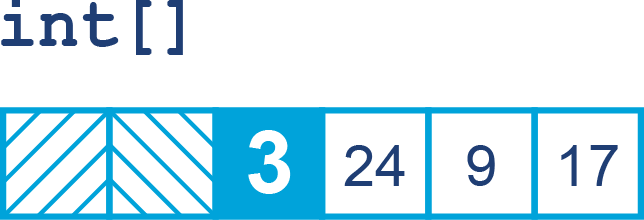
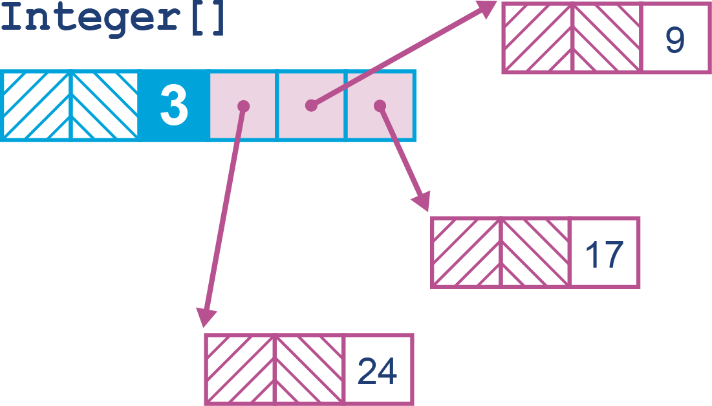
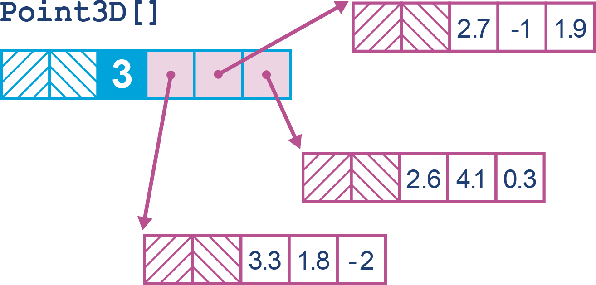
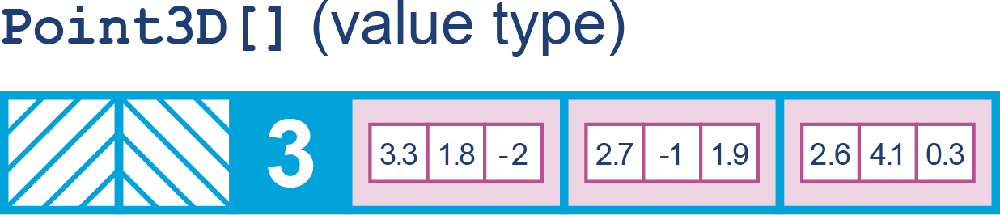

# Chương 15. Hiệu năng hiện đại và Tương lai

Trong chương này, chúng ta sẽ nhìn về tương lai của hiệu năng cho Java và JVM, đặc biệt là khi nó liên quan đến thực tế của các triển khai cloud native. Chúng ta sẽ thảo luận vài công nghệ chưa có mặt (hoặc chỉ có mặt dưới dạng tính năng incubator hay preview) trong Java 21. Điều này phản ánh nguyên tắc rằng chúng tôi chỉ trình bày các tính năng chính thức có trong một phiên bản LTS ở phần thân chính của cuốn sách, và dành việc thảo luận các tính năng chưa chính thức cho chương này.

## Các mẫu hình Concurrency mới

Trong phần này, chúng ta sẽ thảo luận một số mẫu hình mới cho hệ thống đồng thời được virtual thread cho phép, cùng một số tính năng mới liên quan "nối tiếp" từ virtual thread — cụ thể là *structured concurrency* (JEP 453) và *scoped values* (JEP 446).

Lưu ý rằng, tính đến JDK 21, cả structured concurrency lẫn scoped values đều ở trạng thái preview, nên chúng không thể được dùng trong các ứng dụng production.

### Structured Concurrency

API mới đầu tiên trong hai API này được gọi là *structured concurrency* (concurrency có cấu trúc). Đây là API cho việc xử lý thread, cung cấp một cách tiếp cận để các task hợp tác (thường là virtual thread) được xét đến và quản lý tập thể như một tập các subtask.

Có thể sẽ hữu ích khi nhớ lại phần thảo luận về định luật Amdahl ở Chương 13, nơi chúng tôi mô tả việc áp dụng các kỹ thuật đồng thời cho các bài toán song song dữ liệu.

Ngược lại, structured concurrency được thiết kế cho các bài toán song song tác vụ và, do sự gần gũi của nó với virtual thread, nó chủ yếu hữu ích cho các task liên quan đến một lượng I/O nào đó (đặc biệt là các lời gọi tới dịch vụ từ xa). Tuy nhiên, cách tiếp cận này ít hữu ích hơn nhiều với các thao tác chỉ (hoặc chủ yếu) tác động lên dữ liệu in-memory, vì các virtual thread sẽ tranh chấp nhau về thời gian CPU.

Luồng tổng quát cho một task structured concurrency trông như sau:

1. Tạo một *scope* — thread tạo ra sở hữu scope. Scope cho phép nhóm các subtask để điều phối các task trong nhóm.
2. Fork các subtask đồng thời trong scope (mỗi cái là một virtual thread).
3. Chủ sở hữu scope join scope (tất cả subtask) như một đơn vị.
4. Method `join()` của scope block cho đến khi mọi subtask hoàn tất.
5. Sau khi join, xử lý mọi lỗi trong các fork và xử lý kết quả.
6. Đóng scope.

Đáng chỉ ra rằng phiên bản structured concurrency đi kèm Java 21 có một số thay đổi API nhỏ so với Java 20. Cái chính là `fork()` giờ trả về một `Subtask` (triển khai `Supplier`) thay vì một `Future` trần (như ở Java 20).

> **MẸO**
>
> Nhịp phát hành và các API preview của Java là then chốt trong việc cung cấp truy cập sớm để có phản hồi từ thực tế.

Lý do cho interface mới này, thay vì chỉ dùng `Future`, là kết quả chỉ được truy vấn sau một `join()` bởi structured concurrency đối xử với nhiều subtask như một đơn vị công việc duy nhất. Kết quả là, cả các lời gọi blocking tới `get()` lẫn các checked exception từ subtask đều không hữu ích, nên `Future` là một interface hơi vụng về; `Subtask` là interface không có checked exception.

Hãy xem structured concurrency trong hành động qua một ví dụ dùng việc tính một mẹo chứng khoán (stock tip), một class record mà chúng ta sẽ định nghĩa như sau:

```java
record StockTip(String symbol, double sentiment, double delta24) {}
```

Chúng ta sẽ giả định rằng độ mạnh của thái độ thị trường với cổ phiếu (sentiment) và thay đổi giá khả dĩ trong 24 giờ tới (delta24) sẽ được tính bởi một tiến trình bên ngoài nào đó. Những phần tử này có thể mất thời gian để tính, và điều này có khả năng liên quan đến lưu lượng mạng.

Do đó chúng ta có thể dùng các subtask có cấu trúc để tính chúng, như sau:

```java
String symbol = "IBM";

try (var scope = new StructuredTaskScope.ShutdownOnFailure()) {
    Callable<Double> getSentiment = () -> getSentiment(symbol);
    Subtask<Double> fSentiment = scope.fork(getSentiment);

    Callable<Double> getDelta = () -> getDelta24(symbol);
    Subtask<Double> fDelta = scope.fork(getDelta);

    scope.join();
    scope.throwIfFailed();

    return new StockTip(symbol, fSentiment.get(), fDelta.get());
} catch (ExecutionException | InterruptedException e) {
    throw new RuntimeException(e);
}
```

Điều này tuân theo luồng tổng quát cho structured concurrency mà chúng ta đã thiết lập trước đó.

Việc đóng scope được xử lý ngầm qua khối try-with-resources — cái này tắt scope và chờ mọi subtask còn sót hoàn tất. `StructuredTaskScope` có các chính sách Shutdown khác nhau. Trong ví dụ trước, chúng ta dùng `ShutdownOnFailure()`; ở ví dụ tiếp theo, chúng ta sẽ dùng `ShutdownOnSuccess()` trong try-with-resources.

Chúng ta cũng nên nhắc đến vài điểm khác.

Thứ nhất, việc join các subtask cũng có thể bị hủy bằng cách gọi method `shutdown()`. Thứ hai, cũng có một biến thể có định thời của `join()`, gọi là `joinUntil()`, nhận một deadline (dưới dạng tham số `Instant`).

Có hai chính sách shutdown tích hợp sẵn cho scope (và các chính sách shutdown tùy chỉnh cũng được hỗ trợ):

- Hủy mọi subtask nếu một trong số chúng thất bại (`ShutdownOnFailure`).
- Hủy mọi subtask nếu một trong số chúng thành công (`ShutdownOnSuccess`).

Chúng ta đã gặp cái đầu trong ví dụ đầu tiên, vậy hãy chuyển sang gặp lựa chọn thứ hai.

Hãy xét một method thư viện nơi nhiều subtask được khởi chạy (có thể là nhiều bản sao của cùng subtask), và kết quả đầu tiên (từ bất kỳ subtask nào) là đủ. Các task đang đua nhau để hoàn thành, và phần còn lại của các virtual thread nên được tắt ngay khi thành công đầu tiên xảy ra, nên chúng ta nên dùng chính sách `ShutdownOnSuccess`, như sau:

```java
<T> T race(List<Callable<T>> tasks, Instant deadline)
        throws InterruptedException, ExecutionException, TimeoutException {

    try (var scope = new StructuredTaskScope.ShutdownOnSuccess<T>()) {
        for (var task : tasks) {
            scope.fork(task);
        }
        return scope.joinUntil(deadline)
                    .result();   // Ném exception nếu không subtask nào
                                 // hoàn thành thành công
    }
}
```

Điều này có một thao tác đối ngẫu rõ ràng: mọi task phải chạy đến hoàn tất, và việc bất kỳ subtask nào thất bại sẽ hủy toàn bộ task. Để đạt được điều này, chúng ta sẽ lại dùng `ShutdownOnFailure`:

```java
<T> List<T> runAll(List<Callable<T>> tasks)
        throws InterruptedException, ExecutionException {

    try (var scope = new StructuredTaskScope.ShutdownOnFailure()) {
        List<? extends Subtask<T>> handles =
            tasks.stream().map(scope::fork).toList();

        scope.join()
             .throwIfFailed();  // Lan truyền exception nếu subtask nào thất bại

        // Ở đây, mọi task đã thành công, nên kết hợp kết quả của chúng
        return handles.stream().map(Subtask::get).toList();
    }
}
```

Lưu ý rằng phiên bản mã này vật chất hóa lại kết quả thành một `List`, nhưng cũng có thể hình dung một phiên bản có thao tác kết thúc khác, thu gọn kết quả và trả về một giá trị duy nhất.

Chúng ta cũng có thể xây các cấu trúc phức tạp hơn — các subtask chúng ta tạo bằng fork bản thân chúng có thể tạo scope (subscope). Điều này tự nhiên tạo ra cấu trúc cây các scope và subtask, hữu ích khi chúng ta muốn cô đọng một giá trị cuối từ một cây các subtask.

Tuy nhiên, nếu điểm chính của mã là hoạt động qua tác dụng phụ, thì có thể dùng một `StructuredTaskScope<Void>` — tức là dùng một task scope trả về `void`, như trong ví dụ này:

```java
void serveScope(ServerSocket serverSocket) throws IOException,
    InterruptedException {
    try (var scope = new StructuredTaskScope<Void>()) {
        try {
            while (true) {
                final var socket = serverSocket.accept();
                Callable<Void> task = () -> {
                    handle(socket);
                    return null;
                };
                scope.fork(task);
            }
        } finally {
            // Nếu có lỗi hoặc chúng ta bị interrupt,
            // chúng ta ngừng chấp nhận
            scope.shutdown();   // Đóng mọi kết nối đang hoạt động
            scope.join();
        }
    }
}
```

Tuy nhiên, điều này có thể lập luận rằng thường được xử lý tốt hơn bằng mẫu hình fire-and-forget, chẳng hạn `newVirtualThreadPerTaskExecutor()`. Cũng có một số nếp gấp nhỏ với generic ở đây — như cần trả về `null` một cách tường minh.

Một chủ đề lặp lại trong mọi mẫu hình chúng ta đã gặp cho đến giờ là việc dùng những kỹ thuật này đòi hỏi áp dụng tư duy thiết kế và kiến thức về lĩnh vực cùng ngữ cảnh của bài toán đang giải. Không có công cụ phần mềm nào có thể nói với độ chính xác 100% liệu một thread có phải ứng viên tốt để chuyển thành vthread hay không — đó là nhiệm vụ của một kỹ sư phần mềm con người.

Tương tự, việc tái cấu trúc một task thành các subtask và việc định nghĩa các scope liên quan đòi hỏi lập trình viên có hiểu biết tốt về lĩnh vực và mọi phụ thuộc dữ liệu giữa các subtask.

Hãy chuyển sang xem API mới thứ hai mà chúng tôi muốn thảo luận.

### Scoped Values

Bên cạnh structured concurrency, Scoped Values API mới đã đến với Java 21 dưới dạng preview. Nó dựa trên một class mới, `ScopedValue<T>` trong `java.lang`, và nó đại diện cho một ràng buộc (binding) của một giá trị với một biến trong một scope cụ thể. Giá trị này được ghi một lần và sau đó là bất biến trên cơ sở từng scope.

Giá trị được ràng buộc đặc thù scope có thể được truy xuất tại bất kỳ điểm nào xuống bất kỳ chuỗi lời gọi nào trong scope, nhưng chỉ trong scope mà nó được đặt — điều này cung cấp tính vững chắc và một dạng đóng gói.

Đặc biệt, không cần truyền tường minh scoped value xuống chuỗi lời gọi. Có thể nghĩ về nó như có sẵn một cách ngầm định, nhưng đây là một dạng được kiểm soát hơn nhiều (và "Java hơn") so với, chẳng hạn, tham số method implicit của Scala.

Scoped Values API cũng có thể được nghĩ đến như một lựa chọn thay thế hiện đại cho biến thread-local nhưng với một số cải tiến, như tính bất biến. Điều này có nghĩa không có method `set()` cho phép mã ở xa thay đổi một scoped value. Điều này cũng cho phép các tối ưu hóa runtime khả dĩ trong tương lai, vì runtime có thể chắc chắn rằng một scoped value không thể thay đổi.

Một số mục tiêu của API là:

- Chia sẻ dữ liệu trong một thread và với các thread con.
- Vòng đời có kiểm soát và có giới hạn của các giá trị.
- Vòng đời nhìn thấy được từ cấu trúc của mã.
- Tính bất biến cho phép chia sẻ bởi rất nhiều thread.
- Tính bất biến và vòng đời tường minh thường phù hợp hơn.

Không nhất thiết phải rời bỏ `ThreadLocal`, nhưng scoped values kết hợp tốt với các mẫu hình virtual thread, như fire-and-forget. Do đó có vẻ khá có khả năng rằng khi scoped values được áp dụng, thì `ThreadLocal` sẽ dần được thay thế cho hầu như mọi use case.

Hãy viết lại web server virtual thread để dùng scoped values:

```java
public class ServerSV {
    private final static ScopedValue<Socket> SOCKETSV =
        ScopedValue.newInstance();

    void serve(ServerSocket serverSocket) throws IOException,
        InterruptedException {
        while (true) {
            var socket = serverSocket.accept();
            ScopedValue.where(SOCKETSV, socket)
                       .run(() -> handle());
        }
    }

    private void handle() {
        var socket = SOCKETSV.get();
        // xử lý lưu lượng đến
    }
}
```

Lưu ý rằng method `handle()` giờ không còn nhận tham số nữa; thay vào đó, socket được truy cập qua scoped value — đây là tính khả dụng ngầm định chúng ta đã thảo luận trước đó. Ví dụ này rất đơn giản, vì tất cả những gì chúng ta thực sự làm là thay việc truyền tham số bằng một scoped value — một ứng dụng gần như tầm thường. `ScopedValue.where` trình bày một scoped value và object mà nó sẽ được ràng buộc vào. Khi thực thi `run`, giá trị được ràng buộc, cung cấp một bản sao đặc thù cho thread hiện tại. Việc gọi `.get()` đọc scoped value, và khi method hoàn tất, ràng buộc bị hủy.

Sức mạnh thực sự của scoped values là các chuỗi lời gọi và việc scoping cùng subscoping có thể phức tạp tùy ý, và scoped value vẫn sẽ khả dụng.

Nhìn chung, ý định của scoped values là cung cấp một *dynamic scope* (phạm vi động), một khái niệm chưa từng thấy trong Java trước đây. Cách tiếp cận scope này tương tự cái tìm thấy ở một số ngôn ngữ khác — như shell, các phương ngữ Lisp, và Perl. Cũng quan trọng khi lưu ý rằng việc tạo field `private final static` xảy ra trong ngữ cảnh object (khi class được nạp), nhưng dynamic scope phải được tạo trong một method.

Chúng ta có thể đối chiếu nó với dạng scoping truyền thống của Java — thường gọi là *lexical scoping* (phạm vi từ vựng). Đây là nơi scope của một biến được xác định bởi cấu trúc của mã, thường được định nghĩa bởi một cặp dấu ngoặc nhọn khớp nhau.

Ví dụ dynamic scoping của chúng ta cho thấy một mẫu hình then chốt trong hành động:

- Dùng một field `static final` như bộ giữ cho một scoped value
- Khai báo instance `ScopedValue` ở phạm vi class
- Tạo dynamic scope (ví dụ, `runWhere()`) trong một method
- Dùng một lambda để định nghĩa thân scope (nơi các chuỗi lời gọi sẽ sống)

Scoped values được thiết kế để rất hữu ích cho việc truyền các giá trị như ngữ cảnh giao dịch và các ví dụ khác về dữ liệu ngữ cảnh môi trường (ambient context data).

Scoped values tương tác tốt với structured concurrency, vì chúng có thể được xây cho một scope rồi được ràng buộc lại bởi các subscope. Mọi giá trị không được ràng buộc lại sẽ được subscope kế thừa. Kỹ thuật này cho phép "leo thang đặc quyền" và các mẫu hình tương tự, chẳng hạn trong ví dụ này, nơi chúng ta xét hai mức truy cập bảo mật:

```java
enum SecurityLevel { USER, ADMIN }
```

Chúng ta sẽ dùng một scoped value để giữ mức bảo mật hiện tại và một cái khác để giữ số request hiện tại:

```java
private static final ScopedValue<SecurityLevel> securitySV =
    ScopedValue.newInstance();
private static final ScopedValue<Integer> requestSV = ScopedValue.newInstance();

private final AtomicInteger req = new AtomicInteger();

public void run() {
    // Trình bày ràng buộc của mức bảo mật hiện tại
    ScopedValue.where(securitySV, level())
               // Trình bày ràng buộc số request hiện tại
               .where(requestSV, req.getAndIncrement())
               // Ràng buộc các giá trị
               .run(() -> process());
}
```

Để minh họa việc ràng buộc lại (rebinding), hãy giả sử rằng đặc quyền ADMIN không khả dụng, nên mọi nỗ lực dùng chúng sẽ dẫn đến quay về đặc quyền user:

```java
private void process() {
    if (!securitySV.isBound()) {
        throw new RuntimeException(
            "ScopedValue not bound - this should not happen");
    }

    var level = securitySV.get();
    if (level == SecurityLevel.USER) {
        System.out.println("User privileges granted for " +
            requestSV.get() +" on: "+ Thread.currentThread());
    } else {
        // ADMIN không khả dụng trong triển khai của chúng ta
        System.out.println("Admin privileges requested for " +
            requestSV.get() +" on: "+ Thread.currentThread());
        System.out.println(
            "System is in lockdown. Falling back to user privileges");
        // Trình bày và ràng buộc mức USER rồi thực thi process
        // lại với mức bảo mật mới
        ScopedValue.where(securitySV, SecurityLevel.USER)
                   .run(() -> process());
    }
}
```

Để kết thúc phần này, chúng tôi cũng nên chỉ ra rằng các class đại diện cho continuation và các khối xây dựng mức thấp khác cho virtual thread và các thành phần khác *có* tồn tại trong Java 21. Tuy nhiên, chúng nằm trong package `jdk.internal.vm`, nên chúng không nhằm được lập trình viên Java dùng trực tiếp ở bản phát hành này.

Chúng ta có thể kỳ vọng cả hai API này tiếp tục được phát triển và hy vọng đến ở dạng chính thức trong một phiên bản Java tương lai nào đó. Hãy chuyển sang xem một số dự án OpenJDK lớn đang được phát triển trong vài năm qua.

## Panama

Project Panama là một dự án OpenJDK lớn mới lấy tên từ kênh đào Panama, nối Đại Tây Dương và Thái Bình Dương. Trong trường hợp Project Panama, nó nối JVM và mã native.

> …[C]ải thiện và làm phong phú các kết nối giữa Java virtual machine và các API "ngoại lai" (không phải Java) được định nghĩa rõ, bao gồm nhiều interface thường được lập trình viên C sử dụng.
>
> — Project Panama

Nó gồm các JEP trong hai lĩnh vực chính:

- Foreign Function and Memory API
- Vector API

Foreign Function and Memory (FFM) API ban đầu được đề xuất như tính năng preview ở Java 19 và sau đó được tinh chỉnh ở Java 20 và Java 21, trước khi được hoàn thiện ở Java 22.

Tuy nhiên, vì Java 22 không phải bản phát hành LTS, chúng tôi chọn trình bày Panama ở đây thay vì sớm hơn, vì không có LTS hiện tại nào chứa API này như tính năng chính thức. Tính đến Java 21, API nằm trong package `jdk.incubator.foreign` trong module `jdk.incubator.foreign`, và trong tính năng chính thức của Java 22 nằm trong package `java.lang.foreign` trong module `java.base`.

Panama cung cấp hỗ trợ trực tiếp trong Java cho:

- Cấp phát bộ nhớ ngoại lai (foreign memory)
- Thao tác bộ nhớ ngoại lai có cấu trúc
- Quản lý vòng đời của tài nguyên ngoại lai
- Gọi các hàm ngoại lai

Việc triển khai xây dựng trên các API `MethodHandles` và `VarHandles`, và các mục tiêu thiết kế tổng thể là:

**Productivity (năng suất)**
: Thay thế bộ máy dễ gãy của native method và Java Native Interface (JNI) bằng một API súc tích, dễ đọc, thuần Java.

**Performance (hiệu năng)**
: Cung cấp truy cập tới hàm và bộ nhớ ngoại lai với chi phí phụ trội tương đương, nếu không nói là tốt hơn, JNI và `sun.misc.Unsafe`.

**Broad platform support (hỗ trợ nền tảng rộng)**
: Cho phép khám phá và gọi các thư viện native trên mọi nền tảng nơi JVM chạy.

**Uniformity (tính đồng nhất)**
: Cung cấp cách thao tác trên dữ liệu có cấu trúc và không cấu trúc, kích thước không giới hạn, trong nhiều loại bộ nhớ (ví dụ, bộ nhớ native, bộ nhớ bền vững, và bộ nhớ heap được quản lý).

**Soundness (tính đúng đắn)**
: Đảm bảo không có bug use-after-free, ngay cả khi bộ nhớ được cấp phát và giải phóng trên nhiều thread.

**Integrity (tính toàn vẹn)**
: Cho phép chương trình thực hiện các thao tác không an toàn với mã và dữ liệu native nhưng cảnh báo người dùng về các thao tác đó theo mặc định.

Hai trong số các khái niệm quan trọng nhất trong Panama là *arena* và *memory segment*. Một minh họa đơn giản về chúng có thể thấy trong ví dụ này:

```java
public class Main {
    private static final int INT_SIZE = 4;
    private static final long ARENA_SIZE = 4 * 1024 * 1024 * 1024L;

    public static void main(String[] args) {
        long l = 0;
        try (var arena = Arena.ofConfined()) {
            MemorySegment segment = arena.allocate(INT_SIZE * ARENA_SIZE);
            for (l = 0 ; l < ARENA_SIZE ; l += 1) {
                segment.setAtIndex(ValueLayout.JAVA_INT, l, (int)(l % 16));
            }
        }
        System.out.println("l = "+ l);
    }
}
```

Có vài điều cần lưu ý:

- Class `Arena` được dùng để kiểm soát vòng đời của các memory segment.
- Arena dùng cấu trúc try-with-resources quen thuộc để đảm bảo việc giải phóng mang tính quyết định (có thể cần được điều phối giữa các segment).
- Memory segment được cấp phát từ arena.
- Method `allocate()` nhận một tham số `long`, cho phép cấp phát các khối bộ nhớ lớn hơn mức mà class `ByteBuffer` (hoặc mảng) cho phép.

Trong ví dụ này, chúng ta dùng một *confined arena* — đây là trường hợp đơn giản nhất, vì nó đại diện cho một arena chỉ có thể được thread hiện tại dùng. Panama cũng hỗ trợ shared arena, global arena, và cả automatic arena (được GC của JVM quản lý).

Bạn có thể đã để ý rằng chúng ta đã thảo luận Foreign Memory API nhưng chưa nhắc đến Vector API. Đó là bởi Vector API đã quyết định tiếp tục incubate cho đến khi một số tính năng cần thiết của Project Valhalla (xem "Valhalla") trở nên khả dụng dưới dạng tính năng preview.

Điều này đặt Vector API xa hơn, và trên cơ sở mang tính suy đoán hơn nhiều, so với một số tính năng khác chúng ta thảo luận trong chương này.

Vậy nên, thay vào đó, hãy xem một dự án OpenJDK mới liên quan đến việc thảo luận về sự tiến hóa của việc thực thi Java, nhưng có thể cần được điều phối, và vẫn ở giai đoạn rất sớm tại thời điểm viết (tháng 8/2024).

## Leyden

Project Leyden được đặt tên theo *Leyden jar*, một dạng tụ điện thời kỳ đầu có từ thế kỷ 18 và được phát minh ở thành phố Leyden, Hà Lan.

> **GHI CHÚ**
>
> Một tên khác cho tụ điện là *condenser*, có ý nghĩa nhất định về mặt đặt tên các khía cạnh của dự án, như chúng ta sẽ thấy sau.

Mục tiêu tổng thể của dự án là:

> Cải thiện thời gian khởi động, thời gian đạt hiệu năng đỉnh, và dung lượng (footprint) của các chương trình Java.
>
> — Project Leyden

Nói nôm na, cái tên nhằm gợi lên "bắt sét bỏ chai" — tức là bảo tồn ngữ nghĩa của các chương trình Java mà không cần chi phí phụ trội của các khả năng động đa dụng mà HotSpot cung cấp.

Điều này bắt nguồn từ ý tưởng rằng JVM cân bằng cả lập luận tĩnh lẫn động về các trạng thái runtime và tối ưu hóa, thay vì cách tiếp cận "chọn một, mất một" mà các ngôn ngữ khác áp dụng.

Ví dụ, các ngôn ngữ như C++ chọn lập luận tĩnh và biên dịch, và từ bỏ tính động, trong khi các ngôn ngữ như Python chọn lập luận động rồi chật vật thêm lại các dạng lập luận tĩnh hạn chế.

Ngược lại, HotSpot tối ưu hóa các trạng thái động một cách suy đoán lúc runtime, thực chất chuyển chúng thành trạng thái tĩnh. Trong Leyden, mục tiêu là những tối ưu hóa như vậy có thể được dịch chuyển và tối ưu suy đoán *trước* khi ứng dụng khởi động.

Lưu ý rằng điều này tổng quát hơn chỉ là "cung cấp biên dịch AOT". Như chúng ta đã thảo luận ở Chương 6, có sự phân biệt giữa *kết quả* và *cơ chế* — và Leyden tập trung vào kết quả.

Leyden rút ra từ kinh nghiệm thực tiễn đã có được từ các dự án như GraalVM và Quarkus, và nó tìm cách tổng quát hóa kinh nghiệm này và đưa nó vào lõi của OpenJDK cùng các chuẩn Java.

Hai cơ chế nền tảng đang được khám phá trong Leyden hiện nay là:

- Condenser
- Premain archive

Hãy lần lượt xem từng cái.

### Image, Ràng buộc và Condenser

Một trong những ý tưởng quan trọng nhất trong dự án là *static run-time image*. Cái này được hiểu là một chương trình độc lập, dẫn xuất từ một ứng dụng và một JDK, chỉ chạy trên ứng dụng cụ thể đó.

Một khái niệm liên quan là *closed world constraint* (ràng buộc thế giới đóng). Một ứng dụng chấp nhận ràng buộc này chỉ ra rằng nó sẵn sàng chấp nhận một số giới hạn nghiêm ngặt về các class nó có thể nạp: trong pha runtime, nó không thể nạp class từ ngoài image, và cũng không thể tạo class một cách động.

Ràng buộc closed-world áp đặt các giới hạn rất nghiêm ngặt lên tính động tự nhiên của Java, đặc biệt là các tính năng reflection và nạp class lúc runtime. Tuy nhiên, rất nhiều thư viện và framework hiện có của Java phụ thuộc vào những khía cạnh này, và kết quả là không phải mọi ứng dụng đều phù hợp với ràng buộc này, và không phải mọi lập trình viên đều sẵn lòng sống với nó.

Do đó, thay vì áp dụng ràng buộc closed-world như một mục tiêu chính và duy nhất, Leyden theo đuổi cách tiếp cận dần dần và tăng tiến — nó tìm cách khám phá những trạng thái trung gian nào tồn tại. Điều này được diễn đạt qua các ràng buộc yếu hơn closed world nhưng vẫn hữu ích và phù hợp cho một số lượng đáng kể các workload Java.

Lưu ý rằng Java và JVM — theo thiết kế — có các tính năng động khiến việc phân tích tĩnh trở nên khó (hoặc thậm chí bất khả thi), cách tiếp cận của Leyden trao cho lập trình viên quyền kiểm soát để đánh đổi chức năng lấy hiệu năng — và làm vậy một cách chọn lọc.

Một trong những khái niệm then chốt là *computation shifting* (dịch chuyển tính toán) — chuyển một số loại tính toán ra khỏi pha khởi động và warmup của ứng dụng sang các pha sớm hơn (hoặc trong một số trường hợp muộn hơn).

Chúng ta có thể dịch chuyển hai loại tính toán:

- Công việc được chương trình diễn đạt trực tiếp (ví dụ, gọi một method)
- Công việc được thực hiện thay mặt chương trình (ví dụ, biên dịch một method sang mã native)

Các triển khai Java đã có một số tính năng có thể dịch chuyển tính toán tự động:

- Gộp hằng số lúc biên dịch (dịch tính toán sớm hơn)
- Các archive class-data đã tiêu hóa trước (sớm hơn)
- Nạp và khởi tạo class lười (muộn hơn)

Cả việc tính toán lúc build của Quarkus lẫn khả năng biên dịch AOT của GraalVM đều có thể được xem là dịch chuyển việc biên dịch sớm hơn (mặc dù những khả năng này gắn với framework và không được chuẩn hóa).

> **GHI CHÚ**
>
> Từ một góc nhìn nhất định, ngay cả garbage collection cũng có thể được xem là dịch chuyển tính toán sang các pha muộn hơn.

Bất cứ khi nào việc dịch chuyển xảy ra, nó phải luôn bảo tồn ý nghĩa chương trình, theo các đặc tả Java; điều này cần thiết để đảm bảo tính tương thích. Leyden sẽ khám phá những cách mới để dịch chuyển tính toán.

Một số loại dịch chuyển có lẽ sẽ không đòi hỏi thay đổi đặc tả, nhưng một số khả năng đang được xét chắc chắn sẽ đòi hỏi, và ý định cũng là cung cấp các tính năng mới cho phép lập trình viên diễn đạt ý định dịch chuyển tính toán một cách trực tiếp.

Một *condenser* là một phép biến đổi nhằm dịch chuyển tính toán từ runtime sang các pha sớm hơn bằng cách xem xét toàn bộ image chương trình — tức là, nó là phép biến đổi toàn chương trình bảo tồn ý nghĩa.

Condenser sẽ biến đổi một image chương trình thành một image mới có thể chứa:

- Mã mới (các method đã biên dịch AOT)
- Dữ liệu mới (các object heap đã serialize)
- Metadata mới (như các class được nạp trước)
- Các ràng buộc mới

Lưu ý rằng condenser được thiết kế để có thể kết hợp — image đầu ra của một condenser có thể là đầu vào của cái khác, và một condenser cụ thể có thể được áp dụng nhiều lần nếu cần.

> **GHI CHÚ**
>
> Kinh nghiệm với Quarkus Native Mode gợi ý rằng khi unit test hay debug, đừng bận tâm thực hiện các phép biến đổi chương trình — chỉ chạy bình thường. Thực hiện loại test này rốt cuộc sẽ là kiểm thử framework và không mang lại giá trị.

Việc dịch chuyển tính toán nhìn chung đòi hỏi chấp nhận các ràng buộc, với ý tưởng tổng thể rằng bạn có thể đánh đổi chức năng lấy hiệu năng qua các condenser mà bạn chọn.

Với các condenser đủ mạnh, nếu bạn dịch chuyển đủ nhiều tính toán sớm hơn hoặc muộn hơn về thời gian, bạn thậm chí có thể tạo ra một native image hoàn toàn tĩnh, mặc dù điều này có lẽ sẽ đòi hỏi chấp nhận nhiều ràng buộc.

Điều này có nghĩa Leyden không nhất thiết phải đặc tả các native image hoàn toàn tĩnh một cách trực tiếp. Thay vào đó, nó sẽ cho phép dịch chuyển tính toán đủ mức và ràng buộc tính động đủ mức, để các native image hoàn toàn tĩnh có thể nảy sinh như một tính chất nổi lên.

Tại thời điểm viết (tháng 8/2024), một số nỗ lực thiết kế đang được tiến hành, nhưng chưa có nhiều công việc về condenser được đưa vào mainline.

Khía cạnh này của dự án vẫn còn sớm trong quá trình phát triển và đã bắt đầu bằng việc xem xét các ý tưởng như phân giải các liên kết `invokedynamic` lúc biên dịch, khi có thể (ví dụ, với lambda), và việc phát triển các field `static final` được tính lười.

Hãy chuyển sang xem khía cạnh lớn còn lại của Leyden — premain.

### Leyden Premain

Mục tiêu của Leyden premain là giảm hoạt động warmup — mà chúng ta định nghĩa là nỗ lực tối ưu hóa (bởi JVM, không phải app) để đạt hiệu năng đỉnh. Hiệu năng đỉnh có thể được định nghĩa là một cực đại thống kê (với một chút nhiễu vẫn hiện diện).

Vì JVM thường là môi trường khá nhiễu, với nhiễu thường trong khoảng 3%–5%, thì chúng ta có thể định nghĩa một quy tắc rằng đỉnh đạt được ở throughput 95% trở lên. Thời gian warmup do đó được định nghĩa là thời gian cần để đạt throughput 95%.

Để đạt được điều này, khía cạnh premain của Leyden xây dựng trên khái niệm *class-data sharing* (CDS).

Đây không phải ý tưởng mới — CDS đã có sẵn trong Java từ phiên bản 8 và là một phần của bản cài mặc định bắt đầu (với các phiên bản LTS) từ Java 17. Ý tưởng cơ bản là khi JVM khởi động, một archive chung được memory-map vào để cho phép metadata JVM chỉ đọc của một tập class khả dụng ngay lập tức, do đó rút ngắn thời gian khởi động.

Ở các phiên bản Java hiện tại, theo mặc định, những class đó đến từ thư viện Java chuẩn. Tuy nhiên, các cải tiến gần đây cũng cho phép *application class-data sharing* (AppCDS), linh hoạt hơn và nằm dưới sự kiểm soát của lập trình viên. Chúng được giới thiệu để mở rộng khái niệm CDS bao gồm các class được chọn từ class path của ứng dụng.

Điều này thậm chí bao gồm khả năng (từ Java 17) tạo ra các archive AppCDS động, theo đó metadata có thể được ghi lại trong một *training run* ban đầu rồi được dùng trong các *deployment run* tiếp theo bằng cách chỉ định switch `-XX:SharedArchiveFile=<dynamic archive>`.

Leyden premain tìm cách đưa điều này xa hơn, bằng cách dùng training run để bắt được nhiều metadata và mã hơn nhiều cho việc tái sử dụng trong deployment run.

Nhìn chung, một training run được coi là một lần thực thi mang tính đại diện của ứng dụng, với đầu vào và cấu hình điển hình, chạy qua khởi động theo các đường và trạng thái kỳ vọng và warm up đến trạng thái ổn định.

Điều này sẽ hoạt động tốt nhất trên các hệ thống xử lý nhiều tác vụ tương tự, lặp lại, dẫn đến hiệu năng đỉnh ổn định. Tất nhiên, không phải mọi hệ thống đều như vậy.

Trong quá trình training, JVM thu thập các trạng thái ban đầu, profile và mã JIT rồi tạo ra một log (hoặc CDS archive). Tùy chọn, nhiều training run được thực thi, và các log dữ liệu kết quả được hợp nhất. Ứng dụng sau đó được *chưng cất* (về cơ bản bằng cách áp dụng một condenser) thành phiên bản đã tối ưu.

> **GHI CHÚ**
>
> Một khả năng dài hạn thú vị là tự động training và ẩn một phần hoặc toàn bộ các bước training "dưới nắp capo" — nhưng cần rất nhiều công việc ngắn hạn hơn trước khi điều này khả thi.

Việc thực thi ứng dụng đã tối ưu được gọi là *deployment run*. Deployment run bắt đầu với các trạng thái ban đầu và hưởng lợi từ các profile và mã đã lưu.

Nhìn chung, pha khởi động của một ứng dụng phân giải các symbol, chạy các method khởi tạo class (`<clinit>`), và chạy các BSM `invokedynamic` (ví dụ, cho lambda). Công việc này có thể được thực hiện trong một training run và lưu lại để phát lại trong deployment, cùng với một số trạng thái khởi tạo và mã.

Mã có thể được tái sử dụng từ các tầng khác nhau của trình biên dịch phân tầng của HotSpot, bao gồm C1 (là một JIT "bảo thủ" không thực hiện tối ưu hóa suy đoán và do đó không bao giờ cần de-optimize) và mã đã tối ưu từ C2 (tức Tier 4). Xem Chương 6 để biết thêm chi tiết về các trình biên dịch JIT và phân tầng của HotSpot.

Mã đã biên dịch bởi C1 có thể được dùng thay cho mã thông dịch, cải thiện việc khởi động bằng cách tránh cả việc biên dịch lại trực tuyến lẫn trình thông dịch. Điều này đặc biệt hữu ích trong trường hợp các đường mã không nóng vốn có thể không bao giờ được biên dịch hoặc được gặp lúc khởi động nhưng không sau đó. Kết quả hiệu năng ban đầu chỉ ra rằng những khoản tiết kiệm thời gian này là đáng kể.

Cũng có ý định rằng mã JIT có thể được tái sinh trong lúc khởi động từ các profile đã lưu, nếu cần.

Ở mức cao, các training run (quan sát ứng dụng) có thể được xem như mặt động của phân tích ứng dụng tĩnh — hoặc một cách khác, một dạng bậc hai của profile-guided optimization.

Các quan sát động có thể được dùng như thể chúng được suy diễn tĩnh, với điều kiện chúng ta giữ khả năng de-optimization. Một khi được bắt lại, dữ liệu như vậy "trông tĩnh", nhưng nó "sinh ra động", và nó có thể thay đổi, kích hoạt việc tái tối ưu hóa. Sự kết hợp các kỹ thuật suy đoán với "cửa thoát hiểm" cho phép các sự kiện tương lai không dự kiến là năng lực cốt lõi của HotSpot.

Trên thực tế, có những lý do rất thực tiễn tại sao cách tiếp cận này vượt trội hơn biên dịch AOT toàn phần (như tìm thấy ở, ví dụ, GraalVM Native Image, v.v.).

Ví dụ, khá phổ biến việc các workload có "những ngày bất thường".

Trong ngành tài chính, ví dụ có thể là các ngày non-farm payroll (NFP) của Mỹ hoặc các ngày đáo hạn quyền chọn (mỗi quý một lần).

Vào những ngày bất thường này, một hệ thống biên dịch AOT hoàn toàn có khả năng hoạt động tệ hơn nhiều so với một hệ thống vẫn có VM động trong vòng lặp. Đó là bởi phiên bản AOT hoàn toàn tĩnh không thể rút lại các giả định về việc thực thi đường mã vốn được suy ra từ training run, trong khi Leyden có thể de-optimize và biên dịch lại.

Tại thời điểm viết (tháng 8/2024), trạng thái của công việc premain là:

- Các hoạt động premain được suy ra tự động từ các training run.
- Các trạng thái tối ưu hóa được sinh cho premain được dump vào archive.

Trong tương lai, dự kiến các hoạt động do người dùng định nghĩa cũng có thể tham gia. Tuy nhiên, điều này sẽ đòi hỏi công việc về việc đặc trưng hóa những thứ như mã người dùng nào được tin là thuần (pure) (ví dụ, qua những thứ như các annotation về tính thuần mới).

Điều này là dự kiến — Leyden là công nghệ đang tiến hóa và vẫn còn tương đối giai đoạn đầu.

Hãy chuyển sang gặp một dự án dài hạn khác trong OpenJDK — Valhalla.

## Valhalla

Project Valhalla là dự án chạy dài tìm cách sắp xếp lại JVM ở mức rất sâu.

Chi tiết hơn, các mục tiêu chính của dự án là:

- Căn chỉnh hành vi bố cục bộ nhớ của JVM với mô hình chi phí của phần cứng hiện đại.
- Mở rộng generic để cho phép trừu tượng hóa trên mọi kiểu, bao gồm primitive, value, và thậm chí `void`.
- Cho phép các thư viện hiện có, đặc biệt là JDK, tiến hóa một cách tương thích để tận dụng đầy đủ những tính năng này.

Ẩn trong mô tả này là gợi ý về một trong những nỗ lực phức tạp nhất trong dự án: khám phá khả năng của *value class* trong JVM.

> **CẢNH BÁO**
>
> Valhalla được khởi động năm 2014, và trong 10 năm qua, thiết kế triển khai đã thay đổi đáng kể vài lần. Hãy rất cẩn thận khi đọc về Valhalla rằng thông tin là cập nhật. Ví dụ, mô tả đưa ra trong ấn bản đầu tiên của cuốn sách này giờ hoàn toàn sai.

Nhớ rằng, tính đến và bao gồm phiên bản 21, Java chỉ có hai loại giá trị: kiểu nguyên thủy và tham chiếu object. Nói cách khác, môi trường Java cố ý không cung cấp kiểm soát mức thấp lên bố cục bộ nhớ.

> Là nơi để khám phá và ươm mầm các ứng viên tính năng Java VM và ngôn ngữ nâng cao.
>
> — Project Valhalla

Là một trường hợp đặc biệt, điều này có nghĩa Java không có thứ gì như struct, và bất kỳ kiểu dữ liệu hợp thành nào chỉ có thể được truy cập bằng tham chiếu.

Để hiểu hệ quả của điều này, hãy xem bố cục bộ nhớ của các mảng. Ở Hình 15-1, chúng ta thấy một mảng các `int` nguyên thủy. Vì những giá trị này không phải object, chúng được đặt tại các vị trí bộ nhớ liền kề.



*Hình 15-1. Mảng các int*

Ngược lại, integer đóng hộp là một object nên được xử lý bằng tham chiếu. Điều này có nghĩa một mảng các object `Integer` sẽ là mảng các tham chiếu. Điều này thể hiện ở Hình 15-2.



*Hình 15-2. Mảng các Integer*

Trong hơn 25 năm, mẫu bố cục bộ nhớ này là cách nền tảng Java hoạt động. Nó có lợi thế về sự đơn giản nhưng có đánh đổi về hiệu năng — việc xử lý mảng các object liên quan đến các phép gián tiếp không thể tránh khỏi và các cache miss đi kèm.

Kết quả là, nhiều lập trình viên hướng hiệu năng muốn có khả năng định nghĩa các kiểu có thể được đặt trong bộ nhớ hiệu quả hơn. Điều này cũng bao gồm loại bỏ chi phí phụ trội của việc cần một object header đầy đủ cho mỗi mục dữ liệu hợp thành.

Ví dụ, một điểm trong không gian ba chiều, `Point3D`, thực sự chỉ gồm ba tọa độ không gian. Tính đến Java 21, kiểu như vậy có thể được biểu diễn như kiểu object với ba field:

```java
public record Point3D(double x, double y, double z) {}
```

Do đó, một mảng các điểm sẽ có bố cục bộ nhớ thể hiện ở Hình 15-3.



*Hình 15-3. Mảng các Point3D*

Khi mảng này được xử lý, mỗi mục phải được truy cập qua một phép gián tiếp bổ sung để lấy tọa độ của mỗi điểm. Điều này có tiềm năng gây ra cache miss cho mỗi điểm trong mảng, chẳng vì lợi ích thực sự nào.

Cũng đúng rằng danh tính object là vô nghĩa với kiểu `Point3D`. Điều này có nghĩa chúng bằng nhau khi và chỉ khi mọi field của chúng bằng nhau. Đây đại thể là ý nghĩa của một *value class* trong hệ sinh thái Java.

Nếu khái niệm này có thể được triển khai trong JVM, thì với các kiểu đơn giản như điểm không gian, một bố cục bộ nhớ như thể hiện ở Hình 15-4 có thể hiệu quả hơn rất nhiều.



*Hình 15-4. Mảng các Point3D "kiểu struct"*

Việc lặp trên một mảng các điểm lồng nhau này giờ hiệu quả hơn nhiều nhờ locality của bộ nhớ và cache, cũng như tiết kiệm chi phí của các header của từng object riêng lẻ. Không chỉ vậy, mà rồi các khả năng khác (như các kiểu do người dùng định nghĩa hành xử tương tự kiểu nguyên thủy tích hợp sẵn) cũng nổi lên.

> **MẸO**
>
> Với các mảng "kiểu struct", có tiềm năng gọi các hàm ngoại lai bằng Project Panama. Một ví dụ là chuyển struct sang GPU cho một thao tác xử lý vector nhằm xử lý nhanh hơn và ít tốn điện hơn.

Tuy nhiên, có một số khó khăn khái niệm then chốt trong lĩnh vực này. Một vấn đề quan trọng liên quan đến các quyết định thiết kế ban đầu được đưa ra trong những ngày đầu của Java. Đó là việc hệ thống kiểu của Java thiếu một *top type*, nên không có kiểu nào là siêu kiểu của cả `Object` lẫn `int`. Chúng ta cũng có thể nói rằng hệ thống kiểu của Java không có một gốc duy nhất (single-rooted).

Là hệ quả, khi generic được thêm vào từ tận Java 5, người ta quyết định rằng các biến kiểu chỉ có thể trải trên các kiểu tham chiếu (các lớp con của `Object`). Do đó, không có cách rõ ràng nào để xây dựng một ý nghĩa nhất quán cho, chẳng hạn, `List<int>`. Thay vào đó, Java dùng *type erasure* để triển khai các kiểu generic tương thích ngược trên các kiểu tham chiếu.

> **MẸO**
>
> Đôi khi người ta phàn nàn về type erasure, nhưng cơ chế này không chịu trách nhiệm cho việc thiếu top type và việc thiếu các collection nguyên thủy kết quả.

Nếu nền tảng Java được mở rộng để bao gồm value type, thì câu hỏi tự nhiên nảy sinh là liệu value type có thể được dùng làm giá trị tham số kiểu hay không. Nếu không, thì điều này có vẻ sẽ giới hạn rất nhiều tính hữu dụng của chúng. Do đó, thiết kế của value type luôn bao gồm giả định rằng chúng sẽ hợp lệ như các giá trị của tham số kiểu trong một dạng generic được nâng cao.

> Valhalla có thể được thúc đẩy bởi các cân nhắc về hiệu năng, nhưng cách nhìn tốt hơn là xem nó như việc nâng cao trừu tượng hóa, đóng gói, an toàn, tính biểu đạt và khả năng bảo trì — mà không từ bỏ hiệu năng.
>
> — Brian Goetz

Thiết kế hiện tại của Valhalla cố sống đúng với nguyên tắc: "Viết như một class, hoạt động như một int." Chỉ có một từ khóa mới duy nhất (`value`) để chỉ ra rằng một class là value class — mọi class hiện tại giờ được hiểu là *identity class* (một khái niệm chưa cần thiết cho đến giờ).

Bytecode của JVM cũng chỉ có thay đổi nhỏ và hiện không đòi hỏi định nghĩa bất kỳ bytecode mới nào.

Một trong những thay đổi rõ ràng nhất là ở việc triển khai so sánh giá trị (tức bytecode `if_acmpeq`). Ở các phiên bản Java hiện tại, đây chỉ là so sánh bit — hai giá trị nguyên thủy bằng nhau nếu chúng có cùng các bit, và hai tham chiếu object bằng nhau nếu chúng trỏ đến cùng vị trí bộ nhớ.

Tuy nhiên, so sánh các value object phức tạp hơn — hai value object giống nhau khi và chỉ khi mọi field của chúng có cùng giá trị. Điều này có thể gây vấn đề, bởi value class có thể có các field cũng là value class.

Ví dụ:

```java
public value record VR0(VR1 vr1) {}
public value record VR1(VR2 vr2) {}
public value record VR2(VR3 vr3) {}
// ... và cứ thế
public value record VRN(int i) {}
```

Giờ, hãy xét việc so sánh hai object kiểu `VR0`. Chúng sẽ bằng nhau khi và chỉ khi các instance nhúng của `VRN` giữ cùng giá trị `int`, như ta thấy với trường hợp N=3:

```java
var vr0a = new VR0(new VR1(new VR2(new VR3(42))));
var vr0b = new VR0(new VR1(new VR2(new VR3(73))));
var vr0c = new VR0(new VR1(new VR2(new VR3(42))));

System.out.println(vr0a == vr0b);
System.out.println(vr0a == vr0c);
System.out.println(vr0b == vr0c);
```

sẽ cho ra:

```
false
true
false
```

Tuy nhiên, để xác định điều này, VM phải đệ quy qua các định nghĩa về sự bằng nhau cho mọi kiểu trung gian.

Điều này có nghĩa giờ có khả năng hành vi đệ quy độ sâu tùy ý trong `if_acmpeq`, và điều này có hệ quả hiệu năng tiêu cực tiềm tàng quan trọng.

Lưu ý rằng các chuỗi phụ thuộc loại này phải kết thúc vào lúc nào đó — value class không được phép có các field gây phụ thuộc vòng, vì sẽ không thể biết cần bao nhiêu không gian để bố trí một object kiểu đó.

Về biên dịch JIT, tác động chính nằm ở hỗ trợ cần thiết trong trình biên dịch C2, về cơ bản để tránh cấp phát càng nhiều càng tốt và triển khai "đóng hộp lạ mắt" (fancy boxing) cho các value object. Về việc xử lý ngữ nghĩa bằng nhau mới, có những trường hợp trình biên dịch JIT có thể suy ra hành vi, nhưng cũng có những trường hợp nó không thể.

Cuối cùng, những thay đổi này với VM phải được triển khai cực kỳ cẩn thận. Chúng không được, ngay cả trong trường hợp xấu nhất có thể, gây suy giảm hiệu năng trong mã hiện có khi Valhalla không được bật.

Tại thời điểm viết (tháng 8/2024), chưa rõ bản phát hành Java nào cuối cùng sẽ giới thiệu value type như một tính năng production.

## Kết luận

Trong ấn bản mới của cuốn sách này, chúng tôi đã đưa tiếp phần tài liệu từ ấn bản đầu tiên vẫn còn liên quan đến lập trình viên Java hiện đại. Đồng thời, chúng tôi đã giới thiệu các kỹ thuật của công nghệ cloud vốn ngày càng thiết yếu cho các ứng dụng sống trên cloud.

Việc một kỹ sư Java có ý thức về hiệu năng chỉ có kiến thức thợ lành nghề về mô hình thực thi và GC của JVM là không còn đủ nữa. Các kỹ thuật cloud native mới như orchestration và observability giờ là một phần công việc hằng ngày của nhiều — có lẽ thậm chí hầu hết — lập trình viên Java và nhân viên vận hành.

Đồng thời, các nguyên tắc nền tảng của kỹ thuật hiệu năng phần mềm (trong bất kỳ môi trường nào) không thay đổi và vẫn đòi hỏi cùng kiến thức và sự áp dụng cần mẫn. Các kỹ sư giờ có nhiều tầng hơn và các bài toán tối ưu đa biến phức tạp hơn phải giải quyết hằng ngày. Khối kiến thức cũng tiếp tục tăng lên, dẫn đến nhiều chuyên môn hóa và phối hợp hơn giữa các kỹ sư.

Chúng tôi hy vọng bạn sẽ thấy thông tin và các kỹ thuật chúng tôi trình bày trong cuốn sách này hữu ích. Nó nhằm là điểm khởi đầu cho hành trình hiệu năng độc đáo của riêng bạn chứ không phải một hướng dẫn đầy đủ. Chúc may mắn!
