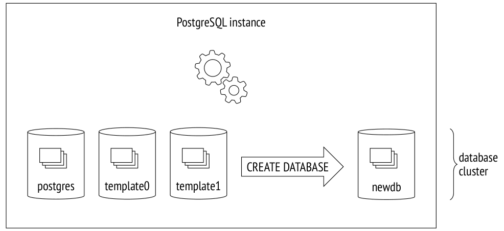
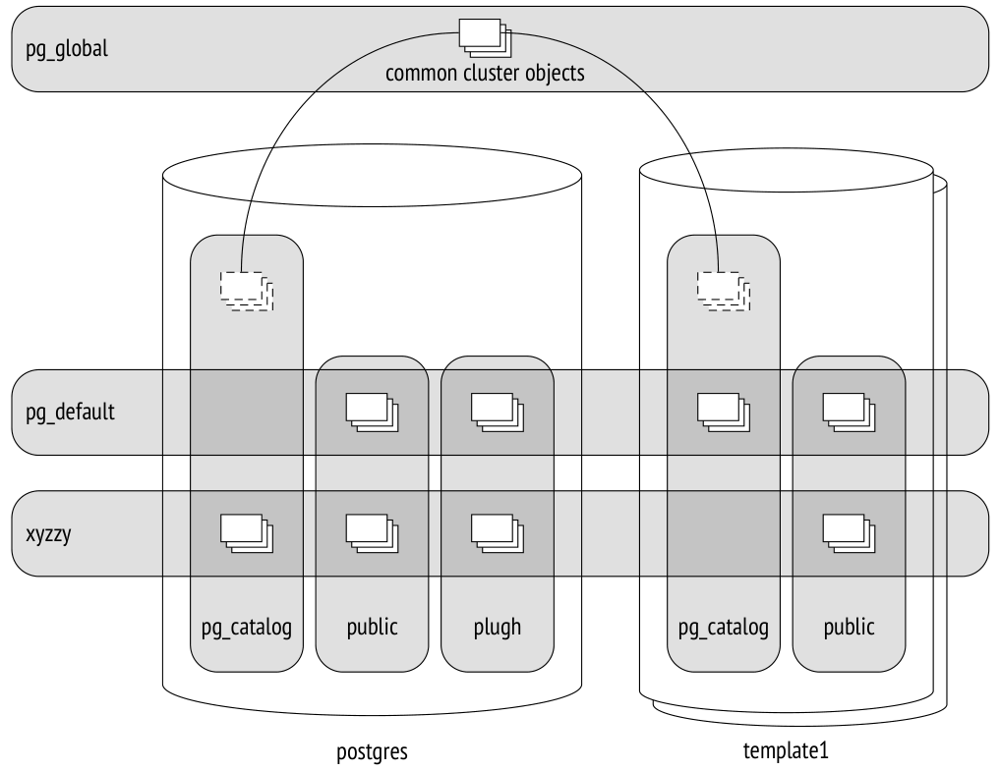
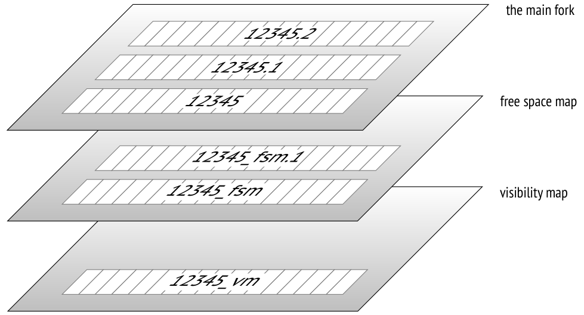
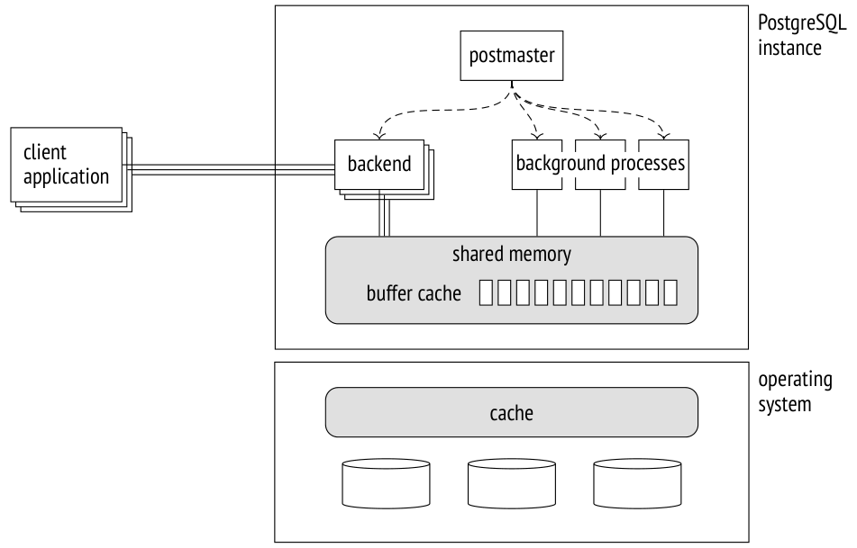

# Chương 1. Giới thiệu (Introduction)

## 1.1 Tổ chức dữ liệu (Data Organization)

### Cơ sở dữ liệu (Databases)

PostgreSQL là một chương trình thuộc lớp các hệ quản trị cơ sở dữ liệu. Khi chương trình này đang chạy, ta gọi nó là một *server* PostgreSQL, hay một *instance*.

Dữ liệu do PostgreSQL quản lý được lưu trữ trong các cơ sở dữ liệu.[^1] Một instance PostgreSQL có thể phục vụ nhiều cơ sở dữ liệu cùng lúc; tập hợp các cơ sở dữ liệu này được gọi là một *database cluster* (cụm cơ sở dữ liệu).

Để có thể sử dụng cluster, trước hết bạn phải *khởi tạo*[^2] (tạo) nó. Thư mục chứa tất cả các file liên quan đến cluster thường được gọi là `PGDATA`, theo tên của biến môi trường trỏ tới thư mục này.

> Các bản cài đặt từ gói dựng sẵn có thể thêm các "lớp trừu tượng" riêng lên trên cơ chế thông thường của PostgreSQL bằng cách thiết lập tường minh mọi tham số mà các tiện ích cần đến. Trong trường hợp này, server cơ sở dữ liệu chạy như một dịch vụ của hệ điều hành, và có thể bạn sẽ không bao giờ trực tiếp bắt gặp biến PGDATA. Nhưng bản thân thuật ngữ này đã được dùng phổ biến, nên tôi sẽ sử dụng nó.

Sau khi khởi tạo cluster, `PGDATA` chứa ba cơ sở dữ liệu giống hệt nhau:

**template0** được dùng cho các trường hợp như khôi phục dữ liệu từ một bản sao lưu logic hoặc tạo cơ sở dữ liệu với bảng mã (encoding) khác; nó tuyệt đối không được sửa đổi.

**template1** đóng vai trò khuôn mẫu cho mọi cơ sở dữ liệu khác mà người dùng có thể tạo trong cluster.

**postgres** là một cơ sở dữ liệu thông thường mà bạn có thể sử dụng tuỳ ý.



### System Catalog

Siêu dữ liệu (metadata) của mọi đối tượng trong cluster (chẳng hạn bảng, index, kiểu dữ liệu hay hàm) được lưu trong các bảng thuộc *system catalog* (danh mục hệ thống).[^3] Mỗi cơ sở dữ liệu có bộ bảng (và view) riêng mô tả các đối tượng của cơ sở dữ liệu đó. Một số bảng system catalog là chung cho toàn bộ cluster; chúng không thuộc về cơ sở dữ liệu cụ thể nào (về mặt kỹ thuật, một cơ sở dữ liệu giả với ID bằng không được sử dụng), nhưng có thể được truy cập từ mọi cơ sở dữ liệu.

System catalog có thể được xem bằng các truy vấn SQL thông thường, còn mọi sửa đổi trong nó đều được thực hiện bởi các lệnh DDL. Client `psql` cũng cung cấp cả một loạt lệnh hiển thị nội dung của system catalog.

Tên của mọi bảng system catalog đều bắt đầu bằng `pg_`, như trong `pg_database`. Tên cột bắt đầu bằng một tiền tố ba chữ cái thường tương ứng với tên bảng, như trong `datname`.

Trong tất cả các bảng system catalog, cột được khai báo là khoá chính có tên `oid` (object identifier — định danh đối tượng); kiểu của nó, cũng có tên là `oid`, là số nguyên 32 bit.

> Cách cài đặt định danh đối tượng oid hầu như giống hệt cách cài đặt sequence, nhưng nó xuất hiện trong PostgreSQL sớm hơn nhiều. Điểm đặc biệt của nó là các ID duy nhất được sinh ra từ một bộ đếm chung được dùng trong nhiều bảng khác nhau của system catalog. Khi ID được cấp vượt quá giá trị tối đa, bộ đếm được đặt lại. Để bảo đảm mọi giá trị trong một bảng cụ thể là duy nhất, oid được cấp tiếp theo sẽ được kiểm tra bằng unique index; nếu nó đã được dùng trong bảng này, bộ đếm được tăng lên và việc kiểm tra được lặp lại.[^4]

### Schema (Schemas)

*Schema*[^5] là các không gian tên (namespace) lưu trữ mọi đối tượng của một cơ sở dữ liệu. Ngoài các schema của người dùng, PostgreSQL cung cấp sẵn một số schema định nghĩa trước:

**public** là schema mặc định cho các đối tượng của người dùng nếu không có thiết lập nào khác được chỉ định.

**pg_catalog** được dùng cho các bảng system catalog.

**information_schema** cung cấp một góc nhìn thay thế cho system catalog theo định nghĩa của chuẩn SQL.

**pg_toast** được dùng cho các đối tượng liên quan đến TOAST. *[→ tr. 28](01-introduction.md)*

**pg_temp** chứa các bảng tạm. Mặc dù những người dùng khác nhau tạo bảng tạm trong các schema khác nhau có tên `pg_temp_`*N*, mọi người đều tham chiếu đến đối tượng của mình thông qua bí danh `pg_temp`.

Mỗi schema chỉ giới hạn trong một cơ sở dữ liệu cụ thể, và mọi đối tượng của cơ sở dữ liệu đều thuộc về schema này hay schema khác.

Nếu schema không được chỉ định tường minh khi truy cập một đối tượng, PostgreSQL sẽ chọn schema phù hợp đầu tiên từ *search path* (đường dẫn tìm kiếm). Search path dựa trên giá trị của tham số *search_path*, được mở rộng ngầm định với các schema `pg_catalog` và (nếu cần) `pg_temp`. Điều đó có nghĩa là các schema khác nhau có thể chứa các đối tượng trùng tên.

### Tablespace (Tablespaces)

Khác với cơ sở dữ liệu và schema, vốn xác định sự phân bố logic của các đối tượng cơ sở dữ liệu, *tablespace* xác định cách bố trí vật lý của dữ liệu. Một tablespace thực chất là một thư mục trong hệ thống file. Bạn có thể phân bố dữ liệu giữa các tablespace sao cho dữ liệu lưu trữ (archive) nằm trên đĩa chậm, còn dữ liệu đang được cập nhật tích cực thì nằm trên đĩa nhanh.

Một tablespace có thể được nhiều cơ sở dữ liệu khác nhau sử dụng, và mỗi cơ sở dữ liệu có thể lưu dữ liệu trong nhiều tablespace. Điều đó có nghĩa là cấu trúc logic và cách bố trí vật lý của dữ liệu không phụ thuộc vào nhau.

Mỗi cơ sở dữ liệu có một cái gọi là *default tablespace* (tablespace mặc định). Mọi đối tượng của cơ sở dữ liệu được tạo trong tablespace này trừ khi một vị trí khác được chỉ định. Các đối tượng system catalog liên quan đến cơ sở dữ liệu này cũng được lưu ở đó.



Trong quá trình khởi tạo cluster, hai tablespace được tạo ra:

**pg_default** nằm trong thư mục `PGDATA/base`; nó được dùng làm tablespace mặc định trừ khi một tablespace khác được chọn tường minh cho mục đích này.

**pg_global** nằm trong thư mục `PGDATA/global`; nó lưu các đối tượng system catalog dùng chung cho toàn bộ cluster.

Khi tạo một tablespace tuỳ chỉnh, bạn có thể chỉ định bất kỳ thư mục nào; PostgreSQL sẽ tạo một liên kết tượng trưng (symbolic link) tới vị trí này trong thư mục `PGDATA/pg_tblspc`. Thực ra, mọi đường dẫn mà PostgreSQL sử dụng đều là tương đối so với thư mục `PGDATA`, điều này cho phép bạn di chuyển nó sang vị trí khác (tất nhiên với điều kiện bạn đã dừng server).

Hình minh hoạ ở trên gộp chung cơ sở dữ liệu, schema và tablespace. Ở đây cơ sở dữ liệu `postgres` dùng tablespace `xyzzy` làm tablespace mặc định, còn cơ sở dữ liệu `template1` dùng `pg_default`. Các đối tượng cơ sở dữ liệu khác nhau được thể hiện tại giao điểm của các tablespace và schema.

### Relation (Relations)

Với tất cả những khác biệt của chúng, *bảng* và *index* — những đối tượng quan trọng nhất của cơ sở dữ liệu — có một điểm chung: chúng bao gồm các dòng. Điều này khá hiển nhiên khi ta nghĩ đến bảng, nhưng nó cũng đúng như vậy với các nút B-tree, vốn chứa các giá trị được đánh index và các tham chiếu tới các nút khác hoặc tới các dòng của bảng.

Một số đối tượng khác cũng có cùng cấu trúc; chẳng hạn *sequence* (thực chất là bảng một dòng) và *materialized view* (có thể xem như bảng "giữ lại" các truy vấn tương ứng). Ngoài ra còn có *view* thông thường, không lưu trữ dữ liệu nào nhưng ở các khía cạnh khác thì rất giống bảng.

Trong PostgreSQL, tất cả các đối tượng này được gọi bằng thuật ngữ chung là *relation*.

> Theo tôi, đây không phải là một thuật ngữ khéo chọn, vì nó khiến người ta nhầm lẫn bảng cơ sở dữ liệu với các relation "thực thụ" được định nghĩa trong lý thuyết quan hệ. Ở đây ta có thể cảm nhận được di sản học thuật của dự án và thiên hướng của người sáng lập, Michael Stonebraker, muốn nhìn mọi thứ như một relation. Trong một công trình của mình, ông thậm chí còn đưa ra khái niệm "ordered relation" (relation có thứ tự) để chỉ một bảng trong đó thứ tự các dòng được xác định bởi một index.

> Bảng system catalog dành cho relation ban đầu có tên là pg_relation, nhưng theo xu hướng hướng đối tượng, nó sớm được đổi tên thành pg_class, cái tên mà giờ đây ta đã quen thuộc. Tuy vậy, các cột của nó vẫn mang tiền tố REL.

### File và fork (Files and Forks)

Mọi thông tin gắn với một relation được lưu trong nhiều *fork* khác nhau,[^6] mỗi fork chứa dữ liệu thuộc một loại cụ thể.

Ban đầu, một fork được biểu diễn bởi một *file* duy nhất. Tên file gồm một ID dạng số (`oid`), có thể được nối thêm một hậu tố tương ứng với loại của fork.

File lớn dần theo thời gian, và khi kích thước của nó đạt 1 GB, một file khác của fork này được tạo ra (các file như vậy đôi khi được gọi là *segment*). Số thứ tự của segment được thêm vào cuối tên file.

Giới hạn kích thước file 1 GB được đặt ra từ trước vì lý do lịch sử, nhằm hỗ trợ nhiều hệ thống file không thể xử lý file lớn. Bạn có thể thay đổi giới hạn này khi build PostgreSQL (`./configure --with-segsize`).



Như vậy, một relation được biểu diễn trên đĩa bởi nhiều file. Ngay cả một bảng nhỏ không có index cũng sẽ có ít nhất ba file, theo số lượng fork bắt buộc.

Mỗi thư mục tablespace (ngoại trừ `pg_global`) chứa các thư mục con riêng cho từng cơ sở dữ liệu. Mọi file của các đối tượng thuộc cùng một tablespace và cơ sở dữ liệu đều nằm trong cùng một thư mục con. Bạn phải tính đến điều này vì các hệ thống file có thể xử lý không tốt khi có quá nhiều file trong một thư mục.

Có một số loại fork tiêu chuẩn.

**The main fork** biểu diễn dữ liệu thực: các dòng của bảng hoặc các dòng của index. Fork này có ở mọi relation (ngoại trừ view, vốn không chứa dữ liệu).

Các file của main fork được đặt tên theo ID dạng số của chúng, được lưu dưới dạng giá trị `relfilenode` trong bảng `pg_class`.

Hãy cùng xem đường dẫn tới một file thuộc về một bảng được tạo trong tablespace `pg_default`:

```
=> CREATE UNLOGGED TABLE t(
  a integer,
  b numeric,
  c text,
  d json
);
=> INSERT INTO t VALUES (1, 2.0, 'foo', '{}');
=> SELECT pg_relation_filepath('t');
 pg_relation_filepath
----------------------
 base/16384/16385
(1 row)
```

Thư mục `base` tương ứng với tablespace `pg_default`, thư mục con tiếp theo được dùng cho cơ sở dữ liệu, và chính ở đây ta tìm thấy file mình cần:

```
=> SELECT oid FROM pg_database WHERE datname = 'internals';
  oid
-------
 16384
(1 row)
```

```
=> SELECT relfilenode FROM pg_class WHERE relname = 't';
 relfilenode
-------------
       16385
(1 row)
```

Đây là file tương ứng trong hệ thống file:

```
=> SELECT size
FROM pg_stat_file('/usr/local/pgsql/data/base/16384/16385');
 size
------
 8192
(1 row)
```

**The initialization fork**[^7] (fork khởi tạo) chỉ có ở các bảng unlogged (được tạo với mệnh đề `UNLOGGED`) và index của chúng. Các đối tượng như vậy giống hệt các đối tượng thông thường, ngoại trừ việc mọi thao tác thực hiện trên chúng đều không được ghi vào write-ahead log. Điều này làm các thao tác đó nhanh hơn đáng kể, nhưng bạn sẽ không thể khôi phục dữ liệu nhất quán trong trường hợp xảy ra sự cố. *[→ tr. 164](10-write-ahead-log.md)* Vì vậy, trong quá trình recovery, PostgreSQL đơn giản là xoá mọi fork của các đối tượng như vậy và ghi đè main fork bằng initialization fork, qua đó tạo ra một file giả (rỗng).

Bảng `t` được tạo dưới dạng unlogged, nên initialization fork có mặt. Nó có cùng tên với main fork, nhưng với hậu tố `_init`:

```
=> SELECT size
FROM pg_stat_file('/usr/local/pgsql/data/base/16384/16385_init');
 size
------
    0
(1 row)
```

**The free space map**[^8] (bản đồ không gian trống) theo dõi không gian còn trống bên trong các page. Dung lượng của nó thay đổi liên tục, tăng lên sau khi vacuum và giảm đi khi các row version mới xuất hiện. Free space map được dùng để nhanh chóng tìm ra một page có thể chứa dữ liệu mới đang được chèn vào.

Mọi file liên quan đến free space map đều có hậu tố `_fsm`. Ban đầu, không có file nào như vậy được tạo ra; chúng chỉ xuất hiện khi cần thiết. Cách dễ nhất để có chúng là vacuum một bảng: *[→ tr. 108](06-vacuum-and-autovacuum.md)*

```
=> VACUUM t;
=> SELECT size
FROM pg_stat_file('/usr/local/pgsql/data/base/16384/16385_fsm');
 size
-------
 24576
(1 row)
```

Để tăng tốc tìm kiếm, free space map được tổ chức dưới dạng cây; nó chiếm ít nhất ba page (do đó có kích thước file như trên đối với một bảng gần như rỗng).

Free space map có ở cả bảng lẫn index. Nhưng vì một dòng index không thể được thêm vào một page tuỳ ý (ví dụ, B-tree xác định vị trí chèn theo thứ tự sắp xếp), PostgreSQL chỉ theo dõi những page đã được làm trống hoàn toàn và có thể được tái sử dụng trong cấu trúc index.

**The visibility map**[^9] (bản đồ khả kiến) có thể nhanh chóng cho biết một page có cần được vacuum hoặc freeze hay không. Với mục đích này, nó cung cấp hai bit cho mỗi page của bảng.

Bit thứ nhất được bật cho những page chỉ chứa các row version cập nhật mới nhất. Vacuum bỏ qua những page như vậy vì không có gì để dọn dẹp. *[→ tr. 107](06-vacuum-and-autovacuum.md)* Ngoài ra, khi một transaction cố đọc một dòng từ page như vậy, việc kiểm tra tính khả kiến (visibility) của nó là vô ích, vì thế có thể dùng index-only scan. *[→ tr. 337](20-index-scans.md)*

Bit thứ hai được bật cho những page chỉ chứa các row version đã được freeze. Tôi sẽ dùng thuật ngữ *freeze map* để chỉ phần này của fork. *(v. 9.6)* *[→ tr. 123](07-freezing.md)*

Các file visibility map có hậu tố `_vm`. Chúng thường là những file nhỏ nhất:

```
=> SELECT size
FROM pg_stat_file('/usr/local/pgsql/data/base/16384/16385_vm');
 size
------
 8192
(1 row)
```

Visibility map có ở bảng, nhưng không có ở index. *[→ tr. 74](03-pages-and-tuples.md)*

### Page (Pages)

Để thuận tiện cho I/O, mọi file đều được chia một cách logic thành các *page* (hoặc *block*), là lượng dữ liệu tối thiểu có thể được đọc hoặc ghi. *[→ tr. 62](03-pages-and-tuples.md)* Do đó, nhiều thuật toán nội bộ của PostgreSQL được điều chỉnh để xử lý theo page.

Kích thước page thường là 8 kB. Nó có thể được cấu hình ở một mức độ nào đó (tối đa 32 kB), nhưng chỉ vào lúc build (`./configure --with-blocksize`), và thường thì chẳng ai làm điều đó. Sau khi đã được build và khởi chạy, instance chỉ có thể làm việc với các page cùng một kích thước; không thể tạo các tablespace hỗ trợ kích thước page khác nhau.

Bất kể thuộc về fork nào, mọi file đều được server xử lý theo cách gần như giống nhau. Các page trước hết được đưa vào buffer cache (nơi các tiến trình có thể đọc và cập nhật chúng) *[→ tr. 147](09-buffer-cache.md)* rồi sau đó được ghi (flush) trở lại đĩa khi cần.

### TOAST

Mỗi dòng phải vừa trong một page duy nhất: không có cách nào để tiếp tục một dòng sang page kế tiếp. Để lưu các dòng dài, PostgreSQL dùng một cơ chế đặc biệt gọi là TOAST[^10] (The Oversized Attributes Storage Technique — kỹ thuật lưu trữ thuộc tính quá khổ).

TOAST bao hàm một số chiến lược. Bạn có thể chuyển các giá trị thuộc tính dài sang một bảng dịch vụ riêng, sau khi đã cắt chúng thành các "lát bánh mì nướng" (toast) nhỏ hơn. Một lựa chọn khác là nén giá trị dài sao cho dòng vừa với page. Hoặc bạn có thể làm cả hai: trước tiên nén giá trị, rồi cắt và chuyển nó đi.

Nếu bảng chính chứa các thuộc tính có khả năng dài, một bảng TOAST riêng sẽ được tạo cho nó ngay lập tức, một bảng dùng cho tất cả các thuộc tính. Ví dụ, nếu một bảng có cột kiểu `numeric` hoặc `text`, một bảng TOAST sẽ được tạo ra ngay cả khi cột này không bao giờ lưu giá trị dài nào.

Đối với index, cơ chế TOAST chỉ có thể cung cấp việc nén; việc chuyển các thuộc tính dài sang một bảng riêng không được hỗ trợ. Điều này giới hạn kích thước của các khoá có thể được đánh index (cách cài đặt thực tế phụ thuộc vào operator class cụ thể). *[→ tr. 315](19-index-access-methods.md)*

Theo mặc định, chiến lược TOAST được chọn dựa trên kiểu dữ liệu của cột. Cách dễ nhất để xem lại các chiến lược đang dùng là chạy lệnh `\d+` trong psql, nhưng tôi sẽ truy vấn system catalog để có kết quả gọn gàng:

```
=> SELECT attname, atttypid::regtype,
  CASE attstorage
    WHEN 'p' THEN 'plain'
    WHEN 'e' THEN 'external'
    WHEN 'm' THEN 'main'
    WHEN 'x' THEN 'extended'
  END AS storage
FROM pg_attribute
WHERE attrelid = 't'::regclass AND attnum > 0;
 attname | atttypid | storage
---------+----------+----------
 a       | integer  | plain
 b       | numeric  | main
 c       | text     | extended
 d       | json     | extended
(4 rows)
```

PostgreSQL hỗ trợ các chiến lược sau:

**plain** nghĩa là TOAST không được sử dụng (chiến lược này được áp dụng cho các kiểu dữ liệu đã biết là "ngắn", chẳng hạn kiểu integer).

**extended** cho phép cả nén thuộc tính lẫn lưu chúng trong một bảng TOAST riêng.

**external** nghĩa là các thuộc tính dài được lưu trong bảng TOAST ở trạng thái không nén.

**main** yêu cầu các thuộc tính dài phải được nén trước; chúng chỉ được chuyển sang bảng TOAST nếu việc nén không giúp ích.

Nói chung, thuật toán diễn ra như sau.[^11] PostgreSQL nhắm tới việc có ít nhất bốn dòng trong một page. Vì vậy nếu kích thước dòng vượt quá một phần tư page, không tính phần header (với page kích thước chuẩn thì khoảng 2000 byte), ta phải áp dụng cơ chế TOAST cho một số giá trị. Theo quy trình mô tả dưới đây, ta dừng lại ngay khi độ dài dòng không còn vượt quá ngưỡng nữa:

1. Trước hết, ta duyệt qua các thuộc tính có chiến lược `external` và `extended`, bắt đầu từ những thuộc tính dài nhất. Các thuộc tính `Extended` được nén, và nếu giá trị thu được (tự thân nó, không tính đến các thuộc tính khác) vượt quá một phần tư page, nó được chuyển ngay sang bảng TOAST. Các thuộc tính `External` được xử lý theo cùng cách, chỉ khác là giai đoạn nén được bỏ qua.

2. Nếu sau lượt thứ nhất dòng vẫn không vừa page, ta chuyển lần lượt từng thuộc tính còn lại dùng chiến lược `external` hoặc `extended` sang bảng TOAST.

3. Nếu điều đó cũng không giúp ích, ta thử nén các thuộc tính dùng chiến lược `main`, vẫn giữ chúng trong page của bảng.

4. Nếu dòng vẫn chưa đủ ngắn, các thuộc tính `main` được chuyển sang bảng TOAST.

Giá trị ngưỡng là 2000 byte, nhưng nó có thể được định nghĩa lại ở mức bảng bằng tham số lưu trữ *toast_tuple_target*. *(v. 11)*

Đôi khi có thể hữu ích nếu thay đổi chiến lược mặc định cho một số cột. Nếu biết trước rằng dữ liệu trong một cột cụ thể không thể nén được (ví dụ, cột lưu ảnh JPEG), bạn có thể đặt chiến lược `external` cho cột này; nó giúp bạn tránh được những nỗ lực nén dữ liệu vô ích. Chiến lược có thể được thay đổi như sau:

```
=> ALTER TABLE t ALTER COLUMN d SET STORAGE external;
```

Nếu lặp lại truy vấn, ta sẽ nhận được kết quả sau:

```
 attname | atttypid | storage
---------+----------+----------
 a       | integer  | plain
 b       | numeric  | main
 c       | text     | extended
 d       | json     | external
(4 rows)
```

Các bảng TOAST nằm trong một schema riêng có tên `pg_toast`; schema này không được đưa vào search path, nên các bảng TOAST thường bị ẩn. Đối với bảng tạm, các schema `pg_toast_temp_`*N* được sử dụng, tương tự như `pg_temp_`*N*.

Hãy cùng xem cơ chế bên trong của quá trình này. Giả sử bảng `t` chứa ba thuộc tính có khả năng dài; điều đó có nghĩa là phải có một bảng TOAST tương ứng. Nó đây:

```
=> SELECT relnamespace::regnamespace, relname
FROM pg_class
WHERE oid = (
  SELECT reltoastrelid
  FROM pg_class WHERE relname = 't'
);
 relnamespace |    relname
--------------+----------------
 pg_toast     | pg_toast_16385
(1 row)
```

```
=> \d+ pg_toast.pg_toast_16385
```

```
TOAST table "pg_toast.pg_toast_16385"
   Column   |  Type   | Storage
------------+---------+---------
 chunk_id   | oid     | plain
 chunk_seq  | integer | plain
 chunk_data | bytea   | plain
Owning table: "public.t"
Indexes:
    "pg_toast_16385_index" PRIMARY KEY, btree (chunk_id, chunk_seq)
Access method: heap
```

Hoàn toàn hợp lý khi các chunk (mảnh) thu được của dòng đã bị toast dùng chiến lược `plain`: không có TOAST cấp hai.

Ngoài bản thân bảng TOAST, PostgreSQL còn tạo index tương ứng trong cùng schema. Index này *luôn luôn* được dùng để truy cập các chunk TOAST. Tên của index được hiển thị trong kết quả ở trên, nhưng bạn cũng có thể xem nó bằng cách chạy truy vấn sau:

```
=> SELECT indexrelid::regclass FROM pg_index
WHERE indrelid = (
  SELECT oid
  FROM pg_class WHERE relname = 'pg_toast_16385'
);
          indexrelid
-------------------------------
 pg_toast.pg_toast_16385_index
(1 row)
=> \d pg_toast.pg_toast_16385_index
Unlogged index "pg_toast.pg_toast_16385_index"
  Column   |  Type   | Key? | Definition
-----------+---------+------+------------
 chunk_id  | oid     | yes | chunk_id
 chunk_seq | integer | yes | chunk_seq
primary key, btree, for table "pg_toast.pg_toast_16385"
```

Như vậy, một bảng TOAST làm tăng số file fork tối thiểu mà bảng sử dụng lên tám: ba cho bảng chính, ba cho bảng TOAST và hai cho index TOAST.

Cột `c` dùng chiến lược `extended`, nên các giá trị của nó sẽ được nén:

```
=> UPDATE t SET c = repeat('A',5000);
=> SELECT * FROM pg_toast.pg_toast_16385;
 chunk_id | chunk_seq | chunk_data
----------+-----------+------------
(0 rows)
```

Bảng TOAST rỗng: các ký tự lặp lại đã được nén bằng thuật toán LZ, nên giá trị vừa với page của bảng.

Còn bây giờ hãy tạo giá trị này từ các ký tự ngẫu nhiên:

```
=> UPDATE t SET c = (
  SELECT string_agg( chr(trunc(65+random()*26)::integer), '')
  FROM generate_series(1,5000)
)
RETURNING left(c,10) || '...' || right(c,10);
        ?column?
-------------------------
 YEYNNDTSZR...JPKYUGMLDX
(1 row)
UPDATE 1
```

Chuỗi này không thể nén được, nên nó đi vào bảng TOAST:

```
=> SELECT chunk_id,
  chunk_seq,
  length(chunk_data),
  left(encode(chunk_data,'escape')::text, 10) || '...' ||
  right(encode(chunk_data,'escape')::text, 10)
FROM pg_toast.pg_toast_16385;
 chunk_id | chunk_seq | length |       ?column?
----------+-----------+--------+-------------------------
    16390 |         0 |  1996 | YEYNNDTSZR...TXLNDZOXMY
    16390 |         1 |  1996 | EWEACUJGZD...GDBWMUWTJY
    16390 |         2 |  1008 | GSGDYSWTKF...JPKYUGMLDX
(3 rows)
```

Ta có thể thấy các ký tự được cắt thành các chunk. Kích thước chunk được chọn sao cho page của bảng TOAST có thể chứa bốn dòng. Giá trị này thay đổi đôi chút giữa các phiên bản, tuỳ thuộc vào kích thước của page header.

Khi một thuộc tính dài được truy cập, PostgreSQL tự động khôi phục giá trị gốc và trả về cho client; mọi thứ diễn ra trong suốt đối với ứng dụng. Nếu các thuộc tính dài không tham gia vào truy vấn, bảng TOAST sẽ hoàn toàn không bị đọc. Đó là một trong những lý do vì sao bạn nên tránh dùng dấu sao (asterisk) trong các giải pháp chạy production.

Nếu client truy vấn một trong những chunk đầu tiên của một giá trị dài, PostgreSQL sẽ chỉ đọc những chunk cần thiết, ngay cả khi giá trị đã được nén. *(v. 13)*

Tuy nhiên, việc nén và cắt dữ liệu đòi hỏi nhiều tài nguyên; việc khôi phục giá trị gốc cũng vậy. Đó là lý do vì sao không nên giữ dữ liệu cồng kềnh trong PostgreSQL, đặc biệt nếu dữ liệu này đang được sử dụng tích cực và không đòi hỏi logic giao dịch (như các chứng từ kế toán được scan). Một lựa chọn thay thế có thể tốt hơn là lưu dữ liệu đó trong hệ thống file, chỉ giữ trong cơ sở dữ liệu tên của các file tương ứng. Nhưng khi đó hệ cơ sở dữ liệu không thể bảo đảm tính nhất quán của dữ liệu.

## 1.2 Tiến trình và bộ nhớ (Processes and Memory)

Một instance server PostgreSQL bao gồm nhiều tiến trình tương tác với nhau.

Tiến trình đầu tiên được khởi chạy khi server bắt đầu là `postgres`, theo truyền thống được gọi là `postmaster`. Nó sinh ra (spawn) tất cả các tiến trình khác (các hệ thống kiểu Unix dùng lời gọi hệ thống `fork` cho mục đích này) và giám sát chúng: nếu có tiến trình nào gặp sự cố, `postmaster` sẽ khởi động lại nó (hoặc khởi động lại toàn bộ server nếu có nguy cơ dữ liệu dùng chung đã bị hỏng).

> Vì sự đơn giản của nó, mô hình tiến trình đã được dùng trong PostgreSQL ngay từ đầu, và kể từ đó đến nay luôn có những cuộc thảo luận không dứt về việc chuyển sang dùng luồng (thread).

> Mô hình hiện tại có một số nhược điểm: việc cấp phát shared memory tĩnh không cho phép thay đổi kích thước các cấu trúc như buffer cache trong lúc chạy; các thuật toán song song khó cài đặt và kém hiệu quả hơn mức có thể; các session bị gắn chặt với tiến trình. Việc dùng luồng nghe có vẻ hứa hẹn, dù nó kéo theo một số thách thức liên quan đến tính cô lập, khả năng tương thích với hệ điều hành và quản lý tài nguyên. Tuy nhiên, việc cài đặt chúng sẽ đòi hỏi đại tu mã nguồn một cách triệt để và nhiều năm làm việc, nên hiện tại các quan điểm bảo thủ vẫn chiếm ưu thế: không có thay đổi nào như vậy được dự kiến trong tương lai gần.

Hoạt động của server được duy trì bởi các tiến trình nền. Dưới đây là những tiến trình chính:

**startup** khôi phục hệ thống sau sự cố.

**autovacuum** loại bỏ dữ liệu cũ (stale) khỏi bảng và index. *[→ tr. 109](06-vacuum-and-autovacuum.md)*

**wal writer** ghi các bản ghi WAL xuống đĩa. *[→ tr. 183](11-wal-modes.md)*

**checkpointer** thực hiện checkpoint. *[→ tr. 170](10-write-ahead-log.md)*

**writer** ghi (flush) các dirty page xuống đĩa. *[→ tr. 176](10-write-ahead-log.md)*

**stats collector** thu thập thống kê sử dụng của instance.

**wal sender** gửi các bản ghi WAL tới replica.

**wal receiver** nhận các bản ghi WAL trên replica.

Một số tiến trình này kết thúc khi đã hoàn thành nhiệm vụ, số khác chạy nền liên tục, và một số có thể tắt đi.

> Mỗi tiến trình được điều khiển bởi các tham số cấu hình, đôi khi là hàng chục tham số. Để thiết lập server một cách toàn diện, bạn phải hiểu rõ cách nó vận hành bên trong. Nhưng những cân nhắc chung chỉ giúp bạn chọn được các giá trị khởi đầu tương đối phù hợp; về sau, các thiết lập này phải được tinh chỉnh dựa trên dữ liệu giám sát (monitoring).

Để các tiến trình có thể tương tác, `postmaster` cấp phát *shared memory* (bộ nhớ dùng chung), vốn khả dụng cho mọi tiến trình.

Vì đĩa (đặc biệt là HDD, nhưng cả SSD nữa) chậm hơn RAM rất nhiều, PostgreSQL sử dụng cơ chế cache: một phần RAM dùng chung được dành cho các page vừa được đọc, với hy vọng rằng chúng sẽ cần đến hơn một lần và chi phí phụ trội của việc truy cập đĩa lặp lại sẽ giảm đi. *[→ tr. 147](09-buffer-cache.md)* Dữ liệu bị sửa đổi cũng được ghi xuống đĩa sau một khoảng trễ, chứ không phải ngay lập tức.

Buffer cache chiếm phần lớn shared memory, nơi cũng chứa các buffer khác được server dùng để tăng tốc truy cập đĩa.

Hệ điều hành cũng có cache riêng. PostgreSQL (hầu như) không bao giờ bỏ qua các cơ chế của hệ điều hành để dùng direct I/O, vì vậy dẫn đến việc cache kép (double caching).



Trong trường hợp xảy ra sự cố (chẳng hạn mất điện hoặc hệ điều hành bị treo), dữ liệu giữ trong RAM sẽ bị mất, bao gồm cả dữ liệu của buffer cache. Các file còn lại trên đĩa có các page được ghi vào những thời điểm khác nhau. Để có thể khôi phục tính nhất quán của dữ liệu, PostgreSQL duy trì *write-ahead log* (WAL — nhật ký ghi trước) trong quá trình hoạt động, giúp có thể thực hiện lại các thao tác bị mất khi cần thiết. *[→ tr. 164](10-write-ahead-log.md)*

## 1.3 Client và giao thức client-server (Clients and the Client-Server Protocol)

Một nhiệm vụ khác của tiến trình `postmaster` là lắng nghe các kết nối đến. Khi có một client mới xuất hiện, `postmaster` sinh ra một *backend process* (tiến trình backend) riêng.[^12] Client thiết lập kết nối và bắt đầu một *session* (phiên) với backend này. Session tiếp tục cho đến khi client ngắt kết nối hoặc kết nối bị mất.

Server phải sinh ra một backend riêng cho mỗi client. Nếu có nhiều client cùng cố gắng kết nối, điều này có thể trở thành vấn đề.

- Mỗi tiến trình cần RAM để cache các bảng catalog, các prepared statement, kết quả truy vấn trung gian và các dữ liệu khác. *[→ tr. 266](16-query-execution-stages.md)* Càng nhiều kết nối được mở thì càng cần nhiều bộ nhớ. *[→ tr. 265](16-query-execution-stages.md)*

- Nếu các kết nối ngắn và thường xuyên (client thực hiện một truy vấn nhỏ rồi ngắt kết nối), chi phí cho việc thiết lập kết nối, sinh tiến trình mới và thực hiện cache cục bộ vô ích là cao một cách bất hợp lý.

- Càng nhiều tiến trình được khởi chạy thì càng cần nhiều thời gian để quét danh sách của chúng, và thao tác này được thực hiện rất thường xuyên. Kết quả là hiệu năng có thể suy giảm khi số lượng client tăng lên. *[→ tr. 82](04-snapshots.md)*

Vấn đề này có thể được giải quyết bằng *connection pooling* (gộp kết nối), giúp giới hạn số lượng backend được sinh ra. PostgreSQL không có sẵn chức năng như vậy, nên ta phải dựa vào các giải pháp bên thứ ba: các trình quản lý pooling tích hợp trong application server hoặc các công cụ bên ngoài (như PgBouncer[^13] hay Odyssey[^14]). Cách tiếp cận này thường có nghĩa là mỗi backend của server có thể lần lượt thực thi transaction của các client khác nhau. Điều đó đặt ra một số hạn chế cho việc phát triển ứng dụng, vì chỉ được phép dùng những tài nguyên cục bộ trong phạm vi một transaction, chứ không phải trong phạm vi toàn bộ session.

Để hiểu nhau, client và server phải dùng cùng một giao thức giao tiếp.[^15] Nó thường dựa trên thư viện chuẩn libpq, nhưng cũng có những cài đặt tuỳ chỉnh khác.

Nói một cách tổng quát nhất, giao thức cho phép client kết nối tới server và thực thi các truy vấn SQL.

Một kết nối luôn được thiết lập tới một cơ sở dữ liệu cụ thể nhân danh một role (vai trò), hay người dùng, cụ thể. Mặc dù server hỗ trợ cả một database cluster, bạn vẫn phải thiết lập một kết nối riêng tới từng cơ sở dữ liệu mà bạn muốn dùng trong ứng dụng. Tại thời điểm này, việc *xác thực* (authentication) được thực hiện: tiến trình backend kiểm tra danh tính người dùng (ví dụ, bằng cách hỏi mật khẩu) và kiểm tra xem người dùng này có quyền kết nối tới server và tới cơ sở dữ liệu được chỉ định hay không.

Các truy vấn SQL được chuyển tới tiến trình backend dưới dạng chuỗi văn bản. Tiến trình phân tích (parse) văn bản, tối ưu hoá truy vấn, thực thi nó và trả kết quả về cho client.

[^1]: postgresql.org/docs/14/managing-databases.html
[^2]: postgresql.org/docs/14/app-initdb.html
[^3]: postgresql.org/docs/14/catalogs.html
[^4]: backend/catalog/catalog.c, hàm GetNewOidWithIndex
[^5]: postgresql.org/docs/14/ddl-schemas.html
[^6]: postgresql.org/docs/14/storage-file-layout.html
[^7]: postgresql.org/docs/14/storage-init.html
[^8]: postgresql.org/docs/14/storage-fsm.html  
backend/storage/freespace/README
[^9]: postgresql.org/docs/14/storage-vm.html
[^10]: postgresql.org/docs/14/storage-toast.html  
include/access/heaptoast.h
[^11]: backend/access/heap/heaptoast.c
[^12]: backend/tcop/postgres.c, hàm PostgresMain
[^13]: pgbouncer.org
[^14]: github.com/yandex/odyssey
[^15]: postgresql.org/docs/14/protocol.html
