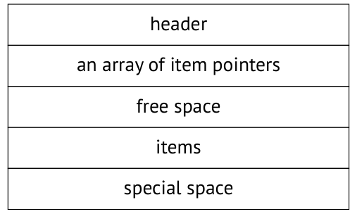

# Chương 3. Pages and Tuples (Page và tuple)

## 3.1 Cấu trúc page (Page Structure)

Mỗi page có một bố cục bên trong nhất định, thường gồm các phần sau:[^1]

- page header

- một mảng các item pointer

- không gian trống (free space)

- các item (row version)

- không gian đặc biệt (special space)

### Page header (Page Header)

*Page header* nằm ở vùng địa chỉ thấp nhất và có kích thước cố định. Nó lưu nhiều thông tin khác nhau về page, chẳng hạn như checksum và kích thước của tất cả các phần còn lại của page. *[→ tr. 104](06-vacuum-and-autovacuum.md)*

Có thể dễ dàng hiển thị các kích thước này bằng extension `pageinspect`.[^2] Hãy xem page đầu tiên của bảng (các page được đánh số bắt đầu từ 0):

```
=> CREATE EXTENSION pageinspect;
=> SELECT lower, upper, special, pagesize
FROM page_header(get_raw_page('accounts',0));
 lower | upper | special | pagesize
-------+-------+---------+----------
   152 |  6904 |    8192 |    8192
(1 row)
```

`0`



`24`

`lower`

`upper`

`special`

`pagesize`

### Không gian đặc biệt (Special Space)

*Special space* (không gian đặc biệt) nằm ở phía đối diện của page, chiếm các địa chỉ cao nhất. Nó được một số index dùng để lưu thông tin phụ trợ; ở các index khác và ở các page của bảng, không gian này có kích thước bằng 0.

Nhìn chung, bố cục của các page index khá đa dạng; nội dung của chúng phụ thuộc phần lớn vào từng loại index cụ thể. Ngay cả cùng một index cũng có thể có nhiều loại page khác nhau: ví dụ, B-tree có một page metadata với cấu trúc đặc biệt (page số 0) và các page thông thường rất giống với page của bảng.

### Tuple (Tuples)

*Dòng* chứa dữ liệu thực sự được lưu trong cơ sở dữ liệu, cùng với một số thông tin bổ sung. Chúng nằm ngay trước special space.

Đối với bảng, chúng ta phải làm việc với *row version* thay vì dòng, bởi vì cơ chế kiểm soát đồng thời đa phiên bản (multiversion concurrency control) ngụ ý việc có nhiều phiên bản của cùng một dòng. Index không sử dụng cơ chế MVCC này; thay vào đó, chúng phải tham chiếu đến tất cả các row version hiện có, và dựa vào các quy tắc visibility (khả kiến) để chọn ra những phiên bản phù hợp.

> Cả row version của bảng lẫn các entry của index thường được gọi là *tuple*. Thuật ngữ này được mượn từ lý thuyết quan hệ — đó là thêm một di sản nữa từ quá khứ học thuật của PostgreSQL.

### Item pointer (Item Pointers)

*Mảng các pointer* trỏ đến tuple đóng vai trò như mục lục của page. Nó nằm ngay sau header.

Các entry của index bằng cách nào đó phải tham chiếu đến các heap tuple cụ thể. PostgreSQL sử dụng *tuple identifier* (định danh tuple, TID) dài sáu byte cho mục đích này. Mỗi TID gồm số hiệu page của main fork và một tham chiếu đến một row version cụ thể nằm trong page đó. *[→ tr. 25](01-introduction.md)*

Về lý thuyết, tuple có thể được tham chiếu bằng offset (độ dời) của chúng tính từ đầu page. Nhưng khi đó sẽ không thể di chuyển tuple bên trong page mà không làm hỏng các tham chiếu này, điều này đến lượt nó sẽ dẫn đến phân mảnh page và những hệ quả khó chịu khác.

Vì lý do đó, PostgreSQL sử dụng cách đánh địa chỉ gián tiếp: tuple identifier tham chiếu đến số hiệu pointer tương ứng, và pointer này chỉ ra offset hiện tại của tuple. Nếu tuple bị di chuyển bên trong page, TID của nó vẫn giữ nguyên; chỉ cần sửa pointer, vốn cũng nằm trong chính page này.

Mỗi pointer chiếm đúng bốn byte và chứa các dữ liệu sau:

- offset của tuple tính từ đầu page

- độ dài tuple

- vài bit xác định trạng thái của tuple

### Không gian trống (Free Space)

Page có thể còn lại một ít *không gian trống* giữa các pointer và các tuple (điều này được phản ánh trong free space map). Không có phân mảnh page: toàn bộ không gian trống hiện có luôn được gom lại thành một khối liền. *[→ tr. 26](01-introduction.md)*[^3]

## 3.2 Bố cục của row version (Row Version Layout)

Mỗi row version chứa một header, theo sau là dữ liệu thực. Header gồm nhiều trường, trong đó có các trường sau:

**xmin, xmax** biểu diễn transaction ID; chúng được dùng để phân biệt phiên bản này với các phiên bản khác của cùng một dòng.

**infomask** cung cấp một tập các bit thông tin xác định các thuộc tính của phiên bản.

**ctid** là pointer trỏ đến phiên bản được cập nhật tiếp theo của cùng một dòng.

**null bitmap** là một mảng bit đánh dấu các cột có thể chứa giá trị NULL.

Kết quả là header khá lớn: nó cần ít nhất 23 byte cho mỗi tuple, và con số này thường bị vượt quá do null bitmap và phần padding (đệm) bắt buộc dùng để căn chỉnh dữ liệu. Trong một bảng "hẹp", kích thước của các metadata khác nhau có thể dễ dàng vượt quá kích thước của dữ liệu thực sự được lưu.

Bố cục dữ liệu trên đĩa hoàn toàn trùng khớp với cách biểu diễn dữ liệu trong RAM. Page cùng các tuple của nó được đọc vào buffer cache nguyên trạng, không qua bất kỳ biến đổi nào. Đó là lý do tại sao các file dữ liệu không tương thích giữa các nền tảng khác nhau.[^4]

Một trong những nguồn gốc của sự không tương thích là thứ tự byte. Ví dụ, kiến trúc x86 là little-endian, z/Architecture là big-endian, còn ARM có thứ tự byte có thể cấu hình được.

Một lý do khác là việc căn chỉnh dữ liệu theo biên của word máy, điều mà nhiều kiến trúc yêu cầu. Ví dụ, trong hệ thống x86 32-bit, các số nguyên (kiểu `integer`, chiếm bốn byte) được căn theo biên của word bốn byte, giống như các số dấu phẩy động độ chính xác kép (kiểu `double precision`, tám byte). Nhưng trong hệ thống 64-bit, các giá trị `double` được căn theo biên của word tám byte.

Việc căn chỉnh dữ liệu khiến kích thước của tuple phụ thuộc vào thứ tự các trường trong bảng. Hiệu ứng này thường không đáng kể, nhưng trong một số trường hợp nó có thể làm kích thước tăng lên đáng kể. Dưới đây là một ví dụ:

```
=> CREATE TABLE padding(
  b1 boolean,
  i1 integer,
  b2 boolean,
  i2 integer
);
=> INSERT INTO padding VALUES (true,1,false,2);
=> SELECT lp_len FROM heap_page_items(get_raw_page('padding', 0));
 lp_len
--------
     40
(1 row)
```

Tôi đã dùng hàm `heap_page_items` của extension `pageinspect` để hiển thị một số chi tiết về pointer và tuple.

> Trong PostgreSQL, bảng thường được gọi là *heap*. Đây lại là một thuật ngữ khó hiểu khác, gợi ý sự tương đồng giữa việc cấp phát không gian cho tuple và việc cấp phát bộ nhớ động. Chắc chắn có thể thấy một vài điểm tương đồng, nhưng bảng được quản lý bằng những thuật toán hoàn toàn khác. Chúng ta có thể hiểu thuật ngữ này theo nghĩa "mọi thứ được chất thành một đống (heap)", đối lập với các index có thứ tự.

Kích thước của dòng là 40 byte. Header của nó chiếm 24 byte, một cột kiểu `integer` chiếm 4 byte, và mỗi cột `boolean` chiếm 1 byte. Tổng cộng là 34 byte, và 6 byte bị lãng phí cho việc căn chỉnh bốn byte của các cột `integer`.

Nếu chúng ta tạo lại bảng, không gian sẽ được sử dụng hiệu quả hơn:

```
=> DROP TABLE padding;
=> CREATE TABLE padding(
  i1 integer,
  i2 integer,
  b1 boolean,
  b2 boolean
);
=> INSERT INTO padding VALUES (1,2,true,false);
=> SELECT lp_len FROM heap_page_items(get_raw_page('padding', 0));
 lp_len
--------
     34
(1 row)
```

Một vi tối ưu (micro-optimization) khả dĩ khác là đặt ở đầu bảng các cột có độ dài cố định và không thể chứa giá trị NULL. Việc truy cập các cột như vậy sẽ hiệu quả hơn vì có thể cache offset của chúng bên trong tuple.[^5]

## 3.3 Các thao tác trên tuple (Operations on Tuples)

Để phân biệt các phiên bản khác nhau của cùng một dòng, PostgreSQL đánh dấu mỗi phiên bản bằng hai giá trị: `xmin` và `xmax`. Các giá trị này xác định "thời gian hiệu lực" của mỗi row version, nhưng thay vì thời gian thực, chúng dựa vào các transaction ID luôn tăng dần. *[→ tr. 123](07-freezing.md)*

Khi một dòng được tạo, giá trị `xmin` của nó được đặt bằng transaction ID của lệnh `INSERT`.

Khi một dòng bị xóa, giá trị `xmax` của phiên bản hiện tại được đặt bằng transaction ID của lệnh `DELETE`.

Ở một mức độ trừu tượng nhất định, lệnh `UPDATE` có thể được xem như hai thao tác riêng biệt: `DELETE` và `INSERT`. Đầu tiên, giá trị `xmax` của row version hiện tại được đặt bằng transaction ID của lệnh `UPDATE`. Sau đó một phiên bản mới của dòng này được tạo ra; giá trị `xmin` của nó sẽ bằng giá trị `xmax` của phiên bản trước.

Bây giờ hãy đi vào một số chi tiết cấp thấp của các thao tác khác nhau trên tuple.[^6]

Cho các thí nghiệm này, chúng ta cần một bảng hai cột với một index được tạo trên một trong hai cột:

```
=> CREATE TABLE t(
  id integer GENERATED ALWAYS AS IDENTITY,
  s text
);
=> CREATE INDEX ON t(s);
```

### Insert

Bắt đầu một transaction và chèn một dòng:

```
=> BEGIN;
=> INSERT INTO t(s) VALUES ('FOO');
```

Đây là transaction ID hiện tại:

```
=> SELECT pg_current_xact_id(); -- txid_current() before v.13
 pg_current_xact_id
--------------------
                776
(1 row)
```

> Để biểu thị khái niệm transaction, PostgreSQL sử dụng thuật ngữ xact, có thể gặp cả trong tên các hàm SQL lẫn trong mã nguồn. Do đó, transaction ID có thể được gọi là xact ID, TXID, hoặc đơn giản là XID. Chúng ta sẽ gặp đi gặp lại những chữ viết tắt này.

Hãy xem nội dung của page. Hàm `heap_page_items` có thể cung cấp cho chúng ta mọi thông tin cần thiết, nhưng nó hiển thị dữ liệu "nguyên trạng", nên định dạng đầu ra hơi khó hiểu:

```
=> SELECT * FROM heap_page_items(get_raw_page('t',0)) \gx
-[ RECORD 1 ]-------------------
lp          | 1
lp_off      | 8160
lp_flags    | 1
lp_len      | 32
t_xmin      | 776
t_xmax      | 0
t_field3    | 0
t_ctid      | (0,1)
t_infomask2 | 2
t_infomask  | 2050
t_hoff      | 24
t_bits      |
t_oid       |
t_data      | \x0100000009464f4f
```

Để dễ đọc hơn, chúng ta có thể bỏ bớt một số thông tin và khai triển một vài cột:

```
=> SELECT '(0,'||lp||')' AS ctid,
     CASE lp_flags
       WHEN 0 THEN 'unused'
       WHEN 1 THEN 'normal'
       WHEN 2 THEN 'redirect to '||lp_off
       WHEN 3 THEN 'dead'
     END AS state,
     t_xmin as xmin,
     t_xmax as xmax,
     (t_infomask & 256) > 0 AS xmin_committed,
     (t_infomask & 512) > 0 AS xmin_aborted,
     (t_infomask & 1024) > 0 AS xmax_committed,
     (t_infomask & 2048) > 0 AS xmax_aborted
FROM heap_page_items(get_raw_page('t',0)) \gx
-[ RECORD 1 ]--+-------
ctid           | (0,1)
state          | normal
xmin           | 776
xmax           | 0
xmin_committed | f
xmin_aborted   | f
xmax_committed | f
xmax_aborted   | t
```

Đây là những gì đã được thực hiện ở trên:

- Pointer `lp` được chuyển sang định dạng chuẩn của tuple ID: `(page number, pointer number)`.

- Trạng thái `lp_flags` được diễn giải thành chữ. Ở đây nó được đặt là `normal`, nghĩa là nó thực sự trỏ đến một tuple.

- Trong số tất cả các bit thông tin, đến giờ chúng ta chỉ tách ra hai cặp. Các bit `xmin_committed` và `xmin_aborted` cho biết transaction `xmin` đã commit hay đã abort. Các bit `xmax_committed` và `xmax_aborted` cung cấp thông tin tương tự về transaction `xmax`.

> Extension pageinspect cung cấp hàm heap_tuple_infomask_flags giải thích tất cả các bit thông tin *(v. 13)*, nhưng tôi sẽ chỉ lấy ra những bit cần thiết vào lúc này, và hiển thị chúng dưới dạng ngắn gọn hơn.

Hãy quay lại thí nghiệm của chúng ta. Lệnh `INSERT` đã thêm pointer 1 vào heap page; nó tham chiếu đến tuple đầu tiên, hiện cũng là tuple duy nhất.

Trường `xmin` của tuple được đặt bằng transaction ID hiện tại. Transaction này vẫn đang active, nên các bit `xmin_committed` và `xmin_aborted` chưa được đặt.

Trường `xmax` chứa 0, là một số giả cho thấy tuple này chưa bị xóa và đại diện cho phiên bản hiện tại của dòng. Các transaction sẽ bỏ qua số này vì bit `xmax_aborted` đã được đặt.

> Có vẻ lạ khi bit tương ứng với transaction bị abort lại được đặt cho một transaction chưa hề xảy ra. Nhưng xét từ góc độ tính cô lập thì không có sự khác biệt nào giữa các transaction như vậy: một transaction bị abort không để lại dấu vết gì, do đó coi như nó chưa từng tồn tại.

Chúng ta sẽ dùng truy vấn này nhiều lần, nên tôi sẽ gói nó vào một hàm. Và nhân tiện, tôi cũng sẽ làm cho đầu ra ngắn gọn hơn bằng cách ẩn các cột bit thông tin và hiển thị trạng thái của transaction cùng với ID của chúng.

```
=> CREATE FUNCTION heap_page(relname text, pageno integer)
RETURNS TABLE(ctid tid, state text, xmin text, xmax text)
AS $$
SELECT (pageno,lp)::text::tid AS ctid,
     CASE lp_flags
       WHEN 0 THEN 'unused'
       WHEN 1 THEN 'normal'
       WHEN 2 THEN 'redirect to '||lp_off
       WHEN 3 THEN 'dead'
     END AS state,
     t_xmin || CASE
       WHEN (t_infomask & 256) > 0 THEN ' c'
       WHEN (t_infomask & 512) > 0 THEN ' a'
       ELSE ''
     END AS xmin,
     t_xmax || CASE
       WHEN (t_infomask & 1024) > 0 THEN ' c'
       WHEN (t_infomask & 2048) > 0 THEN ' a'
       ELSE ''
     END AS xmax
FROM heap_page_items(get_raw_page(relname,pageno))
ORDER BY lp;
$$ LANGUAGE sql;
```

Giờ thì những gì đang diễn ra trong tuple header đã rõ ràng hơn nhiều:

```
=> SELECT * FROM heap_page('t',0);
 ctid  | state  | xmin | xmax
-------+--------+------+------
 (0,1) | normal | 776  | 0 a
(1 row)
```

Bạn có thể lấy thông tin tương tự nhưng ít chi tiết hơn từ chính bảng bằng cách truy vấn các cột giả (pseudocolumn) `xmin` và `xmax`:

```
=> SELECT xmin, xmax, * FROM t;
 xmin | xmax | id |  s
------+------+----+-----
  776 |    0 |  1 | FOO
(1 row)
```

### Commit

Khi một transaction đã hoàn tất thành công, trạng thái của nó phải được lưu lại bằng cách nào đó — phải ghi nhận rằng transaction đã được *commit*. Cho mục đích này, PostgreSQL sử dụng một cấu trúc đặc biệt gọi là CLOG (commit log).[^7] Nó được lưu dưới dạng các file trong thư mục `PGDATA/pg_xact` chứ không phải dưới dạng một bảng system catalog.

> Trước đây, các file này nằm trong PGDATA/pg_clog, nhưng ở phiên bản 10 thư mục này đã được đổi tên:[^8] không hiếm khi các quản trị viên cơ sở dữ liệu không quen với PostgreSQL xóa nó đi để tìm thêm dung lượng đĩa trống, vì nghĩ rằng "log" là thứ không cần thiết.

CLOG được chia thành nhiều file chỉ vì mục đích thuận tiện. Các file này được truy cập theo từng page thông qua các buffer trong shared memory của server. *[→ tr. 132](07-freezing.md)*[^9]

Giống như tuple header, CLOG chứa hai bit cho mỗi transaction: `committed` và `aborted`.

Sau khi commit, transaction được đánh dấu trong CLOG bằng bit `committed`. Khi bất kỳ transaction nào khác truy cập một heap page, nó phải trả lời câu hỏi: transaction `xmin` đã kết thúc chưa?

- Nếu chưa, thì tuple được tạo ra không được phép visible (khả kiến).

- Để kiểm tra xem transaction có còn active hay không, PostgreSQL sử dụng thêm một cấu trúc khác nằm trong shared memory của instance; nó được gọi là `ProcArray`. Cấu trúc này chứa danh sách tất cả các tiến trình đang hoạt động, cùng với transaction hiện tại (đang active) tương ứng của mỗi tiến trình.

- Nếu rồi, thì nó đã commit hay đã abort? Trong trường hợp sau, tuple tương ứng cũng không thể visible.

- Chính việc kiểm tra này đòi hỏi CLOG. Nhưng mặc dù các page CLOG gần đây nhất được lưu trong các buffer bộ nhớ, việc thực hiện kiểm tra này mỗi lần vẫn tốn kém. Một khi đã được xác định, trạng thái transaction được ghi vào tuple header — cụ thể hơn là vào các bit thông tin `xmin_committed` và `xmin_aborted`, còn được gọi là *hint bit* (bit gợi ý). Nếu một trong các bit này được đặt, thì trạng thái của transaction `xmin` được coi là đã biết, và transaction tiếp theo sẽ không phải truy cập CLOG lẫn `ProcArray`.

Tại sao các bit này không được đặt bởi chính transaction thực hiện việc chèn dòng? Vấn đề là vào thời điểm đó chưa biết được transaction này có hoàn tất thành công hay không. Và khi nó được commit, thì đã không còn rõ những tuple và page nào đã bị thay đổi. Nếu một transaction tác động đến nhiều page, việc theo dõi chúng có thể quá tốn kém. Bên cạnh đó, một số page này có thể không còn trong cache nữa; đọc lại chúng chỉ để cập nhật hint bit sẽ làm chậm nghiêm trọng việc commit.

Mặt trái của việc giảm chi phí này là bất kỳ transaction nào (kể cả một lệnh `SELECT` chỉ đọc) cũng có thể bắt đầu đặt hint bit, từ đó để lại một vệt các page bị làm dirty trong buffer cache.

Cuối cùng, hãy commit transaction đã được bắt đầu bằng câu lệnh `INSERT`:

```
=> COMMIT;
```

Không có gì thay đổi trong page (nhưng chúng ta biết rằng trạng thái transaction đã được ghi vào CLOG):

```
=> SELECT * FROM heap_page('t',0);
 ctid  | state  | xmin | xmax
-------+--------+------+------
 (0,1) | normal | 776  | 0 a
(1 row)
```

Giờ đây transaction đầu tiên truy cập page (theo cách "chuẩn", không dùng `pageinspect`) phải xác định trạng thái của transaction `xmin` và cập nhật hint bit:

```
=> SELECT * FROM t;
 id |  s
----+-----
  1 | FOO
(1 row)
```

```
=> SELECT * FROM heap_page('t',0);
 ctid  | state  | xmin | xmax
-------+--------+-------+------
 (0,1) | normal | 776 c | 0 a
(1 row)
```

### Delete

Khi một dòng bị xóa, trường `xmax` của phiên bản hiện tại được đặt bằng transaction ID thực hiện việc xóa, và bit `xmax_aborted` bị xóa (unset).

> Trong khi transaction này còn active, giá trị xmax đóng vai trò như một row lock. Nếu một transaction khác định cập nhật hoặc xóa dòng này, nó sẽ phải chờ cho đến khi transaction xmax hoàn tất. *[→ tr. 210](13-row-level-locks.md)*

Hãy xóa một dòng:

```
=> BEGIN;
=> DELETE FROM t;
=> SELECT pg_current_xact_id();
 pg_current_xact_id
--------------------
                777
(1 row)
```

Transaction ID đã được ghi vào trường `xmax`, nhưng các bit thông tin vẫn chưa được đặt:

```
=> SELECT * FROM heap_page('t',0);
 ctid  | state  | xmin | xmax
-------+--------+-------+------
 (0,1) | normal | 776 c | 777
(1 row)
```

### Abort

Cơ chế abort một transaction tương tự như cơ chế commit và diễn ra nhanh không kém, nhưng thay vì `committed` nó đặt bit `aborted` trong CLOG. Mặc dù lệnh tương ứng có tên là `ROLLBACK`, không có việc rollback dữ liệu thực sự nào xảy ra cả: mọi thay đổi mà transaction bị abort đã thực hiện trong các page dữ liệu vẫn nằm nguyên tại chỗ.

```
=> ROLLBACK;
=> SELECT * FROM heap_page('t',0);
 ctid  | state  | xmin | xmax
-------+--------+-------+------
 (0,1) | normal | 776 c | 777
(1 row)
```

Khi page được truy cập, trạng thái transaction được kiểm tra, và tuple nhận hint bit `xmax_aborted`. Bản thân số `xmax` vẫn còn nằm trong page, nhưng sẽ không ai để ý đến nó nữa:

```
=> SELECT * FROM t;
 id |  s
----+-----
  1 | FOO
(1 row)
```

```
=> SELECT * FROM heap_page('t',0);
 ctid  | state  | xmin | xmax
-------+--------+-------+-------
 (0,1) | normal | 776 c | 777 a
(1 row)
```

### Update

Một thao tác update được thực hiện như thể tuple hiện tại bị xóa, rồi một tuple mới được chèn vào:

```
=> BEGIN;
=> UPDATE t SET s = 'BAR';
=> SELECT pg_current_xact_id();
 pg_current_xact_id
--------------------
                778
(1 row)
```

Truy vấn trả về một dòng duy nhất (phiên bản mới của nó):

```
=> SELECT * FROM t;
 id |  s
----+-----
  1 | BAR
(1 row)
```

Nhưng page giữ cả hai phiên bản:

```
=> SELECT * FROM heap_page('t',0);
 ctid  | state  | xmin | xmax
-------+--------+-------+------
 (0,1) | normal | 776 c | 778
 (0,2) | normal | 778  | 0 a
(2 rows)
```

Trường `xmax` của phiên bản đã bị xóa trước đó chứa transaction ID hiện tại. Giá trị này được ghi đè lên giá trị cũ vì transaction trước đó đã bị abort. Bit `xmax_aborted` bị xóa vì trạng thái của transaction hiện tại vẫn chưa được biết.

Để hoàn tất thí nghiệm này, hãy commit transaction.

```
=> COMMIT;
```

## 3.4 Index (Indexes)

Bất kể thuộc loại nào, index không sử dụng cơ chế phiên bản dòng (row versioning); mỗi dòng được biểu diễn bằng đúng một tuple. Nói cách khác, header của các dòng index không chứa các trường `xmin` và `xmax`. Các entry của index trỏ đến tất cả các phiên bản của dòng tương ứng trong bảng. Để xác định row version nào là visible, các transaction phải truy cập bảng (trừ khi page cần thiết xuất hiện trong visibility map). *[→ tr. 95](05-page-pruning-and-hot-updates.md)*

Để thuận tiện, hãy tạo một hàm đơn giản dùng `pageinspect` để hiển thị tất cả các entry index trong page (các page index B-tree lưu chúng dưới dạng một danh sách phẳng):

```
=> CREATE FUNCTION index_page(relname text, pageno integer)
RETURNS TABLE(itemoffset smallint, htid tid)
AS $$
SELECT itemoffset,
       htid -- ctid before v.13
FROM bt_page_items(relname,pageno);
$$ LANGUAGE sql;
```

Page tham chiếu đến cả hai heap tuple, tuple hiện tại và tuple trước đó:

```
=> SELECT * FROM index_page('t_s_idx',1);
 itemoffset | htid
------------+-------
          1 | (0,2)
          2 | (0,1)
(2 rows)
```

Vì BAR < FOO, pointer trỏ đến tuple thứ hai đứng trước trong index.

## 3.5 TOAST

Bảng TOAST thực chất là một bảng thông thường, và nó có cơ chế phiên bản riêng, không phụ thuộc vào các row version của bảng chính. *[→ tr. 28](01-introduction.md)* Tuy nhiên, các dòng của bảng TOAST được xử lý theo cách mà chúng không bao giờ bị cập nhật; chúng chỉ có thể được thêm vào hoặc bị xóa đi, nên cơ chế phiên bản của chúng có phần giả tạo.

Mỗi lần sửa đổi dữ liệu đều dẫn đến việc tạo một tuple mới trong bảng chính. Nhưng nếu một thao tác update không tác động đến bất kỳ giá trị dài nào được lưu trong TOAST, tuple mới sẽ tham chiếu đến giá trị đã được toast sẵn có. Chỉ khi một giá trị dài được cập nhật thì PostgreSQL mới tạo cả một tuple mới trong bảng chính lẫn các "toast" mới.

## 3.6 Transaction ảo (Virtual Transactions)

Để tiêu thụ transaction ID một cách tiết kiệm, PostgreSQL đưa ra một tối ưu hóa đặc biệt.

Nếu một transaction chỉ đọc, nó không ảnh hưởng gì đến khả năng visible của dòng. Đó là lý do tại sao ban đầu một transaction như vậy được cấp một *virtual XID* (XID ảo)[^10], gồm process ID của backend và một số thứ tự. *[→ tr. 202](12-relation-level-locks.md)* Việc cấp virtual XID không đòi hỏi bất kỳ sự đồng bộ nào giữa các tiến trình khác nhau, nên nó diễn ra rất nhanh. Tại thời điểm này, transaction vẫn chưa có ID thực:

```
=> BEGIN;
```

```
=> --  txid_current_if_assigned() before v.13
SELECT pg_current_xact_id_if_assigned();
 pg_current_xact_id_if_assigned
--------------------------------
```

```
(1 row)
```

Tại những thời điểm khác nhau, hệ thống có thể chứa một số virtual XID đã từng được sử dụng. Và điều đó hoàn toàn bình thường: virtual XID chỉ tồn tại trong RAM, và chỉ trong khi các transaction tương ứng còn active; chúng không bao giờ được ghi vào các page dữ liệu và không bao giờ xuống đến đĩa.

Khi transaction bắt đầu sửa đổi dữ liệu, nó nhận được một ID duy nhất thực sự:

```
=> UPDATE accounts
SET amount = amount - 1.00;
```

```
=> SELECT pg_current_xact_id_if_assigned();
 pg_current_xact_id_if_assigned
--------------------------------
                           780
(1 row)
```

```
=> COMMIT;
```

## 3.7 Subtransaction (Subtransactions)

### Savepoint (Savepoints)

SQL hỗ trợ *savepoint*, cho phép hủy bỏ một số thao tác bên trong transaction mà không phải abort toàn bộ transaction này. Nhưng kịch bản như vậy không khớp với cách hoạt động đã mô tả ở trên: trạng thái của transaction áp dụng cho tất cả các thao tác của nó, và không có việc rollback dữ liệu vật lý nào được thực hiện.

Để hiện thực chức năng này, một transaction chứa savepoint được chia thành nhiều *subtransaction*,[^11] nhờ đó trạng thái của chúng có thể được quản lý riêng rẽ.

Subtransaction có ID riêng (lớn hơn ID của transaction chính). Trạng thái của subtransaction được ghi vào CLOG theo cách thông thường; tuy nhiên, các subtransaction đã commit nhận cả bit `committed` lẫn bit `aborted` cùng lúc. Quyết định cuối cùng phụ thuộc vào trạng thái của transaction chính: nếu nó bị abort, tất cả các subtransaction của nó cũng sẽ được coi là bị abort.

Thông tin về subtransaction được lưu trong thư mục `PGDATA/pg_subtrans`. Việc truy cập file được tổ chức thông qua các buffer nằm trong shared memory của instance và có cùng cấu trúc với các buffer CLOG.[^12]

> Đừng nhầm lẫn subtransaction với transaction tự trị (autonomous transaction). Không giống như subtransaction, các transaction tự trị không phụ thuộc vào nhau theo bất kỳ cách nào. PostgreSQL nguyên bản (vanilla) không hỗ trợ transaction tự trị, và có lẽ như vậy lại tốt hơn: chúng chỉ cần thiết trong những trường hợp rất hiếm, nhưng việc có sẵn chúng trong các hệ cơ sở dữ liệu khác thường dẫn đến lạm dụng, có thể gây ra rất nhiều rắc rối.

Hãy truncate bảng, bắt đầu một transaction mới và chèn một dòng:

```
=> TRUNCATE TABLE t;
=> BEGIN;
=> INSERT INTO t(s) VALUES ('FOO');
=> SELECT pg_current_xact_id();
 pg_current_xact_id
--------------------
                782
(1 row)
```

Bây giờ tạo một savepoint và chèn thêm một dòng khác:

```
=> SAVEPOINT sp;
=> INSERT INTO t(s) VALUES ('XYZ');
```

```
=> SELECT pg_current_xact_id();
 pg_current_xact_id
--------------------
                782
(1 row)
```

Lưu ý rằng hàm `pg_current_xact_id` trả về ID của transaction chính, không phải của subtransaction.

```
=> SELECT *
FROM heap_page('t',0) p
  LEFT JOIN t ON p.ctid = t.ctid;
 ctid  | state  | xmin | xmax | id | s
-------+--------+------+------+----+-----
 (0,1) | normal | 782  | 0 a |  2 | FOO
 (0,2) | normal | 783  | 0 a |  3 | XYZ
(2 rows)
```

Hãy rollback về savepoint và chèn dòng thứ ba:

```
=> ROLLBACK TO sp;
=> INSERT INTO t(s) VALUES ('BAR');
=> SELECT *
FROM heap_page('t',0) p
  LEFT JOIN t ON p.ctid = t.ctid;
 ctid  | state  | xmin | xmax | id | s
-------+--------+------+------+----+-----
 (0,1) | normal | 782  | 0 a |  2 | FOO
 (0,2) | normal | 783  | 0 a |    |
 (0,3) | normal | 784  | 0 a |  4 | BAR
(3 rows)
```

Page vẫn chứa dòng được thêm bởi subtransaction đã bị abort.

Commit các thay đổi:

```
=> COMMIT;
=> SELECT * FROM t;
 id |  s
----+-----
  2 | FOO
  4 | BAR
(2 rows)
=> SELECT * FROM heap_page('t',0);
 ctid  | state  | xmin | xmax
-------+--------+-------+------
 (0,1) | normal | 782 c | 0 a
 (0,2) | normal | 783 a | 0 a
 (0,3) | normal | 784 c | 0 a
(3 rows)
```

Giờ chúng ta có thể thấy rõ rằng mỗi subtransaction có trạng thái riêng của nó.

SQL không cho phép sử dụng subtransaction một cách trực tiếp, tức là bạn không thể bắt đầu một transaction mới trước khi hoàn tất transaction hiện tại:

```
=> BEGIN;
BEGIN
=> BEGIN;
WARNING:  there is already a transaction in progress
BEGIN
=> COMMIT;
COMMIT
=> COMMIT;
WARNING:  there is no transaction in progress
COMMIT
```

Subtransaction được sử dụng một cách ngầm định: để hiện thực savepoint, để xử lý exception trong PL/pgSQL, và trong một số trường hợp khác, đặc biệt hơn.

### Lỗi và tính nguyên tử (Errors and Atomicity)

Điều gì xảy ra nếu có lỗi phát sinh trong khi thực thi một câu lệnh?

```
=> BEGIN;
=> SELECT * FROM t;
 id |  s
----+-----
  2 | FOO
  4 | BAR
(2 rows)
=> UPDATE t SET s = repeat('X', 1/(id-4));
ERROR:  division by zero
```

Sau khi gặp lỗi, toàn bộ transaction bị coi là đã abort và không thể thực hiện thêm bất kỳ thao tác nào nữa:

```
=> SELECT * FROM t;
ERROR:  current transaction is aborted, commands ignored until end
of transaction block
```

Và ngay cả khi bạn cố commit các thay đổi, PostgreSQL sẽ báo rằng transaction đã bị rollback:

```
=> COMMIT;
ROLLBACK
```

Tại sao lại cấm tiếp tục thực thi transaction sau khi gặp lỗi? Vì các thao tác đã thực thi không bao giờ bị rollback, chúng ta sẽ truy cập được một số thay đổi đã được thực hiện trước khi xảy ra lỗi — điều đó sẽ phá vỡ tính nguyên tử của câu lệnh, và do đó phá vỡ tính nguyên tử của chính transaction.

Ví dụ, trong thí nghiệm của chúng ta, lệnh đã kịp cập nhật một trong hai dòng trước khi gặp lỗi:

```
=> SELECT * FROM heap_page('t',0);
 ctid  | state  | xmin | xmax
-------+--------+-------+------
 (0,1) | normal | 782 c | 785
 (0,2) | normal | 783 a | 0 a
 (0,3) | normal | 784 c | 0 a
 (0,4) | normal | 785  | 0 a
(4 rows)
```

Nhân tiện nói thêm, `psql` cung cấp một chế độ đặc biệt cho phép bạn tiếp tục transaction sau khi gặp lỗi như thể câu lệnh bị lỗi đã được rollback:

```
=> \set ON_ERROR_ROLLBACK on
=> BEGIN;
=> UPDATE t SET s = repeat('X', 1/(id-4));
ERROR:  division by zero
=> SELECT * FROM t;
 id |  s
----+-----
  2 | FOO
  4 | BAR
(2 rows)
=> COMMIT;
COMMIT
```

Như bạn có thể đoán, khi chạy ở chế độ này, `psql` đơn giản là thêm một savepoint ngầm định trước mỗi lệnh; trong trường hợp gặp lỗi, một thao tác rollback sẽ được khởi động. Chế độ này không được dùng mặc định vì việc tạo savepoint (ngay cả khi không rollback về chúng) gây ra chi phí phụ trội đáng kể.

[^1]: postgresql.org/docs/14/storage-page-layout.html  
include/storage/bufpage.h
[^2]: postgresql.org/docs/14/pageinspect.html
[^3]: backend/storage/page/bufpage.c, hàm PageRepairFragmentation
[^4]: include/access/htup_details.h
[^5]: backend/access/common/heaptuple.c, hàm heap_deform_tuple
[^6]: backend/access/transam/README
[^7]: include/access/clog.h  
backend/access/transam/clog.c
[^8]: commitfest.postgresql.org/13/750
[^9]: backend/access/transam/clog.c
[^10]: backend/access/transam/xact.c
[^11]: backend/access/transam/subtrans.c
[^12]: backend/access/transam/slru.c
