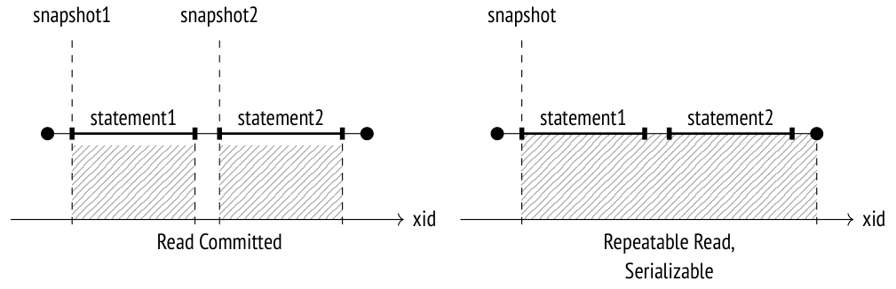
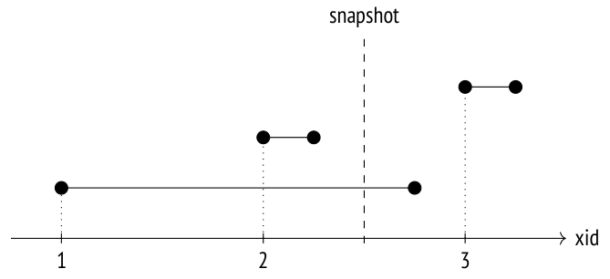
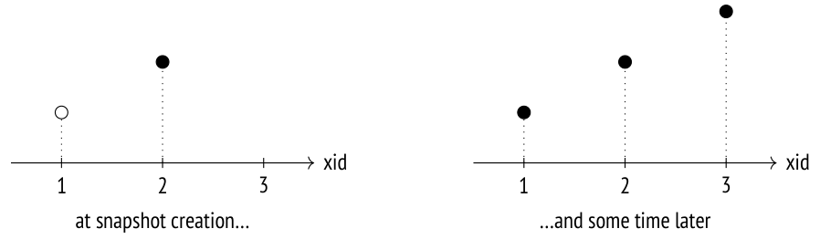
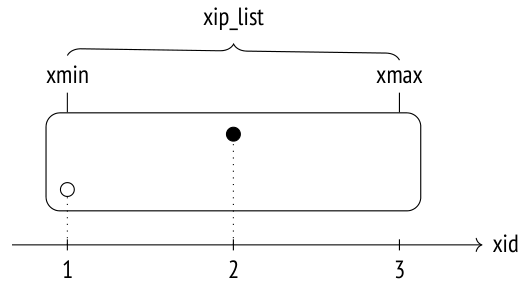
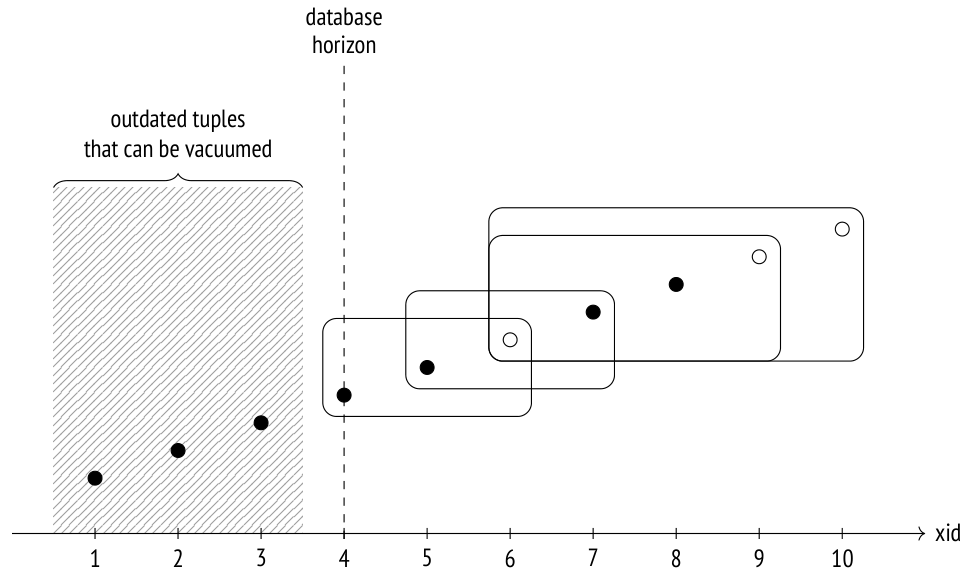

# Chương 4. Snapshots (Ảnh chụp dữ liệu)

## 4.1 Snapshot là gì? (What is a Snapshot?)

Một data page có thể chứa nhiều phiên bản của cùng một dòng, mặc dù mỗi transaction chỉ được thấy nhiều nhất một trong số đó. Gộp lại, các phiên bản nhìn thấy được của tất cả các dòng khác nhau tạo thành một *snapshot* (ảnh chụp dữ liệu). Một snapshot chỉ bao gồm dữ liệu hiện hành đã được commit tính đến thời điểm nó được tạo ra *[→ tr. 44](02-isolation.md)*, nhờ đó cung cấp một góc nhìn nhất quán (theo nghĩa ACID) về dữ liệu tại đúng thời điểm đó.

Để đảm bảo tính cô lập, mỗi transaction sử dụng snapshot riêng của nó. Điều đó có nghĩa là các transaction khác nhau có thể thấy các snapshot khác nhau được tạo ra tại các thời điểm khác nhau, nhưng tất cả chúng vẫn nhất quán.

Ở isolation level `Read Committed`, một snapshot được tạo ra ở đầu mỗi câu lệnh, và nó chỉ còn hiệu lực (active) trong suốt thời gian thực thi câu lệnh đó.

Ở các mức `Repeatable Read` và `Serializable`, một snapshot được tạo ra ở đầu câu lệnh đầu tiên của transaction, và nó còn hiệu lực cho đến khi toàn bộ transaction kết thúc.



## 4.2 Khả năng nhìn thấy của row version (Row Version Visibility)

Một snapshot không phải là bản sao vật lý của tất cả các tuple cần thiết. Thay vào đó, nó được xác định bởi một vài con số, còn khả năng nhìn thấy (visibility) của tuple được xác định bởi một số quy tắc nhất định.

Khả năng nhìn thấy của tuple được xác định bởi các trường `xmin` và `xmax` của tuple header (tức là ID của các transaction thực hiện thao tác chèn và xoá) cùng các hint bit tương ứng. Vì các khoảng `xmin`–`xmax` không giao nhau, mỗi dòng được biểu diễn trong bất kỳ snapshot nào bởi chỉ một trong các phiên bản của nó.

Các quy tắc visibility chính xác khá phức tạp,[^1] vì chúng tính đến rất nhiều tình huống khác nhau và các trường hợp biên. Nói một cách rất khái quát, ta có thể mô tả chúng như sau: một tuple là nhìn thấy được trong một snapshot nếu snapshot đó bao gồm các thay đổi của transaction `xmin` nhưng không bao gồm các thay đổi của transaction `xmax` (nói cách khác, tuple đã xuất hiện và chưa bị xoá).

Đến lượt mình, các thay đổi của một transaction là nhìn thấy được trong một snapshot nếu transaction này đã commit trước khi snapshot được tạo ra. Một ngoại lệ là các transaction có thể thấy những thay đổi chưa commit của chính mình. Nếu một transaction bị abort, các thay đổi của nó sẽ không nhìn thấy được trong bất kỳ snapshot nào.

Hãy xem một ví dụ đơn giản. Trong hình minh hoạ này, các đoạn thẳng biểu diễn các transaction (từ thời điểm bắt đầu đến thời điểm commit):



Ở đây các quy tắc visibility được áp dụng cho các transaction như sau:

- Transaction 2 đã commit trước khi snapshot được tạo ra, nên các thay đổi của nó là nhìn thấy được.

- Transaction 1 đang active tại thời điểm tạo snapshot, nên các thay đổi của nó không nhìn thấy được.

- Transaction 3 bắt đầu sau khi snapshot được tạo ra, nên các thay đổi của nó cũng không nhìn thấy được (không quan trọng transaction này đã hoàn tất hay chưa).

## 4.3 Cấu trúc snapshot (Snapshot Structure)

Thật không may, hình minh hoạ trước đó chẳng liên quan gì đến cách PostgreSQL thực sự nhìn nhận bức tranh này.[^2] Vấn đề là hệ thống không biết khi nào các transaction được commit. Nó chỉ biết khi nào chúng bắt đầu (thời điểm này được xác định bởi transaction ID), trong khi việc hoàn tất của chúng không được ghi nhận ở đâu cả.

> Thời điểm commit có thể được theo dõi[^3] nếu bạn bật tham số *track_commit_timestamp* *(mặc định: off)*, nhưng chúng không tham gia vào việc kiểm tra visibility theo bất kỳ cách nào (mặc dù việc theo dõi chúng vẫn có thể hữu ích cho các mục đích khác, ví dụ để áp dụng trong các giải pháp replication bên ngoài).

> Ngoài ra, PostgreSQL luôn ghi lại thời điểm commit và rollback trong các bản ghi WAL tương ứng *[→ tr. 164](10-write-ahead-log.md)*, nhưng thông tin này chỉ được dùng cho point-in-time recovery.

Chỉ có trạng thái *hiện tại* của một transaction là thứ ta có thể biết được. Thông tin này có sẵn trong shared memory của server: cấu trúc `ProcArray` chứa danh sách tất cả các session đang active và các transaction của chúng. Một khi transaction đã hoàn tất, không thể nào biết được liệu nó có đang active tại thời điểm tạo snapshot hay không.

Vì vậy, để tạo một snapshot, chỉ ghi nhận thời điểm nó được tạo ra là không đủ: còn cần phải thu thập trạng thái của tất cả các transaction tại thời điểm đó. Nếu không, về sau sẽ không thể hiểu được tuple nào phải nhìn thấy được trong snapshot, và tuple nào phải bị loại ra.

Hãy xem thông tin mà hệ thống có được tại thời điểm snapshot được tạo ra và một lúc sau đó (vòng tròn trắng biểu thị một transaction đang active, còn các vòng tròn đen biểu thị các transaction đã hoàn tất):



Giả sử ta không biết rằng tại thời điểm tạo snapshot, transaction thứ nhất vẫn đang được thực thi và transaction thứ ba chưa bắt đầu. Khi đó chúng dường như cũng giống hệt transaction thứ hai (đã commit vào lúc đó), và sẽ không thể lọc chúng ra được.

Vì lý do này, PostgreSQL không thể tạo một snapshot thể hiện trạng thái nhất quán của dữ liệu tại một thời điểm tuỳ ý trong quá khứ, ngay cả khi tất cả các tuple cần thiết đều có mặt trong các heap page. Do đó, không thể hiện thực các truy vấn hồi cứu (retrospective query — đôi khi còn gọi là temporal query hoặc flashback query).

> Điều thú vị là chức năng này từng được tuyên bố là một trong những mục tiêu của Postgres và đã được hiện thực ngay từ đầu, nhưng nó đã bị loại khỏi hệ thống cơ sở dữ liệu khi việc hỗ trợ dự án được chuyển giao cho cộng đồng.[^4]

Như vậy, một snapshot bao gồm một vài giá trị được lưu tại thời điểm tạo ra nó:[^5]

**xmin** là cận dưới của snapshot, được biểu diễn bởi ID của transaction active cũ nhất.

Tất cả các transaction có ID nhỏ hơn thì hoặc đã commit (nên các thay đổi của chúng được đưa vào snapshot) *[→ tr. 123](07-freezing.md)*, hoặc đã abort (nên các thay đổi của chúng bị bỏ qua).

**xmax** là cận trên của snapshot, được biểu diễn bởi giá trị lớn hơn ID của transaction đã commit gần nhất một đơn vị. Cận trên xác định thời điểm snapshot được tạo ra.

Tất cả các transaction có ID lớn hơn hoặc bằng `xmax` thì hoặc vẫn đang chạy, hoặc không tồn tại, nên các thay đổi của chúng không thể nhìn thấy được.

**xip_list** là danh sách ID của tất cả các transaction đang active, ngoại trừ các transaction ảo (virtual), vốn không ảnh hưởng đến visibility theo bất kỳ cách nào. *[→ tr. 75](03-pages-and-tuples.md)*

Snapshot còn bao gồm một vài tham số khác, nhưng hiện tại ta sẽ bỏ qua chúng.

Ở dạng đồ hoạ, một snapshot có thể được biểu diễn như một hình chữ nhật bao gồm các transaction từ `xmin` đến `xmax`:



Để hiểu các quy tắc visibility được snapshot xác định như thế nào, ta sẽ tái hiện kịch bản trên với bảng `accounts`.

```
=> TRUNCATE TABLE accounts;
```

Transaction thứ nhất chèn dòng đầu tiên vào bảng và vẫn để mở:

```
=> BEGIN;
=> INSERT INTO accounts VALUES (1, 'alice', 1000.00);
=> SELECT pg_current_xact_id();
 pg_current_xact_id
--------------------
                790
(1 row)
```

Transaction thứ hai chèn dòng thứ hai và commit thay đổi này ngay lập tức:

> ```
> => BEGIN;
> => INSERT INTO accounts VALUES (2, 'bob', 100.00);
> => SELECT pg_current_xact_id();
>  pg_current_xact_id
> --------------------
>                 791
> (1 row)
> => COMMIT;
> ```

Lúc này, hãy tạo một snapshot mới trong một session khác. Ta có thể đơn giản chạy bất kỳ truy vấn nào cho mục đích này, nhưng ta sẽ dùng một hàm đặc biệt để xem ngay snapshot này:

> ```
> => BEGIN ISOLATION LEVEL REPEATABLE READ;
> => --  txid_current_snapshot() before v.13
> SELECT pg_current_snapshot();
>  pg_current_snapshot
> ---------------------
>  790:792:790
> (1 row)
> ```

Hàm này hiển thị các thành phần sau của snapshot, phân cách bởi dấu hai chấm: `xmin`, `xmax` và `xip_list` (danh sách các transaction đang active; trong trường hợp cụ thể này nó chỉ gồm một phần tử).

Sau khi snapshot đã được tạo, hãy commit transaction thứ nhất:

```
=> COMMIT;
```

Transaction thứ ba được bắt đầu sau khi tạo snapshot. Nó sửa đổi dòng thứ hai, nên một tuple mới xuất hiện:

> ```
> => BEGIN;
> => UPDATE accounts SET amount = amount + 100 WHERE id = 2;
> => SELECT pg_current_xact_id();
>  pg_current_xact_id
> --------------------
>                 792
> (1 row)
> => COMMIT;
> ```

Snapshot của chúng ta chỉ thấy một tuple:

> ```
> => SELECT ctid, * FROM accounts;
>  ctid  | id | client | amount
> -------+----+--------+--------
>  (0,2) |  2 | bob    | 100.00
> (1 row)
> ```

Nhưng bảng thì chứa ba tuple:

> ```
> => SELECT * FROM heap_page('accounts',0);
>  ctid  | state  | xmin | xmax
> -------+--------+-------+-------
>  (0,1) | normal | 790 c | 0 a
>  (0,2) | normal | 791 c | 792 c
>  (0,3) | normal | 792 c | 0 a
> (3 rows)
> ```

Vậy PostgreSQL chọn hiển thị phiên bản nào bằng cách nào? Theo các quy tắc ở trên, các thay đổi chỉ được đưa vào snapshot nếu chúng được thực hiện bởi các transaction đã commit thoả mãn các tiêu chí sau:

- Nếu `xid` < `xmin`, các thay đổi được hiển thị vô điều kiện (như trong trường hợp transaction đã tạo ra bảng `accounts`).

- Nếu `xmin` ⩽ `xid` < `xmax`, các thay đổi chỉ được hiển thị nếu các transaction ID tương ứng không nằm trong `xip_list`.

Dòng đầu tiên `(0,1)` không nhìn thấy được vì nó được chèn bởi một transaction có mặt trong `xip_list` (mặc dù transaction này nằm trong phạm vi của snapshot).

Phiên bản mới nhất của dòng thứ hai `(0,3)` không nhìn thấy được vì transaction ID tương ứng vượt quá cận trên của snapshot.

Nhưng phiên bản đầu tiên của dòng thứ hai `(0,2)` thì nhìn thấy được: việc chèn dòng được thực hiện bởi một transaction nằm trong phạm vi snapshot và không có mặt trong `xip_list` (thao tác chèn là nhìn thấy được), còn việc xoá dòng được thực hiện bởi một transaction có ID vượt quá cận trên của snapshot (thao tác xoá là không nhìn thấy được).

> ```
> => COMMIT;
> ```

## 4.4 Khả năng nhìn thấy các thay đổi của chính transaction (Visibility of Transactions’ Own Changes)

Mọi thứ trở nên phức tạp hơn một chút khi cần xác định quy tắc visibility cho các thay đổi của chính transaction: trong một số trường hợp, chỉ một phần các thay đổi đó được phép nhìn thấy. Ví dụ, một cursor được mở tại một thời điểm cụ thể không được thấy bất kỳ thay đổi nào xảy ra sau đó, bất kể isolation level là gì.

Để xử lý những tình huống như vậy, tuple header cung cấp một trường đặc biệt (được hiển thị dưới dạng các pseudocolumn `cmin` và `cmax`) cho biết số thứ tự của thao tác bên trong transaction. Cột `cmin` xác định thao tác chèn, còn `cmax` được dùng cho các thao tác xoá. Để tiết kiệm không gian, các giá trị này được lưu trong một trường duy nhất của tuple header thay vì hai trường riêng biệt. Người ta giả định rằng một dòng cụ thể hầu như không bao giờ vừa được chèn vừa bị xoá trong cùng một transaction. (Nếu điều đó xảy ra, PostgreSQL ghi một định danh combo đặc biệt vào trường này, và trong trường hợp đó các giá trị `cmin` và `cmax` thực sự được backend lưu giữ.[^6])

Để minh hoạ, hãy bắt đầu một transaction và chèn một dòng vào bảng:

```
=> BEGIN;
=> INSERT INTO accounts VALUES (3, 'charlie', 100.00);
=> SELECT pg_current_xact_id();
 pg_current_xact_id
--------------------
                793
(1 row)
```

Mở một cursor để chạy truy vấn trả về số dòng trong bảng này:

```
=> DECLARE c CURSOR FOR SELECT count(*) FROM accounts;
```

Chèn thêm một dòng nữa:

```
=> INSERT INTO accounts VALUES (4, 'charlie', 200.00);
```

Bây giờ hãy mở rộng kết quả thêm một cột để hiển thị giá trị `cmin` cho các dòng được chèn bởi transaction của chúng ta (giá trị này không có ý nghĩa với các dòng khác):

```
=> SELECT xmin, CASE WHEN xmin = 793 THEN cmin END cmin, *
FROM accounts;
 xmin | cmin | id | client | amount
------+------+----+---------+---------
  790 |      |  1 | alice  | 1000.00
  792 |      |  2 | bob    |  200.00
  793 |    0 |  3 | charlie | 100.00
  793 |    1 |  4 | charlie | 200.00
(4 rows)
```

Truy vấn của cursor chỉ nhận được ba dòng; dòng được chèn khi cursor đã mở không lọt vào snapshot vì điều kiện `cmin` < 1 không được thoả mãn:

```
=> FETCH c;
 count
-------
     3
(1 row)
```

Đương nhiên, số `cmin` này cũng được lưu trong snapshot, nhưng không thể hiển thị nó bằng bất kỳ phương tiện SQL nào.

## 4.5 Transaction horizon (Chân trời transaction)

Như đã đề cập trước đó, cận dưới của snapshot được biểu diễn bởi `xmin`, là ID của transaction cũ nhất đang active tại thời điểm tạo snapshot. Giá trị này rất quan trọng vì nó xác định *horizon* (chân trời) của transaction sử dụng snapshot này.

Nếu một transaction không có snapshot active (ví dụ, ở isolation level `Read Committed` trong khoảng giữa các lần thực thi câu lệnh), horizon của nó được xác định bởi chính ID của nó nếu ID đã được cấp.

Tất cả các transaction nằm bên kia horizon (những transaction có `xid` < `xmin`) được đảm bảo là đã commit. Điều đó có nghĩa là bên kia horizon của mình, một transaction chỉ có thể thấy các row version hiện hành.

> Như bạn có thể đoán, thuật ngữ này được lấy cảm hứng từ khái niệm *event horizon* (chân trời sự kiện) trong vật lý.

PostgreSQL theo dõi horizon hiện tại của tất cả các tiến trình của nó; các transaction có thể xem horizon của chính mình trong bảng `pg_stat_activity`:

```
=> BEGIN;
=> SELECT backend_xmin FROM pg_stat_activity
WHERE pid = pg_backend_pid();
 backend_xmin
--------------
          793
(1 row)
```

Các transaction ảo không có ID thực, nhưng chúng vẫn sử dụng snapshot giống như các transaction thông thường, nên chúng có horizon riêng. Ngoại lệ duy nhất là các transaction ảo không có snapshot active: khái niệm horizon không có ý nghĩa đối với chúng, và chúng hoàn toàn “trong suốt” với hệ thống khi xét đến snapshot và visibility (mặc dù `pg_stat_activity.backend_xmin` vẫn có thể chứa `xmin` của một snapshot cũ).

Ta cũng có thể định nghĩa *database horizon* theo cách tương tự. Để làm vậy, ta lấy horizon của tất cả các transaction trong cơ sở dữ liệu này và chọn cái xa nhất, tức cái có `xmin` cũ nhất.[^7] Bên kia horizon này, các heap tuple lỗi thời sẽ không bao giờ nhìn thấy được với bất kỳ transaction nào trong cơ sở dữ liệu này. *Những tuple như vậy có thể được vacuum dọn dẹp một cách an toàn* — đây chính là lý do vì sao khái niệm horizon lại quan trọng đến vậy xét từ góc độ thực tiễn.



Hãy rút ra một vài kết luận:

- Nếu một transaction (bất kể là thực hay ảo) ở isolation level `Repeatable Read` hoặc `Serializable` chạy trong thời gian dài, nó sẽ giữ database horizon và trì hoãn việc vacuum.

- Một transaction thực ở isolation level `Read Committed` cũng giữ database horizon theo cách tương tự, ngay cả khi nó không thực thi câu lệnh nào (đang ở trạng thái “idle in transaction”).

- Một transaction ảo ở isolation level `Read Committed` chỉ giữ horizon trong lúc đang thực thi câu lệnh.

Chỉ có một horizon cho toàn bộ cơ sở dữ liệu, vì vậy nếu nó đang bị một transaction giữ lại, thì không thể vacuum bất kỳ dữ liệu nào nằm trong horizon này — ngay cả khi dữ liệu đó chưa hề được transaction này truy cập.

> Các bảng dùng chung toàn cluster của system catalog có một horizon riêng, tính đến tất cả các transaction trong mọi cơ sở dữ liệu. Ngược lại, các bảng tạm (temporary table) không cần quan tâm đến bất kỳ transaction nào ngoại trừ những transaction đang được thực thi bởi tiến trình hiện tại.

Hãy quay lại thí nghiệm hiện tại của chúng ta. Transaction active của session thứ nhất vẫn đang giữ database horizon; ta có thể thấy điều này bằng cách tăng bộ đếm transaction:

> ```
> => SELECT pg_current_xact_id();
>  pg_current_xact_id
> --------------------
>                 794
> (1 row)
> ```

```
=> SELECT backend_xmin FROM pg_stat_activity
WHERE pid = pg_backend_pid();
 backend_xmin
--------------
          793
(1 row)
```

Và chỉ khi transaction này hoàn tất, horizon mới tiến lên, và các tuple lỗi thời mới có thể được vacuum:

```
=> COMMIT;
=> SELECT backend_xmin FROM pg_stat_activity
WHERE pid = pg_backend_pid();
 backend_xmin
--------------
          795
(1 row)
```

Trong một thế giới lý tưởng, bạn nên tránh kết hợp các transaction dài với các cập nhật thường xuyên (vốn sinh ra các row version mới), vì điều đó sẽ dẫn đến tình trạng phình to (bloat) của bảng và index. *[→ tr. 141](08-rebuilding-tables-and-indexes.md)*

## 4.6 Snapshot của system catalog (System Catalog Snapshots)

Mặc dù system catalog gồm các bảng thông thường, chúng không thể được truy cập thông qua snapshot mà một transaction hay một câu lệnh đang sử dụng. Snapshot phải đủ “mới” để bao gồm tất cả các thay đổi gần nhất, nếu không các transaction có thể thấy định nghĩa lỗi thời của các cột trong bảng hoặc bỏ sót các ràng buộc toàn vẹn (integrity constraint) mới được thêm vào.

Đây là một ví dụ đơn giản:

```
=> BEGIN TRANSACTION ISOLATION LEVEL REPEATABLE READ;
=> SELECT 1; -- a snapshot for the transaction is taken
```

> ```
> => ALTER TABLE accounts
>   ALTER amount SET NOT NULL;
> ```

```
=> INSERT INTO accounts(client, amount)
  VALUES ('alice', NULL);
ERROR:  null value in column "amount" of relation "accounts"
violates not-null constraint
DETAIL:  Failing row contains (1, alice, null).
```

```
=> ROLLBACK;
```

Ràng buộc toàn vẹn xuất hiện sau khi tạo snapshot đã nhìn thấy được đối với lệnh `INSERT`. Có vẻ như hành vi này phá vỡ tính cô lập, nhưng nếu transaction thực hiện chèn đã kịp truy cập bảng `accounts` trước lệnh `ALTER TABLE`, thì lệnh sau sẽ bị chặn cho đến khi transaction này hoàn tất. *[→ tr. 204](12-relation-level-locks.md)*

Nói chung, server hoạt động như thể một snapshot riêng được tạo ra cho mỗi truy vấn vào system catalog. Nhưng tất nhiên việc hiện thực phức tạp hơn nhiều[^8] vì việc tạo snapshot thường xuyên sẽ ảnh hưởng tiêu cực đến hiệu năng; ngoài ra, nhiều đối tượng của system catalog được cache, và điều này cũng phải được tính đến.

## 4.7 Xuất snapshot (Exporting Snapshots)

Trong một số tình huống, các transaction đồng thời bằng mọi giá phải thấy cùng một snapshot. Ví dụ, nếu tiện ích `pg_dump` chạy ở chế độ song song, tất cả các tiến trình của nó phải thấy cùng một trạng thái cơ sở dữ liệu để tạo ra một bản sao lưu nhất quán.

Ta không thể giả định rằng các snapshot sẽ giống hệt nhau chỉ vì các transaction được bắt đầu “đồng thời”. Để đảm bảo tất cả các transaction thấy cùng một dữ liệu, ta phải sử dụng cơ chế xuất snapshot (snapshot export).

Hàm `pg_export_snapshot` trả về một snapshot ID, có thể được truyền cho một transaction khác (bên ngoài hệ thống cơ sở dữ liệu):

```
=> BEGIN ISOLATION LEVEL REPEATABLE READ;
=> SELECT count(*) FROM accounts;
 count
-------
     4
(1 row)
```

```
=> SELECT pg_export_snapshot();
 pg_export_snapshot
---------------------
 00000004-0000006E-1
(1 row)
```

Trước khi thực thi câu lệnh đầu tiên, transaction kia có thể nhập (import) snapshot bằng cách chạy lệnh `SET TRANSACTION SNAPSHOT`. Isolation level phải được đặt là `Repeatable Read` hoặc `Serializable` vì ở mức `Read Committed` các câu lệnh sử dụng snapshot riêng của chúng:

> ```
> => DELETE FROM accounts;
> => BEGIN ISOLATION LEVEL REPEATABLE READ;
> => SET TRANSACTION SNAPSHOT '00000004-0000006E-1';
> ```

Bây giờ transaction thứ hai sẽ sử dụng snapshot của transaction thứ nhất, và do đó, nó sẽ thấy bốn dòng (thay vì không dòng nào):

> ```
> => SELECT count(*) FROM accounts;
>  count
> -------
>      4
> (1 row)
> ```

Rõ ràng, transaction thứ hai sẽ không thấy bất kỳ thay đổi nào mà transaction thứ nhất thực hiện sau khi xuất snapshot (và ngược lại): các quy tắc visibility thông thường vẫn được áp dụng.

Thời gian tồn tại của snapshot đã xuất bằng với thời gian tồn tại của transaction đã xuất nó.

> ```
> => COMMIT;
> ```

```
=> COMMIT;
```

[^1]: backend/access/heap/heapam_visibility.c
[^2]: include/utils/snapshot.h  
backend/utils/time/snapmgr.c
[^3]: backend/access/transam/commit_ts.c
[^4]: Joseph M. Hellerstein, Looking Back at Postgres. https://arxiv.org/pdf/1901.01973.pdf
[^5]: backend/storage/ipc/procarray.c, hàm GetSnapshotData
[^6]: backend/utils/time/combocid.c
[^7]: backend/storage/ipc/procarray.c, hàm ComputeXidHorizons
[^8]: backend/utils/time/snapmgr.c, hàm GetCatalogSnapshot
