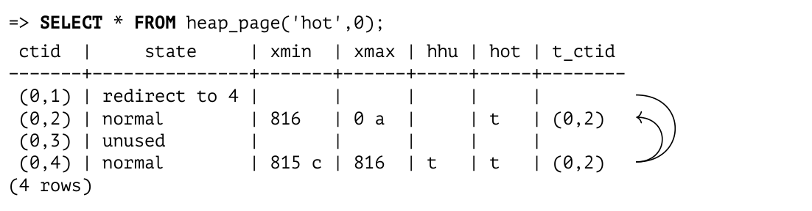
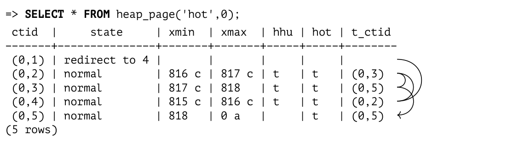
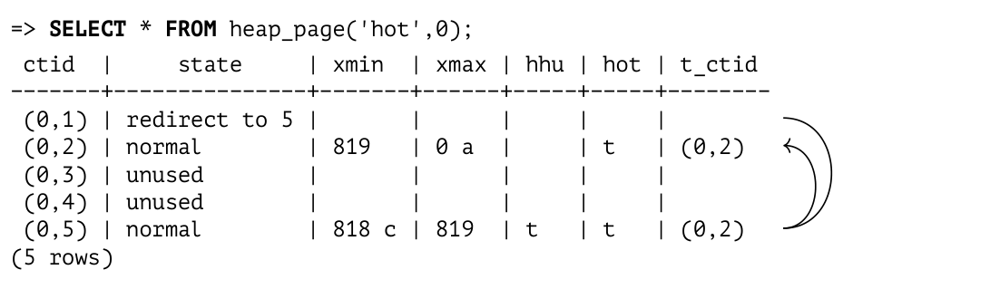

# Chương 5. Page Pruning và HOT Updates (Dọn dẹp trang và cập nhật HOT)

## 5.1 Page Pruning (Dọn dẹp trang)

Trong khi một heap page đang được đọc hoặc cập nhật, PostgreSQL có thể thực hiện một thao tác dọn dẹp trang nhanh, gọi là *pruning* (tỉa bớt).[^1] Việc này xảy ra trong các trường hợp sau:

- Thao tác `UPDATE` trước đó không tìm được đủ chỗ để đặt tuple mới vào cùng page. Sự kiện này được ghi nhận trong page header.

- Heap page chứa nhiều dữ liệu hơn mức cho phép của tham số lưu trữ *fillfactor*. *(mặc định: 100)*

- Một thao tác `INSERT` chỉ có thể thêm dòng mới vào page nếu page này được lấp đầy dưới *fillfactor* phần trăm. Phần không gian còn lại được dành cho các thao tác `UPDATE` (theo mặc định không có không gian nào được dành riêng như vậy).

Page pruning loại bỏ những tuple không còn có thể nhìn thấy trong bất kỳ snapshot nào nữa (tức là những tuple đã nằm ngoài database horizon). Nó không bao giờ vượt ra ngoài phạm vi một heap page duy nhất, nhưng bù lại nó được thực hiện rất nhanh. *[→ tr. 88](04-snapshots.md)* Các con trỏ tới những tuple đã bị prune vẫn được giữ nguyên tại chỗ vì chúng có thể đang được tham chiếu từ một index — vốn đã là một page khác.

Cũng vì lý do đó, cả visibility map lẫn free space map đều không được cập nhật (vì vậy không gian thu hồi được sẽ dành cho các thao tác cập nhật chứ không dành cho thao tác chèn).

Vì một page có thể bị prune trong lúc đọc, bất kỳ câu lệnh `SELECT` nào cũng có thể gây ra thay đổi trên page. Đây là thêm một trường hợp như vậy, bên cạnh việc thiết lập trễ các information bit. *[→ tr. 71](03-pages-and-tuples.md)*

Hãy cùng xem page pruning thực sự hoạt động như thế nào. Chúng ta sẽ tạo một bảng hai cột và xây dựng một index trên mỗi cột:

```
=> CREATE TABLE hot(id integer, s char(2000)) WITH (fillfactor = 75);
=> CREATE INDEX hot_id ON hot(id);
=> CREATE INDEX hot_s ON hot(s);
```

Nếu cột `s` chỉ chứa các chữ cái Latin, mỗi heap tuple sẽ có kích thước cố định là 2004 byte, cộng thêm 24 byte header. Tham số lưu trữ *fillfactor* được đặt là 75%. Điều đó có nghĩa là page có đủ không gian trống cho bốn tuple, nhưng chúng ta chỉ có thể chèn ba.

Hãy chèn một dòng mới và cập nhật nó vài lần:

```
=> INSERT INTO hot VALUES (1, 'A');
=> UPDATE hot SET s = 'B';
=> UPDATE hot SET s = 'C';
=> UPDATE hot SET s = 'D';
```

Bây giờ page chứa bốn tuple:

```
=> SELECT * FROM heap_page('hot',0);
 ctid  | state  | xmin | xmax
-------+--------+-------+-------
 (0,1) | normal | 801 c | 802 c
 (0,2) | normal | 802 c | 803 c
 (0,3) | normal | 803 c | 804
 (0,4) | normal | 804  | 0 a
(4 rows)
```

Đúng như dự kiến, chúng ta vừa vượt quá ngưỡng *fillfactor*. Bạn có thể nhận ra điều này qua hiệu giữa giá trị `pagesize` và `upper` — nó lớn hơn 75% kích thước page, tức là 6144 byte: *[→ tr. 62](03-pages-and-tuples.md)*

```
=> SELECT upper, pagesize FROM page_header(get_raw_page('hot',0));
 upper | pagesize
-------+----------
    64 |     8192
(1 row)
```

Lần truy cập page tiếp theo sẽ kích hoạt page pruning, loại bỏ tất cả các tuple đã lỗi thời. Sau đó một tuple mới `(0,5)` được thêm vào không gian vừa được giải phóng:

```
=> UPDATE hot SET s = 'E';
=> SELECT * FROM heap_page('hot',0);
 ctid  | state  | xmin | xmax
-------+--------+-------+------
 (0,1) | dead   |      |
 (0,2) | dead   |      |
 (0,3) | dead   |      |
 (0,4) | normal | 804 c | 805
 (0,5) | normal | 805  | 0 a
(5 rows)
```

Các heap tuple còn lại được di chuyển vật lý về phía các địa chỉ cao nhất để toàn bộ không gian trống được gom lại thành một khối liên tục duy nhất. Các con trỏ tuple cũng được sửa đổi tương ứng. Kết quả là không có sự phân mảnh không gian trống trong page.

Các con trỏ tới những tuple đã bị prune chưa thể bị xoá vì chúng vẫn đang được tham chiếu từ các index; PostgreSQL đổi trạng thái của chúng từ `normal` thành `dead`. Hãy xem page đầu tiên của index `hot_s` (page số không được dùng cho metadata):

```
=> SELECT * FROM index_page('hot_s',1);
 itemoffset | htid
------------+-------
          1 | (0,1)
          2 | (0,2)
          3 | (0,3)
          4 | (0,4)
          5 | (0,5)
(5 rows)
```

Chúng ta cũng thấy hình ảnh tương tự ở index còn lại:

```
=> SELECT * FROM index_page('hot_id',1);
 itemoffset | htid
------------+-------
          1 | (0,1)
          2 | (0,2)
          3 | (0,3)
          4 | (0,4)
          5 | (0,5)
(5 rows)
```

Một index scan có thể trả về `(0,1)`, `(0,2)` và `(0,3)` làm định danh tuple. Server cố gắng đọc heap tuple tương ứng nhưng thấy rằng con trỏ có trạng thái `dead`; điều đó có nghĩa là tuple này không còn tồn tại nữa và cần được bỏ qua. Nhân tiện, server cũng thay đổi trạng thái con trỏ trong index page để tránh phải truy cập lại heap page.[^2]

Hãy mở rộng hàm hiển thị index page để nó cũng cho biết con trỏ có phải là dead hay không: *(v. 13)*

```
=> DROP FUNCTION index_page(text, integer);
=> CREATE FUNCTION index_page(relname text, pageno integer)
RETURNS TABLE(itemoffset smallint, htid tid, dead boolean)
AS $$
SELECT itemoffset,
       htid,
       dead -- starting from v.13
FROM bt_page_items(relname,pageno);
$$ LANGUAGE sql;
```

```
=> SELECT * FROM index_page('hot_id',1);
 itemoffset | htid  | dead
------------+-------+------
          1 | (0,1) | f
          2 | (0,2) | f
          3 | (0,3) | f
          4 | (0,4) | f
          5 | (0,5) | f
(5 rows)
```

Cho đến lúc này, tất cả các con trỏ trong index page đều đang hoạt động. Nhưng ngay khi index scan đầu tiên xảy ra, trạng thái của chúng thay đổi:

```
=> EXPLAIN (analyze, costs off, timing off, summary off)
SELECT * FROM hot WHERE id = 1;
                       QUERY PLAN
--------------------------------------------------------
 Index Scan using hot_id on hot (actual rows=1 loops=1)
   Index Cond: (id = 1)
(2 rows)
```

```
=> SELECT * FROM index_page('hot_id',1);
 itemoffset | htid  | dead
------------+-------+------
          1 | (0,1) | t
          2 | (0,2) | t
          3 | (0,3) | t
          4 | (0,4) | t
          5 | (0,5) | f
(5 rows)
```

Mặc dù heap tuple được con trỏ thứ tư tham chiếu vẫn chưa bị prune và có trạng thái `normal`, nó đã nằm ngoài database horizon. Đó là lý do con trỏ này cũng được đánh dấu là dead trong index.

## 5.2 HOT Updates (Cập nhật HOT)

Việc giữ các tham chiếu tới tất cả heap tuple trong một index sẽ rất kém hiệu quả.

Trước hết, mỗi lần sửa đổi một dòng sẽ kích hoạt việc cập nhật *tất cả* các index được tạo trên bảng: một khi heap tuple mới xuất hiện, mỗi index đều phải chứa một tham chiếu tới tuple này, ngay cả khi các trường bị sửa đổi không được đánh index.

Hơn nữa, các index tích luỹ các tham chiếu tới những heap tuple cũ (lịch sử), vì vậy chúng phải được prune cùng với các tuple này. *[→ tr. 102](06-vacuum-and-autovacuum.md)*

Mọi thứ càng tệ hơn khi bạn tạo thêm nhiều index trên một bảng.

Nhưng nếu cột được cập nhật không thuộc *bất kỳ* index nào, thì chẳng có lý do gì để tạo thêm một index entry khác chứa cùng giá trị khoá. Để tránh sự dư thừa như vậy, PostgreSQL cung cấp một tối ưu hoá gọi là *Heap-Only Tuple updates*.[^3]

Nếu một cập nhật như vậy được thực hiện, index page chỉ chứa một entry cho mỗi dòng. Entry này trỏ tới row version đầu tiên; tất cả các version tiếp theo nằm trong cùng page được liên kết thành một chuỗi bằng các con trỏ `ctid` trong tuple header.

Các row version không được tham chiếu từ bất kỳ index nào được gắn bit `Heap-Only Tuple`. Nếu một version được đưa vào HOT chain, nó được gắn bit `Heap Hot Updated`.

Nếu một index scan truy cập một heap page và tìm thấy một row version được đánh dấu `Heap Hot Updated`, điều đó có nghĩa là quá trình scan cần tiếp tục, vì vậy nó đi tiếp dọc theo chuỗi HOT update. Hiển nhiên, tất cả các row version được lấy ra đều được kiểm tra khả năng hiển thị (visibility) trước khi kết quả được trả về cho client.

Để xem HOT update được thực hiện như thế nào, hãy xoá một trong các index và truncate bảng.

```
=> DROP INDEX hot_s;
=> TRUNCATE TABLE hot;
```

Để thuận tiện, chúng ta sẽ định nghĩa lại hàm `heap_page` để đầu ra của nó có thêm ba trường: `ctid` và hai bit liên quan đến HOT update:

```
=> DROP FUNCTION heap_page(text,integer);
=> CREATE FUNCTION heap_page(relname text, pageno integer)
RETURNS TABLE(
  ctid tid, state text,
  xmin text, xmax text,
  hhu text, hot text, t_ctid tid
) AS $$
SELECT (pageno,lp)::text::tid AS ctid,
       CASE lp_flags
         WHEN 0 THEN 'unused'
         WHEN 1 THEN 'normal'
         WHEN 2 THEN 'redirect to '||lp_off
         WHEN 3 THEN 'dead'
       END AS state,
       t_xmin || CASE
         WHEN (t_infomask & 256) > 0 THEN ' c'
         WHEN (t_infomask & 512) > 0 THEN ' a'
         ELSE ''
       END AS xmin,
```

```
       t_xmax || CASE
         WHEN (t_infomask & 1024) > 0 THEN ' c'
         WHEN (t_infomask & 2048) > 0 THEN ' a'
         ELSE ''
       END AS xmax,
       CASE WHEN (t_infomask2 & 16384) > 0 THEN 't' END AS hhu,
       CASE WHEN (t_infomask2 & 32768) > 0 THEN 't' END AS hot,
       t_ctid
FROM heap_page_items(get_raw_page(relname,pageno))
ORDER BY lp;
$$ LANGUAGE sql;
```

Hãy lặp lại các thao tác chèn và cập nhật:

```
=> INSERT INTO hot VALUES (1, 'A');
=> UPDATE hot SET s = 'B';
```

Bây giờ page chứa một chuỗi HOT update:

- Bit `Heap Hot Updated` cho biết executor cần đi theo chuỗi CTID.

- Bit `Heap Only Tuple` cho biết tuple này không được tham chiếu từ bất kỳ index nào.

```
=> SELECT * FROM heap_page('hot',0);
 ctid  | state  | xmin | xmax | hhu | hot | t_ctid
-------+--------+-------+------+-----+-----+--------
 (0,1) | normal | 812 c | 813 | t   |     | (0,2)
 (0,2) | normal | 813  | 0 a  |     | t   | (0,2)
(2 rows)
```

Khi chúng ta thực hiện thêm các cập nhật, chuỗi sẽ dài ra — nhưng chỉ trong giới hạn của page:

```
=> UPDATE hot SET s = 'C';
=> UPDATE hot SET s = 'D';
=> SELECT * FROM heap_page('hot',0);
 ctid  | state  | xmin | xmax  | hhu | hot | t_ctid
-------+--------+-------+-------+-----+-----+--------
 (0,1) | normal | 812 c | 813 c | t  |     | (0,2)
 (0,2) | normal | 813 c | 814 c | t  | t   | (0,3)
 (0,3) | normal | 814 c | 815  | t   | t   | (0,4)
 (0,4) | normal | 815  | 0 a   |     | t   | (0,4)
(4 rows)
```

Index vẫn chỉ chứa một tham chiếu, trỏ tới đầu của chuỗi này:

```
=> SELECT * FROM index_page('hot_id',1);
 itemoffset | htid  | dead
------------+-------+------
          1 | (0,1) | f
(1 row)
```

HOT update chỉ khả thi nếu các trường bị sửa đổi không thuộc *bất kỳ* index nào. Nếu không, một số index sẽ chứa tham chiếu tới một heap tuple nằm ở giữa chuỗi, điều này đi ngược lại ý tưởng của tối ưu hoá này. Vì một HOT chain chỉ có thể dài ra trong phạm vi một page duy nhất, việc duyệt toàn bộ chuỗi không bao giờ đòi hỏi truy cập tới các page khác và do đó không làm giảm hiệu năng.

## 5.3 Page Pruning cho HOT Updates (Page Pruning for HOT Updates)

Một trường hợp đặc biệt của page pruning — nhưng dù sao cũng rất quan trọng — là việc prune các chuỗi HOT update.

Trong ví dụ trên, ngưỡng *fillfactor* đã bị vượt quá, vì vậy lần cập nhật tiếp theo sẽ kích hoạt page pruning. Nhưng lần này page chứa một chuỗi HOT update. Đầu của chuỗi này phải luôn được giữ nguyên vị trí vì nó được tham chiếu từ index, nhưng các con trỏ khác có thể được giải phóng vì chắc chắn chúng không có tham chiếu từ bên ngoài.

Để tránh phải di chuyển phần đầu, PostgreSQL sử dụng cơ chế địa chỉ kép: con trỏ được tham chiếu từ index (trong trường hợp này là `(0,1)`) nhận trạng thái `redirect` vì nó trỏ tới tuple hiện đang là điểm bắt đầu của chuỗi:

```
=> UPDATE hot SET s = 'E';
```

```
=> SELECT * FROM heap_page('hot',0);
 ctid  |     state     | xmin | xmax | hhu | hot | t_ctid
-------+---------------+-------+------+-----+-----+--------
 (0,1) | redirect to 4 |      |      |     |     |
 (0,2) | normal        | 816  | 0 a  |     | t   | (0,2)
 (0,3) | unused        |      |      |     |     |
 (0,4) | normal        | 815 c | 816 | t   | t   | (0,2)
(4 rows)
```



Các tuple `(0,1)`, `(0,2)` và `(0,3)` đã bị prune; con trỏ đầu chuỗi số 1 được giữ lại cho mục đích chuyển hướng, trong khi các con trỏ 2 và 3 đã được giải phóng (nhận trạng thái `unused`) vì chúng chắc chắn không có tham chiếu nào từ các index. Tuple mới được ghi vào không gian vừa giải phóng dưới dạng tuple `(0,2)`.

Hãy thực hiện thêm vài cập nhật nữa:

```
=> UPDATE hot SET s = 'F';
```

```
=> UPDATE hot SET s = 'G';
```

```
=> SELECT * FROM heap_page('hot',0);
 ctid  |     state     | xmin | xmax  | hhu | hot | t_ctid
-------+---------------+-------+-------+-----+-----+--------
 (0,1) | redirect to 4 |      |       |     |     |
 (0,2) | normal        | 816 c | 817 c | t  | t   | (0,3)
 (0,3) | normal        | 817 c | 818  | t   | t   | (0,5)
 (0,4) | normal        | 815 c | 816 c | t  | t   | (0,2)
 (0,5) | normal        | 818  | 0 a   |     | t   | (0,5)
(5 rows)
```



Lần cập nhật tiếp theo sẽ kích hoạt page pruning:

```
=> UPDATE hot SET s = 'H';
```

```
=> SELECT * FROM heap_page('hot',0);
 ctid  |     state     | xmin | xmax | hhu | hot | t_ctid
-------+---------------+-------+------+-----+-----+--------
 (0,1) | redirect to 5 |      |      |     |     |
 (0,2) | normal        | 819  | 0 a  |     | t   | (0,2)
 (0,3) | unused        |      |      |     |     |
 (0,4) | unused        |      |      |     |     |
 (0,5) | normal        | 818 c | 819 | t   | t   | (0,2)
(5 rows)
```



Một lần nữa, một số tuple bị prune, và con trỏ tới đầu chuỗi được dịch chuyển tương ứng.

Nếu các cột không được đánh index thường xuyên bị sửa đổi, việc giảm giá trị *fillfactor* là hợp lý, nhờ đó dành sẵn một phần không gian trong page cho các cập nhật. Hiển nhiên, bạn phải lưu ý rằng giá trị *fillfactor* càng thấp thì càng nhiều không gian trống bị để lại trong page, do đó kích thước vật lý của bảng tăng lên.

## 5.4 Tách HOT Chain (HOT Chain Splits)

Nếu page không còn chỗ để chứa tuple mới, chuỗi sẽ bị cắt đứt. PostgreSQL sẽ phải thêm một index entry riêng để tham chiếu tới tuple nằm ở một page khác.

Để quan sát tình huống này, hãy bắt đầu một transaction đồng thời với một snapshot ngăn chặn page pruning:

> ```
> => BEGIN ISOLATION LEVEL REPEATABLE READ;
> => SELECT 1;
> ```

Bây giờ chúng ta sẽ thực hiện một số cập nhật trong phiên đầu tiên:

```
=> UPDATE hot SET s = 'I';
```

```
=> UPDATE hot SET s = 'J';
```

```
=> UPDATE hot SET s = 'K';
```

```
=> SELECT * FROM heap_page('hot',0);
 ctid  |     state     | xmin | xmax  | hhu | hot | t_ctid
-------+---------------+-------+-------+-----+-----+--------
 (0,1) | redirect to 2 |      |       |     |     |
 (0,2) | normal        | 819 c | 820 c | t  | t   | (0,3)
 (0,3) | normal        | 820 c | 821 c | t  | t   | (0,4)
 (0,4) | normal        | 821 c | 822  | t   | t   | (0,5)
 (0,5) | normal        | 822  | 0 a   |     | t   | (0,5)
(5 rows)
```

Khi lần cập nhật tiếp theo xảy ra, page này sẽ không thể chứa thêm một tuple nào nữa, và page pruning cũng không giải phóng được chút không gian nào:

```
=> UPDATE hot SET s = 'L';
```

> ```
> => COMMIT; -- the snapshot is not required anymore
> ```

```
=> SELECT * FROM heap_page('hot',0);
 ctid  |     state     | xmin | xmax  | hhu | hot | t_ctid
-------+---------------+-------+-------+-----+-----+--------
 (0,1) | redirect to 2 |      |       |     |     |
 (0,2) | normal        | 819 c | 820 c | t  | t   | (0,3)
 (0,3) | normal        | 820 c | 821 c | t  | t   | (0,4)
 (0,4) | normal        | 821 c | 822 c | t  | t   | (0,5)
 (0,5) | normal        | 822 c | 823  |     | t   | (1,1)
(5 rows)
```

Tuple `(0,5)` chứa tham chiếu `(1,1)` dẫn tới page 1:

```
=> SELECT * FROM heap_page('hot',1);
 ctid  | state  | xmin | xmax | hhu | hot | t_ctid
-------+--------+------+------+-----+-----+--------
 (1,1) | normal | 823  | 0 a |     |     | (1,1)
(1 row)
```

Tuy nhiên, tham chiếu này không được sử dụng: bit `Heap Hot Updated` không được đặt cho tuple `(0,5)`. Còn tuple `(1,1)` thì có thể được truy cập từ index, lúc này đã có hai entry. Mỗi entry trỏ tới đầu HOT chain của riêng nó:

```
=> SELECT * FROM index_page('hot_id',1);
 itemoffset | htid  | dead
------------+-------+------
          1 | (0,1) | f
          2 | (1,1) | f
(2 rows)
```

## 5.5 Page Pruning cho index (Page Pruning for Indexes)

Tôi đã khẳng định rằng page pruning chỉ giới hạn trong một heap page duy nhất và không ảnh hưởng tới các index. Tuy nhiên, các index có cơ chế pruning riêng,[^4] cơ chế này cũng dọn dẹp một page duy nhất — trong trường hợp này là một index page.

Index pruning xảy ra khi một thao tác chèn vào B-tree sắp phải tách page thành hai, vì page ban đầu không còn đủ chỗ. Vấn đề là ngay cả khi một số index entry bị xoá sau đó, hai index page riêng biệt sẽ không được gộp lại thành một. Điều này dẫn tới hiện tượng index bị phình to (bloat), và một khi đã phình to, index không thể co lại ngay cả khi một phần lớn dữ liệu bị xoá. Nhưng nếu pruning có thể loại bỏ một số tuple, việc tách page có thể được trì hoãn.

Có hai loại tuple có thể được prune khỏi index.

Trước hết, PostgreSQL prune những tuple đã được gắn thẻ dead.[^5] Như tôi đã nói, PostgreSQL đặt thẻ như vậy trong quá trình index scan nếu nó phát hiện một index entry trỏ tới một tuple không còn hiển thị trong bất kỳ snapshot nào nữa hoặc đơn giản là không tồn tại.

Nếu không có tuple nào được biết là dead, PostgreSQL kiểm tra những index entry tham chiếu tới các version khác nhau của cùng một dòng trong bảng.[^6] *(v. 14)* Do MVCC, các thao tác cập nhật có thể tạo ra một số lượng lớn row version, và nhiều trong số chúng có khả năng sớm biến mất sau database horizon. HOT update làm giảm nhẹ hiệu ứng này, nhưng không phải lúc nào cũng áp dụng được: nếu cột cần cập nhật thuộc một index, các tham chiếu tương ứng sẽ được lan truyền tới tất cả các index. Trước khi tách page, việc tìm kiếm những dòng chưa được gắn thẻ dead nhưng đã có thể prune là hợp lý. Để làm được điều này, PostgreSQL phải kiểm tra khả năng hiển thị của các heap tuple. Những kiểm tra như vậy đòi hỏi truy cập bảng, vì vậy chúng chỉ được thực hiện cho các index tuple "hứa hẹn", tức là những tuple được tạo ra như bản sao của các tuple hiện có phục vụ mục đích MVCC. Thực hiện một kiểm tra như vậy rẻ hơn so với việc để xảy ra thêm một lần tách page.

[^1]: backend/access/heap/pruneheap.c, hàm heap_page_prune_opt
[^2]: backend/access/index/indexam.c, hàm index_fetch_heap
[^3]: backend/access/heap/README.HOT
[^4]: postgresql.org/docs/14/btree-implementation.html#BTREE-DELETION
[^5]: backend/access/nbtree/README, mục Simple deletion
[^6]: backend/access/nbtree/README, mục Bottom-Up deletion  
include/access/tableam.h
