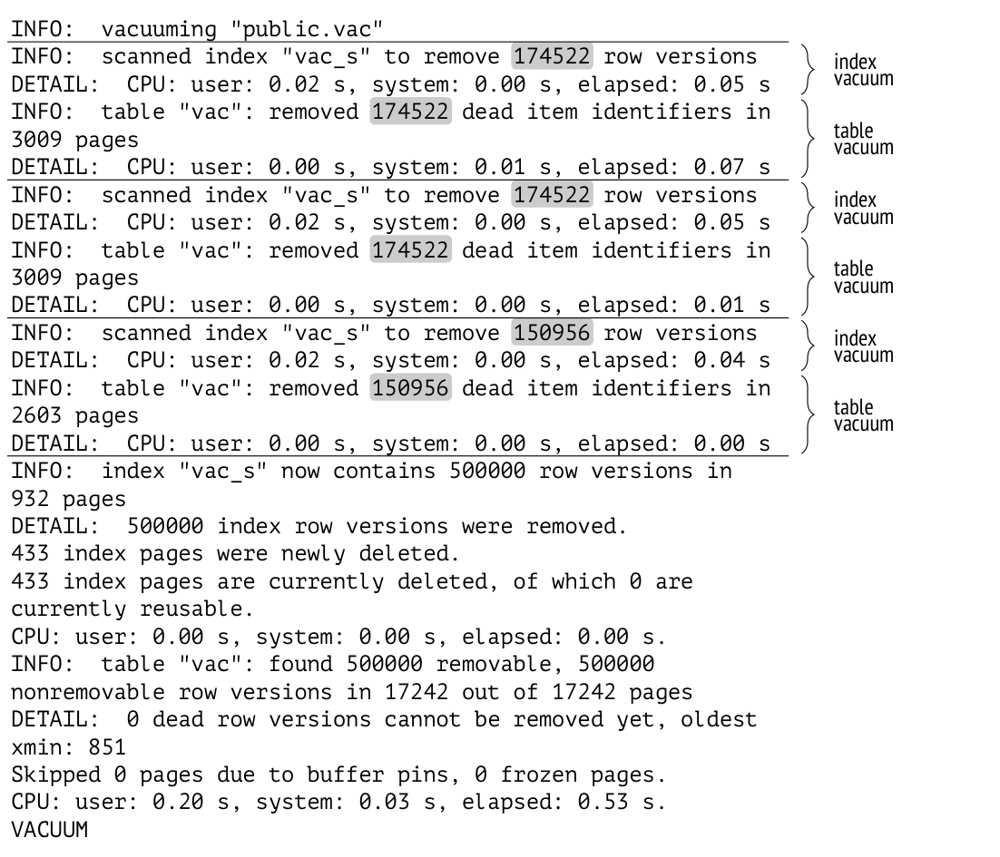

# Chương 6. Vacuum và Autovacuum (Dọn dẹp và tự động dọn dẹp)

## 6.1 Vacuum

Page pruning diễn ra rất nhanh, nhưng nó chỉ giải phóng được một phần không gian có thể thu hồi. Vì chỉ hoạt động trong phạm vi một heap page, nó không động chạm đến index (hoặc ngược lại, nó dọn dẹp một index page mà không ảnh hưởng đến bảng).

*Vacuum định kỳ (routine vacuuming)*,[^1] tức thủ tục vacuum chính, được thực hiện bằng lệnh `VACUUM`.[^2] Nó xử lý toàn bộ bảng và loại bỏ cả các heap tuple đã lỗi thời lẫn mọi index entry tương ứng.

Vacuum được thực hiện song song với các tiến trình khác trong hệ cơ sở dữ liệu. Trong khi đang được vacuum, bảng và index vẫn có thể được sử dụng theo cách thông thường, cho cả thao tác đọc lẫn ghi (nhưng không được phép thực thi đồng thời các lệnh như `CREATE INDEX`, `ALTER TABLE` và một số lệnh khác). *[→ tr. 204](12-relation-level-locks.md)*

Để tránh phải quét các page thừa, PostgreSQL sử dụng visibility map. Các page được theo dõi trong map này bị bỏ qua vì chắc chắn chúng chỉ chứa các tuple hiện hành, nên một page chỉ được vacuum nếu nó không có mặt trong map này. *[→ tr. 27](01-introduction.md)* Nếu tất cả các tuple còn lại trong một page sau khi vacuum đều nằm ngoài database horizon, visibility map sẽ được làm mới để bao gồm page này.

Free space map cũng được cập nhật để phản ánh không gian vừa được giải phóng.

Hãy tạo một bảng có index trên đó:

```
=> CREATE TABLE vac(
  id integer,
  s char(100)
)
WITH (autovacuum_enabled = off);
=> CREATE INDEX vac_s ON vac(s);
```

Storage parameter *autovacuum_enabled* tắt autovacuum; ở đây chúng ta làm vậy chỉ nhằm mục đích thử nghiệm, để kiểm soát chính xác thời điểm bắt đầu vacuum.

Hãy chèn một dòng và thực hiện vài lần cập nhật:

```
=> INSERT INTO vac(id,s) VALUES (1,'A');
=> UPDATE vac SET s = 'B';
=> UPDATE vac SET s = 'C';
```

Bây giờ bảng chứa ba tuple:

```
=> SELECT * FROM heap_page('vac',0);
 ctid  | state  | xmin | xmax  | hhu | hot | t_ctid
-------+--------+-------+-------+-----+-----+--------
 (0,1) | normal | 826 c | 827 c |    |     | (0,2)
 (0,2) | normal | 827 c | 828  |     |     | (0,3)
 (0,3) | normal | 828  | 0 a   |     |     | (0,3)
(3 rows)
```

Mỗi tuple đều được tham chiếu từ index:

```
=> SELECT * FROM index_page('vac_s',1);
 itemoffset | htid  | dead
------------+-------+------
          1 | (0,1) | f
          2 | (0,2) | f
          3 | (0,3) | f
(3 rows)
```

Vacuum đã loại bỏ tất cả các dead tuple (tuple chết), chỉ để lại tuple hiện hành:

```
=> VACUUM vac;
=> SELECT * FROM heap_page('vac',0);
 ctid  | state  | xmin | xmax | hhu | hot | t_ctid
-------+--------+-------+------+-----+-----+--------
 (0,1) | unused |      |      |     |     |
 (0,2) | unused |      |      |     |     |
 (0,3) | normal | 828 c | 0 a |     |     | (0,3)
(3 rows)
```

Trong trường hợp page pruning, hai pointer đầu tiên sẽ được coi là `dead`, nhưng ở đây chúng có trạng thái `unused` vì hiện không còn index entry nào tham chiếu đến chúng:

```
=> SELECT * FROM index_page('vac_s',1);
 itemoffset | htid  | dead
------------+-------+------
          1 | (0,3) | f
(1 row)
```

Các pointer có trạng thái `unused` được coi là trống và có thể được tái sử dụng cho các row version mới.

Giờ đây heap page đã xuất hiện trong visibility map; chúng ta có thể kiểm tra điều này bằng extension `pg_visibility`:

```
=> CREATE EXTENSION pg_visibility;
=> SELECT all_visible
FROM pg_visibility_map('vac',0);
 all_visible
-------------
 t
(1 row)
```

Page header cũng đã nhận được một thuộc tính cho biết mọi tuple của nó đều visible (nhìn thấy được) trong mọi snapshot:

```
=> SELECT flags & 4 > 0 AS all_visible
FROM page_header(get_raw_page('vac',0));
 all_visible
-------------
 t
(1 row)
```

## 6.2 Nhìn lại database horizon (Database Horizon Revisited)

Vacuum phát hiện dead tuple dựa trên database horizon. Khái niệm này cơ bản đến mức đáng để quay lại với nó thêm một lần nữa.

Hãy bắt đầu lại thử nghiệm của chúng ta từ đầu:

```
=> TRUNCATE vac;
=> INSERT INTO vac(id,s) VALUES (1,'A');
=> UPDATE vac SET s = 'B';
```

Nhưng lần này, trước khi cập nhật dòng, chúng ta sẽ mở một transaction khác giữ lại database horizon (đó có thể là hầu như bất kỳ transaction nào, ngoại trừ một transaction ảo được thực thi ở isolation level `Read Committed`). *[→ tr. 88](04-snapshots.md)* Ví dụ, transaction này có thể sửa đổi một số dòng trong một bảng *khác*.

> ```
> => BEGIN;
> => UPDATE accounts SET amount = 0;
> ```

```
=> UPDATE vac SET s = 'C';
```

Bây giờ bảng của chúng ta chứa ba tuple, và index chứa ba tham chiếu. Hãy vacuum bảng và xem điều gì thay đổi:

```
=> VACUUM vac;
=> SELECT * FROM heap_page('vac',0);
 ctid  | state  | xmin | xmax  | hhu | hot | t_ctid
-------+--------+-------+-------+-----+-----+--------
 (0,1) | unused |      |       |     |     |
 (0,2) | normal | 833 c | 835 c |    |     | (0,3)
 (0,3) | normal | 835 c | 0 a  |     |     | (0,3)
(3 rows)
=> SELECT * FROM index_page('vac_s',1);
 itemoffset | htid  | dead
------------+-------+------
          1 | (0,2) | f
          2 | (0,3) | f
(2 rows)
```

Trong khi lần chạy trước chỉ để lại một tuple trong page, giờ chúng ta có hai tuple: `VACUUM` đã quyết định rằng version `(0,2)` chưa thể bị loại bỏ. Nguyên nhân là database horizon, mà trong trường hợp này được xác định bởi một transaction chưa kết thúc:

> ```
> => SELECT backend_xmin FROM pg_stat_activity
> WHERE pid = pg_backend_pid();
>  backend_xmin
> --------------
>           834
> (1 row)
> ```

Chúng ta có thể dùng mệnh đề `VERBOSE` khi gọi `VACUUM` để quan sát những gì đang diễn ra:

```
=> VACUUM VERBOSE vac;
INFO:  vacuuming "public.vac"
INFO:  table "vac": found 0 removable, 2 nonremovable row versions
in 1 out of 1 pages
DETAIL:  1 dead row versions cannot be removed yet, oldest xmin: 834
Skipped 0 pages due to buffer pins, 0 frozen pages.
CPU: user: 0.00 s, system: 0.00 s, elapsed: 0.00 s.
VACUUM
```

Kết quả hiển thị các thông tin sau:

- `VACUUM` không phát hiện tuple nào có thể loại bỏ (`0 removable`).

- Hai tuple không được phép loại bỏ (`2 nonremovable`).

- Một trong các tuple không thể loại bỏ là tuple chết (`1 dead`), tuple còn lại đang được sử dụng.

- Horizon hiện tại mà `VACUUM` tuân theo (`oldest xmin`) là horizon của transaction đang hoạt động.

Khi transaction đang hoạt động hoàn tất, database horizon dịch chuyển về phía trước, và vacuum có thể tiếp tục:

> ```
> => COMMIT;
> ```

```
=> VACUUM VERBOSE vac;
INFO:  vacuuming "public.vac"
INFO:  scanned index "vac_s" to remove 1 row versions
DETAIL:  CPU: user: 0.00 s, system: 0.00 s, elapsed: 0.00 s
INFO:  table "vac": removed 1 dead item identifiers in 1 pages
DETAIL:  CPU: user: 0.00 s, system: 0.00 s, elapsed: 0.00 s
INFO:  index "vac_s" now contains 1 row versions in 2 pages
DETAIL:  1 index row versions were removed.
0 index pages were newly deleted.
0 index pages are currently deleted, of which 0 are currently
reusable.
CPU: user: 0.00 s, system: 0.00 s, elapsed: 0.00 s.
INFO:  table "vac": found 1 removable, 1 nonremovable row versions
in 1 out of 1 pages
DETAIL:  0 dead row versions cannot be removed yet, oldest xmin: 836
Skipped 0 pages due to buffer pins, 0 frozen pages.
CPU: user: 0.00 s, system: 0.00 s, elapsed: 0.00 s.
VACUUM
```

`VACUUM` đã phát hiện và loại bỏ một dead tuple nằm ngoài database horizon mới.

Giờ page không còn chứa row version lỗi thời nào; version duy nhất còn lại là version hiện hành:

```
=> SELECT * FROM heap_page('vac',0);
 ctid  | state  | xmin | xmax | hhu | hot | t_ctid
-------+--------+-------+------+-----+-----+--------
 (0,1) | unused |      |      |     |     |
 (0,2) | unused |      |      |     |     |
 (0,3) | normal | 835 c | 0 a |     |     | (0,3)
(3 rows)
```

Index cũng chỉ chứa một entry:

```
=> SELECT * FROM index_page('vac_s',1);
 itemoffset | htid  | dead
------------+-------+------
          1 | (0,3) | f
(1 row)
```

## 6.3 Các giai đoạn của vacuum (Vacuum Phases)

Cơ chế vacuum có vẻ khá đơn giản, nhưng ấn tượng này là sai lầm. Suy cho cùng, cả bảng lẫn index đều phải được xử lý đồng thời mà không chặn các tiến trình khác. Để làm được như vậy, việc vacuum mỗi bảng được tiến hành qua nhiều giai đoạn.[^3]

Mọi thứ bắt đầu bằng việc quét bảng để tìm dead tuple; nếu tìm thấy, chúng được loại bỏ trước tiên khỏi các index rồi sau đó mới khỏi chính bảng. Nếu có quá nhiều dead tuple cần vacuum trong một lượt, quá trình này sẽ được lặp lại. Cuối cùng, có thể thực hiện heap truncation (cắt bớt heap).

### Heap Scan

Trong giai đoạn đầu tiên, một *heap scan* (quét heap) được thực hiện.[^4] Quá trình quét có tính đến visibility map: mọi page được theo dõi trong map này đều bị bỏ qua vì chắc chắn chúng không chứa tuple lỗi thời nào. Nếu một tuple nằm ngoài horizon và không còn cần đến nữa, ID của nó được thêm vào một mảng `tid` đặc biệt. Những tuple như vậy chưa thể bị loại bỏ vì chúng có thể vẫn đang được tham chiếu từ các index.

Mảng `tid` nằm trong bộ nhớ cục bộ của tiến trình `VACUUM`; kích thước vùng nhớ được cấp phát được xác định bởi tham số *maintenance_work_mem* *(mặc định: 64MB)*. Toàn bộ vùng nhớ được cấp phát một lần chứ không phải theo nhu cầu. Tuy nhiên, bộ nhớ được cấp phát không bao giờ vượt quá lượng cần thiết trong kịch bản xấu nhất, vì vậy nếu bảng nhỏ, vacuum có thể dùng ít bộ nhớ hơn mức được chỉ định trong tham số này.

### Index Vacuuming

Giai đoạn đầu tiên có thể có hai kết quả: hoặc bảng được quét toàn bộ, hoặc bộ nhớ cấp phát cho mảng `tid` bị lấp đầy trước khi thao tác này hoàn tất. Trong cả hai trường hợp, *index vacuuming* (vacuum index) bắt đầu.[^5] Trong giai đoạn này, *mỗi* index được tạo trên bảng đều được *quét toàn bộ* để tìm tất cả các entry tham chiếu đến các tuple đã được ghi nhận trong mảng `tid`. Các entry này bị loại bỏ khỏi các index page.

> Index có thể giúp bạn nhanh chóng đi tới một heap tuple theo khóa index của nó, nhưng không có cách nào tìm nhanh một index entry theo tuple ID tương ứng. Chức năng này hiện đang được hiện thực cho B-tree,[^6] nhưng công việc này vẫn chưa hoàn thành.

Nếu có nhiều index lớn hơn giá trị *min_parallel_index_scan_size* *(mặc định: 512kB)*, chúng có thể được vacuum bởi các background worker chạy song song. Trừ khi mức độ song song được chỉ định tường minh bằng mệnh đề `parallel` *N* *(v. 13)*, `VACUUM` khởi chạy một worker cho mỗi index phù hợp (trong giới hạn chung áp đặt lên số lượng background worker).[^7] Một index không thể được xử lý bởi nhiều worker.

Trong giai đoạn index vacuuming, PostgreSQL cập nhật free space map và tính toán statistics (thống kê) về vacuum. Tuy nhiên, giai đoạn này bị bỏ qua nếu các dòng chỉ được chèn vào (và không bị xóa hay cập nhật), vì khi đó bảng không chứa dead tuple nào. Lúc đó, một lần quét index sẽ chỉ bị bắt buộc thực hiện một lần duy nhất ở cuối cùng, như một phần của một giai đoạn riêng gọi là *index cleanup* (dọn dẹp index).[^8]

Giai đoạn index vacuuming không để lại tham chiếu nào đến các heap tuple lỗi thời trong index, nhưng bản thân các tuple vẫn còn trong bảng. Điều này hoàn toàn bình thường: index scan không thể tìm thấy dead tuple nào, còn sequential scan trên bảng thì dựa vào các quy tắc visibility để lọc chúng ra.

### Heap Vacuuming

Sau đó giai đoạn *heap vacuuming* (vacuum heap) bắt đầu.[^9] Bảng được quét lại để loại bỏ các tuple đã ghi nhận trong mảng `tid` và giải phóng các pointer tương ứng. Vì giờ đây tất cả các tham chiếu index liên quan đều đã bị loại bỏ, việc này có thể được thực hiện an toàn.

Không gian được `VACUUM` thu hồi được phản ánh trong free space map, còn các page giờ chỉ chứa các tuple hiện hành visible trong mọi snapshot sẽ được đánh dấu trong visibility map.

Nếu bảng chưa được đọc hết trong giai đoạn heap scan, mảng `tid` sẽ được xóa sạch, và heap scan được tiếp tục từ chỗ nó đã dừng lần trước.

### Heap Truncation

Các heap page đã được vacuum chứa một ít không gian trống; thỉnh thoảng, bạn có thể may mắn dọn sạch được cả page. Nếu bạn có được vài page trống ở cuối file, vacuum có thể "cắn bỏ" phần đuôi này và trả lại không gian thu hồi được cho hệ điều hành. Việc này diễn ra trong *heap truncation* (cắt bớt heap),[^10] giai đoạn cuối cùng của vacuum.

Heap truncation đòi hỏi một exclusive lock ngắn trên bảng. Để tránh giữ chân các tiến trình khác quá lâu, các lần thử giành lock không vượt quá năm giây. *[→ tr. 204](12-relation-level-locks.md)*

Vì bảng phải bị lock, việc cắt bớt chỉ được thực hiện nếu phần đuôi trống chiếm ít nhất 1/16 bảng hoặc đã đạt độ dài 1.000 page. Các ngưỡng này được hardcode và không thể cấu hình.

Nếu bất chấp mọi biện pháp phòng ngừa này, lock trên bảng vẫn gây ra vấn đề, bạn có thể tắt hẳn việc cắt bớt bằng các storage parameter *vacuum_truncate* và *toast.vacuum_truncate*. *(v. 12)*

## 6.4 Analysis (Phân tích)

Khi nói về vacuum, chúng ta phải nhắc đến thêm một tác vụ khác có liên quan chặt chẽ với nó, dù giữa chúng không có mối liên hệ chính thức nào. Đó là *analysis* (phân tích),[^11] hay việc thu thập thông tin thống kê cho query planner. *[→ tr. 271](17-statistics.md)* Statistics được thu thập bao gồm số dòng (`pg_class.reltuples`) và số page (`pg_class.relpages`) trong các relation, phân bố dữ liệu trong các cột, và một số thông tin khác.

Bạn có thể chạy analysis thủ công bằng lệnh `ANALYZE`,[^12] hoặc kết hợp nó với vacuum bằng cách gọi `VACUUM ANALYZE`. Tuy nhiên, hai tác vụ này vẫn được thực hiện tuần tự, nên không có khác biệt nào về hiệu năng.

> Về mặt lịch sử, VACUUM ANALYZE xuất hiện trước, trong phiên bản 6.1, còn lệnh ANALYZE riêng biệt mãi đến phiên bản 7.2 mới được hiện thực. Trong các phiên bản trước đó, statistics được thu thập bằng một script TCL.

Vacuum và analysis tự động được thiết lập theo cách tương tự nhau, nên hợp lý khi bàn về chúng cùng lúc.

## 6.5 Vacuum và analysis tự động (Automatic Vacuum and Analysis)

Trừ khi database horizon bị giữ lại trong thời gian dài, vacuum định kỳ hẳn sẽ đáp ứng được công việc của nó. Nhưng chúng ta cần gọi lệnh `VACUUM` thường xuyên đến mức nào?

Nếu một bảng được cập nhật thường xuyên mà lại được vacuum quá thưa, nó sẽ phình to hơn mong muốn. Ngoài ra, nó có thể tích lũy quá nhiều thay đổi, và khi đó lần chạy `VACUUM` tiếp theo sẽ phải duyệt qua các index nhiều lượt.

Nếu bảng được vacuum quá thường xuyên, server sẽ bận rộn với việc bảo trì thay vì làm công việc hữu ích.

Hơn nữa, khối lượng công việc điển hình có thể thay đổi theo thời gian, nên việc có một lịch vacuum cố định dù sao cũng chẳng giúp ích gì: bảng càng được cập nhật thường xuyên thì càng phải được vacuum thường xuyên.

Vấn đề này được giải quyết bởi *autovacuum*,[^13] cơ chế khởi chạy các tiến trình vacuum và analysis dựa trên cường độ cập nhật bảng.

### Về cơ chế autovacuum (About the Autovacuum Mechanism)

Khi autovacuum được bật (tham số cấu hình *autovacuum* ở trạng thái on *(mặc định: on)*), tiến trình `autovacuum launcher` luôn chạy trong hệ thống. Tiến trình này xác định lịch autovacuum và duy trì danh sách các cơ sở dữ liệu "đang hoạt động" dựa trên statistics sử dụng. Những statistics như vậy được thu thập nếu tham số *track_counts* được bật *(mặc định: on)*. Đừng tắt các tham số này, nếu không autovacuum sẽ không hoạt động.

Cứ mỗi khoảng *autovacuum_naptime* *(mặc định: 1min)*, `autovacuum launcher` khởi động một `autovacuum worker`[^14] cho mỗi cơ sở dữ liệu đang hoạt động trong danh sách (các worker này được sinh ra bởi `postmaster`, như thường lệ). Do đó, nếu có *N* cơ sở dữ liệu đang hoạt động trong cluster, *N* worker sẽ được sinh ra trong khoảng *autovacuum_naptime*. Nhưng tổng số autovacuum worker chạy song song không thể vượt quá ngưỡng được xác định bởi tham số *autovacuum_max_workers*. *(mặc định: 3)*

> Autovacuum worker rất giống với các background worker thông thường, nhưng chúng xuất hiện sớm hơn nhiều so với cơ chế quản lý tác vụ tổng quát này. Người ta đã quyết định giữ nguyên cách hiện thực autovacuum, nên autovacuum worker không sử dụng các slot *max_worker_processes*.

Sau khi khởi động, background worker kết nối tới cơ sở dữ liệu được chỉ định và xây dựng hai danh sách:

- danh sách tất cả các bảng, materialized view và bảng TOAST cần được vacuum

- danh sách tất cả các bảng và materialized view cần được analyze (bảng TOAST không được analyze vì chúng luôn được truy cập thông qua index)

Sau đó các đối tượng đã chọn lần lượt được vacuum hoặc analyze (hoặc trải qua cả hai thao tác), và khi công việc hoàn tất, worker kết thúc.

Vacuum tự động hoạt động tương tự như vacuum thủ công được khởi tạo bằng lệnh `VACUUM`, nhưng có một vài khác biệt nhỏ:

- Khi vacuum thủ công được thực hiện, các tuple ID được tích lũy trong một vùng nhớ có kích thước *maintenance_work_mem*. Dùng cùng giới hạn này cho autovacuum là không mong muốn, vì nó có thể dẫn đến tiêu thụ bộ nhớ quá mức: có thể có nhiều autovacuum worker chạy song song, và mỗi worker sẽ nhận ngay *maintenance_work_mem* bộ nhớ. Thay vào đó, PostgreSQL cung cấp một giới hạn bộ nhớ riêng cho các tiến trình autovacuum, được xác định bởi tham số *autovacuum_work_mem*.

- Theo mặc định, tham số *autovacuum_work_mem* *(mặc định: -1)* sẽ dùng lại giới hạn thông thường *maintenance_work_mem*, vì vậy nếu giá trị *autovacuum_max_workers* cao, bạn có thể phải điều chỉnh giá trị *autovacuum_work_mem* cho phù hợp.

- Việc xử lý đồng thời nhiều index được tạo trên một bảng chỉ có thể được thực hiện bởi vacuum thủ công; dùng autovacuum cho mục đích này sẽ dẫn đến một số lượng lớn tiến trình song song, nên điều đó không được phép.

Nếu một worker không hoàn thành được tất cả các tác vụ đã lên lịch trong khoảng *autovacuum_naptime*, `autovacuum launcher` sẽ sinh ra một worker khác để chạy song song trong cơ sở dữ liệu đó. Worker thứ hai sẽ xây dựng danh sách riêng của nó gồm các đối tượng cần vacuum và analyze, rồi bắt đầu xử lý chúng. Không có song song ở cấp bảng; chỉ các bảng *khác nhau* mới có thể được xử lý đồng thời.

### Những bảng nào cần được vacuum? (Which Tables Need to be Vacuumed?)

Bạn có thể tắt autovacuum ở cấp bảng — dù thật khó hình dung tại sao lại cần làm vậy. Có hai storage parameter được cung cấp cho mục đích này, một cho bảng thông thường và một cho bảng TOAST:

- *autovacuum_enabled*

- *toast.autovacuum_enabled*

Trong các tình huống thông thường, autovacuum được kích hoạt hoặc bởi sự tích lũy dead tuple, hoặc bởi việc chèn thêm dòng mới. *[→ tr. 129](07-freezing.md)*

**Dead tuple accumulation.** Dead tuple liên tục được statistics collector đếm; số lượng hiện tại của chúng được hiển thị trong bảng system catalog có tên `pg_stat_all_tables`.

Người ta giả định rằng dead tuple phải được vacuum nếu chúng vượt quá ngưỡng được xác định bởi hai tham số sau:

- *autovacuum_vacuum_threshold*, chỉ định số lượng dead tuple (một giá trị tuyệt đối) *(mặc định: 50)*

- *autovacuum_vacuum_scale_factor*, thiết lập tỷ lệ dead tuple trong bảng *(mặc định: 0.2)*

Vacuum là cần thiết nếu điều kiện sau được thỏa mãn:

`pg_stat_all_tables.n_dead_tup` >

*autovacuum_vacuum_threshold* +

*autovacuum_vacuum_scale_factor* × `pg_class.reltuples`

Tham số chính ở đây tất nhiên là *autovacuum_vacuum_scale_factor*: giá trị của nó quan trọng đối với các bảng lớn (và chính các bảng lớn là nơi có khả năng gây ra phần lớn vấn đề). Giá trị mặc định 20% có vẻ quá lớn và có thể phải giảm đáng kể.

Với các bảng khác nhau, giá trị tham số tối ưu có thể khác nhau: chúng phụ thuộc phần lớn vào kích thước bảng và loại khối lượng công việc. Hợp lý là thiết lập các giá trị ban đầu tương đối phù hợp rồi ghi đè chúng cho từng bảng cụ thể bằng các storage parameter:

- *autovacuum_vacuum_threshold* và *toast.autovacuum_vacuum_threshold*

- *autovacuum_vacuum_scale_factor* và *toast.autovacuum_vacuum_scale_factor*

**Row insertions.** Nếu các dòng chỉ được chèn vào mà không bị xóa hay cập nhật, bảng không chứa dead tuple nào. *(v. 13)* Nhưng những bảng như vậy cũng nên được vacuum để freeze các heap tuple từ trước *[→ tr. 123](07-freezing.md)* và cập nhật visibility map (nhờ đó cho phép index-only scan). *[→ tr. 337](20-index-scans.md)*

Một bảng sẽ được vacuum nếu số dòng được chèn vào kể từ lần vacuum trước vượt quá ngưỡng được xác định bởi một cặp tham số tương tự khác:

- *autovacuum_vacuum_insert_threshold* *(mặc định: 1000)*

- *autovacuum_vacuum_insert_scale_factor* *(mặc định: 0.2)*

Công thức như sau:

`pg_stat_all_tables.n_ins_since_vacuum` >

*autovacuum_vacuum_insert_threshold* +

*autovacuum_vacuum_insert_scale_factor* × `pg_class.reltuples`

Giống như ví dụ trước, bạn có thể ghi đè các giá trị này ở cấp bảng bằng storage parameter:

- *autovacuum_vacuum_insert_threshold* và tham số tương ứng cho TOAST

- *autovacuum_vacuum_insert_scale_factor* và tham số tương ứng cho TOAST

### Những bảng nào cần được analyze? (Which Tables Need to Be Analyzed?)

Analysis tự động chỉ cần xử lý các dòng đã bị sửa đổi, nên các phép tính đơn giản hơn một chút so với autovacuum.

Người ta giả định rằng một bảng phải được analyze nếu số dòng bị sửa đổi kể từ lần analysis trước vượt quá ngưỡng được xác định bởi hai tham số cấu hình sau:

- *autovacuum_analyze_threshold* *(mặc định: 50)*

- *autovacuum_analyze_scale_factor* *(mặc định: 0.1)*

Autoanalysis được kích hoạt nếu điều kiện sau được đáp ứng:

`pg_stat_all_tables.n_mod_since_analyze` >

*autovacuum_analyze_threshold* +

*autovacuum_analyze_scale_factor* × `pg_class.reltuples`

Để ghi đè thiết lập autoanalysis cho từng bảng cụ thể, bạn có thể dùng các storage parameter cùng tên:

- *autovacuum_analyze_threshold*

- *autovacuum_analyze_scale_factor*

Vì bảng TOAST không được analyze, chúng không có các tham số tương ứng.

### Autovacuum trong thực tế (Autovacuum in Action)

Để hình thức hóa mọi điều đã nói trong mục này, hãy tạo hai view cho biết những bảng nào hiện cần được vacuum và analyze.[^15] Hàm được dùng trong các view này trả về giá trị hiện tại của tham số được truyền vào, có tính đến việc giá trị này có thể được định nghĩa lại ở cấp bảng:

```
=> CREATE FUNCTION p(param text, c pg_class) RETURNS float
AS $$
  SELECT coalesce(
    -- use storage parameter if set
    (SELECT option_value
     FROM   pg_options_to_table(c.reloptions)
     WHERE  option_name = CASE
              -- for TOAST tables the parameter name is different
              WHEN c.relkind = 't' THEN 'toast.' ELSE ''
            END || param
    ),
```

```
    -- else take the configuration parameter value
    current_setting(param)
  )::float;
$$ LANGUAGE sql;
```

Một view liên quan đến vacuum có thể trông như sau:

```
=> CREATE VIEW need_vacuum AS
WITH c AS (
  SELECT c.oid,
    greatest(c.reltuples, 0) reltuples,
    p('autovacuum_vacuum_threshold', c) threshold,
    p('autovacuum_vacuum_scale_factor', c) scale_factor,
    p('autovacuum_vacuum_insert_threshold', c) ins_threshold,
    p('autovacuum_vacuum_insert_scale_factor', c) ins_scale_factor
  FROM pg_class c
  WHERE c.relkind IN ('r','m','t')
)
SELECT st.schemaname || '.' || st.relname AS tablename,
  st.n_dead_tup AS dead_tup,
  c.threshold + c.scale_factor * c.reltuples AS max_dead_tup,
  st.n_ins_since_vacuum AS ins_tup,
  c.ins_threshold + c.ins_scale_factor * c.reltuples AS max_ins_tup,
  st.last_autovacuum
FROM pg_stat_all_tables st
  JOIN c ON c.oid = st.relid;
```

Cột `max_dead_tup` cho biết số dead tuple sẽ kích hoạt autovacuum, còn cột `max_ins_tup` cho biết giá trị ngưỡng liên quan đến việc chèn.

Đây là một view tương tự cho analysis:

```
=> CREATE VIEW need_analyze AS
WITH c AS (
  SELECT c.oid,
    greatest(c.reltuples, 0) reltuples,
    p('autovacuum_analyze_threshold', c) threshold,
    p('autovacuum_analyze_scale_factor', c) scale_factor
  FROM pg_class c
  WHERE c.relkind IN ('r','m')
)
SELECT st.schemaname || '.' || st.relname AS tablename,
  st.n_mod_since_analyze AS mod_tup,
  c.threshold + c.scale_factor * c.reltuples AS max_mod_tup,
  st.last_autoanalyze
FROM pg_stat_all_tables st
  JOIN c ON c.oid = st.relid;
```

Cột `max_mod_tup` cho biết giá trị ngưỡng cho autoanalysis.

Để tăng tốc thử nghiệm, chúng ta sẽ khởi động autovacuum mỗi giây:

```
=> ALTER SYSTEM SET autovacuum_naptime = '1s';
=> SELECT pg_reload_conf();
```

Hãy truncate bảng `vac` rồi chèn 1.000 dòng. Lưu ý rằng autovacuum đang bị tắt ở cấp bảng.

```
=> TRUNCATE TABLE vac;
=> INSERT INTO vac(id,s)
  SELECT id, 'A' FROM generate_series(1,1000) id;
```

Đây là những gì view liên quan đến vacuum của chúng ta sẽ hiển thị:

```
=> SELECT * FROM need_vacuum WHERE tablename = 'public.vac' \gx
-[ RECORD 1 ]---+-----------
tablename       | public.vac
dead_tup        | 0
max_dead_tup    | 50
ins_tup         | 1000
max_ins_tup     | 1000
last_autovacuum |
```

Giá trị ngưỡng thực tế là `max_dead_tup` = 50, mặc dù công thức nêu ở trên gợi ý rằng nó phải là 50 + 0.2 × 1000 = 250. Vấn đề là statistics trên bảng này chưa có sẵn, vì lệnh `INSERT` không cập nhật chúng:

```
=> SELECT reltuples FROM pg_class WHERE relname = 'vac';
 reltuples
-----------
        -1
(1 row)
```

Giá trị `pg_class.reltuples` được đặt là -1; hằng số đặc biệt này được dùng thay cho số không để phân biệt giữa một bảng chưa có statistics nào và một bảng thực sự rỗng đã được analyze. *(v. 14)* Với mục đích tính toán, giá trị âm được coi là không, cho ta 50 + 0.2 × 0 = 50.

Giá trị `max_ins_tup` = 1000 khác với giá trị dự kiến 1.200 cũng vì lý do tương tự.

Hãy xem view analysis:

```
=> SELECT * FROM need_analyze WHERE tablename = 'public.vac' \gx
-[ RECORD 1 ]----+-----------
tablename        | public.vac
mod_tup          | 1006
max_mod_tup      | 50
last_autoanalyze |
```

Chúng ta đã cập nhật (trong trường hợp này là chèn) 1.000 dòng; kết quả là ngưỡng bị vượt quá: vì kích thước bảng chưa biết, ngưỡng hiện được đặt là 50. Điều đó có nghĩa là autoanalysis sẽ được kích hoạt ngay lập tức khi chúng ta bật nó lên:

```
=> ALTER TABLE vac SET (autovacuum_enabled = on);
```

Khi việc analyze bảng hoàn tất, ngưỡng được đặt lại về một giá trị hợp lý là 150 dòng.

```
=> SELECT reltuples FROM pg_class WHERE relname = 'vac';
 reltuples
-----------
      1000
(1 row)
```

```
=> SELECT * FROM need_analyze WHERE tablename = 'public.vac' \gx
-[ RECORD 1 ]----+------------------------------
tablename        | public.vac
mod_tup          | 0
max_mod_tup      | 150
last_autoanalyze | 2023-03-06 14:00:45.533464+03
```

Hãy quay lại với autovacuum:

```
=> SELECT * FROM need_vacuum WHERE tablename = 'public.vac' \gx
-[ RECORD 1 ]---+-----------
tablename       | public.vac
dead_tup        | 0
max_dead_tup    | 250
ins_tup         | 1000
max_ins_tup     | 1200
last_autovacuum |
```

Các giá trị `max_dead_tup` và `max_ins_tup` cũng đã được cập nhật dựa trên kích thước bảng thực tế mà analysis phát hiện được.

Vacuum sẽ được bắt đầu nếu ít nhất một trong các điều kiện sau được đáp ứng:

- Tích lũy hơn 250 dead tuple.

- Hơn 200 dòng được chèn vào bảng. *(v. 13)*

Hãy tắt autovacuum một lần nữa và cập nhật 251 dòng để giá trị ngưỡng bị vượt quá một đơn vị:

```
=> ALTER TABLE vac SET (autovacuum_enabled = off);
=> UPDATE vac SET s = 'B' WHERE id <= 251;
=> SELECT * FROM need_vacuum WHERE tablename = 'public.vac' \gx
```

```
-[ RECORD 1 ]---+-----------
tablename       | public.vac
dead_tup        | 251
max_dead_tup    | 250
ins_tup         | 1000
max_ins_tup     | 1200
last_autovacuum |
```

Bây giờ điều kiện kích hoạt đã được thỏa mãn. Hãy bật autovacuum; sau một lúc, chúng ta sẽ thấy bảng đã được xử lý, và statistics sử dụng của nó đã được đặt lại:

```
=> ALTER TABLE vac SET (autovacuum_enabled = on);
=> SELECT * FROM need_vacuum WHERE tablename = 'public.vac' \gx
-[ RECORD 1 ]---+------------------------------
tablename       | public.vac
dead_tup        | 0
max_dead_tup    | 250
ins_tup         | 0
max_ins_tup     | 1200
last_autovacuum | 2023-03-06 14:00:51.736815+03
```

## 6.6 Quản lý tải (Managing the Load)

Vì hoạt động ở cấp page, vacuum không chặn các tiến trình khác; nhưng dù vậy, nó vẫn làm tăng tải hệ thống và có thể ảnh hưởng đáng kể đến hiệu năng.

### Điều tiết vacuum (Vacuum Throttling)

Để kiểm soát cường độ vacuum, PostgreSQL tạm dừng định kỳ trong quá trình xử lý bảng. Sau khi hoàn thành khoảng *vacuum_cost_limit* *(mặc định: 200)* đơn vị công việc, tiến trình sẽ ngủ và giữ trạng thái nghỉ trong khoảng thời gian *vacuum_cost_delay*.

Giá trị mặc định bằng không của *vacuum_cost_delay* có nghĩa là vacuum định kỳ thực tế không bao giờ ngủ, nên giá trị chính xác của *vacuum_cost_limit* không tạo ra khác biệt gì. Người ta giả định rằng nếu quản trị viên phải dùng đến vacuum thủ công, có lẽ họ mong nó hoàn thành càng sớm càng tốt.

Nếu thời gian ngủ được thiết lập, tiến trình sẽ tạm dừng mỗi khi nó đã tiêu tốn *vacuum_cost_limit* đơn vị công việc cho việc xử lý page trong buffer cache. Chi phí của mỗi thao tác đọc page *[→ tr. 147](09-buffer-cache.md)* được ước tính là *vacuum_cost_page_hit* *(mặc định: 1)* đơn vị nếu page được tìm thấy trong buffer cache,

hoặc *vacuum_cost_page_miss* đơn vị trong trường hợp ngược lại.[^16] Nếu một page sạch bị vacuum làm bẩn (dirty), nó cộng thêm *vacuum_cost_page_dirty* đơn vị nữa.[^17] *(mặc định: 2 20)*

Nếu bạn giữ giá trị mặc định của tham số *vacuum_cost_limit*, `VACUUM` có thể xử lý tối đa 200 page mỗi chu kỳ trong kịch bản tốt nhất (nếu mọi page đều đã được cache, và không page nào bị `VACUUM` làm bẩn) và chỉ chín page trong trường hợp xấu nhất (nếu mọi page đều được đọc từ đĩa và trở nên bẩn).

### Điều tiết autovacuum (Autovacuum Throttling)

Việc điều tiết autovacuum[^18] khá giống với điều tiết `VACUUM`. Tuy nhiên, autovacuum có thể chạy với cường độ khác vì nó có bộ tham số riêng:

- *autovacuum_vacuum_cost_limit* *(mặc định: -1)*

- *autovacuum_vacuum_cost_delay* *(mặc định: 2ms)*

Nếu bất kỳ tham số nào trong số này được đặt là -1, nó sẽ dùng lại tham số tương ứng của `VACUUM` thông thường. Điều đó có nghĩa là theo mặc định, tham số *autovacuum_vacuum_cost_limit* dựa vào giá trị *vacuum_cost_limit*.

> Trước phiên bản 12, giá trị mặc định của *autovacuum_vacuum_cost_delay* là 20 ms, và nó dẫn đến hiệu năng rất kém trên phần cứng hiện đại.

Đơn vị công việc của autovacuum bị giới hạn ở *autovacuum_vacuum_cost_limit* mỗi chu kỳ, và vì chúng được chia sẻ giữa tất cả các worker, tác động tổng thể lên hệ thống gần như giữ nguyên, bất kể số lượng worker. Vì vậy nếu bạn cần tăng tốc autovacuum, cả hai giá trị *autovacuum_max_workers* và *autovacuum_vacuum_cost_limit* đều nên được tăng theo tỷ lệ tương ứng.

Nếu cần, bạn có thể ghi đè các thiết lập này cho từng bảng cụ thể bằng cách đặt các storage parameter sau:

- *autovacuum_vacuum_cost_delay* và *toast.autovacuum_vacuum_cost_delay*

- *autovacuum_vacuum_cost_limit* và *toast.autovacuum_vacuum_cost_limit*

## 6.7 Giám sát (Monitoring)

Nếu vacuum được giám sát, bạn có thể phát hiện những tình huống khi dead tuple không thể được loại bỏ trong một lượt, vì các tham chiếu đến chúng không vừa vùng nhớ *maintenance_work_mem*. Trong trường hợp này, tất cả các index sẽ phải được quét toàn bộ nhiều lần. Việc này có thể mất một lượng thời gian đáng kể với các bảng lớn, từ đó tạo ra tải đáng kể lên hệ thống. Mặc dù các truy vấn sẽ không bị chặn, các thao tác I/O thêm vào có thể hạn chế nghiêm trọng thông lượng của hệ thống.

Những vấn đề như vậy có thể được khắc phục bằng cách vacuum bảng thường xuyên hơn (để mỗi lần chạy dọn ít tuple hơn) hoặc bằng cách cấp phát nhiều bộ nhớ hơn.

### Giám sát vacuum (Monitoring Vacuum)

Khi chạy với mệnh đề `VERBOSE`, lệnh `VACUUM` thực hiện việc dọn dẹp và hiển thị báo cáo trạng thái, còn view `pg_stat_progress_vacuum` cho biết trạng thái hiện tại của tiến trình đã khởi động. *(v. 9.6)*

Cũng có một view tương tự cho analysis (`pg_stat_progress_analyze`), dù analysis thường được thực hiện rất nhanh và khó có khả năng gây ra vấn đề gì. *(v. 13)*

Hãy chèn thêm dòng vào bảng và cập nhật tất cả chúng để `VACUUM` phải chạy trong một khoảng thời gian đáng kể:

```
=> TRUNCATE vac;
```

```
=> INSERT INTO vac(id,s)
  SELECT id, 'A' FROM generate_series(1,500000) id;
```

```
=> UPDATE vac SET s  = 'B';
```

Để minh họa, chúng ta sẽ giới hạn lượng bộ nhớ cấp phát cho mảng `tid` ở mức 1 MB:

```
=> ALTER SYSTEM SET maintenance_work_mem = '1MB';
```

```
=> SELECT pg_reload_conf();
```

Khởi chạy lệnh `VACUUM` và truy vấn view `pg_stat_progress_vacuum` vài lần trong khi nó đang chạy:

```
=> VACUUM VERBOSE vac;
```

> ```
> => SELECT * FROM pg_stat_progress_vacuum \gx
> -[ RECORD 1 ]------+------------------
> pid                | 14531
> datid              | 16391
> datname            | internals
> relid              | 16479
> phase              | vacuuming indexes
> heap_blks_total    | 17242
> heap_blks_scanned  | 3009
> heap_blks_vacuumed | 0
> index_vacuum_count | 0
> max_dead_tuples    | 174761
> num_dead_tuples    | 174522
> => SELECT * FROM pg_stat_progress_vacuum \gx
> -[ RECORD 1 ]------+------------------
> pid                | 14531
> datid              | 16391
> datname            | internals
> relid              | 16479
> phase              | vacuuming indexes
> heap_blks_total    | 17242
> heap_blks_scanned  | 17242
> heap_blks_vacuumed | 6017
> index_vacuum_count | 2
> max_dead_tuples    | 174761
> num_dead_tuples    | 150956
> ```

Cụ thể, view này hiển thị:

- `phase` — tên của giai đoạn vacuum hiện tại (tôi đã mô tả các giai đoạn chính, nhưng thực ra còn nhiều giai đoạn hơn nữa[^19])

- `heap_blks_total` — tổng số page trong bảng

- `heap_blks_scanned` — số page đã được quét

- `heap_blks_vacuumed` — số page đã được vacuum

- `index_vacuum_count` — số lần quét index

Tiến độ vacuum tổng thể được xác định bởi tỷ lệ giữa `heap_blks_vacuumed` và `heap_blks_total`, nhưng bạn cần lưu ý rằng nó thay đổi theo từng đợt do các lần quét index. Thực tế, điều quan trọng hơn là chú ý đến số chu kỳ vacuum: nếu giá trị này lớn hơn một, có nghĩa là bộ nhớ được cấp phát không đủ để hoàn tất vacuum trong một lượt.

Bạn có thể thấy toàn cảnh trong kết quả của lệnh `VACUUM VERBOSE`, lúc này đã hoàn tất:

```
INFO:  vacuuming "public.vac"
INFO:  scanned index "vac_s" to remove 174522 row versions
DETAIL:  CPU: user: 0.02 s, system: 0.00 s, elapsed: 0.05 s
INFO:  table "vac": removed 174522 dead item identifiers in
3009 pages
DETAIL:  CPU: user: 0.00 s, system: 0.01 s, elapsed: 0.07 s
INFO:  scanned index "vac_s" to remove 174522 row versions
DETAIL:  CPU: user: 0.02 s, system: 0.00 s, elapsed: 0.05 s
INFO:  table "vac": removed 174522 dead item identifiers in
3009 pages
DETAIL:  CPU: user: 0.00 s, system: 0.00 s, elapsed: 0.01 s
INFO:  scanned index "vac_s" to remove 150956 row versions
DETAIL:  CPU: user: 0.02 s, system: 0.00 s, elapsed: 0.04 s
INFO:  table "vac": removed 150956 dead item identifiers in
2603 pages
DETAIL:  CPU: user: 0.00 s, system: 0.00 s, elapsed: 0.00 s
INFO:  index "vac_s" now contains 500000 row versions in
932 pages
DETAIL:  500000 index row versions were removed.
433 index pages were newly deleted.
433 index pages are currently deleted, of which 0 are
currently reusable.
CPU: user: 0.00 s, system: 0.00 s, elapsed: 0.00 s.
INFO:  table "vac": found 500000 removable, 500000
nonremovable row versions in 17242 out of 17242 pages
DETAIL:  0 dead row versions cannot be removed yet, oldest
xmin: 851
Skipped 0 pages due to buffer pins, 0 frozen pages.
CPU: user: 0.20 s, system: 0.03 s, elapsed: 0.53 s.
VACUUM
```



Tổng cộng đã có ba lần quét index; mỗi lần quét loại bỏ tối đa 174.522 pointer đến dead tuple. Giá trị này được xác định bởi số lượng pointer `tid` (mỗi pointer chiếm 6 byte) có thể vừa trong một mảng có kích thước *maintenance_work_mem*. Kích thước tối đa có thể được hiển thị bởi `pg_stat_progress_vacuum.max_dead_tuples`, nhưng không gian thực sự được sử dụng luôn nhỏ hơn một chút. Điều này đảm bảo rằng khi page tiếp theo được đọc, mọi pointer đến dead tuple của nó, bất kể có bao nhiêu pointer như vậy nằm trong page này, đều sẽ vừa trong phần bộ nhớ còn lại.

### Giám sát autovacuum (Monitoring Autovacuum)

Cách tiếp cận chính để giám sát autovacuum là in thông tin trạng thái của nó (tương tự như kết quả của lệnh `VACUUM VERBOSE`) vào log của server để phân tích sau. Nếu tham số *log_autovacuum_min_duration* *(mặc định: -1)* được đặt bằng không, mọi lần chạy autovacuum đều được ghi log:

```
=> ALTER SYSTEM SET log_autovacuum_min_duration = 0;
```

```
=> SELECT pg_reload_conf();
```

```
=> UPDATE vac SET s = 'C';
UPDATE 500000
```

```
postgres$ tail -n 13 /home/postgres/logfile
2023-03-06 14:01:13.727 MSK [17351] LOG: automatic vacuum of table
"internals.public.vac": index scans: 3
pages: 0 removed, 17242 remain, 0 skipped due to pins, 0
skipped frozen
tuples: 500000 removed, 500000 remain, 0 are dead but not
yet removable, oldest xmin: 853
index scan needed: 8622 pages from table (50.01% of total)
had 500000 dead item identifiers removed
index "vac_s": pages: 1428 in total, 496 newly deleted, 929
currently deleted, 433 reusable
avg read rate: 12.404 MB/s, avg write rate: 14.810 MB/s
buffer usage: 46038 hits, 5670 misses, 6770 dirtied
WAL usage: 40390 records, 15062 full page images, 89188595
bytes
system usage: CPU: user: 0.31 s, system: 0.33 s, elapsed:
3.57 s
2023-03-06 14:01:14.117 MSK [17351] LOG: automatic analyze of table
"internals.public.vac"
avg read rate: 41.081 MB/s, avg write rate: 0.020 MB/s
buffer usage: 15355 hits, 2035 misses, 1 dirtied
system usage: CPU: user: 0.14 s, system: 0.00 s, elapsed:
0.38 s
```

Để theo dõi danh sách các bảng cần được vacuum và analyze, bạn có thể dùng các view `need_vacuum` và `need_analyze` mà chúng ta đã xem qua. Nếu danh sách này tăng lên, có nghĩa là autovacuum không đáp ứng nổi tải và cần được tăng tốc bằng cách giảm khoảng nghỉ (*autovacuum_vacuum_cost_delay*) hoặc tăng lượng công việc thực hiện giữa các khoảng nghỉ (*autovacuum_vacuum_cost_limit*). Rất có thể mức độ song song cũng sẽ phải được tăng lên (*autovacuum_max_workers*).

[^1]: postgresql.org/docs/14/routine-vacuuming.html
[^2]: postgresql.org/docs/14/sql-vacuum.html  
backend/commands/vacuum.c
[^3]: backend/access/heap/vacuumlazy.c, hàm heap_vacuum_rel
[^4]: backend/access/heap/vacuumlazy.c, hàm lazy_scan_heap
[^5]: backend/access/heap/vacuumlazy.c, hàm lazy_vacuum_all_indexes
[^6]: commitfest.postgresql.org/21/1802
[^7]: postgresql.org/docs/14/bgworker.html
[^8]: backend/access/heap/vacuumlazy.c, hàm lazy_cleanup_all_indexes  
backend/access/nbtree/nbtree.c, hàm btvacuumcleanup
[^9]: backend/access/heap/vacuumlazy.c, hàm lazy_vacuum_heap
[^10]: backend/access/heap/vacuumlazy.c, hàm lazy_truncate_heap
[^11]: postgresql.org/docs/14/routine-vacuuming.html#VACUUM-FOR-STATISTICS
[^12]: backend/commands/analyze.c
[^13]: postgresql.org/docs/14/routine-vacuuming.html#AUTOVACUUM
[^14]: backend/postmaster/autovacuum.c
[^15]: backend/postmaster/autovacuum.c, hàm relation_needs_vacanalyze
[^16]: backend/storage/buffer/bufmgr.c, hàm ReadBuffer_common
[^17]: backend/storage/buffer/bufmgr.c, hàm MarkBufferDirty
[^18]: backend/postmaster/autovacuum.c, hàm autovac_balance_cost
[^19]: postgresql.org/docs/14/progress-reporting.html#VACUUM-PHASES
