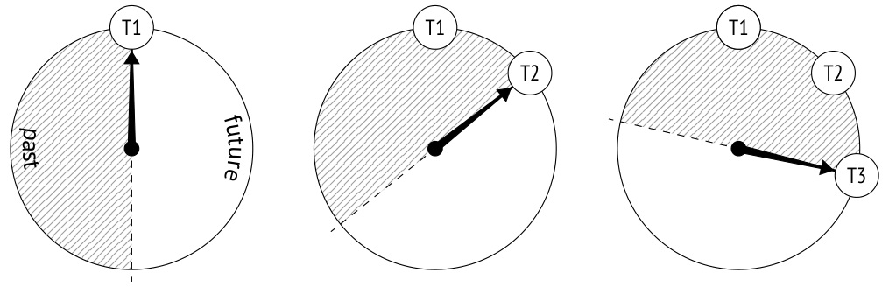
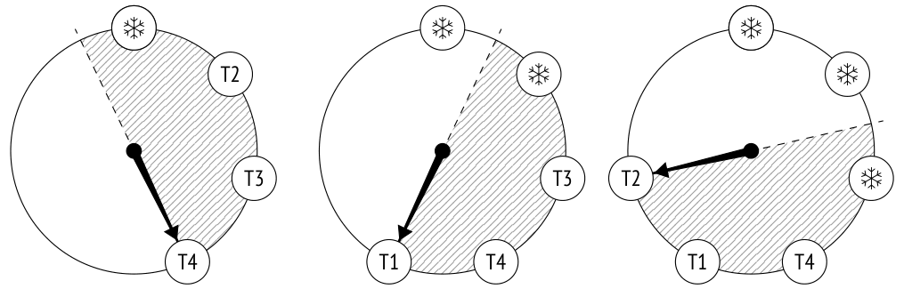
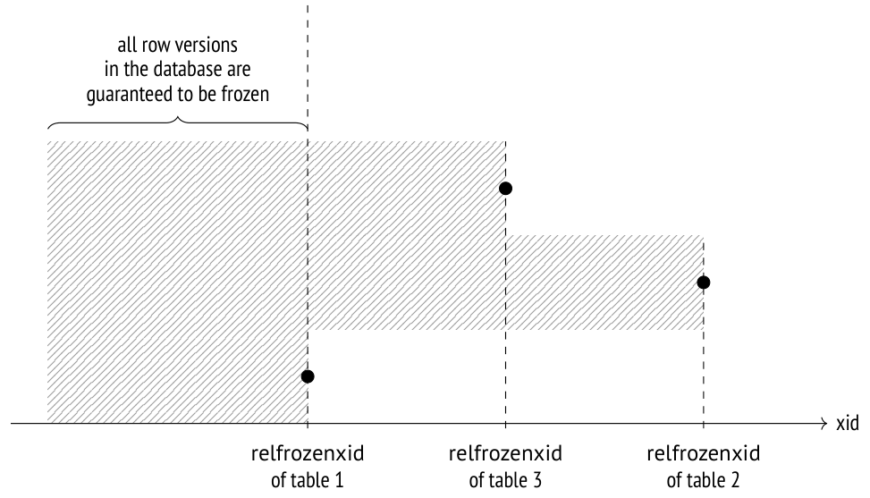

# Chương 7. Freezing (Đóng băng)

## 7.1 Wraparound của Transaction ID (Transaction ID Wraparound)

Trong PostgreSQL, một transaction ID chiếm 32 bit. Bốn tỷ có vẻ là một con số khá lớn, nhưng nó có thể bị dùng hết rất nhanh nếu hệ thống được sử dụng tích cực. Ví dụ, với tải trung bình 1.000 transaction mỗi giây (không tính các transaction ảo), điều này sẽ xảy ra sau khoảng sáu tuần hoạt động liên tục.

Khi tất cả các số đã được dùng hết, bộ đếm phải được đặt lại để bắt đầu vòng tiếp theo (tình huống này được gọi là “wraparound” (quay vòng)). Nhưng một transaction có ID nhỏ hơn chỉ có thể được coi là cũ hơn một transaction khác có ID lớn hơn nếu các số được cấp phát luôn tăng dần. Vì vậy, sau khi được đặt lại, bộ đếm không thể đơn giản bắt đầu dùng lại chính những con số cũ.

Cấp phát 64 bit cho transaction ID lẽ ra đã loại bỏ hoàn toàn vấn đề này, vậy tại sao PostgreSQL không tận dụng điều đó? Vấn đề là mỗi tuple header phải lưu ID của hai transaction: `xmin` và `xmax`. Header vốn đã khá lớn (ít nhất 24 byte nếu tính đến việc căn chỉnh dữ liệu) *[→ tr. 62](03-pages-and-tuples.md)*, và việc thêm bit sẽ làm tăng thêm 8 byte nữa.

> PostgreSQL có hiện thực transaction ID 64 bit[^1] mở rộng một ID thông thường bằng một epoch 32 bit, nhưng chúng chỉ được dùng nội bộ và không bao giờ đi vào các page dữ liệu.

Để xử lý wraparound một cách đúng đắn, PostgreSQL phải so sánh tuổi (age) của các transaction (được định nghĩa là số lượng transaction tiếp sau đã xuất hiện kể từ khi transaction này bắt đầu) chứ không phải so sánh transaction ID. Do đó, thay vì các thuật ngữ *nhỏ hơn* và *lớn hơn*, chúng ta nên dùng các khái niệm *cũ hơn* (đứng trước) và *trẻ hơn* (đứng sau).

Trong mã nguồn, phép so sánh này được hiện thực đơn giản bằng số học 32 bit: trước tiên tìm hiệu giữa hai transaction ID 32 bit, sau đó so sánh kết quả này với số không.[^2]



Để hình dung ý tưởng này rõ hơn, bạn có thể tưởng tượng dãy transaction ID như một mặt đồng hồ. Với mỗi transaction, một nửa vòng tròn theo chiều kim đồng hồ sẽ nằm trong tương lai, còn nửa kia nằm trong quá khứ.

Tuy nhiên, cách hình dung này có một điểm khó chịu. Một transaction cũ (T1) nằm trong quá khứ xa so với các transaction gần đây hơn. Nhưng sớm hay muộn, một transaction mới sẽ thấy nó ở nửa vòng tròn thuộc về tương lai. Nếu điều đó thực sự xảy ra, hậu quả sẽ là thảm hoạ: từ đó trở đi, tất cả các transaction mới hơn sẽ không nhìn thấy các thay đổi do transaction T1 thực hiện.

## 7.2 Đóng băng tuple và quy tắc visibility (Tuple Freezing and Visibility Rules)

Để ngăn chặn kiểu “du hành thời gian” như vậy, quá trình vacuum thực hiện thêm một nhiệm vụ nữa (ngoài việc dọn dẹp page):[^3] nó tìm các tuple nằm ngoài database horizon (tức là chúng hiển thị trong mọi snapshot) và đánh dấu chúng theo một cách đặc biệt, tức là *freeze* (đóng băng) chúng. *[→ tr. 215](13-row-level-locks.md)*

Với các tuple đã được freeze, quy tắc visibility (khả năng hiển thị) không cần xét đến `xmin` vì các tuple như vậy được biết là hiển thị trong mọi snapshot, nên transaction ID này có thể được tái sử dụng một cách an toàn.

Bạn có thể tưởng tượng rằng transaction ID `xmin` trong các tuple đã freeze được thay bằng một giá trị giả định “âm vô cùng” (được minh hoạ bằng bông tuyết bên dưới); đó là dấu hiệu cho thấy tuple này được tạo bởi một transaction nằm quá xa trong quá khứ đến mức ID thực của nó không còn quan trọng nữa. Tuy nhiên trên thực tế `xmin` vẫn giữ nguyên, còn thuộc tính freezing được xác định bởi tổ hợp hai hint bit: `committed` và `aborted`.



> Nhiều nguồn tài liệu (kể cả documentation) nhắc đến FrozenTransactionId = 2. Đó chính là giá trị “âm vô cùng” mà tôi đã đề cập — giá trị này từng được dùng để thay thế xmin ở các phiên bản trước 9.4, nhưng giờ thì hint bit được sử dụng thay thế. Nhờ đó, transaction ID ban đầu vẫn được giữ lại trong tuple, điều này thuận tiện cho cả việc debug lẫn hỗ trợ. Các hệ thống cũ vẫn có thể chứa *FrozenTransactionId* lỗi thời, ngay cả khi chúng đã được nâng cấp lên các phiên bản cao hơn.

Transaction ID `xmax` không tham gia vào freezing theo bất kỳ cách nào. Nó chỉ có mặt trong các tuple đã lỗi thời, và một khi các tuple như vậy không còn hiển thị trong mọi snapshot (nghĩa là ID `xmax` đã nằm ngoài database horizon), chúng sẽ bị vacuum dọn đi.

Hãy tạo một bảng mới cho các thí nghiệm của chúng ta. Parameter *fillfactor* nên được đặt ở giá trị thấp nhất để mỗi page chỉ chứa được hai tuple — theo dõi tiến trình theo cách này sẽ dễ hơn. Chúng ta cũng sẽ tắt autovacuum để đảm bảo bảng chỉ được dọn dẹp khi có yêu cầu.

```
=> CREATE TABLE tfreeze(
  id integer,
  s char(300)
)
WITH (fillfactor = 10, autovacuum_enabled = off);
```

Chúng ta sẽ tạo thêm một biến thể khác của hàm hiển thị các heap page bằng `pageinspect`. Làm việc với một dải page, nó sẽ hiển thị giá trị của thuộc tính freezing (`f`) và tuổi của transaction `xmin` cho mỗi tuple (nó sẽ phải gọi hàm hệ thống `age` — dĩ nhiên bản thân tuổi không được lưu trong heap page):

```
=> CREATE FUNCTION heap_page(
  relname text, pageno_from integer, pageno_to integer
)
RETURNS TABLE(
  ctid tid,
  state text,
  xmin text,
  xmin_age integer,
  xmax text
) AS $$
```

```
SELECT (pageno,lp)::text::tid AS ctid,
       CASE lp_flags
         WHEN 0 THEN 'unused'
         WHEN 1 THEN 'normal'
         WHEN 2 THEN 'redirect to '||lp_off
         WHEN 3 THEN 'dead'
       END AS state,
       t_xmin || CASE
         WHEN (t_infomask & 256+512) = 256+512 THEN ' f'
         WHEN (t_infomask & 256) > 0 THEN ' c'
         WHEN (t_infomask & 512) > 0 THEN ' a'
         ELSE ''
       END AS xmin,
       age(t_xmin) AS xmin_age,
       t_xmax || CASE
         WHEN (t_infomask & 1024) > 0 THEN ' c'
         WHEN (t_infomask & 2048) > 0 THEN ' a'
         ELSE ''
       END AS xmax
FROM generate_series(pageno_from, pageno_to) p(pageno),
     heap_page_items(get_raw_page(relname, pageno))
ORDER BY pageno, lp;
$$ LANGUAGE sql;
```

Bây giờ hãy chèn một số dòng vào bảng và chạy lệnh `VACUUM`, lệnh này sẽ tạo visibility map ngay lập tức.

```
=> CREATE EXTENSION IF NOT EXISTS pg_visibility;
```

```
=> INSERT INTO tfreeze(id, s)
  SELECT id, 'FOO'||id FROM generate_series(1,100) id;
INSERT 0 100
```

Chúng ta sẽ quan sát hai heap page đầu tiên bằng extension `pg_visibility`. Khi vacuum hoàn tất, cả hai page đều được đánh dấu trong visibility map (`all_visible`) nhưng không được đánh dấu trong freeze map (`all_frozen`), vì chúng vẫn còn chứa một số tuple chưa được freeze: *(v. 9.6)*

```
=> VACUUM tfreeze;
=> SELECT *
FROM generate_series(0,1) g(blkno),
     pg_visibility_map('tfreeze',g.blkno)
ORDER BY g.blkno;
 blkno | all_visible | all_frozen
-------+-------------+------------
     0 | t           | f
     1 | t           | f
(2 rows)
```

`xmin_age` của transaction đã tạo các dòng bằng 1 vì đó là transaction mới nhất được thực hiện trong hệ thống:

```
=> SELECT * FROM heap_page('tfreeze',0,1);
 ctid  | state  | xmin | xmin_age | xmax
-------+--------+-------+----------+------
 (0,1) | normal | 856 c |       1 | 0 a
 (0,2) | normal | 856 c |       1 | 0 a
 (1,1) | normal | 856 c |       1 | 0 a
 (1,2) | normal | 856 c |       1 | 0 a
(4 rows)
```

## 7.3 Quản lý freezing (Managing Freezing)

Có bốn parameter chính kiểm soát freezing. Tất cả đều biểu diễn tuổi transaction và xác định khi nào các sự kiện sau xảy ra:

- Freezing bắt đầu (*vacuum_freeze_min_age*).

- Freezing tích cực (aggressive) được thực hiện (*vacuum_freeze_table_age*).

- Freezing bị cưỡng bức (*autovacuum_freeze_max_age*).

- Freezing được ưu tiên (*vacuum_failsafe_age*). *(v. 14)*

### Tuổi freezing tối thiểu (Minimal Freezing Age)

Parameter *vacuum_freeze_min_age* xác định tuổi freezing tối thiểu của các transaction `xmin` *(mặc định: 50 million)*. Giá trị của nó càng thấp thì chi phí phụ trội càng cao: nếu một dòng là “nóng” và đang bị thay đổi liên tục, thì việc freeze tất cả các phiên bản mới được tạo của nó sẽ là công sức lãng phí. Đặt parameter này ở giá trị tương đối cao cho phép bạn chờ thêm một thời gian.

Để quan sát quá trình freezing, hãy giảm giá trị parameter này xuống một:

```
=> ALTER SYSTEM SET vacuum_freeze_min_age = 1;
=> SELECT pg_reload_conf();
```

Bây giờ cập nhật một dòng trong page số không. Row version mới sẽ nằm trong cùng page đó vì giá trị *fillfactor* khá nhỏ:

```
=> UPDATE tfreeze SET s = 'BAR' WHERE id = 1;
```

Tuổi của tất cả các transaction đã tăng thêm một, và các heap page giờ trông như sau:

```
=> SELECT * FROM heap_page('tfreeze',0,1);
 ctid  | state  | xmin | xmin_age | xmax
-------+--------+-------+----------+------
 (0,1) | normal | 856 c |       2 | 857
 (0,2) | normal | 856 c |       2 | 0 a
 (0,3) | normal | 857  |        1 | 0 a
 (1,1) | normal | 856 c |       2 | 0 a
 (1,2) | normal | 856 c |       2 | 0 a
(5 rows)
```

Tại thời điểm này, các tuple cũ hơn *vacuum_freeze_min_age* = 1 thuộc diện cần freeze. Nhưng vacuum sẽ không xử lý bất kỳ page nào đã được đánh dấu trong visibility map: *[→ tr. 107](06-vacuum-and-autovacuum.md)*

```
=> SELECT * FROM generate_series(0,1) g(blkno),
     pg_visibility_map('tfreeze',g.blkno)
ORDER BY g.blkno;
 blkno | all_visible | all_frozen
-------+-------------+------------
     0 | f           | f
     1 | t           | f
(2 rows)
```

Lệnh `UPDATE` trước đó đã xoá bit visibility của page số không, vì vậy tuple có tuổi `xmin` phù hợp trong page này sẽ được freeze. Nhưng page thứ nhất sẽ bị bỏ qua hoàn toàn:

```
=> VACUUM tfreeze;
```

```
=> SELECT * FROM heap_page('tfreeze',0,1);
 ctid  |     state     | xmin | xmin_age | xmax
-------+---------------+-------+----------+------
 (0,1) | redirect to 3 |      |          |
 (0,2) | normal        | 856 f |       2 | 0 a
 (0,3) | normal        | 857 c |       1 | 0 a
 (1,1) | normal        | 856 c |       2 | 0 a
 (1,2) | normal        | 856 c |       2 | 0 a
(5 rows)
```

Giờ page số không lại xuất hiện trong visibility map, và nếu không có gì thay đổi trong nó, vacuum sẽ không quay lại page này nữa:

```
=> SELECT * FROM generate_series(0,1) g(blkno),
     pg_visibility_map('tfreeze',g.blkno)
ORDER BY g.blkno;
```

```
 blkno | all_visible | all_frozen
-------+-------------+------------
     0 | t           | f
     1 | t           | f
(2 rows)
```

### Tuổi cho freezing tích cực (Age for Aggressive Freezing)

Như chúng ta vừa thấy, nếu một page chỉ chứa các tuple hiện hành hiển thị trong mọi snapshot, vacuum sẽ không freeze chúng. Để vượt qua ràng buộc này, PostgreSQL cung cấp parameter *vacuum_freeze_table_age*. Nó xác định tuổi transaction cho phép vacuum bỏ qua visibility map *(mặc định: 150 million)*, nhờ đó bất kỳ heap page nào cũng có thể được freeze.

Với mỗi bảng, system catalog lưu một transaction ID mà đối với nó biết chắc rằng mọi transaction cũ hơn đều đã được freeze. Giá trị này được lưu trong `relfrozenxid`:

```
=> SELECT relfrozenxid, age(relfrozenxid)
FROM pg_class
WHERE relname = 'tfreeze';
 relfrozenxid | age
--------------+-----
          854 |   4
(1 row)
```

Chính tuổi của transaction này được so sánh với giá trị *vacuum_freeze_table_age* để quyết định xem đã đến lúc thực hiện freezing tích cực hay chưa.

Nhờ có freeze map, không cần phải quét toàn bộ bảng trong quá trình vacuum *(v. 9.6)*: chỉ cần kiểm tra những page không có mặt trong map là đủ. Ngoài tối ưu hoá quan trọng này, freeze map còn mang lại khả năng chịu lỗi: nếu vacuum bị ngắt giữa chừng, lần chạy tiếp theo sẽ không phải quay lại những page đã được xử lý và đã được đánh dấu trong map.

PostgreSQL thực hiện freezing tích cực cho tất cả các page trong một bảng mỗi khi số lượng transaction trong hệ thống đạt đến giới hạn *vacuum_freeze_table_age* − *vacuum_freeze_min_age* (nếu dùng giá trị mặc định, điều này xảy ra sau mỗi 100 triệu transaction). Do đó, nếu giá trị *vacuum_freeze_min_age* quá lớn, nó có thể dẫn đến freezing quá mức và làm tăng chi phí phụ trội.

Để freeze toàn bộ bảng, hãy giảm giá trị *vacuum_freeze_table_age* xuống bốn; khi đó điều kiện cho freezing tích cực sẽ được thoả mãn:

```
=> ALTER SYSTEM SET vacuum_freeze_table_age = 4;
```

```
=> SELECT pg_reload_conf();
```

Chạy lệnh `VACUUM`:

```
=> VACUUM VERBOSE tfreeze;
INFO:  aggressively vacuuming "public.tfreeze"
INFO:  table "tfreeze": found 0 removable, 100 nonremovable row
versions in 50 out of 50 pages
DETAIL:  0 dead row versions cannot be removed yet, oldest xmin: 858
Skipped 0 pages due to buffer pins, 0 frozen pages.
CPU: user: 0.00 s, system: 0.00 s, elapsed: 0.00 s.
VACUUM
```

Giờ khi toàn bộ bảng đã được phân tích, giá trị `relfrozenxid` có thể được đẩy lên — các heap page được đảm bảo không còn transaction `xmin` nào cũ hơn mà chưa được freeze:

```
=> SELECT relfrozenxid, age(relfrozenxid)
FROM pg_class
WHERE relname = 'tfreeze';
 relfrozenxid | age
--------------+-----
          857 |   1
(1 row)
```

Page thứ nhất giờ chỉ chứa các tuple đã được freeze:

```
=> SELECT * FROM heap_page('tfreeze',0,1);
 ctid  |     state     | xmin | xmin_age | xmax
-------+---------------+-------+----------+------
 (0,1) | redirect to 3 |      |          |
 (0,2) | normal        | 856 f |       2 | 0 a
 (0,3) | normal        | 857 c |       1 | 0 a
 (1,1) | normal        | 856 f |       2 | 0 a
 (1,2) | normal        | 856 f |       2 | 0 a
(5 rows)
```

Ngoài ra, page này được đánh dấu trong freeze map:

```
=> SELECT * FROM generate_series(0,1) g(blkno),
  pg_visibility_map('tfreeze',g.blkno)
ORDER BY g.blkno;
 blkno | all_visible | all_frozen
-------+-------------+------------
     0 | t           | f
     1 | t           | t
(2 rows)
```

### Tuổi cho autovacuum cưỡng bức (Age for Forced Autovacuum)

Đôi khi việc cấu hình hai parameter đã bàn ở trên là không đủ để freeze tuple kịp thời. Autovacuum có thể bị tắt, trong khi `VACUUM` thông thường lại hoàn toàn không được gọi (đây là một ý tưởng rất tồi, nhưng về mặt kỹ thuật là có thể). Bên cạnh đó, một số cơ sở dữ liệu không hoạt động (như `template0`) có thể không được vacuum. PostgreSQL có thể xử lý những tình huống như vậy bằng cách *cưỡng bức* autovacuum chạy ở chế độ tích cực. *[→ tr. 110](06-vacuum-and-autovacuum.md)*

Autovacuum bị cưỡng bức chạy[^4] (ngay cả khi nó đã bị tắt) khi có nguy cơ tuổi của một số transaction ID chưa được freeze trong cơ sở dữ liệu sẽ vượt quá giá trị *autovacuum_freeze_max_age* *(mặc định: 200 million)*. Quyết định được đưa ra dựa trên tuổi của transaction `pg_class.relfrozenxid` cũ nhất trong tất cả các bảng, vì mọi transaction cũ hơn nó đều được đảm bảo đã được freeze. ID của transaction này được lưu trong system catalog:

```
=> SELECT datname, datfrozenxid, age(datfrozenxid) FROM pg_database;
  datname  | datfrozenxid | age
-----------+--------------+-----
 postgres  |          726 | 132
 template1 |          726 | 132
 template0 |          726 | 132
 internals |          726 | 132
(4 rows)
```

> datfrozenxid



Giới hạn trên của *autovacuum_freeze_max_age* là 2 tỷ transaction (ít hơn một nửa vòng tròn một chút), trong khi giá trị mặc định nhỏ hơn 10 lần. Điều này có lý do chính đáng: một giá trị lớn làm tăng nguy cơ wraparound transaction ID, vì PostgreSQL có thể không kịp freeze tất cả các tuple cần thiết. Trong trường hợp đó, server phải dừng ngay lập tức để ngăn các sự cố có thể xảy ra và sẽ phải được quản trị viên khởi động lại.

Giá trị *autovacuum_freeze_max_age* cũng ảnh hưởng đến kích thước của CLOG. Không cần giữ trạng thái của các transaction đã được freeze *[→ tr. 70](03-pages-and-tuples.md)*, và tất cả các transaction đứng trước transaction có `datfrozenxid` cũ nhất trong cluster chắc chắn đã được freeze. Những file CLOG không còn cần thiết sẽ bị autovacuum xoá bỏ.[^5]

Thay đổi parameter *autovacuum_freeze_max_age* đòi hỏi phải khởi động lại server. Tuy nhiên, tất cả các thiết lập freezing đã bàn ở trên cũng có thể được điều chỉnh ở mức bảng thông qua các storage parameter tương ứng. Lưu ý rằng tên của tất cả các parameter này đều bắt đầu bằng “auto”:

- *autovacuum_freeze_min_age* và *toast.autovacuum_freeze_min_age*

- *autovacuum_freeze_table_age* và *toast.autovacuum_freeze_table_age*

- *autovacuum_freeze_max_age* và *toast.autovacuum_freeze_max_age*

### Tuổi cho freezing failsafe (Age for Failsafe Freezing) *(v. 14)*

Nếu autovacuum đã phải vật lộn để ngăn chặn wraparound transaction ID và rõ ràng đây là một cuộc chạy đua với thời gian, một công tắc an toàn sẽ được kích hoạt: autovacuum sẽ bỏ qua giá trị của parameter *autovacuum_vacuum_cost_delay* (*vacuum_cost_delay*) và sẽ ngừng vacuum các index để freeze các heap tuple nhanh nhất có thể.

Chế độ freezing failsafe (an toàn dự phòng)[^6] được bật nếu có nguy cơ tuổi của một transaction chưa được freeze trong cơ sở dữ liệu sẽ vượt quá giá trị *vacuum_failsafe_age*. Giá trị này *(mặc định: 1.6 billion)* được giả định là phải cao hơn *autovacuum_freeze_max_age*.

## 7.4 Freezing thủ công (Manual Freezing)

Đôi khi việc quản lý freezing thủ công lại thuận tiện hơn là dựa vào autovacuum.

### Freezing bằng vacuum (Freezing by Vacuum)

Bạn có thể khởi động freezing bằng cách gọi lệnh `VACUUM FREEZE`. Lệnh này sẽ freeze tất cả các heap tuple bất kể tuổi transaction của chúng, như thể *vacuum_freeze_min_age* = 0.

Nếu mục đích của lời gọi như vậy là freeze các heap tuple càng sớm càng tốt, thì việc tắt hoàn toàn vacuum index là hợp lý *(v. 12)*, giống như cách làm trong chế độ failsafe. Bạn có thể làm điều đó hoặc một cách tường minh, bằng cách chạy lệnh `VACUUM (freeze, index_cleanup false)`, hoặc thông qua storage parameter *vacuum_index_cleanup*. Khá rõ ràng là không nên làm điều này một cách thường xuyên, vì trong trường hợp đó `VACUUM` sẽ không hoàn thành tốt nhiệm vụ chính của nó là dọn dẹp page.

### Freeze dữ liệu khi nạp ban đầu (Freezing Data at the Initial Loading)

Dữ liệu không được kỳ vọng sẽ thay đổi có thể được freeze ngay lập tức, trong khi nó đang được nạp vào cơ sở dữ liệu. Việc này được thực hiện bằng cách chạy lệnh `COPY` với tuỳ chọn `FREEZE`.

Tuple chỉ có thể được freeze trong quá trình nạp ban đầu nếu bảng đích đã được tạo hoặc được truncate trong cùng transaction, vì cả hai thao tác này đều giành một lock độc quyền (exclusive) trên bảng. Hạn chế này là cần thiết vì các tuple đã freeze được kỳ vọng là hiển thị trong mọi snapshot, bất kể isolation level *[→ tr. 204](12-relation-level-locks.md)*; nếu không, các transaction sẽ đột nhiên nhìn thấy các tuple vừa mới được freeze ngay khi chúng đang được nạp. Nhưng nếu lock đã được giành, các transaction khác sẽ không thể truy cập bảng này.

Tuy vậy, về mặt kỹ thuật vẫn có thể phá vỡ tính cô lập. Hãy bắt đầu một transaction mới ở isolation level `Repeatable Read` trong một session riêng:

> ```
> => BEGIN ISOLATION LEVEL REPEATABLE READ;
> => SELECT 1; -- the snapshot is built
> ```

Truncate bảng `tfreeze` và chèn các dòng mới vào bảng này trong cùng một transaction. (Nếu transaction chỉ đọc kia đã truy cập bảng `tfreeze` trước đó, lệnh `TRUNCATE` sẽ bị chặn.)

```
=> BEGIN;
=> TRUNCATE tfreeze;
=> COPY tfreeze FROM stdin WITH FREEZE;
1 FOO
2 BAR
3 BAZ
\.
=> COMMIT;
```

Giờ thì transaction đang đọc cũng nhìn thấy dữ liệu mới:

> ```
> => SELECT count(*) FROM tfreeze;
>  count
> -------
>      3
> (1 row)
> => COMMIT;
> ```

Điều này quả thực phá vỡ tính cô lập, nhưng vì việc nạp dữ liệu khó có khả năng diễn ra thường xuyên, trong hầu hết các trường hợp nó sẽ không gây ra vấn đề gì.

Nếu bạn nạp dữ liệu kèm freezing, visibility map được tạo ngay lập tức, và các page header nhận thuộc tính visibility *(v. 14)*: *[→ tr. 104](06-vacuum-and-autovacuum.md)*

```
=> SELECT * FROM pg_visibility_map('tfreeze',0);
 all_visible | all_frozen
-------------+------------
 t           | t
(1 row)
=> SELECT flags & 4 > 0 AS all_visible
FROM page_header(get_raw_page('tfreeze',0));
 all_visible
-------------
 t
(1 row)
```

Do đó, nếu dữ liệu đã được nạp kèm freezing, bảng sẽ không bị vacuum xử lý *(v. 14)* (chừng nào dữ liệu vẫn không thay đổi). Đáng tiếc là tính năng này chưa được hỗ trợ cho các bảng TOAST: nếu một giá trị quá khổ được nạp vào, vacuum sẽ phải ghi lại toàn bộ bảng TOAST để thiết lập thuộc tính visibility trong tất cả các page header.

[^1]: include/access/transam.h, kiểu FullTransactionId
[^2]: backend/access/transam/transam.c, hàm TransactionIdPrecedes
[^3]: postgresql.org/docs/14/routine-vacuuming.html#VACUUM-FOR-WRAPAROUND
[^4]: backend/access/transam/varsup.c, hàm SetTransactionIdLimit
[^5]: backend/commands/vacuum.c, hàm vac_truncate_clog
[^6]: backend/access/heap/vacuumlazy.c, hàm lazy_check_wraparound_failsafe
