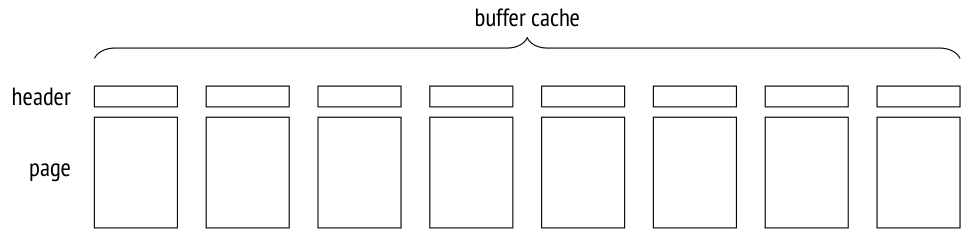
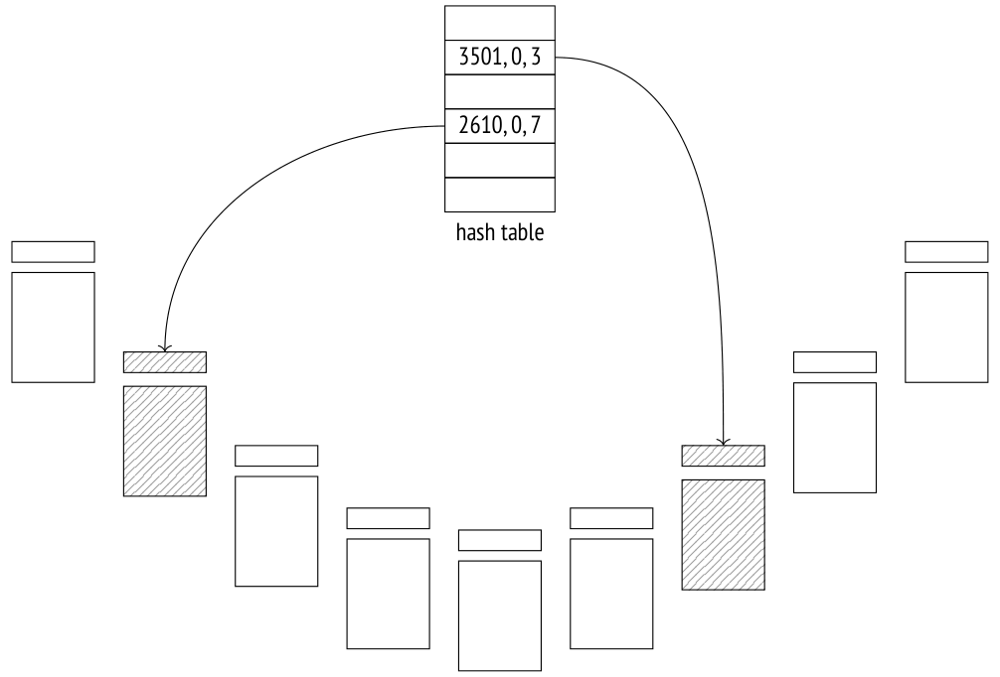
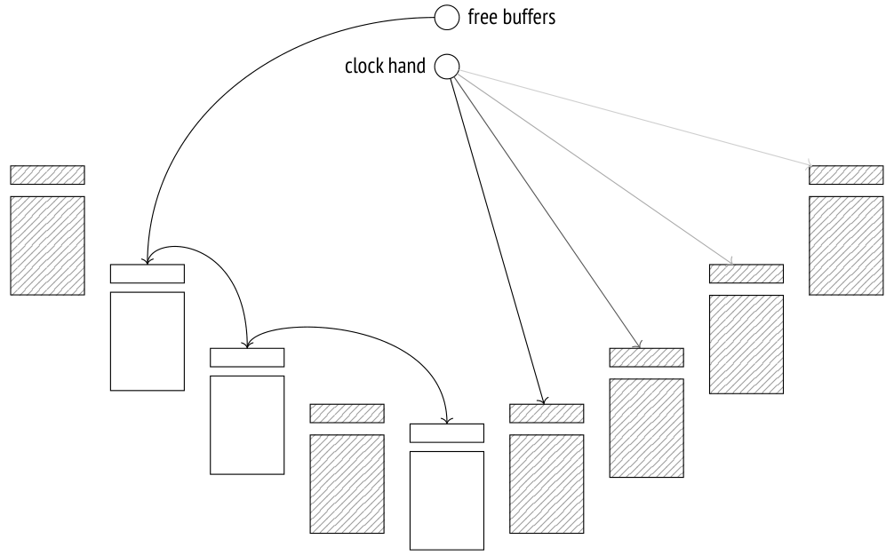

# Chương 9. Buffer Cache (Bộ đệm dữ liệu)

## 9.1 Caching (Bộ nhớ đệm)

Trong các hệ thống máy tính hiện đại, caching (lưu đệm) có mặt ở khắp nơi — cả ở mức phần cứng lẫn phần mềm. Riêng bộ xử lý đã có thể có tới ba hoặc bốn cấp cache. Các bộ điều khiển RAID và đĩa cũng bổ sung cache riêng của chúng.

Caching được dùng để san bằng chênh lệch hiệu năng giữa các loại bộ nhớ nhanh và chậm. Bộ nhớ nhanh thì đắt và có dung lượng nhỏ hơn, còn bộ nhớ chậm thì lớn hơn và rẻ hơn. Vì vậy, bộ nhớ nhanh không thể chứa *toàn bộ* dữ liệu được lưu trong bộ nhớ chậm. Nhưng trong hầu hết các trường hợp, tại mỗi thời điểm cụ thể chỉ có một phần *nhỏ* dữ liệu đang được sử dụng tích cực, vì thế việc cấp phát một ít bộ nhớ nhanh làm *cache* để giữ dữ liệu nóng có thể giảm đáng kể chi phí phụ trội do truy cập bộ nhớ chậm gây ra.

Trong PostgreSQL, buffer cache[^1] chứa các page của relation, nhờ đó cân bằng thời gian truy cập giữa đĩa (mili giây) và RAM (nano giây).

Hệ điều hành có cache riêng phục vụ cùng mục đích đó. Vì lý do này, các hệ quản trị cơ sở dữ liệu thường được thiết kế để tránh caching kép: dữ liệu lưu trên đĩa thường được truy vấn trực tiếp, bỏ qua cache của hệ điều hành. Nhưng PostgreSQL dùng một cách tiếp cận khác: nó đọc và ghi mọi dữ liệu thông qua các thao tác file có bộ đệm (buffered).

> Có thể tránh caching kép nếu bạn áp dụng direct I/O. Điều đó sẽ giảm chi phí phụ trội, vì PostgreSQL sẽ dùng truy cập bộ nhớ trực tiếp (DMA) thay vì sao chép các page đã đệm vào không gian địa chỉ của hệ điều hành; ngoài ra, bạn sẽ có quyền kiểm soát ngay lập tức đối với các thao tác ghi vật lý xuống đĩa. Tuy nhiên, direct I/O không hỗ trợ việc đọc trước (prefetching) dữ liệu vốn có được nhờ cơ chế đệm, nên bạn phải hiện thực nó riêng thông qua I/O bất đồng bộ, việc này đòi hỏi sửa đổi mã rất lớn trong lõi PostgreSQL, cũng như phải *[→ tr. 341](20-index-scans.md)* xử lý sự không tương thích giữa các hệ điều hành khi nói đến hỗ trợ direct I/O và I/O bất đồng bộ. Nhưng một khi cơ chế giao tiếp bất đồng bộ đã được thiết lập, bạn có thể tận hưởng thêm lợi ích của việc truy cập đĩa không phải chờ.

> Cộng đồng PostgreSQL đã bắt đầu nỗ lực lớn này,[^2] nhưng sẽ còn lâu nữa mới có kết quả thực tế.

## 9.2 Thiết kế buffer cache (Buffer Cache Design)

Buffer cache nằm trong shared memory của server, nơi mọi tiến trình đều có thể truy cập. Nó chiếm phần lớn shared memory và chắc chắn là một trong những cấu trúc dữ liệu quan trọng và phức tạp nhất trong PostgreSQL. Hiểu cách cache hoạt động là điều quan trọng tự thân nó, nhưng càng quan trọng hơn vì nhiều cấu trúc khác (chẳng hạn subtransaction, trạng thái transaction trong CLOG, và các bản ghi WAL) cũng dùng một cơ chế caching tương tự, dù đơn giản hơn.

Tên của cache này bắt nguồn từ cấu trúc bên trong của nó, vì nó bao gồm một mảng các *buffer*. Mỗi buffer dành riêng một vùng bộ nhớ có thể chứa đúng một page dữ liệu cùng với header của nó.[^3]



Header chứa một số thông tin về buffer và page nằm trong nó, chẳng hạn như:

- vị trí vật lý của page (ID của file, fork, và số block trong fork)

- thuộc tính cho biết dữ liệu trong page đã bị sửa đổi và sớm hay muộn phải được ghi ngược lại xuống đĩa (một page như vậy được gọi là *dirty* (bẩn))

- số lần sử dụng (usage count) của buffer

- số lần pin (pin count, hay reference count)

Để truy cập một page dữ liệu của relation, một tiến trình yêu cầu page đó từ buffer manager[^4] và nhận về ID của buffer chứa page này. Sau đó nó đọc dữ liệu đã được cache và sửa đổi ngay trong cache nếu cần. Trong khi page đang được sử dụng, buffer của nó được *pin* (ghim). Pin ngăn không cho page đã cache bị eviction (loại bỏ khỏi cache) và có thể được áp dụng cùng với các lock khác. Mỗi lần pin cũng làm tăng usage count. *[→ tr. 241](15-locks-on-memory-structures.md)*

Chừng nào page còn nằm trong cache, việc sử dụng nó không gây ra bất kỳ thao tác file nào.

Chúng ta có thể khám phá buffer cache bằng extension `pg_buffercache`:

```
=> CREATE EXTENSION pg_buffercache;
```

Hãy tạo một bảng và chèn một dòng:

```
=> CREATE TABLE cacheme(
  id integer
) WITH (autovacuum_enabled = off);
=> INSERT INTO cacheme VALUES (1);
```

Bây giờ buffer cache chứa một heap page với dòng vừa được chèn. Bạn có thể tự mình thấy điều đó bằng cách chọn tất cả các buffer liên quan đến một bảng cụ thể. Chúng ta sẽ còn cần đến truy vấn như vậy, nên hãy gói nó vào một hàm:

```
=> CREATE FUNCTION buffercache(rel regclass)
RETURNS TABLE(
  bufferid integer, relfork text, relblk bigint,
  isdirty boolean, usagecount smallint, pins integer
) AS $$
SELECT bufferid,
  CASE relforknumber
    WHEN 0 THEN 'main'
    WHEN 1 THEN 'fsm'
    WHEN 2 THEN 'vm'
  END,
  relblocknumber,
  isdirty,
  usagecount,
  pinning_backends
FROM pg_buffercache
WHERE relfilenode = pg_relation_filenode(rel)
ORDER BY relforknumber, relblocknumber;
$$ LANGUAGE sql;
=> SELECT * FROM buffercache('cacheme');
 bufferid | relfork | relblk | isdirty | usagecount | pins
----------+---------+--------+---------+------------+------
      268 | main    |     0 | t       |          1 |    0
(1 row)
```

Page này là dirty: nó đã bị sửa đổi nhưng chưa được ghi xuống đĩa. Usage count của nó được đặt bằng một.

## 9.3 Cache hit (Cache Hits)

Khi buffer manager cần đọc một page,[^5] trước tiên nó kiểm tra buffer cache.

Tất cả ID của buffer được lưu trong một hash table (bảng băm),[^6] dùng để tăng tốc việc tìm kiếm chúng.

> Nhiều ngôn ngữ lập trình hiện đại có hash table là một trong các kiểu dữ liệu cơ bản. Hash table thường được gọi là mảng kết hợp (associative array), và thực vậy, từ góc nhìn của người dùng, chúng trông giống như một mảng; tuy nhiên, chỉ số của chúng (một *hash key*) có thể thuộc bất kỳ kiểu dữ liệu nào, chẳng hạn một chuỗi văn bản thay vì một số nguyên.

> Mặc dù miền giá trị khả dĩ của khóa có thể khá lớn, hash table không bao giờ chứa nhiều giá trị khác nhau đến vậy cùng một lúc. Ý tưởng của hashing là chuyển một giá trị khóa thành một số nguyên bằng một *hash function* (hàm băm). Số này (hoặc một vài bit của nó) được dùng làm chỉ số của một mảng thông thường. Các phần tử của mảng này được gọi là *hash table bucket*.

> Một hàm băm tốt sẽ phân bố các hash key giữa các bucket ít nhiều đồng đều, nhưng nó vẫn có thể gán cùng một số cho các khóa khác nhau, do đó đặt chúng vào cùng một bucket; hiện tượng này được gọi là *collision* (xung đột). Vì lý do đó, các giá trị được lưu trong bucket cùng với hash key; để truy cập một giá trị đã băm theo khóa của nó, PostgreSQL phải kiểm tra tất cả các khóa trong bucket.

Có nhiều cách hiện thực hash table; trong tất cả các lựa chọn khả dĩ, buffer cache dùng bảng mở rộng được (extendible table), giải quyết xung đột băm bằng cách xâu chuỗi (chaining).[^7]

Một hash key gồm ID của file relation, loại fork, và ID của page trong file của fork này. Như vậy, khi biết page, PostgreSQL có thể nhanh chóng tìm ra buffer chứa page này hoặc chắc chắn rằng page hiện không nằm trong cache.



> Hiện thực buffer cache từ lâu đã bị chỉ trích vì dựa vào hash table: cấu trúc này vô dụng khi cần tìm tất cả các buffer đang bị chiếm bởi các page của một relation cụ thể, điều cần thiết để xóa page khỏi cache khi chạy các lệnh DROP và TRUNCATE hoặc khi cắt ngắn bảng trong lúc vacuum.[^8] Tuy vậy, cho đến nay vẫn chưa ai đề xuất được giải pháp thay thế thỏa đáng.

Nếu hash table chứa ID của buffer cần tìm, buffer manager sẽ pin buffer này và trả ID của nó cho tiến trình. Khi đó tiến trình này có thể bắt đầu dùng page đã cache mà không phát sinh bất kỳ lưu lượng I/O nào.

Để pin một buffer, PostgreSQL phải tăng bộ đếm pin trong header của nó; một buffer có thể được nhiều tiến trình pin cùng lúc. Chừng nào bộ đếm pin còn lớn hơn không, buffer được coi là đang được sử dụng, và không cho phép thay đổi căn bản nào đối với nội dung của nó. Ví dụ, một tuple mới có thể xuất hiện (nó sẽ vô hình theo các quy tắc visibility), nhưng bản thân page thì không thể bị thay thế.

Khi chạy với các tùy chọn `analyze` và `buffers`, lệnh `EXPLAIN` thực thi kế hoạch truy vấn được hiển thị và cho biết số buffer đã sử dụng:

```
=> EXPLAIN (analyze, buffers, costs off, timing off, summary off)
  SELECT * FROM cacheme;
                 QUERY PLAN
---------------------------------------------
 Seq Scan on cacheme (actual rows=1 loops=1)
   Buffers: shared hit=1
 Planning:
   Buffers: shared hit=12 read=7
(4 rows)
```

Ở đây `hit=1` có nghĩa là page duy nhất cần đọc đã được tìm thấy trong cache.

Việc pin buffer làm tăng usage count thêm một:

```
=> SELECT * FROM buffercache('cacheme');
 bufferid | relfork | relblk | isdirty | usagecount | pins
----------+---------+--------+---------+------------+------
      268 | main    |     0 | t       |          2 |    0
(1 row)
```

Để quan sát việc pin trong khi thực thi truy vấn, hãy mở một cursor — nó sẽ giữ pin trên buffer, vì nó phải cung cấp truy cập nhanh tới dòng tiếp theo trong tập kết quả:

```
=> BEGIN;
=> DECLARE c CURSOR FOR SELECT * FROM cacheme;
=> FETCH c;
 id
----
  1
(1 row)
=> SELECT * FROM buffercache('cacheme');
 bufferid | relfork | relblk | isdirty | usagecount | pins
----------+---------+--------+---------+------------+------
      268 | main    |     0 | t       |          3 |    1
(1 row)
```

Nếu một tiến trình không thể dùng một buffer đang bị pin, thường nó sẽ bỏ qua buffer đó và đơn giản là chọn buffer khác. Chúng ta có thể thấy điều này khi vacuum bảng:

> ```
> => VACUUM VERBOSE cacheme;
> INFO:  vacuuming "public.cacheme"
> INFO:  table "cacheme": found 0 removable, 0 nonremovable row
> versions in 1 out of 1 pages
> DETAIL:  0 dead row versions cannot be removed yet, oldest xmin:
> 877
> Skipped 1 page due to buffer pins, 0 frozen pages.
> CPU: user: 0.00 s, system: 0.00 s, elapsed: 0.00 s.
> VACUUM
> ```

Page đã bị bỏ qua vì các tuple của nó không thể bị xóa vật lý khỏi buffer đang bị pin.

Nhưng nếu chính buffer này là thứ cần thiết, tiến trình sẽ vào hàng đợi và chờ để có được quyền truy cập độc quyền vào buffer này. Một ví dụ về thao tác như vậy là vacuum kèm freezing.[^9] *[→ tr. 123](07-freezing.md)*

Khi cursor đóng lại hoặc chuyển sang page khác, buffer sẽ được bỏ pin (unpin). Trong ví dụ này, điều đó xảy ra ở cuối transaction:

```
=> COMMIT;
=> SELECT * FROM buffercache('cacheme');
 bufferid | relfork | relblk | isdirty | usagecount | pins
----------+---------+--------+---------+------------+------
      268 | main    |     0 | t       |          3 |    0
      310 | vm      |     0 | f       |          2 |    0
(2 rows)
```

Việc sửa đổi page cũng được bảo vệ bằng chính cơ chế pin này. Ví dụ, hãy chèn thêm một dòng nữa vào bảng (nó sẽ nằm trong cùng page):

```
=> INSERT INTO cacheme VALUES (2);
=> SELECT * FROM buffercache('cacheme');
 bufferid | relfork | relblk | isdirty | usagecount | pins
----------+---------+--------+---------+------------+------
      268 | main    |     0 | t       |          4 |    0
      310 | vm      |     0 | f       |          2 |    0
(2 rows)
```

PostgreSQL không thực hiện bất kỳ thao tác ghi tức thời nào xuống đĩa: một page vẫn ở trạng thái dirty trong buffer cache một thời gian, mang lại một số lợi ích hiệu năng cho cả việc đọc lẫn ghi.

## 9.4 Cache miss (Cache Misses)

Nếu hash table không có mục nào liên quan đến page được truy vấn, điều đó có nghĩa là page này không nằm trong cache. Trong trường hợp này, một buffer mới được cấp (và lập tức được pin), page được đọc vào buffer này, và các tham chiếu trong hash table được sửa đổi tương ứng.

Hãy khởi động lại instance để xóa sạch buffer cache của nó:

```
postgres$ pg_ctl restart -l /home/postgres/logfile
```

Một lần thử đọc page sẽ dẫn đến cache miss, và page sẽ được nạp vào một buffer mới:

```
=> EXPLAIN (analyze, buffers, costs off, timing off, summary off)
  SELECT * FROM cacheme;
                 QUERY PLAN
---------------------------------------------
 Seq Scan on cacheme (actual rows=2 loops=1)
   Buffers: shared read=1 dirtied=1
 Planning:
   Buffers: shared hit=15 read=7
(4 rows)
```

Thay vì `hit`, giờ đây kế hoạch hiển thị trạng thái `read`, biểu thị một cache miss. Ngoài ra, page này đã trở thành dirty, vì truy vấn đã sửa đổi một số hint bit. *[→ tr. 71](03-pages-and-tuples.md)*

Truy vấn buffer cache cho thấy usage count của page vừa được thêm vào được đặt bằng một:

```
=> SELECT * FROM buffercache('cacheme');
 bufferid | relfork | relblk | isdirty | usagecount | pins
----------+---------+--------+---------+------------+------
       98 | main    |     0 | t       |          1 |    0
(1 row)
```

View `pg_statio_all_tables` chứa thống kê đầy đủ về việc sử dụng buffer cache theo bảng:

```
=> SELECT heap_blks_read, heap_blks_hit
FROM pg_statio_all_tables
WHERE relname = 'cacheme';
 heap_blks_read | heap_blks_hit
----------------+---------------
              2 |            5
(1 row)
```

PostgreSQL cung cấp các view tương tự cho index và sequence. Chúng cũng có thể hiển thị thống kê về các thao tác I/O, nhưng chỉ khi *track_io_timing* được bật. *(mặc định: off)*

### Tìm kiếm buffer và eviction (Buffer Search and Eviction)

Việc chọn một buffer cho page không hề đơn giản.[^10] Có hai kịch bản khả dĩ:

1. Ngay sau khi server khởi động, tất cả các buffer đều trống và được liên kết thành một danh sách.

Trong khi vẫn còn một số buffer trống, page tiếp theo được đọc từ đĩa sẽ chiếm buffer đầu tiên, và buffer này sẽ bị gỡ khỏi danh sách.

Một buffer chỉ có thể quay lại danh sách[^11] nếu page của nó biến mất mà không bị thay thế bởi page khác. Điều này có thể xảy ra nếu bạn gọi các lệnh `DROP` hoặc `TRUNCATE`, hoặc nếu bảng bị cắt ngắn trong lúc vacuum.

2. Sớm hay muộn sẽ không còn buffer trống nào (vì kích thước cơ sở dữ liệu thường lớn hơn vùng bộ nhớ được cấp cho cache). Khi đó buffer manager sẽ phải chọn một trong các buffer đang được sử dụng và evict (đẩy ra) page đã cache khỏi buffer này. Việc này được thực hiện bằng thuật toán clock sweep, vốn được minh họa rất rõ bằng phép ẩn dụ chiếc đồng hồ. Trỏ vào một trong các buffer, kim đồng hồ bắt đầu quay vòng quanh buffer cache và giảm usage count của mỗi page đã cache đi một khi đi qua. Buffer không bị pin đầu tiên có bộ đếm bằng không mà kim đồng hồ tìm thấy sẽ được giải phóng.

Như vậy, usage count được tăng mỗi khi buffer được truy cập (tức là được pin), và bị giảm khi buffer manager tìm kiếm page để evict. Kết quả là các page ít được sử dụng gần đây nhất sẽ bị evict trước, trong khi những page được truy cập thường xuyên hơn sẽ ở lại trong cache lâu hơn.

Như bạn có thể đoán, nếu tất cả các buffer đều có usage count khác không, kim đồng hồ phải quay hơn một vòng trọn vẹn trước khi bất kỳ buffer nào cuối cùng đạt đến giá trị không. Để tránh phải chạy nhiều vòng, PostgreSQL giới hạn usage count ở mức 5.

Khi đã tìm được buffer để evict, tham chiếu tới page vẫn còn nằm trong buffer này phải được xóa khỏi hash table.

Nhưng nếu buffer này là dirty, tức là nó chứa một số dữ liệu đã bị sửa đổi, thì page cũ không thể *[→ tr. 176](10-write-ahead-log.md)* đơn giản bị vứt bỏ — buffer manager phải ghi nó xuống đĩa trước.



Sau đó buffer manager đọc page mới vào buffer đã tìm được — bất kể buffer đó phải được giải phóng hay vốn đã trống. Nó dùng I/O có bộ đệm cho mục đích này, nên page sẽ chỉ được đọc từ đĩa nếu hệ điều hành không tìm thấy nó trong cache riêng của mình.

> Những hệ quản trị cơ sở dữ liệu dùng direct I/O và không phụ thuộc vào cache của hệ điều hành phân biệt giữa đọc logic (từ RAM, tức là từ buffer cache) và đọc vật lý (từ đĩa). Từ góc nhìn của PostgreSQL, một page có thể hoặc được đọc từ buffer cache, hoặc được yêu cầu từ hệ điều hành, nhưng trong trường hợp sau thì không có cách nào biết được nó được tìm thấy trong RAM hay được đọc từ đĩa.

Hash table được cập nhật để tham chiếu tới page mới, và buffer được pin. Usage count của nó được tăng và giờ bằng một, điều này cho buffer một khoảng thời gian để tăng giá trị này trong khi kim đồng hồ đang duyệt qua buffer cache.

## 9.5 Eviction hàng loạt (Bulk Eviction)

Nếu thực hiện đọc hoặc ghi hàng loạt, có nguy cơ dữ liệu chỉ dùng một lần sẽ nhanh chóng đẩy các page hữu ích ra khỏi buffer cache.

Để phòng ngừa, các thao tác hàng loạt sử dụng các *buffer ring* khá nhỏ, và eviction được thực hiện trong phạm vi của chúng, không ảnh hưởng đến các buffer khác.

> Bên cạnh “buffer ring”, mã nguồn còn dùng thuật ngữ “ring buffer”. Tuy nhiên, từ đồng nghĩa này khá mơ hồ vì bản thân ring buffer gồm nhiều buffer (thuộc về buffer cache). Về mặt này, thuật ngữ “buffer ring” chính xác hơn.

Một buffer ring có kích thước xác định gồm một mảng các buffer được dùng lần lượt cái này sau cái kia. Lúc đầu, buffer ring trống, và từng buffer lần lượt gia nhập vào nó sau khi được chọn từ buffer cache theo cách thông thường. Sau đó eviction mới phát huy tác dụng, nhưng chỉ trong giới hạn của ring.[^12]

Các buffer được thêm vào ring không bị loại khỏi buffer cache và vẫn có thể được các thao tác khác sử dụng. Vì vậy, nếu buffer cần tái sử dụng hóa ra đang bị pin, hoặc usage count của nó lớn hơn một, nó sẽ đơn giản bị tách khỏi ring và được thay thế bằng buffer khác.

PostgreSQL hỗ trợ ba chiến lược eviction.

**Bulk reads strategy** (chiến lược đọc hàng loạt) được dùng cho sequential scan các bảng lớn nếu kích thước của chúng vượt quá 1/4 buffer cache. *[→ tr. 296](18-table-access-methods.md)* Ring buffer chiếm 256 kB (32 page chuẩn).

Chiến lược này không cho phép ghi các dirty page xuống đĩa để giải phóng một buffer; thay vào đó, buffer bị loại khỏi ring và được thay bằng buffer khác. Kết quả là việc đọc không phải chờ việc ghi hoàn tất, nên được thực hiện nhanh hơn.

Nếu hóa ra bảng đang được quét, tiến trình bắt đầu một lần quét khác sẽ tham gia vào buffer ring hiện có và có được quyền truy cập tới dữ liệu hiện đang có sẵn, mà không phát sinh thêm thao tác I/O.[^13] Khi tiến trình thứ nhất hoàn tất việc quét, tiến trình thứ hai quay lại phần bảng đã bị bỏ qua.

**Bulk writes strategy** (chiến lược ghi hàng loạt) được áp dụng bởi các lệnh `COPY FROM`, `CREATE TABLE AS SELECT`, và `CREATE MATERIALIZED VIEW`, cũng như bởi những biến thể `ALTER TABLE` gây ra việc ghi lại bảng. Ring được cấp phát khá lớn, kích thước mặc định là 16 MB (2048 page chuẩn), nhưng không bao giờ vượt quá 1/8 tổng kích thước buffer cache.

**Vacuuming strategy** (chiến lược vacuum) được tiến trình vacuum sử dụng khi nó thực hiện quét toàn bộ bảng mà không tính đến visibility map. Ring buffer được cấp 256 kB RAM (32 page chuẩn).

Buffer ring không phải lúc nào cũng ngăn được eviction không mong muốn. Nếu các lệnh `UPDATE` hoặc `DELETE` tác động tới nhiều dòng, việc quét bảng được thực hiện sẽ áp dụng bulk reads strategy, nhưng vì các page liên tục bị sửa đổi, buffer ring gần như trở nên vô dụng.

Một ví dụ khác đáng nhắc tới là việc lưu trữ dữ liệu quá khổ trong các bảng TOAST. Mặc dù *[→ tr. 28](01-introduction.md)* khối lượng dữ liệu cần đọc có thể lớn, các giá trị đã toast luôn được truy cập thông qua index, nên chúng đi vòng qua buffer ring.

Hãy xem xét kỹ hơn bulk reads strategy. Để đơn giản, chúng ta sẽ tạo một bảng sao cho mỗi dòng được chèn chiếm trọn một page. Theo mặc định, kích thước buffer cache là 16.384 page, mỗi page 8 kB. Vì vậy bảng phải chiếm hơn 4096 page thì việc quét mới dùng buffer ring.

```
=> CREATE TABLE big(
  id integer PRIMARY KEY GENERATED ALWAYS AS IDENTITY,
  s char(1000)
) WITH (fillfactor = 10);
=> INSERT INTO big(s)
  SELECT 'FOO' FROM generate_series(1,4096+1);
```

Hãy phân tích (analyze) bảng:

```
=> ANALYZE big;
=> SELECT relname, relfilenode, relpages
FROM pg_class
WHERE relname IN ('big', 'big_pkey');
 relname  | relfilenode | relpages
----------+-------------+----------
 big      |       16546 |    4097
 big_pkey |       16551 |      14
(2 rows)
```

Khởi động lại server để xóa sạch cache, vì hiện giờ nó chứa một số heap page đã được đọc trong lúc phân tích.

```
postgres$ pg_ctl restart -l /home/postgres/logfile
```

Khi server đã khởi động lại, hãy đọc toàn bộ bảng:

```
=> EXPLAIN (analyze, costs off, timing off, summary off)
SELECT id FROM big;
                 QUERY PLAN
--------------------------------------------
 Seq Scan on big (actual rows=4097 loops=1)
(1 row)
```

Các heap page chỉ chiếm 32 buffer, tạo thành buffer ring cho thao tác này:

```
=> SELECT count(*) FROM pg_buffercache
WHERE relfilenode = pg_relation_filenode('big'::regclass);
 count
-------
    32
(1 row)
```

Nhưng trong trường hợp index scan thì buffer ring không được sử dụng:

```
=> EXPLAIN (analyze, costs off, timing off, summary off)
SELECT * FROM big ORDER BY id;
                        QUERY PLAN
-------------------------------------------------------------
 Index Scan using big_pkey on big (actual rows=4097 loops=1)
(1 row)
```

Kết quả là buffer cache rốt cuộc chứa toàn bộ bảng và toàn bộ index:

```
=> SELECT relfilenode, count(*)
FROM pg_buffercache
WHERE relfilenode IN (
  pg_relation_filenode('big'),
  pg_relation_filenode('big_pkey')
)
GROUP BY relfilenode;
 relfilenode | count
-------------+-------
       16546 |  4097
       16551 |    14
(2 rows)
```

## 9.6 Chọn kích thước buffer cache (Choosing the Buffer Cache Size)

Kích thước của buffer cache được xác định bởi tham số *shared_buffers*. Giá trị mặc định của nó *(mặc định: 128MB)* được biết là thấp, vì vậy nên tăng nó ngay sau khi cài đặt PostgreSQL.

Trong trường hợp này bạn sẽ phải khởi động lại server vì shared memory được cấp phát cho cache khi server khởi động.

Nhưng làm thế nào để xác định một giá trị phù hợp?

Ngay cả một cơ sở dữ liệu rất lớn cũng chỉ có một tập hữu hạn dữ liệu nóng được sử dụng đồng thời. Trong một thế giới lý tưởng, chính tập này phải vừa với buffer cache (cùng với một ít không gian dự phòng cho dữ liệu dùng một lần). Nếu kích thước cache nhỏ hơn, các page được sử dụng tích cực sẽ liên tục evict lẫn nhau, dẫn đến quá nhiều thao tác I/O. Nhưng tăng kích thước cache một cách thiếu suy nghĩ cũng không phải là ý hay: RAM là tài nguyên khan hiếm, và ngoài ra, cache lớn hơn sẽ kéo theo chi phí bảo trì cao hơn.

Kích thước buffer cache tối ưu khác nhau giữa các hệ thống: nó phụ thuộc vào những yếu tố như tổng dung lượng bộ nhớ khả dụng, đặc điểm dữ liệu và loại tải công việc. Đáng tiếc là không có giá trị hay công thức kỳ diệu nào phù hợp tốt như nhau cho tất cả mọi người.

Bạn cũng nên ghi nhớ rằng một cache miss trong PostgreSQL không nhất thiết kích hoạt một thao tác I/O vật lý. Nếu buffer cache khá nhỏ, cache của hệ điều hành sẽ dùng phần bộ nhớ trống còn lại và có thể làm dịu tình hình ở một mức độ nào đó. Nhưng khác với cơ sở dữ liệu, hệ điều hành không biết gì về dữ liệu được đọc, nên nó áp dụng một chiến lược eviction khác.

Một khuyến nghị điển hình là bắt đầu với 1/4 RAM rồi điều chỉnh thiết lập này khi cần.

Cách tiếp cận tốt nhất là thử nghiệm: bạn có thể tăng hoặc giảm kích thước cache và so sánh hiệu năng của hệ thống. Đương nhiên, điều đó đòi hỏi phải có một hệ thống thử nghiệm hoàn toàn tương tự hệ thống production, và bạn phải có khả năng tái tạo các tải công việc điển hình.

Bạn cũng có thể thực hiện một số phân tích bằng extension `pg_buffercache`. Ví dụ, khảo sát sự phân bố buffer theo mức độ sử dụng của chúng:

```
=> SELECT usagecount, count(*)
FROM pg_buffercache
GROUP BY usagecount
ORDER BY usagecount;
 usagecount | count
------------+-------
          1 |  4128
          2 |    50
          3 |     4
          4 |     4
          5 |    73
            | 12125
(6 rows)
```

Các giá trị usage count NULL tương ứng với các buffer trống. Chúng hoàn toàn có thể dự đoán được trong trường hợp này vì server vừa được khởi động lại và phần lớn thời gian ở trạng thái rảnh. Đa số các buffer đã dùng chứa page của các bảng system catalog được backend đọc để lấp đầy system catalog cache của nó và để thực hiện truy vấn.

Chúng ta có thể kiểm tra phần nào của mỗi relation đang được cache, và liệu dữ liệu này có nóng hay không (ở đây một page được coi là nóng nếu usage count của nó lớn hơn một):

```
=> SELECT c.relname,
  count(*) blocks,
  round( 100.0 * 8192 * count(*) /
    pg_table_size(c.oid) ) AS "% of rel",
  round( 100.0 * 8192 * count(*) FILTER (WHERE b.usagecount > 1) /
    pg_table_size(c.oid) ) AS "% hot"
FROM pg_buffercache b
  JOIN pg_class c ON pg_relation_filenode(c.oid) = b.relfilenode
WHERE b.reldatabase IN (
  0, -- cluster-wide objects
  (SELECT oid FROM pg_database WHERE datname = current_database())
)
AND b.usagecount IS NOT NULL
GROUP BY c.relname, c.oid
ORDER BY 2 DESC
LIMIT 10;
             relname            | blocks | % of rel | % hot
---------------------------------+--------+----------+-------
 big                            |   4097 |      100 |     1
 pg_attribute                   |     30 |       48 |    47
 big_pkey                       |     14 |      100 |     0
 pg_proc                        |     13 |       12 |     6
 pg_operator                    |     11 |       61 |    50
 pg_class                       |     10 |       59 |    59
 pg_proc_oid_index              |      9 |       82 |    45
 pg_attribute_relid_attnum_index |     8 |       73 |    64
 pg_proc_proname_args_nsp_index |      6 |       18 |     6
 pg_amproc                      |      5 |       56 |    56
(10 rows)
```

Ví dụ này cho thấy bảng `big` và index của nó được cache hoàn toàn, nhưng các page của chúng không được sử dụng tích cực.

Phân tích dữ liệu từ nhiều góc độ khác nhau, bạn có thể thu được một số hiểu biết hữu ích. Tuy nhiên, hãy đảm bảo tuân theo các quy tắc đơn giản sau khi chạy các truy vấn `pg_buffercache`:

- Lặp lại các truy vấn như vậy vài lần vì các con số trả về sẽ thay đổi ở một mức độ nào đó.

- Đừng chạy các truy vấn như vậy liên tục vì extension `pg_buffercache` lock các buffer đang được xem, dù chỉ trong thời gian ngắn.

## 9.7 Làm nóng cache (Cache Warming)

Sau khi server khởi động lại, cache cần một thời gian để làm nóng, tức là để tích lũy dữ liệu được sử dụng tích cực. Việc cache một số bảng nhất định ngay lập tức có thể hữu ích, và extension `pg_prewarm` phục vụ chính mục đích này:

```
=> CREATE EXTENSION pg_prewarm;
```

Ngoài việc nạp bảng vào buffer cache (hoặc chỉ vào cache của hệ điều hành), extension này có thể ghi trạng thái cache hiện tại xuống đĩa rồi khôi phục nó sau khi server khởi động lại. *(v. 11)* Để bật tính năng này, bạn phải thêm thư viện của extension vào *shared_preload_libraries* và khởi động lại server:

```
=> ALTER SYSTEM SET shared_preload_libraries = 'pg_prewarm';
```

```
postgres$ pg_ctl restart -l /home/postgres/logfile
```

Nếu thiết lập *pg_prewarm.autoprewarm* chưa bị thay đổi, một tiến trình tên là `autoprewarm` `leader` sẽ được tự động khởi chạy sau khi server được khởi động lại; *(mặc định: on)* tiến trình này sẽ ghi danh sách các page đã cache xuống đĩa mỗi *pg_prewarm.autoprewarm_interval* giây một lần *(mặc định: 300s)* (sử dụng một trong các slot *max_parallel_processes*).

```
postgres$ ps -o pid,command \
--ppid `head -n 1 /usr/local/pgsql/data/postmaster.pid` | \
grep prewarm
  23124 postgres: autoprewarm leader
```

Giờ server đã được khởi động lại, bảng `big` không còn nằm trong cache nữa:

```
=> SELECT count(*)
FROM pg_buffercache
WHERE relfilenode = pg_relation_filenode('big'::regclass);
 count
-------
     0
(1 row)
```

Nếu bạn có cơ sở vững chắc để cho rằng toàn bộ bảng sẽ được sử dụng tích cực và việc truy cập đĩa sẽ khiến thời gian phản hồi cao đến mức không chấp nhận được, bạn có thể nạp trước bảng này vào buffer cache:

```
=> SELECT pg_prewarm('big');
 pg_prewarm
------------
       4097
(1 row)
```

```
=> SELECT count(*)
FROM pg_buffercache
WHERE relfilenode = pg_relation_filenode('big'::regclass);
 count
-------
  4097
(1 row)
```

Danh sách các page được dump vào file `PGDATA/autoprewarm.blocks`. Bạn có thể đợi cho đến khi `autoprewarm leader` hoàn tất lần đầu tiên, nhưng chúng ta sẽ khởi tạo việc dump thủ công:

```
=> SELECT autoprewarm_dump_now();
 autoprewarm_dump_now
----------------------
                 4224
(1 row)
```

Số page được ghi ra lớn hơn 4097 vì tất cả các buffer đang được sử dụng đều được tính đến. File được ghi ở định dạng văn bản; nó chứa ID của cơ sở dữ liệu, tablespace và file, cũng như số hiệu fork và segment:

```
postgres$ head -n 10 /usr/local/pgsql/data/autoprewarm.blocks
<<4224>>
0,1664,1262,0,0
0,1664,1260,0,0
16391,1663,1259,0,0
16391,1663,1259,0,1
16391,1663,1259,0,2
16391,1663,1259,0,3
16391,1663,1249,0,0
16391,1663,1249,0,1
16391,1663,1249,0,2
```

Hãy khởi động lại server một lần nữa.

```
postgres$ pg_ctl restart -l /home/postgres/logfile
```

Bảng xuất hiện trong cache ngay lập tức:

```
=> SELECT count(*)
FROM pg_buffercache
WHERE relfilenode = pg_relation_filenode('big'::regclass);
 count
-------
  4097
(1 row)
```

Lại chính `autoprewarm leader` làm mọi công việc chuẩn bị: nó đọc file, sắp xếp các page theo cơ sở dữ liệu, sắp xếp lại chúng (để việc đọc đĩa diễn ra tuần tự nếu có thể), rồi chuyển chúng cho `autoprewarm worker` xử lý.

## 9.8 Cache cục bộ (Local Cache)

Các bảng tạm (temporary table) không tuân theo quy trình mô tả ở trên. Vì dữ liệu tạm chỉ hiển thị với một tiến trình duy nhất, không có lý do gì để nạp nó vào buffer cache dùng chung. Do đó, dữ liệu tạm dùng cache cục bộ của tiến trình sở hữu bảng.[^14]

Nhìn chung, local buffer cache hoạt động tương tự như cache dùng chung:

- Việc tìm kiếm page được thực hiện thông qua hash table.

- Eviction tuân theo thuật toán tiêu chuẩn (ngoại trừ việc không dùng buffer ring).

- Page có thể được pin để tránh bị evict.

Tuy nhiên, hiện thực cache cục bộ đơn giản hơn nhiều vì nó không phải xử lý lock trên các cấu trúc bộ nhớ (buffer chỉ có thể được truy cập bởi một tiến trình duy nhất) *[→ tr. 241](15-locks-on-memory-structures.md)* lẫn khả năng chịu lỗi (dữ liệu tạm tồn tại nhiều nhất là đến cuối session). *[→ tr. 164](10-write-ahead-log.md)*

Vì thường chỉ có ít session dùng bảng tạm, bộ nhớ cache cục bộ được cấp phát theo nhu cầu. Kích thước tối đa của cache cục bộ dành cho một session bị giới hạn bởi tham số *temp_buffers*. *(mặc định: 8MB)*

> Dù có tên tương tự, tham số *temp_file_limit* không liên quan gì đến bảng tạm; nó liên quan đến các file có thể được tạo ra trong khi thực thi truy vấn để lưu tạm dữ liệu trung gian.

Trong kết quả của lệnh `EXPLAIN`, mọi lời gọi tới local buffer cache được gắn nhãn `local` thay vì `shared`:

```
=> CREATE TEMPORARY TABLE tmp AS SELECT 1;
=> EXPLAIN (analyze, buffers, costs off, timing off, summary off)
  SELECT * FROM tmp;
               QUERY PLAN
-----------------------------------------
 Seq Scan on tmp (actual rows=1 loops=1)
   Buffers: local hit=1
 Planning:
   Buffers: shared hit=12 read=7
(4 rows)
```

[^1]: backend/storage/buffer/README
[^2]: www.postgresql.org/message-id/flat/20210223100344.llw5an2aklengrmn%40alap3.anarazel.de
[^3]: include/storage/buf_internals.h
[^4]: backend/storage/buffer/bufmgr.c
[^5]: backend/storage/buffer/bufmgr.c, hàm ReadBuffer_common
[^6]: backend/storage/buffer/buf_table.c
[^7]: backend/utils/hash/dynahash.c
[^8]: backend/storage/buffer/bufmgr.c, hàm DropRelFileNodeBuffers
[^9]: backend/storage/buffer/bufmgr.c, hàm LockBufferForCleanup
[^10]: backend/storage/buffer/freelist.c, hàm StrategyGetBuffer
[^11]: backend/storage/buffer/freelist.c, hàm StrategyFreeBuffer
[^12]: backend/storage/buffer/freelist.c, hàm GetBufferFromRing
[^13]: backend/access/common/syncscan.c
[^14]: backend/storage/buffer/localbuf.c
