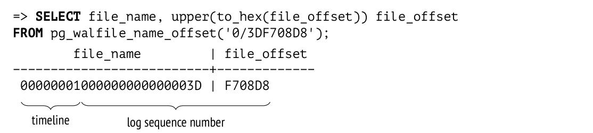
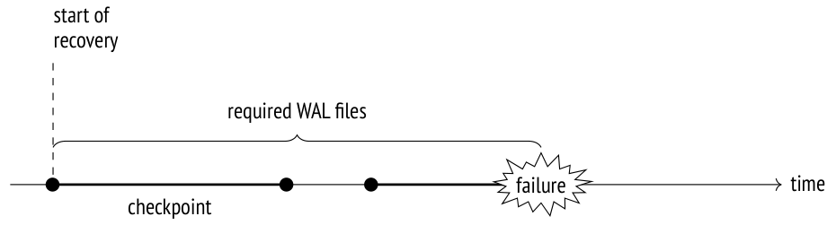
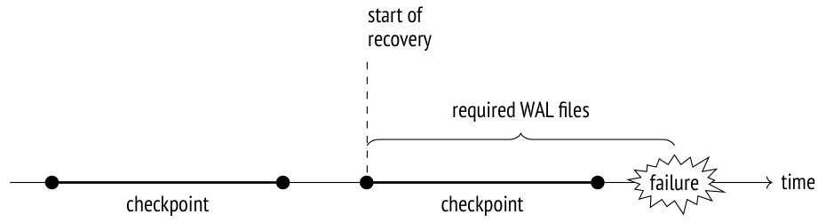
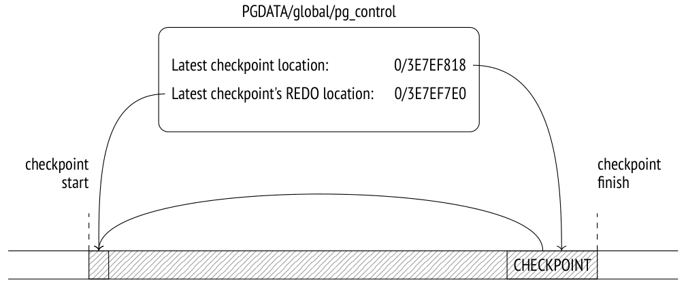
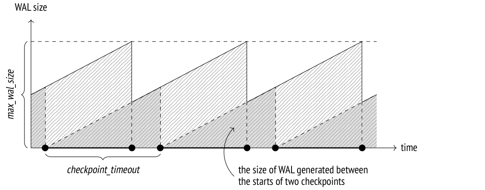

# Chương 10. Write-Ahead Log (Nhật ký ghi trước)

## 10.1 Ghi nhật ký (Logging)

Khi xảy ra sự cố, chẳng hạn mất điện, lỗi hệ điều hành hay server cơ sở dữ liệu bị crash, toàn bộ nội dung của RAM sẽ bị mất; chỉ dữ liệu đã được ghi xuống đĩa là còn tồn tại. Để khởi động server sau sự cố, bạn phải khôi phục tính nhất quán của dữ liệu. Nếu bản thân đĩa bị hỏng, vấn đề tương tự phải được giải quyết bằng cách khôi phục từ bản sao lưu (backup).

Về lý thuyết, bạn có thể luôn duy trì tính nhất quán của dữ liệu trên đĩa ở mọi thời điểm. Nhưng trên thực tế, điều đó có nghĩa là server phải liên tục ghi các page ngẫu nhiên xuống đĩa (dù ghi tuần tự rẻ hơn), và thứ tự của những lần ghi như vậy phải đảm bảo tính nhất quán không bị phá vỡ tại bất kỳ thời điểm nào (điều rất khó đạt được, đặc biệt nếu bạn làm việc với các cấu trúc index phức tạp).

Giống như phần lớn các hệ cơ sở dữ liệu, PostgreSQL sử dụng một cách tiếp cận khác.

Trong khi server đang chạy, một phần dữ liệu hiện hành chỉ có trong RAM, việc ghi chúng xuống bộ lưu trữ bền vững được hoãn lại. Vì vậy, dữ liệu lưu trên đĩa luôn ở trạng thái không nhất quán trong khi server hoạt động, vì các page không bao giờ được flush cùng một lúc. Nhưng mỗi thay đổi xảy ra trong RAM (chẳng hạn một cập nhật page được thực hiện trong buffer cache) đều được *ghi nhật ký* (logged): PostgreSQL tạo một mục nhật ký (log entry) chứa mọi thông tin cần thiết để lặp lại thao tác này nếu có nhu cầu.[^1]

Một mục nhật ký liên quan đến việc sửa đổi page phải được ghi xuống đĩa *trước* (ahead) chính page đã sửa đổi đó. Vì thế nhật ký có tên là *write-ahead log* (nhật ký ghi trước), hay WAL. Yêu cầu này đảm bảo rằng khi có sự cố, PostgreSQL có thể đọc các mục WAL từ đĩa và *phát lại* (replay) chúng để lặp lại những thao tác đã hoàn tất mà kết quả của chúng vẫn còn nằm trong RAM và chưa kịp xuống đĩa trước khi crash.

Duy trì write-ahead log thường hiệu quả hơn so với ghi các page ngẫu nhiên xuống đĩa. Các mục WAL tạo thành một dòng dữ liệu liên tục, mà ngay cả HDD cũng có thể xử lý được. Ngoài ra, các mục WAL thường nhỏ hơn kích thước page.

Cần phải ghi nhật ký mọi thao tác có khả năng phá vỡ tính nhất quán dữ liệu khi có sự cố. Cụ thể, các hành động sau được ghi vào WAL:

- các sửa đổi page được thực hiện trong buffer cache — vì việc ghi bị hoãn lại

- commit và rollback của transaction — vì việc thay đổi trạng thái diễn ra trong các buffer CLOG và không được ghi xuống đĩa ngay

- các thao tác trên file (như tạo và xoá file và thư mục khi bảng được thêm hoặc xoá) — vì những thao tác như vậy phải đồng bộ với các thay đổi dữ liệu

Các hành động sau không được ghi nhật ký:

- thao tác trên các bảng `UNLOGGED`

- thao tác trên các bảng tạm (temporary table) — vì dù sao thời gian tồn tại của chúng cũng bị giới hạn bởi session tạo ra chúng

> Trước PostgreSQL 10, hash index cũng không được ghi nhật ký. Mục đích duy nhất của chúng là để khớp các hàm băm với các kiểu dữ liệu khác nhau.

Ngoài việc khôi phục sau crash, WAL còn có thể được dùng cho point-in-time recovery (khôi phục tới một thời điểm) từ bản sao lưu và cho replication (sao chép).

## 10.2 Cấu trúc WAL (WAL Structure)

### Cấu trúc logic (Logical Structure)

Nói về cấu trúc logic, ta có thể mô tả WAL[^2] như một dòng các mục nhật ký có độ dài thay đổi. Mỗi mục chứa một số *dữ liệu* về một thao tác cụ thể, đứng trước là một *header* chuẩn.[^3] Trong số các thông tin khác, header cung cấp:

- ID của transaction liên quan đến mục đó

- resource manager diễn giải mục đó[^4]

- checksum để phát hiện dữ liệu bị hỏng

- độ dài mục

- tham chiếu tới mục WAL trước đó

> WAL thường được đọc theo chiều tiến, nhưng một số tiện ích như pg_rewind có thể quét nó theo chiều ngược lại.

Bản thân dữ liệu WAL có thể có nhiều định dạng và ý nghĩa khác nhau. Ví dụ, nó có thể là một mảnh page cần thay thế một phần nào đó của page tại offset được chỉ định. Resource manager tương ứng phải biết cách diễn giải và phát lại một mục cụ thể. Có các manager riêng cho bảng, các loại index khác nhau, trạng thái transaction và các thực thể khác.

Các file WAL chiếm những buffer đặc biệt trong shared memory của server. Kích thước cache mà WAL sử dụng được xác định bởi tham số *wal_buffers*. Theo mặc định, kích thước này được chọn tự động *(mặc định: -1)* bằng 1/32 tổng kích thước buffer cache.

WAL cache khá giống buffer cache, nhưng nó thường hoạt động ở chế độ ring buffer (bộ đệm vòng): các mục mới được thêm vào đầu (head), trong khi các mục cũ hơn được lưu xuống đĩa bắt đầu từ đuôi (tail). Nếu WAL cache quá nhỏ, việc đồng bộ đĩa sẽ được thực hiện thường xuyên hơn mức cần thiết.

Khi tải thấp, vị trí chèn (đầu buffer) gần như luôn trùng với vị trí của các mục đã được lưu xuống đĩa (đuôi buffer):

```
=> SELECT pg_current_wal_lsn(), pg_current_wal_insert_lsn();
 pg_current_wal_lsn | pg_current_wal_insert_lsn
--------------------+---------------------------
 0/3DF56000         | 0/3DF57968
(1 row)
```

> Trước PostgreSQL 10, tên của tất cả các hàm chứa từ viết tắt XLOG thay vì WAL.

Để tham chiếu tới một mục cụ thể, PostgreSQL sử dụng một kiểu dữ liệu đặc biệt: `pg_lsn` (log sequence number, LSN). Nó biểu diễn offset 64-bit tính bằng byte từ đầu WAL tới một mục. LSN được hiển thị dưới dạng hai số 32-bit ở hệ thập lục phân, phân cách bởi dấu gạch chéo.

Hãy tạo một bảng:

```
=> CREATE TABLE wal(id integer);
=> INSERT INTO wal VALUES (1);
```

Bắt đầu một transaction và ghi lại LSN của vị trí chèn WAL:

```
=> BEGIN;
=> SELECT pg_current_wal_insert_lsn();
 pg_current_wal_insert_lsn
---------------------------
 0/3DF708D8
(1 row)
```

Bây giờ chạy một lệnh bất kỳ, ví dụ cập nhật một dòng:

```
=> UPDATE wal SET id = id + 1;
```

Sửa đổi page được thực hiện trong buffer cache ở RAM. Thay đổi này được ghi nhật ký vào một WAL page, cũng nằm trong RAM. Kết quả là LSN chèn được đẩy lên:

```
=> SELECT pg_current_wal_insert_lsn();
 pg_current_wal_insert_lsn
---------------------------
 0/3DF70920
(1 row)
```

Để đảm bảo rằng page dữ liệu đã sửa đổi được flush xuống đĩa nghiêm ngặt sau mục WAL tương ứng, page header lưu LSN của mục WAL mới nhất liên quan đến page này. Bạn có thể xem LSN này bằng `pageinspect`:

```
=> SELECT lsn FROM page_header(get_raw_page('wal',0));
    lsn
------------
 0/3DF70920
(1 row)
```

Chỉ có một WAL duy nhất cho toàn bộ database cluster, và các mục mới liên tục được nối thêm vào đó. Vì lý do này, LSN lưu trong page có thể nhỏ hơn giá trị mà hàm `pg_current_wal_insert_lsn` trả về trước đó một lúc. Nhưng nếu không có gì xảy ra trong hệ thống, các số này sẽ bằng nhau.

Bây giờ hãy commit transaction:

```
=> COMMIT;
```

Thao tác commit cũng được ghi nhật ký, và LSN chèn lại thay đổi:

```
=> SELECT pg_current_wal_insert_lsn();
 pg_current_wal_insert_lsn
---------------------------
 0/3DF70948
(1 row)
```

Một commit cập nhật trạng thái transaction trong các page CLOG, vốn được giữ trong cache riêng của chúng.[^5] *[→ tr. 70](03-pages-and-tuples.md)* CLOG cache thường chiếm 128 page trong shared memory.[^6] Để đảm bảo một page CLOG không bị flush xuống đĩa trước mục WAL tương ứng, LSN của mục WAL mới nhất cũng phải được theo dõi cho các page CLOG. Nhưng thông tin này được lưu trong RAM, không phải trong chính page.

Đến một lúc nào đó, các mục WAL sẽ được ghi xuống đĩa; khi đó sẽ có thể evict các page CLOG và page dữ liệu khỏi cache. *[→ tr. 182](11-wal-modes.md)* Nếu chúng phải bị evict sớm hơn, điều này sẽ được phát hiện, và các mục WAL sẽ bị buộc ghi xuống đĩa trước.[^7]

Nếu biết hai vị trí LSN, bạn có thể tính kích thước các mục WAL nằm giữa chúng (tính bằng byte) đơn giản bằng cách lấy vị trí này trừ vị trí kia. Bạn chỉ cần ép kiểu chúng sang `pg_lsn`:

```
=> SELECT '0/3DF70948'::pg_lsn - '0/3DF708D8'::pg_lsn;
 ?column?
----------
      112
(1 row)
```

Trong trường hợp cụ thể này, các mục WAL liên quan đến thao tác `UPDATE` và `COMMIT` chiếm khoảng một trăm byte.

Bạn có thể dùng cách tương tự để ước lượng khối lượng mục WAL được sinh ra bởi một workload cụ thể trong một đơn vị thời gian. Thông tin này sẽ cần thiết cho việc thiết lập checkpoint.

### Cấu trúc vật lý (Physical Structure)

Trên đĩa, WAL được lưu trong thư mục `PGDATA/pg_wal` dưới dạng các file riêng biệt, hay segment. Kích thước của chúng được thể hiện bởi tham số chỉ đọc *wal_segment_size*. *(mặc định: 16MB)*

Với các hệ thống tải cao, việc tăng kích thước segment là hợp lý vì nó có thể giảm chi phí phụ trội, *(v. 11)* nhưng thiết lập này chỉ có thể được thay đổi khi khởi tạo cluster (`initdb --wal-segsize`).

Các mục WAL được ghi vào file hiện tại cho đến khi file hết chỗ; khi đó PostgreSQL bắt đầu một file mới.

Ta có thể biết một mục cụ thể nằm trong file nào, và ở offset nào tính từ đầu file:

```
=> SELECT file_name, upper(to_hex(file_offset)) file_offset
FROM pg_walfile_name_offset('0/3DF708D8');
        file_name        | file_offset
--------------------------+-------------
 00000001000000000000003D | F708D8
(1 row)
```



Tên file gồm hai phần. Tám chữ số thập lục phân cao nhất xác định *timeline* dùng cho việc khôi phục từ bản sao lưu, còn phần còn lại biểu diễn các bit cao nhất của LSN (các bit thấp nhất của LSN được hiển thị trong trường `file_offset`).

Để xem các file WAL hiện tại, bạn có thể gọi hàm sau: *(v. 10)*

```
=> SELECT *
FROM pg_ls_waldir()
WHERE name = '00000001000000000000003D';
           name          |   size   |      modification
--------------------------+----------+------------------------
 00000001000000000000003D | 16777216 | 2023-03-06 14:01:48+03
(1 row)
```

Bây giờ hãy xem header của các mục WAL vừa được tạo bằng tiện ích `pg_waldump`, vốn có thể lọc các mục WAL cả theo khoảng LSN (như trong ví dụ này) lẫn theo một transaction ID cụ thể.

Tiện ích `pg_waldump` nên được chạy dưới danh nghĩa người dùng hệ điều hành `postgres`, vì nó cần truy cập các file WAL trên đĩa.

```
postgres$ /usr/local/pgsql/bin/pg_waldump \
-p /usr/local/pgsql/data/pg_wal -s 0/3DF708D8 -e 0/3DF70948#
rmgr: Heap        len (rec/tot):    69/    69, tx:        886, lsn:
0/3DF708D8, prev 0/3DF708B0, desc: HOT_UPDATE off 1 xmax 886 flags
0x40 ; new off 2 xmax 0, blkref #0: rel 1663/16391/16562 blk 0
rmgr: Transaction len (rec/tot):    34/    34, tx:        886, lsn:
0/3DF70920, prev 0/3DF708D8, desc: COMMIT 2023-03-06 14:01:48.875861
MSK
```

Ở đây ta có thể thấy header của hai mục.

Mục thứ nhất là thao tác `HOT_UPDATE` do resource manager `Heap` xử lý. *[→ tr. 95](05-page-pruning-and-hot-updates.md)* Trường `blkref` cho biết tên file và ID page của heap page được cập nhật:

```
=> SELECT pg_relation_filepath('wal');
```

```
 pg_relation_filepath
----------------------
 base/16391/16562
(1 row)
```

Mục thứ hai là thao tác `COMMIT` do resource manager `Transaction` giám sát.

## 10.3 Checkpoint

Để khôi phục tính nhất quán dữ liệu sau sự cố (tức là để thực hiện recovery), PostgreSQL phải phát lại WAL theo chiều tiến và áp dụng các mục biểu diễn những thay đổi bị mất vào các page tương ứng. Để tìm ra những gì đã bị mất, LSN của page lưu trên đĩa được so sánh với LSN của mục WAL. Nhưng ta nên bắt đầu recovery từ điểm nào? Nếu bắt đầu quá muộn, các page đã được ghi xuống đĩa trước điểm này sẽ không nhận được đầy đủ mọi thay đổi, dẫn đến hỏng dữ liệu không thể khắc phục. Bắt đầu từ tận đầu thì không thực tế: không thể lưu trữ một khối lượng dữ liệu tiềm năng khổng lồ như vậy, và cũng không thể chấp nhận thời gian recovery dài đến thế. Ta cần một *checkpoint* (điểm kiểm tra) dịch chuyển dần về phía trước, nhờ đó có thể an toàn bắt đầu recovery từ điểm này và xoá bỏ mọi mục WAL trước đó.

Cách đơn giản nhất để tạo checkpoint là định kỳ tạm ngưng mọi hoạt động của hệ thống và buộc ghi tất cả dirty page xuống đĩa. Tất nhiên cách tiếp cận này không thể chấp nhận được, vì hệ thống sẽ bị treo trong một khoảng thời gian không xác định nhưng khá đáng kể.

Vì lý do này, checkpoint được trải ra theo thời gian, thực chất tạo thành một khoảng (interval). Việc thực thi checkpoint được thực hiện bởi một tiến trình nền đặc biệt gọi là `checkpointer`.[^8]

**Checkpoint start.** (Bắt đầu checkpoint) Tiến trình `checkpointer` flush xuống đĩa mọi thứ có thể ghi ngay lập tức: trạng thái transaction trong CLOG, metadata của subtransaction và một vài cấu trúc khác.

**Checkpoint execution.** (Thực thi checkpoint) Phần lớn thời gian thực thi checkpoint được dành cho việc flush dirty page xuống đĩa.[^9]

Trước tiên, một thẻ (tag) đặc biệt được đặt trong header của tất cả các buffer đang dirty tại thời điểm bắt đầu checkpoint. Việc này diễn ra rất nhanh vì không có thao tác I/O nào.

Sau đó `checkpointer` duyệt qua tất cả các buffer và ghi những buffer được gắn thẻ xuống đĩa. Các page của chúng không bị evict khỏi cache: chúng chỉ đơn giản được ghi xuống, nên có thể bỏ qua usage count và pin count.

Các page được xử lý theo thứ tự ID của chúng để tránh ghi ngẫu nhiên nếu có thể. Để cân bằng tải tốt hơn, *(v. 9.6)* PostgreSQL luân phiên giữa các tablespace khác nhau (vì chúng có thể nằm trên các thiết bị vật lý khác nhau).

Các backend cũng có thể ghi các buffer được gắn thẻ xuống đĩa — nếu chúng tiếp cận các buffer đó trước. Dù thế nào, thẻ của buffer đều được gỡ bỏ ở giai đoạn này, nên với mục đích của checkpoint, mỗi buffer sẽ chỉ được ghi một lần.

Đương nhiên, các page vẫn có thể bị sửa đổi trong buffer cache khi checkpoint đang diễn ra. Nhưng vì các dirty buffer mới không được gắn thẻ, `checkpointer` sẽ bỏ qua chúng.

**Checkpoint completion.** (Hoàn tất checkpoint) Khi tất cả các buffer đã dirty *tại thời điểm bắt đầu* checkpoint đều đã được ghi xuống đĩa, checkpoint được coi là *hoàn tất*. Từ đây trở đi (nhưng không sớm hơn!), *điểm bắt đầu* của checkpoint sẽ được dùng làm điểm khởi đầu mới cho recovery. Mọi mục WAL được ghi trước điểm này không còn cần thiết nữa.





Cuối cùng, `checkpointer` tạo một mục WAL tương ứng với việc hoàn tất checkpoint, chỉ rõ LSN bắt đầu của checkpoint. Vì checkpoint không ghi nhật ký gì khi bắt đầu, LSN này có thể thuộc về một mục WAL thuộc bất kỳ loại nào.

File `PGDATA/global/pg_control` cũng được cập nhật để tham chiếu tới checkpoint hoàn tất mới nhất. (Cho đến khi quá trình này kết thúc, `pg_control` vẫn giữ checkpoint trước đó.)



Để làm rõ một lần cho xong cái gì nằm ở đâu, hãy xem một ví dụ đơn giản. Ta sẽ làm cho một số page đang được cache trở nên dirty:

```
=> UPDATE big SET s = 'FOO';
=> SELECT count(*) FROM pg_buffercache WHERE isdirty;
 count
-------
  4119
(1 row)
```

Ghi lại vị trí WAL hiện tại:

```
=> SELECT pg_current_wal_insert_lsn();
 pg_current_wal_insert_lsn
---------------------------
 0/3E7EF7E0
(1 row)
```

Bây giờ hãy hoàn tất checkpoint thủ công. Tất cả dirty page sẽ được flush xuống đĩa; vì không có gì xảy ra trong hệ thống, sẽ không xuất hiện dirty page mới:

```
=> CHECKPOINT;
=> SELECT count(*) FROM pg_buffercache WHERE isdirty;
 count
-------
     0
(1 row)
```

Hãy xem checkpoint được phản ánh trong WAL như thế nào:

```
=> SELECT pg_current_wal_insert_lsn();
 pg_current_wal_insert_lsn
---------------------------
 0/3E7EF890
(1 row)
```

```
postgres$ /usr/local/pgsql/bin/pg_waldump \
-p /usr/local/pgsql/data/pg_wal -s 0/3E7EF7E0 -e 0/3E7EF890
rmgr: Standby     len (rec/tot):    50/    50, tx:          0, lsn:
0/3E7EF7E0, prev 0/3E7EF7B8, desc: RUNNING_XACTS nextXid 888
latestCompletedXid 887 oldestRunningXid 888
rmgr: XLOG        len (rec/tot):   114/   114, tx:          0, lsn:
0/3E7EF818, prev 0/3E7EF7E0, desc: CHECKPOINT_ONLINE redo
0/3E7EF7E0; tli 1; prev tli 1; fpw true; xid 0:888; oid 24754; multi
1; offset 0; oldest xid 726 in DB 1; oldest multi 1 in DB 1;
oldest/newest commit timestamp xid: 0/0; oldest running xid 888;
online
```

Mục WAL mới nhất liên quan đến việc hoàn tất checkpoint (`CHECKPOINT_ONLINE`). LSN bắt đầu của checkpoint này được ghi sau từ `redo`; vị trí này tương ứng với mục WAL được chèn mới nhất tại thời điểm checkpoint bắt đầu.

Thông tin tương tự cũng có thể tìm thấy trong file `pg_control`:

```
postgres$ /usr/local/pgsql/bin/pg_controldata \
-D /usr/local/pgsql/data | egrep 'Latest.*location'
Latest checkpoint location:          0/3E7EF818
Latest checkpoint's REDO location:   0/3E7EF7E0
```

## 10.4 Khôi phục (Recovery)

Tiến trình đầu tiên được khởi chạy khi server khởi động là `postmaster`. Đến lượt mình, `postmaster` sinh ra tiến trình `startup`,[^10] tiến trình này đảm nhận việc khôi phục dữ liệu trong trường hợp có sự cố.

Để xác định có cần recovery hay không, tiến trình `startup` đọc file `pg_control` và kiểm tra trạng thái cluster. Tiện ích `pg_controldata` cho phép ta xem nội dung của file này:

```
postgres$ /usr/local/pgsql/bin/pg_controldata \
-D /usr/local/pgsql/data | grep state
Database cluster state:              in production
```

Một server được dừng đúng cách có trạng thái “shut down”; trạng thái “in production” của một server không chạy cho thấy đã có sự cố. Trong trường hợp này, tiến trình `startup` sẽ tự động khởi tạo recovery từ LSN bắt đầu của checkpoint hoàn tất mới nhất được tìm thấy trong chính file `pg_control` đó.

> Nếu thư mục PGDATA chứa file backup_label liên quan đến một bản sao lưu, vị trí LSN bắt đầu được lấy từ file đó.

Tiến trình `startup` đọc từng mục WAL một, bắt đầu từ vị trí đã xác định, và áp dụng chúng vào các page dữ liệu nếu LSN của page nhỏ hơn LSN của mục WAL. Nếu page chứa LSN lớn hơn, WAL không nên được áp dụng; thực ra, nó *không được phép* áp dụng vì các mục của nó được thiết kế để phát lại một cách tuần tự nghiêm ngặt.

Tuy nhiên, một số mục WAL tạo thành một *full page image* (ảnh toàn trang), hay FPI. Các mục loại này có thể được áp dụng cho bất kỳ trạng thái nào của page vì dù sao toàn bộ nội dung page cũng sẽ bị xoá. Những sửa đổi như vậy được gọi là *idempotent* (lũy đẳng). Một ví dụ khác về thao tác idempotent là việc ghi nhận thay đổi trạng thái transaction: trạng thái của mỗi transaction được xác định trong CLOG bởi một số bit nhất định được đặt bất kể giá trị trước đó của chúng, nên không cần giữ LSN của thay đổi mới nhất trong các page CLOG.

Các mục WAL được áp dụng cho các page trong buffer cache, giống như các cập nhật page thông thường trong quá trình hoạt động bình thường.

Các file được khôi phục từ WAL theo cách tương tự: ví dụ, nếu một mục WAL cho thấy file phải tồn tại, nhưng vì lý do nào đó nó bị thiếu, file sẽ được tạo mới.

Khi recovery kết thúc, tất cả các unlogged relation đều bị ghi đè bởi các initialization fork tương ứng. *[→ tr. 26](01-introduction.md)*

Cuối cùng, checkpoint được thực thi để đảm bảo trạng thái đã khôi phục được lưu an toàn trên đĩa.

Công việc của tiến trình `startup` đến đây là hoàn tất.

> Ở dạng kinh điển, quá trình recovery gồm hai giai đoạn. Trong giai đoạn roll-forward, các mục WAL được phát lại, lặp lại các thao tác bị mất. Trong giai đoạn roll-back, server abort các transaction chưa được commit tại thời điểm xảy ra sự cố.

> Trong PostgreSQL, giai đoạn thứ hai là không cần thiết. Sau recovery, CLOG sẽ không chứa bit commit hay bit abort nào cho một transaction chưa hoàn tất (về mặt kỹ thuật điều đó biểu thị một transaction đang hoạt động), nhưng vì biết chắc chắn rằng transaction đó không còn chạy nữa, nó sẽ được coi là đã abort.[^11]

Ta có thể mô phỏng một sự cố bằng cách buộc server dừng ở chế độ immediate:

```
postgres$ pg_ctl stop -m immediate
```

Đây là trạng thái mới của cluster:

```
postgres$ /usr/local/pgsql/bin/pg_controldata \
-D /usr/local/pgsql/data | grep 'state'
Database cluster state:              in production
```

Khi ta khởi động server, tiến trình `startup` thấy rằng đã xảy ra sự cố và chuyển sang chế độ recovery:

```
postgres$ pg_ctl start -l /home/postgres/logfile
postgres$ tail -n 6 /home/postgres/logfile
LOG:  database system was interrupted; last known up at 2023-03-06
14:01:49 MSK
LOG:  database system was not properly shut down; automatic recovery
in progress
LOG:  redo starts at 0/3E7EF7E0
LOG:  invalid record length at 0/3E7EF890: wanted 24, got 0
LOG:  redo done at 0/3E7EF818 system usage: CPU: user: 0.00 s,
system: 0.00 s, elapsed: 0.00 s
LOG:  database system is ready to accept connections
```

Nếu server được dừng bình thường, `postmaster` ngắt kết nối tất cả client rồi thực thi checkpoint cuối cùng để flush mọi dirty page xuống đĩa.

Ghi lại vị trí WAL hiện tại:

```
=> SELECT pg_current_wal_insert_lsn();
 pg_current_wal_insert_lsn
---------------------------
 0/3E7EF908
(1 row)
```

Bây giờ hãy dừng server đúng cách:

```
postgres$ pg_ctl stop
```

Đây là trạng thái mới của cluster:

```
postgres$ /usr/local/pgsql/bin/pg_controldata \
-D /usr/local/pgsql/data | grep state
Database cluster state:              shut down
```

Ở cuối WAL, ta có thể thấy mục `CHECKPOINT_SHUTDOWN`, biểu thị checkpoint cuối cùng:

```
postgres$ /usr/local/pgsql/bin/pg_waldump \
-p /usr/local/pgsql/data/pg_wal -s 0/3E7EF908
rmgr: XLOG        len (rec/tot):   114/   114, tx:          0, lsn:
0/3E7EF908, prev 0/3E7EF890, desc: CHECKPOINT_SHUTDOWN redo
0/3E7EF908; tli 1; prev tli 1; fpw true; xid 0:888; oid 24754; multi
1; offset 0; oldest xid 726 in DB 1; oldest multi 1 in DB 1;
oldest/newest commit timestamp xid: 0/0; oldest running xid 0;
shutdown
pg_waldump: fatal: error in WAL record at 0/3E7EF908: invalid record
length at 0/3E7EF980: wanted 24, got 0
```

Thông báo cuối cùng của `pg_waldump` cho thấy tiện ích đã đọc WAL đến hết.

Hãy khởi động lại instance:

```
postgres$ pg_ctl start -l /home/postgres/logfile
```

## 10.5 Ghi nền (Background Writing)

Nếu backend cần evict một dirty page khỏi buffer, nó phải ghi page này xuống đĩa. Tình huống như vậy là không mong muốn vì nó dẫn đến việc phải chờ — tốt hơn nhiều là thực hiện việc ghi một cách bất đồng bộ ở chế độ nền.

Công việc này được `checkpointer` đảm nhận một phần, nhưng vẫn chưa đủ.

Vì vậy, PostgreSQL cung cấp một tiến trình khác gọi là `bgwriter`,[^12] dành riêng cho việc *ghi nền* (background writing). Nó dựa trên cùng thuật toán tìm kiếm buffer như eviction, ngoại trừ hai khác biệt chính:

- Tiến trình `bgwriter` sử dụng kim đồng hồ (clock hand) riêng của nó, kim này không bao giờ tụt lại sau kim của eviction và thường vượt lên trước.

- Khi duyệt qua các buffer, usage count không bị giảm.

Một dirty page được flush xuống đĩa nếu buffer không bị pin và có usage count bằng không. Như vậy, `bgwriter` chạy trước eviction và chủ động ghi xuống đĩa những page có khả năng cao sắp bị evict.

Điều này làm tăng khả năng các buffer được chọn để evict là sạch (clean).

## 10.6 Thiết lập WAL (WAL Setup)

### Cấu hình checkpoint (Configuring Checkpoints)

Thời lượng checkpoint (chính xác hơn là thời lượng ghi các dirty buffer xuống đĩa) được xác định bởi tham số *checkpoint_completion_target*. Giá trị của nó chỉ định tỷ lệ *(mặc định: 0.9)* thời gian giữa điểm bắt đầu của hai checkpoint liền kề được dành cho việc ghi. Tránh *(v. 14)* đặt tham số này bằng một: khi đó, checkpoint kế tiếp có thể đến hạn trước khi checkpoint trước hoàn tất. Sẽ không có thảm hoạ nào xảy ra, vì không thể thực thi nhiều hơn một checkpoint cùng lúc, nhưng hoạt động bình thường vẫn có thể bị gián đoạn.

Khi cấu hình các tham số khác, ta có thể dùng cách tiếp cận sau. Trước tiên, ta xác định khối lượng file WAL phù hợp cần lưu giữa hai checkpoint liền kề. Khối lượng càng lớn thì chi phí phụ trội càng nhỏ, nhưng dù sao giá trị này cũng sẽ bị giới hạn bởi dung lượng trống sẵn có và thời gian recovery chấp nhận được.

Để ước lượng thời gian cần thiết để sinh ra khối lượng này với tải *bình thường*, bạn cần ghi lại LSN chèn ban đầu và thỉnh thoảng kiểm tra độ chênh lệch giữa nó và vị trí chèn hiện tại.

Con số thu được được coi là khoảng thời gian điển hình giữa các checkpoint, nên ta sẽ dùng nó làm giá trị cho tham số *checkpoint_timeout*. Thiết lập mặc định có lẽ là quá nhỏ; *(mặc định: 5min)* nó thường được tăng lên, ví dụ thành 30 phút. *[→ tr. 190](11-wal-modes.md)*

Tuy nhiên, hoàn toàn có thể (và thậm chí khá chắc chắn) rằng *đôi khi* tải sẽ cao hơn, nên kích thước file WAL sinh ra trong khoảng thời gian này sẽ quá lớn. Trong trường hợp đó, checkpoint phải được thực thi thường xuyên hơn. Để thiết lập một trigger như vậy, ta sẽ giới hạn kích thước file WAL cần cho recovery bằng tham số *max_wal_size*. Khi vượt ngưỡng này, *(mặc định: 1GB)* server sẽ kích hoạt một checkpoint bổ sung.[^13]

Các file WAL cần cho recovery chứa mọi mục của cả checkpoint hoàn tất mới nhất *(v. 11)* lẫn checkpoint hiện tại, vốn chưa hoàn tất. Vì vậy, để ước lượng tổng khối lượng của chúng, bạn nên nhân kích thước WAL tính được giữa các checkpoint với 1 + *checkpoint_completion_target*.

> Trước phiên bản 11, PostgreSQL giữ các file WAL cho hai checkpoint đã hoàn tất, nên hệ số nhân là 2 + *checkpoint_completion_target*.

Theo cách tiếp cận này, phần lớn checkpoint được thực thi theo lịch, mỗi khoảng *checkpoint_timeout* một lần; nhưng nếu tải tăng, checkpoint sẽ được kích hoạt khi kích thước WAL vượt quá giá trị *max_wal_size*.

Tiến độ thực tế được kiểm tra định kỳ so với các con số kỳ vọng:[^14]

**The actual progress** (tiến độ thực tế) được xác định bởi tỷ lệ các page trong cache đã được xử lý.

**The expected progress (by time)** (tiến độ kỳ vọng theo thời gian) được xác định bởi tỷ lệ thời gian đã trôi qua, xuất phát từ giả định rằng checkpoint phải hoàn tất trong khoảng *checkpoint_timeout* × *checkpoint_completion_target*.

**The expected progress (by size)** (tiến độ kỳ vọng theo kích thước) được xác định bởi tỷ lệ các file WAL đã được lấp đầy, trong đó số lượng file kỳ vọng được ước lượng dựa trên giá trị *max_wal_size* × *checkpoint_completion_target*.

Nếu các dirty page được ghi xuống đĩa sớm hơn lịch, `checkpointer` sẽ tạm dừng một lúc; nếu bị chậm theo bất kỳ tham số nào, nó sẽ đuổi kịp càng sớm càng tốt.[^15] Vì cả thời gian lẫn kích thước dữ liệu đều được tính đến, PostgreSQL có thể quản lý checkpoint theo lịch và checkpoint theo yêu cầu bằng cùng một cách tiếp cận.

Khi checkpoint đã hoàn tất, các file WAL không còn cần cho recovery sẽ bị xoá;[^16] tuy nhiên, một số file (tổng cộng tối đa *min_wal_size*) được giữ lại để tái sử dụng *(mặc định: 80MB)* và chỉ đơn giản được đổi tên.

Việc đổi tên như vậy giảm chi phí phụ trội do liên tục tạo và xoá file, nhưng *(v. 12)* bạn có thể tắt tính năng này bằng tham số *wal_recycle* nếu không cần đến nó. *(mặc định: on)*

Hình sau cho thấy kích thước các file WAL lưu trên đĩa thay đổi như thế nào trong điều kiện bình thường.



Cần lưu ý rằng kích thước thực tế của các file WAL trên đĩa có thể vượt quá giá trị *max_wal_size*:

- Tham số *max_wal_size* chỉ định giá trị mục tiêu mong muốn chứ không phải một giới hạn cứng. Nếu tải tăng đột biến, việc ghi có thể bị chậm so với lịch.

- Server không có quyền xoá các file WAL chưa được replicate hoặc chưa được xử lý bởi continuous archiving (lưu trữ liên tục). Nếu được bật, chức năng này phải được giám sát liên tục, vì nó có thể dễ dàng gây tràn đĩa.

- Bạn có thể dành riêng một lượng dung lượng nhất định để lưu file WAL bằng cách cấu hình *(v. 12)* tham số *wal_keep_size*. *(mặc định: 0MB)*

### Cấu hình ghi nền (Configuring Background Writing)

Khi đã cấu hình xong `checkpointer`, bạn cũng nên thiết lập `bgwriter`. Cùng nhau, các tiến trình này phải đủ sức ghi các dirty buffer xuống đĩa trước khi các backend cần tái sử dụng chúng.

Trong khi hoạt động, `bgwriter` định kỳ tạm dừng, ngủ trong *bgwriter_delay* đơn vị *(mặc định: 200ms)* thời gian.

Số page được ghi giữa hai lần tạm dừng phụ thuộc vào số buffer trung bình được các backend truy cập kể từ lần chạy trước (PostgreSQL sử dụng trung bình trượt (moving average) để san bằng các đột biến có thể xảy ra, đồng thời tránh phụ thuộc vào dữ liệu quá cũ). Con số tính được sau đó được nhân với *bgwriter_lru_multiplier*. Nhưng trong mọi trường hợp, số *(mặc định: 2 100)* page được ghi trong một lần chạy không thể vượt quá giá trị *bgwriter_lru_maxpages*.

Nếu không phát hiện dirty buffer nào (tức là không có gì xảy ra trong hệ thống), `bgwriter` sẽ ngủ cho đến khi một trong các backend truy cập một buffer. Khi đó nó thức dậy và tiếp tục hoạt động thường lệ.

### Giám sát (Monitoring)

Các thiết lập checkpoint có thể và nên được tinh chỉnh dựa trên dữ liệu giám sát.

Nếu các checkpoint kích hoạt theo kích thước phải được thực hiện thường xuyên hơn mức được xác định bởi giá trị của tham số *checkpoint_warning*, PostgreSQL sẽ đưa ra cảnh báo. Thiết lập này nên *(mặc định: 30s)* được điều chỉnh cho phù hợp với tải đỉnh dự kiến.

Tham số *log_checkpoints* cho phép in thông tin liên quan đến checkpoint vào *(mặc định: off)* log của server. Hãy bật nó lên:

```
=> ALTER SYSTEM SET log_checkpoints = on;
=> SELECT pg_reload_conf();
```

Bây giờ ta sẽ sửa đổi một ít dữ liệu và thực thi một checkpoint:

```
=> UPDATE big SET s = 'BAR';
=> CHECKPOINT;
```

Log của server cho thấy số buffer đã được ghi, một số thống kê về thay đổi của file WAL sau checkpoint, thời lượng của checkpoint, và khoảng cách (tính bằng byte) giữa điểm bắt đầu của hai checkpoint liền kề:

```
postgres$ tail -n 2 /home/postgres/logfile
LOG:  checkpoint starting: immediate force wait
LOG:  checkpoint complete: wrote 4100 buffers (25.0%); 0 WAL file(s)
added, 1 removed, 0 recycled; write=0.076 s, sync=0.009 s,
total=0.099 s; sync files=3, longest=0.007 s, average=0.003 s;
distance=9213 kB, estimate=9213 kB
```

Dữ liệu hữu ích nhất có thể ảnh hưởng đến các quyết định cấu hình của bạn là thống kê về ghi nền và thực thi checkpoint được cung cấp trong view `pg_stat_bgwriter`.

> Trước phiên bản 9.2, cả hai công việc đều do bgwriter thực hiện; sau đó một tiến trình checkpointer riêng được giới thiệu, nhưng view chung vẫn giữ nguyên.

```
=> SELECT * FROM pg_stat_bgwriter \gx
-[ RECORD 1 ]---------+------------------------------
checkpoints_timed     | 0
checkpoints_req       | 14
checkpoint_write_time | 33111
checkpoint_sync_time  | 221
buffers_checkpoint    | 14253
buffers_clean         | 13066
maxwritten_clean      | 122
buffers_backend       | 84226
buffers_backend_fsync | 0
buffers_alloc         | 86700
stats_reset           | 2023-03-06 14:00:07.369124+03
```

Trong số các thông tin khác, view này hiển thị số checkpoint đã hoàn tất:

- Trường `checkpoints_timed` cho biết các checkpoint theo lịch (được kích hoạt khi đạt tới khoảng *checkpoint_timeout*).

- Trường `checkpoints_req` cho biết các checkpoint theo yêu cầu (bao gồm cả những checkpoint được kích hoạt khi đạt tới kích thước *max_wal_size*).

Giá trị `checkpoint_req` lớn (so với `checkpoints_timed`) cho thấy checkpoint được thực hiện thường xuyên hơn dự kiến.

Các thống kê sau về số page đã được ghi cũng rất quan trọng:

- `buffers_checkpoint` — số page do `checkpointer` ghi

- `buffers_backend` — số page do các backend ghi

- `buffers_clean` — số page do `bgwriter` ghi

Trong một hệ thống được cấu hình tốt, giá trị `buffers_backend` phải thấp hơn đáng kể so với tổng của `buffers_checkpoint` và `buffers_clean`.

Khi thiết lập ghi nền, hãy chú ý tới giá trị `maxwritten_clean`: nó cho biết `bgwriter` đã phải dừng bao nhiêu lần do vượt quá ngưỡng được xác định bởi *bgwriter_lru_maxpages*.

Lời gọi sau sẽ xoá các thống kê đã thu thập:

```
=> SELECT pg_stat_reset_shared('bgwriter');
```

[^1]: postgresql.org/docs/14/wal-intro.html
[^2]: postgresql.org/docs/14/wal-internals.html  
backend/access/transam/README
[^3]: include/access/xlogrecord.h
[^4]: include/access/rmgrlist.h
[^5]: backend/access/transam/slru.c
[^6]: backend/access/transam/clog.c, hàm CLOGShmemBuffers
[^7]: backend/storage/buffer/bufmgr.c, hàm FlushBuffer
[^8]: backend/postmaster/checkpointer.c  
backend/access/transam/xlog.c, hàm CreateCheckPoint
[^9]: backend/storage/buffer/bufmgr.c, hàm BufferSync
[^10]: backend/postmaster/startup.c  
backend/access/transam/xlog.c, hàm StartupXLOG
[^11]: backend/access/heap/heapam_visibility.c, hàm HeapTupleSatisfiesMVCC
[^12]: backend/postmaster/bgwriter.c
[^13]: backend/access/transam/xlog.c, các hàm LogCheckpointNeeded & CalculateCheckpointSegments
[^14]: backend/postmaster/checkpointer.c, hàm IsCheckpointOnSchedule
[^15]: backend/postmaster/checkpointer.c, hàm CheckpointWriteDelay
[^16]: backend/access/transam/xlog.c, hàm RemoveOldXlogFiles
