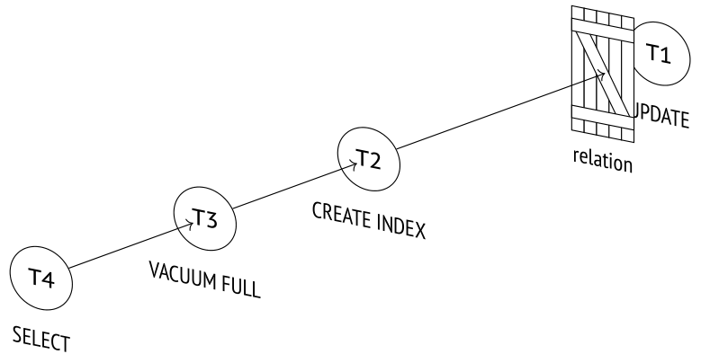

# Chương 12. Relation-Level Locks (Khóa ở mức relation)

## 12.1 Về khóa (About Locks)

*Lock* (khóa) kiểm soát việc truy cập đồng thời vào các tài nguyên dùng chung.

Truy cập đồng thời nghĩa là nhiều tiến trình cùng cố gắng lấy cùng một tài nguyên vào cùng một thời điểm. Không có gì khác biệt dù các tiến trình này được thực thi song song (nếu phần cứng cho phép) hay tuần tự theo chế độ chia sẻ thời gian (time-sharing). Nếu không có truy cập đồng thời thì cũng không cần phải lấy khóa (ví dụ, buffer cache dùng chung cần khóa, trong khi cache cục bộ thì có thể không cần).

Trước khi truy cập một tài nguyên, tiến trình phải *lấy* (acquire) khóa trên tài nguyên đó; khi thao tác hoàn tất, khóa này phải được *giải phóng* (release) để tài nguyên trở nên khả dụng cho các tiến trình khác. Nếu khóa được hệ quản trị cơ sở dữ liệu quản lý thì thứ tự thao tác đã thiết lập được duy trì tự động; nếu khóa do ứng dụng kiểm soát thì chính ứng dụng phải đảm bảo tuân thủ giao thức đó.

Ở mức thấp, khóa đơn giản chỉ là một vùng shared memory xác định trạng thái khóa (đã được lấy hay chưa); nó cũng có thể cung cấp thêm một số thông tin bổ sung, chẳng hạn như số hiệu tiến trình hoặc thời điểm lấy khóa.

> Như bạn có thể đoán, bản thân một segment shared memory cũng là một tài nguyên. Truy cập đồng thời vào những tài nguyên như vậy được điều phối bởi các primitive đồng bộ hóa (như semaphore hoặc mutex) do hệ điều hành cung cấp. Chúng đảm bảo đoạn code truy cập tài nguyên dùng chung được thực thi tuần tự một cách nghiêm ngặt. Ở mức thấp nhất, các primitive này dựa trên các lệnh CPU nguyên tử (như test-and-set hoặc compare-and-swap).

Nói chung, chúng ta có thể dùng khóa để bảo vệ bất kỳ tài nguyên nào, miễn là nó có thể được định danh một cách rõ ràng và được gán một địa chỉ khóa cụ thể.

Ví dụ, chúng ta có thể khóa một đối tượng cơ sở dữ liệu, như một bảng (được định danh bằng `oid` trong system catalog), một page dữ liệu (được định danh bằng tên file và vị trí trong file này), một row version (được định danh bằng page và offset trong page này). Chúng ta cũng có thể khóa một cấu trúc bộ nhớ, như hash table hoặc buffer (được định danh bằng một ID được gán). Thậm chí chúng ta có thể khóa một tài nguyên trừu tượng không có biểu diễn vật lý nào.

Nhưng không phải lúc nào cũng có thể lấy khóa ngay lập tức: tài nguyên có thể đã bị người khác khóa. Khi đó tiến trình hoặc tham gia vào hàng đợi (nếu điều này được phép với loại khóa cụ thể đó), hoặc thử lại sau một thời gian. Dù thế nào, nó cũng phải chờ cho đến khi khóa được giải phóng.

Tôi muốn nêu bật hai yếu tố có thể ảnh hưởng lớn đến hiệu quả của việc khóa.

**Granularity,** tức "kích thước hạt" (grain size) của khóa. Granularity quan trọng nếu các tài nguyên tạo thành một cấu trúc phân cấp.

Ví dụ, một bảng bao gồm các page, và các page đến lượt mình lại bao gồm các tuple. Tất cả các đối tượng này đều có thể được bảo vệ bằng khóa. Khóa ở mức bảng là khóa thô (coarse-grained); chúng ngăn cấm truy cập đồng thời ngay cả khi các tiến trình cần truy cập vào các page hoặc dòng khác nhau.

Khóa ở mức dòng là khóa mịn (fine-grained), nên không có nhược điểm này; tuy nhiên, số lượng khóa lại tăng lên. Để tránh dùng quá nhiều bộ nhớ cho metadata liên quan đến khóa, PostgreSQL có thể áp dụng nhiều phương pháp khác nhau, một trong số đó là *lock escalation* (leo thang khóa): nếu số lượng khóa mịn vượt quá một ngưỡng nhất định, chúng được thay thế bằng một khóa duy nhất có granularity thô hơn.

**A set of modes** (tập các mode) mà khóa có thể được lấy.

Thông thường chỉ có hai mode được áp dụng. Mode *exclusive* (độc quyền) không tương thích với tất cả các mode khác, kể cả chính nó. Mode *shared* (chia sẻ) cho phép một tài nguyên được khóa bởi nhiều tiến trình cùng lúc. Mode shared có thể được dùng để đọc, còn mode exclusive được áp dụng để ghi.

Nói chung, cũng có thể có các mode khác. Tên của các mode không quan trọng, điều quan trọng là ma trận tương thích (compatibility matrix) của chúng.

Granularity mịn hơn và việc hỗ trợ nhiều mode tương thích mang lại nhiều cơ hội hơn cho việc thực thi đồng thời.

Mọi loại khóa đều có thể được phân loại theo thời gian tồn tại của chúng.

**Long-term** (dài hạn) — khóa được lấy trong một khoảng thời gian có thể dài (trong hầu hết trường hợp là đến khi transaction kết thúc); chúng thường bảo vệ các tài nguyên như relation và dòng. Các khóa này thường được PostgreSQL quản lý tự động, nhưng người dùng vẫn có một mức độ kiểm soát nhất định đối với quá trình này.

Khóa dài hạn cung cấp nhiều mode cho phép thực hiện các thao tác đồng thời khác nhau trên dữ liệu. Chúng thường có hạ tầng phong phú (bao gồm các tính năng như wait queue, phát hiện deadlock và instrumentation), vì dù sao chi phí duy trì hạ tầng này vẫn rẻ hơn nhiều so với các thao tác trên dữ liệu được bảo vệ.

**Short-term** (ngắn hạn) — khóa được lấy trong những khoảng thời gian chỉ là một phần nhỏ của giây và hiếm khi kéo dài hơn vài lệnh CPU; chúng thường bảo vệ các cấu trúc dữ liệu trong shared memory. PostgreSQL quản lý các khóa này một cách hoàn toàn tự động.

Khóa ngắn hạn thường chỉ cung cấp rất ít mode và chỉ có hạ tầng cơ bản, có thể hoàn toàn không có instrumentation.

PostgreSQL hỗ trợ nhiều loại khóa khác nhau.[^1] *Heavyweight lock* (khóa hạng nặng, được lấy trên relation và các đối tượng khác) và *khóa ở mức dòng* (row-level lock) được coi là khóa dài hạn. Khóa ngắn hạn *[→ tr. 210](13-row-level-locks.md)* bao gồm nhiều loại *khóa trên cấu trúc bộ nhớ*. Ngoài ra, còn có một nhóm riêng là *[→ tr. 240](15-locks-on-memory-structures.md)* *predicate lock*, mà mặc dù có tên như vậy, hoàn toàn không phải là khóa. *[→ tr. 235](14-miscellaneous-locks.md)*

## 12.2 Heavyweight Locks (Khóa hạng nặng)

Khóa *heavyweight* là khóa dài hạn. Được lấy ở mức *đối tượng*, chúng chủ yếu được dùng cho relation, nhưng cũng có thể áp dụng cho một số loại đối tượng khác. Heavyweight lock thường bảo vệ đối tượng khỏi các cập nhật đồng thời hoặc ngăn cấm việc sử dụng đối tượng trong khi tái cấu trúc, nhưng chúng cũng có thể phục vụ các nhu cầu khác. Định nghĩa mơ hồ như vậy là có chủ ý: khóa loại này được dùng cho đủ mọi mục đích. Điểm chung duy nhất của chúng là cấu trúc bên trong.

Trừ khi được nêu rõ khác đi, thuật ngữ *lock* (khóa) thường hàm ý heavyweight lock.

Heavyweight lock nằm trong shared memory của server[^2] và có thể được hiển thị trong view `pg_locks`. Tổng số lượng của chúng bị giới hạn bởi giá trị *max_locks_per_transaction* *(mặc định: 64 100)* nhân với *max_connections*.

Tất cả transaction dùng chung một pool khóa, nên một transaction có thể lấy nhiều hơn *max_locks_per_transaction* khóa. Điều thực sự quan trọng là tổng số khóa trong hệ thống không vượt quá giới hạn đã định. Vì pool được khởi tạo khi server khởi động, việc thay đổi bất kỳ tham số nào trong hai tham số này đều đòi hỏi khởi động lại server.

Nếu một tài nguyên đã bị khóa ở một mode không tương thích, tiến trình cố gắng lấy một khóa khác sẽ tham gia vào hàng đợi. Các tiến trình đang chờ không lãng phí thời gian CPU: chúng ngủ cho đến khi khóa được giải phóng và hệ điều hành đánh thức chúng dậy.

Hai transaction có thể rơi vào *deadlock* nếu transaction thứ nhất không thể tiếp tục hoạt động cho đến khi lấy được một tài nguyên đang bị transaction kia khóa, trong khi transaction kia, đến lượt mình, lại cần một tài nguyên đang bị transaction thứ nhất khóa. *[→ tr. 225](13-row-level-locks.md)* Trường hợp này khá đơn giản; một deadlock cũng có thể liên quan đến nhiều hơn hai transaction. Vì deadlock gây ra việc chờ vô hạn, PostgreSQL tự động phát hiện chúng và abort một trong các transaction liên quan để đảm bảo hoạt động bình thường có thể tiếp tục.

Các loại heavyweight lock khác nhau phục vụ các mục đích khác nhau, bảo vệ các tài nguyên khác nhau và hỗ trợ các mode khác nhau, vì vậy chúng ta sẽ xem xét chúng một cách riêng biệt.

Danh sách sau đây liệt kê tên các loại khóa như chúng xuất hiện trong cột `locktype` của view `pg_locks`:

**transactionid** và **virtualxid** — khóa trên transaction ID *[→ tr. 202](12-relation-level-locks.md)*

**relation** — khóa ở mức relation *[→ tr. 204](12-relation-level-locks.md)*

**tuple** — khóa được lấy trên một tuple *[→ tr. 215](13-row-level-locks.md)*

**object** — khóa trên một đối tượng không phải là relation *[→ tr. 231](14-miscellaneous-locks.md)*

**extend** — khóa mở rộng relation (relation extension lock) *[→ tr. 232](14-miscellaneous-locks.md)*

**page** — khóa ở mức page được một số loại index sử dụng *[→ tr. 233](14-miscellaneous-locks.md)*

**advisory** — advisory lock *[→ tr. 234](14-miscellaneous-locks.md)*

Hầu như tất cả heavyweight lock đều được lấy tự động khi cần và được giải phóng tự động khi transaction tương ứng hoàn tất. Tuy vậy cũng có một số ngoại lệ: ví dụ, khóa ở mức relation có thể được đặt một cách tường minh, còn advisory lock thì luôn do người dùng quản lý.

## 12.3 Khóa trên Transaction ID (Locks on Transaction IDs)

Mỗi transaction luôn giữ một khóa exclusive trên ID của chính nó (cả ID ảo lẫn ID thực, nếu có). *[→ tr. 75](03-pages-and-tuples.md)*

PostgreSQL cung cấp hai mode khóa cho mục đích này là exclusive và shared. Ma trận tương thích của chúng rất đơn giản: mode shared tương thích với chính nó, còn mode exclusive không thể kết hợp với bất kỳ mode nào.

|  | Shared | Exclusive |
|---|---|---|
| Shared |  | × |
| Exclusive | × | × |

Để theo dõi việc hoàn tất của một transaction cụ thể, một tiến trình có thể yêu cầu khóa trên ID của transaction này, ở bất kỳ mode nào. Vì bản thân transaction đó đã giữ khóa exclusive trên ID của chính nó, không thể lấy thêm một khóa khác. Tiến trình yêu cầu khóa này sẽ tham gia vào hàng đợi và ngủ. Khi transaction hoàn tất, khóa được giải phóng và tiến trình đang xếp hàng được đánh thức. Rõ ràng là nó sẽ không lấy được khóa vì tài nguyên tương ứng đã biến mất, nhưng dù sao thì khóa này cũng không phải là thứ thực sự cần đến.

Hãy bắt đầu một transaction trong một phiên riêng và lấy process ID (PID) của backend:

> ```
> => BEGIN;
> => SELECT pg_backend_pid();
>  pg_backend_pid
> ----------------
>           28980
> (1 row)
> ```

Transaction vừa bắt đầu giữ một khóa exclusive trên ID ảo của chính nó:

```
=> SELECT locktype, virtualxid, mode, granted
FROM pg_locks WHERE pid = 28980;
  locktype  | virtualxid |    mode      | granted
------------+------------+---------------+---------
 virtualxid | 5/2       | ExclusiveLock | t
(1 row)
```

Ở đây `locktype` là loại khóa, `virtualxid` là transaction ID ảo (định danh tài nguyên bị khóa), và `mode` là mode khóa (trong trường hợp này là exclusive). Cờ `granted` cho biết khóa được yêu cầu đã được lấy hay chưa.

Khi transaction nhận được một ID thực, khóa tương ứng được thêm vào danh sách này:

> ```
> => SELECT pg_current_xact_id();
>  pg_current_xact_id
> --------------------
>              122849
> (1 row)
> ```

```
=> SELECT locktype, virtualxid, transactionid AS xid, mode, granted
FROM pg_locks WHERE pid = 28980;
```

```
   locktype    | virtualxid | xid   |     mode      | granted
---------------+------------+--------+---------------+---------
 virtualxid    | 5/2       |        | ExclusiveLock | t
 transactionid |           | 122849 | ExclusiveLock | t
(2 rows)
```

Giờ đây transaction này giữ khóa exclusive trên cả hai ID của nó.

## 12.4 Khóa ở mức relation (Relation-Level Locks)

PostgreSQL cung cấp tới tám mode để khóa một relation (một bảng, một index hoặc bất kỳ đối tượng nào khác).[^3] Sự đa dạng này cho phép tối đa hóa số lượng lệnh đồng thời có thể chạy trên một relation.

Trang tiếp theo trình bày ma trận tương thích được mở rộng thêm các ví dụ về những lệnh đòi hỏi mode khóa tương ứng. Không có lý do gì để ghi nhớ tất cả các mode này hay cố tìm ra logic đằng sau cách đặt tên của chúng, nhưng chắc chắn sẽ hữu ích nếu bạn xem qua dữ liệu này, rút ra một số kết luận chung và tra cứu bảng này khi cần.

|  | AS | RS | RE | SUE | S | SRE | E | AE |  |
|---|---|---|---|---|---|---|---|---|---|
| Access Share |  |  |  |  |  |  |  | × | SELECT |
| Row Share |  |  |  |  |  |  | × | × | SELECT FOR UPDATE/SHARE |
| Row Exclusive |  |  |  |  | × | × | × | × | INSERT,UPDATE,DELETE |
| Share Update Exclusive |  |  |  | × | × | × | × | × | VACUUM,CREATE INDEX CONCURRENTLY |
| Share |  |  | × | × |  | × | × | × | CREATE INDEX |
| Share Row Exclusive |  |  | × | × | × | × | × | × | CREATE TRIGGER |
| Exclusive |  | × | × | × | × | × | × | × | REFRESH MAT.VIEW CONCURRENTLY |
| Access Exclusive | × | × | × | × | × | × | × | × | DROP,TRUNCATE,VACUUM FULL, LOCK TABLE,REFRESH MAT.VIEW |

Mode `Access Share` là mode yếu nhất; nó có thể dùng cùng với bất kỳ mode nào khác ngoại trừ `Access Exclusive`, mode không tương thích với tất cả các mode. Do đó, một lệnh `SELECT` có thể chạy song song với hầu hết mọi thao tác, nhưng nó không cho phép bạn drop một bảng đang được truy vấn.

Bốn mode đầu tiên cho phép sửa đổi heap đồng thời, còn bốn mode còn lại thì không. Ví dụ, lệnh `CREATE INDEX` dùng mode `Share`, mode này tương thích với chính nó (nên bạn có thể tạo nhiều index trên một bảng một cách đồng thời) và với các mode được dùng bởi các thao tác chỉ đọc. Kết quả là các lệnh `SELECT` có thể chạy song song với việc tạo index, trong khi các lệnh `INSERT`, `UPDATE` và `DELETE` sẽ bị chặn.

Ngược lại, các transaction chưa hoàn tất đang sửa đổi dữ liệu heap sẽ chặn lệnh `CREATE INDEX`. Thay vào đó, bạn có thể gọi `CREATE INDEX CONCURRENTLY`, lệnh này dùng mode `Share Update Exclusive` yếu hơn: việc tạo index mất nhiều thời gian hơn (và thao tác này thậm chí có thể thất bại), nhưng đổi lại, các cập nhật dữ liệu đồng thời được cho phép.

Lệnh `ALTER TABLE` có nhiều biến thể sử dụng các mode khóa khác nhau (`Share Update Exclusive`, `Share Row Exclusive`, `Access Exclusive`). Tất cả chúng đều được mô tả trong tài liệu.[^4]

Các ví dụ trong phần này của cuốn sách lại dựa trên bảng `accounts`:

```
=> TRUNCATE accounts;
=> INSERT INTO accounts(id, client, amount)
VALUES
  (1, 'alice',   100.00),
  (2, 'bob',     200.00),
  (3, 'charlie', 300.00);
```

Chúng ta sẽ phải truy cập bảng `pg_locks` nhiều lần, vì vậy hãy tạo một view hiển thị tất cả các ID trong một cột duy nhất, nhờ đó kết quả đầu ra gọn hơn:

```
=> CREATE VIEW locks AS
SELECT pid,
  locktype,
  CASE locktype
    WHEN 'relation' THEN relation::regclass::text
    WHEN 'transactionid' THEN transactionid::text
    WHEN 'virtualxid' THEN virtualxid
  END AS lockid,
  mode,
  granted
FROM pg_locks
ORDER BY 1, 2, 3;
```

Transaction vẫn đang chạy trong phiên thứ nhất cập nhật một dòng. Thao tác này khóa bảng `accounts` và tất cả các index của nó, dẫn đến hai khóa mới thuộc loại `relation` được lấy ở mode `Row Exclusive`:

> ```
> => UPDATE accounts SET amount = amount + 100.00 WHERE id = 1;
> ```

```
=> SELECT locktype, lockid, mode, granted
FROM locks WHERE pid = 28980;
   locktype    |    lockid    |       mode       | granted
---------------+---------------+------------------+---------
 relation      | accounts     | RowExclusiveLock | t
 relation      | accounts_pkey | RowExclusiveLock | t
 transactionid | 122849       | ExclusiveLock    | t
 virtualxid    | 5/2          | ExclusiveLock    | t
(4 rows)
```

## 12.5 Wait Queue (Hàng đợi chờ)

Heavyweight lock tạo thành một wait queue công bằng.[^5] Một tiến trình tham gia vào hàng đợi nếu nó cố lấy một khóa không tương thích với khóa hiện tại hoặc với các khóa được yêu cầu bởi các tiến trình khác đã có mặt trong hàng đợi.

Trong khi phiên thứ nhất đang thực hiện cập nhật, hãy thử tạo một index trên bảng này trong một phiên khác:

> ```
> => SELECT pg_backend_pid();
>  pg_backend_pid
> ----------------
>           29459
> (1 row)
> => CREATE INDEX ON accounts(client);
> ```

Lệnh bị treo, chờ tài nguyên được giải phóng. Transaction cố khóa bảng ở mode `Share` nhưng không thể làm được:

```
=> SELECT locktype, lockid, mode, granted
FROM locks WHERE pid = 29459;
  locktype  |  lockid  |    mode      | granted
------------+----------+---------------+---------
 relation   | accounts | ShareLock    | f
 virtualxid | 6/3      | ExclusiveLock | t
(2 rows)
```

Bây giờ hãy để phiên thứ ba bắt đầu lệnh `VACUUM FULL`. Nó cũng sẽ tham gia vào hàng đợi vì nó đòi hỏi mode `Access Exclusive`, mode xung đột với tất cả các mode khác:

> ```
> => SELECT pg_backend_pid();
>  pg_backend_pid
> ----------------
>           29662
> (1 row)
> ```

> ```
> => VACUUM FULL accounts;
> ```

```
=> SELECT locktype, lockid, mode, granted
FROM locks WHERE pid = 29662;
   locktype    |  lockid |        mode         | granted
---------------+----------+---------------------+---------
 relation      | accounts | AccessExclusiveLock | f
 transactionid | 122853  | ExclusiveLock       | t
 virtualxid    | 7/4     | ExclusiveLock       | t
(3 rows)
```

Tất cả những tiến trình tranh chấp đến sau giờ đây sẽ phải tham gia hàng đợi, bất kể mode khóa của chúng là gì. Ngay cả các truy vấn `SELECT` đơn giản cũng sẽ ngoan ngoãn xếp hàng sau `VACUUM FULL`, mặc dù chúng tương thích với khóa `Row Exclusive` đang được giữ bởi phiên thứ nhất thực hiện cập nhật.

> ```
> => SELECT pg_backend_pid();
>  pg_backend_pid
> ----------------
>           29872
> (1 row)
> => SELECT * FROM accounts;
> ```

```
=> SELECT locktype, lockid, mode, granted
FROM locks WHERE pid = 29872;
  locktype  |  lockid  |     mode       | granted
------------+----------+-----------------+---------
 relation   | accounts | AccessShareLock | f
 virtualxid | 8/3      | ExclusiveLock  | t
(2 rows)
```



Hàm `pg_blocking_pids` cung cấp cái nhìn tổng quan ở mức cao về tất cả các trường hợp chờ. Nó hiển thị ID của tất cả các tiến trình xếp hàng trước tiến trình được chỉ định mà đang giữ hoặc muốn lấy một khóa không tương thích *(v. 9.6)*:

```
=> SELECT pid,
  pg_blocking_pids(pid),
  wait_event_type,
  state,
  left(query,50) AS query
FROM pg_stat_activity
WHERE pid IN (28980,29459,29662,29872) \gx
-[ RECORD 1 ]----+---------------------------------------------------
pid              | 28980
pg_blocking_pids | {}
wait_event_type  | Client
state            | idle in transaction
query            | UPDATE accounts SET amount = amount + 100.00 WHERE
-[ RECORD 2 ]----+---------------------------------------------------
pid              | 29459
pg_blocking_pids | {28980}
wait_event_type  | Lock
state            | active
query            | CREATE INDEX ON accounts(client);
-[ RECORD 3 ]----+---------------------------------------------------
pid              | 29662
pg_blocking_pids | {28980,29459}
wait_event_type  | Lock
state            | active
query            | VACUUM FULL accounts;
-[ RECORD 4 ]----+---------------------------------------------------
pid              | 29872
pg_blocking_pids | {29662}
wait_event_type  | Lock
state            | active
query            | SELECT * FROM accounts;
```

Để biết thêm chi tiết, bạn có thể xem thông tin được cung cấp trong bảng `pg_locks`.[^6]

Khi transaction hoàn tất (dù là commit hay abort), tất cả các khóa của nó đều được giải phóng.[^7] Tiến trình đầu tiên trong hàng đợi nhận được khóa đã yêu cầu và được đánh thức.

Ở đây, việc commit transaction trong phiên thứ nhất dẫn đến việc thực thi tuần tự tất cả các tiến trình đang xếp hàng:

> ```
> => ROLLBACK;
> ROLLBACK
> ```

> ```
> CREATE INDEX
> ```

> ```
> VACUUM
> ```

> ```
>  id | client  | amount
> ----+---------+--------
>   1 | alice   | 100.00
>   2 | bob     | 200.00
>   3 | charlie | 300.00
> (3 rows)
> ```

[^1]: backend/storage/lmgr/README
[^2]: backend/storage/lmgr/lock.c
[^3]: postgresql.org/docs/14/explicit-locking.html#LOCKING-TABLES
[^4]: postgresql.org/docs/14/sql-altertable.html
[^5]: backend/storage/lmgr/lock.c, hàm LockAcquire
[^6]: wiki.postgresql.org/wiki/Lock_dependency_information
[^7]: backend/storage/lmgr/lock.c, các hàm LockReleaseAll & LockRelease
