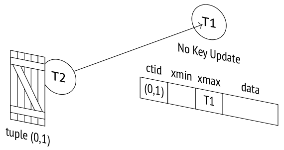
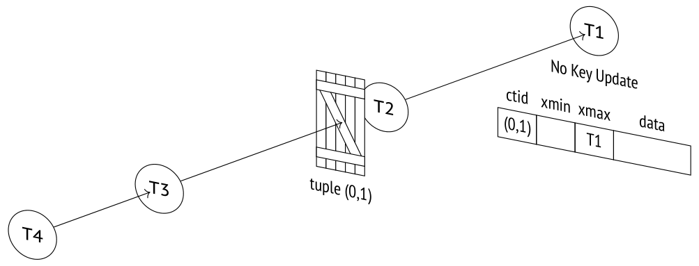
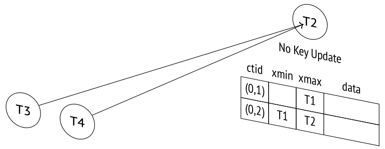
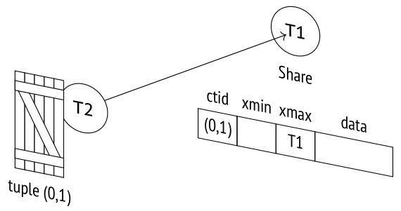
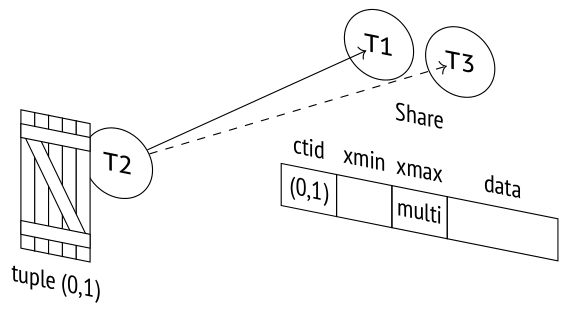
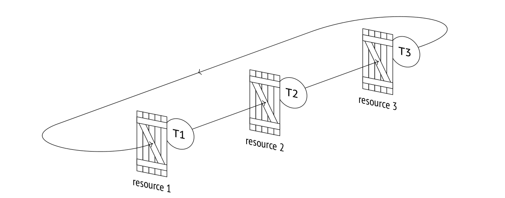
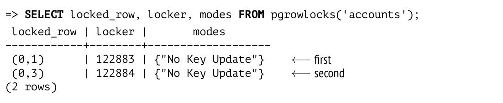
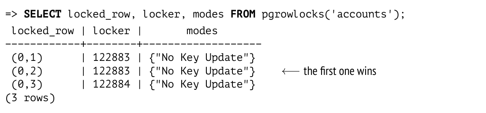

# Chương 13. Row-Level Locks (Khóa mức dòng)

## 13.1 Thiết kế lock (Lock Design)

Nhờ snapshot isolation, các heap tuple không cần phải bị lock khi đọc. Tuy nhiên, không được phép để hai transaction ghi cùng sửa đổi một dòng tại cùng một thời điểm. Trong trường hợp này các dòng phải được lock, nhưng heavyweight lock không phải là lựa chọn tốt cho mục đích đó: mỗi lock chiếm chỗ trong shared memory của server (hàng trăm byte, chưa kể toàn bộ hạ tầng hỗ trợ), và các cơ chế nội bộ của PostgreSQL không được thiết kế để xử lý một số lượng khổng lồ heavyweight lock đồng thời.

Một số hệ cơ sở dữ liệu giải quyết vấn đề này bằng lock escalation (leo thang lock): nếu có quá nhiều lock mức dòng, chúng được thay bằng một lock duy nhất có độ chi tiết thô hơn (ví dụ, một lock mức page hoặc mức bảng). Cách này đơn giản hóa việc cài đặt, nhưng đồng thời có thể hạn chế đáng kể thông lượng của hệ thống.

Trong PostgreSQL, thông tin về việc một dòng cụ thể có bị lock hay không chỉ được lưu trong header của heap tuple hiện hành của nó. Lock mức dòng thực chất là các thuộc tính trong heap page chứ không phải là lock thật sự, và chúng hoàn toàn không được phản ánh trong RAM dưới bất kỳ hình thức nào.

Một dòng thường bị lock khi nó đang được cập nhật hoặc xóa. Trong cả hai trường hợp, phiên bản hiện hành của dòng được đánh dấu là đã xóa *[→ tr. 72](03-pages-and-tuples.md)*. Thuộc tính dùng cho mục đích này là ID của transaction hiện tại được ghi trong trường `xmax`, và cũng chính ID đó (kết hợp với các hint bit bổ sung) cho biết rằng dòng đang bị lock. Nếu một transaction muốn sửa đổi một dòng nhưng thấy một ID transaction đang hoạt động trong trường `xmax` của phiên bản hiện hành, nó phải chờ transaction này hoàn tất. Khi transaction đó kết thúc, tất cả các lock được giải phóng, và transaction đang chờ có thể tiếp tục.

Cơ chế này cho phép lock bao nhiêu dòng tùy ý mà không tốn thêm chi phí.

Nhược điểm của giải pháp này là các tiến trình khác không thể xếp thành hàng đợi, vì RAM không chứa thông tin gì về những lock như vậy. Do đó, heavyweight lock vẫn cần thiết: một tiến trình đang chờ một dòng được giải phóng sẽ yêu cầu lock trên ID của transaction hiện đang bận với dòng này. Khi transaction đó hoàn tất, dòng lại trở nên khả dụng. Vì vậy, số lượng heavyweight lock tỷ lệ với số tiến trình đồng thời chứ không phải với số dòng đang bị sửa đổi.

## 13.2 Các mode lock mức dòng (Row-Level Locking Modes)

Lock mức dòng hỗ trợ bốn mode.[^1] Hai trong số đó cài đặt lock độc quyền (exclusive) mà mỗi lúc chỉ một transaction có thể giành được, còn hai mode còn lại cung cấp lock chia sẻ (shared) mà nhiều transaction có thể cùng giữ đồng thời.

Dưới đây là ma trận tương thích của các mode này:

|  | Key Share | Share | No Key Update | Update |
|---|---|---|---|---|
| Key Share |  |  |  | × |
| Share |  |  | × | × |
| No Key Update |  | × | × | × |
| Update | × | × | × | × |

### Các mode độc quyền (Exclusive Modes)

Mode `Update` cho phép sửa đổi bất kỳ trường nào của tuple và thậm chí xóa toàn bộ tuple, trong khi mode `No Key Update` chỉ cho phép những thay đổi không liên quan đến bất kỳ trường nào gắn với unique index (nói cách khác, foreign key không được bị ảnh hưởng).

Lệnh `UPDATE` tự động chọn mode lock yếu nhất có thể; các khóa (key) thường không thay đổi, nên các dòng thường bị lock ở mode `No Key Update`.

Hãy tạo một hàm sử dụng `pageinspect` để hiển thị một số metadata của tuple mà chúng ta quan tâm, cụ thể là trường `xmax` và một vài hint bit:

```
=> CREATE FUNCTION row_locks(relname text, pageno integer)
RETURNS TABLE(
  ctid tid,
  xmax text,
  lock_only text,
  is_multi text,
  keys_upd text,
  keyshr text,
  shr text
)
```

```
AS $$
SELECT (pageno,lp)::text::tid,
  t_xmax,
  CASE WHEN t_infomask & 128   = 128   THEN 't' END,
  CASE WHEN t_infomask & 4096  = 4096  THEN 't' END,
  CASE WHEN t_infomask2 & 8192 = 8192  THEN 't' END,
  CASE WHEN t_infomask & 16    = 16    THEN 't' END,
  CASE WHEN t_infomask & 16+64 = 16+64 THEN 't' END
FROM heap_page_items(get_raw_page(relname,pageno))
ORDER BY lp;
$$ LANGUAGE sql;
```

Bây giờ hãy bắt đầu một transaction trên bảng `accounts` để cập nhật số dư của tài khoản thứ nhất (khóa giữ nguyên) và ID của tài khoản thứ hai (khóa bị cập nhật):

```
=> BEGIN;
=> UPDATE accounts SET amount = amount + 100.00 WHERE id = 1;
=> UPDATE accounts SET id = 20 WHERE id = 2;
```

Page lúc này chứa metadata sau:

```
=> SELECT * FROM row_locks('accounts',0) LIMIT 2;
 ctid  |  xmax  | lock_only | is_multi | keys_upd | keyshr | shr
-------+--------+-----------+----------+----------+--------+-----
 (0,1) | 122858 |          |          |          |        |
 (0,2) | 122858 |          |          | t        |        |
(2 rows)
```

Mode lock được xác định bởi hint bit `keys_updated`.

```
=> ROLLBACK;
```

Lệnh `SELECT FOR` sử dụng cùng trường `xmax` làm thuộc tính lock, nhưng trong trường hợp này hint bit `xmax_lock_only` cũng phải được đặt. Bit này cho biết tuple bị lock nhưng không bị xóa, nghĩa là nó vẫn là phiên bản hiện hành:

```
=> BEGIN;
=> SELECT * FROM accounts WHERE id = 1 FOR NO KEY UPDATE;
=> SELECT * FROM accounts WHERE id = 2 FOR UPDATE;
=> SELECT * FROM row_locks('accounts',0) LIMIT 2;
 ctid  |  xmax  | lock_only | is_multi | keys_upd | keyshr | shr
-------+--------+-----------+----------+----------+--------+-----
 (0,1) | 122859 | t        |          |          |        |
 (0,2) | 122859 | t        |          | t        |        |
(2 rows)
=> ROLLBACK;
```

### Các mode chia sẻ (Shared Modes)

Mode `Share` có thể được áp dụng khi cần đọc một dòng nhưng phải cấm transaction khác sửa đổi nó. Mode `Key Share` cho phép cập nhật bất kỳ trường nào của tuple ngoại trừ các thuộc tính khóa.

Trong tất cả các mode chia sẻ, lõi PostgreSQL chỉ sử dụng `Key Share`, được áp dụng khi kiểm tra foreign key. Vì mode này tương thích với mode độc quyền `No Key Update`, việc kiểm tra foreign key không cản trở các cập nhật đồng thời trên các thuộc tính không phải khóa. Còn về phía ứng dụng, chúng có thể dùng bất kỳ mode chia sẻ nào tùy thích.

Tôi xin nhấn mạnh một lần nữa rằng các lệnh `SELECT` đơn giản không bao giờ sử dụng lock mức dòng.

```
=> BEGIN;
=> SELECT * FROM accounts WHERE id = 1 FOR KEY SHARE;
=> SELECT * FROM accounts WHERE id = 2 FOR SHARE;
```

Đây là những gì chúng ta thấy trong các heap tuple:

```
=> SELECT * FROM row_locks('accounts',0) LIMIT 2;
 ctid  |  xmax  | lock_only | is_multi | keys_upd | keyshr | shr
-------+--------+-----------+----------+----------+--------+-----
 (0,1) | 122860 | t        |          |          | t      |
 (0,2) | 122860 | t        |          |          | t      | t
(2 rows)
```

Bit `xmax_keyshr_lock` được đặt cho cả hai thao tác, nhưng bạn có thể nhận ra mode `Share` qua các hint bit khác.[^2]

## 13.3 Multitransaction

Như chúng ta đã thấy, thuộc tính lock được biểu diễn bằng trường `xmax`, được đặt bằng ID của transaction đã giành được lock. Vậy thuộc tính này được đặt thế nào cho một lock chia sẻ do nhiều transaction cùng giữ?

Khi làm việc với lock chia sẻ, PostgreSQL áp dụng cái gọi là *multitransaction* (multixact).[^3] Một multitransaction là một nhóm transaction được gán một ID riêng. Thông tin chi tiết về các thành viên của nhóm và mode lock của chúng được lưu trong các file dưới thư mục `PGDATA/pg_multixact`. Để truy cập nhanh hơn, các page bị lock được cache trong shared memory của server;[^4] mọi thay đổi đều được ghi log để đảm bảo khả năng chịu lỗi.

Multixact ID có cùng độ dài 32 bit như ID transaction thông thường, nhưng chúng được cấp phát độc lập. Điều đó có nghĩa là transaction và multitransaction có thể có ID trùng nhau. Để phân biệt hai loại này, PostgreSQL sử dụng thêm một hint bit: `xmax_is_multi`.

Hãy thêm một lock độc quyền nữa do một transaction khác giành được (các mode `Key Share` và `No Key Update` tương thích với nhau):

> ```
> => BEGIN;
> => UPDATE accounts SET amount = amount + 100.00 WHERE id = 1;
> ```

```
=> SELECT * FROM row_locks('accounts',0) LIMIT 2;
 ctid  |  xmax  | lock_only | is_multi | keys_upd | keyshr | shr
-------+--------+-----------+----------+----------+--------+-----
 (0,1) | 1      |          | t        |          |        |
 (0,2) | 122860 | t        |          |          | t      | t
(2 rows)
```

Bit `xmax_is_multi` cho thấy dòng đầu tiên sử dụng một multitransaction ID thay vì một ID thông thường.

Không đi sâu thêm vào chi tiết cài đặt, hãy hiển thị thông tin về tất cả các lock mức dòng có thể có bằng extension `pgrowlocks`:

```
=> CREATE EXTENSION pgrowlocks;
=> SELECT * FROM pgrowlocks('accounts') \gx
-[ RECORD 1 ]-----------------------------
locked_row | (0,1)
locker     | 1
multi      | t
xids       | {122860,122861}
modes      | {"Key Share","No Key Update"}
pids       | {30423,30723}
-[ RECORD 2 ]-----------------------------
locked_row | (0,2)
locker     | 122860
multi      | f
xids       | {122860}
modes      | {"For Share"}
pids       | {30423}
```

Điều này trông rất giống việc truy vấn view `pg_locks`, nhưng hàm `pgrowlocks` phải truy cập các heap page, vì RAM không chứa thông tin gì về lock mức dòng.

```
=> COMMIT;
```

> ```
> => ROLLBACK;
> ```

Vì multixact ID dài 32 bit, chúng cũng chịu hiện tượng wraparound do giới hạn của bộ đếm, giống hệt như ID transaction thông thường *[→ tr. 123](07-freezing.md)*. Do đó, PostgreSQL phải xử lý multixact ID theo cách tương tự như freezing: các multixact ID cũ được thay bằng ID mới (hoặc bằng một ID transaction thông thường nếu vào thời điểm đó chỉ còn một transaction giữ lock).[^5]

Nhưng trong khi ID transaction thông thường chỉ được freeze ở trường `xmin` (vì một `xmax` khác rỗng cho biết tuple đã lỗi thời và sẽ sớm bị loại bỏ), thì với multitransaction, chính trường `xmax` mới là trường phải được freeze: phiên bản dòng hiện hành có thể bị các transaction mới liên tục lock ở mode chia sẻ.

Việc freeze multitransaction có thể được điều khiển qua các parameter cấu hình, khá giống với các parameter dành cho freezing thông thường: *vacuum_multixact_freeze_min_age*, *vacuum_multixact_freeze_table_age*, *autovacuum_multixact_freeze_max_age*, và parameter mới được bổ sung *vacuum_multixact_failsafe_age*. *(v. 14)*

## 13.4 Hàng đợi chờ (Wait Queue)

### Các mode độc quyền (Exclusive Modes)

Vì lock mức dòng chỉ là một thuộc tính, hàng đợi được tổ chức theo một cách không hề đơn giản. Khi một transaction chuẩn bị sửa đổi một dòng, nó phải thực hiện các bước sau:[^6]

1 Nếu trường `xmax` và các hint bit cho biết dòng đang bị lock ở một mode không tương thích, giành một heavyweight lock độc quyền trên tuple đang được sửa đổi.

2 Nếu cần, chờ cho đến khi tất cả các lock không tương thích được giải phóng bằng cách yêu cầu lock trên ID của transaction `xmax` (hoặc của nhiều transaction nếu `xmax` chứa một multixact ID).

3 Ghi ID của chính nó vào `xmax` trong header của tuple và đặt các hint bit cần thiết.

4 Giải phóng tuple lock nếu nó đã được giành ở bước thứ nhất.

Một *tuple* lock là thêm một loại heavyweight lock nữa, có kiểu `tuple` (đừng nhầm với lock mức dòng thông thường).

Có vẻ như bước 1 và 4 là thừa và chỉ cần chờ cho đến khi tất cả các transaction đang lock kết thúc là đủ. Tuy nhiên, nếu nhiều transaction cùng cố cập nhật một dòng, tất cả chúng sẽ chờ transaction hiện đang xử lý dòng này. Khi transaction đó hoàn tất, chúng sẽ rơi vào tình trạng race condition (tranh chấp) để giành quyền lock dòng, và một số transaction "kém may mắn" có thể phải chờ trong một khoảng thời gian dài vô hạn. Tình huống như vậy được gọi là *resource starvation* (đói tài nguyên).

Tuple lock xác định transaction đầu tiên trong hàng đợi và đảm bảo rằng nó sẽ là transaction tiếp theo nhận được lock.

Nhưng bạn có thể tự mình kiểm chứng điều này. Vì PostgreSQL giành rất nhiều loại lock khác nhau trong quá trình hoạt động, và mỗi lock được phản ánh thành một dòng riêng trong bảng `pg_locks`, tôi sẽ tạo thêm một view nữa dựa trên `pg_locks`. View này sẽ hiển thị thông tin ở dạng gọn hơn, chỉ giữ lại những lock mà chúng ta đang quan tâm (những lock liên quan đến bảng `accounts` và đến chính transaction, ngoại trừ các lock trên virtual ID):

```
=> CREATE VIEW locks_accounts AS
SELECT pid,
  locktype,
  CASE locktype
    WHEN 'relation' THEN relation::regclass::text
    WHEN 'transactionid' THEN transactionid::text
    WHEN 'tuple' THEN relation::regclass||'('||page||','||tuple||')'
  END AS lockid,
  mode,
  granted
FROM pg_locks
WHERE locktype in ('relation','transactionid','tuple')
  AND (locktype != 'relation' OR relation = 'accounts'::regclass)
ORDER BY 1, 2, 3;
```

Hãy bắt đầu transaction thứ nhất và cập nhật một dòng:

> ```
> => BEGIN;
> => SELECT txid_current(), pg_backend_pid();
>  txid_current | pg_backend_pid
> --------------+----------------
>        122863 |         30723
> (1 row)
> => UPDATE accounts SET amount = amount + 100.00 WHERE id = 1;
> ```

Transaction đã hoàn thành cả bốn bước của quy trình và hiện đang giữ một lock trên bảng:

```
=> SELECT * FROM locks_accounts WHERE pid = 30723;
  pid  |   locktype    | lockid  |       mode       | granted
-------+---------------+----------+------------------+---------
 30723 | relation      | accounts | RowExclusiveLock | t
 30723 | transactionid | 122863  | ExclusiveLock    | t
(2 rows)
```

Bắt đầu transaction thứ hai và thử cập nhật cùng dòng đó. Transaction sẽ bị treo, chờ một lock:

> ```
> => BEGIN;
> => SELECT txid_current(), pg_backend_pid();
>  txid_current | pg_backend_pid
> --------------+----------------
>        122864 |         30794
> (1 row)
> => UPDATE accounts SET amount = amount + 100.00 WHERE id = 1;
> ```



Transaction thứ hai chỉ đi được đến bước thứ hai. Vì lý do này, ngoài việc lock bảng và ID của chính nó, nó còn thêm hai lock nữa, cũng được phản ánh trong view `pg_locks`: lock `tuple` giành được ở bước thứ nhất và lock trên ID của transaction thứ hai được yêu cầu ở bước thứ hai:

```
=> SELECT * FROM locks_accounts WHERE pid = 30794;
  pid  |   locktype    |   lockid     |       mode       | granted
-------+---------------+---------------+------------------+---------
 30794 | relation      | accounts     | RowExclusiveLock | t
 30794 | transactionid | 122863       | ShareLock        | f
 30794 | transactionid | 122864       | ExclusiveLock    | t
 30794 | tuple         | accounts(0,1) | ExclusiveLock   | t
(4 rows)
```

Transaction thứ ba sẽ bị kẹt ở bước thứ nhất. Nó sẽ cố giành lock trên tuple và dừng lại tại đây:

> ```
> => BEGIN;
> => SELECT txid_current(), pg_backend_pid();
>  txid_current | pg_backend_pid
> --------------+----------------
>        122865 |         30865
> (1 row)
> => UPDATE accounts SET amount = amount + 100.00 WHERE id = 1;
> ```

```
=> SELECT * FROM locks_accounts WHERE pid = 30865;
  pid  |   locktype    |   lockid     |       mode       | granted
-------+---------------+---------------+------------------+---------
 30865 | relation      | accounts     | RowExclusiveLock | t
 30865 | transactionid | 122865       | ExclusiveLock    | t
 30865 | tuple         | accounts(0,1) | ExclusiveLock   | f
(3 rows)
```

Transaction thứ tư và tất cả các transaction tiếp theo cố cập nhật dòng này sẽ không khác gì transaction thứ ba về mặt này: tất cả chúng sẽ chờ trên cùng một tuple lock.

> ```
> => BEGIN;
> => SELECT txid_current(), pg_backend_pid();
>  txid_current | pg_backend_pid
> --------------+----------------
>        122866 |         30936
> (1 row)
> => UPDATE accounts SET amount = amount + 100.00 WHERE id = 1;
> ```

```
=> SELECT * FROM locks_accounts WHERE pid = 30865;
  pid  |   locktype    |   lockid     |       mode       | granted
-------+---------------+---------------+------------------+---------
 30865 | relation      | accounts     | RowExclusiveLock | t
 30865 | transactionid | 122865       | ExclusiveLock    | t
 30865 | tuple         | accounts(0,1) | ExclusiveLock   | f
(3 rows)
```



Để có bức tranh đầy đủ về các lần chờ hiện tại, bạn có thể mở rộng view `pg_stat_activity` với thông tin về các tiến trình đang giữ lock:

```
=> SELECT pid,
  wait_event_type,
  wait_event,
  pg_blocking_pids(pid)
```

```
FROM pg_stat_activity
WHERE pid IN (30723,30794,30865,30936);
  pid  | wait_event_type | wait_event   | pg_blocking_pids
-------+-----------------+---------------+------------------
 30723 | Client         | ClientRead    | {}
 30794 | Lock           | transactionid | {30723}
 30865 | Lock           | tuple         | {30794}
 30936 | Lock           | tuple         | {30794,30865}
(4 rows)
```

Nếu transaction thứ nhất bị abort, mọi thứ sẽ diễn ra như mong đợi: tất cả các transaction tiếp theo sẽ tiến thêm một bước mà không chen hàng.

Tuy nhiên, khả năng cao hơn là transaction thứ nhất sẽ được commit. Ở isolation level `Repeatable Read` hoặc `Serializable`, điều đó sẽ dẫn đến lỗi serialization, nên transaction thứ hai sẽ phải bị abort[^7] (và tất cả các transaction tiếp theo trong hàng đợi cũng sẽ bị abort). Nhưng ở isolation level `Read Committed`, dòng đã bị sửa đổi sẽ được đọc lại, và việc cập nhật nó sẽ được thử lại.

Vậy, transaction thứ nhất được commit:

> ```
> => COMMIT;
> ```

Transaction thứ hai thức dậy và hoàn thành thành công bước thứ ba và thứ tư của quy trình:

> ```
> UPDATE 1
> ```

```
=> SELECT * FROM locks_accounts WHERE pid = 30794;
  pid  |   locktype    | lockid  |       mode       | granted
-------+---------------+----------+------------------+---------
 30794 | relation      | accounts | RowExclusiveLock | t
 30794 | transactionid | 122864  | ExclusiveLock    | t
(2 rows)
```

Ngay khi transaction thứ hai giải phóng tuple lock, transaction thứ ba cũng thức dậy, nhưng nó thấy rằng trường `xmax` của tuple mới đã chứa một ID khác. Tại thời điểm này, quy trình nêu trên kết thúc. Ở isolation level `Read Committed`, một lần thử lock dòng nữa được thực hiện,[^8] nhưng không theo các bước đã mô tả. Transaction thứ ba giờ chờ transaction thứ hai hoàn tất mà không cố giành tuple lock:

```
=> SELECT * FROM locks_accounts WHERE pid = 30865;
  pid  |   locktype    | lockid  |       mode       | granted
-------+---------------+----------+------------------+---------
 30865 | relation      | accounts | RowExclusiveLock | t
 30865 | transactionid | 122864  | ShareLock        | f
 30865 | transactionid | 122865  | ExclusiveLock    | t
(3 rows)
```

Transaction thứ tư cũng làm tương tự:

```
=> SELECT * FROM locks_accounts WHERE pid = 30936;
  pid  |   locktype    | lockid  |       mode       | granted
-------+---------------+----------+------------------+---------
 30936 | relation      | accounts | RowExclusiveLock | t
 30936 | transactionid | 122864  | ShareLock        | f
 30936 | transactionid | 122866  | ExclusiveLock    | t
(3 rows)
```

Giờ cả transaction thứ ba lẫn thứ tư đều đang chờ transaction thứ hai hoàn tất, có nguy cơ rơi vào race condition. Hàng đợi trên thực tế đã tan rã.



Nếu có các transaction khác tham gia hàng đợi khi nó vẫn còn tồn tại, tất cả chúng cũng sẽ bị kéo vào cuộc tranh chấp này.

Kết luận: không nên cập nhật cùng một dòng của bảng trong nhiều tiến trình đồng thời. Dưới tải cao, điểm nóng này có thể nhanh chóng trở thành nút thắt cổ chai gây ra các vấn đề về hiệu năng.

Hãy commit tất cả các transaction đã bắt đầu.

> ```
> => COMMIT;
> ```

> ```
> UPDATE 1
> => COMMIT;
> ```

> ```
> UPDATE 1
> => COMMIT;
> ```

### Các mode chia sẻ (Shared Modes)

PostgreSQL chỉ giành lock chia sẻ cho việc kiểm tra toàn vẹn tham chiếu (referential integrity). Việc sử dụng chúng trong một ứng dụng tải cao có thể dẫn đến resource starvation, và mô hình lock hai cấp không thể ngăn chặn kết cục như vậy.

Hãy nhắc lại các bước mà một transaction cần thực hiện để lock một dòng:

1 Nếu trường `xmax` và các hint bit cho biết dòng đang bị lock ở mode *độc quyền*, giành một heavyweight tuple lock độc quyền.

2 Nếu cần, chờ tất cả các lock *không tương thích* được giải phóng bằng cách yêu cầu lock trên ID của transaction `xmax` (hoặc của nhiều transaction nếu `xmax` chứa một multixact ID).

3 Ghi ID của chính nó vào `xmax` trong header của tuple và đặt các hint bit cần thiết.

4 Giải phóng tuple lock nếu nó đã được giành ở bước thứ nhất.

Hai bước đầu tiên ngụ ý rằng nếu các mode lock *tương thích*, transaction sẽ *chen hàng*.

Hãy lặp lại thí nghiệm của chúng ta từ đầu.

```
=> TRUNCATE accounts;
=> INSERT INTO accounts(id, client, amount)
VALUES
  (1,'alice',100.00),
  (2,'bob',200.00),
  (3,'charlie',300.00);
```

Bắt đầu transaction thứ nhất:

> ```
> => BEGIN;
> => SELECT txid_current(), pg_backend_pid();
>  txid_current | pg_backend_pid
> --------------+----------------
>        122869 |         30723
> (1 row)
> ```

Dòng giờ bị lock ở mode chia sẻ:

> ```
> => SELECT * FROM accounts WHERE id = 1 FOR SHARE;
> ```

Transaction thứ hai cố cập nhật cùng dòng đó, nhưng không được phép: các mode `Share` và `No Key Update` không tương thích:

> ```
> => BEGIN;
> => SELECT txid_current(), pg_backend_pid();
>  txid_current | pg_backend_pid
> --------------+----------------
>        122870 |         30794
> (1 row)
> => UPDATE accounts SET amount = amount + 100.00 WHERE id = 1;
> ```

Trong khi chờ transaction thứ nhất hoàn tất, transaction thứ hai đang giữ tuple lock, giống như trong ví dụ trước:

```
=> SELECT * FROM locks_accounts WHERE pid = 30794;
  pid  |   locktype    |   lockid     |       mode       | granted
-------+---------------+---------------+------------------+---------
 30794 | relation      | accounts     | RowExclusiveLock | t
 30794 | transactionid | 122869       | ShareLock        | f
 30794 | transactionid | 122870       | ExclusiveLock    | t
 30794 | tuple         | accounts(0,1) | ExclusiveLock   | t
(4 rows)
```



Bây giờ hãy để transaction thứ ba lock dòng ở mode chia sẻ. Lock như vậy tương thích với lock đã được giành, nên transaction này chen hàng:

> ```
> => BEGIN;
> => SELECT txid_current(), pg_backend_pid();
>  txid_current | pg_backend_pid
> --------------+----------------
>        122871 |         30865
> (1 row)
> => SELECT * FROM accounts WHERE id = 1 FOR SHARE;
> ```

Chúng ta có hai transaction cùng lock một dòng:

```
=> SELECT * FROM pgrowlocks('accounts') \gx
-[ RECORD 1 ]---------------
locked_row | (0,1)
locker     | 2
multi      | t
xids       | {122869,122871}
modes      | {Share,Share}
pids       | {30723,30865}
```



Nếu transaction thứ nhất hoàn tất vào lúc này, transaction thứ hai sẽ thức dậy, thấy rằng dòng vẫn bị lock và sẽ quay lại hàng đợi — nhưng lần này nó sẽ đứng sau transaction thứ ba:

> ```
> => COMMIT;
> ```

```
=> SELECT * FROM locks_accounts WHERE pid = 30794;
  pid  |   locktype    |   lockid     |       mode       | granted
-------+---------------+---------------+------------------+---------
 30794 | relation      | accounts     | RowExclusiveLock | t
 30794 | transactionid | 122870       | ExclusiveLock    | t
 30794 | transactionid | 122871       | ShareLock        | f
 30794 | tuple         | accounts(0,1) | ExclusiveLock   | t
(4 rows)
```

Và chỉ khi transaction thứ ba hoàn tất thì transaction thứ hai mới có thể thực hiện cập nhật (trừ khi có các lock chia sẻ khác xuất hiện trong khoảng thời gian này).

> ```
> => COMMIT;
> ```

> ```
> UPDATE 1
> => COMMIT;
> ```

Việc kiểm tra foreign key khó có thể gây ra vấn đề, vì các thuộc tính khóa thường không thay đổi và `Key Share` có thể dùng cùng với `No Key Update`. Nhưng trong hầu hết các trường hợp, bạn nên tránh dùng lock mức dòng chia sẻ trong ứng dụng.

## 13.5 Lock không chờ (No-Wait Locks)

Các lệnh SQL thường chờ cho đến khi tài nguyên được yêu cầu được giải phóng. Nhưng đôi khi sẽ hợp lý hơn nếu hủy thao tác khi không thể giành được lock ngay lập tức. Với mục đích này, các lệnh như `SELECT`, `LOCK` và `ALTER` cung cấp mệnh đề `NOWAIT`.

Hãy lock một dòng:

```
=> BEGIN;
=> UPDATE accounts SET amount = amount + 100.00 WHERE id = 1;
```

Lệnh có mệnh đề `NOWAIT` lập tức kết thúc với lỗi nếu tài nguyên được yêu cầu đang bị lock:

> ```
> => SELECT * FROM accounts
> FOR UPDATE NOWAIT;
> ERROR:  could not obtain lock on row in relation "accounts"
> ```

Lỗi như vậy có thể được bắt và xử lý bởi mã ứng dụng.

Các lệnh `UPDATE` và `DELETE` không có mệnh đề `NOWAIT`. Thay vào đó, bạn có thể thử lock dòng bằng lệnh `SELECT FOR UPDATE NOWAIT` rồi cập nhật hoặc xóa nó nếu lần thử thành công.

Trong một số ít trường hợp, có thể thuận tiện hơn nếu bỏ qua các dòng đã bị lock và bắt đầu xử lý ngay các dòng khả dụng. Đây chính xác là điều mà `SELECT FOR` làm khi được chạy với mệnh đề `SKIP LOCKED`:

> ```
> => SELECT * FROM accounts
> ORDER BY id
> FOR UPDATE SKIP LOCKED
> LIMIT 1;
>  id | client | amount
> ----+--------+--------
>   2 | bob    | 200.00
> (1 row)
> ```

Trong ví dụ này, dòng đầu tiên (đã bị lock) bị bỏ qua, và truy vấn đã lock và trả về dòng thứ hai.

Cách tiếp cận này cho phép chúng ta xử lý các dòng theo lô hoặc thiết lập xử lý song song các hàng đợi sự kiện *[→ tr. 142](08-rebuilding-tables-and-indexes.md)*. Tuy nhiên, đừng tự nghĩ ra các trường hợp sử dụng khác cho lệnh này — hầu hết các bài toán đều có thể giải quyết bằng những phương pháp đơn giản hơn nhiều.

Cuối cùng nhưng không kém phần quan trọng, bạn có thể tránh những lần chờ lâu bằng cách đặt timeout:

> ```
> => SET lock_timeout = '1s';
> => ALTER TABLE accounts DROP COLUMN amount;
> ERROR:  canceling statement due to lock timeout
> ```

Lệnh kết thúc với lỗi vì nó không giành được lock trong vòng một giây. Timeout có thể được đặt không chỉ ở mức session mà còn ở các mức thấp hơn, ví dụ cho một transaction cụ thể.

Phương pháp này ngăn các lần chờ lâu trong quá trình xử lý bảng khi lệnh cần lock độc quyền được thực thi dưới tải. Nếu xảy ra lỗi, lệnh này có thể được thử lại sau một lúc.

> Trong khi *statement_timeout* giới hạn tổng thời gian thực thi câu lệnh, parameter *lock_timeout* xác định thời gian tối đa có thể dành cho việc chờ một lock.

```
=> ROLLBACK;
```

## 13.6 Deadlock

Đôi khi một transaction có thể cần một tài nguyên đang được một transaction khác sử dụng, và transaction đó đến lượt mình lại có thể đang chờ một tài nguyên bị lock bởi transaction thứ ba, v.v. Các transaction như vậy được xếp hàng đợi nhờ heavyweight lock.

Nhưng thỉnh thoảng một transaction đã ở trong hàng đợi lại cần thêm một tài nguyên khác, nên nó phải tham gia lại chính hàng đợi đó và chờ tài nguyên này được giải phóng. Một *deadlock*[^9] (khóa chết) xảy ra: hàng đợi giờ có một phụ thuộc vòng tròn không thể tự giải quyết.

Để trực quan hơn, hãy vẽ một wait-for graph (đồ thị chờ). Các nút của nó biểu diễn các tiến trình đang hoạt động, còn các cạnh được vẽ dưới dạng mũi tên chỉ từ các tiến trình đang chờ lock đến các tiến trình đang giữ những lock này. Nếu đồ thị có một *chu trình*, tức là một nút có thể đi đến chính nó theo các mũi tên, điều đó có nghĩa là đã xảy ra deadlock.

> Các hình minh họa ở đây thể hiện transaction thay vì tiến trình. Sự thay thế này thường chấp nhận được vì một transaction được thực thi bởi một tiến trình, và lock chỉ có thể được giành bên trong một transaction. Nhưng nói chung, nói về tiến trình thì chính xác hơn, vì một số lock có thể không được giải phóng ngay khi transaction hoàn tất.

Nếu deadlock đã xảy ra và không bên tham gia nào đặt timeout, các transaction sẽ chờ nhau mãi mãi. Đó là lý do lock manager[^10] thực hiện phát hiện deadlock tự động.



Tuy nhiên, việc kiểm tra này đòi hỏi một chút công sức, không nên lãng phí mỗi khi có yêu cầu lock (xét cho cùng, deadlock không xảy ra quá thường xuyên). Vì vậy, nếu tiến trình cố giành lock không thành công và rơi vào trạng thái ngủ sau khi tham gia hàng đợi, PostgreSQL tự động đặt một timeout theo giá trị của parameter *deadlock_timeout* *(mặc định: 1s)*.[^11] Nếu tài nguyên trở nên khả dụng sớm hơn — tuyệt, khi đó chi phí phụ trội của việc kiểm tra sẽ được tránh. Nhưng nếu việc chờ vẫn tiếp diễn sau *deadlock_timeout* đơn vị thời gian, tiến trình đang chờ sẽ thức dậy và khởi động việc kiểm tra.[^12]

Việc kiểm tra này thực chất bao gồm xây dựng một wait-for graph và tìm kiếm chu trình trong đó.[^13] Để "đóng băng" trạng thái hiện tại của đồ thị, PostgreSQL dừng mọi xử lý heavyweight lock trong suốt thời gian kiểm tra.

Nếu không phát hiện deadlock nào, tiến trình lại rơi vào trạng thái ngủ; sớm hay muộn cũng sẽ đến lượt nó.

Nếu phát hiện deadlock, một trong các transaction sẽ bị buộc kết thúc, qua đó giải phóng các lock của nó và cho phép các transaction khác tiếp tục thực thi. Trong hầu hết các trường hợp, chính transaction khởi động việc kiểm tra sẽ bị ngắt, nhưng nếu chu trình bao gồm một tiến trình autovacuum hiện không freeze tuple để ngăn wraparound, server sẽ kết thúc autovacuum vì nó có độ ưu tiên thấp hơn.

Deadlock thường cho thấy thiết kế ứng dụng kém. Để phát hiện những tình huống như vậy, bạn cần theo dõi hai thứ: các thông báo tương ứng trong log của server và giá trị `deadlocks` tăng dần trong bảng `pg_stat_database`.

### Deadlock do cập nhật dòng (Deadlocks by Row Updates)

Mặc dù xét cho cùng deadlock là do heavyweight lock gây ra, phần lớn nguyên nhân dẫn đến chúng là các lock mức dòng được giành theo thứ tự khác nhau.

Giả sử một transaction sẽ chuyển $100 giữa hai tài khoản. Nó bắt đầu bằng việc rút số tiền này từ tài khoản thứ nhất:

```
=> BEGIN;
=> UPDATE accounts SET amount = amount - 100.00 WHERE id = 1;
UPDATE 1
```

Cùng lúc đó, một transaction khác sẽ chuyển $10 từ tài khoản thứ hai sang tài khoản thứ nhất. Nó bắt đầu bằng việc rút số tiền này từ tài khoản thứ hai:

> ```
> => BEGIN;
> => UPDATE accounts SET amount = amount - 10.00 WHERE id = 2;
> UPDATE 1
> ```

Bây giờ transaction thứ nhất cố tăng số tiền trong tài khoản thứ hai nhưng thấy rằng dòng tương ứng đang bị lock:

```
=> UPDATE accounts SET amount = amount + 100.00 WHERE id = 2;
```

Sau đó transaction thứ hai cố cập nhật tài khoản thứ nhất nhưng cũng bị lock:

> ```
> => UPDATE accounts SET amount = amount + 10.00 WHERE id = 1;
> ```

Việc chờ vòng tròn này sẽ không bao giờ tự giải quyết. Không thể giành được tài nguyên trong vòng một giây, transaction thứ nhất khởi động việc kiểm tra deadlock và bị server abort:

```
ERROR:  deadlock detected
DETAIL:  Process 30423 waits for ShareLock on transaction 122877;
blocked by process 30723.
Process 30723 waits for ShareLock on transaction 122876; blocked by
process 30423.
HINT:  See server log for query details.
CONTEXT:  while updating tuple (0,2) in relation "accounts"
```

Giờ transaction thứ hai có thể tiếp tục. Nó thức dậy và thực hiện cập nhật:

> ```
> UPDATE 1
> ```

Hãy kết thúc các transaction.

> ```
> => ROLLBACK;
> ```

```
=> ROLLBACK;
```

Cách đúng để thực hiện những thao tác như vậy là lock tài nguyên theo cùng một thứ tự. Ví dụ, trong trường hợp cụ thể này, các tài khoản lẽ ra có thể được lock theo thứ tự tăng dần của số tài khoản.

### Deadlock giữa hai câu lệnh UPDATE (Deadlocks Between Two UPDATE Statements)

Trong một số trường hợp, deadlock tưởng như không thể xảy ra, nhưng rồi chúng vẫn xảy ra.

Chúng ta thường cho rằng các lệnh SQL là nguyên tử, nhưng liệu có thực sự như vậy? Hãy xem xét kỹ hơn `UPDATE`: lệnh này lock các dòng khi chúng đang được cập nhật chứ không lock tất cả cùng lúc, và việc này không diễn ra đồng thời. Vì vậy, nếu một lệnh `UPDATE` sửa đổi nhiều dòng theo một thứ tự trong khi lệnh kia làm tương tự theo một thứ tự khác, deadlock có thể xảy ra.

Hãy tái hiện kịch bản này. Trước tiên, chúng ta sẽ xây dựng một index trên cột `amount`, theo thứ tự giảm dần:

```
=> CREATE INDEX ON accounts(amount DESC);
```

Để có thể quan sát quá trình, chúng ta có thể viết một hàm làm chậm mọi thứ lại:

```
=> CREATE FUNCTION inc_slow(n numeric)
RETURNS numeric
AS $$
  SELECT pg_sleep(1);
  SELECT n + 100.00;
$$ LANGUAGE sql;
```

Lệnh `UPDATE` thứ nhất sẽ cập nhật tất cả các tuple. Plan thực thi dựa trên sequential scan toàn bộ bảng.

```
=> EXPLAIN (costs off)
UPDATE accounts SET amount = inc_slow(amount);
        QUERY PLAN
---------------------------
 Update on accounts
   -> Seq Scan on accounts
(2 rows)
```

Để đảm bảo heap page lưu các dòng theo thứ tự tăng dần của cột `amount`, chúng ta phải truncate bảng và chèn lại các dòng:

```
=> TRUNCATE accounts;
=> INSERT INTO accounts(id, client, amount)
VALUES
  (1,'alice',100.00),
  (2,'bob',200.00),
  (3,'charlie',300.00);
```

```
=> ANALYZE accounts;
=> SELECT ctid, * FROM accounts;
 ctid  | id | client  | amount
-------+----+---------+--------
 (0,1) |  1 | alice   | 100.00
 (0,2) |  2 | bob     | 200.00
 (0,3) |  3 | charlie | 300.00
(3 rows)
```

Sequential scan sẽ cập nhật các dòng theo cùng thứ tự đó (tuy nhiên điều này không phải lúc nào cũng đúng với các bảng lớn). *[→ tr. 156](09-buffer-cache.md)*

Hãy bắt đầu cập nhật:

> ```
> => UPDATE accounts SET amount = inc_slow(amount);
> ```

Trong lúc đó, chúng ta sẽ cấm sequential scan trong một session khác:

> ```
> => SET enable_seqscan = off;
> ```

Kết quả là planner chọn index scan cho lệnh `UPDATE` tiếp theo.

> ```
> => EXPLAIN (costs off)
> UPDATE accounts SET amount = inc_slow(amount)
> WHERE amount > 100.00;
>                       QUERY PLAN
> -------------------------------------------------------
>  Update on accounts
>    -> Index Scan using accounts_amount_idx on accounts
>        Index Cond: (amount > 100.00)
> (3 rows)
> ```

Dòng thứ hai và thứ ba thỏa mãn điều kiện; vì index là giảm dần, các dòng sẽ được cập nhật theo thứ tự ngược lại.

Hãy bắt đầu lần cập nhật tiếp theo:

> ```
> => UPDATE accounts SET amount = inc_slow(amount)
> WHERE amount > 100.00;
> ```

Extension `pgrowlocks` cho thấy câu lệnh thứ nhất đã cập nhật dòng đầu tiên `(0,1)`, trong khi câu lệnh thứ hai đã kịp cập nhật dòng cuối cùng `(0,3)`:

```
=> SELECT locked_row, locker, modes FROM pgrowlocks('accounts');
 locked_row | locker |      modes
------------+--------+-------------------
 (0,1)      | 122883 | {"No Key Update"}
 (0,3)      | 122884 | {"No Key Update"}
(2 rows)
```



Một giây nữa trôi qua. Câu lệnh thứ nhất đã cập nhật dòng thứ hai, và câu lệnh kia cũng muốn làm như vậy, nhưng không được phép.

```
=> SELECT locked_row, locker, modes FROM pgrowlocks('accounts');
 locked_row | locker |      modes
------------+--------+-------------------
 (0,1)      | 122883 | {"No Key Update"}
 (0,2)      | 122883 | {"No Key Update"}
 (0,3)      | 122884 | {"No Key Update"}
(3 rows)
```



Bây giờ câu lệnh thứ nhất muốn cập nhật dòng cuối cùng của bảng, nhưng dòng này đã bị câu lệnh thứ hai lock. Deadlock đã xảy ra.

Một trong các transaction bị abort:

> ```
> ERROR:  deadlock detected
> DETAIL:  Process 30794 waits for ShareLock on transaction 122883;
> blocked by process 30723.
> Process 30723 waits for ShareLock on transaction 122884; blocked by
> process 30794.
> HINT:  See server log for query details.
> CONTEXT:  while updating tuple (0,2) in relation "accounts"
> ```

Và transaction kia hoàn tất việc thực thi:

> ```
> UPDATE 3
> ```

Mặc dù những tình huống như vậy tưởng như không thể xảy ra, chúng vẫn xảy ra trong các hệ thống tải cao khi thực hiện cập nhật dòng theo lô.

[^1]: postgresql.org/docs/14/explicit-locking.html#LOCKING-ROWS
[^2]: include/access/htup_details.h
[^3]: backend/access/transam/multixact.c
[^4]: backend/access/transam/slru.c
[^5]: backend/access/heap/heapam.c, hàm FreezeMultiXactId
[^6]: backend/access/heap/README.tuplock
[^7]: backend/executor/nodeModifyTable.c, hàm ExecUpdate
[^8]: backend/access/heap/heapam_handler.c, hàm heapam_tuple_lock
[^9]: postgresql.org/docs/14/explicit-locking.html#LOCKING-DEADLOCKS
[^10]: backend/storage/lmgr/README
[^11]: backend/storage/lmgr/proc.c, hàm ProcSleep
[^12]: backend/storage/lmgr/proc.c, hàm CheckDeadLock
[^13]: backend/storage/lmgr/deadlock.c
