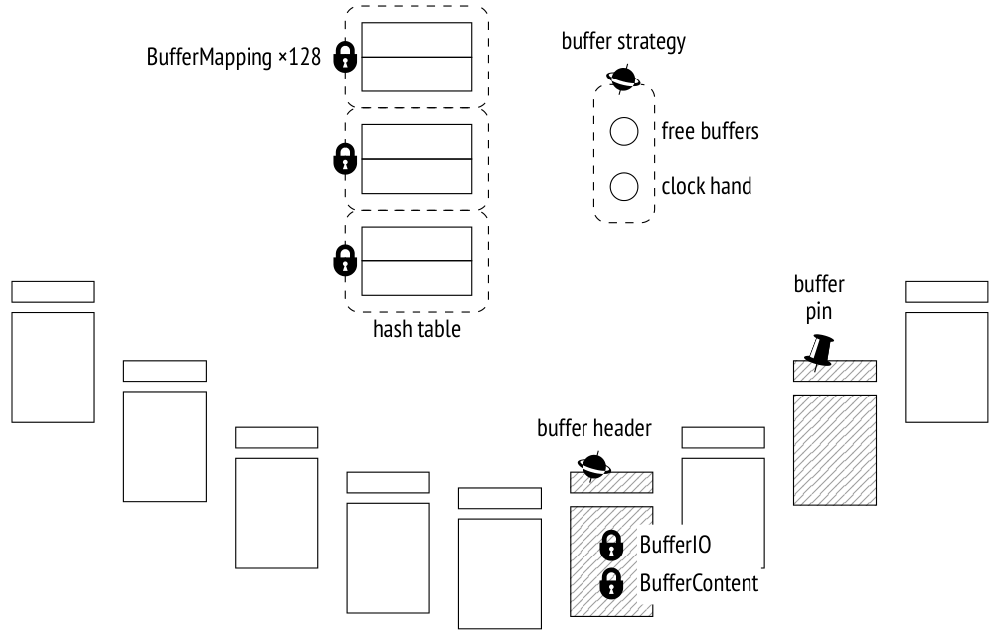
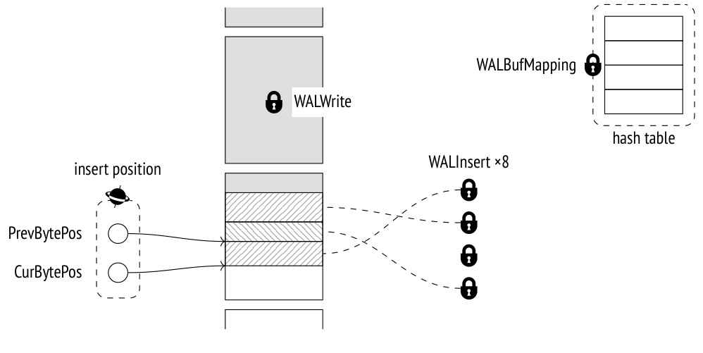

# Chương 15. Lock trên các cấu trúc bộ nhớ (Locks on Memory Structures)

## 15.1 Spinlock (Spinlocks)

Để bảo vệ các cấu trúc dữ liệu trong shared memory, PostgreSQL sử dụng một số loại lock nhẹ hơn và ít tốn kém hơn thay vì các heavyweight lock thông thường.

Loại lock đơn giản nhất là *spinlock*. Chúng thường được giữ trong một khoảng thời gian rất ngắn (không lâu hơn vài chu kỳ CPU) để bảo vệ các ô nhớ cụ thể khỏi các cập nhật đồng thời.

Spinlock dựa trên các lệnh CPU nguyên tử (atomic), chẳng hạn như compare-and-swap.[^1] Chúng chỉ hỗ trợ chế độ khoá độc quyền (exclusive). Nếu tài nguyên cần dùng đã bị khoá, tiến trình sẽ chờ bận (busy-wait), lặp lại lệnh (nó "quay" (spin) trong vòng lặp, do đó có tên gọi này). Nếu không thể giành được lock trong khoảng thời gian quy định, tiến trình tạm dừng một lúc rồi bắt đầu một vòng lặp khác.

Chiến lược này hợp lý nếu xác suất xung đột được ước tính là rất thấp, vì vậy sau một lần thử không thành công, lock nhiều khả năng sẽ giành được chỉ sau vài lệnh.

Spinlock không có cả cơ chế phát hiện deadlock lẫn instrumentation (công cụ đo đạc). Về mặt thực tiễn, chúng ta chỉ cần biết về sự tồn tại của chúng; toàn bộ trách nhiệm cài đặt chúng đúng đắn thuộc về các nhà phát triển PostgreSQL.

## 15.2 Lightweight lock (Lightweight Locks)

Tiếp theo là các *lightweight lock* (lock hạng nhẹ), hay lwlock.[^2] Được giữ trong khoảng thời gian cần thiết để xử lý một cấu trúc dữ liệu (ví dụ, một bảng băm (hash table) hoặc một danh sách con trỏ), lightweight lock thường ngắn; tuy nhiên, chúng có thể kéo dài hơn khi được dùng để bảo vệ các thao tác I/O.

Lightweight lock hỗ trợ hai chế độ: exclusive (độc quyền, để sửa đổi dữ liệu) và shared (chia sẻ, cho các thao tác chỉ đọc). Không có hàng đợi đúng nghĩa: nếu nhiều tiến trình đang chờ một lock, một trong số chúng sẽ được truy cập tài nguyên theo cách ít nhiều ngẫu nhiên. Trong các hệ thống tải cao với nhiều tiến trình đồng thời, điều này có thể dẫn đến một số hiệu ứng khó chịu.

Không có cơ chế kiểm tra deadlock; chúng ta phải tin tưởng rằng các nhà phát triển PostgreSQL đã cài đặt lightweight lock một cách đúng đắn. Tuy nhiên, các lock này có instrumentation, vì vậy, khác với spinlock, chúng có thể được quan sát.

## 15.3 Ví dụ (Examples)

Để có chút hình dung về cách thức và nơi mà spinlock và lightweight lock có thể được sử dụng, hãy xem xét hai cấu trúc trong shared memory: buffer cache và WAL buffer. Tôi sẽ chỉ nêu tên một số lock; bức tranh đầy đủ quá phức tạp và có lẽ chỉ khiến các nhà phát triển lõi PostgreSQL quan tâm.

### Buffer cache (Buffer Cache)

Để truy cập bảng băm dùng để định vị một buffer cụ thể trong cache, tiến trình phải giành một lightweight lock `BufferMapping` ở chế độ shared để đọc hoặc ở chế độ exclusive nếu dự kiến có sửa đổi. *[→ tr. 147](09-buffer-cache.md)*



Bảng băm được truy cập rất thường xuyên, vì vậy lock này thường trở thành nút thắt cổ chai. Để tối đa hoá độ mịn (granularity), nó được tổ chức thành một *tranche* (nhóm) gồm 128 lightweight lock riêng lẻ, mỗi lock bảo vệ một phần riêng của bảng băm.[^3]

> Lock của bảng băm đã được chuyển thành một tranche gồm 16 lock từ tận năm 2006, trong PostgreSQL 8.2; mười năm sau, khi phiên bản 9.5 được phát hành, kích thước của tranche được tăng lên 128, nhưng có thể vẫn chưa đủ cho các hệ thống đa lõi hiện đại.

Để truy cập header của buffer, tiến trình giành spinlock `buffer header`[^4] (tên gọi này là tuỳ ý, vì spinlock không có tên hiển thị cho người dùng). Một số thao tác, chẳng hạn như tăng bộ đếm sử dụng (usage counter), không cần lock tường minh và có thể được thực hiện bằng các lệnh CPU nguyên tử.

Để đọc một page trong buffer, tiến trình giành lock `BufferContent` trong header của buffer này.[^5] Lock này thường chỉ được giữ trong lúc đọc các con trỏ tuple; sau đó, sự bảo vệ do việc pin buffer mang lại là đủ. Nếu nội dung buffer cần được sửa đổi, lock `BufferContent` phải được giành ở chế độ exclusive. *[→ tr. 148](09-buffer-cache.md)*

Khi một buffer được đọc từ đĩa (hoặc ghi xuống đĩa), PostgreSQL cũng giành một lock `BufferIO` trong header của buffer; thực chất nó là một thuộc tính được dùng như lock chứ không phải một lock thực sự.[^6] Nó báo hiệu cho các tiến trình khác đang yêu cầu truy cập page này rằng chúng phải chờ cho đến khi thao tác I/O hoàn tất.

Con trỏ tới các buffer trống và kim đồng hồ (clock hand) của cơ chế eviction được bảo vệ bởi một spinlock chung duy nhất `buffer strategy`.[^7]

### WAL buffer (WAL Buffers)

WAL cache cũng sử dụng một bảng băm để ánh xạ page tới buffer. Khác với bảng băm của buffer cache, nó được bảo vệ bởi một lightweight lock `WALBufMapping` duy nhất, vì WAL cache nhỏ hơn (nó thường chiếm 1/32 kích thước buffer cache) và việc truy cập buffer có trật tự hơn.[^8]



Việc ghi các page WAL xuống đĩa được bảo vệ bởi lightweight lock `WALWrite`, lock này đảm bảo rằng thao tác này chỉ được thực hiện bởi một tiến trình tại một thời điểm.

Để tạo một bản ghi WAL, tiến trình trước tiên dành riêng (reserve) một vùng không gian trong page WAL rồi điền dữ liệu vào đó. Việc dành riêng không gian được sắp thứ tự nghiêm ngặt; tiến trình phải giành spinlock `insert position` bảo vệ con trỏ chèn.[^9] Nhưng một khi không gian đã được dành riêng, nó có thể được điền bởi nhiều tiến trình đồng thời. Để làm điều này, mỗi tiến trình phải giành *bất kỳ* lock nào trong tám lightweight lock tạo nên tranche `WALInsert`.[^10]

## 15.4 Giám sát các lần chờ (Monitoring Waits)

Không nghi ngờ gì, lock là không thể thiếu để PostgreSQL hoạt động đúng, nhưng chúng có thể dẫn đến những lần chờ không mong muốn. Việc theo dõi các lần chờ như vậy rất hữu ích để hiểu nguồn gốc của chúng.

Cách dễ nhất để có cái nhìn tổng quan về các lock kéo dài là bật tham số *log_lock_waits* *(mặc định: off)*; nó cho phép ghi log chi tiết tất cả các lock khiến một transaction phải chờ lâu hơn *deadlock_timeout* *(mặc định: 1s)*. Dữ liệu này được hiển thị khi một lần kiểm tra deadlock hoàn tất, do đó có tên tham số như vậy. *[→ tr. 225](13-row-level-locks.md)*

Tuy nhiên, view `pg_stat_activity` cung cấp thông tin hữu ích và đầy đủ hơn nhiều. *(v. 9.6)* Bất cứ khi nào một tiến trình — dù là tiến trình hệ thống hay backend — không thể tiếp tục công việc của mình vì đang chờ một điều gì đó, lần chờ này được phản ánh trong các trường `wait_event_type` và `wait_event`, lần lượt cho biết loại và tên của lần chờ.

Tất cả các lần chờ có thể được phân loại như sau.[^11]

Các lần chờ trên những loại lock khác nhau tạo thành một nhóm khá lớn:

**Lock** — heavyweight lock

**LWLock** — lightweight lock

**BufferPin** — buffer đã được pin

Nhưng các tiến trình cũng có thể đang chờ các sự kiện khác:

**IO** — vào/ra, khi cần đọc hoặc ghi một số dữ liệu

**Client** — dữ liệu được gửi bởi client (`psql` dành phần lớn thời gian ở trạng thái này)

**IPC** — dữ liệu được gửi bởi một tiến trình khác

**Extension** — một sự kiện cụ thể được đăng ký bởi một extension

Đôi khi một tiến trình đơn giản là không thực hiện công việc hữu ích nào. Những lần chờ như vậy thường là "bình thường", nghĩa là chúng không cho thấy vấn đề gì. Nhóm này gồm các lần chờ sau:

**Activity** — các tiến trình nền trong vòng lặp chính của chúng

**Timeout** — bộ hẹn giờ

Lock của mỗi loại chờ lại được phân loại tiếp theo tên chờ. Ví dụ, các lần chờ trên lightweight lock mang tên của lock hoặc của tranche tương ứng.[^12]

Bạn nên lưu ý rằng view `pg_stat_activity` chỉ hiển thị những lần chờ được xử lý một cách thích hợp trong mã nguồn.[^13] Trừ khi tên của lần chờ xuất hiện trong view này, tiến trình không ở trạng thái chờ thuộc bất kỳ loại đã biết nào. Khoảng thời gian như vậy nên được xem là *không được tính đến* (unaccounted for); điều đó không nhất thiết có nghĩa là tiến trình không chờ gì cả — đơn giản là chúng ta không biết điều gì đang diễn ra vào lúc đó.

```
=> SELECT backend_type, wait_event_type AS event_type, wait_event
FROM pg_stat_activity;
         backend_type        | event_type |     wait_event
------------------------------+------------+---------------------
 logical replication launcher | Activity  | LogicalLauncherMain
 autovacuum launcher         | Activity   | AutoVacuumMain
 client backend              |            |
 background writer           | Activity   | BgWriterMain
 checkpointer                | Activity   | CheckpointerMain
 walwriter                   | Activity   | WalWriterMain
(6 rows)
```

Ở đây tất cả các tiến trình nền đều nhàn rỗi khi view được lấy mẫu, trong khi `client backend` đang bận thực thi truy vấn và không chờ gì cả.

## 15.5 Lấy mẫu (Sampling)

Đáng tiếc là view `pg_stat_activity` chỉ hiển thị thông tin *hiện tại* về các lần chờ; statistics không được tích luỹ. Cách duy nhất để thu thập dữ liệu chờ theo thời gian là *lấy mẫu* (sample) view này theo các khoảng đều đặn.

Chúng ta phải tính đến bản chất ngẫu nhiên của việc lấy mẫu. Lần chờ càng ngắn so với khoảng lấy mẫu thì cơ hội phát hiện lần chờ đó càng thấp. Do đó, khoảng lấy mẫu dài hơn đòi hỏi nhiều mẫu hơn để phản ánh đúng tình trạng thực tế (nhưng khi bạn tăng tần suất lấy mẫu, chi phí phụ trội cũng tăng theo). Vì cùng lý do đó, việc lấy mẫu hầu như vô dụng để phân tích các phiên (session) ngắn.

PostgreSQL không cung cấp công cụ lấy mẫu tích hợp sẵn; tuy nhiên, chúng ta vẫn có thể thử nghiệm bằng extension `pg_wait_sampling`[^14]. Để làm vậy, chúng ta phải chỉ định thư viện của nó trong tham số *shared_preload_libraries* và khởi động lại server:

```
=> ALTER SYSTEM SET shared_preload_libraries = 'pg_wait_sampling';
postgres$ pg_ctl restart -l /home/postgres/logfile
```

Bây giờ hãy cài đặt extension vào cơ sở dữ liệu:

```
=> CREATE EXTENSION pg_wait_sampling;
```

Extension này có thể hiển thị lịch sử các lần chờ, được lưu trong ring buffer của nó. Tuy nhiên, thú vị hơn nhiều là lấy được hồ sơ chờ (waiting profile) — statistics được tích luỹ trong suốt thời gian của phiên.

Ví dụ, hãy xem xét các lần chờ trong khi chạy benchmark. Chúng ta phải khởi động tiện ích `pgbench` và xác định ID tiến trình của nó trong khi nó đang chạy:

```
postgres$ /usr/local/pgsql/bin/pgbench -T 60 internals
=> SELECT pid FROM pg_stat_activity
WHERE application_name = 'pgbench';
  pid
-------
 36367
(1 row)
```

Khi bài kiểm tra hoàn tất, hồ sơ chờ sẽ trông như sau:

```
=> SELECT pid, event_type, event, count
FROM pg_wait_sampling_profile WHERE pid = 36367
ORDER BY count DESC LIMIT 4;
  pid  | event_type |   event     | count
-------+------------+--------------+-------
 36367 | IO         | WALSync     |  3478
 36367 | IO         | WALWrite    |    52
 36367 | Client     | ClientRead  |    30
 36367 | IO         | DataFileRead |    2
(4 rows)
```

Theo mặc định (được thiết lập bởi tham số *pg_wait_sampling.profile_period* *(mặc định: 10ms)*), các mẫu được lấy 100 lần mỗi giây. Vì vậy, để ước tính thời lượng các lần chờ tính bằng giây, bạn phải chia giá trị `count` cho 100.

Trong trường hợp cụ thể này, phần lớn các lần chờ liên quan đến việc đẩy (flush) các bản ghi WAL xuống đĩa. Đây là một minh hoạ tốt cho thời gian chờ không được tính đến: sự kiện `WALSync` chưa được instrument cho đến PostgreSQL 12 *(v. 12)*; với các phiên bản thấp hơn, hồ sơ chờ sẽ không chứa dòng đầu tiên, mặc dù bản thân lần chờ vẫn tồn tại.

Và đây là hồ sơ sẽ trông như thế nào nếu chúng ta làm chậm hệ thống file một cách nhân tạo để mỗi thao tác I/O mất 0,1 giây (tôi dùng `slowfs`[^15] cho mục đích này):

```
postgres$ /usr/local/pgsql/bin/pgbench -T 60 internals
=> SELECT pid FROM pg_stat_activity
WHERE application_name = 'pgbench';
  pid
-------
 36747
(1 row)
=> SELECT pid, event_type, event, count
FROM pg_wait_sampling_profile WHERE pid = 36747
ORDER BY count DESC LIMIT 4;
  pid  | event_type |    event      | count
-------+------------+----------------+-------
 36747 | IO         | WALWrite      |  3603
 36747 | LWLock     | WALWrite      |  2095
 36747 | IO         | WALSync       |    22
 36747 | IO         | DataFileExtend |   19
(4 rows)
```

Giờ đây các thao tác I/O là chậm nhất — chủ yếu là những thao tác liên quan đến việc ghi các file WAL xuống đĩa ở chế độ đồng bộ. Vì việc ghi WAL được bảo vệ bởi lightweight lock `WALWrite`, dòng tương ứng cũng xuất hiện trong hồ sơ.

Rõ ràng, cùng lock đó cũng được giành trong ví dụ trước, nhưng vì lần chờ ngắn hơn khoảng lấy mẫu, nó hoặc được lấy mẫu rất ít lần hoặc hoàn toàn không lọt vào hồ sơ. Điều này một lần nữa minh hoạ rằng để phân tích các lần chờ ngắn, bạn phải lấy mẫu chúng trong một thời gian khá dài.

[^1]: backend/storage/lmgr/s_lock.c
[^2]: backend/storage/lmgr/lwlock.c
[^3]: backend/storage/buffer/bufmgr.c  
include/storage/buf_internals.h, hàm BufMappingPartitionLock
[^4]: backend/storage/buffer/bufmgr.c, hàm LockBufHdr
[^5]: include/storage/buf_internals.h
[^6]: backend/storage/buffer/bufmgr.c, hàm StartBufferIO
[^7]: backend/storage/buffer/freelist.c
[^8]: backend/access/transam/xlog.c, hàm AdvanceXLInsertBuffer
[^9]: backend/access/transam/xlog.c, hàm ReserveXLogInsertLocation
[^10]: backend/access/transam/xlog.c, hàm WALInsertLockAcquire
[^11]: postgresql.org/docs/14/monitoring-stats.html#WAIT-EVENT-TABLE
[^12]: postgresql.org/docs/14/monitoring-stats.html#WAIT-EVENT-LWLOCK-TABLE
[^13]: include/utils/wait_event.h
[^14]: github.com/postgrespro/pg_wait_sampling
[^15]: github.com/nirs/slowfs
