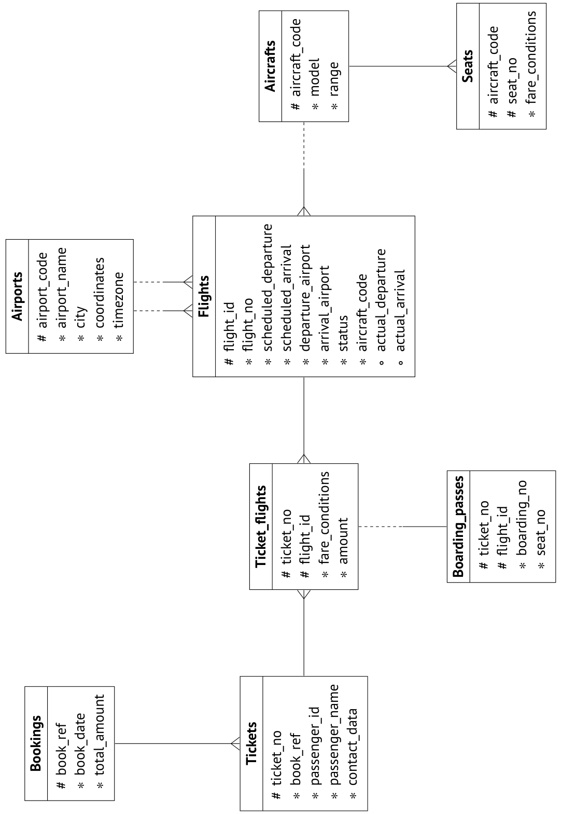
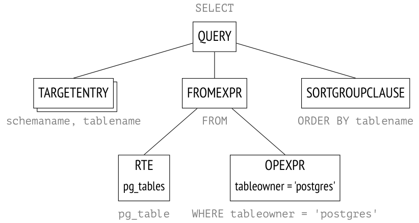
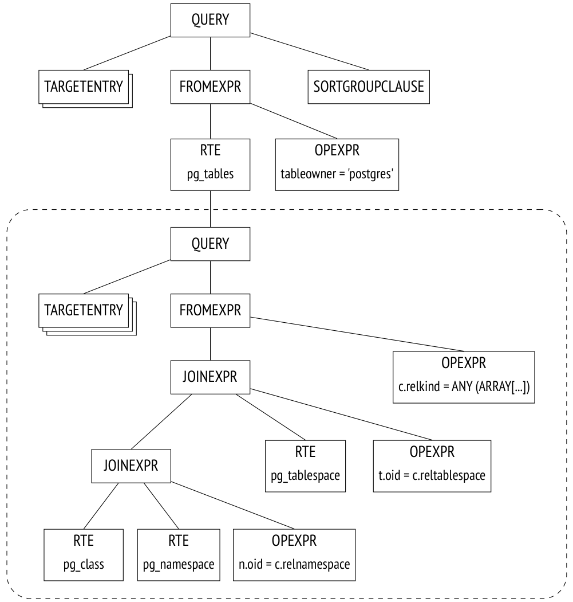
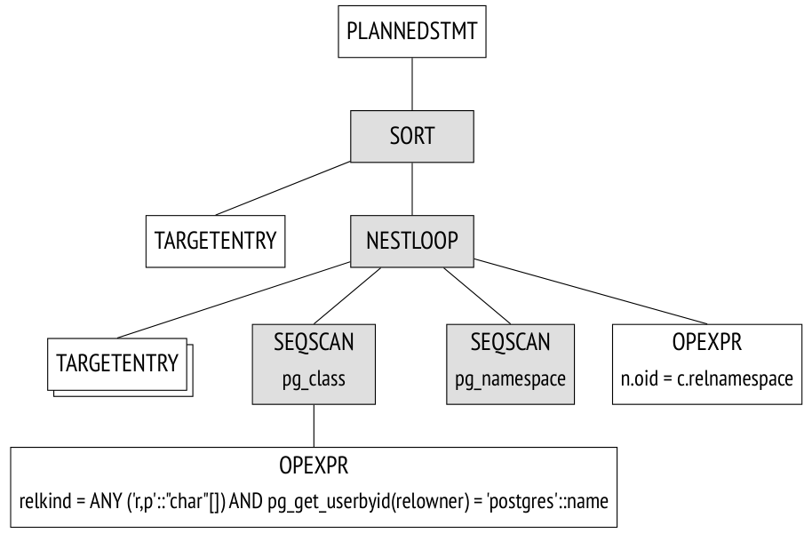
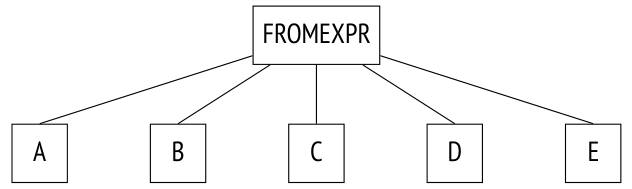
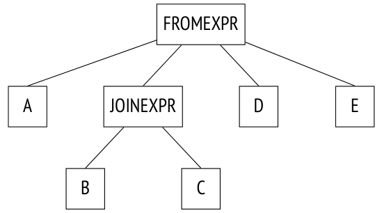
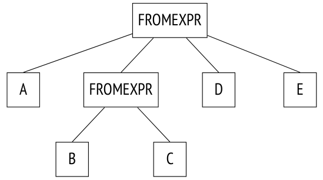
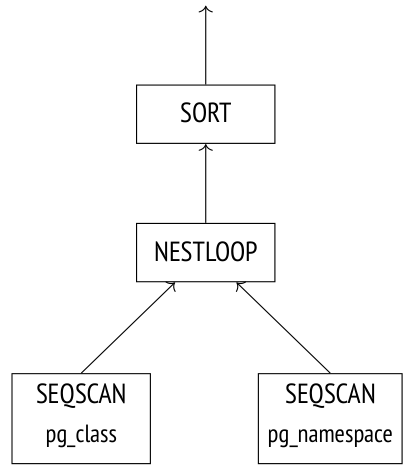

# Chương 16. Các giai đoạn thực thi truy vấn (Query Execution Stages)

## 16.1 Cơ sở dữ liệu demo (Demo Database)

Các ví dụ trong những phần trước của cuốn sách dựa trên các bảng đơn giản chỉ có vài dòng. Phần này và các phần tiếp theo đề cập đến việc thực thi truy vấn, vốn đòi hỏi cao hơn về mặt này: chúng ta cần các bảng có liên quan với nhau và chứa số lượng dòng lớn hơn nhiều. Thay vì tự nghĩ ra một tập dữ liệu mới cho mỗi ví dụ, tôi lấy một cơ sở dữ liệu demo có sẵn mô phỏng hoạt động vận chuyển hành khách bằng đường hàng không ở Nga.[^1] Cơ sở dữ liệu này có một số phiên bản; chúng ta sẽ dùng phiên bản lớn hơn, được tạo ngày 15 tháng 8 năm 2017. Để cài đặt phiên bản này, bạn cần giải nén file chứa bản sao cơ sở dữ liệu từ file lưu trữ[^2] và chạy file này trong `psql`.

Khi xây dựng cơ sở dữ liệu demo này, chúng tôi đã cố gắng làm cho schema của nó đủ đơn giản để có thể hiểu được mà không cần giải thích thêm; đồng thời, chúng tôi muốn nó đủ phức tạp để có thể viết các truy vấn có ý nghĩa. Cơ sở dữ liệu được lấp đầy bằng dữ liệu sát với thực tế, điều này làm cho các ví dụ trở nên đầy đủ hơn và hẳn sẽ thú vị khi làm việc cùng.

Ở đây tôi chỉ điểm qua ngắn gọn các đối tượng chính của cơ sở dữ liệu; nếu bạn muốn xem xét toàn bộ schema, bạn có thể tham khảo bản mô tả đầy đủ của nó được dẫn trong chú thích cuối trang.

Thực thể chính là **booking** (đặt chỗ, ánh xạ tới bảng `bookings`). Một booking có thể bao gồm nhiều hành khách, mỗi người có một **ticket** (vé) điện tử riêng (`tickets`). Hành khách không tạo thành một thực thể riêng; vì mục đích thí nghiệm của chúng ta, ta sẽ giả định rằng mọi hành khách đều là duy nhất.

Mỗi ticket bao gồm một hoặc nhiều **flight segment** (chặng bay, ánh xạ tới bảng `ticket_flights`). Một ticket có thể có nhiều chặng bay trong hai trường hợp: hoặc đó là vé khứ hồi, hoặc vé được xuất cho các chuyến bay nối chuyến. Mặc dù không có ràng buộc tương ứng nào trong schema, tất cả các ticket trong một booking được giả định là có cùng các chặng bay.

Mỗi **flight** (chuyến bay, `flights`) đi từ một **airport** (sân bay, `airports`) đến một sân bay khác. Các chuyến bay có cùng số hiệu chuyến bay có cùng điểm khởi hành và điểm đến nhưng khác ngày khởi hành.

View `routes` dựa trên bảng `flights`; nó hiển thị thông tin về các **route** (tuyến bay) không phụ thuộc vào ngày bay cụ thể.

Khi làm thủ tục check-in, mỗi hành khách được cấp một **boarding pass** (thẻ lên máy bay, `boarding_passes`) có số ghế. Một hành khách chỉ có thể check-in cho một chuyến bay nếu chuyến bay này có trong ticket. Các tổ hợp chuyến bay–ghế phải là duy nhất, vì vậy không thể cấp hai thẻ lên máy bay cho cùng một ghế.

Số lượng **seat** (ghế, `seats`) trên máy bay và cách phân bổ chúng giữa các hạng ghế khác nhau phụ thuộc vào mẫu **aircraft** (máy bay, `aircrafts`) cụ thể thực hiện chuyến bay. Giả định rằng mỗi mẫu máy bay chỉ có thể có một cấu hình khoang hành khách.

Một số bảng có khóa chính nhân tạo (surrogate), trong khi các bảng khác dùng khóa tự nhiên (một số trong đó là khóa ghép). Điều này được làm chỉ nhằm mục đích minh họa và hoàn toàn không phải là một hình mẫu để làm theo.

Có thể coi cơ sở dữ liệu demo như một bản dump của một hệ thống thực: nó chứa một snapshot (ảnh chụp dữ liệu) được lấy tại một thời điểm cụ thể trong quá khứ. Để hiển thị thời điểm này, bạn có thể gọi hàm `bookings.now()`. Hãy dùng hàm này trong các truy vấn demo mà ở ngoài đời thực sẽ cần đến hàm `now()`.

Tên các sân bay, thành phố và mẫu máy bay được lưu trong các bảng `airports_data` và `aircrafts_data`; chúng được cung cấp bằng hai ngôn ngữ, tiếng Anh và tiếng Nga. Để xây dựng các ví dụ cho chương này, tôi thường truy vấn các view `airports` và `aircrafts` được thể hiện trong sơ đồ thực thể–quan hệ; các view này chọn ngôn ngữ đầu ra dựa trên giá trị của tham số *bookings.lang* *(mặc định: en)*. Tuy vậy, tên của một số bảng cơ sở vẫn có thể xuất hiện trong các plan của truy vấn.

## 16.2 Giao thức truy vấn đơn giản (Simple Query Protocol)

Phiên bản đơn giản của giao thức client-server[^3] cho phép thực thi truy vấn SQL: nó gửi văn bản của truy vấn tới server và nhận toàn bộ kết quả thực thi để phản hồi, bất kể kết quả đó chứa bao nhiêu dòng.[^4] Một truy vấn gửi tới server trải qua nhiều giai đoạn: nó được phân tích cú pháp (parse), biến đổi (transform), lập kế hoạch (plan), và sau đó được thực thi (execute).



### Phân tích cú pháp (Parsing)

Trước hết, PostgreSQL phải *phân tích cú pháp* (*parse*)[^5] văn bản truy vấn để hiểu cần thực thi những gì.

**Phân tích từ vựng và cú pháp.** *Lexer* (bộ phân tích từ vựng) tách văn bản truy vấn thành một tập các *lexeme* (từ vị)[^6] (chẳng hạn như từ khóa, hằng chuỗi và hằng số), trong khi *parser* kiểm tra tính hợp lệ của tập này theo ngữ pháp của ngôn ngữ SQL.[^7] PostgreSQL dựa vào các công cụ phân tích cú pháp tiêu chuẩn, cụ thể là các tiện ích `Flex` và `Bison`.

Truy vấn đã được phân tích cú pháp được biểu diễn trong bộ nhớ của backend dưới dạng một cây cú pháp trừu tượng (abstract syntax tree).

Ví dụ, hãy xem truy vấn sau:

```
SELECT schemaname, tablename
FROM pg_tables
WHERE tableowner = 'postgres'
ORDER BY tablename;
```

Lexer tách ra năm từ khóa, năm định danh, một hằng chuỗi và ba lexeme một ký tự (dấu phẩy, dấu bằng và dấu chấm phẩy). Parser dùng các lexeme này để xây dựng parse tree (cây phân tích cú pháp), được thể hiện ở hình minh họa bên dưới dưới dạng rất giản lược. Các chú thích bên cạnh các nút của cây chỉ ra các phần tương ứng của truy vấn:



Từ viết tắt RTE khá khó hiểu là viết tắt của *Range Table Entry*. Mã nguồn PostgreSQL dùng thuật ngữ *range table* để chỉ các bảng, truy vấn con, kết quả join — nói cách khác, bất kỳ *tập dòng* nào có thể được xử lý bởi các toán tử SQL.[^8]

**Phân tích ngữ nghĩa.** Mục đích của *phân tích ngữ nghĩa* (*semantic analysis*)[^9] là xác định xem cơ sở dữ liệu có chứa các bảng hoặc đối tượng khác mà truy vấn này tham chiếu theo tên hay không, và người dùng có quyền truy cập các đối tượng này hay không. Toàn bộ thông tin cần thiết cho phân tích ngữ nghĩa được lưu trong system catalog. *[→ tr. 21](01-introduction.md)*

Sau khi nhận được parse tree, bộ phân tích ngữ nghĩa tiếp tục tái cấu trúc nó, bao gồm việc thêm các tham chiếu tới các đối tượng cơ sở dữ liệu cụ thể, các kiểu dữ liệu và các thông tin khác.

Nếu bạn bật tham số *debug_print_parse*, bạn có thể xem toàn bộ parse tree trong log của server, nhưng việc này ít có ý nghĩa thực tế.

### Biến đổi (Transformation)

Ở giai đoạn tiếp theo, truy vấn có thể được *biến đổi* (*transformed*, hay *viết lại* — *rewritten*).[^10]

Lõi PostgreSQL sử dụng các phép biến đổi cho nhiều mục đích. Một trong số đó là thay thế tên của view trong parse tree bằng cây con tương ứng với truy vấn cơ sở của view này.

Một trường hợp khác sử dụng phép biến đổi là việc hiện thực row-level security (bảo mật mức dòng).[^11]

Các mệnh đề `SEARCH` và `CYCLE` của truy vấn đệ quy cũng được biến đổi trong giai đoạn này.[^12] *(v. 14)*

Trong ví dụ trên, `pg_tables` là một view; nếu ta đặt định nghĩa của nó vào văn bản truy vấn, truy vấn sẽ trông như sau:

```
SELECT schemaname, tablename
FROM (
    -- pg_tables
    SELECT n.nspname AS schemaname,
      c.relname AS tablename,
      pg_get_userbyid(c.relowner) AS tableowner,
      ...
    FROM pg_class c
      LEFT JOIN pg_namespace n ON n.oid = c.relnamespace
      LEFT JOIN pg_tablespace t ON t.oid = c.reltablespace
    WHERE c.relkind = ANY (ARRAY['r'::char, 'p'::char])
)
WHERE tableowner = 'postgres'
ORDER BY tablename;
```

Tuy nhiên, server không xử lý biểu diễn dạng văn bản của truy vấn; mọi thao tác đều được thực hiện trên parse tree. Hình minh họa thể hiện một phiên bản rút gọn của cây sau khi biến đổi (bạn có thể xem phiên bản đầy đủ của nó trong log của server nếu bật tham số *debug_print_rewritten*).

Parse tree phản ánh cấu trúc cú pháp của truy vấn, nhưng nó không cho biết gì về thứ tự mà các thao tác cần được thực hiện.

PostgreSQL cũng hỗ trợ các phép biến đổi tùy biến, mà người dùng có thể hiện thực thông qua *hệ thống quy tắc viết lại* (*rewrite rule system*).[^13]



> Việc hỗ trợ hệ thống quy tắc (rule system) từng được công bố là một trong những mục tiêu chính của quá trình phát triển Postgres;[^14] khi các quy tắc lần đầu được hiện thực, nó vẫn còn là một dự án học thuật, nhưng kể từ đó chúng đã được thiết kế lại nhiều lần. Hệ thống quy tắc là một cơ chế rất mạnh, nhưng khá khó hiểu và khó gỡ lỗi. Thậm chí đã từng có đề xuất loại bỏ hoàn toàn các quy tắc khỏi PostgreSQL, nhưng ý tưởng này không nhận được sự ủng hộ nhất trí. Trong hầu hết các trường hợp, dùng trigger thay cho quy tắc sẽ an toàn và dễ dàng hơn.

### Lập kế hoạch (Planning)

SQL là một ngôn ngữ khai báo: truy vấn chỉ định *dữ liệu nào* cần lấy, chứ không chỉ định lấy *như thế nào*.

Bất kỳ truy vấn nào cũng có nhiều đường thực thi. Mỗi thao tác được thể hiện trong parse tree có thể được hoàn thành theo nhiều cách: ví dụ, kết quả có thể được lấy ra bằng cách đọc toàn bộ bảng (và lọc bỏ những gì dư thừa), hoặc bằng cách tìm các dòng cần thiết qua index scan. Các tập dữ liệu luôn được join theo từng cặp, vì vậy có một số lượng rất lớn các phương án khác nhau về thứ tự join. Bên cạnh đó, có nhiều thuật toán join khác nhau: ví dụ, executor có thể quét các dòng của tập dữ liệu thứ nhất và tìm các dòng khớp trong tập còn lại, hoặc cả hai tập dữ liệu có thể được sắp xếp trước rồi trộn (merge) lại với nhau. Với mỗi thuật toán, ta đều có thể tìm ra một trường hợp sử dụng mà ở đó nó hoạt động tốt hơn các thuật toán khác.

Thời gian thực thi của các plan tối ưu và không tối ưu có thể chênh lệch nhau nhiều bậc độ lớn, vì vậy *planner*[^15] — thành phần *tối ưu hóa* truy vấn đã được phân tích cú pháp — là một trong những thành phần phức tạp nhất của hệ thống.

**Cây plan (plan tree).** Plan thực thi cũng được biểu diễn dưới dạng một cây, nhưng các nút của nó xử lý các thao tác vật lý trên dữ liệu thay vì các thao tác logic.

Nếu bạn muốn khám phá đầy đủ các cây plan, bạn có thể dump chúng vào log của server bằng cách bật tham số *debug_print_plan*. Nhưng trên thực tế, thường chỉ cần xem biểu diễn dạng văn bản của plan được hiển thị bởi lệnh `EXPLAIN` là đủ.[^16]

Hình minh họa sau đây làm nổi bật các nút chính của cây. Chính những nút này được hiển thị trong đầu ra của lệnh `EXPLAIN` bên dưới.

Hiện tại, hãy chú ý đến hai điểm sau:

- Cây chỉ chứa hai trong số ba bảng được truy vấn: planner nhận thấy rằng một trong các bảng không cần thiết để lấy kết quả và đã loại bỏ nó khỏi cây plan.

- Với mỗi nút của cây, planner cung cấp `cost` (chi phí) ước tính và số `rows` (dòng) dự kiến sẽ được xử lý.

```
=> EXPLAIN SELECT schemaname, tablename
FROM pg_tables
WHERE tableowner = 'postgres'
ORDER BY tablename;
                            QUERY PLAN
---------------------------------------------------------------------
 Sort  (cost=21.03..21.04 rows=1 width=128)
   Sort Key: c.relname
   -> Nested Loop Left Join (cost=0.00..21.02 rows=1 width=128)
       Join Filter: (n.oid = c.relnamespace)
       -> Seq Scan on pg_class c (cost=0.00..19.93 rows=1 width=72)
           Filter: ((relkind = ANY ('{r,p}'::"char"[])) AND (pg_g...
       -> Seq Scan on pg_namespace n (cost=0.00..1.04 rows=4 wid...
(7 rows)
```

Các nút `Seq Scan` hiển thị trong plan của truy vấn tương ứng với việc đọc bảng, *[→ tr. 296](18-table-access-methods.md)* còn nút `Nested` `Loop` biểu diễn thao tác join. *[→ tr. 351](21-nested-loop.md)*



**Tìm kiếm plan.** PostgreSQL sử dụng một *cost-based optimizer* (bộ tối ưu hóa dựa trên chi phí);[^17] nó duyệt qua các plan tiềm năng và ước tính tài nguyên cần thiết để thực thi chúng (chẳng hạn như các thao tác I/O hay chu kỳ CPU). Khi được chuẩn hóa thành một giá trị số, ước tính này được gọi là *cost* (chi phí) của plan. Trong tất cả các plan được xem xét, plan có cost thấp nhất sẽ được chọn.

Vấn đề là số lượng plan có thể có tăng theo hàm mũ với số lượng bảng được join, vì vậy không thể xem xét hết tất cả — ngay cả với các truy vấn tương đối đơn giản. Việc tìm kiếm thường được thu hẹp bằng thuật toán quy hoạch động kết hợp với một số heuristic. Điều này cho phép planner tìm ra lời giải chính xác về mặt toán học cho các truy vấn có số lượng bảng lớn hơn trong thời gian chấp nhận được.

> Một lời giải chính xác không đảm bảo rằng plan được chọn *thực sự* là plan tối ưu, vì planner sử dụng các mô hình toán học đơn giản hóa và có thể thiếu dữ liệu đầu vào đáng tin cậy.

**Quản lý thứ tự join.** Một truy vấn có thể được cấu trúc theo cách giới hạn phạm vi tìm kiếm ở một mức độ nào đó (với rủi ro bỏ lỡ plan tối ưu).

- Common table expression (CTE) và truy vấn chính có thể được tối ưu hóa riêng biệt; để đảm bảo hành vi như vậy, bạn có thể chỉ định mệnh đề `MATERIALIZED`.[^18] *(v. 12)*

- Các truy vấn con chạy bên trong các hàm không phải SQL luôn được tối ưu hóa riêng biệt. (Các hàm SQL đôi khi có thể được nhúng inline vào truy vấn chính.[^19])

- Nếu bạn đặt tham số *join_collapse_limit* và dùng các mệnh đề `JOIN` tường minh trong truy vấn, thứ tự của một số join sẽ được xác định bởi cấu trúc cú pháp của truy vấn; tham số *from_collapse_limit* có tác dụng tương tự đối với các truy vấn con.[^20]

Điểm cuối cùng có lẽ cần được giải thích. Hãy xem một truy vấn không chỉ định bất kỳ join tường minh nào cho các bảng được liệt kê trong mệnh đề `FROM`:

```
SELECT ...
FROM a, b, c, d, e
WHERE ...
```

Ở đây planner sẽ phải xem xét tất cả các cặp join có thể có. Truy vấn được biểu diễn bởi phần sau của parse tree (thể hiện dưới dạng sơ đồ):



Trong ví dụ tiếp theo, các join có một cấu trúc nhất định được xác định bởi mệnh đề `JOIN`:

```
SELECT ...
FROM a, b JOIN c ON ..., d, e
WHERE ...
```

Parse tree phản ánh cấu trúc này:



Planner thường làm phẳng cây join, để nó trông giống như cây trong ví dụ đầu tiên. Thuật toán duyệt đệ quy cây và thay thế mỗi nút `JOINEXPR` bằng một danh sách phẳng các phần tử của nó.[^21]

Tuy nhiên, việc thu gọn như vậy chỉ được thực hiện nếu danh sách phẳng thu được có không quá *join_collapse_limit* phần tử *(mặc định: 8)*. Trong trường hợp cụ thể này, nút `JOINEXPR` sẽ không bị thu gọn nếu giá trị *join_collapse_limit* nhỏ hơn năm.

Đối với planner, điều này có nghĩa là:

- Bảng `B` phải được join với bảng `C` (hoặc ngược lại, `C` phải được join với `B`; thứ tự join bên trong một cặp không bị giới hạn).

- Các bảng `A`, `D`, `E` và kết quả join của `B` và `C` có thể được join theo bất kỳ thứ tự nào.

Nếu tham số *join_collapse_limit* được đặt bằng một, thứ tự được xác định bởi các mệnh đề `JOIN` tường minh sẽ được giữ nguyên.

Còn đối với các toán hạng của `FULL OUTER JOIN`, chúng *không bao giờ* bị thu gọn, bất kể giá trị của tham số *join_collapse_limit*.

Tham số *from_collapse_limit* *(mặc định: 8)* kiểm soát việc làm phẳng truy vấn con theo cách tương tự. Mặc dù các truy vấn con trông không giống mệnh đề `JOIN`, sự tương đồng trở nên rõ ràng ở cấp độ parse tree.

Đây là một truy vấn mẫu:

```
SELECT ...
FROM a,
  (
    SELECT ... FROM b, c WHERE ...
  ) bc,
  d, e
WHERE ...
```

Cây join tương ứng được thể hiện bên dưới. Điểm khác biệt duy nhất ở đây là cây này chứa nút `FROMEXPR` thay vì `JOINEXPR` (từ đó mà có tên của tham số).



**Tối ưu hóa truy vấn bằng thuật toán di truyền (Genetic query optimization).** Sau khi được làm phẳng, cây có thể chứa quá nhiều phần tử ở cùng một cấp — hoặc là bảng, hoặc là kết quả join, những phần tử phải được tối ưu hóa riêng biệt. Thời gian lập kế hoạch phụ thuộc theo hàm mũ vào số lượng tập dữ liệu cần được join, vì vậy nó có thể tăng vượt quá mọi giới hạn hợp lý.

Nếu tham số *geqo* được bật và số lượng phần tử ở một cấp vượt quá giá trị *geqo_threshold* *(mặc định: on 12)*, planner sẽ sử dụng *thuật toán di truyền* (*genetic algorithm*) để tối ưu hóa truy vấn.[^22] Thuật toán này nhanh hơn nhiều so với thuật toán quy hoạch động tương ứng, nhưng không thể đảm bảo rằng plan tìm được sẽ là tối ưu. Vì vậy, nguyên tắc chung là tránh dùng thuật toán di truyền bằng cách giảm số lượng phần tử cần được tối ưu hóa.

Thuật toán di truyền có một số tham số cấu hình được,[^23] nhưng tôi sẽ không đề cập đến chúng ở đây.

**Chọn plan tốt nhất.** Một plan có thể được coi là tối ưu hay không phụ thuộc vào việc một client cụ thể sẽ sử dụng kết quả truy vấn như thế nào. Nếu client cần toàn bộ kết quả cùng lúc (ví dụ, để tạo báo cáo), plan nên tối ưu hóa việc lấy ra tất cả các dòng. Nhưng nếu ưu tiên là trả về những dòng đầu tiên càng sớm càng tốt (ví dụ, để hiển thị chúng lên màn hình), plan tối ưu có thể hoàn toàn khác.

Để đưa ra lựa chọn này, PostgreSQL tính toán hai thành phần của cost:

```
=> EXPLAIN
SELECT schemaname, tablename
FROM pg_tables
WHERE tableowner = 'postgres'
ORDER BY tablename;
```

```
                            QUERY PLAN
---------------------------------------------------------------------
 Sort  (cost=21.03..21.04 rows=1 width=128)
   Sort Key: c.relname
   -> Nested Loop Left Join (cost=0.00..21.02 rows=1 width=128)
       Join Filter: (n.oid = c.relnamespace)
       -> Seq Scan on pg_class c (cost=0.00..19.93 rows=1 width=72)
           Filter: ((relkind = ANY ('{r,p}'::"char"[])) AND (pg_g...
       -> Seq Scan on pg_namespace n (cost=0.00..1.04 rows=4 wid...
(7 rows)
```

Thành phần thứ nhất (startup cost — chi phí khởi động) thể hiện cái giá bạn phải trả để chuẩn bị cho việc thực thi nút, còn thành phần thứ hai (total cost — tổng chi phí) bao gồm toàn bộ chi phí phát sinh để lấy ra kết quả.

> Đôi khi người ta cho rằng startup cost là chi phí để lấy ra dòng đầu tiên của tập kết quả, nhưng điều đó không hoàn toàn chính xác.

Để chọn ra các plan được ưu tiên, optimizer kiểm tra xem truy vấn có sử dụng cursor hay không (hoặc thông qua lệnh `DECLARE` trong SQL, hoặc được khai báo *tường minh* trong PL/pgSQL).[^24] Nếu không, client được giả định là cần toàn bộ kết quả cùng lúc, và optimizer chọn plan có total cost nhỏ nhất.

Nếu truy vấn được thực thi với một cursor, plan được chọn phải tối ưu hóa việc lấy ra chỉ *cursor_tuple_fraction* *(mặc định: 0.1)* của tất cả các dòng. Chính xác hơn, PostgreSQL chọn plan có giá trị nhỏ nhất của biểu thức sau:[^25]

startup cost + *cursor_tuple_fraction* (total cost - startup cost)

**Sơ lược về ước tính cost.** Để ước tính tổng cost của một plan, ta phải có ước tính cost cho tất cả các nút của nó. Cost của một nút phụ thuộc vào loại của nó (hiển nhiên là cost đọc dữ liệu heap không giống với cost sắp xếp) và vào lượng dữ liệu được nút này xử lý (khối lượng dữ liệu lớn hơn thường gây ra cost cao hơn). Trong khi loại nút đã được biết, lượng dữ liệu chỉ có thể được dự đoán dựa trên *cardinality* (lực lượng) ước tính của các tập đầu vào (số dòng mà nút nhận làm đầu vào) và *selectivity* (độ chọn lọc) của nút (tỷ lệ các dòng còn lại ở đầu ra). Các tính toán này dựa trên *statistics* (thống kê) đã thu thập, chẳng hạn như kích thước bảng và phân phối dữ liệu trong các cột của bảng. *[→ tr. 271](17-statistics.md)*

Do đó, việc tối ưu hóa được thực hiện phụ thuộc vào tính đúng đắn của dữ liệu thống kê được thu thập và cập nhật bởi autovacuum.

Nếu việc ước tính cardinality chính xác cho từng nút, cost tính toán được có khả năng phản ánh thỏa đáng cost thực tế. Các sai sót chính trong lập kế hoạch thường xuất phát từ việc ước tính sai cardinality và selectivity, có thể do statistics không chính xác hoặc lỗi thời, do không thể sử dụng statistics, hoặc — ở mức độ ít hơn — do các mô hình lập kế hoạch chưa hoàn hảo.

**Ước tính cardinality.** Để tính cardinality của một nút, planner phải thực hiện đệ quy các bước sau:

1 Ước tính cardinality của mỗi nút con và đánh giá số dòng đầu vào mà nút sẽ nhận được từ chúng.

2 Ước tính selectivity của nút, tức là tỷ lệ các dòng đầu vào sẽ còn lại ở đầu ra.

Cardinality của nút là tích của hai giá trị này.

> Selectivity được biểu diễn bằng một số từ 0 đến 1. Số càng nhỏ thì selectivity càng cao, và ngược lại, một số gần với một biểu thị selectivity thấp. Điều này có vẻ phi logic, nhưng ý tưởng là một điều kiện có *selectivity cao* (*highly selective*) loại bỏ gần như tất cả các dòng, còn điều kiện chỉ loại bỏ một vài dòng thì có *selectivity thấp*.

Trước hết, planner ước tính cardinality của các nút lá, là các nút xác định phương thức truy cập dữ liệu. Các tính toán này dựa trên statistics đã thu thập, chẳng hạn như tổng kích thước của bảng.

Selectivity của các điều kiện lọc phụ thuộc vào loại của chúng. Trong trường hợp tầm thường nhất, nó có thể được giả định là một giá trị hằng, mặc dù planner cố gắng dùng mọi thông tin có sẵn để tinh chỉnh ước tính. Nói chung, chỉ cần biết cách ước tính các điều kiện lọc đơn giản là đủ; nếu một điều kiện bao gồm các phép toán logic, selectivity của nó được tính theo các công thức sau:[^26]

sel(*x* and *y*) = sel(*x*) sel(*y*)

sel(*x* or *y*) = 1 − (1 − sel(*x*))(1 − sel(*y*)) = sel(*x*) + sel(*y*) − sel(*x*) sel(*y*)

Đáng tiếc là các công thức này giả định rằng các vị từ *x* và *y* không phụ thuộc vào nhau. *[→ tr. 288](17-statistics.md)* Với các vị từ có tương quan, những ước tính như vậy sẽ không chính xác.

Để ước tính cardinality của join, planner phải lấy cardinality của tích Descartes (tức là tích các cardinality của hai tập dữ liệu) và ước tính selectivity của các điều kiện join, vốn cũng phụ thuộc vào loại điều kiện.

Cardinality của các nút khác (chẳng hạn như sắp xếp hay tổng hợp) được ước tính theo cách tương tự.

Điều quan trọng cần lưu ý là việc ước tính sai cardinality ở các nút plan cấp thấp hơn sẽ ảnh hưởng đến mọi tính toán tiếp theo, dẫn đến ước tính tổng cost không chính xác và lựa chọn plan kém. Tệ hơn nữa, planner không có statistics về kết quả join, mà chỉ có statistics về các bảng.

**Ước tính cost.** Quá trình ước tính cost cũng mang tính đệ quy. Để tính cost của một cây con, cần tính và cộng dồn cost của tất cả các nút con của nó, sau đó cộng thêm cost của chính nút cha.

Để ước tính cost của một nút, PostgreSQL áp dụng mô hình toán học của thao tác được nút này thực hiện, sử dụng cardinality của nút đã được ước tính làm đầu vào. Với mỗi nút, cả startup cost và total cost đều được tính.

Một số thao tác không có điều kiện tiên quyết nào, vì vậy việc thực thi chúng bắt đầu ngay lập tức; các nút như vậy có startup cost bằng không.

Ngược lại, các thao tác khác cần chờ một số hành động chuẩn bị hoàn tất. Ví dụ, một nút sort thường phải chờ *toàn bộ* dữ liệu từ các nút con của nó trước khi có thể tiến hành công việc của mình. Startup cost của các nút như vậy thường lớn hơn không: cái giá này phải được trả ngay cả khi nút ở trên (hoặc client) chỉ cần một dòng của toàn bộ đầu ra.

Mọi tính toán do planner thực hiện chỉ đơn thuần là các ước tính, có thể chẳng liên quan gì đến thời gian thực thi thực tế. Mục đích duy nhất của chúng là cho phép so sánh các plan khác nhau cho *cùng một* truy vấn trong *cùng* các điều kiện. Trong các trường hợp khác, việc so sánh các truy vấn (đặc biệt là các truy vấn khác nhau) theo cost của chúng là vô nghĩa. Ví dụ, cost có thể đã bị ước tính thấp hơn thực tế do statistics lỗi thời; khi statistics được làm mới, con số tính được có thể tăng lên, nhưng vì ước tính trở nên chính xác hơn, server sẽ chọn được plan tốt hơn.

### Thực thi (Execution)

Plan được xây dựng trong quá trình tối ưu hóa truy vấn giờ đây cần được *thực thi*.[^27]

Executor mở một *portal* trong bộ nhớ của backend;[^28] đó là một đối tượng lưu giữ trạng thái của truy vấn đang được thực thi. Trạng thái này được biểu diễn dưới dạng một cây lặp lại cấu trúc của cây plan. Các nút của cây này hoạt động giống như một dây chuyền lắp ráp, yêu cầu và gửi các dòng qua lại cho nhau.



Việc thực thi truy vấn bắt đầu từ gốc. Nút gốc (biểu diễn thao tác `SORT` trong ví dụ này) kéo dữ liệu từ nút con của nó. Sau khi nhận được tất cả các dòng, nó sắp xếp chúng và chuyển chúng cho client.

Một số nút (như nút `NESTLOOP` được thể hiện trong hình minh họa này) join các tập dữ liệu nhận được từ các nguồn khác nhau. Một nút như vậy kéo dữ liệu từ hai nút con, và khi nhận được một cặp dòng thỏa mãn điều kiện join, nó chuyển ngay dòng kết quả lên trên (không giống như sắp xếp, vốn phải nhận được *tất cả* các dòng trước). Tại thời điểm này, việc thực thi của nút bị tạm dừng cho đến khi nút cha của nó yêu cầu dòng tiếp theo. Nếu chỉ cần một phần kết quả (ví dụ, có mệnh đề `LIMIT` trong truy vấn), thao tác sẽ không được thực hiện đầy đủ.

Hai nút lá `SEQSCAN` của cây chịu trách nhiệm quét bảng. Khi nút cha yêu cầu dữ liệu từ các nút này, chúng lấy dòng tiếp theo từ bảng tương ứng.

Như vậy, một số nút không lưu trữ dòng nào, chuyển chúng lên trên ngay lập tức, nhưng các nút khác (chẳng hạn như `SORT`) phải giữ khối lượng dữ liệu có thể rất lớn. Với mục đích này, một vùng nhớ kích thước *work_mem* *(mặc định: 4MB)* được cấp phát trong bộ nhớ của backend; nếu không đủ, phần dữ liệu còn lại sẽ được đẩy ra các file tạm trên đĩa.[^29]

Một plan có thể có nhiều nút cần nơi lưu trữ dữ liệu, vì vậy PostgreSQL có thể cấp phát nhiều vùng nhớ, mỗi vùng có kích thước *work_mem*. Tổng dung lượng RAM mà một truy vấn có thể sử dụng không bị giới hạn theo bất kỳ cách nào.

## 16.3 Giao thức truy vấn mở rộng (Extended Query Protocol)

Khi sử dụng giao thức truy vấn đơn giản, mỗi lệnh (ngay cả khi nó được lặp lại nhiều lần) đều phải trải qua tất cả các giai đoạn đã nêu ở trên:

1 phân tích cú pháp

2 biến đổi

3 lập kế hoạch

4 thực thi

Tuy nhiên, chẳng có lý do gì để phân tích cú pháp cùng một truy vấn lặp đi lặp lại. Việc phân tích cú pháp lặp lại các truy vấn chỉ khác nhau ở hằng số cũng không có nhiều ý nghĩa — cấu trúc parse tree vẫn giữ nguyên.

Một nhược điểm khác của giao thức truy vấn đơn giản là client nhận toàn bộ kết quả cùng lúc, bất kể kết quả có thể chứa bao nhiêu dòng.

Nói chung, có thể khắc phục những hạn chế này bằng các lệnh SQL. Để xử lý hạn chế thứ nhất, bạn có thể `PREPARE` truy vấn trước khi chạy lệnh `EXECUTE`; vấn đề thứ hai có thể được giải quyết bằng cách tạo một cursor với `DECLARE` và trả về các dòng qua `FETCH`. Nhưng trong trường hợp này, việc đặt tên cho các đối tượng mới được tạo phải do client xử lý, còn server phải gánh thêm chi phí phụ trội để phân tích cú pháp các lệnh bổ sung.

Giao thức client-server mở rộng cung cấp một giải pháp thay thế, cho phép kiểm soát chính xác các giai đoạn thực thi riêng biệt của toán tử ở cấp độ lệnh của chính giao thức.

### Chuẩn bị (Preparation)

Trong giai đoạn *chuẩn bị* (*preparation*), truy vấn được phân tích cú pháp và biến đổi như thường lệ, nhưng parse tree thu được được giữ lại trong bộ nhớ của backend.

PostgreSQL không có bộ đệm (cache) toàn cục cho các truy vấn. Nhược điểm của kiến trúc này là hiển nhiên: mỗi backend phải phân tích cú pháp tất cả các truy vấn đến, ngay cả khi cùng một truy vấn đó đã được một backend khác phân tích cú pháp. Nhưng cũng có một số lợi ích. Cache toàn cục có thể dễ dàng trở thành nút thắt cổ chai vì các lock. *[→ tr. 240](15-locks-on-memory-structures.md)* Một client chạy nhiều truy vấn nhỏ nhưng khác nhau (như các truy vấn chỉ khác nhau ở hằng số) tạo ra nhiều lưu lượng và có thể ảnh hưởng tiêu cực đến hiệu năng của toàn bộ instance. Trong PostgreSQL, các truy vấn được phân tích cú pháp cục bộ, vì vậy không có ảnh hưởng gì đến các tiến trình khác.

Một truy vấn đã được chuẩn bị có thể được tham số hóa. Đây là một ví dụ đơn giản dùng các lệnh SQL (mặc dù điều này không giống với việc chuẩn bị ở cấp giao thức, hiệu quả cuối cùng là như nhau):

```
=> PREPARE plane(text) AS
SELECT * FROM aircrafts WHERE aircraft_code = $1;
```

Tất cả các prepared statement có tên đều được hiển thị trong view `pg_prepared_statements`:

```
=> SELECT name, statement, parameter_types
FROM pg_prepared_statements \gx
-[ RECORD 1 ]---+--------------------------------------------------
name            | plane
statement       | PREPARE plane(text) AS                          +
                | SELECT * FROM aircrafts WHERE aircraft_code = $1;
parameter_types | {text}
```

Bạn sẽ không tìm thấy bất kỳ statement không tên nào ở đây (những statement sử dụng giao thức truy vấn mở rộng hoặc PL/pgSQL). Các statement được chuẩn bị bởi các backend khác cũng không được hiển thị: không thể truy cập bộ nhớ của phiên làm việc khác.

### Gắn tham số (Parameter Binding)

Trước khi một prepared statement được thực thi, các giá trị tham số thực tế phải được gắn (bind) vào.

```
=> EXECUTE plane('733');
 aircraft_code |     model     | range
---------------+----------------+-------
 733           | Boeing 737-300 | 4200
(1 row)
```

Ưu điểm của việc gắn tham số trong prepared statement so với việc nối các hằng vào chuỗi truy vấn là nó khiến SQL injection hoàn toàn không thể xảy ra: một giá trị tham số đã được gắn không thể sửa đổi parse tree đã được xây dựng theo bất kỳ cách nào. Để đạt được cùng mức độ an toàn mà không dùng prepared statement, bạn sẽ phải escape cẩn thận từng giá trị nhận được từ một nguồn không đáng tin cậy.

### Lập kế hoạch và thực thi (Planning and Execution)

Khi thực thi prepared statement, việc lập kế hoạch truy vấn được thực hiện dựa trên các giá trị tham số thực tế; sau đó plan được chuyển cho executor.

Các giá trị tham số khác nhau có thể dẫn đến các plan tối ưu khác nhau, vì vậy điều quan trọng là phải tính đến các giá trị chính xác. Ví dụ, khi tìm các booking đắt tiền, planner giả định rằng không có nhiều dòng khớp và sử dụng index scan:

```
=> CREATE INDEX ON bookings(total_amount);
=> EXPLAIN SELECT *
FROM bookings
WHERE total_amount > 1000000;
                            QUERY PLAN
---------------------------------------------------------------------
 Bitmap Heap Scan on bookings (cost=86.49..9245.82 rows=4395 wid...
   Recheck Cond: (total_amount > '1000000'::numeric)
   -> Bitmap Index Scan on bookings_total_amount_idx (cost=0.00....
       Index Cond: (total_amount > '1000000'::numeric)
(4 rows)
```

Nhưng nếu điều kiện được cung cấp được thỏa mãn bởi tất cả các booking, việc dùng index là vô ích, vì toàn bộ bảng phải được quét:

```
=> EXPLAIN SELECT *
FROM bookings
WHERE total_amount > 100;
                           QUERY PLAN
-------------------------------------------------------------------
 Seq Scan on bookings  (cost=0.00..39835.88 rows=2111110 width=21)
   Filter: (total_amount > '100'::numeric)
(2 rows)
```

Trong một số trường hợp, planner có thể giữ lại cả parse tree lẫn plan của truy vấn để tránh phải lập kế hoạch lặp lại. Một plan như vậy không tính đến các giá trị tham số, vì vậy nó được gọi là *generic plan* (plan chung) (so với các *custom plan* (plan tùy biến) dựa trên các giá trị thực tế).[^30]

Một trường hợp hiển nhiên mà server có thể dùng generic plan mà không làm giảm hiệu năng là truy vấn không có tham số.

Năm lần tối ưu hóa đầu tiên của các prepared statement có tham số luôn dựa trên các giá trị tham số thực tế; planner tính cost trung bình của các custom plan dựa trên các giá trị này. Bắt đầu từ lần thực thi thứ sáu, nếu generic plan hóa ra hiệu quả hơn các custom plan tính trung bình (có tính đến việc custom plan phải được xây dựng lại mỗi lần),[^31] planner giữ lại generic plan và tiếp tục sử dụng nó, bỏ qua giai đoạn tối ưu hóa.

Prepared statement `plane` đã được thực thi một lần. Sau ba lần thực thi tiếp theo, server vẫn sử dụng custom plan — bạn có thể nhận biết qua giá trị tham số trong plan của truy vấn:

```
=> EXECUTE plane('763');
=> EXECUTE plane('773');
=> EXPLAIN EXECUTE plane('319');
                           QUERY PLAN
------------------------------------------------------------------
 Seq Scan on aircrafts_data ml (cost=0.00..1.39 rows=1 width=52)
   Filter: ((aircraft_code)::text = '319'::text)
(2 rows)
```

Sau lần thực thi thứ năm, planner chuyển sang generic plan: nó không khác gì các custom plan và có cùng cost, nhưng backend có thể xây dựng nó một lần và bỏ qua giai đoạn tối ưu hóa, nhờ đó giảm chi phí phụ trội của việc lập kế hoạch. Lệnh `EXPLAIN` giờ đây cho thấy tham số được tham chiếu theo vị trí thay vì theo giá trị:

```
=> EXECUTE plane('320');
=> EXPLAIN EXECUTE plane('321');
                           QUERY PLAN
------------------------------------------------------------------
 Seq Scan on aircrafts_data ml (cost=0.00..1.39 rows=1 width=52)
   Filter: ((aircraft_code)::text = $1)
(2 rows)
```

Ta có thể dễ dàng hình dung một diễn biến không may khi vài custom plan đầu tiên đắt hơn generic plan; các plan tiếp theo lẽ ra có thể hiệu quả hơn, nhưng planner sẽ hoàn toàn không xem xét chúng. Bên cạnh đó, planner so sánh các *ước tính* chứ không phải cost thực tế, điều này cũng có thể dẫn đến tính toán sai.

Tuy nhiên, nếu planner mắc sai lầm, bạn có thể ghi đè quyết định tự động và chọn generic plan hoặc custom plan bằng cách đặt tham số *plan_cache_mode* *(mặc định: auto)* cho phù hợp: *(v. 12)*

```
=> SET plan_cache_mode = 'force_custom_plan';
=> EXPLAIN EXECUTE plane('CN1');
                           QUERY PLAN
------------------------------------------------------------------
 Seq Scan on aircrafts_data ml (cost=0.00..1.39 rows=1 width=52)
   Filter: ((aircraft_code)::text = 'CN1'::text)
(2 rows)
```

Ngoài những thông tin khác, view `pg_prepared_statements` còn hiển thị thống kê về các plan đã được chọn: *(v. 14)*

```
=> SELECT name, generic_plans, custom_plans
FROM pg_prepared_statements;
 name  | generic_plans | custom_plans
-------+---------------+--------------
 plane |             1 |           6
(1 row)
```

### Lấy kết quả (Getting the Results)

Giao thức truy vấn mở rộng cho phép lấy dữ liệu theo từng lô (batch) thay vì lấy tất cả cùng lúc. Cursor SQL có tác dụng gần như tương tự (ngoại trừ việc server phải làm thêm một số công việc, và planner tối ưu hóa việc lấy *cursor_tuple_fraction* dòng đầu tiên chứ không phải toàn bộ tập kết quả):

```
=> BEGIN;
=> DECLARE cur CURSOR FOR
  SELECT *
  FROM aircrafts
  ORDER BY aircraft_code;
=> FETCH 3 FROM cur;
 aircraft_code |      model     | range
---------------+-----------------+-------
 319           | Airbus A319-100 | 6700
 320           | Airbus A320-200 | 5700
 321           | Airbus A321-200 | 5600
(3 rows)
=> FETCH 2 FROM cur;
 aircraft_code |     model     | range
---------------+----------------+-------
 733           | Boeing 737-300 | 4200
 763           | Boeing 767-300 | 7900
(2 rows)
=> COMMIT;
```

Nếu truy vấn trả về nhiều dòng và client cần tất cả, thông lượng của hệ thống phụ thuộc rất nhiều vào kích thước lô. Càng nhiều dòng trong một lô, chi phí phụ trội cho việc giao tiếp khi truy cập server và nhận phản hồi càng ít. Nhưng khi kích thước lô tăng lên, những lợi ích này trở nên ít rõ rệt hơn: trong khi sự khác biệt giữa việc lấy từng dòng một và lấy theo lô mười dòng có thể là rất lớn, thì nó ít đáng kể hơn nhiều nếu bạn so sánh các lô 100 và 1000 dòng.

[^1]: postgrespro.com/community/demodb
[^2]: edu.postgrespro.com/demo-big-en-20170815.zip
[^3]: postgresql.org/docs/14/protocol.html
[^4]: backend/tcop/postgres.c, hàm exec_simple_query
[^5]: postgresql.org/docs/14/parser-stage.html  
backend/parser/README
[^6]: backend/parser/scan.l
[^7]: backend/parser/gram.y
[^8]: include/nodes/parsenodes.h
[^9]: backend/parser/analyze.c
[^10]: postgresql.org/docs/14/rule-system.html
[^11]: backend/rewrite/rowsecurity.c
[^12]: backend/rewrite/rewriteSearchCycle.c
[^13]: postgresql.org/docs/14/rules.html
[^14]: M. Stonebraker, L. A. Rowe. The Design of Postgres
[^15]: postgresql.org/docs/14/planner-optimizer.html
[^16]: postgresql.org/docs/14/using-explain.html
[^17]: backend/optimizer/README
[^18]: postgresql.org/docs/14/queries-with.html
[^19]: wiki.postgresql.org/wiki/Inlining_of_SQL_functions
[^20]: postgresql.org/docs/14/explicit-joins.html
[^21]: backend/optimizer/plan/initsplan.c, hàm deconstruct_jointree
[^22]: postgresql.org/docs/14/geqo.html  
backend/optimizer/geqo/geqo_main.c
[^23]: postgresql.org/docs/14/runtime-config-query.html#RUNTIME-CONFIG-QUERY-GEQO
[^24]: backend/optimizer/plan/planner.c, hàm standard_planner
[^25]: backend/optimizer/util/pathnode.c, hàm compare_fractional_path_costs
[^26]: backend/optimizer/path/clausesel.c, các hàm clauselist_selectivity_ext & clauselist_selectivity_or
[^27]: postgresql.org/docs/14/executor.html  
backend/executor/README
[^28]: backend/utils/mmgr/portalmem.c
[^29]: backend/utils/sort/tuplestore.c
[^30]: backend/utils/cache/plancache.c, hàm choose_custom_plan
[^31]: backend/utils/cache/plancache.c, hàm cached_plan_cost
